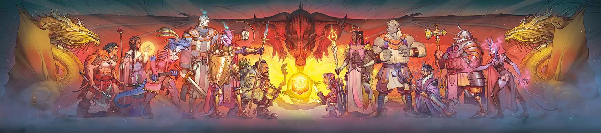

# DM Screen

### Cover

### Conditions

<table class="rd__b-special rd__b-data  rd__b-data--stats">
		<thead>
			<tr>
				<th class="rd__data-embed-header ve-text-left" colspan="6" data-rd-data-embed-header="true">
					

						

							Blinded
							
						

						[–]
					

				</th>
			</tr>
		</thead><tbody class="" data-rd-embedded-data-render-target="true"><tr>
			<td colspan="6" data-rd-tag="condition" data-rd-uid="Blinded|XPHB" data-rd-page="conditionsdiseases.html" data-rd-source="XPHB" data-rd-hash="blinded_xphb" data-rd-name="Blinded" data-rd-display-name="Blinded" data-rd-style="" data-rd-entry-data="{}">
				<i>Loading <a href="conditionsdiseases.html#blinded_xphb"  onmouseover="Renderer.hover.pHandleLinkMouseOver(event, this)" onmouseleave="Renderer.hover.handleLinkMouseLeave(event, this)" onmousemove="Renderer.hover.handleLinkMouseMove(event, this)" onclick="Renderer.hover.handleLinkClick(event, this)" onwheel="Renderer.hover.handleLinkWheel(event, this)" ondragstart="Renderer.hover.handleLinkDragStart(event, this)" data-vet-page="conditionsdiseases.html" data-vet-source="XPHB" data-vet-hash="blinded_xphb" ontouchstart="Renderer.hover.handleTouchStart(event, this)" >Blinded</a>...</i>
				
			</td>
		</tr></tbody></table><table class="rd__b-special rd__b-data  rd__b-data--stats">
		<thead>
			<tr>
				<th class="rd__data-embed-header ve-text-left" colspan="6" data-rd-data-embed-header="true">
					

						

							Charmed
							
						

						[–]
					

				</th>
			</tr>
		</thead><tbody class="" data-rd-embedded-data-render-target="true"><tr>
			<td colspan="6" data-rd-tag="condition" data-rd-uid="Charmed|XPHB" data-rd-page="conditionsdiseases.html" data-rd-source="XPHB" data-rd-hash="charmed_xphb" data-rd-name="Charmed" data-rd-display-name="Charmed" data-rd-style="" data-rd-entry-data="{}">
				<i>Loading <a href="conditionsdiseases.html#charmed_xphb"  onmouseover="Renderer.hover.pHandleLinkMouseOver(event, this)" onmouseleave="Renderer.hover.handleLinkMouseLeave(event, this)" onmousemove="Renderer.hover.handleLinkMouseMove(event, this)" onclick="Renderer.hover.handleLinkClick(event, this)" onwheel="Renderer.hover.handleLinkWheel(event, this)" ondragstart="Renderer.hover.handleLinkDragStart(event, this)" data-vet-page="conditionsdiseases.html" data-vet-source="XPHB" data-vet-hash="charmed_xphb" ontouchstart="Renderer.hover.handleTouchStart(event, this)" >Charmed</a>...</i>
				
			</td>
		</tr></tbody></table><table class="rd__b-special rd__b-data  rd__b-data--stats">
		<thead>
			<tr>
				<th class="rd__data-embed-header ve-text-left" colspan="6" data-rd-data-embed-header="true">
					

						

							Deafened
							
						

						[–]
					

				</th>
			</tr>
		</thead><tbody class="" data-rd-embedded-data-render-target="true"><tr>
			<td colspan="6" data-rd-tag="condition" data-rd-uid="Deafened|XPHB" data-rd-page="conditionsdiseases.html" data-rd-source="XPHB" data-rd-hash="deafened_xphb" data-rd-name="Deafened" data-rd-display-name="Deafened" data-rd-style="" data-rd-entry-data="{}">
				<i>Loading <a href="conditionsdiseases.html#deafened_xphb"  onmouseover="Renderer.hover.pHandleLinkMouseOver(event, this)" onmouseleave="Renderer.hover.handleLinkMouseLeave(event, this)" onmousemove="Renderer.hover.handleLinkMouseMove(event, this)" onclick="Renderer.hover.handleLinkClick(event, this)" onwheel="Renderer.hover.handleLinkWheel(event, this)" ondragstart="Renderer.hover.handleLinkDragStart(event, this)" data-vet-page="conditionsdiseases.html" data-vet-source="XPHB" data-vet-hash="deafened_xphb" ontouchstart="Renderer.hover.handleTouchStart(event, this)" >Deafened</a>...</i>
				
			</td>
		</tr></tbody></table><table class="rd__b-special rd__b-data  rd__b-data--stats">
		<thead>
			<tr>
				<th class="rd__data-embed-header ve-text-left" colspan="6" data-rd-data-embed-header="true">
					

						

							Exhaustion
							
						

						[–]
					

				</th>
			</tr>
		</thead><tbody class="" data-rd-embedded-data-render-target="true"><tr>
			<td colspan="6" data-rd-tag="condition" data-rd-uid="Exhaustion|XPHB" data-rd-page="conditionsdiseases.html" data-rd-source="XPHB" data-rd-hash="exhaustion_xphb" data-rd-name="Exhaustion" data-rd-display-name="Exhaustion" data-rd-style="" data-rd-entry-data="{}">
				<i>Loading <a href="conditionsdiseases.html#exhaustion_xphb"  onmouseover="Renderer.hover.pHandleLinkMouseOver(event, this)" onmouseleave="Renderer.hover.handleLinkMouseLeave(event, this)" onmousemove="Renderer.hover.handleLinkMouseMove(event, this)" onclick="Renderer.hover.handleLinkClick(event, this)" onwheel="Renderer.hover.handleLinkWheel(event, this)" ondragstart="Renderer.hover.handleLinkDragStart(event, this)" data-vet-page="conditionsdiseases.html" data-vet-source="XPHB" data-vet-hash="exhaustion_xphb" ontouchstart="Renderer.hover.handleTouchStart(event, this)" >Exhaustion</a>...</i>
				
			</td>
		</tr></tbody></table><table class="rd__b-special rd__b-data  rd__b-data--stats">
		<thead>
			<tr>
				<th class="rd__data-embed-header ve-text-left" colspan="6" data-rd-data-embed-header="true">
					

						

							Frightened
							
						

						[–]
					

				</th>
			</tr>
		</thead><tbody class="" data-rd-embedded-data-render-target="true"><tr>
			<td colspan="6" data-rd-tag="condition" data-rd-uid="Frightened|XPHB" data-rd-page="conditionsdiseases.html" data-rd-source="XPHB" data-rd-hash="frightened_xphb" data-rd-name="Frightened" data-rd-display-name="Frightened" data-rd-style="" data-rd-entry-data="{}">
				<i>Loading <a href="conditionsdiseases.html#frightened_xphb"  onmouseover="Renderer.hover.pHandleLinkMouseOver(event, this)" onmouseleave="Renderer.hover.handleLinkMouseLeave(event, this)" onmousemove="Renderer.hover.handleLinkMouseMove(event, this)" onclick="Renderer.hover.handleLinkClick(event, this)" onwheel="Renderer.hover.handleLinkWheel(event, this)" ondragstart="Renderer.hover.handleLinkDragStart(event, this)" data-vet-page="conditionsdiseases.html" data-vet-source="XPHB" data-vet-hash="frightened_xphb" ontouchstart="Renderer.hover.handleTouchStart(event, this)" >Frightened</a>...</i>
				
			</td>
		</tr></tbody></table><table class="rd__b-special rd__b-data  rd__b-data--stats">
		<thead>
			<tr>
				<th class="rd__data-embed-header ve-text-left" colspan="6" data-rd-data-embed-header="true">
					

						

							Grappled
							
						

						[–]
					

				</th>
			</tr>
		</thead><tbody class="" data-rd-embedded-data-render-target="true"><tr>
			<td colspan="6" data-rd-tag="condition" data-rd-uid="Grappled|XPHB" data-rd-page="conditionsdiseases.html" data-rd-source="XPHB" data-rd-hash="grappled_xphb" data-rd-name="Grappled" data-rd-display-name="Grappled" data-rd-style="" data-rd-entry-data="{}">
				<i>Loading <a href="conditionsdiseases.html#grappled_xphb"  onmouseover="Renderer.hover.pHandleLinkMouseOver(event, this)" onmouseleave="Renderer.hover.handleLinkMouseLeave(event, this)" onmousemove="Renderer.hover.handleLinkMouseMove(event, this)" onclick="Renderer.hover.handleLinkClick(event, this)" onwheel="Renderer.hover.handleLinkWheel(event, this)" ondragstart="Renderer.hover.handleLinkDragStart(event, this)" data-vet-page="conditionsdiseases.html" data-vet-source="XPHB" data-vet-hash="grappled_xphb" ontouchstart="Renderer.hover.handleTouchStart(event, this)" >Grappled</a>...</i>
				
			</td>
		</tr></tbody></table><table class="rd__b-special rd__b-data  rd__b-data--stats">
		<thead>
			<tr>
				<th class="rd__data-embed-header ve-text-left" colspan="6" data-rd-data-embed-header="true">
					

						

							Incapacitated
							
						

						[–]
					

				</th>
			</tr>
		</thead><tbody class="" data-rd-embedded-data-render-target="true"><tr>
			<td colspan="6" data-rd-tag="condition" data-rd-uid="Incapacitated|XPHB" data-rd-page="conditionsdiseases.html" data-rd-source="XPHB" data-rd-hash="incapacitated_xphb" data-rd-name="Incapacitated" data-rd-display-name="Incapacitated" data-rd-style="" data-rd-entry-data="{}">
				<i>Loading <a href="conditionsdiseases.html#incapacitated_xphb"  onmouseover="Renderer.hover.pHandleLinkMouseOver(event, this)" onmouseleave="Renderer.hover.handleLinkMouseLeave(event, this)" onmousemove="Renderer.hover.handleLinkMouseMove(event, this)" onclick="Renderer.hover.handleLinkClick(event, this)" onwheel="Renderer.hover.handleLinkWheel(event, this)" ondragstart="Renderer.hover.handleLinkDragStart(event, this)" data-vet-page="conditionsdiseases.html" data-vet-source="XPHB" data-vet-hash="incapacitated_xphb" ontouchstart="Renderer.hover.handleTouchStart(event, this)" >Incapacitated</a>...</i>
				
			</td>
		</tr></tbody></table><table class="rd__b-special rd__b-data  rd__b-data--stats">
		<thead>
			<tr>
				<th class="rd__data-embed-header ve-text-left" colspan="6" data-rd-data-embed-header="true">
					

						

							Invisible
							
						

						[–]
					

				</th>
			</tr>
		</thead><tbody class="" data-rd-embedded-data-render-target="true"><tr>
			<td colspan="6" data-rd-tag="condition" data-rd-uid="Invisible|XPHB" data-rd-page="conditionsdiseases.html" data-rd-source="XPHB" data-rd-hash="invisible_xphb" data-rd-name="Invisible" data-rd-display-name="Invisible" data-rd-style="" data-rd-entry-data="{}">
				<i>Loading <a href="conditionsdiseases.html#invisible_xphb"  onmouseover="Renderer.hover.pHandleLinkMouseOver(event, this)" onmouseleave="Renderer.hover.handleLinkMouseLeave(event, this)" onmousemove="Renderer.hover.handleLinkMouseMove(event, this)" onclick="Renderer.hover.handleLinkClick(event, this)" onwheel="Renderer.hover.handleLinkWheel(event, this)" ondragstart="Renderer.hover.handleLinkDragStart(event, this)" data-vet-page="conditionsdiseases.html" data-vet-source="XPHB" data-vet-hash="invisible_xphb" ontouchstart="Renderer.hover.handleTouchStart(event, this)" >Invisible</a>...</i>
				
			</td>
		</tr></tbody></table><table class="rd__b-special rd__b-data  rd__b-data--stats">
		<thead>
			<tr>
				<th class="rd__data-embed-header ve-text-left" colspan="6" data-rd-data-embed-header="true">
					

						

							Paralyzed
							
						

						[–]
					

				</th>
			</tr>
		</thead><tbody class="" data-rd-embedded-data-render-target="true"><tr>
			<td colspan="6" data-rd-tag="condition" data-rd-uid="Paralyzed|XPHB" data-rd-page="conditionsdiseases.html" data-rd-source="XPHB" data-rd-hash="paralyzed_xphb" data-rd-name="Paralyzed" data-rd-display-name="Paralyzed" data-rd-style="" data-rd-entry-data="{}">
				<i>Loading <a href="conditionsdiseases.html#paralyzed_xphb"  onmouseover="Renderer.hover.pHandleLinkMouseOver(event, this)" onmouseleave="Renderer.hover.handleLinkMouseLeave(event, this)" onmousemove="Renderer.hover.handleLinkMouseMove(event, this)" onclick="Renderer.hover.handleLinkClick(event, this)" onwheel="Renderer.hover.handleLinkWheel(event, this)" ondragstart="Renderer.hover.handleLinkDragStart(event, this)" data-vet-page="conditionsdiseases.html" data-vet-source="XPHB" data-vet-hash="paralyzed_xphb" ontouchstart="Renderer.hover.handleTouchStart(event, this)" >Paralyzed</a>...</i>
				
			</td>
		</tr></tbody></table><table class="rd__b-special rd__b-data  rd__b-data--stats">
		<thead>
			<tr>
				<th class="rd__data-embed-header ve-text-left" colspan="6" data-rd-data-embed-header="true">
					

						

							Petrified
							
						

						[–]
					

				</th>
			</tr>
		</thead><tbody class="" data-rd-embedded-data-render-target="true"><tr>
			<td colspan="6" data-rd-tag="condition" data-rd-uid="Petrified|XPHB" data-rd-page="conditionsdiseases.html" data-rd-source="XPHB" data-rd-hash="petrified_xphb" data-rd-name="Petrified" data-rd-display-name="Petrified" data-rd-style="" data-rd-entry-data="{}">
				<i>Loading <a href="conditionsdiseases.html#petrified_xphb"  onmouseover="Renderer.hover.pHandleLinkMouseOver(event, this)" onmouseleave="Renderer.hover.handleLinkMouseLeave(event, this)" onmousemove="Renderer.hover.handleLinkMouseMove(event, this)" onclick="Renderer.hover.handleLinkClick(event, this)" onwheel="Renderer.hover.handleLinkWheel(event, this)" ondragstart="Renderer.hover.handleLinkDragStart(event, this)" data-vet-page="conditionsdiseases.html" data-vet-source="XPHB" data-vet-hash="petrified_xphb" ontouchstart="Renderer.hover.handleTouchStart(event, this)" >Petrified</a>...</i>
				
			</td>
		</tr></tbody></table><table class="rd__b-special rd__b-data  rd__b-data--stats">
		<thead>
			<tr>
				<th class="rd__data-embed-header ve-text-left" colspan="6" data-rd-data-embed-header="true">
					

						

							Poisoned
							
						

						[–]
					

				</th>
			</tr>
		</thead><tbody class="" data-rd-embedded-data-render-target="true"><tr>
			<td colspan="6" data-rd-tag="condition" data-rd-uid="Poisoned|XPHB" data-rd-page="conditionsdiseases.html" data-rd-source="XPHB" data-rd-hash="poisoned_xphb" data-rd-name="Poisoned" data-rd-display-name="Poisoned" data-rd-style="" data-rd-entry-data="{}">
				<i>Loading <a href="conditionsdiseases.html#poisoned_xphb"  onmouseover="Renderer.hover.pHandleLinkMouseOver(event, this)" onmouseleave="Renderer.hover.handleLinkMouseLeave(event, this)" onmousemove="Renderer.hover.handleLinkMouseMove(event, this)" onclick="Renderer.hover.handleLinkClick(event, this)" onwheel="Renderer.hover.handleLinkWheel(event, this)" ondragstart="Renderer.hover.handleLinkDragStart(event, this)" data-vet-page="conditionsdiseases.html" data-vet-source="XPHB" data-vet-hash="poisoned_xphb" ontouchstart="Renderer.hover.handleTouchStart(event, this)" >Poisoned</a>...</i>
				
			</td>
		</tr></tbody></table><table class="rd__b-special rd__b-data  rd__b-data--stats">
		<thead>
			<tr>
				<th class="rd__data-embed-header ve-text-left" colspan="6" data-rd-data-embed-header="true">
					

						

							Prone
							
						

						[–]
					

				</th>
			</tr>
		</thead><tbody class="" data-rd-embedded-data-render-target="true"><tr>
			<td colspan="6" data-rd-tag="condition" data-rd-uid="Prone|XPHB" data-rd-page="conditionsdiseases.html" data-rd-source="XPHB" data-rd-hash="prone_xphb" data-rd-name="Prone" data-rd-display-name="Prone" data-rd-style="" data-rd-entry-data="{}">
				<i>Loading <a href="conditionsdiseases.html#prone_xphb"  onmouseover="Renderer.hover.pHandleLinkMouseOver(event, this)" onmouseleave="Renderer.hover.handleLinkMouseLeave(event, this)" onmousemove="Renderer.hover.handleLinkMouseMove(event, this)" onclick="Renderer.hover.handleLinkClick(event, this)" onwheel="Renderer.hover.handleLinkWheel(event, this)" ondragstart="Renderer.hover.handleLinkDragStart(event, this)" data-vet-page="conditionsdiseases.html" data-vet-source="XPHB" data-vet-hash="prone_xphb" ontouchstart="Renderer.hover.handleTouchStart(event, this)" >Prone</a>...</i>
				
			</td>
		</tr></tbody></table><table class="rd__b-special rd__b-data  rd__b-data--stats">
		<thead>
			<tr>
				<th class="rd__data-embed-header ve-text-left" colspan="6" data-rd-data-embed-header="true">
					

						

							Restrained
							
						

						[–]
					

				</th>
			</tr>
		</thead><tbody class="" data-rd-embedded-data-render-target="true"><tr>
			<td colspan="6" data-rd-tag="condition" data-rd-uid="Restrained|XPHB" data-rd-page="conditionsdiseases.html" data-rd-source="XPHB" data-rd-hash="restrained_xphb" data-rd-name="Restrained" data-rd-display-name="Restrained" data-rd-style="" data-rd-entry-data="{}">
				<i>Loading <a href="conditionsdiseases.html#restrained_xphb"  onmouseover="Renderer.hover.pHandleLinkMouseOver(event, this)" onmouseleave="Renderer.hover.handleLinkMouseLeave(event, this)" onmousemove="Renderer.hover.handleLinkMouseMove(event, this)" onclick="Renderer.hover.handleLinkClick(event, this)" onwheel="Renderer.hover.handleLinkWheel(event, this)" ondragstart="Renderer.hover.handleLinkDragStart(event, this)" data-vet-page="conditionsdiseases.html" data-vet-source="XPHB" data-vet-hash="restrained_xphb" ontouchstart="Renderer.hover.handleTouchStart(event, this)" >Restrained</a>...</i>
				
			</td>
		</tr></tbody></table><table class="rd__b-special rd__b-data  rd__b-data--stats">
		<thead>
			<tr>
				<th class="rd__data-embed-header ve-text-left" colspan="6" data-rd-data-embed-header="true">
					

						

							Stunned
							
						

						[–]
					

				</th>
			</tr>
		</thead><tbody class="" data-rd-embedded-data-render-target="true"><tr>
			<td colspan="6" data-rd-tag="condition" data-rd-uid="Stunned|XPHB" data-rd-page="conditionsdiseases.html" data-rd-source="XPHB" data-rd-hash="stunned_xphb" data-rd-name="Stunned" data-rd-display-name="Stunned" data-rd-style="" data-rd-entry-data="{}">
				<i>Loading <a href="conditionsdiseases.html#stunned_xphb"  onmouseover="Renderer.hover.pHandleLinkMouseOver(event, this)" onmouseleave="Renderer.hover.handleLinkMouseLeave(event, this)" onmousemove="Renderer.hover.handleLinkMouseMove(event, this)" onclick="Renderer.hover.handleLinkClick(event, this)" onwheel="Renderer.hover.handleLinkWheel(event, this)" ondragstart="Renderer.hover.handleLinkDragStart(event, this)" data-vet-page="conditionsdiseases.html" data-vet-source="XPHB" data-vet-hash="stunned_xphb" ontouchstart="Renderer.hover.handleTouchStart(event, this)" >Stunned</a>...</i>
				
			</td>
		</tr></tbody></table><table class="rd__b-special rd__b-data  rd__b-data--stats">
		<thead>
			<tr>
				<th class="rd__data-embed-header ve-text-left" colspan="6" data-rd-data-embed-header="true">
					

						

							Unconscious
							
						

						[–]
					

				</th>
			</tr>
		</thead><tbody class="" data-rd-embedded-data-render-target="true"><tr>
			<td colspan="6" data-rd-tag="condition" data-rd-uid="Unconscious|XPHB" data-rd-page="conditionsdiseases.html" data-rd-source="XPHB" data-rd-hash="unconscious_xphb" data-rd-name="Unconscious" data-rd-display-name="Unconscious" data-rd-style="" data-rd-entry-data="{}">
				<i>Loading <a href="conditionsdiseases.html#unconscious_xphb"  onmouseover="Renderer.hover.pHandleLinkMouseOver(event, this)" onmouseleave="Renderer.hover.handleLinkMouseLeave(event, this)" onmousemove="Renderer.hover.handleLinkMouseMove(event, this)" onclick="Renderer.hover.handleLinkClick(event, this)" onwheel="Renderer.hover.handleLinkWheel(event, this)" ondragstart="Renderer.hover.handleLinkDragStart(event, this)" data-vet-page="conditionsdiseases.html" data-vet-source="XPHB" data-vet-hash="unconscious_xphb" ontouchstart="Renderer.hover.handleTouchStart(event, this)" >Unconscious</a>...</i>
				
			</td>
		</tr></tbody></table>
### Tables

##### Improvising Damage
|  Dice | Examples                                                                                                                         |
|:-----:|----------------------------------------------------------------------------------------------------------------------------------|
|  1d10 | Burned by coals, hit by a falling bookcase, pricked by a poison needle                                                           |
|  2d10 | Struck by lightning, stumbling into a firepit                                                                                    |
|  4d10 | Hit by falling rubble in a collapsing tunnel, tumbling into a vat of acid                                                        |
| 10d10 | Crushed by compacting walls, hit by whirling steel blades, wading through lava                                                   |
| 18d10 | Submerged in lava, hit by a crashing flying fortress                                                                             |
| 24d10 | Tumbling into a vortex of fire on the Elemental Plane of Fire, crushed in the jaws of a godlike creature or a moon-sized monster |

##### Damage Severity and Level
| Character Levels |  Nuisance  |   Deadly   |
|:----------------:|:----------:|:----------:|
|        1–4       |  5 (1d10)  |  11 (2d10) |
|       5–10       |  11 (2d10) |  22 (4d10) |
|       11–16      |  22 (4d10) | 55 (10d10) |
|       17–20      | 55 (10d10) | 99 (18d10) |

##### Actions
| Action    | Summary                                                                                                                                                                                                                  |
|-----------|--------------------------------------------------------------------------------------------------------------------------------------------------------------------------------------------------------------------------|
| Attack    | Attack with a weapon or an Unarmed Strike.                                                                                                                                                                               |
| Dash      | For the rest of the turn, give yourself extra movement equal to your Speed.                                                                                                                                              |
| Disengage | Your movement doesn't provoke Opportunity Attacks for the rest of the turn.                                                                                                                                              |
| Dodge     | Until the start of your next turn, attack rolls against you have Disadvantage, and you make Dexterity saving throws with Advantage. You lose this benefit if you have the Incapacitated condition or if your Speed is 0. |
| Help      | Help another creature's ability check or attack roll, or administer first aid.                                                                                                                                           |
| Hide      | Make a Dexterity (Stealth) check.                                                                                                                                                                                        |
| Influence | Make a Charisma (Deception, Intimidation, Performance, or Persuasion) or Wisdom (Animal Handling) check to alter a creature's attitude.                                                                                  |
| Magic     | Cast a spell, use a magic item, or use a magical feature.                                                                                                                                                                |
| Ready     | Prepare to take an action in response to a trigger you define.                                                                                                                                                           |
| Search    | Make a Wisdom (Insight, Medicine, Perception, or Survival) check.                                                                                                                                                        |
| Study     | Make an Intelligence (Arcana, History, Investigation, Nature, or Religion) check.                                                                                                                                        |
| Utilize   | Use a nonmagical object.                                                                                                                                                                                                 |
*See the Player's Handbook rules glossary for full action definitions*
<table class="rd__b-special rd__b-data  rd__b-data--stats">
		<thead>
			<tr>
				<th class="rd__data-embed-header ve-text-left" colspan="6" data-rd-data-embed-header="true">
					

						

							Long Jump
							
						

						[–]
					

				</th>
			</tr>
		</thead><tbody class="" data-rd-embedded-data-render-target="true"><tr>
			<td colspan="6" data-rd-tag="variantrule" data-rd-uid="Long Jump|XPHB" data-rd-page="variantrules.html" data-rd-source="XPHB" data-rd-hash="long%20jump_xphb" data-rd-name="Long Jump" data-rd-display-name="Long Jump" data-rd-style="" data-rd-entry-data="{}">
				<i>Loading <a href="variantrules.html#long%20jump_xphb"  onmouseover="Renderer.hover.pHandleLinkMouseOver(event, this)" onmouseleave="Renderer.hover.handleLinkMouseLeave(event, this)" onmousemove="Renderer.hover.handleLinkMouseMove(event, this)" onclick="Renderer.hover.handleLinkClick(event, this)" onwheel="Renderer.hover.handleLinkWheel(event, this)" ondragstart="Renderer.hover.handleLinkDragStart(event, this)" data-vet-page="variantrules.html" data-vet-source="XPHB" data-vet-hash="long%20jump_xphb" ontouchstart="Renderer.hover.handleTouchStart(event, this)" >Long Jump</a>...</i>
				
			</td>
		</tr></tbody></table><table class="rd__b-special rd__b-data  rd__b-data--stats">
		<thead>
			<tr>
				<th class="rd__data-embed-header ve-text-left" colspan="6" data-rd-data-embed-header="true">
					

						

							High Jump
							
						

						[–]
					

				</th>
			</tr>
		</thead><tbody class="" data-rd-embedded-data-render-target="true"><tr>
			<td colspan="6" data-rd-tag="variantrule" data-rd-uid="High Jump|XPHB" data-rd-page="variantrules.html" data-rd-source="XPHB" data-rd-hash="high%20jump_xphb" data-rd-name="High Jump" data-rd-display-name="High Jump" data-rd-style="" data-rd-entry-data="{}">
				<i>Loading <a href="variantrules.html#high%20jump_xphb"  onmouseover="Renderer.hover.pHandleLinkMouseOver(event, this)" onmouseleave="Renderer.hover.handleLinkMouseLeave(event, this)" onmousemove="Renderer.hover.handleLinkMouseMove(event, this)" onclick="Renderer.hover.handleLinkClick(event, this)" onwheel="Renderer.hover.handleLinkWheel(event, this)" ondragstart="Renderer.hover.handleLinkDragStart(event, this)" data-vet-page="variantrules.html" data-vet-source="XPHB" data-vet-hash="high%20jump_xphb" ontouchstart="Renderer.hover.handleTouchStart(event, this)" >High Jump</a>...</i>
				
			</td>
		</tr></tbody></table><table class="rd__b-special rd__b-data  rd__b-data--stats">
		<thead>
			<tr>
				<th class="rd__data-embed-header ve-text-left" colspan="6" data-rd-data-embed-header="true">
					

						

							Concentration
							
						

						[–]
					

				</th>
			</tr>
		</thead><tbody class="" data-rd-embedded-data-render-target="true"><tr>
			<td colspan="6" data-rd-tag="status" data-rd-uid="Concentration|XPHB" data-rd-page="conditionsdiseases.html" data-rd-source="XPHB" data-rd-hash="concentration_xphb" data-rd-name="Concentration" data-rd-display-name="Concentration" data-rd-style="" data-rd-entry-data="{}">
				<i>Loading <a href="conditionsdiseases.html#concentration_xphb"  onmouseover="Renderer.hover.pHandleLinkMouseOver(event, this)" onmouseleave="Renderer.hover.handleLinkMouseLeave(event, this)" onmousemove="Renderer.hover.handleLinkMouseMove(event, this)" onclick="Renderer.hover.handleLinkClick(event, this)" onwheel="Renderer.hover.handleLinkWheel(event, this)" ondragstart="Renderer.hover.handleLinkDragStart(event, this)" data-vet-page="conditionsdiseases.html" data-vet-source="XPHB" data-vet-hash="concentration_xphb" ontouchstart="Renderer.hover.handleTouchStart(event, this)" >Concentration</a>...</i>
				
			</td>
		</tr></tbody></table>
##### Skills
| Skill           | Ability      |
|-----------------|--------------|
| Acrobatics      | Dexterity    |
| Animal Handling | Wisdom       |
| Arcana          | Intelligence |
| Athletics       | Strength     |
| Deception       | Charisma     |
| History         | Intelligence |
| Insight         | Wisdom       |
| Intimidation    | Charisma     |
| Investigation   | Intelligence |
| Medicine        | Wisdom       |
| Nature          | Intelligence |
| Perception      | Wisdom       |
| Performance     | Charisma     |
| Persuasion      | Charisma     |
| Religion        | Intelligence |
| Sleight of Hand | Dexterity    |
| Stealth         | Dexterity    |
| Survival        | Wisdom       |

#### Death Saving Throws

When you start your turn with 0 HP, roll 1d20, and you succeed on a 10+.

- **Third Success.** You become Stable.
- **Third Failure.** You die.
- **Rolling a 1.** Counts as two failures.
- **Rolling a 20.** You regain 1 Hit Point.

If you take damage at 0 HP, it counts as a failed Death Save or two failures if the damage is from a Critical Hit.

##### Object Armor Class
|  AC | Substance           |
|:---:|---------------------|
|  11 | Cloth, paper, rope  |
|  13 | Crystal, glass, ice |
|  15 | Wood                |
|  17 | Stone               |
|  19 | Iron, steel         |
|  21 | Mithral             |
|  23 | Adamantine          |

##### Object Hit Points
| Size                        | Fragile  | Resilient |
|-----------------------------|----------|-----------|
| Tiny (bottle, lock)         | 2 (1d4)  | 5 (2d4)   |
| Small (chest, lute)         | 3 (1d6)  | 10 (3d6)  |
| Medium (barrel, chandelier) | 4 (1d8)  | 18 (4d8)  |
| Large (cart, dining table)  | 5 (1d10) | 27 (5d10) |

##### Food, Drink, and Lodging
| Item               |  Cost |
|--------------------|------:|
| *Ale (mug)*        |  4 CP |
| *Bread (loaf)*     |  2 CP |
| *Cheese (wedge)*   |  1 SP |
| *Inn Stay per Day* |       |
| Squalid            |  7 CP |
| Poor               |  1 SP |
| Modest             |  5 SP |
| Comfortable        |  8 SP |
| Wealthy            |  2 GP |
| Aristocratic       |  4 GP |
| *Meal*             |       |
| Squalid            |  1 CP |
| Poor               |  2 CP |
| Modest             |  1 SP |
| Comfortable        |  2 SP |
| Wealthy            |  3 SP |
| Aristocratic       |  6 SP |
| *Wine (bottle)*    |       |
| *Common*           |  2 SP |
| *Fine*             | 10 GP |

##### Typical Difficulty Classes
| Task Difficulty   |  DC |
|-------------------|:---:|
| Very easy         |  5  |
| Easy              |  10 |
| Medium            |  15 |
| Hard              |  20 |
| Very hard         |  25 |
| Nearly impossible |  30 |

##### Light Sources
| Source              | Bright Light                     | Dim Light                           | Duration |
|---------------------|----------------------------------|-------------------------------------|----------|
| *Candle*            | 5 feet                           | +5 feet                             | 1 hour   |
| *Lamp*              | 15 feet                          | +30 feet                            | 6 hours  |
| *Lantern, Bullseye* | 60-foot Cone                     | +60 feet                            | 6 hours  |
| *Lantern, Hooded*   | 30 feet (none with hood lowered) | +30 feet (5 feet with hood lowered) | 6 hours  |
| *Torch*             | 20 feet                          | +20 feet                            | 1 hour   |

##### Obscured Areas
| Obscureness      | Effect                                                                       | Examples                                |
|------------------|------------------------------------------------------------------------------|-----------------------------------------|
| Lightly Obscured | Creatures have Disadvantage on Wisdom (Perception) checks that rely on sight | Dim Light, patchy fog, moderate foliage |
| Heavily Obscured | Creatures have the Blinded condition                                         | Darkness, heavy fog, dense foliage      |

##### Travel Pace
|        | Distance Traveled Per... |         |          |
| Pace   | Minute                   | Hour    | Day      | Effect                                                                         |
|--------|--------------------------|---------|----------|--------------------------------------------------------------------------------|
| Fast   | 400 feet                 | 4 miles | 30 miles | Disadvantage on Wisdom (Perception or Survival) and Dexterity (Stealth) checks |
| Normal | 300 feet                 | 3 miles | 24 miles | Disadvantage on Dexterity (Stealth) checks                                     |
| Slow   | 200 feet                 | 2 miles | 18 miles | Advantage on Wisdom (Perception or Survival) checks                            |

##### Travel Terrain
| Terrain    | Maximum Pace | Encounter Distance | Foraging DC | Navigation DC | Search DC |
|------------|:------------:|:------------------:|:-----------:|:-------------:|:---------:|
| Arctic     |     Fast*    |    6d6 × 10 feet   |      20     |       10      |     10    |
| Coastal    |    Normal    |   2d10 × 10 feet   |      10     |       5       |     15    |
| Desert     |    Normal    |    6d6 × 10 feet   |      20     |       10      |     10    |
| Forest     |    Normal    |    2d8 × 10 feet   |      10     |       15      |     15    |
| Grassland  |     Fast     |    6d6 × 10 feet   |      15     |       5       |     15    |
| Hill       |    Normal    |   2d10 × 10 feet   |      15     |       10      |     15    |
| Mountain   |     Slow     |   4d10 × 10 feet   |      20     |       15      |     20    |
| Swamp      |     Slow     |    2d8 × 10 feet   |      10     |       15      |     20    |
| Underdark  |    Normal    |    2d6 × 10 feet   |      20     |       10      |     20    |
| Urban      |    Normal    |    2d6 × 10 feet   |      20     |       15      |     15    |
| Waterborne |   Special†   |    6d6 × 10 feet   |      15     |       10      |     15    |
*Appropriate equipment (such as skis) is necessary to keep up a Fast pace in Arctic terrain.†Characters' rate of travel while waterborne depends on the vehicle carrying them.

##### Cover
| Cover Degree         | Benefit to Target                          |
|----------------------|--------------------------------------------|
| Half Cover           | +2 bonus to AC and Dexterity saving throws |
| Three-Quarters Cover | +5 bonus to AC and Dexterity saving throws |
| Total Cover          | Can't be targeted directly                 |

##### Audible Distance
| Noise              | Distance      |
|--------------------|---------------|
| Trying to be quiet | 2d6 × 5 feet  |
| Normal noise level | 2d6 × 10 feet |
| Very loud          | 2d6 × 50 feet |

##### Visibility Outdoors
| Conditions                 | Distance                         |
|----------------------------|----------------------------------|
| Clear day, no obstructions | 2 miles (40 miles from a height) |
| Rain (Lightly Obscured)    | 1 mile                           |
| Fog (Lightly Obscured)     | 100 to 300 feet                  |

##### Weather
|  1d20 | Temperature                        |
|:-----:|------------------------------------|
|  1–14 | Normal for the season              |
| 15–17 | 1d4 × 10 degrees Fahrenheit colder |
| 18–20 | 1d4 × 10 degrees Fahrenheit hotter |

|  1d20 | Wind   | Precipitation                |
|:-----:|--------|------------------------------|
|  1–12 | None   | None                         |
| 13–17 | Light  | Light rain or light snowfall |
| 18–20 | Strong | Heavy rain or heavy snowfall |
