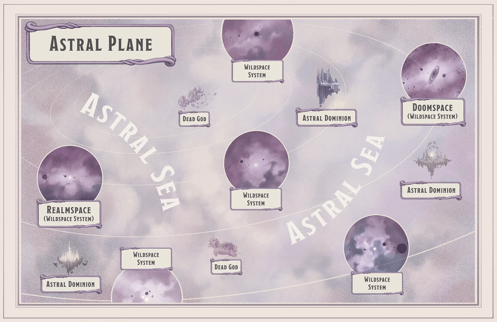
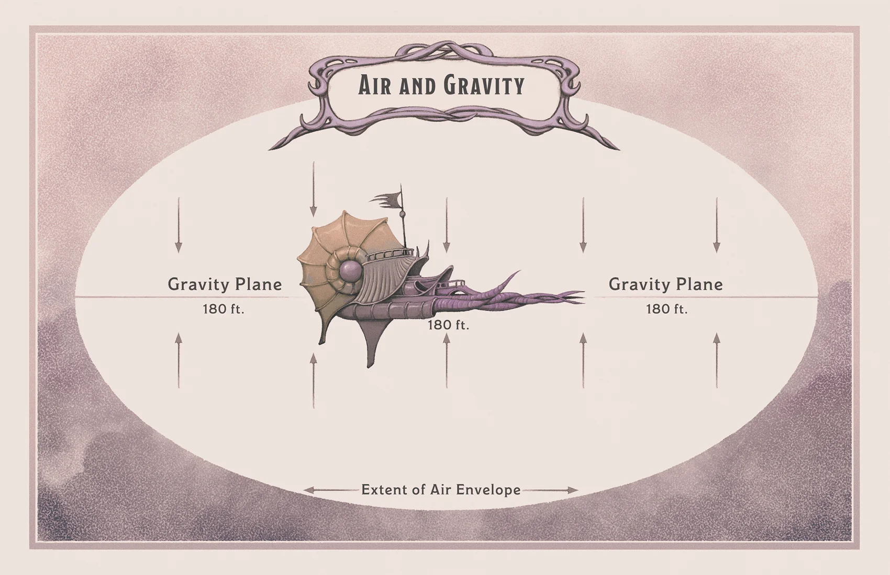

##### Setting a DC
| Difficulty |  DC | Difficulty        |  DC |
|------------|:---:|-------------------|:---:|
| Very easy  |  5  | Hard              |  20 |
| Easy       |  10 | Very hard         |  25 |
| Moderate   |  15 | Nearly impossible |  30 |

##### Skills and Associated Abilities
| Skill           | Ability      | Skill           | Ability      |
|-----------------|--------------|-----------------|--------------|
| Acrobatics      | Dexterity    | Medicine        | Wisdom       |
| Animal Handling | Wisdom       | Nature          | Intelligence |
| Arcana          | Intelligence | Perception      | Wisdom       |
| Athletics       | Strength     | Performance     | Charisma     |
| Deception       | Charisma     | Persuasion      | Charisma     |
| History         | Intelligence | Religion        | Intelligence |
| Insight         | Wisdom       | Sleight of Hand | Dexterity    |
| Intimidation    | Charisma     | Stealth         | Dexterity    |
| Investigation   | Intelligence | Survival        | Wisdom       |

### Suffocating

You can hold your breath for a number of minutes equal to 1 + your Constitution modifier (minimum of 30 seconds).

If you run out of breath or you're choking, you can survive for a number of rounds equal to your Constitution modifier (minimum of 1 round). At the start of your next turn, you drop to 0 hit points and are dying, and you can't regain hit points or be stabilized until you can breathe again.

### Weightlessness

In any location where gravity is not present, the following rules apply:

***Impeded Melee.*** When making a melee attack with a weapon, a creature that doesn't have a flying or swimming speed (either naturally or provided by magic) has disadvantage on the attack roll unless the weapon deals piercing damage.

***Movement.*** A creature can use an action to push off something heavier than itself and move up to its walking, flying, or swimming speed in a straight line. The creature continues along this course, moving in a straight line at its speed on each of its turns until something stops it or changes its trajectory.

### Astral Encounters

You can generate a random encounter on the Astral Plane by rolling on either the Wildspace Encounters table or the Astral Sea Encounters table, as appropriate, or by choosing an encounter you like. If the encounter is with a spelljamming ship, you can roll on the Ship Encounters to determine the ship and its crew, or you can create a ship encounter of your own (see the *Astral Adventurer's Guide* for *ship descriptions*).

Creatures marked with an asterisk (*) appear in this book; the rest are described in the *Monster Manual*. Any creature marked with a dagger (†) can serve as a spelljammer because it is a spellcaster.

If a Humanoid has no specified race, it can be of any race you choose.

#### Initial Attitude

To randomly determine the initial attitude of the creatures encountered, make the attitude roll called for in an encounter table entry, then refer to the appropriate line of the Initial Attitude table.

##### Initial Attitude
| Attitude Roll Total | Initial Attitude |
|:-------------------:|:----------------:|
|      4 or lower     |      Hostile     |
|         5–8         |    Indifferent   |
|     9 or higher     |     Friendly     |

##### Wildspace Encounters
|  d100 | Wildspace Encounter                                                                                                                   | Attitude Roll |
|:-----:|---------------------------------------------------------------------------------------------------------------------------------------|:-------------:|
| 01–03 | 1d4 **chwinga astronauts**,* each mounted on 1 **space guppy***                                                                       |    1d6 + 4    |
|   04  | 1 **cosmic horror*** (30 percent chance it is asleep)                                                                                 |      1d6      |
|   05  | 1 **esthetic*** piloted by 1 **reigar***†                                                                                             |      1d12     |
| 06–07 | 1 **eye monger***                                                                                                                     |      1d6      |
| 08–11 | 1 **feyr***                                                                                                                           |      1d6      |
| 12–13 | 1 **giant octopus** that has a flying speed of 60 feet and doesn't need to breathe air                                                |      1d10     |
| 14–17 | 1d6 **jammer leeches***                                                                                                               |      1d8      |
| 18–23 | 1d4 **kindori***                                                                                                                      |    1d6 + 3    |
| 24–25 | 1 **kindori*** with 1 **druid**† living in a hut on its back                                                                          |    2d6 + 3    |
|   26  | 1 **kraken** that has a flying speed of 60 feet and doesn't need to breathe air                                                       |      1d6      |
|   27  | 1 lunar dragon* (your choice of **young**, **adult**, or **ancient**)                                                                 |      1d10     |
| 28–35 | A tavern or inn built on an asteroid, with docks where ships can berth                                                                |       —       |
| 36–39 | 1d6 **murder comets***                                                                                                                |      1d6      |
| 40–44 | 1d4 **brown scavvers***                                                                                                               |      1d8      |
| 45–48 | 1 **night scavver*** and 2d6 **gray scavvers***                                                                                       |      1d8      |
| 49–50 | 1 **void scavver***                                                                                                                   |      1d6      |
| 51–52 | A shipwreck that might still have treasure or creatures aboard it (choose a ship from *chapter 2* of the *Astral Adventurer's Guide*) |       —       |
| 53–54 | 1 solar dragon* (your choice of **young**, **adult**, or **ancient**)                                                                 |      2d6      |
| 55–59 | 1d6 **space eels***                                                                                                                   |      1d10     |
|   60  | 1 **starlight apparition***                                                                                                           |    2d6 + 2    |
| 61–64 | 3d6 **stirges** that don't need to breathe air                                                                                        |      1d6      |
| 65–70 | 1d6 **will-o'-wisps**                                                                                                                 |      1d10     |
| 71–00 | 1 spelljamming ship (roll on the *Ship Encounters table*)                                                                             |       —       |

##### Astral Sea Encounters
|  d100 | Astral Sea Encounter                                                  | Attitude Roll |
|:-----:|-----------------------------------------------------------------------|:-------------:|
| 01–02 | 1 **aartuk starhorror***† and 2d4 **aartuk weedlings***               |      1d12     |
| 03–09 | 1 **archmage**† using the *astral projection* spell                   |    1d10 + 3   |
| 10–11 | 1 **braxat***                                                         |      1d8      |
|   12  | 1 **cosmic horror*** (70 percent chance it is asleep)                 |      1d6      |
| 13–15 | 1d4 **devas**† on a divine errand                                     |    1d12 + 3   |
| 16–28 | 1 **githyanki knight**† and 1d6 **githyanki warriors**†               |      1d10     |
| 29–31 | 1 **githyanki knight**† mounted on a **young red dragon**             |      1d8      |
|   32  | 1 **githzerai zerth**† being hunted by githyanki                      |    1d6 + 6    |
| 33–38 | 1d4 **kindori***                                                      |    1d6 + 3    |
|   39  | 1 **mercane***† and 1 **beholder** bodyguard                          |    1d8 + 4    |
|   40  | 1 **neh-thalggu***† looking for a portal to the Far Realm             |      1d10     |
| 41–42 | 1 **pentadrone**                                                      |    1d6 + 3    |
| 43–44 | 1 **planetar**† from a nearby astral dominion                         |    1d12 + 3   |
| 45–47 | 2d4 **psurlons***†                                                    |      1d8      |
| 48–50 | Gargantuan floating crystal obelisk of mysterious origin              |       —       |
| 51–52 | 4d4 **quadrones**                                                     |    1d6 + 3    |
|   53  | 1 **monodrone** that has gone rogue                                   |    2d6 + 3    |
| 54–56 | 1d4 **gray slaadi**† in Humanoid form                                 |      1d10     |
| 57–58 | 1 **green slaad**†                                                    |      1d12     |
| 59–63 | 3d6 **gray scavvers***                                                |      1d8      |
|   64  | 1 **solar**† watching over a dead god that drifts nearby              |    1d12 + 3   |
| 65–66 | 1 solar dragon* (your choice of **young**, **adult**, or **ancient**) |      2d6      |
|   67  | 1 **starlight apparition***                                           |    2d6 + 2    |
| 68–70 | 1d8 **unicorns** galloping merrily across the Astral Sea              |    1d6 + 6    |
| 71–00 | 1 spelljamming ship (roll on the Ship Encounters table)               |       —       |

##### Ship Encounters
|  d100 | Ship Encounter                                                                                                                                                                             | Attitude Roll |
|:-----:|--------------------------------------------------------------------------------------------------------------------------------------------------------------------------------------------|:-------------:|
| 01–07 | Bombard Leviathan, captained by Myrtle Hunt (**giff warlord***) and crewed by 8 **giff shipmates*** and 3 **mages**†                                                                       |    1d10 + 2   |
| 08–16 | Damselfly ship Voidwinder, captained by Krig Kalu (**hadozee explorer***) and crewed by 1 **drow**† and 7 **hadozee shipmates***                                                           |    2d6 + 3    |
| 17–23 | Flying fish ship Horizon, captained by Thaal Vod (renegade **mind flayer arcanist**†) and crewed by 9 **plasmoid warriors***                                                               |      1d12     |
| 24–31 | Hammerhead ship Jander Sunstar, captained by Veluna Valderak (**vampirate captain***) and crewed by 13 **vampirates*** and 1 **priest**†                                                   |      1d12     |
| 32–36 | Lamprey ship Astral Prize, crewed by 15 **psurlon ringers**,*† including Captain Uscath                                                                                                    |      1d12     |
| 37–39 | Living ship Eldervine, captained by Queth (**aartuk elder***) and crewed by 2 **aartuk starhorrors**,*† 8 **aartuk weedlings**,* and Eldervine (**treant**)                                |      1d10     |
| 40–45 | Nautiloid Neurophage, crewed by 4 **mind flayers**† and 16 **kuo-toa**, with 1d6 **grells** and 1d6 **intellect devourers** as passengers                                                  |      1d6      |
| 46–50 | Nightspider Malevolence, captained by Yeshk (**neogi void hunter***†) and crewed by 24 **neogi pirates*** and 5 **umber hulks**                                                            |      1d6      |
| 51–55 | Scorpion ship Claws of Huraj, captained by Huraj (**hobgoblin captain**) and crewed by 1 **bugbear** (first mate), 8 **hobgoblins**, and 2 hobgoblin **priests**†                          |      1d12     |
| 56–61 | Shrike ship Fedifensor, captained by Yaj (**githyanki xenomancer***†) and crewed by 10 **githyanki buccaneers***†                                                                          |      1d12     |
| 62–66 | Space galleon Eleventh, captained by Xorpha Eleven-Eyes (**beholder**) and crewed by 1 **spectator** (first mate), 3 **cult fanatics**,† and 16 **cultists**                               |      1d12     |
| 67–72 | Space galleon Great Kindori, captained by Mystan the Mighty (**djinni**†) and crewed by 1 **invisible stalker** (first mate), 1 **couatl**,† 17 **aarakocra**, and 1 **rug of smothering** |    2d6 + 2    |
| 73–78 | Squid ship Syken's Reach, captained by the pirate Arviglas Syken (human **bandit captain**) and crewed by 1 **cambion**† (Syken's daughter, Tenebra) and 11 **thugs**                      |      1d12     |
| 79–84 | Star moth Apex, captained by Xaleen (**astral elf commander***†) and crewed by 11 **astral elf warriors*** and 1 **astral elf aristocrat***†                                               |      1d12     |
| 85–90 | Turtle ship Snorkel, captained by Shelby Norkel (gnome **mage**†) and crewed by 15 **autognomes***                                                                                         |    1d10 + 3   |
| 91–94 | Tyrant ship Doomdreamer, crewed by 2d4 + 2 **beholders**                                                                                                                                   |      1d8      |
| 95–00 | Wasp ship Adventure, abandoned and adrift (25 percent chance that its *spelljamming helm* is still aboard)                                                                                 |       —       |

#### Ship-to-Ship Starting Distance

At the start of an engagement, the DM decides how far a ship is from its enemies. Three possibilities are provided in the Starting Encounter Distance table. The shorter the distance, the less time crews have to load weapons and make other preparations.

| Distance   | Notes                                                                                                  |
|------------|--------------------------------------------------------------------------------------------------------|
| 250 feet   | Long range for ballistae, mangonels, *shortbows*, *longbows*, *light crossbows*, and *heavy crossbows* |
| 500 feet   | Long range for *longbows* and mangonels; beyond the range of ballistae and crossbows                   |
| 1,000 feet | Beyond the range of most ranged weapons                                                                |

#### Crashing

When a spelljamming ship crashes into a creature or an object that could reasonably damage it, both the ship and the creature or object it struck take bludgeoning damage based on the size of the struck object, as shown in the table below.

| Size of Creature or Object Struck | Bludgeoning Damage |
|:---------------------------------:|:------------------:|
|               Large               |        4d10        |
|                Huge               |        8d10        |
|             Gargantuan            |        16d10       |

If the ship runs into something that doesn't have hit points (such as a planet or a moon), apply the damage only to the ship. The ship stops after crashing into a Gargantuan or immovable creature or object; otherwise, the ship can continue moving if it has any movement left, and whatever it struck moves to the nearest unoccupied space that isn't in the ship's path.

### Shipboard Tasks

During the uneventful part of a voyage, the captain of a spelljamming ship can put crew members to work in several ways. If a character is looking for a job to do, or if a captain wants to keep a character busy, roll on the Shipboard Tasks table to determine what needs to be done. The time it takes to complete a task is at least 1 hour, and certain tasks might take longer at your discretion.

##### Shipboard Tasks
| d12 | Task                                                                                                                                    |
|:---:|-----------------------------------------------------------------------------------------------------------------------------------------|
|  1  | Scrape barnacles off the hull.                                                                                                          |
|  2  | Scrub pots and dishes in the galley.                                                                                                    |
|  3  | Chop vegetables in the galley.                                                                                                          |
|  4  | Swab the deck or sweep the cargo hold.                                                                                                  |
|  5  | Update the ship's navigational charts, which requires cartographer's tools.                                                             |
|  6  | Repair the captain's favorite pair of boots, which requires cobbler's tools. (A *mending* spell also does the trick.)                   |
|  7  | Repair superficial damage to the ship, which requires carpenter's tools or woodcarver's tools. (A *mending* spell also does the trick.) |
|  8  | Compose a new chantey, which requires a musical instrument.                                                                             |
|  9  | Entertain the crew with tall tales or gossip.                                                                                           |
|  10 | Fix the captain's broken spyglass, which requires jeweler's tools or tinker's tools. (A *mending* spell also does the trick.)           |
|  11 | Teach the captain the basics of a language they don't already know.                                                                     |
|  12 | Prepare a tasty dinner for the captain's table, which requires cook's utensils.                                                         |

### Ship Quirks

Roll on the Ship Quirks table if you want to add a bit of "personality" to a ship.

##### Ship Quirks
| d10 | Quirk                                                                                                                                            |
|:---:|--------------------------------------------------------------------------------------------------------------------------------------------------|
|  1  | A chatty but harmless spirit haunts the cargo hold.                                                                                              |
|  2  | The excessive creaking of the hull echoes throughout the ship.                                                                                   |
|  3  | Any creature that removes itself from the ship's *spelljamming helm* receives a startling but harmless magical shock.                            |
|  4  | The ship's companionways are smaller than those found in most other similar vessels.                                                             |
|  5  | The ship makes a groaning sound in what seems like defiance whenever it comes to a stop.                                                         |
|  6  | The floor of the main deck is adorned with a stylized rendering of a mysterious star chart that pulsates occasionally with scintillating colors. |
|  7  | The ship's air envelope has a salty, briny smell.                                                                                                |
|  8  | Bulkheads throughout the ship have lines of poetry scrawled on them.                                                                             |
|  9  | Unattended tools often go missing, only to reappear 1d4 hours later in another part of the ship.                                                 |
|  10 | A creature seated in the ship's *spelljamming helm* hears faint spacefaring chanteys in its mind except when the ship is under attack.           |

### Ship Cargo

To randomly determine what's in the cargo hold of a spelljamming ship, roll 1d6 times on the Cheap Cargo table and 1d4-1 times on the Expensive Cargo table. A duplicate result indicates that the ship has more of the same cargo.

If a cargo container is locked, at least one crew member (typically the captain) has the key to it. A character can try to unlock a container using thieves' tools, doing so with a successful DC 20 Dexterity check.

##### Cheap Cargo
| d12 | Cargo                                                               |
|:---:|---------------------------------------------------------------------|
|  1  | Trunk containing ten outfits of *traveler's clothes* (2 gp each)    |
|  2  | Crate containing one hundred bars of soap (2 cp each)               |
|  3  | Twenty ballista bolts (5 gp each)                                   |
|  4  | Coop containing fifty live chickens (2 cp each)                     |
|  5  | Crate containing twenty wheels of cheese (5 sp each)                |
|  6  | Locked cage containing one friendly Beast of your choice            |
|  7  | Ten 40-gallon barrels of fresh water                                |
|  8  | Ten crates, each containing fifty days of rations (25 gp per crate) |
|  9  | Locked cage containing one hostile Beast of your choice             |
|  10 | Chest containing fifty *vials of perfume* (2 gp each)               |
|  11 | Crate containing fifty loaves of bread (2 cp each)                  |
|  12 | Ten 40-gallon barrels of ale (4 gp each)                            |

##### Expensive Cargo
| d12 | Cargo                                                                                                                 |
|:---:|-----------------------------------------------------------------------------------------------------------------------|
|  1  | Crate containing fifty blank *spellbooks* (50 gp each)                                                                |
|  2  | Crate containing one hundred *1-ounce bottles of ink* (10 gp each) and one thousand sheets of *parchment* (1 sp each) |
|  3  | Crate containing twenty *potions of healing*, *flasks of alchemist's fire*, or *vials of antitoxin* (50 gp each)      |
|  4  | Crate containing one hundred bottles of exquisite wine (25 gp each)                                                   |
|  5  | Set of exquisitely crafted furniture (2,500 gp)                                                                       |
|  6  | Locked trunk containing five unloaded *pistols* (250 gp each) and a box of 100 bullets                                |
|  7  | Locked case containing an exquisite Dragonchess set made of crystal or ivory (2,500 gp)                               |
|  8  | Locked trunk containing ten *bombs* (150 gp each; see "*Explosives*" in the *Dungeon Master's Guide*)                 |
|  9  | Crate containing one hundred fireworks (25 gp each)                                                                   |
|  10 | Crate containing five unloaded *muskets* (500 gp each) and a box of 100 bullets                                       |
|  11 | Locked case containing five *spyglasses* (1,000 gp each)                                                              |
|  12 | Ten 20-pound *kegs of gunpowder* (250 gp each; see "*Explosives*" in the *Dungeon Master's Guide*)                    |
