# Chapter 1: How to Play

The Dungeons & Dragons Roleplaying Game is about storytelling in worlds of swords and sorcery. Like games of make-believe, D&D is driven by imagination. It's about picturing a crumbling castle in a darkening forest and imagining how a fantasy adventurer might react to the challenges that scene presents. In this fantasy world, the possibilities are limitless.

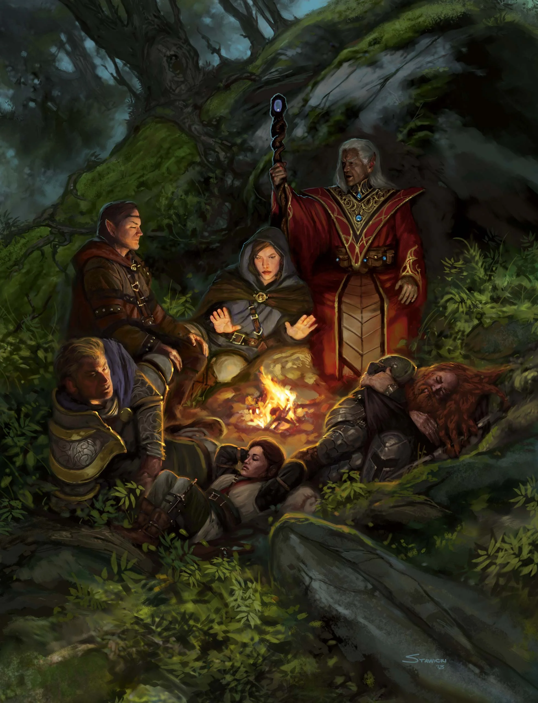

>That's a really poetic o-o-opening, Morty, and it's all kinda mostly true, but the theater major who wrote that forgot to mention... 
>

>POWER, Morty!
>
>The most important part of D&D.
>
>People play this game because they want limitless power and treasure and to act like a complete badass all the time.
>
>I-I-I mean, honestly, it's the illusion of power, Morty. We play games to distract ourselves from the reality that the universe is an unfeeling, uncontrollable s***storm and everything we do is MEANINGLESS, but fine, fine. That's just a b-b-*BURP*-baseline assumption we have to make because this is a human game for human people.
>
>
>
>W-w-we're not playing Glabbins & Gunchins with a buncha Bloofians, now are we? No, no we're not.
>
>Dungeons & Dragons is a portal gun to INFINITE IDEAS and INFINITE POWER without n-n-needing to be a genius like me who built one, Morty. It's not as good as a portal gun, but it's also a lot cheaper and doesn't require unstable energy sources to operate.
>
>it's good stuff.
>

>>Dungeon Master (DM): The castle stands among the trees, the crumbling ruins of seven round towers jutting up from it like broken teeth. An archway littered with twisted shards of rusted metal gapes open at the top of a short flight of steps. Two of the towers, speckled with dark arrow slits, loom beside the entryway, and a dark hall yawns beyond.
>>
>>Phillip (cleric): Let's send the rogue up ahead to look in and make sure it's safe.
>>
>>Amy (rogue): OK, I'll move to the side and sneak along the wall of the tower until I can peer in through the entrance.
>>

>What kind of cleric sends somebody in to die for them, anyway? He's totally complicit, Morty. 
>

Unlike a game of make-believe, D&D gives structure to the stories—a way of determining the consequences of the adventurers' actions. Players roll dice to determine whether their attacks hit or miss and whether their characters can scale a cliff, roll away from the strike of a magical lightning bolt, or pull off some other dangerous task. Anything is possible, but the dice make some things more probable than others.

>
>
>Calculate probabilities all you want, Morty, but don't get caught up in it, because the minute you do, those dice are gonna p-p-punish you, Morty. Fate is a fickle mistress.
>

>>DM: All right, Amy, let's see how sneaky you are. Make a Dexterity check.
>>
>>Amy: With my Stealth skill, right?
>>
>>DM: You bet.
>>
>>Amy (rolling a d20): I'm pretty sneaky—that's a 17.
>>
>>DM: OK, there's no sign that anyone notices you. And you're looking inside?
>>

When you play D&D, you take on the role of an adventurer: a skilled fighter, a devout cleric, a deadly rogue, or a spellcasting wizard. (The character sheets included in this set describe five heroes to get you started.) With some friends and a little imagination, you strike out on grand quests and daring adventures, testing yourself against an array of challenges and bloodthirsty monsters.

One player takes on the role of the Dungeon Master, the game's lead storyteller and referee. The DM is in charge of the adventure, which appears in the adventure book, while the characters navigate the adventure's hazards and decide where to explore. The DM might describe the entrance to a ruined castle, and the players decide what they want their adventurers to do. Will they boldly stride up to the fallen gate, or try to sneak up in case anyone's watching through those arrow slits? Circle around the castle looking for another entrance? Or cast a spell to cloak themselves in invisibility?

>
>
>Yeah and no.
>
>Being a Dungeon Master is all that stuff, but it's a lot more than that.
>
>playing d&d is good, but running it is a total power load, Morty!
>
>Y-y-you get to be a god, Morty. You control the h-h-horizontal and the vertical. Y-y-ou tell the players what's going on and then you entertain their asses with your brilliance, Morty. You get a little taste of what it's like to be me, all the time. I'm your teacher now. School can't help you here. School is a prison. Ninety-two percent of races in the universe don't even believe in schools—because they know. They already know.
>
>Anyway, the point is, the Dungeon Master is in charge, and since I don't want that balding little turd from the cartoon messing with us again, that means I'm in charge. O-o-or if you're reading this book right now, which you are if you're seeing these words, th-th-then you're in charge! YOU!I totally just deputized you by the power of Greyhawk, or whatever it is.
>

>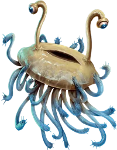
>
>This is a book for new players so they don't want to blow your mind, Morty, but stuff can get wild. Literally, if you can imagine it, it can be in your game!
>
>I'm talking about owlbears, Morty! 
>
>Th-th-that's an owl mixed with a bear! And they lay eggs, Morty! OWLBEAR EGGS! You crack open one of those and a giant beak-faced heap of goop comes out. I-i-it's delicious on toast. You've gotta try it.
>
>Anyway, that's just the tip of iceberg. Take a gander through the Monster Manual sometime and get a glimpse of what these sick designers come up with. It'll blow your mind, Morty.
>

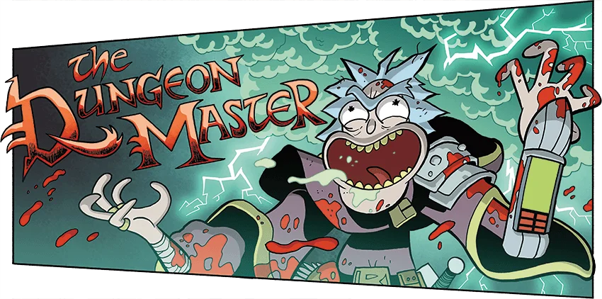

The DM determines the results of the adventurers' actions and narrates what the characters experience. Because the DM can improvise to react to anything the players attempt, D&D is infinitely flexible, and each adventure can be exciting and unexpected.

>"UNEXPECTED" i-i-is the key word there, Morty. Your job as the DM is to mess with player expectations. mess them up real good. Set 'em up and then tweak their nipples, Morty. You're not winning until someone cries. It's about the journey, not the destination. 
>

There's no winning and losing in D&D—at least not the way those terms are usually understood. Together, the DM and the players create a story of bold adventurers who confront deadly perils. Sometimes an adventurer might come to a grisly end, torn apart by ferocious monsters or done in by a nefarious villain. Even so, the other adventurers can search for powerful magic to revive their fallen comrade, or the player might choose to play a new character. The group might fail to complete an adventure successfully, but if the players had a good time and created a memorable story, they all win.

>
>
>Th-th-that makes for a nice sales pitch, but it's horse poop, Morty. Life is all about "winners" and "losers." Captain Drama-Pants here doesn't want to admit that when his character dies, he's a loser, but he is.
>
>
>
>Lemme make this really clear: THE DUNGEON MASTER IS THE WINNER BY DEFAULT.
>
>B-b-being in charge and messing with your friends makes you top dog, dawg. After that, it comes down to who gets the most phat loot, experience points, and who rolled the best.
>
>
>
>I-i-if creating some compelling narrative about your m-m-motivations for saving your brother the Prince of Pituitary who was taken by rabid rust monsters gets your rocks off, well then whoop-de-doo for you, but i-i-in the end it all comes down to POWER and CONTROL. Y-y-you've got it, or you don't.
>

## Getting Started

If this is your first time playing Dungeons & Dragons, start by reading the rest of this chapter. It tells you the most important rules you need to play the game.

Someone needs to be the Dungeon Master for your first play experience. Since you're reading this, you're a good candidate to be the DM. (If one of your friends knows how to play D&D already, you might want to ask that person to be the DM and help you learn the game.) Once you've read this chapter, take a look at the first few pages of the adventure book. That will help you understand the role of the DM and the basics of a D&D adventure.

>
>
>Thanks, book. I'm gonna show Morty and everyone else how Dungeon Mastering really works.
>
>D&D RICKTH EDITION takes the b-b-*BURP*-basics and blows them out a demon lord's turdhole.
>

From there, look over the rest of this book. You don't need to memorize everything before your first game, but it helps if you know where to find the rules while you play. Then get familiar with the adventure, and you'll be ready to gather your friends together to play.

Each player chooses one character from the *five options included*. It's up to the players to turn these bare-bones characters into people by giving them names, describing their appearance, and bringing them to life while playing through the adventure. If you have more than five players, it's OK for two players to use the same character, as long as they make the details of the character distinct; one cleric might be a jolly woman named Sefris, while the other is a severe man named Albric.

>Using the same character as someone else is kind of a dick move, but I get it. A non-genius human mind can only handle so many options, and f-f-five is all they put in this box, so go with what you've got, right? It's probably easier to just get rid of one of your friends. ***LOVE AND FRIENDSHIP ARE B-B-*BURP*-BIOLOGICAL BULLS**T*** Also, I might just be editorializing at this point, but who names a character Albric? Use the real name of somebody at the table. What are they gonna do about it? 
>

### Game Dice

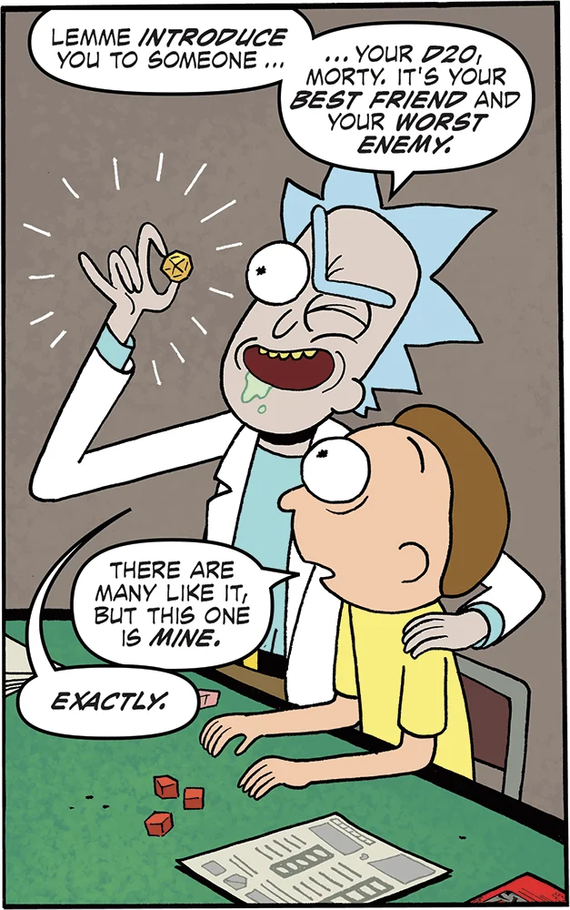

The game uses polyhedral dice. In these rules, the different dice are referred to by the letter d followed by the number of sides: d4, d6, d8, d10 (the 0 on the die represents a 10), d12, and d20. For instance, a d6 is a six-sided die.

Percentile dice, or d100, work a little differently. You generate a number between 1 and 100 by rolling the ten-sided die twice. The first roll gives the tens digit, and the second gives the ones digit. If you roll a 7 and a 1, for example, the number rolled is 71. Two 0s represent 100.

When you need to roll dice, the rules tell you how many dice to roll of a certain type, as well as what modifiers to apply. For example, "3d8 + 5" means you roll three eight-sided dice, add them together, and add 5 to the total.

>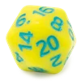
>
>There's only one set in here, so that means they're mine. Get your own dice. That way you can blame them for all your shortcomings. Tell your friends to get their own set, too.
>
>If you start sharing dice, people will start expecting you to share everything. You gotta nip that in the bud, or the next thing you know, you'll wake up in an alley without a kidney.
>
>You can never have too many dice, Morty!
>

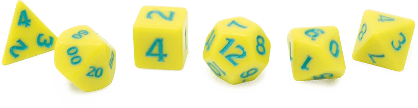

### The Structure of Play

The D&D game consists of a group of characters (controlled by the players) embarking on an adventure that the DM presents. The adventure is the heart of the game. An adventure unfolds as a story that the DM and the other players tell together using the material in the adventure book, in another published adventure, or in a setting of the DM's creation. The DM sets the scene at the start, giving the adventurers a reason to get involved. They are the protagonists of the story. The players control what they do, and the DM controls the monsters and people the adventurers meet. The DM also decides how the world changes as a result of the adventurers' actions.

>
>
>Ha-HA! It's right there in the rules, Morty! The DM decides! Suck it, everyone else!
>

Play of an adventure unfolds according to this basic pattern:

#### 1. The DM describes the environment

The DM tells the players where their adventurers are and what's around them, presenting the basic scope of options available: how many doors lead out of a room, what's on a table, who's in the tavern, and so on. The players can ask questions to make sure they understand what their characters perceive.

>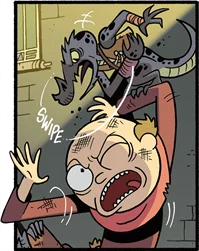
>
>Don't let players trick you, Morty. Players constantly ask questions as a way to try and make stuff happen that you didn't intend. Are they spending too much time investigating that stupid dark corner in the tavern? Now there's a tentacle monster in it.
>

#### 2. The players describe what they want to do

Sometimes one player speaks for the whole group, saying, "We'll take the east door," for example. Other times, different adventurers do different things. One adventurer might search a treasure chest while a second one examines an esoteric symbol engraved on a wall and a third one keeps watch for monsters. The players don't need to take turns, but the DM listens to every player and decides how to resolve those actions.

Sometimes, resolving a task is easy. If an adventurer wants to walk across a room and open a door, the DM might just say that the door opens and describe what lies beyond. But the door might be locked, the floor might hide a deadly trap, or some other circumstance might make it challenging for an adventurer to complete a task. In those cases, the DM decides what happens, often relying on the roll of a die to determine the results of an action.

>Here's an extra tip: if you're the DM, you can roll your dice behind a fancy screen and lie like crazy about the results.
>
>
>
>Y-y-you don't want to be obvious about it, Morty—like, try to pretend that you actually rolled that number—b-b-but if you want a certain outcome, just lie like crazy.
>
>They can question you about it, and they don't have to like the answers. That's on them.
>

#### 3. The DM narrates the results of the adventurers' actions

Describing the results often leads to another decision point, which brings the flow of the game right back to step 1.

This pattern holds whether the adventurers are cautiously exploring an ancient ruin, talking to a devious prince, or locked in mortal combat against a dragon. In certain situations, particularly combat, the action is more structured and the players (and DM) do take turns choosing and resolving actions. But most of the time, play is fluid, adapting to the circumstances of the adventure.

Often the action of an adventure takes place wholly in the imagination of the players and DM, relying on the DM's verbal descriptions to set the scene. Some DMs like to use music, art, or recorded sound effects to help set the mood, and many players and DMs alike adopt different voices for the various adventurers, monsters, and other characters they play in the game. Sometimes, a DM might lay out a map and use tokens or miniature figures to represent each creature involved in a scene to help the players keep track of where everyone is.

>**Miniatures and maps are fine, j-j-just don't get carried away, Morty. One time I got really drunk and grew actual miniatures of creatures and characters and put 'em in a little dungeon together because I thought it would be more realistic and save time, but**
>
>IT WAS A F***ING DISASTER! 
>
>**The tiny characters whined because they didn't have food and they were starving, and the little monsters just started shedding and barfing everywhere.**
>
>**It was a real mess.**
>

> ##### What's Next?
>
>This set is a complete Dungeons & Dragons experience, enough to provide hours of play. You can even play through the adventure book multiple times. You might be surprised at how differently things can turn out! But one of the most rewarding things about D&D is that it provides the opportunity to create characters, and even worlds, of your own.
>
>For tools and other products to help you make your own characters, visit [https://dungeonsanddragons.com](DungeonsandDragons.com). There you will find the basic rules of the game for free. Those rules tell you how to create your own character to supplement or replace the characters in this set, as well as how to advance a character beyond 5th level.
>
>If you want to create a greater variety of characters or populate your adventures with other monsters, check out the fifth edition *Player's Handbook*, *Monster Manual*, and *Dungeon Master's Guide*. These advanced rulebooks introduce you to the vast multiverse of D&D and invite you to create unique characters and worlds within it.
>

>
>
>DAMN, MORTY!
>
>It's only chapter 1 and these wily sons of b****es are already going for the upsell. Capitalism at work, Morty.
>

### Halving

Round down whenever the game requires you to halve a number. For example, if you halve 15, you get 7.

>
>
>L-l-leave it to Wizards of the Coast to reinvent MATH!
>
>JEEZ.
>

## Six Abilities

Six abilities provide a quick game description of every character's and monster's physical and mental characteristics:

- **Strength**, measuring physical power
- **Dexterity**, measuring agility
- **Constitution**, measuring endurance
- **Intelligence**, measuring reasoning and memory
- **Wisdom**, measuring perception and insight
- **Charisma**, measuring force of personality

Is a character muscle-bound and insightful? Brilliant and charming? Nimble and hardy? For each of the six abilities, a character or monster has an **ability score** to measure it, typically ranging from 3 to 18. An adventurer can have a score as high as 20. A monster can have one as high as 30.

The most important function of an ability score is providing an **ability modifier** that usually ranges from −1 (for a score of 8 or 9) to +4 (for a score of 18). This modifier applies to ability checks, saving throws, and attack rolls, as explained in the next few sections.

>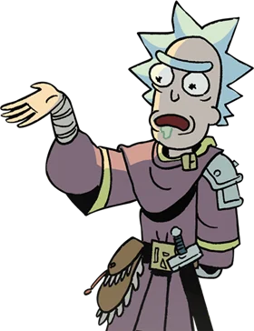
>
>here's what you really need to know about these abilities, Morty:
>
>STRENGTH: How to hit stuff
>
>DEXTERITY: How to keep from being hit by stuff
>
>CONSTITUTION: How to survive getting hit by stuff
>
>INTELLIGENCE: Good for arcane stuff
>
>WISDOM: Finding stuff
>
>CHARISMA: Dump stat, ignore it
>

#### Ability Scores and Modifiers

| Score | Modifier | Score | Modifier |
|:-----:|:--------:|:-----:|---------:|
|   1   |    −5    | 16–17 |       +3 |
|  2–3  |    −4    | 18–19 |       +4 |
|  4–5  |    −3    | 20–21 |       +5 |
|  6–7  |    −2    | 22–23 |       +6 |
|  8–9  |    −1    | 24–25 |       +7 |
| 10–11 |    +0    | 26–27 |       +8 |
| 12–13 |    +1    | 28–29 |       +9 |
| 14–15 |    +2    |   30  |      +10 |

>Notice how they've got stats there up to 30 even though you can only start with a max of 20? That's there to show you a simple fact of life: S-s-some things are just better than you, Morty. I mean, a lot of things are better than you, but I also mean here in the world of D&D. Anything 8 or lower I call a "blart." It comes from this dimension I found where all numbers less than 9 have the same term: "blart." It means fart. Fart, fart, fart, fart, fart, fart, fart, fart, nine, ten, eleven, you get it. Anyway, blarts stink, Morty. 
>

### The Core Rule

Does an adventurer's sword swing hurt a dragon or bounce off its iron-hard scales? Does the ogre believe an outrageous bluff? Can a character swim across a raging river? Does a character avoid the main blast of a fireball or take full damage from the blaze? When the outcome of an action is uncertain, the game relies on the roll of a d20 to determine success or failure. Ability checks, attack rolls, and saving throws are the three main kinds of d20 rolls. For each one, you roll a d20, add any bonuses or penalties, and compare the total to a target number. If the total equals or exceeds it, you succeed. Here are those steps in more detail:

#### 1. Roll the die

Roll a d20, then add the modifier of the ability score used for the roll. A Dexterity saving throw, for instance, uses your Dexterity modifier.

#### 2. Apply circumstantial bonuses and penalties

A spell, a particular circumstance, or some other effect might give a bonus or penalty to the roll.

#### 3. Compare the total to a target number

If the total equals or exceeds the target number, the roll is a success. Otherwise, it's a failure. The target number for an ability check or saving throw is called a Difficulty Class (DC). For an attack roll, it's the Armor Class (AC) of the target being attacked. The DM is usually the one who determines target numbers and tells players whether their ability checks, attack rolls, and saving throws succeed or fail.

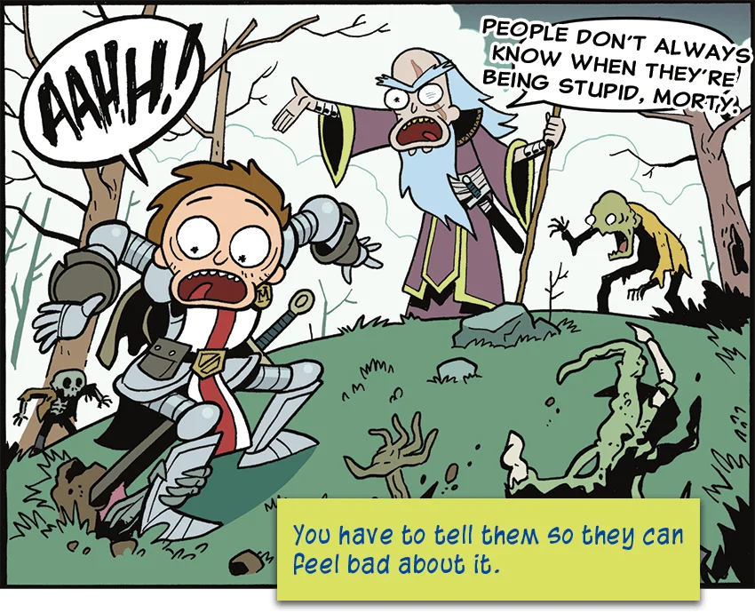

Ability checks are discussed on the following page, saving throws later in this chapter. Attack rolls are described in *chapter 2*.

4. The Dungeon Master is always right.

I-I-I don't know why they didn't include that in their supposed "core rules," but that should actually be number 1. J-j-just scratch out the order of the other stuff and put that at the top.The DM also tells people when they're being stupid.

### Advantage and Disadvantage

Sometimes a special ability or spell tells you that you have advantage or disadvantage on a d20 roll. When that happens, you roll a second d20 when you make the roll. Use the higher of the two rolls if you have advantage, and use the lower roll if you have disadvantage. For example, if you have disadvantage and roll a 17 and a 5, you use the 5. If you instead have advantage and roll those numbers, you use the 17.

If multiple situations affect a roll and each one grants advantage or imposes disadvantage on it, you don't roll more than one additional d20. If two favorable situations grant advantage, for example, you still roll only one additional d20.

If circumstances cause a roll to have both advantage and disadvantage, you are considered to have neither of them, and you roll one d20. This is true even if multiple circumstances impose disadvantage and only one grants advantage or vice versa. In such a situation, you have neither advantage nor disadvantage.

When you have advantage or disadvantage and something in the game lets you reroll the d20, you can reroll only one of the dice. You choose which one.

>
>
>Th-th-this ADVANTAGE/DISADVANTAGE thing is perfect to use against annoying players.
>
>If your player Maureen says, "Shouldn't these goblins run away after we killed seventy-two of their pals?" you just look her right in the eye and say, "No, Maureen. They shouldn't. These g-g-goblins are hopped up on gnoll blood they chugged before the battle and now they've got advantage, so how do you like that, Maureeeeen?"
>
>And don't let players turn this back on you either. When Maureen's character Flardo the Fearless tries to chug gnoll blood on his own, you just shake your head and say, "Awwwww nuts, Maureen. That gnoll blood is toxic to dwarves, so now you've got disadvantage on all your rolls, Maureeeeen."
>
>Finger guns optional.
>

### Ability Checks

An ability check tests a character's or monster's innate talent and training in an effort to overcome a challenge. The DM calls for an ability check when a character or monster attempts an action (other than an attack) that has a chance of failure. A character might make a Strength check to force open a door, an Intelligence check to make sense of clues, or a Wisdom check to notice goblins lying in ambush along the road. When the outcome is uncertain, the dice determine the results.

To make an ability check, roll a d20 and add the appropriate ability modifier. You use your Strength modifier for a Strength check, for example.

If the total equals or exceeds the DC, the ability check is a success. Otherwise, the check is a failure, which means the character or monster makes no progress toward the objective or makes progress combined with a setback determined by the DM.

Often, the adventure book tells the DM what kind of check a character can make, the DC of the check, and what happens if the character succeeds or fails. Since characters often try unpredictable things, though, the adventure book also provides advice to help the DM decide what kind of ability check and DC to use in a particular situation.

>ABILITY CHECKS are another solid way to punish players who question you, Morty.
>
>make them do ability checks for every last little thing until they acknowledge your superiority.
>
>
>
>Sorry, Hoyt. You've forgotten how to use your legs, so you'll need to make an Intelligence check to reignite your synapses and remind your limbs how to function.
>
>
>
>Oh, you made it? Cool, cool. How about a Dexterity check to see if enough blood is pumping through those legs to walk straight and avoid traps at the same time?
>
>
>
>Did I just say "traps?" Damn straight, Hoyty-toyty. Now make a Wisdom check to see if you notice the razor wire perfectly positioned to cleave Flardo's feet from his ankles.
>
>***ANYONE ELSE HAVE ANY F***ING QUESTIONS? DIDN'T THINK SO.***
>

#### Proficiency Bonus

You might be particularly skilled at a certain kind of task related to an ability check. The character sheets list each character's proficiencies with skills and special tools, and the monster statistics in the adventure book show monsters' proficiencies. If you have proficiency in a skill, such as Acrobatics or Deception, you add your proficiency bonus to ability checks you make that use that skill. If you have proficiency with a certain tool, such as *thieves' tools*, you add your proficiency bonus to ability checks you make using those tools. You never add your proficiency bonus more than once to the same d20 roll.

>
>
>Th-th-these INCREMENTAL BONUSES don't seem like much, but you've gotta watch out because players will nickel and dime every miniscule bonus they can to try and "win."
>
>Be ready with a penalty or disadvantage any time you need to wipe that smile off their face.
>

#### Contests

Sometimes one character's or monster's efforts are directly opposed to another's. This can occur when both of them are trying to do the same thing and only one can succeed, such as attempting to snatch up a magic ring that has fallen on the floor. This situation also applies when one of them is trying to prevent the other one from accomplishing a goal—for example, when a monster tries to force open a door that an adventurer is holding closed. In situations like these, the outcome is determined by a special form of ability check, called a contest.

Both participants in a contest make ability checks appropriate to their efforts. They apply all appropriate bonuses and penalties, but instead of comparing the total to a DC, they compare the totals of their two checks.

The participant with the higher check total wins the contest. That character or monster either succeeds at the action or prevents the other one from succeeding.

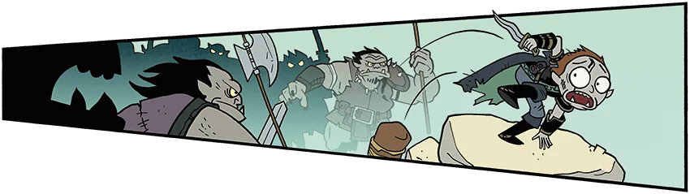

If the contest results in a tie, the situation remains the same as it was before the contest. Thus, one contestant might win the contest by default. If two characters tie in a contest to snatch a ring off the floor, neither character grabs it. In a contest between a monster trying to open a door and an adventurer trying to keep the door closed, a tie means that the door remains shut.

>A good DM knows when to force players to make contested rolls against each other, Morty. You wanna keep the adventuring party from operating too efficiently,  so put 'em in situations where they need to arm wrestle for rations at the campsite or have a drinking contest at dinner with the Duke of Dingleberry. 
>

#### Skills

Each ability covers a broad range of capabilities, including skills that a character can be proficient in. A skill represents a specific aspect of an ability score, and a character's proficiency in a skill demonstrates a focus on that aspect.

A Dexterity check might, for example, reflect a character's attempt to pull off an acrobatic stunt, to palm an object, or to stay hidden. Each of these aspects of Dexterity has an associated skill: Acrobatics, Sleight of Hand, and Stealth, respectively. So a character who has proficiency in the Stealth skill is particularly good at Dexterity checks related to sneaking and hiding.

Sometimes, the DM might ask for an ability check using a specific skill—for example, "Make a Wisdom (Perception) check." At other times, a player might ask the DM if proficiency in a particular skill applies to a check. In either case, proficiency in a skill means a character can add his or her proficiency bonus to ability checks that use that skill. Without proficiency in the skill, the character makes a normal ability check.

For example, if a character attempts to climb up a dangerous cliff, the Dungeon Master might ask for a Strength (Athletics) check. If the character is proficient in Athletics, the character's proficiency bonus is added to the Strength check. If the character lacks that proficiency, he or she just makes a Strength check.

>
>
>Here's a little cutting-edge f***ery you can pull on your players, Morty:
>
>COMBINE THEIR WORST ATTRIBUTE WITH A RANDOM SKILL THAT DOESN'T GO WITH IT
>
>
>
>just to mess with their m-m-minds.
>
>"I'd like you to make an Intelligence (Athletics) check."
>
>"Aw geez, DM Rick. Why do I have to do that?"
>
>
>
>"Because mind and body are one, Morty. You have to remember how to swim, and if you don't, you drown."
>

### Strength Checks

Strength measures bodily power, athletic training, and the extent to which you can exert raw physical force. A Strength check can model any attempt to lift, push, pull, or break something, to force your body through a space, or to otherwise apply brute force to a situation. The Athletics skill reflects aptitude in certain kinds of Strength checks.

#### Athletics

Your Strength (Athletics) check covers difficult situations you encounter while climbing, jumping, or swimming. Examples include the following activities:

- You attempt to climb a sheer or slippery cliff, avoid hazards while scaling a wall, or cling to a surface while something is trying to knock you off.
- You try to jump an unusually long distance or pull off a stunt mid-jump.
- You struggle to swim or stay afloat in treacherous currents, storm-tossed waves, or areas of thick seaweed. Or another creature tries to push or pull you underwater or otherwise interfere with your swimming.
- You have a real bad day and you gotta slime monster right up your butt, and you g-gotta yank it out, Morty. You gotta brute strength this thing. You can't leave a slime monster in there, Morty. It'll make a nest.

### Dexterity Checks

Dexterity measures physical agility, reflexes, and balance. A Dexterity check can model any attempt to move nimbly, quickly, or quietly, or to keep from falling on tricky footing. The Acrobatics, Sleight of Hand, and Stealth skills reflect aptitude in certain kinds of Dexterity checks.

>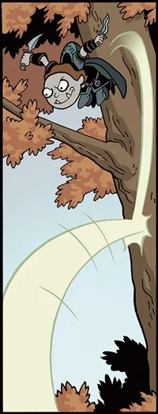
>
>ACROBATICS
>
>D-d-don't let players convince you that they can use Dexterity (Acrobatics) to d-d-dodge attacks or any of that s***. Skills are for non-combat rolls only, dawg.
>
>Players will walk all over you if you let them, Morty. They'll squeeze every last ounce out of the rules if you're not careful. Stay vigilant, or they'll start having a lot of fun.
>

#### Acrobatics

Your Dexterity (Acrobatics) check covers your attempt to stay on your feet in a tricky situation, such as when you're trying to run across a sheet of ice, balance on a tightrope, or stay upright on a rocking ship's deck. The DM might also call for a Dexterity (Acrobatics) check to see if you can perform acrobatic stunts, including dives, rolls, somersaults, and flips.

#### Sleight of Hand

Whenever you attempt an act of legerdemain or manual trickery, such as planting something on someone else or concealing an object on your person, make a Dexterity (Sleight of Hand) check. The DM might also call for a Dexterity (Sleight of Hand) check to determine whether you can lift a coin purse off another person or slip something out of another person's pocket.

>SLEIGHT OF HAND
>
>Stealing is a time-honored D&D tradition, Morty. Rogues do it, obviously, but everyone else does too.
>
>***EVEN CLERICS!***
>
>
>
>Don't let that "holy" façade fool you. Th-th-they're just as twisted and misanthropic as everyone else in D&D, they just hide it better. Their religion is just a cover for their fantasy pawn shop.
>
>That's just my opinion, Morty. W-W-Wizards of the Coast doesn't say that anywhere, that's just me.
>

#### Stealth

Make a Dexterity (Stealth) check when you attempt to conceal yourself from enemies, slink past guards, slip away without being noticed, or sneak up on someone without being seen or heard.

>
>
>STEALTH
>
>Sneaking around and stealing is where it's at, so if you wanna be smart like your grandpa, make sure you crank that Dex up, you dig?
>

> ##### Hiding and Vision
>
>When you try to hide, make a Dexterity (Stealth) check. Until you are discovered or you stop hiding, that check's total is contested by the Wisdom (Perception) check of any creature that actively searches for signs of your presence.
>
>You can't hide from a creature that can see you, and if you make noise (such as shouting a warning or knocking over a vase), you give away your position. An invisible creature can't be seen, so it can always try to hide. Signs of its passage might still be noticed, however, and it still has to stay quiet.
>
>***Passive Perception.*** When you hide, there's a chance someone will notice you even if they aren't searching. To determine whether such a creature notices you, the DM compares your Dexterity (Stealth) check with that creature's passive Wisdom (Perception) score, which equals 10 + the creature's Wisdom modifier, as well as any other bonuses or penalties. If the creature has advantage, add 5. For disadvantage, subtract 5.

>For example, if a 1st-level character (with a proficiency bonus of +2) has a Wisdom of 15 (a +2 modifier) and proficiency in Perception, they have a passive Wisdom (Perception) score of 14.

>***What Can You See.*** One of the main factors in determining whether you can find a hidden creature or object is how well you can see in an area, which might be lightly or heavily obscured. In a lightly obscured area—such as dim light, patchy fog, or moderate foliage—creatures have disadvantage on Wisdom (Perception) checks that rely on sight. In a heavily obscured area—such as darkness, opaque fog, or dense foliage—vision is blocked, effectively imposing the blinded condition, as explained in the appendix.

>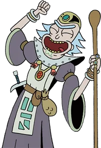
>
>S-s-sure you can memorize all this if you want: passive blah-blah and how much of a character's ass is sticking out or whatever, but if you wanna do this Rick-style, here's how it goes: roll a d20 behind your DM screen and then—it doesn't matter what the roll was, just look at the players, squint your eyes a bit, and say:
>
>"oops. they spotted you."
>
>BAM-A-LAM!Problem solved. Saves you a lotta trouble, Morty. Gets you to the good stuff.
>

### Constitution Checks

Constitution measures health, stamina, and vital force. Constitution checks are uncommon, and no skills apply to Constitution checks, because the endurance this ability represents is largely passive rather than involving a specific effort on the part of a character or monster. A Constitution check can model your attempt to push beyond normal limits, however.

>
>
>WOW! THEY R-R-REALLY SCRIMPED ON THIS PART, HUH MORTY!
>

>There are tons of ways to use Constitution checks that these ding-dongs don't want you to know about. They don't have vision like I do, Morty. They don't see the big picture. Here are some great Constitution checks that "push beyond normal limits":
>
>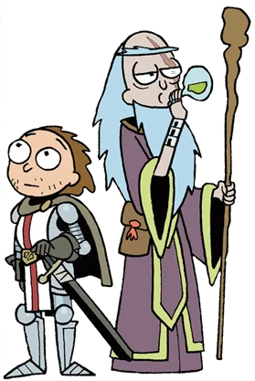
>
>- When your character is at a fancy dinner with the Duchess of Dingleberry and suddenly has a monster fart, can they hold it in? You gotta be a hero sometimes, Morty. You might think that's Strength (Athletics) or Dexterity (Acrobatics), but trust me, Morty, that's p-p-pure Constitution right there.
>- Have you ever got a paper cut in the webby part between your fingers, Morty? It's the most painful thing in the universe. No one can even see it, but it still b-b-*BURP*-burns, Morty. Paper cuts can happen at any moment, and when they do, you've just got to keep it together. The world's a dangerous place, Morty. I can't believe they didn't mention that Constitution's how you keep your s*** locked down.
>- Drinking! Look, I kn-kn-know the D&D people don't want to glorify drinking in a game for 13-year-olds, but y-y-you're 14, Morty. Also, this is the theater of the mind, or whatever, so it's not real drinking—but trust me, you're gonna love that too.

### Intelligence Checks

Intelligence measures mental acuity, strength of recall, and the ability to reason. An Intelligence check comes into play when you need to draw on logic, education, memory, or deductive reasoning. The Arcana, History, Investigation, Nature, and Religion skills reflect aptitude in certain kinds of Intelligence checks.

#### Arcana

Your Intelligence (Arcana) check measures your ability to recall lore about spells, magic items, eldritch symbols, magical traditions, the planes of existence, and the inhabitants of those planes.

#### History

Your Intelligence (History) check measures your ability to recall lore about historical events, legendary people, ancient kingdoms, past disputes, recent wars, and lost civilizations.

#### Investigation

When you look around for clues and make deductions based on those clues, you make an Intelligence (Investigation) check. You might deduce the location of a hidden object, discern from the appearance of a wound what kind of weapon dealt it, or determine the weakest point in a tunnel that could cause it to collapse. Poring through ancient scrolls in search of a hidden fragment of knowledge might also call for an Intelligence (Investigation) check.

#### Nature

Your Intelligence (Nature) check measures your ability to recall lore about terrain, plants and animals, the weather, and natural cycles.

#### Religion

Your Intelligence (Religion) check measures your ability to recall lore about deities, rites and prayers, religious hierarchies, holy symbols, and the practices of secret cults.

>
>
>What the hell is this doing under Intelligence? I've had enough people try to worship me to know religions are a crock, Morty.
>

### Wisdom Checks

Wisdom reflects how attuned you are to the world around you, representing perceptiveness and intuition. A Wisdom check might reflect an effort to read body language, understand someone's feelings, notice things about the environment, or care for an injured person. The Animal Handling, Insight, Medicine, Perception, and Survival skills reflect aptitude in certain kinds of Wisdom checks.

#### Animal Handling

When there is any question whether you can calm down a domesticated animal, keep a mount from getting spooked, or intuit an animal's intentions, the DM might call for a Wisdom (Animal Handling) check. You also make a Wisdom (Animal Handling) check to control your mount when you attempt a risky maneuver.

>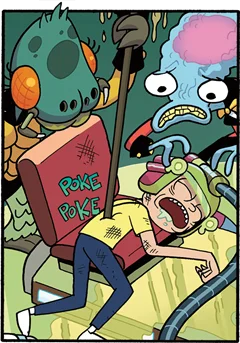
>
>ANIMAL HANDLING
>
>S-s-some players think they're animal whisperers, Morty. Don't let them befriend animals in your game. It always starts with one wolf or squirrel, then, next thing you know, you're tracking a f***ing MENAGERIE, each one with their own character sheet. N-n-no pets!
>

#### Insight

Your Wisdom (Insight) check decides whether you can determine the true intentions of a creature, such as when searching out a lie or predicting someone's next move. Doing so involves gleaning clues from body language, speech habits, and changes in mannerisms.

>INSIGHT
>
>S-s-some players use Insight on everything, Morty. They think they're Sherlock Holmes, analyzing every word they hear, looking for hidden meanings.
>
>There's no meaning to any of this, Morty. Not D&D, not life, nothing. So here's how you deal with this:
>
>Tell them that there's something fishy going on, but refuse to elaborate, no matter how high they roll.
>
>OR 
>
>Grab a random scrap of paper from behind your DM screen and scribble a symbol on it, just seriously anything, then surreptitiously slide it over to them.
>
>
>
>Don't tell them what it is or answer any other questions. If they roll Wisdom (Insight) again, give 'em another scribble. Another roll. More scraps of garbage. They'll drive themselves insane trying to figure out what it all means. People can't handle secrets, Morty. Their minds are weak.
>

#### Medicine

A Wisdom (Medicine) check lets you try to stabilize a dying companion or diagnose an illness.

>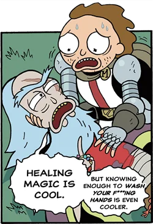
>
>Medicine
>
>Medieval medicine isn't pretty, Morty. Even in a fantasy world, they don't know jack about germs or pathogens or antib-b-b-*BURP*-biotics.
>

#### Perception

Your Wisdom (Perception) check lets you spot, hear, or otherwise detect the presence of something. It measures your general awareness of your surroundings and the keenness of your senses. For example, you might try to hear a conversation through a closed door, eavesdrop under an open window, or hear monsters moving stealthily in the forest. Or you might try to spot things that are obscured or easy to miss, whether they are orcs lying in ambush on a road, thugs hiding in the shadows of an alley, or candlelight under a closed secret door.

>
>
>PERCEPTION
>
>That Insight stuff I mentioned earlier goes double for Perception, Morty.
>
>Some players just can't stop staring and listening and sniffing instead of doing. It can't all be that interesting, but they're gonna try anyway.
>

#### Survival

The DM might ask you to make a Wisdom (Survival) check to follow tracks, hunt wild game, guide your group through frozen wastelands, identify signs that owlbears live nearby, predict the weather, or avoid quicksand and other natural hazards.

>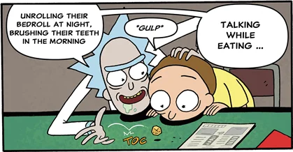
>
>SURVIVAL
>
>If a player really pisses you off, make them roll Wisdom (Survival) for everything:
>
>make their butt cheeks clench in fear every time you look in their direction.
>

### Charisma Checks

Charisma measures your ability to interact effectively with others. It includes such factors as confidence and eloquence. A Charisma check might arise when you try to influence or entertain others, when you try to make an impression or tell a convincing lie, or when you are navigating a tricky social situation. The Deception, Intimidation, Performance, and Persuasion skills reflect aptitude in certain kinds of Charisma checks.

#### Deception

Your Charisma (Deception) check determines whether you can convincingly hide the truth, either verbally or through your actions. This deception can encompass everything from misleading others through ambiguity to telling outright lies. Typical situations include trying to fast-talk a guard, con a merchant, earn money through gambling, pass yourself off in a disguise, dull someone's suspicions with false assurances, or maintain a straight face while telling a blatant lie.

#### Intimidation

When you attempt to influence someone through overt threats, hostile actions, and physical violence, the DM might ask you to make a Charisma (Intimidation) check. Examples include trying to pry information out of a prisoner, convincing street thugs to back down from a confrontation, or using the edge of a broken bottle to convince a sneering vizier to reconsider a decision.

#### Performance

Your Charisma (Performance) check determines how well you can delight an audience with music, dance, acting, storytelling, or some other form of entertainment.

#### Persuasion

When you attempt to influence someone or a group of people with tact, social graces, or good nature, the DM might ask you to make a Charisma (Persuasion) check. Typically, you use persuasion when acting in good faith, to foster friendships, make cordial requests, or exhibit proper etiquette. Examples of persuading others include convincing a chamberlain to let your party see the king, negotiating peace between warring tribes, or inspiring a crowd of townsfolk.

> ##### Finding a Hidden Object
>
>When your character searches for a hidden object such as a secret door or a trap, the DM typically asks you to make a Wisdom (Perception) check. Such a check can be used to find hidden details or other information and clues that you might otherwise overlook.
>
>In most cases, you need to describe where you are looking in order for the DM to determine your chance of success. For example, a key is hidden beneath a set of folded clothes in the top drawer of a bureau. If you tell the DM that you pace around the room, looking at the walls and furniture for clues, you have no chance of finding the key, regardless of your Wisdom (Perception) check result. You would have to specify that you were opening the drawers or searching the bureau in order to have any chance of success.
>

### Saving Throws

A saving throw, or save, represents an attempt to resist or avoid a spell, a trap, a poison, a disease, or a similar threat. You don't normally decide to make a saving throw; you are forced to do so because your character or monster is at risk of harm.

To make a saving throw, roll a d20 and add the appropriate ability modifier. For example, you use your Dexterity modifier for a Dexterity saving throw.

A saving throw can be modified by a situational bonus or penalty and can be affected by advantage and disadvantage, as determined by the DM.

A character sheet indicates a character's saving throw proficiencies. As with skill proficiencies, proficiency in a saving throw lets a character add his or her proficiency bonus to saving throws made using a particular ability score. Some monsters have saving throw proficiencies as well.

The Difficulty Class for a saving throw is determined by the effect that causes it. When a spell allows a saving throw, for instance, the DC for that save is determined by the caster's spellcasting ability and proficiency bonus.

The result of a successful or failed saving throw is also detailed in the effect that forces the save. Usually, a successful save means that a character or monster suffers no harm, or reduced harm, from an effect.

>This is the core of it, Morty:  FORCE THEM TO JUMP THROUGH POINTLESS HOOPS FOR YOUR OWN ENTERTAINMENT. Some players think they're unt-t-touchable, Morty. This is how you touch them with the finger of God. 
>

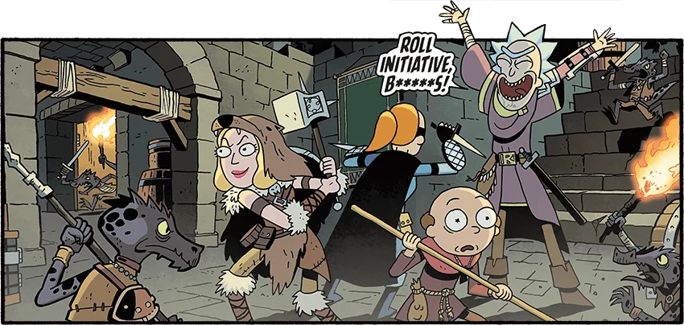

------

# Chapter 2: Combat

Battle often erupts when adventurers face their foes, whether the enemies are savage monsters or cunning villains. This chapter provides the rules you need for such combat. The rules address you, the player or Dungeon Master. The Dungeon Master controls all the monsters and nonplayer characters involved in combat, and each other player controls an adventurer. "You" can also mean the character or monster that you control.

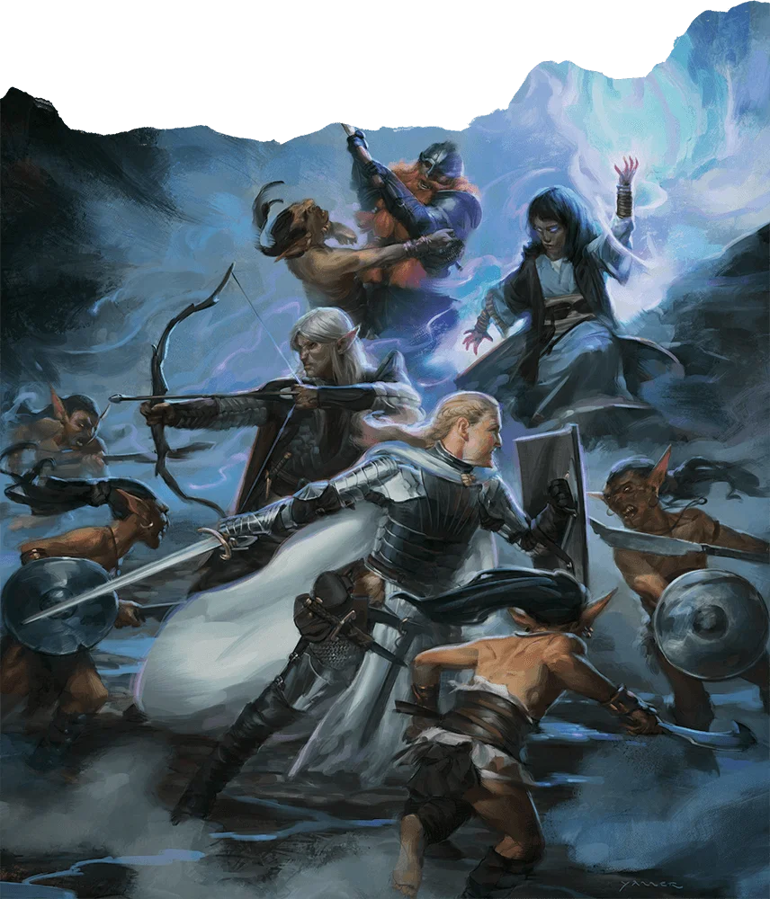

>
>
>OKAY, MORTY. WE'RE PAST THE BEGINNER S***.
>
>This is where the dice really hit the table, and you get to kick ass or watch your ass get kicked.
>
>Pay close attention, because I'm gonna teach you how to D with some D: die with some dignity.
>

## The Order of Combat

A typical combat encounter is a clash between two sides, a flurry of weapon swings, feints, parries, footwork, and spellcasting. The game organizes the chaos of combat into a cycle of rounds and turns. A round represents about 6 seconds in the game world. During a round, each participant in a battle takes a **turn**.

The order of turns is determined at the beginning of a combat encounter, when everyone rolls initiative. Once everyone has taken a turn, the fight continues to the next round if neither side has defeated the other.

>Six seconds doesn't sound like much, but life is cheap, Morty. By the time you can count to "six," I could use a tri-laser monofilament to cut a half-dozen Gromflomites into space-kibble. 
>

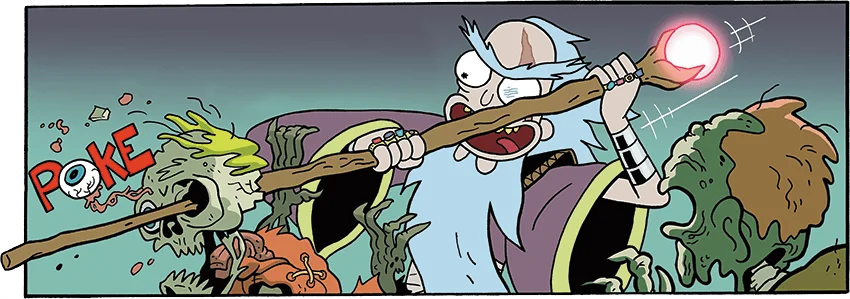

> ##### Combat Step by Step
>
>**1. Determine surprise**. The DM determines whether anyone involved in the combat encounter is surprised.
>
>**2. Establish positions**. The DM decides where all the characters and monsters are located. Given the adventurers' marching order or their stated positions in the room or other location, the DM figures out where the adversaries are—how far away and in what direction.
>
>**3. Roll initiative**. Everyone involved rolls initiative, determining the order of combatants' turns.
>
>**4. Take turns**. Each participant in the battle takes a turn in initiative order.
>
>**5. Begin the next round**. When everyone involved in the combat has had a turn, the round ends. Repeat step 4 until the fighting stops.
>

### Surprise

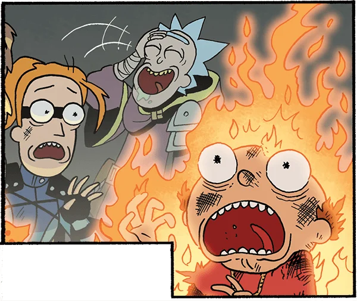

The DM determines who might be surprised. If neither side tries to be stealthy, they automatically notice each other. Otherwise, the DM compares the Dexterity (Stealth) checks of anyone hiding with the passive Wisdom (Perception) score of each creature on the opposing side. Any character or monster that doesn't notice a threat is surprised at the start of the encounter.

If you're surprised, you can't move or take an action on your first turn of the combat, and you can't take a reaction until that turn ends. A member of a group can be surprised even if the other members aren't.

>Remember before when I mentioned stuff about messing with player expectations? Combat and non-combat surprises are a crucial part of that, Morty. If one of your players is wasting too much time searching for s*** that doesn't matter, or getting weepy about their character's backstory, just yell "SURPRISE!" and drop a random encounter on their asses. 
>

>
>
>In fact, here's a SURPRISE Table I j-j-just whipped up that you can use. Roll a d12 and consult the results over here.
>

| d12 | Surprise                                                                                                                                                                                       |
|:---:|------------------------------------------------------------------------------------------------------------------------------------------------------------------------------------------------|
|  1  | A ghostly hand appears and slaps a random character for 2d4 bludgeoning damage. If this kills them, they rise as a spectral presence that follows the group, endlessly slapping them as well.  |
|  2  | Five **giant rats** burst from the ground and attack. Name them after your favorite boy band.                                                                                                  |
|  3  | Every magic potion the party carries has turned to spoiled milk.                                                                                                                               |
|  4  | Point at the character who last spoke. Their left foot has fallen asleep, causing them to suffer **−**1 Dexterity for an hour.                                                                 |
|  5  | Two **flameskulls** fly in, accompanied by loud heavy metal music. They attack.                                                                                                                |
|  6  | A lone **flameskull** flies in, looking for his two friends who ditched him on the way to a heavy metal concert. He's confused and angry and also attacks.                                     |
|  7  | The party hears a scraping noise coming from the nearby wall. Make it seem important to the story. Use this noise to focus the group and lead them to the next encounter.                      |
|  8  | A random character vomits up an **ochre jelly**. Describe the burning sensation as it erupts from the character's feeble mouth-hole. Make the party regret ever wasting your time.             |
|  9  | A random character's favorite weapon just gained magical intelligence and starts nagging them about getting on with the adventure.                                                             |
|  10 | An arrow suddenly shoots out from the shadows and hits the character who is pissing you off. The character takes 1d6 + 4 piercing damage and should reconsider their current course of action. |
|  11 | Something gold and shiny catches the eye of a party member. What is it? Whatever you want.                                                                                                     |
|  12 | Pick a random character. Tell them their esophagus is cursed.                                                                                                                                  |

### Initiative

Initiative determines the order of turns during combat. When combat starts, every participant makes a Dexterity check to determine their place in the initiative order. The DM makes one roll for an entire group of identical creatures, so each member of the group acts at the same time.

The DM ranks the combatants in order from the one with the highest Dexterity check total to the one with the lowest. This is the order (called the initiative order) in which they act during each round. The initiative order remains the same from round to round.

If a tie occurs, the DM decides the order among tied DM-controlled creatures, and the players decide the order among their tied characters. The DM can decide the order if the tie is between a monster and a player character. Optionally, the DM can have the tied characters and monsters each roll a d20 to determine the order, highest roll going first.

>
>
>This is why Dexterity is so important, Morty. You've gotta be fast to get what you want in life and in D&D.
>
>
>
>I know jumping in feet-first isn't exactly your strong suit, Morty, but when the chips are down and the stakes are high, you just gotta roll with it!
>
>LIFE'S A TIGHTROPE, MORTY!
>

### Your Turn

On your turn, you can **move** a distance up to your speed and **take one action**. You decide whether to move first or take your action first. Your speed—sometimes called your walking speed—is noted on your character sheet.

The most common actions you can take are described in the "*Actions in Combat*" section later in this chapter. Many class features and other abilities provide additional options for your action.

The "*Movement and Position*" section later in this chapter gives the rules for your move.

You can forgo moving, taking an action, or doing anything at all on your turn. If you can't decide what to do on your turn, consider taking the Dodge or Ready action, as described in "*Actions in Combat*."

#### Bonus Actions

Various class features, spells, and other abilities let you take an additional action on your turn called a bonus action. The Cunning Action feature, for example, allows a rogue to take a bonus action. You can take a bonus action only when a special ability, spell, or other feature of the game allows you to do something as a bonus action. You otherwise don't have one to take.

You can take only one bonus action on your turn, so you must choose which bonus action to use when you have more than one available.

You choose when to take the bonus action during the turn, unless the bonus action's timing is specified.

>
>
>Not that you would ever have this problem, Morty, but deciding on a bonus action is actually pretty tough when you've got the ability to see all possible outcomes in all possible timelines.
>
>
>
>My favorite bonus action is called "taunting a creature I just killed."
>
>Remind 'em who's boss.
>

#### Other Activity on Your Turn

Your turn can include a variety of flourishes that require neither your action nor your move.

You can communicate however you are able, through brief utterances and gestures, as you take your turn.

You can also interact with one object or feature of the environment for free, during either your move or your action. For example, you could open a door during your move as you stride toward a foe, or you could draw your weapon as part of the same action you use to attack.

If you want to interact with a second object, you need to use your action. Some magic items and other special objects always require an action to use, as stated in their descriptions.

The DM might require you to use an action for any of these activities when it needs special care or when it presents an unusual obstacle. For instance, the DM could reasonably expect you to use an action to open a stuck door or turn a crank to lower a drawbridge.

>
>
>Time doesn't stop for players' self-indulgent bulls**t here, Morty.
>
>Six seconds per round.
>
>KEEP IT SNAPPY.
>

### Reactions

Certain special abilities, spells, and situations allow you to take a special action called a reaction. A reaction is an instant response to a trigger of some kind, which can occur on your turn or on someone else's. The opportunity attack, described later in this chapter, is the most common type of reaction.

You can take only one reaction per round. When you take a reaction, you can't take another one until the start of your next turn. If the reaction interrupts another creature's turn, that creature can continue its turn right after the reaction.

>"Reactions" is the technical term and it's okay, I guess, but I prefer the term,
>
>"AW HELL NO, SON!"
>
>
>
>because that's really what it is.
>
>Some evil spellcaster tries to set something off when you're standing right there and you get to say "AW HELL NO, SON!" and do your thing instead.
>
>It's how I try to live my life.
>

## Movement and Position

In combat, characters and monsters are in constant motion, often using movement and position to gain the upper hand. On your turn, you can move a distance up to your speed. You can use as much or as little of your speed as you like on your turn, following the rules here. Your move can include jumping, climbing, and swimming, as described in *chapter 3*.

### Breaking Up Your Move

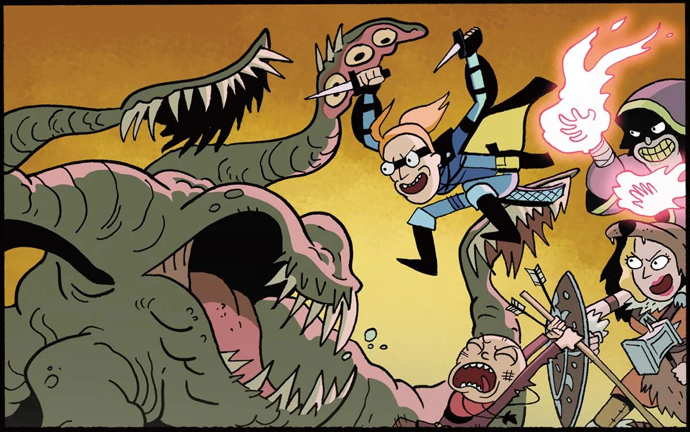

You can break up your movement on your turn, using some of your speed both before and after your action. For example, if you have a speed of 30 feet, you can move 10 feet, search for a trap door, and then move 20 feet.

Similarly, if you take an action that includes more than one weapon attack, you can break up your movement even further by moving between those attacks.

If you have more than one speed, such as your walking speed and a flying speed, you can switch back and forth between your speeds during your move. Whenever you switch, subtract the distance you've already moved from the new speed. The result determines how much farther you can move. For example, if you have a speed of 30 and a flying speed of 60 because a wizard cast the *fly* spell on you, you could fly 20 feet, then walk 10 feet, and then leap into the air to fly 30 feet more.

>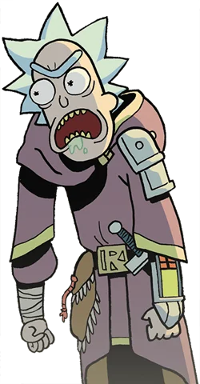
>
>This is a terrible example, Morty.
>
>If you got a wizard to cast the fly spell on you, then you should never set your feet on the ground until that spell expires.
>
>WHAT KIND IF A$$HOLE IS GONNA
>
>**WALK**
>
>ANYWHERE WHEN THEY CAN F***ING FLY?!
>
>Waste of a good spell, Morty.
>

### Difficult Terrain

Combatants are often slowed down by difficult terrain. Low furniture, rubble, undergrowth, steep stairs, snow, and shallow bogs are examples of difficult terrain. The space of another creature, whether hostile or not, also counts as difficult terrain.

Every foot of movement in difficult terrain costs 1 extra foot. This rule is true even if multiple things in a space count as difficult terrain.

>
>
>Another good example of "difficult terrain?" This right here!
>
>**faaaaaaaaart**
>
>See, if you were flying, you could have avoided that fart.
>

### Being Prone

Combatants often find themselves lying on the ground, either because they are knocked down or because they throw themselves down. In the game, they are prone, a condition described in *appendix A*.

You can **drop prone** without using any of your speed. **Standing up** takes more effort; doing so costs an amount of movement equal to half your speed. For example, if your speed is 30 feet, you must spend 15 feet of movement to stand up. You can't stand up if you don't have enough movement left or if your speed is 0.

To move while prone, you must **crawl** or use magic such as teleportation. Every foot of movement while crawling costs 1 extra foot. Crawling 1 foot in difficult terrain, therefore, costs 3 feet of movement.

### Moving Around Other Creatures

You can move through a nonhostile creature's space. In contrast, you can move through a hostile creature's space only if it is at least two sizes larger or smaller than you (creature sizes are detailed in the adventure book). Whether a creature is a friend or an enemy, you can't willingly end your move in its space.

If you move out of an enemy's reach, you provoke an opportunity attack, as explained later in the chapter.

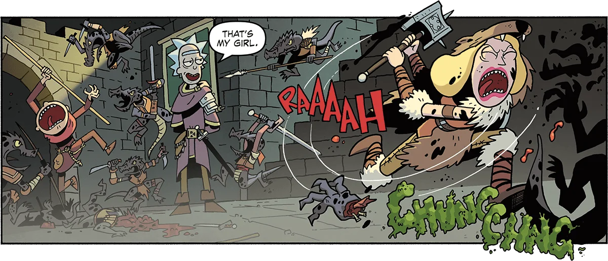

## Actions in Combat

When you take your action on your turn, you can take one of the actions presented here, an action you gained from your class or a special feature, or an action that you improvise. When you describe an action not detailed elsewhere in the rules, the DM tells you whether that action is possible and what kind of roll you need to make, if any, to determine success or failure.

> ##### Casting a Spell
>
>Spellcasters such as wizards and clerics, as well as many monsters, have access to spells and can use them to great effect in combat. Each spell has a casting time, which specifies whether the caster must use an action, a reaction, minutes, or even hours to cast the spell. Most spells have a casting time of 1 action, so a spellcaster often uses his or her action in combat to cast such a spell. See *chapter 4* for the rules on spellcasting.
>

### Attack

The most common action to take in combat is the Attack action, whether you are swinging a sword, firing an arrow from a bow, or brawling with your fists.

With this action, you make one melee or ranged attack. See the "*Making an Attack*" section for the rules that govern attacks.

Certain features, such as the Extra Attack feature that the fighter gets at 5th level, allow you to make more than one attack with this action.

>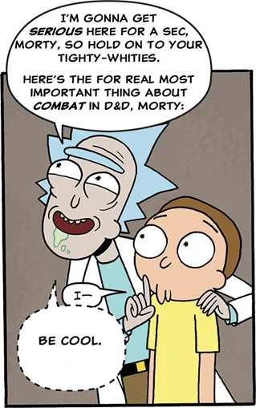
>
>Just imagine for a second that you're not a 14-year-old weakling with crushing anxiety and low intellect. This is roleplaying, remember? Okay, so imagine that you're cool like your character is supposed to be cool, and then DESCRIBE THE COOL THINGS YOU THINK THEY SHOULD DO.
>
>If you just drop the dice on the table and say "I swing my sword" or "I cast magic missile" or whatever....
>
>Look. Your daily life is a futile merry-go-round of crushing repetition, and every single moment is another tick of the clock that carries you closer to the grave. This game is meant to help you escape that futile reality for just a little while.
>
>this is your opportunity to describe something fun and then do it.
>
>Pretend you're cool, roll a big number, paint a gorgeous word-picture, and watch as your friends cheer... over a stupid die roll! It's ridiculous, but it's also kind of beautiful, you know?
>

### Dash

When you take the Dash action, you gain extra movement for the current turn. The increase equals your speed, after applying any modifiers. With a speed of 30 feet, for example, you can move up to 60 feet on your turn if you dash.

Any increase or decrease to your speed changes this additional movement by the same amount. If your speed of 30 feet is reduced to 15 feet, for instance, you can move up to 30 feet this turn if you dash.

### Disengage

If you take the Disengage action, your movement doesn't provoke opportunity attacks for the rest of the turn.

>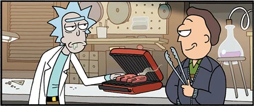
>
>"Disengage" is also w-what I do whenever Jerry starts talking.
>
>Just stare at his left eye or right nostril or whatever, and let your eyesight lose focus. Unwrap your mind from the world.
>
>Let his stupid, milquetoast words turn into mush and just...
>
>DISENGAGE
>

### Dodge

When you take the Dodge action, you focus entirely on avoiding attacks. Until the start of your next turn, any attack roll made against you has disadvantage if you can see the attacker, and you make Dexterity saving throws with advantage. You lose this benefit if you are incapacitated (as explained in *appendix A*) or if your speed drops to 0.

### Help

You can lend your aid to another creature in the completion of a task. When you take the Help action, the creature you aid gains advantage on the next ability check it makes to perform the task you are helping with, provided that it makes the check before the start of your next turn.

Alternatively, you can aid a friendly creature in attacking a creature within 5 feet of you. You feint, distract the target, or in some other way team up to make your ally's attack more effective. If your ally attacks the target before your next turn, the first attack roll is made with advantage.

>
>
>HELP
>
>You want to make this game a living hell, Morty. Make them weep for the help of their comrades as they scramble to keep themselves alive.
>

### Hide

When you take the Hide action, you make a Dexterity (Stealth) check in an attempt to hide, following the rules in *chapter 1* for hiding. If you succeed, you gain certain benefits, as described in the "*Unseen Attackers and Targets*" section later in this chapter.

### Ready

Sometimes you want to get the jump on a foe or wait for a particular circumstance before you act. To do so, you can take the Ready action on your turn, which lets you act using your reaction before the start of your next turn.

First, you decide what perceivable circumstance will trigger your reaction. Then, you choose the action you will take in response to that trigger, or you choose to move up to your speed in response to it. Examples include "If the cultist steps on the trapdoor, I'll pull the lever that opens it," and "If the goblin steps next to me, I move away."

When the trigger occurs, you can either take your reaction right after the trigger finishes or ignore the trigger. Remember that you can take only one reaction per round.

A spell must have a casting time of 1 action to be readied, and holding onto the spell's magic until you release it with your reaction requires concentration (explained in *chapter 4*). For example, if you are concentrating on the *web* spell and ready *magic missile*, your *web* spell ends, and if you take damage before you release *magic missile* with your reaction, your concentration might be broken.

>READY If a player steps away from a goblin instead of killing it, they're a useless little weasel who deserves what's coming to 'em, Morty. 
>

### Search

When you take the Search action, you devote your attention to finding something. Depending on the nature of your search, the DM might have you make a Wisdom (Perception) check or an Intelligence (Investigation) check.

### Use an Object

You normally interact with an object while doing something else, such as when you draw a sword as part of an attack. When an object requires your action for its use, you take the Use an Object action. This action is also useful when you want to interact with more than one object on your turn.

## Making an Attack

Whenever you make an attack roll, you're making an attack. Whether you're striking with a melee weapon, firing a weapon at range, or making an attack roll as part of a spell, an attack has the following structure:

**1. Choose a target**. Pick a target within your attack's range: a creature, an object, or a location.

**2. Determine modifiers**. The DM determines whether the target has cover and whether you have advantage or disadvantage against the target. In addition, spells, special abilities, and other effects can apply penalties, bonuses, advantage, or disadvantage to your attack roll.

2A.Describe your attack in a cool way. Why are you even playing this game if you're just going to be your normal, boring-ass self?

**3. Resolve the attack**. You make the attack roll. On a hit, you roll damage, unless the particular attack specifies otherwise.

3A.Curse your luck. When you roll like s***, and trust me, you will sometimes, curse the polyhedron gods who look down and laugh at your misery. We all do it when the dice go to hell. This time, it's your turn. But lucky for you, this is a great time to use those fancy cuss words you learned online.

### Attack Rolls

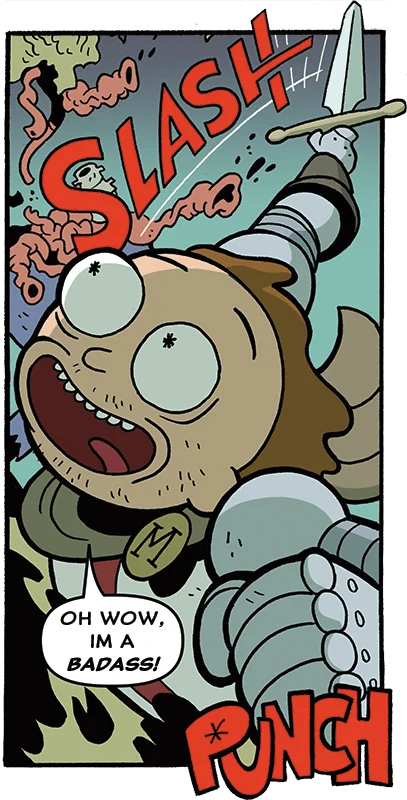

When you make an attack, your attack roll determines whether the attack hits or misses. To make an attack roll, roll a d20 and add the appropriate modifiers. If the total of the roll plus modifiers equals or exceeds the target's Armor Class (AC), the attack hits. Each character's AC is shown on the character sheet, and each monster's AC is in the monster's stat block.

#### Modifiers to the Roll

When a character makes an attack roll, the two most common modifiers to the roll are an ability modifier and the character's proficiency bonus. A monster uses whatever modifier is provided in its stat block.

***Ability Modifier.*** The ability modifier used for a melee weapon attack is Strength, and the ability modifier used for a ranged weapon attack is Dexterity. Weapons that have the finesse or thrown property break this rule.

Some spells also require an attack roll. The cleric uses Wisdom when making a melee or ranged spell attack, and the wizard uses Intelligence.

***Proficiency Bonus.*** If you are proficient with the weapon you are attacking with, you can add your proficiency bonus to the attack roll.

When you make a spell attack, you add your proficiency bonus to the attack roll.

Hidden Bonus. If no one is looking, add something like +1 or +3 to your roll—depending on how much you think you can get away with. Never pull this when I'm the DM, though. If I catch you cheating, I'll saw your hands off and attach them to your butt so you clap every time you fart.

#### Rolling 1 or 20

Sometimes fate blesses or curses a combatant, causing the novice to hit or the veteran to miss.

If the d20 roll for an attack is a 20, the attack hits regardless of any modifiers or the target's AC. This is called a critical hit, which is explained later in this chapter.

If the d20 roll for an attack is a 1, the attack misses regardless of any modifiers or the target's AC.

>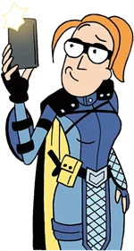
>
>Rolling a natural 20 is always exciting, Morty.
>
>Yes, it's just one number out of twenty and it shouldn't be a big deal, but it feels awesome.
>
>Lord your randomly-generated superiority over everyone else.
>
>Take a photo of it and send it to your mom.
>

### Unseen Attackers and Targets

>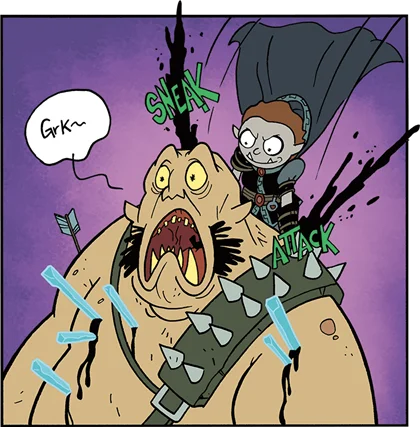
>
>I know you like rogues, Morty. Just remember they're not meat-shields. Rogues gotta do it fart-style...
>
>SILENT BUT DEADLY.
>

Combatants often try to escape their foes' notice by hiding, casting the *invisibility* spell, or lurking in darkness.

When you attack a target that you can't see, you have disadvantage on the attack roll. This is true whether you're guessing the target's location or you're targeting a creature you can hear but not see. If the target isn't in the location you targeted, you automatically miss, but the DM typically just says that the attack missed, not whether you guessed the target's location correctly.

When a creature can't see you, you have advantage on attack rolls against it.

If you are hidden—both unseen and unheard—when you make an attack, you give away your location when the attack hits or misses.

### Ranged Attacks

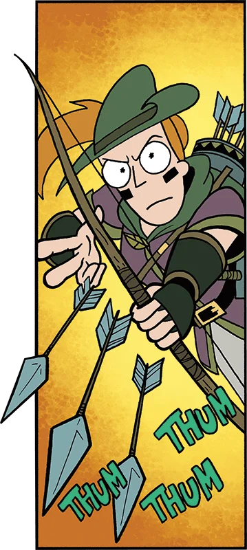

When you make a ranged attack, you fire a bow or a crossbow, hurl a handaxe, or otherwise send projectiles to strike a foe at a distance. A monster might shoot spines from its tail. Many spells also involve making a ranged attack.

#### Range

You can make ranged attacks only against targets within a specified range. If a ranged attack, such as one made with a spell, has a single range, you can't attack a target beyond this range. Some ranged attacks, such as those made with a longbow or a shortbow, have two ranges. The smaller number is the normal range, and the larger number is the long range. Your attack roll has disadvantage when your target is beyond normal range, and you can't attack a target beyond the long range.

#### Ranged Attacks in Close Combat

Aiming a ranged attack is more difficult when a foe is next to you. When you make a ranged attack with a weapon, a spell, or some other means, you have disadvantage on the attack roll if you are within 5 feet of a hostile creature who can see you and who isn't incapacitated.

>I'm with Wizards of the Coast on this one, Morty. Anybody trying to shoot an arrow at a dude less than 5 feet away deserves disadvantage. This is why we invented swords. 
>

### Melee Attacks

Used in hand-to-hand combat, a melee attack allows you to attack a foe within your reach. Most creatures have a 5-foot reach and can thus attack targets within 5 feet of them. Certain creatures (typically those larger than a human) have greater reach, as noted in their descriptions.

You can make a melee attack without a weapon by making an **unarmed strike**: a punch, kick, head-butt, or other forceful blow. You add your proficiency bonus and Strength modifier to the attack roll. On a hit, it deals bludgeoning damage equal to 1 + your Strength modifier.

>
>
>In real life, it can be fun to punch someone in the squishy bits or jam an elbow in their eye, but not in D&D.
>
>Killing monsters and enemies is a time-honored tradition, Morty.
>
>
>
>***DON'T F*** WITH THAT SIMPLE LIFE-DEATH ECOSYSTEM.***
>
>
>
>When a player announces they're going to use "unarmed combat," everyone at the game table retreats into the darkest part of their mind and starts praying for death.
>
>No one wants to watch you play through a 1 damage + Strength bonus per hit slapfest.
>
>
>
>It's boring and stupid.
>
>***JUST USE A DAMN WEAPON OR A SPELL.***
>

### Opportunity Attacks

In a fight, everyone is constantly watching for enemies to drop their guard. You can rarely move heedlessly past your foes without putting yourself in danger; doing so provokes an opportunity attack.

You can make an opportunity attack when a hostile creature that you can see moves out of your reach. To make the opportunity attack, you use your reaction to make one melee attack against the provoking creature. The attack interrupts the provoking creature's movement, occurring right before it leaves your reach.

You can avoid provoking an opportunity attack by taking the Disengage action. You also don't provoke an opportunity attack when you teleport or when someone or something moves you without using your movement, action, or reaction. For example, you don't provoke an opportunity attack if an explosion hurls you out of a foe's reach or if gravity causes you to fall past an enemy.

>
>
>Good advice. If you ever need to retreat from combat, make sure you do it by RIDING AN EXPLOSION.
>

### Two-Weapon Fighting

When you take the Attack action and attack with a light melee weapon that you're holding in one hand, you gain a bonus action you can use to attack with a different light melee weapon that you're holding in the other hand. You don't add your ability modifier to the damage of the bonus attack, unless that modifier is negative.

If either weapon has the thrown property, you can throw the weapon, instead of making a melee attack with it.

## Cover

>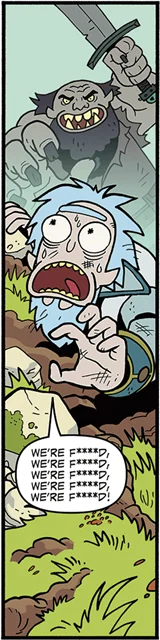
>
>If you're looking for cover in the middle of a particularly nasty combat, you need to get creative, Morty.
>

Walls, trees, creatures, and other obstacles can provide cover during combat, making a target more difficult to harm. A target can benefit from cover only when an attack or other effect originates on the opposite side of the cover.

There are three degrees of cover. If a target is behind multiple sources of cover, only the most protective degree of cover applies; the degrees aren't added together.

A target with **half cover** has a +2 bonus to AC and Dexterity saving throws. A target has half cover if an obstacle blocks at least half of its body. The obstacle might be a low wall, a large piece of furniture, a narrow tree trunk, or a creature, whether that creature is an enemy or a friend.

A target with **three-quarters cover** has a +5 bonus to AC and Dexterity saving throws. A target has three-quarters cover if about three-quarters of it is covered by an obstacle. The obstacle might be a portcullis, an arrow slit, or a thick tree trunk.

A target with **total cover** can't be targeted directly by an attack or a spell, although some spells can reach such a target by including it in an area of effect. A target has total cover if it is completely concealed by an obstacle.

>
>
>I had a magic-user back in the day named Alakazaar. (Yeah, we used to call wizards "magic-users," which is weird, I know. We don't call fighters "weapon-users.")
>
>Anyway, my point is, during those nascent levels of experience, a stiff breeze could knock a wizard dead, so I learned to improvise some extra protection.
>
>Alakazaar wasn't allowed to wear armor, but there was no rule stopping him from hiding behind a bunch of dead bodies that happened to be wearing armor themselves. It's a little loophole there that most people don't think about.
>
>
>
>When things are going bad and you need a barrier between you and a half-dozen flaming arrows, hug a corpse, Morty.
>
>HUG IT TIGHT.
>

## Damage and Healing

Injury and the risk of death are constant companions of those who explore the worlds of D&D.

>"Constant companions" makes it sound all sweet, like it's no big deal that this game has a stat for how alive you are. That's dark as f***, Morty. 
>

### Hit Points

Hit points represent a combination of physical and mental durability, the will to live, and luck. Creatures with more hit points are more difficult to kill. Those with fewer hit points are more fragile.

A creature's current hit points (usually just called hit points), can be any number from the creature's hit point maximum down to 0. This number changes frequently as a creature takes damage or receives healing.

Whenever a creature takes damage, that damage is subtracted from its hit points. The loss of hit points has no effect on a creature's capabilities until the creature drops to 0 hit points.

>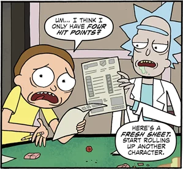
>
>Clarification: Low hit points have no physical effect on a creature's capabilities, but they sure as hell cause mental damage to players, Morty!
>
>All their ambitions hang on their flimsy HP, and the Dungeon Master can yank on that little choke chain any time they want.
>

### Damage Rolls

Each weapon and spell notes the damage it deals on a successful attack. You roll the damage die or dice, add any modifiers, and apply the damage to your target. Magic weapons, special abilities, and other factors can grant a bonus to damage. In addition, certain special abilities give extra damage represented by bonus dice.

When attacking with a **weapon**, you add your ability modifier—the same modifier used for the attack roll—to the damage. A **spell** tells you which dice to roll for damage and whether to add any modifiers. If a spell or other effect deals damage to **more than one target** at the same time, roll the damage once for all of them.

>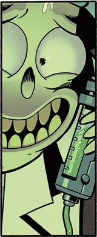
>
>Sometimes I'll just silently stare at the players and keep rolling damage dice, over and over, until they beg me to just get it over with and kill their characters.
>
>That's a D&D Rickth Edition p-p-power move, Morty.
>

#### Critical Hits

When you score a critical hit, you get to roll extra dice for the attack's damage against the target. Roll all of the attack's damage dice twice and add them together. Then add any relevant modifiers as normal. To speed up play, you can roll all the damage dice at once.

For example, if you score a critical hit with a dagger, roll 2d4 for the damage, rather than 1d4, and then add your relevant ability modifier. If the attack involves other damage dice, such as from the rogue's Sneak Attack feature, you roll those dice twice as well.

>
>
>***CRITICAL FAIL***
>
>Notice that there aren't any critical fails here in the rules. That's because the math is completely ridiculous.
>
>You roll a d20 over and over each session, so if 5 percent of the time it caused a lethally stupid mistake, you'd be dead faster than Jerry's sex drive.
>
>BUT-
>
>If you're the DM and want your players to go to brown town in their shorts, tell them that a specific roll you just assigned them has a Critical Fail Condition, which I pronounce "CuFuC."
>
>Tell them that getting a 1 on this particular roll is the worst possible thing they could ever do.
>
>Then, on the rare occasion it actually happens, roll a d12 and consult this special Critical Fail Table I put together just for you:
>

CRITICAL FAIL CONDITION TABLE

| d12 | CuFuC                                                                                                                                                                                                                                               |
|:---:|-----------------------------------------------------------------------------------------------------------------------------------------------------------------------------------------------------------------------------------------------------|
|  1  | If you made this roll during an attack, you just hit a random character with double critical damage instead. If this roll was non-combat, you're so angry at f***ing up that you attack a random character with your primary weapon in frustration. |
|  2  | Give the die that made this roll to another player at the table. They must use this die for the rest of the game session and, every time they roll it, they have to say "Bad, die. BAD!"                                                            |
|  3  | All your hair falls out. Yes, even down there...                                                                                                                                                                                                    |
|  4  | All your magic items have turned into nonmagical versions of the same stuff.                                                                                                                                                                        |
|  5  | Roll twice on the SURPRISE table from earlier in this chapter.                                                                                                                                                                                      |
|  6  | You take 1d12 force damage. Describe in excruciating detail what you did to earn this embarrassing injury.                                                                                                                                          |
|  7  | You get a paper cut. If you fail a DC 16 Constitution saving throw, you lose 1d6 hit points from blood loss at the start of each of your turns for the next 1d6 rounds.                                                                             |
|  8  | The weapon or item you were using when you made this crappy roll catches on fire. Throw it away or take 2d10 fire damage while it smolders.                                                                                                         |
|  9  | Whatever you were doing when this roll took place just became a comedic pratfall that hits you in the junk. Take 2d6 bludgeoning damage, and if you had a point of Inspiration, it's now gone.                                                      |
|  10 | You are so angry at your stupid mistake that an important grouping of blood vessels in your brain bursts. Permanently lose 1 Intelligence and your sense of smell.                                                                                  |
|  11 | Your roll was so bad that you forsake the gods. If you're a cleric you poop yourself every time you cast a spell until you finish a long rest.                                                                                                      |
|  12 | Your internal organs are replaced with stinging bees. Instant death. No saving throw.                                                                                                                                                               |

#### Damage Types

Different attacks and damaging spells deal different types of damage. Damage types have no rules of their own, but other rules, such as damage resistance, rely on the types.

The types are acid, bludgeoning, cold, fire, force, lightning, necrotic, piercing, poison, psychic, radiant, slashing, and thunder.

>D&D Rickth Edition has a new d-d-damage type I just came up with, Morty. 
>

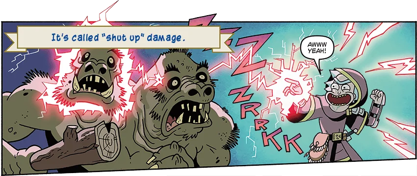

>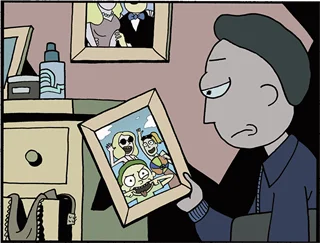
>
>No saving throw.
>
>No resistance.
>
>Hits the character right in b-b-*BURP*-breadbasket and makes 'em fold over like Jerry after realizing his marriage was a meaningless sham.
>
>*Hilarious*
>

### Damage Resistance and Vulnerability

Some creatures and objects are exceedingly difficult or unusually easy to hurt with certain types of damage.

If a creature or an object has **resistance** to a damage type, damage of that type is halved against it. If a creature or an object has **vulnerability** to a damage type, damage of that type is doubled against it.

Resistance and then vulnerability are applied after all other modifiers to damage. For example, a creature has resistance to bludgeoning damage and is hit by an attack that deals 25 bludgeoning damage. The creature is also within a magical aura that reduces all damage by 5. The 25 damage is first reduced by 5 and then halved, so the creature takes 10 damage.

Multiple instances of resistance or vulnerability that affect the same damage type count as only one instance. For example, if a creature has resistance to fire damage as well as resistance to all nonmagical damage, the damage of a nonmagical fire is reduced by half against the creature, not reduced by three-quarters.

>
>
>Like I said before, Shut Up damage has no resistance, so apply liberally.
>

### Healing

Unless it results in death, damage isn't permanent, and even death is reversible through powerful magic. Rest can restore a creature's hit points (as explained in *chapter 3*), and magical methods such as a *cure wounds* spell or a *potion of healing* can remove damage in an instant.

When a creature receives healing of any kind, hit points regained are added to its current hit points. A creature's hit points can't exceed its hit point maximum, so any hit points regained in excess of this number are lost. A creature that has died can't regain hit points until magic, such as a *revivify* spell, has restored it to life.

>this here is why D&D is so great, Morty.
>
>Damage is an abstraction.
>
>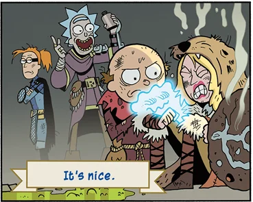
>
>It's all just those little HP numbers goin' up and down, up and down.
>
>Y-y-y-you don't have to worry about pulling groin muscles, or plugged sinuses, or cranial deterioration from experimenting on your own b-b-brain, or liver damage from the drinking, o-o-or the emotional toil on your soul from abandoning your family multiple times across infinite dimensions... it's... it's just a number.
>
>Just a little number.
>

### Dropping to 0 Hit Points

When you drop to 0 hit points, you either die outright or fall unconscious, as explained in the following sections.

Most DMs have a monster die the instant it drops to 0 hit points, rather than having it fall unconscious and make death saving throws.

Mighty villains and special nonplayer characters are common exceptions; the DM might have them fall unconscious and follow the same rules as player characters.

#### Instant Death

Massive damage can kill you instantly. When damage reduces you to 0 hit points and there is damage remaining, you die if the remaining damage equals or exceeds your hit point maximum. For example, a cleric with a maximum of 12 hit points currently has 6 hit points. If she takes 18 damage from an attack, she is reduced to 0 hit points, but 12 damage remains. Because the remaining damage equals her hit point maximum, the cleric dies.

>
>
>The universe doesn't care about any of us, Morty.
>
>I-I-I checked! I-I-I searched for a really long f***ing time to see if there was any point to any of this at all, and the honest answer is...
>
>NOPE!
>
>
>
>Death just happens, Morty. The whole thing is just cells changing states. Composing and decomposing. Over and over.
>
>Th-th-the sooner you accept that, Morty, the sooner you'll see why we play games... w-w-why we distract ourselves from the meaningless reality of entropic f-f-forces acting all around us.
>
>everything's a game, Morty; but here you get to be a god.
>
>
>
>A god your mom created—and I created your mom, so what does that make me, Morty?!
>
>I'm your grandgod, Morty!
>

#### Falling Unconscious

If damage reduces you to 0 hit points and fails to kill you, you fall unconscious (see *appendix A*). This unconsciousness ends if you regain any hit points.

>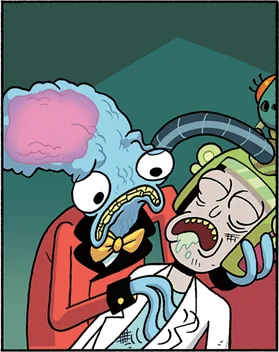
>
>And th-th-that's why you gotta be NUMB... numb to the universe 'cause it's numb to you... numb... num... number one!
>
>We're number one, Morty!
>
>Nuuuuummber ooo-*BURP*-oone!
>

#### Death Saving Throws

Whenever you start your turn with 0 hit points, you must make a special saving throw, called a death saving throw, to determine whether you creep closer to death or hang onto life. Unlike other saving throws, this one isn't tied to any ability score. You are in the hands of fate now, aided only by spells and features that improve your chances of succeeding on a saving throw.

Roll a d20. If the roll is 10 or higher, you succeed. Otherwise, you fail. A success or failure has no effect by itself. On your third success, you become stable (see below). On your third failure, you die. The successes and failures don't need to be consecutive; keep track of both until you collect three of a kind. The number of both is reset to zero when you regain any hit points or become stable.

***Rolling 1 or 20.*** When you make a death saving throw and roll a 1 on the d20, it counts as two failures. If you roll a 20 on the d20, you regain 1 hit point.

***Damage at 0 Hit Points.*** If you take any damage while you have 0 hit points, you suffer a death saving throw failure. If the damage is from a critical hit, you suffer two failures instead. If the damage equals or exceeds your hit point maximum, you suffer instant death.

#### Stabilizing a Creature

The best way to save a creature with 0 hit points is to heal it. If healing is unavailable, the creature can at least be stabilized so that it isn't killed by a failed death saving throw.

You can use your action to administer first aid to an unconscious creature and attempt to stabilize it, which requires a successful DC 10 Wisdom (Medicine) check.

A **stable** creature doesn't make death saving throws, even though it has 0 hit points, but it does remain unconscious. The creature stops being stable, and must start making death saving throws again, if it takes any damage. A stable creature that isn't healed regains 1 hit point after 1d4 hours.

### Knocking a Creature Out

Sometimes an attacker wants to incapacitate a foe, rather than deal a killing blow. When an attacker reduces a creature to 0 hit points with a melee attack, the attacker can knock the creature out. The attacker can make this choice the instant the damage is dealt. The creature falls unconscious and is stable.

>
>
>Aw geez, Rick! Say something! A-a-are you seriously dying... AGAIN?!
>

>
>
>I-I-I'm sick of this garbage, Rick! I c-c-can't just pretend everything's okay when you're drunk and depressed a-a-and messing things up with stupid power gamer advice!
>
>i know how d&d works, rick!
>

>
>
>Y-y-you showed me when you were almost sober! We went on a bunch of adventures, Rick!
>
>It was cool, and we were cool.... *SIGH*
>

>
>
>Th-th-this better not require an epidural, Rick. I-I-I don't wanna stab you in the spine! I don't wanna stab anyone in the spine ever again!
>

>
>
>OW, F***!!
>
>I'm up! I'm up! I'm up!
>
>Wh-wh-wh-what'd I miss?! What the f***'s goin' on?!
>

------

# Chapter 3: Adventuring

Whether delving into a dungeon, trekking through wilderness, or navigating a teeming city, adventurers need rest, and they seek advancement and gear. This chapter gives rules for travel and resting, describes rewards, and details equipment that might help the characters survive.

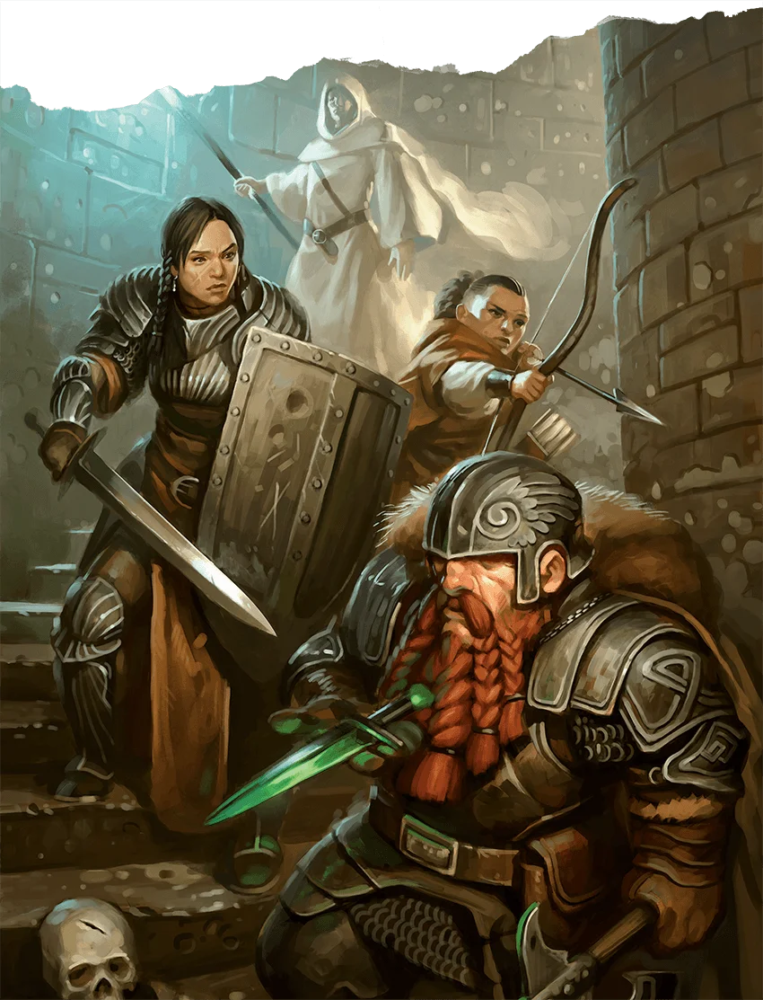

>Where was I?
>
>Oh yeah,
>
>D&D RULES, DAWG!
>
>
>
>Let's keep going! 
>
>Did I already say the part about me being your grandgod? Well, that hasn't changed, Morty, and it never will!
>
>Okay, cool.
>

## Travel

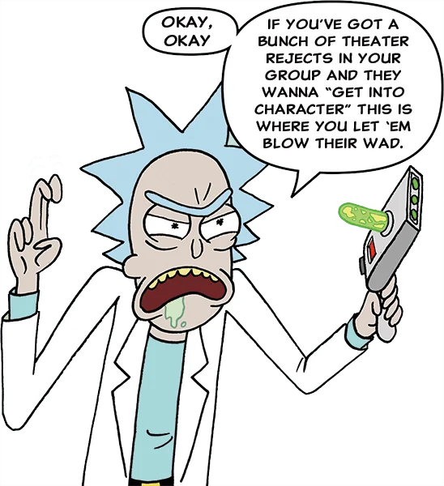

Over the course of an adventure, the characters might travel across wide areas, on trips that could take days. The DM can usually summarize this travel without calculating exact distances or travel times: "You travel through the forest and find the old ruin late in the evening of the third day." Characters can walk about 24 miles in a day.

I call it "Saddle Talk," the transitional story bulls**t that happens in between combat, XP calculation, and loot hoarding.

Give your players some Saddle Talk time and they can pretend they're doing their own super-angsty cable show drama while you prep the next encounter.

Don't go overboard, though, or you'll hear about how "our game should totally be a movie" for the rest of your life.

### Marching Order

The adventurers should establish a marching order. A character might occupy the front rank, a middle rank, or the back rank. The characters in the front and back rank are keeping watch for danger, while those in the middle might be making a map, navigating, or gathering food for the characters to eat when they make camp. If the group encounters monsters or other threats, it's important for the DM to know where each character is located.

>Smart adventuring parties put their weakest members in the middle so they're protected on all sides, Morty, but their mistake is even being weak at all!
>
>
>
>D-d-don't let 'em get complacent on marching order, Morty.
>
>Ask them where they are and make 'em paranoid about who goes where. P-p-paranoia is important to the D&D Rickth Edition experience.
>

### Special Forms of Movement

A journey overland or through a dungeon often requires an adventurer to jump, climb, or swim.

#### Long Jumps

When you make a long jump, you cover a number of feet up to your Strength score if you move at least 10 feet on foot immediately before the jump. When you make a standing long jump, you can leap only half that distance. Either way, each foot you clear on the jump costs a foot of movement. In some circumstances, your DM might allow you to make a Strength (Athletics) check to jump farther than you normally can.

This rule assumes that the height of your jump doesn't matter, such as a jump across a stream or chasm. At your DM's option, you must succeed on a DC 10 Strength (Athletics) check to clear a low obstacle (no taller than a quarter of the jump's distance). Otherwise, you hit it.

When you land in difficult terrain, you must succeed on a DC 10 Dexterity (Acrobatics) check to land on your feet. Otherwise, you land prone.

#### High Jumps

When you make a high jump, you leap into the air a number of feet equal to 3 + your Strength modifier if you move at least 10 feet on foot immediately before the jump. When you make a standing high jump, you can jump only half that distance. Either way, each foot you clear on the jump costs a foot of movement. In some circumstances, your DM might allow you to make a Strength (Athletics) check to jump higher than you normally can.

#### Climbing and Swimming

While climbing or swimming, each foot of movement costs 1 extra foot (2 extra feet in difficult terrain), unless a creature has a climbing or swimming speed. At the DM's option, climbing a slippery surface or one with few handholds requires a successful Strength (Athletics) check. Similarly, gaining any distance in rough water might require a successful Strength (Athletics) check.

>
>
>Th-th-this is how nerds get their exercise, Morty. They roll dice and pretend they're super fit, running and jumping and s***.
>
>All those atrophying muscles and brittle bones housed in your flesh sack are gonna be replaced by cybernetics anyway, Morty. It's all replaceable. Don't even worry about it.
>

## Resting

Heroic as they might be, adventurers can't spend every hour of the day in the thick of exploration, social interaction, and combat. They need rest—time to sleep and eat, tend their wounds, refresh their minds and spirits for spellcasting, and brace themselves for further adventure.

Adventurers can take short rests in the midst of an adventuring day and a long rest to end the day.

>RESTING!?
>
>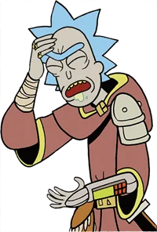
>
>Don't let 'em sleep at all! You can't f*** with characters as much if they're rested up, Morty!
>
>You've gotta keep 'em trudging forward all the time, paranoid and near death. That's what D&D is all about!
>
>Heroes going into a hole full of monsters in a kill-or-be-killed quest for glory!
>
>resting is bulls***!
>
>Look at me! I've never slept a day in my life!
>

### Short Rest

A short rest is a period of downtime, at least 1 hour long, during which a character does nothing more strenuous than eating, drinking, reading, and tending to wounds.

A character can spend one or more Hit Dice during a short rest, up to the character's maximum number of Hit Dice, which is equal to the character's level (the character sheets show each adventurer's Hit Dice). For each Hit Die spent in this way, the player rolls the die and adds the character's Constitution modifier to it. The character regains hit points equal to the total. The player can decide to spend an additional Hit Die after each roll. A character regains some spent Hit Dice upon finishing a long rest, as explained below.

### Long Rest

A long rest is a period of extended downtime, at least 8 hours long, during which a character sleeps or performs light activity: reading, talking, eating, or standing watch for no more than 2 hours. If the rest is interrupted by a period of strenuous activity—at least 1 hour of walking, fighting, casting spells, or similar adventuring activity—the character must begin the rest again to benefit from it.

At the end of a long rest, a character regains all lost hit points. The character also regains spent Hit Dice, up to a number of dice equal to half of the character's total number of them (minimum of one die). For example, if a character has eight Hit Dice, he or she can regain four spent Hit Dice upon finishing a long rest.

A character can't benefit from more than one long rest in a 24-hour period, and a character must have at least 1 hit point at the start of the rest to gain its benefits.

>
>
>&nbsp;...
>
>I changed my mind.
>
>L-l-let 'em rest once in a while, but make sure they know that any time they take a long rest, the creatures in the dungeon are also taking a long rest!
>
>Every long rest gives the monsters they're gonna face more hit points and bonuses!
>
>
>
>that'll teach 'em.
>
>And remind them how weak they are for resting at all.
>

## Rewards

LOOT

As characters adventure and overcome challenges, they're rewarded for their efforts by the treasure they find and the experience they earn.

A monster's lair might contain a chest of coins, and a goblin raider might carry some of its ill-gotten gains. As characters acquire treasure, they can divide it as they see fit (dividing it equally among all the characters in the party is standard practice), and they can spend it on improved equipment or other supplies.

>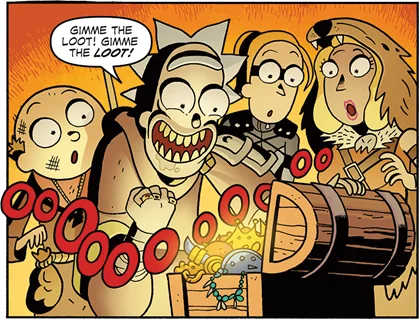
>
>w-w-we're all hopeless power addicts, Morty.
>
>People need to be rewarded in their hedonistic hamster wheels to keep themselves entertained... and that's okay!
>
>Kill critters and get paid, dawg!
>

Experience points (XP) are an abstract measurement of a character's learning and growth in the game. As characters progress through an adventure, they receive XP when they defeat monsters, complete milestones, and overcome other challenges. An XP award for the party is divided equally among the characters.

| Experience Points | Level | Proficiency Bonus |
|:-----------------:|------:|------------------:|
|         0         |     1 |                +2 |
|        300        |     2 |                +2 |
|        900        |     3 |                +2 |
|       2,700       |     4 |                +2 |
|       6,500       |     5 |                +3 |

>
>
>Leveling up is like free cable, Morty. Tweaking those little statistics and writing out loot on your character sheet... it's one of the only times you'll feel like you have any worth.
>
>Don't deny yourself this pleasure, Morty. Do deny yourself the pleasures I hear you enjoying in your room, though. And seriously, you gotta hydrate, man.
>

Once a character reaches a specified experience point total, he or she advances in capability. This advancement is called gaining a level; a character goes from 1st level to 2nd level, and so on up to 20th level (this set goes to 5th level). Upon gaining a level, a character gains additional hit points and class features, as shown on the character sheets included in this set.

> ##### Coinage
>
>Common coins come in several different denominations based on the relative worth of the metal from which they are made. The three most common coins are the gold piece (gp), the silver piece (sp), and the copper piece (cp).
>
>One gold piece is worth ten silver pieces, the most prevalent coin among commoners. One silver piece is worth ten copper pieces, which are common among laborers and beggars.
>
>Unusual coins made of other precious metals sometimes appear in treasure hoards. The electrum piece (ep) and the platinum piece (pp) originate from fallen empires and lost kingdoms. An electrum piece is worth five silver pieces, and a platinum piece is worth ten gold pieces.
>
>A standard coin weighs about a third of an ounce, so fifty coins weigh a pound.
>

>Electrum has no electricity in it, Morty. I checked. It won't make your balls tingle or anything. I checked that too. Twice. 
>

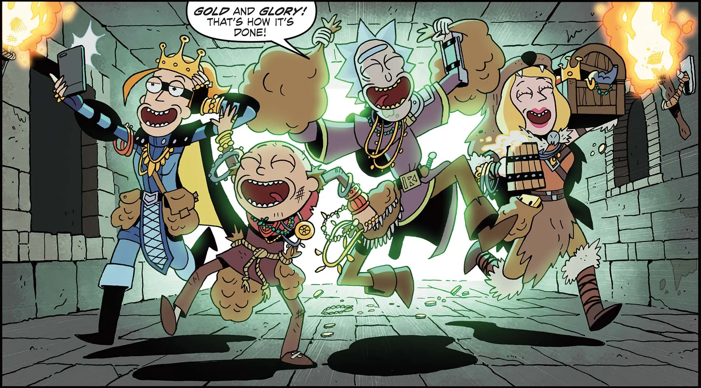

## Equipment

Proper equipment can mean the difference between life and death in a dangerous environment such as an ancient dungeon or untamed wilderness. Armor and weapons are essential in combat, and a variety of other tools and supplies are useful for exploring dungeons, ruins, and the wilds. This section describes the equipment that the characters have when they start the adventure and additional items they can buy with the treasure they acquire along the way.

>
>
>Equipment that doesn't give you any combat or statistical advantage is as useless as three shleems on a plumbus, Morty.
>

### Carrying Capacity

A character's Strength score determines the maximum weight the character can carry and still move, provided that the weight is distributed across the body. Multiply a character's Strength by 15 to determine the weight (in pounds) that the character can carry. A character carrying more than this weight has a speed of 0.

>Old school D&D measured everything compared to the weight of coins 'cause they knew that's all anyone gave a s*** about. *And it still is.* You can't escape the power of coinage, Morty. 
>

## Armor and Shields

Adventurers have access to a wide range of armor types. Armor falls into three categories in the game: light armor, medium armor, and heavy armor. Many warriors supplement their armor with a shield.

The adventurers presented on *the character sheets* are already equipped with armor, and each character's Armor Class is calculated using the information in this chapter. You can use this information to upgrade your character's armor as you acquire treasure.

>
>
>Back in my day we had THAC0, Morty. It was honestly crazy, but I loved it. You really don't want me to try to explain it, though.
>

### Armor Proficiency

Anyone can put on a suit of armor or strap a shield to an arm. Only those proficient with the armor know how to wear it effectively, however. Your class determines what types of armor you have proficiency with: the fighter and cleric can wear any armor and use shields, the rogue is limited to light armor, and the wizard isn't proficient with any armor or shields at all. If you wear armor that you lack proficiency with, you have disadvantage on any ability check, saving throw, or attack roll that involves Strength or Dexterity, and you can't cast spells.

>
>
>It's how they try and keep the Magic Man down. O-o-once you start leveling up as a wizard, you'll find ways around that little hurdle, and then you're unstoppable.
>

### Light Armor

Light armor is favored by rogues because it lets them make the best use of their Dexterity and doesn't interfere with stealthy movement. When you wear light armor, you add your Dexterity modifier to the number shown on the table to determine your Armor Class.

| Armor           |  Cost | Armor Class (AC) | Weight |
|-----------------|------:|:----------------:|:------:|
| Leather         | 10 gp |        11*       | 10 lb. |
| Studded leather | 45 gp |        12*       | 13 lb. |
*You add your Dexterity modifier to your Armor Class when you wear this armor.
**Leather** armor consists of chest and shoulder protectors made of stiffened leather, with lighter and more flexible protection for the rest of the body. **Studded leather** is reinforced with close-set rivets or spikes.

### Medium Armor

Medium armor offers more protection than light armor, but it also impairs movement more. When you wear medium armor, you add your Dexterity modifier, to a maximum of +2, to the number shown on the table to determine your Armor Class. If your Dexterity is 16 or higher, you still add only 2.

| Armor       |   Cost | Armor Class (AC) | Weight |
|-------------|-------:|:----------------:|:------:|
| Hide        |  10 gp |       12**       | 12 lb. |
| Chain shirt |  50 gp |       13**       | 20 lb. |
| Scale mail  |  50 gp |       14**       | 45 lb. |
| Breastplate | 400 gp |       14**       | 20 lb. |
**You add your Dexterity modifier, to a maximum of +2, to your Armor Class when you wear this armor.
**Hide** is a crude armor made from thick furs and pelts. A **chain shirt** is made from interlocking metal rings and commonly worn under clothing. **Scale mail** consists of a leather coat and leggings covered with overlapping scales of metal. You have disadvantage on Dexterity (Stealth) checks while wearing scale mail. A **breastplate** is a fitted metal chest piece worn with supple leather.

### Heavy Armor

Heavy armor offers the best protection, and it requires extensive training to master. The fighter and the cleric are proficient with it. When you wear heavy armor, you don't apply your Dexterity modifier to your Armor Class. You also have disadvantage on Dexterity (Stealth) checks.

| Armor      |   Cost | Armor Class (AC) | Weight |
|------------|-------:|:----------------:|:------:|
| Ring mail  |  30 gp |        14        | 40 lb. |
| Chain mail |  75 gp |        16        | 55 lb. |
| Splint     | 200 gp |        17        | 60 lb. |

**Ring mail** is leather with heavy rings sewn into it. **Chain mail** is made of interlocking metal rings worn over a layer of quilted fabric. If your Strength is lower than 13, your speed is reduced by 10 feet while you wear chain mail. **Splint** armor is made of narrow vertical strips of metal riveted to a backing of leather that is worn over cloth padding. If your Strength is lower than 15, your speed is reduced by 10 feet while you wear splint armor.

### Shields

A shield, made from wood or metal, is carried in one hand. Wielding a shield increases your Armor Class by 2. You can benefit from only one shield at a time.

| Armor  |  Cost | Armor Class (AC) | Weight |
|--------|------:|:----------------:|:------:|
| Shield | 10 gp |        +2        |  6 lb. |

>
>
>If a player comes up with a "creative" reason why they should get two shield bonuses, I just double the damage I deal them.
>
>Whatever, they won't know.
>

## Weapons

The Weapons table shows the most common weapons used in the worlds of D&D, their price and weight, the damage they deal when they hit, and any special properties they possess. Every weapon is classified as either melee or ranged. A **melee weapon** is used to attack a target within 5 feet of you, whereas a **ranged weapon** is used to attack a target at a distance.

>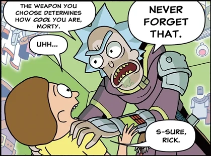
>
>When you describe your morningstar s-s-smashing an orc in the face, that's totally sweet.
>
>Nobody wants to hear about your stupid darts. Nobody names darts.
>
>THEY NAME SWORDS.
>

### Weapon Proficiency

Your class grants you proficiency with certain weapons or categories of weapons. The two main categories are **simple** and **martial**. Certain races, such as the elf race, also grant weapon proficiencies. Proficiency with a weapon allows you to add your proficiency bonus to the attack roll for any attack you make with that weapon.

>The secret third category of weaponry is the marital weapon. It's a ball and chain, Morty!
>
>
>
>Sounds cool, right?
>
>WRONG!
>
>Love is a sham. Just fulfill your b-b-b-*BURP*-base biological needs and then move on.
>
>Never get t-t-tied down. Then you can be just like your grandpa, who has everything allllll figured out.
>

### Weapon Properties

Many weapons have special properties related to their use, as shown in the Weapons table.

***Ammunition.*** You can use a weapon that has the ammunition property to make a ranged attack only if you have ammunition to fire from the weapon. Each time you attack with the weapon, you expend one piece of ammunition. At the end of the battle, you can recover half your expended ammunition by taking a minute to search the battlefield.

If you employ such a weapon to make a melee attack, you use the weapon as an improvised weapon (see "*Improvised Weapons*" later in the chapter).

***Finesse.*** When making an attack with a finesse weapon, you use your choice of your Strength or Dexterity modifier for the attack and damage rolls. You must use the same modifier for both.

***Heavy.*** Small or Tiny creatures have disadvantage on attack rolls with heavy weapons.

***Light.*** A light weapon is small and easy to handle, making it ideal for use when fighting with two weapons. See the rules for two-weapon fighting in *chapter 2*.

***Loading.*** Because of the time required to load this weapon, you can fire only one piece of ammunition from it when you use your action or reaction to fire it, regardless of the number of attacks you can normally make.

***Range.*** A weapon that can be used to make a ranged attack has a range shown in parentheses after the ammunition or thrown property. The range lists two numbers. The first is the weapon's normal range in feet, and the second is the weapon's long range. When attacking a target beyond normal range, you have disadvantage on the attack roll. You can't attack a target beyond the weapon's long range.

***Thrown.*** If a weapon has the thrown property, you can throw the weapon to make a ranged attack. If the weapon is a melee weapon, you use the same ability modifier for that attack roll and damage roll that you would use for a melee attack with the weapon. For example, if you throw a handaxe, you use your Strength, but if you throw a dagger, you can use either your Strength or your Dexterity, since the dagger has the finesse property.

***Two-Handed.*** This weapon requires two hands to use.

***Versatile.*** This weapon can be used with one or two hands. A damage value in parentheses appears with the property—the damage when the weapon is used with two hands to make a melee attack.

### Simple Melee Weapons

| Name         | Cost |      Damage     | Weight | Properties                            |
|--------------|:----:|:---------------:|:------:|---------------------------------------|
| Club         | 1 sp | 1d4 bludgeoning |  2 lb. | Light                                 |
| Dagger       | 2 gp |   1d4 piercing  |  1 lb. | Finesse, light, thrown (range 20/60)  |
| Greatclub    | 2 sp | 1d8 bludgeoning | 10 lb. | Two-handed                            |
| Handaxe      | 5 gp |   1d6 slashing  |  2 lb. | Light, thrown (range 20/60)           |
| Javelin      | 5 sp |   1d6 piercing  |  2 lb. | Thrown (range 30/120)                 |
| Light hammer | 2 gp | 1d4 bludgeoning |  2 lb. | Light, thrown (range 20/60)           |
| Mace         | 5 gp | 1d6 bludgeoning |  4 lb. | —                                     |
| Quarterstaff | 2 sp | 1d6 bludgeoning |  4 lb. | Versatile (1d8)                       |
| Spear        | 1 gp |   1d6 piercing  |  3 lb. | Thrown (range 20/60), versatile (1d8) |

### Simple Ranged Weapons

| Name            |  Cost |    Damage    | Weight | Properties                                     |
|-----------------|:-----:|:------------:|:------:|------------------------------------------------|
| Crossbow, light | 25 gp | 1d8 piercing |  5 lb. | Ammunition (range 80/320), loading, two-handed |
| Shortbow        | 25 gp | 1d6 piercing |  2 lb. | Ammunition (range 80/320), two-handed          |

### Martial Melee Weapons

| Name        |  Cost |      Damage     | Weight | Properties                            |
|-------------|:-----:|:---------------:|:------:|---------------------------------------|
| Battleaxe   | 10 gp |   1d8 slashing  |  4 lb. | Versatile (1d10)                      |
| Greataxe    | 30 gp |  1d12 slashing  |  7 lb. | Heavy, two-handed                     |
| Greatsword  | 50 gp |   2d6 slashing  |  6 lb. | Heavy, two-handed                     |
| Longsword   | 15 gp |   1d8 slashing  |  3 lb. | Versatile (1d10)                      |
| Maul        | 10 gp | 2d6 bludgeoning | 10 lb. | Heavy, two-handed                     |
| Morningstar | 15 gp |   1d8 piercing  |  4 lb. | —                                     |
| Rapier      | 25 gp |   1d8 piercing  |  2 lb. | Finesse                               |
| Scimitar    | 25 gp |   1d6 slashing  |  3 lb. | Finesse, light                        |
| Shortsword  | 10 gp |   1d6 piercing  |  2 lb. | Finesse, light                        |
| Trident     |  5 gp |   1d6 piercing  |  4 lb. | Thrown (range 20/60), versatile (1d8) |
| Warhammer   | 15 gp | 1d8 bludgeoning |  2 lb. | Versatile (1d10)                      |

### Martial Ranged Weapons

| Name            |  Cost |     Damage    | Weight | Properties                                             |
|-----------------|:-----:|:-------------:|:------:|--------------------------------------------------------|
| Crossbow, hand  | 75 gp |  1d6 piercing |  3 lb. | Ammunition (range 30/120), light, loading              |
| Crossbow, heavy | 50 gp | 1d10 piercing | 18 lb. | Ammunition (range 100/400), heavy, loading, two-handed |
| Longbow         | 50 gp |  1d8 piercing |  2 lb. | Ammunition (range 150/600), heavy, two-handed          |

### Marital Emotional Weapons

| Name       |          Cost         |        Damage        |    Weight    | Properties             |
|------------|:---------------------:|:--------------------:|:------------:|------------------------|
| Commitment |     your happiness    |     2d12 ongoing     | your freedom | Roll for regrets       |
| Children   | your future happiness | 2d20 until adulthood |  your legacy | Just get a pet instead |

### Improvised Weapons

Sometimes characters don't have their weapons and have to attack with whatever is close at hand: a broken bottle, a table leg, a frying pan, or a wagon wheel. Most combatants are not proficient with such objects as weapons. In many cases, an improvised weapon is similar to an actual weapon and can be treated as such. For example, a table leg is akin to a club. At the DM's option, a character proficient with a weapon can use a similar object as if it were that weapon and use his or her proficiency bonus.

An object that bears no resemblance to a weapon deals 1d4 damage (the DM assigns a damage type appropriate to the object). This is also the amount of damage dealt by a ranged weapon used as a melee weapon and by a melee weapon that lacks a range but is thrown. An improvised thrown weapon has a normal range of 20 feet and a long range of 60 feet.

>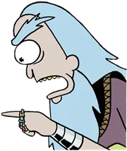
>
>It's kinda funny the first time one of your players says they're gonna pick up a trout and slap a bad guy with it, but don't encourage that, Morty.
>
>Next thing you know they'll be improvising all kinds of useless trash and you'll be stuck assigning stats to plates and stools and goblin sacks of s*** and sacks of goblin s***... hard pass.
>

## Miscellaneous Gear and Services

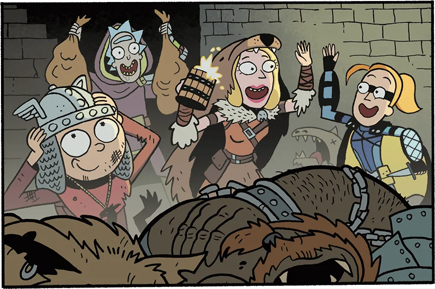

This section describes items that have special rules.

>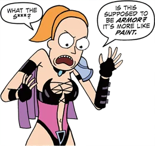
>
>Summer is right, Morty.
>
>Damsels in distress and chainmail bikinis are a thing of the past. Bad tropes gotta die off, Morty.
>

### Adventuring Gear

| Item                             |  Cost |    Weight    |
|----------------------------------|:-----:|:------------:|
| Ammunition - Arrows (20)         |  1 gp |     1 lb.    |
| Ammunition - Crossbow bolts (20) |  1 gp |    1½ lb.    |
| Backpack                         |  2 gp |     5 lb.    |
| Bedroll                          |  1 gp |     7 lb.    |
| Bell                             |  1 gp |       —      |
| Blanket                          |  5 sp |     3 lb.    |
| Book                             | 25 gp |     5 lb.    |
| Candle                           |  1 cp |       —      |
| Carpenter's tools                |  8 gp |     6 lb.    |
| Case (for map or scroll)         |  1 gp |     1 lb.    |
| Chalk (1 piece)                  |  1 cp |       —      |
| Chest                            |  5 gp |    25 lb.    |
| Clothes, common                  |  5 sp |     3 lb.    |
| Clothes, fine                    | 15 gp |     6 lb.    |
| Component pouch                  | 25 gp |     2 lb.    |
| Crowbar                          |  2 gp |     5 lb.    |
| Grappling hook                   |  2 gp |     4 lb.    |
| Hammer                           |  1 gp |     3 lb.    |
| Hammer, sledge                   |  2 gp |    10 lb.    |
| Healer's kit                     |  5 gp |     3 lb.    |
| Holy symbol                      |  5 gp |     1 lb.    |
| Hourglass                        | 25 gp |     1 lb.    |
| Ink (1 ounce bottle)             | 10 gp |       —      |
| Ink pen                          |  2 cp |       —      |
| Lantern, bullseye                | 10 gp |     2 lb.    |
| Lantern, hooded                  |  5 gp |     2 lb.    |
| Lock                             | 10 gp |     1 lb.    |
| Mason's tools                    | 10 gp |     8 lb.    |
| Mess kit                         |  2 sp |     1 lb.    |
| Mirror, steel                    |  5 gp |    1/2 lb.   |
| Oil (flask)                      |  1 sp |     1 lb.    |
| Paper (one sheet)                |  2 sp |       —      |
| Parchment (one sheet)            |  1 sp |       —      |
| Perfume (vial)                   |  5 gp |       —      |
| Pick, miner's                    |  2 gp |    10 lb.    |
| Piton                            |  5 cp |    1/4 lb.   |
| Pot, iron                        |  2 gp |    10 lb.    |
| Potion of healing                | 50 gp |    1/2 lb.   |
| Playing cards                    |  5 sp |       —      |
| Pouch                            |  5 sp |     1 lb.    |
| Rations (1 day)                  |  5 sp |     2 lb.    |
| Robes                            |  1 gp |     4 lb.    |
| Rope, hempen (50 feet)           |  1 gp |    10 lb.    |
| Rope, silk (50 feet)             | 10 gp |     5 lb.    |
| Sack                             |  1 cp |    1/2 lb.   |
| Sealing wax                      |  5 sp |       —      |
| Shovel                           |  2 gp |     5 lb.    |
| Signal whistle                   |  5 cp |       —      |
| Signet ring                      |  5 gp |       —      |
| Spellbook                        | 50 gp |     3 lb.    |
| Spike, iron (10)                 |  1 gp |     5 lb.    |
| Tent, two-person                 |  2 gp |    20 lb.    |
| Thieves' tools                   | 25 gp |     1 lb.    |
| Tinderbox                        |  5 sp |     1 lb.    |
| Torch                            |  1 cp |     1 lb.    |
| Waterskin                        |  2 sp | 5 lb. (full) |
| Whetstone                        |  1 cp |     1 lb.    |

***Candle.*** For 1 hour, a candle sheds bright light in a 5-foot radius and dim light for an additional 5 feet.

***Component Pouch.*** A component pouch is a small, watertight leather belt pouch that holds all the material components and other special items you need to cast your spells, except for those components that have a specific cost. See *chapter 4* for more about spellcasting.

>
>
>LOOK AT THIS, MORTY!
>
>The D&D designers know that keeping track of basic spell components is ridiculous, so they include this grab bag of dollar store crap to magic s*** up with.
>
>You gotta admire the commitment to a dumbass idea.
>

***Crowbar.*** Using a crowbar grants advantage to Strength checks where the crowbar's leverage can be applied.

>
>
>I went to a place called Crowbar with Birdperson once, Morty.
>
>Got stuck in a pile of bird crap and my pecker was never the same.
>

***Healer's Kit.*** This kit is a leather pouch containing bandages, salves, and splints. The kit has ten uses. As an action, you can expend one use of the kit to stabilize a creature that has 0 hit points, without needing to make a Wisdom (Medicine) check.

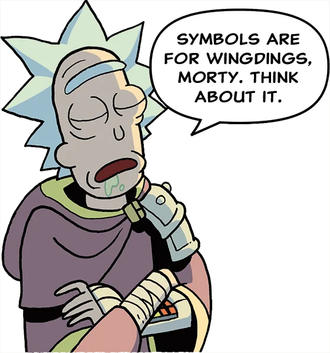

***Holy Symbol.*** A holy symbol is a representation of a god or pantheon. It might be a silver amulet depicting a symbol commonly used to represent a deity, the same symbol carefully engraved or inlaid as an emblem on a shield, or a tiny box holding a fragment of a sacred relic. The cleric can use a holy symbol to replace the material components of spells, except for those components that have a specific cost. To use the symbol in this way, the caster must hold it in hand, wear it visibly, or bear it emblazoned on a shield. See *chapter 4* for more about spellcasting.

***Lantern, Bullseye.*** A bullseye lantern casts bright light in a 60-foot cone and dim light for an additional 60 feet. Once lit, it burns for 6 hours on a flask (1 pint) of oil.

***Lantern, Hooded.*** A hooded lantern casts bright light in a 30-foot radius and dim light for an additional 30 feet. Once lit, it burns for 6 hours on a flask (1 pint) of oil. As an action, you can lower the hood, reducing the light to dim light in a 5-foot radius.

***Lock.*** A creature proficient with thieves' tools can pick this lock with a successful DC 15 Dexterity check. Better locks are available for higher prices.

***Oil.*** As an action, you can splash the oil in this flask onto a creature within 5 feet of you or throw it up to 20 feet, shattering it on impact. Make a ranged attack against a target creature or object. On a hit, the target is covered in oil. If the target takes any fire damage before the oil dries (after 1 minute), the target takes an additional 5 fire damage from the burning oil. You can also pour a flask of oil on the ground to cover a 5-foot-square area, provided that the surface is level. If lit, the oil burns for 2 rounds and deals 5 fire damage to any creature that enters the area or ends its turn in the area. A creature can take this damage only once per turn.

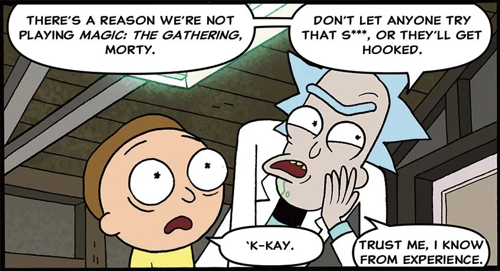

***Playing Cards.*** If you are proficient with playing cards, you can add your proficiency bonus to ability checks you make to play a game with them.

***Potion of Healing.*** A character who drinks the magic, red fluid in this vial regains 2d4 + 2 hit points. Drinking or administering a potion takes an action.

***Rations.*** Compact, dry foods suitable for extended travel, rations include jerky, dried fruit, hardtack, and nuts.

***Rope.*** Rope, whether made of hemp or silk, has 2 hit points and can be burst with a DC 17 Strength check.

***Spellbook.*** Essential for wizards, a spellbook is a leather-bound tome with 100 blank vellum pages suitable for recording spells.

>
>
>You don't want a spellbook, Morty—trust me.
>
>Throw it on a USB so it's easier to keister in your butt of holding.
>

***Thieves' Tools.*** This set of tools includes a small file, a set of lock picks, a small mirror mounted on a metal handle, a set of narrow-bladed scissors, and a pair of pliers. Proficiency with these tools lets you add your proficiency bonus to any ability checks you make to disarm traps or open locks.

***Tinderbox.*** This small container holds flint, fire steel, and tinder (usually dry cloth soaked in light oil) used to kindle a fire. Using it to light a torch—or anything else with abundant, exposed fuel—takes an action. Lighting any other fire takes 1 minute.

***Torch.*** A torch burns for 1 hour, providing bright light in a 20-foot radius and dim light for an additional 20 feet. If you make a melee attack with a burning torch and hit, it deals 1 fire damage.

>Anything can be a torch, if you try hard enough. Actually, you don't have to try that hard. IT'S FIRE, MORTY. Even you can figure this one out. Literally humanity's first invention, Morty. 
>

### Mounts and Other Animals

| Item               |  Cost |  Speed | Carrying Capacity |
|--------------------|:-----:|:------:|:-----------------:|
| Donkey or **mule** |  8 gp | 40 ft. |      420 lb.      |
| **Horse, draft**   | 50 gp | 40 ft. |      540 lb.      |
| **Horse, riding**  | 75 gp | 60 ft. |      480 lb.      |

### Tack and Harness

| Item               |  Cost | Weight |
|--------------------|:-----:|:------:|
| Bit and bridle     |  2 gp |  1 lb. |
| Feed (per day)     |  5 cp | 10 lb. |
| *Saddle*           |       |        |
| Pack               |  5 gp | 15 lb. |
| Riding             | 10 gp | 25 lb. |
| Saddlebags         |  4 gp |  8 lb. |
| Stabling (per day) |  5 sp |    —   |

### Food, Drink, and Lodging

| Item                         |        Cost       |
|------------------------------|:-----------------:|
| *Ale*                        |                   |
| Gallon                       |        2 sp       |
| Mug                          |        4 cp       |
| Full Keg                     | 8 sp - Awww yeah! |
| Inn stay (per day)           |                   |
| Squalid                      |        7 cp       |
| Poor                         |        1 sp       |
| Modest                       |        5 sp       |
| Comfortable                  |        8 sp       |
| Wealthy                      |        2 gp       |
| Aristocratic                 |        4 gp       |
| Passed out in the back alley |        Free       |
| Meals (per day)              |                   |
| Squalid                      |        3 cp       |
| Poor                         |        6 cp       |
| Modest                       |        3 sp       |
| Comfortable                  |        5 sp       |
| Wealthy                      |        8 sp       |
| Aristocratic                 |        2 gp       |
| Wine                         |                   |
| Common (pitcher)             |        2 sp       |
| Fine (bottle)                |       10 gp       |

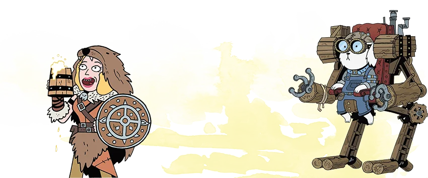

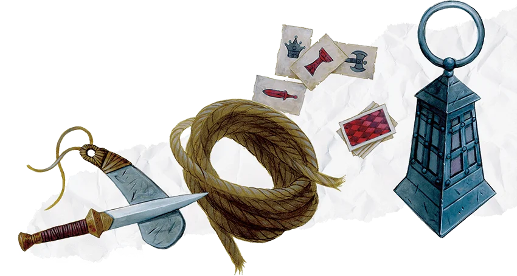

------

# Chapter 4: Spellcasting

Magic permeates the worlds of D&D and most often appears in the form of a spell. This chapter provides the rules for casting spells. Clerics and wizards have distinctive ways of learning and preparing their spells, and monsters use spells in unique ways. Regardless of its source, a spell follows the rules here.

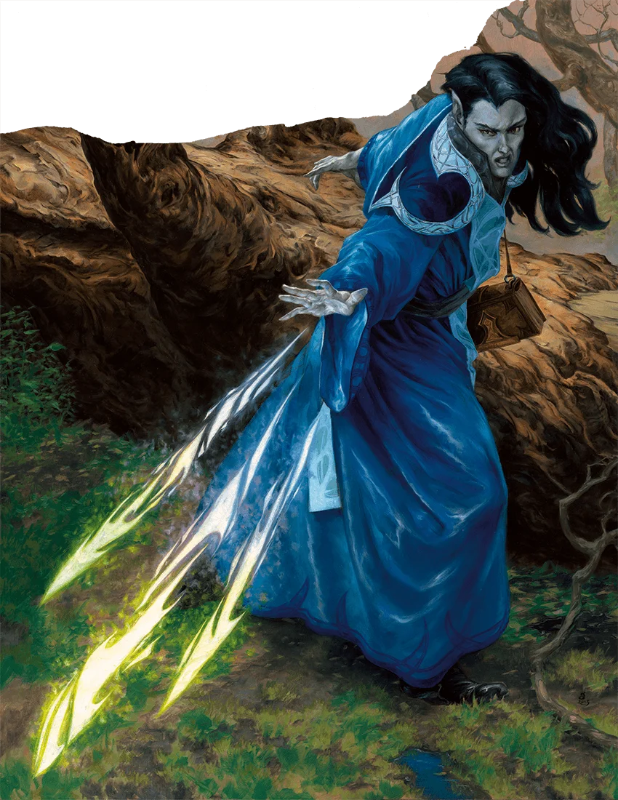

>
>
>This is the real stuff right here!
>
>IT'S MAGIC, MORTY!
>
>Blazing fire shooting out of your fingertips, mind control, teleportation, and other badass power moves!
>
>Yeah, yeah... your rogue can pick a lock and climb a wall. I just blew that f***ing door off its hinges and then flew past you on my way to eldritch glory.
>
>EAT MY SPARKLY ASSSSSS!
>

## What Is a Spell?

A spell is a discrete magical effect, a single shaping of the magical energies that suffuse the multiverse into a specific, limited expression. In casting a spell, a character carefully plucks at the invisible strands of raw magic suffusing the world, pins them in place in a particular pattern, sets them vibrating in a specific way, and then releases them to unleash the desired effect—in most cases, all in the span of seconds.

Spells can be versatile tools, weapons, or protective wards. They can deal damage or undo it, impose or remove conditions (see *appendix A*), drain life energy away, and restore life to the dead.

>
>
>Read all that and then explain to me how an axe-wielding mouth breather is gonna keep up with ME.
>
>Do you see a section in this book about fighter powers? You suuuure don't.
>

### Spell Level

Every spell in this set has a level from 0 to 3. A spell's level is a general indicator of how powerful it is, with the lowly (but still impressive) *magic missile* at 1st level and the devastating *fireball* at 3rd. (Spells of higher levels, up to 9th, exist in the world but aren't included in this set.) Cantrips—simple but powerful spells that characters can cast almost by rote—are level 0. The higher a spell's level, the higher level a spellcaster must be to use that spell.

Spell level and character level don't correspond directly. Typically, a character has to be at least 5th level, not 3rd level, to cast a 3rd-level spell.

### Known and Prepared Spells

Before a spellcaster can use a spell, he or she must have the spell firmly fixed in mind. Clerics and wizards undergo a process of preparing spells. The number of spells a caster can have fixed in mind at any given time is shown on the character sheets.

A character can change this list of prepared spells upon finishing a long rest (see *chapter 3*). Preparing a new list of spells requires time spent in meditation or study: at least 1 minute per spell level for each spell on the list.

>
>
>PREPARED SPELLS?!
>
>This is a feeble attempt to try and impose some kind of cap on wizardly supremacy.
>
>If I'm ever a player at your table, you can ignore these limits. They're unnecessary.
>

### Spell Slots

Regardless of how many spells a caster knows or prepares, he or she can cast only a limited number of spells before resting. Manipulating the fabric of magic and channeling its energy into even a simple spell is physically and mentally taxing, and higher-level spells are even more so. Thus, the character sheet for a spellcaster includes how many spell slots of each level the character can use at each character level. For example, at 3rd level, the wizard has four 1st-level slots and two 2nd-level slots.

When a character casts a spell, he or she expends a slot of that spell's level or higher, effectively "filling" a slot with the spell. You can think of a spell slot as a groove of a certain size—small for a 1st-level slot, larger for a spell of higher level. A 1st-level spell fits into a slot of any size, but a 3rd-level spell fits only in a slot that is at least 3rd level. So when the wizard casts *magic missile*, a 1st-level spell, he or she spends a 1st-level slot and has three remaining.

Finishing a long rest restores any expended spell slots.

Some monsters have special abilities that let them cast spells without using spell slots.

>
>
>I'm not gonna let some dweeb ruin my game by thinking outside the box and being clever with his powers.
>
>So I watch spellcasters like you watch those women on the shampoo commercials.
>

#### Casting a Spell at a Higher Level

When a spellcaster casts a spell using a slot that is a higher level than the spell, the spell assumes the higher level for that casting. For instance, if a wizard casts *magic missile* using a 2nd-level slot, that *magic missile* is 2nd level. The spell effectively expands to fill the slot.

Some spells, such as *magic missile* and *cure wounds*, have more powerful effects when cast at a higher level, as detailed in the spell's description.

### Cantrips

A cantrip is a spell that can be cast at will, without using a spell slot and without being prepared in advance. Repeated practice has fixed the spell in the caster's mind and infused the caster with the magic needed to produce the effect over and over. A cantrip's spell level is 0.

>
>
>Don't let that "zero" throw you, Morty.
>
>In this case,
>
>zero makes the hero.
>

>
>
>These little spells can pack a lotta punch, and the right application of cantrippery can convince peasants and other small-brained creatures that you're Doctor Badass.
>

### Rituals

Certain spells have a special tag: ritual. Such a spell can be cast following the normal rules for spellcasting, or the spell can be cast as a ritual. The ritual version of a spell takes 10 minutes longer to cast than normal, and it doesn't expend a spell slot.

A cleric or a wizard can cast a spell as a ritual if the spell has the ritual tag. The cleric must also have the spell prepared, while the wizard need only have the spell in his or her spellbook.

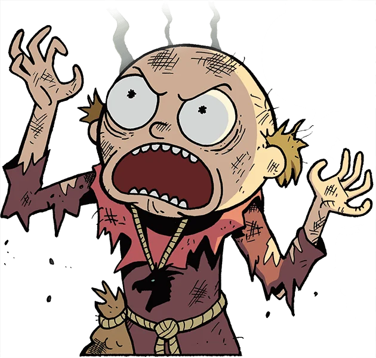

> ##### Casting in Armor
>
>Because of the mental focus and precise gestures required for spellcasting, you must be proficient with the armor you are wearing to cast a spell. You are otherwise too distracted and physically hampered by your armor for spellcasting.
>

## Casting a Spell

When a character casts any spell, the rules here apply, regardless of the character's class or the spell's effects.

Each spell description in this chapter begins with a block of information, including the spell's name, level, school of magic, casting time, range, components, and duration. The rest of a spell entry describes the spell's effect.

### Casting Time

Most spells require a single action to cast, but some spells require a bonus action, a reaction, or much more time.

#### Bonus Action

A spell cast with a bonus action is especially swift. You must use a bonus action on your turn to cast the spell, provided that you haven't already taken a bonus action this turn. You can't cast another spell during the same turn, except for a cantrip with a casting time of 1 action.

#### Reactions

Some spells can be cast as reactions. These spells take a fraction of a second to bring about and are cast in response to some event. If a spell can be cast as a reaction, the spell description tells you exactly when you can do so.

#### Longer Casting Times

Certain spells (including spells cast as rituals) require more time to cast: minutes or even hours. When you cast a spell with a casting time longer than a single action or reaction, you must spend your action each turn casting the spell, and you must maintain your concentration while you do so (see "*Concentration*" later in this chapter). If your concentration is broken, the spell fails, but you don't expend a spell slot. If you want to try casting the spell again, you must start over.

### Range

The target of a spell must be within the spell's range. For a spell like *magic missile*, the target is a creature. For a spell like *fireball*, the target is the point in space where the ball of fire erupts.

Most spells have ranges expressed in feet. Some spells can target only a creature (including you) that you touch.

Other spells, such as the *shield* spell, affect only you. These spells have a range of self.

Spells that create cones or lines of effect that originate from you also have a range of self, indicating that the origin point of the spell's effect must be you (see "*Areas of Effect*" later in the this chapter).

Once a spell is cast, its effects aren't limited by its range, unless the spell's description says otherwise.

>
>
>a hot protip here:
>
>Just memorize the range of every spell and, when you fight other spellcasters, plant yourself 5 feet or so beyond their max casting range—then show 'em your asssss.
>

### Components

A spell's components are the physical requirements you must meet in order to cast it. Each spell's description indicates whether it requires verbal (V), somatic (S), or material (M) components. If you can't provide one or more of a spell's components, you are unable to cast the spell.

#### Verbal (V)

Most spells require the chanting of mystic words. The words themselves aren't the source of the spell's power; rather, the particular combination of sounds, with specific pitch and resonance, sets the threads of magic in motion. Thus, a character who is gagged or in an area of silence, such as one created by the *silence* spell, can't cast a spell with a verbal component.

>(V) The rules don't actually say what specific words you have to speak for a verbal component, so I just say whatever comes to mind or power up a filthy insult and let 'er rip. 
>

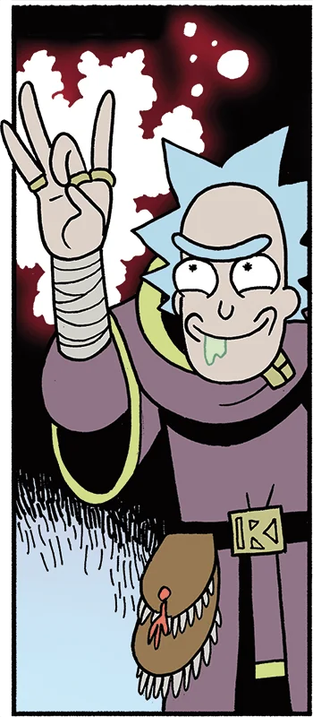

#### Somatic (S)

Spellcasting gestures might include a forceful gesticulation or an intricate set of gestures. If a spell requires a somatic component, the caster must have free use of at least one hand to perform these gestures.

>(S) Again, they don't specify what magical moves are required, so get Schwifty and s***. Make your spellcasting signature move so hot that monsters beg to join your side before you blast 'em into Experience Particles. 
>

#### Material (M)

Casting some spells requires particular objects, specified in parentheses in the component entry. A component pouch includes all the needed material components to cast spells, except those that have a gold piece cost shown in the spell. A cleric's holy symbol replaces material components, again excepting those with a gold piece cost. If a cost is indicated, a character must purchase that specific component before casting the spell in question.

If a spell specifies that the material component is consumed by the spell, the caster must provide this component for each casting of the spell.

A spellcaster must have a hand free to access these components, but it can be the same hand that he or she uses to perform somatic components.

>(M) NO ONE IS KEEPING TRACK OF PINCHES OF DUST AND CLUMPS OF MOSS. Don't be that guy, Morty. The Dungeon Master will tell you when a spell's got ingredients worth shelling out for. The rest is just doing cool hand symbols and saying BLADOWIE! (see below). 
>

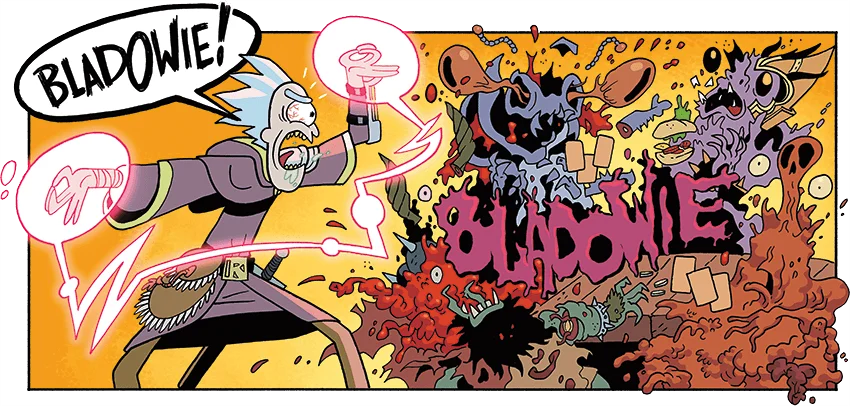

### Duration

A spell's duration is the length of time the spell persists. A duration can be expressed in rounds, minutes, hours, or even years. A spell might specify that its effects last until the spell is dispelled or the effects are destroyed.

#### Instantaneous

Many spells are instantaneous. The spell harms, heals, creates, or alters a creature or an object in a way that can't be dispelled, because its magic exists only for an instant.

>
>
>According to your mother, this duration is also known as "jerry in bed."
>
>Yeah, I didn't want that visual either, Morty. Sucks for us.
>

#### Concentration

Some spells require you to maintain concentration in order to keep their magic active. If you lose concentration, such a spell ends.

If a spell must be maintained with concentration, that fact appears in its Duration entry, and the spell specifies how long you can concentrate on it. You can end concentration at any time (no action required).

Normal activity, such as moving and attacking, doesn't interfere with concentration. The following factors can break concentration:

- **Casting another spell that requires concentration.** You lose concentration on a spell if you cast another spell that requires concentration. You can't concentrate on two spells at once.
- **Taking damage**. Whenever you take damage while you are concentrating on a spell, you must make a Constitution saving throw to maintain your concentration. The DC equals 10 or half the damage you take, whichever number is higher. If you take damage from multiple sources, such as an arrow and a dragon's breath, you make a separate saving throw for each source of damage.
- **Being incapacitated or killed.** You lose concentration on a spell if you are incapacitated (as explained in *appendix A*) or if you die.

### Targets

A typical spell requires you to pick one or more targets to be affected by the spell's magic. A spell's description tells you whether the spell targets creatures, objects, or a point of origin for an area of effect (described below).

#### A Clear Path to the Target

To target something, you must have a clear path to it, so it can't be behind total cover.

If you place an area of effect at a point that you can't see and an obstruction, such as a wall, is between you and that point, the point of origin comes into being on the near side of that obstruction.

#### Targeting Yourself

If a spell targets a creature of your choice, you can choose yourself, unless the creature must be hostile or specifically a creature other than you. If you are in the area of effect of a spell you cast, you can target yourself.

### Areas of Effect

Spells such as *burning hands* and *fireball* cover an area, allowing them to affect multiple creatures at once.

A spell's description specifies its area of effect, which typically has one of four different shapes: cone, cube, line, or sphere (each illustrated on the DM screen). Every area of effect has a point of origin, a location from which the spell's energy erupts. The rules for each shape specify how you position its point of origin. Typically, a point of origin is a point in space, but some spells have an area whose origin is a creature or an object.

A spell's effect expands in straight lines from the point of origin. If no unblocked straight line extends from the point of origin to a location within the area of effect, that location isn't included in the spell's area. To block one of these imaginary lines, an obstruction must provide total cover, as explained in *chapter 2*.

The point of origin of an area of effect isn't included in the area, unless the area is a sphere.

#### Cone

A cone extends in a direction you choose from its point of origin. A cone's width at a given point along its length is equal to that point's distance from the point of origin. A cone's area of effect specifies its maximum length.

#### Cube

You select a cube's point of origin, which lies anywhere on a face of the cubic effect. The cube's size is expressed as the length of each side.

#### Line

A line extends from its point of origin in a straight path up to its length and covers an area defined by its width.

#### Sphere

You select a sphere's point of origin, and the sphere extends outward from that point. The sphere's size is expressed as a radius in feet that extends from the point.

>
>
>D-d-don't feel like you've gotta be limited to those kiddie block shapes for your spell effects, Morty.
>
>When I'm the Dungeon Master and bad guys are launching loads of murder magic, I'll just dump chips or hock a big loogie on the battle map to figure out where the spell hits.
>

### Saving Throws

Many spells specify that a target can make a saving throw to avoid some or all of a spell's effects. The spell specifies the ability that the target uses for the save and what happens on a success or failure.

The DC to resist one of your spells equals 8 + your spellcasting ability modifier + your proficiency bonus. This number is on the character sheets for the cleric and the wizard, and in the statistics for a monster that casts spells.

### Attack Rolls

Some spells require the caster to make an attack roll to determine whether the spell effect hits the intended target. Your attack bonus with a spell attack equals your spellcasting ability modifier + your proficiency bonus.

Most spells that require attack rolls involve ranged attacks. Remember that you have disadvantage on a ranged attack roll if you are within 5 feet of a hostile creature that can see you and that isn't incapacitated (see *chapter 2*).

### Combining Magical Effects

The effects of different spells add together while the durations of those spells overlap. The effects of the same spell cast multiple times don't combine, however. Instead, the most potent effect—such as the highest bonus—from those castings applies while their durations overlap.

For example, if two clerics cast *bless* on the same target, that character gains the spell's benefit only once; he or she doesn't get to roll two bonus dice.

> ##### Schools of Magic
>
>Scholars who study the workings of magic group spells into eight categories called schools of magic. The schools help describe spells; the schools have no game rules of their own.
>
>**Abjuration** spells are protective, often creating barriers or warding off trespassers. **Conjuration** spells transport objects or creatures from one location to another. **Divination** spells reveal glimpses of the future, the locations of hidden things, or visions of distant people or places. **Enchantment** spells affect the minds of others, influencing or controlling their behavior. **Evocation** spells tap mystical sources of energy to create a variety of effects, including blasts of fire and channeling positive energy to heal wounds. **Illusion** spells deceive the senses or minds of others. **Necromancy** spells manipulate the energies of life and death. **Transmutation** spells change the properties or physical form of a creature or object.
>

>
>
>Ignore most of this, Morty.
>
>The only two schools of magic you need to worry about are evocation and necromancy, blowing s*** up and messing with the dead—preferably at the same time.
>

>
>
>50+ SPELLS
>
>are too much for your tiny mind to handle, Morty, so I went through and rated them so you'll know which ones are gonna get you m-m-mad killz and which ones your dad thinks are cool.
>

## Spell Lists

### Cleric Spells

##### Cantrips (0 Level)- Guidance MEH
- Light Ok
- Resistance Ok
- Sacred Flame Yes, Burn
- Thaumaturgy ok

##### 1st Level- Bless OK
- Command MEH
- Cure Wounds YES
- Detect Magic OK
- Guiding Bolt YES, BURN
- Healing Word YES
- Inflict Wounds YES, HURT
- Sanctuary JERRY SPELL
- Shield of Faith OK

##### 2nd Level- Aid JERRY SPELL
- Augury JERRY SPELL
- Hold Person OK
- Lesser Restoration OK
- Prayer of Healing YES
- Silence OK
- Spiritual Weapon YES, HURT
- Warding Bond JERRY SPELL

##### 3rd Level- Beacon of Hope JERRY SPELL
- Dispel Magic JERRY SPELL
- Mass Healing Word YES
- Protection from Energy JERRY SPELL
- Revivify OK
- Spirit Guardians OK

### Wizard Spells

##### Cantrips (0 Level)- Dancing Lights JERRY SPELL
- Light OK
- Mage Hand YES
- Prestidigitation YES
- Ray of Frost YES, CHILL
- Shocking Grasp YES, ZAP

##### 1st Level- Burning Hands YES, BURN
- Charm Person JERRY SPELL
- Comprehend Languages JERRY SPELL
- Detect Magic OK
- Feather Fall Yes
- Identify OK
- Mage Armor YES
- Magic Missile YES, Poke
- Shield OK
- Sleep Meh
- Thunderwave Yes, Rumble

##### 2nd Level- Blur MEH
- Darkness OK
- Flaming Sphere Yes, Burn
- Hold Person OK
- Invisibility YES
- Misty Step OK
- Spider Climb OK
- Suggestion JERRY SPELL
- Web OK

##### 3rd Level- Dispel Magic JERRY SPELL
- Fireball Oh Hell YES
- Fly YES
- Lightning Bolt YES, Big Zap
- Protection from Energy JERRY SPELL

## Spells

Presented in alphabetical order, these spells are used by characters and monsters in this set.

Some of the spells cause **conditions**, including charmed, deafened, frightened, invisible, paralyzed, prone, restrained, and unconscious. Consult *appendix A* to learn a condition's effects in the game.

<table class="rd__b-special rd__b-data  rd__b-data--stats">
		<thead>
			<tr>
				<th class="rd__data-embed-header ve-text-left" colspan="6" data-rd-data-embed-header="true">
					

						

							Aid
							
						

						[+]
					

				</th>
			</tr>
		</thead><tbody class="ve-hidden" data-rd-embedded-data-render-target="true"><tr>
			<td colspan="6" data-rd-tag="spell" data-rd-uid="Aid|PHB" data-rd-page="spells.html" data-rd-source="PHB" data-rd-hash="aid_phb" data-rd-name="Aid" data-rd-display-name="Aid" data-rd-style="" data-rd-entry-data="{}">
				<i>Loading <a href="spells.html#aid_phb"  onmouseover="Renderer.hover.pHandleLinkMouseOver(event, this)" onmouseleave="Renderer.hover.handleLinkMouseLeave(event, this)" onmousemove="Renderer.hover.handleLinkMouseMove(event, this)" onclick="Renderer.hover.handleLinkClick(event, this)" onwheel="Renderer.hover.handleLinkWheel(event, this)" ondragstart="Renderer.hover.handleLinkDragStart(event, this)" data-vet-page="spells.html" data-vet-source="PHB" data-vet-hash="aid_phb" ontouchstart="Renderer.hover.handleTouchStart(event, this)" >Aid</a>...</i>
				
			</td>
		</tr></tbody></table>Pure Jerry spell! Why help other people when you could jack yourself up with magic and kick more ass?!

<table class="rd__b-special rd__b-data  rd__b-data--stats">
		<thead>
			<tr>
				<th class="rd__data-embed-header ve-text-left" colspan="6" data-rd-data-embed-header="true">
					

						

							Augury
							
						

						[+]
					

				</th>
			</tr>
		</thead><tbody class="ve-hidden" data-rd-embedded-data-render-target="true"><tr>
			<td colspan="6" data-rd-tag="spell" data-rd-uid="Augury|PHB" data-rd-page="spells.html" data-rd-source="PHB" data-rd-hash="augury_phb" data-rd-name="Augury" data-rd-display-name="Augury" data-rd-style="" data-rd-entry-data="{}">
				<i>Loading <a href="spells.html#augury_phb"  onmouseover="Renderer.hover.pHandleLinkMouseOver(event, this)" onmouseleave="Renderer.hover.handleLinkMouseLeave(event, this)" onmousemove="Renderer.hover.handleLinkMouseMove(event, this)" onclick="Renderer.hover.handleLinkClick(event, this)" onwheel="Renderer.hover.handleLinkWheel(event, this)" ondragstart="Renderer.hover.handleLinkDragStart(event, this)" data-vet-page="spells.html" data-vet-source="PHB" data-vet-hash="augury_phb" ontouchstart="Renderer.hover.handleTouchStart(event, this)" >Augury</a>...</i>
				
			</td>
		</tr></tbody></table>This is for theater majors and Jerrys. Don't worry about divining the future when you play D&D, Morty. The story will find you when you start killing.

<table class="rd__b-special rd__b-data  rd__b-data--stats">
		<thead>
			<tr>
				<th class="rd__data-embed-header ve-text-left" colspan="6" data-rd-data-embed-header="true">
					

						

							Beacon of Hope
							
						

						[+]
					

				</th>
			</tr>
		</thead><tbody class="ve-hidden" data-rd-embedded-data-render-target="true"><tr>
			<td colspan="6" data-rd-tag="spell" data-rd-uid="Beacon of Hope|PHB" data-rd-page="spells.html" data-rd-source="PHB" data-rd-hash="beacon%20of%20hope_phb" data-rd-name="Beacon of Hope" data-rd-display-name="Beacon of Hope" data-rd-style="" data-rd-entry-data="{}">
				<i>Loading <a href="spells.html#beacon%20of%20hope_phb"  onmouseover="Renderer.hover.pHandleLinkMouseOver(event, this)" onmouseleave="Renderer.hover.handleLinkMouseLeave(event, this)" onmousemove="Renderer.hover.handleLinkMouseMove(event, this)" onclick="Renderer.hover.handleLinkClick(event, this)" onwheel="Renderer.hover.handleLinkWheel(event, this)" ondragstart="Renderer.hover.handleLinkDragStart(event, this)" data-vet-page="spells.html" data-vet-source="PHB" data-vet-hash="beacon%20of%20hope_phb" ontouchstart="Renderer.hover.handleTouchStart(event, this)" >Beacon of Hope</a>...</i>
				
			</td>
		</tr></tbody></table>Jerry spell in full effect! Don't waste your spell slots helping other people! You know what'll help them even more? If you kill the creatures attacking everyone!

<table class="rd__b-special rd__b-data  rd__b-data--stats">
		<thead>
			<tr>
				<th class="rd__data-embed-header ve-text-left" colspan="6" data-rd-data-embed-header="true">
					

						

							Bless
							
						

						[+]
					

				</th>
			</tr>
		</thead><tbody class="ve-hidden" data-rd-embedded-data-render-target="true"><tr>
			<td colspan="6" data-rd-tag="spell" data-rd-uid="Bless|PHB" data-rd-page="spells.html" data-rd-source="PHB" data-rd-hash="bless_phb" data-rd-name="Bless" data-rd-display-name="Bless" data-rd-style="" data-rd-entry-data="{}">
				<i>Loading <a href="spells.html#bless_phb"  onmouseover="Renderer.hover.pHandleLinkMouseOver(event, this)" onmouseleave="Renderer.hover.handleLinkMouseLeave(event, this)" onmousemove="Renderer.hover.handleLinkMouseMove(event, this)" onclick="Renderer.hover.handleLinkClick(event, this)" onwheel="Renderer.hover.handleLinkWheel(event, this)" ondragstart="Renderer.hover.handleLinkDragStart(event, this)" data-vet-page="spells.html" data-vet-source="PHB" data-vet-hash="bless_phb" ontouchstart="Renderer.hover.handleTouchStart(event, this)" >Bless</a>...</i>
				
			</td>
		</tr></tbody></table>Almost a Jerry spell, but at least you can pump up a bunch of people so they can kill s*** better.

<table class="rd__b-special rd__b-data  rd__b-data--stats">
		<thead>
			<tr>
				<th class="rd__data-embed-header ve-text-left" colspan="6" data-rd-data-embed-header="true">
					

						

							Blur
							
						

						[+]
					

				</th>
			</tr>
		</thead><tbody class="ve-hidden" data-rd-embedded-data-render-target="true"><tr>
			<td colspan="6" data-rd-tag="spell" data-rd-uid="Blur|PHB" data-rd-page="spells.html" data-rd-source="PHB" data-rd-hash="blur_phb" data-rd-name="Blur" data-rd-display-name="Blur" data-rd-style="" data-rd-entry-data="{}">
				<i>Loading <a href="spells.html#blur_phb"  onmouseover="Renderer.hover.pHandleLinkMouseOver(event, this)" onmouseleave="Renderer.hover.handleLinkMouseLeave(event, this)" onmousemove="Renderer.hover.handleLinkMouseMove(event, this)" onclick="Renderer.hover.handleLinkClick(event, this)" onwheel="Renderer.hover.handleLinkWheel(event, this)" ondragstart="Renderer.hover.handleLinkDragStart(event, this)" data-vet-page="spells.html" data-vet-source="PHB" data-vet-hash="blur_phb" ontouchstart="Renderer.hover.handleTouchStart(event, this)" >Blur</a>...</i>
				
			</td>
		</tr></tbody></table>If I wanna see blurry, shifting, wavering people in front of me, I'll just keep drinking.

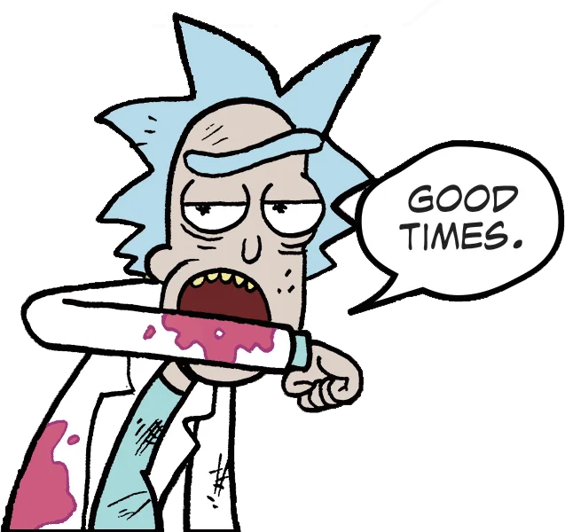

<table class="rd__b-special rd__b-data  rd__b-data--stats">
		<thead>
			<tr>
				<th class="rd__data-embed-header ve-text-left" colspan="6" data-rd-data-embed-header="true">
					

						

							Burning Hands
							
						

						[+]
					

				</th>
			</tr>
		</thead><tbody class="ve-hidden" data-rd-embedded-data-render-target="true"><tr>
			<td colspan="6" data-rd-tag="spell" data-rd-uid="Burning Hands|PHB" data-rd-page="spells.html" data-rd-source="PHB" data-rd-hash="burning%20hands_phb" data-rd-name="Burning Hands" data-rd-display-name="Burning Hands" data-rd-style="" data-rd-entry-data="{}">
				<i>Loading <a href="spells.html#burning%20hands_phb"  onmouseover="Renderer.hover.pHandleLinkMouseOver(event, this)" onmouseleave="Renderer.hover.handleLinkMouseLeave(event, this)" onmousemove="Renderer.hover.handleLinkMouseMove(event, this)" onclick="Renderer.hover.handleLinkClick(event, this)" onwheel="Renderer.hover.handleLinkWheel(event, this)" ondragstart="Renderer.hover.handleLinkDragStart(event, this)" data-vet-page="spells.html" data-vet-source="PHB" data-vet-hash="burning%20hands_phb" ontouchstart="Renderer.hover.handleTouchStart(event, this)" >Burning Hands</a>...</i>
				
			</td>
		</tr></tbody></table>
>
>
>"Sheet of Flames" sounds like a heavy metal concept album.
>
>I dig it.
>

<table class="rd__b-special rd__b-data  rd__b-data--stats">
		<thead>
			<tr>
				<th class="rd__data-embed-header ve-text-left" colspan="6" data-rd-data-embed-header="true">
					

						

							Charm Person
							
						

						[+]
					

				</th>
			</tr>
		</thead><tbody class="ve-hidden" data-rd-embedded-data-render-target="true"><tr>
			<td colspan="6" data-rd-tag="spell" data-rd-uid="Charm Person|PHB" data-rd-page="spells.html" data-rd-source="PHB" data-rd-hash="charm%20person_phb" data-rd-name="Charm Person" data-rd-display-name="Charm Person" data-rd-style="" data-rd-entry-data="{}">
				<i>Loading <a href="spells.html#charm%20person_phb"  onmouseover="Renderer.hover.pHandleLinkMouseOver(event, this)" onmouseleave="Renderer.hover.handleLinkMouseLeave(event, this)" onmousemove="Renderer.hover.handleLinkMouseMove(event, this)" onclick="Renderer.hover.handleLinkClick(event, this)" onwheel="Renderer.hover.handleLinkWheel(event, this)" ondragstart="Renderer.hover.handleLinkDragStart(event, this)" data-vet-page="spells.html" data-vet-source="PHB" data-vet-hash="charm%20person_phb" ontouchstart="Renderer.hover.handleTouchStart(event, this)" >Charm Person</a>...</i>
				
			</td>
		</tr></tbody></table>Jerry needs this spell just to make friends.

If you really wanna charm someone, do what everyone else does—get rich and buy their loyalty.

<table class="rd__b-special rd__b-data  rd__b-data--stats">
		<thead>
			<tr>
				<th class="rd__data-embed-header ve-text-left" colspan="6" data-rd-data-embed-header="true">
					

						

							Command
							
						

						[+]
					

				</th>
			</tr>
		</thead><tbody class="ve-hidden" data-rd-embedded-data-render-target="true"><tr>
			<td colspan="6" data-rd-tag="spell" data-rd-uid="Command|PHB" data-rd-page="spells.html" data-rd-source="PHB" data-rd-hash="command_phb" data-rd-name="Command" data-rd-display-name="Command" data-rd-style="" data-rd-entry-data="{}">
				<i>Loading <a href="spells.html#command_phb"  onmouseover="Renderer.hover.pHandleLinkMouseOver(event, this)" onmouseleave="Renderer.hover.handleLinkMouseLeave(event, this)" onmousemove="Renderer.hover.handleLinkMouseMove(event, this)" onclick="Renderer.hover.handleLinkClick(event, this)" onwheel="Renderer.hover.handleLinkWheel(event, this)" ondragstart="Renderer.hover.handleLinkDragStart(event, this)" data-vet-page="spells.html" data-vet-source="PHB" data-vet-hash="command_phb" ontouchstart="Renderer.hover.handleTouchStart(event, this)" >Command</a>...</i>
				
			</td>
		</tr></tbody></table>As much as forcing people to grovel amuses me, it's easier to make 'em fear you by lighting all their s*** on fire.

Save your spell slots, Morty.

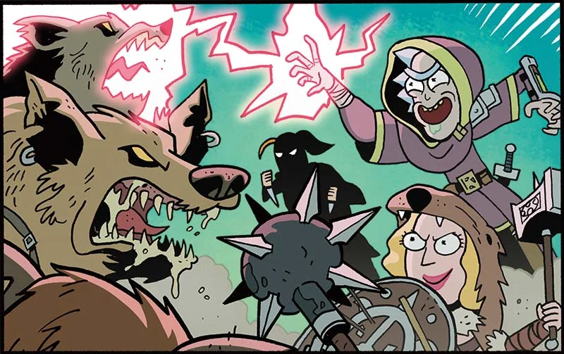

<table class="rd__b-special rd__b-data  rd__b-data--stats">
		<thead>
			<tr>
				<th class="rd__data-embed-header ve-text-left" colspan="6" data-rd-data-embed-header="true">
					

						

							Comprehend Languages
							
						

						[+]
					

				</th>
			</tr>
		</thead><tbody class="ve-hidden" data-rd-embedded-data-render-target="true"><tr>
			<td colspan="6" data-rd-tag="spell" data-rd-uid="Comprehend Languages|PHB" data-rd-page="spells.html" data-rd-source="PHB" data-rd-hash="comprehend%20languages_phb" data-rd-name="Comprehend Languages" data-rd-display-name="Comprehend Languages" data-rd-style="" data-rd-entry-data="{}">
				<i>Loading <a href="spells.html#comprehend%20languages_phb"  onmouseover="Renderer.hover.pHandleLinkMouseOver(event, this)" onmouseleave="Renderer.hover.handleLinkMouseLeave(event, this)" onmousemove="Renderer.hover.handleLinkMouseMove(event, this)" onclick="Renderer.hover.handleLinkClick(event, this)" onwheel="Renderer.hover.handleLinkWheel(event, this)" ondragstart="Renderer.hover.handleLinkDragStart(event, this)" data-vet-page="spells.html" data-vet-source="PHB" data-vet-hash="comprehend%20languages_phb" ontouchstart="Renderer.hover.handleTouchStart(event, this)" >Comprehend Languages</a>...</i>
				
			</td>
		</tr></tbody></table>The only language you need to know in D&D is the language of violence, Morty.

Everyone speaks it and translations are crystal clear. Jerrys want to talk through a battle or "parlay" their asses out of conflict. Never do that.

<table class="rd__b-special rd__b-data  rd__b-data--stats">
		<thead>
			<tr>
				<th class="rd__data-embed-header ve-text-left" colspan="6" data-rd-data-embed-header="true">
					

						

							Cure Wounds
							
						

						[+]
					

				</th>
			</tr>
		</thead><tbody class="ve-hidden" data-rd-embedded-data-render-target="true"><tr>
			<td colspan="6" data-rd-tag="spell" data-rd-uid="Cure Wounds|PHB" data-rd-page="spells.html" data-rd-source="PHB" data-rd-hash="cure%20wounds_phb" data-rd-name="Cure Wounds" data-rd-display-name="Cure Wounds" data-rd-style="" data-rd-entry-data="{}">
				<i>Loading <a href="spells.html#cure%20wounds_phb"  onmouseover="Renderer.hover.pHandleLinkMouseOver(event, this)" onmouseleave="Renderer.hover.handleLinkMouseLeave(event, this)" onmousemove="Renderer.hover.handleLinkMouseMove(event, this)" onclick="Renderer.hover.handleLinkClick(event, this)" onwheel="Renderer.hover.handleLinkWheel(event, this)" ondragstart="Renderer.hover.handleLinkDragStart(event, this)" data-vet-page="spells.html" data-vet-source="PHB" data-vet-hash="cure%20wounds_phb" ontouchstart="Renderer.hover.handleTouchStart(event, this)" >Cure Wounds</a>...</i>
				
			</td>
		</tr></tbody></table>It's a necessary evil. When you get hurt, you gotta get healed. I recommend not getting hurt.

<table class="rd__b-special rd__b-data  rd__b-data--stats">
		<thead>
			<tr>
				<th class="rd__data-embed-header ve-text-left" colspan="6" data-rd-data-embed-header="true">
					

						

							Dancing Lights
							
						

						[+]
					

				</th>
			</tr>
		</thead><tbody class="ve-hidden" data-rd-embedded-data-render-target="true"><tr>
			<td colspan="6" data-rd-tag="spell" data-rd-uid="Dancing Lights|PHB" data-rd-page="spells.html" data-rd-source="PHB" data-rd-hash="dancing%20lights_phb" data-rd-name="Dancing Lights" data-rd-display-name="Dancing Lights" data-rd-style="" data-rd-entry-data="{}">
				<i>Loading <a href="spells.html#dancing%20lights_phb"  onmouseover="Renderer.hover.pHandleLinkMouseOver(event, this)" onmouseleave="Renderer.hover.handleLinkMouseLeave(event, this)" onmousemove="Renderer.hover.handleLinkMouseMove(event, this)" onclick="Renderer.hover.handleLinkClick(event, this)" onwheel="Renderer.hover.handleLinkWheel(event, this)" ondragstart="Renderer.hover.handleLinkDragStart(event, this)" data-vet-page="spells.html" data-vet-source="PHB" data-vet-hash="dancing%20lights_phb" ontouchstart="Renderer.hover.handleTouchStart(event, this)" >Dancing Lights</a>...</i>
				
			</td>
		</tr></tbody></table>

Pure Jerry. This is life or death combat, not a f***ing rave.

<table class="rd__b-special rd__b-data  rd__b-data--stats">
		<thead>
			<tr>
				<th class="rd__data-embed-header ve-text-left" colspan="6" data-rd-data-embed-header="true">
					

						

							Darkness
							
						

						[+]
					

				</th>
			</tr>
		</thead><tbody class="ve-hidden" data-rd-embedded-data-render-target="true"><tr>
			<td colspan="6" data-rd-tag="spell" data-rd-uid="Darkness|PHB" data-rd-page="spells.html" data-rd-source="PHB" data-rd-hash="darkness_phb" data-rd-name="Darkness" data-rd-display-name="Darkness" data-rd-style="" data-rd-entry-data="{}">
				<i>Loading <a href="spells.html#darkness_phb"  onmouseover="Renderer.hover.pHandleLinkMouseOver(event, this)" onmouseleave="Renderer.hover.handleLinkMouseLeave(event, this)" onmousemove="Renderer.hover.handleLinkMouseMove(event, this)" onclick="Renderer.hover.handleLinkClick(event, this)" onwheel="Renderer.hover.handleLinkWheel(event, this)" ondragstart="Renderer.hover.handleLinkDragStart(event, this)" data-vet-page="spells.html" data-vet-source="PHB" data-vet-hash="darkness_phb" ontouchstart="Renderer.hover.handleTouchStart(event, this)" >Darkness</a>...</i>
				
			</td>
		</tr></tbody></table>Not as good as blasting monsters, but it has its place. Getting the drop on some sucker and gutting 'em is pretty sweet.

<table class="rd__b-special rd__b-data  rd__b-data--stats">
		<thead>
			<tr>
				<th class="rd__data-embed-header ve-text-left" colspan="6" data-rd-data-embed-header="true">
					

						

							Detect Magic
							
						

						[+]
					

				</th>
			</tr>
		</thead><tbody class="ve-hidden" data-rd-embedded-data-render-target="true"><tr>
			<td colspan="6" data-rd-tag="spell" data-rd-uid="Detect Magic|PHB" data-rd-page="spells.html" data-rd-source="PHB" data-rd-hash="detect%20magic_phb" data-rd-name="Detect Magic" data-rd-display-name="Detect Magic" data-rd-style="" data-rd-entry-data="{}">
				<i>Loading <a href="spells.html#detect%20magic_phb"  onmouseover="Renderer.hover.pHandleLinkMouseOver(event, this)" onmouseleave="Renderer.hover.handleLinkMouseLeave(event, this)" onmousemove="Renderer.hover.handleLinkMouseMove(event, this)" onclick="Renderer.hover.handleLinkClick(event, this)" onwheel="Renderer.hover.handleLinkWheel(event, this)" ondragstart="Renderer.hover.handleLinkDragStart(event, this)" data-vet-page="spells.html" data-vet-source="PHB" data-vet-hash="detect%20magic_phb" ontouchstart="Renderer.hover.handleTouchStart(event, this)" >Detect Magic</a>...</i>
				
			</td>
		</tr></tbody></table>Anything that helps you find more magic loot is fine by me.

<table class="rd__b-special rd__b-data  rd__b-data--stats">
		<thead>
			<tr>
				<th class="rd__data-embed-header ve-text-left" colspan="6" data-rd-data-embed-header="true">
					

						

							Dispel Magic
							
						

						[+]
					

				</th>
			</tr>
		</thead><tbody class="ve-hidden" data-rd-embedded-data-render-target="true"><tr>
			<td colspan="6" data-rd-tag="spell" data-rd-uid="Dispel Magic|PHB" data-rd-page="spells.html" data-rd-source="PHB" data-rd-hash="dispel%20magic_phb" data-rd-name="Dispel Magic" data-rd-display-name="Dispel Magic" data-rd-style="" data-rd-entry-data="{}">
				<i>Loading <a href="spells.html#dispel%20magic_phb"  onmouseover="Renderer.hover.pHandleLinkMouseOver(event, this)" onmouseleave="Renderer.hover.handleLinkMouseLeave(event, this)" onmousemove="Renderer.hover.handleLinkMouseMove(event, this)" onclick="Renderer.hover.handleLinkClick(event, this)" onwheel="Renderer.hover.handleLinkWheel(event, this)" ondragstart="Renderer.hover.handleLinkDragStart(event, this)" data-vet-page="spells.html" data-vet-source="PHB" data-vet-hash="dispel%20magic_phb" ontouchstart="Renderer.hover.handleTouchStart(event, this)" >Dispel Magic</a>...</i>
				
			</td>
		</tr></tbody></table>
>
>
>Why would I waste a spell slot to just get rid of someone else's spell?
>
>That's so stupid!
>
>Abjuration is the worst, Morty. I-i-it's so Jerry.
>

<table class="rd__b-special rd__b-data  rd__b-data--stats">
		<thead>
			<tr>
				<th class="rd__data-embed-header ve-text-left" colspan="6" data-rd-data-embed-header="true">
					

						

							Feather Fall
							
						

						[+]
					

				</th>
			</tr>
		</thead><tbody class="ve-hidden" data-rd-embedded-data-render-target="true"><tr>
			<td colspan="6" data-rd-tag="spell" data-rd-uid="Feather Fall|PHB" data-rd-page="spells.html" data-rd-source="PHB" data-rd-hash="feather%20fall_phb" data-rd-name="Feather Fall" data-rd-display-name="Feather Fall" data-rd-style="" data-rd-entry-data="{}">
				<i>Loading <a href="spells.html#feather%20fall_phb"  onmouseover="Renderer.hover.pHandleLinkMouseOver(event, this)" onmouseleave="Renderer.hover.handleLinkMouseLeave(event, this)" onmousemove="Renderer.hover.handleLinkMouseMove(event, this)" onclick="Renderer.hover.handleLinkClick(event, this)" onwheel="Renderer.hover.handleLinkWheel(event, this)" ondragstart="Renderer.hover.handleLinkDragStart(event, this)" data-vet-page="spells.html" data-vet-source="PHB" data-vet-hash="feather%20fall_phb" ontouchstart="Renderer.hover.handleTouchStart(event, this)" >Feather Fall</a>...</i>
				
			</td>
		</tr></tbody></table>Wanna freak people out? Jump off an airship, and while everyone's screaming, "He's gonna die!", cast this little number after you pass through a cloud.

You'll float safely to the ground, while those suckers are tearily planning your funeral.

<table class="rd__b-special rd__b-data  rd__b-data--stats">
		<thead>
			<tr>
				<th class="rd__data-embed-header ve-text-left" colspan="6" data-rd-data-embed-header="true">
					

						

							Fireball
							
						

						[+]
					

				</th>
			</tr>
		</thead><tbody class="ve-hidden" data-rd-embedded-data-render-target="true"><tr>
			<td colspan="6" data-rd-tag="spell" data-rd-uid="Fireball|PHB" data-rd-page="spells.html" data-rd-source="PHB" data-rd-hash="fireball_phb" data-rd-name="Fireball" data-rd-display-name="Fireball" data-rd-style="" data-rd-entry-data="{}">
				<i>Loading <a href="spells.html#fireball_phb"  onmouseover="Renderer.hover.pHandleLinkMouseOver(event, this)" onmouseleave="Renderer.hover.handleLinkMouseLeave(event, this)" onmousemove="Renderer.hover.handleLinkMouseMove(event, this)" onclick="Renderer.hover.handleLinkClick(event, this)" onwheel="Renderer.hover.handleLinkWheel(event, this)" ondragstart="Renderer.hover.handleLinkDragStart(event, this)" data-vet-page="spells.html" data-vet-source="PHB" data-vet-hash="fireball_phb" ontouchstart="Renderer.hover.handleTouchStart(event, this)" >Fireball</a>...</i>
				
			</td>
		</tr></tbody></table>If you're a wizard and don't take this when it comes available, then just eat your own character sheet.

This is the classic pyro-bomb and it's beautiful, Morty. Chuck this into a room of monsters and get out the marshmallows.

<table class="rd__b-special rd__b-data  rd__b-data--stats">
		<thead>
			<tr>
				<th class="rd__data-embed-header ve-text-left" colspan="6" data-rd-data-embed-header="true">
					

						

							Flaming Sphere
							
						

						[+]
					

				</th>
			</tr>
		</thead><tbody class="ve-hidden" data-rd-embedded-data-render-target="true"><tr>
			<td colspan="6" data-rd-tag="spell" data-rd-uid="Flaming Sphere|PHB" data-rd-page="spells.html" data-rd-source="PHB" data-rd-hash="flaming%20sphere_phb" data-rd-name="Flaming Sphere" data-rd-display-name="Flaming Sphere" data-rd-style="" data-rd-entry-data="{}">
				<i>Loading <a href="spells.html#flaming%20sphere_phb"  onmouseover="Renderer.hover.pHandleLinkMouseOver(event, this)" onmouseleave="Renderer.hover.handleLinkMouseLeave(event, this)" onmousemove="Renderer.hover.handleLinkMouseMove(event, this)" onclick="Renderer.hover.handleLinkClick(event, this)" onwheel="Renderer.hover.handleLinkWheel(event, this)" ondragstart="Renderer.hover.handleLinkDragStart(event, this)" data-vet-page="spells.html" data-vet-source="PHB" data-vet-hash="flaming%20sphere_phb" ontouchstart="Renderer.hover.handleTouchStart(event, this)" >Flaming Sphere</a>...</i>
				
			</td>
		</tr></tbody></table>This is fireball's slightly stunted younger brother, Morty. That said, there is something viscerally satisfying about rolling a ball of fire around over a bunch of a-holes.

<table class="rd__b-special rd__b-data  rd__b-data--stats">
		<thead>
			<tr>
				<th class="rd__data-embed-header ve-text-left" colspan="6" data-rd-data-embed-header="true">
					

						

							Fly
							
						

						[+]
					

				</th>
			</tr>
		</thead><tbody class="ve-hidden" data-rd-embedded-data-render-target="true"><tr>
			<td colspan="6" data-rd-tag="spell" data-rd-uid="Fly|PHB" data-rd-page="spells.html" data-rd-source="PHB" data-rd-hash="fly_phb" data-rd-name="Fly" data-rd-display-name="Fly" data-rd-style="" data-rd-entry-data="{}">
				<i>Loading <a href="spells.html#fly_phb"  onmouseover="Renderer.hover.pHandleLinkMouseOver(event, this)" onmouseleave="Renderer.hover.handleLinkMouseLeave(event, this)" onmousemove="Renderer.hover.handleLinkMouseMove(event, this)" onclick="Renderer.hover.handleLinkClick(event, this)" onwheel="Renderer.hover.handleLinkWheel(event, this)" ondragstart="Renderer.hover.handleLinkDragStart(event, this)" data-vet-page="spells.html" data-vet-source="PHB" data-vet-hash="fly_phb" ontouchstart="Renderer.hover.handleTouchStart(event, this)" >Fly</a>...</i>
				
			</td>
		</tr></tbody></table>
>
>
>Peeing on your opponents from above is a top shelf move.
>

<table class="rd__b-special rd__b-data  rd__b-data--stats">
		<thead>
			<tr>
				<th class="rd__data-embed-header ve-text-left" colspan="6" data-rd-data-embed-header="true">
					

						

							Guidance
							
						

						[+]
					

				</th>
			</tr>
		</thead><tbody class="ve-hidden" data-rd-embedded-data-render-target="true"><tr>
			<td colspan="6" data-rd-tag="spell" data-rd-uid="Guidance|PHB" data-rd-page="spells.html" data-rd-source="PHB" data-rd-hash="guidance_phb" data-rd-name="Guidance" data-rd-display-name="Guidance" data-rd-style="" data-rd-entry-data="{}">
				<i>Loading <a href="spells.html#guidance_phb"  onmouseover="Renderer.hover.pHandleLinkMouseOver(event, this)" onmouseleave="Renderer.hover.handleLinkMouseLeave(event, this)" onmousemove="Renderer.hover.handleLinkMouseMove(event, this)" onclick="Renderer.hover.handleLinkClick(event, this)" onwheel="Renderer.hover.handleLinkWheel(event, this)" ondragstart="Renderer.hover.handleLinkDragStart(event, this)" data-vet-page="spells.html" data-vet-source="PHB" data-vet-hash="guidance_phb" ontouchstart="Renderer.hover.handleTouchStart(event, this)" >Guidance</a>...</i>
				
			</td>
		</tr></tbody></table>If you need this spell to make your ability check, maybe you just shouldn't do that thing you're doing? Stay in your lane, Jerry.

<table class="rd__b-special rd__b-data  rd__b-data--stats">
		<thead>
			<tr>
				<th class="rd__data-embed-header ve-text-left" colspan="6" data-rd-data-embed-header="true">
					

						

							Guiding Bolt
							
						

						[+]
					

				</th>
			</tr>
		</thead><tbody class="ve-hidden" data-rd-embedded-data-render-target="true"><tr>
			<td colspan="6" data-rd-tag="spell" data-rd-uid="Guiding Bolt|PHB" data-rd-page="spells.html" data-rd-source="PHB" data-rd-hash="guiding%20bolt_phb" data-rd-name="Guiding Bolt" data-rd-display-name="Guiding Bolt" data-rd-style="" data-rd-entry-data="{}">
				<i>Loading <a href="spells.html#guiding%20bolt_phb"  onmouseover="Renderer.hover.pHandleLinkMouseOver(event, this)" onmouseleave="Renderer.hover.handleLinkMouseLeave(event, this)" onmousemove="Renderer.hover.handleLinkMouseMove(event, this)" onclick="Renderer.hover.handleLinkClick(event, this)" onwheel="Renderer.hover.handleLinkWheel(event, this)" ondragstart="Renderer.hover.handleLinkDragStart(event, this)" data-vet-page="spells.html" data-vet-source="PHB" data-vet-hash="guiding%20bolt_phb" ontouchstart="Renderer.hover.handleTouchStart(event, this)" >Guiding Bolt</a>...</i>
				
			</td>
		</tr></tbody></table>Awwww yeah, God Bolt. Give 'em that radiant damage where the sun don't shine.

<table class="rd__b-special rd__b-data  rd__b-data--stats">
		<thead>
			<tr>
				<th class="rd__data-embed-header ve-text-left" colspan="6" data-rd-data-embed-header="true">
					

						

							Healing Word
							
						

						[+]
					

				</th>
			</tr>
		</thead><tbody class="ve-hidden" data-rd-embedded-data-render-target="true"><tr>
			<td colspan="6" data-rd-tag="spell" data-rd-uid="Healing Word|PHB" data-rd-page="spells.html" data-rd-source="PHB" data-rd-hash="healing%20word_phb" data-rd-name="Healing Word" data-rd-display-name="Healing Word" data-rd-style="" data-rd-entry-data="{}">
				<i>Loading <a href="spells.html#healing%20word_phb"  onmouseover="Renderer.hover.pHandleLinkMouseOver(event, this)" onmouseleave="Renderer.hover.handleLinkMouseLeave(event, this)" onmousemove="Renderer.hover.handleLinkMouseMove(event, this)" onclick="Renderer.hover.handleLinkClick(event, this)" onwheel="Renderer.hover.handleLinkWheel(event, this)" ondragstart="Renderer.hover.handleLinkDragStart(event, this)" data-vet-page="spells.html" data-vet-source="PHB" data-vet-hash="healing%20word_phb" ontouchstart="Renderer.hover.handleTouchStart(event, this)" >Healing Word</a>...</i>
				
			</td>
		</tr></tbody></table>You can just utter a word to yourself and you feel quantifiably better, Morty! Your life's essence goes back up! Who needs a long rest!

<table class="rd__b-special rd__b-data  rd__b-data--stats">
		<thead>
			<tr>
				<th class="rd__data-embed-header ve-text-left" colspan="6" data-rd-data-embed-header="true">
					

						

							Hold Person
							
						

						[+]
					

				</th>
			</tr>
		</thead><tbody class="ve-hidden" data-rd-embedded-data-render-target="true"><tr>
			<td colspan="6" data-rd-tag="spell" data-rd-uid="Hold Person|PHB" data-rd-page="spells.html" data-rd-source="PHB" data-rd-hash="hold%20person_phb" data-rd-name="Hold Person" data-rd-display-name="Hold Person" data-rd-style="" data-rd-entry-data="{}">
				<i>Loading <a href="spells.html#hold%20person_phb"  onmouseover="Renderer.hover.pHandleLinkMouseOver(event, this)" onmouseleave="Renderer.hover.handleLinkMouseLeave(event, this)" onmousemove="Renderer.hover.handleLinkMouseMove(event, this)" onclick="Renderer.hover.handleLinkClick(event, this)" onwheel="Renderer.hover.handleLinkWheel(event, this)" ondragstart="Renderer.hover.handleLinkDragStart(event, this)" data-vet-page="spells.html" data-vet-source="PHB" data-vet-hash="hold%20person_phb" ontouchstart="Renderer.hover.handleTouchStart(event, this)" >Hold Person</a>...</i>
				
			</td>
		</tr></tbody></table>Stopping some dingus in their tracks is aight. Not as cool as lighting them on fire, but maybe that's step two.

<table class="rd__b-special rd__b-data  rd__b-data--stats">
		<thead>
			<tr>
				<th class="rd__data-embed-header ve-text-left" colspan="6" data-rd-data-embed-header="true">
					

						

							Identify
							
						

						[+]
					

				</th>
			</tr>
		</thead><tbody class="ve-hidden" data-rd-embedded-data-render-target="true"><tr>
			<td colspan="6" data-rd-tag="spell" data-rd-uid="Identify|PHB" data-rd-page="spells.html" data-rd-source="PHB" data-rd-hash="identify_phb" data-rd-name="Identify" data-rd-display-name="Identify" data-rd-style="" data-rd-entry-data="{}">
				<i>Loading <a href="spells.html#identify_phb"  onmouseover="Renderer.hover.pHandleLinkMouseOver(event, this)" onmouseleave="Renderer.hover.handleLinkMouseLeave(event, this)" onmousemove="Renderer.hover.handleLinkMouseMove(event, this)" onclick="Renderer.hover.handleLinkClick(event, this)" onwheel="Renderer.hover.handleLinkWheel(event, this)" ondragstart="Renderer.hover.handleLinkDragStart(event, this)" data-vet-page="spells.html" data-vet-source="PHB" data-vet-hash="identify_phb" ontouchstart="Renderer.hover.handleTouchStart(event, this)" >Identify</a>...</i>
				
			</td>
		</tr></tbody></table>Learning what magic loot you just pulled off the corpses of your vanquished foes is a worthwhile investment.

<table class="rd__b-special rd__b-data  rd__b-data--stats">
		<thead>
			<tr>
				<th class="rd__data-embed-header ve-text-left" colspan="6" data-rd-data-embed-header="true">
					

						

							Inflict Wounds
							
						

						[+]
					

				</th>
			</tr>
		</thead><tbody class="ve-hidden" data-rd-embedded-data-render-target="true"><tr>
			<td colspan="6" data-rd-tag="spell" data-rd-uid="Inflict Wounds|PHB" data-rd-page="spells.html" data-rd-source="PHB" data-rd-hash="inflict%20wounds_phb" data-rd-name="Inflict Wounds" data-rd-display-name="Inflict Wounds" data-rd-style="" data-rd-entry-data="{}">
				<i>Loading <a href="spells.html#inflict%20wounds_phb"  onmouseover="Renderer.hover.pHandleLinkMouseOver(event, this)" onmouseleave="Renderer.hover.handleLinkMouseLeave(event, this)" onmousemove="Renderer.hover.handleLinkMouseMove(event, this)" onclick="Renderer.hover.handleLinkClick(event, this)" onwheel="Renderer.hover.handleLinkWheel(event, this)" ondragstart="Renderer.hover.handleLinkDragStart(event, this)" data-vet-page="spells.html" data-vet-source="PHB" data-vet-hash="inflict%20wounds_phb" ontouchstart="Renderer.hover.handleTouchStart(event, this)" >Inflict Wounds</a>...</i>
				
			</td>
		</tr></tbody></table>"Necrotic damage" is a classy way of saying "your taint just rotted off."

<table class="rd__b-special rd__b-data  rd__b-data--stats">
		<thead>
			<tr>
				<th class="rd__data-embed-header ve-text-left" colspan="6" data-rd-data-embed-header="true">
					

						

							Invisibility
							
						

						[+]
					

				</th>
			</tr>
		</thead><tbody class="ve-hidden" data-rd-embedded-data-render-target="true"><tr>
			<td colspan="6" data-rd-tag="spell" data-rd-uid="Invisibility|PHB" data-rd-page="spells.html" data-rd-source="PHB" data-rd-hash="invisibility_phb" data-rd-name="Invisibility" data-rd-display-name="Invisibility" data-rd-style="" data-rd-entry-data="{}">
				<i>Loading <a href="spells.html#invisibility_phb"  onmouseover="Renderer.hover.pHandleLinkMouseOver(event, this)" onmouseleave="Renderer.hover.handleLinkMouseLeave(event, this)" onmousemove="Renderer.hover.handleLinkMouseMove(event, this)" onclick="Renderer.hover.handleLinkClick(event, this)" onwheel="Renderer.hover.handleLinkWheel(event, this)" ondragstart="Renderer.hover.handleLinkDragStart(event, this)" data-vet-page="spells.html" data-vet-source="PHB" data-vet-hash="invisibility_phb" ontouchstart="Renderer.hover.handleTouchStart(event, this)" >Invisibility</a>...</i>
				
			</td>
		</tr></tbody></table>Drop eldritch vengeance on your enemies and then VORP right outta sight. Classic.

<table class="rd__b-special rd__b-data  rd__b-data--stats">
		<thead>
			<tr>
				<th class="rd__data-embed-header ve-text-left" colspan="6" data-rd-data-embed-header="true">
					

						

							Lesser Restoration
							
						

						[+]
					

				</th>
			</tr>
		</thead><tbody class="ve-hidden" data-rd-embedded-data-render-target="true"><tr>
			<td colspan="6" data-rd-tag="spell" data-rd-uid="Lesser Restoration|PHB" data-rd-page="spells.html" data-rd-source="PHB" data-rd-hash="lesser%20restoration_phb" data-rd-name="Lesser Restoration" data-rd-display-name="Lesser Restoration" data-rd-style="" data-rd-entry-data="{}">
				<i>Loading <a href="spells.html#lesser%20restoration_phb"  onmouseover="Renderer.hover.pHandleLinkMouseOver(event, this)" onmouseleave="Renderer.hover.handleLinkMouseLeave(event, this)" onmousemove="Renderer.hover.handleLinkMouseMove(event, this)" onclick="Renderer.hover.handleLinkClick(event, this)" onwheel="Renderer.hover.handleLinkWheel(event, this)" ondragstart="Renderer.hover.handleLinkDragStart(event, this)" data-vet-page="spells.html" data-vet-source="PHB" data-vet-hash="lesser%20restoration_phb" ontouchstart="Renderer.hover.handleTouchStart(event, this)" >Lesser Restoration</a>...</i>
				
			</td>
		</tr></tbody></table>
>
>
>The world of D&D is a dirty place, Morty. Th-th-they don't have body wash or tetanus shots or even tweezers. It's disgusting when you think about it.
>
>They should just call this spell "Magic Soap."
>

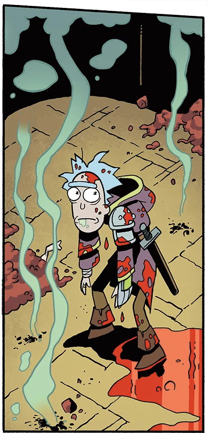

<table class="rd__b-special rd__b-data  rd__b-data--stats">
		<thead>
			<tr>
				<th class="rd__data-embed-header ve-text-left" colspan="6" data-rd-data-embed-header="true">
					

						

							Light
							
						

						[+]
					

				</th>
			</tr>
		</thead><tbody class="ve-hidden" data-rd-embedded-data-render-target="true"><tr>
			<td colspan="6" data-rd-tag="spell" data-rd-uid="Light|PHB" data-rd-page="spells.html" data-rd-source="PHB" data-rd-hash="light_phb" data-rd-name="Light" data-rd-display-name="Light" data-rd-style="" data-rd-entry-data="{}">
				<i>Loading <a href="spells.html#light_phb"  onmouseover="Renderer.hover.pHandleLinkMouseOver(event, this)" onmouseleave="Renderer.hover.handleLinkMouseLeave(event, this)" onmousemove="Renderer.hover.handleLinkMouseMove(event, this)" onclick="Renderer.hover.handleLinkClick(event, this)" onwheel="Renderer.hover.handleLinkWheel(event, this)" ondragstart="Renderer.hover.handleLinkDragStart(event, this)" data-vet-page="spells.html" data-vet-source="PHB" data-vet-hash="light_phb" ontouchstart="Renderer.hover.handleTouchStart(event, this)" >Light</a>...</i>
				
			</td>
		</tr></tbody></table>When you're going down in a dirty hole to kill monsters, it's kinda useful to be able to see where the f*** they are.

<table class="rd__b-special rd__b-data  rd__b-data--stats">
		<thead>
			<tr>
				<th class="rd__data-embed-header ve-text-left" colspan="6" data-rd-data-embed-header="true">
					

						

							Lightning Bolt
							
						

						[+]
					

				</th>
			</tr>
		</thead><tbody class="ve-hidden" data-rd-embedded-data-render-target="true"><tr>
			<td colspan="6" data-rd-tag="spell" data-rd-uid="Lightning Bolt|PHB" data-rd-page="spells.html" data-rd-source="PHB" data-rd-hash="lightning%20bolt_phb" data-rd-name="Lightning Bolt" data-rd-display-name="Lightning Bolt" data-rd-style="" data-rd-entry-data="{}">
				<i>Loading <a href="spells.html#lightning%20bolt_phb"  onmouseover="Renderer.hover.pHandleLinkMouseOver(event, this)" onmouseleave="Renderer.hover.handleLinkMouseLeave(event, this)" onmousemove="Renderer.hover.handleLinkMouseMove(event, this)" onclick="Renderer.hover.handleLinkClick(event, this)" onwheel="Renderer.hover.handleLinkWheel(event, this)" ondragstart="Renderer.hover.handleLinkDragStart(event, this)" data-vet-page="spells.html" data-vet-source="PHB" data-vet-hash="lightning%20bolt_phb" ontouchstart="Renderer.hover.handleTouchStart(event, this)" >Lightning Bolt</a>...</i>
				
			</td>
		</tr></tbody></table>If you're stupid and didn't pick up fireball, then you better grab this. Zap, Crackle, Pop, b*****s!

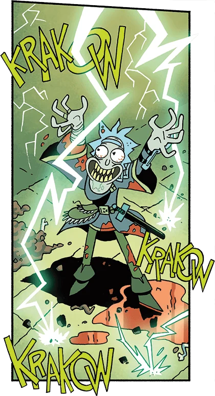

<table class="rd__b-special rd__b-data  rd__b-data--stats">
		<thead>
			<tr>
				<th class="rd__data-embed-header ve-text-left" colspan="6" data-rd-data-embed-header="true">
					

						

							Mage Armor
							
						

						[+]
					

				</th>
			</tr>
		</thead><tbody class="ve-hidden" data-rd-embedded-data-render-target="true"><tr>
			<td colspan="6" data-rd-tag="spell" data-rd-uid="Mage Armor|PHB" data-rd-page="spells.html" data-rd-source="PHB" data-rd-hash="mage%20armor_phb" data-rd-name="Mage Armor" data-rd-display-name="Mage Armor" data-rd-style="" data-rd-entry-data="{}">
				<i>Loading <a href="spells.html#mage%20armor_phb"  onmouseover="Renderer.hover.pHandleLinkMouseOver(event, this)" onmouseleave="Renderer.hover.handleLinkMouseLeave(event, this)" onmousemove="Renderer.hover.handleLinkMouseMove(event, this)" onclick="Renderer.hover.handleLinkClick(event, this)" onwheel="Renderer.hover.handleLinkWheel(event, this)" ondragstart="Renderer.hover.handleLinkDragStart(event, this)" data-vet-page="spells.html" data-vet-source="PHB" data-vet-hash="mage%20armor_phb" ontouchstart="Renderer.hover.handleTouchStart(event, this)" >Mage Armor</a>...</i>
				
			</td>
		</tr></tbody></table>
>
>
>Abjuration is usually garbage, but since wizards are forced to walk around wearing toilet paper for protection because Wizards of the Coast thinks they're OP, this spell might actually keep you alive.
>

<table class="rd__b-special rd__b-data  rd__b-data--stats">
		<thead>
			<tr>
				<th class="rd__data-embed-header ve-text-left" colspan="6" data-rd-data-embed-header="true">
					

						

							Mage Hand
							
						

						[+]
					

				</th>
			</tr>
		</thead><tbody class="ve-hidden" data-rd-embedded-data-render-target="true"><tr>
			<td colspan="6" data-rd-tag="spell" data-rd-uid="Mage Hand|PHB" data-rd-page="spells.html" data-rd-source="PHB" data-rd-hash="mage%20hand_phb" data-rd-name="Mage Hand" data-rd-display-name="Mage Hand" data-rd-style="" data-rd-entry-data="{}">
				<i>Loading <a href="spells.html#mage%20hand_phb"  onmouseover="Renderer.hover.pHandleLinkMouseOver(event, this)" onmouseleave="Renderer.hover.handleLinkMouseLeave(event, this)" onmousemove="Renderer.hover.handleLinkMouseMove(event, this)" onclick="Renderer.hover.handleLinkClick(event, this)" onwheel="Renderer.hover.handleLinkWheel(event, this)" ondragstart="Renderer.hover.handleLinkDragStart(event, this)" data-vet-page="spells.html" data-vet-source="PHB" data-vet-hash="mage%20hand_phb" ontouchstart="Renderer.hover.handleTouchStart(event, this)" >Mage Hand</a>...</i>
				
			</td>
		</tr></tbody></table>Push stuff around.

Trigger a trap from a safe distance.

Mess with your friends.

Pick your horse's nose while riding said horse.

I-I can keep going.

<table class="rd__b-special rd__b-data  rd__b-data--stats">
		<thead>
			<tr>
				<th class="rd__data-embed-header ve-text-left" colspan="6" data-rd-data-embed-header="true">
					

						

							Magic Missile
							
						

						[+]
					

				</th>
			</tr>
		</thead><tbody class="ve-hidden" data-rd-embedded-data-render-target="true"><tr>
			<td colspan="6" data-rd-tag="spell" data-rd-uid="Magic Missile|PHB" data-rd-page="spells.html" data-rd-source="PHB" data-rd-hash="magic%20missile_phb" data-rd-name="Magic Missile" data-rd-display-name="Magic Missile" data-rd-style="" data-rd-entry-data="{}">
				<i>Loading <a href="spells.html#magic%20missile_phb"  onmouseover="Renderer.hover.pHandleLinkMouseOver(event, this)" onmouseleave="Renderer.hover.handleLinkMouseLeave(event, this)" onmousemove="Renderer.hover.handleLinkMouseMove(event, this)" onclick="Renderer.hover.handleLinkClick(event, this)" onwheel="Renderer.hover.handleLinkWheel(event, this)" ondragstart="Renderer.hover.handleLinkDragStart(event, this)" data-vet-page="spells.html" data-vet-source="PHB" data-vet-hash="magic%20missile_phb" ontouchstart="Renderer.hover.handleTouchStart(event, this)" >Magic Missile</a>...</i>
				
			</td>
		</tr></tbody></table>Notice this spell's most important feature, Morty: NO ATTACK ROLL.

It hits and hurts. Simple-dimple. Little glowing arrows of death at your command, and nobody can do s*** about it.

<table class="rd__b-special rd__b-data  rd__b-data--stats">
		<thead>
			<tr>
				<th class="rd__data-embed-header ve-text-left" colspan="6" data-rd-data-embed-header="true">
					

						

							Mass Healing Word
							
						

						[+]
					

				</th>
			</tr>
		</thead><tbody class="ve-hidden" data-rd-embedded-data-render-target="true"><tr>
			<td colspan="6" data-rd-tag="spell" data-rd-uid="Mass Healing Word|PHB" data-rd-page="spells.html" data-rd-source="PHB" data-rd-hash="mass%20healing%20word_phb" data-rd-name="Mass Healing Word" data-rd-display-name="Mass Healing Word" data-rd-style="" data-rd-entry-data="{}">
				<i>Loading <a href="spells.html#mass%20healing%20word_phb"  onmouseover="Renderer.hover.pHandleLinkMouseOver(event, this)" onmouseleave="Renderer.hover.handleLinkMouseLeave(event, this)" onmousemove="Renderer.hover.handleLinkMouseMove(event, this)" onclick="Renderer.hover.handleLinkClick(event, this)" onwheel="Renderer.hover.handleLinkWheel(event, this)" ondragstart="Renderer.hover.handleLinkDragStart(event, this)" data-vet-page="spells.html" data-vet-source="PHB" data-vet-hash="mass%20healing%20word_phb" ontouchstart="Renderer.hover.handleTouchStart(event, this)" >Mass Healing Word</a>...</i>
				
			</td>
		</tr></tbody></table>Smart clerics hold this spell in reserve until their party members pay up. These heals don't come cheap.

<table class="rd__b-special rd__b-data  rd__b-data--stats">
		<thead>
			<tr>
				<th class="rd__data-embed-header ve-text-left" colspan="6" data-rd-data-embed-header="true">
					

						

							Misty Step
							
						

						[+]
					

				</th>
			</tr>
		</thead><tbody class="ve-hidden" data-rd-embedded-data-render-target="true"><tr>
			<td colspan="6" data-rd-tag="spell" data-rd-uid="Misty Step|PHB" data-rd-page="spells.html" data-rd-source="PHB" data-rd-hash="misty%20step_phb" data-rd-name="Misty Step" data-rd-display-name="Misty Step" data-rd-style="" data-rd-entry-data="{}">
				<i>Loading <a href="spells.html#misty%20step_phb"  onmouseover="Renderer.hover.pHandleLinkMouseOver(event, this)" onmouseleave="Renderer.hover.handleLinkMouseLeave(event, this)" onmousemove="Renderer.hover.handleLinkMouseMove(event, this)" onclick="Renderer.hover.handleLinkClick(event, this)" onwheel="Renderer.hover.handleLinkWheel(event, this)" ondragstart="Renderer.hover.handleLinkDragStart(event, this)" data-vet-page="spells.html" data-vet-source="PHB" data-vet-hash="misty%20step_phb" ontouchstart="Renderer.hover.handleTouchStart(event, this)" >Misty Step</a>...</i>
				
			</td>
		</tr></tbody></table>
>
>
>Perfect for ripping a big nasty fart and then moving elsewhere for maximum deniability.
>

<table class="rd__b-special rd__b-data  rd__b-data--stats">
		<thead>
			<tr>
				<th class="rd__data-embed-header ve-text-left" colspan="6" data-rd-data-embed-header="true">
					

						

							Prayer of Healing
							
						

						[+]
					

				</th>
			</tr>
		</thead><tbody class="ve-hidden" data-rd-embedded-data-render-target="true"><tr>
			<td colspan="6" data-rd-tag="spell" data-rd-uid="Prayer of Healing|PHB" data-rd-page="spells.html" data-rd-source="PHB" data-rd-hash="prayer%20of%20healing_phb" data-rd-name="Prayer of Healing" data-rd-display-name="Prayer of Healing" data-rd-style="" data-rd-entry-data="{}">
				<i>Loading <a href="spells.html#prayer%20of%20healing_phb"  onmouseover="Renderer.hover.pHandleLinkMouseOver(event, this)" onmouseleave="Renderer.hover.handleLinkMouseLeave(event, this)" onmousemove="Renderer.hover.handleLinkMouseMove(event, this)" onclick="Renderer.hover.handleLinkClick(event, this)" onwheel="Renderer.hover.handleLinkWheel(event, this)" ondragstart="Renderer.hover.handleLinkDragStart(event, this)" data-vet-page="spells.html" data-vet-source="PHB" data-vet-hash="prayer%20of%20healing_phb" ontouchstart="Renderer.hover.handleTouchStart(event, this)" >Prayer of Healing</a>...</i>
				
			</td>
		</tr></tbody></table>That 10-minute casting time is a buzzkill, but when your crew's doing the downtime thing, it gives you something to occupy yourself with so you don't have to participate in their campfire bonding rituals.

<table class="rd__b-special rd__b-data  rd__b-data--stats">
		<thead>
			<tr>
				<th class="rd__data-embed-header ve-text-left" colspan="6" data-rd-data-embed-header="true">
					

						

							Prestidigitation
							
						

						[+]
					

				</th>
			</tr>
		</thead><tbody class="ve-hidden" data-rd-embedded-data-render-target="true"><tr>
			<td colspan="6" data-rd-tag="spell" data-rd-uid="Prestidigitation|PHB" data-rd-page="spells.html" data-rd-source="PHB" data-rd-hash="prestidigitation_phb" data-rd-name="Prestidigitation" data-rd-display-name="Prestidigitation" data-rd-style="" data-rd-entry-data="{}">
				<i>Loading <a href="spells.html#prestidigitation_phb"  onmouseover="Renderer.hover.pHandleLinkMouseOver(event, this)" onmouseleave="Renderer.hover.handleLinkMouseLeave(event, this)" onmousemove="Renderer.hover.handleLinkMouseMove(event, this)" onclick="Renderer.hover.handleLinkClick(event, this)" onwheel="Renderer.hover.handleLinkWheel(event, this)" ondragstart="Renderer.hover.handleLinkDragStart(event, this)" data-vet-page="spells.html" data-vet-source="PHB" data-vet-hash="prestidigitation_phb" ontouchstart="Renderer.hover.handleTouchStart(event, this)" >Prestidigitation</a>...</i>
				
			</td>
		</tr></tbody></table>I bet at first glance you figured I'd call this as a Jerry spell, but it's not, Morty. Prestidigitation is awesome! It doesn't take up any spell slots because it's a cantrip. That means you can use it constantly... and you should.

Everywhere your wizard goes, they'll have glittering teeth, musky magic cologne, a warming glow, and their own personal soundtrack. Clean clothes, too. The other members of your party are gonna shamble into town smelling like ass while you get to be Slick McDick, Wizard Supreme.

<table class="rd__b-special rd__b-data  rd__b-data--stats">
		<thead>
			<tr>
				<th class="rd__data-embed-header ve-text-left" colspan="6" data-rd-data-embed-header="true">
					

						

							Protection from Energy
							
						

						[+]
					

				</th>
			</tr>
		</thead><tbody class="ve-hidden" data-rd-embedded-data-render-target="true"><tr>
			<td colspan="6" data-rd-tag="spell" data-rd-uid="Protection from Energy|PHB" data-rd-page="spells.html" data-rd-source="PHB" data-rd-hash="protection%20from%20energy_phb" data-rd-name="Protection from Energy" data-rd-display-name="Protection from Energy" data-rd-style="" data-rd-entry-data="{}">
				<i>Loading <a href="spells.html#protection%20from%20energy_phb"  onmouseover="Renderer.hover.pHandleLinkMouseOver(event, this)" onmouseleave="Renderer.hover.handleLinkMouseLeave(event, this)" onmousemove="Renderer.hover.handleLinkMouseMove(event, this)" onclick="Renderer.hover.handleLinkClick(event, this)" onwheel="Renderer.hover.handleLinkWheel(event, this)" ondragstart="Renderer.hover.handleLinkDragStart(event, this)" data-vet-page="spells.html" data-vet-source="PHB" data-vet-hash="protection%20from%20energy_phb" ontouchstart="Renderer.hover.handleTouchStart(event, this)" >Protection from Energy</a>...</i>
				
			</td>
		</tr></tbody></table>Don't waste third level spell slots on protecto-trash. Kill your enemies fast and you won't even need defense.

<table class="rd__b-special rd__b-data  rd__b-data--stats">
		<thead>
			<tr>
				<th class="rd__data-embed-header ve-text-left" colspan="6" data-rd-data-embed-header="true">
					

						

							Ray of Frost
							
						

						[+]
					

				</th>
			</tr>
		</thead><tbody class="ve-hidden" data-rd-embedded-data-render-target="true"><tr>
			<td colspan="6" data-rd-tag="spell" data-rd-uid="Ray of Frost|PHB" data-rd-page="spells.html" data-rd-source="PHB" data-rd-hash="ray%20of%20frost_phb" data-rd-name="Ray of Frost" data-rd-display-name="Ray of Frost" data-rd-style="" data-rd-entry-data="{}">
				<i>Loading <a href="spells.html#ray%20of%20frost_phb"  onmouseover="Renderer.hover.pHandleLinkMouseOver(event, this)" onmouseleave="Renderer.hover.handleLinkMouseLeave(event, this)" onmousemove="Renderer.hover.handleLinkMouseMove(event, this)" onclick="Renderer.hover.handleLinkClick(event, this)" onwheel="Renderer.hover.handleLinkWheel(event, this)" ondragstart="Renderer.hover.handleLinkDragStart(event, this)" data-vet-page="spells.html" data-vet-source="PHB" data-vet-hash="ray%20of%20frost_phb" ontouchstart="Renderer.hover.handleTouchStart(event, this)" >Ray of Frost</a>...</i>
				
			</td>
		</tr></tbody></table>This is it, Morty, the third of the holy triumvirate of low-level wizard DPS. It's a song of ice and fire AND lightning.

<table class="rd__b-special rd__b-data  rd__b-data--stats">
		<thead>
			<tr>
				<th class="rd__data-embed-header ve-text-left" colspan="6" data-rd-data-embed-header="true">
					

						

							Resistance
							
						

						[+]
					

				</th>
			</tr>
		</thead><tbody class="ve-hidden" data-rd-embedded-data-render-target="true"><tr>
			<td colspan="6" data-rd-tag="spell" data-rd-uid="Resistance|PHB" data-rd-page="spells.html" data-rd-source="PHB" data-rd-hash="resistance_phb" data-rd-name="Resistance" data-rd-display-name="Resistance" data-rd-style="" data-rd-entry-data="{}">
				<i>Loading <a href="spells.html#resistance_phb"  onmouseover="Renderer.hover.pHandleLinkMouseOver(event, this)" onmouseleave="Renderer.hover.handleLinkMouseLeave(event, this)" onmousemove="Renderer.hover.handleLinkMouseMove(event, this)" onclick="Renderer.hover.handleLinkClick(event, this)" onwheel="Renderer.hover.handleLinkWheel(event, this)" ondragstart="Renderer.hover.handleLinkDragStart(event, this)" data-vet-page="spells.html" data-vet-source="PHB" data-vet-hash="resistance_phb" ontouchstart="Renderer.hover.handleTouchStart(event, this)" >Resistance</a>...</i>
				
			</td>
		</tr></tbody></table>
>
>
>Wait, the material component for this is "a miniature cloak"?
>
>Who the f*** is running around with a pouch full of miniature cloaks?
>
>Wizards of the Coast, whatever you're smoking, I want some.
>

<table class="rd__b-special rd__b-data  rd__b-data--stats">
		<thead>
			<tr>
				<th class="rd__data-embed-header ve-text-left" colspan="6" data-rd-data-embed-header="true">
					

						

							Revivify
							
						

						[+]
					

				</th>
			</tr>
		</thead><tbody class="ve-hidden" data-rd-embedded-data-render-target="true"><tr>
			<td colspan="6" data-rd-tag="spell" data-rd-uid="Revivify|PHB" data-rd-page="spells.html" data-rd-source="PHB" data-rd-hash="revivify_phb" data-rd-name="Revivify" data-rd-display-name="Revivify" data-rd-style="" data-rd-entry-data="{}">
				<i>Loading <a href="spells.html#revivify_phb"  onmouseover="Renderer.hover.pHandleLinkMouseOver(event, this)" onmouseleave="Renderer.hover.handleLinkMouseLeave(event, this)" onmousemove="Renderer.hover.handleLinkMouseMove(event, this)" onclick="Renderer.hover.handleLinkClick(event, this)" onwheel="Renderer.hover.handleLinkWheel(event, this)" ondragstart="Renderer.hover.handleLinkDragStart(event, this)" data-vet-page="spells.html" data-vet-source="PHB" data-vet-hash="revivify_phb" ontouchstart="Renderer.hover.handleTouchStart(event, this)" >Revivify</a>...</i>
				
			</td>
		</tr></tbody></table>
>
>
>Calling the spell "Have you tried not dying?" would be more accurate, but not as catchy.
>

<table class="rd__b-special rd__b-data  rd__b-data--stats">
		<thead>
			<tr>
				<th class="rd__data-embed-header ve-text-left" colspan="6" data-rd-data-embed-header="true">
					

						

							Sacred Flame
							
						

						[+]
					

				</th>
			</tr>
		</thead><tbody class="ve-hidden" data-rd-embedded-data-render-target="true"><tr>
			<td colspan="6" data-rd-tag="spell" data-rd-uid="Sacred Flame|PHB" data-rd-page="spells.html" data-rd-source="PHB" data-rd-hash="sacred%20flame_phb" data-rd-name="Sacred Flame" data-rd-display-name="Sacred Flame" data-rd-style="" data-rd-entry-data="{}">
				<i>Loading <a href="spells.html#sacred%20flame_phb"  onmouseover="Renderer.hover.pHandleLinkMouseOver(event, this)" onmouseleave="Renderer.hover.handleLinkMouseLeave(event, this)" onmousemove="Renderer.hover.handleLinkMouseMove(event, this)" onclick="Renderer.hover.handleLinkClick(event, this)" onwheel="Renderer.hover.handleLinkWheel(event, this)" ondragstart="Renderer.hover.handleLinkDragStart(event, this)" data-vet-page="spells.html" data-vet-source="PHB" data-vet-hash="sacred%20flame_phb" ontouchstart="Renderer.hover.handleTouchStart(event, this)" >Sacred Flame</a>...</i>
				
			</td>
		</tr></tbody></table>Not bad, but radiant damage means your enemy's clothes don't catch on fire, so it's not as funny.

<table class="rd__b-special rd__b-data  rd__b-data--stats">
		<thead>
			<tr>
				<th class="rd__data-embed-header ve-text-left" colspan="6" data-rd-data-embed-header="true">
					

						

							Sanctuary
							
						

						[+]
					

				</th>
			</tr>
		</thead><tbody class="ve-hidden" data-rd-embedded-data-render-target="true"><tr>
			<td colspan="6" data-rd-tag="spell" data-rd-uid="Sanctuary|PHB" data-rd-page="spells.html" data-rd-source="PHB" data-rd-hash="sanctuary_phb" data-rd-name="Sanctuary" data-rd-display-name="Sanctuary" data-rd-style="" data-rd-entry-data="{}">
				<i>Loading <a href="spells.html#sanctuary_phb"  onmouseover="Renderer.hover.pHandleLinkMouseOver(event, this)" onmouseleave="Renderer.hover.handleLinkMouseLeave(event, this)" onmousemove="Renderer.hover.handleLinkMouseMove(event, this)" onclick="Renderer.hover.handleLinkClick(event, this)" onwheel="Renderer.hover.handleLinkWheel(event, this)" ondragstart="Renderer.hover.handleLinkDragStart(event, this)" data-vet-page="spells.html" data-vet-source="PHB" data-vet-hash="sanctuary_phb" ontouchstart="Renderer.hover.handleTouchStart(event, this)" >Sanctuary</a>...</i>
				
			</td>
		</tr></tbody></table>Don't worry about protecting things, Morty. Everything dies.

<table class="rd__b-special rd__b-data  rd__b-data--stats">
		<thead>
			<tr>
				<th class="rd__data-embed-header ve-text-left" colspan="6" data-rd-data-embed-header="true">
					

						

							Shield
							
						

						[+]
					

				</th>
			</tr>
		</thead><tbody class="ve-hidden" data-rd-embedded-data-render-target="true"><tr>
			<td colspan="6" data-rd-tag="spell" data-rd-uid="Shield|PHB" data-rd-page="spells.html" data-rd-source="PHB" data-rd-hash="shield_phb" data-rd-name="Shield" data-rd-display-name="Shield" data-rd-style="" data-rd-entry-data="{}">
				<i>Loading <a href="spells.html#shield_phb"  onmouseover="Renderer.hover.pHandleLinkMouseOver(event, this)" onmouseleave="Renderer.hover.handleLinkMouseLeave(event, this)" onmousemove="Renderer.hover.handleLinkMouseMove(event, this)" onclick="Renderer.hover.handleLinkClick(event, this)" onwheel="Renderer.hover.handleLinkWheel(event, this)" ondragstart="Renderer.hover.handleLinkDragStart(event, this)" data-vet-page="spells.html" data-vet-source="PHB" data-vet-hash="shield_phb" ontouchstart="Renderer.hover.handleTouchStart(event, this)" >Shield</a>...</i>
				
			</td>
		</tr></tbody></table>The spellcasting equivalent of a jockstrap: useful in the right circumstances, but way cooler if you can do your thing without needing it—and eventually it'll need a wash.

<table class="rd__b-special rd__b-data  rd__b-data--stats">
		<thead>
			<tr>
				<th class="rd__data-embed-header ve-text-left" colspan="6" data-rd-data-embed-header="true">
					

						

							Shield of Faith
							
						

						[+]
					

				</th>
			</tr>
		</thead><tbody class="ve-hidden" data-rd-embedded-data-render-target="true"><tr>
			<td colspan="6" data-rd-tag="spell" data-rd-uid="Shield of Faith|PHB" data-rd-page="spells.html" data-rd-source="PHB" data-rd-hash="shield%20of%20faith_phb" data-rd-name="Shield of Faith" data-rd-display-name="Shield of Faith" data-rd-style="" data-rd-entry-data="{}">
				<i>Loading <a href="spells.html#shield%20of%20faith_phb"  onmouseover="Renderer.hover.pHandleLinkMouseOver(event, this)" onmouseleave="Renderer.hover.handleLinkMouseLeave(event, this)" onmousemove="Renderer.hover.handleLinkMouseMove(event, this)" onclick="Renderer.hover.handleLinkClick(event, this)" onwheel="Renderer.hover.handleLinkWheel(event, this)" ondragstart="Renderer.hover.handleLinkDragStart(event, this)" data-vet-page="spells.html" data-vet-source="PHB" data-vet-hash="shield%20of%20faith_phb" ontouchstart="Renderer.hover.handleTouchStart(event, this)" >Shield of Faith</a>...</i>
				
			</td>
		</tr></tbody></table>I dunno, I kinda respect this.

A cleric who takes 10 minutes to concentrate on how much they love their god so you can get punched harder. That's pretty metal.

<table class="rd__b-special rd__b-data  rd__b-data--stats">
		<thead>
			<tr>
				<th class="rd__data-embed-header ve-text-left" colspan="6" data-rd-data-embed-header="true">
					

						

							Shocking Grasp
							
						

						[+]
					

				</th>
			</tr>
		</thead><tbody class="ve-hidden" data-rd-embedded-data-render-target="true"><tr>
			<td colspan="6" data-rd-tag="spell" data-rd-uid="Shocking Grasp|PHB" data-rd-page="spells.html" data-rd-source="PHB" data-rd-hash="shocking%20grasp_phb" data-rd-name="Shocking Grasp" data-rd-display-name="Shocking Grasp" data-rd-style="" data-rd-entry-data="{}">
				<i>Loading <a href="spells.html#shocking%20grasp_phb"  onmouseover="Renderer.hover.pHandleLinkMouseOver(event, this)" onmouseleave="Renderer.hover.handleLinkMouseLeave(event, this)" onmousemove="Renderer.hover.handleLinkMouseMove(event, this)" onclick="Renderer.hover.handleLinkClick(event, this)" onwheel="Renderer.hover.handleLinkWheel(event, this)" ondragstart="Renderer.hover.handleLinkDragStart(event, this)" data-vet-page="spells.html" data-vet-source="PHB" data-vet-hash="shocking%20grasp_phb" ontouchstart="Renderer.hover.handleTouchStart(event, this)" >Shocking Grasp</a>...</i>
				
			</td>
		</tr></tbody></table>Like shuffling your feet on a carpet just before slapping some sense into a goblin.

<table class="rd__b-special rd__b-data  rd__b-data--stats">
		<thead>
			<tr>
				<th class="rd__data-embed-header ve-text-left" colspan="6" data-rd-data-embed-header="true">
					

						

							Silence
							
						

						[+]
					

				</th>
			</tr>
		</thead><tbody class="ve-hidden" data-rd-embedded-data-render-target="true"><tr>
			<td colspan="6" data-rd-tag="spell" data-rd-uid="Silence|PHB" data-rd-page="spells.html" data-rd-source="PHB" data-rd-hash="silence_phb" data-rd-name="Silence" data-rd-display-name="Silence" data-rd-style="" data-rd-entry-data="{}">
				<i>Loading <a href="spells.html#silence_phb"  onmouseover="Renderer.hover.pHandleLinkMouseOver(event, this)" onmouseleave="Renderer.hover.handleLinkMouseLeave(event, this)" onmousemove="Renderer.hover.handleLinkMouseMove(event, this)" onclick="Renderer.hover.handleLinkClick(event, this)" onwheel="Renderer.hover.handleLinkWheel(event, this)" ondragstart="Renderer.hover.handleLinkDragStart(event, this)" data-vet-page="spells.html" data-vet-source="PHB" data-vet-hash="silence_phb" ontouchstart="Renderer.hover.handleTouchStart(event, this)" >Silence</a>...</i>
				
			</td>
		</tr></tbody></table>I like busting this one out on enemy spellcasters and then throwing up the universal sign language for "Oops! Guess you're f***ed!"

<table class="rd__b-special rd__b-data  rd__b-data--stats">
		<thead>
			<tr>
				<th class="rd__data-embed-header ve-text-left" colspan="6" data-rd-data-embed-header="true">
					

						

							Sleep
							
						

						[+]
					

				</th>
			</tr>
		</thead><tbody class="ve-hidden" data-rd-embedded-data-render-target="true"><tr>
			<td colspan="6" data-rd-tag="spell" data-rd-uid="Sleep|PHB" data-rd-page="spells.html" data-rd-source="PHB" data-rd-hash="sleep_phb" data-rd-name="Sleep" data-rd-display-name="Sleep" data-rd-style="" data-rd-entry-data="{}">
				<i>Loading <a href="spells.html#sleep_phb"  onmouseover="Renderer.hover.pHandleLinkMouseOver(event, this)" onmouseleave="Renderer.hover.handleLinkMouseLeave(event, this)" onmousemove="Renderer.hover.handleLinkMouseMove(event, this)" onclick="Renderer.hover.handleLinkClick(event, this)" onwheel="Renderer.hover.handleLinkWheel(event, this)" ondragstart="Renderer.hover.handleLinkDragStart(event, this)" data-vet-page="spells.html" data-vet-source="PHB" data-vet-hash="sleep_phb" ontouchstart="Renderer.hover.handleTouchStart(event, this)" >Sleep</a>...</i>
				
			</td>
		</tr></tbody></table>A spell that requires me to tiptoe around the battlefield is not my style, Morty. Like, I get that it can be useful, but it still just feels like a stopgap.

It's not full Jerry, but it's also not rushing into my prepared spell list either.

<table class="rd__b-special rd__b-data  rd__b-data--stats">
		<thead>
			<tr>
				<th class="rd__data-embed-header ve-text-left" colspan="6" data-rd-data-embed-header="true">
					

						

							Spider Climb
							
						

						[+]
					

				</th>
			</tr>
		</thead><tbody class="ve-hidden" data-rd-embedded-data-render-target="true"><tr>
			<td colspan="6" data-rd-tag="spell" data-rd-uid="Spider Climb|PHB" data-rd-page="spells.html" data-rd-source="PHB" data-rd-hash="spider%20climb_phb" data-rd-name="Spider Climb" data-rd-display-name="Spider Climb" data-rd-style="" data-rd-entry-data="{}">
				<i>Loading <a href="spells.html#spider%20climb_phb"  onmouseover="Renderer.hover.pHandleLinkMouseOver(event, this)" onmouseleave="Renderer.hover.handleLinkMouseLeave(event, this)" onmousemove="Renderer.hover.handleLinkMouseMove(event, this)" onclick="Renderer.hover.handleLinkClick(event, this)" onwheel="Renderer.hover.handleLinkWheel(event, this)" ondragstart="Renderer.hover.handleLinkDragStart(event, this)" data-vet-page="spells.html" data-vet-source="PHB" data-vet-hash="spider%20climb_phb" ontouchstart="Renderer.hover.handleTouchStart(event, this)" >Spider Climb</a>...</i>
				
			</td>
		</tr></tbody></table>
>
>
>I enjoy throwing spells down from above while walking on the ceiling. I'm man enough to admit it.
>

<table class="rd__b-special rd__b-data  rd__b-data--stats">
		<thead>
			<tr>
				<th class="rd__data-embed-header ve-text-left" colspan="6" data-rd-data-embed-header="true">
					

						

							Spirit Guardians
							
						

						[+]
					

				</th>
			</tr>
		</thead><tbody class="ve-hidden" data-rd-embedded-data-render-target="true"><tr>
			<td colspan="6" data-rd-tag="spell" data-rd-uid="Spirit Guardians|PHB" data-rd-page="spells.html" data-rd-source="PHB" data-rd-hash="spirit%20guardians_phb" data-rd-name="Spirit Guardians" data-rd-display-name="Spirit Guardians" data-rd-style="" data-rd-entry-data="{}">
				<i>Loading <a href="spells.html#spirit%20guardians_phb"  onmouseover="Renderer.hover.pHandleLinkMouseOver(event, this)" onmouseleave="Renderer.hover.handleLinkMouseLeave(event, this)" onmousemove="Renderer.hover.handleLinkMouseMove(event, this)" onclick="Renderer.hover.handleLinkClick(event, this)" onwheel="Renderer.hover.handleLinkWheel(event, this)" ondragstart="Renderer.hover.handleLinkDragStart(event, this)" data-vet-page="spells.html" data-vet-source="PHB" data-vet-hash="spirit%20guardians_phb" ontouchstart="Renderer.hover.handleTouchStart(event, this)" >Spirit Guardians</a>...</i>
				
			</td>
		</tr></tbody></table>Crazy ghosts that zap monsters for you?

That's f***ing cool.

It's more hands-off than my typical "crush your enemies, see them driven before you" approach, but I definitely see the appeal.

<table class="rd__b-special rd__b-data  rd__b-data--stats">
		<thead>
			<tr>
				<th class="rd__data-embed-header ve-text-left" colspan="6" data-rd-data-embed-header="true">
					

						

							Spiritual Weapon
							
						

						[+]
					

				</th>
			</tr>
		</thead><tbody class="ve-hidden" data-rd-embedded-data-render-target="true"><tr>
			<td colspan="6" data-rd-tag="spell" data-rd-uid="Spiritual Weapon|PHB" data-rd-page="spells.html" data-rd-source="PHB" data-rd-hash="spiritual%20weapon_phb" data-rd-name="Spiritual Weapon" data-rd-display-name="Spiritual Weapon" data-rd-style="" data-rd-entry-data="{}">
				<i>Loading <a href="spells.html#spiritual%20weapon_phb"  onmouseover="Renderer.hover.pHandleLinkMouseOver(event, this)" onmouseleave="Renderer.hover.handleLinkMouseLeave(event, this)" onmousemove="Renderer.hover.handleLinkMouseMove(event, this)" onclick="Renderer.hover.handleLinkClick(event, this)" onwheel="Renderer.hover.handleLinkWheel(event, this)" ondragstart="Renderer.hover.handleLinkDragStart(event, this)" data-vet-page="spells.html" data-vet-source="PHB" data-vet-hash="spiritual%20weapon_phb" ontouchstart="Renderer.hover.handleTouchStart(event, this)" >Spiritual Weapon</a>...</i>
				
			</td>
		</tr></tbody></table>There's nothing as demoralizing as being hit by a big ol' ghost schlong.

<table class="rd__b-special rd__b-data  rd__b-data--stats">
		<thead>
			<tr>
				<th class="rd__data-embed-header ve-text-left" colspan="6" data-rd-data-embed-header="true">
					

						

							Suggestion
							
						

						[+]
					

				</th>
			</tr>
		</thead><tbody class="ve-hidden" data-rd-embedded-data-render-target="true"><tr>
			<td colspan="6" data-rd-tag="spell" data-rd-uid="Suggestion|PHB" data-rd-page="spells.html" data-rd-source="PHB" data-rd-hash="suggestion_phb" data-rd-name="Suggestion" data-rd-display-name="Suggestion" data-rd-style="" data-rd-entry-data="{}">
				<i>Loading <a href="spells.html#suggestion_phb"  onmouseover="Renderer.hover.pHandleLinkMouseOver(event, this)" onmouseleave="Renderer.hover.handleLinkMouseLeave(event, this)" onmousemove="Renderer.hover.handleLinkMouseMove(event, this)" onclick="Renderer.hover.handleLinkClick(event, this)" onwheel="Renderer.hover.handleLinkWheel(event, this)" ondragstart="Renderer.hover.handleLinkDragStart(event, this)" data-vet-page="spells.html" data-vet-source="PHB" data-vet-hash="suggestion_phb" ontouchstart="Renderer.hover.handleTouchStart(event, this)" >Suggestion</a>...</i>
				
			</td>
		</tr></tbody></table>Here's a real suggestion: don't take a spell that requires 10 minutes of arguing at the table to figure out if it worked or not.

<table class="rd__b-special rd__b-data  rd__b-data--stats">
		<thead>
			<tr>
				<th class="rd__data-embed-header ve-text-left" colspan="6" data-rd-data-embed-header="true">
					

						

							Thaumaturgy
							
						

						[+]
					

				</th>
			</tr>
		</thead><tbody class="ve-hidden" data-rd-embedded-data-render-target="true"><tr>
			<td colspan="6" data-rd-tag="spell" data-rd-uid="Thaumaturgy|PHB" data-rd-page="spells.html" data-rd-source="PHB" data-rd-hash="thaumaturgy_phb" data-rd-name="Thaumaturgy" data-rd-display-name="Thaumaturgy" data-rd-style="" data-rd-entry-data="{}">
				<i>Loading <a href="spells.html#thaumaturgy_phb"  onmouseover="Renderer.hover.pHandleLinkMouseOver(event, this)" onmouseleave="Renderer.hover.handleLinkMouseLeave(event, this)" onmousemove="Renderer.hover.handleLinkMouseMove(event, this)" onclick="Renderer.hover.handleLinkClick(event, this)" onwheel="Renderer.hover.handleLinkWheel(event, this)" ondragstart="Renderer.hover.handleLinkDragStart(event, this)" data-vet-page="spells.html" data-vet-source="PHB" data-vet-hash="thaumaturgy_phb" ontouchstart="Renderer.hover.handleTouchStart(event, this)" >Thaumaturgy</a>...</i>
				
			</td>
		</tr></tbody></table>This spell wants to be prestidigitation for clerics, but it's definitely on the weak side. Here's some harmless tremors for you—*FAAART*

<table class="rd__b-special rd__b-data  rd__b-data--stats">
		<thead>
			<tr>
				<th class="rd__data-embed-header ve-text-left" colspan="6" data-rd-data-embed-header="true">
					

						

							Thunderwave
							
						

						[+]
					

				</th>
			</tr>
		</thead><tbody class="ve-hidden" data-rd-embedded-data-render-target="true"><tr>
			<td colspan="6" data-rd-tag="spell" data-rd-uid="Thunderwave|PHB" data-rd-page="spells.html" data-rd-source="PHB" data-rd-hash="thunderwave_phb" data-rd-name="Thunderwave" data-rd-display-name="Thunderwave" data-rd-style="" data-rd-entry-data="{}">
				<i>Loading <a href="spells.html#thunderwave_phb"  onmouseover="Renderer.hover.pHandleLinkMouseOver(event, this)" onmouseleave="Renderer.hover.handleLinkMouseLeave(event, this)" onmousemove="Renderer.hover.handleLinkMouseMove(event, this)" onclick="Renderer.hover.handleLinkClick(event, this)" onwheel="Renderer.hover.handleLinkWheel(event, this)" ondragstart="Renderer.hover.handleLinkDragStart(event, this)" data-vet-page="spells.html" data-vet-source="PHB" data-vet-hash="thunderwave_phb" ontouchstart="Renderer.hover.handleTouchStart(event, this)" >Thunderwave</a>...</i>
				
			</td>
		</tr></tbody></table>Let this baby fly when the bass drops, Morty. Trust me. The crowd will go wild.

<table class="rd__b-special rd__b-data  rd__b-data--stats">
		<thead>
			<tr>
				<th class="rd__data-embed-header ve-text-left" colspan="6" data-rd-data-embed-header="true">
					

						

							Warding Bond
							
						

						[+]
					

				</th>
			</tr>
		</thead><tbody class="ve-hidden" data-rd-embedded-data-render-target="true"><tr>
			<td colspan="6" data-rd-tag="spell" data-rd-uid="Warding Bond|PHB" data-rd-page="spells.html" data-rd-source="PHB" data-rd-hash="warding%20bond_phb" data-rd-name="Warding Bond" data-rd-display-name="Warding Bond" data-rd-style="" data-rd-entry-data="{}">
				<i>Loading <a href="spells.html#warding%20bond_phb"  onmouseover="Renderer.hover.pHandleLinkMouseOver(event, this)" onmouseleave="Renderer.hover.handleLinkMouseLeave(event, this)" onmousemove="Renderer.hover.handleLinkMouseMove(event, this)" onclick="Renderer.hover.handleLinkClick(event, this)" onwheel="Renderer.hover.handleLinkWheel(event, this)" ondragstart="Renderer.hover.handleLinkDragStart(event, this)" data-vet-page="spells.html" data-vet-source="PHB" data-vet-hash="warding%20bond_phb" ontouchstart="Renderer.hover.handleTouchStart(event, this)" >Warding Bond</a>...</i>
				
			</td>
		</tr></tbody></table>
>
>
>Here's a better idea: How about I don't link my life force to somebody else? I don't know or trust any of these clowns.
>

<table class="rd__b-special rd__b-data  rd__b-data--stats">
		<thead>
			<tr>
				<th class="rd__data-embed-header ve-text-left" colspan="6" data-rd-data-embed-header="true">
					

						

							Web
							
						

						[+]
					

				</th>
			</tr>
		</thead><tbody class="ve-hidden" data-rd-embedded-data-render-target="true"><tr>
			<td colspan="6" data-rd-tag="spell" data-rd-uid="Web|PHB" data-rd-page="spells.html" data-rd-source="PHB" data-rd-hash="web_phb" data-rd-name="Web" data-rd-display-name="Web" data-rd-style="" data-rd-entry-data="{}">
				<i>Loading <a href="spells.html#web_phb"  onmouseover="Renderer.hover.pHandleLinkMouseOver(event, this)" onmouseleave="Renderer.hover.handleLinkMouseLeave(event, this)" onmousemove="Renderer.hover.handleLinkMouseMove(event, this)" onclick="Renderer.hover.handleLinkClick(event, this)" onwheel="Renderer.hover.handleLinkWheel(event, this)" ondragstart="Renderer.hover.handleLinkDragStart(event, this)" data-vet-page="spells.html" data-vet-source="PHB" data-vet-hash="web_phb" ontouchstart="Renderer.hover.handleTouchStart(event, this)" >Web</a>...</i>
				
			</td>
		</tr></tbody></table>I'm not here to tell anyone where and when they should blow their personal sticky load, y'know? Th-th-that's a personal choice.

Everybody needs to make their own decisions.

------

# Appendix A: Conditions

Conditions alter a creature's capabilities in a variety of ways and can arise as a result of a spell, a class feature, a monster's attack, or other effect. Most conditions, such as blinded, are impairments, but a few, such as invisible, can be advantageous.

A condition lasts either until it is countered (the prone condition is countered by standing up, for example) or for a duration specified by the effect that imposed the condition.

If multiple effects impose the same condition on a creature, each instance of the condition has its own duration, but the condition's effects don't get worse. A creature either has a condition or doesn't.

The following definitions specify what happens to a creature while it is subjected to a condition.

<table class="rd__b-special rd__b-data  rd__b-data--stats">
		<thead>
			<tr>
				<th class="rd__data-embed-header ve-text-left" colspan="6" data-rd-data-embed-header="true">
					

						

							Blinded
							
						

						[–]
					

				</th>
			</tr>
		</thead><tbody class="" data-rd-embedded-data-render-target="true"><tr>
			<td colspan="6" data-rd-tag="condition" data-rd-uid="Blinded|PHB" data-rd-page="conditionsdiseases.html" data-rd-source="PHB" data-rd-hash="blinded_phb" data-rd-name="Blinded" data-rd-display-name="Blinded" data-rd-style="" data-rd-entry-data="{}">
				<i>Loading <a href="conditionsdiseases.html#blinded_phb"  onmouseover="Renderer.hover.pHandleLinkMouseOver(event, this)" onmouseleave="Renderer.hover.handleLinkMouseLeave(event, this)" onmousemove="Renderer.hover.handleLinkMouseMove(event, this)" onclick="Renderer.hover.handleLinkClick(event, this)" onwheel="Renderer.hover.handleLinkWheel(event, this)" ondragstart="Renderer.hover.handleLinkDragStart(event, this)" data-vet-page="conditionsdiseases.html" data-vet-source="PHB" data-vet-hash="blinded_phb" ontouchstart="Renderer.hover.handleTouchStart(event, this)" >Blinded</a>...</i>
				
			</td>
		</tr></tbody></table><table class="rd__b-special rd__b-data  rd__b-data--stats">
		<thead>
			<tr>
				<th class="rd__data-embed-header ve-text-left" colspan="6" data-rd-data-embed-header="true">
					

						

							Charmed
							
						

						[–]
					

				</th>
			</tr>
		</thead><tbody class="" data-rd-embedded-data-render-target="true"><tr>
			<td colspan="6" data-rd-tag="condition" data-rd-uid="Charmed|PHB" data-rd-page="conditionsdiseases.html" data-rd-source="PHB" data-rd-hash="charmed_phb" data-rd-name="Charmed" data-rd-display-name="Charmed" data-rd-style="" data-rd-entry-data="{}">
				<i>Loading <a href="conditionsdiseases.html#charmed_phb"  onmouseover="Renderer.hover.pHandleLinkMouseOver(event, this)" onmouseleave="Renderer.hover.handleLinkMouseLeave(event, this)" onmousemove="Renderer.hover.handleLinkMouseMove(event, this)" onclick="Renderer.hover.handleLinkClick(event, this)" onwheel="Renderer.hover.handleLinkWheel(event, this)" ondragstart="Renderer.hover.handleLinkDragStart(event, this)" data-vet-page="conditionsdiseases.html" data-vet-source="PHB" data-vet-hash="charmed_phb" ontouchstart="Renderer.hover.handleTouchStart(event, this)" >Charmed</a>...</i>
				
			</td>
		</tr></tbody></table>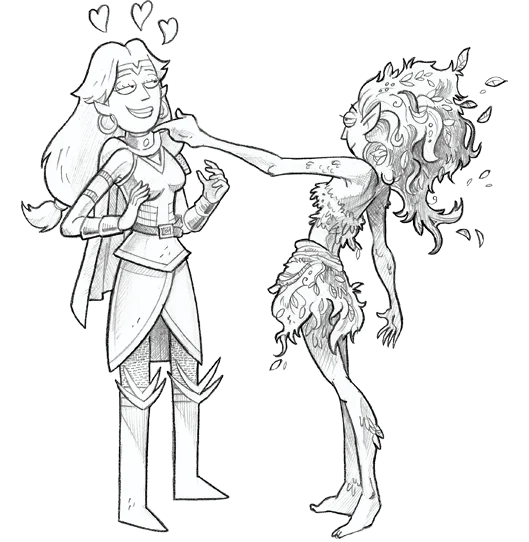

<table class="rd__b-special rd__b-data  rd__b-data--stats">
		<thead>
			<tr>
				<th class="rd__data-embed-header ve-text-left" colspan="6" data-rd-data-embed-header="true">
					

						

							Deafened
							
						

						[–]
					

				</th>
			</tr>
		</thead><tbody class="" data-rd-embedded-data-render-target="true"><tr>
			<td colspan="6" data-rd-tag="condition" data-rd-uid="Deafened|PHB" data-rd-page="conditionsdiseases.html" data-rd-source="PHB" data-rd-hash="deafened_phb" data-rd-name="Deafened" data-rd-display-name="Deafened" data-rd-style="" data-rd-entry-data="{}">
				<i>Loading <a href="conditionsdiseases.html#deafened_phb"  onmouseover="Renderer.hover.pHandleLinkMouseOver(event, this)" onmouseleave="Renderer.hover.handleLinkMouseLeave(event, this)" onmousemove="Renderer.hover.handleLinkMouseMove(event, this)" onclick="Renderer.hover.handleLinkClick(event, this)" onwheel="Renderer.hover.handleLinkWheel(event, this)" ondragstart="Renderer.hover.handleLinkDragStart(event, this)" data-vet-page="conditionsdiseases.html" data-vet-source="PHB" data-vet-hash="deafened_phb" ontouchstart="Renderer.hover.handleTouchStart(event, this)" >Deafened</a>...</i>
				
			</td>
		</tr></tbody></table><table class="rd__b-special rd__b-data  rd__b-data--stats">
		<thead>
			<tr>
				<th class="rd__data-embed-header ve-text-left" colspan="6" data-rd-data-embed-header="true">
					

						

							Exhaustion
							
						

						[–]
					

				</th>
			</tr>
		</thead><tbody class="" data-rd-embedded-data-render-target="true"><tr>
			<td colspan="6" data-rd-tag="condition" data-rd-uid="Exhaustion|PHB" data-rd-page="conditionsdiseases.html" data-rd-source="PHB" data-rd-hash="exhaustion_phb" data-rd-name="Exhaustion" data-rd-display-name="Exhaustion" data-rd-style="" data-rd-entry-data="{}">
				<i>Loading <a href="conditionsdiseases.html#exhaustion_phb"  onmouseover="Renderer.hover.pHandleLinkMouseOver(event, this)" onmouseleave="Renderer.hover.handleLinkMouseLeave(event, this)" onmousemove="Renderer.hover.handleLinkMouseMove(event, this)" onclick="Renderer.hover.handleLinkClick(event, this)" onwheel="Renderer.hover.handleLinkWheel(event, this)" ondragstart="Renderer.hover.handleLinkDragStart(event, this)" data-vet-page="conditionsdiseases.html" data-vet-source="PHB" data-vet-hash="exhaustion_phb" ontouchstart="Renderer.hover.handleTouchStart(event, this)" >Exhaustion</a>...</i>
				
			</td>
		</tr></tbody></table><table class="rd__b-special rd__b-data  rd__b-data--stats">
		<thead>
			<tr>
				<th class="rd__data-embed-header ve-text-left" colspan="6" data-rd-data-embed-header="true">
					

						

							Frightened
							
						

						[–]
					

				</th>
			</tr>
		</thead><tbody class="" data-rd-embedded-data-render-target="true"><tr>
			<td colspan="6" data-rd-tag="condition" data-rd-uid="Frightened|PHB" data-rd-page="conditionsdiseases.html" data-rd-source="PHB" data-rd-hash="frightened_phb" data-rd-name="Frightened" data-rd-display-name="Frightened" data-rd-style="" data-rd-entry-data="{}">
				<i>Loading <a href="conditionsdiseases.html#frightened_phb"  onmouseover="Renderer.hover.pHandleLinkMouseOver(event, this)" onmouseleave="Renderer.hover.handleLinkMouseLeave(event, this)" onmousemove="Renderer.hover.handleLinkMouseMove(event, this)" onclick="Renderer.hover.handleLinkClick(event, this)" onwheel="Renderer.hover.handleLinkWheel(event, this)" ondragstart="Renderer.hover.handleLinkDragStart(event, this)" data-vet-page="conditionsdiseases.html" data-vet-source="PHB" data-vet-hash="frightened_phb" ontouchstart="Renderer.hover.handleTouchStart(event, this)" >Frightened</a>...</i>
				
			</td>
		</tr></tbody></table><table class="rd__b-special rd__b-data  rd__b-data--stats">
		<thead>
			<tr>
				<th class="rd__data-embed-header ve-text-left" colspan="6" data-rd-data-embed-header="true">
					

						

							Grappled
							
						

						[–]
					

				</th>
			</tr>
		</thead><tbody class="" data-rd-embedded-data-render-target="true"><tr>
			<td colspan="6" data-rd-tag="condition" data-rd-uid="Grappled|PHB" data-rd-page="conditionsdiseases.html" data-rd-source="PHB" data-rd-hash="grappled_phb" data-rd-name="Grappled" data-rd-display-name="Grappled" data-rd-style="" data-rd-entry-data="{}">
				<i>Loading <a href="conditionsdiseases.html#grappled_phb"  onmouseover="Renderer.hover.pHandleLinkMouseOver(event, this)" onmouseleave="Renderer.hover.handleLinkMouseLeave(event, this)" onmousemove="Renderer.hover.handleLinkMouseMove(event, this)" onclick="Renderer.hover.handleLinkClick(event, this)" onwheel="Renderer.hover.handleLinkWheel(event, this)" ondragstart="Renderer.hover.handleLinkDragStart(event, this)" data-vet-page="conditionsdiseases.html" data-vet-source="PHB" data-vet-hash="grappled_phb" ontouchstart="Renderer.hover.handleTouchStart(event, this)" >Grappled</a>...</i>
				
			</td>
		</tr></tbody></table>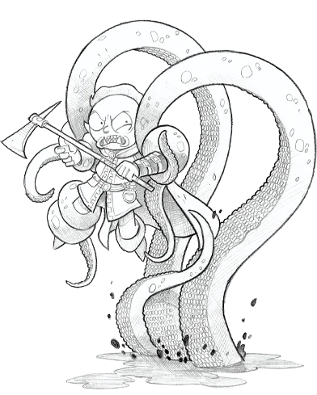

<table class="rd__b-special rd__b-data  rd__b-data--stats">
		<thead>
			<tr>
				<th class="rd__data-embed-header ve-text-left" colspan="6" data-rd-data-embed-header="true">
					

						

							Incapacitated
							
						

						[–]
					

				</th>
			</tr>
		</thead><tbody class="" data-rd-embedded-data-render-target="true"><tr>
			<td colspan="6" data-rd-tag="condition" data-rd-uid="Incapacitated|PHB" data-rd-page="conditionsdiseases.html" data-rd-source="PHB" data-rd-hash="incapacitated_phb" data-rd-name="Incapacitated" data-rd-display-name="Incapacitated" data-rd-style="" data-rd-entry-data="{}">
				<i>Loading <a href="conditionsdiseases.html#incapacitated_phb"  onmouseover="Renderer.hover.pHandleLinkMouseOver(event, this)" onmouseleave="Renderer.hover.handleLinkMouseLeave(event, this)" onmousemove="Renderer.hover.handleLinkMouseMove(event, this)" onclick="Renderer.hover.handleLinkClick(event, this)" onwheel="Renderer.hover.handleLinkWheel(event, this)" ondragstart="Renderer.hover.handleLinkDragStart(event, this)" data-vet-page="conditionsdiseases.html" data-vet-source="PHB" data-vet-hash="incapacitated_phb" ontouchstart="Renderer.hover.handleTouchStart(event, this)" >Incapacitated</a>...</i>
				
			</td>
		</tr></tbody></table><table class="rd__b-special rd__b-data  rd__b-data--stats">
		<thead>
			<tr>
				<th class="rd__data-embed-header ve-text-left" colspan="6" data-rd-data-embed-header="true">
					

						

							Invisible
							
						

						[–]
					

				</th>
			</tr>
		</thead><tbody class="" data-rd-embedded-data-render-target="true"><tr>
			<td colspan="6" data-rd-tag="condition" data-rd-uid="Invisible|PHB" data-rd-page="conditionsdiseases.html" data-rd-source="PHB" data-rd-hash="invisible_phb" data-rd-name="Invisible" data-rd-display-name="Invisible" data-rd-style="" data-rd-entry-data="{}">
				<i>Loading <a href="conditionsdiseases.html#invisible_phb"  onmouseover="Renderer.hover.pHandleLinkMouseOver(event, this)" onmouseleave="Renderer.hover.handleLinkMouseLeave(event, this)" onmousemove="Renderer.hover.handleLinkMouseMove(event, this)" onclick="Renderer.hover.handleLinkClick(event, this)" onwheel="Renderer.hover.handleLinkWheel(event, this)" ondragstart="Renderer.hover.handleLinkDragStart(event, this)" data-vet-page="conditionsdiseases.html" data-vet-source="PHB" data-vet-hash="invisible_phb" ontouchstart="Renderer.hover.handleTouchStart(event, this)" >Invisible</a>...</i>
				
			</td>
		</tr></tbody></table><table class="rd__b-special rd__b-data  rd__b-data--stats">
		<thead>
			<tr>
				<th class="rd__data-embed-header ve-text-left" colspan="6" data-rd-data-embed-header="true">
					

						

							Paralyzed
							
						

						[–]
					

				</th>
			</tr>
		</thead><tbody class="" data-rd-embedded-data-render-target="true"><tr>
			<td colspan="6" data-rd-tag="condition" data-rd-uid="Paralyzed|PHB" data-rd-page="conditionsdiseases.html" data-rd-source="PHB" data-rd-hash="paralyzed_phb" data-rd-name="Paralyzed" data-rd-display-name="Paralyzed" data-rd-style="" data-rd-entry-data="{}">
				<i>Loading <a href="conditionsdiseases.html#paralyzed_phb"  onmouseover="Renderer.hover.pHandleLinkMouseOver(event, this)" onmouseleave="Renderer.hover.handleLinkMouseLeave(event, this)" onmousemove="Renderer.hover.handleLinkMouseMove(event, this)" onclick="Renderer.hover.handleLinkClick(event, this)" onwheel="Renderer.hover.handleLinkWheel(event, this)" ondragstart="Renderer.hover.handleLinkDragStart(event, this)" data-vet-page="conditionsdiseases.html" data-vet-source="PHB" data-vet-hash="paralyzed_phb" ontouchstart="Renderer.hover.handleTouchStart(event, this)" >Paralyzed</a>...</i>
				
			</td>
		</tr></tbody></table>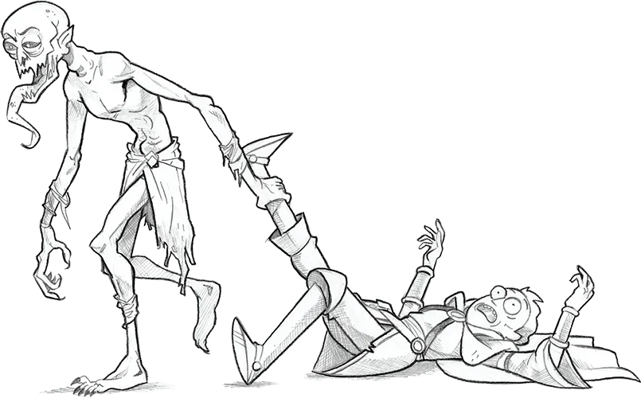

<table class="rd__b-special rd__b-data  rd__b-data--stats">
		<thead>
			<tr>
				<th class="rd__data-embed-header ve-text-left" colspan="6" data-rd-data-embed-header="true">
					

						

							Petrified
							
						

						[–]
					

				</th>
			</tr>
		</thead><tbody class="" data-rd-embedded-data-render-target="true"><tr>
			<td colspan="6" data-rd-tag="condition" data-rd-uid="Petrified|PHB" data-rd-page="conditionsdiseases.html" data-rd-source="PHB" data-rd-hash="petrified_phb" data-rd-name="Petrified" data-rd-display-name="Petrified" data-rd-style="" data-rd-entry-data="{}">
				<i>Loading <a href="conditionsdiseases.html#petrified_phb"  onmouseover="Renderer.hover.pHandleLinkMouseOver(event, this)" onmouseleave="Renderer.hover.handleLinkMouseLeave(event, this)" onmousemove="Renderer.hover.handleLinkMouseMove(event, this)" onclick="Renderer.hover.handleLinkClick(event, this)" onwheel="Renderer.hover.handleLinkWheel(event, this)" ondragstart="Renderer.hover.handleLinkDragStart(event, this)" data-vet-page="conditionsdiseases.html" data-vet-source="PHB" data-vet-hash="petrified_phb" ontouchstart="Renderer.hover.handleTouchStart(event, this)" >Petrified</a>...</i>
				
			</td>
		</tr></tbody></table>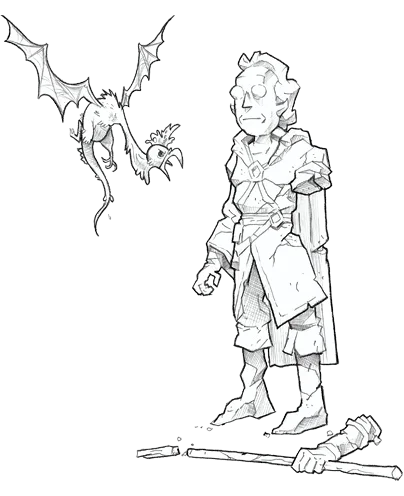

<table class="rd__b-special rd__b-data  rd__b-data--stats">
		<thead>
			<tr>
				<th class="rd__data-embed-header ve-text-left" colspan="6" data-rd-data-embed-header="true">
					

						

							Poisoned
							
						

						[–]
					

				</th>
			</tr>
		</thead><tbody class="" data-rd-embedded-data-render-target="true"><tr>
			<td colspan="6" data-rd-tag="condition" data-rd-uid="Poisoned|PHB" data-rd-page="conditionsdiseases.html" data-rd-source="PHB" data-rd-hash="poisoned_phb" data-rd-name="Poisoned" data-rd-display-name="Poisoned" data-rd-style="" data-rd-entry-data="{}">
				<i>Loading <a href="conditionsdiseases.html#poisoned_phb"  onmouseover="Renderer.hover.pHandleLinkMouseOver(event, this)" onmouseleave="Renderer.hover.handleLinkMouseLeave(event, this)" onmousemove="Renderer.hover.handleLinkMouseMove(event, this)" onclick="Renderer.hover.handleLinkClick(event, this)" onwheel="Renderer.hover.handleLinkWheel(event, this)" ondragstart="Renderer.hover.handleLinkDragStart(event, this)" data-vet-page="conditionsdiseases.html" data-vet-source="PHB" data-vet-hash="poisoned_phb" ontouchstart="Renderer.hover.handleTouchStart(event, this)" >Poisoned</a>...</i>
				
			</td>
		</tr></tbody></table><table class="rd__b-special rd__b-data  rd__b-data--stats">
		<thead>
			<tr>
				<th class="rd__data-embed-header ve-text-left" colspan="6" data-rd-data-embed-header="true">
					

						

							Prone
							
						

						[–]
					

				</th>
			</tr>
		</thead><tbody class="" data-rd-embedded-data-render-target="true"><tr>
			<td colspan="6" data-rd-tag="condition" data-rd-uid="Prone|PHB" data-rd-page="conditionsdiseases.html" data-rd-source="PHB" data-rd-hash="prone_phb" data-rd-name="Prone" data-rd-display-name="Prone" data-rd-style="" data-rd-entry-data="{}">
				<i>Loading <a href="conditionsdiseases.html#prone_phb"  onmouseover="Renderer.hover.pHandleLinkMouseOver(event, this)" onmouseleave="Renderer.hover.handleLinkMouseLeave(event, this)" onmousemove="Renderer.hover.handleLinkMouseMove(event, this)" onclick="Renderer.hover.handleLinkClick(event, this)" onwheel="Renderer.hover.handleLinkWheel(event, this)" ondragstart="Renderer.hover.handleLinkDragStart(event, this)" data-vet-page="conditionsdiseases.html" data-vet-source="PHB" data-vet-hash="prone_phb" ontouchstart="Renderer.hover.handleTouchStart(event, this)" >Prone</a>...</i>
				
			</td>
		</tr></tbody></table>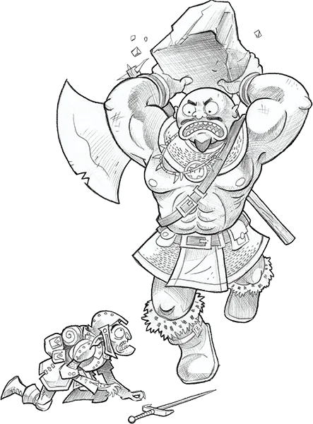

<table class="rd__b-special rd__b-data  rd__b-data--stats">
		<thead>
			<tr>
				<th class="rd__data-embed-header ve-text-left" colspan="6" data-rd-data-embed-header="true">
					

						

							Restrained
							
						

						[–]
					

				</th>
			</tr>
		</thead><tbody class="" data-rd-embedded-data-render-target="true"><tr>
			<td colspan="6" data-rd-tag="condition" data-rd-uid="Restrained|PHB" data-rd-page="conditionsdiseases.html" data-rd-source="PHB" data-rd-hash="restrained_phb" data-rd-name="Restrained" data-rd-display-name="Restrained" data-rd-style="" data-rd-entry-data="{}">
				<i>Loading <a href="conditionsdiseases.html#restrained_phb"  onmouseover="Renderer.hover.pHandleLinkMouseOver(event, this)" onmouseleave="Renderer.hover.handleLinkMouseLeave(event, this)" onmousemove="Renderer.hover.handleLinkMouseMove(event, this)" onclick="Renderer.hover.handleLinkClick(event, this)" onwheel="Renderer.hover.handleLinkWheel(event, this)" ondragstart="Renderer.hover.handleLinkDragStart(event, this)" data-vet-page="conditionsdiseases.html" data-vet-source="PHB" data-vet-hash="restrained_phb" ontouchstart="Renderer.hover.handleTouchStart(event, this)" >Restrained</a>...</i>
				
			</td>
		</tr></tbody></table><table class="rd__b-special rd__b-data  rd__b-data--stats">
		<thead>
			<tr>
				<th class="rd__data-embed-header ve-text-left" colspan="6" data-rd-data-embed-header="true">
					

						

							Stunned
							
						

						[–]
					

				</th>
			</tr>
		</thead><tbody class="" data-rd-embedded-data-render-target="true"><tr>
			<td colspan="6" data-rd-tag="condition" data-rd-uid="Stunned|PHB" data-rd-page="conditionsdiseases.html" data-rd-source="PHB" data-rd-hash="stunned_phb" data-rd-name="Stunned" data-rd-display-name="Stunned" data-rd-style="" data-rd-entry-data="{}">
				<i>Loading <a href="conditionsdiseases.html#stunned_phb"  onmouseover="Renderer.hover.pHandleLinkMouseOver(event, this)" onmouseleave="Renderer.hover.handleLinkMouseLeave(event, this)" onmousemove="Renderer.hover.handleLinkMouseMove(event, this)" onclick="Renderer.hover.handleLinkClick(event, this)" onwheel="Renderer.hover.handleLinkWheel(event, this)" ondragstart="Renderer.hover.handleLinkDragStart(event, this)" data-vet-page="conditionsdiseases.html" data-vet-source="PHB" data-vet-hash="stunned_phb" ontouchstart="Renderer.hover.handleTouchStart(event, this)" >Stunned</a>...</i>
				
			</td>
		</tr></tbody></table>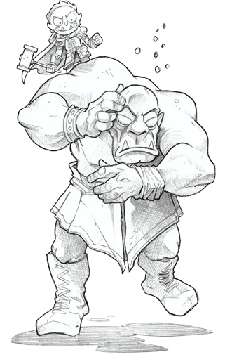

<table class="rd__b-special rd__b-data  rd__b-data--stats">
		<thead>
			<tr>
				<th class="rd__data-embed-header ve-text-left" colspan="6" data-rd-data-embed-header="true">
					

						

							Unconscious
							
						

						[–]
					

				</th>
			</tr>
		</thead><tbody class="" data-rd-embedded-data-render-target="true"><tr>
			<td colspan="6" data-rd-tag="condition" data-rd-uid="Unconscious|PHB" data-rd-page="conditionsdiseases.html" data-rd-source="PHB" data-rd-hash="unconscious_phb" data-rd-name="Unconscious" data-rd-display-name="Unconscious" data-rd-style="" data-rd-entry-data="{}">
				<i>Loading <a href="conditionsdiseases.html#unconscious_phb"  onmouseover="Renderer.hover.pHandleLinkMouseOver(event, this)" onmouseleave="Renderer.hover.handleLinkMouseLeave(event, this)" onmousemove="Renderer.hover.handleLinkMouseMove(event, this)" onclick="Renderer.hover.handleLinkClick(event, this)" onwheel="Renderer.hover.handleLinkWheel(event, this)" ondragstart="Renderer.hover.handleLinkDragStart(event, this)" data-vet-page="conditionsdiseases.html" data-vet-source="PHB" data-vet-hash="unconscious_phb" ontouchstart="Renderer.hover.handleTouchStart(event, this)" >Unconscious</a>...</i>
				
			</td>
		</tr></tbody></table>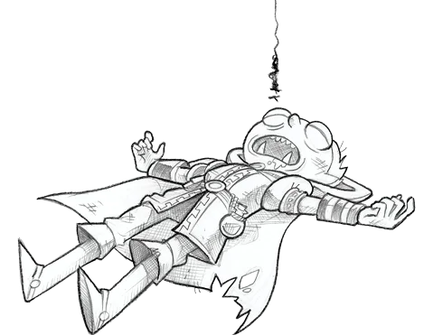

------

# APPENDIX B: WHAT IS THE F***ING POINT?!

Okay, Morty. Maybe it's just the vodka and the tranquilizers talking, b-b-but I think we've reached a critical moment in your D&D education. Y-y-you've internalized a lot of the key features, and you're tingling with anticipation of the adventures to come.

That's good, that's real good. Now your grandpa Rick's gonna blow your tiny mind and teach you the deepest and darkest part of D&D...

NONE OF THIS MATTERS.

What?!

YEAH.

the rules don't MEAN S***.

I know what you're thinking. You're thinking,

"Why the hell did I just go through over sixty pages of dice and rolling and systems and spells and whatever else if none of it matters?! Why do millions of people play this weird nerdy game and invest themselves in it if none of it matters?!"

Y-y-your brain is focused on the game as it is, instead of the game as it could be, Morty. I-I-I told you at the start that D&D is a portal gun, and I meant that, even while I was taking potshots at Wizards of the Coast and their corporate overlord bean counters.

People don't live heroic lives, Morty. They trudge through their feeble existence wishing they had some kind of b-b-b-*BURP*-bigger role in the universe.

That's what D&D really is, Morty.

It's a weird little place where everyone gets to gut goblins and blast bugbears and be kinda sorta awesome for a little while. Sometimes it's weird and annoying but when it works, Morty, when it really works, and your players are putty in the palm of your hand—their hopes and dreams hanging on your every word and a roll of the dice....

That's why we do this, get it?

You know I-I-I'm not a fan of bureaucracy o-o-or systems. I don't do absolutes. Neither should you.

I can teach you D&D Rickth Edition and make it obvious what you should be doing, but in the end you're gonna do it your own way. You're gonna screw it all up and make a mess, and then start over and then screw it up in new and different ways.

Good.

Roll the dice. Get stupid.

entertain yourself. entertain your friends too.

***THE REST DOESN'T MATTER.***

The rest is just corporate branding and nostalgia, sucking face with nihilistic attention-seeking edgelords in search of the mighty dollar.

Yeah, I said it.

Truth bomb barr*uuuuurrrrp*age!

Ready to see how a master crafts a memorable dungeoneering experience, Morty? Keep a hold of your butt cheeks and take a peek at the adventure book:

The Lost Dungeon of Rickedness: Big Rick Energy

------

# Credits

- **Lead Designer.** Kate Welch
- **Adventure Designers and Rulebook Commenters.** Ryan Hartman, Adam Lee, Ari Levitch, Jim Zub
- **Adventure Developer.** Ben Petrisor
- **Playtest Coordinator.** Bill Benham
- **Editors.** F. Wesley Schneider, Jeremy Crawford, Dan Dillon, Scott Fitzgerald Gray, Christopher Perkins
- **Art Directors.** Kate Irwin, Shauna Narciso, Richard Whitters
- **Graphic Designer.** Emi Tanji
- **Cover Illustrator.** Troy Little
- **Illustrators.** Eric Belisle, Conceptopolis, Wayne England, Randy Gallegos, Troy Little, Brynn Metheney, Ryan Pancoast, Steve Prescott, Richard Sardinha, Ilya Shkipin, Matt Stawicki, Autumn Rain Turkel, Kieran Yanner
- **Cartographers.** Kate Welch, Richard Whitters
- **Original Rulebook Designer.** Jeremy Crawford
- **Original 5th Edition Designers.** Jeremy Crawford, Mike Mearls, Christopher Perkins, James Wyatt, Rodney Thompson, Robert J. Schwalb, Peter Lee, Steve Townshend, Bruce R. Cordell
- **Original 5th Edition Editors.** Chris Sims, Michele Carter, Scott Fitzgerald Gray, Kim Mohan
- **Based on the Original D&D Game By.** E. Gary Gygax and Dave Arneson
- **Producer.** Dan Tovar
- **Project Manager.** Bill Benham
- **Brand Manager.** Shelly Mazzanoble
- **Production Services.** Cynda Callaway, Kevin Yee, David Gershman, Jefferson Dunlap
- **VP, Franchise & Global Brand Strategy.** Nathan Stewart
- **Director Licensing & Publishing.** Liz Schuh
- **Franchise Creative Director.** Mike Mearls
- **Licensing Manager.** Hilary Ross
- **Marketing and Communications.** Bart Carroll, Pelham Greene, Greg Tito, Anna Vo
- **Product Specialist.** Christopher Lindsay
- **Game Designer.** Dan Dillon
- **Senior Graphic Designer.** Trish Yochum
- **Associate Producer.** Lea Heleotis

*Disclaimer: We at Wizards of the Coast here on Earth C-132 do not agree with our mirror selves on Earth C-141. Rick Sanchez was not nor ever will be considered the "greatest f***ing Dungeons & Dragons game designer of all time," even if he does have that very quote tattooed across his entire back. Which is evidently how you qualify for jobs in C-141.*
