# Introduction: A World of Adventure

An undead abomination stalks the snow in Icewind Dale. A scheming genie plots to conquer Calimshan. An insidious curse transforms people in the Moonshae Isles into rust-covered constructs. Corrupt politicians party with devils in Baldur's Gate. An ancient god of rot grows in the heart of a Dalelands forest. These are just some of the stories awaiting you in *Forgotten Realms: Adventures in Faerûn*.

The world of Faerûn is a setting for every kind of fantasy adventure, from survival horror to high magic. But adventures in the Realms have one thing in common: their epic nature. Heroes adventuring in Faerûn seldom face mundane enemies with petty agendas. Instead, even the most ordinary antagonist is part of a grand plot—a larger-than-life adventure that pits the heroes against unforgettable foes.

*Forgotten Realms: Adventures in Faerûn* provides you with dozens of epic adventures that take place all over the Realms, including everything from piracy in the Trackless Sea to stalking a dragon in the Rashemi wilderness. This book includes adventures spotlighting Faerûn's famous factions—such as the Cult of the Dragon and the Emerald Enclave—as well as well-known gods, including Mystra, Selûne, and Shar. And, so that you can get started playing in Faerûn immediately, this book includes a complete starting adventure that will bring your party from level 1 to level 3.

*Forgotten Realms: Adventures in Faerûn* also gives you the tools you need to make your own adventures in the Realms, including new and returning monsters—such as drow followers of Lolth, phaerimm, and spirit dragons—and new magic items, including Artifacts such as the *Calimemnon Crystal* and *Crown of Horns*.

Welcome to the Forgotten Realms, a world of epic characters and epic adventures!

> ##### More Forgotten Realms
>
>There's so much more to Faerûn than can be covered in one book. You can explore the Realms in novels, movies, video games, and more, including the following:
>
>- The [https://store.steampowered.com/app/1086940/Baldurs_Gate_3](Baldur's Gate 3) video game
>- The movie [https://www.imdb.com/title/tt2906216](Dungeons & Dragons: Honor Among Thieves)
>- The [https://en.wikipedia.org/wiki/The_Legend_of_Drizzt](Legend of Drizzt) novels by R.A. Salvatore

## Using This Book

The bulk of this book is made up of five chapters that focus on particular parts of the Forgotten Realms, each highlighting a specific subgenre of fantasy adventure. Other chapters include more general advice on running games, as well as adventures set all over Faerûn. You can introduce your players to the Realms through the complete adventure in *chapter 7*, and additional chapters on monsters and magic items give you tools to create your own adventures anywhere in the Forgotten Realms.

Throughout this book, if a creature's name appears in **bold** type, you'll find that creature's stat block in the *Monster Manual* unless otherwise specified.

- **Chapter 1: Running the Realms**. The first chapter begins with advice on making your Forgotten Realms games—and players!—feel epic. It continues with adventures showcasing the diverse regions, meddlesome deities, influential factions, and fantastic magic of Faerûn.
- **Chapter 2: The Dalelands**. A dozen frontier settlements surrounding an ancient elven megadungeon make for heroic adventure in the classic D&D tradition.
- **Chapter 3: Icewind Dale**. A supernatural horror haunts a desolate land. Icewind Dale is the perfect setting for stories of survival horror.
- **Chapter 4: Calimshan**. The high magic setting of Calimshan contrasts the elemental power of desert genies with the sophisticated wonders of Calimport, a city thousands of years old.
- **Chapter 5: The Moonshae Isles**. The Moonshaes are a setting for fairy tales and adventure at sea, but the Moonshaes' way of life is threatened by a corrupting magical curse.
- **Chapter 6: Baldur's Gate**. Baldur's Gate is a setting for gritty urban fantasy in a city where everyone—and everything—has a price.
- **Chapter 7: The Lost Library of Lethchauntos**. An adventure for level 1 characters introduces your players to the themes and conflicts of the Forgotten Realms.
- **Chapter 8: Magic Items**. Faerûn's treasures run the gamut from humble *Harper Pins* to fearsome Artifacts like the *Crown of Horns*.
- **Chapter 9: Bestiary**. The final chapter presents dozens of new monsters as well as named antagonists you can use as villains in your campaigns.

## Other Resources

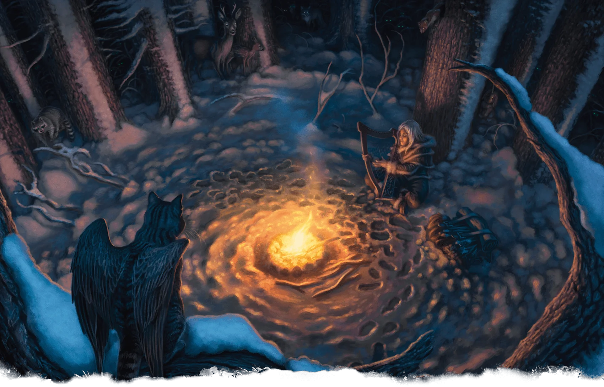

No single book could hope to include every detail of the Forgotten Realms, a setting many decades in the making. *Forgotten Realms: Adventures in Faerûn* is only part of Faerûn's grand story.

Your most important companion to this book is *Forgotten Realms: Heroes of Faerûn*. There, you'll find a gazetteer describing all of Faerûn, as well as details on Faerûn's many deities, most important factions, and incredible magic. That book is also filled with character creation advice and rule options, including new subclasses, feats, and spells.

Three digital projects have been designed to supplement this book and your games in the Realms. You can find these titles on DnDBeyond.com:

- **Astarion's Book of Hungers** focuses on Astarion, the beloved elf vampire spawn from *Baldur's Gate 3*.
- **Lorwyn: First Light** brings the world of Lorwyn from Magic: The Gathering to D&D. The fey of Lorwyn work particularly well in campaigns set in the Moonshae Isles.
- **Netheril's Fall** provides insight into ancient Netheril and its magic, as well as Netherese monsters, magic items, and adventures.

Many books in the Dungeons & Dragons line detail locations in the Forgotten Realms or provide adventures there, including the following:

- *Baldur's Gate: Descent into Avernus* provides additional detail on the city of Baldur's Gate.
- *Candlekeep Mysteries* describes the greatest library in Faerûn, located on the Sword Coast, and includes a collection of adventures prompted by books in the library's collection.
- *Icewind Dale: Rime of the Frostmaiden* has additional details on Ten-Towns and also includes an adventure focusing on Auril's endless winter.
- *Out of the Abyss* details much of the Underdark in the northwestern part of Faerûn.
- *Phandelver and Below: The Shattered Obelisk* describes the Phandelver region near Neverwinter, launching point for an adventure of mind-bending horror and eldritch abominations.
- *Storm King's Thunder* is an epic adventure that pits characters against giants and visits many locations mentioned in this book, including the Moonshae Isles and Icewind Dale.
- *Tomb of Annihilation* describes the jungles of Chult, where the lich Acererak has built a deadly dungeon to protect an Artifact causing a killing curse.
- *Waterdeep: Dragon Heist* details the city of Waterdeep on the Sword Coast.

------

# Chapter 1: Running the Realms

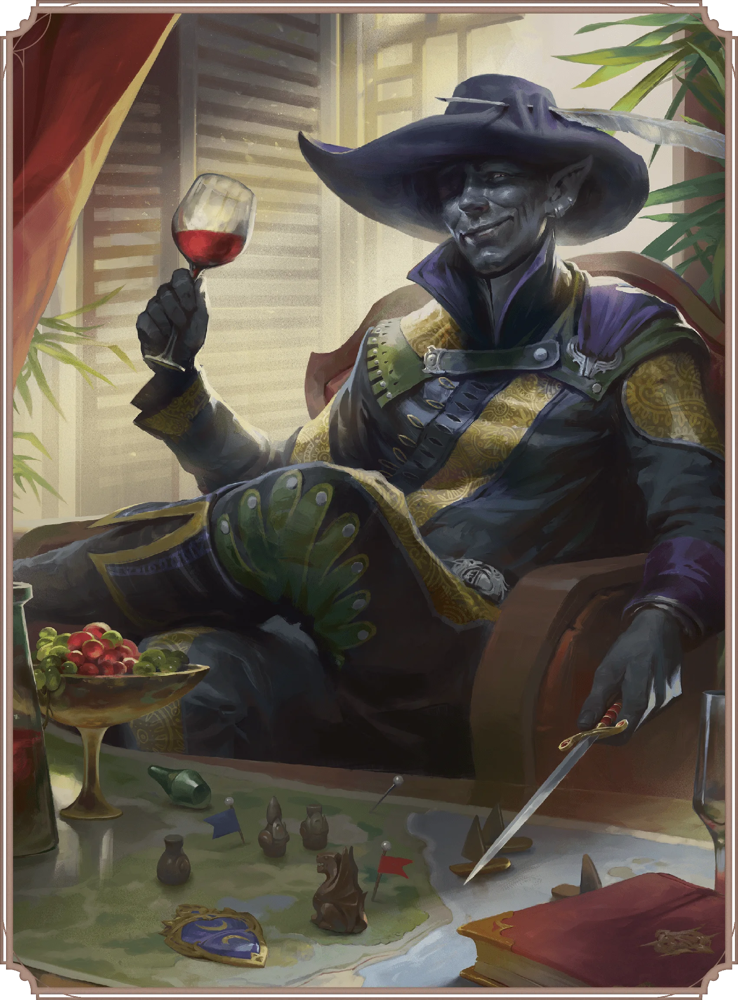

Dungeon Master running a campaign set in the Forgotten Realms faces special challenges. This chapter helps you tackle those challenges and create adventures that are fun and personally rewarding for you and your players. The chapter includes the following:

  - **Creating Epic Fantasy.** Here you'll find guidance on creating and running adventures that capture the larger-than-life characters, stakes, and villains found in Faerûn.
  - **Epic Destinies.** Characters in the Realms are seldom ordinary adventurers. This section provides advice on how to make characters feel as grand as the setting.
  - **Realms Lore.** Decades of creators, players, and fans have made Faerûn one of the most detailed fantasy settings in history. Here's some advice on handling that in your game.
  - **Adventures.** This chapter includes adventures inspired by Faerûn's deities, factions, magic, and geographical regions.

## Creating Epic Fantasy

Faerûn is enormous, and the Forgotten Realms embrace a wide array of fantasy adventures. In the bustling metropolis of Calimport, characters might bargain for a wish with a powerful genie, but in the far north of Icewind Dale, adventurers from isolated fishing villages struggle to survive the bitter cold. Mariners on the Trackless Sea hunt whales and explore the floating islands of the archfey, while in the Sunrise Mountains far to the east, spellcasters from Thay and Rashemen rediscover ancient magical secrets.

The tone of such wildly various adventures can be described by one word: epic.

### Character Creation

Characters in the Forgotten Realms are larger than life. A character is never just a simple adventurer; they might be the heir to a kingdom, have an Artifact for a heart, or secretly be a vampire. They might be Chosen by a deity, be tutored by the greatest wizard that ever lived, or be descended from an archfey or demigod. They might be the sole survivor of a long-lost culture, an artificial person created by an alliance of powerful wizards, or a revolutionary eager to bring down the corrupt and cruel society from which they've narrowly escaped.

Such characters might not fit in other settings. A royal heir trapped in Ravenloft is just another prisoner, and in the world of Eberron, deities don't interfere in mortal affairs. But in the Forgotten Realms, characters with illustrious histories or campaign-changing secrets are common. Keep an open mind when players suggest such characters for your campaign, and try to accommodate them. For players that create more down-to-earth or grounded characters, brainstorm ways to make their characters stand out from other adventurers. Few players will argue when you give their character an epic destiny.

Epic characters are often more powerful than other adventurers. They might carry unique magic items or an Artifact, wield mundane authority, or even command an army! It's important to spread these benefits around so that every player shares in the epic adventure. Consider each character's unique niche, and protect that niche as the campaign proceeds. For example, if one player wants their character to be heir to the throne of Sembia, the other characters shouldn't also be potential rulers of realms of their own. Instead, encourage them to pursue interests that don't overlap with those of other players.

The "Epic Destinies" section of this chapter offers suggestions for how to reflect a character's gradual growth from an exceptional beginning to a grand conclusion for their story.

### Low-Level Challenges

Epic adventure implies adventuring at high level. But most campaigns start at low level, typically level 1 or level 3. How can you make a campaign feel epic from the start?

#### Start at a Higher Level

Your first option is to start at higher level. The *Player's Handbook* includes guidelines for creating characters of any level. A campaign of this sort can be a challenge for new players, however. Dungeons & Dragons teaches the game to players as they slowly but steadily accumulate new class features. If your group includes players new to the game, you might want to accommodate them by making low-level characters in the usual way, then use the other suggestions below.

If your players are experienced, or your group is supportive and good at guiding new players through the rules, consider creating characters at higher level. Level 5, when characters get additional attacks and spellcasters gain access to level 3 spells like *Fireball*, is a good place to begin your epic journey.

#### Use Flashback Adventures

But even epic heroes have to start somewhere, and early levels move quickly. Characters typically advance to level 2 after only a single session of play and to level 3 after another one or two sessions. You might frame these levels as a single extended flashback—an adventure that drew the characters together many years before your campaign properly begins. In this flashback adventure, the characters haven't yet grown into the powers they'll eventually command, but you can foreshadow events and antagonists that will appear later once the characters come together at higher level for a new adventure.

#### Connect to the Greater Story

To help make a low-level adventure feel epic, give it a clear connection to the campaign's greater story. For example, if your campaign focuses on the corruption of moonwells in the Moonshae Isles by the curse known as the Rusting (see chapter 5 ), make a moonwell prominent in the first adventure. Perhaps the characters meet an elderly druid who becomes their mentor (and who you intend the campaign villain to murder by the time the characters reach level 5). By doing this, even humble adventures feel connected to a greater whole.

#### Preview the Villain

Epic campaigns require epic adversaries, but high CR monsters will demoralize your players if encountered when the characters are low level. Give your powerful adversary weaker lieutenants and minions appropriate to the party's level. For example, *Venger* is an epic foe, but he relies on a **Shadow Demon** (CR 4) to be his eyes and ears, and he makes extensive use of bullywugs and various humanoid minions. Your campaign antagonist can and should appear early in your campaign so the players build a relationship with them, but this meeting should occur in a situation where violence is impossible: Venger might appear to the characters as an illusion, or speak with the characters at a diplomatic event where everyone has sworn oaths of nonviolence and given up their weapons and magic items.

### High Stakes

Epic stories are distinguished by epic stakes. In Faerûn, an evil necromancer doesn't just raise a few corpses—they turn the entire population of Neverwinter into fast and hungry zombies. A Forgotten Realms villain doesn't just invent a new spell—they break the Weave and unleash the Spellplague. When an epic villain goes down, they don't just die—they crash a flying city into Myth Drannor.

Fantasy roleplaying games boast many iconic epic plots. Perhaps your campaign antagonist wants to ascend to godhood; forge or obtain an Artifact; unleash a long-imprisoned Elder Evil; cause or sustain a realm-wide curse; or invade with an army of undead, fiends, or other monsters. The player characters must destroy the Artifact, break the curse, or otherwise prevent the villain from enacting their agenda.

Stakes can be high even when characters are of relatively low level. The heroes of many of these stories aren't especially powerful or experienced. Indeed, the power imbalance between the terrifying villain and the plucky, upstart heroes is part of what makes the adventure so memorable. Remember, characters in Dungeons & Dragons are exceptional. Most villages might have a **Priest**, but they don't have a Cleric. The town might boast a sage who can answer questions or brew alchemical elixirs, but Wizards are rare. And the city guard might be led by a **Warrior Veteran**, but most of the watch are humble **Guards**, not Fighters. The characters in your game are more capable than almost everyone else in the Forgotten Realms.

### Character Death

Epic threats and stakes can result in epic deaths. The *Dungeon Master's Guide* has advice on how to handle character death in your game, but epic adventures pose unique challenges.

Resist the temptation to make every encounter high difficulty. Epic adventures have high stakes, but it's important to vary the difficulty of encounters just as you would in any other adventure, lest the campaign become an unrelenting endurance test. Even in low-difficulty and medium-difficulty encounters, a character can die from a series of bad rolls. But epic heroes deserve meaningful deaths, so consider another fate if a character would die in a minor encounter.

This doesn't mean the threat of death shouldn't be present, only that death in epic stories is rare. It's not unexpected for characters to die in the final battle, especially if that battle is a series of encounters strung out over a single day, like a siege or an infiltration of the villain's lair. But epic stories often also include a character that dies halfway through the story in a heroic last stand that both saddens and inspires the other characters for the rest of the campaign. (Some players will even agree for their characters to serve this role ahead of time!)

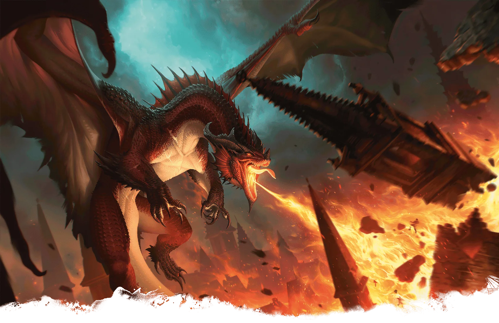

## Epic Destinies

Players can support and strengthen the epic feel of Forgotten Realms adventures by creating characters that are larger than life. As the DM, you can help give those characters a career that's truly momentous by working with each player to sketch out a story arc that plays out as the character advances in level. Perhaps the character is fated to wield an Artifact (such as the *Calimemnon Crystal*, detailed in *chapter 8*) or become the Chosen of a deity. The character might have been subjected to horrific experimentation by mind flayers, giving them psionic powers at great cost. They might be descended from an evil god (such as Bane), inheriting terrible power that they must learn to use without succumbing to cruelty. These character-specific stories, called epic destinies, play out over the course of the campaign as the character goes on adventures.

### How Epic Destinies Work

To create an epic destiny, work with a character's player to create milestones along the character's journey, setting these milestones to specific character levels. As a character advances to each milestone, their destiny manifests and the character's life changes in a dramatic way, represented by feats, supernatural gifts (detailed in *chapter 3* of the *Dungeon Master's Guide*), magic items, or other benefits and rewards the character acquires. You can use the tiers of play, detailed in *chapter 2* of the *Player's Handbook*, as a guide to when these milestones might occur. Two detailed examples of epic destinies are provided below.

An epic destiny is something the DM and player decide together. The character might reject their destiny, but the player knows what's coming and is on board. In fact, you and the player might plan that the character will try to reject their destiny! Nevertheless, an epic destiny is never set in stone, and if a player wants to change their character's destiny during the campaign, work with them to decide what that new destiny might be.

The benefits associated with a character's epic destiny usually fall within the normal rules for character advancement and guidelines for character rewards. In other words, a character with an epic destiny doesn't have more feats than a character without one, and any magic items or supernatural gifts the character acquires should fall generally within the guidelines in the *Dungeon Master's Guide* for characters acquiring such rewards. However, you might decide otherwise. A character with an epic destiny might be more powerful than a traditional character, gaining an additional feat or acquiring a powerful magic item at a lower level than the guidelines suggest. Don't break the rules for just one character, though; every character in the party should receive such benefits at about the same time so no one feels left behind or pushed to the sideline. That said, making epic characters a bit more powerful can make your job as DM easier, since you can pit the party against significant challenges with less risk of character death.

### Example Epic Destinies

The following sections detail two example destinies: one for an heir to a throne, and another for an aspiring wizard.

#### Heir to the Throne

As an example of an epic destiny, consider a character who is the heir to the throne, destined to rule a realm... if they survive long enough!

At the beginning of the character's story, the character is related to the ruler, but no one expects the character to actually inherit. Older siblings are being trained for that role, giving the character opportunity to gallivant around Faerûn on adventure. To reflect the character's past, the player selects the Noble background for their character during character creation.

By level 4, however, something has changed and the character is now expected to inherit the throne. Perhaps their older siblings have been exiled, or perhaps the character's adventures have proven them a more suitable candidate for the throne. The character is subjected to an intense training regimen to make them better qualified for rulership, and the player selects the Skill Expert feat for their character.

Eventually the ruler dies or steps down, and when the character reaches level 11, the character ascends to the throne. When they do, they gain a Legendary magic item that is the symbol of royal power and authority.

But no ruler rules forever. When the character reaches level 17, the character experiences a vision of the future that convinces them someone else must rule the realm. For the good of the land, the character must step down. To represent their visions of the future, the character gains a Charm that allows them to cast the *Foresight* spell once, targeting themself only.

#### Pupil of the Archmage

This example epic destiny is aimed at Wizards tutored by or related to one of Faerûn's great archmages.

When the character begins adventuring, they're the archmage's apprentice. To reflect the specialized education and training the character has had, they choose the Sage background.

When the character reaches level 5, the archmage disappears or is presumed dead. The character must forge their own path and confront their former teacher's rivals and enemies. But they gain the archmage's spellbook, which contains many spells (including some beyond the character's current ability to cast).

But when the character reaches higher level, the archmage returns from death or is rescued. Perhaps they were never missing at all, and their absence was part of an elaborate test for their former student. Regardless, the character's adventures on other planes as part of locating their former master results in the player selecting, at level 12, a feat such as Fey Touched or Shadow Touched for their character.

Finally, when the character reaches level 17, the archmage dies and the character inherits the archmage's mystic tower, adding the Demiplane special facility to the character's *Bastion*.

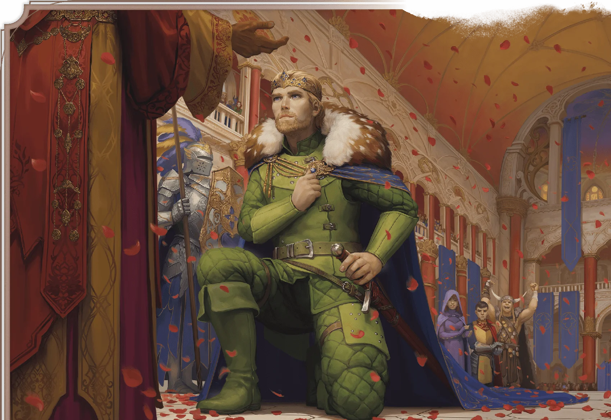

## Realms Lore

The first appearance of the Forgotten Realms in Dungeons & Dragons was in 1982, and in the decades since, thousands of writers, artists, editors, DMs, and players have added to Faerûn's history and cast of characters—a body of knowledge sometimes referred to as "Realms lore." This book and its companion *Forgotten Realms: Heroes of Faerûn* give you all you need to run a campaign in the Realms, but you might want more. This section provides advice on how to use (or not use!) more than forty years' worth of Realms lore and addresses specific challenges Realms lore might pose at the game table.

### Realms Resources

Abundant resources are available describing many aspects of the Forgotten Realms. The introduction lists several adventures and other resources that explore different regions of the Realms. So if your characters visit Waterdeep, you can pick up the *Waterdeep: Dragon Heist* adventure to find a map of the city and details about its neighborhoods. All these products are available on [https://dndbeyond.com](DnDBeyond.com) for quick reference. Even more Forgotten Realms products, from past editions of the game and past eras of the setting's history, can also be found on [https://dmsguild.com](DMsGuild.com), along with a tremendous amount of fan-created content.

Fan-created sites such as the [https://forgottenrealms.fandom.com/wiki/main_page](Forgotten Realms Wiki) collect information, art, and maps covering every corner of the setting. Particularly useful are the lists of books and other references at the end the wiki articles. You can use these references to dive deeper on any topic that interests you.

### Your Forgotten Realms

The most important thing to know about Realms lore is that you don't have to know it. Improvisation is the most powerful tool in the DM's toolbox. When your players visit Waterdeep, you don't need the information in *Waterdeep: Dragon Heist*. You can do what every DM does: make it up! Make Faerûn your own.

This principle extends to more than just improvising during a session. You can ignore or rewrite any of Faerûn's history to suit your game. Perhaps you want the Red Wizards to be evil necromancers, and you want Thay to be a horrifying realm bent on conquest and populated solely by undead. That's not how Thay is described in *Forgotten Realms: Heroes of Faerûn*, but that doesn't stop you from making the game you want to play.

For a more nuanced approach, you can simply deemphasize elements of the setting that don't fit your campaign. With this approach, you highlight the aspects of the setting that are important to your story, and you let the rest of Faerûn's history pass by without comment. As an example, you might feel the Spellplague and Second Sundering—cataclysmic events that reshaped Faerûn—don't suit your campaign. You can decide Faerûn has long since recovered from these events, so they don't need to affect your campaign. You're not rewriting the history of Faerûn—you're picking and choosing the elements that make you excited to be a DM in the Forgotten Realms.

### Experts at the Table

Because the Forgotten Realms has such a long history and so many dedicated fans, it's possible someone at your game table knows more about Faerûn than you do. This can be challenging, but you can overcome those challenges with communication and preparation.

Talk with Realms lore experts at your table, and share your approach. If you intend to improvise your Forgotten Realms or otherwise deviate from existing lore, make that clear to your players so they know what to expect.

You can take advantage of player expertise by turning such players into a resource at the table. To return to an earlier example, if the characters arrive in Waterdeep and you don't have an inn prepared, you can ask one of the experts at your table, "What inn do you stay at, and what's unique about it?"

You can also use your own knowledge of Realms lore to plant clues in the campaign that experts will recognize. When you use characters, locations, magic items, and adversaries from Forgotten Realms history, the Realms lore experts at your table will enjoy recognizing the Easter eggs you've placed. The adventure in *chapter 7* of this book, "*The Lost Library of Lethchauntos*," is a good example of this strategy. Lethchauntos is a very minor character in the history of the Forgotten Realms, but that just makes it all the more memorable when a player recognizes his name. At the same time, don't be afraid to play with expectations and keep the players guessing.

### Cast of Thousands

Faerûn has a reputation for being home to many powerful wizards and other characters. This can be an obstacle at the table if your players encounter a problem and expect an NPC like Laeral Silverhand, the Blackstaff, or Drizzt to swoop in and take care of things. Your characters might even try to locate and recruit such characters, hoping to use them to solve the party's problems.

But it's important to keep the adventurers at the center of the story. The weight of Faerûn rests on their shoulders alone. No one else can solve their problems for them. If your players begin to ask, "Where's the Chosen of Mystra, and why isn't she helping?" here are some possible answers.

Talk to your players about this issue. Stress that the campaign is about their characters, not illustrious NPCs. While characters in Waterdeep could call on the Blackstaff for aid, this sidelines the characters and makes them minor figures in their own story. Encourage players to tackle problems themselves and not give away the dramatic spotlight.

Perhaps the characters have information no one else does, or perhaps they have a connection to the antagonist that makes the conflict personal. If the villain's plan is on a tight schedule, the characters might not have time to recruit help. Powerful archmages and rulers might not have the patience to listen to outlandish claims from a party of unknown adventurers, let alone believe them.

Heroes in the Forgotten Realms often develop rivalries and grudges with villains who return again and again. Characters might discover when they try to recruit Laeral Silverhand to their cause that she's busy dealing with Myrkul—again. And, because this sort of rivalry is well understood by famous NPCs in the setting, Laeral expects the characters to handle their villainous rival on their own, without interference from her or anyone else.

Finally, remember that time marches on. Many of the famous heroes of Faerûn are dead, retired, or missing. New heroes are needed now more than ever.

## Adventures

This chapter includes many adventures set in the Forgotten Realms. These adventures follow the format of the adventure examples in the *Dungeon Master's Guide*. As in the *Dungeon Master's Guide*, these adventures are organized by level, with adventures for level 1 characters first, followed by adventures for characters of higher levels. To help you find the right adventure for your party, the adventures in this chapter are listed in alphabetical order in the *Forgotten Realms Adventures table* with their level and adventure type. The adventure types are as follows:

- Deity adventures, each involving one of the most important and widely worshiped deities of the setting.
- Faction adventures spotlighting a group such as the Harpers, Red Wizards, or the Zhentarim.
- High magic adventures detailing magic so powerful just casting the key spell is an adventure.
- Region adventures set in one of Faerûn's broad cultural regions.

Faerûn's pantheon of gods, cultural regions, unique magic, and major factions are detailed in *Forgotten Realms: Heroes of Faerûn*.

Each adventure includes a starting situation, a hook to get the characters involved, and key encounters (including monsters from the *Monster Manual* or this book). Most of the adventures include a map, but some direct you to maps found in *appendix B* of the *Dungeon Master's Guide*. An adventure might include other elements, such as a random encounter table or a list of rewards.

Some of these adventures can be completed in a single session, but others might require several sessions. Adapt and change the adventures to suit your gaming table and the story you want to tell. When the characters try to do something the adventure doesn't address, improvise!

### Additional Adventures

This book contains even more adventures than those in this chapter.

*Chapter 7* of this book is a complete starting adventure designed for level 1 characters, called "*The Lost Library of Lethchauntos*." By the time your players have finished this adventure, they should be level 3.

Chapters 2–6 of this book detail particular locations in the Forgotten Realms: the Dalelands, Icewind Dale, Calimshan, the Moonshae Isles, and Baldur's Gate. Each of these chapters includes additional adventures for characters of level 3 or higher. These adventures are also listed on the Forgotten Realms Adventure table for ease of reference.

##### Forgotten Realms Adventures
| Adventure Name                 | Level | Type                                       |
|--------------------------------|:-----:|--------------------------------------------|
| The Ashen Faithful             |   10  | Deity (Bane)                               |
| The Blight on Soubar           |   12  | High Magic                                 |
| Blood Night                    |   4   | Location (Baldur's Gate; see *chapter 6*)  |
| Broken Mirrors                 |   7   | Deity (Sune)                               |
| Calim Crossing                 |   3   | Location (Calimshan; see *chapter 4*)      |
| The Calimemnon Conspiracy      |   8   | Location (Calimshan; see *chapter 4*)      |
| Clockwork Memories             |   7   | Location (Baldur's Gate; see *chapter 6*)  |
| The Cost of Warmth             |   3   | Location (Icewind Dale; see *chapter 3*)   |
| The Curse on Humble Hill       |   1   | Deity (Chauntea)                           |
| The Dallabad Curse             |   5   | Location (Calimshan; see *chapter 4*)      |
| Disinterred Danger             |   4   | Faction (Harpers)                          |
| Dougan's Hell                  |   6   | Location (Icewind Dale; see *chapter 3*)   |
| Dragon Orb                     |   9   | Faction (Cult of the Dragon)               |
| Dread March of the Bone Titan  |   13  | Deity (Kelemvor)                           |
| The Drowning Forest            |   4   | Region (Trackless Sea)                     |
| Echoes of the Shaking Plague   |   9   | Region (Heartlands)                        |
| The Eyes of At'ar              |   5   | Region (Anauroch)                          |
| The Flying Fortress            |   11  | Faction (Purple Dragon Knights)            |
| The Foehammer Horn             |   11  | Deity (Tempus)                             |
| Fury Grove                     |   3   | Faction (Emerald Enclave)                  |
| Gods Long Forgotten            |   4   | Location (Calimshan; see *chapter 4*)      |
| Heart of Fire                  |   13  | Deity (Torm)                               |
| Hell Ship                      |   8   | Region (Lands of Intrigue)                 |
| In for a Penny                 |   7   | Region (Forgotten Lands)                   |
| The Lost Dawn                  |   4   | Deity (Lathander)                          |
| Message in a Bottle            |   4   | Location (Moonshae Isles; see *chapter 5*) |
| Moving Mountains               |   8   | High Magic                                 |
| The Mystery of Myth Rodarnum   |   12  | High Magic                                 |
| A Restless Eternity            |   12  | Region (Arcane Empires)                    |
| Restoring Freedale             |   5   | Location (The Dalelands; see *chapter 2*)  |
| Retaking the Terror            |   4   | Location (Icewind Dale; see *chapter 3*)   |
| Robber Baron                   |   1   | Region (Sword Coast)                       |
| The Rushdown Well              |   3   | Location (Moonshae Isles; see *chapter 5*) |
| Safe House Standoff            |   5   | Faction (Zhentarim)                        |
| Shadow of the Watch            |   6   | Deity (Helm)                               |
| The Shadow Parliament          |   9   | Location (Baldur's Gate; see *chapter 6*)  |
| The Siege of Shalespire Priory |   2   | Faction (Order of the Gauntlet)            |
| Silk and Suffering             |   10  | Deity (Lolth)                              |
| The Summerlight Ceremony       |   8   | High Magic                                 |
| Tears Fall                     |   5   | Deity (Selûne)                             |
| The Temple of Transmutation    |   7   | Location (The Dalelands; see *chapter 2*)  |
| The Tenebrous Stone            |   3   | Deity (Ilmater)                            |
| Tide of Teeth                  |   3   | Chapter 6 (Baldur's Gate)                  |
| The Tomb of Damara             |   3   | Location (The Dalelands; see *chapter 2*)  |
| The Treaty of Ostoria          |   8   | Location (Moonshae Isles; see *chapter 5*) |
| The Vault of Velsharoon        |   8   | Faction (Red Wizards)                      |
| The Weeping Goddess            |   2   | Deity (Shar)                               |
| Well of Lies                   |   6   | Deity (Mystra)                             |
| What Wakes Below               |   9   | Location (Icewind Dale; see *chapter 3*)   |
| Wolves of Amphail              |   4   | Faction (Lords' Alliance)                  |
| Wreck of the Silverhand        |   6   | Location (Moonshae Isles; see *chapter 5*) |

### The Curse on Humble Hill

- **A Deity (Chauntea) Adventure for Level 1 Characters**

*Explore an alchemist's lair.*

- **Situation.** The hamlet of Humble Hill is beset by failing crops, sickly livestock, and illness.
- **Hook.** The Church of Chauntea has sent Watchful Sister of the Earth Liana (Medium **Priest Acolyte**), a human member of the Seeds of Cultivation, to assist. She gathers the party and offers them 100 GP each to help her find the root of the sickness.

#### Encounters

The adventure consists of these encounters.

***Investigating Humble Hill.*** The people of Humble Hill are wary of the party. Interacting with locals allows the characters to learn the "curse" coincides with a visit from a traveling halfling alchemist named Algar Gaunt (Small, Neutral Evil **Mage Apprentice**), who sold several farmers a "miraculous growth" fertilizer. The fertilizer has corrupted the water table and poisoned crops.

***Finding Gaunt.*** Sister Liana tends the townsfolk and charges the characters with finding Gaunt. As the characters search the region, roll on the table below, rerolling duplicates. After each encounter, a character can make a DC 15 Intelligence (Investigation) check. On a successful check, they find a clue that leads them to Gaunt's lab, which is accessed by way of a stairway leading down from an apparently abandoned overgrown shed.

| 1d4 | Encounter                                                                                                                                      |
|:---:|------------------------------------------------------------------------------------------------------------------------------------------------|
|  1  | Two **Violet Fungi** and a **Vine Blight** digesting dead sheep                                                                                |
|  2  | A snarling **Death Dog**, once someone's pet, now mutated by Gaunt's serum                                                                     |
|  3  | A Hostile pair of scabby **Toughs** who ate infected food they stole from a local farmer                                                       |
|  4  | A young family trapped in their rickety home by their beloved uncle, who's been transformed by the fertilizer into a **Myconid Spore Servant** |

***Gaunt's Lab.*** Use the map and features below for Gaunt's lab:

  - **Ooze Chamber.** A **Psychic Gray Ooze** lurks in puddles of dirty water. When characters approach, it initiates combat.
  - **Laboratory.** Gaunt's lab notes and equipment can be used to create an antidote to the fertilizer.
  - **Study.** Gaunt studies his field notes here. If discovered, he tries to flee through the trapped hallway and up the ladder in his bedroom, which leads back to the surface.
  - **Trap.** Medium or larger creatures stepping on the pressure plate activate ceiling nozzles that spray acid. Creatures in the hall make a DC 13 Dexterity saving throw, taking 2d6 Acid damage on a failed save or half as much damage on a successful one.
- 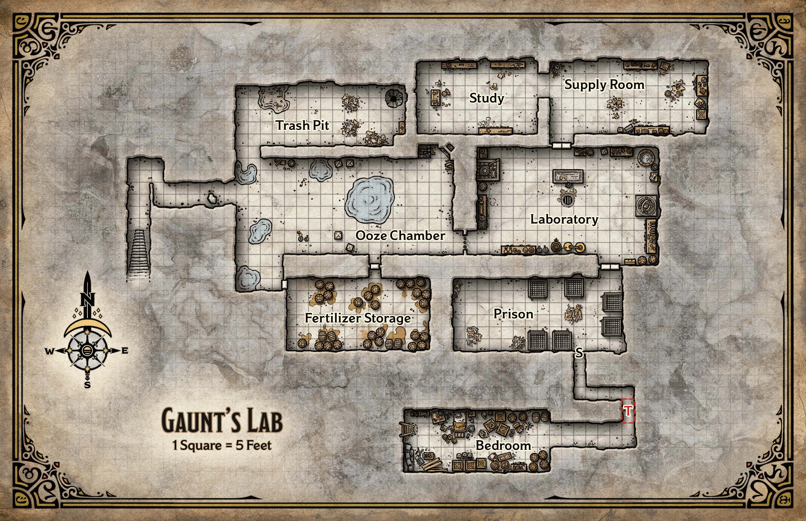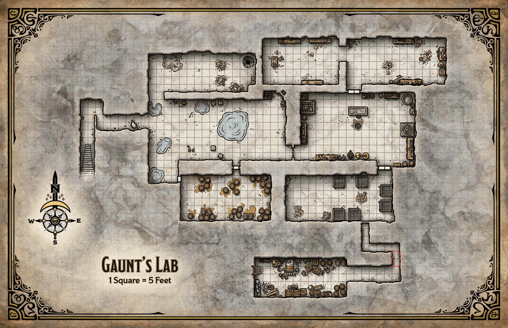

### Robber Baron

- **A Region (Sword Coast) Adventure for Level 1 Characters**

*Rescue a man from desperate bandits.*

- **Situation.** Bandits have settled into ruined towers flanking a road within a day's travel of Baldur's Gate. Now they stop travelers and demand a toll. They've even taken prisoners, demanding ransoms for the prisoners' release.
- **Hook.** A middle-aged human trader named Rolf Twyrtho (Medium **Commoner**) has received a ransom note for his brother Adon, held by the bandits. Rolf offers each character 50 GP to bring Adon home and teach the bandits a lesson.

#### Encounters

The adventure consists of these encounters. All the bandits are human and Medium size.

***Bandit Stronghold.*** Use the Dungeon Hideout map in Dungeon Master's Guide *appendix B*—an arch over the roadway once connected these watchtowers. The western stairway on level 1 leads to level 2's secret exit tunnel and the few rooms directly along it; ignore the rest of level 2. Bandits have lived in this hideout for weeks, and characters traveling the road spot campfire smoke from the west tower. The robbers aren't bloodthirsty—if they defeat the characters, they're content to rob them and figure out if anyone is worth ransoming.

Characters who search the area more broadly might discover a hidden entrance to the lair of the robbers. This hole in the hillside, covered with brush, is the secret exit found on level 2 of the map.

Mardon Rueh (Medium **Spy**) is the bandit leader. He carries keys to the locked areas on level 1. His sister, Wendi Rueh (Medium **Priest Acolyte**), tries to prevent anyone from dying, even hostages or the characters. The Ruehs were once aristocrats and were ruined by the Eomanes, a rival family the Ruehs accused of devil worship. Mardon intends to use money gained from banditry to hire mercenaries and take revenge. If given the chance, Mardon tells his story to the party and he might even hire the characters to be his agents. For more on the Eomanes, see the "Eomane House" section and the adventure "Blood Night" in chapter 6.

***Fallen Archway.*** Caldwell (Medium **Tough**) and his pet **Mastiff** keep watch on the road. A total of three **Bandits** and one **Scout** lurk in the ruined guardhouses to either side, but they're bored and Indifferent, talking to each other and occasionally leaving the building to speak with Caldwell or play with the dog. Caldwell is Hostile and demands a toll of 3 GP from each passerby, but he's willing to barter. At any impasse in talks, the robbers insist on more money. If the party doesn't relent, the robbers reluctantly begin combat.

***East Tower.*** Mardon lives in a rough office and bedroom set up in this tower. In the northeastern barrack, three Bandits rest. A room in the southeast corner built around the oiled, polished stump of an ancient oak houses Wendi Rueh, Mardon's sister. She reveres Oghma and has placed a wooden symbol of Oghma atop the stump. Battle sounds bring everyone into the fray. Journals and other documents in these rooms tell the story of the Rueh family and their vendetta with the Eomanes.

***West Tower.*** Three **Bandits** and one **Mastiff** relax around a campfire in this tower, which is in much worse condition than the eastern one. They keep a lax watch on the stairway down, which they've covered with wooden boards. The stairway is unstable. Characters who move at no more than half their Speed on a turn use it safely. Otherwise, the stairs crumble and all creatures on the stairs fall 10 feet to level 1, alerting everyone in west level 1 (below).

***East Level 1.*** The eastern section of the hideout houses castoff junk and three locked prison cells with one prisoner, Adon Twyrtho (Medium **Warrior Infantry**). Adon is eager to escape, but he admits to being treated well while he waited to be ransomed. He points out that the bandits pass through this area when they change shifts.

***Central Level 1.*** To the east of this pillared hall, rubble chokes a stairway. To the west, a similar stair leads to an escape tunnel with a brush-covered entrance on a hillside. A locked southwestern room holds most of the bandits' loot and supplies, including the following:

- 380 CP, 630 SP, 120 GP, and 26 PP
- Six tigereye gems, worth 10 GP each
- *Potion of Climbing*
- *Spell Scroll* of *See Invisibility*

***West Level 1.*** One **Tough**, one **Scout**, one **Mastiff**, and three **Bandits** rest or socialize in the barrack here. These combatants respond quickly to the sounds of fighting or a shouted alarm from the floor above.

***Conclusion.*** If the party agrees to help Mardon and Wendi get justice on the Eomanes and regain their rightful position in Baldur's Gate, Mardon releases Adon. As long as Adon is freed, Rolf makes good on his promised payment.

### The Siege of Shalespire Priory

- **A Faction (Order of the Gauntlet) Adventure for Level 2 Characters**

*Defend a temple from bloodthirsty goblins.*

- **Situation.** Raiders commanded by the **Hobgoblin Captain** Lac the Breaker lay siege to the Priory of Shalespire, a place of shelter for travelers and pilgrimage site for the faithful of Lathander.
- **Hook.** The characters are resting at the priory as the raiders are spotted. The monks and clergy won't survive without the party's help and desperately ask for aid.

#### Encounters

The encounters listed below outline the siege. Use the priory map below. The south and west areas of the temple are built into the adjacent hillside.

***Everyone, Inside.*** War horns blare as raiders rush the priory grounds. Three **Goblin Warriors** and a **Goblin Boss**, all riding **Wolves**, attempt to ride down a dozen panicked **Commoners** running for the safety of the priory. Monks release messenger pigeons requesting reinforcement, a day's ride away. The raiders, a hundred strong, surround the priory.

***The Siege Begins.*** An **Ogre**, wielding a battering ram and backed up by three **Hobgoblin Warriors**, attempts to force the main door. Meanwhile, three **Bugbear Warriors** hide in the courtyard to ambush anyone who attempts to escape the priory. If the party defeats both groups, the raiders fall back, building a camp. Otherwise, defenders abandon the temple, retreating into the shelter of the sanctuary and living quarters.

***Reprieve.*** The party has a chance to take a Short Rest. The characters might bolster the faith and courage of civilians trapped in the priory, reinforce doors, make barricades, and set improvised traps for invaders. Four *Potions of Healing* are stored in the vault. The sanctuary is protected by a *Hallow* spell. It blocks Fiends from entering, and Humanoids in the sanctuary can't gain the Frightened condition. A **Priest Acolyte** at the priory can heal one creature.

***Overnight Assault.*** Lac's forces make many assaults on the priory. Use the groups below in any order or combination. Each is a low-difficulty encounter; for a high-difficulty encounter, combine two groups:

- Four **Goblin Warriors** and a **Goblin Boss**
- Three **Hobgoblin Warriors** and a **Worg**
- A **Bugbear Warrior** and four **Wolves**
- Two **Ogrillon Ogres**

***Predawn.*** Just before sunup, Lac sends six **Hobgoblin Warriors** in to soften up the characters, entering battle after these minions are defeated.

***The Sun Rises.*** A troop of mounted **Knights** led by a **Priest** of Lathander arrives at dawn. The characters can sally forth to rout the remaining raiders.

***Conclusion.*** Each character is awarded a gold symbol of Lathander set with a ruby and worth 100 GP. Each character's Renown Score with the Order of the Gauntlet increases by 1.

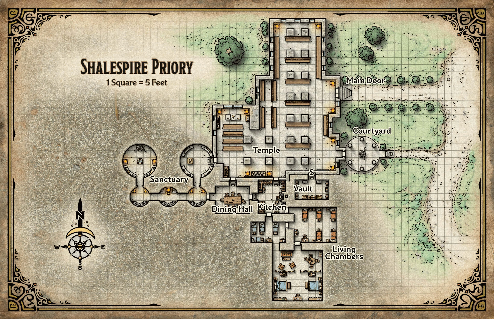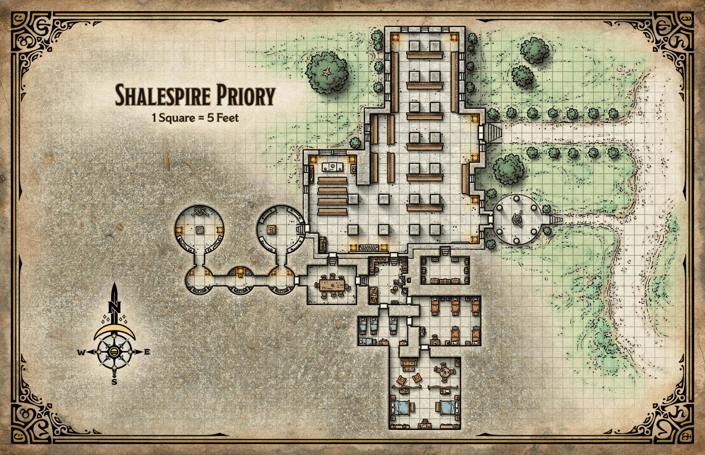
### The Weeping Goddess

- **A Deity (Shar) Adventure for Level 2 Characters**

*Discover a hidden shrine to Shar.*

- **Situation.** During a recent new moon, fisherfolk in Leilon heard sobbing on Idol Island, and Valdi Estapaar, the local fishery boss, took a small group there. She discovered a weeping statue alongside a shrine. Mist then covered the isle, and Valdi and her helpers retreated. Since then, grieving people in Leilon have forgotten much of their past while also becoming darker of mood.
- **Hook.** Merrygold Brightshine, priest of Leilon's Lathander shrine, suspects Shar's involvement. Merrygold and Valdi ask the characters to investigate the weeping statue. Valdi provides a *Rowboat* (see the *Player's Handbook*), and Merrygold provides four *Potions of Healing*.

#### Encounters

The adventure consists of these encounters.

***Raven Run.*** As characters leave for Idol Island, they are followed by a large flock of ravens, animals sacred to Shar. Eventually, the birds swoop down and initiate combat. They include three **Swarms of Ravens** and a fourth group infused with shadow magic (**Swarm of Stirges**).

***Gloom Mist.*** Mist around Idol Island dampens nonmagical lights and cantrips so they create only Dim Light. Five sobbing **Shadows** ambush the characters as the group nears the shore.

***Weeping Goddess.*** As the party approaches a rough statue fronting an old shrine, sounds of weeping emanate from it. If the group lingers, the crying ceases, and three **Kenku** and a **Cultist Fanatic** loyal to Shar, who were making the weeping noises, emerge from the shrine and order the characters to leave or die.

***Entryways.*** This area has two entrances to the sanctum. A hole opens in the shrine's southern wall, leading to a flooded tunnel. The shrine's altar conceals a standard secret door (DC 15 to detect), leading to a dry secret passage.

***Flooded Tunnel.*** Darkness and cloudy water fill this tunnel. Two **Lacedon Ghouls** have been attracted to the deathly magic here.

***Sanctum.*** Within this sanctuary, which also serves as a barrack, an obsidian pillar glows with violet light. Irric (Medium, Neutral Evil **Priest**) dwells here along with three **Kenku**. Irric uses the pillar to draw sorrow from townsfolk to offer to Shar, hoping she'll break the curse on his kenku followers. During battle, stolen grief manifests as a weeping **Shadow**.

***Conclusion.*** On Irric's defeat, Shar withdraws her power from the pillar, which returns to normal but blackened stone. The shadows and gloomy mist on Idol Island vanish, as do the unnaturally aggressive ravens. Townsfolk return to normal, and Merrygold and Valdi are grateful.

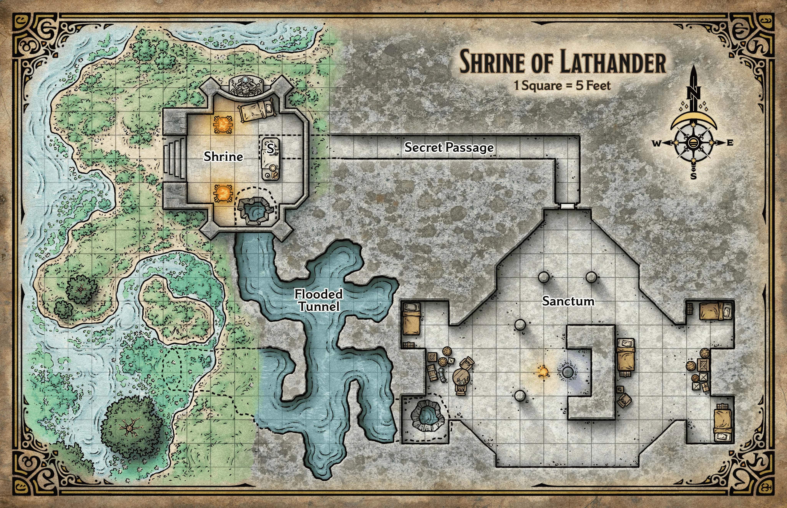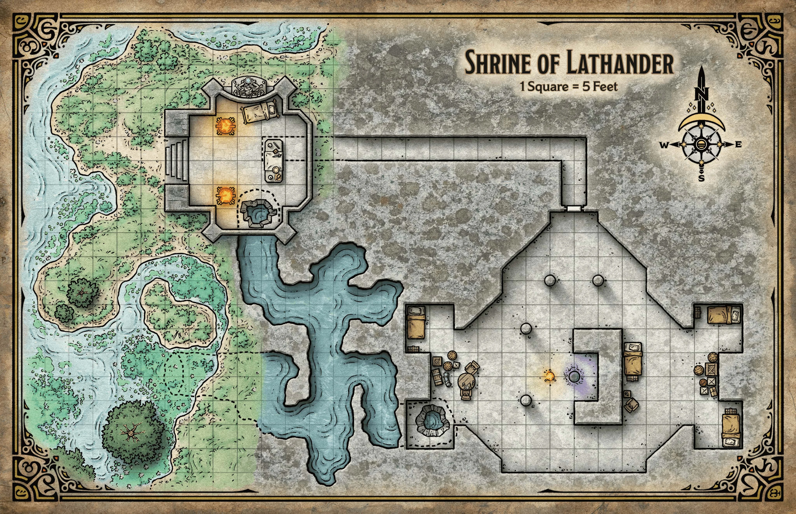
### Fury Grove

- **A Faction (Emerald Enclave) Adventure for Level 3 Characters**

*Cleanse a corrupted forest shrine.*

- **Situation.** In Laughing Hollow—a fey-touched valley in the Savage Frontier, just east of Daggerford—demonic fungus has invaded a sacred grove.
- **Hook.** A wood elf druid from Laughing Hollow traditionally visits the shrine of Chauntea in the nearby village of Julkoun at the spring festival of Greengrass to bless crops and sow harmony between Julkouners and the fey of the valley. This year, no druid has come. Deena Bluecreek, the village's halfling lord-mayor, turns to the party to make sure all is well.

#### Encounters

The adventure consists of these encounters.

***Hollow Path.*** The path from Julkoun to Laughing Hollow runs 24 miles southeast along the Delimbiyr River. For every 4 hours the party spends traveling, roll on the table below, rerolling duplicates. Fungal growths cover blighted creatures, driving them to fury.

| 1d3 | Encounter                           |
|:---:|-------------------------------------|
|  1  | Two blighted **Giant Boars**        |
|  2  | Three blighted **Dire Wolves**      |
|  3  | One un-blighted **Displacer Beast** |

***Wood Elves.*** As the characters enter Laughing Hollow, three blighted wood elves (Medium **Spies**) ambush them. They come to their senses when Bloodied and surrender. After pointing the group to the blighted grove, they rush to warn their community and seek a cure.

***Sacred Grove.*** Use the map below. Mycelial fibers run through the brush and drape branches. Spores form a light fog. Fungus becomes denser closer to the center, casting the forest in misty gloom.

Myconids here are Chaotic Evil, infected with demonic ichor:

  - **Outer Circle.** Dim Light palls the outer circle of the grove. A **Gas Spore Fungus**, three **Violet Fungi**, two **Myconid Adults**, and five **Myconid Sprouts** oppose the characters.
  - **Inner Circle.** A mycelial web and spore-laden mist block light coming from overhead. Within the Darkness lurk a **Gas Spore Fungus**, two **Myconid Adults**, and three **Myconid Spore Servants**.
  - **Fungal Hollow.** A moat and permeable bulb of fungal strands surrounds the central henge and grove. Within, a **Myconid Sovereign** rests in layered cups of giant mushrooms, shining with blood-colored light. A **Myconid Spore Servant** dressed as a druid stands guard, as does a **Druid** who is blighted but surrenders when Bloodied.

***Conclusion.*** With the sovereign's defeat, the blight ends. A group of wood elves arrives and thanks the characters, helping them recover from the ordeal. Each character's Renown Score with the Emerald Enclave increases by 1.

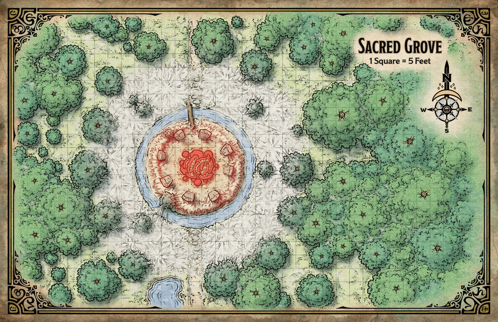
### The Tenebrous Stone

- **A Deity (Ilmater) Adventure for Level 3 Characters**

*Thwart cultists devoted to Orcus.*

- **Situation.** A cult devoted to Orcus has hidden a demonic stone in a basalt quarry in the village of Helmsdale in Damara. The stone gives off waves of magical fear and despair, overwhelming workers and transforming some into Undead. A monk of the Yellow Rose monastery, Brother Trasig, investigated the quarry but has never returned.
- **Hook.** Helmsdale's town elders, distraught over Trasig's disappearance, offer 300 GP for the characters to investigate the quarry and learn his fate. They believe the quarry is cursed and have no knowledge of the stone hidden in its depths.

#### Encounters

Use the quarry map below for this adventure. The adventure consists of these encounters.

***Work Area.*** Just inside the quarry lurk five **Zombies**, two **Ghouls**, and a **Ghast**. Once laborers here, they were corrupted by the stone but continue to swing picks and drive shovels in pointless labor. They fight anyone who disturbs them.

***Ambush.*** Sarbrindar, a **Wight** clad in robes decorated with Orcus's symbol, hides behind a wagon to ambush the party. He's accompanied by two **Skeletons** of former workers. The skeletons fight from high ground. Sarbrindar singles out one character for mockery and insults, gleefully fighting until destroyed. Brother Trasig's broken body is partially buried behind nearby crates, clutching a *Periapt of Health*. The cause of the transformations is concealed behind an illusory wall. If the illusion is touched, it vanishes.

***Hidden Cavity.*** Within the hidden cavity, the cult has hidden a relic called the Tenebrous Stone. As the characters enter, each is subjected to a vision of a past failure. Roleplay through each of these scenes, inviting players to describe the failure and what their character did or didn't do in the past. A demonic figure appears in each vision, taunting the character. A character who succeeds on a DC 15 Wisdom saving throw can change the tragic outcome of their vision; a character who fails experiences the tragedy all over again.

When every vision has resolved, the characters return to their senses, and the demonic figure of their visions manifests as a **Succubus**. The succubus is Vulnerable to all damage from characters who succeeded on the save and changed the outcome of their vision, but characters who failed that save and experienced a tragic outcome again have the Frightened condition instead.

***Conclusion.*** If the succubus is defeated, the Tenebrous Stone loses its power, and the quarry returns to normal over several days.

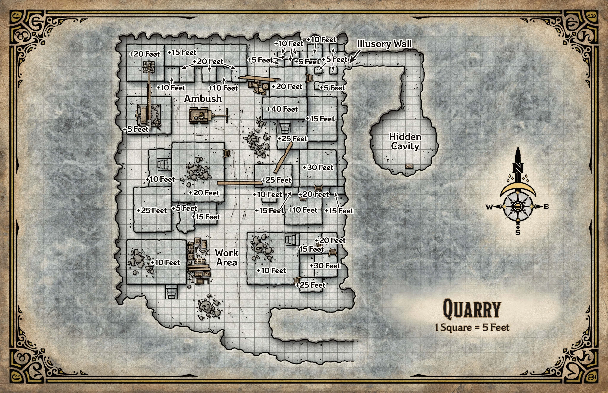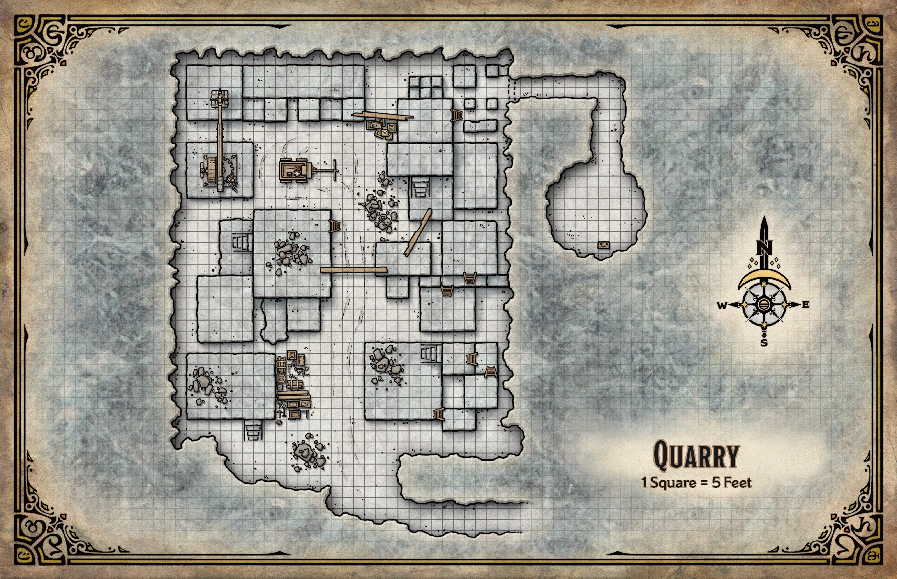
### Disinterred Danger

- **A Faction (Harpers) Adventure for Level 4 Characters**

*Recover dangerous treasures hidden by the Harpers.*

- **Situation.** After a battle long ago, Harpers sealed cursed magic items in a false tomb. The Zhentarim has found the site's location.
- **Hook.** Folavani Ladril, a wood elf scout and Harper, tried to defend the tomb but had to flee. Exhausted and due to report to her leaders, she asks the characters to go to the tomb and bring back the cursed items.

#### Encounters

The adventure consists of these encounters.

***Site Features.*** The site, its magic weakened but unbroken, has endured more than a century. Harpers left various clues in each area; a character who takes a Study action and succeeds on a DC 13 Intelligence (History) check recognizes a Harper clue's meaning.

***Entryway.*** Zhents found the tomb, its door hidden in a small cave. Signs of an explosion (caused by a discharged *Glyph of Warding* spell) mar the cave and the broken doorway, once carved as a graceful tree. Zhentarim corpses lie scattered on the floor. A **Wraith** drifts out of the tomb and initiates combat.

***Nethertide Leavings.*** Orc equipment and bones form a pile near a bronze floor plate that reads, in Common, "Along Selûne's path they did walk, leaving no stone unturned." This is a Harper clue, and a character who recognizes it knows it refers to "Moonlight Paean," a famous ballad. A character who recites the ballad causes silver light to bathe the chamber, revealing a *Shield of Missile Attraction* and a *Sword of Vengeance* lying among the bones. Other treasures and art objects here amount to a CR 4 random treasure hoard. Disturbing these items without first reciting the ballad causes bones to animate and ambush the characters (two **Swarms of Crawling Claws** and seven **Crawling Claws**).

***Dragon Statue.*** Two pressure plates trigger this fire-casting statue (see *chapter 3* of the *Dungeon Master's Guide*). A wall carving of a musician playing, notes issuing from his *lute* while he dances around the statue, is a Harper clue. Characters who recognize it know the tune depicted: "Coggin's Reel." Playing or humming this tune disarms the trap.

***Tomb.*** This stone coffin is locked with the *Arcane Lock* spell. Its lid reads, in Elvish, "To shine a light on the future." This is a Harper clue. A character who recognizes it knows the response: "Study the past." This phrase is the password for the arcane lock. Within the coffin is *Demon Armor* that animates and fights; use the stat block for a **Cambion**. If the proper phrase was spoken, the armor starts the combat Bloodied.

***Conclusion.*** Folavani helps remove curses from cursed characters. Each character's Renown Score with the Harpers increases by 1.

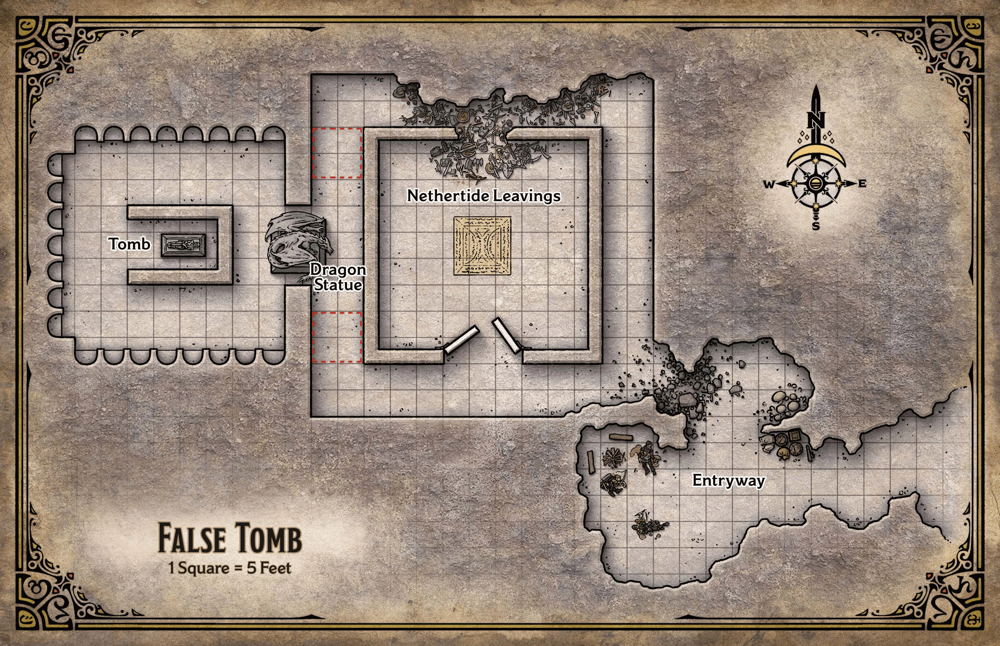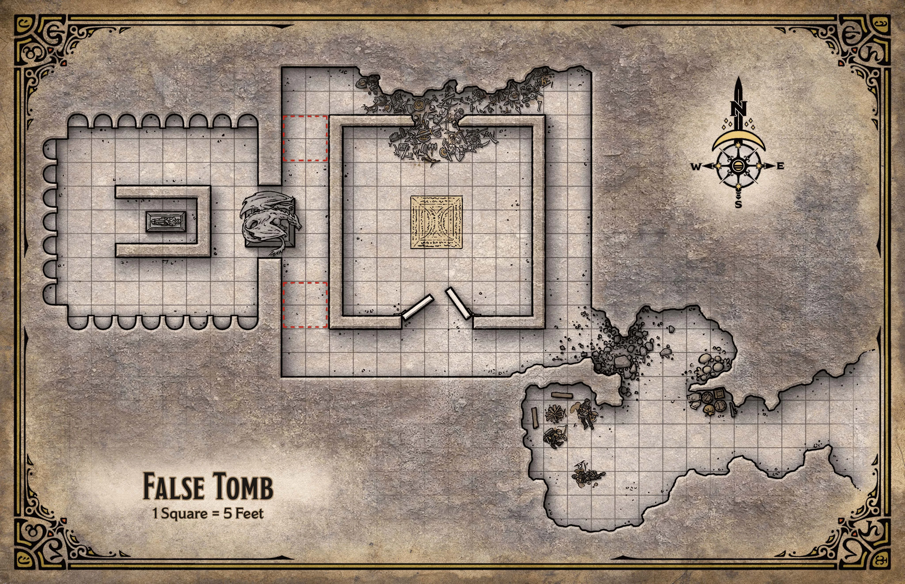
### The Drowning Forest

- **A Region (Trackless Sea) Adventure for Level 4 Characters**

*Confront a coven of hags.*

- **Situation.** A coven of hags in a hidden cave are flooding the Drowned Forest of Calidyrr, threatening nearby villages.
- **Hook.** Gwyer Destrian (Medium **Druid**), a wizened Ffolk in the village of Doncastle, asks up-and-coming heroes to find the cause of the flooding.

#### Encounters

The adventure consists of these encounters.

***Exploring the Forest.*** A wooded swamp just west of Doncastle, the Drowned Forest was once 12 miles long and half as wide. It has expanded 2 miles on every side and grown more dangerous. For every 2 hours the party spends exploring the swamp, roll on the table below, rerolling duplicates.

| 1d6 | Encounter                                                                                        |
|:---:|--------------------------------------------------------------------------------------------------|
|  1  | One **Troll**                                                                                    |
|  2  | Two **Goblin Bosses** and one **Goblin Hexer**, each riding a **Worg**                           |
|  3  | A **Bugbear Stalker** and two **Bugbear Warriors**                                               |
|  4  | Two bog **Mummies**                                                                              |
|  5  | Three **Will-o'-Wisps**                                                                          |
|  6  | Four swarms of midges (**Swarms of Insects**) and a swarm of giant midges (**Swarm of Stirges**) |

Creatures in encounters 1–4 on the table are loyal to the hags. They might admit to serving them and describe where the coven is located or, alternatively, take captured characters there.

One creature in each group carries a magical talisman made of foul natural materials. A talisman allows its bearer to see through magic protecting the coven's cave.

***Coven Bluff.*** The coven lairs in a rocky cavern from which water perpetually flows, near the swamp's center. Near the cavern, webs cover dead trees. Use the map and features below:

- **Outside Guardians.** Two **Ettercaps** and three **Giant Spiders** keep watch.
  - **Veiled Entrance.** Only characters holding one of the coven's talismans can see the waterfall entrance to the coven's cave.
  - **The Coven.** Inside the bluff, three **Green Hags**—Lette, Matt, and Solena—work their magic on a cauldron gushing foul water. The cauldron has the powers of a *Decanter of Endless Water*.

***Conclusion.*** With the hags defeated, the waters recede. Gwyer asks for their cauldron, from which he and his circle can make the party a real *Decanter of Endless Water*.

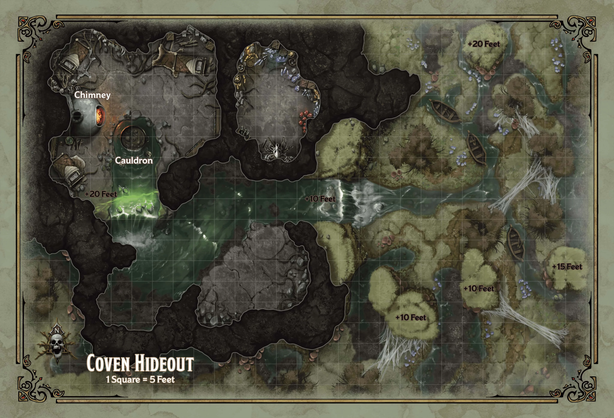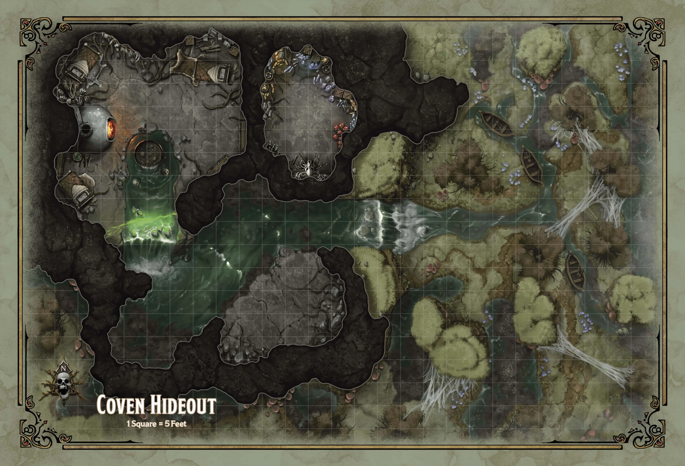
### The Lost Dawn

- **A Deity (Lathander) Adventure for Level 4 Characters**

*Bring sunlight back to a cursed village.*

- **Situation.** In the woods outside the village of Feather Falls, the **Night Hag** Mother Gloam has trapped a fragment of Lathander's power within a stone obelisk. The village is surrounded by unnatural gloom. Crops are failing, and despair hangs over the people.
- **Hook.** Dawnbringer Fenna (Medium **Priest Acolyte**), a human devotee of Lathander, has received a vision directing her to a grove near the village. She offers 300 GP to any party willing to secure the site and bring back the sun.

#### Encounters

Use the map below for these encounters. The interior of the grove is in Darkness. Light sources that would create Bright Light create Dim Light instead.

***Entering the Grove.*** The entrance to the grove is guarded by three **Cultist Fanatics** and a **Specter**.

***Obelisk of Night.*** A stone obelisk marked with runes stands in the central clearing of the grove. Mother Gloam has trapped an **Empyrean Iota** within the obelisk. To free it, the characters must collect three runestones from elsewhere in the grove and place them into recesses on the obelisk's surface. When all three runestones are in their places, the obelisk shatters, the empyrean bursts free, and dawn comes to the village.

If the characters haven't yet fought Mother Gloam, she confronts them when they bring the third runestone to the clearing.

***Gathering Runestones.*** The three runestones—smooth, flat tiles shaped like the central obelisk and each carved with a single rune—are placed on withered stumps at different places along the paths surrounding the central clearing. One is in the southwest corner where the path bends sharply. The second is in the southeast corner, where the path rises along a small hillside and comes to an end. The third is on the east side, where a smaller clearing is lined with vibrant purple fungus.

While the characters explore the paths looking for the runestones, roll on the table below, rerolling duplicates.

| 1d4 | Encounter                                                                                |
|:---:|------------------------------------------------------------------------------------------|
|  1  | Four **Smoke Mephits** taunt the party but flee if the characters try to begin combat.   |
|  2  | The party attracts the attention of two **Displacer Beasts** that patrol the grove.      |
|  3  | A **Shadow Demon** ambushes the party.                                                   |
|  4  | Mother Gloam discovers the party and confronts them, fleeing to the obelisk if Bloodied. |

***Conclusion.*** If the obelisk is destroyed, Mother Gloam retreats, swearing an eternal vendetta against the characters. The iota selects one character, lands in their hand, and permanently transforms into a sentient *Gem of Brightness*.

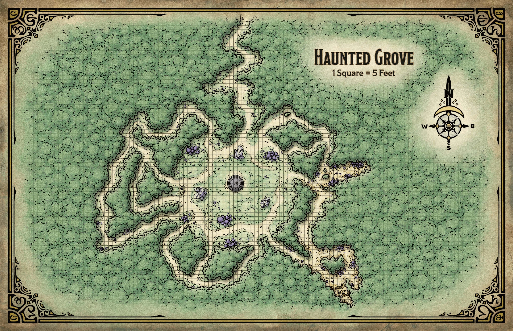
### Wolves of Amphail

- **A Faction (Lords' Alliance) Adventure for Level 4 Characters**

*Solve a bestial murder.*

- **Situation.** Predator attacks have hit several ranches in Amphail. Unusual beasts have been spotted nearby. The Oglyntyr family, secretly lycanthropes and worshipers of Malar, are responsible.
- **Hook.** Lord Warder Dauner Ilzimmer (Medium, Lawful Neutral **Noble**) sends for aid from other member cities in the Lords' Alliance. He offers 150 GP per person to investigators, half in advance.

#### Encounters

The adventure consists of these encounters.

***Road Killers.*** Near Amphail, in the foothills of the Sword Mountain along the Long Road, three **Perytons** swoop down on the characters. The perytons hint at Malar's involvement in this mystery.

***Amphail Arrival.*** Lord Ilzimmer greets the party and hosts them in his Stone Stallion inn. He tells the party that he doesn't want to choose sides, but the deep-rooted Oglyntyr family blames newcomers the Hemzars, who train dangerous creatures—Strem Hemzar recently slew an owlbear on Hemzar Ranch. But Riven Oglyntyr, who left decades ago to adventure, returned not long ago and could be involved. He needs an outside party to investigate.

***Hemzar Ranch.*** When the party visits Hemzar Ranch, 7 miles west of Amphail, use the *Manor map* in appendix B of the *Dungeon Master's Guide* if needed. The Hemzars, all humans, largely cooperate with the investigation and instruct their four servants and ranch hands to do the same.

|  Name  | Traits                                                                   |
|:------:|--------------------------------------------------------------------------|
| Elyann | Quiet, wise herbalist; Strem's wife (Medium **Commoner**)                |
|  Kalia | Witty, driven trainer and daughter (Medium, Lawful Good **Scout**)       |
|  Strem | Flighty, loyal trainer and son (Medium **Werewolf**)                     |
|  Taero | Proud, practical father and patriarch (Medium, Lawful Neutral **Noble**) |
|  Vonda | Warm, sharp treasurer and matriarch (Medium, Neutral Good **Noble**)     |

Strem slew a bloody owlbear a few weeks ago and has been ill ever since. The owlbear was sent by Malar, who cursed Strem to be a werewolf. He convalesces in the manor tower, and he and his family chain him up there at night, keeping the truth of his condition a secret.

The Hemzars assume Strem contracted lycanthropy from the owlbear. A character who takes a Study action and succeeds on a DC 15 Intelligence (Religion) check recalls Malar sends blood-covered beasts out into the world, and he takes umbrage when they're slain. Searching the Hemzar manor turns up an ivory idol of Malar in one of the barns, but the Hemzars don't know where it came from.

***Oglyntyr Ranch.*** Eight miles north of Amphail, Oglyntyr Ranch shows signs of neglect. Use the *Spooky House map* in appendix B of the *Dungeon Master's Guide* if needed. The Oglyntyr basement houses a gory Malar shrine decorated with human heads and an owlbear skull.

The Oglyntyrs, all humans, have a nasty reputation. Riven became a lycanthrope while away on adventure and has brought Malar's worship back to his family, all of whom are now cursed.

|  Name | Traits                                                                 |
|:-----:|------------------------------------------------------------------------|
|  Dorn | Ruthless, sly trainer and patriarch (Medium **Wereboar**)              |
| Jhess | Affable, wayward trainer and son (Medium, Chaotic Neutral **Wererat**) |
| Mirin | Calm, cruel healer and matriarch (Medium, Neutral Evil **Werewolf**)   |
| Riven | Ambitious, greedy uncle (Medium, Chaotic Evil **Weretiger**)           |

The family's four remaining servants are **Wererats**.

***Sacred Hunt.*** When the party begins investigating the Oglyntyrs, the family pretends to cooperate and blames the Hemzars. But as the party discovers the shrine or otherwise gets close to the truth, the Oglyntyrs decide to kill the party and honor Malar by making them the object of a hunt. The family stalks the characters and harries them in the wilderness.

Use the following encounters, giving the party time to recover between each.

- Dorn alongside Mirin.
- Jhess and two servants. If Bloodied, these lycanthropes flee back to the ranch or surrender.
- Riven, one servant, and one **Panther**. If Bloodied, the servant flees or surrenders, but Riven makes sure the cowardly servant dies.

***Conclusion.*** Lord Ilzimmer is displeased if the Oglyntyrs come to harm, but if confronted with the evidence, he admits the family was likely responsible. Strem Hemzar's hidden lycanthropy can prompt further adventure. Each character's Renown Score with the Lords' Alliance increases by 1.

### The Eyes of At'ar

- **A Region (Anauroch) Adventure for Level 5 Characters**

*Negotiate the return of a hostage and the dangerous magic he carries.*

- **Situation.** A bandit gang called the Eyes of At'ar has kidnapped Sullivan Crase, an antiquarian employed by Candlekeep. The gang offers to exchange Sullivan for 10,000 GP, instructing that the exchange take place at a lonely caravansary along the Black Road called Kozah's Whisper.
- **Hook.** Janussi (Medium **Archmage**), Candlekeep's Keeper of Tomes, meets the characters in a private room at a tavern in Baldur's Gate and shares with them the ransom note detailing the gang's demands. The Eyes of At'ar write they will be at Kozah's Whisper in one month and will wait one month more for Candlekeep's representatives to make the trade. After that, Sullivan will be killed. Janussi confides that Sullivan was carrying a scroll of priceless Netherese magic when he was abducted. She refuses to encourage the bandits by paying the ransom. She offers the party 1,500 GP plus expenses if they will travel to Kozah's Whisper and secure Sullivan and the scroll.

#### Encounters

The adventure consists of these encounters.

***Doing Their Homework.*** Characters might seek to use Candlekeep's resources to learn more about their mission. Anyone wishing to enter the library must provide a work of writing the library doesn't already have. Characters researching in the library learn the gang's name refers to At'ar the Merciless, the Bedine god of the sun. Characters can acquire maps suggesting possible routes to Anauroch. An obscure scouting report describes the leader of the Eyes of At'ar as a mysterious "half-lion" spellcaster named Inixera (**Lamia**). The report cautions that the gang has eyes everywhere. You can find more information on Candlekeep to flesh out this part of the adventure in the *Candlekeep Mysteries adventure anthology.*

*The Journey*. The characters have a long journey ahead of them. One option is to take the Trade Way north to Daggerford, then turn east along the Delimbyr Trail until they reach the Black Road and Anauroch. Alternatively, the party might travel cross-country, skirting the Forest of Wyrms, Marsh of Chelimber, and Lonely Moor. Use the rules for travel and journey stages in *chapter 2* of the *Dungeon Master's Guide*.

***Kozah's Whisper.*** Kozah's Whisper is a caravansary halfway along the Black Road, in the middle of the Great Desert. Use the *Roadside Inn map* from appendix B of the Dungeon Master's Guide. Characters who used magic to travel to Kozah's Whisper might get there before the bandits, but its more likely the gang has already arrived.

The caravansary is managed by a human woman named Enla Massine (Medium, Chaotic Neutral **Commoner**) who has survived in Anauroch by not getting involved in the business of her guests. She is assisted by her wife, Nari (Medium **Assassin**), who serves as a bouncer and general laborer. The two are fiercely loyal to each other. Their three adult children (Medium **Commoners**) work as cooks, grooms, and cleaning staff. Other guests at the caravansary include the following:

- **Lorna**, a nosy human merchant (Medium **Commoner**) lingering at Kozah's Rest while her pack animals recover from a difficult journey. Lorna is a source for gossip at the caravansary, and she can sell the party any gear they might need, including a few *Spell Scrolls*.
- **Mikkam**, a halfling lieutenant in the Eyes of At'ar (Small, Chaotic Neutral **Tough Boss**). He leads eight **Toughs**.
- **Nama**, a wandering elf mage (Medium **Bandit Deceiver**) pursuing lost Netherese lore. If Nama learns about the Netherese scriptures, she might offer her services to the party in exchange for the scroll—or simply try to steal it.
- **Raheel**, a human tracker (Medium **Scout**). Raheel is looking for work. The party can hire him for 100 GP. He will spy on the Eyes of At'ar or anyone else the party directs him to, but he avoids combat.

The party has time to investigate the caravansary and guests while meeting with Mikkam to set up the exchange. Once convinced the party intends to make the deal, Mikkam sends word to Inixera, leader of the gang, at a bandit camp half a day away in the desert.

***The Exchange.*** Inixera arrives a day after being sent for, with the bulk of the gang in tow. This includes four **Bandit Captains** and two dozen **Bandits**, and Gnasher, Inixera's pet **Manticore**. Sullivan is manacled and gagged, in Gnasher's care. Inixera has the Netherese texts in an elaborate scroll case, hidden in a simple sack.

When Inixera confronts the party, he changes the terms of the deal. He will release Sullivan if the party agrees to read the scroll aloud, right now, in the open yard of the caravansary. Inixera has read the scriptures and knows they summon a **Phaerimm Agent**. If the characters go through with this bargain, the phaerimm appears and fights them while Inixera looks on, cackling with glee. If they refuse, Inixera intends to feed Sullivan to Gnasher and keep the scrolls for himself.

### Safe House Standoff

- **A Faction (Zhentarim) Adventure for Level 5 Characters**

*Rescue a hostage from a Zhentarim stronghold.*

- **Situation.** Rendel Carver (Medium **Commoner**), the human husband of a prominent Zhentarim leader, has been kidnapped by a rival crime gang and is being held at a safe house in the city.
- **Hook.** The Zhentarim leader instructs the characters to rescue Rendel and enact revenge on the kidnappers.

#### Encounters

The adventure consists of these encounters.

***Finding the House.*** Bribes of 100 GP spread around informers in the city get the party the location of the safe house and the name Yathla Kresh (Medium, Neutral Evil **Bandit Deceiver**), an aspiring human crime lord and expert illusionist, who is behind the abduction. Alternatively, a character can get this information by spending an hour interrogating petty criminals and succeeding at a DC 15 Charisma (Intimidation or Persuasion) check.

***Safe House.*** Use the map below. Doors begin closed. See "Hallway Fights" below for additional guidance:

  - **1: Stairs.** Yathla is at the foot of the stairs talking with four of her **Toughs** near the front door.
  - **2: Gambling Room.** Four **Spies** in Yathla's employ play cards here.
  - **3: Prisoner Room.** Rendel is tied to a chair here. Two of Yathla's **Toughs** relax and talk in the room to the south.
  - **4: Trap.** A tripwire on the upper floor triggers a fusillade of poison darts in the space marked "T" on the map. Creatures in the 5-foot-by-10-foot space directly north of the trap are affected by the poison dart trap from chapter 3 of the *Dungeon Master's Guide*, scaled for level 5 characters.
  - **5: Vault.** The door to this room is locked with the *Arcane Lock* spell, opening only for Yathla. It contains a CR 5–10 treasure hoard, plus a *Spell Scroll* of *Dimension Door*, which Yathla intends to use to escape the safe house.

***Hallway Fights.*** Any criminal in the house can shout an alarm, so characters are likely to face enemies simultaneously charging out of various rooms. At the same time, Yathla flees up the stairs towards the vault, leading characters following too closely into the trap on the upper floor. A session might involve the party splitting up, some chasing Yathla while others deal with the gang and search for Rendel. Track Initiative for everyone even as they spread out around the house.

***Conclusion.*** If Rendel is rescued, each character's Renown Score with the Zhentarim increases by 1.

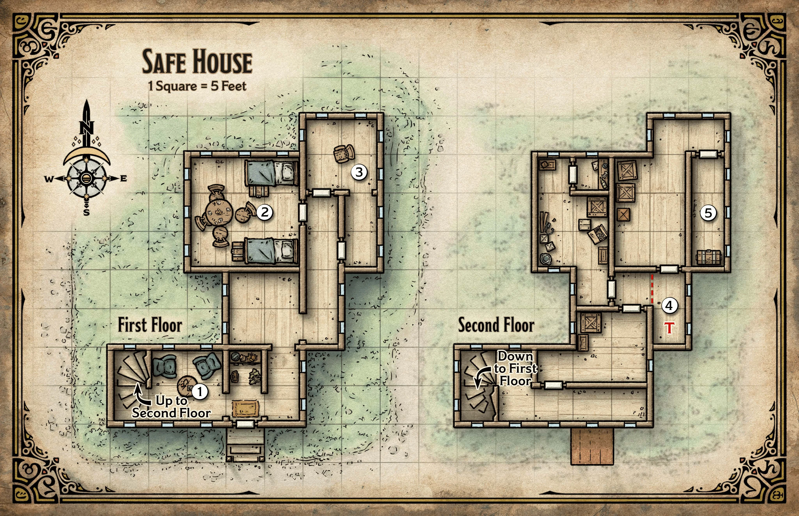
### Tears Fall

- **A Deity (Selûne) Adventure for Level 5 Characters**

Chase falling stars for *Selûne*.

- **Situation.** Stars fall from the sky east of Waterdeep. Clergy in Waterdeep's House of the Moon divine these meteors are rare fragments from the Tears of Selûne.
- **Hook.** Ervina Tunnall (Medium **Priest**), a human priest from the House of the Moon, calls on the adventurers to recover the fallen Tears. She offers 500 GP for each Tear and gives the group a map of the Forlorn Hills, where the Tears fell.

#### Encounters

The adventure consists of these encounters.

***Hill Exploration.*** Each day the characters travel through the Forlorn Hills searching for the fallen Tears, they make DC 15 Wisdom (Perception) checks. Once they have collectively made ten successful checks, they find the fallen Tears (see "At the Crash Site" below). On each day they don't find the Tears, roll on the table below, rerolling duplicates.

| 1d6 | Encounter                                                                                                                                                                                                                                                                                                                                                       |
|:---:|-----------------------------------------------------------------------------------------------------------------------------------------------------------------------------------------------------------------------------------------------------------------------------------------------------------------------------------------------------------------|
|  1  | One **Hobgoblin Captain**, eight **Hobgoblin Warriors**, and a **Mage Apprentice** looking to raid roads and settlements                                                                                                                                                                                                                                        |
|  2  | A curious **Young Copper Dragon** named Eldiss, who knows where the Tears fell, guaranteeing success on the next day's Wisdom (Perception) checks to find them                                                                                                                                                                                                  |
|  3  | A **Giant Owl** that can put the party on the right track if spoken to                                                                                                                                                                                                                                                                                          |
|  4  | Two **Hill Giants**, territorial and Hostile to intruders                                                                                                                                                                                                                                                                                                       |
|  5  | A group working for Shar's Order of the Dark Moon who are also searching for the fallen Tears. They're led by a human priest named Alwelyn Lanta (Medium, Neutral Evil **Cultist Fanatic**) and a human champion named Teren Carver (Medium, Neutral Evil **Gladiator**). The rest of the group are human warriors (Medium, Neutral Evil **Warrior Veterans**). |
|  6  | A **Wraith** and six **Specters** assault the group's camp at midnight. The wraith's ghostly garb bears the symbol of Shar.                                                                                                                                                                                                                                     |

***At the Crash Site.*** Use the map below. Three Tear fragments, fire-polished moonstones each the size of a human fist, lie in three different craters. Zorris, a tiefling, and Halawys, a human (both Medium **Werebears**), received a vision to guard the fragments until worthy folk came to retrieve them. Characters must convince these guardians to relinquish the prize; the guardians are initially Indifferent, but offering them one of the Tear fragments makes them Friendly.

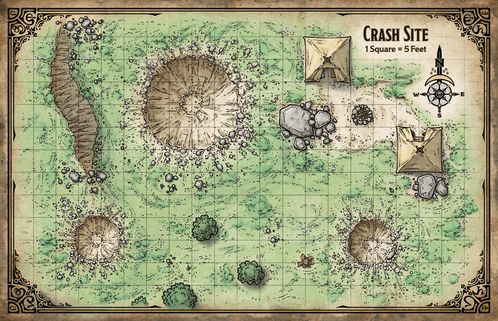
### Shadow of the Watch

- **A Deity (Helm) Adventure for Level 6 Characters**

*Bring peace to an embattled forest.*

- **Situation.** A group of fey and other forest dwellers angry at overhunting and logging in the forest have intercepted a caravan under the protection of Helm's Everwatch Knights. The caravan was bound for the village of Noanar's Hold on the north edge of the High Forest, and carries critical winter supplies, but now the forest folk hold it hostage.
- **Hook.** Desperate for a solution, the village's human mayor Nolan Foxglove (Medium **Noble**) offers the party 3,000 GP in gemstones to locate the missing caravan and secure its return. Foxglove and others in the village consider the forest folk lawless brigands.

#### Encounters

The adventure consists of these encounters.

***Scene of the Crime.*** The caravan ambush site is several miles from town, in the forest. Footprints and drag marks suggest the caravan members were taken prisoner and the supplies nabbed. The party can follow this trail to the forest camp.

***Forest Ambush.*** Fey defenders of the forest wait along the way. The group consists of a **Goblin Hexer**, a **Satyr Revelmaster**, and three **Bugbear Stalkers**. They fight while shouting insults at the party for abetting the selfish destruction of the forest. When one is killed, the rest retreat to the forest camp.

***Marks of Civilization.*** Characters traveling through the woods note excessive logging, cruel animal traps, and a dearth of local wildlife, suggesting the fey have a point.

***Forest Camp.*** Use the map below. The camp's inhabitants and main features are listed below:

  - **Main Gate.** Two **Bugbear Stalkers** stand watch on each southern tower. They alert the camp to intruders before engaging in combat.
  - **Hostage Tent.** Ironhoof, a **Centaur Warden**, guards two human drovers (**Commoners**) and Pryat Tomes (Medium, Lawful Good **Priest**), a human member of the Everwatch Knights. Pryat hopes to negotiate a truce between Noanar's Hold and the fey.
  - **Camp Residents.** Four **Druids** rest in the sleeping tent. The paddock houses a **Primeval Owlbear**. A **Pixie Wonderbringer** named Spirella Rainbloom leads the group and moves about the camp.

***Fists or Friends.*** The characters might sneak or force their way into the camp, but negotiation is possible. Spirella is initially Hostile but agrees to return the supplies and free the prisoners in exchange for a binding agreement from locals that the forest will not be hunted or logged until the damage already done has healed. This could take many years.

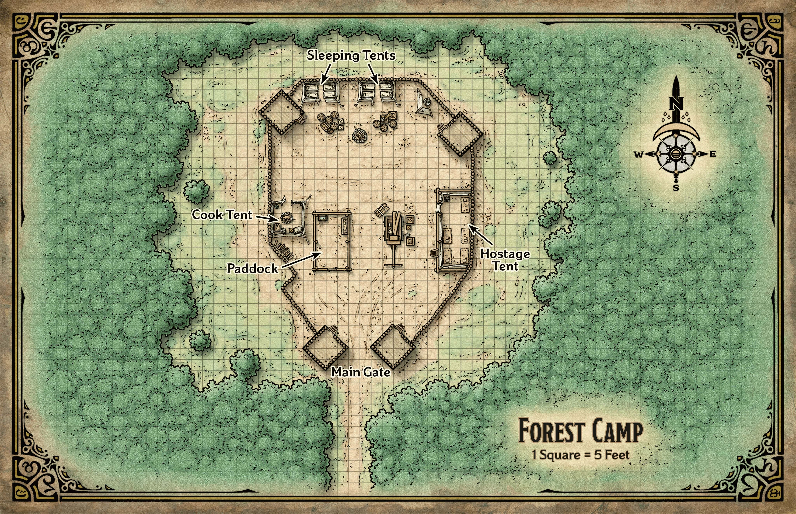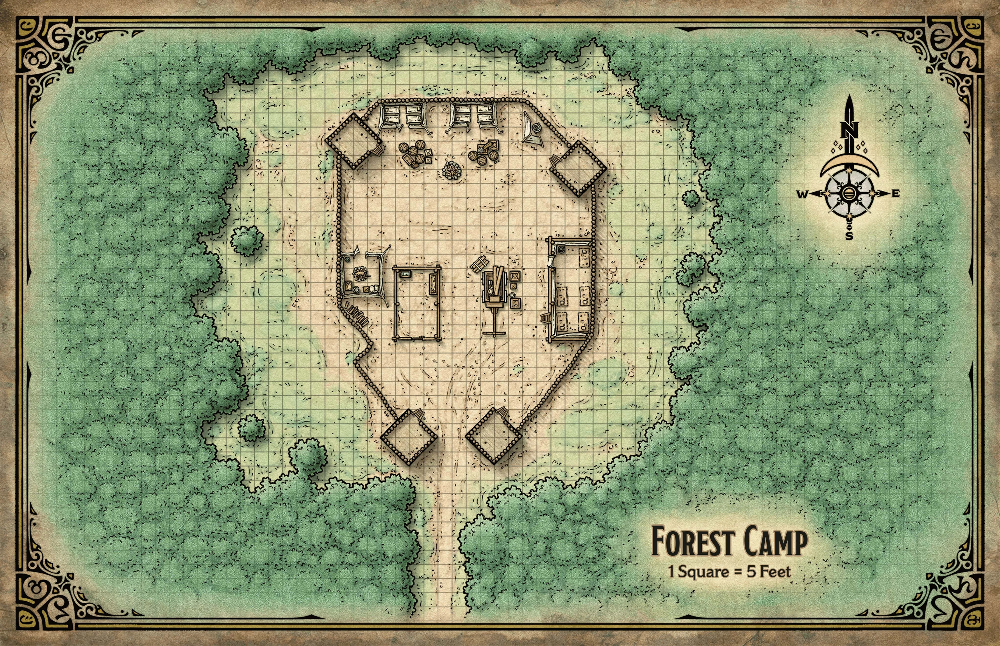
### Well of Lies

- **A Deity (Mystra) Adventure for Level 6 Characters**

*Explore an ancient wizard tower.*

- **Situation.** The Spellplague caused a ruined tower near Secomber, once used for the initiation of wizards, to invert. Now cultists devoted to Cyric have settled there, bringing monsters and evil magic. A ranger of the Order of the Shooting Star (see *Forgotten Realms: Heroes of Faerûn*) named Keadan Rolamin investigated, but the cult has slain him.
- **Hooks.** Uvdi Sarsk, a Mystran priest, contacts the characters and asks them to meet her at the Seven-Stringed Harp, a famous tavern in Secomber. Keadan warned her about the inverted tower and told her its location, but she hasn't heard from him since. She wants the party to investigate.

#### Encounters

The characters reach the inverted tower in a few days. The adventure consists of these encounters.

***Wild Magic.*** The inside of the tower is a wild magic zone. See chapter 3 of the *Dungeon Master's Guide* for rules on wild magic zones.

***Living Menhirs.*** Outside the inverted tower, menhirs and rubble swirl in the air, combining into a creature that defends the entrance. Use the **Air Elemental** stat block but change its creature type to Construct. When the creature drops to 0 Hit Points, the last menhir animates (use the **Galeb Duhr** stat block).

***Initiation Well.*** The tower once had a level for each school of magic. Only four levels remain, listed from the top to the bottom:

  - **Transmutation.** Open to the sky, the transmutation level has three **Awakened Trees** and a **Animated Rug of Smothering**. A Cyric **Berserker** watching the entry joins any combat.
  - **Necromancy.** Rough exam tables fill this level. A **Ghast Gravecaller** and three **Ghouls** converse with a **Cultist Fanatic**. They study the dead remains of Keadan, his three comrades, and two slain cultists.
  - **Illusion.** This level subjects invaders to an illusory maze, but the magic fades as two **Cultist Fanatics**, two **Tough Bosses**, and four **Cultists** use the illusions to surprise interlopers. The area is a barrack stocked with supplies.
  - **Conjuration.** On this level, a human man named Nacrel (Medium, Chaotic Evil **Mage**) works inside a runic circle, experimenting with a floating silvery-blue orb of energy connected to Weave threads. His allied **Nightmare** lurks in the southern tunnel, which leads outside. The orb can be disrupted with a *Dispel Magic* spell (DC 17) or by slaying Nacrel. Until the orb fails, Nacrel regains 5 Hit Points at the start of each of his turns, provided he has at least 1 Hit Point remaining.

***Conclusion.*** Uvdi Sarsk rewards each character with an Uncommon magic item.

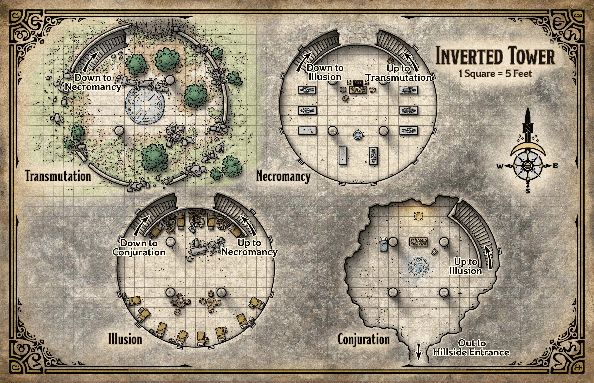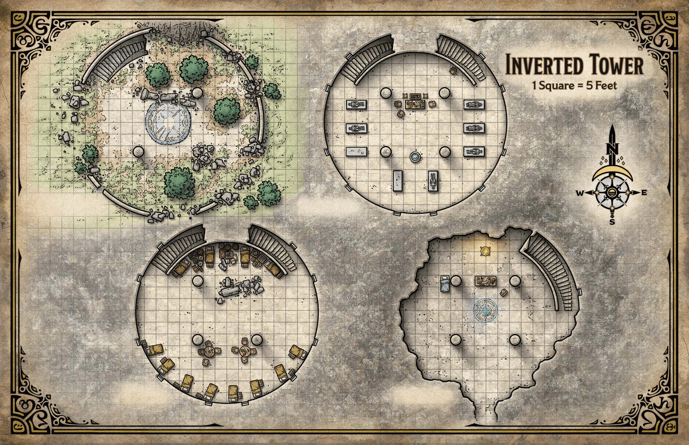
### Broken Mirrors

- **A Deity (Sune) Adventure for Level 7 Characters**

*Prevent a champion of Sune from exacting cruel revenge.*

- **Situation.** Taydan Maerethar, an elf warrior (Medium **Pirate Captain**), was a celebrated member of the Sodality of the Ruby Rose, one of Sune's orders (see *Forgotten Realms: Heroes of Faerûn*). A year of tragedy—in which he lost his adventuring companions, his lover, and his good looks—broke Taydan's heart. Reyla (Medium **Aberrant Cultist**), a tiefling who reveres Beshaba, led Taydan to blame Sune and steal a ruby rose from Sune's Temple of Beauty in Waterdeep. Reyla and Taydan destroyed every street-corner mirror shrine to Sune they passed while fleeing the city and headed to the Passion Pools, a Sune pilgrimage site that houses reflecting pools sacred to the goddess. The pools are located in Westwood, 100 miles north of Waterdeep and 30 miles northwest of Amphail.
- **Hook.** Clergy in the Temple of Beauty in Waterdeep learned Taydan headed to the Passion Pools from a boastful note he left in which he vowed to "break all mirrors" in his path. Lei Kuvun, a human priest of the temple, asks adventurers to chase Taydan down and stop him from fulfilling his vow.

#### Encounters

The adventure consists of these encounters.

***Night Stalkers.*** Two **Incubi** servants of Beshaba stalk the group. If discovered, they call two hulking elk with sharp, bloody antlers to assist them in battle (use the **Giant Boar** stat block, but the elk are Fiends instead of Beasts). If the incubi pursue the party to the Passion Pools, they and their elk minions fight the party there.

***Passion Pools.*** These caves in the forested foothills of the Sword Mountains protect geothermic pools laced with salts that color the waters various hues of red. The air is steamy and smells foul. Use the *Volcanic Caves map* in *Dungeon Master's Guide* appendix B, treating lava as water and placing areas where priests and visitors live and work.

***Love's Warning.*** The **Ghost** of Baranys Dwyll, once an aasimar priest of Sune, manifests soon after the party enters the pools, warning the characters of the site's dangers.

***Foul Waters.*** The ritual Reyla and Taydan are performing has befouled the pools. Any creature that enters a pool for the first time on a turn or ends its turn there must succeed on a DC 15 Constitution saving throw or have the Poisoned condition until the end of its next turn; a creature makes this save only once per turn. Those who gaze into the pools see unnerving reflections of themselves and must succeed on a DC 15 Charisma saving throw or suffer the effects of the *Bane* spell for 1 minute.

***Bad Toad.*** Moro, Reyla's **Quasit** familiar, keeps watch within the pools and might be discovered by characters at any time. Moro claims to be an innocent awakened toad in need of protection. If allowed to accompany the party or taken along with them, Moro causes "accidental" trouble until it has an excuse to join a fight against the party. For example, Moro might make noise when the party is trying to be sneaky, or it might profess to know the way through the pools and then lead the party into an ambush. If left behind or attacked, Moro turns Invisible and harasses the group unseen.

***Pool Exploration.*** Each time characters enter a major area, roll on the table below or choose an encounter, rerolling duplicates.

| 1d6 | Encounter                                                                                                                       |
|:---:|---------------------------------------------------------------------------------------------------------------------------------|
|  1  | One **Hezrou**                                                                                                                  |
|  2  | Two **Oni**                                                                                                                     |
|  3  | One **Tree Blight**, four **Needle Blights**, and one **Shambling Mound** entangling the remains of Sune priests and worshipers |
|  4  | One **Vrock** and one **Swarm of Dretches**                                                                                     |
|  5  | Two **Barlguras**                                                                                                               |
|  6  | Three **Black Puddings** of Abyssal sludge                                                                                      |

***Polluted Pool.*** Using Abyssal reagents gathered from demons at the site, Reyla and Taydan are performing a vile ritual to corrupt the Passion Pools and dedicate them to Beshaba. They pause to destroy intruders. Three swarms of fiendish cockroaches (**Swarms of Larvae**) scuttle in the fetid room and protect the two villains. Both Reyla and Taydan are Hostile, but as an Influence action, a character can make a DC 15 Charisma (Persuasion) check to try and dissuade Taydan from his evil course, convincing him to turn on Reyla on a successful check. Reyla carries the ruby rose.

***Conclusion.*** When the characters return to the Temple of Beauty with the ruby rose, clerics instruct them to keep it. It now functions as a *Ring of Protection* when worn. Each character also receives two *Perfumes of Bewitching*.

### In for a Penny

- **A Region (Forgotten Lands) Adventure for Level 7 Characters**

*End the schemes of the Shadowmasters of Telflamm*.

- **Situation.** Citizens of the Theskan capital of Telflamm have fallen victim to a massive speculation scheme orchestrated by the city's powerful thieves' guild, the Shadowmasters. The enraged populace is rioting in the streets. Meanwhile, Shadowmaster Delra Vael, at the heart of the scheme, gathers her illicit treasures and prepares to escape.
- **Hook.** Telflamm's city council, desperate to reinstate order, offers land, titles, and a 10,000 GP reward if the party finds the Shadowmasters' hidden vault and returns the city's wealth.

#### Encounters

The adventure consists of these encounters.

***Telflamm Is Burning.*** A character who hits the streets for an hour, questioning key rioters and petty criminals, can make a DC 15 Intelligence (Investigation) check. On a successful check, the character learns the location of the entrance to the Shadowmasters' secret vault, in Telflamm's sewers. Every hour spent on the streets, roll on the table below or choose an encounter, rerolling duplicates.

| 1d4 | Encounter                                                                                                                                                                                                                                                                                                                          |
|:---:|------------------------------------------------------------------------------------------------------------------------------------------------------------------------------------------------------------------------------------------------------------------------------------------------------------------------------------|
|  1  | A dozen rioters (**Commoners**) mistake an innocent for a Shadowmaster informer and attempt vigilante justice.                                                                                                                                                                                                                     |
|  2  | A human populist agitator named Gehlen Kriska (Medium **Performer Maestro**), rallies the mob, blaming the city council for the crisis. If the characters defend the council or try to disperse the mob, Gehlen turns the mob's anger on the party.                                                                                |
|  3  | Rioters have set a building on fire. Spectators watch helplessly as 1d4 victims cry for help from within the blaze. Use the *Manor House map* from appendix B of the *Dungeon Master's Guide*, scattering victims on each floor. Use the rules for an inferno in  chapter 3  of the Dungeon Master's Guide to adjudicate the fire. |
|  4  | A Shadowmaster **Assassin** targets the characters, approaching stealthily and targeting spellcasters and other lightly armored characters first.                                                                                                                                                                                  |

***Sewers.*** The party must pass through the sewers to reach the vault entrance. As they do, they're ambushed by an **Otyugh** and three **Swarms of Venomous Snakes**.

***The Vault.*** Use level 2 of the *Dungeon Hideout map* in appendix B of the Dungeon Master's Guide , eliminating the east staircase and eastern chambers. Two **Tough Bosses** and ten **Toughs** move the accumulated wealth of the city from southern rooms to mine carts in the northern tunnel. When interrupted by the party, they begin combat.

***Mine Cart Chase.*** Shadowmaster Delra Vael (Medium **Spy Master**) tries to escape down the secret exit in a mine cart loaded with plunder. Characters can pursue in carts of their own, resulting in a chase through labyrinthine caverns, eventually ending at the harbor (see *chapter 3* of the Dungeon Master's Guide for rules on running chases). A mine cart can fit one Medium or Small creature. A creature riding in a cart has a Speed of 60 feet.

| 1d12 | Complication                                                                                                                                                                                                                                         |
|:----:|------------------------------------------------------------------------------------------------------------------------------------------------------------------------------------------------------------------------------------------------------|
|   1  | Your cart approaches a steep turn. Make a DC 15 Strength or Dexterity saving throw (your choice). On a failed save, the turn counts as 15 feet of Difficult Terrain for you.                                                                         |
|   2  | Your cart hurtles toward low-hanging mining equipment. Make a DC 15 Dexterity or Constitution saving throw (your choice). On a failed save, you take 2d6 Bludgeoning damage and gain the Prone condition.                                            |
|   3  | The tracks bend and swerve into a maze. Make a DC 15 Dexterity or Intelligence saving throw (your choice). On a failed save, the maze counts as 20 feet of Difficult Terrain for you.                                                                |
|   4  | You pass through a cavern that's home to a **Swarm of Stirges**, waking them from slumber. The swarm uses one of its actions to attack you, and the mass of flapping, confused creatures gives you the Blinded condition until the end of your turn. |
|   5  | You speed through a cavern that's home to 1d6 **Piercers**. One of them uses one of its actions, targeting you.                                                                                                                                      |
|   6  | A **Hook Horror** notices you. Make a DC 10 Wisdom or Charisma saving throw (your choice). On a failed save, the creature joins the chase with you as its quarry.                                                                                    |
| 7–12 | There is no complication.                                                                                                                                                                                                                            |

### Hell Ship

- **A Region (Lands of Intrigue) Adventure for Level 8 Characters**

*Battle undead pirates on land and sea.*

- **Situation.** The ghost ship Bloodrider terrorizes shipping from a hidden port. Its undead crew leaves no survivors, and the surge in piracy is unexplained.
- **Hook.** The human merchant captain Shireen Malahnk (Medium **Bandit Captain**) wants extra guards for her ship, Wisteria , hauling metal and gems from Athkatla to Baldur's Gate. She offers 250 GP per person.

#### Encounters

The adventure consists of these encounters.

***Bloodrider.*** The wind dies and sulfurous fog gathers as the fire-blackened Bloodrider sails in. The ghost ship's crew boards the becalmed Wisteria. Use the *Ship map* in *Dungeon Master's Guide* appendix B. Wisteria's crew (**Toughs**) flees belowdecks or fights against other monsters while two waves of enemies (see below) fight the characters. Humanoids listed below are instead Undead. When destroyed, the creatures turn to brimstone and ash but eventually return (see "Hell's Cove").

The pirates board in the following waves:

  - **Wave One.** Eight **Pirates** board, led by a **Pirate Captain** and a **Flameskull**.
  - **Wave Two.** As wave one falters, Lieutenant Mazterel (**Cambion**), two **Bearded Devils**, and two **Pirates** join them. Facing defeat, Mazterel casts *Plane Shift* to escape.
- Once the battle ends, *Bloodrider* breaks apart and sinks. The party has time to search the large quarters astern, where tattered logs and charts show *Bloodrider*'s port, a tiny cove a day's sail away. If captured, Mazterel can give the same information.

***Hell's Cove.*** When the characters reach the cove, Bloodrider has returned. All Undead listed in waves one and two are back on the ship. They, and Mazterel if he escaped, ambush the party in the haunted village.

The pirates' treasure is hidden behind the waterfall and includes 3,500 GP, a set of amber dice worth 250 GP, a ship in a bottle decorated with gold and gemstones worth 750 GP, *Mariner's Armor* (*Studded Leather Armor*) and a *Folding Boat*.

Within the captain's grotto, the chain-bound, burning heart of *Bloodrider*'s former captain, Salton Vail, floats in the air. A **Chain Devil** and two **Barbed Devils** guard the heart. *Bloodrider* and its crew rise again 1 day after being destroyed unless the heart is doused in Holy Water and the *Remove Curse* spell is cast on it. An *Identify* spell cast on the heart reveals this ritual.

***Conclusion.*** With the permanent destruction of the Bloodrider , Shireen sings the group's praises from Baldur's Gate to Athkatla. Henceforth, she will provide a ship and crew for any journey the party wants to make.

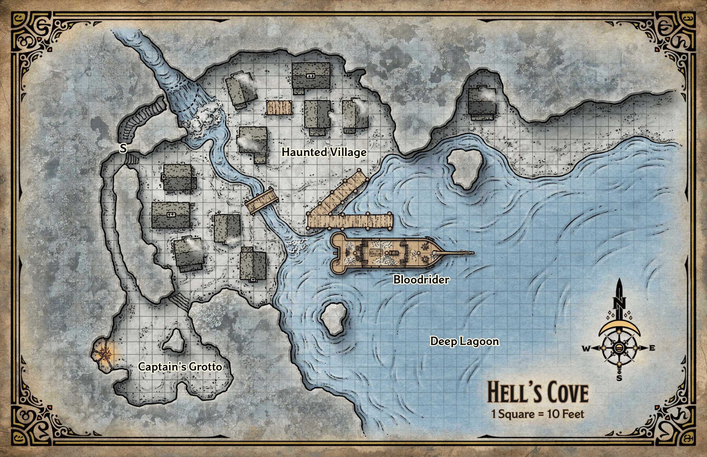
### Moving Mountains

- **A High Magic Adventure for Level 8 Characters**

*Move a volcano by using high magic.*

- **Situation.** High Moor geomancers predict that the volcano of Mount Hlim will erupt in a matter of days. The only way to save the nearby communities is to cast a powerful high magic spell that moves the mountain to a remote location.
- **Hook.** Sizarak (Lawful Good **Lizardfolk Geomancer**) teaches a powerful ritual to the characters. The geomancer asks the characters to collect the necessary component and perform the ritual to move Mount Hlim before it's too late.

#### Encounters

The characters must overcome these encounters.

***Adamantine Rod.*** To perform the high magic ritual, the characters must find a 3-foot-long adamantine rod made of ore extracted from beneath Mount Hlim. A wicked **Fire Giant** dwelling inside the mountain has three such rods, each worth 1,000 GP. The characters can sneak into the giant's smithy (use the *Volcanic Caves map* in appendix B of the *Dungeon Master's Guide*). There, they can confront the giant or try to steal a rod.

***Place the Rod.*** The adamantine rod must be stuck in the earth where Mount Hlim will be teleported to. Each character makes a DC 20 Wisdom (Survival) check. It takes the characters 1d6 days to find a suitable new location for the mountain, minus 1 for each character who succeeded on the check (minimum 1 day), during which rumblings and signs of an impending eruption increase.

***Conduct the Ritual.*** At least five participants must congregate in a circle around the adamantine rod and conduct the 8-hour ritual. At the end of the ritual, each participant must expend a level 3+ spell slot or take 22 (4d10) Psychic damage.

Once the ritual is complete, the ground quakes violently as Mount Hlim emerges from the earth at its new location centered on the adamantine rod. Each creature touching the ground within 500 feet of the adamantine rod must succeed on a DC 20 Strength saving throw or have the Prone condition. At the end of the ritual, the ritual's participants are on the peak of Mount Hlim.

***Survive the Volcano.*** Once the ritual is finished, a **Dao** appears beside the characters and initiates combat. This is the spirit of the mountain. When the dao is defeated, it crumbles into dust, leaving behind a *Ring of Three Wishes* with 1 charge remaining.

Ten minutes after the dao is defeated, Mount Hlim erupts, spewing lava and ash in a 20-mile radius for 2d4 hours. For the duration, each creature within 1 mile of the mountain's peak at the start of its turn takes 70 (20d6) Fire damage.

### Summerlight Ceremony

- **A High Magic Adventure for Level 8 Characters**

*Fight off the winter in Icewind Dale*.

- **Situation.** A young human wizard named Povari Belendros (Medium, Chaotic Good **Mage**) has devised a potential means of preserving some of summer's warmth even in the heart of winter. She calls her spell the Summerlight Ceremony.
- **Hook.** Povari hires the characters to procure a special reagent—bark from the luminous yew tree, harvested with a magical burning sickle—and to help her conduct her ceremony.

#### Encounters

The characters must complete these steps.

***Obtain the Sickle.*** An **Azer Pyromancer** named Caserrium living in the caves beneath Kelvin's Cairn has crafted the burning sickle. He agrees to give it to the characters if they drive out a band of drow cultists lurking beneath the mountain. The drow include twelve **Drow of Lolth** and two **Drow Elite Warriors of Lolth** led by a **Drow Priestess of Lolth**; see chapter 9 for all these stat blocks. Use the *Underdark Warren map* from appendix B in the *Dungeon Master's Guide* for their lair. If the characters defeat or drive off the drow, Caserrium is good to his word and gives the party the sickle.

***Luminous Yew.*** The luminous yew is a massive, magical tree in an ominous copse in the Lonelywood. A greedy, Chaotic Evil **Treant** guards the tree and fights the party on sight. Once the treant is destroyed, the party can collect the bark using the sickle.

***Conducting the Ceremony.*** Back in Targos, Povari leads the characters in a ceremony around a giant bonfire. The taxing ritual takes 24 hours, at the end of which each character must succeed on a DC 15 Wisdom saving throw or gain 1 Exhaustion level.

Just as Povari is finishing the ceremony, a **Remorhaz** bursts from the ground. Use the ground floor of the *Roadside Inn map* from appendix B in the *Dungeon Master's Guide*. As long as the party defeats the creature, the ceremony is successful.

### The Vault of Velsharoon

- **A Faction (Red Wizards) Adventure for Level 8 Characters**

*Explore catacombs devoted to the god of liches.*

- **Situation.** Red Wizards have discovered a lost vault dedicated to the demigod Velsharoon, patron of liches and others who seek undeath. The vault lies hidden beneath an ancient burial ground in Rashemi territory.
- **Hook.** Honored Sage Varelles, a respected Red Wizard, offers the party the honor of plundering the vault on his behalf and bringing any arcane lore there back to him. He warns that others also seek the vault, so speed is of the essence.

#### Encounters

Use the map below. The vault's main features and inhabitants are as follows.

***1: Entrance.*** A withered corpse, killed by a blast of necrotic energy from wards on the pillars, lies here. The wards are now spent, and the pillars nonmagical.

***2: Hall of the Blessed Dead.*** The massive statue of a lich fills the center of this room. Four withered bodies are scattered about. The statue is a **Haunting Revenant**. It killed rival explorers and tries to kill the party as well.

***3: Sarcophagi.*** Each sarcophagus holds a **Death Knight Aspirant**. If a sarcophagus is opened, the death knight begins combat.

***4: Fountain of Dark Knowledge.*** A fountain of unholy water churns in the room's center. Narbossa, a **Marid** drained of color and vitality by the necromantic energy of the vault, is bound to the fountain. Narbossa longs to return to the Elemental Plane of Water. It is Indifferent to the characters, and the spell binding the marid to the fountain can be ended with the *Dispel Magic* spell (DC 14). If the party fails to end the binding, the marid initiates combat. A *Necklace of Prayer Beads* lies submerged in the fountain.

***5: Library.*** The library holds dozens of rare and ancient books on necromancy, as well as a *Tome of Clear Thought*. A statue depicting Velsharoon is a **Stone Golem** that fights if the books are touched.

***6: Puzzle Sphere.*** A sphere of complex, interlocking metal bands with an inky void at its core floats in this room. A character who takes a Study action to inspect the sphere and succeeds on a DC 20 Intelligence (Arcana) check deduces incantations required to make the sphere's bands align, opening a portal to Mungoth, the third layer of Gehenna, where Velsharoon's divine realm is found.

***Conclusion.*** Varelles pays 5,000 GP for the books from the library, doubling his offer if the party brings him the *Tome of Clear Thought* unused. Each character's Renown Score with the Red Wizards increases by 1.

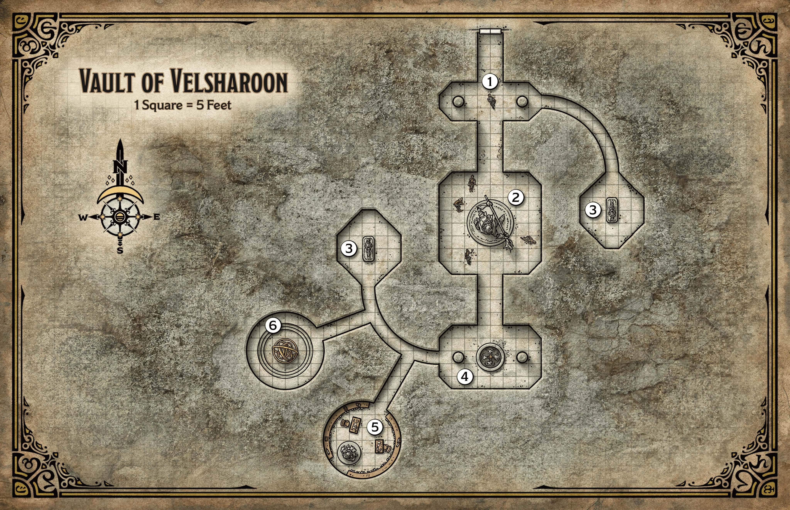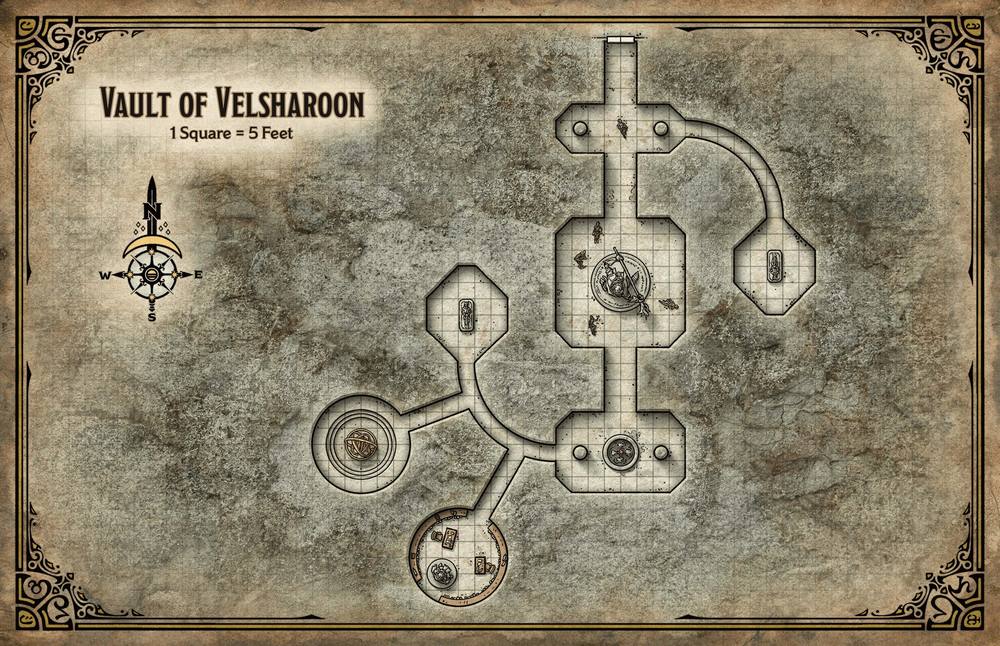
### Dragon Orb

- **A Faction (Cult of the Dragon) Adventure for Level 9 Characters**

*Retrieve an Artifact for the Cult of the Dragon*.

- **Situation.** A Cult of the Dragon cell believes the *Orb of Damara* lies in the trove of Cylrotanth, an **Adult Copper Dragon** who dwells in the southern Serpent Hills.
- **Hook.** Human Dragonfang Dain Romelin (Medium, Chaotic Evil **Cultist Fanatic**) hires the characters to retrieve the orb from Cylrotanth's lair and bring it to him in Soubar, northwest of Triel along the Trade Way near Boareskyr Bridge. Dain claims he has heard the dragon is huge and has reddish scales; he doesn't admit Cylrotanth is a copper dragon. He offers the party 2,000 GP to complete this mission on the cult's behalf, and he pays half up front.

#### Encounters

The adventure consists of these encounters.

***Travel to the Lair.*** Cylrotanth's lair lies 135 miles north of Soubar. Each day, use the appropriate encounter below:

  - **Day 1.** Wrathful riders (five **Flaming Skeletons** riding **Nightmares**) burst from the Fields of the Dead to reenact a fateful charge, targeting the characters.
  - **Day 2.** Three **Trolls** try to make a meal of the party.
  - **Day 3.** Two **Young Green Dragons** stalk the party through the Forest of Wyrms.
  - **Day 4.** A **Grick Ancient** ambushes the characters, and six **Gricks** drop from trees to join in.
  - **Day 5.** Near Thlohtzin, a **Yuan-ti Abomination** and four **Yuan-ti Malisons (Type 1)** try to take the party prisoner.
  - **Day 6.** Cylrotanth's friends—Kergan, a **Cyclops Oracle**, and Serteus, a **Cyclops Sentry**—confront the characters with foreknowledge of their intent. They are Indifferent but defend themselves if the characters fight them.

***Cylrotanth's Lair.*** Cylrotanth welcomes the group to his lair and asks if they've met his cyclops friends (see above). He becomes Hostile if he learns the group harmed the giants, but he doesn't fight. He's willing to trade for his orb, which is a *Crystal Ball* worth 40,000 GP.

***Cult Ambush.*** Assuming a fight with the dragon has weakened the group, Dain betrays the party in an attempt to take the orb for himself. He's accompanied by four **Tough Bosses**, and they ambush the characters outside Cylrotanth's lair. If the characters befriended the dragon, Cylrotanth helps subdue these attackers.

***Conclusion.*** If parting on good terms, Cylrotanth considers the characters new friends. He rewards them for defeating Dain, giving them the Crystal Ball. If they traded him for it, he returns whatever they traded to him. If the party turns the orb over to the Cult of the Dragon, each character's Renown Score with the Cult of the Dragon increases by 1.

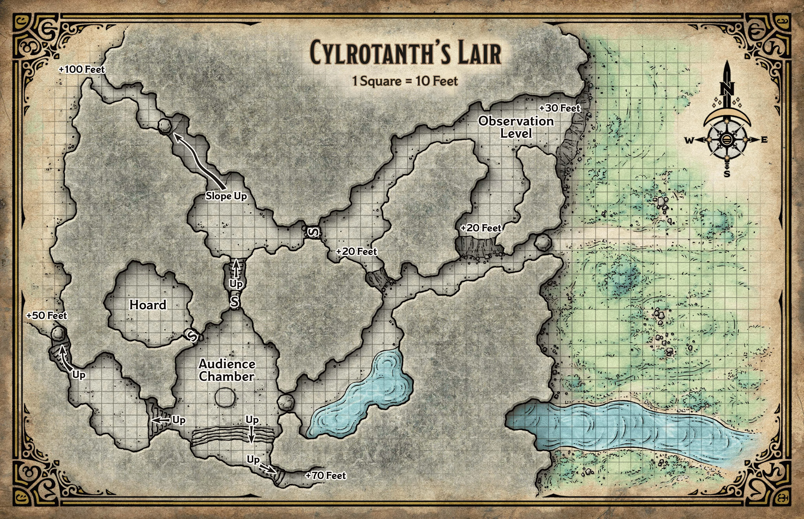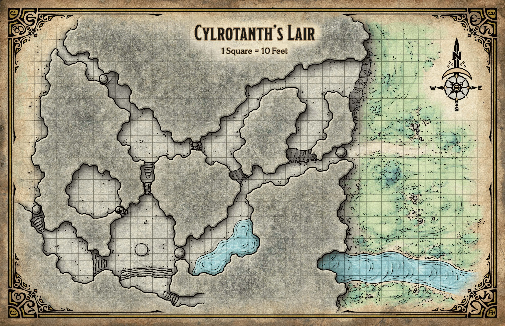
### Echoes of the Shaking Plague

- **A Region (Heartlands) Adventure for Level 9 Characters**

*Work alongside Scardale's criminal gangs.*

- **Situation.** An outbreak of the Shaking Plague is spreading among the docks and slums of Scardale Town. An aspiring drug lord, Dyan Komar, accidentally reawakened the plague while conducting alchemical experiments.
- **Hook.** A local healer, Kestra Alara, pleads with the characters to meet with the town's three criminal syndicates and enlist their help to locate the source of the plague. She offers 5,000 GP for the party's assistance.

#### Encounters

The adventure consists of these encounters.

***Meeting of the Minds.*** Kestra has arranged a meeting with syndicate leaders at dusk at a tavern called The Rotting Gull.

- **Boss Sneed** (Medium, Neutral Evil **Bandit Crime Lord**) is the human leader of the Shaker Gang. He's looking for an anniversary gift for his wife, an **Archpriest** of Tymora. If the characters can provide a suitable gift, he will help them.
- **Finchley** (Small, Chaotic Evil **Tough Boss**) is the halfling leader of the Dancers. He respects fighting ability and challenges one of the characters to non-deadly single combat. If the character wins and doesn't kill Finchley, Finchley and his gang will help them.
- **Walenna Eventide** (Medium, Chaotic Neutral **Pirate Captain**) is the wood elf leader of the Stallions. The *Sea Stallion* is in need of repairs. If the characters promise to make it seaworthy again, she will help them. Repairing the ship requires 5,000 GP. Alternatively, characters can do the work in 100 days, divided by the number of characters working on the repairs.

See "Scardale Town" in chapter 2 for more information on these individuals and their followers.

***Finding the Source.*** The source of the plague is a filthy warehouse in the harbor district. It takes 3d4 days of searching to find the warehouse. Reduce this by 1d4 for every gang the party recruits; if they recruit all three gangs, they find the warehouse before sunrise. Your players might come up with novel strategies to quickly find the source of the plague.

***The Warehouse.*** Use the map below for the warehouse, which contains Dyan's alchemy lab. Characters searching the lab are exposed to the Shaking Plague (see chapter 2). Four **Revenants**, victims of Dyan's alchemical testing, wander the warehouse and fight intruders. Within each of the southern labs lurks a **Violet Fungus Necrohulk**. When either of the necrohulks is disturbed, it begins combat, waking the other, which bursts from the room it's in.

***Conclusion.*** Burning the warehouse to the ground eliminates the source of the plague, and the town slowly recovers. Each gang leader recruited by the party gives the characters an Uncommon magic item as thanks for saving the town.

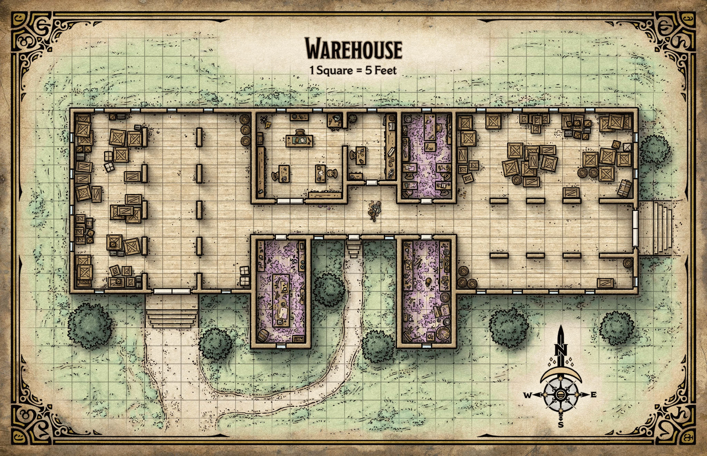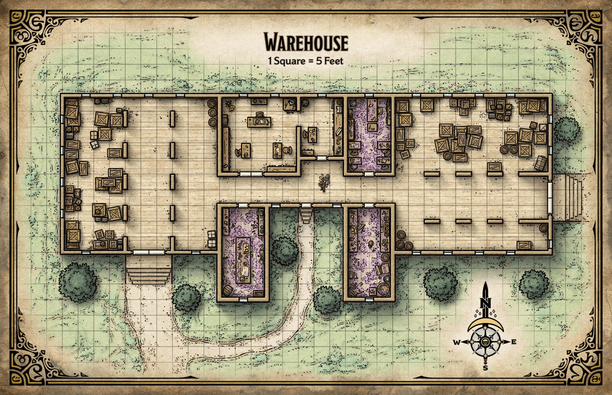
### The Ashen Faithful

- **A Deity (Bane) Adventure for Level 10 Characters**

*Stop an execution in a gladiatorial arena.*

- **Situation.** A group of Banites called the Ashen Faithful have seized the gladiatorial arena in Hillsfar to conduct public trials, executing those they deem unworthy or corrupt. Many innocent people are caught in the crisis.
- **Hook.** Hillsfar's senators summon the characters and ask them to infiltrate the arena and disrupt the upcoming execution of one of their own, Councilor Marellia.

#### Encounters

The adventure consists of these encounters.

***At the Senate.*** Senator Arnulf (Medium, Lawful Neutral **Noble**), explains the Ashen Faithful plan to burn Councilor Marellia alive at sunset. The characters have 4 hours to prepare. Arnulf intends to stage a fake assault on the Banites surrounding the arena, drawing away defenders and creating a window for the characters to infiltrate the arena.

***Infiltrate the Arena.*** The Ashen Faithful control the region around the arena. If the party is caught trying to infiltrate, they face a **Guard Captain**, three **Warrior Veterans**, a **Priest**, and a rooftop **Assassin**.

***Disrupt the Execution.*** Ashen Faithful are preparing to burn Councilor Marellia and eight other prisoners (Medium **Nobles**), at the stake. Use the arena map below. A human, Faenzel the Exalted Flame (Medium, Lawful Evil **Cultist Hierophant**), exhorts followers in the stands from the northern skybox as two **Gladiators** prepare prisoners in the middle of the arena. Three **Bearded Devils** also stand guard in the arena. If the party defeats the enemies on the arena floor, Faenzel intervenes, joined by two more **Gladiators** from beneath the arena.

***Arena Dangers.*** The arena floor has six spiked pits (see chapter 3 of the *Dungeon Master's Guide*), and the wall is studded with jagged iron spikes that prevent creatures from climbing out. Casks of lamp oil and wooden kindling are staged around the prisoners.

***Escape with Councilor Marellia.*** Should the party flee with Marellia and other prisoners, cultists in another skybox complete a ritual summoning an **Ice Devil** that chases them through the city.

***Conclusion.*** If the characters successfully rescue Councilor Marellia, she rewards them with jeweled treasures worth a total of 3,000 GP.

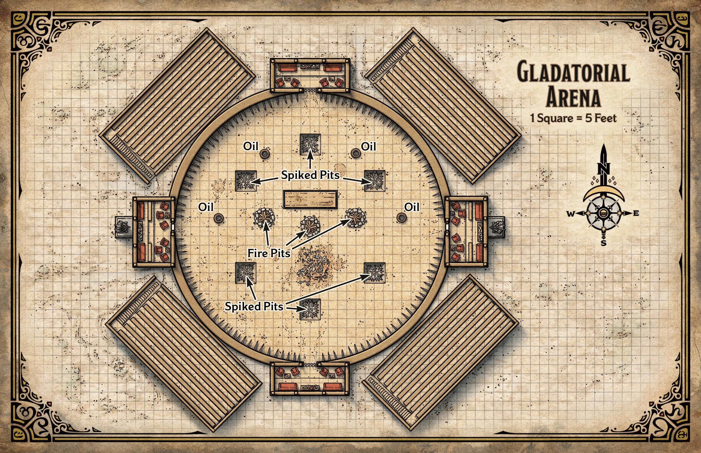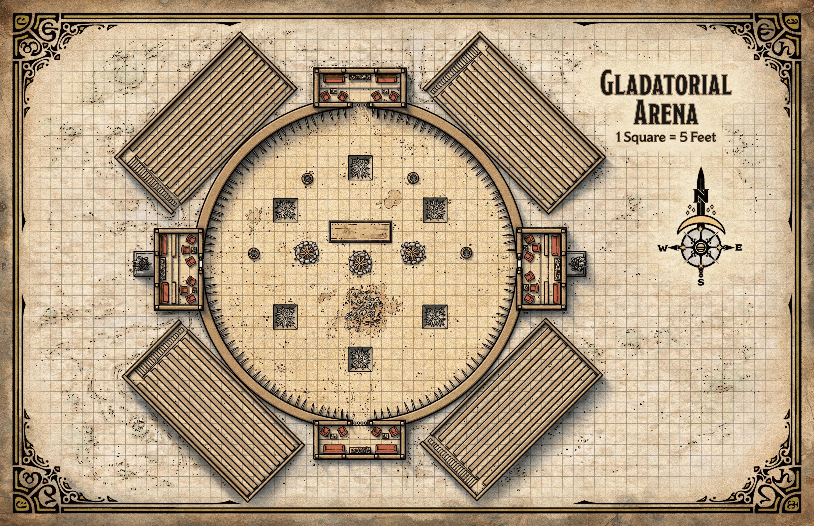
### Silk and Suffering

- **A Deity (Lolth) Adventure for Level 10 Characters**

*Brave the malicious cruelty of Lolth.*

- **Situation.** The Silken Stewards, a sect of fanatical Lolth worshipers (see *Forgotten Realms: Heroes of Faerûn*), is kidnapping key figures from Neverwinter for ritual sacrifice as part of a broader campaign to destabilize the city.
- **Hook.** The Lord Protector summons the characters to stop the disappearances before a panic sets in, promising 8,000 GP for their assistance.

#### Encounters

The adventure consists of these encounters.

***The Spider's Path.*** The drow are using tunnels that lead up under Neverwinter's cemetery. As the party follows this route into the Underdark, they navigate a labyrinth of caverns crisscrossed with thick webs. The priests took pains to train a **Roper** that hides among the webs. Packs of 2d6 + 1 **Phase Spiders** are also drawn to motion on the webs. Eventually, the characters reach the Fane of Fecundity; use the map below.

***Chapel.*** This cold, beautiful room is decorated with iconography sacred to Lolth, two intricately carved statues, and luxurious tapestries. Entering the northern part of the room without praying the correct prayer of obeisance causes two **Yochlols** to burst from the two statues and begin combat.

***Vestry.*** Two **Drow Priestesses of Lolth** meditate in this room and become Hostile if disturbed. A *Cloak of Arachnida* hangs in a locked armoire.

***Ritual Chamber.*** Three **Driders** use this room for magic rituals, occasionally visiting the nursery and spider den.

***Trapped Hall.*** A lurid painting of Lolth in the Demonweb Pits hangs here. Passing by the painting without offering the appropriate prayer to Lolth causes the painting to cast the *Disintegrate* spell (DC 15) targeting the closest creature. Open jars containing the ashes of prior victims and arranged before the painting hint at the trap.

***Nursery.*** Webs fill this cave, and pulsing, wet egg sacs hanging to the north. Touching the webs alerts two **Driders** who crawl up from the ritual chamber (below) and investigate.

***Birthing Chamber.*** This domed cavern sports a massive statue of Lolth in her spider form. Arrayed before the statue like the legs of a spider are eight nurturing cages, occupied by Neverwinter citizens kept as food for spiderlings who crawl all over them. Hashtuth, a drow **Vampire** and priest of Lolth, monitors the victims as the spiders feed. She is assisted by two **Helmed Horrors**, each adorned with eight glowing ruby eyes. The captives are still alive and can be rescued.

***Spider Den.*** 3d6 **Giant Spiders** lair here. They threaten the characters but flee and hide if attacked.

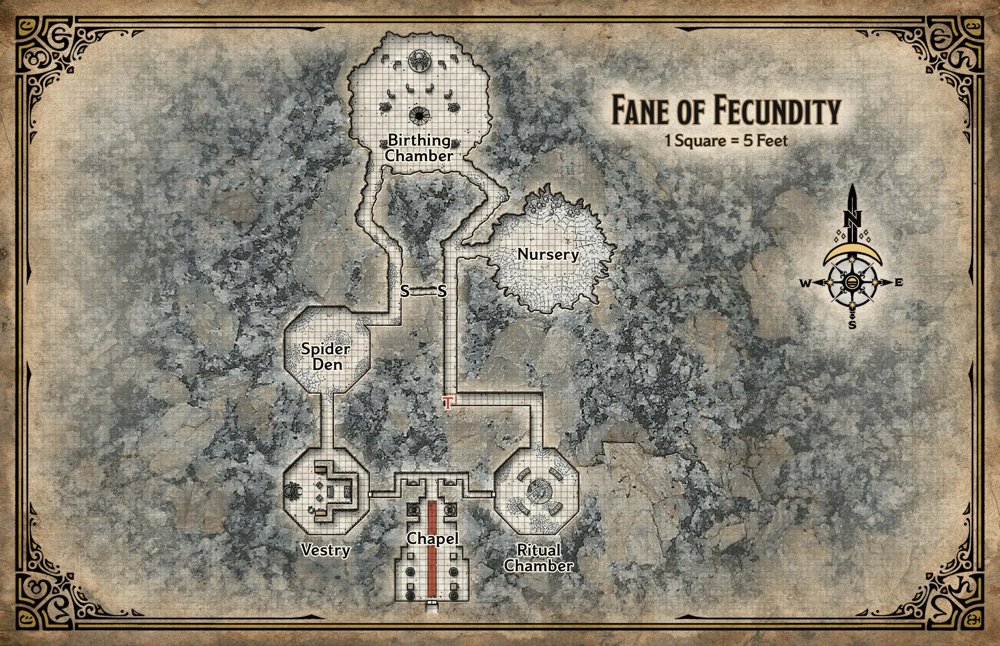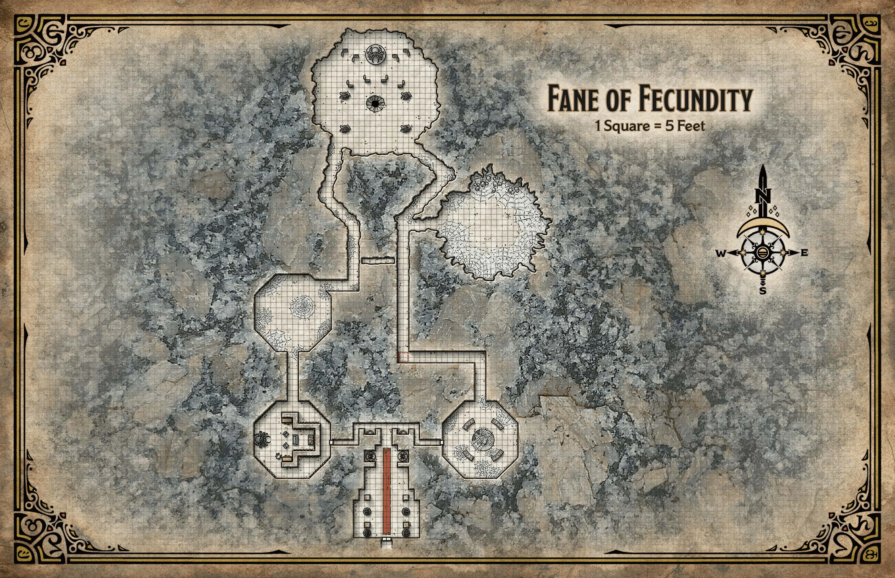
### The Flying Fortress

- **A Faction (Purple Dragon Knights) Adventure for Level 11 Characters**

*Intercept the Cult of the Dragon in an aerial battle*.

- **Situation.** Cultists of the Dragon have taken control of a cloud giant's flying castle.
- **Hook.** Cormyr's queen asks the characters to lead the attack on this flying menace and offers **Wyvern** mounts to those who need one.

#### Encounters

Most of this adventure takes place in the sky.

***Flying toward Doom.*** The flying fortress's trail of carnage is easy to track. As the characters approach, a patrol of four cult **Gladiators** riding **Wyverns** intercepts them. One of the gladiators carries a map showing the fortress with a red heart-shaped symbol inside the central hill.

***Veil of Storms.*** The fortress is protected by an arcane storm. When they approach the fortress, characters and mounts make a DC 15 Dexterity saving throw, taking 22 (4d10) Bludgeoning damage and 21 (6d6) Lightning damage on a failed save or half as much damage on a successful one.

***Fight in the Air.*** Use the Flying Fortress map below. Four **Young Black Dragons** protect the fortress by air. The fortress includes the following features:

  - **Caves.** Two caves provide entry to the fortress's heart (see below).
  - **Gatehouses.** A Huge iron portcullis blocks entry and exit of each gatehouse.
  - **Keep.** The fortress is steered by an evil **Archmage** in the keep. The keep's walls are patrolled by five **Half-Dragons**. If the archmage is defeated, the fortress slows and descends, reaching the ground safely in 10 minutes.
  - **Maze.** A cluster of buildings provides an obstacle course for flying characters. Use the chase rules in *chapter 3* of the *Dungeon Master's Guide* to adjudicate characters in the maze.
  - **Towers.** Cult archers crowd each tower. When an enemy of the cult moves within 40 feet of a tower for the first time on a turn or ends its turn there, it must succeed on a DC 13 Dexterity saving throw or take 14 (4d6) Piercing damage. A creature makes this save only once per turn. If a character lands on or attacks a tower, archers there abandon their post.
  - **Tunnel.** The enclosed tunnel can be entered only through gatehouses at either end. It makes an excellent place for melee combat with flying foes.

***The Heart.*** Characters passing through the caves enter a vast, dark cavern housing the magical beating heart of the fortress. The heart (AC 13, HP 5) is protected by a **Shadow Dragon** named Gloamstalker. If the heart is destroyed, the castle plummets from the sky, crashing in 1 minute.

***Conclusion.*** When the archmage is defeated or the heart destroyed, the surviving cultists flee. The queen gives the characters land and noble titles in a grand ceremony. Each character's Renown Score with the Purple Dragon Knights increases by 1.

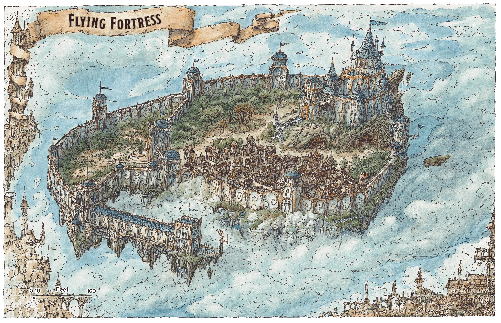
### The Foehammer Horn

- **A Deity (Tempus) Adventure for Level 11 Characters**

*Recover a relic sacred to the storm god.*

- **Situation.** The Foehammer Horn , a relic of Tempus, has surfaced in a tomb in the Fields of the Dead. Tempus has sent visions of the relic to various individuals, prompting them to race to the site and compete to claim the horn.
- **Hook.** A character who reveres Tempus dreams of taking up the Foehammer Horn , waking with clear knowledge of the relic's location.

#### Encounters

Use the *Barrow Crypt map* in appendix B of the *Dungeon Master's Guide*. On level 1, remove the leftmost stairway leading down. Level 2 consists only of the rightmost stairs, the chamber directly north of these stairs, and the connecting corridor.

***Battle Circle.*** Standing stones encircling the barrow bear pictograms of battle and of Tempus. Within the circle sprawl the corpses of slain warriors. Various survivors, devotees of Tempus, have just discovered the secret entrance to the tomb. All these individuals are Chaotic Neutral and Medium. They include Ysold, a human (**Warrior Commander**); Hisnix, a dwarf (**Berserker Commander**); and Elegnos, an elf knight (use the **Githyanki Knight** stat block, but change the creature type to Humanoid). They are allied and fight interlopers. If not dealt with here, these foes eventually follow the party into the tomb. Ysold has already found the secret door among the stones, and it lies open.

***Doors.*** Complex locks (1 minute to pick) of Superior quality (DC 20) seal all doors in the tomb. Forcing open a door requires a successful DC 20 Strength (Athletics) check as an action.

***Side Entrance.*** Long ago, tomb raiders carved two holes in the barrow's western side. The raiders' remains can still be seen. They were slain by two **Stone Golems** that resemble Tempus and guard this entrance.

***Trooper Hall.*** The walls of the chamber surrounded by seven tombs depict assembled troops, each soldier with a unique face. The *Glyph of Warding* spell has been cast on the south and west entrances to this chamber. A rune is triggered if a creature moves through that entrance. Both glyphs use the Explosive Rune option, one dealing Lightning damage and the other Thunder. After a rune is triggered, seven **Helmed Horrors** plastered into the walls burst free and ambush intruders.

***Clangor Halls.*** Wall carvings depict the fury of war in the two eastern chambers and stairs down to level 2. When trespassers enter, a war horn sounds, red light illuminates the area, sounds of warfare erupt, and thirteen guardian spirits manifest from burial niches. Four of these spirits have the stat block of a **Gladiator**, and nine have the stat block of a **Berserker**, but all are Celestials instead of Humanoids.

When the spirits begin combat, each character must succeed on a DC 15 Wisdom saving throw or enter a battle fury. Characters in a battle fury have Advantage on attack rolls using Strength, but attack rolls against them have Advantage, and the character can't take the Disengage or Dodge actions. At the end of their turn, characters in a battle fury repeat the saving throw, ending the fury on a success. When the last spirit is defeated, any battle fury affecting a character ends.

***Pillared Hall.*** Double doors seal this hall on the east and west. Within, wall carvings portray warriors in celebration. A simple altar to Tempus occupies a long southern niche, while narrower alcoves hold old crates and barrels of military rations long turned to dust. A character who prays to Tempus at the altar can use it to cast *Heroes' Feast* without spell components. Once used in this way, the altar becomes nonmagical.

***Foehammer Hall.*** Stairs descend to a single hall with two supporting columns. Niches line the walls, which depict Tempus battling various foes. Shelves in the niches hold broken implements of war. When all the characters have entered, a horn sounds, the northern wall cracks, and an avatar of Tempus charges from it. Use the **Questing Knight** stat block for the avatar, changing creature type to Celestial and any Radiant damage to Fire damage. When the avatar drops to 0 Hit Points, it rises again as a **Berserker Commander** (change its creature type to Celestial) with all its Hit Points and continues to fight. If defeated again, it is destroyed.

***Conclusion.*** With the avatar's defeat, the crack in the northern wall crumbles, revealing the Foehammer Horn: a bronze *Horn of Valhalla*.

### The Blight on Soubar

- **A High Magic Adventure for Level 12 Characters**

*End an outbreak of deadly plague.*

- **Situation.** Sewer Plague (see chapter 3 of the *Dungeon Master's Guide*) has broken out in Soubar, near Baldur's Gate. Powerful magic is necessary to counteract the magical contagion.
- **Hook.** Soubar's mayor hires the characters to assist the elf Stormshade (Medium **Druid**), who has devised a cure for the contagion.

#### Encounters

Characters must resolve these encounters.

***Collect Night Holly.*** To perform the cleansing rites, Stormshade needs the consecrated ashes of a branch of night holly. Night holly grows in a thicket in the Fields of the Dead; it resembles mundane holly, but under bright moonlight, its leaves glitter like stars in the night sky. Eight **Vampire Spawn** roam the thicket and prey on the party.

Unfortunately, on the night the characters arrive at the thicket, the moon is obscured by clouds. The *Moonbeam* and *Fount of Moonlight* spells can be used to bring moonlight to the overcast thicket. Otherwise, a character can identify night holly by taking a Study action and succeeding on a DC 15 Intelligence (Nature) check.

***Burn the Holly in Sacred Fire.*** Once cut, the night holly must be burned in a sacred brazier at a nearby abandoned temple before dawn. The holly takes 1 hour to burn into white ash, but an **Adult Black Dragon** now lairs in the temple. Use the *Dragon's Lair map* from appendix B in the Dungeon Master's Guide for the temple; the brazier is on level 3.

***Perform the Rites.*** To complete the cleansing rites, the holly ashes must be sprinkled in a well in Soubar. Use the *Farmstead map* from appendix B of the Dungeon Master's Guide.

As soon as the ashes are dispersed, at least three creatures must recite magical words in Druidic around the well for 1 minute; this requires the creatures to maintain Concentration for the duration. Stormshade and four villagers (**Commoners**) join the characters in reciting the words.

When the ritual begins, six **Vrocks** emerge from the well and begin combat. As long as at least three participants maintain Concentration for the ritual's full duration, the ritual is a success and the Sewer Plague is stopped.

### Mystery of Myth Rodarnum

- **A High Magic Adventure for Level 12 Characters**

*Repair an ancient mythal.*

- **Situation.** Miners have unearthed the ruins of Myth Rodarnum, an ancient elven settlement deep under the village of Snowmantle in Daggerdale (or another settlement of your choice). Among the ruins is a circle of power connected to a now-dormant mythal. If reactivated, the mythal could protect the village with powerful magic.
- **Hook.** A **Guardian Naga** named Lendroscalipos finds the characters and asks them to uncover the secrets of the mythal in Myth Rodarnum's ruins.

#### Encounters

Characters must resolve these encounters.

***Commune with the Mythal.*** A creature can commune with the circle of power as a Magic action. The creature must succeed on a DC 15 Wisdom saving throw or take 16 (3d10) Psychic damage.

***Face the Ghouls.*** When communed with, the circle of power thrums loudly, attracting three **Dire Worgs** who immediately fight the characters.

***Solve the Mythal's Riddle.*** A creature that communes with the mythal hears the following riddle in a whispered voice:

>*The might of the mythal draws from magic items four:*
>
>*The first from the waters, the second can pour,*
>
>*The third carries others, the fourth, someone wore.*
>
>*Offer these relics and let light shine on the ring,*
>
>*Then hide from the glory. Forth from the circle spring.*
>

***Offer Magic Items.*** When four suitable Uncommon or rarer magic items are placed in the circle of power, the circle glows dimly. What items meet the riddle's criteria, exactly, is up to you. For example, these items could work: a *Trident of Fish Command*, a *Decanter of Endless Water*, a *Bag of Holding*, and a suit of *Adamantine Armor*.

***Illuminate the Circle.*** "Let light shine on the ring" hints that the circle of power must be exposed to sunlight, such as that from the *Daylight* spell.

***Find Cover.*** Once the riddle has been solved, the thrumming reaches a deafening volume. After 1 minute, a 50-foot-wide, 500-foot-high Cylinder of light erupts from the circle of power. Each creature in the Cylinder makes a DC 15 Dexterity saving throw, taking 35 (10d6) Radiant damage on a failed save or half as much damage on a successful one.

***The Mythal.*** The effects of the reawakened mythal are up to you to determine.

### A Restless Eternity

- **A Region (Arcane Empires) Adventure for Level 12 Characters**

*Learn the secrets of Rashemen's High Country*.

- **Situation.** A cult devoted to Cyric is traveling the High Country of Rashemen, disturbing ancient monoliths that imprison powerful demons. Hathrans of Rashemen keep watch on these monoliths, but the cultists are beyond their power.
- **Hook.** Thulra, a hathran elder, offers the party 6,000 GP to travel to three monoliths, inspect them for damage, and find the cultists. She provides the party with a map.

#### Encounters

Use the map below as the characters travel through the High Country to the various monoliths. In addition to the encounters detailed below, you can select hexes on the map for other encounters of your own design. As the characters travel through these hexes, they'll discover the encounters you created.

***High Country Encounters.*** Every day of travel, roll once on the table below or select an encounter, rerolling duplicates.

| 1d8 | Encounter                                                                                                                                                                                                                                                                                                                                                                                                        |
|:---:|------------------------------------------------------------------------------------------------------------------------------------------------------------------------------------------------------------------------------------------------------------------------------------------------------------------------------------------------------------------------------------------------------------------|
|  1  | Kissethkashaan is on the hunt. See "Kissethkashaan's Lair" below.                                                                                                                                                                                                                                                                                                                                                |
|  2  | A band of 2d4 **Kobold Warriors** led by a white **Half-Dragon** spots the party. The group questions the characters, then retreats to warn Kissethkashaan.                                                                                                                                                                                                                                                      |
|  3  | A pack of four **Winter Wolves** led by a **Dire Worg** notice the party and follow, ambushing the characters when they are vulnerable.                                                                                                                                                                                                                                                                          |
|  4  | Eight **Wraiths**, shades of dead Tuigan raiders, haunt the party by night.                                                                                                                                                                                                                                                                                                                                      |
|  5  | A **Hobgoblin Warlord** leads a small army of 100 **Hobgoblin Warriors** through the High Country toward Thay, where they are to be employed as mercenaries. The warlord asks the party for news and doesn't initiate violence. If the characters fight, use the rules for mobs in *chapter 3* of the *Dungeon Master's Guide*, dividing the hobgoblins into a number of mobs equal to the number of characters. |
|  6  | Two **Frost Giants** seek to capture Kissethkashaan. If the party agrees to help, the giants share the dragon's hoard.                                                                                                                                                                                                                                                                                           |
|  7  | Storms blow in from the west. Heavy precipitation and strong winds (see *chapter 3* of the Dungeon Master's Guide ) last 1d4 days.                                                                                                                                                                                                                                                                               |
|  8  | The party crosses paths with the Cyric cultists. See "Cyric Cultists" below.                                                                                                                                                                                                                                                                                                                                     |

***Kissethkashaan's Lair.*** Kissethkashaan (**Adult White Dragon**) lives atop a tall mountain peak shrouded in perpetual snow. He is attended by four white **Half-Dragons** and seeks to avoid conflict but defends his lair if necessary.

***Cyric Cultists.*** The cultists move from one monolith to the next, damaging each to release Fiends trapped within. A **Cultist Hierophant** leads two **Fiend Cultists** and eight **Gnoll Fangs of Yeenoghu**. They fight anyone who threatens their mission.

***Monoliths.*** When the party reaches their first monolith, they find it destroyed and four **Vrocks** dancing amid the rubble. At the second monolith, a cult **Mage** and her two **Assassin** bodyguards survey the stone for the cult, but it isn't yet damaged. If the party hasn't encountered the Cyric Cultists previously, they find the cultists at the third monolith performing a ritual around the stone while the gnolls keep guard. The ritual takes 10 minutes to complete. If the cultists aren't interrupted, the monolith shatters and a **Goristro** bursts forth.

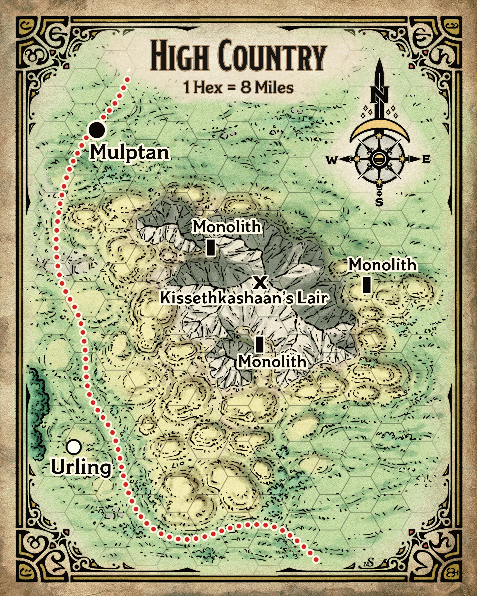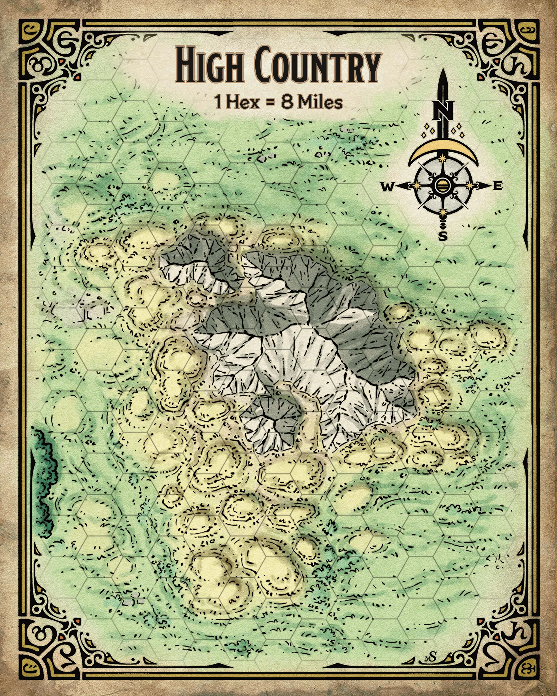
### Dread March of the Bone Titan

- **A Deity (Kelemvor) Adventure for Level 13 Characters**

*Sabotage a colossal necromantic superweapon.*

- **Situation.** A massive, walking necropolis called the Bone Titan has emerged from the Trollmoors. Created by an enterprising **Archmage** named Kryzzik the Profane, this gargantuan titan of crypt stone, bone, and corpses marches inexorably toward the town of Triboar.
- **Hook.** The Knights of the Eternal Order (see *Forgotten Realms: Heroes of Faerûn*) call on the party to infiltrate the Bone Titan and destroy whatever controls it while the knights attempt to slow it down. The knights pledge a reward of 25,000 GP for the party's help.

#### Encounters

The adventure consists of these encounters.

***March of Desolation.*** Characters approaching the Bone Titan see ruined villages, dead forests, and cursed land empty of living creatures.

***Climb the Colossus.*** Use the Bone Titan map below for this and subsequent encounters. The party must find a way into the Bone Titan. The interior is warded against teleportation, but entry points at the hips or arms can be reached by flight or by climbing. Eight **Vampire Spawn** crawl around the titan's exterior, defending it from intruders. The necromantic magic of the Bone Titan protects the vampires, preventing them from being affected by sunlight.

***Hips.*** Six **Flesh Golems** guard barrels of combustible necrotic fuel stored in the hips. Each barrel has AC 15, HP 25, and Vulnerability to Fire damage. Destroying all the barrels halts the Bone Titan after 1d10 minutes but doesn't destroy it.

***Torso.*** Six rope-and-pulley systems of muscle, tendon, and bone (each AC 11, HP 27) supply power to the titan. Destroying them leaves the titan unable to walk or lift its arms. The torso is defended by three **Death Knight Aspirants**.

***Arms.*** The titan's arms boast cannons firing warheads of necrotic energy. Each cannon is operated by five **Death Cultists**. Characters who have proficiency in the Arcana or Religion skill can detonate a warhead. Detonating one warhead causes a chain reaction with other warheads, obliterating the arm the warhead is housed in; creatures in the arm when the warhead explodes makes a DC 15 Dexterity saving throw, taking 12d6 Fire damage on a failed save or half as much damage on a successful one.

***Head.*** Kryzzik steers the Bone Titan from a throne in the head. If the characters stop the titan's progress, he flees.

***Conclusion.*** Once the Bone Titan's march is stopped and Kryzzik abandons it, its necromantic aura fades and nature takes over. Within months, the skeletal frame of the titan becomes home to birds and other animals, and locals plunder it for building stone.

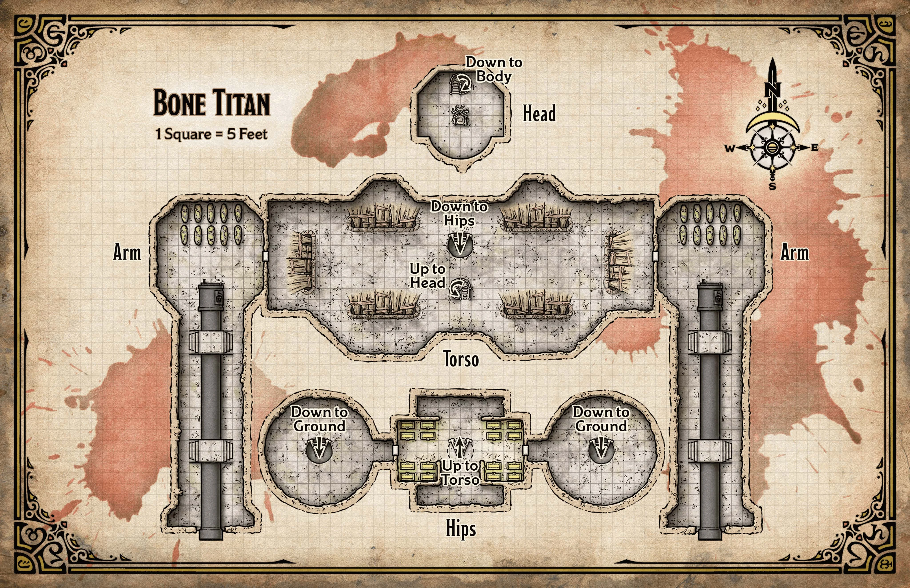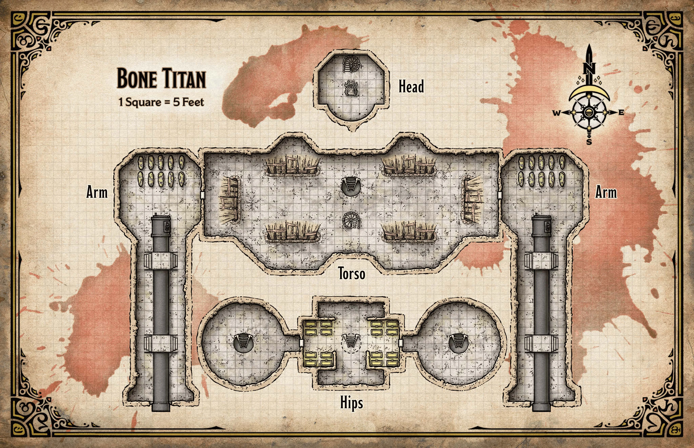
### Heart of Fire

- **A Deity (Torm) Adventure for Level 13 Characters**

*Recover a sword from a dragon's lair.*

- **Situation.** Chalsembyr's Heart , a sentient *Holy Avenger Greatsword* sacred to Torm, has been located in the hoard of Khrangyrdis, an **Adult Red Dragon** and worshiper of Tiamat. Khran, as the dragon is often called, lairs near Ormpur. Complicating matters, Khran wears an *Amulet of Proof against Detection and Location*. Her lair is protected by a *Forbiddance* spell that damages Celestials.
- **Hook.** Zimrir Chay (Medium **Archpriest**), a human devoted to Torm, asks the characters to acquire the sword from Khran. While the party could negotiate, he prefers that the dragon be destroyed, freeing the region from her sway. If the characters agree to slay the creature, Zimrir provides each character with a *Potion of Healing* (supreme) and a *Potion of Fire Resistance*.

#### Encounters

The adventure consists of these encounters.

***Saffron Slayers.*** The people of Ormpur know the location of Khran's lair, east across the Shaar in the Dun Hills. But the dragon has countless well-paid eyes and ears in the city, so the party's fame and purpose quickly spread. Elite forces of a gang in Khran's employ—a **Bandit Crime Lord**, a **Spy Master**, and two **Assassins**—ambush the characters and urge them to leave Ormpur for good.

***Burning Shaar.*** More of Khran's allies hear of the party and their quest, pursuing them into the Shaar and then the Dun Hills as the characters approach the lair. The elf Naedrin (Medium **Cultist Hierophant**) flies in on the back of Aphusso, a **Young Red Dragon**. Naedrin talks first, using his magic to turn would-be dragonslayers from their path. Failing that, Naedrin calls forth two **Fire Elementals** and initiates combat. If the battle takes place in the Shaar, an inferno (see chapter 3 of the *Dungeon Master's Guide*) results.

***Ash Lands.*** Khran greets the party from a hilltop the party must pass. If battle ensues, she leaves as soon as she can, with a parting invitation to join her later for a fine meal.

***Khrangyrdis's Lair.*** Use the *Dragon Lair map* in appendix B of the Dungeon Master's Guide. This structure is an old temple to Tiamat, destroyed during the Spellplague. Khran prefers level 3, but she doesn't want her servants slain and fights intruders when she becomes aware of them. Khran's lair is further detailed below:

  - **Level 1.** Bizarre yet elegant formations of sharp, melted stone make up the scorched ruins that top Khran's hill. An unscathed shrine to Tiamat remains in the northeastern corner, outside two stone doors, each with a **Salamander** guard. These guards allow visitors to enter the site. Beyond the doors, a **Salamander Inferno Master** tends an ancient pool of molten stone for Khran's enjoyment. Once the party is inside, the master and guards ambush them.
  - **Level 2.** Walls and pillars carved with images extolling the glory of the Dragon Queen make up this firelit level. Four red **Half-Dragons** live and work here, guided by a **Fiend Cultist**. These loyal minions fight intruders.
  - **Level 3.** Khran dwells and stores her hoard, including Chalsembyr's Heart , here.

***Conclusion.*** Tormtars celebrate characters who return Chalsembyr's Heart to the House of the Hand. Priests offer the sword to a character who serves Torm and is willing to search for the lost realm of Chalsembyr, which Torm ruled as a mortal.

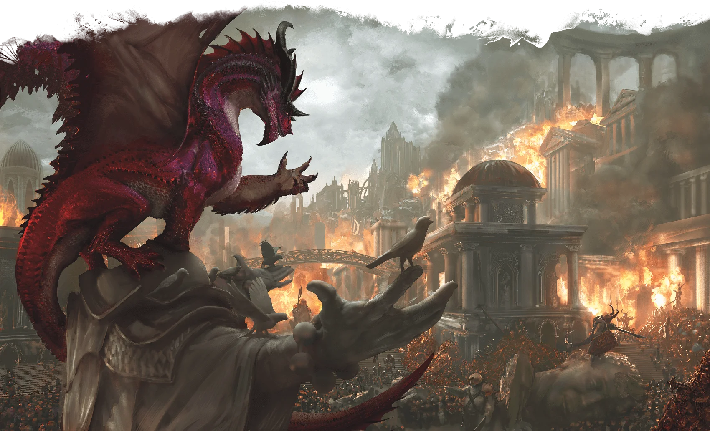

------

# Chapter 2: The Dalelands

>>The Dalelands are broad forest vales with rolling farmlands, linked by narrow trade roads running through beautiful woods. Blessed with fertile soil and a temperate climate (but harsh winters), the Dalelands are the breadbasket of the Heartlands. The independent spirit of Dalefolk balanced with their centuries of cooperation with the elves of Cormanthor have made the Dalelands the home of many of Faerûn's greatest heroes.
>>
>>The oldest dales were founded over a thousand years ago by refugees from war-torn regions to the east and south. They found the immense, primeval forest of Cormanthor, home to an ancient elf civilization. Eltargrim, leader of the elves at the time, created the Dales Compact: an agreement that stated in return for promising not to cut deeper into the forest, the Dalefolk were allowed to settle around the forest's edges or in places where the great trees didn't grow. Spellcasters from both sides worked together to raise the Standing Stone in the center of Cormanthor as a symbol of unity. Elves opened the city of Myth Drannor to the Dalefolk, and a golden age flourished for centuries.
>>
>>Now, Myth Drannor is abandoned, but the Dalefolk still keep the Dales Compact. Eleven dales exist today, each with its own territory, government (or lack of it), militia, trading pacts, ambitions, and character. But dales come and go, their fortunes waxing and waning in the face of foreign invasion, internal rivalries, and simple bad luck.
>>

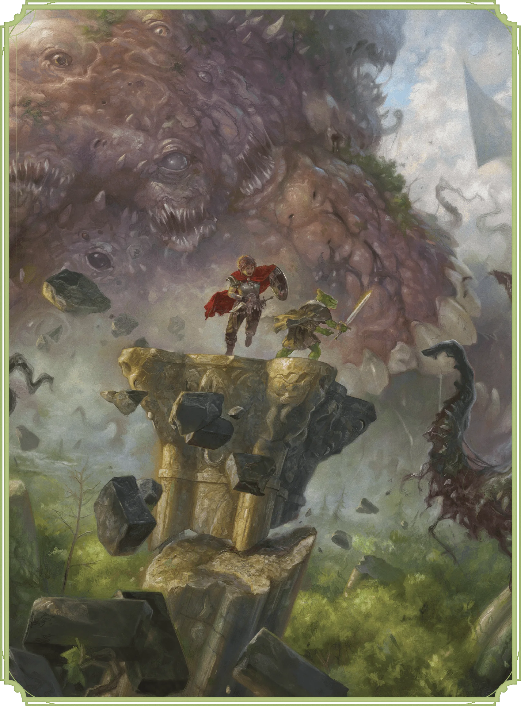

## Dalelands Campaigns

The Dalelands host classic fantasy adventures and stories of brave families defending their homes on a dangerous frontier. In the Dalelands, the ancient elven city of Myth Drannor—filled with danger and mysterious magic—is never far away.

### Classic Fantasy Adventure

The Dalelands encourages adventure in the classic heroic fantasy tradition. Here, goblin bandits ride worgs out of the forest to raid villages and towns. Dragons emerge from mountaintop lairs to hunt for food and plunder. Every village has an inn or tavern where a retired adventurer tells stories about the treasure that got away. Greedy empires threaten the borders, evil mercenaries scheme in the shadows, and any cellar could have a door to the Underdark.

### A Mysterious Frontier

Frontiers might seem hard to find in the Forgotten Realms, where every acre of land has been home to multiple civilizations over the millennia. The Dalelands offer can-do folk the opportunity to live in a land with few laws, where self-sufficiency is vital. But immigrants to the Dalelands must build their homes in the shadow of an ancient and primeval forest filled with monsters and long-forgotten magic. Life in the Dalelands is hard, but the people here are determined to defend it.

### Myth Drannor

The ancient elven city of Myth Drannor lies at the heart of the Dalelands. Once a magical metropolis, Myth Drannor was abandoned centuries ago, and the magical protection known as a mythal that lies at its heart is failing. Myth Drannor is a megadungeon: an adventure site so large that no single party of adventurers could hope to explore it all. Instead, adventurers gather information on the ruined city, explore a region until resources run out, and then return home to rest and sell their loot to fund their next round of exploration.

> ##### Alias
>
>Created by an alliance of powerful spellcasters to be a living weapon and repository of ancient lore, Alias appears to be human but is in fact an artificial being. Having existed for almost 150 years, Alias long ago broke free from the magical bonds placed on her when she was created and lives a life of heroic adventure as a principled mercenary and wandering sage. She often travels with her lifelong friend and companion Dragonbait (described in the D&D adventure *Tomb of Annihilation*).
>

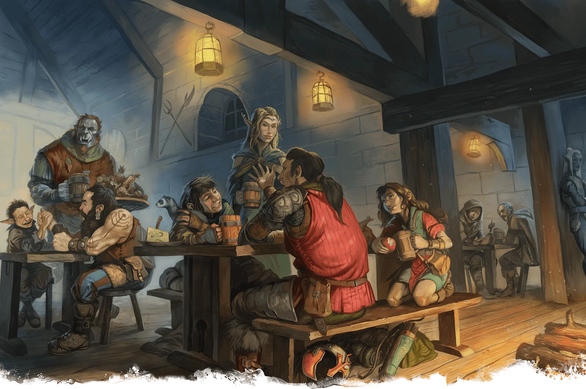

## People of the Dalelands

Although Dalefolk are a diverse lot, and the Dalelands isn't a unified kingdom like Cormyr and Sembia, Dalefolk share a history and culture that has remained steady across the centuries. To an outsider, Dalefolk seem closemouthed, suspicious, and reserved. Until newcomers are identified as friends or foes, Dalefolk prefer civil silence to empty pleasantries. However, Dalefolk are open and giving, especially in the common defense. Those accepted as friends by Dalefolk are expected to contribute to the defense of the community; life is dangerous out on the Cormanthor frontier, and everyone's expected to pull their weight.

### A Land Born from Unity

The Dalelands were born out of an agreement between elves of Cormanthor and human refugees from the east and south, and this remains a key element of Dalelands culture. Although most elves have left Cormanthor for the remote island of Evermeet, Dalefolk still largely honor the Dales Compact.

Prior to the establishment of the Dales Compact, refugees from lands torn by war and disaster were desperate for a place to live, and they eagerly agreed to the pact. But elves of Cormanthor had a different perspective on the Dales Compact. They viewed the influx of newcomers to the lands surrounding the forest as an inevitability. Thus, the Dales Compact was a means for elves to head off conflict with the Dalefolk, as any such conflict might overwhelm even the magic of Myth Drannor.

In the centuries since the creation of the Dales Compact, the tenuous alliance evolved into a true partnership. The Dalefolk's adherence to the terms of the Dales Compact assuaged the elves' fears of conquest, and in time the two sides formed a strong alliance. Elves fought alongside human heroes when Myth Drannor fell, and humans have earned their respect. Elves who remain in Cormanthor still work alongside Dalefolk to defend the region against threats.

### People of Many Species

In the years since the Dales Compact was forged, the Dalelands has become home to diverse peoples. In particular, nomadic halflings known as lightfoots have embraced the importance of home and family in the Dalelands, moving here in large numbers.

Dwarves have old roots in Daggerdale, which lies closest of the dales to the lost dwarven land of Tethyamar. Dwarves of the Brightblade clan, refugees from Tethyamar, settled in Daggerdale long ago and spread throughout the Dalelands, founding villages like Glen in Mistledale. Trade with dwarves who live deep in the Underdark provides a valuable financial lifeline for the Dalelands' largest towns.

High Dale's gnomes hid from the eyes of strangers for many centuries, but recently a generation of curious young gnomes ventured out and, with a little ingenuity, rekindled High Dale's old copper mines. This has in turn led to strangers being welcomed into the village of Hidden Vale for the first time.

Orcs have lived along the banks of the River Ashaba for centuries, fishing, ferrying travelers across the river, and defending their homes. Over the last two decades orcs have increasingly sought their fortune in settlements throughout the dales, including Shadowdale, the struggling community of Freedale, and larger Scardale Town, where the orc priest Sigora Swordwise maintains a shrine to Tempus.

Folk of many other species are found in the Dalelands, albeit in smaller numbers. The land is home to a few dragonborn and tieflings, and it's not unusual for a goliath to wander down out of the Thunder Peaks, or for aasimar to appear among families of the Dales that are devoted followers of Lathander, Chauntea, and other benevolent deities.

*The first time you walk into a Dalelands tavern, everyone will stare. My advice? Buy a drink, find a corner, and sing your best song. You might not make friends, but you'll win their respect.*— Alias
### Town and Country

Dalefolk can be broadly divided into two groups who intermingle. The first group, exemplified by the folk of Battledale and Featherdale, leads a rural lifestyle focused on farming, ranching, and life in the wilderness. For these Dalefolk, the only settlement worth visiting is the nearest village, and they know by name everyone who lives within a day's travel.

The second group is newer, centered around the urban culture found in larger settlements such as Archenbridge and Scardale Town. Dalefolk in these towns are protected by stout stone walls and can join craft or merchant guilds.

Dalefolk from the country and Dalefolk from towns disagree on how to live in the Dalelands. To Dalefolk from the country, townsfolk have given up the solitude, independence, and freedom that brought settlers to the Dalelands in the first place. To Dalefolk from towns, country folk choose to live in hardship, vulnerable to everything from raiders to wandering owlbears. While Dalefolk from the country and town might not always agree, they come together when danger threatens—after all, they're all Dalefolk.

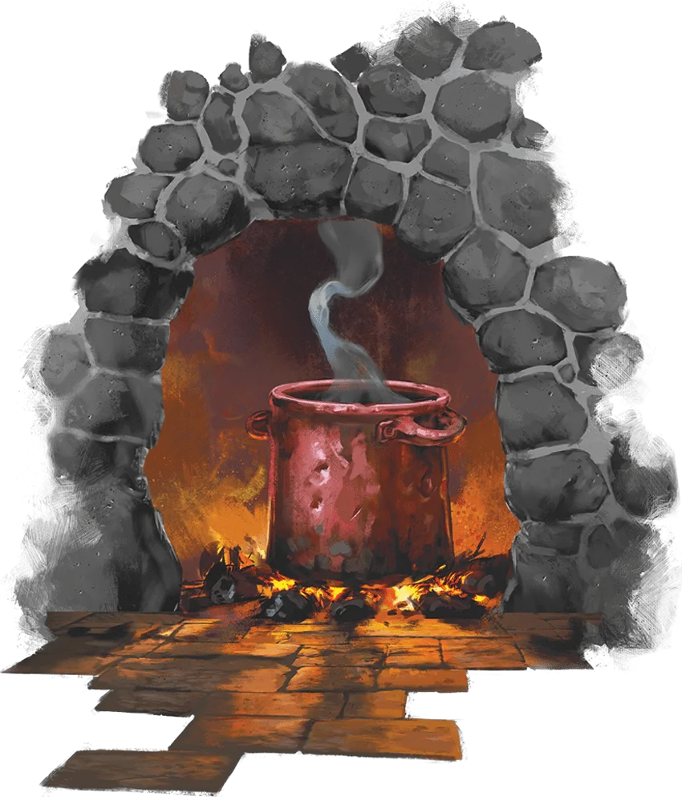

### The Dales Council

Each year at Midwinter, every dale sends a delegate to a selected Dalelands town for the Dales Council. Delegates debate issues affecting the dales, such as defense, border disputes, resistance to Zhentarim or Sembian aggression, trade deals, and matters relating to the great forest of Cormanthor. Delegates and their staff engage in backroom deals, negotiation, and intrigues, pursuing their personal interests and the interests of their dales.

## Cormanthor and Myth Drannor

Walking beneath Cormanthor's giant maples and towering oaks, explorers enter an ancient, verdant, and mysterious world. The borders of Cormanthor have shrunken slightly over the years—as Dalefolk families have cut back the forest to make room for farms, ranches, and towns—but Cormanthor remains one of the mightiest forests in Faerûn. And at the forest's heart lies the elven city of Myth Drannor.

### Cormanthor

Most of the elves who once lived in Cormanthor left long ago. The majority of those who remain reside in the forest settlements of Semberholme and Tangled Trees. In the last decade or so, refugees from the second fall of Myth Drannor have also settled in Semberholme.

#### Lake Sember

The beautiful freshwater lake called Lake Sember, in southern Cormanthor, is sacred to the elves of the forest. Guards from Semberholme protect the lake, and few outsiders are permitted to visit. More than a thousand years ago, sea elves (detailed in *Mordenkainen Presents: Monsters of the Multiverse*) settled Lake Sember, building a fabulous city of towers beneath its surface. Legends hold that the elves of Myth Drannor buried their dead in the cold waters of Lake Sember, but no outsider has verified these stories and the elves say nothing.

#### Moander's Road

For centuries, Moander—god of corruption and rot—was thought dead. But about 150 years ago, the hero known as Alias accidentally awoke the deity, who plowed a course of devastation toward the ruin of Myth Drannor. Moander intended to absorb the uncontrolled magic within the elven city, but Alias and her allies defeated him. The path of destruction the deity carved through Cormanthor is now known as Moander's Road.

For decades, Moander's stinking corpse rotted in the forest. But this god of rot was born again in the Second Sundering. Now Moander's corrupting presence pervades the Dalelands, particularly in places such as the Rotting Gorge in Deepingdale. The high hill where the corpse once lay is now empty, but the road and the woods around it are filled with strange fungi, loathsome oozes, and plant monsters, including **Spores of Moander**.

#### Semberholme

Towering trees fed by Lake Sember's pure waters soar high above the city of Semberholme, creating a cathedral-like retreat for those elves who remain in Cormanthor. Limestone caves beneath the city provide access to Lake Sember and serve as an emergency redoubt and storage area. Ilsivele Miritar, who led the restoration of Myth Drannor a century ago, and her husband, a resurrected hero named Fflar Melruth (Medium, Lawful Good **Questing Knight**), rule Semberholme, but the second fall of Myth Drannor has darkened their spirits Ilsivele and Fflar have abandoned all hope of returning to Myth Drannor, and they have resigned themselves to lingering in Semberholme, perpetually mourning the lost glory of ages past.

#### Standing Stone

When the elves of Cormanthor and refugees from war-torn lands formed the Dales Compact, they erected the Standing Stone in the forest to commemorate the pact. Elven runes winding around the glossy, gray stone detail the formation of the Dales Compact and its rules. The stone magically repairs any damage to itself, so the runes are still readable.

The Standing Stone is one of the most important monuments in Daleland culture. Many Dalefolk take a pilgrimage to the stone to read its inscriptions. But despite roads that lead through Cormanthor, the journey to the Standing Stone can be perilous, and travelers must be prepared to face bugbears, gnolls, wild animals, **Ettercaps**, and **Trolls**.

#### Tangled Trees

High above Cormanthor's floor spreads a network of interlocking bridges, wooden platforms, and tree forts surrounded by nets of strong but delicate rope. This is the settlement of Tangled Trees, which is home to both Cormanthor and Dalefolk scouts.

In the warmer months, the inhabitants of Tangled Trees venture into the forest. They patrol the roads, trails, and paths that crisscross through the woods, and every year at least one group travels to Myth Drannor to inspect the borders of the ancient city and look for threats that might have emerged there. As winter draws near, these expedition parties return to Tangled Trees to rest and prepare for the year to come.

### Myth Drannor

Myth Drannor was once the greatest city in Faerûn, a magical metropolis constructed by elves but home to people of all species, invited into Cormanthor on the establishment of the Dales Compact. However, Myth Drannor fell eight hundred years ago, torn by internal strife, wracked by magical experiments gone awry, and finally invaded by an army of fiends.

A little over a century ago, Cormanthor elves reopened Myth Drannor and restored the mythal that protected the city. Myth Drannor stood on the threshold of a golden age. But instead, war with the Shadovar led to the flying city of Thultanthar crashing into the city in 1487. The mythal failed again, and the wreckage of Thultanthar made the ruins of Myth Drannor more dangerous and unpredictable than ever. The damage was so extensive that no one knows whether the mythal can be repaired again.

The city can be divided into two halves. To the west lie neighborhoods built prior to the Dales Compact, including the Old City, the Lake Ward (where elves lived in elegant and palatial homes), and the Temple Ward. To the east lies the Dlabraddath, an expansion to the city designed to accommodate the influx of Dalefolk. Streams running north to south separate these two regions, and many bridges cross these streams to connect the two halves of the city.

Over centuries, researchers in Myth Drannor conducted extensive magical experiments and spent resources on a scale found nowhere else on Faerûn. Not all these experiments are recorded, and many still stand as broken monuments, their magic warped by centuries of neglect. Explorers in Myth Drannor could stumble on fantastic magic of any kind: massive magical highways that allow instant travel across Faerûn, portals to anywhere in the Great Wheel (and even beyond), or even structures designed to manipulate time.

The fall of Myth Drannor created regions of dead magic within the city; see the *Dungeon Master's Guide* for the rules for dead magic zones. While the largest dead magic zones in the city remain relatively stable in permanent locations, smaller dead magic zones move throughout the city in unpredictable patterns.

*I have traveled from the Sunrise Mountains in the east to the Trackless Sea in the west, from Icewind Dale in the north to wondrous Calimport in the south. But even though I know my memories are false, I will always call the Dalelands my home.*— Alias
#### The Mythal

Myth Drannor was protected by powerful magic called a mythal, which extended the lives of the city's inhabitants, controlled the weather, and had other wondrous uses, ensuring Myth Drannor remained a magical paradise. After the first fall of Myth Drannor, the mythal eventually deteriorated, its magical effects becoming unpredictable and strange. It was restored for a time in the last century, but when the Shadovar city of Thultanthar crashed into Myth Drannor, the mythal failed again, this time perhaps beyond repair.

The mythal now has powerful but unreliable magical effects. Most notably, it blocks most teleportation in or out of Myth Drannor (but not within the city walls) and blocks divination effects such as scrying. It sometimes protects falling creatures from harm and can extend the duration of light-creating spells. But it has also caused strange mutations in those exposed to it for more than a few months. The effects of the malfunctioning mythal are impossible to predict.

Any attempt to restore Myth Drannor ultimately depends on repairing the mythal. But no one's sure how to accomplish this, or if it's even possible.

> ##### Megadungeons
>
>Before the creation of D&D, the first dungeons took shape as sprawling tunnel networks beneath Castle Blackmoor and Castle Greyhawk. Adventurers explored these fantastic labyrinths one level at a time, retreating when resources ran low or after encountering monsters too powerful to overcome. Between delves into the dungeon, characters went on other adventures. Fantastic adventure sites like this became known as megadungeons.
>
>The abandoned elven city of Myth Drannor is an example of a megadungeon. For guidance on adventuring in Myth Drannor, see "Dalelands Stories" later in this chapter.
>

#### Locations in Myth Drannor

Myth Drannor is a vast and expansive city that could provide years of adventure. Only a few of its locations are detailed here.

***Burial Glen.*** Myth Drannor's primary cemetery lies outside the walls to the west, along a path leading to the city gates. For many adventurers, this is where explorations of Myth Drannor begin. Anyone attempting to plunder the crypts must contend with **Ghouls**, **Skeletons**, and **Zombies** that infest the glen. A triumphal arch in the center of the glen is home to a **Demilich**, all that remains of the legendary military strategist Remarkus.

***Dlabraddath.*** The eastern end of Myth Drannor was built to accommodate the influx of people that followed the establishment of the Dales Compact. The architecture here stands in contrast to the tall marble spires of the Old City; instead, square brick buildings, low houses, and buildings with round doors and windows stand arranged around parks and gardens, linked by broad granite roads or waterways. In addition to homes and townhouses, the Dlabraddath boasted numerous inns, taverns, and shops.

***Dwarven Dungeons.*** Dwarf immigrants constructed a three-level labyrinthine city beneath Myth Drannor, a settlement known as the Dwarven Dungeons. In the centuries since, these tunnels have become home to a bewildering array of dangerous inhabitants, including lizardfolk, malevolent undead, and restless spirits of Myth Drannor's citizens that are eager to resolve unfinished business and end their haunting. The Cult of the Dragon, led by the **Dracolich** Pelendralaar, controlled the Dwarven Dungeons for many years; although Pelendralaar was defeated and the cult routed, the dracolich's return is inevitable.

***Glim-Gardens.*** This large park used to magically heal the bodies and nourish the spirits of the city's residents. Over time, however, the magic of the gardens has become corrupted. Now the park's magic makes wounds reopen, bleed, and fester. Long overgrown, the plants of the Glim-Gardens have become hungry for flesh and thirsty for blood.

***Hall of Wizards.*** Myth Drannor had many magic academies, where spellcasters of all kinds could gather, share their knowledge, select and train apprentices, and push the boundaries of magical research. The oldest and most famous of these academies was the Hall of Wizards, legendary home of elven magical traditions. This academy contains many magically concealed chambers that have avoided plundering. A magical orrery on the college's grounds can be used to teleport anywhere in the city.

***House of Gems.*** A stout keep marks the headquarters for the city's jeweler's guild. The House of Gems was also home to one of the city's oldest communities of dwarves. Scholars of Myth Drannor suspect the House of Gems is warded with extensive magical and mechanical traps, as well as protected by **Iron Golems**. Doors in the guildhall's basement lead to the Dwarven Dungeons.

***Old City.*** In the oldest parts of Myth Drannor, the estates of noble families rise intermingled with administrative buildings. Castle Cormanthor, which once housed the rulers of the city and ambassadors from across Faerûn, lies ruined in the center of the Old City, wrecked by the Netherese flying city Thultanthar.

As Thultanthar fell from the sky, pieces of the vessel fell on the Old City like meteors, clustering around Castle Cormanthor in the city's center where aberrant monsters and other strange creatures have become increasingly common.

***Temple of Sehanine Moonbow.*** The city's temple to Sehanine Moonbow, an elven god of dreams, death, and the moon was built near Castle Cormanthor in the Old City. The temple is a relatively modest open structure with a dome supported by columns covering a central altar with nearby housing for priests. It's remarkably well preserved, though weathered by rain.

As Myth Drannor fell to an army of fiends, priests of Sehanine withdrew to this temple and worked high magic to conceal it behind powerful illusions. It remains hidden to this day, appearing to explorers as an empty lot.

In fact, the temple remains intact, protected by a *Hallow* spell that wards against Aberrations and Fiends. Additionally, no sound can emanate from the temple, and sounds from outside the temple can't penetrate it. These protections make the temple an excellent place for adventurers investigating Myth Drannor to hide, rest, and recover.

***Tower of Bones.*** On the north side of Myth Drannor, on the site of an ancient assault on the city, lies a massive war memorial. Crypts large and small lie scattered around a hill that marks a mass grave. Later, necromancers built the Tower of Bones atop the hill to facilitate their unwholesome magical experiments. By night, undead wander the region.

## Dalelands Gazetteer

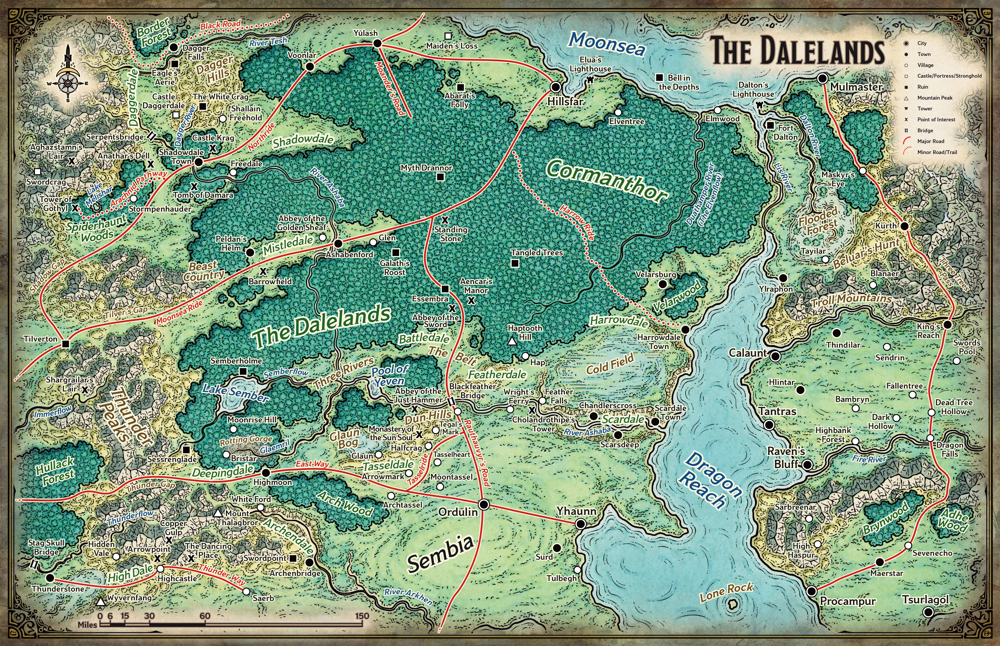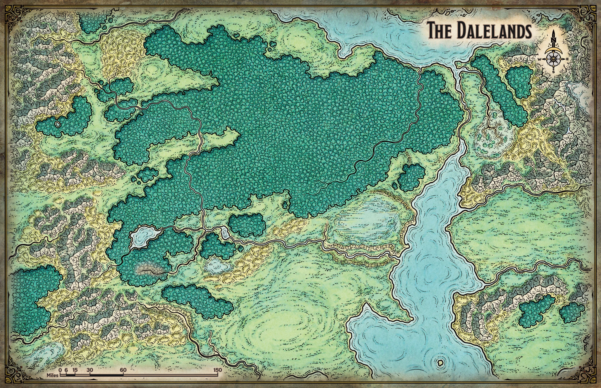The Dalelands consists of a dozen scattered communities, each known as a dale, surrounding the ancient forest of Cormanthor. While Dalefolk share history and culture, each dale has its own unique character.

Over the centuries, many dales have risen and fallen. This section details each of the current dales, discussing landmarks, settlements, rulers, and customs, as well as two of the dales' most notable towns:

- Archendale. The wealthy and militant land of Archendale skirmishes with Sembia, its southern neighbor.
- Battledale. In Battledale, a dragonborn leader works to restore homes burned in war.
- Daggerdale. Dwarven refugees and the struggle against the Zhentarim has shaped Daggerdale.
- Deepingdale. Humans and elves live together in Deepingdale under a wise elf ruler known for his hospitality.
- Featherdale. Featherdale is a land of scattered homesteads with no laws or rulers.
- Harrowdale. In Harrowdale, loggers work in the shadow of ancient evils.
- High Dale. Highdale is a community of farmers and miners hidden in the Thunder Peaks.
- Mistledale. Goblin raiders and other fey threaten to overwhelm Mistledale.
- Scardale. In Scardale, rough-and-tumble folk recover from invasion and a magical plague.
- Scardale Town. Crime syndicates and corrupt politicians run bustling Scardale Town.
- Shadowdale. Humans, elves, and orcs live peacefully in Shadowdale, along the River Ashaba.
- Shadowdale Town. The historic Shadowdale Town is home to legendary adventurers.
- Tasseldale. Tasseldale is famous for its swordsmiths and for training lawyers and judges.

### Archendale

The most militant region in the Dalelands is also one of the wealthiest. Archendale is the first stop for trade between the Dalelands and Sembia—or for Sembia's periodic invasions—and a place where traditional Dalelands occupations like farmer and hunter give way to merchant and soldier.

The people of Archendale believe mercantile and military strength together keep Archendale safe from longtime rivals Sembia and Tasseldale. This principle created a culture in which the people of Archendale pursue power and wealth at all costs, fearing the consequences of losing either.

Archendale's rulers are the Swords, masked individuals who keep their identities a mystery. A generation ago, the Swords of that time were overthrown and cast out, but the dale's wealthy and well-armed families couldn't agree on a replacement government. Finally, three new Swords presented themselves at Swordpoint a few years ago, and the dale accepted their rule.

The Archenriders are the dale's primary defenders, six hundred well-equipped warriors divided into ten squadrons that patrol the River Arkhen looking for spies, outlaws, or anyone else who needs a lesson in Archendale justice. The Archenriders' enforcement of the border between Archendale and Sembia has cemented their reputation as one of the most fearsome military forces in the Dalelands.

#### Archenbridge

Archenbridge is a heavily fortified town that boasts a stone wall surrounding a cramped inner neighborhood known as the Central Ward. Here, many-storied townhouses flank cobblestone streets busy with traffic from the rest of the Dalelands and from Sembia. The doors to these buildings feature arrow slits and barred windows, and even these ordinary homes are trapped with pits, murder holes, and other deadly devices.

Many citizens of Archenbridge are merchant-adventurers eager for battle and gold. Due to the wealth its citizens bring in, the town is remarkably cosmopolitan, attracting a diverse array of shops, taverns, and crafters. The town is dedicated to Lathander but also boasts a famous temple to Chauntea called the Bounty of the Goddess.

Archenbridge has spilled outside its walls; residents unable to afford property in the central ward built wooden homes and shops outside. When enemies threaten Archenbridge, these outbuildings are a liability in the town's defense, and the Swords have ordered the entire outer town be burned to the ground to discourage such settlement. Outrage among Archenbridge's less-affluent citizens, who live in the outer town, has so far blocked this effort.

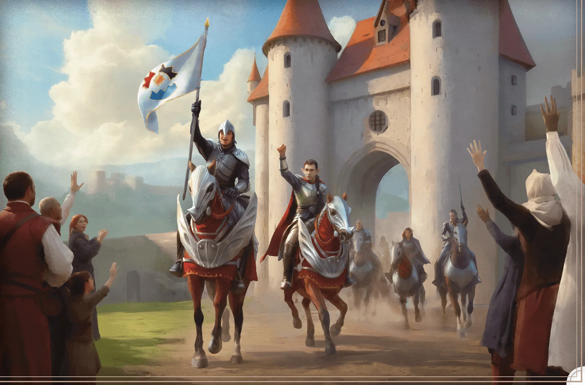

#### Arch Wood

Greedy merchants in Archendale have coveted the pristine forest of Arch Wood for many years, but Archendale's new Swords have dictated the forest must be left untouched. That's because, a century ago, early efforts to harvest trees from the forest revealed ancient ruins blossoming with rotted vegetation and reeking of death. These structures have since become infested with Moander's corrupted minions, including **Shambling Mounds**, oozes, and even a **Spore of Moander**.

#### Mount Thalagbror

The River Arkhen begins at Arkhen Falls, where a spring on the slope of Mount Thalagbror bursts forth and plunges hundreds of feet. **Pegasi** make their home on the mountain slopes and sometimes frequent the falls; this lures followers of Chauntea and Mielikki eager to observe the pegasi, as well as adventurers looking to tame a mount. The mountain was named after an **Oni** that dwells behind the waterfall in a cave rich with copper and gemstones.

#### Swordpoint

An intimidating stone fortress called Swordpoint overlooks the town of Archenbridge. It serves as a garrison for the Archenriders and a home for the Swords—the dale's three anonymous rulers.

The castle's stone walls have been crumbling for centuries. Nevertheless, Swordpoint's catapults and ballistae, combined with its high vantage, make it one of the most formidable fortresses in the Dalelands. The central courtyard boasts the Shrine of Swords, dedicated to Tempus, along with multiple layers of supplementary defenses, such as movable wooden walls fitted with crossbows, moats filled with flammable oil, and rolling platforms with mounted siege weapons.

The Swords employed a mage named Orosul to create permanent magical wards around the castle and treat its stone with a hardening formula derived from the blood of a gorgon. Dwarf masons hired to expand the castle added extensive subterranean tunnels, dungeons, and storage chambers capable of supplying Archenbridge for a year. At least 180 Archenriders staff the castle at all times.

#### White Ford

Long ago, the folk of Archendale rolled boulders into the River Arkhen to create a ford. A fortified village called White Ford grew up around that ford. The village is surrounded by an oval stone wall called the Wolf Wall, which protects the village when goblin raiders and their worg allies ride down out of the Thunder Peaks. Within the wall, an inner keep called the Arch Hold is protected by a ditch and stone wall. A unit of sixty Archenriders is stationed at the Arch Hold.

White Ford sees steady merchant traffic between Highmoon and Archenbridge. That's made the folk of White Ford wealthy, though their village is far quieter than the bustling capital to the south.

### Battledale

*In a land like Battledale, where there are no laws, your friends and kin are your sword and your shield. A person without family—born or chosen—is victim to all of life's mischance. And indeed, is this not true of all places?*— AliasThe people of Battledale are peace-loving farmers, shepherds, and foresters of no particular martial skill. Unfortunately, their homes lie along a central and strategic route invaders of the Dalelands frequently take. Battledale is named for the many pitched battles that have taken place within its borders, much to the dismay of the folk who live here.

Rauthauvyr's Road runs through central Battledale, a key highway leading from Ordulin in the south to Hillsfar in the north. Dense forests, rolling hills, and pastureland flank the road. The most fertile part of Battledale is the Belt, a region of fenced farms and cottages, orchards, and sheep pastures blessed with fish-filled streams and ponds. Stone tables sacred to Chauntea line paths and trails; locals leave food on these tables for weary and hungry travelers. Meanwhile, followers of Silvanus mark that deity's influence by stringing bells over the Belt's many pools and woodland springs.

This land is sparsely populated; the ravages of war and dangerous beasts have left many farms abandoned. Some former adventurers like to settle here, drawn to a fertile land and a wilderness that needs taming, but people who grow up in Battledale tend to leave.

Five centuries ago, Aencar the Mantled King rose to power in Battledale and began an effort to unite the Dalelands. He almost succeeded. But Aencar was lured back to the Battledale town of Essembra, where he was ambushed by a dracolich and slain. His dream of a united Dalelands died with him, but the people of Battledale revere that dream and his memory.

A few years ago, a silver-scaled dragonborn named Volsembra (Medium, Lawful Good **Knight**) led a group of families back to the ruined town of Essembra, where she took the title of Protector of Battledale and began the town's reconstruction. Volsembra commands the Spears of Battledale, a troop of one hundred **Guards** who safeguard the town and patrol Rauthauvyr's Road.

Battledale has no formal laws; folk tend to their own affairs. Those suspected of a crime are tried by their neighbors, who mete out whatever justice they think appropriate. Serious problems can be brought to Protector Volsembra, but she has no authority beyond the town in which she dwells. She hires adventurers to investigate problems brought to her attention, as she's busy with the reconstruction efforts in Essembra.

#### Abbey of the Sword

Two centuries ago, Tempus manifested in a shattered castle; soon after, a follower of Tempus rebuilt some of the fortress and founded the Abbey of the Sword here. When Sembian forces invaded Essembra, the refugees sought shelter here, and the survivors built a town called Ambrose around the abbey. Now, however, Volsembra has led them back to their old homes, and Ambrose has been abandoned.

The underground levels of the abbey contain portals to the Underdark through which nomadic drow loyal to the evil deity Vhaeraun once invaded the Dalelands. A hundred **Guards** who worship Tempus keep watch, but the human Priest-General Ilya Harndrekker (Medium, Lawful Good **Questing Knight**) seeks adventurers willing to go through the portals and find a way to close them.

#### Aencar's Manor

From Rauthauvyr's Road, the old manor of the Mantled King appears inviting, with well-tended gardens overlooked by statues of mounted knights, and inner chambers lit by warm fireplaces. The folk of Battledale use these gardens and other areas around the manor as the site for their regular Shieldmeet festivals, every four years, strictly avoiding the manor's interior.

That's because the interior is haunted by **Ghosts**, **Specters**, **Wraiths** and even the restless corpse of Aencar (Medium **Death Knight**). Aencar was killed by a dracolich, so the Cult of the Dragon has long felt entitled to Aencar's property; they maintain a hideout in the manor, from which they summon and strengthen the undead that haunt it while the cult explores tunnels underneath the manor that connect to the Underdark.

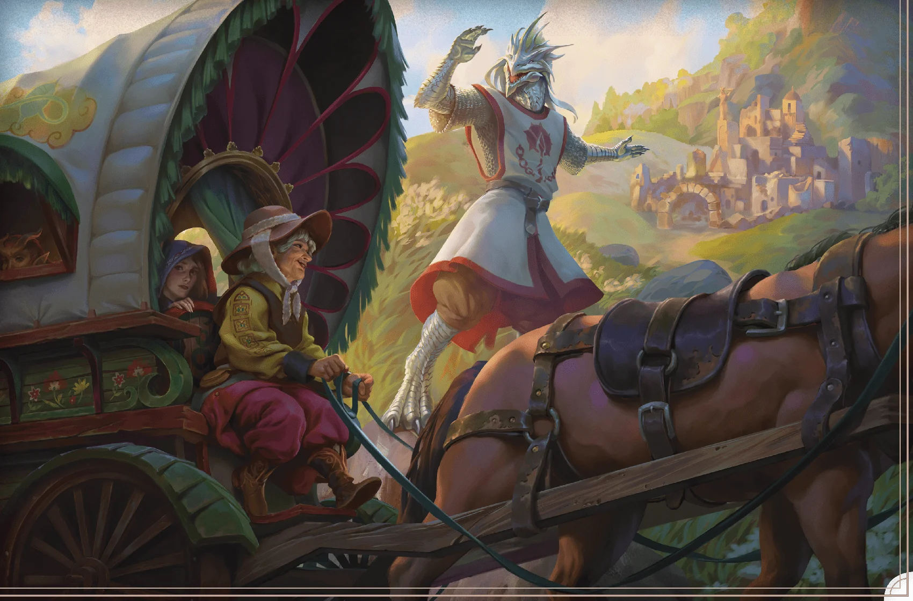

#### Essembra

The largest settlement in Battledale is Essembra, named after a beloved adventurer who eventually revealed herself to be a dragon in disguise. Cottages and farms line the road leading to Battle Court, a walled compound encompassing about fifty buildings that includes a temple to Gond and a moated keep known as Ilmeth's Manor. A statue of Aencar marks the center of the court.

Essembra was abandoned for years after Sembians and their Shadovar allies sacked it and burned it to the ground. Now the dragonborn Volsembra, Protector of Battledale, leads the reconstruction efforts, with help from adventurers willing to clear out ruined buildings inhabited by outlaws, wild beasts, or restless undead. Volsembra is widely believed to be related to Essembra, but she refuses to discuss the matter, insisting she be judged by her deeds, not by any familial connection.

#### Ghost Holds

The forests and hills of Battledale are filled with abandoned manors and keeps known as ghost holds: the former homes of settlers or wealthy Sembians who thought a vacation house in the Dalelands sounded like a good idea—until the Zhentarim or a rampaging **Owlbear** showed up. The ghost holds now provide shelter to outlaws, foreign spies, and wild creatures.

#### Haptooth Hill

A tower built by the Red Wizard Dracandros tops Haptooth Hill. Catacombs descend from the tower into the hill. Dracandros and his drow allies were killed by adventurers long ago, but in the intervening years the tower has been used by everything from Zhentarim spies to wandering monsters. Lately, an enterprising human Red Wizard named Pythia Vandermeer (Medium **Mage**) has returned to the site, seeking Dracandros's arcane secrets.

Adventurers seeking to explore the hill can find the supplies and services they need in the nearby village of Hap, where a dozen buildings surround a shrine to Lathander overseen by the halfling Norin Brit (Small, Neutral Good **Priest**).

#### Three Rivers

The fertile land where the Glaemril and Semberflow meet the River Ashaba is called Three Rivers. Many settler families and adventuring companies have perished here, for **Bulettes**, **Manticores**, **Owlbears**, and other monstrous creatures congregate in this region, which is littered with burned-out cottages and abandoned strongholds. Merchants seeking to use the rivers to move goods pay adventurers steep prices to protect their boats.

### Daggerdale

Centuries ago, refugees fleeing ancient wars founded the realm of Merrydale, forging alliances with the dwarves of Tethyamar, which lay to the west. But a succession of disasters—including an infestation of vampires, occupation by the Zhentarim, and a plague of lycanthropy—left the people here anything but merry. Somewhere along the line they changed the realm's name to Daggerdale, and the survivors became a close-knit, insular people who keep their doors locked, their mouths shut, and their weapons handy.

Daggerdale lies south of the Border Forest, stretching to the Dagger River and beyond. Rolling plains and rocky valleys give this realm a different character than the wooded dales to the south and east. Families of dwarf miners, primarily the Brightblade clan, dwell in Anathar's Dell, along with human and elf farmers. The village of Serpentbridge grew up around an old and unstable span crossing the Dagger River.

For centuries the Morn family ruled Daggerdale. The legendary hero Randall Morn was ousted by the Zhentarim but led a successful rebellion, reclaiming his throne before eventually dying in his sleep and leaving no heir. Members of the noble family of Cormaeril, related to the Morns by marriage, moved into Castle Daggerdale and ruled for three generations, but the citizens of the dale never accepted them. Barathal Cormaeril, the last such ruler, was forced to flee when his sister Neranya was revealed as a werewolf.

Finally, only a few years ago, the foremost priest at the temple of Lathander's Light divined that a scion of the Morn family survived, unaware of their own bloodline. Young Kirkland Stone, the son of a beryl miner from the Dagger Hills, was made Lord Kirkland Morn overnight and now rules unsteadily from Castle Daggerdale. He is idealistic but cautious, quick to listen to advisers but slow to make decisions. But the people of Daggerdale have embraced Kirkland, calling him a "True Morn" and encouraging him to marry and continue the family name.

*Young Kirkland Stone became Lord Kirkland Morn in an instant. He did not choose the path his life has taken. None of us do. Now he must choose what to do with this new life.*— Alias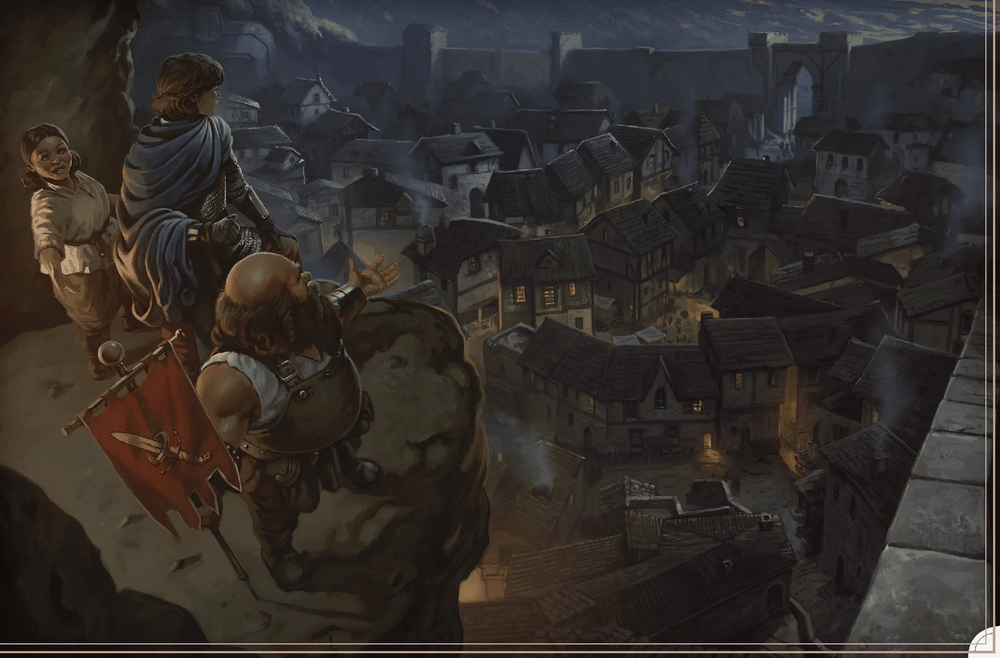

#### Border Forest

The Border Forest lies at the confluence of four realms: Daggerdale and the rest of the Dalelands lie to the south, the Moonsea and Zhentil Keep to the east, the Tortured Land to the north, and Anauroch to the west. Many fey call the forest home, but centuries of intrusion by trespassers has made the bullywugs, centaurs, goblins, satyrs, and worgs of the Border Forest especially ruthless. They prey on anyone who enters the woods.

#### Castle Daggerdale

Lord Kirkland Morn's sturdy stone keep overlooks the Tethyamar Trail. Although the keep is the official seat of Kirkland's rule, he brings his court with him when he travels to Dagger Falls. Castle Daggerdale houses over a hundred mounted soldiers known as the Morn Riders (**Toughs** riding **Warhorses**); they patrol the roads and borders of the dale.

#### Dagger Falls

The capital of Daggerdale is Dagger Falls, a former trading outpost on the northern shore of the River Tesh near Dagger Bridge. Sturdy stone walls and two gatehouses protect the town. The buildings within, also stone and covered with slate roofs, show the influence of dwarven engineering techniques. The only inn in town is the Fallsview, but an elf musician named Kessla (Medium, Neutral Good **Performer Maestro**) runs the Red Rock Tavern. A temple to Lathander, Lathander's Light, is the largest religious building in the dale; it's managed by Her Radiance Dareen Travaskyr (Medium, Neutral Good **Archpriest**), the high elf priest who identified Kirkland Stone as the lost heir to the Morn legacy.

***Constable's Tower.*** Daggerdale's greatest and most imposing stronghold is the Constable's Tower, which rises from a high hill in Dagger Falls called the Spur. The keep has been unusable for decades thanks to a mysterious magical accident that left waves of deadly spells coursing back and forth through the keep and its subterranean levels. Recently, adventurers affiliated with the Zhentarim have promised to cleanse the keep and make it usable again; Lord

Morn has supported their efforts and given them a plot of land, which the Zhentarim have in turn made into a clandestine base of operations. The Zhentarim have found a secret way into the keep, which they use to loot it of valuables.

#### Dagger Hills

The steep and rugged Dagger Hills are broken by thorn-choked ravines and hidden glens. Paths are hard to find and even harder to follow, and the Dagger Hills are infamously home to **Wereboars** and **Werewolves**. Nevertheless, the hills are key to Daggerdale's prosperity, as they are a famous source for emeralds, aquamarines, and other gems. Shepherds and goatherds also keep their flocks here.

***Hidden Menace.*** The Dagger Hills hide a threat to Lord Morn's rule: Neranya Cormaeril, the werewolf heir to the Cormaeril claim on Daggerdale, still lives. She leads a pack of werewolves and nurses a grudge against Kirkland Morn.

***Mysterious Ruin.*** The White Crag is an ancient ruin carved out of the side of one of the Dagger Hills. The structure is incredibly ancient, predating even the elven settlement of Cormanthor, but scholars can't agree if it was created by giants or dragons. Tunnels underneath the ruin descend to the Underdark.

#### Desertsmouth Mountains

Fearsome dragons and giants lair in the mighty Desertsmouth Mountains and forage out of them for food. Daggerdale miners have worked the edge of these mountains for generations, long after the dwarves of Tethyamar were routed by an army of demons led by evil wizards (see *chapter 2* of *Forgotten Realms: Heroes of Faerûn).*

Many dwarf families of Daggerdale dream of returning to Tethyamar and restoring its splendor. The Zhentarim moved into the old mines some time ago, but the tunnels are home to some of the most dangerous monsters in Faerûn. The Zhents avoid the more dangerous subterranean regions, but as they ransack safer parts of the complex, they send their plunder in wagons back to Zhentil Keep.

#### Eagle's Aerie

A strategic lookout point on a rocky knoll above Dagger Falls, Eagle's Aerie was used by Randall Morn as a hidden base while he marshaled his rebellion against the Zhentarim. Before that, however, it was a fortress for dwarves of Tethyamar, who kept a vigilant watch on trade routes from this key vantage. Kirkland Morn uses the lookout as a private, personal refuge from affairs of state.

### Deepingdale

Deepingdale was founded by a sorcerer named Imryll Eluarshee, who is known as the Deeping Princess. More than any other dale, Deepingdale is dedicated to respecting the forest and living in it without destroying it. Most families in Deepingdale include both humans and elves, and the dale boasts a small community of drow who worship Eilistraee and other good gods.

The people of Deepingdale are foresters, hunters, trappers, and rangers; the forest provides everything they need, so long as they don't abuse it or take its gifts for granted. Deepingdale families value learning, song, and martial skill. They take a long view when it comes to crises and emergencies, arguing that problems often resolve themselves if left alone; but when they're proven wrong, Deepingdale folk swiftly rise to the occasion.

The dale is organized around the East Way, a major trade road connecting Cormyr and Sembia. Merchants from both realms make the markets in Highmoon among the most popular in the Dalelands. The villages Bristar and Moonrise Hill lie north of the road, deep in the forest. Hamlets and smaller groupings of family homes lie scattered throughout the dale, especially in the eaves along the forest edge.

The high elf Lord Theremen Ulath (Medium, Neutral Good **Questing Knight**) has ruled Deepingdale for almost two centuries, and his palace—the Tower of the Rising Moon in the town of Highmoon—is a destination for elves throughout the Heartlands. An informal militia called the Wardens of Deepingdale protects the dale when necessary. Bristar contributes a company of deadly archers to the militia, while Moonrise Hill sends swordfighters. This militia is quick to act and respected throughout the dales.

*Lord Ulath is a fine host, but do not mistake his love of learning and song for weakness. The wisest scholars in the Dalelands visit his hall at Highmoon. Many adventurers, plagued by some riddle or curse, have found their answers there.*— Alias
#### Glaemril River

*The Glaemril River*, sometimes called the Deeping Stream, has its headwaters near the village of Bristar at Lake Erudruie. Erudruie is sacred to elves of Cormanthor, and its waters have healing properties. The river is famous for its salmon, though locals have strict laws against overfishing.

#### Highmoon

The capital of Deepingdale, Highmoon, is a walled town on the East Way. Thousands of elves and humans call the town home, demonstrating Deepingdale's commitment to harmony.

***Leaves of Learning.*** The Leaves of Learning is a temple to Oghma that houses one of the most famous libraries in Faerûn. The library, held in a great spire that overlooks even the Tower of the Rising Moon, specializes in mundane topics; this has spared the library from intrusion by rapacious wizards and power-hungry invaders. Unfortunately, the library's index, a single massive volume bound with gold and encrusted with gems, was recently stolen—a grievous blow to both the library's reputation and its usefulness. The human priest Thanali (Medium, Lawful Good **Archpriest**) oversees the temple and has given up on locating the index, since any reward she can offer would be but a fraction of what the book is worth. Her only hope now is to find adventurers who revere Oghma and will recover the book out of religious obligation.

***Rhauntides's Tower.*** Once home to the wizard Rhauntides, who held the post of Sage of Deepingdale, this small hexagonal tower atop Spell Hill in Highmoon was willed to a warrior monk named Teesha Than when Rhauntides died. Teesha founded a monastery in the tower, and monks reside there still, practicing their fighting arts and welcoming a few new students every year. The basement levels of the tower descend into the hill; they hold the remnants of Rhauntides's dangerous arcane experiments.

***Tower of the Rising Moon.*** Among its many landmarks, Highmoon is the site of the Tower of the Rising Moon, home to Lord Ulath. Ulath's hospitality is well known, and the tower is famous as a site for feasting, music, and other entertainments, not as a military fortress. This frivolous reputation belies Ulath's wise leadership, however. Ulath traditionally keeps an adviser trained in the arcane arts, the so-called Sage of Deepingdale. Unfortunately, no one has been able to hold this title for long, dying by accident, on adventure, or from assassination. The position has acquired a dire reputation, and Ulath can no longer find anyone willing to accept the job.

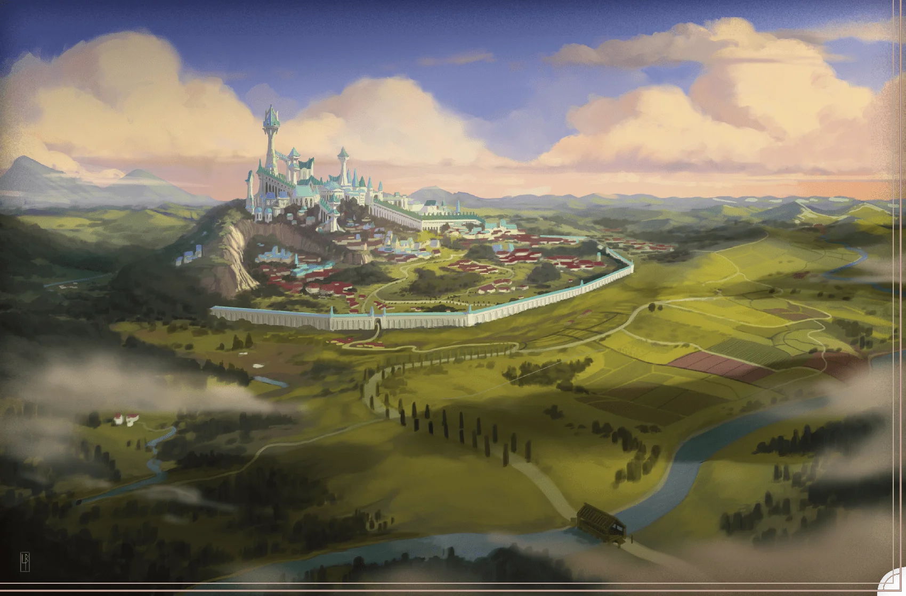

#### Rotting Gorge

South of the Semberflow, hidden by dense forest, lies a deep rift in the earth called the Rotting Gorge, sheltered by twisted trees and knotted vines. On this site, elf wizards long ago used high magic to imprison an aspect of Moander, the horrifying god of rot, decay, and corruption. The people of Deepingdale consider this place, which they once called the Darkwatch, to be cleansed.

But Moander's evil legacy was never entirely destroyed, and with Moander's return after the Second Sundering, his grip on the Rotting Gorge has reawoken. Now this chasm is filled with malignant magic. **Shambling Mounds** and **Gibbering Mouthers** are among the least of the evils that crawl forth from the Rotting Gorge. More dangerous are the **Spores of Moander** born from this rotten earth. Adventurers forcing their way down into the Rotting Gorge find a labyrinth of stinking chambers filled with more of these corrupted spawn of Moander.

#### Sessrenglade

The realm of Sessrendale was destroyed centuries ago by Archendale in a brief, bloody, and unjust war. Sessrendale's capital was the town of Sessrenglade, but Archendale's mercenaries razed everything to the ground and salted the earth to discourage refugees from returning. The folk of Sessrenglade were diligent miners, but now open pits and dangerous shafts are all that remain of their labor.

Few travel this devastated land, but that made it all the more appealing to Thraxata, an **Adult Red Dragon** that lairs in Blood Peak, a mountain overlooking Sessrenglade. Adventurers seeking to slay Thraxata must first contend with the **Revenants** that haunt the ruined town, and this has allowed the dragon to grow to tremendous size and strength in relative safety. Lord Ulath fears the dragon has set its sight on Highmoon, and Ulath desperately seeks adventurers experienced enough to confront the dragon in its lair.

### Featherdale

Featherdale encompasses the flat and fertile farmland on either side of the River Ashaba between Blackfeather Bridge and Feather Falls. The people of Featherdale don't believe in government or laws, doing as they please so long as they harm no one. As a result of this free-spirited outlook, Featherdale has no large settlements, no ruler, no standing army, and no capital.

Emergencies and long-simmering regional affairs are addressed at a Dalemeet: a gathering of family elders and prominent business leaders at Feather Falls or Blackfeather Bridge. Whoever shows up for the Dalemeet debates any issues brought forward, attempting to persuade others in attendance or forge a consensus. Any decision must be enforced by the winning party, as the dale has no constable or other law enforcement body. Family ties, friendships, and reciprocal relationships are crucial to getting things done in Featherdale. Crime is dealt with through vigilante justice, resulting in feuds between families that go back generations.

The lack of military defenses throughout Featherdale makes the realm an easy target for invaders, but the people of Featherdale aren't rich, and they have little to arouse the envy of wealthy Sembian nobles. The wide river plain, however, makes an excellent highway to more lucrative targets, so armies frequently sweep through Featherdale en route to those targets. These armies don't linger long, as all are eventually driven out by the forces of more militant dales.

Featherdale is a good neighbor to the other dales, its people have family ties throughout the Dalelands, and they are a reliable and prudent voice on the Dales Council. When Featherdale is in need, the goodwill they have earned is repaid to them. In the meantime, they keep their heads down. Many of the families in Featherdale trace their origin to adventurers who retired to the dale, leaving a life of danger behind in favor of home and family. This legacy contributes to the idiosyncratic political views of Featherdale folk, but it also means many a house, ranch, farm, and cottage has a magic item stowed away for emergencies—and someone ready to use it to defend their home.

#### Blackfeather Bridge

One of the few bridges across the wide River Ashaba, Blackfeather Bridge originally was a humble, long, and sturdy wooden bridge painted black to give a false impression of stability. Eventually Featherdale raised enough money from tolls to pay for a stone replacement, and that wider bridge stands today. The village named after the bridge is one of Featherdale's two largest settlements, the other being Feather Falls on the opposite end of the dale.

The deity Cyric killed Leira, god of deception, on the original wooden Blackfeather bridge over a century ago. Leira eventually returned, but the bustling bridge has become a pilgrimage site for Cyric's faith. The village employs no guards, so these evil pilgrims usually go undetected amid the bridge's daily traffic. They don't conduct schemes in the village, as that would attract attention and endanger their holy site, but they use the bridge as a rendezvous point where they exchange news and hatch schemes enacted elsewhere in the Heartlands.

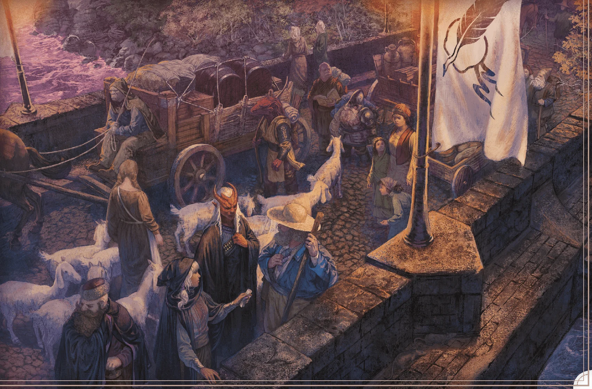

#### Feather Falls

Feather Falls refers to both a waterfall over which the River Ashaba plunges and the village situated at the waterfall's summit. This village is one of the largest and oldest settlements in the dale and a traditional mooring place for local keelboats. In addition to Cholandrothipe's Tower (see below), which overlooks the falls, the village includes the House of Morning, one of the only temples in the dale. The House of Morning is dedicated to Lathander and overseen by a human named Shervin (Medium, Neutral Good **Priest**).

A portage path winds alongside the falls, where individuals can earn a living transporting cargo. Behind the waterfall lies a series of hidden grottoes referred to as the Temple behind the Falls. No one is quite sure what entity was once worshiped in these grottoes, but its evil reputation is spread in stories told round the campfire or when parents want to frighten disobedient children.

***Cholandrothipe's Tower.*** Cholandrothipe was a wizard who used his mighty magic to move heavily laden boats safely over Feather Falls. He charged a sizable fee for this service, but merchants paid it anyway to save the considerable time, labor, and money portage otherwise required. The wizard dwelled in a tall, slender tower with a single porch-like entrance, and no one was permitted entry.

But Cholandrothipe concealed many secrets, and he drew the attention of Red Wizards who killed him and set his tower aflame. Subterranean levels beneath the tower house dreadful dungeons and tunnels to the Underdark, still guarded by deadly traps and magical Constructs, but Cholandrothipe's wealth continues to lure adventurers. Some of these adventurers are affiliated with the Red Wizards, though they conceal that allegiance from vengeful villagers.

#### River Ashaba

The River Ashaba is the primary thoroughfare of Featherdale; families along the shore keep keelboats for travel, communication, and recreation. The river has a history of flooding, but Featherdale keeps the Ashaba contained with a combination of dikes, stone walls, and magic.

Recently, an enterprising, old halfling named Marco Paroland (Small, Chaotic Neutral **Commoner**) has commissioned a wide, flat-bottomed riverboat and packed it with a bar, gambling tables, a stage, and other entertainments. A few staterooms are available for high-paying customers. This boat, which Marco dubbed the *Ashaban Princess*, sails between Feather Falls and Blackfeather Bridge. It's proven a considerable boost to the economy of both Featherdale villages, drawing travelers and gamblers from throughout the dales.

#### Wright's Ferry

The small hamlet of Wright's Ferry lies halfway between Blackfeather Bridge and Feather Falls. A horse ferry has operated here for generations, and the hamlet is surrounded by orchards and pig farms. The real landmark, however, is the collection of eleven standing stones known as the Chessmen of Valsprendar. The stones mark the burial site of Valsprendar, a powerful wizard who enchanted the stones so they can be moved with the slightest touch. When moved, each stone summons a deadly monster. But if moved in the proper pattern, the stones open a portal to Valsprendar's former sanctum, and improbable stories are told about the magical treasures therein.

The Chessmen has become a holy place for followers of the Red Knight, and a war priest calling herself Elaine of Valsprendar has moved into Wright's Ferry to watch over the site.

### Harrowdale

The oldest of the dales, Harrowdale was founded over a thousand years ago by an adventurer named Velar, and for centuries this realm was called Velardale. But a cruel tyrant named Halvan rose to power and used dale labor to cut a path through Cormanthor to Myth Drannor. Ostensibly intended to forge a new trade route to Hillsfar, the Halfaxe Trail—as this road came to be known—would have allowed Halvan to plunder the great elf city at the heart of the woods, but the city's defenders killed him instead.

After Halvan's death, the dale chose a new form of government: the Council of Seven Burghers, made up of the wealthiest individuals in the dale. The council renamed the realm Harrowdale in an attempt to break with the past. Decades ago, a temporary alliance with fey living in Cormanthor led the burghers to pave the old Halfaxe Trail into a road to Myth Drannor they named the Harrow Ride, but the road was soon abandoned, and its stones became overgrown and cracked. Now the ride serves as little more than a dangerous invitation to adventurers. Harrowdale has laws against chopping down the trees of Cormanthor, and the folk here have a phrase for those who, like Halvan, trespass too far into the forest; such people are said to be "deep in the Green."

Harrowdale farms, orchards, and vineyards are broken up by hedgerows and crumbling stone walls left behind by long-forgotten builders. Besides Harrowdale Town on the coast, the dale includes the villages and hamlets of Dead Oak, Lanfroe, and Velartree. Harrowdale had a period of tremendous growth when Scardale Town, wracked by invasion and the Shaking Plague, descended into chaos and refugees fled here. Although the dale has returned to the quiet of its former years, the people here retain many customs against the spread of sickness; they practice strict personal hygiene, avoid casually touching each other, and wash animals before they come into contact with people.

The only armed force in Harrowdale is a group of mounted **Scouts** called the Gray Riders. They are commanded by Ellarian Dawnhorn, a grim elf warrior and spellcaster who has seen generations of Harrowdale folk come and go over her long life. Ellarian is infamously unfriendly to adventurers, considering them troublemakers who put innocent citizens in danger.

#### Cold Field

Cold Field lies between Harrowdale and Scardale. The moor is the site of an ancient, cataclysmic battle. In spring and summer, when the days are long, shepherds graze their sheep on the Cold Field's long grass. But in winter, when the days grow short, the restless spirits of slain soldiers rise from the turf as **Ghosts**, **Specters**, and **Wraiths**.

#### Harrowdale Town

When Scardale Town collapsed into chaos and lawlessness decades ago, Harrowdale Town just up the coast briefly supplanted it as the chief port in the Dalelands. The leaders of the town renamed it to New Velar, after the dale's founder, and this time of prosperity attracted businesses to the town. However, the ascent of Lord Kharu Aumersair restored order to Scardale Town, allowing it to reclaim its status as the foremost port in the Dalelands. Although business is now diminished compared to the days of New Velar, loggers still bring their lumber to Harrowdale Town, selling to merchants who travel throughout Dragon's Reach.

The town includes temples to Oghma and Tymora. A third major temple, to Mystra, closed when New Velar went bust—there simply were not enough citizens left who were interested in magical study. High priests of Mystra throughout the Heartlands feel the closing of the temple was tragic, and they're actively seeking a priest of Mystra to reopen and staff it.

***Halvan Manor House.*** The ancient manor house of Halvan, Harrowdale's reviled former ruler, lies on the outskirts of town, surrounded by a crumbling stone wall. Halvan was famously rich, and folktales insist he buried his treasure in his old keep. This treasure has never been found. Guards have all but given up trying to keep people out; instead, they charge a fee of 50 GP to any group seen entering or leaving the ruins. This keeps out locals but not professional adventurers, who have reported all manner of deadly creatures within the keep, including the restless spirits of prisoners who died in Halvan's dungeons.

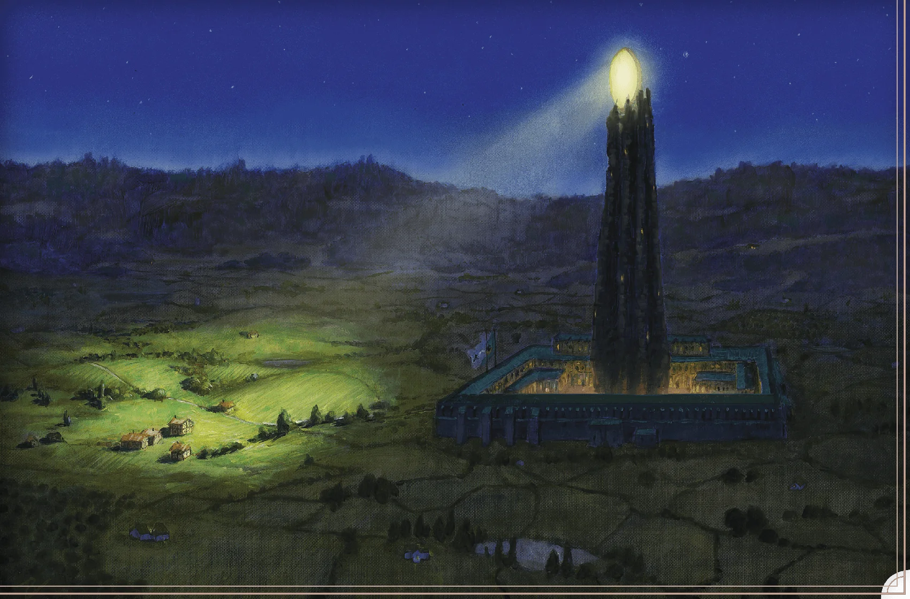

#### Velarsburg

Velarsburg is the busy heart of Harrowdale's logging and carpentry trades. Logging mills and lumberyards surround the town's cottages and workshops. A large, muddy market space fills the center of the village. The threat of fire posed by mills and lumberyards has prompted the establishment of a permanent ten-person town watch.

The people of Velarsburg know they can't overwork the forests of Velarwood or Cormanthor if they want their livelihoods to continue, and they follow centuries of tradition that include strict lumber quotas and replanting. Proud of their relationship with the forest, they consider their way of life a model that other Dalefolk would be wise to emulate.

Velarsburg is home to the Temple of the Harvest Moon and a shrine to Malar.

***Temple of the Harvest Moon.*** The Temple of the Harvest Moon is an impressive temple to Chauntea built around an ancient spire called the Tower of the Moon. The top floor of this tower was torn off long ago, supposedly by a dragon; Chauntea's priests replaced it with a massive copper disc depicting Toril's moon, used magic to make the disc give off brilliant light, and propped it up to shine through the dale like a lighthouse. The rest of the temple, a massive square building with an inner courtyard, surrounds the tower.

The folk who staff the temple spend much of their time assisting locals in planting and harvesting. In return, the folk of Harrowdale donate to the temple to see to the clergy's needs. The temple is overseen by the wood elf Thevil Oakenstaff (Medium, Neutral Good **Archpriest**).

#### Velarwood

A dangerous forest in the heart of Harrowdale, Velarwood is home to **Cloakers**, **Stirges**, **Trolls**, and **Werewolves**. Nevertheless, the lumber industry in Harrowdale depends on the Velarwood, so loggers fell trees from the edges of this forest.

One reason this work continues despite the danger is that the loggers consider themselves protected by angelic guardians within the forest. These mysterious guardians are, in fact, drow and other elves who maintain Shadowtop Glade, a shrine to Eilistraee in the northern reaches of the forest. The elves dwell in caves on either side of a deep gully shielded by wide-reaching trees. They conceal their presence from those who work the forest but are friendly to those who discover their presence, as long as the strangers vow to keep the shrine's location secret.

### High Dale

High Dale is one of the least-known dales, but that's just how the people of High Dale like it. The dale lies along a mountain pass known as Thunder Way; this pass leads from Cormyr and the town of Thunderstone east through the Thunder Peaks to the town of Saerb in Sembia. Many traders take this route, helping to sustain High Dale.

High Dale is sandwiched between the two great realms of Cormyr and Sembia. It is protected by harsh terrain, a famous company of mercenary archers, and an ancient defense treaty with Cormyr.

Although the mountainous region High Dale occupies is plagued by snow and other harsh weather in the winter, most of the dale lies atop a high plateau that's excellent for farming. Over the centuries, farmers have also carved terraces into the sides of the nearby mountains, further expanding their farms. Several small valleys branch off Thunder Way, and the people of High Dale make their homes there in rugged mountain cabins clustered in small groups.

The political and administrative affairs of High Dale are managed by a high constable chosen by the people of the dale. The current high constable is Cordance Coppercroft, a gnome engineer who led the effort to revive the dale's exhausted copper mines. High Constable Coppercroft is a respected but private individual; he accepted the job mostly so that people would stop pestering him about it. His constables gather information throughout the dale and fill out reports that he reads in his study. While such insular behavior might alarm the people of other dales, the folk of High Dale respect privacy, and they're content to let the high constable govern as he sees fit, so long as everyone is left alone to pursue their lives in peace.

*I know many songs of the Dancing Place. I don't sing them. Nothing but a bunch of self-important deities debating whether we mere mortals can be trusted with our own lives. How kind they were to let us decide our own fates! How generous!*— Alias
#### Arrowpoint

The modest stone fortress of Arrowpoint is home to the Pegasus Archery Company, a mercenary unit of a hundred **Scouts** led by a dozen **Scout Captains**. The company has friendly relationship with High Dale and its high constables; it never takes contracts that work against High Dale's interests and has vowed to defend the dale. Would-be archers from throughout the Dalelands come to Arrowpoint for instruction; the company provides training for free, since it helps the company to find recruits.

#### Copper Gulp

The copper mines in the small valley of Copper Gulp are High Dale's primary mineral resource. For years, the copper was thought to be exhausted, but gnome engineers from Hidden Vale have brought new technologies that recently reinvigorated the mines. However, kobolds moved into the mines while they were abandoned and refused to leave when the mines were reopened. The kobolds retreated deeper into the ground but defend their claim on the mines; miners opening up new shafts face ambushes and cunning traps.

#### Dancing Place

Eight centuries ago, more than a dozen deities manifested in a hidden valley a few miles northwest of High Castle, an event called the Gathering of the Gods that led to the founding of the Harpers. Ever since, this valley has been a pilgrimage site visited by thousands every year. It is said that anyone infected with a magical contagion will be cured after sleeping one night in the Dancing Place; these cures are said to be accompanied by visions of the gods, who assign a quest to the cured individual.

Clerics of Mielikki, Mystra, Oghma, Selûne, and Silvanus maintain the Dancing Place, which they have transformed into an enormous garden. The moss-covered hill where the gathering took place is surrounded by a stream that threads through a ring of duskwood trees. Temples to the deities honored in the Dancing Place fill the valley, along with hostels and other establishments that cater to pilgrims. As part of the treaty with Cormyr, a war wizard is permanently stationed here. Over the centuries, this has become a retirement posting for distinguished war wizards too physically frail to go on campaign.

The Dancing Place is well protected, though most pilgrims never notice these defenses. A group of druids known as the High Dance guards the valley's borders. Harpers keep caches of vital equipment around the valley's edge but don't interact with the temples and pilgrims so as to avoid drawing travelers into dangerous Harper operations.

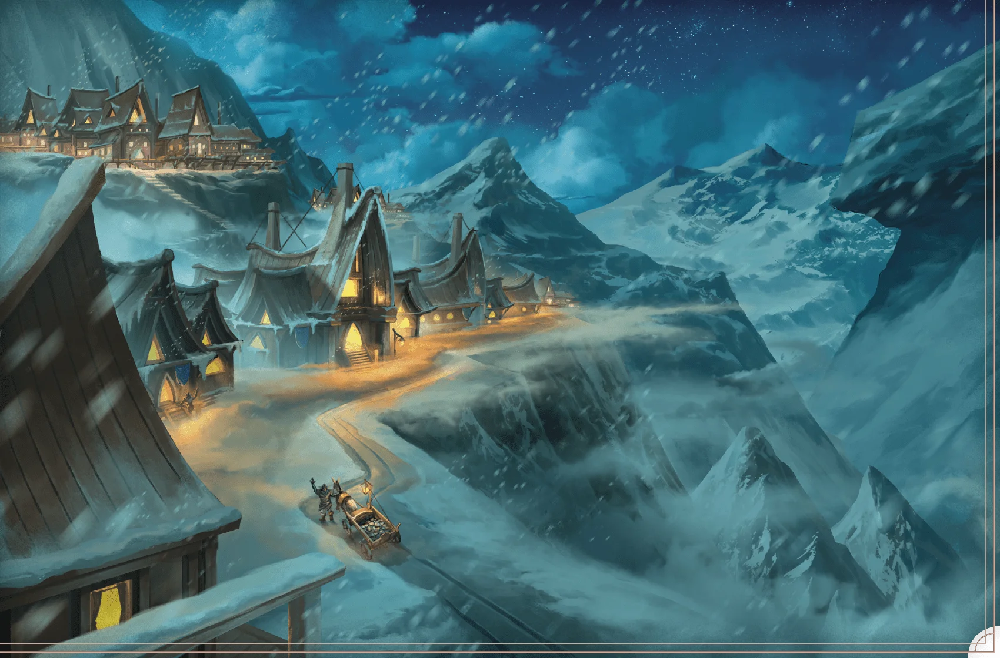

#### Hidden Vale

A large population of gnomes dwells in the remote valley known as Hidden Vale. In fall and winter, dense, swirling fog shrouds Hidden Vale, but in spring and summer, the fog retreats to reveal sweeping vistas of colorful alpine wildflowers. The gnomes dwell in ancestral cottages along the rim of the valley and traditionally kept to themselves. Over the last century, however, younger gnomes have increasingly left the vale, seeking new experiences in High Dale proper, and the families who remain in the vale have begun to welcome strangers, hoping for word of their wayward kin.

#### Highcastle

The largest village in High Dale, Highcastle, has less than a thousand inhabitants. Homes and workshops cluster around a castle that overlooks Thunder Way and gives the village its name. Winters in Highcastle can be inhospitable, with heavy snow and freezing temperatures; the High Fire Tavern is usually the only refuge in town for winter travelers. High Constable Coppercroft lives in the castle with his family and a small retinue of servants and aides. The kingdom of Cormyr has proposed sending a Purple Dragon Knight to Highcastle to serve as an ambassador and to hunt on nearby Wyvernfang, but the high constable keeps rejecting their candidates.

#### Wyvernfang

Located on the edge of the Thunder Peaks, the mighty mountain of Wyvernfang has long been a home for wyverns. Rangers climb the mountain's slopes to hunt the creatures and harvest their poison, while treasure hunters try to steal the creatures' eggs. Despite generations of such activity, however, the wyverns are more populous than ever. Hunters tell tales of unusually intelligent wyverns that rule over the others, even suggesting the wyverns construct defensive walls out of boulders along the mountain slopes and herd sheep in secure valleys accessible only by air. The Purple Dragons of Cormyr insist these reports point to **Werewyverns**, believing the mountain might be the origin point for the werewyverns' curse.

### Mistledale

Mistledale is considered one of the most fortunate dales. Its neighbors—Cormyr, Shadowdale, and the elves of Cormanthor—are friendly and powerful, and a meteor that crashed into the land centuries ago made it magically fertile. The villages of Mistledale lie along the Moonsea Ride, a trade road leading from Tilverton northeast through the forest of Cormanthor to Hillsfar on the Moonsea Coast. Every morning, thick mist rolls south from the River Ashaba to fill this valley and give the dale its name.

Six councilors, elected from across the dale, make up a ruling body called the Council of Six. They in turn select another individual to act as grand councilor and command the dale's military forces. The current grand councilor is Honorious Vinleaf, referred to as "Yer Honor." Vinleaf handles the day-to-day administration of Mistledale, saving unusual matters for the council's irregular meetings.

The villages, hamlets, and isolated farms of Mistledale communicate via sets of bells rung in specific melodies to send messages up and down the valley, an especially useful communication method when the mist is thick. Visitors to Mistledale often mistake the melodious bells for dangerous fey or signals passed by highway bandits.

#### Abbey of the Golden Sheaf

Priests of Chauntea operate the Abbey of the Golden Sheaf, whose walls enclose three square miles divided into a dozen crop fields. Silos of grain store enough food to feed the dale for years. The abbot is the wood elf Starrica Windsong (Medium, Neutral Good **Archpriest**); although she isn't one of the Council of Six, she has considerable influence. Adventurers seek her out for healing magic, which she bestows on adventurers who solve problems throughout the Dalelands. In particular, the rise of goblin, hobgoblin, and bugbear raiders on the dale's west border has attracted her attention.

*"Long have I watched shadows gather around Mistledale, but my watch will soon end.*

*If you are brave and battle wise, come to Peldan's Helm, and bring your valor with you."*— Alias
#### Ashabenford

The capital of Mistledale, Ashabenford includes a mill, stables, brewery, and workshops. Most of the village lies on the east side of the river, but the White Hart Inn on the west bank caters to adventurers. The largest house in town is reserved for the grand councilor and serves as a meeting hall for the Council of Six. Other landmarks include a temple to Tyr, a shrine to Chauntea, the famous Ashabenford Arms hotel, and the sprawling workshop of the wizened gnome Almaestaddamir Auldcastle (Small, Chaotic Good **Mage**), who has lived in Ashabenford for most of his long life.

A barrack on the north end of town houses the Riders, Mistledale's only professional military force. Citizens of Mistledale have pressured Vinleaf to relocate the Riders to Peldan's Helm to fight off the goblinoid raiders that plague the village, but he knows cavalry would be useless confined within the walls of Peldan's Helm. Instead, he keeps the Riders on alert, waiting for a signal to ride to Peldan's Helm and take besieging goblins by storm. This, however, would require Peldan's Helm to hold out for at least a day, and that's not something anyone in Mistledale is confident of.

#### Barrowfield

On the west end of the dale, south of the Moonsea Ride, rise a dozen long, low hills covered in grass and mist. These mounds, called the Barrowfield, conceal the ancient graves of Netherese warrior-wizards buried here after a long-forgotten battle. Wise travelers never camp near the Barrowfield, pushing on no matter how late the hour. **Wights** are common in this region, and the Netherese corpses wield unusual and potent magical powers.

#### Beast Country

The west edge of Mistledale, called Beast Country, has always been dangerous, but over the last few years, goblin raiders accompanied by wolves, worgs, and other creatures have gathered in the hills north of Tilver's Gap and forged into Mistledale seeking blood and plunder. Grand Councilor Vinleaf has responded to this threat by calling up the militia and putting out a plea for help to adventurers throughout the Dalelands. Rangers, foresters, and trackers fight back against the goblins, but the hills are home to beasts that the goblins use magic to command.

#### Galath's Roost

An abandoned keep stands just inside the forest of Cormanthor. Known as Galath's Roost, it has sheltered all manner of denizens over the centuries, including the bandit lord Galath, for whom it is named. Although Galath was slaughtered by a Sembian war party, his spirit (**Wraith**) haunts the ruins. This hasn't prevented the keep from being used as a base by drow infiltrators, Zhentarim smugglers, and worse. Recently, a bugbear leader named Zolbag led a war party from the Beast Country into Galath's Roost. His plan is to wait for an attack on Peldan's Helm to draw the dale's military away from Ashabenford, then descend on Ashabenford and burn it to the ground.

#### Glen

A dwarven village known as Glen lies just west of Galath's Roost on the eastern border of Mistledale. Its stone cottages are simple, one-story constructions, but most include two or three subterranean levels, often connected to other buildings by paved and well-lit tunnels. The people of Glen work underground in a complex called the Deep Mine; a single subterranean elevator provides access to this mine. The Deep Mine in turn connects to the Long Road, an Underdark highway running south under the Sea of Fallen Stars. Trade caravans travel between Glen and dwarven cities in the Underdark, taking about three months to complete the journey.

The dwarves of Glen operate a special trade in dragon eggs. Glen merchants sell rare mushrooms collected in the Underdark for exorbitant prices and use the proceeds to buy dragon eggs, storing them under the village in temperature-controlled cellars. This operation is kept secret, but the Cult of the Dragon has heard the story. The cult's efforts to steal the eggs have run afoul of Glen's diligent citizens, who protect the Deep Mine and the entrance to the Long Road against subterranean threats.

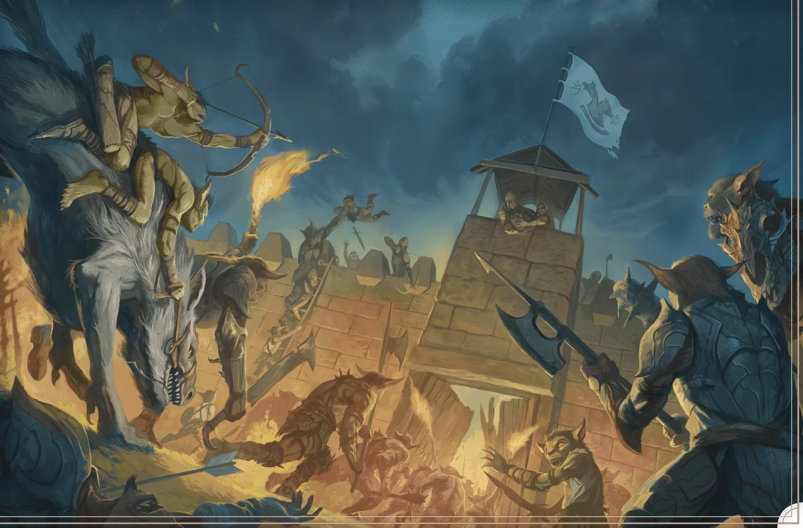

#### Peldan's Helm

North of the Barrowfield, the small village of Peldan's Helm lies along the dangerous western edge of Mistledale. A stout stone wall protects the village, and the gate is never opened between sunset and sunrise, even for known travelers, as **Ghosts** from the Barrowfield have been known to possess folk and use them to gain entrance. Recently, goblins have laid siege to Peldan's Hold twice, so bell ringers now stand ready at all times to send a call for help to Ashabenford—whose militia is a day's ride away.

### Scardale

Historically, Scardale has been one of the most influential of the dales. It benefits from clear geographical boundaries, a large population, and flourishing trade. But Scardale has a foul reputation as a home for would-be conquerors, and it has suffered many setbacks, including a terrible plague. Now, under a new ruler, the people of this realm are eager to reclaim Scardale's status as the wealthiest, most powerful, and most important dale.

Scardale lies within the Scar, a high-sided gorge that begins at Feather Falls, following the River Ashaba through the towns of Chandlerscross and Scarsdeep until it reaches Scardale Town and the Sea of Falling Stars. The Scar's width varies between fifteen to twenty miles, and the land along the shores of the river is excellent for ranching and farming. Legend has it the gorge was cut by Corellon during a legendary duel with Gruumsh.

The River Ashaba flows through Scardale, and countless farms, mills, and ranches line its shore. The current here is swift, as the river rushes from waterfall to river mouth, but the river is too shallow for oceangoing vessels to traverse. Merchants from outside the Dalelands travel to Scardale Town to barter with local traders, who then make the laborious journey upstream to sell goods in Chandlerscross.

Scardale's most infamous citizen was Lord Lashan Aumersair, who was a descendant of the legendary archmage Elminster and attempted to conquer the dales. An alliance of many Realms defeated Lashan, and for a time Scardale was ruled by a coalition of the victors of this war. Sembia, Scardale's chief trading partner, even managed to assimilate Scardale for a time. Then the infamous fallen paladin Scyllua Darkhope seized control, armed with a will declaring her Lashan's heir. Proving the apple hadn't fallen far from the tree, Scyllua also led a conquest of the dales. More successful than her father, she was nevertheless slain in turn when the folk of Shadowdale rebelled under her rule. The current ruler of Scardale is her tiefling son, Lord Kharu Aumersair. Details on Kharu can be found in "Scardale Town" below.

Among Scardale's legacies is the Shaking Plague. This magical sickness killed two-thirds of the population of Scardale Town when it erupted over a century ago, and it still surfaces occasionally in the towns along the river.

#### Shaking Plague

*Magical Contagion*

Magical experiments gone awry gave rise to Shaking Plague, which affects Humanoids. A creature suffers the following effects 1d4 days after infection:

- **Fatigue.** The creature gains 1 Exhaustion level. While the creature has any Exhaustion levels, finishing a Long Rest doesn't reduce the creature's Exhaustion level.
- **Pus Boils.** While the creature has any Exhaustion levels, its skin is covered in pus-filled boils.
- **Shaking.** While the creature has any Exhaustion levels, magic-dampening tremors afflict it. The creature has Disadvantage on Dexterity checks and saving throws, and whenever the creature casts a spell with a Somatic component, it must succeed on a DC 11 Constitution saving throw, or the spell dissipates with no effect and the action, Bonus Action, or Reaction used to cast it is wasted. If that spell was cast with a spell slot, that slot isn't expended.

***Fighting the Contagion.*** Daily at dawn, an infected creature makes a DC 11 Constitution saving throw. On a failed save, the creature gains 1 Exhaustion level as its fatigue worsens. On a successful save, the creature's Exhaustion level decreases by 1. If the creature's Exhaustion level is reduced to 0, the contagion ends on the creature.

***Spreading the Contagion.*** Any Humanoid that makes skin contact with a creature infected with Shaking Plague must succeed on a DC 11 Constitution saving throw or also become infected with the contagion. On a successful save, the Humanoid can't catch the contagion from that particular infected creature for the next 24 hours.

#### Chandlerscross

The busy town of Chandlerscross is positioned near the foot of Feather Falls. Unlike the cosmopolitan Scardale Town, Chandlerscross is inhabited almost entirely by farmers, ranchers, and artisans whose families have been here for generations. The town is patrolled by a diligent and well-mannered militia. The ruler of the town is the wood elf Abyssa Whitelock (Medium, Lawful Evil **Gladiator**), a former adventurer; she watches outsiders closely before quickly and politely urging them to move along. Those who refuse are first thrown into the town jail, then evicted from the town.

While Scardale Town was at its most lawless, Chandlerscross temporarily became the capital of the dale, but locals are happy the town has since returned to a quiet life of obscurity, unbothered by Sembians, the Zhentarim, and local crime guilds. Travelers seeking to go upriver from here must carry their boats along a laborious portage route up the edge of the Scar.

#### Scarsdeep

Oceangoing vessels can't navigate all the way upriver to Chandlerscross. The town of Scarsdeep was founded where most such vessels are forced to turn around. A comparatively young settlement, Scarsdeep draws in farmers and merchants looking to expand their market. Entrepreneurs frequently found new businesses to capitalize on this growth, and the main street of Scarsdeep is crowded with taverns, inns, gambling houses, and more, all competing for the attention and coin of newcomers.

The cliffs of the Scar nearest Scarsdeep are home to a nasty group of bandits called the Deep Daggers. They shelter in an abandoned dwarven mine they've renovated, blocking off shafts that lead to the Underdark. Most of the gang are Bandit Scofflaws, led by several **Bandit Captains** who answer to a mysterious rock gnome using the alias Scarless Jon (Small, Neutral Evil **Bandit Deceiver**). Jon pretends to be a simple tinker in Scarsdeep while casing potential robbery sites.

*This so-called 'Lord Aumersair' promises peace, law, and order. But I have heard these promises before. Men like him make good folk close their eyes to fell deeds, adding evil to evil until everyone is caught in its web.*— Alias
### Scardale Town

Scardale Town is the capital of Scardale and was once the largest city in the Dalelands, but its fortunes have waxed and waned over the years. After a long period of rebuilding, Scardale Town is growing into a proper city once more. About five thousand people call this settlement home, but the dockside neighborhood is crowded with merchants, travelers, and adventurers from across Faerûn. Adventurers can find items worth up to 2,000 GP in Scardale Town's many markets, and potentially more valuable items in the cargo of ships docked at port.

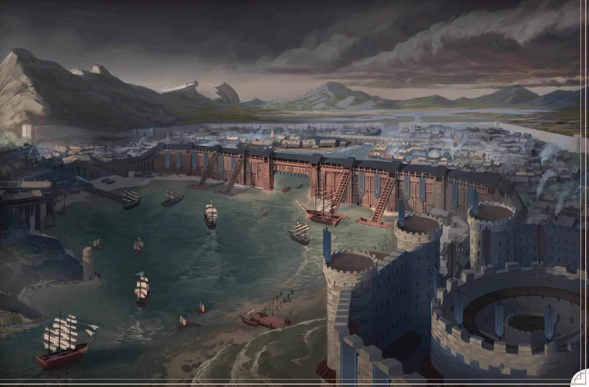

#### Lord Kharu Aumersair

Lord Kharu Aumersair (Medium, Lawful Evil **Noble Prodigy**) is the ruler of Scardale and the tiefling son of the infamous fallen paladin Scyllua Darkhope, Scardale's previous ruler. Scyllua's claim to the throne of Scardale was based on a written document, supposedly the testament of Lashan Aumersair, claiming that Scyllua was his daughter. Kharu's right to rule is also based on this document.

But Scyllua had deep ties to the Zhentarim, which benefited greatly from her rise to power in Scardale, and many Dalefolk believe the document establishing her as Lashan's heir was forged by Zhents. If the letter were ever proven to be forged, Kharu Aumersair's right to rule Scardale would evaporate.

To shore up his power in Scardale Town, Kharu has forged alliances with the town's local criminal syndicates, giving them free rein dockside as long as they help him contain the Zhentarim, the Red Wizards, and economic aggression from Sembia. Kharu is charismatic and brings order to Scardale's docks and byways; the townsfolk put up with a certain amount of political corruption if it means they can safely walk the streets at night.

If Kharu can indeed bring peace to this infamously lawless city, the people seem likely to accept his rule, but rivals like the Zhentarim and Sembia are eager to see him fall, and they intend to seize power for themselves or simply allow Scardale Town to fall back into chaos.

#### Crime in Scardale

Three criminal syndicates—the Dancers, the Shaker Gang, and the Stallions—compete in Scardale Town. The Dancers is a gang of well-armed **Toughs** with a lucrative protection racket, fleecing merchant ships and port businesses. The gang's leader is a halfling named Finchley (Small, Chaotic Evil **Tough Boss**).

The Shaker Gang runs gambling operations throughout the city as a cover for its extensive burglary operations. The human Boss Eli Sneed (Medium, Neutral Evil **Bandit Crime Boss**) commands the Shaker Gang from his palatial mansion overlooking the river.

Finally, the Stallions is a band of **Pirates** based out of the *Sea Stallion*, a wrecked galley outside Scar Harbor; the gang's primary business is smuggling, but it also hires out for short seafaring exploits if the money is good. The gang is led by the wood elf Captain Walenna Eventide (Medium, Chaotic Neutral **Pirate Captain**).

These three syndicates fought turf wars years ago and nearly destroyed each other; now they eye each other warily but usually leave each other alone. There's one thing Scardale Town's three crime syndicates can agree on: foreign powers should never again be allowed to rule the dale. It is for this reason that they've agreed to work with Lord Aumersair, regardless of his dubious claims.

#### Noteworthy Places

Scardale Town is a great port at the mouth of the River Ashaba. Scar Harbor is easily defensible with a narrow entrance leading to Port Ashaba, around which most of the town is built.

The river is crossed by two bridges: the smaller Dawnstar Bridge in the west and the larger Anvil Bridge halfway through the city. The eastern half of the town is dominated by Port Ashaba. Several inns and taverns cater to Scardale's diverse population. The Spouting Fish and the Fatted Calf are among the quietest, while the Singing Siren is infamous for its rowdy brawls. The Zhentarim uses the Dragon's Tail as a base of operations.

The oldest religious buildings in town are shrines to Tymora and Tempus that have survived the town's many calamities. The orc Sigora Swordwise (Medium, Chaotic Neutral **Priest**) maintains the shrine to Tempus, and the high elf Rhodantha Sneed (Medium, Chaotic Good **Archpriest**), who is married to the leader of the Shaker gang (see above), tends the shrine to Tymora.

***Four Dolphins Fountain.*** The famous Four Dolphins Fountain, which depicts four leaping dolphins, lies near the port. It's surrounded by a courtyard where tourists and criminals gather. But the fountain's real claim to fame is a powerful magical effect that allows individuals within the courtyard to meet privately without being scried on. Kharu Aumersair uses this property of the fountain to meet with the leaders of the town's various criminal syndicates.

***Harborwatch Keep.*** Harborwatch Keep, the ancestral home of the Aumersair dynasty, stands on the far east end of town, overlooking the entrance to Scar Harbor and Port Ashaba. The central stronghold is an impressive round tower buttressed by a curtain wall facing the sea that protects from bombardment. Lord Aumersair wants Scardale Town to become the permanent host for the Dales Council, so he's renovating the keep to make it as comfortable and attractive to his fellow rulers as possible. Ambassadors from Scardale's major trading partners—including Cormyr, Sembia, and the other dales—keep ambassadors here. The human ambassador from Sembia is Dian Selkirk (Medium, Neutral **Spy Master**); she's busy creating a network of informers in town.

***Thayan Enclave.*** The Red Wizards of Thay maintain a modest walled enclave in Scardale Town. The wizard in charge is a human named Jenla Hal (Medium, Lawful Evil **Archmage**), and she is assisted by **Mages** and a garrison of **Warrior Veterans** and **Guards**. As usual with such enclaves, the land within is considered Thayan territory, but Jenla keeps a low profile and abides by the lord's laws in an attempt to win him over and become his chief adviser. The Red Wizards trade in Common and Uncommon magic items. Jenla might acquire a Rare magic item for a character willing to do her a favor.

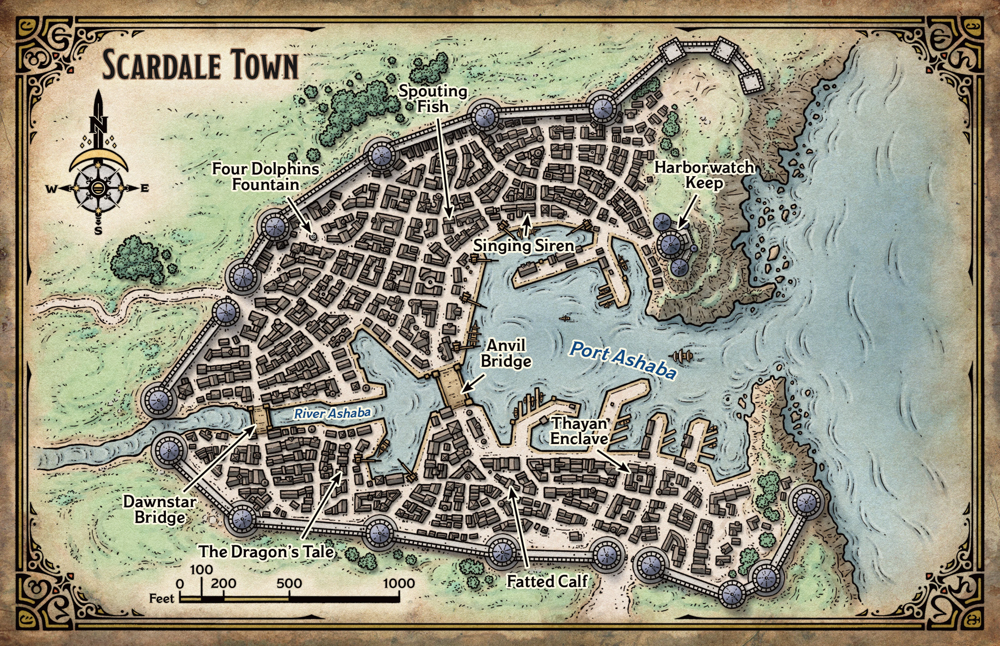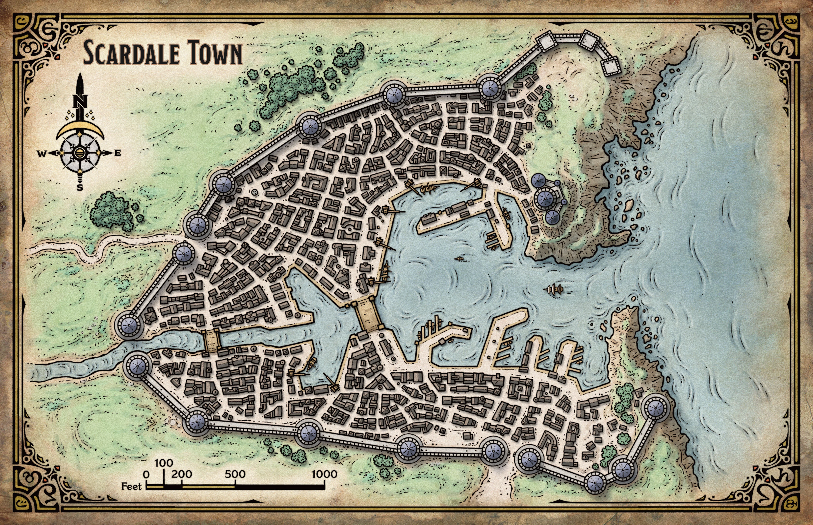
### Shadowdale

*"I have many memories of the Old Skull Inn, where my*

*sisters in the Company of the Swanmays and I spent*

*warm and pleasant evenings sharing tales with*

*Jhaele Silvermane. All those memories are false.*

*I know that now. But I cannot let them go."*— AliasIn Shadowdale, proud and stubborn families work their farms, mind their own business, and share mugs of ale with legendary adventurers. Meanwhile, the Zhentarim, evil drow from the Underdark, and other malevolent forces gather in the eaves of the forest and in subterranean tunnels, threatening the peace that generations of Dalefolk have purchased with blood and tears. More than one invasion or would-be tyrant has been stopped at Shadowdale.

The largest settlement in Shadowdale is Shadowdale Town (see below), and farmsteads, cottages, and cabins can be found throughout the forest. When it comes to claiming land in Shadowdale, there's an old truism: build close enough to see your neighbor's chimney but far enough away that you can't hear your neighbors quarrel.

Shadowdale has historically chosen its rulers by popular acclaim, selecting adventurers who've done the people of Shadowdale a great service or otherwise proven their valor and selflessness. The current ruler, Khara Sulwood, is the great-granddaughter of the former lord of Shadowdale, Doust Sulwood, but her true claim to the loyalty of her subjects is that she helped repel an assault on the town decades ago. Lady Sulwood is assisted by a loyal bodyguard named Tharinel. More information on Lady Sulwood and Tharinel can be found in "Shadowdale Town" below.

The two primary travel routes through Shadowdale are the Northride and the River Ashaba. The Northride is a well-maintained but dangerous road leading north from the rebuilt town of Tilverton through winding hills that provide havens for robbers and cutthroats; this region is called the Shadow Gap and marks the border of Shadowdale. Merchants using the Northride continue through the forest to the town of Voonlar, Shadowdale's longtime rival. Militia patrol the Northride, but guarding the road has become a rite of passage for novice adventuring parties.

The River Ashaba runs south from Daggerdale through Shadowdale Town and into the forest of Cormanthor. The river is wide and shallow, and minor flooding is common every spring. Many orc families live along the river's edge and offer ferry services for travelers, for the only nearby bridge across the river is in Shadowdale Town. The forests of Shadowdale are home to fey, including goblins of the Broken Bones clan and an extended family of centaurs called the Sylvan Guardians. These fey make travel through the forest dangerous.

#### Castle Krag

Thousands of years ago, drow built the first Castle Krag, including a large central tower and adjoining wall. Over time, however, the fortress has been home to many groups who have wished ill on the people of Shadowdale, including the Zhentarim, followers of Bane, and simple bandits. The castle has burned to the ground more than once, but as new inhabitants moved in, they have tried to clear, rebuild, renovate, and expand the old structure. Now, it is a sprawling half-buried labyrinth, home to undead, forest creatures, and outlaws.

#### Freedale

Freedale was founded two centuries ago on the banks of the River Ashaba. The goal of the town's founders was to create a new, independent dale. Like so many other would-be dales, however, Freedale briefly flourished, struggled, and eventually collapsed. Now, abandoned buildings fill the center of town, and the few families who remain live in log cabins on the outskirts.

The Evening Star Inn, an establishment that mostly caters to orc fishers, continues to be operated by the Starlight family. Recently several youths in the village—would-be adventurers—have claimed

the unstable ruins of the Red Dragon Tavern their headquarters. They meet there in their free time to plan ambitious explorations. Freedale was once home to a reclusive wizard who resided in a tower on the edge of town. This tower still stands but is long-abandoned and avoided by the locals.

See "Dalelands Adventures" later in this chapter for more on Freedale.

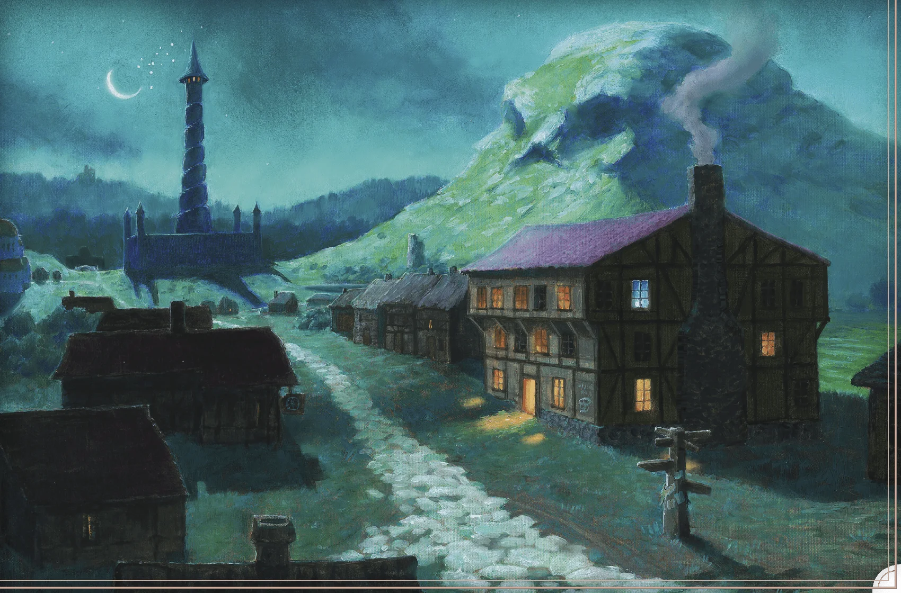

#### Shallain Freehold

Generations ago, the Shallain family of halflings built a walled homestead on the northwest border of Shadowdale. The current matriarch of the halfling family, Sunflower Shallain (Small, Neutral Good **Druid**), welcomes travelers, hoping to enlist them to deter goblin raiders, gnolls, and other dangerous creatures that threaten the homestead.

The freehold sits atop a low hill and encompasses a dozen wooden buildings surrounded by a wall of sharpened logs. The Shallain family numbers about thirty. They keep a herd of goats that graze by day and shelter within the freehold walls at night.

#### Spiderhaunt Wood

The Spiderhaunt Wood along the Northride is a den for countless spiders and related creatures, including **Giant Spiders**, **Giant Wolf Spiders**, **Phase Spiders**, and **Ettercaps**. Alchemists, assassins, and wizards come to Spiderhaunt Wood to collect arachnid venom and other rare ingredients. A single trail through the forest, the Arachnid Pathway, leads west from Stormpemhauder, a village primarily consisting of forest gnomes, to Lake Melishar, one of the few places in the woods spiders don't go. The pathway ends at the tower of Gothyl, a long-dead wizard who tried and failed to become a lich. Some believe Gothyl's tower is the resting place of the *Sword of the Dales*, a legendary *+3 Longsword* with additional unknown properties; the sword was once used in an effort to unite the dales under a single ruler.

#### Tomb of Damara

South of Shadowdale Town stands an abandoned castle that was once home to the benevolent wizard Damara. Damara possessed a potent orb reputed to have various magical properties (see *chapter 8* for the *Orb of Damara*). But he perished at the hands of an ogre warlord named Bonegnasher, who brought an army of gnolls and hobgoblins into the castle to search for the orb.

The orb was never found. Bonegnasher is long dead, and now he—along with the unliving corpses of his minions—haunts the castle. Moreover, in his tireless search for the orb, Bonegnasher ordered extensive tunnels dug under the castle, tunnels that might have broken into the Underdark.

For more information on this location, see "The Tomb of Damara" later in this chapter.

### Shadowdale Town

Located where the North Ride crosses the River Ashaba at a key bridge, Shadowdale Town is a sleepy community of about 1,500 people in the shadow of the Old Skull, a hill of pale, volcanic rock covered in lichen and grass. Shepherds graze their herds on the hill's grassy slopes, and children play atop the hill's summit. Tunnels beneath the hill extend to the Underdark, and drow invaders have used the Old Skull as an invasion route multiple times.

Lady Khara Sulwood (Medium, Lawful Good **Knight**) is the human ruler of the town and has been in power for a generation. She wears the *Pendant of Ashaba*, an Artifact that represents her authority and sustains powerful wards protecting the town. Tharinel (Medium, Neutral Good **Guard Captain**) is Lady Sulwood's most trusted ally and bodyguard, having been at her side most of her life.

#### Sage of Shadowdale

Shadowdale Town has been home to some of the greatest heroes of Faerûn, most notably Elminster and Storm Silverhand.

A great archmage and former Chosen of Mystra, Elminster lived in a former windmill on the southern edge of the Old Skull. The humble, three-story structure, covered in vines and magically restored after being nearly destroyed by assassins serving Shar, has been locked up and abandoned for a decade now. Elminster hasn't been seen in all that time.

An old sign still stands along a path leading to the door, reading "No trespassing. Violators should notify next of kin. Have a pleasant day." The tower's exterior is crowded with lean-tos and other patchwork constructions that once held Elminster's vast collection of books and magical trinkets. All these storage facilities are now empty, however.

Elminster protected Shadowdale—and indeed all of Faerûn—for centuries. It would be foolish to assume he's dead, and equally foolish to trespass in his home, so everyone gives the tower a wide berth while expecting the old wizard to show up one day as if no time had passed. A few times a year, a figure is spotted moving around inside the tower, but they're always gone by morning.

#### Noteworthy Places

Shadowdale Town includes temples to Tymora and Lathander; a general store; stables; a central well;

and many workshops maintained by the town's blacksmiths, carpenters, and other crafters. A mill lies south along the river, while farms line the north shore.

***Druid's Grove.*** North of town, well within the forest, stands a circle of ancient menhirs. Long ago, this circle was used by a group of druids, but as Shadowdale Town grew, the druids retreated deeper into the forest of Cormanthor, and this grove was abandoned.

Many fey live in and around this circle, and the border with the Feywild is thin here. Individuals with the proper knowledge can use this stone circle to travel anywhere in Faerûn or the Feywild.

***House of the Lady.*** The House of the Lady is a temple to Tymora on the far west end of town that doubles as a gambling hall and tavern. The domed temple proper is protected by a square stone wall. The wall also encloses outbuildings for the temple staff and occasional guests. The temple is overseen by the halfling priest Marigold Gambol (Small, Chaotic Good **Priest**), a lifelong resident of Shadowdale. Marigold considers herself Shadowdale's chief protector now that Elminster is gone. She works tirelessly in the shadows to collect rumors and keep an eye on strangers in town. In public, she appears carefree, but she is quick to pull influential residents aside to remind them of the threat posed by drow cultists or the Zhentarim.

***Morningdawn Hall.*** Shadowdale's first temple to Lathander, Morningdawn Hall, was an ostentatious landmark: a magically constructed edifice in the shape of a phoenix with its wings outstretched. But that temple was destroyed long ago. A replacement was funded by adventurers eager for curative magic after repeated expeditions to the Underdark, and it better suits the insular and unobtrusive folk of Shadowdale. It boasts a tall spire rising from an eastward-facing prayer hall. Adjoining buildings house clergy and lay assistants. The new temple retains the name of the original.

The high elf priest of Lathander is Adanar the Open-Handed (Medium, Neutral Good **Priest**), a former adventurer who lives in the spire. Although he's known for his commanding and charismatic presence, Adanar finds joy in the quiet personal acts of his faith, tending to the people of Shadowdale and providing them wise counsel. Adanar's magic is modest, but he does have a *Spell Scroll* of *Raise Dead*.

***Old Skull Inn.*** The Old Skull Inn is one of the most famous meeting spots for adventurers in Faerûn. Its three stories include a large ground floor taproom and almost thirty sleeping rooms, each with a colorful name like "Numpkin's Rest," "The Onyx," or "The Huntsman's Room." Cellars connect to catacombs beneath Old Skull hill and provide access to the Underdark.

The current proprietor, the halfling Mungo Silvermane (Small, Neutral Good **Commoner**), is still earning the trust of the regulars, but he has a practical head on his shoulders and a knack for puns. He's put this latter talent into practice with weekly pun contests; the winner of each event gets their tab cleared.

Any trouble in the inn is rapidly put down by well-armed patrons. A few Common magic items are usually available in the inn, offered for sale by adventurers eager to sell loot.

***Tower of Ashaba.*** The Tower of Ashaba is a stone fortress raised by ancient and evil powers long ago. An off-balance tower rises five stories from a tall, square, stone stronghold; this tower's bizarre shape has earned it the name "the Twisted Tower." The tower was a stronghold for drow cultists until the water wizard Ashaba drove them out four hundred years ago and became the first lord of Shadowdale. The rulers of Shadowdale have dwelled here ever since, fighting off assaults by Zhentarim, would-be tyrants, and others.

Lady Sulwood is master of the tower now and maintains a garrison of a hundred **Guards** under Tharinel's command. The tower's three subterranean levels include entrances to the Underdark, only some of which have collapsed or been sealed off.

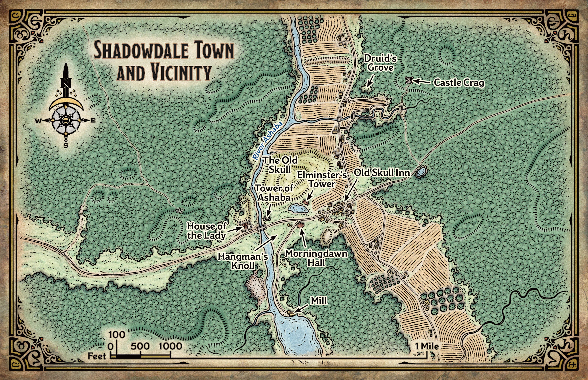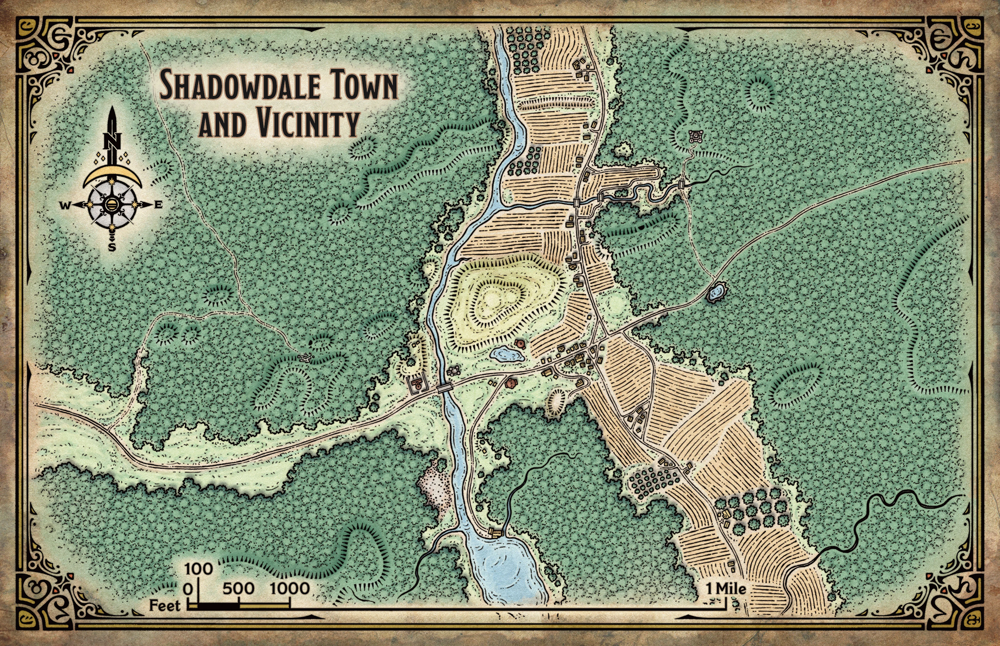
### Tasseldale

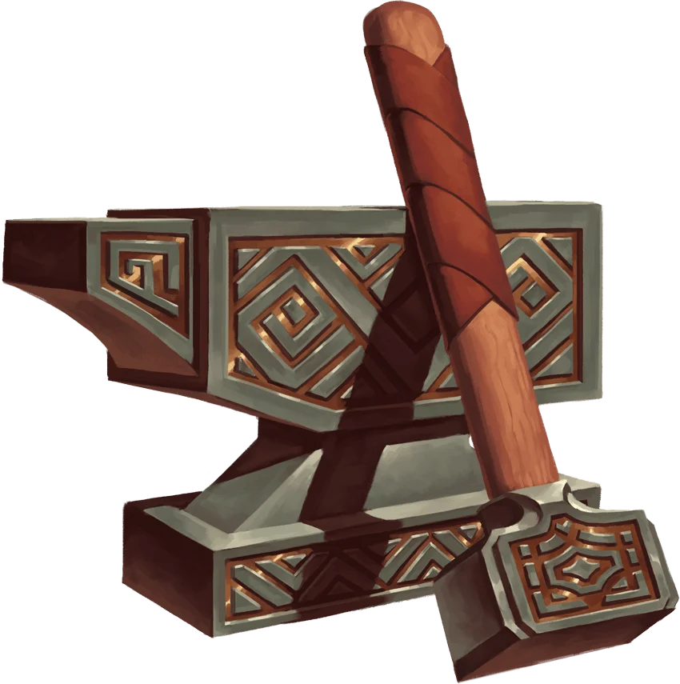

Tasseldale is a land of wide-open spaces. The twelve villages, or tassels, of Tasseldale are connected by the Tasselway, a road that cuts through rolling, mist-covered grassland crisscrossed with streams flowing north into the River Ashaba.

The most notable tassels include Archtassel, Arrowmark, Glaun, Halfcrag, Moontassel, Tasselheart, and Tegal's Mark. The others are so small as to be mere hamlets, with no more than a few dozen buildings. The people of Tasseldale are proud farmers, ranchers, and crafters. Tasseldale is synonymous with the forging of excellent swords; the capital of Tegal's Mark is the heart of this tradition.

The ruler of Tasseldale is Grand Marshair Rora Rudiland (Medium, Lawful Good **Warrior Commander**), a devotee of Tyr and graduate of the Abbey of the Just Hammer (see below). She is advised by the Elder Council, consisting of one representative from each of the twelve tassels. An excellent swordfighter, Rora inspects the work of Tasseldale's swordsmiths in an annual fair held in the capital of Tegal's Mark.

The dale is defended by the Marshairs, a company of sixty mounted warriors who patrol the dale and keep the peace; in time of war, however, Tasseldale can raise a large militia of veteran swordfighters, many of whom carry high-quality swords passed down as family heirlooms.

Among the other dales, Tasseldale has a long rivalry with neighboring Archendale. The roots of this dispute stretch back into murky history, but the heart of it seems to lie with a murdered forester in the Arch Wood, on the border between the two dales. This feud erupts into violence every generation, as hotheaded youths grow weary of the cautionary tales told them by elders and seek out their rivals under cover of the trees.

Tasseldale's long relationship with its wealthy, aggressive neighbor Sembia has shaped this realm and its people. Other folk of the Dalelands dismiss the people of Tasseldale as weak-willed compromisers who give in to Sembia's every demand in order to avoid being conquered. But those who dwell in Tasseldale know that Sembia can't be countered through force; diplomacy and strength of character will always win the day. This was proven true when Sembia invaded decades ago. When the effort stalled, Sembia sent in enough mercenaries to finish the job, but the cost in blood and treasure proved too high. About fifteen years ago, Sembia retreated from Tasseldale, returning the realm to independent rule.

#### Abbey of the Just Hammer

The Abbey of the Just Hammer is dedicated to Tyr and, along with the Monastery of the Sun Soul, is responsible for the taming of the Dun Hills. The abbey was the site of a legendary battle when Deren Eriach, Lord High Justicar of the abbey, slew the ancient green dragon Sirvinhandra with a *Holy Avenger (Greataxe)* dubbed the Axe of Heavenly Fire. The axe went on to be wielded by a succession of heroes but has been returned to the abbey and is now displayed above the foremost altar to Tyr. Sirvinhandra's lair was never found, though green dragons have since been sighted in the region.

The abbey provides legal education to citizens of Tasseldale, making it one of the few places for advanced education anywhere in the Dalelands. Lawyers and judges who complete their training at the abbey are offered lucrative employment throughout the Heartlands, but many help the poor and unfortunate instead.

#### Glaun Bog

The Glaun Bog is a fetid swamp west of the Dun Hills, home to **Perytons**, **Trolls**, **Will-o'-Wisps**, **Wyverns**, and countless goblins. Pits of quicksand make travel perilous, and at the center of the bog lie ancient barrows inhabited by **Wights**. But the bog is rich in iron deposits, and swordsmiths of Tasseldale covet this iron for their work.

Fortunately, locals from the village of Glaun know the bog well. They have learned how to avoid the worst of the bog's dangers, and they venture in to gather iron for smelting and peat for burning. Adventurers looking to explore the bog would be wise to hire one of these locals as a guide.

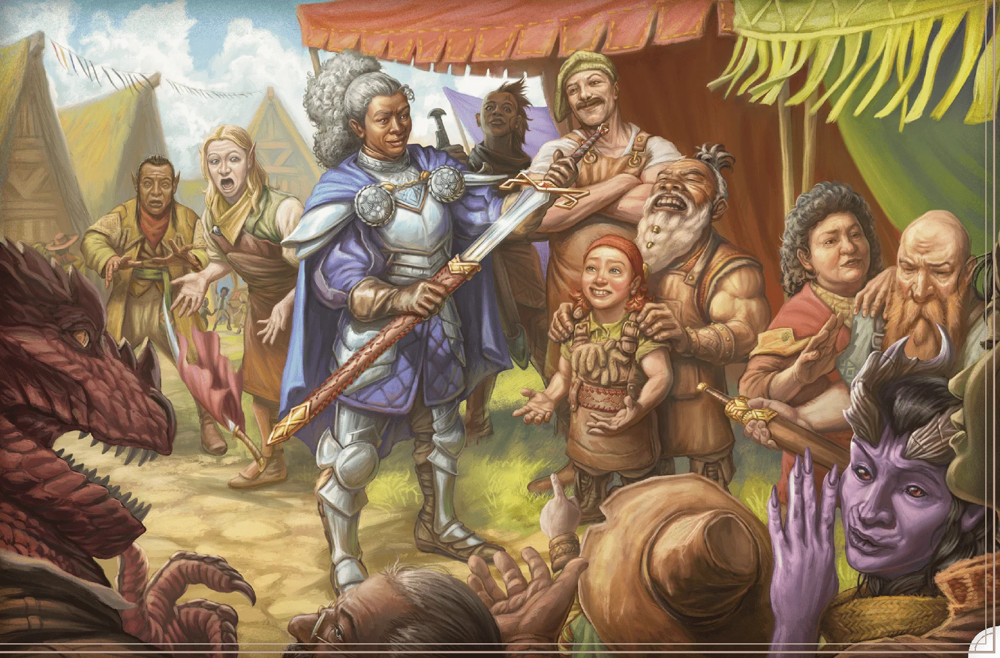

#### Monastery of the Sun Soul

Centuries ago, monks following a path known as the Way of the Sun Soul selected a ruined fortress in the Dun Hills as their new home. They rebuilt the Monastery of the Sun Soul despite frequent goblin raids, and ever since, the monks have cooperated with the Abbey of the Just Hammer to keep Tasseldale safe.

The monks accept every prospective student who comes to their door, but the grueling training regimen repels many students, and others tire of the monastic life. The monks' philosophy emphasizes intense spiritual discipline that focuses the soul into a fiery source of blazing power. Students unusually attached to wealth and a desire for money receive the most rigorous training and scrutiny.

#### Tegal's Mark

The capital of Tasseldale is Tegal's Mark, a picturesque village situated between two forested hills and surrounded by gardens that include a shrine to Chauntea. An old elven watchtower known as the Sharburg was long ago repurposed and now functions as the home to Grand Marshair Rora Rudiland. Rora hosts the Tassel Elders at the Sharburg, and the fortress also houses barracks for her Marshairs and a dismal dungeon for prisoners.

Tegal's Mark is where the dale's legacy for sword smithing got its start, as the village was founded by the swordsmith Tegal centuries ago. Adventurers seeking excellent swords travel here from across Faerûn. But the smiths of Tasseldale are infamously picky about whom they deal with, turning away buyers they judge beneath their efforts while making others wait for long periods at one of the village's many taverns, including the Markhouse, the Royal Flagon, and the Sword and Sash, the latter of which boasts the village's only theatrical stage.

The village includes dozens of vacation homes owned by wealthy Sembian families. These opulent manors are empty most of the year, and locals have come to resent them. Outlaws occasionally take refuge in these houses, and they're often burgled, all of which has led their Sembian owners to protect them with layers of security including locks, deadly traps, mechanical guardians, and magical wards. Several Sembian merchant companies keep warehouses and administrative offices here, making Tassel's Mark an even more lucrative target for thieves.

## Dalelands Stories

The Dalelands is a place for adventure in the oldest D&D tradition, and at its heart lies the forested megadungeon of Myth Drannor.

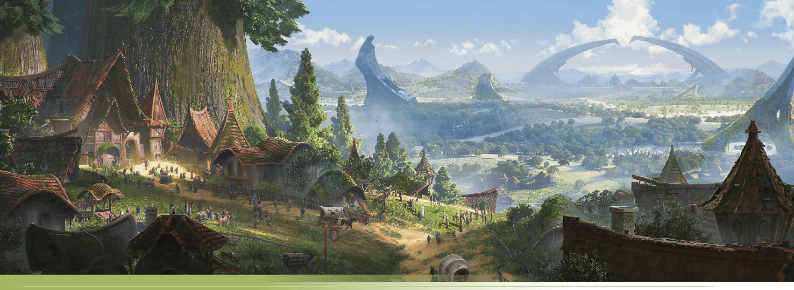

### Classic Heroic Fantasy

A wizard's abandoned tower rises on the edge of town. An insidious cult hides its ghastly rituals in a warren of caves. Drow cultists raid from the Underdark. Hostile and benevolent fey fill the nearby forest, within which a dragon makes its lair. These are elements of classic heroic fantasy adventure, and they perfectly describe life in the Dalelands. This makes the Dalelands particularly appropriate for DMs and players who enjoy D&D's most well-established tropes.

This aspect of the Dalelands also makes it a good place to set adventures originally written for other settings. Locations such as the Keep on the Borderlands and nearby Caves of Chaos, both detailed in *D&D Starter Set: Heroes of the Borderlands*, fit well here, as do the *Sunless Citadel* and *Forge of Fury*, both detailed in the adventure anthology *Tales from the Yawning Portal*.

### A Home Worth Defending

A campaign in the Dalelands could involve the characters building a home and legacy while defending themselves from dangerous forest creatures, Zhentarim agents, and mysterious menaces from the Underdark. In a campaign of this sort, the characters make up a family and friends who inhabit a Dalelands homestead. The head of the family might be a retired adventurer, or there might be former adventurers in the family's ancestry. Other characters have prominent roles around the homestead as, for example, the blacksmith, cook, or herder. The challenges of running the homestead can mix with the combat and exploration present in any D&D campaign.

Adventure can also come to the homestead. Goblin, hobgoblin, and bugbear bandits raid from the eaves of the forest. Moander's corruption of Cormanthor creates blights and bizarre monsters that threaten everyone in the dale. Zhentarim agents try to buy property that stands atop buried caches of treasure, and when the owners refuse to sell, the Zhents respond with threats and violence. As the homestead grows, it draws ever more attention from enemies and jealous rivals.

And the characters also travel, going to Shadowdale Town or Scardale Town to sell their wares, resupply, and get the latest gossip. They go on adventures when, for example, a member of the family falls victim to a magical contagion and the only cure lies buried in Myth Drannor.

Finally, when danger threatens families throughout the dale, the characters rise to leadership roles, uniting the dale together and marshaling a common defense. Eventually, the characters join the local council, adopt titles, or are elected leaders of the dale.

### Adventures in Myth Drannor

The vast, ruined city of Myth Drannor provides endless adventure in a fantastic, magical locale. While you can make exploring Myth Drannor the focus for a campaign, you might begin with brief expeditions into the city. The party might need to recover a magical heirloom lost within Myth Drannor or stop the Cult of the Dragon from exploiting an ancient elven magical experiment.

In a campaign focused on Myth Drannor, the city is a sandbox the characters explore at their own pace. Give them opportunities to research the city and learn where to investigate next. When they're low level, the characters probe the outskirts of the city, where woodland beasts and fey are common. As the characters gain experience, they can enter Myth Drannor proper, where they encounter ancient elven mysteries, roving fiends, and rival treasure hunters. Eventually, the characters explore the city center and the wreckage of Thultanthar, battling phaerimm and Netherese creatures altered by long exposure to the Shadowfell.

In between their excursions into Myth Drannor, the characters can undertake adventures in other parts of the Dalelands.

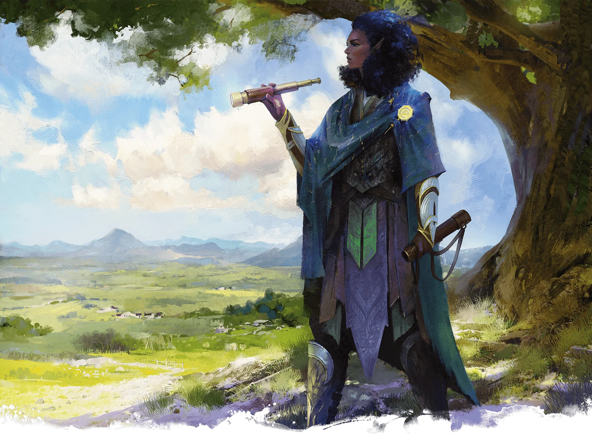

## Dalelands Conflicts

Each dale in the Dalelands has its own local problems, ranging from goblin bandits to a hungry dragon. But the threat of Moander, god of rot and corruption, looms over the Dalelands as a whole.

### Heroes of the Dalelands

Conflict in a campaign focused on exploring the Dalelands doesn't come from one villain in particular. Instead, the adventurers pit themselves against disparate threats all over the Dalelands. As the party goes from one dale to another, they meet and befriend important NPCs, solve problems, and rise in notoriety and power. An important element of this is the party's role restoring the village of Freedale; success in this venture encourages rulers throughout the Dalelands to treat the characters as equals.

#### Heroic Goals

This campaign is driven by the goals of the characters—to explore the Dalelands, help Dalefolk, and bring peace and prosperity to the dales—not the goals of a single insidious villain.

#### A Dalelands Arc

The adventurers' rise to fame in the Dalelands might follow this broad outline.

***Levels 1–4.*** The characters come together in the Old Skull Inn, where they're hired to recover a book from a lost library. Use "*The Lost Library of Lethchauntos*" in chapter 7. Their success on this quest brings them to the attention of Lady Sulwood, who sends them on the adventure "The Tomb of Damara" in this chapter.

***Levels 5–10.*** Now proven heroes, the party is asked to return prosperity and hope to Freedale. You can use "Restoring Freedale" in this chapter. The characters become the rulers of Freedale, with one character sitting on the Dales Council. In further adventures, the characters travel to each dale, solving problems and earning goodwill. You can use "The Temple of Transmutation" in this chapter as part of this story. The party might even eventually try to recover the legendary Sword of the Dales and unite the Dalelands!

### Moander, God of Rot

Moander is the god of corruption and rot, and heroes in the Dalelands have battled him for centuries. The hero Alias left Moander's rotting corpse on a hill in Cormanthor. But a god isn't so easily killed.

#### Moander's Goals

Moander's ultimate goal is nothing less than the corruption of Toril itself. To attain this goal, Moander corrupts the forest of Cormanthor and seeks to consume the magic of Myth Drannor.

#### A Moander Arc

The conflict between adventurers and Moander might follow this broad outline.

***Levels 1–4.*** Adventurers encounter Moander's corruption when they enter Cormanthor, where **Twig Blights**, **Needle Blights**, and **Vine Blights** have made roads and trails dangerous. The party can follow the trail back to a fetid pit of rotting vegetation, home to a **Gibbering Mouther**.

***Levels 5–10.*** The party is tasked with investigating the Citadel of Fungi. **Shambling Mounds** and **Tree Blights** prey on anything that comes near. An **Aberrant Cultist** rules the citadel, protected by a **Violet Fungus Necrohulk**.

***Levels 11–16.*** The characters descend into Rotting Gorge, a vast underground maze of slimy mushroom-covered caverns, home to **Spores of Moander**, a **Gulthias Blight**, and an **Adult Green Dragon**. A **Death Tyrant**, reanimated by Moander's evil magic, hates its own existence. With its dying breath, it warns the characters that Moander seeks to return in a form so hungry and destructive no one can stand against it.

***Levels 17–20.*** Moander manifests as a **Blob of Annihilation** to enter Myth Drannor and feed on the ancient magic of the broken city, becoming even more powerful.

*Perhaps leaving the stinking corpse of the god of corruption to rot in a magic forest was less than wise, but what were we to do? It swallowed me, then we were flying, there was a portal, and... It's a long story.*— Alias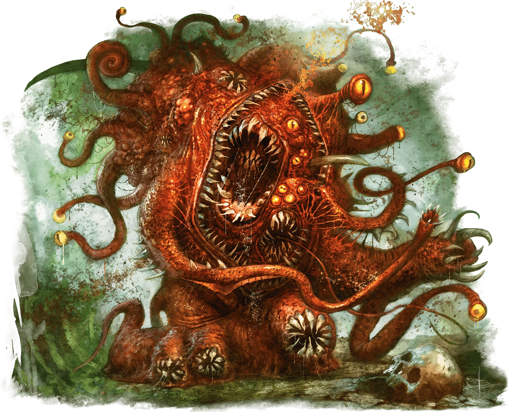

## DM's Toolbox

This section provides tools useful for adventures in the Dalelands.

### Renown in the Dalelands

You can use the renown rules in *chapter 3* of the *Dungeon Master's Guide* to track the relationships the party builds with each dale. Track renown for each dale separately, so a character might have higher renown with Shadowdale than with Scardale. Characters who complete adventures that benefit all the Dalelands gain renown with every dale.

#### Dale Renown

Characters gain renown with a dale when they defend it from danger, explore adventure sites there, and contribute to the health and prosperity of its citizens (by, for example, providing healing magic or employing locals in useful trades). Individual dales might have other ways to gain renown and have unique rewards. For example, Daggerdale might grant renown for recovering dwarven relics from Tethyamar.

##### Dale Renown
| Renown Score | Reward                                                                                                                                                                                                    |
|:------------:|-----------------------------------------------------------------------------------------------------------------------------------------------------------------------------------------------------------|
|      3+      | All citizens of the dale are Friendly to you by default.                                                                                                                                                  |
|      5+      | Merchants in the dale give you a 10 percent discount on all nonmagical wares.                                                                                                                             |
|      10+     | Inns in the dale offer you complimentary room and board, providing you a Modest lifestyle for free.                                                                                                       |
|      15+     | You are given a leadership role in the dale's militia. You can call on up to three **Guards** to aid you on a mission. Once you use this reward, you can't do so again until your Renown Score increases. |
|      25+     | Those in the dale offering spellcasting services will cast spells up to level 3 for free (not including the cost of any Material components consumed by the spell).                                       |
|      30      | The first time your Renown Score reaches 30, respected members of the dale entrust you with a random Rare magic item.                                                                                     |
|      40+     | You have a place in the dale's leadership. Respected members of the dale openly provide you information about citizens, ongoing investigations, and local places.                                         |

### Dalelands Bastions

The adventure "Restoring Freedale" in this chapter establishes the characters as the leaders of Freedale, a village that was once the heart of its own small dale—and that might rise to that status again. Freedale becomes the party's Bastion, with the village's buildings serving as the Bastion's facilities. As the characters' Bastion grows larger, they reclaim and rebuild more of the village.

If the characters can befriend Freedale's remaining inhabitants, the village's citizens will support the characters in their effort to bring peace and prosperity to Freedale once again.

#### Bastion Characters

This section describes unique individuals in Free-dale who might assist the characters as hirelings.

***New Knights of Myth Drannor.*** Teens who call themselves the New Knights of Myth Drannor have made the ruined Red Dragon Tavern their clubhouse. At first, they're skeptical of anyone who claims to be an adventurer, but once they see the characters in action, they become the party's biggest fans. They graciously make the characters honorary New Knights of Myth Drannor and welcome them into the clubhouse; they also try to tag along on any adventures and pester the characters to teach them adventuring skills. The teens could serve as hirelings or even Bastion Defenders.

***Orebreaker the Smith.*** The oldest person in Freedale is an ancient dwarf named Orebreaker. Although he's famous as one of the greatest blacksmiths in the Dalelands, most people assume he died long ago. Orebreaker misses the hustle and bustle of Freedale's glory days, and if a character constructs a Smithy in their Bastion, Orebreaker offers his services.

***Starlight Family.*** The Starlight family runs the Evening Star Inn and includes Patric and Emma Starlight and their children Ban, Nissa, and Woolsey. The lack of trade and travel in Freedale has left the family in dire straits. If the party completes "Restoring Freedale" and makes the village safe for travelers again, Patric and Emma volunteer to assist the party as hirelings. The Starlights would serve best in a facility such as a Garden or Storehouse.

***Taran Goldenstar.*** Taran Goldenstar is a self-styled "elflord" skilled in swordplay and arcane magic. He has dwelled in Freedale for two centuries and knows every inch of the surrounding forest. The characters win Taran's friendship if they destroy the *Orb of Damara* after completing the adventure "The Tomb of Damara "; he then offers to assist them as a hireling, serving in an Arcane Study, Armory, or Barrack.

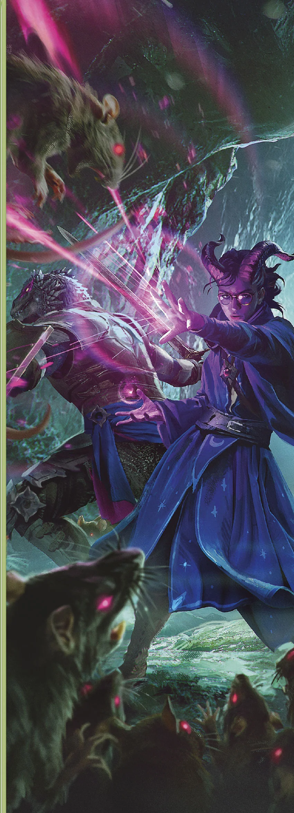

### Encounters in Cormanthor

Roll 1d20 on the Cormanthor Encounters below to generate encounters in Cormanthor. Alternatively, roll 1d10 if the party is exploring away from Myth Drannor, 1d10 + 5 if the party is exploring near Myth Drannor, or 1d10 + 10 if the party is inside the city walls.

<table class="rd__b-special rd__b-data  rd__b-data--stats">
		<thead>
			<tr>
				<th class="rd__data-embed-header ve-text-left" colspan="6" data-rd-data-embed-header="true">
					

						

							Cormanthor Encounters
							
						

						[–]
					

				</th>
			</tr>
		</thead><tbody class="" data-rd-embedded-data-render-target="true"><tr>
			<td colspan="6" data-rd-tag="table" data-rd-uid="Cormanthor Encounters|FRAiF" data-rd-page="tables.html" data-rd-source="FRAiF" data-rd-hash="cormanthor%20encounters_fraif" data-rd-name="Cormanthor Encounters" data-rd-display-name="Cormanthor Encounters" data-rd-style="" data-rd-entry-data="{}">
				<i>Loading <a href="tables.html#cormanthor%20encounters_fraif"  onmouseover="Renderer.hover.pHandleLinkMouseOver(event, this)" onmouseleave="Renderer.hover.handleLinkMouseLeave(event, this)" onmousemove="Renderer.hover.handleLinkMouseMove(event, this)" onclick="Renderer.hover.handleLinkClick(event, this)" onwheel="Renderer.hover.handleLinkWheel(event, this)" ondragstart="Renderer.hover.handleLinkDragStart(event, this)" data-vet-page="tables.html" data-vet-source="FRAiF" data-vet-hash="cormanthor%20encounters_fraif" ontouchstart="Renderer.hover.handleTouchStart(event, this)" >Cormanthor Encounters</a>...</i>
				
			</td>
		</tr></tbody></table>
## The Tomb of Damara

- **A Location (Dalelands) Adventure for Level 3 Characters**

*Recover an artifact from an undead ogre.*

- **Situation.** The spirit of the ogre warlord Bonegnasher grows restless and seeks Damara's fabled orb.
- **Hook.** Lady Khara Sulwood calls the characters to Shadowdale Town and asks them to enter the Tomb of Damara and destroy Bonegnasher, who has returned from death. Bonegnasher has captured a Dalefolk family, the Silverstars, but Sulwood doesn't know why. Sulwood offers to pay each character 100 GP and suggests the tomb might have other plunder.

### Encounters

Bonegnasher dwells in a ruined castle with subterranean tunnels. Use the map on this page, with the characters entering via the area labeled "Start." The following encounters happen in the corresponding areas.

***Barrack and Great Hall.*** Two **Ghouls** dwell in the barrack. If creatures enter the barrack or make loud noises in the great hall, the monsters pounce.

***Prison.*** The four members of the Silverstar family (Medium **Commoners**) are being kept prisoner here in the corner cell. A **Hobgoblin Captain** and two **Hobgoblin Warriors** are interrogating the family. The hobgoblins are Hostile to anyone other than Bonegnasher who interrupts their work. The youngest Silverstar, Sara, is hiding the key to Damara's tomb. Once rescued, Sara gratefully gives the key to her rescuers.

***Garden.*** An Indifferent **Giant Frog** lives here.

***Storeroom.*** Six **Giant Rats** lurk among the splintered crates and ambush anyone who approaches. As a Study action, a creature can make a DC 10 Intelligence (Investigation) check to look for useful supplies, finding a *Potion of Healing* and five days' worth of Rations on a successful check.

***Bonegnasher's Den.*** Bonegnasher (use the **Specter** stat block, but Bonegnasher is Large) takes a break from interrogating the Silverstars here with his two pet **Wolves**. He is Hostile toward any unfamiliar creature that enters his room.

***Vault.*** The vault contains 200 GP.

***Armory.*** A **Carrion Crawler** lurks on the ceiling. Inside the armory is a *+1 Longsword* and *+1 Shield*.

***Mine.*** A **Gelatinous Cube** roams the cavern.

***Damara's Tomb.*** The magic door to this hidden chamber can be opened only with the key kept by Sara Silverstar. Damara is now a **Mummy** protected by two **Shadows**. In addition to the *Orb of Damara*, the tomb contains a *Spell Scroll* of *Fireball*, and 500 GP.

***Conclusion.*** Lady Sulwood pays the characters as promised on the defeat of Bonegnasher. She says the party can keep any treasure they found while exploring the tomb; if the characters have the *Orb of Damara*, she recoils at its presence, citing its ominous history and suggesting that the characters find a way to destroy the relic.

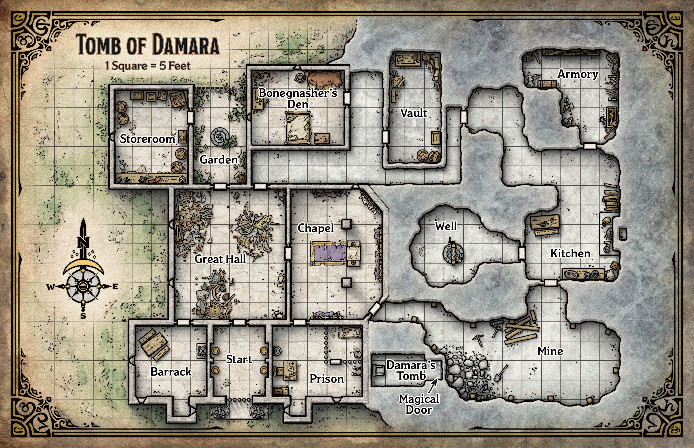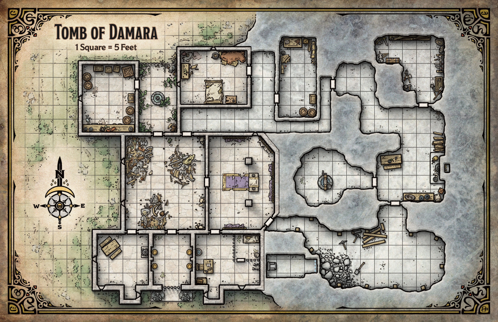
## Restoring Freedale

- **A Location (Dalelands) Adventure for Level 5 Characters**

*Bring peace and prosperity to the newest dale.*

- **Situation.** The characters are asked to reinvigorate the faded settlement of Freedale, but they'll have to defend it from enemies.
- **Hook.** The Dales Council summons the characters and asks them to become the new leaders of the settlement. They can turn the settlement into their Bastion (see "Dalelands Bastions ").

### Encounters

As the characters settle into Freedale, they must build relationships with the locals and clear out old buildings that house mysterious threats. Use the map of Freedale below. The characters can explore these locations in any order, but the Zhentarim Foes encounter concludes the adventure.

***Harrow House.*** Harrow House, an old mansion far outside the village is haunted by Gunter Weiss, a wizard who died and returned as a **Vampire Nightbringer**. Use the *Spooky House map* in the *Dungeon Master's Guide* for Harrow House. Gunter's various Undead minions—1d4 **Flameskulls** and 2d6 **Shadows**—patrol the house.

***Wizard's Tower.*** Freedale was once home to a wizard named Morganth the Mysterious. His tower stands on the east side of the village; use the *Wizard's Tower map* in appendix B of the Dungeon Master's Guide. The tower is trapped with the fire-casting statue trap described in chapter 3 of the Dungeon Master's Guide. Morganth's **Shield Guardian** still patrols the tower; the controlling amulet is on Morganth's corpse in the tower's dungeon, where a **Ghast Gravecaller** now hides, along with three **Ghouls**.

***Temple of Lathander.*** The Cult of the Dragon secretly performs ghoulish rites by night in this abandoned temple. If the four **Cultist Acolytes** and their **Death Cultist** leader can be routed, the characters could reopen the temple and earn the goodwill of Freehold's citizens.

***Zhentarim Foes.*** As soon as the characters arrive, Zhentarim agents discourage them from staying and threaten violence. Eventually, the Zhents make good on that threat, attacking Freedale when the Bastion is near completion.

Stage this assault in multiple waves, and describe additional hostile forces fighting any Bastion Defenders the party might have. First, the characters must face a **Tough Boss** who leads a force of two **Toughs** and four **Dire Wolves**. Then, the Zhents send a shock force of four **Bearded Devils** against the characters. If the devils are defeated, the Zhentarim leader (**Assassin**) and five **Toughs** fight the party.

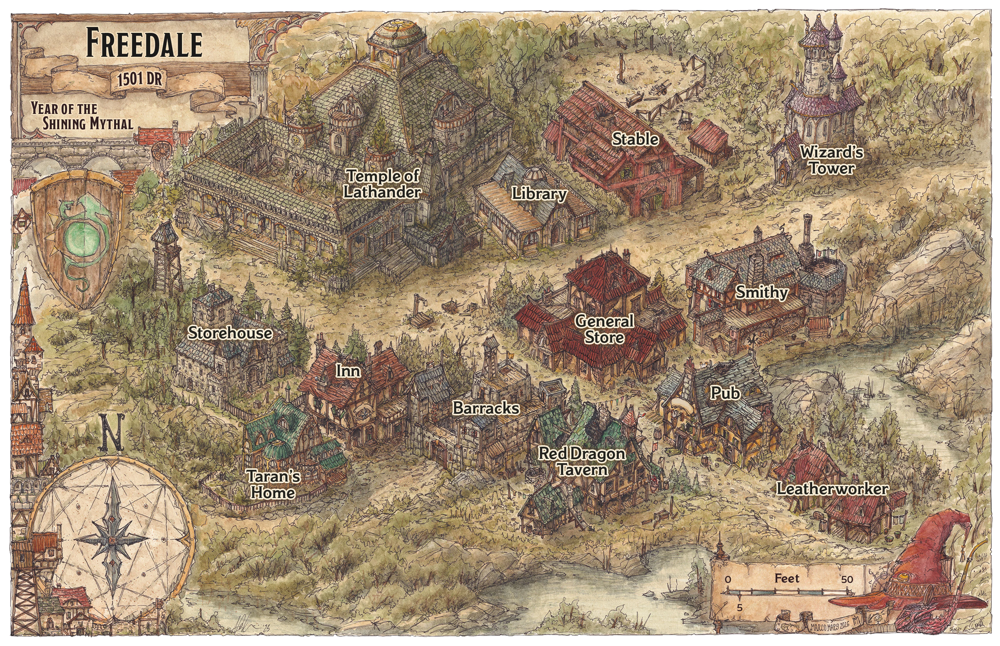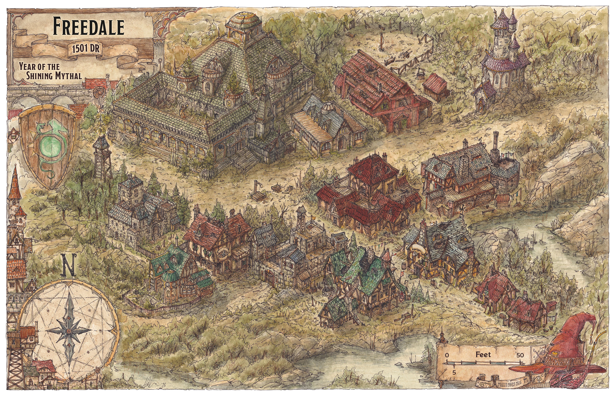
## The Temple of Transmutation

- **A Location (Dalelands) Adventure for Level 7 Characters**

*Explore the magic of Myth Drannor*.

- **Situation.** Letha Salen, a Shadovar survivor of the crash of Thultanthar, has entered the Temple of Transmutation, an ancient magical research institute in Myth Drannor. Using a transmutation chamber in the temple, she's transforming people and animals into monsters under her command.
- **Hook.** Monster attacks on the edge of Cormanthor suddenly increase. Foresters report the creatures are coming from a large ruin just inside the walls of Myth Drannor. The leader of the local dale, or perhaps the Dales Council, asks the characters to find out what's going on and stop the monster attacks.

### Encounters

The party travels to Myth Drannor. Once the characters reach the site, use the map on the facing page for the Temple of Transmutation. Other levels of the temple are blocked by rubble.

In their exploration, the characters meet Humanoids and Beasts that have been shape-shifted into various creatures. A character who succeeds on a DC 15 Intelligence (Nature) or Wisdom (Insight) check recognizes a shape-shifted creature as a former Humanoid or Beast, respectively. When any of these transformed creatures die, the shape-shifting effect ends, and they return to their true forms. If transformed back to their original shapes while still alive, Letha's minions are **Guards** and Letha is a **Mage**.

This adventure includes the following encounters.

***1: Baxton Cottage.*** A rustic cottage is under attack by a **Chuul**, an **Ettin**, a **Flameskull**, and a **Helmed Horror**, minions of Letha Salen who have been shape-shifted. A halfling named Beauregard Baxton is trapped inside with his four family members (Small, Neutral Good **Commoners**). When one of the creatures is defeated, the rest flee, returning to area 9 to tell Letha about the party. Once rescued, Beauregard welcomes the party into his home. He has lived peacefully in the shadow of the temple for decades, but recently strange monsters have emerged from it and kidnapped his brother Brandon. The party can use his home as a place to rest as they investigate.

***2: Crossroads.*** A goat shape-shifted into a **Tyrannosaurus Rex** grazes peacefully. If threatened, it flees.

***3: Lookout.*** Two minions of Letha Salen, now transformed into a **Troll** and an **Umber Hulk**, keep watch from this hilltop building, looking for potential victims to be transformed.

***4: Crash Wreckage.*** Pieces of Thultanthar fell on the temple here, crushing many inhabitants. When the party draws close, six of the corpses animate as**Wights**. Once awoken, the wights fight any living creatures they see.

***5: Hideout.*** Beauregard Baxton's brother Brandon has been transformed into a **Yeti**. He escaped and hid here, unsure what to do. He pretends to be a fierce creature if discovered but responds positively if the characters try to talk to him. Brandon doesn't remember much from before his transformation, but he's eager to find his family and protect them.

***6: Ruins.*** A human forester named Wila Peat was captured by Letha and turned into a **Cyclops Sentry**. Letha told Wila to go find more subjects for transmutation, and Wila agreed out of fear. Wila is Indifferent to the characters. As an Influence action, a creature can try to convince her to turn against Letha and make a DC 15 Charisma (Persuasion) check, earning Wila's support on a successful check. A character who promises to turn Wila back into a human has Advantage on this check.

***7: Guard Room.*** Three of Letha's followers, now transformed into a **Chimera**, a **Drider**, and a **Medusa** respectively, guard the temple and await Letha's orders.

***8: Transmutation Chamber.*** Once a day, a character outside the transmutation chamber can take the Magic action to activate it and shape-shift a Humanoid or Beast inside the chamber into a creature of another type. (On the day the party arrives, the chamber hasn't been used.) The new form is chosen by the DM. The target's game statistics are replaced by the stat block of the chosen creature, but the target retains its alignment and personality.

The target is limited in the actions it can perform by the anatomy of its new form; if the new form can't speak, for example, the target can't speak either and can't use Verbal components.

When the target shape-shifts, its equipment drops to the ground.

Casting the *Remove Curse* spell on a creature shape-shifted this way restores it to its original form. The effect also ends if the creature dies. Once a creature has been affected by the transmutation chamber, the chamber doesn't work on it again.

***9: Letha's Lair.*** Letha has transformed herself into a **Young Blue Dragon**. If she's not using the transmutation chamber on another victim, she's here, trying to figure out how to better control the chamber or plotting her takeover of the Dalelands.

***10: Fey Annex.*** Only Fey creatures can pass through the archway entrance to this part of the temple. A **Dire Worg**, preserved in magical suspended animation since the glory days of Myth Drannor, sleeps in the chamber. It awakens if touched or if it takes damage.

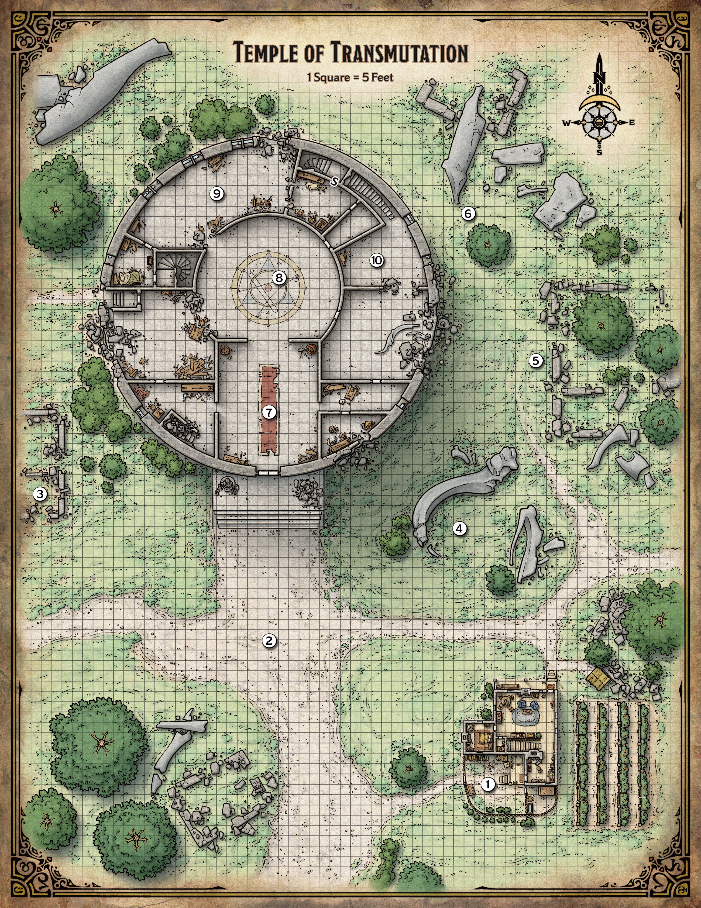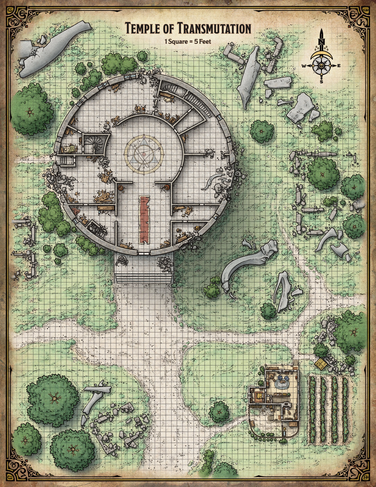

------

# Chapter 3: Icewind Dale

>>Icewind Dale and its settlements—called Ten-Towns—beckon the reckless, the desperate, and those willing to face what waits at the world's farthest edge. People come here to make their fortunes or to disappear. You never know who you might encounter, wrapped in winter gear, trudging through snowy streets: a friend, a monster, or a stranger willing to kill to protect their secrets.
>>
>>Beyond Ten-Towns, hidden societies of dwarves and goliaths carve out homes in the arctic land, its crags and valleys shaped by half-remembered battles between giants and demons. From the Reghed Glacier in the east to the Sea of Moving Ice in the north, nomadic tribes travel with the beasts and seasons, crafting a way of life where others see only death. Out in that frozen wasteland, terror takes many forms—frost giants and remorhazes, yetis and winter wolves, cultists and hags—and some in Icewind Dale whisper of an inhuman figure with multiple limbs, half glimpsed through a blizzard or a troubled dream. This being, whose existence is often discounted as mere superstition, is Zlan.
>>
>>Zlan is what remains of the seven liches that created the shattered Artifact called *Crenshinibon* or the *Crystal Shard*—the remnants of which still can be found across Icewind Dale as the material called chardalyn. Those whose minds are warped by chardalyn fall under Zlan's control. Zlan seeks to thaw the Underdark beneath Icewind Dale, releasing ancient monsters and exposing the ancient magical sites under the dale.
>>
>>Zlan's melting of the Underdark has caused several deep dragons to notice Icewind Dale—and to covet its secrets. This deep dragon alliance threatens the entire region. While these dragons pose a physical threat, their natural ability to adopt the shape of any creature—and their interest in lost and forgotten lore—means they could be anywhere and anyone.
>>

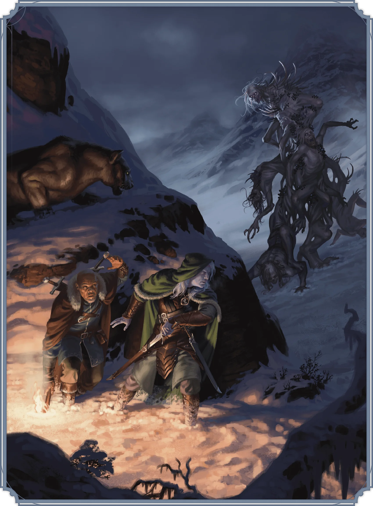

## Icewind Dale Campaigns

Icewind Dale offers survival horror adventures, journeys at the ragged edge of the wilderness, and strange tales of unsettling and ominous events.

### Survival Horror

Icewind Dale is deadly not only for its extreme environment but also for its secretive residents and the sinister forces hidden by the cold. To survive, you might need to venture into the winter or the Underdark, fight to escape the hungering wild, or seek clues to reveal what stalks you in the night before that creature can sink its fangs into your spine. Flawed heroes and renegades must band together, doing whatever it takes to stay alive—no matter the cost.

### Underdark Excursions

Underdark monsters are creeping upward to the surface of Icewind Dale, and characters must plunge into the Underdark's depths to stem the rising tide of danger. In the Underdark, characters face the dark, silence, and alien beauty of caverns lit by glowing mushrooms and infested by aberrant terrors. Duergar, deep dragons, mind flayers, and stranger creatures lurk where secrets are entombed. For characters willing to brave its hazards, the Underdark is a bottomless trove of wonders and horrors, of beauty and danger, waiting to be discovered.

### Weird Tales

Strange happenings are afoot in Icewind Dale. The melting Underdark has unleashed eerie changes on the remote land, and help is far away. The fear created by hauntings, possessions, infestations, and other unsettling phenomena is amplified by Ten-Towns' isolation and secretive traditions. Players who enjoy blended genres, strange folklore, and psychic powers will find satisfying mysteries in Icewind Dale.

> ##### Sheriff Markham Southwell
>
>The commander of the militia in Icewind Dale's largest town is Sheriff Markham Southwell, a brawny, likable, middle-aged man of few words. Nothing is more important to him than protecting Bryn Shander. He learned the hard way to judge people by their actions, not their words, and tends to bury his emotions, showing no interest in small talk.
>

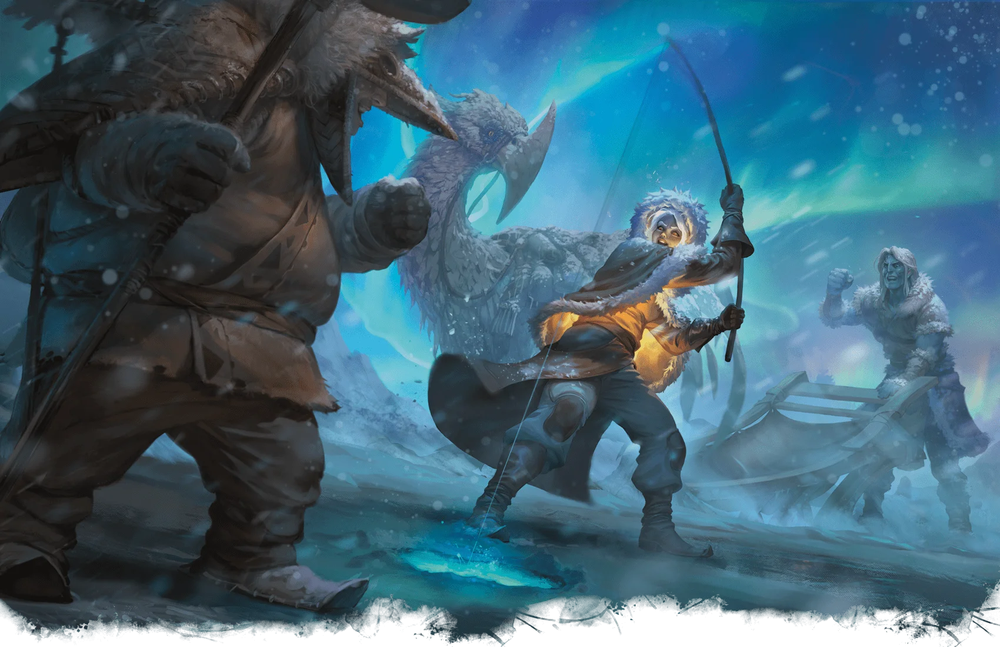

## People of Icewind Dale

Icewind Dale was once the dwelling place of frost giants, demons, and white dragons. Dwarves and humans came later, carving out lives in the bitter cold and endless wind. Eventually, tales of gold, gems, and ivory drew prospectors and settlers north. These settlers from across Faerûn built the fishing, mining, forestry, and trading camps that grew to be Ten-Towns.

### Inhabitants of Ten-Towns

Barking sled dogs or clattering wagon wheels herald newcomers to Ten-Towns, as southerners come to trade, escape, or build new lives. Ten-Towns accepts anyone willing to work, as long as they don't stir up trouble. Ten-Towners are tough, weather-tested people from all walks of life who lean on each other to survive. Community and trust are everything here; nobody lives long in the wilderness alone.

The biggest industry in Ten-Towns is fishing for knucklehead trout. The ivory-like bones of these massive lake-dwelling fish are prized for carved pieces called scrimshaw, which sells for a good price down south. Ten-Towners also trade, hunt, trap, harvest lumber, and prospect for gems and gold nuggets in the rocks and rivers on which their settlements are built.

Bad weather makes travel difficult, so Ten-Towners use snowshoes, dogsleds, or tamed axe beak mounts. Recently, raiders from the fallen settlement called Dougan's Hole have begun attacking the Ten Trail, a key path connecting the settlements to each other, forcing caravans to travel with weapons drawn and lookouts posted.

Scattered shrines and run-down temples see few but fervent worshipers. In the evenings, taverns in Ten-Towns fill with cold, tired people looking to warm up, gripe a bit, and share a rumor and a flagon—especially if someone else is paying.

#### Governance

Towns are led by elected speakers who gather irregularly to discuss trade, hash out agreements, and settle—or start—disputes. Speakers have little use for each other, and Ten-Towns nurse grudges over fishing, forestry, hunting rights, and old insults. Elections are held when speakers die, quit, or are driven out. In larger settlements, speakers lean on appointed marshals or sheriffs to rally militias, address threats and crime, and administer justice.

Each Ten-Town answers only to itself, and rivalries between the settlements deepen their isolationist impulses. Though hunters, trappers, and traders regularly interact with Reghed nomads or dwarves from Dwarven Valley, Ten-Towners look on outsiders with suspicion, convinced strangers are more likely to rob and murder them than to extend a friendly hand.

### Reghed

For Reghed nomads, the icy plains and howling winds aren't hardships—they're home. These hardy folk travel in the tracks of caribou and other beasts, driven by harsh weather, tradition, and the pursuit of prey. To be Reghed is to embrace the cold, living free from the rot found in the south.

Reghed are primarily human and organized into tribes made up of small camps that follow a chieftain. Though fiercely autonomous, tribes band together in crisis or to bring down exceptional prey. Five main tribes exist today.

#### Tribes of the Bear

This once-proud tribe has split into Standing Bear, which embraces tradition, and Raging Bear, which seeks chardalyn's power. Standing Bear is led by King Gunvald Halraggson, renowned for his size, strength, and mercilessness. Raging Bear is led by Ulkorra the Witch-Queen, who turned against Gunvald when he exiled her.

#### Tribe of the Elk

The Tribe of the Elk is the largest Reghed tribe and the most tolerant of outsiders. Led by wise young King Fjuran Stermhaft, this tribe's hunters regularly stomp into Bryn Shander and Easthaven, hauling massive kills or loaded sleds, ready to swap goods, rumors, and harrowing tales of the wild to scare the "tame folk."

#### Tribe of the Owl

The Tribe of the Owl formed by taking in outcasts of other tribes and lost Ten-Towners. Their charismatic tiefling queen, Ilfa Sorgsen, was exiled from the Tribe of the Tiger for insolence. Ilfa speaks of a future in which the Reghed won't forever roam the surface but will hunt both above and below, on the surface and in the Underdark.

#### Tribes of the Tiger and Wolf

The Tribes of the Tiger and Wolf are small, ragged, and dangerous. The Tiger Tribe's queen, Bjornhold Solvigsdottir, is a worshiper of Auril who doesn't age. The Wolf King, Isarr Kronenstorm, is a frenzied brute who worships the Beastlord and has bolstered his clan by recruiting violent outsiders. Both tribes are on the verge of extinction, surviving by preying on Ten-Towners and their fellow Reghed.

### Dwarves

Dwarves have lived in the valley at the foot of Kelvin's Cairn for centuries, mining precious veins of iron and producing fine weapons, armor, and tools.

Enterprising dwarves have long traded with Ten-Towners, but recently, the valley has gone silent. The melting Underdark unleashed aberrant horrors on the valley, and its citizens were dragged below to be devoured by mind flayers and other monstrous beings.

Word of this tragedy has yet to reach Ten-Towns, but people used to hearing from the dwarves are starting to worry. They seek adventurers willing to investigate the sudden hush in the valley.

### Giants and Goliaths

Frost giants dwell in the wild, battling each other for supremacy and hunting their ancient rivals, the white dragons that roost in the cliffs and peaks of the Spine of the World. In icy ruins and on remote peaks, giants raise mammoths, hunt dragons, read the ancient runes of their fallen forebears, and commune with ancestral ghosts. Ten-Towners tread lightly and find other paths when they encounter giant footprints in the snow.

Two clans of goliaths dwell in the mountains: the griffon-raising Akkanathi of Skytower Shelter and the Thuunlakalaga from Wyrmdoom Crag. The clans maintain a blood feud against each other, but the Wyrmdoom goliaths are cordial to Ten-Towners.

### Denizens of the Underdark

Zlan exerts its malevolent power to thaw the Underdark. Creatures once dormant stir in places where light can't reach.

#### Aberrations

Mind flayers and their minions have been frozen in nearby portions of the Underdark for eons, but they are beginning to creep toward the surface.

#### Deep Dragons

Three deep dragons (see chapter 9)—Guvaali of the Grand Appetite, Enderbalathal the Lord Below, and Secret-Maker Mornethraxys—inspire fear, sow chaos, and encourage frightened servants to pry open the vaults of the deep.

#### Duergar

Duergar are Underdark-dwelling dwarves with psionic abilities. Every duergar clan regards the others as a threat. Mokleth, lord of Clan Wellbreaker, has lured the Reghed Tribe of the Owl into the melting Underdark in return for a share in their discoveries.

#### Undead Giants

Icewind Dale is built on the sunken ruins of an ancient giant civilization. These ruins plunge for miles into lightless depths and are inhabited by undead giants, the lingering shadows of former might.

## Magic of Icewind Dale

Demons, wizards, liches, evil gods, giants, dragons, and ancient horrors have laid claim to Icewind Dale in their time.

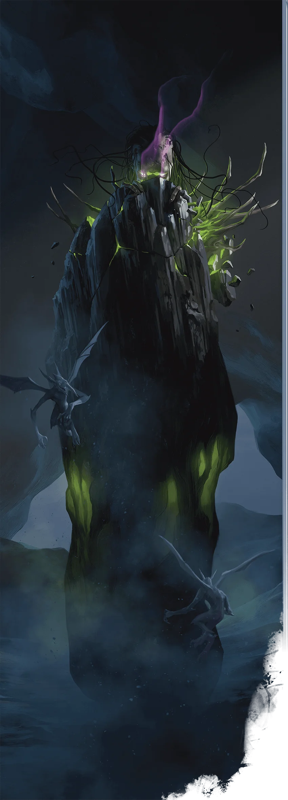

### Auril's Magic

It is unwise to displease Auril the Frostmaiden, divine embodiment of winter's fury. More than a decade ago, she held the sun back from rising, causing a bitter, unending winter. Her curse may still grip the land, or it might have been broken by adventurers as described in *Icewind Dale: Rime of the Frostmaiden*.

Even if Auril's everlasting winter has ended, her influence persists. Frost druids awaken beasts and plants to trouble Ten-Towns, Auril's cultists plot to revive her glory through grisly sacrificial rites, and besieged Caer-Dineval has embraced her worship. Many in Icewind Dale respect the Frostmaiden in the way that sailors honor Umberlee, offering small sacrifices of warmth or food to appease her fury.

Some in Icewind Dale oppose Auril's worship, having lost livelihoods or loved ones to the eternal winter. They argue that every shrine, rite, and amulet of Auril should be destroyed, and that honoring her keeps her influence alive. These Abolishers are gaining power and influence. Their eyes and ire are fixed on Auril's worshipers in Caer-Dineval.

### Chardalyn and Zlan

In an ancient and nearly forgotten time, seven liches joined their magic in a fragile alliance to craft an item of ultimate power called *Crenshinibon* (better known as the *Crystal Shard*), with which they meant to conquer all life. At the moment of its completion, the undead wizard-kings were consumed by their own creation's power. It obliterated their conscious minds and absorbed what was left of their souls into itself.

> ##### The Fallen Netherese City
>
>*Icewind Dale: Rime of the Frostmaiden* describes ruins of Ythryn, a fallen city from the Netherese Empire. Depending on the outcome of that adventure, that ruin and its arcane influence may still lie buried beneath the ice, a secret yet to be discovered.
>

Millennia later, a wizard named Akar Kessel found the *Crystal Shard*. The shard had become infused with demonic magic, and he used it to erect a great black tower in Icewind Dale. When this tower was destroyed, the magic used to create it fused with the surrounding ice to form what is now known as chardalyn: a nonmagical, crystalline substance cold to the touch and strong as metal, though considerably easier to work with than steel. In the years since, deposits of chardalyn have been found across Icewind Dale. These deposits tend to be suffused with evil magic. Chardalyn readily accepts magical enchantment, making it an ideal raw material for crafting magic items.

The splintering of the *Crystal Shard* awoke the fragmented spirits of the seven liches that forged the Artifact. Each of these seven spirits was fractured and infused into the tiny fragments of chardalyn scattered across Icewind Dale. Gradually, they returned to awareness until they eventually found an egg-shaped piece of chardalyn large enough to contain their spirits. They moved into it, and within the egg they created a new form for themselves. The seven undead spirits struggled mightily for control of this new form until the one called Zlan won the battle. Then the horrific new body the seven liches had forged forced its way out of the chardalyn egg.

This amalgamation, now collectively called **Zlan** (see Zlan in chapter 9), has a psychic connection to chardalyn, and Zlan's influence warps the minds of those who handle, shape, or wield chardalyn. Zlan wants to expose more of the people of Icewind Dale to this substance, extending the spirit's insidious psychic influence. Because large amounts of chardalyn lie buried in the Underdark, Zlan has subtly influenced unsuspecting individuals throughout Icewind Dale to descend beneath the ice and attract the attention of Underdark monsters. Zlan is also responsible for new steam vents that make exploring the Underdark easier than ever before.

### Melting Underdark

Zlan's greatest achievement since regaining self-awareness was corrupting an ancient frost druid of the Tribe of the Raging Bear and beckoning her into the frozen Underdark. There, at Zlan's urging, she unleashed a fatal explosion of primal magic, uncapping underground steam vents and causing magma flows to surge upward, shaking the deep and starting a chain reaction of warming from below.

The consequences of this explosion reverberate throughout Icewind Dale. Earthquakes shake the land, and vents open in the ice and rock, emitting giant plumes of steam visible for miles. Several vents have become oases in the wintry wild and serve as base camps for those venturing into the vents. The Tribe of the Owl, aided by the duergar of Clan Wellbreaker, eagerly explore the depths, as do prospectors, researchers, and adventurers from Ten-Towns. The ramshackle vent-camps harken to the early days of Ten-Towns, and the largest, Highplume Station, shows signs of growing into an actual town.

The upper tunnels of these vents are hot and damp, inhabited by monstrous beasts and rich with a glowing, warm fungus called gleamspore, which is harvested and traded at Highplume Station. Farther down, enormous columns and toppled walls of the long-lost Ostorian Empire of the giants plunge into echoing gloom. Giant Undead stand sentry, and the deep dragon Enderbalathal, the Lord Below, lairs in a ruined throne room.

At the feet of these ruins, steam and putrid gases mingle in a toxic underground swamp. Here, oozes and aberrant terrors slither and twitch, waking from long hibernation, and the deep dragon Guvaali of the Grand Appetite seeks to satisfy his endless hunger. The swamp grows colder deeper down, eventually freezing into the still-icy deeps, where slumbering horrors have yet to be thawed.

### Runes and Ruins

The immense scale and desolation of Icewind Dale make it a natural home for giants. Signs of their millennia-long habitation are widespread. In spring, snowmelts reveal toppled, lichen-covered ruins marked with runes and resonant with magic. Hunters stumble across icy ruins and barrows of gigantic bones and cursed treasure, guarded by the spirits of giants who once ruled this place.

An encounter with a frost giant rarely ends well for anyone but the giant, though on occasion a giant spared the lives of adventurers in exchange for a task involving mortal peril in tight spaces. Giants also favor small folk who aid them in the destruction of white dragons, their ancestral enemies. Other Giant creatures such as ice trolls and verbeeg (see *Icewind Dale: Rime of the Frostmaiden*), as well as goliaths, inhabit the wild and threaten or aid the people of Ten-Towns depending on their outlooks.

### Dougan's Bloodcurse

When Dougan's Hole was destroyed more than a decade ago, its remaining inhabitants turned to the superstitions of their ancestors, desperate for a greater power to change their fortunes. They summoned Thruun—a sightless, immortal being that infected its victims with visions of gore and battle. The elder who summoned Thruun bound anyone with a drop of Dougan's blood to the monster, sending Thruun's hot and putrid hatred pulsing through their veins.

Dougan's Hole has fallen into darkness. Its people raid the Ten Trail, abducting victims to feed to the monster. Soon, Thruun may decide to unleash its fury on Ten-Towns, at the head of an army of bloodcursed ravagers.

## Arctic Survival

It's not easy to stay alive in Icewind Dale. The bitter climate, the dangerous inhabitants, and their uncanny secrets send people fleeing to warmer climes. This section introduces environmental hazards, local perils, and guidelines expanding the rules for travel in the *Dungeon Master's Guide*.

### Environmental Effects

Environmental effects in the *Dungeon Master's Guide* that frequently apply in Icewind Dale include extreme cold, frigid water, heavy precipitation, high altitude, slippery ice, strong wind, and thin ice. These effects combine to create strong adverse conditions, such as blizzards, windstorms, and icy peaks. Additionally, characters in Icewind Dale can encounter the following environmental effects.

- Hailstorm
- Howling Wind
- Psionic Field

### Hazards

Characters in Icewind Dale might encounter the following hazards.

- Bile Lichen
- Zlanic Chardalyn

*Winter always takes its toll, but when Auril hid the sun, the price became too high to bear. We all lost someone to that cursed winter. Some of us lost ourselves.*— Sheriff Markham
### Fear in Icewind Dale

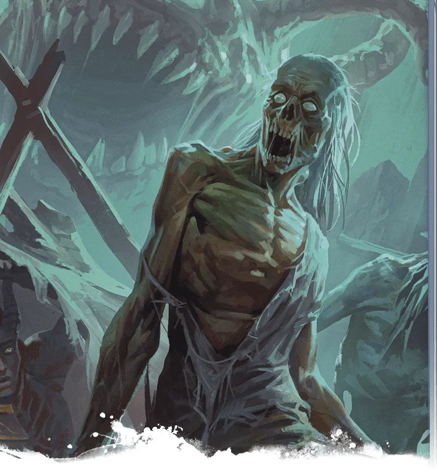

Icewind Dale is an especially terrifying place, even for hardened adventurers. The arctic environment isolates characters from allies and resources. Shapeshifting enemies pretend to be friends to create terror within a community. Psychic aberrations from the Underdark peer into the minds of their victims and overwhelm adventurers with strange visions and mental trauma.

Creating and sustaining an atmosphere of fear and horror helps set Icewind Dale apart from other regions of the Forgotten Realms. You can find rules for fear and mental stress, as well as advice on how to integrate these topics into your campaign, in the *Dungeon Master's Guide*.

#### Jump Scares

One method to build fear at your table is by introducing a single source of terror that escalates over the course of the session, ending in a jump scare. Examples of this technique abound in horror movies and other media. The shark in *Jaws* and the eponymous alien shape-shifter of *The Thing* both illustrate the jump scare in action.

Several ingredients combine to build a good jump scare. First, set the scene with an atmosphere of unease. Then, startle the players with something harmless, which they might mistake for the true threat. Next, show the threat in such a way that the party can't directly interact with it. For example, it might be too far away to attack, even with ranged weapons. Now let the silence or sense of unease build, increasing tension at the table. Finally,

unleash the scare as a real and active threat, and roll Initiative!

The two examples below illustrate jump scares in action.

***Fear in Ten-Towns.*** This jump scare builds as the characters explore a settlement that's been overrun by **Revenants**:

- **Down a Dark Alley**. The characters turn down a dark street where the lamps are extinguished. A foul odor fills the air.
- **It's Just a Cat**! A streak of yellow fur flies past as a yowling pet leaps from a shadowy corner.
- **Did You See That**? A character glimpses a silhouette framed in a doorway, its hands dripping. A moment later, it's gone.
- **The Tension Rises**. Everything is supernaturally silent and still. Nothing moves. The only sound is the characters' blood pounding in their veins.
- **Surprise**! The characters are surprised from behind by the **Revenants**, who hold chardalyn ritual daggers and clutch at the characters' throats.

***Fear in the Wilderness.*** This jump scare is set in the hunting ground of a pack of **Winter Wolves**:

- **Signs of Danger**. The characters enter a frigid, desolate valley scattered with bones and with blood smeared on the snow.
- **A Murder of Crows**. A set of bones rushes toward the characters, but its only a flock of scavenging birds carrying bones away.
- **Heard on the Wind.** The howl of huge wolves fills the air, accompanied by haunting laughter.
- **Quiet—Too Quiet**. For miles around, nothing moves and not a sound is heard. The world seems empty.
- **Hunters Become Prey**. The **Winter Wolves** rush out of the wind, each ridden by a **Specter** of its devoured prey.

*Mind flayers, ice zombies—there is much to fear in Icewind Dale. But the greatest horrors come from other people.*— Sheriff Markham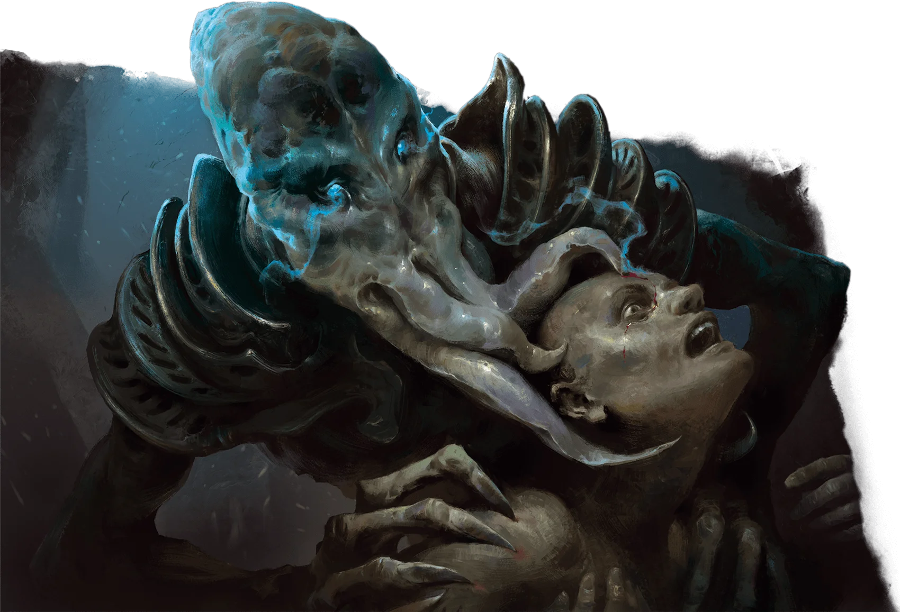

### Magical Contagions

Magical contagions threaten Icewind Dale. The characters might encounter the following dire misfortunes.

- Lichen Plague
- Mudpox

### Travel and Terrain

Traveling in Icewind Dale means taking your life into your hands. Residents advise making a small offering of snuffed flame or spilled provisions to Auril before heading into the cold.

Chapter 4 of *Forgotten Realms: Heroes of Faerûn* details equipment and services useful to travelers in Icewind Dale, including clothing and travel options.

#### Icewind Dale Terrain

Use the Icewind Dale Travel Terrain table when characters travel in this region.

- **Frigid Water.** Icy water is dangerous at the best of times, risking obstacles such as floes and icebergs; creatures such as **Plesiosauruses**, **Killer Whales**, or **sahuagin**; and the potential to be trapped in the ice.
- **Hard Ice.** Hard ice allows for fast travel with the right equipment, but there's nowhere to hide from predators such as **Wolves** and **Yetis**.
- **Mud.** When Icewind Dale thaws, its muddy terrain makes food easier to find, but the mud slows travel to a crawl.
- **Snow.** Snow commonly appears in an environment of extreme cold.
- **Thin Ice.** Thin ice is particularly dangerous, requiring a slow pace and close attention to avoid falling into frigid water.

##### Icewind Dale Travel Terrain
| Terrain      | Maximum Pace | Encounter Distance | Foraging DC | Navigation DC | Search DC |
|--------------|--------------|:------------------:|:-----------:|:-------------:|:---------:|
| Frigid Water | Special*     |    6d6 × 10 feet   |      10     |       10      |     15    |
| Hard Ice     | Fast†        |    6d6 × 10 feet   |      20     |       10      |     10    |
| Mud          | Slow         |    6d6 × 10 feet   |      10     |       10      |     15    |
| Snow         | Fast†        |    6d6 × 10 feet   |      20     |       10      |     10    |
| Thin Ice     | Slow         |    6d6 × 10 feet   |      20     |       15      |     10    |
*Characters' maximum pace while waterborne depends on the vehicle carrying them. †Appropriate equipment (such as a sled, skis, or snowshoes) is necessary to keep up a Fast pace in this terrain.
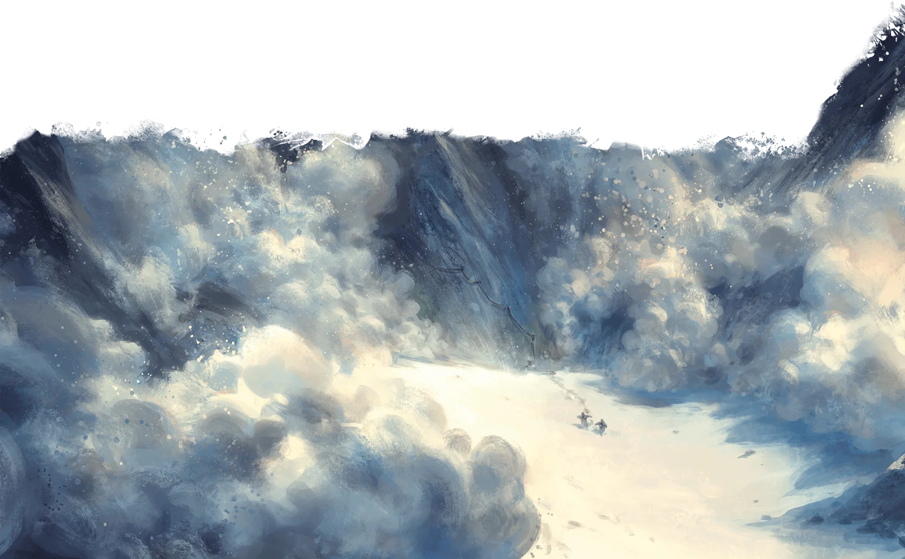

#### Weather

Extreme cold (detailed in chapter 3 of the *Dungeon Master's Guide*) is normal weather during Icewind Dale's winter.

If Auril's everlasting winter affects an area, it is always winter, the light is never brighter than Dim Light, and the weather expresses her fury. Subtract 5 from your rolls when rolling on this table when Auril's everlasting winter is in effect.

##### Weather
|  1d20 | Temperature                        |
|:-----:|------------------------------------|
|   1   | 1d4 × 20 degrees Fahrenheit colder |
|  2–5  | 1d4 × 10 degrees Fahrenheit colder |
|  6–16 | Normal for the season              |
| 17–20 | 1d4 × 10 degrees Fahrenheit hotter |

|  1d20 | Wind   | Precipitation                |
|:-----:|--------|------------------------------|
|  1–6  | Strong | Heavy snowfall or heavy rain |
|  7–12 | Light  | Light snowfall or light rain |
| 13–20 | None   | None                         |

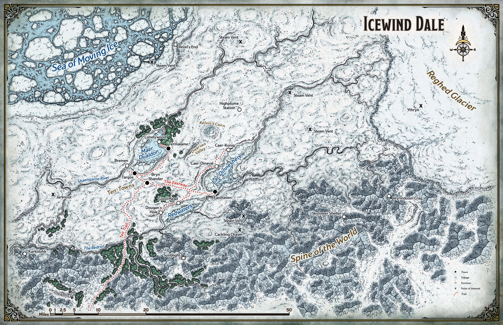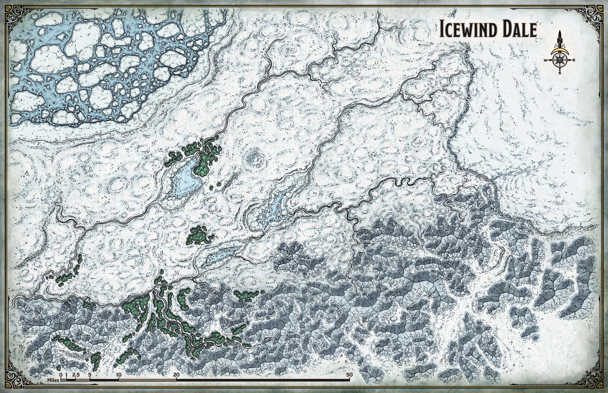
## Ten-Towns Gazetteer

Ten-Towns is a scattering of settlements built on the rocky shores of three lakes—Maer Dualdon, Lac Dinneshere, and Redwaters. Only some of these settlements are large enough to truly be called towns, but the name has stuck.

Although many settlers came here in hopes of hauling in the region's famous knucklehead trout, not everyone came for the fishing. The region includes mines in the north with gems as large as clenched fists, pine forests full of good timber, and snowy plains with grand beasts to be hunted or tamed. Those with an eye for the arcane swear that the wind-blasted wilderness hides magic beyond the reckoning of most people.

- **Bremen**. Bremen is notable for a large and muddy floodplain where locals search for treasure.
- **Bryn Shander**. The largest of the Ten-Towns, Bryn Shander is a hub for trade and travel.
- **Caer–Dineval**. The people of the embattled village of Caer-Dineval have turned to Auril to protect them from Fiends and other monsters.
- **Caer–Konig**. Sahuagin prey on the inhabitants of the backwater settlement of Caer-Konig.
- **Dougan's Hole**. The smallest and most desperate of the Ten–Towns, Dougan's Hole is home to a bloody curse.
- **Easthaven**. Easthaven boasts a strange tourist attraction: the remains of a chardalyn dragon that attacked the settlement.
- **Good Mead**. Bee cultivation and mead production drives trade and travel to Good Mead.
- **Lonelywood**. In the village of Lonelywood, every citizen hides a secret.
- **Targos. The** Zhentarim has taken over the prosperous fishing town of Targos.
- **Termalaine**. Access to the Underdark has revitalized the mining industry in Termalaine.

### Bremen

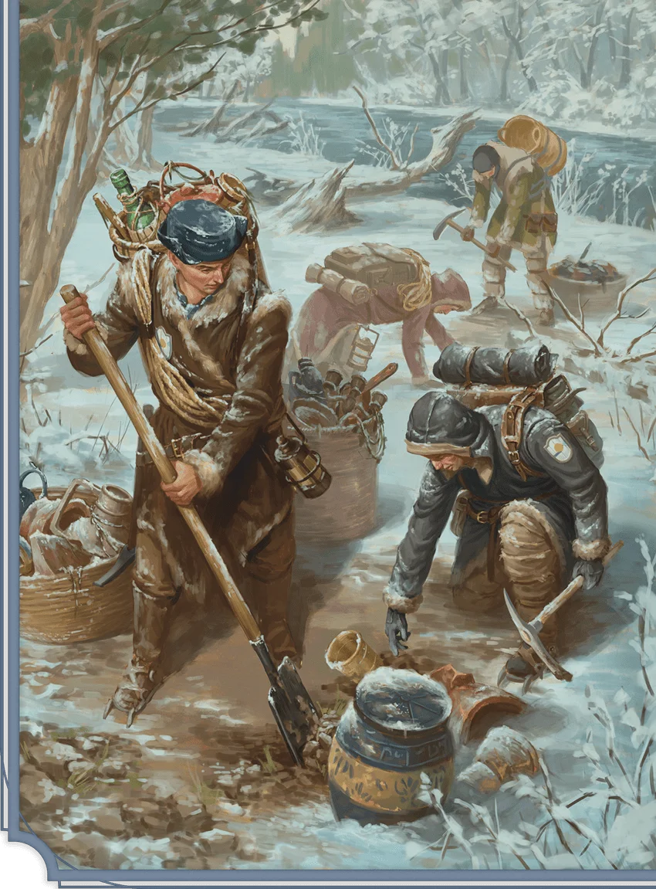

The sleepy village of Bremen was built by dwarf prospectors where the Shaengarne River empties into Maer Dualdon. Its 225 residents are mostly fishers and trappers, but the population swells in summer thanks to seasonal floods.

Bremen is built on the river, and it's difficult to reach. In winter, travelers must navigate jagged ice, while warmer months bring flash floods and treacherous currents.

No one expected the human Ludalos Opkin (Medium, Lawful Good **Commoner**) to become speaker of Bremen, but he swept the election unopposed. Ludalos is a thoroughly untalented scrimshander whose gentle demeanor and large sideburns put people at ease, even when the situation calls for alarm.

#### Summer Floods

Bremen is known for its early summer floods and the treasures left in the river's path. Come midsummer, the village takes on a festive atmosphere as visitors stream into the settlement to wade in the floodplain, sifting mud for gold nuggets, the skulls of knucklehead trout, and other treasures the river left behind—though they rarely find more than bits of bone, rubbish, or lumpy rocks. This season, however, individuals combing the floodplain

for treasure have begun contracting Mudpox (see "Magical Contagions" earlier in this chapter), a malady carried in the mud seeping up from the melting Underdark.

Characters might find tiny magic items and other unusual valuables half-buried in the floodplain, sold as junk at Ewin's Trinkets, or wagered at Five-Tavern Center (see below).

#### Noteworthy Places

Bremen is small, with little to offer in terms of comfort or services. Shaengarne Street runs along the river from the floodplain, past the weathered statue of the settlement's founder to the docks and warehouses at the village's north end. Anyone doing business at these warehouses and docks must deal with the foul-mouthed dwarf, Grynsk Berylbore (Medium, Lawful Neutral **Tough**), who runs these businesses and never has a good word to say.

***Buried Treasure.*** Bremen's single inn, the Buried Treasure, caters to treasure hunters in summer and sits all but empty the rest of the year. Cora Mulphoon (Medium, Neutral Good **Commoner**), the human proprietor of Buried Treasure, is a kind, gray-haired woman who talks endlessly about her son, Huarwar.

*Last year, Nosk found a strange rock in the Bremen mud. It was a slaad egg. We had to put Nosk down.*— Sheriff MarkhamBuried Treasure is decorated with hundreds of objects dug up from the mud of the Shaengarne by Cora Mulphoon's guests and then donated to the inn. Most hold little value—gnarled pieces of driftwood, broken pottery, a battered shield bearing a Cormyrean noble's crest—but displayed in a glass case on the mantle is a gold nugget the size of a knucklebone. At least, that's what Cora tells visitors it is. In truth, it's a rock that she disguised with a bit of paint, but the opportunity it promises to those who see it sparkling above the hearth keeps hopeful visitors coming back year after year.

A human named Felka Otterdowd (Medium **Scout**) is commonly found at Buried Treasure, where she seeks information about her missing wife, Sorrel. Unfortunately, Sorrel died from Lichen Plague, and her corpse walks out on Wet Rock (see below).

***Ewin's Trinkets.*** Ewin's Trinkets' shelves bulge and buckle with cast-off bits and bobs from years of scavenging on the floodplain. The halfling Ewin (Small, Neutral Good **Commoner**), who runs the shop, was favored for speaker of Bremen, but he handled a piece of chardalyn recently and contact with Zlan's mind has left him confused and anxious, plagued by shattered voices that croak to him in his sleep. In his current condition, Ewin barters poorly with customers, selling items for half their value. Casting the *Lesser Restoration* spell on Ewin dispels Zlan's pernicious influence and returns Ewin to his former self.

Characters might find a Common or Uncommon magic item here, buried among old fishhooks, twisted wire, yellowish rocks once mistaken for gold, and other rubbish.

***Five-Tavern Center.*** Five-Tavern Center is a circle of five competing drinking houses (Stones, Even

Keel, the River's Mouth, the Grumpy Moose, and the Black-Bearded Brother) that offer the cheapest ale in Ten-Towns and organized fights in the shared courtyard after the sun goes down. Most of the fighters here are **Commoners**, but a few **Berserkers** and **Toughs** offer more formidable competition.

A recently arrived human from the Trackless Sea named Bula (Medium, Chaotic Evil **Gladiator**) is the current champion, and characters can fight him or another challenger if they're willing to put up collateral that their opponent is interested in. Bula recently won a piece of chardalyn in a fight, and Zlan's whispers have begun to corrupt his mind.

***Wet Rock.*** Out in the river sits Wet Rock, a speck of an island with an abandoned shack. Townsfolk avoid the place by instinct, unaware that the interior is choked with bile lichen (see the description of bile lichen in "Hazards" in this chapter). Two unfortunate fishers who lost their boat in a storm washed ashore on the island and sought shelter in the shack. They were trapped there long enough to perish and now shuffle around the shack's tiny room as **Zombies**, ready to ambush other creatures on sight. One of these zombies is all that remains of Sorrel, Felka Otterdowd's wife.

### Bryn Shander

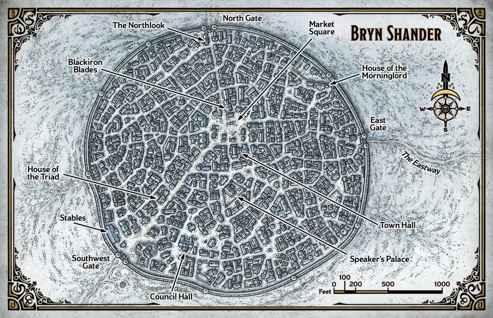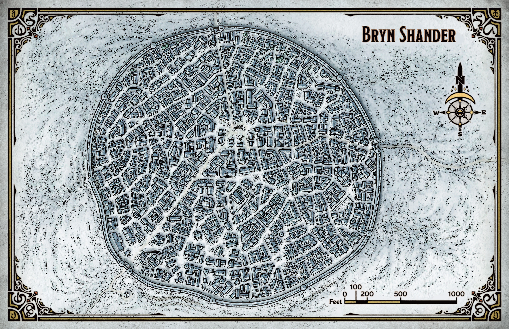Those who pass through Bryn Shander's gates find comfort and a chance to stock up on supplies, trade goods, and rumors. Boasting 1,800 residents, bustling Bryn Shander is Icewind Dale's largest town. All kinds of people wander these streets, where trade is the main industry.

Built high on a hill, Bryn Shander's wooden walls stand thirty feet high to fence out the bitter winds. The Ten Trail leads to its gate, and for most southerners, who never venture farther into the region, this might as well be the only town in Icewind Dale.

As the sole town in the area not on a lake, Bryn Shander's fortunes are founded on trade. Its origin as a crossroads trading post shows in its bustling mercantile spirit and its shops and services. The ten speakers of Ten-Towns gather here to settle disputes, reach agreements, and discuss issues affecting the whole region.

Bryn Shander's speaker is the human Duvessa Shane (Medium, Lawful Good **Noble**). She is respected throughout Ten-Towns. Duvessa worries Echomorne's prophesies (see "Dragon Dreams" below) do more harm than good, and she'd send the seer packing if she had a good excuse.

#### Dragon Dreams

People haven't been sleeping well in Bryn Shander lately. They've been disturbed by a slew of nightmares, which are secretly caused by Mornethraxys (**Adult Deep Dragon**; see chapter 9) who disguises herself as Seer Echomorne, a dragonborn soothsayer. Her purple pavilion occupies a busy corner of Market Square. Echomorne insists that she alone can foresee a coming disaster. She voices unsettling predictions and then tries to bring them about. Many townsfolk see the seer as a folk leader who speaks truth to power, and some think she should be the next speaker.

She is attended by her frightening goliath bodyguard, Thuldrek (Medium, Lawful Evil **Cultist Fanatic**), a Cult of the Dragon agent in her service.

#### Noteworthy Places

Bryn Shander's Southwest Gate offers large stables for axe beaks and sled dogs. The main road leads to Market Square. The East Gate opens to the Eastway, a gravel road leading to Redwaters and Lac Dinneshere, while a path out of the North Gate leads to the settlements on Maer Dualdon.

***Blackiron Blades.*** On the north side of the square at Blackiron Blades, the human siblings Garn the Hammer and Elza (Medium, Lawful Good **Commoners**) sell affordable but inferior weapons and survival gear to those recently arrived in Icewind Dale. They're always eager to help newcomers find their feet, though Garn's poor smithing is an object of ridicule in town. Being outfitted from Blackiron Blades guarantees one won't be taken seriously by the hardy folk of Ten-Towns.

***Council Hall.*** The speakers of Ten-Towns occasionally come together in a nondescript warehouse that serves as a council hall, which otherwise stands empty. In an emergency, the hall can be converted to house refugees.

***House of the Morninglord.*** The ground floor of the modest House of the Morninglord houses a shrine to Amaunator. A retired human adventurer named Mishann (Medium, Neutral Good **Priest**) lives upstairs. She maintains the shrine and offers divine services. She argues frequently with her rock gnome assistant, Copper Knobberknocker (Small, Chaotic Good **Priest Acolyte**), who is devoted to Lathander. Southerners are often surprised to hear the name "Morninglord" applied to Amaunator and not Lathander, but Mishann insists Lathander stole the title.

***House of the Triad.*** One of the largest stone buildings in Icewind Dale, the House of the Triad is a temple to Tyr, Torm, and Ilmater. The house was shuttered during Auril's everlasting winter by townsfolk angered because the priests were helpless before Auril's wrath, but it has since reopened, albeit humbler than before. The temple serves the faithful and stockpiles food and supplies in preparation for future crises, making it a prime target for would-be thieves.

***Market Square.*** Market Square is Bryn Shander's beating heart. Stalls and tents sell knucklehead trout, scrimshaw, vegetables, reindeer meat, handicrafts, and cold weather gear. The false soothsayer Echomorne harangues the crowd from her pavilion while one or two militia members ensure order. Characters who catch the seer's eye receive personalized predictions of doom. Once she makes a prediction, she tries to bring it about—or at least trouble her victims with nightmares so they are too exhausted to doubt her words.

***The Northlook.*** The Northlook inn and tavern is frequented by mercenaries and adventurers and is the best spot in Ten-Towns to catch wind of profitable adventures. Scramsax, the gruff human proprietor (Medium **Warrior Veteran**), understands the adventuring life and allows capable travelers between jobs to stay on credit—but what seems at first like charity catches up with unwary characters when Scramsax presents an itemized bill loaded with surcharges once their fortunes improve. Those who refuse to meet his terms learn that Scramsax retired out of choice, not necessity, as he's still capable with a blade.

Elderly human trapper Edgra Durmoot (Medium **Scout**), who was once speaker of Dougan's Hole, warms a stool at the Northlook, drinking in frightened silence. Characters willing to coax her into talking might learn about recent events (see "Dougan's Hell" later in this chapter).

***Speaker's Palace.*** Only inhabitants of Icewind Dale would call the Speaker's Palace—carved from stone by dwarf artisans, with a slate roof and front colonnade—a palace, but compared to the rough wood houses that make up most of Bryn Shander, it has a certain majesty. Speaker Duvessa Shane resides here. She's an enthusiastic debater famous for getting what she wants.

***Town Hall.*** The large town hall holds community feasts and gatherings on religious holy days. Human sheriff Markham Southwell (Medium, Lawful Good **Warrior Veteran**) works out of an office in the cellar of the building, which includes a single large jail cell. The cell is usually unoccupied, but Sheriff Markham has a pair of deputies (**Guards**) to watch it when necessary. Markham's eyesight is worsening, and he quietly searches for someone to replace him.

### Caer-Dineval

High atop a lakeside crag stands a small fortress shrouded in bitter cold and unending darkness. The village below is in a state of siege, with every door locked, every citizen armed, and every structure marked with symbols of Auril. Most of the village's ninety residents are direct descendants of its settlers, fighting for their ancestral land.

The human Crannoc Siever (Medium, Lawful Neutral **Commoner**) is speaker of the Caer-Dineval. He's a blowhard who leaves home only to complain or stir up trouble. The settlement's real leader is the orc Yldreth (Medium, Lawful Neutral **Druid**), a frost druid rejected by the Emerald Enclave who channels Auril's wrath to defend her people. Yldreth offers faithful sacrifices of food, warmth, and reverence to Auril to maintain a constant winter storm around the castle, containing its menace (see "The Caer" below). She's in search of mercenaries to retake the castle, but she doesn't intend to join these missions herself, since she is focused on the village's protection, not self-sacrifice.

Yldreth's second-in-command is the white dragonborn Nymetra Myskyn(Medium, Neutral Evil **Berserker**), formerly of Easthaven. Nymetra has devoted her life to Auril and secretly leads a cult of Auril worshipers reviving the rite of humanoid sacrifice.

#### The Caer

The castle dominates Caer-Dineval's lightless landscape with flickering blue fire and diabolical howls that remind everyone nearby of the constant danger in their vicinity.

The castle was built over four hundred years ago by the wealthy Dinev family from Cormyr. When a band of aggressive orcs attacked, the Dinevs hid in the castle, leaving the townsfolk to be killed or driven off. The invaders took the castle, only to be pushed out by later waves of settlers. More recently, the castle was occupied by Knights of the Black Sword, cultists of the archdevil Levistus, which led to the village's present woes.

The Black Swords' diabolical rites opened a portal to Stygia and drew the attention of Levistus's rival, Geryon, who sent fiends to infest the castle's depths. His influence has also drawn evil giants to the castle. Its upper levels are held by monsters and marauders that squabble over territory.

Yldreth's magic keeps the castle surrounded by a perpetual blizzard. Its walls rise twenty feet above ground level, and its basement and ice tunnels run deep below the frozen ground. Gaping holes yawn in the towers, walls, and upper rooms, ripped open by the **Trolls**, **Ogres**, and **Ettins** that fight for control of the upper levels. The castle's lower levels are the haunts of **Imps**, **IceDevils**, and other Stygian fiends. In the frozen depths of the castle, a portal to the Nine Hells grows wider as diabolical claws scratch at it from the other side.

*I have no love for the Frostmaiden, but Yldreth is protecting her people, and that I respect.*— Sheriff Markham
#### Noteworthy Places

Caer-Dineval winds from a dockside watchtower up the hill to the castle. Every home is locked and barred, and businesses except Dinev's Rest are closed. Symbols of Auril are everywhere, and the village is shrouded in endless winter.

***Dinev's Rest.*** The village's sole inn and tavern is Dinev's Rest, a drafty old building with a bent weather vane shaped like a rearing dragon. The human innkeeper Roark (Medium, Lawful Good **Commoner**) and human cook Karou Salafan (Medium, Neutral Good **Commoner**) serve hot chowder, beer, and spirits here in an effort to keep the village's spirits up. Once a month they enact a ceremony they call the Night of Ancestors, when the entire village gathers to light a bonfire, risk Auril's displeasure, and shout in defiance at the castle, swearing to reclaim it as their forebears did all those years ago.

Two hunters and dog keepers, the humans Alassar Sulmander and Dassir Ravenskar (Medium, Neutral Good **Scouts**), can sometimes be found at the inn looking for work. They tell horror stories of being held captive by the Knights of the Black Sword as youths.

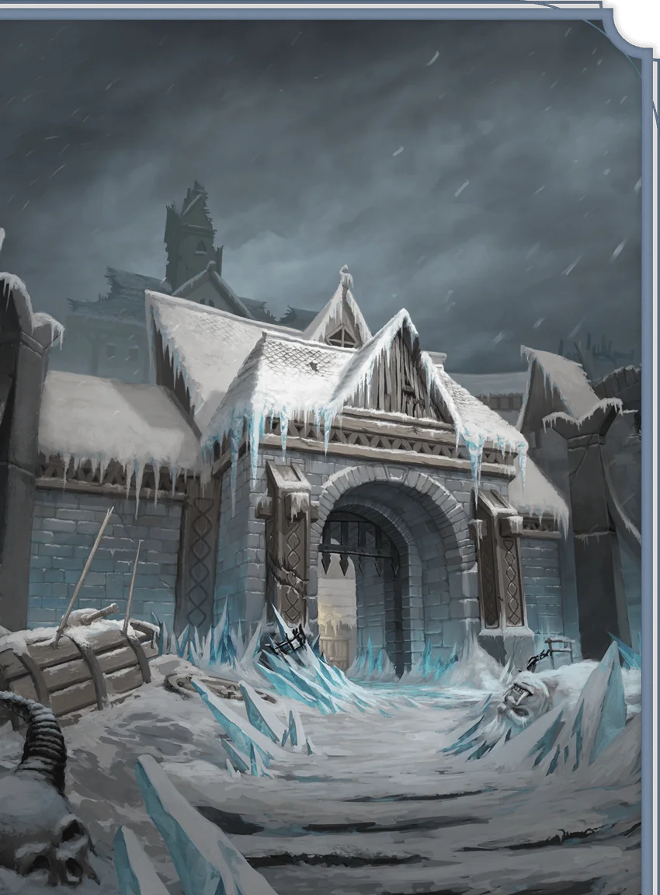

***Frostshrine.*** Once a tavern called the Uphill Climb, the Frostshrine is the closest structure to the castle. It is consecrated to Auril and has been converted into a guardhouse and shrine from which Yldreth, Nymetra, and their four **Guards** defend the village against the castle. Newcomers who seem capable are directed up to the Frostshrine to show deference to Yldreth—and to see if she can convince them to venture into the castle to drive out at least a few of the infesting creatures, with the reward of keeping whatever loot they find.

***The Watchtower.*** When the castle was overrun, the people of Caer-Dineval restored the old watchtower at the mouth of the harbor as a temporary speaker's house. But as the years dragged on, the Watchtower has become a permanent residence and the village's food stockpile and armory. Speaker Siever's one remaining job is to safeguard these provisions, and he performs his role with miserly pomposity, making everyone in the village hate him more each time he withholds a crust of bread or a freshly sharpened knife.

### Caer-Konig

A bitter wind from Kelvin's Cairn sweeps over the tiny village of Caer-Konig, lonely and almost forgotten on the far shore of Lac Dinneshere. Caer-Konig feels like the end of the world, a last scrap of shelter scraped together at the foot of Icewind Dale's great mountain.

The roughly 150 residents here carry on daily life with little thought for the outside world, fishing, hunting, and trapping just as their parents and grandparents did. However, more travelers arrive every day, on their way up to Highplume Station beyond Kelvin's Cairn.

The forest gnome Pinninah Gelvane (Small, Lawful Neutral **Scout**) was elected speaker here after the village's former speaker—silver dragonborn Trovus (Medium, Chaotic Good **Warrior Veteran**)—started a drunken brawl in Bryn Shander that landed him in a cell for a month. Seeking a stable alternative, the village elected Pinninah, a skilled fisher who prefers to talk politics out on the lake, trout spear in hand. Trovus, in contrast, has recently been seen drunk, sleeping in the snow by the docks, unbothered by the cold.

For most of its existence, Caer-Konig was ignored as a mere outpost, but it is the best place from which to set out for Kelvin's Cairn or the new settlement of Highplume Station. The people here enjoy friendly relations with Dwarven Valley—although the valley has been eerily quiet of late.

#### Sea Devil Abductions

No one can say for sure when it started, but for some time now, fishing boats have come back empty and the bodies of locals have been found drifting near the docks at sunrise, with nobody able to explain why they were out by the water so late at night.

Residents have yet to discover that cold-water sahuagin live in the lake. Disturbed by monsters from the Underdark, the sahuagin are angry and frightened. They seek answers for why the depths have been disturbed and have been capturing locals, cruelly interrogating them, and drowning them.

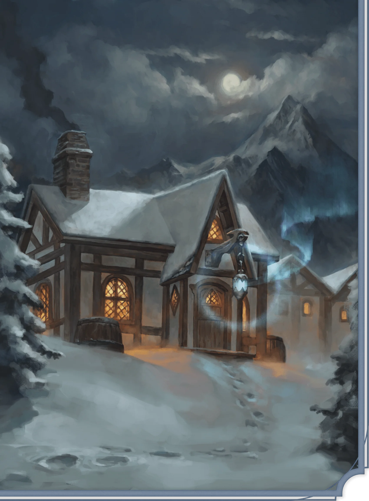

#### Noteworthy Places

The village of Caer-Konig is built in terraced rings that rise from the docks and a natural harbor up to the wind-blown rocks of a ruined castle, with Kelvin's Cairn looming large behind it. A market square is nestled on the eastern side of the hill. The ruin is a scattering of snow-covered stones, already well-picked over for any discarded treasures.

***Frozenfar Expeditions.*** Frozenfar Expeditions offers adventuring gear, dogsleds, and sled dogs. An experienced dwarf guide, Jarthra Farzassh (Medium, Lawful Good **Scout Captain**), runs the shop with the help of several young folk, to whom she passes down mountain lore she learned from her own mentor Atenas Swift. Atenas perished trying to help the people of Caer-Dineval, and Jarthra hasn't forgiven the neighboring settlement for Atenas's death. Lately, Jarthra has been leading expeditions up to Highplume Station, and she's looking for adventurers willing to lend a hand in making sure travelers safely reach their destination.

***Hook, Line, and Sinker.*** The tavern called Hook, Line, and Sinker—run by an elderly, likable human named Eglendar "Glen" Korr (Medium, Neutral Good **Commoner**)—offers a free half-pint of ale (the hook), plenty of drink and good cheer (the line), and a drinking contest at last call, when hardy locals compete to drink visitors under the table (the sinker). For years, Glen has bought his ale from Dwarven Valley, and he needs someone to investigate why his contacts there have gone silent. Nomads of the Tribe of the Owl have taken a liking to the tavern, and on any given night, at least two of their **Warrior Infantry** whisper the latest rumors from the wilderness at the table farthest from the open door.

***Northern Light.*** The inn called the Northern Light is operated by the human siblings Allie and Cori Shorard (Medium, Neutral Good **Commoners**), assisted by Allie's goliath husband, Yorlt (Medium Lawful Good **Scout Captain**), whom Allie found injured on the mountain and nursed back to health five winters ago. The inn is famous for a magic, color-changing lantern that hangs over the door. Allie handles the customers and cleaning, while Cori manages the cooking, with Yorlt hunting for fresh ingredients or trading pelts and antlers with guests. Cori pretends to be annoyed by Yorlt, but the two get along famously and Cori is a devoted aunt to her sister's twin children.

*I pity Trovus. He was a good speaker. Conscientious. Loyal. But he's seen too much. Suffered too much. I see my future in him.*— Sheriff Markham
### Dougan's Hole

Everyone in Ten-Towns has heard the warning: "Don't go down to Dougan's Hell." What was once an insular village has become a living nightmare. The thirty surviving residents, blood relatives of the founder Dougan Dubrace, are trapped in a pact with a monster that thirsts for blood and violence. See the adventure "Dougan's Hell" later in this chapter for guidance on how characters might interact with this settlement.

Dougan's Hole has long been known as an unlikable settlement full of hostile, closed-minded, insular folk who shun outsiders. Many residents were part of a single large extended family. But in the last decade, things have gone terribly wrong.

When the chardalyn dragon obliterated Dougan's Hole, Good Mead, and half of Easthaven, people returned here to rebuild. (See *Icewind Dale: Rime of the Frostmaiden* for more on the chardalyn dragon attack.) But their new structures rose as strange, crooked things, full of holes and barely able to keep out the cold. Fires burning day and night sent plumes of stinking black smoke into the winter sky. Anyone who approached the village disappeared. Nearby wildlife was found mutilated and charred. Gnawed bones, not all from animals, washed up on the lakeshore.

Lately, caravans on the Ten Trail have been attacked by wild-eyed marauders, their merchants and guards dragged off into the snow never to be seen again. Residents of nearby Good Mead and Bryn Shander have posted signs on the road in Common and Dwarvish: "Danger: Do Not Approach," and "Death Awaits in Dougan's Hell."

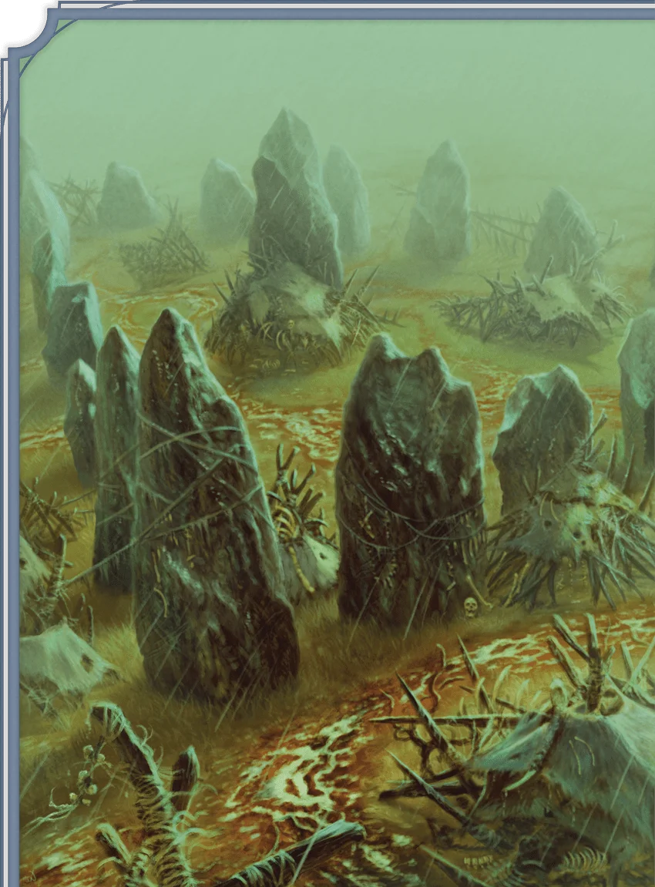

#### Thruun's Cult

Elder Dubrace (Medium, Lawful Evil **Cultist Fanatic**), leader of the village and family patriarch, leads a cult dedicated to Thruun. The elder's word is law, and Thruun's will is all that matters. Elder Dubrace is a wretched man devoid of moral instincts who sold his entire family line into a monster's service without a thought, desiring only to survive and to spite any who looked down on Dougan's kin.

Elder Dubrace is attended by three siblings: brothers Lim and Ryn and their silent sister, Morg(Medium, Lawful Evil **Cultist Fanatics**). These three are bound by Dougan's Bloodcurse and enforce the

elder's orders. Muscular Lim leads raids on the Ten Trail, Ryn is a slender fool who slinks around the settlement trying to sniff out dissent, and Morg keeps watch on the victim cages as she sharpens her favorite knife.

Another family member, Auntie Nen (Medium, Neutral Good **Commoner**) tends as best she can to her family while also suffering from the curse.

#### Dougan's Bloodcurse

By the power of Malar, channeled through Thruun, the descendants of Dougan are invigorated and protected when they shed blood. Creatures affected by Dougan's Bloodcurse have the following additional traits:

- **Malar's Resilience.** The creature has Immunity to Cold damage and to the Exhaustion and Frightened conditions.
- **Murderous Surge.** The creature has Advantage on Strength checks and Strength saving throws.

If Thruun is reduced to 0 Hit Points, the curse is broken. See "Dougan's Hell" later in this chapter for more on confronting Thruun.

#### Noteworthy Places

All that can be seen of the village from the lake are the Twenty Stones of Thruun—a roughly triangular ring of rough-hewn megaliths with one large stone in the center and a weird maze of blackened wreckage erected in perplexing shapes around it.

***Bloodchamber of Thruun.*** At the foot of the central stone of Thruun, a tunnel leads into a circular, high-ceilinged chamber, the walls of which were roughly scratched out of the cold earth with bent shovels and giant claws. This is the Bloodchamber, where Thruun (**Beast of Malar**; see chapter 9) appears at summoning rituals led by Elder Dubrace.

***Dougan's Warren.*** A series of irregular tunnels called Dougan's Warren houses the family, who moved underground to better serve Thruun and Elder Dubrace. The warren is frigid and has little food, since the bloodcursed don't require such comforts. A group of goblins has taken an interest in serving Thruun; they reside within the warren, unaffected by the curse. They are led by the goblin Gutstab Grimbutcher (**Goblin Hexer**), who can be found in council with Elder Dubrace, plotting together to extend Thruun's grasp. Cages within the warren hold captives for sacrificing, including cousin Rogar (Medium, Chaotic Good **Berserker**), who rants that he'll kill the elder once he's free. The outer tunnels of the Warren are lined with thin straw pallets, where members of the family tormented by the curse seek solace in dreamless sleep.

***Eldershelter.*** Adjacent to the Bloodchamber, a smaller space called the Eldershelter is decorated with red wood and burgundy cloth. This cramped, smoky room is the private dwelling of Elder Dubrace. It is littered with the valuables of the clan's captives. Just outside the entrance stand 1d4 **Cultists** who prevent entry by any but the elder and his chosen guests.

***Pike Wall.*** The settlement is surrounded by a leaning ring of sharpened stakes pointed inward. Its design isn't intended to keep strangers out, but to confine the people of Dougan's Hole inside. A few watchful **Warrior Infantry** from the militias of other Ten-Towns warn off anyone coming close and sound alarm horns when a raiding party leaves Dougan's Hole.

***Surface Shrines.*** The surface is littered with shrines erected from charred scraps in Thruun's honor. These form a patternless maze of blackened, crisscrossed beams and poles where the town once stood. The shrines are smeared with blood and infested by scavengers such as **Carrion Crawlers**, **Harpies**, **Rats**, and **Vultures**.

### Easthaven

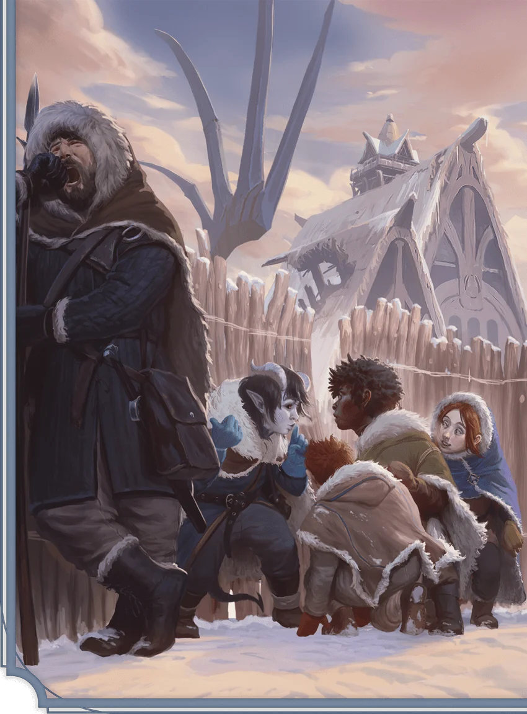

By the standards of Icewind Dale, Easthaven is a grand place, with fish houses, shops, and taverns sprawling haphazardly from its docks at the southern shore of Lac Dinneshere. Easthaven's population of one thousand is made up of fishers, tradespeople, merchants, and even a well-to-do upper crust.

About ten years ago, a chardalyn dragon attacked Ten-Towns and—after doing extensive damage to Good Mead and Dougan's Hole—it came crashing to its destruction in Easthaven. Dragon's Ditch, a long, north-south furrow through the heart of town, marks this site, and the dragon's mangled remains lie half-buried in the rubble of an old tavern at the south end of town, surrounded by a wooden wall called the Palisade. See *Icewind Dale: Rime of the Frostmaiden* for more on the chardalyn dragon.

The human Danneth Waylen (Medium, Chaotic Good **Commoner**) is the town's speaker. Humble and forthright, Danneth has nevertheless chosen to keep the recent string of cult murders (see "Cult of Auril" below) quiet until their perpetrators can be found. Elf captain Imdra Arlaggath (Medium, Lawful Good **Warrior Veteran**) is curt and capable; she leads the town militia. Both are focused on finding the cultists and will reward anyone who helps them bring a discreet end to the murder spree.

#### Pickpocketing

Easthaven is the only place in Ten-Towns where pickpocketing is legal. The town was founded by rogues on the run from an angry thieves' guild in the Duchy of Cape Velen. Anyone who has had their pocket picked or their bag burgled should check certain shops, well known to locals.

#### Cult of Auril

A covert splinter cult of Auril worship led by Nymetra Myskyn of Caer-Dineval has revived the forbidden rite of humanoid sacrifice, which has also spread to Easthaven. Frostbitten bodies have been found bound to poles in the surrounding hills or frozen in the lake ice, marked with symbols of Auril. Nymetra sends messages by ferry from Caer-Dineval to cultists in Easthaven to organize these sacrifices. For now, the deaths are being hushed up by local leaders, but rumors are spreading, and people are asking questions.

#### Noteworthy Places

Most visitors arrive at Easthaven by the Eastway, passing a chardalyn statue of a balor that remains untouched by snow, even in the dead of winter. The main road leads up towards the docks, ferry, and the north end of Dragon's Ditch.

***Easthaven Ferry.*** The ferry is a keelboat that transports people and cargo to Caer-Dineval and Caer-Konig for a modest fee. It has no fixed schedule. Scython (Medium, Neutral Good **Bandit Captain**), the good-natured and well-informed tiefling operator of the ferry, prefers to wait until he has enough passengers to merit a trip across the lake. Lately, business has been booming with prospectors seeking passage to Caer-Konig on their way to Highplume Station, and Scython is more than happy to take their coin and share the latest rumors during the crossing.

***Palisade Court.*** At the south end of Dragon's Ditch lies a half-ruined old tavern and the remains of the chardalyn dragon. Anyone who comes within 30 feet of the remains is stirred by violent urges, so the area is fenced off with a high wooden palisade and is known as the Palisade Court. In the years since the wall was built, enterprising townsfolk have opened shops and competing alehouses around the wall, charging patrons a copper or two for a peek at the Terror of Ten-Towns.

***The Wet Trout and the Other Fence.*** The Wet Trout is the largest and loudest tavern in town, known for ribaldry and rumor-mongering. Fordeg (Medium, Chaotic Neutral **Bandit**), the human owner of the Wet Trout, is lax and permissive—to the delight of his rowdy clientele—and devotes his energy to running the Other Fence, a pawn shop for stolen goods located in the inn's old root cellar and named after Easthaven's famous Palisade Court. The clientele in the cellar leans toward **Toughs** and other ne'er-do-wells, and the goods here are always changing. Magic items occasionally show up on the shelves, but they're often sought by former owners determined to recover them at any price.

***White Lady Inn.*** The once-popular White Lady Inn has become a musty haunt of performers, artists, and patrons with a taste for the macabre. The guests, hosted with dramatic flair by the halfling Rinaldo (Small, Lawful Good **Performer**), gather to tell ghost stories and enjoy cheap accommodations in rooms that are probably not haunted. Who can say for sure whether eerie encounters at the inn are caused by poltergeists and specters from beyond the grave or are merely tricks played by Rinaldo to keep his guests coming back for another night of ghoulish inspiration? The inn's honored guest these days is the high elf Therindrel of Waterdeep (Medium, Neutral Good **Mage**), a visiting scholar from Blackstaff Tower.

> ##### Chardalyn Dragon
>
>The chardalyn dragon whose corpse is so prominent in Easthaven features in *Icewind Dale: Rime of the Frostmaiden*. This book assumes the dragon ravaged the settlements of Dougan's Hole, Good Mead, and Easthaven before being destroyed by adventurers. If you ran the adventure, the dragon might have been destroyed elsewhere along its path of attack. In that case, you can relocate its remains and make other adjustments to this chapter. In "Retaking the Terror," later in this chapter, the party has an opportunity to turn the dragon's remains into a Bastion.
>

### Good Mead

At the edge of Redwaters, nestled between blue-green pines, carved wooden dinosaurs grace the pinnacle of Newmead Hall, from which the buzzing of tens of thousands of bees can be clearly heard. The two hundred residents of the village are dedicated to producing, perfecting, and delivering honey mead.

Good Mead was founded by immigrants from Chult and the Vilhon Reach, which explains its squat dwellings richly adorned with carvings of dinosaurs and serpents. Bees from Newmead Hall are ubiquitous throughout the settlement.

More than ten years ago, after Good Mead was razed by the chardalyn dragon (see *Icewind Dale: Rime of the Frostmaiden* for more on the chardalyn dragon attack), the people of Ten-Towns banded together to rebuild it. The village's new speaker, the wood elf Festris Pilcone (Medium, Chaotic Evil **Noble**), was recruited from the south to rebuild Good Mead's apiary after the chardalyn dragon attack. His beekeeping expertise has led to more mead than ever, in new varieties that have increased demand. New bees were brought from the south, and the mead hall was rebuilt larger than before.

Festris's scientific mind and honeyed words have charmed the settlement, as has his lifelong pursuit of mead-craft. For years, he has been cultivating new mead varieties, produced by increasingly strange bees.

#### Threat from Dougan's Hole

Good Mead's proximity to the violent village of Dougan's Hole has led worshipers of Tempus to erect a wall at the western edge of the settlement, patrolling it day and night. This wall, called the Hedge, is detailed below.

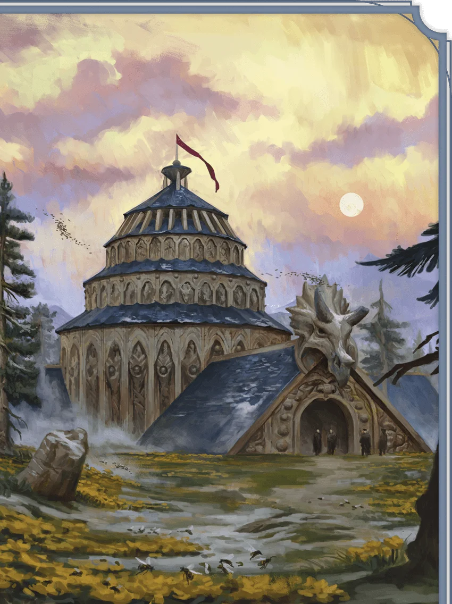

#### Strange Mead

New varieties of mead brewed by Speaker Pilcone have yielded strange properties, causing obsession, sloth, forgetfulness, and other erratic behavior. Festris secretly keeps underground hives; breeding strange bees and mixing honey with bile lichen, slimes, and oozes from the Underdark and concocting mead with powdered chardalyn. Festris is obsessed with experimentation and feels no remorse for any harmful side effects.

The grouchy halfling fisher Chem Bursker (Small **Commoner**) dislikes mead and cast the only vote against electing Festris speaker. Chem's family has lived in Good Mead for generations, and Chem is suspicious of change. Though he won't do any snooping himself, he has saved up coin to hire adventurers to poke around in Newmead Hall's basements in hopes of turning up something to embarrass Festris.

#### Noteworthy Places

Good Mead has no market square—Newmead Hall is the center of the community, and important business and gatherings are conducted there or at the Shrine of the Flaming Sword. The village is tucked between Redwaters and a pine forest, with the Eastway marking one end and the Hedge on the other.

*Something bothers me about Festris. Give me a locksmith and six hours to look around, and we'll get to the bottom of things.*— Sheriff Markham***The Hedge.*** The lichen-covered stone wall called the Hedge stands at the west end of Good Mead, protecting it from Dougan's Hole. It curves in a shallow arc 50 feet long and 15 feet high, with wooden steps and scaffolding on the inside so **Guards** from the Shrine of the Flaming Sword can keep watch from the top. The Hedge has no gate. Anyone attempting to go around must either slosh through Redwaters or fight through brambles in the pine forest.

***Hidden Hives.*** After becoming speaker, Festris set about elevating the settlement's mead production to new heights, insisting on a grand new hall with deep cellars allegedly for long-term cask aging. Festris built the new mead hall with laborers hired from afar. After construction, he murdered the laborers while claiming they'd left town, then locked the cellars and kept the only key for himself. Now the cellars host his strange experiments. Festris has sealed off several chambers infested by oozes, bile lichen, and other Underdark menaces. When curious townsfolk ask him about buzzing from underground, he waves it off as the sound of "happy bees."

***Newmead Hall.*** The three tiers of Newmead Hall resemble a giant wooden beehive defended by

carved reptiles and leathery beasts. The interior features tables, two bars, and a large, fire-heated space devoted to bee husbandry. The human Bilka Grannud (Medium, Lawful Good **Bandit Captain**) is the undisputed boss of this place, a jovial former bandit who fell in love with beekeeping, gave up her life of armed robbery, and became boss of Newmead Hall. She's the only person who stands up to Speaker Pilcone (although she rarely does so). Bilka's right hand is Sweet Tooth (Neutral Good **Allosaurus**; has an Intelligence of 10 and knows Common), an awakened blue-green dinosaur from Chult who came to Good Mead with adventurers and enjoyed the taste of mead so much he stayed to help tend the bees and see to the safety of the Hall.

***Shrine of the Flaming Sword.*** For decades, Good Mead's shrine of Tempus stood vacant, chipped, and faded, with a crow-haunted steeple. But with Dougan's Hole on the village's doorstep and an influx of coin and support from the Order of the Gauntlet, the Shrine—and worship of Tempus—has been restored to its full glory by the shield dwarf Orugar Furth (Medium, Lawful Good **Priest**). Orugar oversees the settlement's worship of Tempus and the defense against the bloodthirsty residents of Dougan's Hole. Many locals attend services here.

### Lonelywood

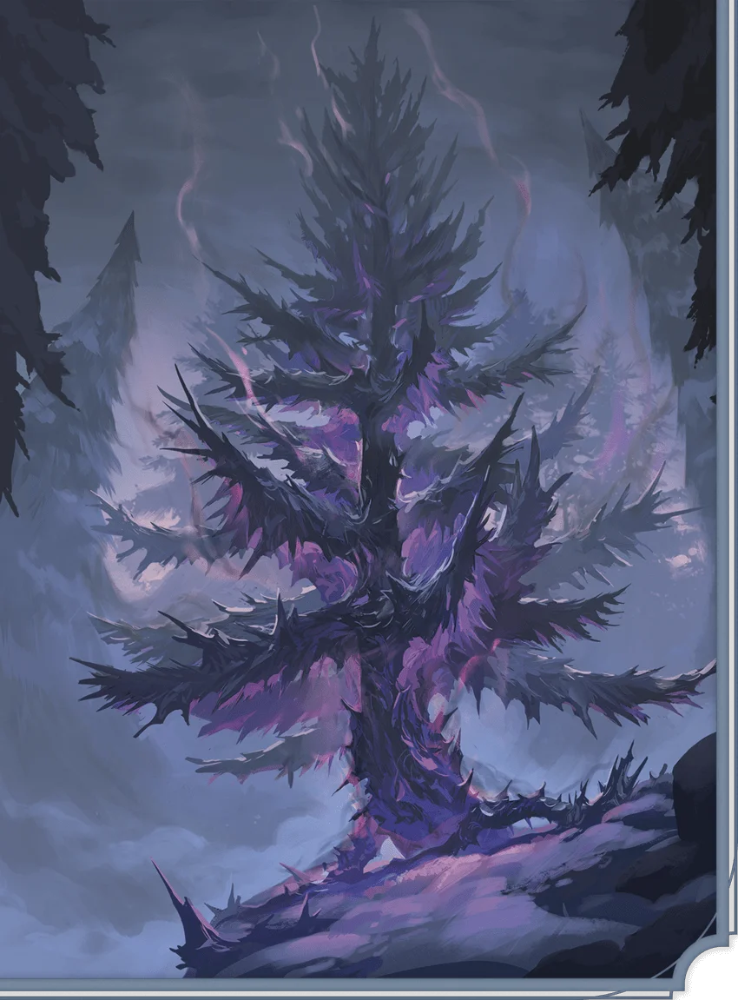

People go to Lonelywood to disappear. Founded by a Sembian family from Urmlaspyr, this quiet village of one hundred is populated by loggers, fishers, and scrimshanders, many of whom were once thieves or murderers or otherwise harbor a secret they'll kill to protect. There is no inn or place to spend the night in Lonelywood. Folks here prefer travelers who don't ask questions and who move on quickly.

Lonelywood has a custom: never bring up the past. It's quietly understood that those who choose to live here are fleeing from something, and talk focuses on today and tomorrow, never yesterday. Folks who ask questions are run out of town—or vanish.

Lonelywood is more forest than village. It sits on the heavily forested bank of Maer Dualdon, surrounded by fir trees and quiet. Timber export to Termalaine and Targos is the major industry, and Lonelywood has the smallest fishing fleet of any settlement on the lakes.

The gnome speaker of Lonelywood, Nimsy Huddle (Small, Lawful Neutral **Commoner**) is a kind, white-haired elder, but like her neighbors, she has been corrupted by chardalyn (see "Jagged Pine" below). She now spends her time complaining about the village's lack of appreciation for her lifetime of service. She has been thinking about "appropriate punishments" for those she believes have done her wrong and seeks adventurers to pay intimidating visits to villagers on her behalf.

#### Jagged Pine

The spreading hemlock called Jagged Pine once grew in the deep forest, its roots sunk into soil infused with shattered chardalyn crystals that became part of the pine's structure. It was found and taken to the lakeshore by a pair of hobgoblin loggers named Barker and Caz (Neutral **Hobgoblin Warriors**).

The crystal tree was transplanted at the water's edge as a monument. Every branch of the tree is jagged with shards, each needle is sharp as glass, and the trunk is spiked with crystalline edges. The tree is Zlanic chardalyn. Creatures that touch or inspect the tree hear an echoing whisper of power as **Zlan** contacts their minds.

As a result of Zlan's influence, tension, guilt, and paranoia curdle the air here. Fights break out between old friends, people hole up in shacks in the woods, and threats follow the slightest provocation. Barker eventually murdered Cas and fled into the forest; he hasn't been seen since. If the tree isn't destroyed or returned to the woods soon, the entire village may fall to murder and mayhem, or disappear entirely as people slink away south or into the woods, never to be seen again.

#### Noteworthy Places

Lonelywood's oldest buildings and docks bear carvings of dragons, lions, and goats in homage to the founding family's chimera crest, but lately its shady streets have become ominous, with shops and drinking houses open for barely a few hours a day.

***Golden Lodge.*** Hidden deep in the forest, a ramshackle logger's cabin called the Golden Lodge holds a grand secret—a stunning interior wondrously carved, painted gold, and filled with *Spell Scrolls*, books, and other lore. For years a tiefling priest of Waukeen named Esurion (Medium **Priest**) has been building his private library, collected over a lifetime of misadventure and theft. He intended to make his home, which he named after an old local shrine, into a temple to Waukeen. Now, he has abandoned that idea and has instead set traps around the cabin to scare off anyone who would steal his hoarded knowledge.

***The Happy Scrimshander.*** The Happy Scrimshander sells tools of the scrimshander's trade: needles and knives in a wide array of shapes and sizes, inks in a rainbow of colors, and wax to seal an engraving when it's done. The shop's owner is a laconic human named Iriskree Harrowhill (Medium **Assassin**). Since the tree came to town, Iriskree regards everyone who comes into her shop with suspicion and secretly decides how she would kill each of her customers before making a sale.

***The Lucky Liar.*** The elegant human barkeep Danae Xotal (Medium, Lawful Evil **Spy**) keeps the doors of the Lucky Liar open longer than other shops in town to gather secrets, and she serves customers with long pours and open ears. Danae is secretly a Thayan agent, gathering secrets for her master, Szass Tam. She's bitter at being posted for so long in this distant hinterland and dreams of returning to her master's service in Thay. For now, she waits and watches for any opportunities that might benefit the Red Wizards, and her master in particular.

One human resident of Lonelywood, Hairy Jack (Medium, Chaotic Neutral **Werewolf**), is often found at the Lucky Liar. Jack tries to keep his lycanthropy a secret, and he is gathering a group to raid newly rich Termalaine.

*I've watched as Zhents have moved into Targos. I don't like it. But you're looking at dozens of enforcers, plus Yaven's personal assassin. That's not a problem me and a couple of deputies are going to solve.*— Sheriff Markham
### Targos

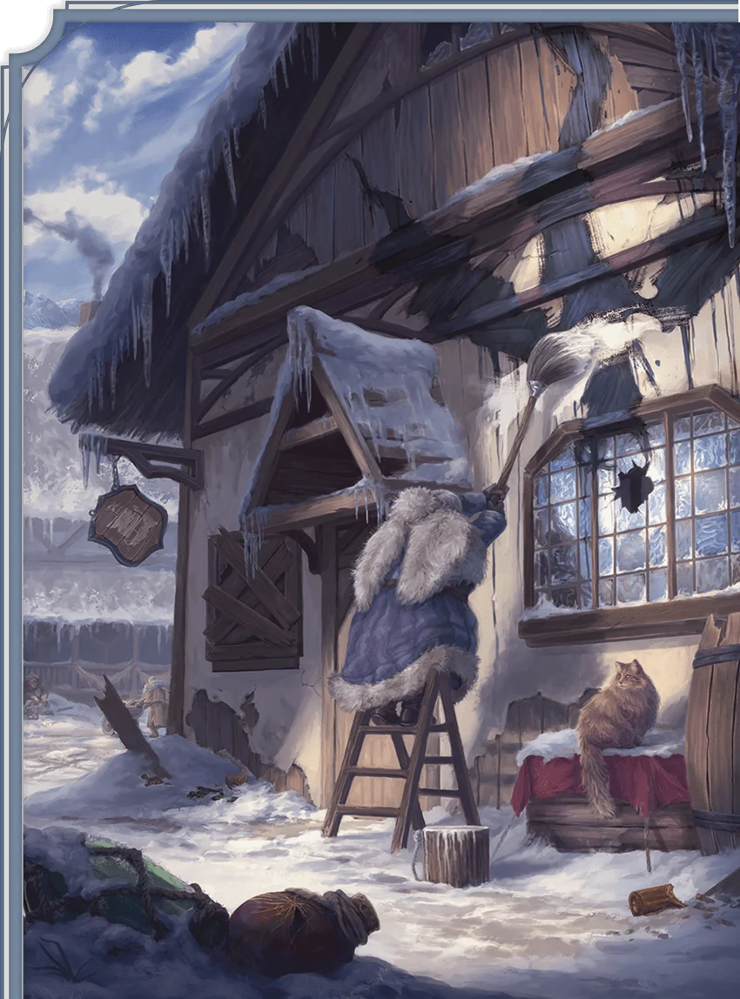

Targos is encircled by a wooden wall that extends into the lake, creating a safe harbor and allowing the town to build and maintain the largest fishing fleet in Ten-Towns. Most of the 1,200 townsfolk are fishers, boat wrights, net menders, scrimshanders, or otherwise engaged in the fishing trade—at least, that's how it seems on the surface. But it's an open secret that the Zhentarim runs this town, and nothing happens here that Zhents don't approve of.

Targos was a thriving settlement when Bryn Shander was still "the camp on the hill," and it has deep ties to the ill-fated city of Luskan. Trade with Bryn Shander benefits both towns. Targos supplies knucklehead trout to Bryn Shander, and Bryn Shander's criminal element supplies whatever the Zhents who control Targos demand.

#### Zhentarim in Targos

About fifteen years ago, an enterprising Zhentarim agent named Naerth Maxildanarr became the speaker of Targos. Eventually he crossed the wrong set of adventurers, but his reports piqued the interest of the Zhentarim. One of the organization's leaders, Manshoon, liked the idea of an "icebox" where valuable ill-gotten merchandise could be stored until suspicion waned. Today, the Zhentarim controls business in town through the paper-thin front of the Dockworker's Guild. For those who stay in line, it's not so bad. But for the Zhentarim's enemies... well, Maer Dualdon is quiet and deep, and the knucklehead trout need to be fed.

The human speaker of Targos, Yaven Rethlinscarp (Medium, Lawful Evil **Bandit Crime Lord**), is Zhentarim through and through. Raised in the organization and wholly dedicated to its interests, Yaven is a bulky man who moves with a slow step but bursts into sudden violence if provoked or disrespected. His wife and favorite problem-solver, a drow named Kliyra Yxthral (Medium, Neutral Evil **Assassin**), stays by his side with her trademark sarcastic smile, ready to kill at his nod.

Yaven relies on his family to get things done and keep troublemakers in line, especially his drow nephew Rak Vakh'shan (Medium **Zhentilar Soldier**; see chapter 9), who runs the docks, and the human Surgulio Pondt (Medium, Lawful Evil **Bandit Captain**), who raised Yaven and now handles trade with

Bryn Shander. Also indispensable to Yaven is the forest gnome Flax Perripat (Small, Lawful Good **Spy**), a wrangler of winged snakes, but Flax is secretly a Harper agent.

#### Noteworthy Places

Targos originally had well-spaced buildings separated by wide avenues. Over the years, smaller buildings have been added between, crowding every street until people can walk down alleys where their elbows touch doors on either side.

***Dockworker's Guildhall and Warehouses.*** This sprawling wooden building, once the town hall, has been converted to a headquarters for the Dockworker's Guild—which means the Zhentarim, as everyone in town knows. It houses Speaker Yaven's living quarters; bunk rooms where **Toughs**, **Zhentilar Soldiers** (see chapter 9), and agents of the guild sleep; storage for weapons; a rookery for **Flying Snakes**; and attached warehouses under Surgulio's watchful eye. These warehouses contain all sorts of stolen and smuggled goods. With Yaven's full knowledge, Surgulio runs a small side business selling stolen potions. Characters might be directed to the old Zhent for "cures and concoctions" of all kinds.

***The Luskan Arms.*** The oldest public house in Ten-Towns is the Luskan Arms. It was originally built to look like a pub from Luskan, its ceiling draped with sails and the roof supported by the ancient mast of a ship. The Luskan Arms is centuries old; it shows its age in every creaking beam, and the stink of its rat-infested cellar rises through the rotten floorboards. Its rooms are low ceilinged and cheap, the beer warm and flat, and the entertainment consistently low quality. Yet for all that, its Luskan decor and proximity to the Dockworker's Guildhall earn it Speaker Yaven's approval as his favorite drinking hole, which makes it popular among every Zhent who wants to be in his good graces. The taciturn human Owenn Tarsenal (Medium **Commoner**) is the tavern's proprietor.

***Three Flags Sailing.*** The threshold of this quiet drinking house is worn down from decades of fisher folk stamping their snowy boots at the door. Perhaps the only business in town where Zhents aren't entirely welcome, Three Flags Sailing is a struggling tavern, regularly vandalized as a sign of Yaven's disapproval. It usually has at least one window boarded up and a patch of new whitewash on the exterior, where the frail human Ethen "Ma" Yarbroul (Medium, Neutral Good **Commoner**) has covered over a fresh threat or expletive painted in the night. If anyone mutters against the Zhentarim, they do it here—but such talk is brief and hushed, since everyone knows the Zhents are always listening.

***Triglio.*** This general store takes its name from one of the chanteys that the fishers of Targos sing when they're hard at work: "Trig-lee-oh, lads, an' 'oist upon the line / Trig-lee-oh, lads, an' bring yon fishers in." The store's proprietor, a scarecrow-thin human named Jestin (Medium, Neutral Good **Commoner**), was a fisher himself long ago, but after an accident took his left hand, he opened this store. The Dockworker's Guild sells fishing and sailing supplies from the guildhall, so Triglio sells everything else: cold weather gear and snowshoes, rations and sweets, bags and barrels, tool kits and art supplies—whatever odds and ends Jestin has found buyers for over the years.

### Termalaine

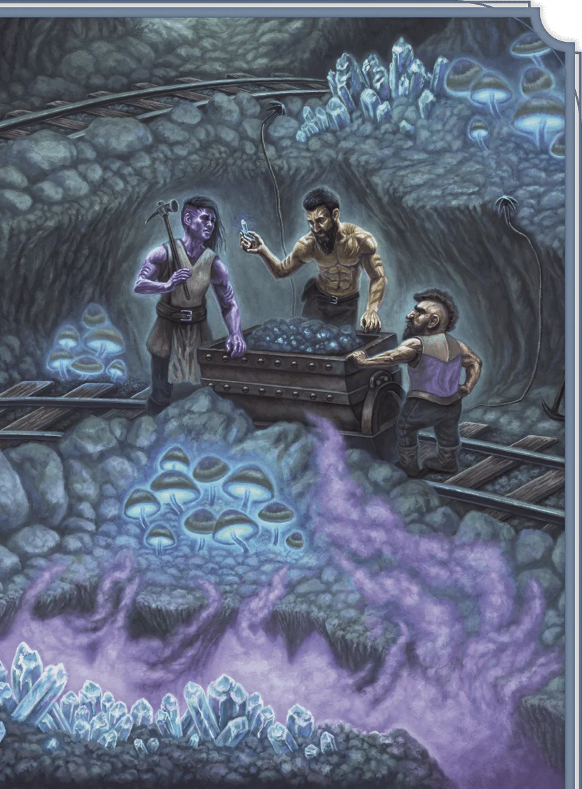

In all its years as a gem-mining settlement, Termalaine has never seen a boom like the one it's presently enjoying. After a recent earthquake, new sections of the old mine opened up, bringing a rush of sudden wealth and new faces to town. The population swelled to eight hundred, and though some residents still fish for knucklehead trout, far more are buying pickaxes, shovels, and lanterns to seek their fortunes in the nearby cavern complex.

Founded by Calishite settlers who appreciated beauty, Termalaine is the most picturesque settlement in Icewind Dale—and one of the coldest, as it's plagued by dreadful gales that sweep across Maer Dualdon to harry fishers at the southern end of the lake.

Local-born human Darmo Mazlu (Medium, Chaotic Good **Commoner**) is Termalaine's speaker. He likes to tell the story of the time he helped a group of adventurers during the early years of Auril's everlasting winter. He's a boisterous man who insists he'll never settle down. He's delighted by the town's sudden prosperity and does everything possible to encourage the influx of prospectors, waving away any hint of worry with a sunny disposition and a flagon of Good Mead's finest.

#### Underdark Access

Termalaine's mine has always been its most notable feature. Now, however, interest has reached a fever pitch, and the town brims with strangers crowding every inn and private residence, lining up before dawn to enter the mine northeast of town.

The mine opened up due to shifts in the Underdark far below. The few miners on hand that day heard a deep rumbling, which they first took to be a cave-in until they discovered that the bottom of several passages had dropped out, exposing glittering caverns and ruins below. As more surface dwellers descend, denizens of the Underdark stir. **Darkmantles**, **Ropers**, **Gricks**, and **Hook Horrors** hunt in the dark, while myconids, watching impassively, send out spores to trace the contours of new minds. Worst of all, mind flayers have enthralled miners and sent them back to the surface as scouts—the subservient vanguard of the inevitable invasion from a hungering colony.

Those headed into the deepest mines are advised to hire Horma Heftgrave (Medium, Lawful Evil **Warrior Veteran**) an experienced dwarf guide, but Horma was secretly enthralled by **Mind Flayers** and is now under a compulsion to bring fresh prey to her masters.

#### Noteworthy Places

Termalaine is divided by wide avenues planted with plentiful trees, bordered on the north and west by tall pines. Its buildings incorporate Calishite carvings of wizards, homunculi, tigers, and smiling djinn.

***The Blue Clam.*** The fishers of Termalaine finish their days at the Blue Clam, sitting on benches near long hearths to warm their feet while they fill their bellies with spiced chowder. Beautiful works of scrimshaw hang on the walls. The Clam is the perfect place to listen for rumors, such as news of missing miners, or whispers that those who dig especially deep come back with a strange look in their eyes. The tavern's orc owner and chef, Vernon Braig (Medium, Neutral Good **Commoner**), is friendly with folks from Lonelywood and worries loudly about the strange goings-on up there.

***The Eastside.*** What looks from the outside like a group of separate houses is actually a single inn with rooms connected by underground passages and cozy guest accommodations in the cellar. The genteel human Marta Peskryk (Medium, Lawful Good **Commoner**) inherited the Eastside inn from her father. She and Speaker Mazlu have an on-again, off-again relationship. Recently, guests in the deepest cellar rooms have complained to Marta about headaches and unsettling thoughts. Marta is unaware that her cellar sits at the edge of a psionic field (see "Hazards" earlier in this chapter) generated by the mind flayer colony below.

***Gem Mines.*** The upper three levels of the old tourmaline mine from which the town takes its name are well mapped and excavated, but the new, deeper mine openings have changed everything. The surrounding area now hosts a tent camp for prospectors, where mine boss Gulbrek the Wide (Neutral **Ogrillon Ogre**) enforces law and order and breaks up frequent squabbles. The entrances and upper tunnels are crowded and noisy, and freshly built scaffolding and ropes descend into the quiet and ominous depths.

***Grand Row.*** New money in Termalaine has led to new construction. Old cabins were torn down to build the tall and gaudy houses of Grand Row, decorated with filigree and fine plantings for the town's suddenly wealthy miners. This new gentry competes to outspend each other. Carts and sleds arrive regularly, loaded with expensive goods and furnishings from the south, and residents are considering hiring muscle to keep their houses safe from break-ins.

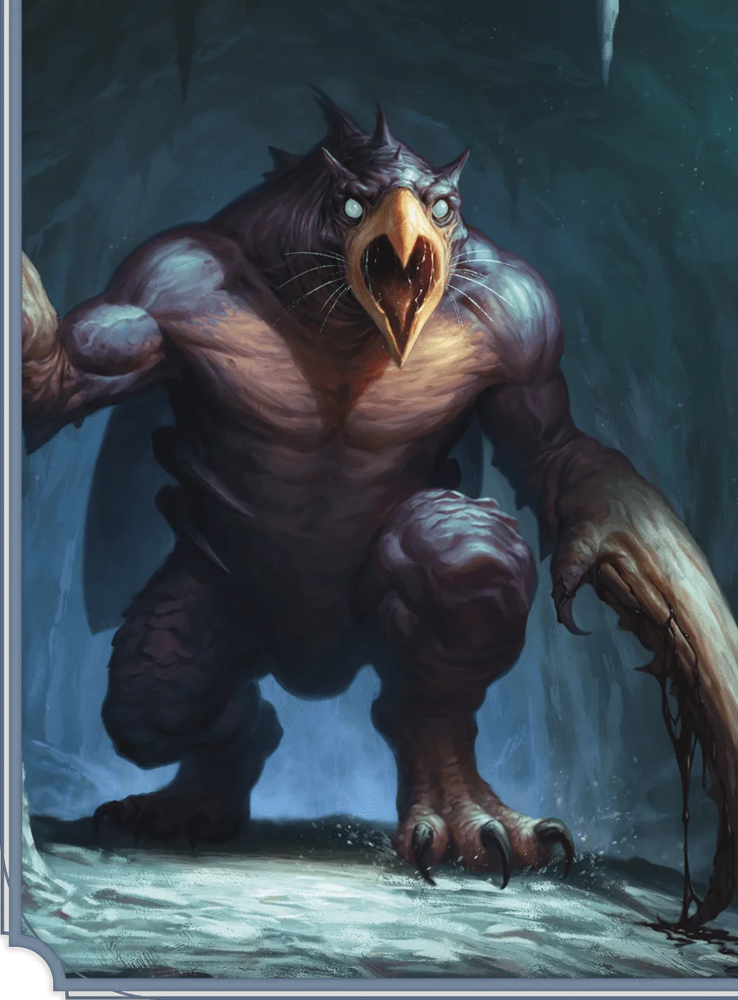

A dragonborn miner named Spartas Ourysk (Medium, Neutral Good **Noble**) struck it rich when the mine expanded, and they now lead society on Grand Row. Spartas is advised by the gnome Tik Ektingket (Small **Mage**), a sorcerer drawn by new money.

## Beyond Ten-Towns

The hinterlands of Icewind Dale is a rolling white infinity where the wind howls without ceasing and winter gnaws the frozen bones of long-forgotten heroes.

### Reghed Camps

Reghed camps are scattered throughout Icewind Dale. None appear on maps because these nomads don't stay in one place for long. A clan might set up its camp for a tenday or two, then dismantle it to follow reindeer migrating across the tundra. While clans of the same tribe build camps close to one another, the tribes avoid contact with each other unless a diplomatic summit is taking place.

Camps typically consist of a chieftain; a great warrior who serves as adviser (such as a **Warrior Veteran** or **Warrior Commander**); a **Druid** who wears a wooden mask of the clan's sacred animal in public; and dozens of **Scouts**, **Warrior Infantry**, noncombatants such as children or elders, and sled dogs (use the **Wolf** stat block). The dogs sleep with the warriors in an outer ring of small tents surrounding the chief's circle, an inner ring of larger tents protected from the cold by thick fur blankets and the heat of the campfires.

A Reghed camp is somber and subdued, except for the barking of sled dogs and the sounds of children playing. When at camp, warriors and hunters swap familiar stories and invent new ones that glorify the nomads' outlook on life as they maintain their weapons and other combat gear. Noncombatants maintain the clan's sleds, tents, and clothing and prepare food such as reindeer, seal, and knucklehead trout.

### Frozen Ruins

The ruins of giant settlements are scattered throughout the wild and buried under the ice. The most famous of these is Jarlmoot, a silent circle of massive thrones to the west of Bremen. Jarlmoot is occupied at full moon by the stern spirits of long-dead frost giant jarls.

Stumbling across a giant ruin promises treasure and peril. The barrows of the giants hold magical items but also traps and giant Undead. Places of particular significance might be marked with glyphs of warding placed by giant rune wizards long ago. These ruins are often not truly abandoned—they are visited by **Frost Giants**, who travel on the backs of **Mammoths** while accompanied by leashed **Polar Bears**. White dragons prize giant ruins as suitably majestic roosts.

### Steam Vents

A new sight has arisen in Icewind Dale—huge plumes of steam rising up from vents to the melting Underdark. These white billows can be seen for miles, attracting travelers, scavengers, and predators.

Six steam vents have been mapped by Reghed and Ten-Towners, although everyone suspects more exist. Three of those are inaccessible, located in lakes or unreachable crags. The others rise from exposed rock and have become oases of heat and trade.

Ten-Towners, the Tribe of the Owl, and others cluster around the accessible vents. Sentries watch the vents as oozes and aberrations, attracted by the heat, noise, and pulsing veins of surface dwellers, reach upward toward the light.

#### Highplume Station

The closest steam vent to Ten-Towns has developed its own tent settlement. Highplume Station is a frontier village of about 150 adventurers, mercenaries, deep delvers, ruffians, the Tribe of the Owl, and guides. A few enterprising merchants do brisk business selling supplies at steep prices.

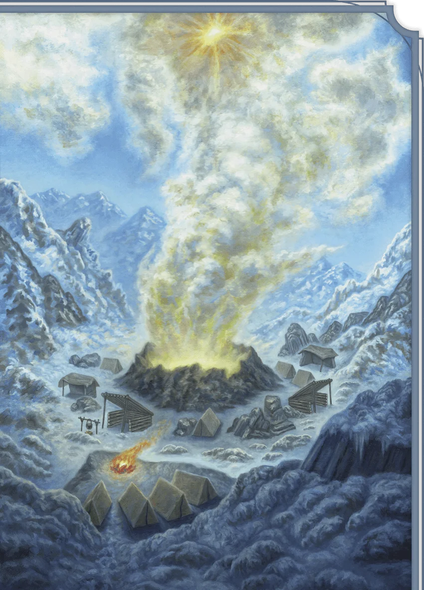

The vent at the center of the settlement emits hot, sulfurous steam that makes the settlement warm and moist, covering everything in a light sweat of condensation.

Highplume Station sits over giant ruins, and expeditions map their depths and raid these catacombs. **Cloakers**, **Ettercaps**, **Rust Monsters**, and **Behirs** crawl to the surface, hidden by steam, snatching unwary prey and dragging them down to be devoured.

No one formally is in charge of Highplume Station, but the shop of Geft Ardamar (**Aarakocra Aeromancer**) serves as the station's de facto court of law, with Geft handing down arbitrations quickly and more or less fairly (give or take a well-placed bribe). Geft is a daredevil explorer who ventures into the ruins at night.

### Dwarven Valley

Dwarven Valley stretches south from the foot of Kelvin's Cairn. For almost as long as settlers have been fishing the lakes, the dwarves of Clan Battlehammer have mined the valley's depths. Dwarf-carved tunnels run in rows along the valley's walls, connected by narrow walkways. The heart of Kelvin's Cairn lies beneath, deep in the tunnels and mines. Those who pick their way down the dizzying switchback called Daledrop find a strange mystery.

Gone is the pervasive ringing of hammer strikes, replaced by an eerie silence. Adventurers exploring the valley see signs of unplanned departure—bowls of old stew molder on tables, blades rust on cold forges, and domesticated goats and badgers wander the halls in search of their former keepers. Those who investigate see signs of struggle, such as scraped boot prints from captives dragged off into the deeper tunnels.

The mines became the dwarves' doom when they tunneled into the Underdark. Mind flayers infiltrated first the lower tunnels, then outlying homes, ultimately abducting or devouring nearly every dwarf in the valley. Adventurers investigating the dwarves' fate must face the **Grells**, **Grimlocks**, **Intellect Devourers**, and worse below.

### Kelvin's Cairn

Rising from the desolate tundra of Icewind Dale is a mountain of giant boulders, piled one atop the other until they narrow to a snow-capped peak. Beasts hunt these craggy slopes, giants tread across the broken rills, and dwarf-hewn tunnels pierce its hidden depths. This is Kelvin's Cairn, the heart of Icewind Dale and its highest point. Distances throughout the region are routinely measured from the mountain.

Few explorers venture onto the mountain's rocky slopes. No settlement has taken root there. The mountain's face is home to wild beasts and yetis. Boastful adventurers who set out from Ten-Towns to bring back a yeti's white pelt return with harrowing tales of being hunted across the mountain's slopes by the creatures they had imagined as prey.

### Reghed Glacier

At the eastern perimeter of Icewind Dale, the tundra meets the great Reghed Glacier. Reghed rarely venture to this bleak and barren area. Biting winds pour off the ice, and the glacier's slow advance and retreat scours the earth of whatever life takes root here. Great earthen walls, left behind by the glacier, stand guard over empty tundra. Ancient giants used these walls to mark the boundaries of their kingdom.

### Sea of Moving Ice

Far to the northwest, a sea of grinding icebergs gnashes against the frozen shore: the Sea of Moving Ice. Reghed make no claim on this sea—it's the province of seals and shipwrecks, **Merrows** and **Plesiosauruses**, **Krakens** and white dragons.

Still, whalers come here to harvest whale oil to sell as fuel. It's dangerous, dirty work, which few take on voluntarily. Farther up the coast stands a grim black tower—Revel's End, a frigid prison on a cliff, used by the Lords' Alliance to hold heinous criminals. Somewhere out in the water is the drifting Island of Solstice, a great ice floe on which stands Grimskalle, a fortress once inhabited by Auril in a mortal form.

### Spine of the World

The staggering peaks of the Spine of the World isolate Ten-Towns, making it accessible only through a single narrow pass on the Ten Trail. The mountains are famed for avalanches, beasts, and monstrosities. It was from here, in the fortress of Sunblight, that the duergar tyrant Xardorok unleashed the chardalyn dragon. A thriving goblin lair, Karkolohk, grows slowly but steadily where the mountains meet the coast. The Cackling Chasm echoes with the laughter of gnolls that gnaw on bones and sniff the air for the scent of warm blood or campfire smoke.

These mountains are home to two goliath settlements, Skytower Shelter and Wyrmdoom Crag, nestled in hidden cave complexes high on the crags. The two clans feud with one another and rarely have dealings with Ten-Towns.

## Icewind Dale Conflicts

Horror is everywhere in Icewind Dale. While the undead creature known as **Zlan** stalks the ice, adventurers have their hands full simply trying to stay alive.

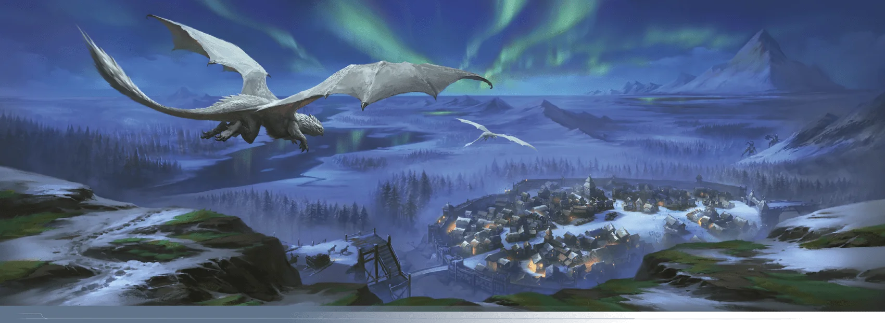

### Survival Horror

A survival horror campaign in Icewind Dale often focuses on multiple threats rather than a single villainous mastermind—in Icewind Dale, the entire setting is out to kill you. Danger doesn't go away just because a single enemy is defeated.

#### A Survival Horror Arc

The party's efforts to survive the many horrors of Icewind Dale might follow this broad outline.

***Levels 1–4.*** You can start your campaign when the characters are hired to explore a frozen library filled with hungry undead. Use the adventure in chapter 7. Then, the characters must stop bloodthirsty sacrifices to Auril. Use "The Cost of Warmth" in this chapter.

***Levels 5–10.*** As the characters survive threats in Ten-Towns, folk there look to the party to solve bigger problems—like the cursed, murderous Dubrace family. Use "Dougan's Hell" in this chapter. Greater threats lurk beyond Ten-Towns, including the ghosts of long-dead giants, packs of ravenous gnolls, hungry remorhazes, and even white dragons.

### Zlan the Unthinkable

Zlan is an ancient creature left over from the creation of the *Crystal Shard* (see chapter 9). You can use Zlan as an overarching villain for Icewind Dale campaigns.

#### Zlan's Goals

Zlan desires nothing less than the death of every person in Icewind Dale. To do this, Zlan has created easy access to the Underdark and awoken a trio of deep dragons. As Ten-Towners explore the Underdark, they wake frozen aberrations, spread deadly environmental dangers, and slowly seal their own doom.

#### A Zlan Arc

The conflict between the characters and Zlan might follow this broad outline.

***Levels 1–4.*** The characters might hear rumors of a bizarre creature shambling over the ice. They might touch Zlanic chardalyn and get a sense of Zlan's power. You can use "Retaking the Terror" in this chapter to introduce chardalyn and Zlan.

***Levels 5–10.*** Once Zlan knows of the party, it begins watching them from afar and directing its agents against them. The deep dragon Mornethraxys is one of Zlan's pawns, and you can use "What Wakes Below" in this chapter to reveal the deep dragons' plot to conquer Icewind Dale.

***Levels 11–16.*** As contact between Icewind Dale and the Underdark increases, the characters become the only thing standing in the way of Zlan and its minions. They'll need to overcome powerful aberrations freed from beneath the ice, the deep dragon Enderbalathal, and eventually Zlan itself. But even if Zlan is destroyed, the creature's immortal body will return, with another of its seven minds in control.

## DM's Toolbox

This section provides tools useful for Icewind Dale adventures, including guidance on renown, Bastions, and random encounters.

### Renown in Icewind Dale

You can use the renown rules in chapter 3 of the *Dungeon Master's Guide* to track the party's relationships with important NPCs in Ten-Towns.

#### Ten-Towns Renown

Characters earn renown in Ten-Towns by protecting a settlement, advancing its interests, performing tasks for key NPCs, or resolving threats. Characters track their Renown Score for each settlement individually, but heroes who undertake an adventure that helps all of Icewind Dale (such as ending humanoid sacrifice, restoring Dougan's Hole, or addressing a regional threat) gain renown with all settlements at once.

##### Ten-Towns Renown
| Renown Score | Reward                                                                                                                                                                                                                                                                                 |
|:------------:|----------------------------------------------------------------------------------------------------------------------------------------------------------------------------------------------------------------------------------------------------------------------------------------|
|      3+      | All citizens of the settlement are Friendly to you by default.                                                                                                                                                                                                                         |
|      5+      | Inns in the settlement offer you complimentary room and board, providing you a Poor lifestyle for free.                                                                                                                                                                                |
|      10      | The first time your Renown Score reaches 10, a settlement merchant gifts you 100 GP worth of adventuring gear (see the *Player's Handbook* and chapter 4 of *Forgotten Realms: Heroes of Faerûn*).                                                                                     |
|      15+     | You gain the confidence of the town speaker or other powerful settlement member. You can call on said person for a minor favor, such as providing information or one piece of expensive equipment. Once you call for a favor, you can't do so again until your Renown Score increases. |
|      25+     | You are given a minor title, such as marshal, sheriff, or counselor. The first time your Renown Score reaches 25, the settlement leader gifts you a mundane art object worth 500 GP.                                                                                                   |

### Icewind Dale Bastions

The adventure "Retaking the Terror" provides a map and a way for characters to turn the remains of the chardalyn dragon in Easthaven into their Bastion. The crash site is itself an adventure location, and tunnels below it lead into the Underdark. At first these tunnels represent a threat to the characters, but as the party's power increases, the tunnels become the perfect launching point for excursions into the Underdark.

The chardalyn dragon remains and ruined tavern detailed on the map represent the party's combined Bastion. As characters increase in level, they can add to this structure, or they might discover previously hidden underground levels. As they gain wealth and renown in Easthaven, they might rent or purchase adjacent structures to expand their footprint on the surface.

An Icewind Dale Bastion could draw hirelings from across Ten-Towns, such as a criminal cook from Lonelywood, an Auril-worshiping sled dog keeper, a third-generation mead maker, or a scrimshawing artisan. Characters with renown among the Reghed might recruit them as warriors or guides. A frost druid might awaken plants and animals in the party's service, and goliaths from Wyrmdoom Crag could send emissaries to Ten-Towns to visit or live at the Bastion.

#### Bastion Events

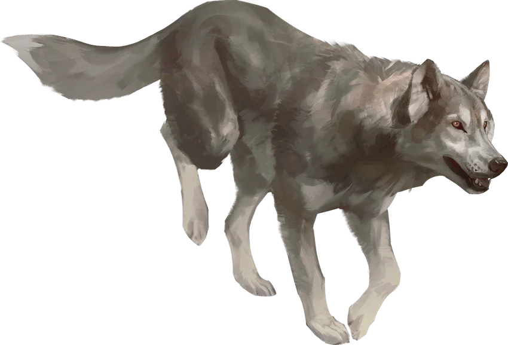

The Bastion Events table in the *Dungeon Master's Guide* describes random events at a Bastion. You can tailor these events to Icewind Dale as follows.

***Attack.*** The Bastion is attacked by beasts or raiders from the wild or Dougan's Hole, threats from the Underdark, or enemies under the sway of Auril or **Zlan**.

***Extraordinary Opportunity.*** One of the Bastion's tunnels is discovered to lead to a particularly wondrous or dangerous chamber in the Underdark.

***Guest.*** The Bastion hosts a visit from a Reghed tribe, a chancellor of the Lords' Alliance from Revel's End, goliath emissaries, or the head of a duergar clan.

***Refugees.*** The refugees flee extreme weather, a disaster in a nearby settlement, or a sudden bloom of bile lichen.

### Abroad in Icewind Dale

You can roll 1d10 on the tables below to generate encounters for a party of any level. Once you've used an encounter, remove it from the table and create a new one to replace it.

#### Ten-Towns Encounters

Icewind Dale's settlements are dangerous places.

<table class="rd__b-special rd__b-data  rd__b-data--stats">
		<thead>
			<tr>
				<th class="rd__data-embed-header ve-text-left" colspan="6" data-rd-data-embed-header="true">
					

						

							Ten-Towns Encounters
							
						

						[–]
					

				</th>
			</tr>
		</thead><tbody class="" data-rd-embedded-data-render-target="true"><tr>
			<td colspan="6" data-rd-tag="table" data-rd-uid="Ten-Towns Encounters|FRAiF" data-rd-page="tables.html" data-rd-source="FRAiF" data-rd-hash="ten-towns%20encounters_fraif" data-rd-name="Ten-Towns Encounters" data-rd-display-name="Ten-Towns Encounters" data-rd-style="" data-rd-entry-data="{}">
				<i>Loading <a href="tables.html#ten-towns%20encounters_fraif"  onmouseover="Renderer.hover.pHandleLinkMouseOver(event, this)" onmouseleave="Renderer.hover.handleLinkMouseLeave(event, this)" onmousemove="Renderer.hover.handleLinkMouseMove(event, this)" onclick="Renderer.hover.handleLinkClick(event, this)" onwheel="Renderer.hover.handleLinkWheel(event, this)" ondragstart="Renderer.hover.handleLinkDragStart(event, this)" data-vet-page="tables.html" data-vet-source="FRAiF" data-vet-hash="ten-towns%20encounters_fraif" ontouchstart="Renderer.hover.handleTouchStart(event, this)" >Ten-Towns Encounters</a>...</i>
				
			</td>
		</tr></tbody></table>
#### Wilderness Encounters

The wild isn't kind to adventurers.

<table class="rd__b-special rd__b-data  rd__b-data--stats">
		<thead>
			<tr>
				<th class="rd__data-embed-header ve-text-left" colspan="6" data-rd-data-embed-header="true">
					

						

							Wilderness Encounters
							
						

						[–]
					

				</th>
			</tr>
		</thead><tbody class="" data-rd-embedded-data-render-target="true"><tr>
			<td colspan="6" data-rd-tag="table" data-rd-uid="Wilderness Encounters|FRAiF" data-rd-page="tables.html" data-rd-source="FRAiF" data-rd-hash="wilderness%20encounters_fraif" data-rd-name="Wilderness Encounters" data-rd-display-name="Wilderness Encounters" data-rd-style="" data-rd-entry-data="{}">
				<i>Loading <a href="tables.html#wilderness%20encounters_fraif"  onmouseover="Renderer.hover.pHandleLinkMouseOver(event, this)" onmouseleave="Renderer.hover.handleLinkMouseLeave(event, this)" onmousemove="Renderer.hover.handleLinkMouseMove(event, this)" onclick="Renderer.hover.handleLinkClick(event, this)" onwheel="Renderer.hover.handleLinkWheel(event, this)" ondragstart="Renderer.hover.handleLinkDragStart(event, this)" data-vet-page="tables.html" data-vet-source="FRAiF" data-vet-hash="wilderness%20encounters_fraif" ontouchstart="Renderer.hover.handleTouchStart(event, this)" >Wilderness Encounters</a>...</i>
				
			</td>
		</tr></tbody></table>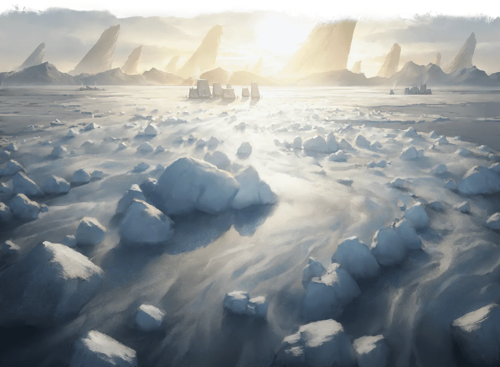

## The Cost of Warmth

- **A Location (Icewind Dale) Adventure for Level 3 Characters**

*Stop a series of cult killings.*

- **Situation.** A cult of Auril has revived the rite of humanoid sacrifice in Easthaven. Their leader, Nymetra, operates from hiding in Caer-Dineval.
- **Hook.** Sheriff Markham Southwell (Medium, Lawful Good **Warrior Veteran**) hires the characters to look into the disappearance of local fisher Bott Witters, husband of elderly innkeeper Vie Witters. Bott was last seen heading up the coast.

### Encounters

The adventure consists of these encounters.

***Frozen Sacrifice.*** An hour from town, three **Wolves** scavenge from a fishing boat frozen in thin ice. The boat holds Bott's corpse, marked with snowflake symbols left behind by cultists of Auril.

***Easthaven Killings.*** The killers are a **Cultist Fanatic** and three **Cultists** wearing white masks. Until the characters solve the killings, a body marked with snowflakes is found every 1d6 days.

***Caer-Dineval.*** The people of Caer-Dineval worship Auril, and the village is the next settlement up the coast from Bott's boat. When the party arrives to investigate, three **Imps** break free from the castle to fight the party. Later, Yldreth and Nymetra explain that Auril protects their village from the fiends in the castle. They deny knowledge of the killings.

***Cold Court.*** The cult operates out of an abandoned wooden tower outside Caer-Dineval. Characters might be led to the tower through rumors, tracking cultists in the snow, or divination magic. Each time the characters enter a distinct level of the tower, roll on the following table, ignoring duplicates. As the party explores, they eventually find a ritual table and list of future sacrifices approved by "Ice-Knife Nymetra." Their own names are listed.

| 1d4 | Encounter                                                                                    |
|:---:|----------------------------------------------------------------------------------------------|
|  1  | A character triggers a collapsing roof trap (see chapter 3 of the *Dungeon Master's Guide*). |
|  2  | Two **Cultist Fanatics** lurk out of sight to ambush the characters.                         |
|  3  | A **Spy** pretends to be the cult's captive to infiltrate the party.                         |
|  4  | Ice-Knife Nymetra.                                                                           |

***Ice-Knife Nymetra.*** Nymetra (Medium, Neutral Evil **Berserker**) lives in the tower. She is a Berserker. She summons 1d6 **Ice Mephits** and fights to the death.

***Conclusion.*** If Nymetra is slain, the cult disbands, and Yldreth thanks the party for dismantling this schismatic cult of Auril—then asks for their help against the fiends. Each character's Renown Score with Easthaven and Caer-Dineval increases by 1.

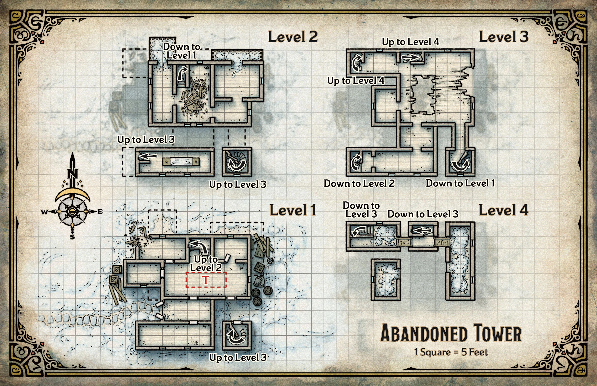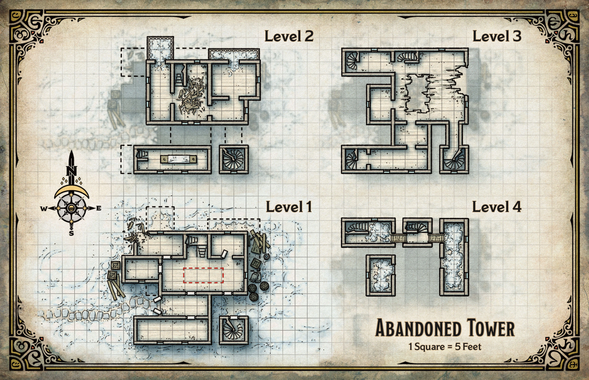
## Retaking the Terror

- **A Location (Icewind Dale) Adventure for Level 4 Characters**

*Explore the corpse of a chardalyn dragon.*

- **Situation.** An unorthodox high elf cleric of Ilmater at Revel's End named Vargrazt the Wretch (Medium, Lawful Good **Priest**) offers to purge the chardalyn dragon remains in Easthaven of their diabolical power—the so-called Terror of Ten-Towns—via a ritual.
- **Hook.** Therandril, a mage in Easthaven, hires the characters to retrieve Vargrazt from Revel's End and help him in his mission.

### Encounters

The adventure consists of these encounters.

***Fanatic in Chains.*** The characters travel by way of either Dwarven Valley or Highplume Station. Use the table in "Wilderness Encounters" earlier in this chapter for one encounter as they travel. At the prison, they take custody of Vargrazt the Wretch.

***A Violent Rite.*** On their return to Easthaven, Vargrazt enters the Terror at sunset to perform the ritual. Vargrazt absorbs the chardalyn's evil but destroys his own soul and becomes a violent **Wraith**.

***The Terror.*** Captain Imdra Arlaggath asks the characters to ensure the Terror is safe. It is the size of a small building, and half of it is buried below

ground level. It is inhabited by two duergar **Specters** and one duergar **Poltergeist**.

***Slime on the Walls.*** Arlaggath asks the characters to keep watch in the Terror overnight as a last precaution. During the night, three **Gray Oozes** creep up a hidden passage from the Underdark and fight any living thing in the Terror.

***Muck Monster.*** The oozes leave a path of slime to a hidden, locked trapdoor. The lock is Simple (1 action to pick) and of Good quality (DC 15). Below lies a pit of filth inhabited by an **Otyugh**. The otyugh heaves itself up through the trapdoor, so characters above aren't safe from its hunger.

***Conclusion.*** After the characters clear out the restless spirits and Underdark monsters infesting the dragon's remains, Arlaggath entrusts the party with the Terror's care, allowing them to convert it into a shared Bastion once they reach level 5. Vargrazt's ritual absorbed the chardalyn's power, rendering crystals inert and the Terror safe to inhabit. At your discretion, though, Zlan might still be able to monitor the characters while they're in the chardalyn remains.

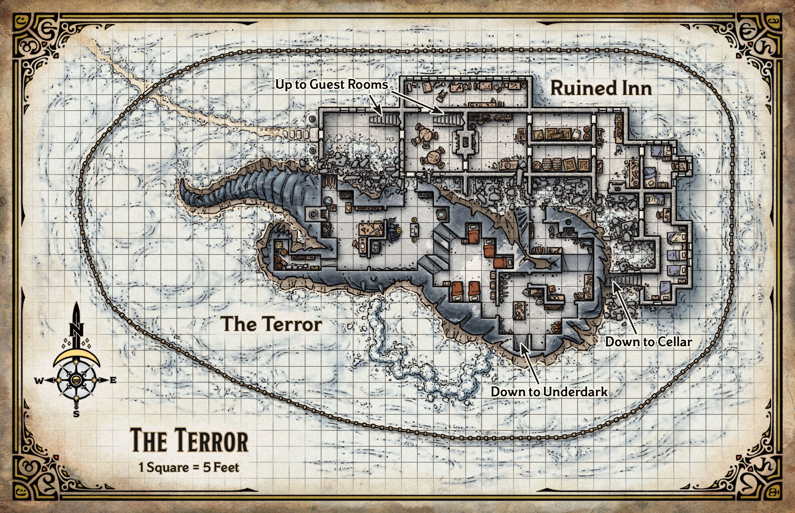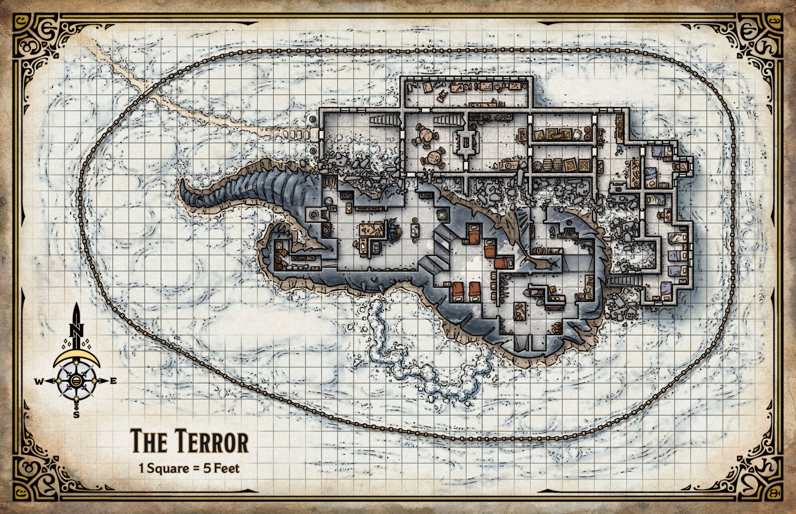
## Dougan's Hell

- **A Location (Icewind Dale) Adventure for Level 6 Characters**

*Confront a murderous clan.*

- **Situation.** The community of Dougan's Hole is home to a cursed, bloodthirsty cult.
- **Hook.** Surgulio Pondt (see "Targos ") hires the characters to protect a shipment of mead from Bryn Shander to Targos, passing by Dougan's Hole.

### Encounters

The adventure consists of these encounters.

***Cursed Cargo.*** Two loaded wagons set out from Bryn Shander, driven by a Zhentarim **Tough** and a **Spy** claiming to be laborers. The mead casks have secret compartments loaded with stolen goods.

***Trouble on Ten Trail.*** Lim of Dougan's Hole (a **Cultist Fanatic**) and five **Berserkers** fight, attempting to drag wagons and victims back to Dougan's Hole. If the party returns to town, that settlement's speaker raises an outcry and the characters are sent to investigate Dougan's Hole.

***The Surface.*** See the description of Dougan's Hole for details on the settlement. Corpses litter the pike wall, which is a maze of charred cult shrines scavenged by three **Harpies** and a **Carrion Crawler**.

***Below Town.*** Dougan's Warren can be entered through side passages or from the Bloodchamber at the central stone of Thruun. Each time the characters enter a labeled area on the Dougan's Warren map, roll on the following table, rerolling duplicates. Named individuals on the table are detailed in "Dougan's Hole." All inhabitants suffer from Dougan's Bloodcurse (described in that section).

##### Dougan's Warren
| 1d6 | Encounter                                                                             |
|:---:|---------------------------------------------------------------------------------------|
|  1  | Elder Dubrace whispering with Gutstab Grimbutcher, guarded by 2d4 **Goblin Warriors** |
|  2  | Ryn and 1d4 **Berserkers**                                                            |
|  3  | Morg watching over cousin Rogar in a cage                                             |
|  4  | Auntie Nen caring for 2d6 **Commoners**                                               |
|  5  | An empty chamber reeking of blood with names of dead captives scratched into the wall |
|  6  | 1d4 **Warrior Infantry** who could be persuaded to help the characters                |

***Thruun.*** When Elder Dubrace becomes aware of the characters, he directs any surviving combatants against the characters and summons Thruun, a **Beast of Malar** (see chapter 9). If Dubrace is killed without summoning Thruun, it manifests over his corpse.

***Conclusion.*** If Thruun drops to 0 HP, the Bloodcurse ends. Thruun will return someday. Dougan's Hole can rejoin Ten-Towns, though this reunion is fraught with suspicion and reproach. Each character's Renown Score with Targos increases by 1.

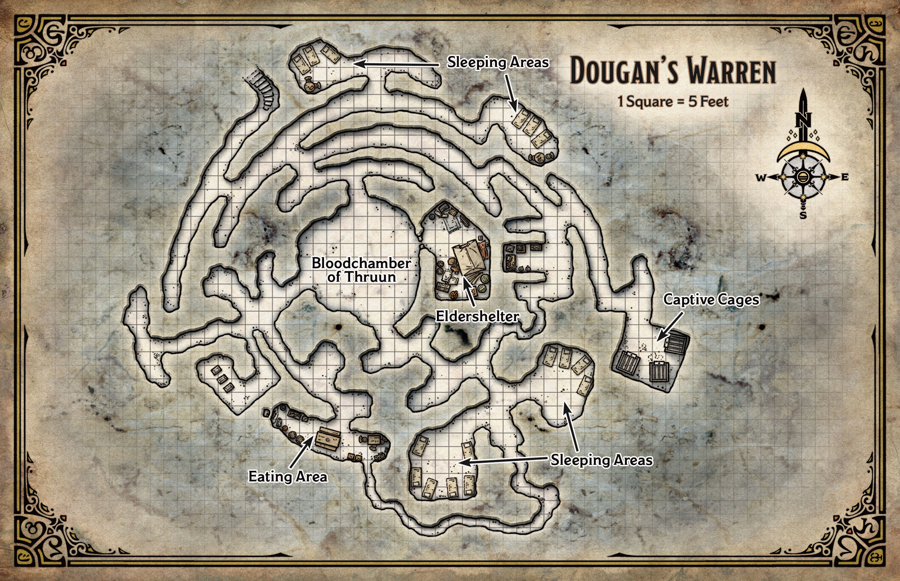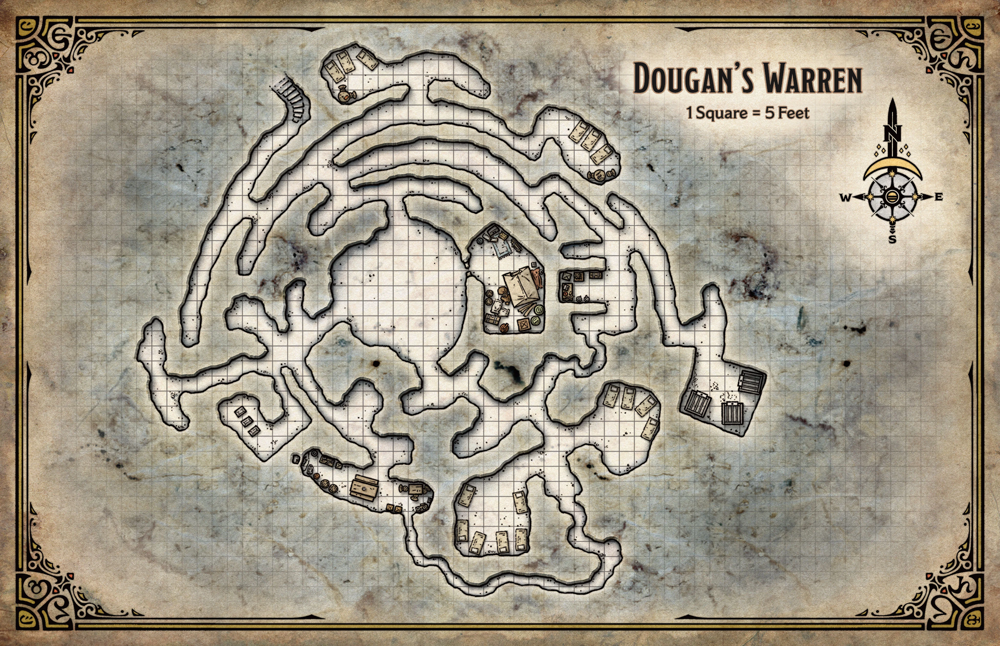
## What Wakes Below

- **A Location (Icewind Dale) Adventure for Level 9 Characters**

*Escape a deep dragon through the Underdark.*

- **Situation.** Seer Echomorne (who is secretly the **Adult Deep Dragon** Mornethraxys; see chapter 9) found a beholder frozen below Termalaine and intends to use the creature to cement power in Bryn Shander. She's been prophesying doom for weeks while keeping the creature's existence a secret.
- **Hook.** The characters are in Termalaine when the beholder emerges from the mines and begins laying waste to everything and everyone nearby.

### Encounters

The adventure consists of these encounters.

***Terror in Termalaine.*** A disoriented, half-frozen **Beholder** assaults Termalaine.

***Prophetic Dreams.*** After the attack, Echomorne's supporters demand a vote to elect her speaker of Bryn Shander, saying she foresaw the disaster.

***Mornethraxys Strikes.*** Echomorne identifies the party as a threat to her plans and resolves to bring them to her family. Reverting to her dragon shape, she chases them into a tunnel leading to the Underdark.

***Giant Ruins.*** Mornethraxys chases or guides the characters through ruins in the Underdark, through a hall of fallen giants (**Haunting Revenant**), to a cavernous, ruined throne room.

***Throne Room.*** Here, the characters eventually come face to face with Mornethraxys, her father Enderbalathal the Lord Below (**Ancient Deep Dragon**; see chapter 9), and her brother Guvaali of the Grand Appetite (**Adult Deep Dragon**), who interrogate the party for lore and secrets. When the characters are of no more use, the dragons hurl them down into an ooze swamp.

***Ooze Swamp.*** In a dim and noxious swamp, the characters fight four **Black Puddings** while searching for an escape. Meanwhile, gluttonous Guvaali decides to hunt them in the fog-filled swamp.

***Frozen Horror.*** The only way out of the swamp is to climb a melting subterranean glacier to a distant steam vent. If the characters light a fire or shine a bright light, they discover true horror: the ice is full of aberrations frozen in a contorted mass, their tendrils reaching upward. Unless the thaw stops, these monsters will surely bring an eldritch apocalypse to Icewind Dale.

***Near the Surface.*** The characters encounter three **Grick Ancients**, as well as clusters of fireball fungus (see chapter 3 of the *Dungeon Master's Guide*) as they clamber back to the surface. When they emerge from the steam vent, they are at Highplume Station.

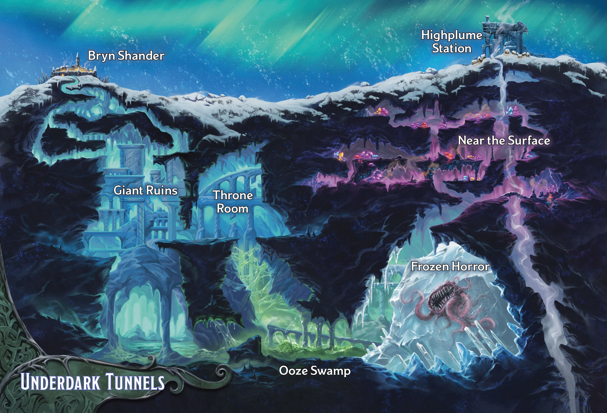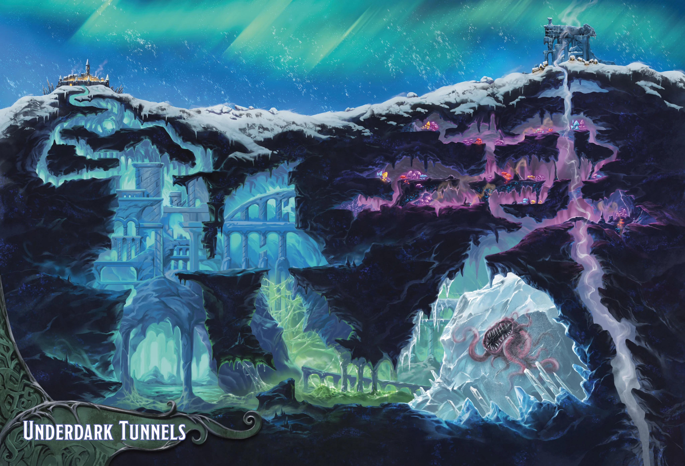

------

# Chapter 4: Calimshan

>>Calimshan, the Land of Wonders, is a rich realm that hides many secrets and fosters competing powers. Ancient lore lies buried here. Genie clans scheme and sabotage each other. Merchants, assassins, monsters, ancient relics, and cabals are as integral to Calimshan today as they are entwined in its history. Here, adventurers protect caravans traveling across the desert, quest for ancient mysteries, seek fame and fortune, collaborate with genies, and master potent magic.
>>
>>Calimshan is surrounded on three sides by water and relies on naval power for trade and security. Though desert takes up a third of its territory, Calimshan has many valuable resources. The forest of Mir grows cedar trees for shipbuilding. Quarries in the Marching Mountains mine precious stones. The seas provide pearls, seafood, and trade. At the center of everything is the fabulous city of Calimport, where people the world over come seeking rare goods, wealth, prestige, and opportunity. Calimport's gleaming temples attract countless worshipers and pilgrims, and its libraries are among the greatest in Faerûn.
>>
>>While the highest authority within Calimshan is the ruling sultana, the most respected profession is that of a clever merchant. Calimshan relies on trade and innovation to maintain its status as one of the wealthiest and most inspiring nations in Faerûn.
>>
>>Magic is ever present in Calimshan, and many citizens know a spell or two. Genies have influenced life in Calimshan for centuries, and people dwelling in the desert, steppes, forests, and mountains of Calimshan rely on elemental magic to survive. Legends of genies further Calimshan's reputation as a land of wishes and miracles.
>>
>>Calimshan's recent embrace of Mechanical Wonders—first imported from the island nation of Lantan and innovated on by Calishite artificers and crafters—has transformed life in Calimport. Made of porcelain, the lightest woods, delicate metal, and canvas, these devices are used for everything from transportation and war to civil engineering and household chores. They allow Calimport and other cities to solve magical problems without relying on the genies' magic.
>>
>>Whether visitors take the long trek across the Calim Desert or sail into Calimport's walled harbor, they inevitably end up in the city's bazaars. There, the breezy, melodic tongue of Alzhedo intermingles with languages from across the Realms. Dragonborn, gnomes, humans, and others barter over wondrous and mundane wares, negotiating the price of services big and small, licit and illicit.
>>

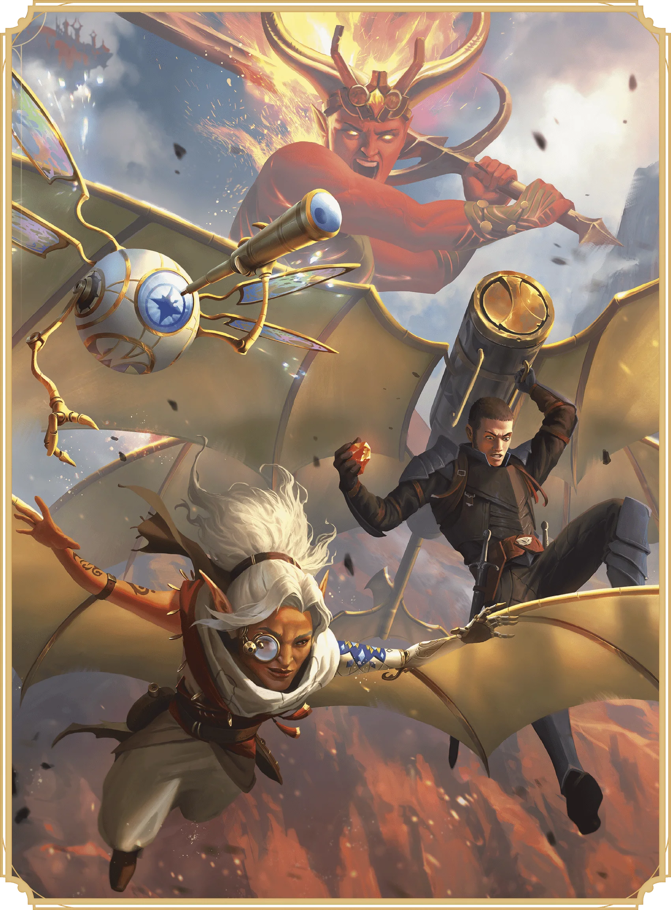

## Calimshan Campaigns

Use Calimshan to run adventures in a desert setting, to tell stories of powerful genies vying against each other for dominance, and to explore the streets of Calimport.

### Desert Adventures

The Calim Desert offers endless adventure in a challenging environment where heroes face blue dragons, gnolls, mummies, sphinxes, yuan-ti, and, of course, genies. In the desert, Heavy armor becomes a liability, sandstorms strike without warning, and starvation and thirst are constant dangers.

### In the Courts of the Genies

The four competing genie courts that dominate Calimshan outside Calimport provide fantastic magic and intrigue. Elder genies with centuries-old grudges and whimsical desires act as patrons for adventurers, who must carefully balance conflicting loyalties in between expeditions that take them all over Calimshan.

### A City of Wonders

Calimport is the seat of the sultana's power, a cultural melting pot, and a nexus for trade. Adventurers, thieves, scholars, shopkeepers, and nobles rub elbows in the Grand Bazaar.

> ##### Deryan Kaya
>
>Deryan Kaya is an elderly rock gnome and the greatest inventor in the history of Calimshan. Deryan designed and built the first *Mechanical Wonders*, and her many rivals still imitate her designs. She is also a masterful painter, sculptor, physician, alchemist, musician, and poet. She lives in Calimport and is always eager to meet adventurers and send them on various errands.
>

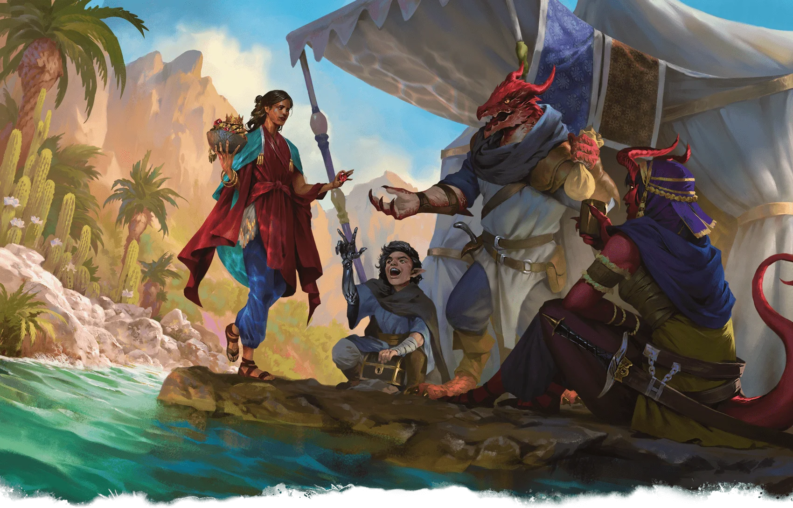

## People of Calimshan

The history of Calimshan reaches back almost ten thousand years. Epic poems describe the ancient forest of Keltomir inhabited by elves and giants, and detail how humans and dwarves found their way into this region. These tales recount the arrival and rise of the genies, describing their amazing feats, their many depredations, and their eventual fall.

Calimshan's diverse population includes aasimar, dwarves, elves, genies, humans, and tieflings. In recent decades, dragonborn and gnomes have become especially common and risen to influential positions in Calimport and the genie courts.

Calishites typically wear light, loose-fitting clothes, with a flowing headscarf held in place with a leather cord or decorative headband. This distinctive style protects the wearer from Calimshan's hot, arid environment. Calishites keep a traditional, curved dagger in their belt for utility and defense. The ornamentation and quality of the dagger, as well as how it is worn, indicates the wearer's status and position.

Calishites work hard to eventually work less, and they go to great lengths to secure comfort and relaxation. But while Calimshan is entering a new era of prosperity, not all Calishites are wealthy. Many beggars in the cities go ignored by bustling Calishites seeking their own prosperity. Calishites often say, "Fools fall the hardest. The wise stand up again."

The people of Calimshan are wary of neighboring realms such as Tethyr; Calishites consider them failed imitators of Calimshan's glory. Calishites appreciate the power and significance of other realms, but even the great city of Waterdeep is a newcomer compared to Calimshan's long history.

### Hospitality

Hospitality is important in Calimshan—a tradition as important as any religious rite. Born from the need to survive in the harsh desert, hospitality ensures a traveler can expect food, drink, and shelter from a host in exchange for providing company in an isolated environment. Hosts prepare kaethae, a hot beverage brewed from ground beans, and bastik kaktos, a delicacy made of the native Calim cactus.

However, the code of hospitality also implies guests should refrain from excess, and hospitality technically extends only to the home, tent, or camp. Wise guests refrain from impolite behavior and don't take advantage of their host; they know a troublemaking guest can be targeted for retribution as soon as they're outside the tent flap.

> ##### Key Terms
>
>The following terms appear throughout this chapter:
>
  - **Alzhedo:** Traditional language of Calimshan
  - **Bastik Kaktos:** Delicacy made from the Calim cactus
  - **Drudach:** Small neighborhood within a sabban
  - **Druzir:** Government administrator who manages a drudach
  - **Kaethae:** Strong, hot drink brewed from beans
  - **Khanduq:** Small, walled market found in a sabban
  - **Kochar:** Calishite nomads from the steppes
  - **Nallojal:** Calimshan's navy
  - **Sabbalad:** Ruler of a sabban
  - **Sabban:** Walled, gated district within a larger city ward
  - **Syl-Pasha:** The former title for Calimshan's ruler
  - **Zeraphi:** Calimshan's elite force of spellcasting warriors riding flying carpets

### Kochar

Much of Calishite culture—whether in the steppes, desert, or cities—is based around the traditions of Kochar, primarily human nomads who are scattered across Calimshan. Kochar have a strong culture of art, music, and dance, as well as an oral tradition recounting thousands of years of Calimshan's history. Kochar customs can be found in every Calishite city.

Kochar travel great distances each year to sustain herds of horses, goats, and cattle on the sparse steppe grasses. The nomads know the Calim Desert's oases, hazards, and landmarks. Each year, tribes gather in temporary tent cities to trade, share tales, engage in ceremonies, and set prices before venturing into the cities to sell their wares.

A common Kochar saying is "I am against my brother, my brother and I are against my cousin, and my cousin and I are against the stranger." This saying illustrates the hierarchy of loyalties and trust among Kochar. They consider other tribes outside their own to be cousins and those who are outside the tribes to be strangers. This is the heart of the Calishite ability to compete internally while uniting against a common foe.

### The Sultana's Reign

Calimshan has always been a place of fantastic magic, and for centuries genie overlords wielded that magic to rule over mortal servants. Even after the genies were overthrown, the rulers of Calimshan maintained the social structure imposed by the genies, albeit with themselves as rulers.

But a generation ago, Syl-Pasha Zengel rose to the throne. He discovered that a cabal of necromancers known as the Twisted Rune had been secretly directing Calimshan's fate for centuries. While Zengel sought out a powerful weapon to destroy the Twisted Rune, the cabal used the lure of arcane and royal power to convince Zengel's fourth son to assassinate him and the rest of the royal family. Only Zengel's fourth daughter, the young wizard Songal, escaped. With the aid of genies and her father's magic ring, Songal traveled to the floating towers of Magis Tor, where she claimed the *Staff of Life and Death*, a relic sacred to Kelemvor. She assembled an army of dragonborn and shattered the power of the Twisted Rune in an evening called the Night of Fleeing Shadows.

After claiming the position of sultana, Songal outlawed slavery in Calimshan, enacted many popular reforms, and initiated building projects throughout the realm. She named a chief adviser, assisted by a council of lesser advisers. Over the years, dissatisfied nobles backed by foreign powers have rebelled, but Sultana Songal has defeated each such effort, emerging stronger than before.

### Dragons Ascendant

Dragonborn were excluded from power in Calimshan by genies who viewed dragons as rivals. But dragonborn have long formed small communities or monasteries in Calimshan or traveled with or joined the Kochar.

During Sultana Songal's rise to power, many dragonborn rallied to her banner. On the Night of Fleeing Shadows, Songal's genie allies magically transported her dragonborn guard into the city, and the guard destroyed a dracolich that was one of the Twisted Rune's leaders.

Many dragonborn died for their kingdom and their sultana. In recognition of their loyalty and strength, Songal elevated some dragonborn to positions of power in Calimshan. Other dragonborn have since gravitated to genie strongholds, where they combine their innate powers with elemental magic.

## Genie Factions

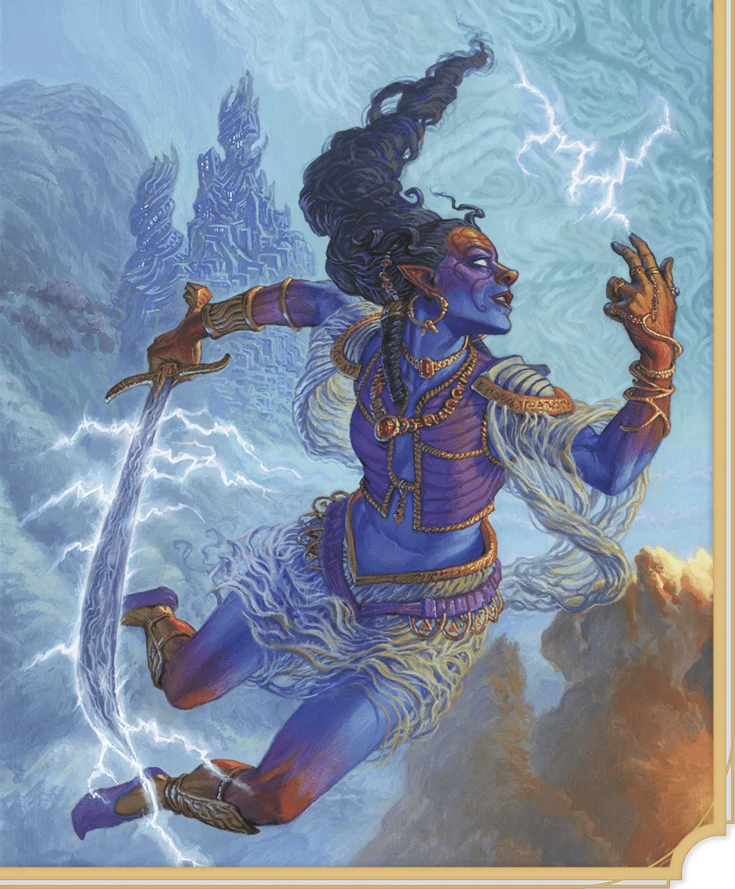

Genies are formed when an immortal soul merges with raw elemental energy. Most reside on the Elemental Planes, but for millennia, genies of all sorts built mighty empires in Calimshan. Those empires collapsed long ago, but genies linger here nonetheless. When Songal rose to power, she formed an alliance with the genies. Genies have integrated into daily life, founding cities and resuming their ancient rivalries.

The genies of Calimshan divide into four competing factions. Efreet dwell in the desert city of Gozva Ka, also called the Shimmering Oasis. Their eternal rivals, marids of the sea, dwell in the coral palace of Maran Saya. Greedy dao in search of priceless gemstones carved a city called Olympus Dag in the Marching Mountains. Finally, the benevolent djinn float above the steppes in the cloud pavilions of Burin Bir. The factions, their rulers, and their rivals are summarized on the Genie Factions table.

##### Genie Factions
| Genie Type | Element | City        | Ruler      | Enemies |
|------------|---------|-------------|------------|---------|
| Dao        | Earth   | Olympus Dag | Zabargad   | Djinn   |
| Djinn      | Air     | Burin Bir   | Farnesslee | Dao     |
| Efreet     | Fire    | Gozva Ka    | Jaham      | Marid   |
| Marids     | Water   | Maran Saya  | Biha Babir | Efreet  |

### Life among Genies

Each genie settlement in Calimshan is ruled by a few noble genies with the power to grant wishes, assisted by dozens of genies of lesser power who hold important offices. Elemental magic is everywhere in these settlements, mimicking the conditions of the Elemental Plane from which the genies come. Many citizens of these cities are native to other planes or have special abilities that make them well suited to the unique environment of a genie palace. For example, the sandy streets of Gozva Ka are crowded with azers, infernal tieflings, and dragonborn with a brass, gold, or red heritage, all of whom easily tolerate the city's extreme heat.

Genie rulers treat mortal citizens in varying ways. Genasi—humanoids who trace their ancestry to the Elemental Planes—act as intermediaries between a city's population and genie rulers. (Genasi are described in *Mordenkainen Presents: Monsters of the Multiverse*). Djinn enforce few laws, welcoming travelers from many lands and reveling in new experiences. Life in the marid city of Maran Saya is also relatively easy, as long as residents acknowledge marid superiority and have a charming story to tell. But the mines of Olympus Dag groan with unfortunate people laboring on behalf of the dao, and the efreeti rulers of Gozva Ka are malevolent and cruel.

### Genie Plots and Schemes

The genie factions reluctantly acknowledge the supremacy of Sultana Songal. They largely avoid Calimport and don't interfere with the sultana's agenda. Instead, they scheme against each other. They hire spies in the courts of their rivals, enrich their fabulous palaces in contests of extravagance, and humiliate each other in sporting and social events. Sometimes these rivalries spawn lightning-fast raids of extraordinary violence, but genies refrain from all-out war. Any serious disruption of daily life in Calimshan by a genie faction would draw the sultana's ire, and she could bring three genie factions together to ruin the other.

One thing that could return genies to supreme power in Calimshan is the *Calimemnon Crystal*. All genies covet the *Calimemnon Crystal*, but **Biha Babir**, ruler of the marid city of Maran Saya, is obsessed with recovering it.

## Mechanical Wonders

As genies returned to Calimshan, Sultana Songal felt her power threatened by genies' magic, which tamed the heat of the desert, brought forth water, conjured the world's richest treasures, and controlled the weather. Songal felt that, for her dynasty to survive, the people of Calimshan needed to be able to solve problems both magical and mundane without resorting to genies' magic. She found the solution in the imagination of a brilliant gnome inventor named Deryan Kaya.

### The Great Inventor

Deryan Kaya is a gnome inventor, artist, musician, and polymath. Although she studied under some of the greatest minds in Faerûn, including technologists from the nearby island nation of Lantan, she primarily taught herself through extensive research and tireless experimentation. A relentless optimist, she dreamed of a future made better by advances in magic and science.

Deryan envisioned a world where ordinary people could rely on machines to solve everyday problems, where citizens of Calimshan were freed from repetitive labor and dangerous tasks. In the world of Deryan's imagination, magical machines handled life's drudgery, leaving every individual free to pursue a life of creativity, education, and personal enrichment.

But such miraculous machines wouldn't invent themselves. Deryan had designs, but she didn't have the time, wealth, and workshop required to make these dreams a reality. This, however, is exactly what the sultana offered to provide.

### The First Wonders

Songal set Deryan up with a workshop, assistants, and the raw materials and tools she required. Deryan and her team presented the first prototype *Mechanical Wonder*—a human-shaped construct she named Ado—at the sultana's court a year later. Ado was a machine animated by magic: made of the lightest wood, its limbs connected with delicate silver joints, and its porcelain head adorned with lamp-like eyes. Ado couldn't speak, but it could obey instructions, delighting the sultana with simple antics like running in place, juggling, and counting on its fingers. When one of the sultana's courtiers nearly choked on a plum pit, Ado wrapped its arms around the choking victim, gave a short and sudden embrace, and popped the pit onto the table.

Ado's debut was explosive. Within weeks, rival workshops organized to copy and improve on Deryan's innovation. Within a few years, countless varieties of *Mechanical Wonders* were available, primarily in Calimport but slowly spreading to other cities in the realm. In addition to humanlike wonders like Ado, inventors designed small flying wonders capable of delivering mail and other packages, household machines to perform chores like cleaning and yard maintenance, and wonders that assist disabled citizens, replacing lost eyes or enhancing mobility.

### Mechanical Wonders Today

When a citizen of Calimport needs groceries, they clip a list of the necessary items to a wind-up drone, give it directions to the market stall, and leave payment in an attached basket. The wonder's corkscrew rotor flies it to the grocer, who reads the list, collects their fee, loads the basket, and sends it back home. *Mechanical Wonders* do laundry, change bedsheets, walk pets, and perform manual labor. Calishites with disabilities might rely on *Mechanical Wonders* for assistance with everything from travel to obtaining medications.

Many wonders are surprisingly affordable, their prices kept low through fierce competition between rival workshops. Sultana Songal gives away assistive wonders for free. Conversely, Calimport's wealthiest citizens are always looking for ways to conspicuously display their wealth for everyone to see, and some of them have commissioned workshops to build fantastic submersibles, flying machines, and other novelties, but such inventions are beyond the reach of most Calishites. The sultana's military has deep pockets, and her generals supplement the army and navy with mechanical soldiers and mounts known as nimblewrights.

*Mechanical Wonders* are widespread only in Calimport, where they are carefully assembled by artisans. In other cities along Calimshan's southern coast, *Mechanical Wonders* are uncommon but not especially novel. Calishites outside these places have heard of *Mechanical Wonders* and might have seen them but have no real experience with them. Outside Calimshan, *Mechanical Wonders* are the province of scholars, eccentrics, and adventurers.

### Mechanical Wonders in Play

*Mechanical Wonders* are described in *chapter 8* of this book; see the *Dungeon Master's Guide* for general information about magic items.

For a character visiting Calimport, acquiring a *Mechanical Wonder* is as simple as visiting a workshop, inspecting its inventory, and paying the seller's price. *Mechanical Wonders* and their prices are further described in *chapter 4* of *Forgotten Realms: Heroes of Faerûn*.

## Desert Survival

The Calim Desert has defeated many unprepared travelers. Regardless of season, day temperatures in the desert routinely exceed 100 degrees Fahrenheit. Individuals who live or travel in the desert always keep water supplies and avoid wearing Medium or Heavy armor. Many creatures that inhabit the desert have ties to the efreet of Gozva Ka.

If you're running an adventure in the Calim Desert, consider tracking Rations and water. The desert is one of the most inhospitable regions in Faerûn, and tracking such resources reinforces its exceptional nature.

### Travel

The advice in this section builds on the discussion of travel in the *Dungeon Master's Guide*, customizing the information there for the Calim Desert's supernaturally harsh environment.

#### Weather

During each stage of a journey in the Calim Desert, you can determine the weather by rolling on the Calim Desert Weather table. Roll **1d20** three times to determine the temperature, the wind, and the precipitation.

##### Calim Desert Weather
|  1d20 | Day Temperature                  |
|:-----:|----------------------------------|
|  1–5  | 80–100 degrees Fahrenheit        |
|  6–15 | 101–120 degrees Fahrenheit       |
| 16–20 | More than 120 degrees Fahrenheit |

|  1d20 | Wind      | Precipitation |
|:-----:|-----------|---------------|
|  1–10 | None      | None          |
| 11–15 | Light     | None          |
| 16–19 | Strong    | None          |
|   20  | Sandstorm | Heavy rain    |

#### Journey Challenges

Wise travelers cross the desert by night and sleep during the day. This allows a creature to avoid the effects of extreme heat.

*The desert is the soul of Calimshan. Like the soul, it is beautiful, lonely, and easily taken for granted.*— Deryan Kaya***Foraging.*** Water is difficult to find in the Calim Desert. Characters who successfully forage for water find a number of gallons equal to 1 plus their Wisdom modifier.

***Obstacles.*** You can use the Calim Desert Encounters table later in this chapter to create obstacles for a journey through the desert. The *Monster Manual also lists monsters appropriate for a desert habitat.*

### Environmental Effects

*Chapter 3* of the *Dungeon Master's Guide* details the effects of extreme heat and strong wind. But the Calim Desert poses additional dangers.

- Calim Sandstorm

#### Mirage

A mirage is a visual illusion especially common in deserts. In the Calim Desert, both nonmagical and magical mirages appear.

- Nonmagical Mirage
- Magical Mirage

### Hazards

The Calim Desert poses many dangers to adventurers. For example, you can use the rules for quicksand pits in the *Dungeon Master's Guide*. Additional hazards are detailed below.

- Lightning Strikes
- Sinkhole

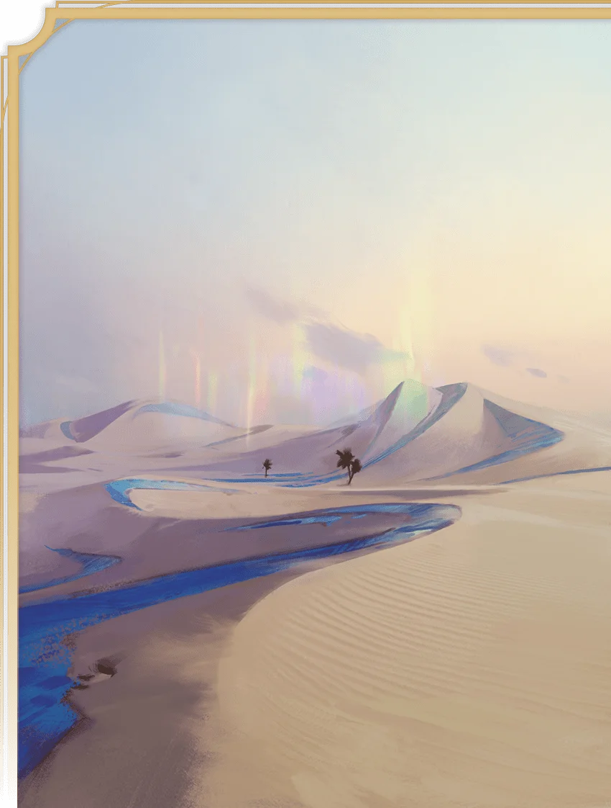

> ##### Lightning Sand
>
>When the magical lightning of the Calim Desert strikes sand, it melts the sand into an elaborate lightning-like shape made of glass. These objects, known as "lightning sand," lie buried in the sand after the strike to be unearthed by explorers and treasure hunters.
>
>Merchants in the bazaars of Calimport grade pieces of lightning sand on their clarity, shape, and magical luminescence. A small and cloudy piece of lightning sand with no branches is equivalent to a 10 GP gemstone; a larger, clearer specimen with many branches shimmering with light is worth as much as a 5,000 GP gemstone.
>

## Calimshan Gazetteer

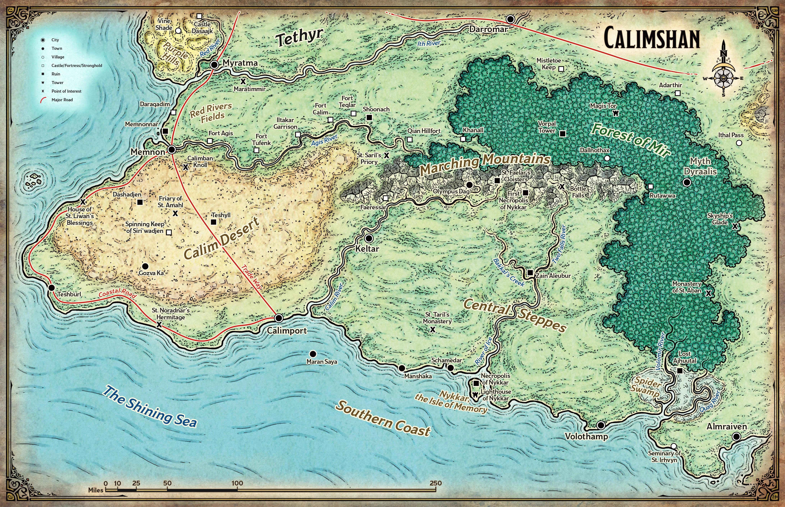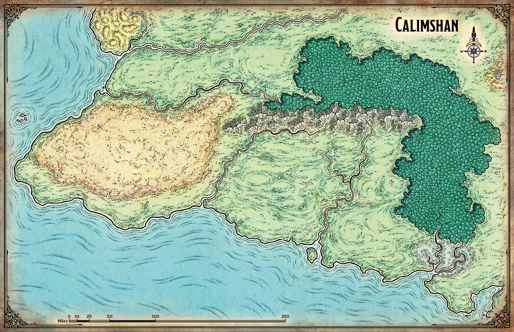Calimshan is a land shaped by magical struggle. The mighty genies Calim and Memnon might be gone, but they've left behind blistering deserts, towering mountains, and impenetrable forests. Genies continue to dwell here, and many mortals rely on genies' magic and patronage to survive.

Over thousands of years, the people of Calimshan have adapted to life in this land. Brilliant cities have been built in the fertile lands along the sea, and the steppe nomads known as Kochar continue to live as they always have, observing strict traditions that help them survive a dangerous realm.

Calimshan can be broadly divided into five geographical regions:

- Northern Border. Fortresses line the Tethyrian border to deter incursions.
- Calim Desert. Caravans criss-cross the legendary Calim Desert, home to powerful efreet.
- Central Steppes. The steppes are the ancestral home of Kochar, Calimshan's steppe nomads.
- Southern Coast. Calimshan's great cities line the fertile southern coast; marids dwell off shore.
- Forest and Mountains. In the east, djinn, dao, and secretive people make their lairs.

### Northern Border

Calimshan shares its northern border with the realm of Tethyr. Another of the so-called Lands of Intrigue, Tethyr is famous for royal backstabbing and conspiratorial plots. The sultana deters military aggression from Tethyr with a line of strong fortresses well garrisoned with experienced troops. To the west, Memnon is a major hub of trade.

#### Fort Agis

Also known as Memnonnar Citadel, Fort Agis sits north of the Agis River. Hundreds of **Guards** and a dozen **Mages** maintain this post. Always watchful for activity from both Tethyr and the ruins of Memnonnar, this fortress is key to Calimshan's defense.

Blue and brass dragons emerge from the desert or the ruins of Memnonnar to harass caravans traveling to or from Fort Agis. The fort's cautious human commander, Najm Saleh (Medium, Chaotic Good **Spy Master**), is seeking solutions that won't compromise the fort's security.

#### Fort Calim

Fort Calim, built on the ruin of an ancient dwarven fortress, keeps a garrison similar to that of Fort Agis. Recent excavations have revealed an extensive, unexplored complex below the fort. The increased activity prompted Tethyr to gather troops along the border, complicating the exploration effort. The fort's dragonborn commander, Gujlat Sabi (Medium, Lawful Evil **Warrior Veteran**), is a brooding and calculating commander with a hatred of Tethyr.

#### Memnon

Memnon has many names: the City of Soldiers, the Desert's Gateway, and the Scarlet City. Originally the capital of the efreeti Memnon's empire, the city has been ruled by mortals for over six thousand years. A key port, it has been destroyed by invaders several times, but each time, rulers of Calimshan have rebuilt atop the ruins. Now, the city sits atop a low hill overlooking the Agis River.

***Architecture.*** Nearly all the city's structures are built with distinctive red bricks made from mud found along the river. The door to each home and business is painted a single color to convey status or profession. For example, a red door is found at inns and taverns; while merchants use a yellow door; and a blue door indicates various services such as lawyer, scribe, or sage. Purple is reserved for magical occupations. Healing facilities use green doors.

***Harbor.*** The city's fortified harbor has grown significantly over the last century, supplying food and imported luxuries to Calimshan's growing population. Two dozen ships from the sultana's armada anchor within Memnon's artificial harbor, whose stone walls extend from the river's bottom to ten feet above the waterline. The city's original harbor supports merchant vessels, while docks for local fishers extend in both directions along the city's shoreline.

***Travel Hub.*** Caravans traveling to Calimport pause at Memnon to rest and prepare for the grueling journey across the Calim Desert. Crews sail their vessels here to relax, trade, and resupply, even if they plan to continue to Calimport.

Memnon is a hub for mercenaries, explorers, and other adventurers. The Order of the Gauntlet maintains a stout keep here, providing lodging for honorable warriors seeking work. The Trade Quarter fills a third of the city. During peak caravan seasons, visitors overflow the quarter, with many instead staying in tents outside the city at the base of its hill. Memnon's inns, taverns, and other entertainments are legendary among sailors and caravans.

Here, visitors to Calimshan can see *Mechanical Wonders* for the first time. There are mechanical bridges, clockwork messengers, and machines washing clothes at inns. Nimblewright soldiers stand attentively alongside humanoid guards at every city gate. Flying wonders patrol the harbor.

With so many travelers in the city, crime in the Trade Quarter can be rampant. As long as disturbances don't disrupt the flow of trade or spill over into other parts of the city, the city guard lets visitors settle matters among themselves. Disruption to trade or the tranquility of the city, however, is met with swift and severe justice.

#### Memnonnar

Ruins opposite Memnon across the Agis River are all that remains of the capital of the ancient kingdom of Memnonnar. **Fire Elementals** and mephits roam the ruins, the stones of which are supernaturally warm. Efreet came to Memnonnar from the Plane of Fire through a portal deep beneath these ruins, and the many treasure seekers who frequent the site insist that the portal is active.

### Calim Desert

The Calim Desert was created by accident as a side effect of the tremendous magic used to imprison the noble genie lords Calim and Memnon into the *Calimemnon Crystal*. Unstable magic plagues this land; rain rarely falls here and sandstorms arise suddenly.

#### Gozva Ka

Deep within the Calim Desert is the efreeti stronghold Gozva Ka, the Shimmering Oasis. Emulating the City of Brass, it's a place of scorching splendor. The city's polished stone walls and towers, standing over one hundred feet tall, brilliantly reflect the relentless sun. Domed roofs, adorned with intricate metalwork, crown nearly every structure.

The city is protected by powerful illusions and genies' magic; most travelers pass within a handbreadth of its walls and never know it is there. Only those invited into the city by Jaham (**Efreeti**)—the calculating ruler of Gozva Ka—or his council of elder efreeti advisers can pierce this magical veil.

The efreet of Gozva Ka plot against other genie clans and craft weapons, metalwork, and magic items. They encourage the use of fire magic among non-genies and gladly trade dangerous magic items to others, particularly those not wise enough to wield such items safely. Many creatures that thrive in desert heat dwell and work within the city, including azers, dragonborn, goliaths, and salamanders. Dwarves live there too, drawn by the opportunity to work at efreeti forges.

#### Miziltep

Commanded by the **Efreeti** Narlahib, the floating fortress of Miziltep symbolizes the height of genie power. Its black, metal walls surround six towers, and the entire structure drifts where the efreeti commands. Narlahib is loyal to both the sultana and Jaham, ruler of Gozva Ka—a position that becomes uncomfortable when those two mighty individuals don't agree.

#### Trade Way

The Trade Way is an ancient highway of enchanted stone running from Memnon in the north to Calimport in the south. Tall, slender spires used to mark the edge of the highway. A few of these spires still glow with a calm, blue light at night, but most have been buried by the desert or reduced to rubble. The Trade Way is the most direct route across the desert and is preferred by most caravans. However, there are few oases along the Trade Way, and travelers are frequently accosted by mischievous fey or raiders.

### Central Steppes

Calimshan's Central Steppes are vast stretches of dry land where only the hardiest scrub brush and grasses grow. While natural springs and oases dot the land, locating them can be challenging for anyone unfamiliar with the harsh terrain. In addition to the lack of natural resources, this wild territory contain numerous dangers, including blue dragons and desert-dwelling wolves.

#### Kochar

Kochar nomads are the undisputed masters of this region. Before Sultana Songal took the throne, she had already spent time among Kochar, knowing they were a powerful force within Calimshan. As Songal solidified her rule, she met with considerable resistance from Kochar elders who resisted her authority. But the majority of the tribes saw value in the security and favorable trade agreements an alliance with the sultana offered.

Traditionally, each tribe was ruled by a chieftain, but for practical reasons Sultana Songal convinced the tribes to select a single ruler who represents the Kochar in court, while the chieftains became a council of advisers for the ruler. Each ruler serves only for five years, and the position rotates among the advisers, ensuring no one tribe dominates the others.

While the alliance has greatly improved trade across Calimshan, some Kochar still raid caravans or ignore Songal's edicts. Nevertheless, 20,000 Kochar riders answered Songal's call when a horde of goblins spilled out of the Marching Mountains in 1493 DR.

#### Burin Bir

The djinni city of Burin Bir, the Cloud Pavilions, drifts high above the steppes on magical clouds, following a meandering path between the Calim River and the Forest of Mir. Floating palaces drift in the city's wake.

Burin Bir's aerial architecture was designed for creatures that can fly. Doors can be found on any level of a building. Roads are few, and the city's sprawling markets are designed to be easily spotted from the air.

Djinn cherish rare goods from faraway lands—scrimshaw from Icewind Dale, for example, or ambergris from the Trackless Sea—and the genies offer unparalleled hospitality and entertainment. Visitors receive a warm welcome, and their tales are exchanged like currency, but the thin air leaves many Humanoid visitors breathless. Such challenges go unnoticed by most denizens of the city—including the occasional cloud giant or young dragon.

Burin Bir is ruled by a loose confederation of djinni families, each with its own leader. Currently, the jovial, laissez-faire Farnesslee (**Djinni**) is its ruler.

#### Keltar

Known as the City at the Edge of the Desert, Keltar is the largest city in Calimshan by area, straddling the Calim River. Waterwheels lining the shore power mills and industry, while irrigation networks support local farming. Three wide bridges connect the predominantly residential West Keltar with commercial East Keltar. West Keltar is full of two-story stone and mud-brick architecture, while East Keltar is a sprawling complex of animal pens, slaughterhouses, and tanneries separated by low walls and fences.

The tanneries are odorous—some caravanners claim they smell Keltar from a day away—but very profitable. Leatherworkers in Keltar are among the best in Faerûn. The sultana's knights ride on Keltari saddles. The city's industries also make it a bustling trade hub for the tribes living in western portion of the steppes, who bring their herds of cattle and goats to the city for slaughter.

The family of Keltar's current ruler, Atbey el Ashnar (Medium, Lawful Neutral **Noble**), traces its rule back almost two hundred years. The ruler commands a large army. Soldiers armed with pikes and muskets defend the city, while cavalry-archers—sporting their signature black armor emblazoned with the city's crest of the bull and goat—patrol roads and strike out into the desert. Within the city, powerful merchant families, guilds, and criminal networks compete for wealth and influence.

#### Rolawi's Traveling Bazaar

Rolawi is a **Djinni** noble who travels with other djinn in a caravan of magical elephants—all *Figurines of Wondrous Power* (marble elephant). Rolawi roams the Central Steppes, establishing a sprawling bazaar in a different location every week. The bazaar also hides an entrance to Rolawi's demiplanar palace.

#### Zain Aleubur

Known among Kochar as Three Rivers City or Zain's Crossing, Zain Aleubur was founded by Zain the Blue, a skilled illusionist. Zain built a tower where Bakkal's Creek, Two Falls River, and the River of Ice meet and provided a ferry service.

Soon after, dwarf and dragonborn masons built a monumental bridge spanning all three rivers. The bridge drew trade and settlers, facilitating trade east and west across the steppes even as river trade continues between settlements in the Marching Mountains and cities along the southern coast.

Zain Aleubur has grown into a thriving city, recently famous for high quality, sapphire-blue pottery and tiles it exports across Calimshan, even decorating the throne room of the sultana. Zain's tower, now a magical academy, has been recently renovated, covered in the glistening blue tiles. The city's most respected resident is Kul-Berath (Medium, Lawful Good **Scout Captain**), a human warrior decorated with runes he claims protect him from magic. Kul-Berath speaks many languages, and his knowledge of the land is matchless. He's often asked to draft contracts and negotiate disputes.

### Southern Coast

While Calimshan is well known for its desert, most of the population live in towns and cities along the fertile southern coast. Many travelers to Calimshan are surprised when they visit these cities, where fruit orchards are common, and rivers and streams wind between shade trees.

The Coastal Road runs along the west coast from Memnon to Teshburl, then along the southern shore to Calimport. While this route is safer than the Trade Way, the paved road is narrow, in disrepair, and frequently bound by the sea and tall cliffs. This makes it difficult to avoid toll stations and tax collectors posted along the road.

#### Almraiven

Located on Calimshan's eastern border, the city of Almraiven hosts the shipyard for the sultana's navy and merchant vessels, which relies on cedar from the Forest of Mir and cypress from the Spider Swamp. Although the city has a governor, the sultana's admiral has authority over naval matters.

Much of the swampland surrounding the city has been drained for farmland, but that's not enough to feed Almraiven's growing population, which still imports much of its food—as well as expensive Mulhorandi spices favored by so many in the city.

Magic items, especially consumable items like potions and *Spell Scrolls*, can be found in Almraiven's bazaars. The city is famous for its silk, which is used to create *Carpets of Flying* and other magic textiles. Few know the silk is produced by **Araneas**—shape-shifting spider people. A few aranea merchants deal in this rare silk and protect its secret.

#### Manshaka

The large town of Manshaka is located on the southern coast of Calimshan between the Calim River and the River of Ice. Kochar herders from the Central Steppes bring livestock here for trade. Live animals are loaded onto ships to provide fresh meat during voyages or to sell in far-off ports. Camels, cattle, chickens, goats, wild prey, and even elephants can be purchased in Manshaka.

Manshaka boasts the largest arena in Calimshan, the Colosseum Triumphant, which hosts races of all types, sports matches, gladiatorial events, wizard duels, plays, and reenactments. Each winter, teams from across the realms compete in the Tournament of Legends for powerful magical pearls awarded by the ruler. The population of the city doubles in the weeks prior to the tournament.

Anyone can gamble on anything in Manshaka, and verbal contracts are considered legally binding. Local nobles and merchants hire scribes to follow them and record their dealings, as the crime of false witness is severely punished.

Manshaka merchants invest in high-risk caravans and businesses, but their terms can be severe. The Pearled Blades are assassins who enforce such contracts; they're infamous for traveling throughout Faerûn to collect a debt payment.

Historically, many of Manshaka's leaders have run afoul of such assassins. To correct this, Sultana Songal has appointed the silver dragonborn Irada (Medium **Noble Prodigy**) to oversee the city as master of merchants. Irada quickly gained a reputation for fairness, survivability, and stone-cold retribution against would-be assassins. The city's most prominent merchants and nobles serve as her council. So far, her neutrality and the elite guard at her command have brought stability to the otherwise chaotic city.

#### Maran Saya

Sailors on the Shining Sea tell tales of a city found only by moonlight, a city whose vaults are filled with the spoils of countless shipwrecks. This city, deep beneath the waves, is the marid stronghold of Maran Saya, the Coral Palace.

Maran Saya's buildings are made from magically hardened coral and stone from the seafloor. The city, which surfaces or submerges at the whim of its ruler, is a three-dimensional labyrinth of causeways and tunnels. Flowing currents swiftly propel inhabitants and goods throughout the city along networks marked with glowing runes. Seafood and pearls traded in Calimshan have made Maran Saya wealthy; pearls, statuary, and gold artwork adorn the city's heart.

While the Coral Palace is inhabited by merfolk, sahuagin, and other aquatic creatures, relatively few air-breathing people live there. Air-filled chambers are provided for residents and guests who can't breathe underwater, and they survive the city's crushing depths by magic or the occasional *Mechanical Wonder*—including clockwork submersibles constructed by the city's small enclave of industrious gnomes. Nearly every marid within the city has a lofty title of one form or another, a practice mimicked by the gnomes and other humanoids who dwell here.

Maran Saya is ruled by a noble genie and a council of elder marids known as grand advisers. The current ruler is **Biha Babir**, Sultan of the Undersea, Seeker of Shards, Wielder of the Elder Quindent. Biha Babir is a crafty ruler who wants genies to regain their lofty position as the absolute rulers of Calimshan. To this end, she's built a vast network of spies and agents who scour the realm for the *Calimemnon Crystal*.

#### Nykkar

Groves of olive and date trees line the coast of Nykkar, the Isle of Memory. Farming families tend these orchards, raise animals, and try to avoid the island's griffons. The people of Nykkar repurposed the foundations of ancient buildings to build farmhouses and barns. Small sailing vessels bring supplies and carry jars of olives, olive oil, and dates back to Schamedar for sale, and Nykkar is also a haven for smugglers.

An ancient civilization once lived in the island's interior, but what remains of their mausoleums and catacombs is now wild and overgrown. Rumors tell of Undead and other horrors in the island's wild interior, and locals consider visiting it taboo.

A strong fortress with a harbor stands on the north side of the island. The isle's inhabitants avoid it, and smugglers don't go there; it is an outpost of the Necropolis of Nykkar (see below).

***Lighthouse of Nykkar.*** The Lighthouse of Nykkar is a landmark of the Shining Sea on the southern tip of Nykkar. A monument to gnomish ingenuity, it stands 150 feet tall and is completely automated, the subject of endless modification and tinkering by the gnome community that lives north of the point. Its light is visible thirty miles away.

The gnomes of Nykkar also innovate new *Mechanical Wonders*. They keep no fortress or guard, relying on their inventions to deter pirates and other enemies.

***Necropolis of Nykkar.*** Deep within the isle's interior lies the Necropolis of Nykkar. Sultana Songal gathered thousands of engineers and spellcasters to construct a harbor and fortress on the north end of the isle, then a broad, paved avenue to the isle's interior, and finally the necropolis itself. Thanks to magical assistance, the crew completed the project in a year. Hundreds of soldiers, knights, and warrior-monks—all dedicated to Kelemvor—defend the necropolis, fortress, and road.

Once the facility was completed, the Death Fleet of Kelemvor began their solemn mission: to bring the dead of Calimport to the isle. Kelemvorite morticians zealously protect the dead under their care, maintain the necropolis's library, and refine their embalming techniques.

Beautiful marble stonework adorns the necropolis's aboveground buildings, carved to depict scenes of death and the afterlife, including the gods in their homes across the Outer Planes. Belowground, endless tunnels are stacked high with the bones of Calishites, protected by traps, magic, and other hidden dangers.

#### Schamedar

Situated on the coast between Manshaka and Volothamp, the walled town of Schamedar is famous for its massive, white-stone temple to Waukeen. Merchant pilgrims visit to ask for the god's blessing and to gaze on Waukeen's *Golden Coin*, a relic that sits on sacred scales and sets the standard of coins in Calimshan.

The town also boasts a robust fishing industry and a bardic college. Every summer, Schamedar hosts a sailboat race to nearby Manshaka that coincides with the Tournament of Legends. The competition is fierce, and the race draws bettors from all over Faerûn.

#### Teshburl

On the western edge of the Calim Desert, the large town of Teshburl is Calimshan's western shipyard. Teshburl specializes in metal ships crafted by gnome and efreeti engineers. The red dragonborn Admiral Kuveti (Medium, Lawful Neutral **Warrior Commander**) is the city's ruler and commanding naval officer.

#### Volothamp

Volothamp, the Gem City of Calimshan, is situated on three adjoining plateaus that line the shore of the Shining Sea. Famed for its rich gem mines, Volothamp boasts wealth unrivaled throughout Calimshan. The position of ruler rotates every few months between the leaders of the appraiser, gem cutter, miner, and teamster guilds—a system designed to keep anyone from amassing too much power.

The four vaults of Volothamp are among the most heavily guarded and magically defended safeholds in Faerûn. In over nine centuries, they've never been breached.

*I've designed a submersible to explore ruins off the coast. Now I need brave volunteers to test it. Are you brave?*— Deryan Kaya
### Forest and Mountains

The Forest of Mir and the Marching Mountains dominate eastern Calimshan. The sultana has little influence here; instead, dao and djinn conspire against each other. Both the forest and mountains house small, isolated communities built atop or among the ruins of ancient, long-forgotten civilizations.

#### Dallnothax

The drow settlement of Dallnothax lies beneath the Forest of Mir and was long dominated by worship of Vhaerun, a drow god dedicated to overthrowing his mother, Lolth, through violence and trickery. But clandestine trade with merchants in Almraiven has brought new ideas to Dallnothax, and a few other gods have shrines there now, including Eilistraee, Mask, and even Ilmater.

#### First Necropolis of Nykkar

In the shadows of the Marching Mountains rests the First Necropolis of Nykkar, a long-abandoned site where ancient Calishite nobility were buried. Now all that remains of this vast necropolis is a wind-blasted, unnaturally cold plateau littered with eroded stone slabs. Despite the best efforts of priests and necromancers, ghostly Undead haunt the plateau at night, and agents of the Cult of the Dragon scour the ruins for necromantic secrets.

#### Lost Ajhuutal

Long ago a wayward explorer discovered a ruined city beneath the Spider Swamp and wrongly judged it the lost city of Ajhuutal. The city remained a ruin for centuries before a community of shape-changing spiders called **Araneas** rebuilt it, reclaiming the city from the Spider Swamp through magically assisted engineering. The city is still noted on Calimshan maps as "Lost Ajhuutal" and is considered a foolish myth—which suits the secretive araneas just fine. The city now reaches deep underground. Priests of Lliira, the favored deity of araneas, conceal the city with an illusionary mist.

Having suffered from the activities of demons and adventurers, the araneas prefer isolation, but shape-changed araneas travel to Almraiven to trade silk for what the swamp and forest don't provide.

#### Magis Tor

Magis Tor is an enigmatic complex deep in the Forest of Mir. Four towers surround a fifth central tower, which floats thirty feet above the ground;

four covered archways connect the floating tower to the others. None of the towers have doors or windows, so entrance appears impossible. Invisible, flying Constructs patrol the area.

Magis Tor is where Songal recovered the *Staff of Life and Death*. No one has been able to enter the complex since.

#### Myth Dyraalis

Deep within the Forest of Mir lies Myth Dyraalis, the Phantom City. Originally built by elves, the city is concealed by a mythal; only creatures that can trace their lineage to the Feywild can see the entrance to the city.

Now the city is inhabited by **Araneas**, centaurs, elves, faerie dragons, gnomes, **Sprites**, and **Unicorns**. Portals to Arborea sporadically appear here. Mielikki is the city's patron god, although many citizens worship Silvanus.

#### Olympus Dag

The dao fortress of Olympus Dag is embedded within the rugged cliffs of the Marching Mountains. Most travelers assume the stone village in the valley below is Olympus Dag, but the actual stronghold is located high in the sheer rock faces above the village, its entrances concealed through cunning construction, illusions, and the mists of the valley.

Inside the city, spiraling columns that mimic the horns of mountain goats support high caverns carved by dao artisans. Here, skilled crafters create intricate jewelry, artwork, metal tools, weapons, and armor. The fortress's stone surfaces are adorned with meticulously inscribed calligraphy depicting the dao's history and might.

Olympus Dag is ruled through a hereditary line of stone nobles. The current stone noble, Zabargad (**Dao**), is famous for her calm demeanor and piercing green eyes. Dwarves, goliaths, and dragonborn work alongside dao artisans. They serve as security for the stronghold, mine the veins of precious ore that run deep beneath the city, and sell the dao's fantastic creations to visiting merchants.

#### Skyship's Glade

Skyship's Glade has hosted many wizardly fairs but is most known as a docking spot for flying ships from Halruaa. The djinni cloud city of Burin Bir visits frequently, hovering here for days before drifting back across Calimshan.

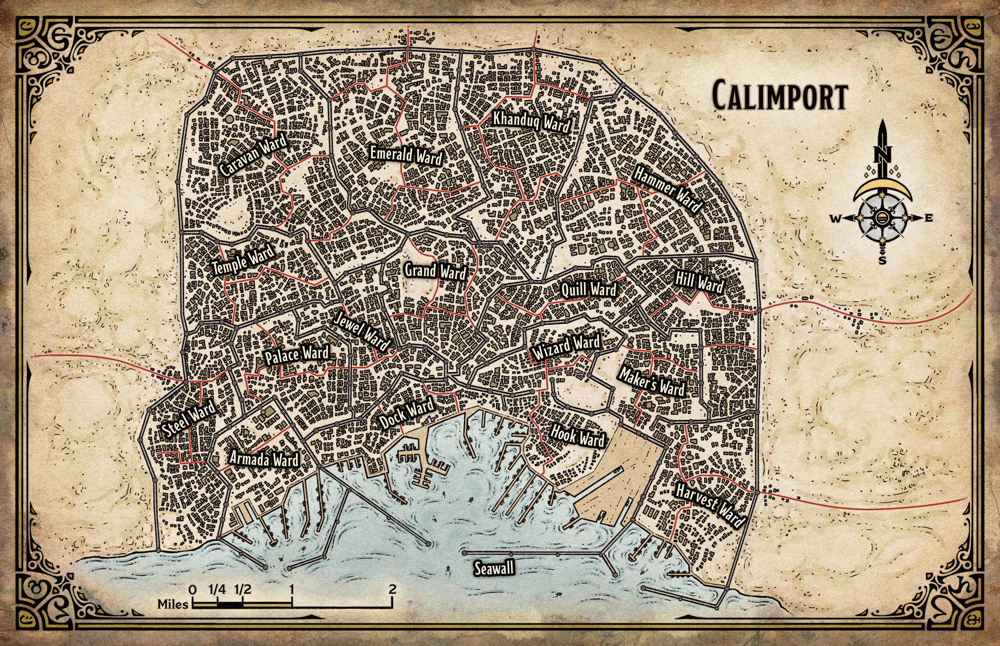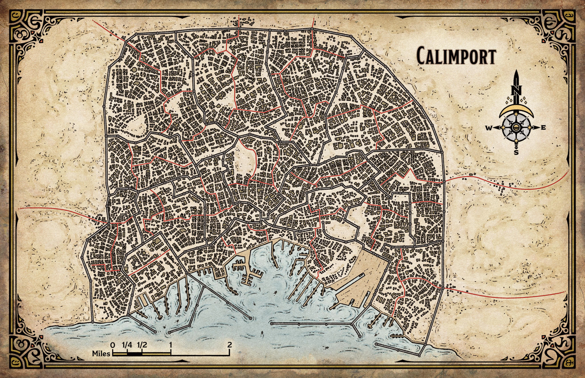
## Calimport Gazetteer

Calimport is the oldest, and by many measures the greatest, city in Faerûn. A nexus of trade, culture, and sophistication, it has gained even more prominence in recent years with the rise of Sultana Songal and her patronage of the city's inventors and artificers. Citizens of Calimport now rely on Mechanical Wonders to solve their daily problems, instead of seeking the patronage of capricious genies.

Visitors from across Faerûn—and indeed from planes and worlds throughout the multiverse—crowd the streets and markets of Calimport. Genies are allowed to enter only if they swear an oath of obedience and nonviolence to the sultana.

The city is divided into a few distinct sections:

  - **Docks and Seawall.** Calimport's docks house the sultana's navy as well as countless trade vessels.
  - **Calimport Wards.** The city is divided into seventeen distinct neighborhoods,
  - **Muzad.** Beneath the city lies a bewildering maze of underground tunnels.

### Docks and Seawall

Calimport's harbor is vital to the city's prosperity. The colossal seawall protecting the harbor was constructed long ago by genies. The wall rises 20 feet above sea level and is 30 feet thick at its summit; its base reaches down more than 200 feet to the harbor bottom and gradually widens to 150 feet thick. Fortified garrison houses line the top of the wall, while gatehouses can close the harbor with heavy steel chains.

The harbor handles hundreds of vessels at a time and is divided into several sections. The Armada Ward houses the sultana's navy, the Dock Ward handles commercial shipping, the Harvest Ward services fishing ships and other local traffic, and the Hook Ward is for shipbuilding.

By a decree of the sultana, ships docking in Calimport are expected to hand over books, scrolls, or other written material; only personal correspondence and business records are exempt. If the Grand Library doesn't have a copy of the book or scroll, the manuscript is copied, and documents are eventually returned. The Grand Library's scribes work with magical assistance, but it's not unusual for ships to be delayed in port as their passengers wait for books to be returned.

### Calimport Wards

Calimport is divided into the following wards.

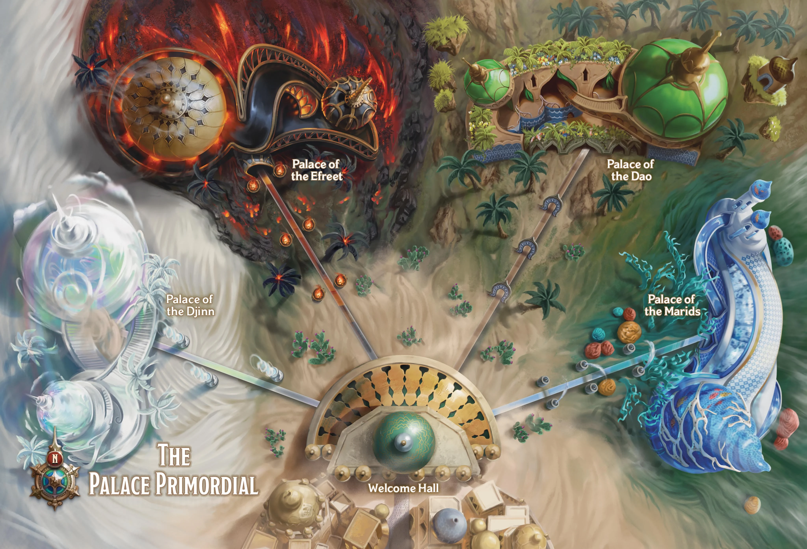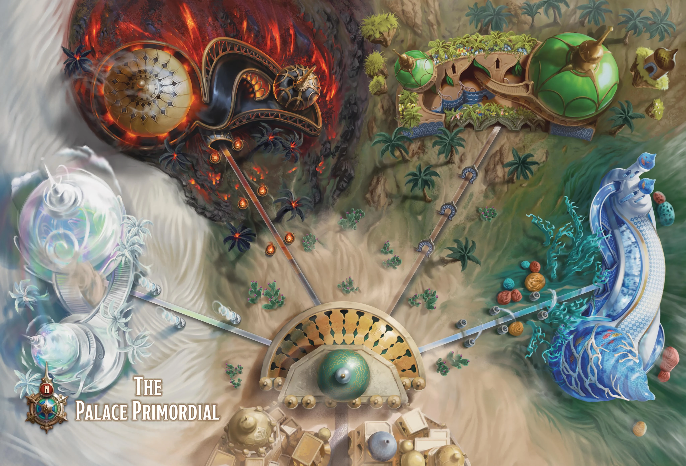
#### Armada Ward

The Armada Ward contains garrisons, armories, and warehouses supplying Calimport's navy, the Nallojal. Only military vessels are allowed to use the harbor here. Security is tighter than in most other wards, and officials watch for foreign spies and saboteurs. Unless a person has official business or direct connections with a high government official, they are generally not permitted entrance.

#### Caravan Ward

Those who enter Calimport from the Trade Way pass through the Caravan Gate: a pair of massive iron doors 30 feet tall, 20 feet wide, and 1 foot thick. Both doors bear the symbol of the sultana: two crossed scimitars under a gold coin. Although each door weighs over 150 tons, their design is so perfect they can be opened or closed by a single person. Mounted knights patrol along the Trade Way for many miles beyond Calimport, accompanied by the Zeraphi, an elite force of spellcasting warriors on flying carpets. A garrison of city guards watches the gate, supported by large and imposing nimblewrights.

Following tradition, gate guards greet everyone who enters the city and give them water. Everything surrounding the Caravan Gate conveys the strength, power, and hospitality of Calimport.

Inside the gates, the Caravan Ward is dusty and crowded with beasts of burden, tents, and travelers. The bureaucracy managing the Caravan Ward is extensive, running offices, inns, taverns, and shops that cater to visitors.

In addition to permanent auction houses and bazaars, impromptu markets and auctions spring up in minutes, only to disappear as soon as coins and goods have been exchanged. Most goods here make their way to the Grand Ward before spreading throughout the city.

#### Dock Ward

The Dock Ward is known in Calimport as the Ward That Never Sleeps, and this ward has more taverns, inns, and warehouses than anywhere else in the city. Inside the protective seawall, dockworkers labor day and night, offloading and loading ships.

#### Emerald Ward

This ward's tall, vibrantly colored, ornately decorated, and domed buildings are one of the first signs of Calimport's magnificence when visitors approach the city from the north. The Emerald Ward's proximity to the Caravan Ward makes it convenient for affluent merchants, and this is home to many of Calimport's social climbers.

#### Grand Ward

Trade is the heart of Calimport, and the Grand Ward is the epitome of trade. The Grand Ward connects to most wards in the city and has more shops and markets than the others. Items from all over Faerûn can be found here, particularly in the Grand Bazaar: a marvel of commerce embracing multiple city blocks filled with wide, open buildings topped by domes and decorated with arches.

Local and traveling merchants rent space in the Grand Ward to sell their wares. Merchants lay down carpets or erect open tents to sell textiles, glassware, spices, imported food, magic items, and much more. The wealth of goods and bustling crowds of people make this a paradise for merchants, buyers, and pickpockets.

#### Hammer Ward

The Hammer Ward is the home of Calimport's armorers, blacksmiths, and weaponsmiths. Every day, the ringing of hammers can be heard throughout the ward. Neighborhoods within the Hammer Ward are patrolled by their guilds, and the guildhalls are fortified armories. The most outstanding features of this ward are its two massive foundries, which produce the finest steel in Faerûn.

#### Harvest Ward

This ward harbors the city's many fishing vessels. As the number of trade ships has grown, the walls of the Harvest Ward have extended to accommodate smaller local vessels. Besides the harbor, the Harvest Ward contains numerous granaries and supply warehouses for the city. The Ward's easternmost edge contains a live animal market and pens for newly arrived livestock.

#### Hill Ward

The Hill Ward used to be known as the Crypt Ward, and it housed the city's dead. But after millennia of burials, there was no more room and most of those buried here were long forgotten. To create space for new graves, dirt was piled atop older burials. During Calimport's infrequent storms, bones would wash into the streets.

After consultation with the church of Kelemvor, Sultana Songal established the Necropolis of Nykkar on the Isle of Memory and ordered the Crypt Ward to be repurposed. Priests of Kelemvor supervised the exhumation, identification, and transport of millennia of Calimport's dead onto black ships that carried them to Nykkar. These ships, the Death Fleet of Kelemvor, continue their mission today, serving the city's newly dead.

Now the Hill Ward is a home for Calimport's working class, who have filled the old ward with tall buildings, broad streets, and markets. The Hill Ward's high elevation means the people here live above the wealthy elite of other districts—a fact locals credit to the sultana, whom they revere as a hero of the working class.

#### Hook Ward

The Hook Ward contains Calimport's shipyards and associated warehouses. The navigators', seafarers', and shipwrights' guildhalls are within the Hook Ward. Because some of the shipyards specialize in military vessels for the sultana's navy, the Hook Ward also has a strong military presence.

Temples and shrines dedicated to numerous deities of the seas, including Umberlee and Talos, can be found in the Hook Ward. Sailors visit these shrines in an attempt to soothe these temperamental deities. Priests at these temples heal wounds, remove curses, and sell Holy Water.

#### Jewel Ward

The Jewel Ward is home to Calimport's gem cutters, jewelers, perfumers, lace makers, and high fashion designers. Some of the most delicate *Mechanical Wonders* are crafted here. It is rumored that much of Calimport's illicit trade in weapons, poisons, and magic is discreetly conducted within this ward.

#### Khanduq Ward

A khanduq is a small, walled market at the center of a city district, and the Khanduq Ward boasts many such markets. The homes that surround these markets belong to the city's less affluent crafters and merchants, and the bottom floor or two is usually reserved for a workshop or storefront. The streets of the Khanduq Ward are narrow, bustling, and crammed with makeshift stalls.

#### Maker's Ward

The Maker's Ward is home to skilled crafters, artificers, and makers of the city's *Mechanical Wonders*. The ward houses a significant gnome population. The sultana regularly tours the workshops of the Maker's Ward, reviewing the latest innovations and selecting some for military use or special placement within her palace.

The ruler of the Maker's Ward is a rock gnome named Deryan Kaya. A larger-than-life figure among Calimshan's artisans, merchants, and nobles, Deryan can't walk down the street without being recognized and interrupted by passersby, so she usually travels over the city in an ornithopter of her own design.

#### Palace Ward

The wealthiest and most affluent Calishites own luxurious homes and villas in the Palace Ward. Several nations and city-states maintain embassies here, under the watchful eye of the Dragon Guard, the sultana's elite personal guard of dragonborn warriors.

Taverns and bathhouses in the Palace Ward serve as gathering spots for the city's elite, while theaters provide entertainment. Important visitors and mercenaries hired to protect nobles stay in the ward's luxurious inns. City servants and *Mechanical Wonders* sweep the streets clean from the dust that blows in from the Calim Desert.

The Palace Primordial stands among the ward's most opulent buildings. This magnificent structure hosts visiting genies and their retinue. Its chambers have been magically altered to suit the preferences of genies of all sorts, but the sultana's spies have allegedly infiltrated the palace staff.

The sultana's palace complex sits high atop the mesa at the heart of the Palace Ward, above all but the Hill Ward. Luxurious gardens surround the enormous, white-domed palace, which is visible from anywhere in the city. Ambassadors from the Lords' Alliance and Purple Dragon Knights have permanent quarters in the complex. In an emergency, the palace can be sealed off from the rest of the city and further protected by layers of magical wards. Wells and gardens provide food and water. The palace and its gardens are well protected by the Dragon Guard.

#### Quill Ward

Calimport's prodigious papermaking and bookbinding industry is centered in the Quill Ward. The most prominent feature of the ward is the Grand Library, located atop a hill at the ward's eastern end. The head of acquisitions at the Grand Library is an **Efreeti** scholar named Azriq, who has a perfect memory and can recall the name and location of every manuscript the library contains. A trusted adviser to Sultana Songal, he dreams of reading every book in Faerûn, and he's the only genie in Calimport not required to swear the Sultana's oath.

Many of the buildings within this ward, including the Grand Library, are magically protected against fire. Skilled scribes throughout the ward work tirelessly to copy texts for preservation or sale. The guilds of the Quill Ward are exacting in their standards and teach scribal magic to make the process faster and more reliable.

#### Steel Ward

The Steel Ward is home to Calimport's military and strategically located next to the Palace and Armada Wards. Its outer gates open toward the Trade Way so the army can quickly respond to threats outside the city.

In the center of the ward is a magically sustained lake used to water the army's mounts. An expansive training ground surrounds the lake. But the real landmark floats over the lake: the Sky Tower, a levitating twelve-story stone tower capped with a blue dome that is the headquarters of the Zeraphi, an elite force of warriors who ride *Carpets of Flying*.

The current general of the Zeraphi is Saif the Mighty (Medium, Chaotic Good **Pirate Captain**), a human who fought alongside Songal against the Twisted Rune. In the years since, he's been the hero of many battles. Saif is among Calimport's most charismatic bachelors and is rumored to be the sultana's secret consort.

#### Temple Ward

Calimport's largest and grandest temples and shrines are located in the Temple Ward. Various faiths attempt to outdo each other in the magnificence of their holy places, using precious metal, domes, soaring spires, elaborate stonework, and stained glass. Most faiths are welcome in Calimport, although the worship of a few evil deities is banned, prompting their followers in the city to perform their rites in secret.

The largest and most luminous temple, the Temple of a Thousand, houses beautiful statues depicting deities from all over Faerûn, grouped together according to the plane on which each god resides. This is a popular site of worship for Calishites and pilgrims alike.

#### Wizard Ward

The Wizard Ward is the seat of the Guild Arcane, Calimport's mages' guild. Towers, academies, shops, libraries, and homes line the ward's narrow, meandering alleyways. *Mechanical Wonders* clean the streets and run errands, while strange magic can be seen in windows and on rooftops. The Plaza of Oranges—a long, wide park suitable for quiet relaxation and the occasional arcane duel—fills the north end of the ward. This ward includes a Thayan enclave staffed by Red Wizards and their guards.

While many Calishites know a spell or two, any serious practitioner of arcane magic wishing to conduct business in the city must join the Guild Arcane and pay annual dues. This includes students and faculty at the ward's many magical academies. The guild sets the price for arcane services and magical items and ensures all transactions are carried out safely and according to the law.

The heads of the magical academies report to the ward's ruler. Every five years, they present a list of suitable candidates for the post of grand adviser, and the sultana selects her grand adviser from among these candidates. The current grand adviser is the silver dragonborn Perak (Medium, Lawful Good **Archmage**), a specialist in divination. Tall and fluent in many languages, Perak stands out in any crowd and enjoys daily walks through the ward, where she befriends newcomers and renews old acquaintances.

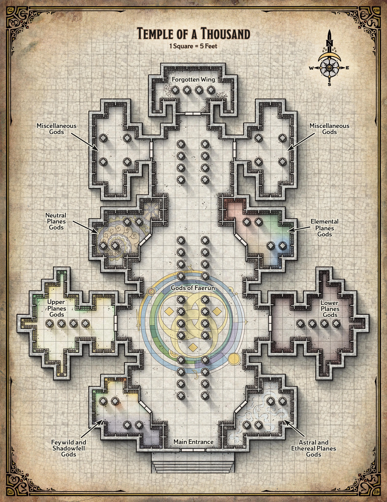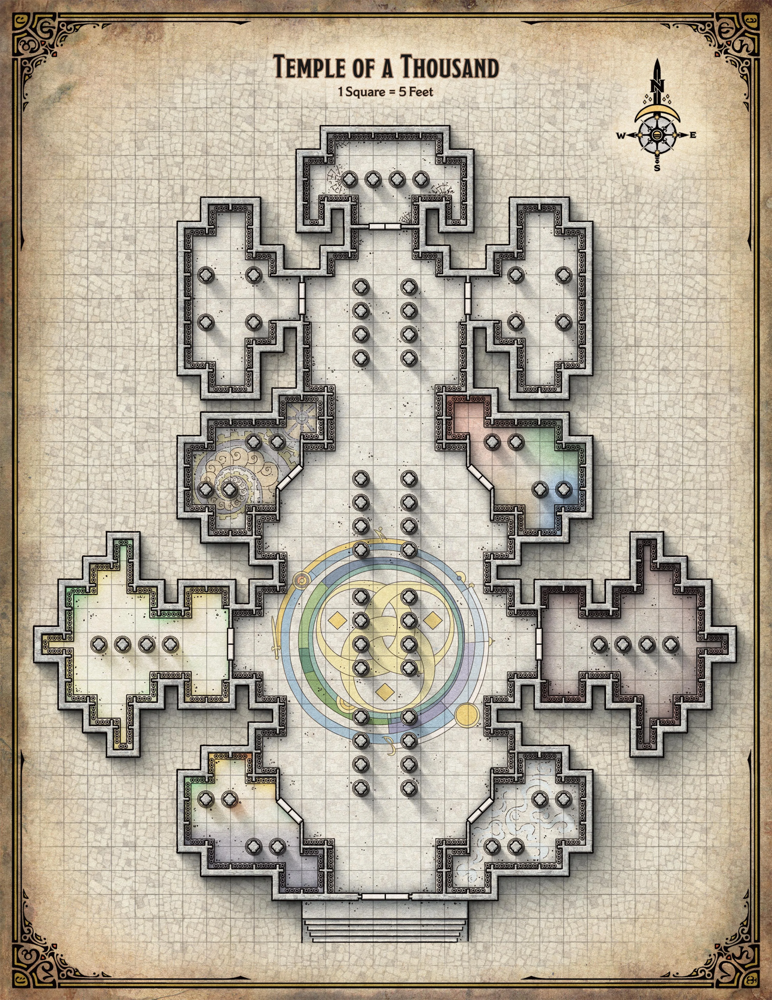
### Muzad

Over the millennia, disasters have destroyed large sections of the city. When this happens, it's often easier to build on top of the rubble than to clear it, in the process burying ruined homes, streets, and entire neighborhoods. But these ancient ruins survive beneath the streets of Calimport, and sometimes construction uncovers pockets of Calimport's long-forgotten past. Citizens with nowhere else to live take refuge in this undercity, which is called the Muzad.

Those who dwell in the Muzad have dug new tunnels that lead to the surface or connect to additional underground sections, expanding the region. The heart of the Muzad runs from the Emerald Ward through the Jewel Ward, but smaller pockets exist throughout the city, connected by narrow, winding, and dangerous tunnels. Although everyone in Calimshan knows the Muzad exists, few know how extensive it's become.

Cults, organized criminals, the Zhentarim, and assassins make extensive use of the Muzad, and the word "muzad" has become synonymous with any underground or illicit activity. The residents of this unofficial ward are careful not to draw the attention of surface dwellers or the ire of the city guard; criminals who threaten to draw too much attention are dealt with swiftly by their peers and rivals.

The Muzad hosts the Shadow Bazaar, a roving underground market operated by the Night Wisp gnome crime family. Drow from the Forest of Mir also maintain an unofficial embassy in the Muzad, where they trade drow poison, duergar weapons, and other rarities from the Underdark for *Mechanical Wonders* and Calimport luxuries.

#### Sewers

Calimport has had two sewer systems over its lifetime. The original Old Sewers were destroyed long ago. Most of these tunnels were walled off or filled in, but miles of them survive and are now part of the Muzad.

The New Sewers channel the city's waste to the Shining Sea. Unlike the Old Sewers, the New Sewers are smaller, distinct sewer systems maintained by each ward.

While not prestigious, the hardworking Sewer Worker's Guild includes some of the best-paid and best-trained employees in the city. The guild includes ooze wranglers who use **Gelatinous Cubes** to keep the sewers free of clogs and dangerous critters. However, adventurers are sometimes employed to deal with more dangerous threats, including **Carrion Crawlers**, **Ghouls**, and the occasional **Otyugh**.

*I once designed a mining vehicle with a forward-mounted drill. But when I realized the machine could be used to bore into Volothamp's treasury, I destroyed the plans for it. I think. Actually, now I can't remember...*— Deryan Kaya
## Calimshan Stories

Calimshan is a place of wonders and opportunities. The following themes are common in Calimshan adventures.

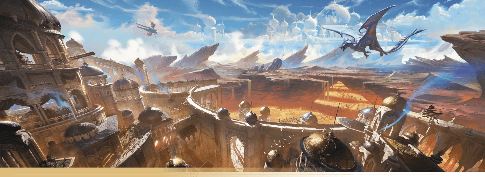

### Danger in the Desert

The archetypal adventure in Calimshan involves entering, crossing, or trying to live in the magical but unrelenting Calim Desert. In this inhospitable land, mighty efreet rule from the shimmering oasis of Gozva Ka, and the flying fortress of Miziltep is a constant threat. Any adventurer who enters the desert must reckon with efreet and their power.

Despite these threats, the desert provides travelers reasons to brave its dangers. Caravans bound for Calimport keep to the Trade Way, but smaller settlements and oases create a network of less-traveled routes. Shifting sands hide tombs and crumbling towers where forgotten magic lies buried. Dunes cover cities, leaving them as nests for blue dragons. Criminals and other desperate individuals hide in the desert. The *Monster Manual* includes a list of monsters suitable for desert encounters.

### Life among the Genies

The influence of genies is ever-present in Calimshan outside of the major cities. Adventurers eager to acquire genies' magic, however, will need to seek out those rare genies with the power to grant wishes. To find such genies, characters must travel to genie palaces in the desert, in the mountains, deep under the sea, or floating above Calimshan's eastern forests. Before granting any wishes or other magic, however, these genies will send adventurers on missions to gather intelligence on rivals, punish or scheme against enemies, and enforce the genie's commands.

Djinn make excellent patrons for a party of adventurers. Chaotic and whimsical, some djinn enjoy when adventurers interpret their commands in creative ways or wander off on unrelated quests. You can model a djinni patron on Nafas, the caretaker of the Infinite Staircase (mentioned in the *Dungeon Master's Guide* and detailed in the adventure anthology *Quests from the Infinite Staircase*).

The courts of other genies are more perilous. Adventurers might successfully negotiate with a marid through flattery and good storytelling skills, but dao are pitiless in their pursuit of wealth, and the tyrannical efreet are even worse. Instead of serving such genies, adventurers might enter cities ruled by dao and efreet on raids or spying expeditions.

Early adventures among the genies pit the characters against Elementals and Humanoids who serve the genies. The first camp includes **Aarakocra Aeromancers**, **Gargoyles**, mephits, **Merfolk Wavebenders**, and salamanders, while the second group includes bandits, cultists, mages, nobles, performers, pirates, scouts and spies.

### All Roads Lead to Calimport

Adventures in Calimport place the characters in the greatest city of Faerûn. The characters might be locals who were born in Calimport and grew up in its markets. Other characters might be strangers, hailing from elsewhere in Calimshan or from far-off lands like the Sword Coast or Dalelands.

Urban adventures differ from traditional dungeons in important ways. See "Urban Adventures" in chapter 6 of this book for general advice. Furthermore, Calimport differs from other cities in the way magic is ever present. Illustrate this by allowing **Commoners** met in the city to cast a cantrip or two, especially cantrips that have little use in combat, such as *Elementalism*, *Mending*, or *Spare the Dying*.

Another way to emphasize the magical nature of Calimport is by including plenty of consumable magic items such as potions and *Spell Scrolls* in adventure rewards. This allows characters to constantly discover new magic, but that magic is quickly used up or bartered away to obtain key items or secure allies.

Wealth flows freely in Calimport. Characters can readily buy magic items and spellcasting services, and the sultana is so rich that you can embellish your Calimport adventure with any fantastical element and simply say, "The sultana pays for it." This includes lavishing fantastic rewards on your characters. But fortune is fickle, and characters shouldn't get too attached to this surplus of money and magic.

Explain the ephemeral nature of wealth and magic in Calimport to your players so they know what to expect and don't get frustrated. Reassure them that while they might occasionally suffer cataclysmic bouts of bad luck, when their treasure is stolen overnight by thieves or wished away by a genie rival, the next windfall is never far around the corner, and by morning they might have a brand-new fortune.

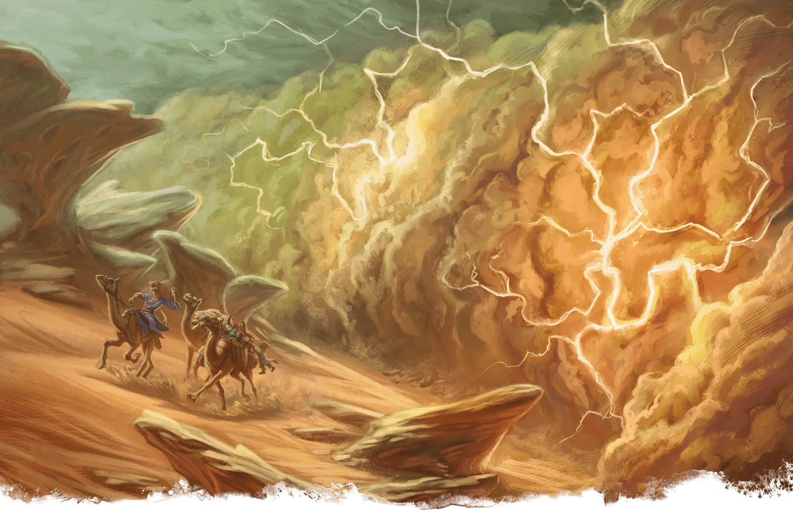

## Calimshan Conflicts

Calimshan is a divided land. In the cities, the people are served by sophisticated *Mechanical Wonders* and protected by the fair and just laws of Sultana Songal. But outside the cities—in the desert, mountains, or forests, and on the windy central steppes—Calimshan's people look to genies' magic to survive.

### Exploring the Environment

In many ways, the greatest and simplest challenge found in Calimshan is the environment itself, especially the Calim Desert. When characters explore Calimshan, they pit themselves against quicksand, lightning strikes, sandstorms, and more.

#### An Exploration Arc

This campaign focuses less on specific villains and more on traveling the breadth of Calimshan, exploring its wonders and risking its many hazards.

***Levels 1–4.*** The characters first enter the Calim Desert when they're hired to recover a book from a library built by Lethchauntos (see "*The Lost Library of Lethchauntos*" in chapter 7). They can continue to explore the desert in "Calim Crossing" and "The Dallabad Curse," both in this chapter.

***Levels 5–10.*** Future adventures might take the characters to extreme environments beyond the desert. They might risk the Spider Swamp and meet mysterious **Araneas**, explore the fallen magic of Myth Dyraalis, or travel the steppes and befriend Kochar nomads. Between adventures, they enjoy the glittering cities along Calimshan's southern coast.

### Genie Factions

#### Goals of the Genie Factions

Calimshan is home to four genie factions that conspire against one another while also seeking to restore genies to prominence and overthrow Sultana Songal. Characters might ally themselves with one of these four factions, or they might serve Sultana Songal and work to keep the genies quarreling among each other. The sultana is safest when the genie factions are intriguing and conspiring against one another, too busy to focus their attention on her.

Each of the genie factions has one opposing faction they consider an enemy; the two other factions are rivals. (See "Genie Factions" earlier in this chapter.) Factions spy on other factions and work to overshadow or humiliate their rivals, and factions take any opportunity to harm or even destroy enemy factions. A faction might temporarily ally with a rival, but such an alliance is tenuous and ends when either faction sees a weakness or opening they might exploit.

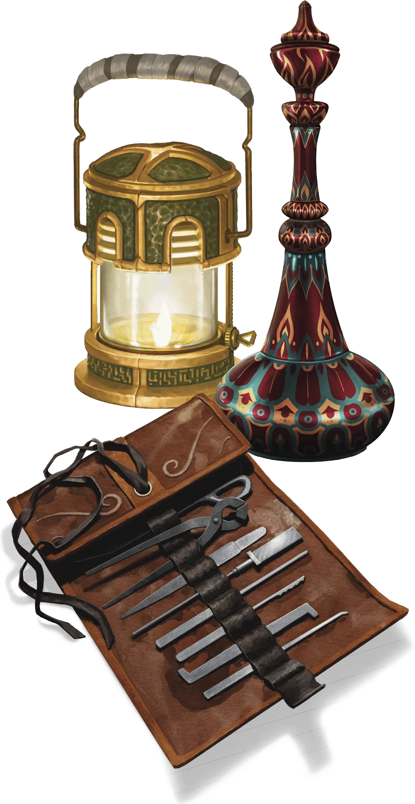

#### A Genie Faction Arc

A conflict between the characters and one or more genie factions might follow this broad outline.

***Levels 1–4.*** Before traveling to remote genie palaces, the characters might come to the sultana's attention by doing good deeds in Calimport. You can use "Gods Long Forgotten" in this chapter. Once they've come to Songal's attention, she recruits them to be her agents in the endless intrigues against the genies.

***Levels 5–10.*** The characters travel to Burin Bir, Gozva Ka, Maran Saya, and Olympus Dag as secret agents of the sultana, meeting genies and learning their ways. You can use "The Calimemnon Conspiracy" in this chapter to bring the four factions together and introduce the *Calimemnon Crystal*.

***Levels 11–15.*** Now that the Calimemnon Crystal has been found, the party must defend it against genies who want to seize it and destroy it, releasing the genies trapped inside. Songal might ask the characters to keep the Artifact in their Bastion.

*For millennia, the people of Calimshan turned to genies to make their wishes come true. My Mechanical Wonders can't grant wishes. But they can give you leisure, peace of mind, and time to pursue your dreams. Is that not your wish?*— Deryan Kaya
## DM's Toolbox

This section provides tools useful for adventures in Calimshan.

### Renown in Calimshan

You can use the renown rules in *chapter 3* of the *Dungeon Master's Guide* to track the characters' relationships with the four genie rulers and Sultana Songal.

#### Genie Factions

Characters earn renown with the four genie factions of Calimshan by providing advice and entertainment at a ruler's court, performing dangerous missions for the ruler, or embarrassing or humiliating the ruler's rivals. Track renown for each of the four genie factions separately.

##### Genie Renown
| Renown Score | Reward                                                                                                                                                                               |
|:------------:|--------------------------------------------------------------------------------------------------------------------------------------------------------------------------------------|
|      3+      | Members of the ruler's court are Friendly to you. You are provided a Comfortable lifestyle for free at the palace.                                                                   |
|      5+      | You can purchase the following kinds of adventuring gear from the ruler's contacts for half cost: *Fine Clothes*, *Ink*, *Ink Pens*, *Paper*, *Parchment*, *Perfume*, or *Spyglass*. |
|      10      | The first time your Renown Score reaches 10, the ruler grants you a random Charm (see *chapter 3* of the *Dungeon Master's Guide*).                                                  |
|      15+     | Elementals other than genies within the ruler's domain are Friendly to you by default. Your lifestyle in the palace increases to Wealthy.                                            |
|      30+     | Genies associated with the ruler are Friendly to you by default. Your lifestyle in the palace increases to Aristocratic.                                                             |
|      40+     | You can request the aid of a **Spy Master** for one mission. Once you use this benefit, you can't do so again until your Renown Score improves.                                      |
|      50      | The first time your Renown Score reaches 50, the ruler grants you a Blessing of your choice (see chapter 3 of the *Dungeon Master's Guide*).                                         |

#### Sultana Renown

Sultana Songal likes adventurers and welcomes them in her court. Characters earn renown with her by succeeding at tasks she gives them; being generally likable and entertaining at court; and exhibiting Calishite virtues, including generosity, hospitality, and a respect for scholarship and lore.

##### Sultana Renown
| Renown Score | Reward                                                                                                                                                                                                                                                                                                                                                         |
|:------------:|----------------------------------------------------------------------------------------------------------------------------------------------------------------------------------------------------------------------------------------------------------------------------------------------------------------------------------------------------------------|
|      3+      | Members of the sultana's court are Friendly to you. You are provided a Comfortable lifestyle for free at a lodging of the sultana's choice near the palace.                                                                                                                                                                                                    |
|      5+      | You can purchase services for half cost in Calimport.                                                                                                                                                                                                                                                                                                          |
|      10+     | The sultana grants you access to her palace's gardens. When you take a Bastion turn, you can issue the Harvest order to the palace gardens as if the gardens were a Garden special facility in your Bastion. Each time you issue the order, you can choose a different garden type from the Garden Types table in *chapter 8* of the *Dungeon Master's Guide*. |
|      15      | The first time your Renown Score reaches 15, the sultana offers you a governmental position in the city—such as district mayor—and gifts you 1,000 GP worth of coins, gemstones, and art objects.                                                                                                                                                              |
|      25+     | When you issue the Harvest order to the palace gardens, you can treat the gardens as a Greenhouse special facility instead of a Garden.                                                                                                                                                                                                                        |
|      30      | The first time your Renown Score reaches 30, the sultana offers you a mid-level governmental position in the city and gifts you 5,000 GP worth of coins, gemstones, and art objects.                                                                                                                                                                           |
|      40+     | You can call on the sultana to perform a major favor, such as pardoning a minor crime. Once you use this benefit, you can't do so again until your Renown Score increases.                                                                                                                                                                                     |

### Calimshan Bastions

The adventure "The Dallabad Curse" later in this chapter details Dallabad Oasis, a potential Bastion for characters. Dallabad Oasis is in the Calim Desert but is close to Calimport, facilitating a campaign that embraces both the desert and the city. Alternatively, you could move the oasis detailed in "The Dallabad Curse" to the Central Steppes of Calimshan.

A Bastion in the Dallabad Oasis might look different than one in other parts of Faerûn. Bastion facilities in the oasis might be housed in pavilions and tents positioned around natural springs and lakes, shaded by date palms and connected by trails and paths. This doesn't prevent the party from protecting their Bastion with defensive walls, as detailed in *chapter 8* of the *Dungeon Master's Guide*.

#### Bastion Events

The Bastion Events table in the *Dungeon Master's Guide* describes random events that affect a Bastion. You can tailor these events to Calimshan as follows.

***Attack.*** Attacks on a Bastion in the Calim Desert likely come from **Bandits**, **Gnoll Warriors**, or **Elemental Cultists** in service to an **Efreeti**. Alternatively, the Bastion might have aroused the ire of a blue dragon.

***Criminal Hireling.*** A criminal hiding in the desert might be wanted by dao, djinn, or marids. If their crimes were committed in Calimport, they might instead be a spy for one of the sultana's many enemies.

***Extraordinary Opportunity.*** The Bastion might open its gates for travelers, providing generous hospitality to all. Word spreads of the characters' generosity, and caravans begin to regularly stop there to rest and socialize.

***Friendly Visitors.*** Desert visitors come to the Bastion to avoid dealing with the cruel efreet of Gozva Ka or the bewildering streets of Calimport. They return to the desert when their task is done but might have interesting news or adventure hooks to share before they go.

***Guest.*** Agents of the sultana and genie ambassadors make excellent guests.

***Magical Discovery.*** Appropriate discoveries for Bastions in the desert include *Potions of Animal Friendship*, *Fire Breath*, or *Resistance* and *Spell Scrolls* of *Elemental Weapon*, *Heat Metal*, and *Protection from Energy*.

***Refugees.*** Refugees might be fleeing devastation caused by the flying fire fortress of Miziltep, escaping the wrath of a recently awakened **Dracolich**, or simply abandoning a settlement beset by drought or famine.

### Encounters in Calimshan

You can roll on the Calim Desert Encounters table when the party travels through the desert.

<table class="rd__b-special rd__b-data  rd__b-data--stats">
		<thead>
			<tr>
				<th class="rd__data-embed-header ve-text-left" colspan="6" data-rd-data-embed-header="true">
					

						

							Calim Desert Encounters
							
						

						[–]
					

				</th>
			</tr>
		</thead><tbody class="" data-rd-embedded-data-render-target="true"><tr>
			<td colspan="6" data-rd-tag="table" data-rd-uid="Calim Desert Encounters|FRAiF" data-rd-page="tables.html" data-rd-source="FRAiF" data-rd-hash="calim%20desert%20encounters_fraif" data-rd-name="Calim Desert Encounters" data-rd-display-name="Calim Desert Encounters" data-rd-style="" data-rd-entry-data="{}">
				<i>Loading <a href="tables.html#calim%20desert%20encounters_fraif"  onmouseover="Renderer.hover.pHandleLinkMouseOver(event, this)" onmouseleave="Renderer.hover.handleLinkMouseLeave(event, this)" onmousemove="Renderer.hover.handleLinkMouseMove(event, this)" onclick="Renderer.hover.handleLinkClick(event, this)" onwheel="Renderer.hover.handleLinkWheel(event, this)" ondragstart="Renderer.hover.handleLinkDragStart(event, this)" data-vet-page="tables.html" data-vet-source="FRAiF" data-vet-hash="calim%20desert%20encounters_fraif" ontouchstart="Renderer.hover.handleTouchStart(event, this)" >Calim Desert Encounters</a>...</i>
				
			</td>
		</tr></tbody></table>When the characters explore Calimport, you can roll on the Calimport Encounters table.

<table class="rd__b-special rd__b-data  rd__b-data--stats">
		<thead>
			<tr>
				<th class="rd__data-embed-header ve-text-left" colspan="6" data-rd-data-embed-header="true">
					

						

							Calimport Encounters
							
						

						[–]
					

				</th>
			</tr>
		</thead><tbody class="" data-rd-embedded-data-render-target="true"><tr>
			<td colspan="6" data-rd-tag="table" data-rd-uid="Calimport Encounters|FRAiF" data-rd-page="tables.html" data-rd-source="FRAiF" data-rd-hash="calimport%20encounters_fraif" data-rd-name="Calimport Encounters" data-rd-display-name="Calimport Encounters" data-rd-style="" data-rd-entry-data="{}">
				<i>Loading <a href="tables.html#calimport%20encounters_fraif"  onmouseover="Renderer.hover.pHandleLinkMouseOver(event, this)" onmouseleave="Renderer.hover.handleLinkMouseLeave(event, this)" onmousemove="Renderer.hover.handleLinkMouseMove(event, this)" onclick="Renderer.hover.handleLinkClick(event, this)" onwheel="Renderer.hover.handleLinkWheel(event, this)" ondragstart="Renderer.hover.handleLinkDragStart(event, this)" data-vet-page="tables.html" data-vet-source="FRAiF" data-vet-hash="calimport%20encounters_fraif" ontouchstart="Renderer.hover.handleTouchStart(event, this)" >Calimport Encounters</a>...</i>
				
			</td>
		</tr></tbody></table>
## Calim Crossing

*Brave the dangers of the Calim Desert*.

- **A Location (Calimshan) Adventure for Level 3 Characters**

- **Situation.** Shezar Han, a human merchant (Medium, Neutral Good **Commoner**), must take his caravan from Memnon to Calimport, a weeklong journey of over 150 miles. But his guards are monsters in disguise intending to lure the caravan to its destruction.
- **Hook.** Shezar hires the characters to escort his caravan to Calimport. He offers each character 100 GP now and another 100 GP when the caravan reaches its destination.

### Encounters

This adventure takes place over a week as the caravan follows the Trade Way south across the desert. The caravan includes dozens of camels carrying precious goods, but Shezar's prize possession is a *Brazier of Commanding Fire Elementals*, which he keeps packed away on his camel.

Shezar has hired eight guards aside from the characters; he doesn't know they're **Jackalweres** in humanoid form. Their leader is named Thukir. Thukir and the other jackalweres work for a **Lamia** named Selim who covets Shezar's magic brazier. Shezar assigns Thukir and the other guards to remain with the caravan every day while the characters scout the path ahead.

***Desert Encounters.*** Each day, as the characters scout, roll on the *Calim Desert Encounters table*. The characters spot any encounters from far off, so they can flee from threats too dangerous for them to handle and redirect the caravan along a safer route.

***Jackalwere Treason.*** The "guards" keep to themselves and avoid interacting with the characters. Thukir does the talking for the group. The jackalweres maintain their deception for as long as possible, but if they sense the party is onto them, they try to ambush the party one night in camp. Use the *Caravan Encampment map* in appendix B of the *Dungeon Master's Guide* for this encounter, replacing the wagons with bundles of goods offloaded from the caravan's camels.

***Sandstorm.*** On the fourth day, a furious Calim sandstorm (see "Environmental Effects" earlier in this chapter) approaches the caravan. The characters can seek shelter for the caravan or, failing that, shelter in place. If the jackalweres haven't yet been revealed, they try to steal the brazier. Should the jackalweres get the brazier toward Selim's tower (see below).

***Selim Strikes.*** The **Lamia** Selim lairs in a desert tower near the south end of the Trade Way. On the second-to-last night of the journey, Selim sneaks up to the camp and steals the brazier. If the jackalweres haven't yet been confronted, they join with Selim to seize the camp. Shezar begs the characters to recover the brazier from the lamia.

***Selim's Tower.*** Use the *Wizard's Tower map* in the Dungeon Master's Guide for Selim's lair. The tower entrance on level 1 is guarded by a **Warrior Veteran** and their pet **Lion**. Replace the central chamber on level 2 with a pool housing a **Water Weird** Selim has imprisoned. Selim is on level 4, along with a **Fire Elemental** he's summoned using the brazier.

***Conclusion.*** When the party brings Shezar safely to Calimport, he pays them the promised reward and gives them the magic brazier, insisting it has brought him nothing but woe and misfortune.

## Gods Long Forgotten

*Pacify a quartet of troublesome deities.*

- **A Location (Calimshan) Adventure for Level 4 Characters**

- **Situation.** Calimport's Temple of a Thousand includes the Forgotten Wing, a space devoted to deities who are no longer worshiped. Some of the gods memorialized there don't want to be forgotten and cause chaos to remind the world they exist.
- **Hook.** The characters are visiting the temple when screams of panic and fleeing patrons signal a crisis. The high priest of the temple slams the doors to the Forgotten Wing and breathlessly asks the characters to investigate.

### Encounters

Use the Temple of a Thousand map earlier in this chapter for this adventure. Four wayward deities are causing the disturbance in the Forgotten Wing. Each deity was represented in the temple by a statue; the deities have manifested in these statues, which have transformed into monsters. Most can be talked down through social interaction or tests of skill. The deities are as follows:

- **Motanwe.** Motanwe is a hunting god once revered by an extinct tribe of steppe nomads. He manifests as a Large stone statue of a horned humanoid (use the **Helmed Horror** stat block). He is Indifferent to the party but is angrily grieving his long-dead people. He admires warriors and those with hunting skill.
- **Nimbus.** Nimbus is a god of the sun who resents being overshadowed by, or even considered an aspect of, Lathander. Nimbus manifests as a flying orb of light three feet in diameter (Celestial, Chaotic Good **Empyrean Iota**). Nimbus responds to hopeful, optimistic people and being shown it can still be relevant or useful.
- **Korus.** Korus is a deity of music who manifests as a Celestial **Performer Maestro**. Korus's music is stately and formal, out of current fashion. Korus loudly insists artistic skill is the only true measure of a person's value but really just wants to inspire people again.
- **Sholoban.** Sholoban is a deity of knowledge, riddles, and magic. She manifests as a **Couatl**. Sholoban knows deities fade in time and is resigned to her fate, but she wants to make sure mortal society has learned something from her time as a god. She engages in riddle contests and tests of ancient lore with knowledgeable characters.
- **The Hukh.** The Hukh is a mysterious, hungry deity propitiated only by blood and sacrifice. It manifests as a **Shadow Demon**. The Hukh lurks in the shadows and avoids the party, fighting if a character approaches. Other deities fear the Hukh and won't help the characters defeat it, but they're relieved if the characters destroy it.

***Conclusion.*** If three of the five deities are propitiated or destroyed, the surviving deities return to their enshrined locations in the Forgotten Wing and vanish, leaving only inanimate statues. The high priest thanks the characters with a *Decanter of Endless Water* and 100 GP each.

## The Dallabad Curse

*Drive off the ghost that haunts an oasis.*

- **A Location (Calimshan) Adventure for Level 5 Characters**

- **Situation.** A mind flayer named Yharaskrik has survived a sojourn on the Astral Plane and returned to the Dallabad Oasis, not far from Calimport.
- **Hook.** Caravans have used Dallabad safely for decades. But in recent months, anyone stopping there has been attacked by Undead and other strange creatures. A Kochar council hires the characters to make Dallabad Oasis safe again.

### Encounters

The adventure includes the following encounters.

***Exploring the Oasis.*** Use the Dallabad Oasis map on this page. Each time the characters enter a distinct area of the oasis, roll on the Oasis Encounters table, rerolling duplicates.

##### Oasis Encounters
| 1d6 | Encounter                                                                        |
|:---:|----------------------------------------------------------------------------------|
|  1  | A **Gnoll Fang of Yeenoghu**, a **Gnoll Pack Lord**, and four **Gnoll Warriors** |
|  2  | A **Grell** leading three **Gricks**                                             |
|  3  | Four **Mummies**                                                                 |
|  4  | One **Ghast Gravecaller** and four **Ghouls**                                    |
|  5  | Ghost of Khorin Soulez (see below)                                               |
|  6  | Yharaskrik (see below)                                                           |

***Ghost of Khorin Soulez.*** Khorin was a human merchant and swordsman who once ruled Dallabad Oasis and secretly employed Yharaskrik. But Yharaskrik betrayed him, and Khorin was killed by an assassin named Artemis Entreri. Khorin's **Ghost** haunts the oasis. He hates Yharaskrik but obeys the mind flayer out of fear. He begins Indifferent to the characters and might give them information, but if ordered by Yharaskrik to fight them, he will.

***Yharaskrik.*** The **Mind Flayer** Yharaskrik spies on the characters but flees immediately when spotted, relying on four **Intellect Devourers** to cover its escape. The mind flayer moves to its lair and calls the ghost of Khorin Soulez to its side. Yharaskrik defends its lair, where it experiments on the desiccated corpses it finds in the sand.

> ##### Learn More About Artemis Entreri
>
>The assassin Artemis Entreri, nemesis of Drizzt Do'Urden, appears in the *Legend of Drizzt* novels and comics, as well as many video and board games.
>

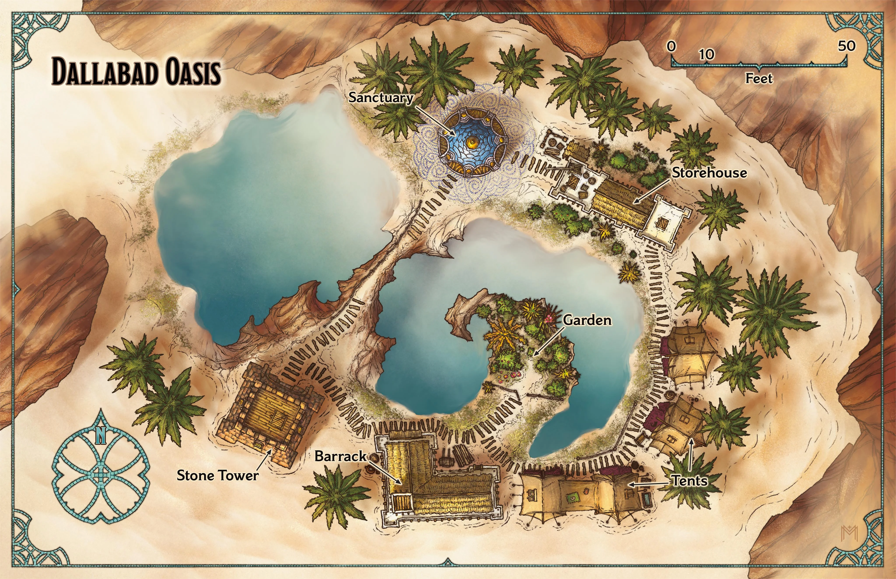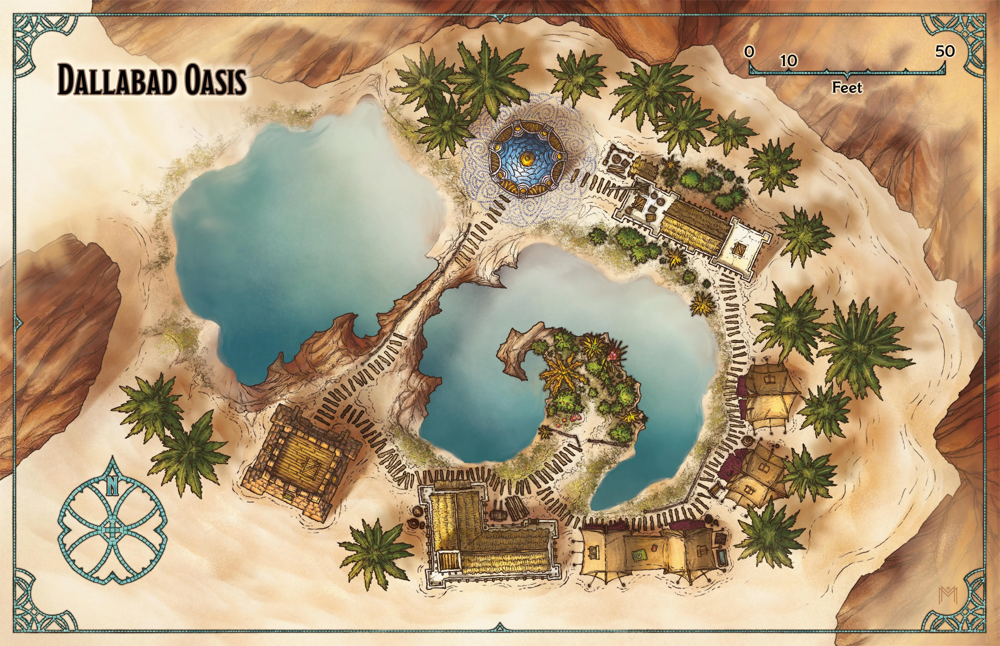
## The Calimemnon Conspiracy

*Save the realm from destruction.*

- **A Location (Calimshan) Adventure for Level 8 Characters**

***Conclusion.*** Once Dallabad Oasis is safe, the Kochar council rewards the characters with 500 GP each and urges them to remain in Dallabad Oasis to keep it safe. The characters can use the oasis as their Bastion.

- **Situation.** Ambassadors from the four genie factions of Calimshan come together for a three-day festival in Calimport. But while the city is distracted, Biha Babir learns the location of the *Calimemnon Crystal*. The characters must stop her from acquiring it and freeing the genies trapped within.
- **Hook.** Sultana Songal asks the characters to go the festival as her agents and make a good impression on the ambassadors each genie faction has sent to the festival.

### Encounters

The festival takes place at the Palace Primordial, which is divided into distinct buildings for **Dao**, **Djinn**, **Efreet**, and **Marids**. Use the Palace Primordial map earlier in this chapter. Each day of the festival, the four genie ambassadors host magnificent feasts in their respective palaces attended by humanoid and elemental followers. Each ambassador competes to provide the most fantastic entertainments and sumptuous dishes.

Each day, the characters can decide whether they linger at a feast, mingle with attendees, watch the various entertainments, or engage in some other activity. Each character has the opportunity to earn renown with one of the four genie factions by making a positive impression on one of the four ambassadors—a potential Renown Score increase of 1 per character per day. None of the genie ambassadors can cast the *Wish* spell. The genies are as follows:

- **Adviser Elçin.** Elçin is a Djinni who is intelligent and aloof. She is Indifferent to the characters, watching them carefully and probing for information on Sultana Songal.
- **Prince Sadir.** Sadir is a Hostile Dao envious of his fellow genies. He tries to trick the characters into embarrassing or humiliating the other ambassadors.
- **General Nirmalya.** Nirmalya is an Efreeti and Indifferent to the characters. She enjoys revelry and demonstrating her magical powers. She is quick with compliments but equally quick to anger.
- **Sovereign Firtina.** Firtina is a Marid with many titles, but his favorite is Sovereign of the Seventh Wave. He is proud, whimsical, and Hostile to the characters. Firtina is an old rival of Biha Babir.

***Uninvited Guests.*** On the second day of the festival, the feast is infiltrated by a **Vampire Nightbringer** named Eshku, who is accompanied by two **Vampire Spawn**. The vampires are members of the Twisted Rune, and they've come to kill the characters. If the characters defeat the vampires, their Renown Score with each of the four genie factions increases by 2.

***The Festival Ends.*** At the conclusion of the three days festival, attendants spot a falling star, landing in the Calim Desert; the "falling star" is the *Calimemnon Crystal*. Determine which character has the highest Renown Score with any of the genie factions. The ambassador from that faction becomes Friendly to the party and confides to them that the meteor is actually the Calimemnon Crystal. The ambassador can't allow any of their rivals to get the Artifact, so they give the party a *Spell Scroll* of *Teleport* and ask the party to acknowledge the ambassador's assistance to Sultana Songal.

***Hunting for the Crystal.*** The Calimemnon Crystal crashed to the ground like a meteor, breaking through into subterranean tunnels that subsequently flooded. Use the *Volcanic Caves map* in the *Dungeon Master's Guide* for this part of the adventure, replacing lava with dark, icy water. Each of the three largest pools is guarded by one of the following groups:

- A **Gray Slaad** and a **Red Slaad**
- A **Green Slaad** and a **Blue Slaad**
- Three **Red Slaadi**

The *Calimemnon Crystal* lies at the bottom of one of the pools (your choice).

***Final Confrontation.*** When the characters find the Calimemnon Crystal , **Biha Babir** arrives and tries to take it from them. On Initiative count 20 of the second round of combat, the ambassador who helped the party at the end of the festival appears to help fight Biha Babir.

***Conclusion.*** Once the party recovers the Calimemnon Crystal , they'll have to decide what to do with it. If they reveal all that's occurred to Sultana Songal, she rewards each of them with 10,000 GP in coins and gems, then asks for the Artifact. She intends to hide it somewhere safe. Alternatively, the characters might decide to keep the Artifact for themselves. Regardless, the genies of Calimshan won't stop trying to acquire it!

------

# Chapter 5: Moonshae Isles

>>The Moonshae Isles are realms of ancient magic, fierce storms, and bold heroes, where druids safeguard the land and fey lurk in every forest glen. The Moonshaes include seven major islands and over a hundred smaller ones, and a variety of cultures call these isles home. The story of the Moonshaes tells of peoples coming together to protect their homes, their family, and the sacred earth. Tragically, this unity came about only when the inhabitants were confronted with overwhelming danger, and that accord was purchased at great cost.
>>
>>People here revere the Earthmother, an embodiment of nature. The Earthmother reveals her power at moonwells, the sacred springs of natural magic found on the larger Moonshaes. Druids tend the moonwells, assisted by bards, rangers, and other heroes with a connection to nature or fey magic. The heart of the Earthmother's power lies in Myrloch Vale at the center of the island of Gwynneth, the most magical place in the Moonshaes.
>>
>>The Kendrick dynasty ruled the isles without rival until High King Derid Kendrick's reign, when two foreign powers invaded. The archfey High Lady Ordalf arrived from the Feywild and claimed Gwynneth; the fey that dwelled there became her subjects. At the same time, the nation of Amn swept into the Moonshaes, laying claim to the realm's valuable natural resources. The simultaneous invasions shattered Derid's authority.
>>
>>Tragedy struck when Derid's son, Owaren, was imprisoned by Amn and later died during an escape attempt. High Lady Ordalf sympathized with Derid's grief, imagining the loss of her own son, Prince Araithe. The two nobles allied together against Amn. After the war, Prince Araithe married Derid's daughter, Tarilyn. Their daughter, Caitlyn Kendrick, is the heir of both high king and high lady. For many, the hope of a united Moonshaes rests on her.
>>

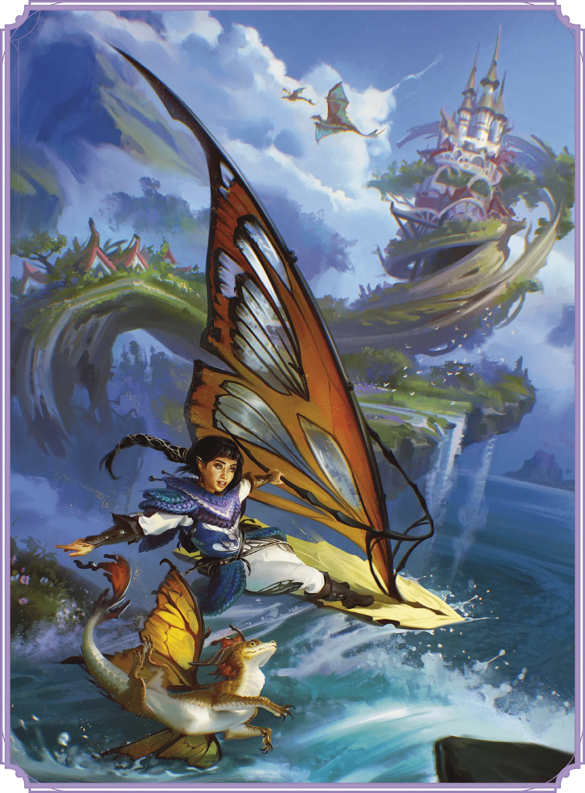

## Moonshaes Campaigns

Characters visit the Moonshae Isles for fairy tale adventures, seafaring epics, and stories of protecting nature from exploitation and defilement.

### Fairy Tales

Fey coexist with the people of the Moonshaes. This might mean welcoming a diminutive pixie into your home, lest it bedevil you with pranks; bringing gifts for sprites so they'll let you hunt in their forest; or asking the local hag for a favor.

The heroes of these tales are known for their wit and charm rather than their fighting skill, making these adventures perfect for young players or those who enjoy solving problems through roleplay, humor, and guile.

### Adventure at Sea

The sea surrounding the Moonshaes provides endless adventure in a challenging environment. Battles with pirates, bold raids ashore, and the hunting of fabulous sea beasts are made more perilous by harsh weather and the threat of drowning. Beneath the waves, heroes can encounter everything from sahuagin to storm giants.

### Eco-Fantasy

An insidious curse called the Rusting plagues the Moonshaes. Born from rapacious invaders and a vampire's dying words, the Rusting transforms verdant wilderness into metallic scrap, people into Constructs, and moonwells into pits of stinking oil.

The Moonshaes inspire stories about heroes who respect nature, attempt to restore it, and fight to preserve it.

> ##### Princess Caitlyn Kendrick
>
>The heir to the thrones of both High King Derid Kendrick and High Lady Ordalf, Caitlyn is a bold, curious, adventurous young woman comfortable among fey and Ffolk alike. She understands she's expected to unite the Moonshaes and lead the nation. While she loves her two families and the Moonshaes, she resents that she has no say in her own destiny. This resentment manifests when Caitlyn disobeys her parents, shirks responsibility, and revels with fey pranksters instead of attending court.
>

## People of the Moonshaes

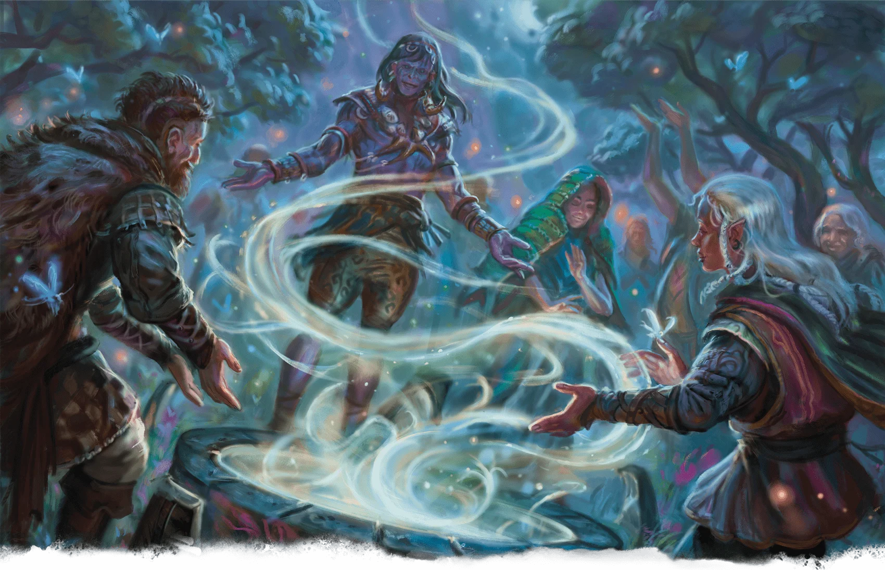

As the first settlers of the Moonshaes, giants established the kingdom of Ostoria. Elves followed long after Ostoria's collapse, inviting creatures from the Feywild to join them. Eventually humans, dwarves, and others followed suit. Of the varied cultures that now call these islands home, the most prominent are the Ffolk, Norlanders, fey, and giants.

### Ffolk and Norlanders

The two preeminent human cultures in the Moonshae Isles are Ffolk and Norlanders. Despite past wars between the two sides, Ffolk and Norlanders now coexist peacefully across the Moonshaes.

#### Ffolk

The humans of the southern Moonshae islands call themselves Ffolk. A peaceful but proud people, they show their respect for the land through their worship of the Earthmother, a nature god. Industrious and curious, Ffolk value laws, hard work, and education. They farm, herd sheep and hunt in the lowlands, and they form craft guilds, law courts, and militias for mutual defense. Ffolk navigate the isles in sturdy vessels built for fishing and hauling cargo.

The Kendrick family is Ffolk and has ruled the Moonshaes for over a century. Lesser noble families hold land on Alaron, Gwynneth, Moray, and Snowdown. Because these knights and barons each control only a small castle and a nearby town or village, petty feuds over land rights and old grudges occur regularly. High King Kendrick tries to keep his lords in line through a system of financial rewards, tax penalties, and land grants.

The Ffolk perform rites to placate the local fey: leaving pails of milk on the back porch, hanging bells around their homes, or reciting rhymes that name and flatter the fey while politely asking them to leave. The people of Waterdeep and *Baldur's Gate* dismiss these practices as quaint superstition, but these traditions have allowed the Ffolk to coexist with fey.

#### Norlanders

Norlander culture was born on the island of Ruathym, hundreds of miles north of the Moonshaes. Settlers reached the Moonshaes centuries ago, making homes on Norland, Oman's Isle, and many smaller islands. Norlander longships are feared along the Sword Coast for their speed and their crews' reputation for sudden, bloodthirsty raids.

Norlanders revere a bold and cunning hero-god named Valkur whose exploits include slaying monsters, winning fantastic treasures, and performing feats of physical prowess. Valkur was also a good father and husband, a wise and generous ruler, and a protector of his people. Norlanders admire these traits, but they have a cynical view of life and human nature. They believe the world is tragic and that all good things are temporary. Norlanders know every great hall will one day go up in flames and every hero will die, but they laugh in the face of fate and live well so they'll be remembered long past their deaths.

Norlanders in the Moonshaes have rulers known as jarls, typically one to each island. These jarls have sworn oaths of loyalty to High King Kendrick.

#### A Unified People

Ffolk and Norlanders warred with each other for over a century before the two cultures united under the Kendrick dynasty. Ffolk learned of Norlanders' generosity, love of life, and boldness, while Norlanders learned to appreciate the Ffolk values of hard work and determination. The two cultures shared agricultural and industrial strengths, including Ffolk animal husbandry and Norlander shipbuilding. While the Ffolk and Norlanders retain their own cultural identities—including manners of dress, cuisine, and musical tastes—the Ffolk and Norlanders often view themselves as a singular people, particularly in places where the two cultures intermingle most, such as on Alaron.

### Fey and Llewyr

When elves settled on the island of Gwynneth, they brought eladrin from the Feywild with them. Other fey followed until centaurs, pixies, satyrs, sprites, hags, and other creatures spread throughout the Moonshaes. The elves of the Moonshaes call themselves Llewyr. They resemble high elves in appearance but otherwise have the characteristics of wood elves and revere the Earthmother as Ffolk do. The elven realm gradually shrank over a millennia, and now only the hidden city of Chrysalis remains. Throughout the fading of the Llewyr society, the fey of the Moonshaes went ungoverned, answering only to their own archfey rulers.

Decades ago, an archfey named High Lady Ordalf came to the Moonshaes as part of an ancient prophecy that foretold the arrival of a mysterious curse that only she could cure—at the cost of her own life. She brought a city of eladrin with her to Myrloch Vale through the power of a mythal (see *Forgotten Realms: Heroes of Faerûn* for more on mythals), naming the city Karador and founding the realm of Sarifal in the surrounding lands. But enemies from the Feywild followed Ordalf and sank Karador beneath the great lake called Myrloch. She retreated to the great forest, now all that remains of Sarifal.

The eladrin of Sarifal call themselves shay. They specialize in circle magic and high magic (see *Forgotten Realms: Heroes of Faerûn* for more on these topics). Unlike other inhabitants of the Moonshaes, the fey are poor sailors. Instead, they navigate the islands through supernatural paths known as fairy trods. (See "Magic of the Moonshaes" below for more on fairy trods.)

### Giants

The Colossal Kingdom of Ostoria was born, ascended to greatness, and faded a millennia before the first elf set sail for the Moonshaes. Giants constructed homes in picturesque locations throughout the isles and topped the tallest peaks with fantastic castles. They brought ettins, trolls, ogres, dire wolves, winter wolves, and other monsters to the isles.

But giants' influence gradually faded. One by one, they abandoned most of their homes and castles. Llewyr, Ffolk, and Norlander settlers later repurposed the towering blocks used in these abandoned structures for walls and doors into everything from throne rooms to ritual sites.

But although giants' numbers have diminished, they live on every major island in the Moonshaes. Ffolk fear them, sharing fables about hungry giants able to smell Ffolk from miles away. Norlander heroes, however, sneak into giant steadings and steal golden trinkets. The giants meet these invasions either with violence or a weary sigh, depending on the giant whose goods were stolen.

Firbolgs act as ambassadors between giants and the Llewyr, fey, and druids of the Ffolk, while goliaths represent giant interests among merchants, crafters, and the Norlanders. Peaceful giants respect their firbolg and goliath allies, giving them places of honor and allowing them to govern themselves. However, fire, frost, and hill giants would rather subjugate their minions and rule by force. Goliaths and firbolg in such cruel situations cooperate with nearby settlements to escape.

#### Recent Threats

Recently, a longship fleet of fire, frost, and hill giants sailed to Oman's Isle from Maelstrom (see "Related Locations" below). They reclaimed their ancient steadings, driving out Ffolk and Norlander families.

Fomorians surface from the Underdark wherever the Rusting takes root. Many suspect a connection between fomorians and this strange curse.

## Magic of the Moonshaes

The Moonshae Isles are steeped in magic. Druids wield the primal magic of the Earthmother, opposing the bloodthirsty Cult of the Beast. Fey magic saturates the land, and islands can move or vanish overnight. Recently, an insidious supernatural curse has started slowly sweeping over the isles.

### The Earthmother

The Earthmother is the divine embodiment of the Moonshae Isles and its inhabitants. When life on the islands flourish, the Earthmother thrives. Her chief servants and priests are druids, but she is revered by Ffolk, Norlanders, elves, and fey alike. Druids taught local bards the secrets of the College of the Moon, and the druids are protected by everyone who wields nature magic or understands the fey. Every village has an elder respected for their understanding of the Earthmother.

The Earthmother has no churches or temples. Her devotees perform rites at moonwells, sacred springs ringed by standing stones and glowing with white light. Every moonwell is a direct connection to the Earthmother. The discovery of a new moonwell is an exceptionally holy event—a reassuring sign of the Earthmother's strength.

Environmental destruction, pollution, and the plundering of natural resources harm the Earthmother. The Rusting is a sign of this kind of harm and causes her constant suffering. The Rusting has already corrupted some moonwells, which the Earthmother feels as bleeding wounds.

### Cult of the Beast

Lycanthropes, violent humanoids, and evil fey in the Moonshaes worship Malar in an aspect called Kazgaroth, or simply "the Beast." Kazgaroth has manifested and been defeated multiple times. His natural form is a monstrous, demonic tyrannosaurus rex, but he is a shape-shifter who has adopted the form of everything from a dryad to Thelgaar Ironhand, the former king of Oman's Isle. The last time Kazgaroth appeared, he was defeated by the Kendrick family and their allies. This led to Tristan Kendrick's ascension as high king and the founding of the Kendrick dynasty.

Kazgaroth's most powerful followers are two tribes of evil lycanthropes collectively called the Red Shadow, based on the island of Moray. Members of the Red Shadow leave their deep forest dwellings to attack civilians at every opportunity, murdering all but one captive, whom they bring back to a moonwell for sacrifice. Kazgaroth's servants believe that if they sacrifice enough people to the moonwells, they can resurrect the Beast. Kazgaroth's cult extends to settlements throughout the Moonshaes; members of the cult gather information for the Red Shadow and spread their shape-shifting curse in secret.

### Fey Magic

Fey crossings—places where the Feywild touches the world—are common in the Moonshaes, especially on the isle of Gwynneth. Long ago, fey magic flowed out from these crossings and ran over the Moonshae Isles like imperceptible rivers. Fey magic is now so embedded in the land that it's hard to tell where the magic of the Feywild ends and the primal magic of the Earthmother begins. The most famous manifestations of fey magic are hollow hills and fairy trods.

#### Hollow Hills

A hollow hill is a small, low hill, typically with a single entrance framed by enormous stones. Anyone entering a hollow hill walks into a magnificent fairy palace. A hollow hill might be a fey crossing or a powerful magical effect that makes the space bigger on the inside than it is on the outside. Time can pass strangely inside a hollow hill, so visitors who spend months or years there might emerge to find only a day has passed.

#### Fairy Trods

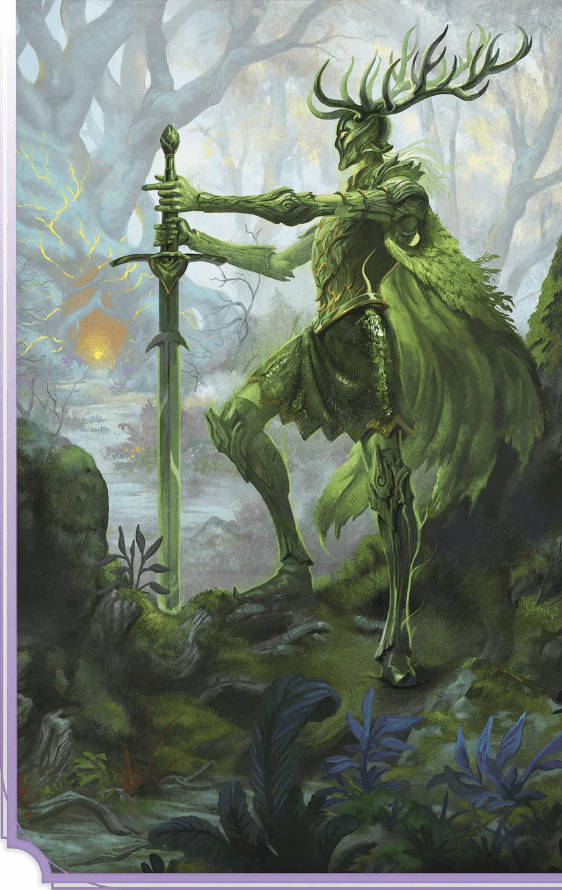

Fairy trods are magical pathways that lead through wilderness and connect islands together. Travelers on a fairy trod quickly reach their destination regardless of distance or terrain. Every fairy trod has a guardian, typically a dangerous fey. Guardians allow other fey to use the trod freely, but Humanoids must pass a test of the guardian's devising. See "Using Fairy Trods" for more information.

### Wandering Isles

Smaller Moonshae Isles that move are called wandering isles, and the precise details of their magical movement vary. In some cases, the island simply glides along with the current. Such islands move in a vaguely circular pattern that repeats over a period of years or decades.

Other islands vanish and reappear. Most reappear instantly in a far-off location, but islands can disappear for days, weeks, or years. Some of these vanishing islands go to the Feywild, and others sink beneath the waves. These disappearing islands can reappear anywhere, or they might cycle between recurring locations.

Because of these unusual properties, islands in the Moonshaes have unpredictable inhabitants and strange landmarks. A wandering isle might pick up fey creatures from the Feywild, travelers from elsewhere in Faerûn, or multiversal explorers. Wandering isles remain part of the Earthmother, and druids who serve her believe she uses wandering isles to spy on distant realms and recruit potential allies.

### The Rusting

The Rusting is a supernatural curse and contagion created by the dying words of Lady Erliza Daressin, Amn's former vampire governor of Snowdown. Those afflicted with the Rusting are compelled by the curse to perpetuate environmental destruction much as Amn did on Snowdown, threatening the Moonshaes and the Earthmother herself.

The Rusting typically appears where the Earthmother is harmed by pollution or the exploitation of natural resources, such as on Snowdown, where Amn dug open mining pits, cut down forests, and redirected waterways into pollution-filled swamps. For example, overfishing in the Bay of Norland brought the Rusting to Norland. Undead and Aberrations, especially fomorians, are common where the Rusting appears, but their connection to the curse is unclear.

The Rusting withdraws if the environmental damage that prompted it is addressed, but this is made more difficult by the curse itself. In addition, some individuals seek out the curse, considering the Rusting a path to strength, power, and extended life. These Rusted intentionally cause environmental damage to spread the curse. The leader of these individuals is the self-proclaimed **Queen Forfallen** (see *chapter 9*), who sails the Moonshae Isles as a vengeful pirate.

#### The Rusting

*Magical Contagion*

The Rusting manifests as a thin, iron coating that grows over a victim's body. When exposed to moisture, this iron skin corrodes into a rust-colored plaque. As the Rusting covers the victim, the victim eventually transforms into a type of creature known as a Rusted (see *chapter 9*).

Any creature that is wounded by a Rusted creature or spends 1 hour in an area where the Rusting has manifested makes a DC 10 Constitution saving throw. Constructs and Undead automatically succeed on this save. On a failed save, the creature is afflicted by the Rusting and suffers the following effects:

- **Curse.** The creature gains 1 Exhaustion level and is cursed. While the creature is cursed, finishing a Long Rest doesn't reduce the creature's Exhaustion level.
- **Plated Joints.** The creature's Speed is reduced by 5 feet.
- **Rusted Fate.** When a cursed creature's Exhaustion level reaches 6, it doesn't die. Instead, the creature transforms into a Rusted version of its former self; its creature type becomes Construct, and it gains Immunity to Poison damage and the Exhaustion, Petrified, and Poisoned conditions. The curse then ends for that creature.

***Fighting the Contagion.*** Daily at dawn, an afflicted creature makes a DC 10 Constitution saving throw. On a failed save, the creature gains 1 Exhaustion level as more iron coats its skin. On a successful save, the creature's Exhaustion level decreases by 1. If the creature's Exhaustion level is reduced to 0, the contagion ends on the creature.

Removing the curse immediately ends the contagion for a creature.

## Navigating the Moonshaes

In the Moonshaes, getting from one island to another can be a challenge. While most Ffolk and Norlanders rely on boats and ships to sail the isles, adventurers might use other avenues, including magical pathways known as fairy trods.

### Moonshae Vehicles

The people of the Moonshae Isles employ various vessels to travel between islands. The waterborne vehicles described in the *Player's Handbook* are most commonly used, while fortunate people might have a *Windskiff* (see *chapter 8*).

In addition, the following vehicles are frequently used in the Moonshae Isles.

#### Ffolk Sailing Ship

Ffolk craft durable sailing vessels that can handle even the roughest waters in the Moonshae Isles.

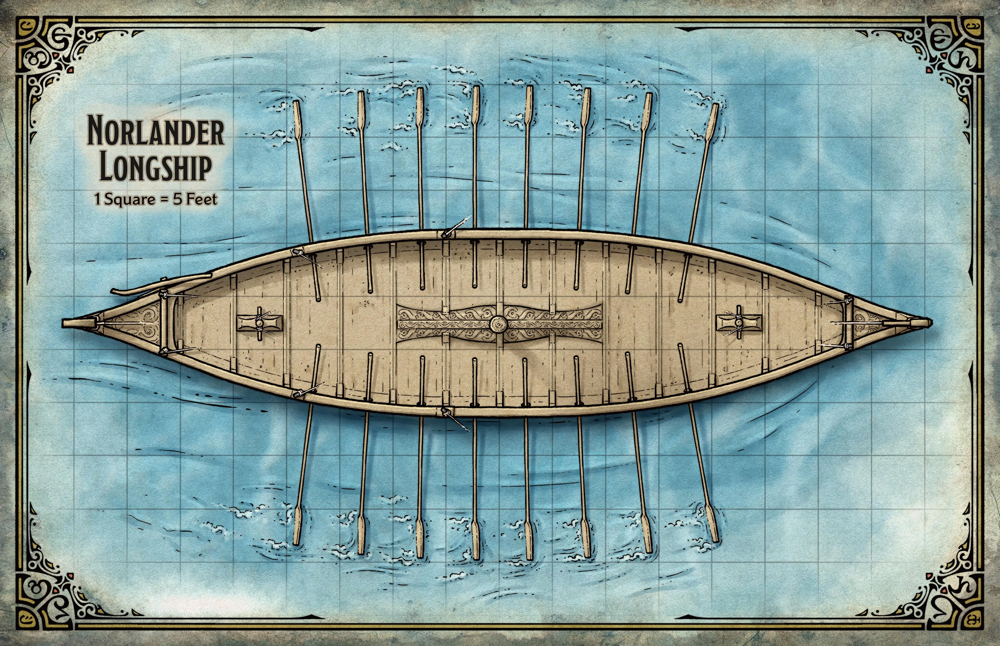
#### Norlander Longship

Norlanders use longships of their own design for extended voyages, raids, and whaling expeditions. These longships are renowned for their speed. During whaling expeditions, these longships frequently carry up to three Whaleboats (see below).

#### Rusted Hulk

Rusted warriors conduct raids using mighty warships. **Queen Forfallen** and her allies strengthen these hulking vessels by adding rusty metal plates to their hulls.

#### Whaleboat

Whaleboats are light, specialized craft deployed when Norlander longship crews spot their quarry. They carry six rowers and a single harpooner armed with spears.

##### Moonshae Vehicles
| Ship                 | Speed | Crew | Passengers | Cargo (Tons) |  AC |  HP | Damage Threshold | Cost      |
|----------------------|:-----:|:----:|:----------:|:------------:|:---:|:---:|:----------------:|-----------|
| *Ffolk Sailing Ship* | 2 mph |  20  |     20     |      100     |  15 | 400 |        20        | 20,000 GP |
| *Norlander Longship* | 6 mph |  50  |     100    |      10      |  17 | 300 |        15        | 20,000 GP |
| *Rusted Hulk*        | 2 mph |  60  |     90     |      250     |  18 | 500 |        25        | 50,000 GP |
| *Whaleboat*          | 3 mph |   6  |      1     |       –      |  13 | 100 |        10        | 500 GP    |

### Moonshaes Terrain

Chapter 2 of the *Dungeon Master's Guide* provides rules for travel. But the Moonshae Isles have unusual environmental conditions, especially for waterborne travel. While traveling through one of the special terrains below, replace the normal Encounter Distance, Foraging DC, Navigation DC, and Search DC with that terrain's entries in the Moonshaes Travel Terrain table.

##### Moonshaes Travel Terrain
| Terrain         | Encounter Distance | Foraging DC | Navigation DC | Search DC |
|-----------------|:------------------:|:-----------:|:-------------:|:---------:|
| Dead Calm       |    6d8 × 10 feet   |      15     |       10      |     10    |
| Entangling Kelp |    2d6 × 10 feet   |      15     |       10      |     15    |
| Reef            |    4d6 × 10 feet   |      10     |       15      |     15    |
| Rusted Sea      |    2d6 × 10 feet   |      20     |       10      |     15    |

#### Dead Calm

This describes a water region with no wind. The sea is completely flat, and vehicles that rely solely on sails can't move.

#### Entangling Kelp

Entangling kelp is a magical phenomenon where seaweed growth is unnaturally dense, clinging to passing vessels and impeding their progress. A vehicle moving through Entangling Kelp can move no faster than 1½ miles per hour.

#### Reef

The Moonshaes are littered with dangerous reefs known only to experienced sailors and local guides. Failing to navigate a reef can result in severe damage to a ship or even the ship's destruction. Reefs are populated with aquatic creatures.

#### Rusted Sea

A water area where the Rusting has manifested is covered in thin, stinking oil. This water is hazardous to aquatic life.

### Using Fairy Trods

Fairy trods are magical paths that connect the island of Gwynneth to Alaron, Moray, Oman's Isle, and Snowdown. Fairy trods appear only on islands that hold moonwells. Using a fairy trod requires the permission of the trod's guardian, but with that granted a traveler can cross great distances and impassible terrain in a short time.

#### Finding Fairy Trods

As a Study action, a creature can search for a fairy trod within 1 mile of their current location and make a DC 15 Intelligence (Arcana) check; a creature that has used this fairy trod before has Advantage on this check. On a successful check, the creature discovers the shortest path to the nearest fairy trod, if any.

#### Fairy Trod Guardians

Every fairy trod has a guardian, and they change over time. It is possible for characters to encounter a new guardian each time they use the same trod. A guardian is usually a Fey such as a Centaur **Druid**, **Dire Worg**, **Green Hag**, or **Satyr Revelmaster**. Most guardians are initially Indifferent to the characters. The guardian appears to anyone attempting to use the trod and puts them through a test. This test can take varying forms, such as a duel, a riddle game, or a poetry contest. If the party completes the test or if the guardian becomes Friendly, the characters can use the trod.

#### Traveling via Fairy Trod

While using a fairy trod, characters feel like they are traveling through an ordinary path in the wilderness, but the journey takes less time and ignores impassable terrain such as water and mountains. Travel time along fairy trods can vary, but typically 1 minute of travel on a fairy trod is equivalent to 1 hour of travel elsewhere. After the requisite amount of time spent traveling, the party arrives at their destination. Characters can pause along the trod and camp there safely, but leaving the trod before reaching the destination causes them to emerge at a random point in the Moonshae Isles.

*Fairy trods are a great way to sneak off to a fairy revel, hang out all night with friends your parents don't approve of, and still be home before sunrise, not that I know anything about that.*— Caitlyn Kendrick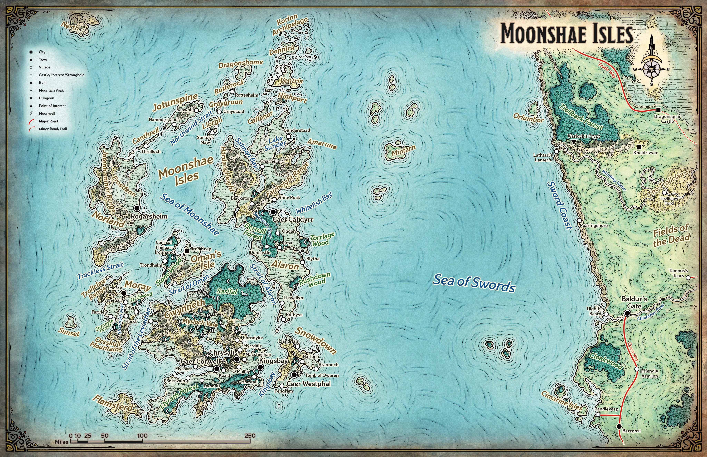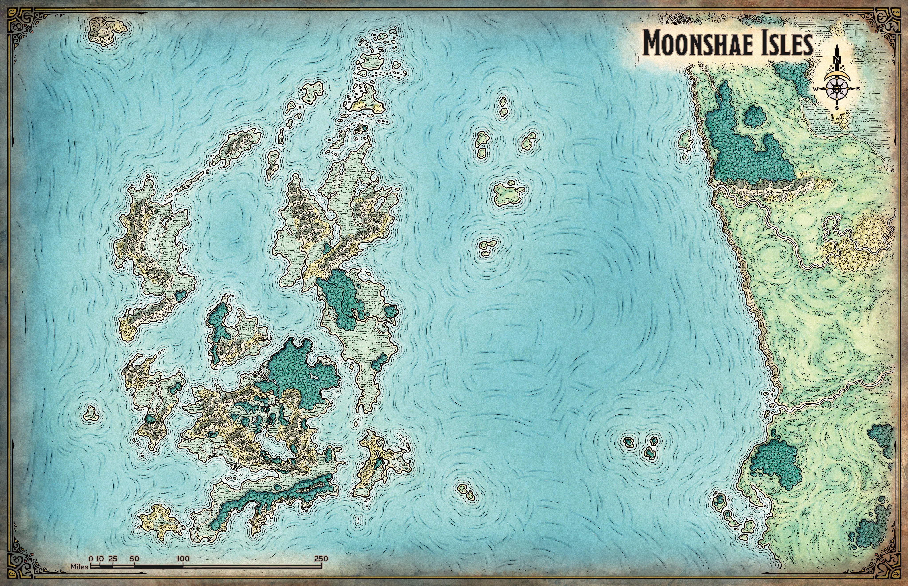
## Moonshae Gazetteer

This gazetteer provides overviews of the seven largest islands of the Moonshaes:

- **Alaron**. Home to the largest Ffolk populations and Caer Calidyrr, Alaron is the seat of High King Derid Kendrick.
- **Gwynneth**. The most magical of the Moonshae Isles, Gwynneth's power centers around Myrloch Vale and the fey kingdom of Sarifal.
- **Moray**. An island overrun by werewolves and other monsters, Moray has become a refuge for evil.
- **Norland**. The isle of Norland stands proud as the heart of Norlander culture in the Moonshaes.
- **Oman's Isle**. Once a symbol of Norlander power, giants and evil fey now rule this island.
- **Snowdown**. Rich in mineral resources, Snowdown was briefly conquered by the nation of Amn.

More than a hundred smaller isles surround these seven. Some of these isles move or vanish altogether, slipping into the Feywild or other planes. This makes the Moonshaes best navigated by ship or, for the brave, by *Windskiff* (see *chapter 8*).

### Alaron

The largest isle of the Moonshaes, Alaron stretches 250 miles north to south but only 40 miles across at its middle. Norlanders settled in the mountainous northern half of the island and founded the realm of Gnarhelm while Ffolk made their home in the forested and fertile south. These two peoples saw each other first as enemies, then as rivals, then as family.

Northern Alaron is swept by vicious storms and has little agricultural land. Nevertheless, Norlanders can eke out a living working long months at sea. Meanwhile, Ffolk in the south have grown so prosperous their minor lords regularly skirmish over rights to forests and farmland.

The commonalities between Ffolk and Norlanders are on full display on Alaron, where these two cultures intermingle freely. Norlanders and Ffolk are proud warriors, valuing boldness and the keeping of oaths. The Norlander love of the sea is mirrored by the Ffolk respect for the land. Most citizens of Alaron claim both Norlander and Ffolk kin.

High King Cymrych Hugh brought Norlanders and Ffolk together a thousand years ago, building an alliance that included dwarves and elves. Now the Ffolk Kendrick family rules the isles, and the Norlander jarl of Gnarhelm answers to High King Derid Kendrick.

#### Caer Calidyrr

The seat of High King Kendrick's power, Caer Calidyrr is the center of trade and diplomacy in the Moonshaes. Properly speaking, the name "Caer Calidyrr" applies only to the ancient castle that overlooks the city of Calidyrr. This sprawling fortress was raised by Cymrych Hugh, first high king of the Isles, and includes abandoned underground levels.

Now in his sixties, High King Kendrick has learned from the misfortunes of his youth and has become a consensus builder with a keen eye for detecting deception. He is a member of the Lords' Alliance and a patron to its agents. When not keeping court, he travels south to Caer Corwell to visit his daughter, son-in-law, and granddaughter.

Ffolk and Norlanders mingle on the busy wharves of the city, where traders from the Sword Coast unload weapons, armor, a dizzying array of alcoholic beverages, and rare magical components collected across Faerûn. Meanwhile, Moonshae merchants sell everything from fish and lumber to jewelry and ambergris. The rough-and-tumble mix of sailors, merchants, and soldiers makes the city dangerous after dark, especially near the docks. Zhentarim money has opened many doors and now funds a warehouse that serves as a foothold for Zhentarim activity in the Moonshaes.

#### Dernall Forest

The largest forest in Alaron is home to violent gangs of goblins, hobgoblins, and bugbears that prey on hamlets within the forest, travelers, and each other, sometimes raiding farms in southern Alaron. Packs of **Worgs** roam through these woods and cooperate with the goblins.

The Swanmay River provides shelter to forest guardians known as **Swanmays**, fey with the ability to change into swans (see *chapter 9*). They seek heroic folk to help them restrain the goblins and restore harmony to the forest.

#### Fairheight Range

These mountains, and the vast tunnel complexes that run under them, were claimed by dwarves and orcs long ago. The war between these two groups has been interrupted by swarms of Undead, trolls, and creatures from the Shadowfell, led by a mysterious **Shadow Dragon**.

The dwarves of Clan Rookoath have old ties to the high king, and the high king believes the only hope of victory is for Rookoath to ally with their traditional enemies, the Proudfury orcs, and confront the shadow dragon together. But so far his attempts to bring Rookoath and Proudfury representatives together have been fruitless, as the orcs consider him to be on the side of the dwarves.

#### Gnarhelm

The northern half of Alaron is governed by Jarl Scyld Sundersing (Medium **Warrior Veteran**), a young human who respects the high king but is eager to establish his own heroic reputation in battle. The people of Gnarhelm work as miners, shepherds or goatherds, and mercenaries. They are fierce, heavily armored fighters who wield long axes, riding horses to battle but fighting on foot. Scyld keeps a personal guard of a hundred of these warriors and urges the high king to use them at every opportunity.

An **Ancient Copper Dragon** named Nymmurh lairs in a complex of twisting caves in the northern end of the Hardangheight mountains. Nymmurh is a patron of the Silmerhelve family in Waterdeep, leading him to spend time away from his lair. The Cult of the Dragon has found the lair and hopes to plunder its greatest treasures while Nymmurh is away, then ambush him on his return.

#### High King's Road

The High King's Road is the lifeblood of Alaron. Beginning at the southern tip of the island in Kythyss—a village infamous for smugglers, thieves, and bloodthirsty mercenaries—the road cuts through the lush farmlands of Bregonshire and the county of Stirgewick. It also provides the safest route through Dernall Forest. From Caer Calidyrr, the road branches west to Blackstone and north to White Rock. It is the high king's responsibility to keep the road safe. But the road is long, and adventurers patrol the road, helping the king with everything from worgs of the forest to Zhentarim smugglers, and even the occasional border war between feuding nobles.

#### Moonwells

The Earthmother graces Alaron with several moonwells. The northernmost is near the cairn of Cymrych Hugh, where the first high king of the Isles was buried. Cymrych Hugh possessed fabulous treasures that became symbols of his rule, including a crown fashioned by dwarves, a silver sword forged by elves, and a ring given to him by his wife, Allisynn. The crown and sword were later recovered by the Kendricks and became royal heirlooms, but the ring has never resurfaced; many believe it to still be around Cymrych's finger. Other moonwells are located in Rushdown Wood, in Torriage Wood, and tucked into the northwest corner of the Dernall Forest.

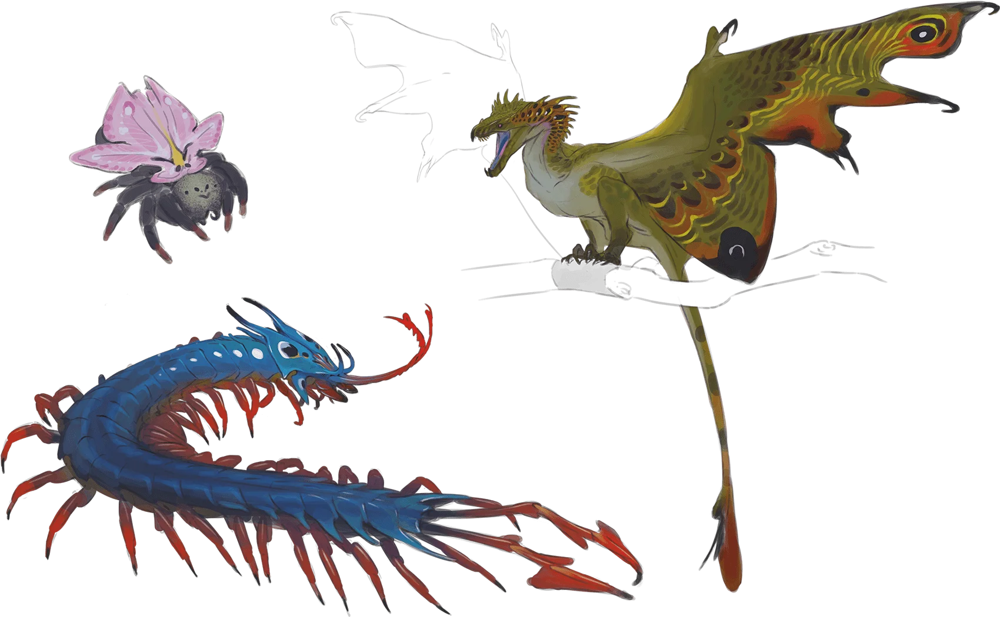

### Gwynneth

Gwynneth is the magical heart of the Moonshaes and the center of the Earthmother's power. The island holds more moonwells than the rest of the Moonshaes combined. Fey are numerous here and maintain their own realm in the forest of Sarifal. Following the retreat of High Lady Ordalf's incursion, Norlander families are returning to reclaim homesteads in the mountainous north, and the Kendrick family has rebuilt their old castle Caer Corwell. Elves maintain the hidden city of Chrysalis in the mountains, and Rustfire dwarves (whose ancestral name has nothing to do with the Rusting curse) dwell in the mountains northeast of Myrloch. Most Gwynneth settlements are built on the ruins of ancient elven communities that date back more than ten thousand years.

The fierce storms that plague the rest of the Moonshaes are less frequent on Gwynneth, though rain is common and leaves all it touches fresh and sweet smelling. Indeed, everything on Gwynneth carries a little enchantment. The mountains rise with stark majesty, and the forests loom deep and mysterious. The fabled Myrloch Vale stands at the center of this magic.

The magic of Gwynneth makes it perilous. Bullywugs proliferate in the wetlands lining Gwynneth's coast, and **Displacer Beasts** lurk in every forest and mountain vale. The Rusting, however, hasn't touched Gwynneth. The communities here are so magically isolated from the rest of the isles that their inhabitants haven't even heard of the Rusting. If the curse reaches this island, the Earthmother herself would be in peril.

#### Caer Corwell

The ancestral home of the Kendrick family, Caer Corwell fell into ruin after High Lady Ordalf's arrival. The castle was the lair of evil and mischievous fey for years, but after Ordalf's retreat to Winterglen, the Kendricks returned to Caer Corwell and rebuilt it. The reconstruction effort brought merchants and crafters aplenty, and the settlements of southern Gwynneth are thriving for the first time in a century. There's always more to do, such as driving back bullywugs in the Fens of the Fallen or hunting **Displacer Beasts** in Llyrath Forest.

Princess Tarilyn Kendrick leads this resurgence. Her marriage to Prince Araithe, Ordalf's son, was born out of tragedy and political necessity, but the couple found happiness. Tarilyn brings intellect and diplomacy to this relationship, and she is beloved by Ffolk and Norlanders alike. Araithe set aside his sword and armor and spent most of the last two decades raising the couple's daughter, Caitlyn Kendrick.

#### Chrysalis

The elven city of Chrysalis lies hidden within mountains at the southeast corner of Myrloch Vale. Powerful illusions hide the city from the air, and a thick fog conceals the mountain passes. No one can reach the city without a guide.

Chrysalis stands at the center of a lake cradled by these mountains. The Serene Matriarch Ate Onah (Medium **Noble Prodigy**), a young elf of a mere two centuries, rules Chrysalis. After rescuing a Harper near death in the mountains, she agreed to open the city to visitors. Since then, a small community of gnomes has settled in Chrysalis, building two-story cottages among elven towers of glass, silver, and crystal. Harpers use the city as their base in the Moonshaes.

#### Kingsbay

Once a quiet settlement on Gwynneth's southeastern shore, Kingsbay was the primary port through which Ffolk returned to the island after Ordalf's withdrawal to the forest. It's become a boomtown in the last few years, where anyone looking to strike it rich, escape an unpleasant situation at home, or run from the law can find what they need. There's always another merchant caravan, military patrol, or wagon train setting out, and no one has time to ask questions.

This busy, get-rich-quick atmosphere allowed Vvim Toth (Medium, Neutral Evil **Archmage**), a human Red Wizard of Thay, to establish a Thayan enclave in Kingsbay, ostensibly providing magical services to well-paying merchants and mercenaries. In truth, Toth seeks information on the moonwells and the secret rites of the Moonshae druids, hoping to use them to fuel his rise to power in Thay.

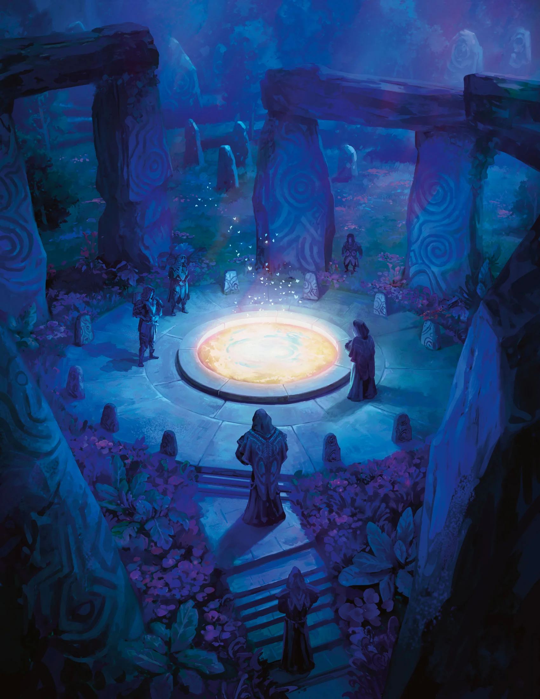

#### Myrloch Vale

A forested valley with an ancient connection to the Feywild surrounds the lake known as Myrloch, framed by multiple mountain ranges. For centuries, fey creatures have crossed the border between worlds in the Vale, and enough have stayed to make the vale home to a bewildering population of fey. Here, centaurs ride in herds, pixies and **Sprites** flit through the air like starlings, and packs of **Blink Dogs** patrol the trails. Ancient forests are home to dryads and treants. Faerie dragons are especially common here. Druids work with bards of the College of the Moon to keep the peace, monitor moonwells, and perform rites to honor the Earthmother. Agents of the Emerald Enclave come here to train.

#### Karador

The fairy city of Karador lies beneath the waters of Myrloch. Once home to High Lady Ordalf and thousands of fey, the city sank beneath the waves when the magic of its mythal was broken. Treasure hunters and explorers probe the sunken ruins, preyed on by **Sea Hags**, sahuagin, and giant sea beasts.

#### Sarifal

When Karador sank into Myrloch, High Lady Ordalf led the survivors north into the forest of Winterglen. She drove out the arch-hag Urphania and moved into Castle Umbra, Urphania's old fortress. This deep and dangerous pine forest is now all that remains of the kingdom of Sarifal, which once encompassed all of Gwynneth. Ordalf still rules here, assisted by eladrin who survived the sinking. She is vastly weakened and has been forced to accept evil fey into her court.

Although fey of every kind dwell here, the Shadowfell has corrupted flora and fauna alike. Trees crowd around trespassing travelers, herding them to their doom deep in the forest; packs of **Worgs** and **Displacer Beasts** prowl unchecked; **Swarms of Stirges** feast on the slow and the dead.

#### Storaad

Norlanders settled the mountains around Myrloch Vale but were driven out by Ordalf's fey. Now they're reclaiming their old family homesteads without permission from the high lady or high king. Storaad, a village on the west coast of Gwynneth, is the launching point for these resettlement efforts, which must navigate through the mountains surrounding Myrloch.

In contrast to Alaron, most of the moonwells on Gwynneth are in the north near abandoned Norlander settlements. Norlanders come to these moonwells to commune with the Earthmother. The Rustfire dwarves fled Gwynneth a century ago through tunnels to Alaron. Recently however, these dwarves have reopened the mines in these mountains. Conflict between Norlander families and Rustfire miners has already led to tragedy and could soon erupt into warfare.

### Moray

Moray sees the most violence in the Moonshaes. Vicious lycanthropes, enigmatic lizardfolk, mighty giants, proud orcs, Norlanders in thrall to the Rusting, and loyal soldiers of House Kendrick fight for control over the island.

Hundreds of **Werewolves** and other evil lycanthropes who follow the Cult of the Beast live here, forming packs around the island's two moonwells. The Red Moon pack lives in the Shannyth Forest to the south, while the Shadow Moon pack lives in the Tarthwood. Together these groups are called the Red Shadow, and they raid settlements across Moray for captives to sacrifice. Attempts to rescue these captives before their gory death seldom succeed.

#### Breasal Marsh

Lizardfolk dwell in Breasal Marsh around the Shannyth River. They desire to be left alone, but their position in the center of the island means every other faction on Moray simultaneously trespasses on their land while coveting their allegiance. Red Shadow raiders are so fierce that lizardfolk make no attempt to stop them when they cross the marsh, but they drive other intruders off with force and elemental magic.

#### Caer Moray

High King Kendrick built a stout stone fortress at Caer Moray to guard the port. The garrison includes hundreds of armored cavalry who escort trade shipments to villages on the east side of the island. Stubborn civilians inhabit the villages of Dynnegal, Kork, and Horst, which make up Kendrick's domain on Moray. They refuse to leave their homes, no matter how dangerous the island becomes. These insular Ffolk developed elaborate customs to avoid lycanthropes, lizardfolk, and orc raiders, such as wearing special clothing to camouflage themselves or traveling only during certain hours of the day.

#### Dennin's Delve

Giants and giant kin live in the Trollclaw mountains on the north end of Moray and have built a new home for themselves above the remains of Dennin's Delve, an ancient dwarven stronghold. A portal connects tunnels beneath Dennin's Delve with old tunnels under the Fairheight Range in Alaron, and the **Shadow Dragon** menacing the dwarves and orcs of Alaron has sent its minions to Dennin's Delve. The giants responded by locking the tunnels, and a small band of heroic goliaths later appointed themselves watchers of the locked door. They stand vigil to this day.

#### Farview

Razed by the Red Moons a century ago, Farview has become a factory for Norlanders embraced by the Rusting. The Rusted chop down the Shannyth Forest, dredge the Breasal Marsh for treasures, and reopen old dwarven mines in the Trollclaws. These raw materials are converted into tools for further resource collection. The high king longs to dislodge these Rusted, but the settlement is protected by imposing walls and fierce warriors.

#### Orcskull Mountains

The orcs of the Orcskull Mountains value crafting skill. They live in small family groups focused around a central forge; the smoke from these forges creates a gray pall over the entire range. Although they aggressively defend these mountains, they avoid Highpeak, the tallest mountain in the range. Highpeak is famously haunted by a **Banshee**, the spirit of a mother whose four sons died in battle. Her wails can be heard for miles. She supposedly dwells in a glass castle, but it hasn't been found.

### Norland

*Are Norlander pirates dangerous, bloodthirsty mercenaries likely to murder you and loot your corpse? Yes. Are they more fun to hang out with than just about anyone this side of the Feywild? Also yes.*— Caitlyn KendrickLong ago, Norlanders from Ruathym arrived on the coast of Norland. Some pushed on toward Oman's Isle, but most remained in Norland, making it the heart of Norlander culture.

This is a hard country with cold winters, frequent storms, and little arable land for farming, but Norland forges its inhabitants into heroes. Boats ply the surrounding waters and sell their catch at Rogarsheim for high profits. The Jotunhammer mountains are a rich source of rare gemstones and valuable ores including copper, iron, silver, and gold. People are free to live the life they make for themselves, and their deeds are remembered by family, friends, and jarl alike.

Some Norlanders instead embrace piracy. Norlander pirates don't target other Norlanders; they take their longships across the Sea of Swords to capture merchant vessels from Neverwinter, Waterdeep, and *Baldur's Gate* instead. Some Norlanders attack inland, raiding villages and religious buildings along the Sword Coast.

The Rusting, however, poses new challenges. It has reached the overfished Bay of Norland. Rusted zones threaten the livelihood of fishers, whales beach themselves on the coast and die, and monsters capsize longboats to prey on their crew.

Norland's jarl is the human Olfsvenn (Medium **Warrior Commander**), son of Olfgaut, son of Rault the Wise. He has sworn oaths of loyalty to House Kendrick but keeps a terrible secret: his sister Renauta embraced the Rusting and became **Queen Forfallen**. She is now gathering Rusted allies. Driven by the vain hope that he can redeem his sister, Olfsvenn corresponds with Forfallen through letters carried by trusted couriers. When she asks him for favors and information, such as key supplies or knowledge of lucrative targets for piracy, Olfsvenn occasionally obliges her by directing her against his enemies and rivals. Jarl Olfsvenn maintains Stormbanner Hold, a fortress and feasting hall outside the city of Rogarsheim. Famous for his hospitality, Olfsvenn's generous gifts have bought him the loyalty of many followers. But if the gold were to run out, the jarl might find himself alone.

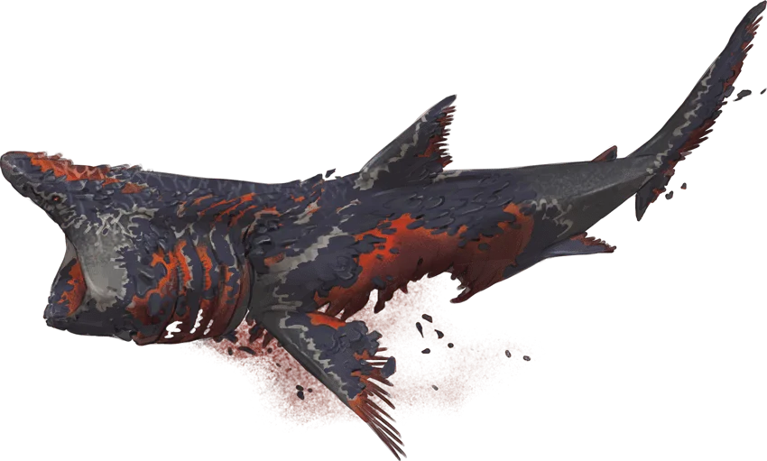

#### Frostfenn

The Frostfenn fills central Norland. Home to creatures of ice and snow, this frozen marsh is the lair of a **Werewyvern**, a mysterious individual who transforms into a dragon (see *chapter 9*). Purple Dragon Knights travel to Norland to hunt it down.

#### Jotunhammer Range

**Cloud Giants** and **Stone Giants** keep steadings in the Jotunhammer Range. These mountains were once part of the giant kingdom of Ostoria, and the giants remember its former glory with pride. Oblivious to this legacy, Norlanders intruded on giant enclaves for centuries, attempting to prove their heroism with violence or cunning thefts. Many of these adventures ended in tragedy. Eventually goliaths, firbolgs, and dwarves migrated to the Jotunhammer Range and acted as intermediaries between Norlanders and giants, forging peace treaties. Nevertheless, brave adventurers still try to sneak into giant holds to prove their valor or recover some lost family heirloom, and sometimes they return alive.

The Tvarstoldt tar pits lie in the Jotunhammer Range. The Rusting has turned these oozing black pools into a source of Undead and Aberrations. Droves of **Fomorians** lair there and thwart attempts to heal the land. They also threaten a lighthouse north of the pits, built by Ostorian giants and maintained by the jarl's coffers. The lighthouse warns sailors away from the area's treacherous rocks. The fomorians plan to claim the lighthouse and extinguish its lamp.

#### Norheim Isles

The islands of Canthrell, Jotunspine, Llorgh, Graygruun, Rotterock, and Dragonshome are collectively known as the Norheim Isles. This grouping also includes many smaller islands, some too small to support a single Norlander family. The people here barely sustain themselves through fishing and hunting and often turn to raiding or piracy. Small villages are built around a few extended families.

In these harsh conditions, a single bad season can spell the end for an entire community. As insurance against famine, the locals hunt whales with personally marked spears. Elaborate laws divide whale meat fairly among all whose spears contributed to slaying the whale, although hunters often feud over what constitutes their fair share.

#### Rogarsheim

Rogarsheim is the bustling capital of Norland, well defended from Rusted raiders by Jarl Olfsvenn's sizable fleet and made rich through the bounty of the sea. Merchants from the Sword Coast buy fish, whalebone, ambergris, coral, pearls, and rare magical and alchemical ingredients. Shipbuilding is a key industry here, and visitors from across Faerûn come to purchase ships or learn from Norland shipwrights. Goliaths, firbolgs, and dwarves live alongside Norlanders and visiting Ffolk. Purple Dragon Knights maintain a base in Rogarsheim, using it to hunt the werewyvern and investigate the island of Dragonshome to the east. Their fantastic steeds have made the knights a legend among the children of the city. Many aspire to become squires and one day ride a dragon of their own.

Signs of the Rusting are evident in the city after years of pollution and overfishing in the Bay of Norland. The water has an oily sheen and a chemical smell, and a thin skin of rusty iron creeps up the timber logs of Rogarsheim's piers. Dockworkers sometimes fall prey to the curse. Ships that show signs of the Rusting are towed out to the middle of the bay and set on fire.

### Oman's Isle

Oman's Isle was once peaceful and picturesque. Norlander families built settlements on the ruins of the old giant kingdom of Ostoria and farmed, kept sheep, and worked mines in the highlands. The last king of Oman's Isle, Thelgaar Ironhand, remains a folk hero among Ffolk and Norlanders alike.

#### Cairn of Thelgaar Ironhand

The only moonwell on Oman's Isle lies in the Stone Wood. Thelgaar Ironhand was buried in a stone cairn within this grove, surrounded by menhirs. A small band of druids and bards struggles to keep the grove safe, concealing it with magic to avoid being crushed by giants or the Rusted. But every year, the violent inhabitants of the isle draw closer to discovering the grove's location. No one knows what the giants would do with the grove, but the lord of Iron Keep's intentions are clear: to plunder the cairn and corrupt the moonwell with the Rusting.

#### Giant Steadings

Years ago, a coalition of giants from Maelstrom returned to Oman's Isle in enormous longboats, driving the previous inhabitants out of their homes and across the water. Now the giants live in small but well-established steadings across the isle, especially where Ostorian ruins were left intact in the Grampalt Highlands. **Hill Giants** cluster on the eastern slopes, protecting their steadings with kennels of **Dire Wolves**. **Frost Giants** occupy the western highlands, which are covered in freezing rain and snow. Under the shadow of Icepeak, the region's tallest mountain, frost giants herd **Giant Goats**, build ships, and raid Gwynneth from across the Strait of Oman. **Fire Giants** reopened the old Norlander mines underneath the highlands and sell the ore they find to Iron Keep in exchange for treasures gathered in Rusted raids.

#### Iron Keep

Norlanders constructed Iron Keep on the site of an Ostorian fortress, and it was once their greatest stronghold. From here, Thelgaar Ironhand ruled as king of Oman's Isle. The Norlanders of Oman's Isle joined the kingdom after his death, and Iron Keep was a jewel in the Kendrick crown.

Iron Keep was abandoned when the giants invaded Oman's Isle, and it lay empty for decades. Now it is home to Axenwight (Medium, Chaotic Evil, Rusted **Pirate Captain**; see the "Other Rusted" sidebar in *chapter 9*), one of **Queen Forfallen's** chief lieutenants. No one knows why the giants tolerate Axenwight's presence in Oman's Isle, but rumor has it that the queen cut a deal with the fire giants, and the frost and hill giants followed along according to giant custom.

Although he's proclaimed himself jarl of Oman's Isle, Axenwight controls only the area around Iron Bay. From here, he harvests from the Stone Wood, buys ore from giants, and builds ships and weapons for **Queen Forfallen's** war machine. His desire to plunder Thelgaar Ironhand's tomb draws treasure seekers who promise to satisfy Axenwight's greed. However, expedition attempts have failed, and Axenwight doesn't tolerate failure.

#### Trondhelm

The birthplace of Thelgaar Ironhand, Trondhelm was devastated after giants overwhelmed Oman's Isle. In the years since, the village has become a settlement for creatures who serve giants or associate with them: firbolgs, goliaths, ettins, ogres, and cyclopes. These new inhabitants expanded the old village by reclaiming building stones from ancient Ostoria, assembling homes that suit their stature. Life in Trondhelm is brutal, but it's the only place in Oman's Isle where traders can do business with the giants. For more on Trondhelm, see "The Treaty of Ostoria" later in this chapter.

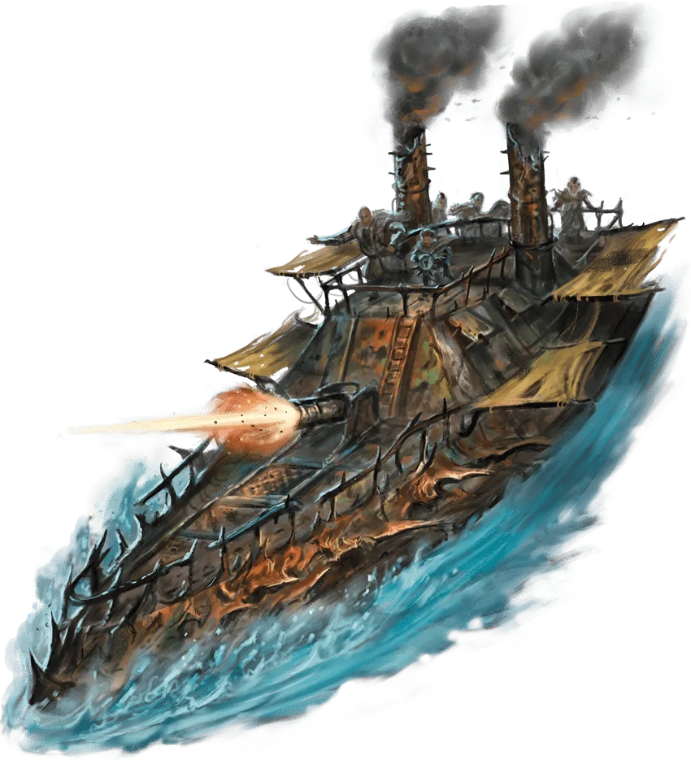

### Snowdown

Snowdown's history is rife with sorrow and devastation. Located on the south end of the Moonshaes, Snowdown was protected from harsh weather by Gwynneth in the west and was once the most temperate and fertile of the isles. Ffolk dwelled there on quiet and peaceful farms. They left the rest of the violent Moonshaes alone and expected to be left alone in return.

During the Amn invasion a century ago, the enigmatic and cruel vampire Erliza Daressin took over the island. Amn soldiers plundered Snowdown's rich natural resources, stripping mines bare and chopping down forests. Waterways were redirected into open mines or other industrial projects, creating toxic ponds. The invaders crushed local resistance with impunity. Then Erliza headed off retaliation from High King Derid Kendrick by abducting his only son, Owaren.

Owaren died trying to escape, a tragedy that united High King Kendrick and High Lady Ordalf. Derid's daughter, Tarilyn Kendrick, and Ordalf's son, Prince Araithe, led a united army against Caer Westphal, and Tarilyn's magic permanently destroyed Erliza. However, the vampire's dying words became a curse that plagues the Moonshae Isles to this day.

The Rusting first manifested at Snowdown's only moonwell, located near the center of the island. Amn mercenaries had chased off the moonwell's druid. Without its protectors, the waters of this moonwell turned to a slick, glistening oil, its surrounding stones withered to rust, and the trees of its grove whitened and died. Meanwhile, attempts to rein in the environmental destruction caused by Amn have ended in disaster. When a dam blocking the Harloch was demolished, a crushing wave of floodwaters mixed with open mines, reducing southern Snowdown to a putrid swamp.

Decades after Erliza's defeat and the withdrawal of Amn, Snowdown is a blight on the Moonshaes. A few small settlements struggle on, but sickness and famine shrink the population year after year. Ffolk brave droves of Aberrations and Undead within the unstable tunnels of the highland mines in search of riches. Only one small forest remains, full of stunted and discolored trees. The natural path of the island's waterways has never been restored; **Fomorians** and Rusted raiders attack anyone who tries and take no prisoners.

#### Caer Westphal

Snowdown's capital, Caer Westphal, is relatively safe. From the high towers of Caer Westphal's castle, Governor Eduard Westphal (Medium **Noble**), chosen for his loyalty to the high king and familial connections to Snowdown, combats the island's dismal decline. Eduard recognizes how desperate things are on the island but has few resources to do anything about it. He focuses his efforts on keeping the Snowdown Ride safe.

Caer Westphal surrounds a harbor that shows signs of Amn occupation decades after the war. Tall cargo cranes line the docks, and rows of rusty shipping containers stand stacked where Amn mercenaries left them. Although much of Caer Westphal stands empty, refugees fleeing their polluted farms and villages occupy these shipping containers so they're poised to board any ship that will carry them elsewhere.

#### Snowdown Ride

A single road, the Snowdown Ride, leads south from Landrian to the village of Harloch, crosses through Caer Westphal, and ends at Pengram. Amn forces widened the Snowdown Ride during their regime, paving it with a mixture of lime, mortar, water, and volcanic ash. Over the years this substance has cracked, rendering the road unusable to wagons.

#### Tomb of Owaren

*I never met Uncle Owaren. He died before I was born, and I'm already older than he ever got to be. Why do you think I spend my nights out having fun with my fey cousins, instead of playing the perfect princess? I'm living for both of us.*— Caitlyn KendrickOn the tip of land east of Caer Westphal lies the tomb of Owaren Kendrick, unsullied by the island's ecological devastation. Surrounded by a silver fence and protected by the magic of Moonshae druids, verdant grass and white, crescent-shaped flowers surround a stone memorial under the shade of a massive oak tree. The tomb has become a symbol of the alliance between Ffolk, Norlanders, and fey, and it is a site of pilgrimage for travelers willing to risk Snowdown's dangers.

### Related Locations

The following places are connected to the greater Moonshae Islands or located beneath the waves of the Sea of Moonshae.

#### Caer Allisynn

The most famous of the Moonshae's wandering isles is Caer Allisynn, the burial place of the first queen of the Moonshaes. This island rises from the sea in sunlight four times a year and has been spotted in different places: sometimes in the Strait of Alaron, other times north of Oman's Isle. The queen is buried in the castle for which the island is named, but only a few fortunate heroes have ever seen it for themselves.

#### Korinn Archipelago

Many of the Moonshaes' smaller islands are part of the Korinn Archipelago. Here, sparse forests grow amid rugged, rocky cliffs. Nearly all of these islands are inhabited. Families on these islands subsist on fishing, shepherding, and raiding. Many frequent sailors of the Sea of Moonshae have a favorite fishing spot, safe haven, or smuggler's cache hidden among the islands of the archipelago.

Some of the archipelago's islands are wandering isles. Yet others are home to pirate bands, fey, elven ruins, or giants who hurl stones at visitors.

#### Kressilac

The sahuagin kingdom of Kressilac lies at the floor of the Sea of Moonshae. From here, sahuagin ride hungry sharks to raid Alaron, Gwynneth, and Oman's Isle. Few humanoids have ever seen Kressilac's coral palaces and kelp gardens.

#### Maelstrom

Sometimes the natural currents around Ruathym, Whalebones, and the Moonshaes combine and create a whirlpool strong enough to draw in ships. Ships caught in its currents are torn apart and their wreckage drifts to the ocean floor three thousand feet below, where it is picked clean by **Giant Crabs**.

The storm giant stronghold called Maelstrom lies underneath the whirlpool. The undersea fortress of Serissa, queen of the giants, is carved into a reef. Four rocky towers covered in barnacles and coral reach upward, ringing a large sinkhole that descends into the heart of the fortress. (For more on Maelstrom and Queen Serissa, see *Storm King's Thunder*. )

#### Ruathym

Norlander culture was born on the island of Ruathym, two hundred miles north of the Moonshaes. Seeking to escape the bleak and mountainous Ruathym, wracked by strong waves and bitter cold, Norlanders sent longships south and east, settling in both the Moonshaes and the old city of Illusk (now Luskan). While Norlanders of the Moonshaes have little reason to return to Ruathym, they still tell stories of their people's grand exodus. **Queen Forfallen** uses the settlement of Ruathym as a safe harbor, selling plunder from her raids, buying supplies, and recruiting fresh crew.

#### Whalebones

Whales have come to the small rocky islands east of Ruathym known as Whalebones for as long as Norlanders have chronicled their history. Rocs perch on the islands' tallest peaks, and the islands' fierce locals eagerly take food and supplies by force from anyone foolish enough to draw near.

Druids believe that the whales come here to honor and commune with their dead ancestors and have banned whale hunting near the islands. Unfortunately, overfishing elsewhere in the Moonshaes has drawn whalers to the Whalebones in a clear violation of tradition. Inhabitants of Whalebones have begun striking back at whaling ships to protect the pods.

## Moonshae Isles Stories

Adventures in the Moonshaes Isles often feature distinct themes such as fairy tale elements and eco-fantasy. The following section expounds on these themes and how to use them in your adventures.

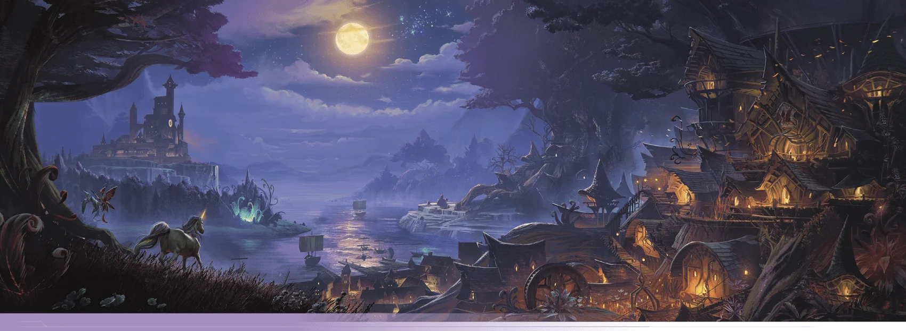

### Adventures among the Fey

Fey are seldom far away in the Moonshae Isles, especially on Gwynneth and around Myrloch Vale. Bullywugs and goblins bedevil novice adventurers, while experienced heroes confront hags and displacer beasts. Any denizen of the Feywild might appear through a fey crossing—this includes non-Fey creatures such as dragons and unicorns, as well as mastiffs, wolves, and elk, which are popular animal companions there.

A coven of hags makes an especially good recurring villain for a Moonshae Isles campaign, but you also might use a **Winter Eladrin** (see *Mordenkainen Presents: Monsters of the Multiverse*).

In fairy stories, characters often solve problems diplomatically rather than by fighting. Characters encounter fey with specific needs or desires—such as the guardian of a fairy trod—and if the characters bring the fey the thing they need, the fey lets them pass. An adventure location might be guarded by a fey knight who offers to duel challengers, but the knight might be won over by less combative means such as bringing him a fey steed or composing a ballad that glorifies his exploits. Evil fey can be thwarted this way as well; characters who steal the eye from a coven of hags might be able to trade it back to the hags in exchange for the hags' cooperation. When you design fairy tale adventures, keep an open mind to nonviolent solutions proposed by your players, and consider challenges that can be overcome with skills, relationships, and roleplay.

### Sailing the Moonshaes

In the Moonshaes, you're never more than a day's travel from the water, and many locals know how to handle a boat. Moonshae stories often require the characters to sail to one or more islands.

Norlander adventures often focus on piracy, raiding, or whaling. Norlander longships raid coastal settlements and prey on passing ships, so pirates and raiders make great enemies for your characters. You can use Humanoid creatures in the *Monster Manual* such as guards, scouts, berserkers, priests of Tempus, and, of course, pirates for Norlander raiders. They might bring animals or other monstrous companions with them on raids, such as **Winter Wolves** or a pet **Owlbear**. After the characters fight off a raid, they might follow the raiders back to their home and negotiate with (or threaten) their leader to end the attacks.

Whaling has been part of Norland culture for centuries, and many Norland families depend on whales for survival. Whaling is an extraordinarily dangerous task that could make for exciting adventures. A successful hunt can yield meat for a village of hungry Norlanders and lucrative byproducts like ambergris and whalebone. But sometimes the "whale" turns out to be a **Dragon Turtle** or an **Ancient Sea Serpent** (see *Fizban's Treasury of Dragons*).

Seafaring adventures can also center around trade and exploration. In these stories, merchants hire characters to escort them through dangerous waters. The characters or one of their NPC allies might have their own ship. The party can discover undersea settlements and meet D&D's vast array of underwater creatures, including vicious **kuo-toa**, **Merrow**, and **sahuagin**, or the heroic merfolk and tritons (described in *Mordenkainen Presents: Monsters of the Multiverse*).

### Protecting Nature

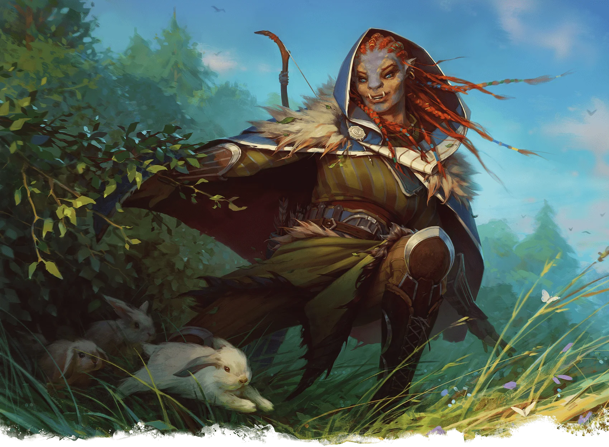

The Earthmother is a divine embodiment of the Moonshae Islands, and the Rusting is a supernatural curse that embodies environmental destruction, exploitation, and pollution. This makes the Moonshaes an excellent place to explore stories of eco-fantasy, in which heroic characters protect nature while addressing ecological disasters.

Druids, Rangers, and other characters with a connection to nature or the fey are often drawn into eco-fantasy adventures, but other characters might have a role as outsiders learning the importance of living things and the environment.

People living in the Moonshaes sometimes cause environmental damage as a consequence of industrialization or overpopulation. Overfishing, cutting down forests, and draining wetlands are examples. In these stories, solving the problem often requires creative solutions and negotiation.

The allegorical nature of eco-fantasy can also lend itself to stories of Aberrations, Undead, and Rusted creatures causing environmental destruction by design, not by accident. These adventures threaten the ecology of the Moonshaes and, by extension, the Earthmother. They are also a direct threat to the characters' lives, which the characters must respond to with heroic violence.

### Building Alliances

Norlanders and Ffolk warred for generations before coming together and forging a united Moonshaes. This motif—longtime enemies finding shared purpose—recurs in Moonshae Isles adventures.

Relations between the fey of Sarifal and the humanoid inhabitants of the isles demonstrate this motif again. High Lady Ordalf brought thousands of fey to Myrloch Vale in defiance of the high king, driving the Kendrick family out of their ancestral home. But the two sides united after the death of Owaren Kendrick.

Tensions between ancient enemies in the Moonshaes persist to this day. Orcs and dwarves fight beneath the mountains of Alaron. Giants have returned to Oman's Isle, driving out Norlanders and Ffolk alike. Good and evil fey quarrel according to ancient rules. Negotiating with these groups isn't easy. If the disparate groups in the Moonshaes are to live together in peace, heroic characters must help them find common ground.

## Moonshae Conflicts

Moonshae Isles campaigns often involve High King Kendrick's efforts to bring a lasting peace to the Moonshae Isles. At the same time, the characters might investigate the Rusting, try to prevent its spread, and eventually try to end it.

### High King Kendrick's Peace

High King Kendrick wants to unite the Moonshaes into a single, peaceful land. But he can't do that alone. He expects his realm and that of High Lady Ordalf to be united only after Princess Caitlyn inherits the throne. In the meantime, Kendrick wants to bring rivals and warring factions together.

#### Political Goals

The rulers of the Moonshae Isles are proud people who do as they please. They expect their customs and territory to be respected, and they expect to be treated like the nobles they are. While some of these rulers might be persuaded to unite peacefully, others—like **Queen Forfallen** or the leaders of the Red Shadow—might need to be defeated by force.

#### Forging the Peace

A campaign aimed at bringing the people of the Moonshae Isles together might follow this broad outline.

***Levels 1–4.*** When the characters rescue a trapped musician, they inherit a castle, which gets them noticed by rulers throughout the isles. You can use "Message in a Bottle" in this chapter.

***Levels 5–10.*** Leaders throughout the isles test the characters and, when the characters pass these tests, the rulers ask them for help. You can use "Wreck of the Silverhand" and "The Treaty of Ostoria" (both in this chapter) to introduce Jarl Olfsvenn and High King Kendrick.

***Levels 11–16.*** Once the characters have won the friendship of various factions, they can bring those groups together to settle their differences and bring peace to the Moonshaes. Evil giants, wicked fey, and bloodthirsty lycanthropes oppose this peace.

### The Rusting

The Rusting is an existential threat to the Moonsea Isles. If it were to reach moonwells in Gwynneth, even the Earthmother herself might be in danger.

#### Rusted Goals

Creatures cursed by the Rusting relish despoiling nature by cutting down forests, damming rivers, poisoning wells, and spreading the curse. Many of these creatures focus on bringing the curse to moonwells, especially those on Gwynneth where the Earthmother is strongest.

#### A Rusting Arc

The party's investigation of the Rusting and their eventual efforts to end the curse might follow this broad outline.

***Levels 1–4.*** Characters first see effects of the Rusting as they pursue other adventures. You can use "*The Lost Library of Lethchauntos*" in *chapter 7*. Then, the party is charged with investigating the curse and learning more about it. Use "The Rushdown Well" in this chapter.

***Levels 5–10.*** As the characters explore more of the isles, they find symptoms of the Rusting in many places and battle **Rusted Berserkers** and **Rusted Behemoths** loyal to **Queen Forfallen**. See *chapter 9* for more detail on these adversaries.

***Levels 11–16.*** When the Red Shadow summon Kazgaroth from a moonwell corrupted by the Rusting, the Beast manifests in a colossal Rusted form and begins spreading the curse instantly to everything it touches. Lady Ordalf is destined to cure the curse at the cost of her own life, but the party will need to escort her to the source of the corruption and protect her long enough for her magic to end the curse.

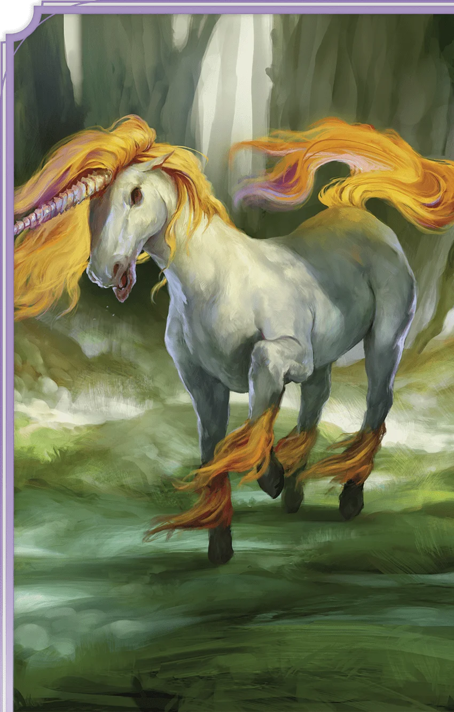

## DM's Toolbox

This section provides tools useful for adventures in the Moonshaes, including guidelines on renown, Bastions, and an encounter table for seagoing adventurers.

### Renown in the Moonshae Isles

*You want to make friends in the Moonshaes? Here's what you do: treat other people with respect, say yes when people ask you to do things, don't make problems. I am terrible at all these things.*— Caitlyn KendrickYou can use the renown rules in *chapter 3* of the *Dungeon Master's Guide* to track the relationships the party builds with important nonplayer characters in the Moonshaes, such as the Kendrick family, High Lady Ordalf, Jarl Olfsvenn, and Moonshae druids.

#### Kendrick Family Renown

Characters earn renown with the Kendricks by bringing rivals and enemies together, keeping the peace in Ffolk lands, and completing personal favors for the Kendrick family.

##### Kendrick Family Renown
| Renown Score | Reward                                                                                                                                                                                                                  |
|:------------:|-------------------------------------------------------------------------------------------------------------------------------------------------------------------------------------------------------------------------|
|      3+      | You are welcome in the Kendrick court. The Kendrick family and members of their court are Friendly to you by default.                                                                                                   |
|      5+      | You have complimentary room and board in Alaron, providing you with a Comfortable lifestyle for free.                                                                                                                   |
|      10      | The first time your Renown Score reaches 10, the Kendrick family rewards you with 750 GP worth of gemstones.                                                                                                            |
|      15+     | You are given a minor noble title, and your room and board in Alaron improves to provide you a Wealthy lifestyle for free. In addition, the Kendrick family and court trust you, freely confiding information with you. |
|      30+     | You can call on the Kendrick family for a major favor, such as a royal pardon. Once you call for a favor, you can't do so again until your Renown Score increases.                                                      |

#### High Lady Ordalf Renown

Characters earn renown with Ordalf by assisting Sarifal or the fey, adventuring in the Feywild, and protecting nature.

##### High Lady Ordalf Renown
| Renown Score | Reward                                                                                                                              |
|:------------:|-------------------------------------------------------------------------------------------------------------------------------------|
|      3+      | You are welcome in Ordalf's court. Fey in Sarifal are Friendly to you by default.                                                   |
|       5      | The first time your Renown Score reaches 5, Ordalf gifts you a random Common magic item.                                            |
|      10+     | Fey on Gwynneth are Friendly to you by default.                                                                                     |
|      15      | The first time your Renown Score reaches 15, Ordalf gifts you either a random Rare magic item or a pet **Blink Dog** (your choice). |
|      30+     | You can use any fairy trod located in the Moonshae Isles. Fey in the Moonshaes are Friendly to you by default.                      |

#### Jarl Olfsvenn Renown

Characters gain renown with Olfsvenn when they're generous or true to their word, when they perform heroic deeds, and when they help Norlanders.

##### Jarl Olfsvenn Renown
| Renown Score | Reward                                                                                                                                                                    |
|:------------:|---------------------------------------------------------------------------------------------------------------------------------------------------------------------------|
|      3+      | You are welcome in Olfsvenn's court, and members of the court are Friendly to you by default.                                                                             |
|      5+      | You can hire hirelings from Olfsvenn's court for half cost.                                                                                                               |
|      10      | The first time your Renown Score reaches 10, Olfsvenn rewards you with 100 GP worth of gemstones and art objects.                                                         |
|      15+     | Norlanders in the Moonshae Isles are Friendly to you by default.                                                                                                          |
|      20      | The first time your Renown Score reaches 20, Olfsvenn gifts you a Norlander Longship (see "Moonshae Vehicles" earlier in the chapter).                                    |
|      30+     | You can request a Norlander contingent of four **Guards** to help you for one mission. Once you use this reward, you can't do so again until your Renown Score increases. |

#### Moonshae Druids Renown

Characters earn renown with the druids of the Moonshaes when they master druidic or fey magic, when they protect or restore the environment or moonwells, and when they aid or communicate directly with the Earthmother.

##### Moonshae Druids Renown
| Renown Score | Reward                                                                                                                                                          |
|:------------:|-----------------------------------------------------------------------------------------------------------------------------------------------------------------|
|      3+      | Moonshae druids and their allies are Friendly to you by default.                                                                                                |
|      5+      | You can purchase *Potions of Healing* from the druids for half cost.                                                                                            |
|      10+     | Beasts in the Moonshaes are Friendly to you by default.                                                                                                         |
|      15+     | You can purchase *Spell Scrolls* containing Druid spells of level 5 or lower from the druids.                                                                   |
|      20+     | You are allowed to visit moonwells guarded by the druids and participate in their ceremonies. Plant creatures in the Moonshaes are Friendly to you by default.  |
|      30      | The first time your Renown Score reaches 30, the druids offer to take you to a moonwell and cast the *Commune* spell—contacting the Earthmother—on your behalf. |

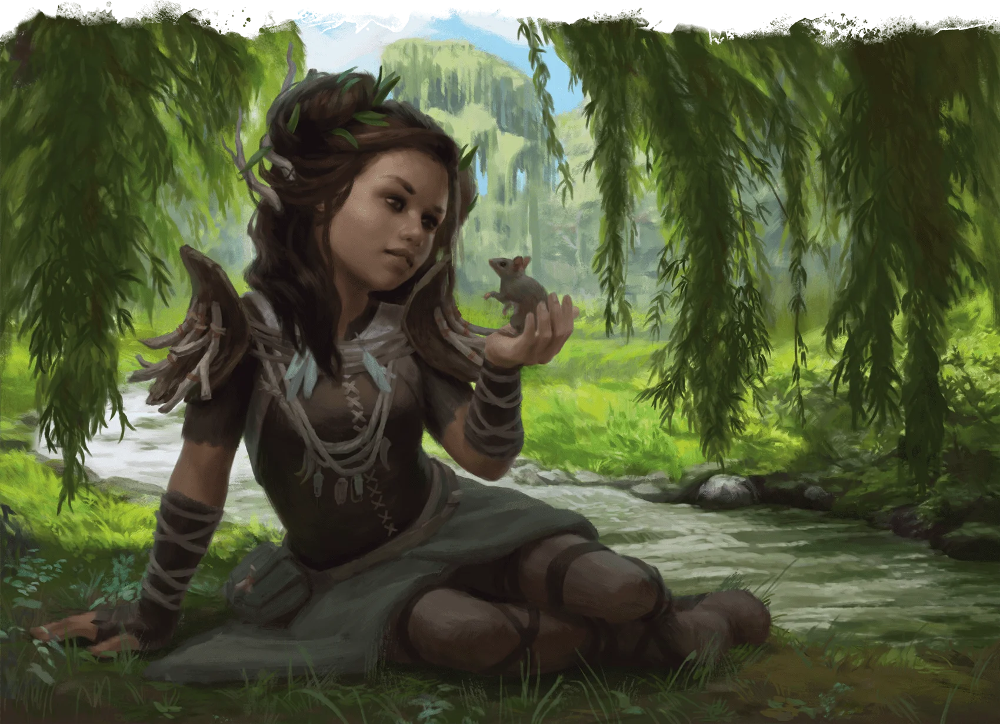

### Moonshae Bastions

The adventure "Message in a Bottle" provides a map and a way for characters to gain a Bastion on one of the Moonshae's wandering isles. The island moves around, taking the characters to new adventures of your creation. At first, the characters might be subject to the whims of the island's magic, but as they grow in power, they might learn to control its travel.

The castle detailed on the map represents the party's combined Bastion. As characters gain in level, they can add to this structure or discover hidden underground levels. Perhaps there are other structures on the island that the characters can renovate and add to their Bastion.

A Moonshae Bastion might have Fey hirelings such as a goblin cook, blink dog guards, a pixie librarian, and a bullywug gardener. Characters who ally with Norlanders might recruit them as sailors and soldiers. Giants might send goliaths and firbolg to be their representatives at the Bastion. A druid might leave their position at a moonwell to staff one of the Bastion's facilities.

#### Bastion Events

The Bastion Events table in the *Dungeon Master's Guide* describes random events that can happen to a Bastion. You can tailor these events to the Moonshae Isles as follows.

***Attack.*** The Bastion is attacked by Norlander raiders, Rusted creatures, or aquatic enemies such as sahuagin or kuo-toa.

***Extraordinary Opportunity.*** The party can clean up an environmentally devastated site and beat back the Rusting.

***Guest.*** The party is visited by a fey noble and their court, a member of the Kendrick family, or a giant.

***Refugees.*** The refugees flee the Rusting, Norlander raids, or a coastal attack by aquatic creatures.

### Sailing the Sea of Moonshae

You can roll 1d20 on the table below to generate encounters for a party of any level. Alternatively, roll 1d10 if the party is level 1–4, 1d10 + 5 if the party is level 5–10, or 1d10 + 10 if the party is level 11 or higher. Once you've used a given encounter, remove it from the table and create a new one to replace it.

<table class="rd__b-special rd__b-data  rd__b-data--stats">
		<thead>
			<tr>
				<th class="rd__data-embed-header ve-text-left" colspan="6" data-rd-data-embed-header="true">
					

						

							Sea of Moonshae Encounters
							
						

						[–]
					

				</th>
			</tr>
		</thead><tbody class="" data-rd-embedded-data-render-target="true"><tr>
			<td colspan="6" data-rd-tag="table" data-rd-uid="Sea of Moonshae Encounters|FRAiF" data-rd-page="tables.html" data-rd-source="FRAiF" data-rd-hash="sea%20of%20moonshae%20encounters_fraif" data-rd-name="Sea of Moonshae Encounters" data-rd-display-name="Sea of Moonshae Encounters" data-rd-style="" data-rd-entry-data="{}">
				<i>Loading <a href="tables.html#sea%20of%20moonshae%20encounters_fraif"  onmouseover="Renderer.hover.pHandleLinkMouseOver(event, this)" onmouseleave="Renderer.hover.handleLinkMouseLeave(event, this)" onmousemove="Renderer.hover.handleLinkMouseMove(event, this)" onclick="Renderer.hover.handleLinkClick(event, this)" onwheel="Renderer.hover.handleLinkWheel(event, this)" ondragstart="Renderer.hover.handleLinkDragStart(event, this)" data-vet-page="tables.html" data-vet-source="FRAiF" data-vet-hash="sea%20of%20moonshae%20encounters_fraif" ontouchstart="Renderer.hover.handleTouchStart(event, this)" >Sea of Moonshae Encounters</a>...</i>
				
			</td>
		</tr></tbody></table>
## The Rushdown Well

*Save a moonwell from the Rusting.*

- **A Location (Moonshae Isles) Adventure for Level 3 Characters**

- **Situation.** Environmental neglect, pollution, and deforestation have led to the appearance of the Rusting in the settlement of Kythyss and up Alaron's southeast coast.
- **Hook.** The gnome mayor of Kythyss, Grel Shivven (Small, Lawful Neutral **Noble**), hires the characters to visit sites where the Rusting has appeared and figure out why the curse is present.

### Encounters

The adventure consists of these encounters. Rusted creatures feature heavily in this adventure; to modify stat blocks into Rusted versions see the "Other Rusted" sidebar in *chapter 9*.

***Kythyss Wharf.*** Here, the characters find sewage from Kythyss dumping into the harbor. The sewer tunnel is home to a **Wererat** and six **Giant Rats**. If the sewage is redirected into septic tanks or cleaned before reintroduction to the harbor, the Rusting withdraws.

***Bregonshire Coast.*** The Rusting continues up the rocky coast between Kythyss and Dorset, where dead fish wash ashore. As the characters investigate, a **Kuo-toa Monitor** and four **Kuo-toa** emerge from the sea to fight. Speaking with local farmers reveals they're using an alchemical fertilizer that is washed into the sea by rain.

***Rushdown Wood.*** North of Dorset, the trees of Rushdown Wood are covered in a thin, metal skin, and their leaves have turned to rust. Lumbering efforts have penetrated deep into the forest, leaving behind fields of stumps. Rusted Norlanders have infiltrated the Rushdown Wood; a **Rusted Berserker** and six Rusted **Guards** attack when discovered. The characters can follow their trail back to an abandoned camp near the local moonwell; plans drawn in the dirt reveal a Rusted force is attacking the well.

***The Moonwell.*** Use the Moonwell map below for these encounters. When the characters rush to the moonwell's defense, they must first get past three Rusted **Scouts** in the trees to reach the main Rusted force, which is engaged with local druids and their allies. The characters must defeat four Rusted **Guards** and two Rusted **Wolves** before they can reach the leader of the assault: a Rusted **Warrior Veteran**. If the leader is defeated, the remaining Rusted flee and the moonwell is saved.

***Aftermath.*** Mayor Shivven can't address all the problems the characters have discovered with the resources he has at hand, but he's grateful for their efforts. He rewards each character with 100 GP.

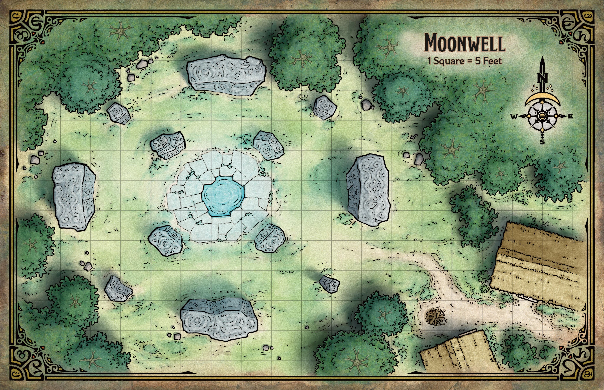
## Message in a Bottle

*Win a castle from a fey queen.*

- **A Location (Moonshae Isles) Adventure for Level 4 Characters**

- **Situation.** Braelin Wyngard (Medium, Neutral Good **Performer**) sailed his *Windskiff* to one of the Moonshae's wandering isles. While exploring a magical castle at its summit, he was confronted by evil fey who demanded a performance. Because his music was so good, they won't let him leave.
- **Hook.** In desperation, Braelin wrote a plea for help, sealed it into a wine bottle, and threw it into the sea. The characters find this message, which provides directions to the isle's current location, warns of evil fey, and promises vast rewards if Braelin is rescued.

### Encounters

The adventure consists of these encounters.

***Reaching the Island.*** The island has moved, requiring characters to chase it down. Once they arrive, they spot Braelin's *Windskiff* on the beach. A **Chuul** lies in wait and begins combat when the characters investigate.

***Entering the Castle.*** Use the map of the castle below. The castle is visible from everywhere on the island. Two Indifferent elf sentries (Medium **Knights**)guard the gate.

***Finding Braelin.*** The castle is inhabited by fey who make up the court of a mysterious evil queen. As the characters look for Braelin, roll on the table below, rerolling duplicates.

| 1d4 | Encounter                                                                                                                   |
|:---:|-----------------------------------------------------------------------------------------------------------------------------|
|  1  | Six **Goblin Warriors** and a **Goblin Boss** (all Friendly) are having a tea party and invite the characters to join them. |
|  2  | A Hostile **Hobgoblin Captain** drills three Hostile **Hobgoblin Warriors** (all Hostile) on fighting techniques.           |
|  3  | Four Hostile **Bugbear Stalkers** stealthily patrol the halls.                                                              |
|  4  | A Friendly **Faerie Dragon Adult** begins to follow the characters.                                                         |

***Braelin's Prison.*** Braelin is locked in a small room protected by a fire-casting statue trap (see *chapter 3* of the *Dungeon Master's Guide*).

***The Queen's Wrath.*** The queen (use the **Night Hag** stat block, but change its creature type to Fey) intercepts the characters before they escape with Braelin. If the characters defeat her, the Hostile occupants of the castle surrender and leave. The characters can claim the fey castle and its wandering isle as their Bastion.

The fey used areas of the castle for a variety of tasks, such as the sanctuary crowning the south tower and the smithy at the castle's center. If the characters use the castle as a Bastion, some of the rooms in the map below make for excellent locations of Bastion facilities of the same name.

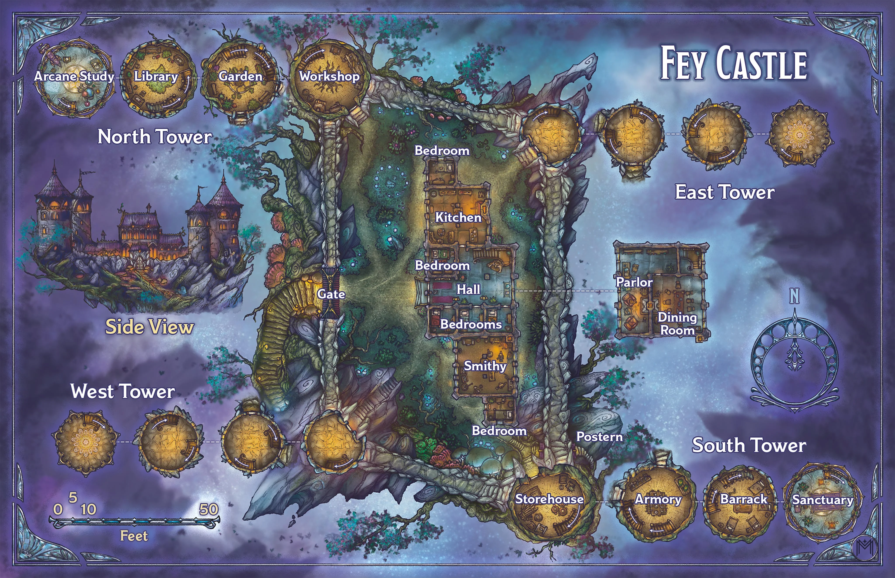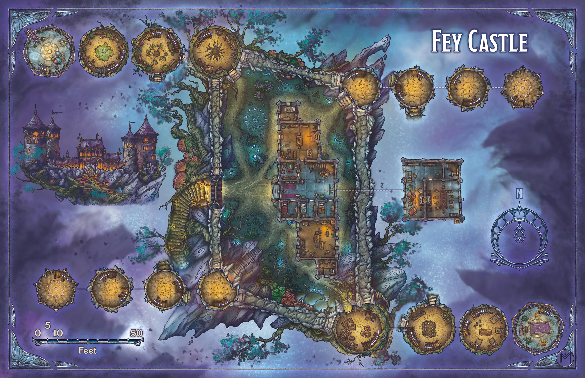
## Wreck of the Silverhand

*Recover a famous treasure from a sunken ship.*

- **A Location (Moonshae Isles) Adventure for Level 6 Characters**

- **Situation.** A Ffolk trading vessel carrying mysterious cargo has gone down in the Sea of Moonshae. The wreck lies in shallow water; some of its masts poke above the waves.
- **Hook.** Jarl Olfsvenn of Norland enlists the characters to explore the wreck and retrieve the contents of its safe. He's learned from his sister **Queen Forfallen** that the safe contains the lost ring of Cymrych Hugh; he intends to secure the ring and give it to High King Kendrick for safekeeping. Alternatively, the characters might spot the wreck while traveling.

### Encounters

The adventure consists of these encounters.

***The Wreck.*** Use the ship map in the *Dungeon Master's Guide*. The ship sank when a **Stone Golem** in the cargo hold broke through the port side.

***The Approach.*** A **Giant Shark** hunts in the wreck.

***Main Deck.*** When characters investigate, the corpses of sailors animate as six Lacedon **Ghouls**.

***Foredeck.*** A **Merfolk Wavebender** hides here, an exile from their people. The merfolk is Indifferent to the party but becomes Friendly if a character takes an Influence action and succeeds on a DC 15 Charisma (Persuasion) check.

***Cargo Hold.*** This hold contains five crates of an alchemical substance. Every crate is sealed and labeled with a bright-red warning. If a crate takes Fire or Radiant damage, the crate explodes. Creatures in a 15-foot-radius Sphere centered on the crate make a DC 15 Dexterity saving throw, taking 6d6 Fire damage or half as much damage on a successful one. This might cause a cascading explosion of nearby crates.

***Aft.*** The ship's aft is patrolled by five **Wights**, all that remains of the captain and their mates. The safe is in the aft cabin belowdecks. The safe has AC 20, HP 20, and a Damage Threshold of 20. The safe door's lock is Complex (1 minute to pick) and of Good quality (DC 15). If the characters can open it, they find the ring.

***Return of the Golem.*** When the characters open the safe and attempt to leave with its contents, the **Stone Golem** returns in the aft cabin.

## The Treaty of Ostoria

*Win the friendship of a fire giant king.*

- **A Location (Moonshae Isles) Adventure for Level 8 Characters**

- **Situation.** High King Kendrick wants a formal peace treaty and alliance with Moonshae's giants. But a **Fomorian** named Ulrik Fellwhisper is sabotaging the effort.
- **Hook.** The high king chooses the characters as his emissaries, asking them to travel to Oman's Isle and enter negotiations with Thuven Moltenbeard, the **Fire Giant** king of Oman's Isle.

### Encounters

The adventure consists of these encounters.

***Trondhelm.*** The characters land in Trondhelm safely, but four **Ogres** pick a fight. If the characters make a good impression with Trondhelm's goliath governor, Oakwright (Medium **Noble Prodigy**), he arranges a guide to lead the characters to a mine, where Thuven lives.

***Ambush.*** As the characters cross Oman's Isle, they're ambushed by three **Hill Giants** Ulrik hired.

***Earning an Audience.*** A dozen **Fire Giants** live in the mine. Thuven is Indifferent and won't see them until they've proven themselves in two tests. The first tests martial prowess against an **Azer Pyromancer**, two **Hell Hounds**, and four **Azer**

- **Sentinels.** The second tests crafting skill; the king provides 10 days and up to 200 GP of raw materials for the characters to craft one item. At the end of this time, a character presents the creation to Thuven and makes a DC 15 (Performance or Persuasion) check, earning the king's respect on a successful check. If the characters made a magic item from the Armor or Weapon category, the check automatically succeeds.

***Council with the Giant King.*** Once the characters earn his respect, Moltenbeard hears their proposal.

***A Hunt.*** Moltenbeard takes the characters hunting. The hunt is disrupted by an **Adult White Dragon** that Ulrik has tricked into trying to kill Moltenbeard; if the king dies, the characters are blamed and the peace effort collapses. If the characters save the king, he becomes Friendly and drafts a reasonable counterproposal for the high king.

***When All Else Fails.*** Ulrik abducts Moltenbeard and leaves a forged letter for the characters, insulting the high king and rejecting the alliance. The characters must follow Ulrik into the Underdark. He is a **Fomorian** with three **Red Slaad** bodyguards.

------

# Chapter 6: Baldur's Gate

>>Baldur's Gate is a bustling metropolis where money comes first and life is cheap. Cosmopolitan and crowded, the city draws innumerable visitors from across the Sword Coast.
>>
>>Baldur's Gate was founded many years ago by the hero Balduran, but it quickly outgrew its founder's vision as merchants, pirates, and laborers expanded the town into a city. The city flourished because Baldur's Gate is perfectly situated as a trade nexus. Major roads along the Sword Coast and beyond meet where the wide and deep Chionthar River allows seagoing vessels easy access to Gray Harbor.
>>
>>The city is deeply stratified, both physically and socially. Wealthy aristocrats of the Upper City, called patriars, stay within their ivy-shrouded manors. Working people in the Lower City drive trade from roads and harbors. Refugees and poor residents make what homes they can in the Outer City. Sturdy walls and gates divide these three districts.
>>
>>Baldur's Gate has seen its share of dangers in recent years. Cultists of sinister gods promote murder, tyranny, and necromancy in shadowy lanes and hidden rooms. A powerful thieves' guild, so ubiquitous as to be known only as the Guild, lines its pockets at the expense of the citizenry and visitors. Innocent-seeming citizens secretly worship fiends or are fiends in disguise. Cargo from across the world provides the city with wonders and wealth, but it also conceals curses from distant lands. Danger and opportunity aplenty wait in the bustling city, and people who are smart or lucky can make a reputation and a fortune.
>>

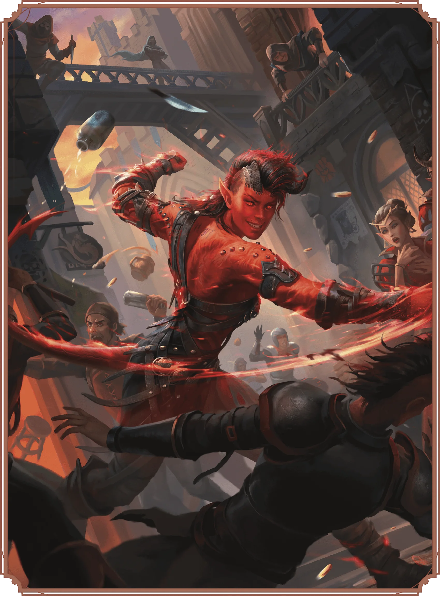

## Baldur's Gate Campaigns

Baldur's Gate encourages tales of urban intrigue, vengeful antiheroes, and stakes beyond life and death. The city's denizens are flawed, cynical, full of life, and vulnerable to sinister threats.

### Gritty Urban Fantasy

Trade is the paramount purpose of this busy, bustling city. A staggering amount of wealth flows through Baldur's Gate, but it's held by tight-fisted merchant houses and decadent aristocrats enriching themselves with no concern for the common good.

The grim nature of Baldur's Gate is mirrored in its appearance. The city's yellow-marble and dark-wood buildings are perpetually grimy. Dark and dismal buildings loom within stout, stained walls.

Although the city offers unparalleled opportunity, many live here because they have nowhere else to go. This is particularly true in the squalid Outer City, but even noble manors in the Upper City hold desperate occupants who can't conceive of a better life. Desperate people live in desperate situations in Baldur's Gate, seeking small measures of happiness despite their surroundings.

### Morally Ambiguous Characters

Naive goodness has little place in Baldur's Gate. People keep to their own affairs and are unwilling to risk generosity to strangers.

Moral flexibility is needed to thrive in this city. While truly wicked folk are rare, those willing to make accord with criminals or monsters can accomplish more than idealists. The heroes of Baldur's Gate are vigilantes doing what's needed to keep the worst elements of the city at bay.

### A Price for Everything

Baldur's Gate runs on commerce, and anything can be found for sale within the city. The city's elite sell authority and justice. The city's seediest markets sell drugs, poisons, and lives. Similarly, every success earned in the city comes at a cost. A true love gained might have a fiendish heart, a treasure won could bear a sinister curse, and few victories are achieved without the blood of innocents.

> ##### Karlach Cliffgate
>
>The tiefling barbarian Karlach Cliffgate hails from the Outer City of Baldur's Gate. With a heart as big as her muscles, she's a fierce *defender* of underdogs. Desperate for coin after her parents' deaths, Karlach became a bodyguard to the cutthroat politician Enver Gortash, but Gortash betrayed her and sent her to the Nine Hells. She spent a decade as a conscripted soldier in the eternal war between devils and demons, and her heart was replaced by an *Infernal Engine*. She appears in *Baldur's Gate 3*.
>

## Power in Baldur's Gate

Authority in Baldur's Gate is based on wealth, violence, or influence, and the city's authorities leverage all three.

### Council of Four

Baldur's Gate runs on trade, but its government operates at the direction of influential elected rulers: the Council of Four. Consisting of three dukes and one grand duke, this body enacts laws, directs the Flaming Fist and the navy, and—perhaps most important in a trade city—collects taxes. The Council of Four is advised by an assembly of politicians known as the Parliament of Peers (see below).

The current grand duke is Ulder Ravengard, an even-tempered soldier who rose to become supreme marshal of the Flaming Fist. Ulder used his experience to ensure his ascent to grand duke in an overwhelming election victory. Defying expectation and tradition, Ulder refused to give up control of the Flaming Fist; he works hard to meet his governmental responsibilities and his military obligations. He's an inspiration to idealists who long for greater fairness and prosperity in the city, but Ulder has a hard time balancing his roles. While his leadership in the Council of Four is remarkably progressive and he has led the city through recent tribulations, his inattention to the Flaming Fist has allowed the mercenary company to slide further into oppression and brutality.

The other members of the Council of Four include the distant and ineffective Duke Dillard Portyr, the fiery priest Duke Brevek Faenor (Medium, Lawful Neutral **Archpriest**), and the strong-willed Duke Belynne Stelmane, who is currently possessed by a mind flayer and struggles for control of her body and her actions.

### Parliament of Peers

The Parliament of Peers is an advisory ruling body composed of fifty politicians, mostly patriars. The parliament meets in sumptuously appointed rooms in the majestic High Hall in the Upper City.

The Parliament of Peers debates matters of policy, and members make formal recommendations to the Council of Four. Although the parliament doesn't have the power to enact laws, the council relies on influential parliament members to handle significant government affairs and execute the council's edicts, so the council follows parliament's recommendations more often than not.

Intrigue is more intense in the Parliament of Peers than anywhere else in Baldur's Gate. Parliament members seek agents who can unearth secrets on their colleagues—or make their own damaging secrets permanently disappear.

### The Watch

The Watch is a regimented military force bankrolled by patriars, headquartered in Watch Citadel in the Upper City, and tasked with defending that district and its residents. Although many Watch members never leave the Upper City in the course of their duties, a few might escort a patriar into another part of the city, participate in parades, or pursue spies or assassins into other districts. Watch members are essentially bodyguards for the patriars; they take this position seriously and consider themselves the city's elite forces.

Watch members make scheduled patrols through the Upper City during the day, ensuring the district's businesses run smoothly and peacefully. The Watch also staffs the Old Wall separating the Upper City from the rest of Baldur's Gate, keeping an eye on comings and goings in the wealthy district. At dusk, the Watch expels everyone from the Upper City except residents of the district, their designated guests, and their authorized servants, all of whom receive a Watch token authorizing them to be in the district. Watch members pride themselves on knowing every individual who "belongs" in the Upper City after dark. Residents without a Watch token are unceremoniously ejected through the nearest gate into the Lower City.

Evening Watch patrols are less scheduled and more combative. They are quick to jail intruders they encounter and are permitted to use force—even deadly force—if they witness a crime. As with all so-called justice in Baldur's Gate, the wealthy or well connected might get away with a stern warning or a fine, while the poor or desperate face far harsher punishments.

> ##### Why Not Let the Law Handle It?
>
>When characters come across criminal activity in Baldur's Gate, they might want to call the Watch or the Flaming Fist. But there are reasons for a party to handle such problems themselves.
>
>First, both these groups are notoriously corrupt. Residents know it's better to handle problems yourself or with a few trusted friends.
>
>Second, the Flaming Fist and the Watch aren't the protagonists of the game. It's not fun for the players to sit back and let nonplayer characters handle problems.
>
>Discuss with your players what role they'd like law enforcement to play in your game. If you need NPCs to efficiently address a crime—taking a defeated mugger into custody, for example—perhaps members of a local crew arrive instead. Crews can handle such tasks, allowing the characters to mete out justice in more heroic ways.
>

### The Flaming Fist

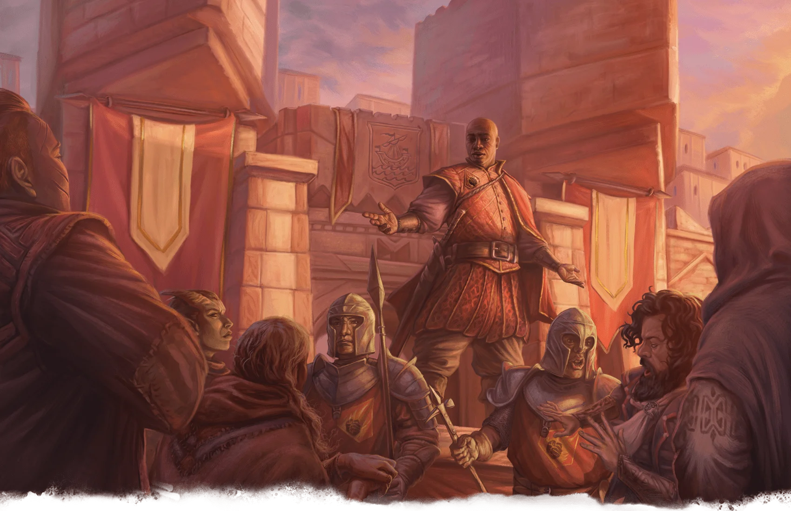

The Flaming Fist is the most powerful and influential mercenary company in Baldur's Gate. The Council of Four pays the Flaming Fist to defend the city, patrol its streets, and punish lawbreakers. The Flaming Fist is headquartered at the Seatower of Balduran, a massive fortress that juts into Gray Harbor. The group's red and gold heraldry is only slightly more well known than its members' smug sense of entitlement and their predilection to quash crime with violence. Because the company's supreme marshal, Ulder Ravengard, is too busy in his current role as grand duke to provide his characteristically firm, well-intentioned leadership, the Flaming Fist is sliding further into heavy-handed bullying and corruption.

The Flaming Fist is authorized to mete out punishments for a crime in progress or for recent crimes in which witnesses describe a perpetrator to the Flaming Fist's satisfaction.

The Flaming Fist is powerful and known throughout Baldur's Gate, but its authority has limits. The Flaming Fist defers to the Watch for enforcement in the Upper City, so its members rarely venture into the clean, landscaped streets of the patriars. Occasionally, however, patriars send the Flaming Fist abroad on personal missions, even as far as Chult.

The Flaming Fist rarely patrols the Outer City, and only in large numbers with a specific goal, such as to capture a fleeing criminal or make a demonstration of might. Although the Flaming Fist staffs a fortress at Wyrm's Rock to collect taxes and raise the bridges of Wyrm's Crossing at night, the guards stationed there prefer working within the security of the fortress's walls. The Flaming Fist is more likely to contract outside agents, such as itinerant adventurers, to investigate crimes in the Outer City.

The Flaming Fist is most active in the Lower City, but its members are rarely welcome there. They give preferential treatment to citizens they know and those who show obvious wealth. Favored citizens are more likely to have their problems solved and are less likely to receive a serious punishment when caught committing a crime. Newcomers soon learn what the city's poor have long known: a flogging, heavy fine, or incarceration can befall them simply for being near a crime scene when the Flaming Fist come around.

Flaming Fist members with an interest in justice lament their company's heavy-handed reputation. Scrupulous mercenaries understand that facts can be more valuable than a reputation for brutal efficiency, so they surreptitiously leverage informers or independent agents when they want to ferret out the truth.

## People of Baldur's Gate

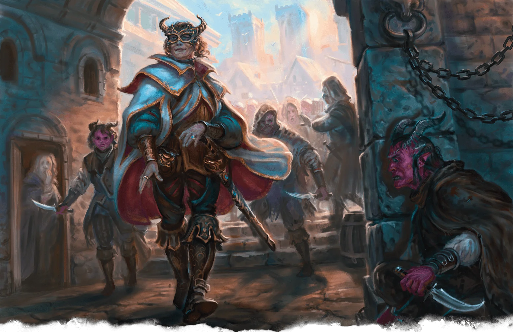

Baldur's Gate functions through the work of a diverse array of people and professions, from lofty noble families to hardworking dockworkers and traders who arrive with goods from far-off lands.

### Patriars

Patriars are the elite nobility of Baldur's Gate. Patriar families enjoy staggering wealth and have established lineages that sometimes—with varying degrees of veracity—date back to the city's founding. Many patriars are heavily involved with businesses in Baldur's Gate and abroad.

Other patriars rarely leave their manors in the Upper City and entertain few guests. These reclusive aristocrats stoke rumors of decadent debauches, devil worship, or worse. Some of these rumors only hint at the true villainy these depraved nobles pursue. Some patriars commune with the Dead Three, engage in abhorrent experiments, or plot to destroy Baldur's Gate in exchange for greater wealth and power. They are confident that their status makes them untouchable, and in most cases, they're right.

Patriar manors cluster within the walls of the Upper City and tend to be opulent townhomes, with small front yards or courtyards with climbing vines and tall, narrow trees. Patriars vertically expand their residences as their means allows, adding extra stories or refurbishing underground storage chambers or crypts.

> ##### Patriar Interests
>
>Although Baldurians consider less wealthy patriars to be interchangeable, you can distinguish between families by emphasizing their unique interests. Here are some examples:
>
>- **Bormul** has relations in Amn and owns profitable silver mines and wineries.
>- **Dlusker** hides its looming poverty by shuffling money between textile mills and slaughterhouses.
>- **Gist** owns profitable dye works.
>- **Miyar** supplies and refits caravan wagons.
>- **Nurthammas** owns Lower City warehouses and supplies ships departing on long voyages.
>- **Redlocks** secretly finances piracy and smuggling.
>- **Tillerturn** is a significant property owner in the city, leasing out many homes and shops.
>- **Whitburn** owns a large slate quarry east of the city that it's having trouble staffing.

#### Station and Secrets

Although pedigree and old wealth are allegedly the foundation of patriar society, patriars are reluctant to show proof of their claims. A written genealogy might hint at infidelities, accounting ledgers might show wealth buttressed by bribes or financial irregularities, and old deeds might be of dubious authenticity. Practically every patriar in Baldur's Gate harbors secrets just as each patriar hungers to learn the secrets that their peers conceal.

Patriars instead prefer to generate outré displays of personal wealth and influence, whether genuine or fabricated, to demonstrate their station. Patriars one-upping one another can indirectly benefit the city by their patronage. Families might compete to see who can fund the biggest orphanage, the greatest number of artists, or the largest and most elaborate public fountains.

An individual with astonishing wealth (or the appearance of astonishing wealth) and a legitimate-seeming claim to property or family in the Upper City can shoulder into the ranks of the patriars. But any newcomer must be prepared for political infighting and routine backstabbing from patriars who don't want more competition.

### Commoner Crews

Commoners suffer from the brutal justice of the Flaming Fist and the snobbish whims of the patriars, but they have one advantage: sheer numbers. Without commoners to keep coin flowing from the docks and roads, Baldur's Gate would grind to a halt. Formal unions and guilds such as the Barrister's Guild exist, but most commoners find protection in the form of crews—loose associations of like-minded people who watch each other's back.

> ##### Joining a Crew
>
>Characters established in Baldur's Gate, due to either their background or their actions during play, might be invited to join a crew. Although you should provide opportunities for characters to aid crew members in distress, remember the obligation goes both ways: have crew members step in to thwart pursuing Flaming Fist mercenaries or share a useful lead during an investigation. Characters in a crew should feel like their support network is mutually beneficial. You can track this as presented in "Commoner Crew Renown" in the "DM's Toolbox" section later in this chapter.
>

Crews are organized by neighborhood, like the Gravemakers of Tumbledown or the Bloomridge Dandies, or by profession, like the Wisewoman Weavers. Not all these professions are legal or even well defined; for example, the Gateguides consist of lantern bearers who work as city guides. Some crews cross into organized crime: the Honorable Order of Moneylenders includes bankers, loan sharks, and burglars.

> ##### My Best Friends Are Evil!
>
>Although citizens might suspect their neighbors or rivals are evil, Baldurians judge by actions, not intentions. Antiheroes are supported and celebrated in Baldur's Gate as long as their treacherous or bloodthirsty activities protect the community. A Baldur's Gate campaign is a good place to play morally ambiguous or evil characters. There's plenty of other villainy to face, and Baldurians forgive rough treatment of those who deserve it.
>

The Harborhands is the most powerful crew in Baldur's Gate. The crew includes dockworkers across Gray Harbor, and a concerted strike can shut down river trade. The human harbormaster Darus Kelinoth (Medium, Lawful Neutral **Noble**), who runs the port on behalf of the Council of Four, keeps an uneasy peace with the Harborhands.

Crews don't just protect members' homes and workplaces—they also look after their livelihoods. Crew members walk each other home on foggy nights and fill the larders of members recuperating from illness. Close friendships and marriages bind crews together.

Various crews might be rivals, but they unite when faced with trouble from criminals, patriars, or the Flaming Fist. Crew members can expect aid—a hot meal, a hiding place, or help in a fight—from members of any crew, not only their own. This aid creates a social debt of reciprocity that a crew must then discharge, which keeps crews working closely together. Competition between crews can be fierce but seldom reaches the level of an all-out street war. After all, neighbors or family members might work in different trades and be members of different crews, or coworkers might live in different neighborhoods and have divided loyalties.

### Urban Denizens

Even with support from commoner crews, life in Baldur's Gate is hard. The city runs on coin, each one wrested from someone else. Baldurians expect unfair dealings, trickery, and treachery. Traders look to acquire the best price for cargo, underpaying riverboat crews and dockhands. Bakers fix prices to undermine competitors. Clerks adjust accounting logs to create larger payouts. Construction workers paid to look the other way let a cowled figure weaken a wall to cause an accident—and a new construction contract. Baldurians justify their own misdeeds with a shrug and an insistence that "that's life in Baldur's Gate."

## Danger in Baldur's Gate

Evil plots permeate Baldur's Gate, and the urban environment creates opportunities for unique chases and escapes.

### The Dead Three

The malevolent deities known as the Dead Three were once evil mortals named Bane, Bhaal, and Myrkul. By dying during the Time of Troubles and rising again as quasi-divine entities, the Dead Three found a loophole to remain in Faerûn when other gods were forced to withdraw. Baldur's Gate holds a special interest for them, and their cultists secretly congregate in and beneath the city.

A campaign involving the Dead Three might shift the focus from a single cult to a greater plan enacted by the three cults working together. A **Dead Three Scion** (see chapter 9) makes a good final villain for such a campaign.

#### Bane

Bane, the god of tyranny, is the mastermind of the Dead Three. He charges his followers to dominate others. His cultists are cunning warriors who tyrannize others through physical might and intimidation. They are often **Toughs**, **Warrior Veterans**, or **Cultists of Bane** (see chapter 9). Many of his followers gravitate to Baldur's Gate because rampant corruption here allows the ambitious and unscrupulous to gain power. Cultists who become members of the Flaming Fist often rise to positions of authority, which they eagerly abuse in their god's name.

#### Bhaal

Bhaal is the lord of murder—particularly murder that elicits paranoia and terror. His cultists have terrorized the city with carefully crafted murder scenes. Unlike followers of Bane who install themselves in the city's power structures, followers of Bhaal work in secret, infiltrating benign organizations while they plan grisly killings. Bane and Myrkul together barely restrain Bhaal's sadism, and Bhaal's cultists are difficult to control when their bloodlust strikes. They are often **Assassins**, **Cultist Fanatics**, or **Cultists of Bhaal** (see chapter 9).

#### Myrkul

Myrkul is a god of the dead. Although necromancy is within his grim interests, he also acquires lore by tormenting spirits of the departed. Myrkul's followers revere knowledge, particularly secrets, and view corpses and spirits as tools to power. Myrkul is aloof and calculating. His cultists—often **Death Cultists**, **Priest Acolytes**, or **Cultists of Myrkul** (see chapter 9)—emulate his grim and eerie composure when animating the dead or tormenting a soul to procure its secrets.

*"I call the Dead Three 'Yelly,' 'Stabby,' and 'Moldy.'*

*Don't tell them I said that."*— Karlach Cliffgate
### Crime Syndicates

Several crime syndicates have their claws in Baldur's Gate, orchestrating thefts, murders, protection rackets, smuggling rings, vice peddling, and more. Some of these are vast networks stretching across the Sword Coast, such as the Shadow Thieves and the Zhentarim. The Zhentarim has a particularly tenacious hold on Baldur's Gate due to its close association with cults of Bane; Zhentilars (see chapter 9) further Zhentarim aims in the city.

#### The Guild

The most significant criminal syndicate in Baldur's Gate is a local organization known as the Guild. The Guild operates throughout Baldur's Gate, but it thrives in the Lower City. The Guild's no-nonsense human leader, the nondescript Nine-Fingers Keene (Medium **Spy Master**), keeps the organization discreet. To push back against the rise of vigilantes and commoner crews interfering in Guild business, Nine-Fingers Keene insists that the Guild take a lighter touch against hardworking locals and instead focus criminal efforts on visitors, nobles, and those who thwart the Guild's schemes.

All Guild crime in a neighborhood falls under the authority of a kingpin. Kingpins leverage threats and bribes to deflect the attention of the Watch and the Flaming Fist onto others. Characters working to put a stop to a rash of Guild-backed crimes might initially contend with a few **Spies** or **Toughs**, but a confrontation with the local kingpin (perhaps a **Bandit Deceiver** or a **Spy Master**) is inevitable.

### Devil Cults

Malevolent cults have always been a problem in Baldur's Gate, since the citizenry's "live and let live" attitude toward religion allows evil worship to fester. Recently, the city has seen a rise in cults that venerate and summon devils. A single powerful spellcaster might summon a devil into a rune-carved cellar or shuttered parlor, but more commonly a small group of like-minded cultists pool their power to bring a devil forth.

Devils have much to offer desperate or greedy Baldurians: undeserved wealth, status-building connections, and more. Yet devils are far better negotiators than even the shrewdest patriars, so eager diabolists inevitably end up dancing to a devil's whims. Devils happily leverage secret shames to drive cultists to ever more depraved crimes. **Imps**; **Erinyes**; and Fiends that aren't devils, like **Cambions** and **Succubi**, might also command a devil cult.

### Chases

*Chapter 3* of the *Dungeon Master's Guide* presents rules for chases. The following suggestions supplement those rules in Baldur's Gate.

#### Lawkeepers Intervene

The *Dungeon Master's Guide* describes how to add another group to a chase. The following groups might become involved, pursuing the characters.

##### Adding to the Chase
|  District  | New Pursuers                                 | Initial Distance |
|:----------:|----------------------------------------------|:----------------:|
| Upper City | 2d4 **Guards** of the Watch                  |      60 feet     |
| Lower City | 2d6 **Warrior Veterans** in the Flaming Fist |      90 feet     |
| Outer City | 1d6 **Toughs** from a crew                   |      45 feet     |

#### Complications

The following complications work well in any Baldur's Gate neighborhood. You can use this table to replace or supplement the Urban Chase Complications table.

##### Baldur's Gate Chase Complications
| 1d12 | Complication                                                                                                                                                                                                                                      |
|:----:|---------------------------------------------------------------------------------------------------------------------------------------------------------------------------------------------------------------------------------------------------|
|   1  | A cowled stranger offers you a suspiciously compelling shortcut. Make a DC 10 Wisdom saving throw. On a failed save, you're tricked into going the wrong way, and your Speed is halved until the end of your turn.                                |
|   2  | The street was excavated in an incomplete urban-works project. Make a DC 10 Strength or Dexterity saving throw (your choice) to cross. On a failed save, you take 1d6 Bludgeoning damage and have the Prone condition.                            |
|   3  | Thieves lurk amid street performers, looking for easy targets. Make a DC 10 Intelligence or Wisdom saving throw (your choice). On a failed save, you pass the obstacle but lose 10 GP.                                                            |
|   4  | The Flaming Fist seeks suspects near a grisly murder scene. Make a DC 10 Dexterity or Charisma saving throw to avoid their scrutiny (your choice). On a failed save, two **Warrior Veterans** join the chase, pursuing you for rough questioning. |
|   5  | A patriar and their entourage are crossing the way. Make a DC 15 Charisma saving throw or spend 10 feet of movement to pass (your choice). On a failed save, your Speed is 0 until the end of your turn.                                          |
|   6  | A spiky rune drawn under an eave pulses as you pass. Make a DC 12 Wisdom saving throw to resist its sinister influence. On a failed save, you take 4d4 Psychic damage.                                                                            |
| 7–12 | There is no complication.                                                                                                                                                                                                                         |

> ##### One Evil behind Another
>
>To emphasize the intrigue and danger of Baldur's Gate, use plots where one of these villainous groups masquerades as another. For example, the characters confront a cult of Myrkul and discover that the Guild is manipulating the cult to sow terror while a greater crime is in the works. Or what seems like a simple smuggling ring by a scofflaw crew is being orchestrated by diabolists with a far more sinister goal.
>

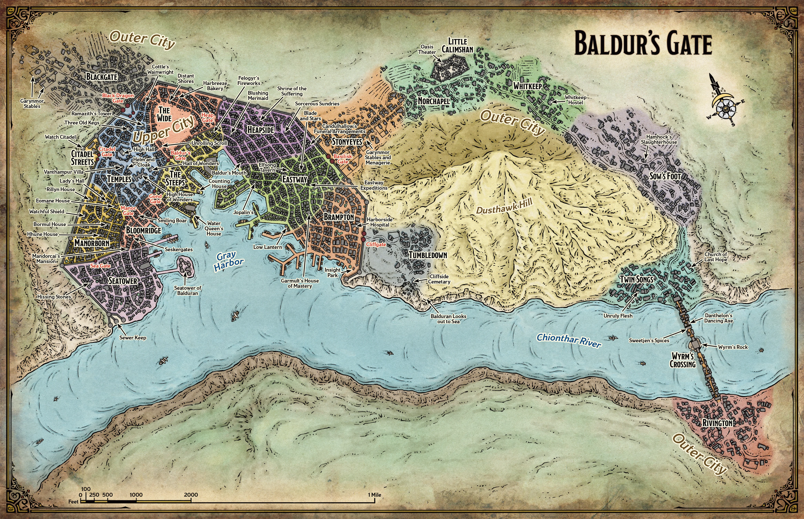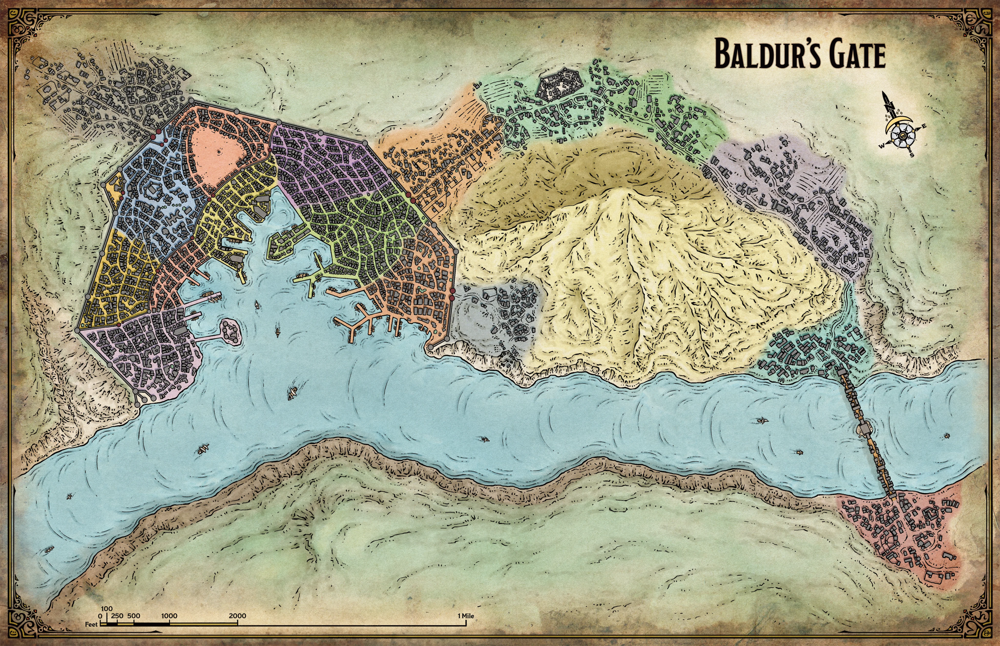
## Baldur's Gate Gazetteer

Baldur's Gate is one of the great cities of the Sword Coast, visited by countless traders and tourists every year. Anything can be bought here if a customer is willing to pay the price. But that price might be high or in a coin the buyer didn't expect.

The busy markets near the port and the lavish homes of the patriars belie the deep corruption that permeates every corner of Baldur's Gate. Locals survive in the city by being cautious and trusting their crews. Visitors become marks for the city's many criminals.

This gazetteer provides overviews of the sprawling city and its surroundings. Baldur's Gate has the following key areas:

- **Gates**. The city's neighborhoods are divided by several gates.
- **Upper City**. The city's decadent nobles live in the Upper City among ornate parks, upscale theaters, and government buildings.
- **Lower City**. The bulk of the city's hardworking population lives in the Lower City, a lively jumble of taverns, tenements, markets, and docks.
- **Outer City**. Life is cheap in the slums, caravan stations, warehouses, and criminal establishments that sprawl outside the city walls.
- **Sewers**. Baldurians know that vice and danger lurk in the sewers beneath their feet.
- **Beyond the City**. Few dare to settle in the treacherous terrain around Baldur's Gate, but it holds sites of knowledge and wonder.

### Gates

Walls with enormous gates, carefully guarded and closed at night, separate the districts of Baldur's Gate. Secret passages between the districts allow risky transit for anyone looking to bypass the sharp eyes of the Watch and the Flaming Fist.

#### Inner Wall Gates

The following gates connect the Upper City with the Lower City.

***Baldur's Gate.*** The gate called Baldur's Gate once connected the city to the river docks. The city grew up around it, and the gate is so beloved and important that the city bears its name.

***Patriar Gates.*** Gond Gate, Heap Gate, Manor Gate, and Sea Gate are collectively known as the Patriar Gates. Although not as well trafficked as Baldur's Gate, these four gates are vital for commerce and travel.

#### Outer Wall Gates

The following gates are built into the Outer Wall surrounding the Upper City and Lower City.

***Basilisk Gate.*** Basilisk Gate is the main gate between the Lower City and Outer City. The crowded route leading through the gate is lined with statues of past heroes. The road from this gate leads through the Outer City and across the Chionthar River, connecting to the great Coast Way.

***Black Dragon Gate.*** Black Dragon Gate is the most direct way to go from outside Baldur's Gate into the Upper City. This well-guarded entrance is named for the stone dragon's head hung on it to commemorate the long-ago victory of a knight against a dragon. The road stretching from the Black Dragon Gate leads north to Waterdeep.

***Citadel Gate.*** Citadel Gate is the only access point to the Citadel Streets district of the Upper City, where the Watch is headquartered.

***Cliffgate.*** Cliffgate is small and rarely used, connecting the Lower City to the Tumbledown district of the Outer City. Some days, more corpses than people travel through this gate on their way to Dusthawk Hill's cemeteries.

### Upper City

Surrounded by the Old Wall (the original wall built in Balduran's day before the city spread to the river and around Dusthawk Hill), the grand Upper City houses the city's elite and the seats of power. The Upper City is carefully monitored by the well-paid Watch. Upper City neighborhoods include Watch-controlled Citadel Streets, elegant Manorborn, ostentatious Temples, and the open-air market called the Wide.

#### Helm and Cloak

The Helm and Cloak is made up of two inns: the oppressively solid Helm, which bears a fire giant's imposing helmet over its entry, and the airy and elegant Cloak, which bears a cloak dedicated to Sune hanging over its porch. So many passages link the two neighboring buildings that they're usually discussed as a single enterprise.

The Helm and Cloak is upscale, providing high-quality food and lodgings with skillful service. It is a popular place for well-to-do bards and romantics to stay because the surroundings don't distract from their efforts to be the center of attention. The marble unicorn bust at the center of the Helm's large and comfortable common room is a popular token of good luck.

Long ago, a band of well-intentioned noble scions from along the Sword Coast gathered to engage in lively adventures. This group was informally headquartered at the Helm and Cloak and met in the common room near the lucky statue. Like-minded locals joined the group to improve their city. This group became known as the Knights of the Unicorn, although whether this name derives from the lucky mascot or the founders' adoration of Lurue, a god of unicorns, is a topic of debate.

Although Baldur's Gate eventually grinds away the good intentions of similar groups, the Knights of the Unicorn has continued its good work in and around Baldur's Gate to this day. Two retired members, the humans Vedren and Halesta (Medium **Knights**), purchased the Helm and Cloak and now run the establishment, acting as mentors to continue the group's noble legacy.

#### High Hall

A soaring castle of polished, yellow marble, the High Hall is the seat of city government. The Council of Four has its offices here. Gold-edged tapestries drape the meeting rooms of the Council of Four and the Parliament of Peers. Ample nooks containing statues and fine furniture provide private places for whispered conspiracies or backstabbing intrigues.

Most non-politicians who visit the High Hall—from patriars to commoners—do so as part of court proceedings, which are so biased in favor of the wealthy that trials barely take a few minutes. Well-paid magistrates pat themselves on the back for running the most efficient courts on the Sword Coast before retiring to their manors to enjoy a suspiciously decadent lifestyle. Barristers who pursue actual justice are rare. Adventurers might need to appear in court to defend themselves or an ally.

The High Hall includes administrative offices, libraries of legal and historical lore, and a museum containing Balduran's regalia. Anyone seeking information about the city might brave the bureaucracy of the High Hall to browse this trove of lore. Legends say that peering into the founder's legendary spyglass, even through the thick glass of its display case, provides wondrous visions of distant places.

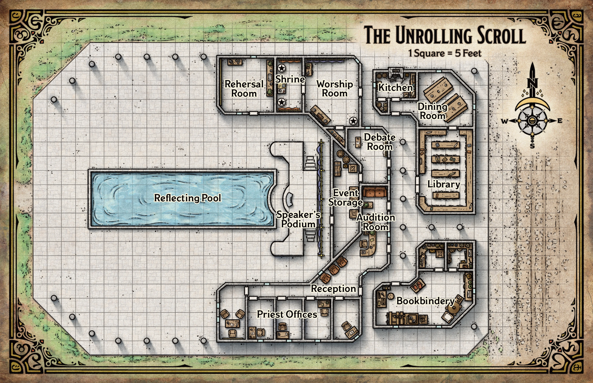
#### Unrolling Scroll

The Unrolling Scroll is an elegant temple of Oghma built around a wide reflecting pool. The vaulted roof above the pool bears exceptional acoustic properties, carrying even the softest voices across the venue. The site is a popular place for weddings or speeches, even among those who don't worship Oghma. Patriars will postpone a family wedding for multiple tendays to secure a reservation at the venue.

Despite its longstanding popularity, the Unrolling Scroll is declining. Brevek Faenor, who once held a position at the temple, left to lead services to Gond at a nearby temple called the High House of Wonders. Now that he's joined the Council of Four, Brevek nurses his old grudge against the Unrolling Scroll by diverting funds away from it, pushing the temple into desperate economic times.

***Speaking Chambers.*** Private rooms called Speaking Chambers surround the temple. These rooms serve as worship spaces and as galleries where priests of Oghma teach oratory, diction, music, and musical theory. Spiritual activities at the Unrolling Scroll are provided by **Priest Acolytes** and **Performers**.

The priest in charge of oratory and diction lessons, an elderly human named High Speaker Thaulem (Medium **Performer Maestro**), is particular about the students he takes on. His office is wallpapered with awards received by his past students. Musicians offer lessons in music and musical theory. The chambers ring with the sounds of *flute*, *viol*, and *yarting*—an instrument akin to a guitar. The curate, a pious dwarf named Valgagar (Medium, Lawful Neutral **Priest**), has served at the Unrolling Scroll longer than anyone else. He loiters around the Speaking Chambers, gruffly extolling the virtues of the spoken word over music.

***Reflective Pool.*** The Unrolling Scroll's reflective pool provides inspiration from Oghma, but not without dedication. Anyone who spends 12 consecutive hours looking at their reflection in the pool sees their reflected face shift into a vision that inspires their next creation. Since anyone who isn't an inhabitant of the Upper City is ejected after dark, inspiration seekers approach the pool at dawn and stay all day, becoming unexpected guests at any ceremony or event occurring that day.

***Other Areas.*** Within the ring of Speaking Chambers, a wide colonnade separates the "artistry" from functional rooms such as kitchens, storerooms, and a bookbindery used exclusively for holy texts. Tight security isn't needed in these chambers despite their open layout, because priests work at the Unrolling Scroll around the clock and quickly intercept unfamiliar intruders with a long-winded diatribe about being respectful when on holy ground.

#### Watch Citadel

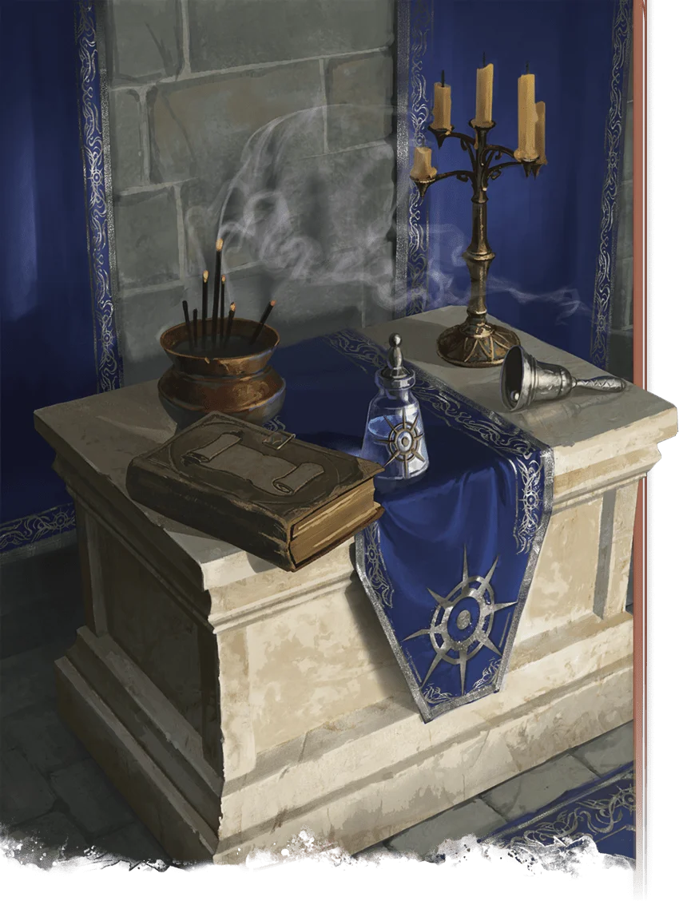

The Upper City's police force uses the Watch Citadel as their barracks, armory, training grounds, and jail. An iron-fisted dwarf named Osmurl Havanack (Medium, Lawful Neutral **Warrior Veteran**) is the citadel's high constable and marshal of walls. High Constable Havanack understands that the patriars demand unquestioned integrity from the Watch, and he punishes misconduct harshly.

Watch Citadel holds the only horse stable within the walls of Baldur's Gate. This stable houses the Watch's well-trained mounts, which they principally ride in parades and as honor guards. In time of great need, the Watch uses its horses to respond to crises, but officers are aware that charging horses through the streets is likely to cause panic.

Watch Citadel sits at the heart of a small, walled neighborhood called Citadel Streets. Businesses that cater to the military, such as weaponsmiths and tailors, thrive here. Crossing through the closely guarded Citadel Gate—the only gate into Citadel Streets—can be a challenge, but this is the best place to eavesdrop on Watch members to learn their internal politics, patrol routines, and concerns. Watch members commiserate with each other in a row of taverns called Last Watch Row.

Patriar Watch officers live in manors elsewhere in the Upper City, while non-patriar officers live in the Watch Citadel or in modest family homes in other Upper City neighborhoods. The few manors in Citadel Streets are owned by wealthy non-patriar citizens of the Upper City. These citizens use their homes to flaunt their wealth and leisure to low-ranking Watch members.

#### Other Sites

Other notable sites within the Upper City include the following.

***Bormul House.*** The patriar Bormul family living in this stately town house has no reason to be suspicious of the unassuming crates deposited in their basement by a visiting relative a year ago. They also don't realize that the recent murders by a serial killer named the Basilisk Prowler (Chaotic Evil **Ghost**) originate from their house. The Basilisk Prowler hunts around Basilisk Gate but is tied to the grave goods in the crates, which the relative left behind to rid his estate of the haunting. For now, the ghost remains undetected.

***Cottle's Wainwright.*** Once a humble wagonmaker's shop, Cottle's Wainwright, near Black Dragon Gate, now manufactures carriages for patriars visiting the countryside or for those aristocrats able to afford to rent Watch mounts for temporary personal use. The business's former owner, Narwin Cottle (Medium **Noble Prodigy**), recently turned over day-to-day production to his staff so that he can concentrate on running a magical coach service using his custom-built horseless coaches (see "Cottle's Carriages" later in this chapter).

***Eomane House.*** The Eomanes arrived on the social scene by acquiring a large manor in the Upper City, but they eschew Upper City connections. Instead, they hold indulgent parties for aspiring socialites from the Lower City. Since these guests risk run-ins with the Watch in the Upper City after dark, they have little choice but to endure the increasingly bizarre and sadistic "games" held in the manor. The four Eomanes fell into secret worship of Bhaal, and they're preparing a slaughter masquerading as a party to demonstrate their devotion. (The "Blood Night" adventure later in this chapter details how the characters might become involved in this murderous spree.)

***Harbreeze Bakery.*** Locals love the sugarbread loaves produced by Harbreeze Bakery, but it's better known for its wide array of teas. Patriars like to sip tea and gossip, making the gregarious human owner Ellyn Harbreeze (Medium, Lawful Neutral **Spy**), one of the best-informed citizens of the Upper City.

***Lady's Hall.*** The inconspicuous Lady's Hall is the temple to Tymora in Baldur's Gate. The building doesn't have enough space for large services—which few adherents of Tymora attend anyway, except on special holidays—so its priests minister in the adjacent plaza. These priests lead troubled petitioners inside the temple for personal pleas to Tymora. If a priest realizes that mortal involvement would be a better way to correct a serious injustice, they seek out adventurers who loiter in the plaza.

***Ramazith's Tower.*** Ramazith's Tower is a six-story tower made of red brick that contrasts starkly with the yellow-marble buildings common to the Upper City. It was built by the famed wizard Ramazith, whose death was as mysterious as the sudden wealth that funded his tower. Ramazith's tower sat vacant for years before an inquisitive human named Lorroakan (Medium **Mage**) acquired it. Humbled by a recent failed bid to achieve immortality through undisclosed means, Lorroakan now seeks brave souls to catalog his tower's contents, some of which are protected with traps and dangerous.

***Rillyn House.*** The impoverished Rillyn family was returned to prosperity by the efforts of the canny human Yvandre Rillyn (Medium **Warrior Veteran**). Yvandre left Baldur's Gate to become a mercenary and returned home with great personal wealth and a desire to teach combat skills to others. Her Rillyn School, occupying the wide yard next to Rillyn House, has become an elite academy for swordplay popular with patriar scions.

***The Wide.*** The Wide is the most prominent outdoor market in the city. People buy and sell items in makeshift stalls in other open-air public venues across the city, but city law forbids outdoor sales within the city other than at the Wide. This restriction ensures that businesses elsewhere in the city can be conveniently taxed, and by pushing open-air business to the Wide, tax collectors ensure the city reliably receives its cut of this trade. Jedren Hiller (Medium, Lawful Evil **Bandit Crime Lord**) is the notoriously corrupt Bailiff of the Wide, who leverages preferential stall placements to line his own pockets. The Wide's most popular landmark is a statue commemorating one of the city's greatest heroes, a Rashemi ranger named Minsc who fought for the city with his miniature giant space hamster, Boo.

***Three Old Kegs.*** The inexpensive inn and tavern called the Three Old Kegs is popular among the Flaming Fist. Several warriors who retired from that company live there. Their presence makes the tavern and the area around it one of the safest public places in the Upper City.

***Watchful Shield.*** The Watchful Shield is a shrine to Helm that is popular with mercenaries and bodyguards. Members of the Watch and the Flaming Fist sometimes come here to have serious wounds tended, as the clergy waives the usual required donation for anyone injured while defending another.

### Lower City

The Lower City's streets clatter with traffic, its shops ring with people at work, and its homes echo with the laughter and cries of city life. Here, commoners gather in crews for protection. Lower City neighborhoods include fashionable Bloomridge, poverty-stricken Brampton, cosmopolitan and thief-riddled Eastway, residential Heapside, rough-and-tumble Seatower, and the commercial Steeps.

#### Blushing Mermaid

When sailors and traders along the Sword Coast think of Baldur's Gate, they think of the Blushing Mermaid. Within this boisterous, mazelike taproom and inn, booze is plentiful and brawls are common. No one of any sense enters without a weapon or tough companions, as a fight is likely to break out at any time—and often multiple times each night. Bar fights ending in fatalities aren't uncommon, and the back alley always has room for a corpse or two.

The Blushing Mermaid takes its name from a macabre trophy hanging above the welcome desk: a life-size wooden mermaid with a wide smile. Nailed to the mermaid are several shriveled severed hands whose owners didn't pay their tabs.

***Rooms.*** Although the Blushing Mermaid rents rooms, rest doesn't come easy in a noisy building where burglars are regulars. Each room bears heavy locks, but wise patrons share a room and keep a watch. The inn's secrecy is an additional defense; the Blushing Mermaid's rooms aren't numbered, and most are down twisting halls or behind hidden panels. Guests rest when no one other than the proprietor, the boisterous human Captain Grisly (Medium **Pirate**), knows where they are. Captain Grisly's only loyalty is to coin and to the mysterious patriar who funds her establishment.

***Criminal Contacts.*** The Blushing Mermaid is infamous as a nexus for meeting criminals or conspirators with interests ranging throughout the city. The Guild places agents here looking for work or to exchange information; currently, the sly halfling Aubrin Merrymiles (Small, Chaotic Neutral **Scout Captain**) is the resident contact for anyone seeking the Guild. The Zhentarim and other criminal syndicates also keep members in residence at the Blushing Mermaid, but anyone seeking them out needs the right password to avoid a knife in the guts.

Although the Blushing Mermaid is a notorious haven for crime, the Flaming Fist never visits it or pursues criminals who pass beyond its wooden mermaid. Baldurians point to the establishment as proof of the Flaming Fist's obvious corruption.

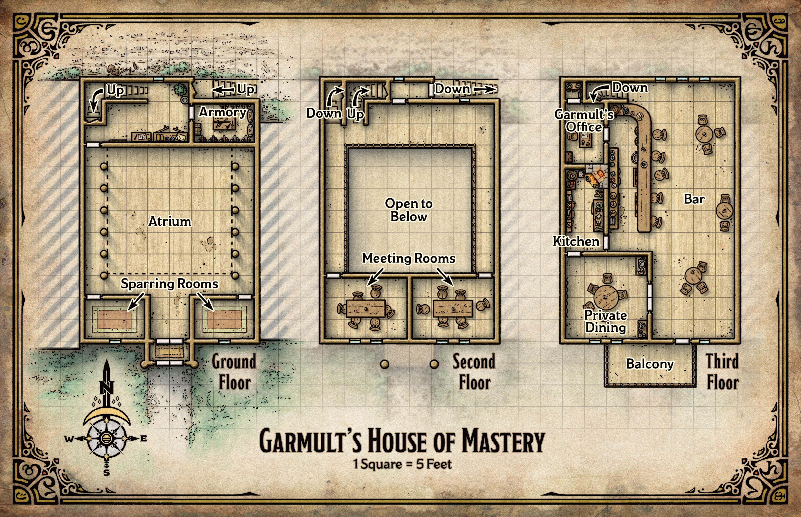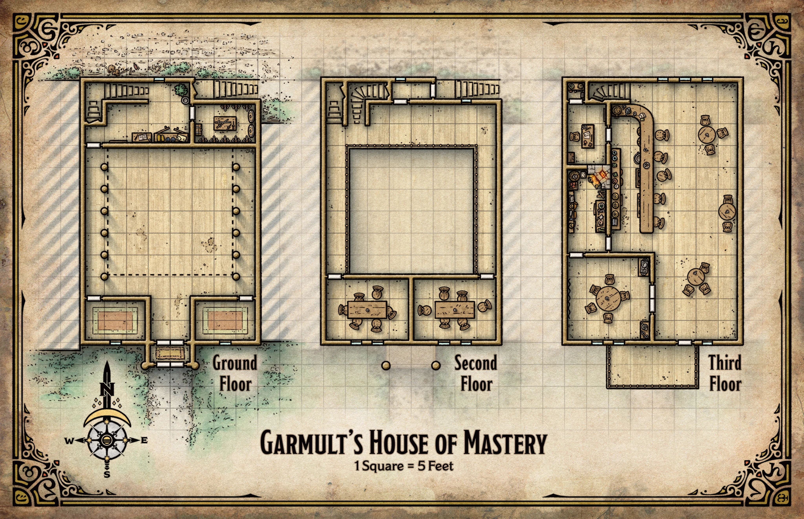
#### Garmult's House of Mastery

The talented martial artist Garmult (Medium, Neutral Good **Gladiator**) earned their way to second in command of the Bannerless Legion, a crew of freelance mercenaries and bounty hunters. With this position came the obligation to run the House of Mastery, the training school and alehouse that serves as the crew's headquarters, if only because the Bannerless Legion's human leader, Dezri "Guts" Lamouer (Medium **Warrior Veteran**), didn't want the trouble. Garmult took to the position with gusto, creating a safe if rowdy place where aspiring warriors can learn the basics of fighting and celebrate their accomplishments. It wasn't long before Garmult's name was appended to the establishment, which suits Garmult's ego just fine.

The Bannerless Legion isn't particularly welcoming of outsiders, but Garmult is friendly to anyone who can beat them in a fight. Over drinks upstairs, Garmult gladly shares leads about people who need guarding or bounties to be claimed in exchange for a nominal finder's fee. These jobs are too delicate or politically sensitive for the Bannerless Legion to handle, such as guarding an unpopular patriar who wants to visit the Outer City or recovering a killer hiding out within an influential Harborhands crew.

***Lessons.*** Fighting lessons and group sparring matches occur in an open atrium on the ground floor ringed by balconies where crowds cheer on participants. Garmult insists that sparring at the school be nonlethal and consensual. Not everyone in the Bannerless Legion agrees with Garmult's predisposition for closely regulated violence, but they don't dare contradict the school's leader at the risk of becoming unwelcome in the bar on the building's top floor. The building's steep stairs pose a serious problem to anyone too deep in their cups.

***Garmult's Grudge.*** Garmult harbors an ardent hatred for the patriar Yvandre Rillyn. Yvandre's former career as a mercenary with the Flaming Fist taught her fighting skills she passes on to other patriar scions in her Rillyn School in the Upper City. Garmult isn't foolish enough to think that patriars would send their children to learn elegant swordplay at a rough-and-tumble school in the Eastway, but nevertheless considers Yvandre an upstart competitor. Garmult is looking for aspiring warriors to engage in a formal duel against the rival school—or to enact some sabotage if Yvandre rebuffs Garmult's challenge.

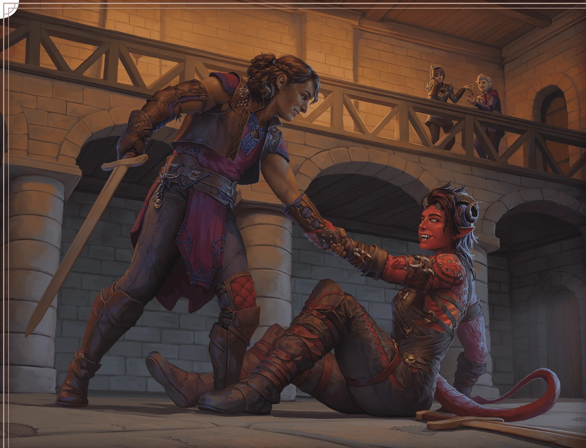

#### Gray Harbor

Gray Harbor, a deep harbor on the Chionthar River, is one of the busiest ports on the Sword Coast. Enormous powered cranes contributed by the temple of Gond loom over wharves and floating docks. The dock is busy at all hours with ship traffic from as close as Rivington and as far away as Chult.

Human harbormaster Darus Kelinoth (Medium, Lawful Neutral **Noble**) oversees ship traffic, ensuring the city collects appropriate taxes from the river trade. These heavy taxes make smuggling a lucrative but harshly punished career at the docks. The true power at the docks—the large dockworker crew known as the Harborhands—cares little whether its work comes from legitimate or illegitimate sources, as long as it gets paid fairly.

Legends tell of a river monster named Ol' Cholms that lurks in the depths of the harbor. A recent spate of mysterious sinkings might be due to something as simple as sabotage, or Ol' Cholms might be reawakening. Harbormaster Darus might loosen his tight purse strings to hire adventurers who can deal with Ol' Cholms. The **Sahuagin Warriors** that lurk in the harbor aren't likely to make such an expedition easy.

#### Water Queen's House

The Water Queen's House is the oldest temple in Baldur's Gate. Devoted to Umberlee, the capricious ruler of the seas and sea monsters, the Water Queen's House squats at the end of a stone pier as if it were ready to tumble into the Chionthar River. The muddy stone structure is strong, though; its base extends deep into the stone beneath the river.

The temple is staffed by twenty waveservants, women widowed or orphaned by the sea. It is closed to outsiders; waveservants near the pier take donations and requests for Umberlee's intercession. The waveservants reverently walk these gifts down stone stairs into the water, but the gifts serve a fell purpose: the priests of the Water Queen's House deal regularly with **Sahuagin Warriors** and a trio of **Sahuagin Priests** that lurk in the river. The sahuagin avoid troubling Baldur's Gate, thanks to these offerings, and the waveservants point out specific ships or seaside buildings they want the sahuagin to destroy. Anyone approaching the Water Queen's House from underwater is fair game for the sahuagin.

The waveservants in the Water Queen's House are led by the commanding human Allandra Grey, (Medium, Chaotic Evil **Priest**). Allandra has noticed sahuagin gathering in greater numbers in the waters near the temple. She's tried to keep them at bay by recruiting two **Water Elementals**, but she worries the sahuagin won't remain passive much longer. To keep her temple's arrangement with the vicious sahuagin a secret, she seeks to hire adventurers to discover what's causing them to swarm.

The situation is more serious than Allandra realizes. The sahuagin priests have already usurped control of Allandra's elementals and are preparing for the arrival of their leader, a **Sahuagin Baron** named Skurr, who rides a **Hydra**. When Skurr arrives, the sahuagin will murder their way through the city, starting at the Water Queen's House, until they recover a sacred conch brought to the city by an unscrupulous trader.

#### Other Sites

Adventurers might find the following sites within the Lower City to be of interest.

***Baldur's Mouth.*** The human Ettvard Needle (Medium, Chaotic Good **Commoner**) runs the Baldur's Mouth news agency from a modest warehouse in Heapside. He publishes news from government sources and his own network of rumormongers in an eponymous broadsheet. Not only a repository for gossip, the broadsheet is also a good source for risky job opportunities, as Ettvard hires freelance investigators to ferret out rumors he can publish.

***Blade and Stars.*** A round shield once hung above the door to the unassuming Blade and Stars inn. The shield belonged to Aurayaun, one of the two owners, and bore the image of a curved blade that twinkled with motes of light like tiny stars. The shield disappeared one night not long ago, along with Aurayaun. Her wife, Lupin (Medium, Chaotic Good **Commoner**), has received parcels with shattered bits of the shield painted with constellations. The last piece just arrived, and she seeks adventurers who will follow this strange starry map and bring Aurayaun home.

***Candulhallow's Funeral Arrangements.*** Corpses across Baldur's Gate are collected by the Candulhallows, a family of elves who have worked their trade in Baldur's Gate as long as anyone can remember. Their public service is marred by rumors that the Candulhallows are necromancers or worse. These rumors barely touch the truth: the family's matriarch, Leylenna Candulhallow (Medium, Neutral Evil **Mage**), is a necromancer with ties to a cult of Bhaal operating beneath the city.

***Counting House.*** The Counting House is a windowless stone building at the edge of the harbor. It operates as a bank, currency exchange, and private vault under its dwarf proprietor, Rakath Glitterbeard (Medium, Lawful Evil **Bandit Captain**). Just as there is much more to the Counting House than meets the eye—its vaults extend deep into the stone beneath the building—Rakath is more than he appears. Not only does he lead the city's banking crew, the Honorable Order of Moneylenders, but he's also the Guild kingpin for the Steeps.

***Eastway Expeditions.*** Eastway Expeditions is an outfitter specializing in goods for explorers heading to distant Chult. Its tiefling owner, Scalm Shilvin (Medium **Spy**), runs a side business in getting people onto outgoing ships in secret, providing safe escape from Baldur's Gate for people who need it.

***Elfsong Tavern.*** One of the most popular taverns in Baldur's Gate, the Elfsong Tavern is operated by its elf proprietor, Alan Alyth (Medium **Commoner**). The tavern's boisterous patrons hush at irregular times when a disembodied song fills the tavern, lamenting a love lost at sea.

***Harborside Hospital.*** Those who can't afford priestly aid for their injuries come to Harborside Hospital in the Brampton neighborhood. An efficiently run facility with separate wards for each city neighborhood, the hospital has been instrumental in containing the spread of illness throughout the city. The hospital is near Cliffgate, where bodies can be carried to the city's graveyards.

***Hissing Stones.*** The Hissing Stones is an elegant Chessentan bathhouse in the Seatower neighborhood that is popular for clandestine assignations. Patrons wear only the thin robes provided by the bathhouse, making it safe. The bathhouse is a good place to meet with members of the Reveler's Union, who sell secrets to the highest bidder.

***Insight Park.*** Once a dump in the Lower City's southeast corner, Insight Park is now a popular destination for residents. A dwarf named Torimesh (Medium, Lawful Neutral **Druid**) used his magic to grow a pleasant forest atop the heaped trash. Torimesh can pull bark from one of the trees to divine the future, but he does so only in exchange for cryptic favors.

***Jopalin's.*** Once a seedy tavern, Jopalin's is now an elegant teahouse. The tea is secretly laced with subtly addictive moonflower leaves that drive customers to return. **Toughs** from the tavern cause anyone who might expose their racket to disappear.

***Low Lantern.*** Low Lantern is a raucous feast hall situated in an unseaworthy old ship—only the sturdy dock it's lashed to keeps it afloat. Patrons on the upper deck have an excellent view of the harbor, while patrons belowdecks engage in gambling or skulduggery.

***Mandorcai's Mansion.*** Appearing out of nowhere on a vacant lot more than twenty years ago, Mandorcai's elegant mansion soon became the talk of the Bloomridge social scene. Its master, the inscrutable wizard Mandorcai, famously hosted parties that he barely attended. Mandorcai disappeared one evening as mysteriously as he came, but the house remains, boarded up and empty. Those peering through its shuttered windows swear they've seen rooms shift and change while chain-wrapped creatures (**Chain Devils**) drift through them like sinister spirits.

***Seatower of Balduran.*** The headquarters of the Flaming Fist, the Seatower of Balduran juts into Gray Harbor on a rocky islet. Festooned with siege weaponry mechanically enhanced by Gondian ingenuity, the fortress is well equipped to repel maritime incursions into the city. It sits atop three levels of dungeons that serve as a prison the Flaming Fist keeps full of dissidents and petty criminals.

***Seskergates.*** When the Sesker merchant family died under tragic circumstances, their manor, called Seskergates, was purchased by a scheming human from Athkatla named Imbralym Skoond (Medium, Neutral Evil **Mage**). Imbralym and his sinister entourage of **Mage Apprentices** are tearing up the manor's interior in search of a magical tome. Hidden tunnels into the sewers brought other malevolent monsters, including a **Nothic**; these creatures have allied with Imbralym and joined the search.

***Shrine of the Suffering.*** This simple shrine to Ilmater, called the Shrine of the Suffering, stands at the edge of a public plaza filled with desperate people seeking Ilmater's grace. Several levels of simple crypts extend beneath the shrine, where even the poor in the city can afford a simple niche so they can be buried on holy ground.

***Smilin' Boar.*** The halfling Jentha Allinamuch (Small, Chaotic Good **Commoner**) chose the stodgy Bloomridge neighborhood to open her bawdy breakfast restaurant, the Smilin' Boar. Her scandalously named dishes have caused a stir, and business is brisk.

***Sorcerous Sundries.*** Sorcerous Sundries is a tall tower with a stained-glass domed roof. It has residences in the upper levels and a popular magic shop on its lowest levels. Its proprietor is an eccentric human wizard named Rivalen Blackhand (Medium **Mage**). Adventurers like dealing with Rivalen because he pays in coin for magic items and doesn't ask questions about bits of blood or bone on these items. Rivalen's frequent dealings with the Guild have made him a cunning negotiator, and Guild agents accost wealthy sellers who earn his disdain.

### Outer City

*Hey, Cliffgate, that's me! Our family lived just outside the gate we're named for. My folks worked in Cliffside Cemetery. Were buried there too. Later on, I moved them to a Lower City graveyard so I could visit more often. Hi, Mum. Hi, Dad.*— Karlach CliffgateThe most dangerous district in Baldur's Gate, the Outer City is the only place many travelers and citizens can afford to dwell. It's lively with the noise of animals, as it's filled with stables, slaughterhouses, and other industries forbidden within the city walls due to regulations against admitting animals larger than a peacock. Outer City neighborhoods include elegant and fortified Little Calimshan, quiet Norchapel, eclectic Sow's Foot, workaday Stonyeyes, devout Twin Songs, and foggy Tumbledown. (For Rivington, considered by some part of the Outer City, see "Beyond Baldur's Gate" below.)

#### Cliffside Cemetery

The foggy neighborhood of Tumbledown sits against Dusthawk Hill right outside Cliffgate. The neighborhood's principal purpose and greatest industry is the Cliffside Cemetery, a repository for the dead of Baldur's Gate. Though wealthy patriars are laid to rest in family vaults beneath their manors, poor but pious folk pay for a niche in the Shrine of the Suffering's crypts, and dockside murder victims end up in the harbor, everyone else comes to Cliffside Cemetery.

Tumbledown is home to embalmers, coffin makers, gravediggers, professional mourners, and other people whose job revolves around the cemetery. Although such people might otherwise know a cemetery remarkably well, Cliffside Cemetery is a veritable maze of mausoleums, monuments, and worn headstones. This maze is vertical as well as horizontal, since the cemetery is built into Dusthawk Hill. Cemetery guides make good money leading visitors to sites of interest. Dusthawk Hill is riddled with natural caverns, and the ground shifts from time to time, jumbling graves' contents and opening dangerous fissures—some with disinterred corpses or coffins protruding from their sides.

In Baldur's Gate, grave robbery is distressingly common. Baldurians long ago learned to bury their dead without valuables, but robbers speculate the oldest graves still hold treasures for the taking.

Undead are a constant problem in Cliffside Cemetery, from mindless **Zombies** to hungry **Ghouls** and even **Vampire Spawn**. The local Gravemakers crew arms and trains its members to repel undead from their neighborhood in addition to their duties as gravediggers and caretakers.

#### Hamhocks Slaughterhouse

The largest slaughterhouse in Baldur's Gate is in the Sow's Foot neighborhood, where the residents are too poor to protest the odors. Hamhocks Slaughterhouse was recently infiltrated by cultists of the Dead Three, whose ritual murders drew attention to Sow's Foot that even the patriars couldn't ignore. Weeks ago, the largest contingent of the Flaming Fist to brave the Outer City in years stormed the slaughterhouse and brought the cultists to justice. Business at the slaughterhouse quickly returned to normal.

At least, that's the public perception. In truth, Nine-Fingers Keene, leader of the Guild, orchestrated the assault, leveraging her extensive network to expose the cultists and spur the Flaming Fist into action. Hamhocks Slaughterhouse is now firmly in the Guild's control, and it's become the Guild's largest operation outside the Lower City. The Guild uses shipments of meat to smuggle small goods, deliver messages, and poison targets throughout Baldur's Gate. The affable aasimar administrator Kopali Dunn (Medium, Neutral Evil **Death Cultist**) runs the operation and reports to Nine-Fingers Keene.

However, Kopali is double-crossing the Guild. A secret follower of Myrkul, Kopali is searching the slaughterhouse for relics of the Dead Three rumored to have been overlooked in the Flaming Fist raid. These investigations are easily justified by her hands-on administration, so she hasn't yet drawn suspicion. Whatever Kopali is looking for promises to bring a new era of death to the slaughterhouse.

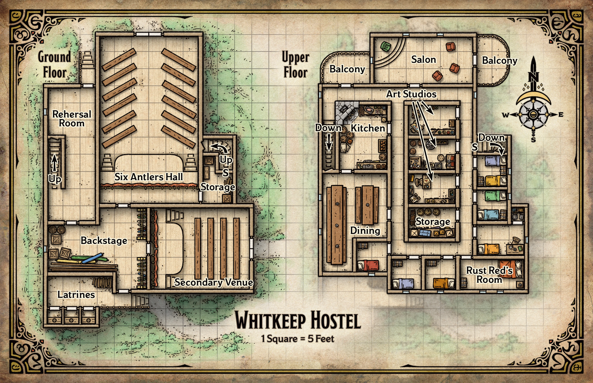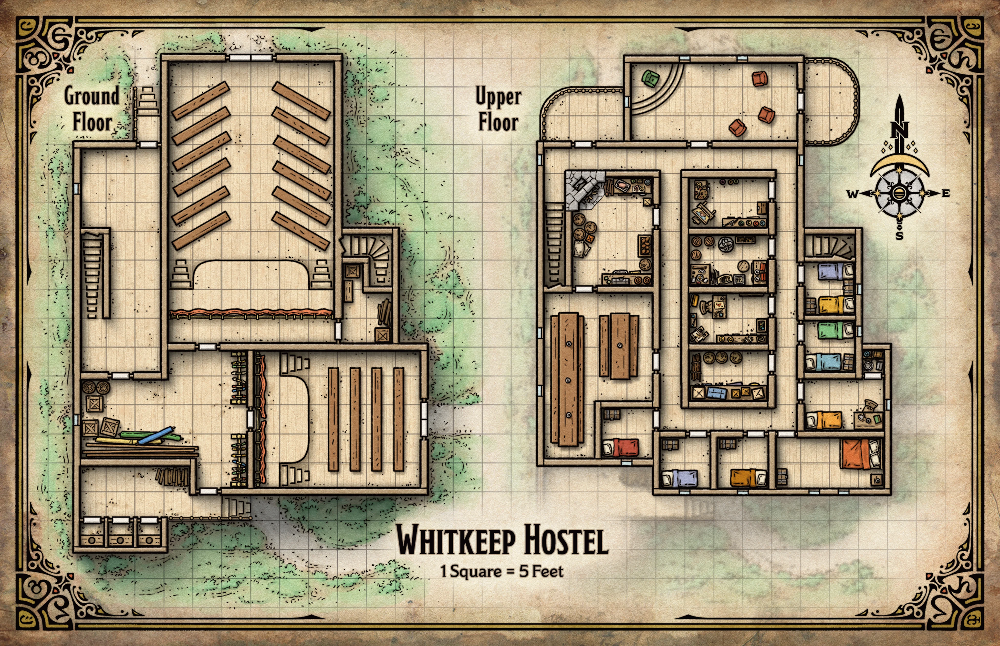
#### Whitkeep Hostel

A bright spot of whimsy in Baldur's Gate, Whitkeep Hostel is a commune of mostly gnome artists scaled for small folk. Spontaneous art fairs, eccentric art installations, and colorful tents surround the hostel.

Whitkeep Hostel sets a pleasant tone for the entire Whitkeep neighborhood, although the actual labor of running the neighborhood's tanneries, gardens, and trade shops leaves the residents with less time for whimsy than the hostel's residents enjoy.

The forest gnome Rust Red (Small, Chaotic Good **Performer Maestro**) runs Whitkeep Hostel—to the extent he deigns to take charge of anything. Artists must respect only a few rules: residents must respect the art of others and spend one day each tenday without lifting any tool used to create art. This is intended to encourage a day devoted to hostel chores or repairs, but some guests shirk this duty to rest while insisting they're following the rule.

Baldurians from across the city come to the eclectic concerts, plays, and gallery exhibits in and around Whitkeep Hostel. The hostel's main venue, Six Antlers Hall, is the preeminent place for such shows, and performers commonly fight over who has scheduled which days. Recalcitrant artists use Six Antlers Hall even when a rival is there, sometimes creating inspired, artistic mashups.

The hostel's laissez-faire, open-door policy recently led to tragedy. Three artists bunking in the same room were murdered in their sleep. Rust Red is keeping the killings quiet, having told only his recent paramour Eegru Hobbledown. Rust Red asked Eegru to help dispose of the bodies without realizing that Eegru is actually to blame. "Eegru" is a guise for a **Succubus** named Lhunza who took the form of a gnome animal trainer to corrupt the commune from within. Several artists in residence have fallen under Lhunza's influence, turning aspects of their art eerie and sinister. Lhunza's trained "animals" are **Imps** intent on murdering residents too close to uncovering the truth—and Rust Red is next on their list.

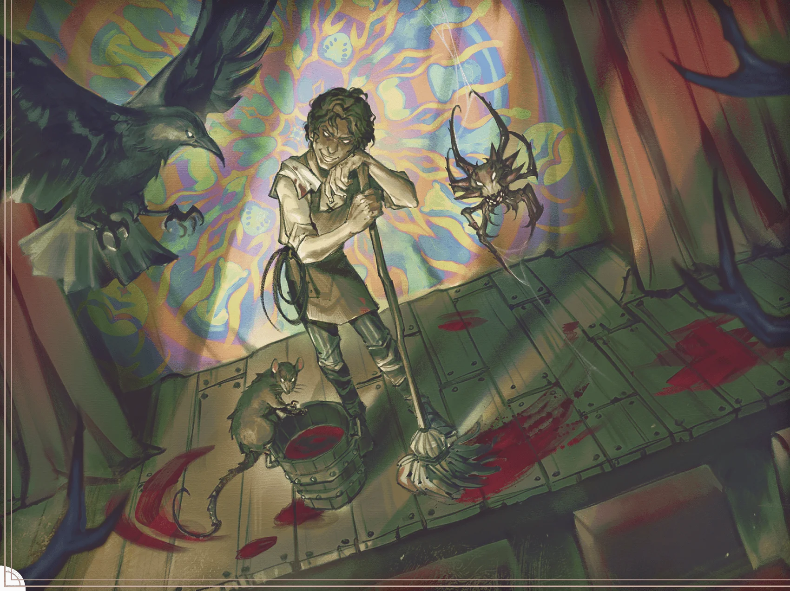

#### Wyrm's Crossing

When travelers reach Baldur's Gate from the south, they see a bridge across the Chionthar River that's covered in haphazard wooden structures and bisected by a stone fortress. This bridge is Wyrm's Crossing, the only river crossing for miles.

***Toll Station.*** Wyrm's Crossing was built as a toll station capable of supporting heavy wagonloads. The Flaming Fist collects the required tolls—plus a bit more—as travelers pass through the huge stone tunnel leading through the keep at the bridge's center. Drawbridges at either end of this tunnel allow the Flaming Fist to block access to the city, which it does daily from dusk until dawn and in emergencies.

***Wyrm's Rock.*** The toll station is part of the Flaming Fist fortress of Wyrm's Rock, named for the long-dead dragon that laired on the islet. The fortress's two upper levels contain barracks, armories, officers' quarters, and enormous mechanisms to operate the drawbridges. A dungeon level houses prisoners and leads to a small dock at the fortress's base where the Flaming Fist keeps a few fast boats to intercept river traffic. The fortress's commander is the unpopular dwarf Gardak Horn (Medium, Neutral Evil **Mage**), whose soldiers wonder how to best arrange his long, fatal fall into the river.

***Precarious Community.*** To either side of the fortress, the bridge is covered in a wild arrangement of buildings. Many are cantilevered out from the bridge's sides, hang beneath it on ropes, cling to its support pylons, or extend upward to totter precariously above its surface. Here, brave or desperate folk ply travelers with their wares, pick pockets, offer their services as guides, or beg for coin to pay their tolls. Businesses specialize in extracting coin from new arrivals or pulling a few last coins from departing travelers; food stalls, taverns, gambling dens, outfitters, city guides, map sellers, and more jostle for space.

#### Other Sites

Other Outer City sites include the following.

***Balduran Looks out to Sea.*** The mysterious magical statue known as Balduran Looks out to Sea appeared at the edge of the Tumbledown neighborhood after Balduran disappeared for the last time. The twelve-foot-tall statue looks over the city and river to the west. The statue moves slightly each year, raising a spyglass or shifting its gaze slightly. Surveyors determined that the statue always looks toward Balduran's Tomb in the distant forest (see "Beyond Baldur's Gate" below).

***Blackgate.*** Although it's outside the walls of Baldur's Gate, Blackgate isn't technically part of the Outer City. Situated northwest of the city outside the Black Dragon Gate, Blackgate is home to stables, traders, and dwarf blacksmiths that command high prices, and patriars make up most of Blackgate's clients. Blackgate also has significantly less crime and poverty than Outer City neighborhoods to the east, in part due to the Watch's occasional presence while officers guard shopping patriars, but also due to defense-minded crews like the Ardent Smiths.

***Church of Last Hope.*** The scholarly human Mother Aramina (Medium, Lawful Good **Priest**) runs the Church of Last Hope, a combination of multi-denominational chapel and asylum. Mother Aramina takes in those who need quiet rest and treatment for mental-health problems, and she occasionally ventures into the city to offer sanctuary to those in need of such care. It's not clear how she knows someone in the city will need her aid, but her appearance is always timely.

***Danthelon's Dancing Axe.*** Danthelon's Dancing Axe, an overstuffed outfitter shop, sells any goods an adventurer might need, from weapons and camping gear to saddles and armor. The shop's name comes from the enchanted axe that hovers around the shop after hours to keep potential thieves at bay. The energetic dwarf proprietor Entharl Danthelon (Medium, Neutral Good **Commoner**) falsely claims to have once been an adventurer but is nevertheless a trove of useful advice and job leads. He shares the best opportunities with courteous purchasers who don't haggle with him much.

***Dusthawk Hill.*** Generations of masons have pulled stone from Duskhawk Hill, an enormous hill of yellow granite, to construct the manors and temples of Baldur's Gate. Still, Dusthawk Hill towers above the Outer City and the city's outer walls. Sea caves beneath Dusthawk Hill flood and empty with the tide, providing a risky place for hiding smuggled goods or fugitives. These tunnels, collectively called the Riverveins, have never been completely mapped. In addition to being a hideout for **Bandits** and a lair for **Stirges**, the Riverveins conceal long-hidden treasures and untold secrets.

***Garynmor Stables and Menagerie.*** Garynmor Stables and Menagerie has two locations: one in Blackgate and another in Stonyeyes. For a reasonable fee, travelers can board their mounts at one location and pick them up at the other to avoid violating the city's prohibition on large animals within its walls. The Stonyeyes location includes a menagerie of strange and dangerous animals, which Baldurians enjoy as a somewhat risky zoo.

***Oasis Theater.*** In the walled neighborhood of Little Calimshan, refugees and visitors from Calimshan are surrounded by the styles and food of their homeland. Until the neighborhood closes in the late afternoon each day, visitors are welcome at establishments like the Oasis Theater, one of Baldur's Gate's premier entertainment venues. Performances at the Oasis Theater are lively and display phenomenal theatrics, using movable clockwork scenery and realistic illusions to enhance the shows.

***Sweetjen's Spices.*** This spice shop hangs precariously from the side of Wyrm's Crossing, north of Wyrm's Rock. People from Baldur's Gate can access the shop after dark, when the shop switches from selling mundane spices to selling drugs and powerful poisons.

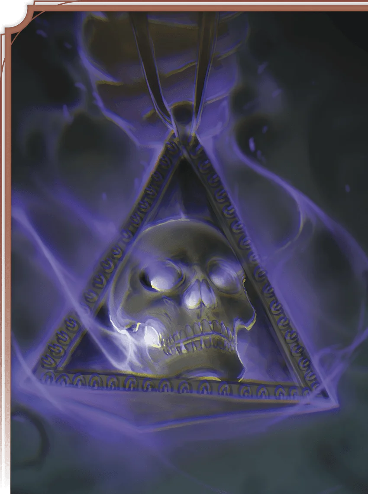

***Unruly Flesh.*** The squat massage parlor called Unruly Flesh in the Twin Songs neighborhood is sandwiched between a shrine to a nameless god of destiny and a woodcarver offering holy symbols from imported wood. The Unruly Flesh's proprietor is a silent, lanky human massage therapist known as Bonepincher (Medium **Cultist of Myrkul**; see chapter 9). Bonepincher keeps a small staff of obsequious attendants (Medium, Neutral Evil **Priest Acolytes**). Although the attendants insist their master is nonreligious, that's a lie: the group venerates Myrkul. Bonepincher marks patrons having "the right kind of bones" with a magical unguent that inflicts debilitating pain. The attendants bring the pain-wracked victim to the parlor's back rooms, where Bonepincher removes the treasured bones to add to his gory shrine.

### Sewers

Secret vice dens, covert passages, slimy cesspits, and monster lairs fester below the streets of Baldur's Gate. Although Baldurians collectively call these "the Sewers," many parts are free from offal and odors. No single creature knows the full extent of this network.

#### Dalliance Down

An avant-garde nightclub for discerning and wealthy Upper City residents, Dalliance Down can be reached only via the city's sewers. Gondolas replete with pomanders provide the only access to the spot, and the masked gondoliers who pole their visitors through the muck are the model of discretion.

Past the metal doors into the club, the filthy tunnels give way to elegance—hanging chandeliers, rich tapestries, and black flowers. Private booths ring a shadowy dance floor, and padded nooks for clandestine conversations abound. Nurra (Neutral **Ogrillon Ogre**) collects the significant door fee and ejects troublemakers. The well-stocked bar is tended by the affable human Titus Dorrevan (Medium, Neutral Evil **Cultist Fanatic**), who merely shrugs when asked where he acquires such delectable hors-d'oeuvres—or who owns the nightclub. The owner, a robed **Satyr Revelmaster**, spends evenings mingling while disguised as a tiefling hedonist named Prudence.

Dalliance Down isn't accessible when the sewer tunnels are running at their fullest, such as after heavy rains. Patrons caught in the nightclub when the waters rise must wait there, possibly for days. The claustrophobia and desperation sometimes plunge visitors from sensuous debaucheries to hellish torments, and survivors rarely speak about what they endured.

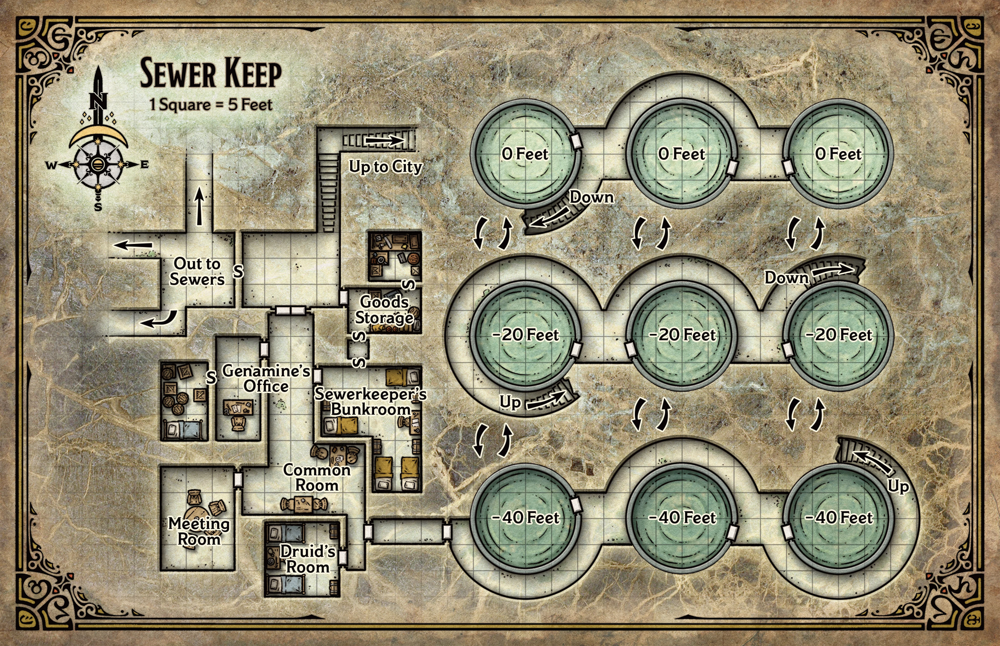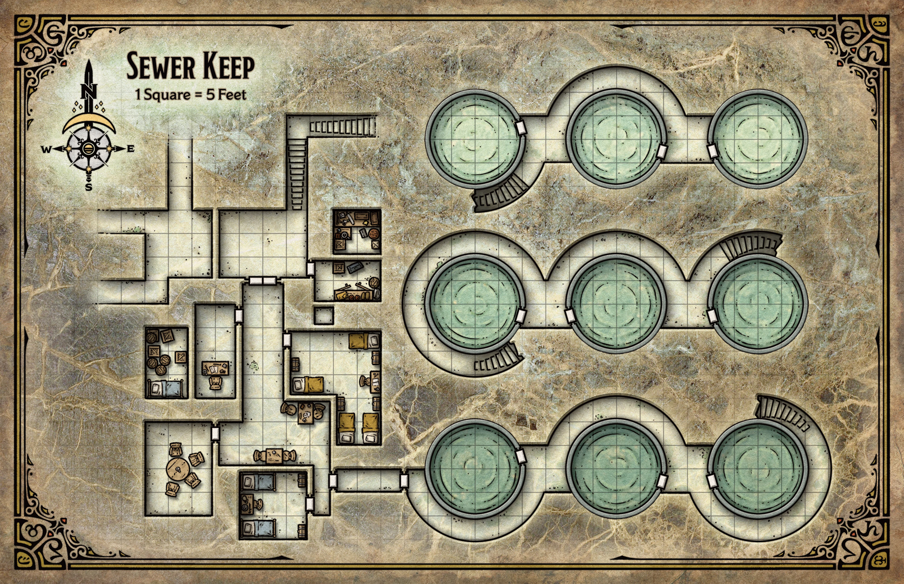
#### Sewer Keep

Three stone towers collectively called Sewer Keep loom over the Chionthar River, ostensibly to capture and purify the city's waste before it's released downstream. Although this civic project had the best of intentions, funding dried up shortly after the towers were completed.

***Sewerkeepers.*** A small group of humans (Medium **Druids**) and their three loyal **Shambling Mounds** do what they can to purify the city's effluence. These hardworking druids are members of the Sewerkeepers crew and are among the few associates who aren't smugglers, killers, or thieves. The human Genamine Kopali (Medium, Neutral Evil **Assassin**) runs the crew and works closely with the Guild. The Sewerkeepers occasionally work as paid guides or monster hunters in the sprawling Sewers's dangerous areas, where fatalities can be high. The Sewerkeepers survive these encounters, even when their charges don't; rumors that the Sewerkeepers lure the gullible into the sewers to rob and kill them are, in fact, true.

***Flood Towers.*** The Sewerkeepers call the three towers the Flood Towers. A cunning valve design pushes water up into these towers, one after another, and back into the river, rather than flooding the complex of storage chambers and bunk rooms built beneath the towers. The druids traverse the narrow passages between the tops of the towers, sealing the hatches behind them as they engage in purifying rites. They assign a single shambling mound to each tower, where the mounds' bodies absorb pollutants. When effluent runs thick, they move all three creatures into each tower in turn.

Other Sewerkeepers use the flow through Sewer Keep to dispose of evidence, dunk prisoners during interrogations, or hide heavy caches of treasure impervious to the flowing water. The druids would protest these sinister uses if they knew about them, but Genamine keeps them in the dark.

***Maintenance Woes.*** Two Sewerkeeper technicians recently died within a few days of each other, and none of the remaining members know how to maintain the keep's hydraulic valves. Genamine insists she'll address this problem, but her negligence puts the entire crew at risk of a sudden, noisome flood.

#### Undercellar

A network of tunnels and storage chambers called the Undercellar sprawls beneath the Wide, the Upper City's open-air market. Although a few regular vendors in the Wide use the easily accessed chambers to store goods intended for sale, more people know the Undercellar for its entertainment venues. Bars and gaming dens—bright, noisy sparks of life in the ancient warren—are connected by gloomy tunnels. The tunnels double back on each other and are riddled with old cracks and peepholes used for spying and skulduggery. Guild agents keep to the shadows of the Undercellar, where they sell drugs, poisons, and forged documents.

Although the best-known entrances to the Undercellar are beneath the Wide, other ways to access it include secret tunnels from the Sewers. A gang of toughs called the Cellarers keeps order in the Undercellar. People assume that the Watch and the Flaming Fist have an agreement with the gaunt, smarmy Heltur "Ribbons" Ribbond (Medium, Neutral Evil **Assassin**), human leader of the Cellarers and kingpin of the Undercellar. Ribbons doesn't reveal how he arrived at this truce with the peacekeepers, but it likely involved bribery, given the staggering sums traded in his underground domain each day.

#### Other Sites

Most residents don't realize the locations below exist beneath their feet.

***Bhaal's Abattoir.*** A botched magical ritual long ago teleported a stout stone tower into the Sewers upside down. This isolated, inverted site has served as a refuge for explorers and a secret storage area for smugglers, but now it's the domain of two rock gnome followers of Bhaal (Small **Cultists of Bhaal**; see chapter 9). Once butchers in the Whitkeep neighborhood, these wicked killers started carving up travelers as well as animals. When their villainy was uncovered, they fled into their shop's basement and made their way to the inverted tower. Dubbing the establishment Bhaal's Abattoir, the cultists prey on underground travelers as they plan a kidnapping spree in Bhaal's name.

***Heap Passage.*** The gates to the Upper City close every night, so rare clandestine passages into the Upper City are popular with thieves and spies. One of these routes is the Heap Passage, which leads through tunnels from a warehouse basement in Heapside to a crypt beneath a ruined home near the Wide. The self-appointed toll keeper of this narrow passage is the sneaky halfling Reedy Margew (Small, Chaotic Neutral **Scout**). Margew knows which stones can shift to entomb people taking the passage, and she demands a toll to keep Heap Passage safe. She closes up the passage and disappears if the Watch or the Flaming Fist enters the Sewers.

***Offalscape.*** A chain of three natural caves, each overlooking a single gentle whirlpool of sewage, is the domain of three **Otyughs**. They find the atmosphere in their caves appealing and have set up a few scavenged tables and chairs to draw people in to enjoy the view. Needless to say, the otyughs haven't had much luck and are considering kidnapping "guests."

***Underjunction.*** Recent sewer renovations below the Steeps neighborhood caused three connecting sewer tunnels and the cistern they fed to fall into disuse. A human named "Patch" Hallavan (Medium, Chaotic Neutral **Pirate Captain**) sold his ship to finance a blood-sport arena in the newly dry space called Underjunction. The arena is one of the hottest gambling operations in the city. The arena's current champion is the orc Gongar (Medium, Neutral Evil **Gladiator**) who used to serve as Patch's bosun. Patch is making so much money that the Guild feels obligated to intervene, but Nine-Fingers Keene hasn't yet decided whether to approach the pirate-turned-ringmaster with an open hand or a fist.

### Beyond Baldur's Gate

Great roads to and from Baldur's Gate—the Coast Way to the south and the Trade Way to the north—cut through wild, dangerous, and sparsely inhabited terrain. Even on the well-traveled Chionthar River, it's wise to keep a blade close at hand.

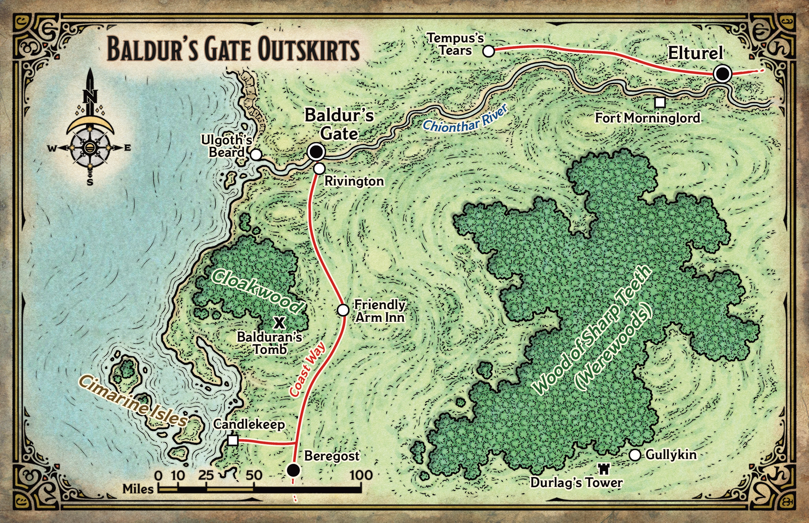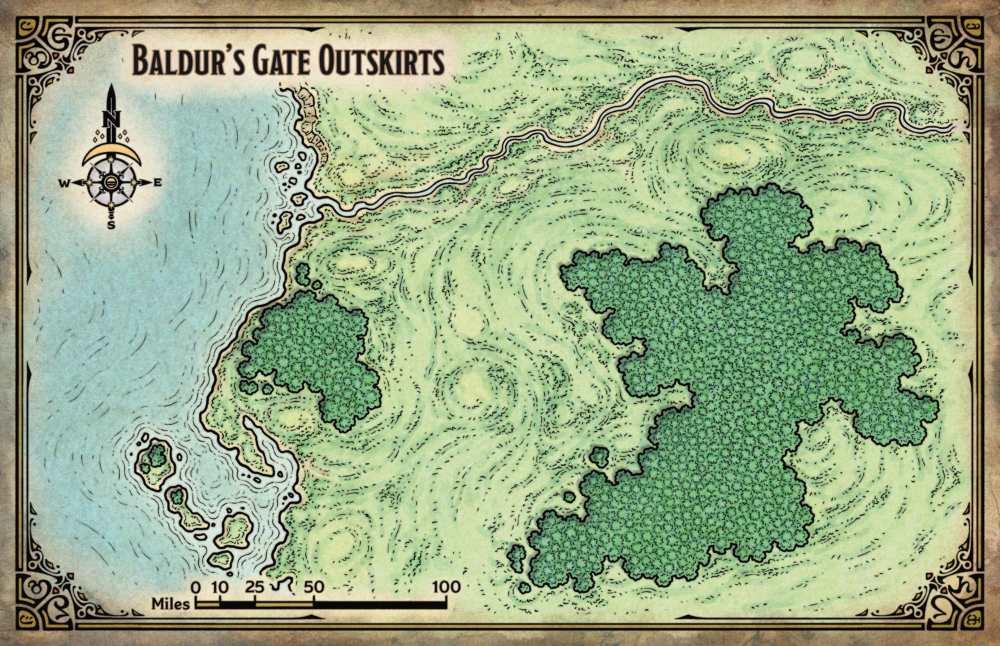
#### Balduran's Tomb

Balduran's Tomb is a cylindrical stone building deep in the forest southwest of Baldur's Gate, south of the Chionthar River. No tracks or trails lead to it, as the building disappears each year and reappears somewhere else. The only clue to finding it is the gaze of the mysterious statue called Balduran Looks out to Sea (see above), which magically redirects its gaze toward the building each time it changes location.

The building bears a human-size statue of Balduran that matches Balduran Looks out to Sea, making it clear the two are somehow connected, but it's only local lore that names this building "Balduran's Tomb." No one is definitively known to have bypassed the strange glowing wards that block the building's entrance, but scrying revealed a spiral staircase leading down into the forest floor.

Recently, an adventurer told stories throughout the Lower City taverns that he'd not only seen Balduran's Tomb but figured out the pattern to shift the wards and descend the steps. He spoke of humanoids radiating brilliant light and a great machine with spinning lenses glowing with a color he couldn't name. He awoke on the forest floor days later, and he's hoping to return to the tomb to investigate further.

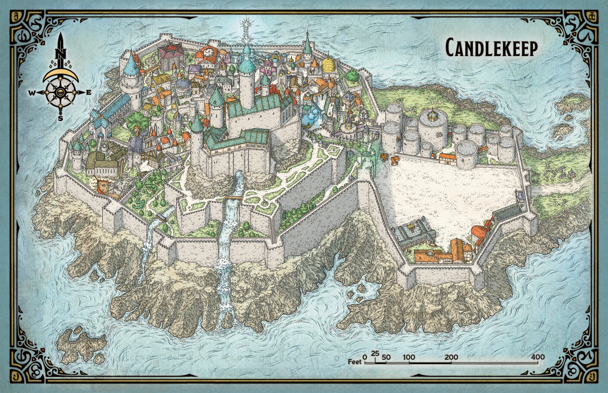
#### Candlekeep

The famous library of Candlekeep stands atop a crag overlooking the Sea of Swords, a few days' travel south of Baldur's Gate. The stone citadel holding the books, scribes, and shrines consists of several tall towers encircled by a heavy wall. Powerful magic ensures that visitors can enter only through the citadel's massive metal gates. Candlekeep maintains a staff of over three hundred individuals called Avowed. Several **Archmages** are always in residence to handle problems or hostile visitors.

Anyone seeking entrance to Candlekeep must pay its well-known toll: a single book that's not already in the library's massive collection. Five Avowed **Priests** stand at the front gate, examining texts visitors present to gain entry. Booksellers and forgers alike in Baldur's Gate run a brisk trade in books "guaranteed" to grant admission to Candlekeep.

Once an individual is admitted entry, they must agree to four rules known as the Orders of Accordance:

- No fighting
- No stealing
- No copying
- No damaging, marking, or otherwise modifying the works

Individuals who break these rules are banished from Candlekeep and seldom allowed to return.

The human governor of Candlekeep is Janussi, the Keeper of Tomes (Medium **Archmage**), who's held her position for more than a decade. She is assisted by individuals known as readers, experts in a given scholarly field who are also responsible for administrative tasks.

You can learn more about Candlekeep in the *Candlekeep Mysteries* adventure anthology and in the 2024 novel *The Fallbacks: Bound for Ruin*.

#### Rivington

Rivington is a small community of fishers and millers along the south shore of the Chionthar River. Clustered around the southern end of Wyrm's Crossing, Rivington is sometimes considered part of the Outer City. As in any Outer City neighborhood, the Flaming Fist expects deference and obedience when its officers visit, but they don't care much about policing the community's problems.

The people of Rivington don't consider themselves part of Baldur's Gate. The river creates enough of a barrier that they ignore the city's woes, and they're keenly aware that the Wyrm's Crossing drawbridges keep them out each night, instead of protecting them from the wilderness to the south. Nevertheless, Rivington fishers row to the city to sell their catch or engage in light smuggling.

***Markets.*** Rivington's shops hold goods that visitors to the city might want, but not as many illicit substances as the sketchier Wyrm's Crossing. Rivington General is a smithy whose dwarf master smith and proprietor, Gyldro Angleiron (Medium **Commoner**), sells arms and armor for those braving the wilderness or Baldurian taverns.

***Rivington Rats.*** Rivington's local criminals are the Rivington Rats. Unlike the Guild, the Rats aren't well organized; and unlike commoner crews in Baldur's Gate, the Rats don't provide protection to locals. The Rivington Rats recently came under the leadership of a disgraced human actor named Arvensel Raffer (Medium, Chaotic Evil **Performer Maestro**). Arvensel puts on an outward show of being cautious and easily cowed, but he's quietly training his gang to be more effective swindlers. He plans "performance shows" where he releases his newly minted con artists on trade caravans leaving the city, but for now his Rats are little match for canny Baldurians.

## Baldur's Gate Stories

Adventures in Baldur's Gate typically feature themes such as urban adventure and people as monsters. The following section contains specific advice on these themes and how to use them in your adventures.

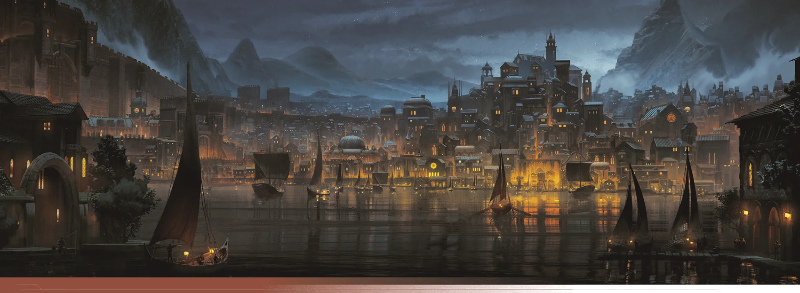

### Urban Adventure

Urban settings allow for a wide variety of adventure opportunities. Danger lurks in shadowed parks, down narrow alleys, and in the bright salons of aristocrats.

An urban adventure is, in some respects, easier for characters. Healing and supplies are usually close at hand. In many cities, the local guard can be useful allies (although rarely in Baldur's Gate, where the guard is notoriously corrupt). Foes tend to be people, so it could be easier for characters to lie or bargain their way out of a dangerous situation.

At the same time, urban adventures pose unique difficulties. The characters have less freedom to unleash destructive spells or effects, for fear of harming innocent people and their property. Just as the heroes can quickly call for allies, so too can urban villains. Particularly in intrigue adventures, people might not be who they seem, so the characters risk being betrayed. Characters in urban settings must keep their wits about them.

### Hidden Villains

Foes in an urban adventure are seldom feral monsters. Instead, they hide sinister actions behind a veneer of social acceptability. Even villains who consider commoners to be worthless rabble prefer to minimize unwelcome attention. Non-Humanoid villains who can disguise themselves among the citizenry—such as doppelgangers, succubi, or vampires—thrive in an urban environment. Inhuman villains typically try to appear sophisticated, such as an incubus that owns a profitable hostel or a sea hag with a penchant for frilly shirts.

More often, however, urban villains are Humanoids. These foes aren't necessarily monstrous in appetites or appearance; they are villains because of what they are willing to sacrifice and who they're willing to hurt, whether they're murdering for pleasure or demolishing a tenement to clear space for a private garden.

### It's Who You Know

With so many people interacting with the characters in an urban setting, it's useful if the party can count on local support. In Baldur's Gate, commoner crews are the best source of widespread local help, although they aren't traditionally powerful and have limited areas of influence.

Having a good relationship with the Flaming Fist and the Watch can be helpful in Baldur's Gate, since smoothing the way past infractions or gaining information about an official investigation can make adventures easier. However, corrupt peacekeepers are likely to betray the adventurers if someone with deeper pockets or greater influence gets involved.

Criminals can also be a valuable resource, even for law-abiding adventurers. Most criminal organizations don't want to cause too much damage to the city's people or infrastructure, or they'll have nowhere left to ply their trade. All but the most despicable criminals in Baldur's Gate have a personal code and join forces to protect their territory. Because criminals tend to be easy to motivate with money, adventurers can pay someone to get information, lose a tail, or hire muscle.

### Cottle's Carriages

When characters in Baldur's Gate need to get around, one of the best methods is a series of mobile teleporters built by Narwin Cottle. Cottle's Wainwright has produced and put into use more than a dozen of these conveyances, which appear to be elegant carriages. Most roam the Upper City, with occasional trips into the Lower City or even the Outer City to drum up interest. The distinctive carriages are causing quite a stir, even among the majority who don't know about their magical abilities.

Cottle's carriages are uniform in appearance. They are flat black in color, with thick curtains obscuring the interior. Each has a basic carriage shape, complete with a driver, but the citywide ban on large animals means they aren't pulled by horses. Instead, an intangible magical force that manifests as illusory horses pulls each carriage at the same speed as a pair of normal horses. The interior is dark and comfortable, with the only unusual feature being a series of small dials built into the inner side of the door.

Although anyone can pay a carriage driver for transport throughout the city, a person who pays for admittance and sets the proper combination on the dials can open the door to a different one of Cottle's carriages elsewhere in the city. Each carriage has a unique combination to receive teleporting riders. Cottle shares the combinations only with trusted patrons. Still, a few mathematically perspicacious riders have deduced Cottle's combinations and have learned to hack the system. Anyone in the know who's looking for quick passage might enter a carriage, spin the dials, and hope the door opens somewhere more hospitable.

See *chapter 4* of *Forgotten Realms: Heroes of Faerûn* for more details on Cottle's Carriages.

## Baldur's Gate Conflicts

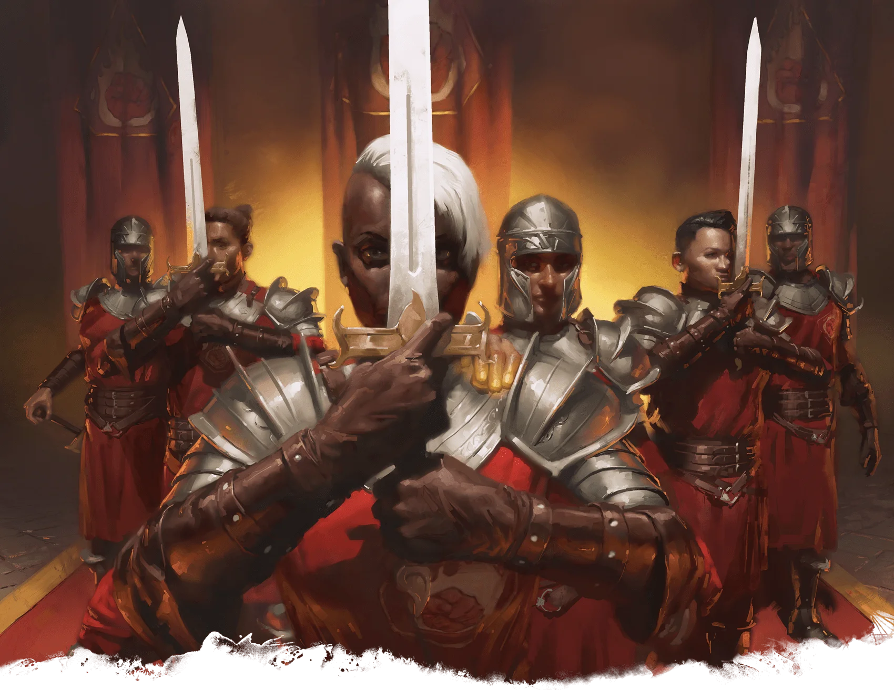

Campaigns set in Baldur's Gate involve two conflicts. First, corrupt patriars in charge of the city worship devils and the evil gods known as the Dead Three. Second, the criminal syndicate known as the Guild preys on commoner crews and terrorizes the city's population.

### Corrupt Patriars

Many patriars in Baldur's Gate have turned to diabolical pacts, political dominance, and worship of the Dead Three.

#### A Corrupt Patriars Arc

A campaign involving corrupt patriars might follow this broad outline.

***Levels 1–4.*** Introduce this conflict through the use of the adventure "*The Lost Library of Lethchauntos*" in chapter 7. By level 4, the characters attract the attention of the Eomane family; use "Blood Night" in this chapter, after which the characters have a Bastion in the Upper City.

***Levels 5–10.*** As the characters rise in power and notoriety, they are drawn into the schemes of power-hungry politicians. You can use "The Shadow Parliament" in this chapter.

### Crime and Commoner Crews

Commoner crews occasionally break the law to survive the dangerous streets of Baldur's Gate. But serious crime in the city is monopolized by the Guild, a ruthless syndicate no one—save the characters—dares oppose.

#### A Commoner Crew Arc

A campaign that involves working with the commoner crews of Baldur's Gate might follow this broad outline.

***Levels 1–4.*** This conflict first appears when the characters join one or more commoner crews. You can use "Tide of Teeth" in this chapter to introduce the Harborhands, and the characters can begin earning renown with the crew according to the renown rules below.

***Levels 5–10.*** The characters' allies among the crews live in fear of the Guild, and when the party defends the crews against the Guild's aggression, they draw the attention of Nine-Fingers Keene. You can use "Clockwork Memories" in this chapter.

## DM's Toolbox

This section provides tools useful for adventures in Baldur's Gate.

### Renown in Baldur's Gate

You can use the renown rules in *chapter 3* of the *Dungeon Master's Guide* to track the relationships the party builds with important organizations in Baldur's Gate, such as commoner crews, the Flaming Fist, or the Guild. Significant deeds might grant renown with more than one group.

#### Commoner Crew Renown

Characters earn renown with Baldur's Gate's commoner crews by defending crew members against threats, freely giving aid and money to crew members in need, or supporting solidarity among the city's working class. Track characters' renown with commoner crews altogether, rather than with each crew separately.

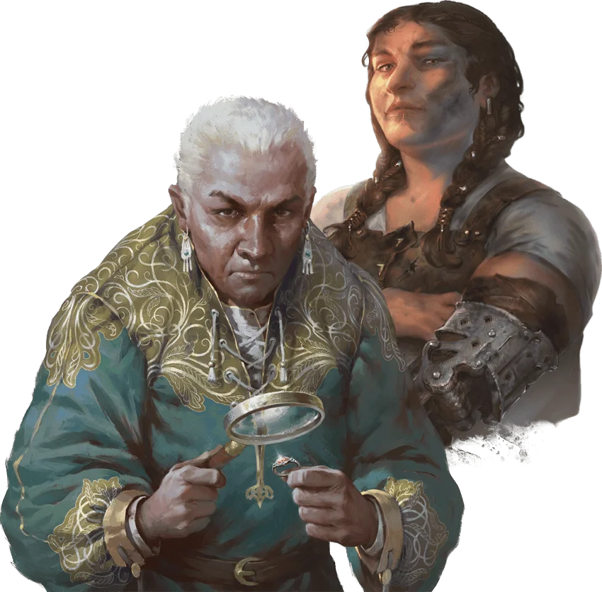

##### Commoner Crew Renown
| Renown Score | Reward                                                                                                                                                                                                                                            |
|:------------:|---------------------------------------------------------------------------------------------------------------------------------------------------------------------------------------------------------------------------------------------------|
|      3+      | Members of commoner crews are Friendly to you. Any crew can provide you a Modest lifestyle for free in its neighborhood and hide you from the authorities.                                                                                        |
|      5+      | Crews don't charge you for services in their respective neighborhoods. You can purchase any tool for half cost in their neighborhoods.                                                                                                            |
|      10      | The first time your Renown Score reaches 10, you gain proficiency with one *Artisan's Tools* set of your choice.                                                                                                                                  |
|      15+     | You can request up to four **Toughs** to aid you in a task. Once you use this reward, you can't do so again until your Renown Score increases.                                                                                                    |
|      25+     | You are considered a leader of the crew. You can call on the crew to perform a major favor, such as busting you out of jail or smuggling goods into the city. Once you call for a favor, you can't do so again until your Renown Score increases. |

#### The Flaming Fist

Characters earn renown with the Flaming Fist when they act within the law, arrest criminals, and silence those who question the Flaming Fist's methods.

##### Flaming Fist Renown
| Renown Score | Reward                                                                                                                                                                                                  |
|:------------:|---------------------------------------------------------------------------------------------------------------------------------------------------------------------------------------------------------|
|      3+      | The Flaming Fist provides you a Modest lifestyle for free at the Seatower of Balduran.                                                                                                                  |
|      5+      | The Flaming Fist doesn't arrest you unless you're plainly involved in a crime against the Flaming Fist or the Council of Four.                                                                          |
|      10      | The first time your Renown Score reaches 10, the Flaming Fist rewards you with 500 GP worth of mundane adventuring gear (seized from criminals).                                                        |
|      15+     | You have Advantage on any ability checks made to influence residents of the Lower City, as such residents fear the consequences if they aren't polite.                                                  |
|      25+     | You can assign a squad of up to six **Warrior Infantry** to perform any task in the city that isn't overtly illegal. Once you use this reward, you can't do so again until your Renown Score increases. |
|      30      | The first time your Renown Score reaches 30, you receive a valuable piece of seized property: a random Rare magic item.                                                                                 |
|      40+     | The Flaming Fist won't arrest you. The faction openly shares with you any information about ongoing investigations or secrets about significant individuals in the city.                                |

#### The Guild

Characters earn renown with the criminal syndicate known as the Guild when they create a distraction so Guild operations run smoothly, provide leads about easy or lucrative targets, or engage directly in Guild business.

##### Guild Renown
| Renown Score | Reward                                                                                                                                                                               |
|:------------:|--------------------------------------------------------------------------------------------------------------------------------------------------------------------------------------|
|      3+      | The Guild offers access to a safe house and provides you a Poor lifestyle for free.                                                                                                  |
|      5+      | You can purchase the following kinds of tools from Guild contacts for half cost: *Disguise Kit*, *Forgery Kit*, *Poisoner's Kit*, or *Thieves' Tools*.                               |
|      10      | The first time your Renown Score reaches 10, you can contact a Guild agent to exchange one Common magic item for an Uncommon magic item of your choice.                              |
|      15+     | Residents of the Lower City are Friendly to you by default.                                                                                                                          |
|      25+     | You can arrange a private audience with any Guild kingpin. Once you use this reward, you can't do so again until your Renown Score increases.                                        |
|      30      | The first time your Renown Score reaches 30, you can send a Guild detail to steal up to 1,000 GP worth of mundane adventuring gear, gemstones, or art objects.                       |
|      40+     | You can request a team of up to four **Spies** to serve as lookouts or distractions on a mission. Once you use this reward, you can't do so again until your Renown Score increases. |

*To survive in the Guild you've gotta be quick as a rat and clever as... also a rat? Listen, all I know is I'd rather get stabbed in the front than the back.*— Karlach Cliffgate
### Baldur's Gate Bastions

The adventure "Blood Night" provides an opportunity for characters to gain a town house in the Upper City as a Bastion. In addition to granting a base of operations, this event makes the characters legal residents of the Upper City, allowing them to be out in the Upper City after dark without being expelled by the Watch—that is, as long as they display enough of the outré wealth or carefree indolence cultivated by Upper City residents to look like they belong.

The town house detailed on the map represents the party's combined Bastion. As characters gain levels, they can build onto the house by renovating empty rooms, adding additional floors, or discovering basement levels that were previously unknown. A significant improvement—like those gained at higher levels using the Bastion system—might represent purchasing of an adjacent house and connecting the two to create a large manor.

The hirelings in the party's Bastion are provisionally loyal, but they'll never be entirely trustworthy. Coin is the greatest motivator in Baldur's Gate, so betrayal is common.

#### Bastion Events

The Bastion Events table in the *Dungeon Master's Guide* describes random events that affect a Bastion. You can tailor these events to Baldur's Gate as follows.

***Criminal Hireling.*** The exposed hireling is a member of the Guild, and the Flaming Fist seeks them out. The local Guild kingpin strongly hints that the characters should pay the bribe or suffer future troubles.

***Lost Hirelings.*** The hirelings aren't missing—they've been murdered. Evidence suggests they were participating in a devil cult that demanded sacrifices from within its own ranks.

***Refugees.*** The refugees are from the Outer City or otherwise desperate and downtrodden. They seek a permanent home in the city.

***Request for Aid.*** A patriar hires the Bastion's defenders to supplement security at a last-minute celebration at their manor.

### Encounters in Baldur's Gate

You can roll 1d20 on the table below to generate encounters for a party of any level traveling around Baldur's Gate. Alternatively, roll 1d10 if the characters are in the Upper City, 1d10 + 5 if the characters are in the Lower City, or 1d10 + 10 if the characters are elsewhere (such as in the Outer City or the Sewers). Once you've used a given encounter, remove it from the table and create a new one to replace it.

<table class="rd__b-special rd__b-data  rd__b-data--stats">
		<thead>
			<tr>
				<th class="rd__data-embed-header ve-text-left" colspan="6" data-rd-data-embed-header="true">
					

						

							Baldur's Gate Encounters
							
						

						[–]
					

				</th>
			</tr>
		</thead><tbody class="" data-rd-embedded-data-render-target="true"><tr>
			<td colspan="6" data-rd-tag="table" data-rd-uid="Baldur&apos;s Gate Encounters|FRAiF" data-rd-page="tables.html" data-rd-source="FRAiF" data-rd-hash="baldur&apos;s%20gate%20encounters_fraif" data-rd-name="Baldur&apos;s Gate Encounters" data-rd-display-name="Baldur&apos;s Gate Encounters" data-rd-style="" data-rd-entry-data="{}">
				<i>Loading <a href="tables.html#baldur&apos;s%20gate%20encounters_fraif"  onmouseover="Renderer.hover.pHandleLinkMouseOver(event, this)" onmouseleave="Renderer.hover.handleLinkMouseLeave(event, this)" onmousemove="Renderer.hover.handleLinkMouseMove(event, this)" onclick="Renderer.hover.handleLinkClick(event, this)" onwheel="Renderer.hover.handleLinkWheel(event, this)" ondragstart="Renderer.hover.handleLinkDragStart(event, this)" data-vet-page="tables.html" data-vet-source="FRAiF" data-vet-hash="baldur&apos;s%20gate%20encounters_fraif" ontouchstart="Renderer.hover.handleTouchStart(event, this)" >Baldur's Gate Encounters</a>...</i>
				
			</td>
		</tr></tbody></table>
## Tide of Teeth

*Solve a dockside murder.*

- **A Location (Baldur's Gate) Adventure for Level 3 Characters**

- **Situation.** Harborhands crew members discovered two stevedore corpses near a dilapidated dock, both chewed as if by sharks though they were safely on the dock. The Harborhands worry about this strange attack, as they should. An imp named Cracklebone is orchestrating covert sahuagin raids from an abandoned ship named the Fearsome Grimace.
- **Hook.** The proud human leader of the Harborhands crew, Cadmin Marniok (Medium, Lawful Neutral **Tough Boss**), hires the characters to investigate Narrowlady Dock, where the bodies were found.

### Encounters

The adventure consists of these encounters.

***Narrowlady Dock.*** Two Indifferent dwarf Flaming Fist members (Medium **Guards**) keep everyone away from Narrowlady Dock with assurances that the Flaming Fist is "solving the problem." This is a lie; the guards rolled the corpses off the dock and are hanging around until they can report back that they found no clues. A character can take an Influence action and convince the pair to leave with a successful DC 10 Charisma (Deception, Intimidation, or Persuasion) check or buy them off for 10 GP. The guards also leave if the characters try to start a fight, grumbling, "I hope you get the trouble you're so eager to find."

***Dock Clues.*** Blood spatters cover the area where the stevedores were killed, and blood trails lead over the side of the dock. The only ship near the site is an unseaworthy vessel called the Fearsome Grimace. The ship has sunk up to its gunwales in Gray Harbor, and it's afloat only because it's lashed to Narrowlady Dock. A character who takes a Study action and succeeds on a DC 12 Intelligence (Investigation) check realizes that the corpses were recently rolled over the side of the dock by the Flaming Fist. A character who takes a Search action and succeeds on a DC 12 Wisdom (Perception or Survival) check identifies tracks of the killers—the splayed, scaled feet of sahuagin.

***In the River.*** Two **Hunter Sharks** have eaten the dead stevedores. They try to eat anyone in the water.

***The Fearsome Grimace.*** Use the Ship map in the *Dungeon Master's Guide* for the derelict ship. The exterior water level is 5 feet higher than depicted on the map, and the thick wooden gangplank descends from Narrowlady Dock to the main deck.

***Main Deck.*** The ship's dilapidated condition is evident on its main deck, where rotted rigging barely clings to the masts and tattered sails hang like forlorn laundry. A thin cord across the end of the gangplank connects to the rigging, which functions as a falling net trap. In addition, the large hatch over the main hold breaks if a creature moves onto it, like a hidden pit trap, except that the fall into the partially flooded hold doesn't deal damage. See chapter 3 of the *Dungeon Master's Guide* for both traps.

***Forecastle.*** The elevated front of the ship bears an enormous windlass used to haul up an anchor, but the chain dangles limply over the side. A *Pole of Angling* is jammed into the windlass. Manipulating the windlass or its chain stirs up four **Lacedon Ghouls** that are under the ship; the ghouls climb the exterior of the ship to fight the characters.

***Sterncastle.*** The ship's elevated stern has mounts for two ballistae. The ballistae look to be in excellent condition apart from several white seagull feathers adhered to each. Both ballistas are in fact **Mimics** that like to eat seabirds.

***Hold.*** The rotted, mold-crusted hold is flooded 2 feet deep with river water and is Difficult Terrain for creatures that lack a Swim Speed. Six **Reef Sharks** lurk under the overturned jolly boats, awaiting prey or sahuagin orders.

***Forward Cabin.*** Water in this cabin, where the sailors once bunked, is ankle deep and thick with blood. Two **Sahuagin Warriors** and a **Swarm of Lemures** are messily devouring an enormous eel. If the characters descend from the main deck, one warrior flees to warn Cracklebone, then it makes a stand with the sharks in the hold. An old hammock holds a pouch with 75 GP and a *Potion of Healing*.

***Aft Cabin.*** The finery of this captain's cabin has long ago turned to rot. Cracklebone the **Imp** is here with a loyal **Sahuagin Priest**. They immediately initiate combat with intruders but retreat to the hold for reinforcements if outmatched. Tacked to one wall is a tattered map of the docks with plans for several river attacks drawn on it in blood.

***Conclusion.*** If the characters return to Cadmin after exploring the Fearsome Grimace , he gives them 100 GP for defeating the sahuagin and another 100 GP for Cracklebone's map.

## Blood Night

*Survive a lethal invitation.*

- **A Location (Baldur's Gate) Adventure for Level 4 Characters**

- **Situation.** The four wicked scions of Eomane House (see "Upper City ") host a party that's secretly a murderous competition to honor Bhaal.
- **Hook.** The characters are invited to a decadent party at Eomane House on the wrong night.

### Encounters

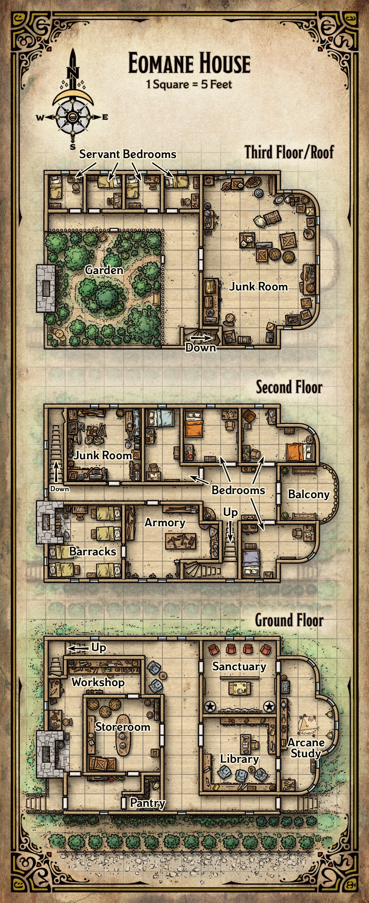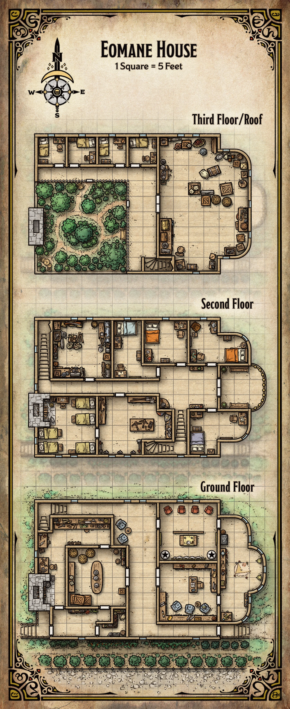The adventure consists of these encounters.

***Pleasant Welcome.*** A **Spy** serving Trentellar Eomane invites characters into the library, serves drinks, and introduces other guests, who tell the characters about the four Eomane siblings.

***Murder Contest.*** Dolandre Eomane's booming voice echoes through the house, gleefully informing guests the house is now magically sealed and the Eomanes are competing to murder the most guests for their patron, Bhaal. The other guests scatter and try to hide or escape.

***Eomanes.*** The Eomanes roam the house separately. The family members are as follows:

- **Dolandre Eomane.** Dolandre (Medium, Lawful Evil **Performer**) relishes in the violence, with a **Barbed Devil** named Mister Pointy Hugs at her side.
- **Nysene Eomane.** Nysene (Medium, Lawful Evil **Noble**) pulls animals from a *Bag of Tricks* (rust) to torment her quarry.
- **Russora Eomane.** Russora (Small, Neutral Evil **Mage Apprentice**) instructs four **Imp** minions to help her fight.
- **Trentellar Eomane.** Trentellar (Medium, Neutral Evil **Cultist Fanatic**) commands four bloodthirsty **Spies** who consider him a divine agent of Bhaal.

***The House.*** Doors and windows exiting the house can't be opened and have Immunity to all damage.

***The Survivor.*** Before the party, the Eomanes ritually murdered their hirelings—whose corpses adorn various rooms—but they missed a human hireling named Bilwen (Medium **Guard**) who is hiding in the barracks. Bilwen shares that the only escape involves climbing down the outside of the house from the rooftop garden.

***Ghost in the Garden.*** The Lawful Neutral **Ghost** of the former owner of the house, Fellumbur Delce, haunts the garden at night. The Eomanes murdered him when they moved in. He can be put to rest by sharing the house's deed, which he hid in the library before he died. (The Eomanes don't know about it.) Fellumbur promises the deed to those who kill all four Eomanes. Killing them also unseals the house's exits.

***Conclusion.*** If the characters defeat the Eomanes, they can keep the manor as their Bastion.

## Clockwork Memories

*Protect an inventor from the Guild.*

- **A Location (Baldur's Gate) Adventure for Level 7 Characters**

- **Situation.** A Gondian inventor named Flurn Eightspoke has unlocked a way to preserve a person's memories in a clockwork brain. He doesn't realize his test subject was a Guild informant, and now the Guild wants both Flurn and his mechanical creation destroyed.
- **Hook.** A smith offers the characters a discount in exchange for checking on his former boss, the inventor Flurn Eightspoke, at his Heapside workshop. The smith has heard rumors that Flurn ran afoul of the Guild but can't imagine what the good-natured inventor could have done to deserve this attention. Alternatively, mechanically oriented characters hear that Flurn has completed a great invention and stop by to check it out.

### Encounters

The adventure consists of these encounters.

***Eightspoke Workshop.*** Use the Roadside Inn map in the *Dungeon Master's Guide*. Use the ground floor only; the upper floor is a rooftop patio and a single room where Flurn sleeps. The workshop is a cluttered, noisy place that smells of cut wood and wet metal. Apart from Flurn Eightspoke (Small, Lawful Neutral **Priest**), eight **Commoners** work as apprentices throughout the workshop.

***Clockwork Guards.*** Six **Nimblewright Soldiers** (see *chapter 9*) patrol the workshop grounds, including its roof, in pairs. They ignore the characters as they patrol.

***Meeting Flurn.*** Flurn meets the characters. He has a perpetually puzzled look on his face but a friendly demeanor. Flurn gives the characters a quick tour, concluding with his planning room. He is oblivious to Guild agents who have recently been casing his workshop, and he knows of no trouble.

***Storage Barn.*** The covered barn to the west looks like a stable but it holds supplies: iron ingots in one stall, lumber in another, screws and bolts in another, and so on. A suit of **Animated Armor** keeps inventory on a slate board bolted to its chest.

***Assembly Room.*** The workshop's goods are assembled on the three tables in this room. At least some of Flurn's apprentices are here around the clock. A mechanical fox named Flywheel (use the **Weasel** stat block, except it's a Construct rather than a Beast) prowls this room, demanding frequent head pats.

***Forge.*** The room south of the assembly room is a hot, crowded forge. Molds for several sizes of clockwork gears are stacked haphazardly. A small office connected to the forge holds plans for metal pieces, out of the way of errant embers.

***Planning Room.*** The large room to the east has several drafting tables. The walls and tables bear hundreds of half-finished schematics that demonstrate Flurn's genius. The planning room holds two items of interest: a brain in a jar that Flurn is using as a model (it belonged to an accountant who knew the secret identity of Heapside's shadowy kingpin), and a mechanical person with its clockwork brain exposed (use the **Flesh Golem** stat block). The brass and iron brain is a whirring marvel. Flurn has the mechanical person sit up and asks it to solve a few complex equations on a notepad, but before the demonstration gets too far, the Guild makes its move.

***The Guild Strikes.*** The Guild attack comes in two phases: first, a **Bandit Deceiver** and two **Spies** come to the workshop's west entrance to loudly complain of shoddy work. The apprentices try to mollify them, but when Flurn approaches, the Guild agents try to kill him and any characters accompanying him. Meanwhile, an **Assassin** sneaks over the roof to locate and destroy both the physical brain and the mechanical person. The assassin is disguised as an innocent apprentice. The ruse lets him slip past the workshop's nimblewright guards. The assassin fights if confronted or if given the opportunity to complete the mission.

***The Guards Activate.*** Once any attempt is made on Flurn's life, his nimblewrights become Hostile to everyone who doesn't work at the workshop. Their programming compels them to hunt intruders, which includes the characters. You can use the nimblewrights in pairs or even as a big group to challenge the characters—or to help them if the characters struggle against the Guild intruders.

***Valuable Memories.*** If the characters save Flurn and his mechanical person, the mechanical creation takes the notepad and writes, "They came for me because I know Gregor Undarin, flower merchant, is secretly Guild kingpin of Heapside." The mechanical person might also share details of Gregor's shady accounts or the location of Gregor's hidden vaults of ill-gotten treasure, leading to future adventures. Either way, this knowledge earns the characters the Guild's enmity for as long as Gregor is in power.

## The Shadow Parliament

*Conspire against the followers of Bane.*

- **A Location (Baldur's Gate) Adventure for Level 9 Characters**

- **Situation.** Followers of Bane infiltrated the Parliament of Peers as a "Shadow Parliament," eager to convince the rest of the parliament to seize additional authority over trade, defense, and taxation. The Council of Four can't formally stop this legally proper procedure, but the council insists that debates on it be held publicly at the Unrolling Scroll. Banites work to eliminate politicians opposed to the power grab, including the human philanthropist Roxus Nalbeth (Medium, Lawful Good **Noble**).
- **Hook.** Allies who fear their authority being undermined, such as a commoner crew, arrange for the characters to help Roxus Nalbeth at the debates.

### Encounters

The debate takes place at the Unrolling Scroll (see "Upper City "); you can use its map for this adventure.

***Ambush.*** On the way to the Unrolling Scroll, the characters are ambushed by a **Cultist of Bane** (see *chapter 9*) and two **Warrior Veterans** dressed as Flaming Fist members. They level a spurious accusation of criminal activity as a pretext to attack. If the characters search the cultist, they find a tattoo of Bane's symbol on him.

***Debate Preparation.*** The characters meet Roxus in a reserved room at the Unrolling Scroll. He shares rumors that a secret, tyrannical "Shadow Parliament" is gaining followers within the Parliament of Peers, and this debate is the last chance to keep the Shadow Parliament from seizing control. If the characters share they were ambushed by followers of Bane, Roxus surmises that cultists of Bane are probably behind the clandestine organization.

***Opening Remarks.*** The entire Parliament of Peers is in attendance around the reflecting pool for the debate's opening remarks, as are the members of the Council of Four. Roxus's remarks on the important distinctions between leadership and tyranny stir the crowd. Three **Water Elementals** erupt from the pool to cause mayhem; when they turn to Roxus, the characters are the only ones who can intervene and save him. Characters with a Passive Perception of 14 or higher spot a dwarf (Medium **Cultist Fanatic**) in the crowd subtly directing the summoned elementals and might notice that she bears the same tattoo as the earlier cultist.

***The Debate.*** Roxus is shaken by the attack, and he asks the characters to take his place. (If Roxus didn't survive, another parliament member or a commoner crew ally asks the characters to fill this role). There are three debate rounds against patriars who support the power grab, listed below. Only one

character can participate in each round, but different characters can participate in ensuing rounds. Victory in a round requires a successful DC 18 Charisma (Deception or Persuasion) roll, but a participating character who succeeds on one of the additional checks listed with each patriar below makes the Charisma check with Advantage. Intersperse the debate checks with reactions from the audience, such as gasps as the characters reveal secrets and applause if they win a round.

- **Arvin Dlusker.** A successful DC 15 Intelligence (History) or Wisdom (Insight) check reveals that Arvin's debate position is motivated by desire to reverse his family's severe financial losses.
- **Brevek Faenor.** Duke Brevek Faenor's arguments in favor of expanding Parliament authority draw surprised gasps from the audience. A successful DC 15 Intelligence (History or Religion) check reminds the character of Brevek's tense history as a former priest of Oghma here in the Unrolling Scroll.
- **Tallis Whitburn.** A successful DC 15 Intelligence (Nature) or Wisdom (Perception) notes slate dust on Tallis's garments, showing she has resorted to helping with manual labor at her understaffed Whitburn quarry.

***The Vote.*** If the characters win at least two debate rounds, the measure to expand the Parliament of Peers' authority is voted down. Otherwise, it passes, and the Council of Four summarily approves it.

***Treachery at the Bindery.*** Regardless of the vote's result, Roxus (or his valet if Roxus died) informs the characters that Arvin Dlusker and Tallis Whitburn have surreptitiously entered the Unrolling Scroll's bookbindery. There, the characters find both patriars (**Nobles**) talking with two **Bandit Deceivers**. The politicians are asking about their next orders now that the vote has been decided; the bandits are tattooed cultists of Bane who are orchestrating the Shadow Parliament. The bandits fight to silence the characters, but the patriars retreat. In addition to the four conspirators, two **Priest Acolytes** of Oghma work here. The acolytes have the Charmed condition and treat the bandits favorably, but they don't join the fight.

***Conclusion.*** After the bookbindery battle, the patriars are unwilling to talk about the Shadow Parliament. The two acolytes, however, tell everything they overheard if the characters remove the Charmed condition from them. Their public testimony disgraces Arvin and Tallis and drives the Shadow Parliament back underground—for now.

------

# Chapter 7: The Lost Library of Lethchauntos

*See the *The Lost Library of Lethchauntos* adventure.*

------

# Chapter 8: Magic Items

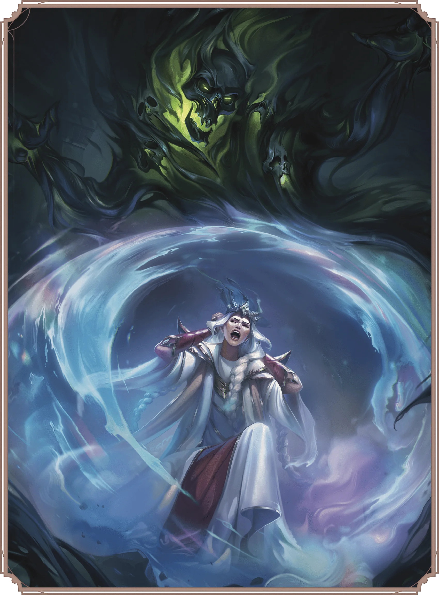

This chapter describes some of the magic items and *Artifacts* found in Faerûn.

- *Calimemnon Crystal*
- *Crown of Horns*
- *Harper Pin*
- *Mechanical Wonder*
- *Orb of Damara*
- *Tome of the Dragon*
- *Windskiff*

<table class="rd__b-special rd__b-data rd__b-data--narrow rd__b-data--stats">
		<thead>
			<tr>
				<th class="rd__data-embed-header ve-text-left" colspan="6" data-rd-data-embed-header="true">
					

						

							Calimemnon Crystal
							
						

						[–]
					

				</th>
			</tr>
		</thead><tbody class="" data-rd-embedded-data-render-target="true"><tr>
			<td colspan="6" data-rd-tag="item" data-rd-uid="Calimemnon Crystal|FRAiF" data-rd-page="items.html" data-rd-source="FRAiF" data-rd-hash="calimemnon%20crystal_fraif" data-rd-name="Calimemnon Crystal" data-rd-display-name="Calimemnon Crystal" data-rd-style="narrow" data-rd-entry-data="{}">
				<i>Loading <a href="items.html#calimemnon%20crystal_fraif"  onmouseover="Renderer.hover.pHandleLinkMouseOver(event, this)" onmouseleave="Renderer.hover.handleLinkMouseLeave(event, this)" onmousemove="Renderer.hover.handleLinkMouseMove(event, this)" onclick="Renderer.hover.handleLinkClick(event, this)" onwheel="Renderer.hover.handleLinkWheel(event, this)" ondragstart="Renderer.hover.handleLinkDragStart(event, this)" data-vet-page="items.html" data-vet-source="FRAiF" data-vet-hash="calimemnon%20crystal_fraif" ontouchstart="Renderer.hover.handleTouchStart(event, this)" >Calimemnon Crystal</a>...</i>
				
			</td>
		</tr></tbody></table><table class="rd__b-special rd__b-data rd__b-data--narrow rd__b-data--stats">
		<thead>
			<tr>
				<th class="rd__data-embed-header ve-text-left" colspan="6" data-rd-data-embed-header="true">
					

						

							Crown of Horns
							
						

						[–]
					

				</th>
			</tr>
		</thead><tbody class="" data-rd-embedded-data-render-target="true"><tr>
			<td colspan="6" data-rd-tag="item" data-rd-uid="Crown of Horns|FRAiF" data-rd-page="items.html" data-rd-source="FRAiF" data-rd-hash="crown%20of%20horns_fraif" data-rd-name="Crown of Horns" data-rd-display-name="Crown of Horns" data-rd-style="narrow" data-rd-entry-data="{}">
				<i>Loading <a href="items.html#crown%20of%20horns_fraif"  onmouseover="Renderer.hover.pHandleLinkMouseOver(event, this)" onmouseleave="Renderer.hover.handleLinkMouseLeave(event, this)" onmousemove="Renderer.hover.handleLinkMouseMove(event, this)" onclick="Renderer.hover.handleLinkClick(event, this)" onwheel="Renderer.hover.handleLinkWheel(event, this)" ondragstart="Renderer.hover.handleLinkDragStart(event, this)" data-vet-page="items.html" data-vet-source="FRAiF" data-vet-hash="crown%20of%20horns_fraif" ontouchstart="Renderer.hover.handleTouchStart(event, this)" >Crown of Horns</a>...</i>
				
			</td>
		</tr></tbody></table><table class="rd__b-special rd__b-data rd__b-data--narrow rd__b-data--stats">
		<thead>
			<tr>
				<th class="rd__data-embed-header ve-text-left" colspan="6" data-rd-data-embed-header="true">
					

						

							Harper Pin
							
						

						[–]
					

				</th>
			</tr>
		</thead><tbody class="" data-rd-embedded-data-render-target="true"><tr>
			<td colspan="6" data-rd-tag="item" data-rd-uid="Harper Pin|FRAiF" data-rd-page="items.html" data-rd-source="FRAiF" data-rd-hash="harper%20pin_fraif" data-rd-name="Harper Pin" data-rd-display-name="Harper Pin" data-rd-style="narrow" data-rd-entry-data="{}">
				<i>Loading <a href="items.html#harper%20pin_fraif"  onmouseover="Renderer.hover.pHandleLinkMouseOver(event, this)" onmouseleave="Renderer.hover.handleLinkMouseLeave(event, this)" onmousemove="Renderer.hover.handleLinkMouseMove(event, this)" onclick="Renderer.hover.handleLinkClick(event, this)" onwheel="Renderer.hover.handleLinkWheel(event, this)" ondragstart="Renderer.hover.handleLinkDragStart(event, this)" data-vet-page="items.html" data-vet-source="FRAiF" data-vet-hash="harper%20pin_fraif" ontouchstart="Renderer.hover.handleTouchStart(event, this)" >Harper Pin</a>...</i>
				
			</td>
		</tr></tbody></table><table class="rd__b-special rd__b-data rd__b-data--narrow rd__b-data--stats">
		<thead>
			<tr>
				<th class="rd__data-embed-header ve-text-left" colspan="6" data-rd-data-embed-header="true">
					

						

							Mechanical Wonder
							
						

						[–]
					

				</th>
			</tr>
		</thead><tbody class="" data-rd-embedded-data-render-target="true"><tr>
			<td colspan="6" data-rd-tag="item" data-rd-uid="Mechanical Wonder|FRAiF" data-rd-page="items.html" data-rd-source="FRAiF" data-rd-hash="mechanical%20wonder_fraif" data-rd-name="Mechanical Wonder" data-rd-display-name="Mechanical Wonder" data-rd-style="narrow" data-rd-entry-data="{}">
				<i>Loading <a href="items.html#mechanical%20wonder_fraif"  onmouseover="Renderer.hover.pHandleLinkMouseOver(event, this)" onmouseleave="Renderer.hover.handleLinkMouseLeave(event, this)" onmousemove="Renderer.hover.handleLinkMouseMove(event, this)" onclick="Renderer.hover.handleLinkClick(event, this)" onwheel="Renderer.hover.handleLinkWheel(event, this)" ondragstart="Renderer.hover.handleLinkDragStart(event, this)" data-vet-page="items.html" data-vet-source="FRAiF" data-vet-hash="mechanical%20wonder_fraif" ontouchstart="Renderer.hover.handleTouchStart(event, this)" >Mechanical Wonder</a>...</i>
				
			</td>
		</tr></tbody></table><table class="rd__b-special rd__b-data rd__b-data--narrow rd__b-data--stats">
		<thead>
			<tr>
				<th class="rd__data-embed-header ve-text-left" colspan="6" data-rd-data-embed-header="true">
					

						

							Orb of Damara
							
						

						[–]
					

				</th>
			</tr>
		</thead><tbody class="" data-rd-embedded-data-render-target="true"><tr>
			<td colspan="6" data-rd-tag="item" data-rd-uid="Orb of Damara|FRAiF" data-rd-page="items.html" data-rd-source="FRAiF" data-rd-hash="orb%20of%20damara_fraif" data-rd-name="Orb of Damara" data-rd-display-name="Orb of Damara" data-rd-style="narrow" data-rd-entry-data="{}">
				<i>Loading <a href="items.html#orb%20of%20damara_fraif"  onmouseover="Renderer.hover.pHandleLinkMouseOver(event, this)" onmouseleave="Renderer.hover.handleLinkMouseLeave(event, this)" onmousemove="Renderer.hover.handleLinkMouseMove(event, this)" onclick="Renderer.hover.handleLinkClick(event, this)" onwheel="Renderer.hover.handleLinkWheel(event, this)" ondragstart="Renderer.hover.handleLinkDragStart(event, this)" data-vet-page="items.html" data-vet-source="FRAiF" data-vet-hash="orb%20of%20damara_fraif" ontouchstart="Renderer.hover.handleTouchStart(event, this)" >Orb of Damara</a>...</i>
				
			</td>
		</tr></tbody></table><table class="rd__b-special rd__b-data rd__b-data--narrow rd__b-data--stats">
		<thead>
			<tr>
				<th class="rd__data-embed-header ve-text-left" colspan="6" data-rd-data-embed-header="true">
					

						

							Tome of the Dragon
							
						

						[–]
					

				</th>
			</tr>
		</thead><tbody class="" data-rd-embedded-data-render-target="true"><tr>
			<td colspan="6" data-rd-tag="item" data-rd-uid="Tome of the Dragon|FRAiF" data-rd-page="items.html" data-rd-source="FRAiF" data-rd-hash="tome%20of%20the%20dragon_fraif" data-rd-name="Tome of the Dragon" data-rd-display-name="Tome of the Dragon" data-rd-style="narrow" data-rd-entry-data="{}">
				<i>Loading <a href="items.html#tome%20of%20the%20dragon_fraif"  onmouseover="Renderer.hover.pHandleLinkMouseOver(event, this)" onmouseleave="Renderer.hover.handleLinkMouseLeave(event, this)" onmousemove="Renderer.hover.handleLinkMouseMove(event, this)" onclick="Renderer.hover.handleLinkClick(event, this)" onwheel="Renderer.hover.handleLinkWheel(event, this)" ondragstart="Renderer.hover.handleLinkDragStart(event, this)" data-vet-page="items.html" data-vet-source="FRAiF" data-vet-hash="tome%20of%20the%20dragon_fraif" ontouchstart="Renderer.hover.handleTouchStart(event, this)" >Tome of the Dragon</a>...</i>
				
			</td>
		</tr></tbody></table><table class="rd__b-special rd__b-data rd__b-data--narrow rd__b-data--stats">
		<thead>
			<tr>
				<th class="rd__data-embed-header ve-text-left" colspan="6" data-rd-data-embed-header="true">
					

						

							Windskiff
							
						

						[–]
					

				</th>
			</tr>
		</thead><tbody class="" data-rd-embedded-data-render-target="true"><tr>
			<td colspan="6" data-rd-tag="item" data-rd-uid="Windskiff|FRAiF" data-rd-page="items.html" data-rd-source="FRAiF" data-rd-hash="windskiff_fraif" data-rd-name="Windskiff" data-rd-display-name="Windskiff" data-rd-style="narrow" data-rd-entry-data="{}">
				<i>Loading <a href="items.html#windskiff_fraif"  onmouseover="Renderer.hover.pHandleLinkMouseOver(event, this)" onmouseleave="Renderer.hover.handleLinkMouseLeave(event, this)" onmousemove="Renderer.hover.handleLinkMouseMove(event, this)" onclick="Renderer.hover.handleLinkClick(event, this)" onwheel="Renderer.hover.handleLinkWheel(event, this)" ondragstart="Renderer.hover.handleLinkDragStart(event, this)" data-vet-page="items.html" data-vet-source="FRAiF" data-vet-hash="windskiff_fraif" ontouchstart="Renderer.hover.handleTouchStart(event, this)" >Windskiff</a>...</i>
				
			</td>
		</tr></tbody></table>

------

# Chapter 9: Bestiary

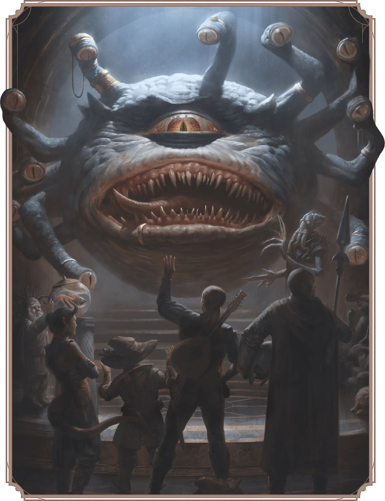

Dangerous monsters and scheming villains populate the Forgotten Realms. This chapter presents numerous creatures that are particularly suitable for the regions described in this book.

The introduction of the *Monster Manual* explains stat block terminology and gives rules for various monster traits. Monsters are presented here in alphabetical order.

- **Aranea**
- **Beast of Malar**
- **Biha Babir**
- **Cultist of Bane**
- **Cultist of Bhaal**
- **Cultist of Myrkul**
- **Dead Three Scion**
- **Deep Dragon Wyrmling**
- **Young Deep Dragon**
- **Adult Deep Dragon**
- **Ancient Deep Dragon**
- **Drow of Lolth**
- **Drow Elite Warrior of Lolth**
- **Drow Mage of Lolth**
- **Drow Priestess of Lolth**
- **Karas Chembryl**
- **Manshoon**
- **Nimblewright Guard**
- **Nimblewright Hulk**
- **Nimblewright Steed**
- **Phaerimm Hatchling**
- **Phaerimm Agent**
- **Polar Serpent**
- **Queen Forfallen**
- **Rusted Behemoth**
- **Rusted Berserker**
- **Rusted Wyrm**
- **Sammaster (Dracolich Form)**
- **Sammaster (Lich Form)**
- **Spirit Dragon Wyrmling**
- **Young Spirit Dragon**
- **Adult Spirit Dragon**
- **Ancient Spirit Dragon**
- **Spore of Moander**
- **Swanmay**
- **Valindra Shadowmantle**
- **Werewyvern**
- **Zhentilar Soldier**
- **Zhentilar Paladin of Bane**
- **Zlan**

## Monsters by Region

The following tables organize the monster stat blocks in this chapter by region, although many can be found anywhere in the Realms.

##### Any Region Monsters
|  CR | Monsters                        |
|:---:|---------------------------------|
| 1/4 | **Drow of Lolth**               |
|  1  | **Zhentilar Soldier**           |
|  2  | **Spirit Dragon Wyrmling**      |
|  4  | **Zhentilar Paladin of Bane**   |
|  5  | **Drow Elite Warrior of Lolth** |
|  7  | **Drow Mage of Lolth**          |
|  8  | **Drow Priestess of Lolth**     |
|  8  | **Werewyvern**                  |
|  8  | **Young Spirit Dragon**         |
|  11 | **Beast of Malar**              |
|  13 | **Manshoon**                    |
|  15 | **Adult Spirit Dragon**         |
|  21 | **Valindra Shadowmantle**       |
|  22 | **Ancient Spirit Dragon**       |
|  22 | **Sammaster**                   |

##### Baldur's Gate Monsters
|  CR | Monsters              |
|:---:|-----------------------|
|  7  | **Cultist of Bhaal**  |
|  8  | **Karas Chembryl**    |
|  9  | **Cultist of Bane**   |
|  11 | **Cultist of Myrkul** |
|  16 | **Dead Three Scion**  |

##### Calimshan Monsters
|  CR | Monsters               |
|:---:|------------------------|
|  2  | **Aranea**             |
|  2  | **Nimblewright Steed** |
|  3  | **Nimblewright Guard** |
|  7  | **Nimblewright Hulk**  |
|  12 | **Biha Babir**         |

##### Dalelands Monsters
|  CR | Monsters               |
|:---:|------------------------|
| 1/4 | **Phaerimm Hatchling** |
|  8  | **Phaerimm Agent**     |
|  12 | **Spore of Moander**   |

##### Icewind Dale Monsters
|  CR | Monsters                 |
|:---:|--------------------------|
|  1  | **Deep Dragon Wyrmling** |
|  3  | **Polar Serpent**        |
|  5  | **Young Deep Dragon**    |
|  11 | **Adult Deep Dragon**    |
|  18 | **Ancient Deep Dragon**  |
|  18 | **Zlan**                 |

##### Moonshae Isles Monsters
|  CR | Monsters             |
|:---:|----------------------|
|  3  | **Swanmay**          |
|  4  | **Rusted Berserker** |
|  9  | **Rusted Behemoth**  |
|  10 | **Queen Forfallen**  |
|  14 | **Rusted Wyrm**      |

<table class="rd__b-special rd__b-data rd__b-data--narrow rd__b-data--stats">
		<thead>
			<tr>
				<th class="rd__data-embed-header ve-text-left" colspan="6" data-rd-data-embed-header="true">
					

						

							Aranea
							
						

						[–]
					

				</th>
			</tr>
		</thead><tbody class="" data-rd-embedded-data-render-target="true"><tr>
			<td colspan="6" data-rd-tag="creature" data-rd-uid="Aranea|FRAiF" data-rd-page="bestiary.html" data-rd-source="FRAiF" data-rd-hash="aranea_fraif" data-rd-name="Aranea" data-rd-display-name="Aranea" data-rd-style="narrow" data-rd-entry-data="{}">
				<i>Loading <a href="bestiary.html#aranea_fraif"  onmouseover="Renderer.hover.pHandleLinkMouseOver(event, this)" onmouseleave="Renderer.hover.handleLinkMouseLeave(event, this)" onmousemove="Renderer.hover.handleLinkMouseMove(event, this)" onclick="Renderer.hover.handleLinkClick(event, this)" onwheel="Renderer.hover.handleLinkWheel(event, this)" ondragstart="Renderer.hover.handleLinkDragStart(event, this)" data-vet-page="bestiary.html" data-vet-source="FRAiF" data-vet-hash="aranea_fraif" ontouchstart="Renderer.hover.handleTouchStart(event, this)" >Aranea</a>...</i>
				
			</td>
		</tr></tbody></table><table class="rd__b-special rd__b-data rd__b-data--narrow rd__b-data--stats">
		<thead>
			<tr>
				<th class="rd__data-embed-header ve-text-left" colspan="6" data-rd-data-embed-header="true">
					

						

							Beast of Malar
							
						

						[–]
					

				</th>
			</tr>
		</thead><tbody class="" data-rd-embedded-data-render-target="true"><tr>
			<td colspan="6" data-rd-tag="creature" data-rd-uid="Beast of Malar|FRAiF" data-rd-page="bestiary.html" data-rd-source="FRAiF" data-rd-hash="beast%20of%20malar_fraif" data-rd-name="Beast of Malar" data-rd-display-name="Beast of Malar" data-rd-style="narrow" data-rd-entry-data="{}">
				<i>Loading <a href="bestiary.html#beast%20of%20malar_fraif"  onmouseover="Renderer.hover.pHandleLinkMouseOver(event, this)" onmouseleave="Renderer.hover.handleLinkMouseLeave(event, this)" onmousemove="Renderer.hover.handleLinkMouseMove(event, this)" onclick="Renderer.hover.handleLinkClick(event, this)" onwheel="Renderer.hover.handleLinkWheel(event, this)" ondragstart="Renderer.hover.handleLinkDragStart(event, this)" data-vet-page="bestiary.html" data-vet-source="FRAiF" data-vet-hash="beast%20of%20malar_fraif" ontouchstart="Renderer.hover.handleTouchStart(event, this)" >Beast of Malar</a>...</i>
				
			</td>
		</tr></tbody></table><table class="rd__b-special rd__b-data rd__b-data--narrow rd__b-data--stats">
		<thead>
			<tr>
				<th class="rd__data-embed-header ve-text-left" colspan="6" data-rd-data-embed-header="true">
					

						

							Biha Babir
							
						

						[–]
					

				</th>
			</tr>
		</thead><tbody class="" data-rd-embedded-data-render-target="true"><tr>
			<td colspan="6" data-rd-tag="creature" data-rd-uid="Biha Babir|FRAiF" data-rd-page="bestiary.html" data-rd-source="FRAiF" data-rd-hash="biha%20babir_fraif" data-rd-name="Biha Babir" data-rd-display-name="Biha Babir" data-rd-style="narrow" data-rd-entry-data="{}">
				<i>Loading <a href="bestiary.html#biha%20babir_fraif"  onmouseover="Renderer.hover.pHandleLinkMouseOver(event, this)" onmouseleave="Renderer.hover.handleLinkMouseLeave(event, this)" onmousemove="Renderer.hover.handleLinkMouseMove(event, this)" onclick="Renderer.hover.handleLinkClick(event, this)" onwheel="Renderer.hover.handleLinkWheel(event, this)" ondragstart="Renderer.hover.handleLinkDragStart(event, this)" data-vet-page="bestiary.html" data-vet-source="FRAiF" data-vet-hash="biha%20babir_fraif" ontouchstart="Renderer.hover.handleTouchStart(event, this)" >Biha Babir</a>...</i>
				
			</td>
		</tr></tbody></table><table class="rd__b-special rd__b-data rd__b-data--narrow rd__b-data--stats">
		<thead>
			<tr>
				<th class="rd__data-embed-header ve-text-left" colspan="6" data-rd-data-embed-header="true">
					

						

							Cultist of Bane
							
						

						[–]
					

				</th>
			</tr>
		</thead><tbody class="" data-rd-embedded-data-render-target="true"><tr>
			<td colspan="6" data-rd-tag="creature" data-rd-uid="Cultist of Bane|FRAiF" data-rd-page="bestiary.html" data-rd-source="FRAiF" data-rd-hash="cultist%20of%20bane_fraif" data-rd-name="Cultist of Bane" data-rd-display-name="Cultist of Bane" data-rd-style="narrow" data-rd-entry-data="{}">
				<i>Loading <a href="bestiary.html#cultist%20of%20bane_fraif"  onmouseover="Renderer.hover.pHandleLinkMouseOver(event, this)" onmouseleave="Renderer.hover.handleLinkMouseLeave(event, this)" onmousemove="Renderer.hover.handleLinkMouseMove(event, this)" onclick="Renderer.hover.handleLinkClick(event, this)" onwheel="Renderer.hover.handleLinkWheel(event, this)" ondragstart="Renderer.hover.handleLinkDragStart(event, this)" data-vet-page="bestiary.html" data-vet-source="FRAiF" data-vet-hash="cultist%20of%20bane_fraif" ontouchstart="Renderer.hover.handleTouchStart(event, this)" >Cultist of Bane</a>...</i>
				
			</td>
		</tr></tbody></table><table class="rd__b-special rd__b-data rd__b-data--narrow rd__b-data--stats">
		<thead>
			<tr>
				<th class="rd__data-embed-header ve-text-left" colspan="6" data-rd-data-embed-header="true">
					

						

							Cultist of Bhaal
							
						

						[–]
					

				</th>
			</tr>
		</thead><tbody class="" data-rd-embedded-data-render-target="true"><tr>
			<td colspan="6" data-rd-tag="creature" data-rd-uid="Cultist of Bhaal|FRAiF" data-rd-page="bestiary.html" data-rd-source="FRAiF" data-rd-hash="cultist%20of%20bhaal_fraif" data-rd-name="Cultist of Bhaal" data-rd-display-name="Cultist of Bhaal" data-rd-style="narrow" data-rd-entry-data="{}">
				<i>Loading <a href="bestiary.html#cultist%20of%20bhaal_fraif"  onmouseover="Renderer.hover.pHandleLinkMouseOver(event, this)" onmouseleave="Renderer.hover.handleLinkMouseLeave(event, this)" onmousemove="Renderer.hover.handleLinkMouseMove(event, this)" onclick="Renderer.hover.handleLinkClick(event, this)" onwheel="Renderer.hover.handleLinkWheel(event, this)" ondragstart="Renderer.hover.handleLinkDragStart(event, this)" data-vet-page="bestiary.html" data-vet-source="FRAiF" data-vet-hash="cultist%20of%20bhaal_fraif" ontouchstart="Renderer.hover.handleTouchStart(event, this)" >Cultist of Bhaal</a>...</i>
				
			</td>
		</tr></tbody></table><table class="rd__b-special rd__b-data rd__b-data--narrow rd__b-data--stats">
		<thead>
			<tr>
				<th class="rd__data-embed-header ve-text-left" colspan="6" data-rd-data-embed-header="true">
					

						

							Cultist of Myrkul
							
						

						[–]
					

				</th>
			</tr>
		</thead><tbody class="" data-rd-embedded-data-render-target="true"><tr>
			<td colspan="6" data-rd-tag="creature" data-rd-uid="Cultist of Myrkul|FRAiF" data-rd-page="bestiary.html" data-rd-source="FRAiF" data-rd-hash="cultist%20of%20myrkul_fraif" data-rd-name="Cultist of Myrkul" data-rd-display-name="Cultist of Myrkul" data-rd-style="narrow" data-rd-entry-data="{}">
				<i>Loading <a href="bestiary.html#cultist%20of%20myrkul_fraif"  onmouseover="Renderer.hover.pHandleLinkMouseOver(event, this)" onmouseleave="Renderer.hover.handleLinkMouseLeave(event, this)" onmousemove="Renderer.hover.handleLinkMouseMove(event, this)" onclick="Renderer.hover.handleLinkClick(event, this)" onwheel="Renderer.hover.handleLinkWheel(event, this)" ondragstart="Renderer.hover.handleLinkDragStart(event, this)" data-vet-page="bestiary.html" data-vet-source="FRAiF" data-vet-hash="cultist%20of%20myrkul_fraif" ontouchstart="Renderer.hover.handleTouchStart(event, this)" >Cultist of Myrkul</a>...</i>
				
			</td>
		</tr></tbody></table><table class="rd__b-special rd__b-data rd__b-data--narrow rd__b-data--stats">
		<thead>
			<tr>
				<th class="rd__data-embed-header ve-text-left" colspan="6" data-rd-data-embed-header="true">
					

						

							Dead Three Scion
							
						

						[–]
					

				</th>
			</tr>
		</thead><tbody class="" data-rd-embedded-data-render-target="true"><tr>
			<td colspan="6" data-rd-tag="creature" data-rd-uid="Dead Three Scion|FRAiF" data-rd-page="bestiary.html" data-rd-source="FRAiF" data-rd-hash="dead%20three%20scion_fraif" data-rd-name="Dead Three Scion" data-rd-display-name="Dead Three Scion" data-rd-style="narrow" data-rd-entry-data="{}">
				<i>Loading <a href="bestiary.html#dead%20three%20scion_fraif"  onmouseover="Renderer.hover.pHandleLinkMouseOver(event, this)" onmouseleave="Renderer.hover.handleLinkMouseLeave(event, this)" onmousemove="Renderer.hover.handleLinkMouseMove(event, this)" onclick="Renderer.hover.handleLinkClick(event, this)" onwheel="Renderer.hover.handleLinkWheel(event, this)" ondragstart="Renderer.hover.handleLinkDragStart(event, this)" data-vet-page="bestiary.html" data-vet-source="FRAiF" data-vet-hash="dead%20three%20scion_fraif" ontouchstart="Renderer.hover.handleTouchStart(event, this)" >Dead Three Scion</a>...</i>
				
			</td>
		</tr></tbody></table><table class="rd__b-special rd__b-data rd__b-data--narrow rd__b-data--stats">
		<thead>
			<tr>
				<th class="rd__data-embed-header ve-text-left" colspan="6" data-rd-data-embed-header="true">
					

						

							Deep Dragon Wyrmling
							
						

						[–]
					

				</th>
			</tr>
		</thead><tbody class="" data-rd-embedded-data-render-target="true"><tr>
			<td colspan="6" data-rd-tag="creature" data-rd-uid="Deep Dragon Wyrmling|FRAiF" data-rd-page="bestiary.html" data-rd-source="FRAiF" data-rd-hash="deep%20dragon%20wyrmling_fraif" data-rd-name="Deep Dragon Wyrmling" data-rd-display-name="Deep Dragon Wyrmling" data-rd-style="narrow" data-rd-entry-data="{}">
				<i>Loading <a href="bestiary.html#deep%20dragon%20wyrmling_fraif"  onmouseover="Renderer.hover.pHandleLinkMouseOver(event, this)" onmouseleave="Renderer.hover.handleLinkMouseLeave(event, this)" onmousemove="Renderer.hover.handleLinkMouseMove(event, this)" onclick="Renderer.hover.handleLinkClick(event, this)" onwheel="Renderer.hover.handleLinkWheel(event, this)" ondragstart="Renderer.hover.handleLinkDragStart(event, this)" data-vet-page="bestiary.html" data-vet-source="FRAiF" data-vet-hash="deep%20dragon%20wyrmling_fraif" ontouchstart="Renderer.hover.handleTouchStart(event, this)" >Deep Dragon Wyrmling</a>...</i>
				
			</td>
		</tr></tbody></table><table class="rd__b-special rd__b-data rd__b-data--narrow rd__b-data--stats">
		<thead>
			<tr>
				<th class="rd__data-embed-header ve-text-left" colspan="6" data-rd-data-embed-header="true">
					

						

							Young Deep Dragon
							
						

						[–]
					

				</th>
			</tr>
		</thead><tbody class="" data-rd-embedded-data-render-target="true"><tr>
			<td colspan="6" data-rd-tag="creature" data-rd-uid="Young Deep Dragon|FRAiF" data-rd-page="bestiary.html" data-rd-source="FRAiF" data-rd-hash="young%20deep%20dragon_fraif" data-rd-name="Young Deep Dragon" data-rd-display-name="Young Deep Dragon" data-rd-style="narrow" data-rd-entry-data="{}">
				<i>Loading <a href="bestiary.html#young%20deep%20dragon_fraif"  onmouseover="Renderer.hover.pHandleLinkMouseOver(event, this)" onmouseleave="Renderer.hover.handleLinkMouseLeave(event, this)" onmousemove="Renderer.hover.handleLinkMouseMove(event, this)" onclick="Renderer.hover.handleLinkClick(event, this)" onwheel="Renderer.hover.handleLinkWheel(event, this)" ondragstart="Renderer.hover.handleLinkDragStart(event, this)" data-vet-page="bestiary.html" data-vet-source="FRAiF" data-vet-hash="young%20deep%20dragon_fraif" ontouchstart="Renderer.hover.handleTouchStart(event, this)" >Young Deep Dragon</a>...</i>
				
			</td>
		</tr></tbody></table><table class="rd__b-special rd__b-data rd__b-data--narrow rd__b-data--stats">
		<thead>
			<tr>
				<th class="rd__data-embed-header ve-text-left" colspan="6" data-rd-data-embed-header="true">
					

						

							Adult Deep Dragon
							
						

						[–]
					

				</th>
			</tr>
		</thead><tbody class="" data-rd-embedded-data-render-target="true"><tr>
			<td colspan="6" data-rd-tag="creature" data-rd-uid="Adult Deep Dragon|FRAiF" data-rd-page="bestiary.html" data-rd-source="FRAiF" data-rd-hash="adult%20deep%20dragon_fraif" data-rd-name="Adult Deep Dragon" data-rd-display-name="Adult Deep Dragon" data-rd-style="narrow" data-rd-entry-data="{}">
				<i>Loading <a href="bestiary.html#adult%20deep%20dragon_fraif"  onmouseover="Renderer.hover.pHandleLinkMouseOver(event, this)" onmouseleave="Renderer.hover.handleLinkMouseLeave(event, this)" onmousemove="Renderer.hover.handleLinkMouseMove(event, this)" onclick="Renderer.hover.handleLinkClick(event, this)" onwheel="Renderer.hover.handleLinkWheel(event, this)" ondragstart="Renderer.hover.handleLinkDragStart(event, this)" data-vet-page="bestiary.html" data-vet-source="FRAiF" data-vet-hash="adult%20deep%20dragon_fraif" ontouchstart="Renderer.hover.handleTouchStart(event, this)" >Adult Deep Dragon</a>...</i>
				
			</td>
		</tr></tbody></table><table class="rd__b-special rd__b-data rd__b-data--narrow rd__b-data--stats">
		<thead>
			<tr>
				<th class="rd__data-embed-header ve-text-left" colspan="6" data-rd-data-embed-header="true">
					

						

							Ancient Deep Dragon
							
						

						[–]
					

				</th>
			</tr>
		</thead><tbody class="" data-rd-embedded-data-render-target="true"><tr>
			<td colspan="6" data-rd-tag="creature" data-rd-uid="Ancient Deep Dragon|FRAiF" data-rd-page="bestiary.html" data-rd-source="FRAiF" data-rd-hash="ancient%20deep%20dragon_fraif" data-rd-name="Ancient Deep Dragon" data-rd-display-name="Ancient Deep Dragon" data-rd-style="narrow" data-rd-entry-data="{}">
				<i>Loading <a href="bestiary.html#ancient%20deep%20dragon_fraif"  onmouseover="Renderer.hover.pHandleLinkMouseOver(event, this)" onmouseleave="Renderer.hover.handleLinkMouseLeave(event, this)" onmousemove="Renderer.hover.handleLinkMouseMove(event, this)" onclick="Renderer.hover.handleLinkClick(event, this)" onwheel="Renderer.hover.handleLinkWheel(event, this)" ondragstart="Renderer.hover.handleLinkDragStart(event, this)" data-vet-page="bestiary.html" data-vet-source="FRAiF" data-vet-hash="ancient%20deep%20dragon_fraif" ontouchstart="Renderer.hover.handleTouchStart(event, this)" >Ancient Deep Dragon</a>...</i>
				
			</td>
		</tr></tbody></table><table class="rd__b-special rd__b-data rd__b-data--narrow rd__b-data--stats">
		<thead>
			<tr>
				<th class="rd__data-embed-header ve-text-left" colspan="6" data-rd-data-embed-header="true">
					

						

							Drow of Lolth
							
						

						[–]
					

				</th>
			</tr>
		</thead><tbody class="" data-rd-embedded-data-render-target="true"><tr>
			<td colspan="6" data-rd-tag="creature" data-rd-uid="Drow of Lolth|FRAiF" data-rd-page="bestiary.html" data-rd-source="FRAiF" data-rd-hash="drow%20of%20lolth_fraif" data-rd-name="Drow of Lolth" data-rd-display-name="Drow of Lolth" data-rd-style="narrow" data-rd-entry-data="{}">
				<i>Loading <a href="bestiary.html#drow%20of%20lolth_fraif"  onmouseover="Renderer.hover.pHandleLinkMouseOver(event, this)" onmouseleave="Renderer.hover.handleLinkMouseLeave(event, this)" onmousemove="Renderer.hover.handleLinkMouseMove(event, this)" onclick="Renderer.hover.handleLinkClick(event, this)" onwheel="Renderer.hover.handleLinkWheel(event, this)" ondragstart="Renderer.hover.handleLinkDragStart(event, this)" data-vet-page="bestiary.html" data-vet-source="FRAiF" data-vet-hash="drow%20of%20lolth_fraif" ontouchstart="Renderer.hover.handleTouchStart(event, this)" >Drow of Lolth</a>...</i>
				
			</td>
		</tr></tbody></table><table class="rd__b-special rd__b-data rd__b-data--narrow rd__b-data--stats">
		<thead>
			<tr>
				<th class="rd__data-embed-header ve-text-left" colspan="6" data-rd-data-embed-header="true">
					

						

							Drow Elite Warrior of Lolth
							
						

						[–]
					

				</th>
			</tr>
		</thead><tbody class="" data-rd-embedded-data-render-target="true"><tr>
			<td colspan="6" data-rd-tag="creature" data-rd-uid="Drow Elite Warrior of Lolth|FRAiF" data-rd-page="bestiary.html" data-rd-source="FRAiF" data-rd-hash="drow%20elite%20warrior%20of%20lolth_fraif" data-rd-name="Drow Elite Warrior of Lolth" data-rd-display-name="Drow Elite Warrior of Lolth" data-rd-style="narrow" data-rd-entry-data="{}">
				<i>Loading <a href="bestiary.html#drow%20elite%20warrior%20of%20lolth_fraif"  onmouseover="Renderer.hover.pHandleLinkMouseOver(event, this)" onmouseleave="Renderer.hover.handleLinkMouseLeave(event, this)" onmousemove="Renderer.hover.handleLinkMouseMove(event, this)" onclick="Renderer.hover.handleLinkClick(event, this)" onwheel="Renderer.hover.handleLinkWheel(event, this)" ondragstart="Renderer.hover.handleLinkDragStart(event, this)" data-vet-page="bestiary.html" data-vet-source="FRAiF" data-vet-hash="drow%20elite%20warrior%20of%20lolth_fraif" ontouchstart="Renderer.hover.handleTouchStart(event, this)" >Drow Elite Warrior of Lolth</a>...</i>
				
			</td>
		</tr></tbody></table><table class="rd__b-special rd__b-data rd__b-data--narrow rd__b-data--stats">
		<thead>
			<tr>
				<th class="rd__data-embed-header ve-text-left" colspan="6" data-rd-data-embed-header="true">
					

						

							Drow Mage of Lolth
							
						

						[–]
					

				</th>
			</tr>
		</thead><tbody class="" data-rd-embedded-data-render-target="true"><tr>
			<td colspan="6" data-rd-tag="creature" data-rd-uid="Drow Mage of Lolth|FRAiF" data-rd-page="bestiary.html" data-rd-source="FRAiF" data-rd-hash="drow%20mage%20of%20lolth_fraif" data-rd-name="Drow Mage of Lolth" data-rd-display-name="Drow Mage of Lolth" data-rd-style="narrow" data-rd-entry-data="{}">
				<i>Loading <a href="bestiary.html#drow%20mage%20of%20lolth_fraif"  onmouseover="Renderer.hover.pHandleLinkMouseOver(event, this)" onmouseleave="Renderer.hover.handleLinkMouseLeave(event, this)" onmousemove="Renderer.hover.handleLinkMouseMove(event, this)" onclick="Renderer.hover.handleLinkClick(event, this)" onwheel="Renderer.hover.handleLinkWheel(event, this)" ondragstart="Renderer.hover.handleLinkDragStart(event, this)" data-vet-page="bestiary.html" data-vet-source="FRAiF" data-vet-hash="drow%20mage%20of%20lolth_fraif" ontouchstart="Renderer.hover.handleTouchStart(event, this)" >Drow Mage of Lolth</a>...</i>
				
			</td>
		</tr></tbody></table><table class="rd__b-special rd__b-data rd__b-data--narrow rd__b-data--stats">
		<thead>
			<tr>
				<th class="rd__data-embed-header ve-text-left" colspan="6" data-rd-data-embed-header="true">
					

						

							Drow Priestess of Lolth
							
						

						[–]
					

				</th>
			</tr>
		</thead><tbody class="" data-rd-embedded-data-render-target="true"><tr>
			<td colspan="6" data-rd-tag="creature" data-rd-uid="Drow Priestess of Lolth|FRAiF" data-rd-page="bestiary.html" data-rd-source="FRAiF" data-rd-hash="drow%20priestess%20of%20lolth_fraif" data-rd-name="Drow Priestess of Lolth" data-rd-display-name="Drow Priestess of Lolth" data-rd-style="narrow" data-rd-entry-data="{}">
				<i>Loading <a href="bestiary.html#drow%20priestess%20of%20lolth_fraif"  onmouseover="Renderer.hover.pHandleLinkMouseOver(event, this)" onmouseleave="Renderer.hover.handleLinkMouseLeave(event, this)" onmousemove="Renderer.hover.handleLinkMouseMove(event, this)" onclick="Renderer.hover.handleLinkClick(event, this)" onwheel="Renderer.hover.handleLinkWheel(event, this)" ondragstart="Renderer.hover.handleLinkDragStart(event, this)" data-vet-page="bestiary.html" data-vet-source="FRAiF" data-vet-hash="drow%20priestess%20of%20lolth_fraif" ontouchstart="Renderer.hover.handleTouchStart(event, this)" >Drow Priestess of Lolth</a>...</i>
				
			</td>
		</tr></tbody></table><table class="rd__b-special rd__b-data rd__b-data--narrow rd__b-data--stats">
		<thead>
			<tr>
				<th class="rd__data-embed-header ve-text-left" colspan="6" data-rd-data-embed-header="true">
					

						

							Karas Chembryl
							
						

						[–]
					

				</th>
			</tr>
		</thead><tbody class="" data-rd-embedded-data-render-target="true"><tr>
			<td colspan="6" data-rd-tag="creature" data-rd-uid="Karas Chembryl|FRAiF" data-rd-page="bestiary.html" data-rd-source="FRAiF" data-rd-hash="karas%20chembryl_fraif" data-rd-name="Karas Chembryl" data-rd-display-name="Karas Chembryl" data-rd-style="narrow" data-rd-entry-data="{}">
				<i>Loading <a href="bestiary.html#karas%20chembryl_fraif"  onmouseover="Renderer.hover.pHandleLinkMouseOver(event, this)" onmouseleave="Renderer.hover.handleLinkMouseLeave(event, this)" onmousemove="Renderer.hover.handleLinkMouseMove(event, this)" onclick="Renderer.hover.handleLinkClick(event, this)" onwheel="Renderer.hover.handleLinkWheel(event, this)" ondragstart="Renderer.hover.handleLinkDragStart(event, this)" data-vet-page="bestiary.html" data-vet-source="FRAiF" data-vet-hash="karas%20chembryl_fraif" ontouchstart="Renderer.hover.handleTouchStart(event, this)" >Karas Chembryl</a>...</i>
				
			</td>
		</tr></tbody></table><table class="rd__b-special rd__b-data rd__b-data--narrow rd__b-data--stats">
		<thead>
			<tr>
				<th class="rd__data-embed-header ve-text-left" colspan="6" data-rd-data-embed-header="true">
					

						

							Manshoon
							
						

						[–]
					

				</th>
			</tr>
		</thead><tbody class="" data-rd-embedded-data-render-target="true"><tr>
			<td colspan="6" data-rd-tag="creature" data-rd-uid="Manshoon|FRAiF" data-rd-page="bestiary.html" data-rd-source="FRAiF" data-rd-hash="manshoon_fraif" data-rd-name="Manshoon" data-rd-display-name="Manshoon" data-rd-style="narrow" data-rd-entry-data="{}">
				<i>Loading <a href="bestiary.html#manshoon_fraif"  onmouseover="Renderer.hover.pHandleLinkMouseOver(event, this)" onmouseleave="Renderer.hover.handleLinkMouseLeave(event, this)" onmousemove="Renderer.hover.handleLinkMouseMove(event, this)" onclick="Renderer.hover.handleLinkClick(event, this)" onwheel="Renderer.hover.handleLinkWheel(event, this)" ondragstart="Renderer.hover.handleLinkDragStart(event, this)" data-vet-page="bestiary.html" data-vet-source="FRAiF" data-vet-hash="manshoon_fraif" ontouchstart="Renderer.hover.handleTouchStart(event, this)" >Manshoon</a>...</i>
				
			</td>
		</tr></tbody></table><table class="rd__b-special rd__b-data rd__b-data--narrow rd__b-data--stats">
		<thead>
			<tr>
				<th class="rd__data-embed-header ve-text-left" colspan="6" data-rd-data-embed-header="true">
					

						

							Nimblewright Guard
							
						

						[–]
					

				</th>
			</tr>
		</thead><tbody class="" data-rd-embedded-data-render-target="true"><tr>
			<td colspan="6" data-rd-tag="creature" data-rd-uid="Nimblewright Guard|FRAiF" data-rd-page="bestiary.html" data-rd-source="FRAiF" data-rd-hash="nimblewright%20guard_fraif" data-rd-name="Nimblewright Guard" data-rd-display-name="Nimblewright Guard" data-rd-style="narrow" data-rd-entry-data="{}">
				<i>Loading <a href="bestiary.html#nimblewright%20guard_fraif"  onmouseover="Renderer.hover.pHandleLinkMouseOver(event, this)" onmouseleave="Renderer.hover.handleLinkMouseLeave(event, this)" onmousemove="Renderer.hover.handleLinkMouseMove(event, this)" onclick="Renderer.hover.handleLinkClick(event, this)" onwheel="Renderer.hover.handleLinkWheel(event, this)" ondragstart="Renderer.hover.handleLinkDragStart(event, this)" data-vet-page="bestiary.html" data-vet-source="FRAiF" data-vet-hash="nimblewright%20guard_fraif" ontouchstart="Renderer.hover.handleTouchStart(event, this)" >Nimblewright Guard</a>...</i>
				
			</td>
		</tr></tbody></table><table class="rd__b-special rd__b-data rd__b-data--narrow rd__b-data--stats">
		<thead>
			<tr>
				<th class="rd__data-embed-header ve-text-left" colspan="6" data-rd-data-embed-header="true">
					

						

							Nimblewright Hulk
							
						

						[–]
					

				</th>
			</tr>
		</thead><tbody class="" data-rd-embedded-data-render-target="true"><tr>
			<td colspan="6" data-rd-tag="creature" data-rd-uid="Nimblewright Hulk|FRAiF" data-rd-page="bestiary.html" data-rd-source="FRAiF" data-rd-hash="nimblewright%20hulk_fraif" data-rd-name="Nimblewright Hulk" data-rd-display-name="Nimblewright Hulk" data-rd-style="narrow" data-rd-entry-data="{}">
				<i>Loading <a href="bestiary.html#nimblewright%20hulk_fraif"  onmouseover="Renderer.hover.pHandleLinkMouseOver(event, this)" onmouseleave="Renderer.hover.handleLinkMouseLeave(event, this)" onmousemove="Renderer.hover.handleLinkMouseMove(event, this)" onclick="Renderer.hover.handleLinkClick(event, this)" onwheel="Renderer.hover.handleLinkWheel(event, this)" ondragstart="Renderer.hover.handleLinkDragStart(event, this)" data-vet-page="bestiary.html" data-vet-source="FRAiF" data-vet-hash="nimblewright%20hulk_fraif" ontouchstart="Renderer.hover.handleTouchStart(event, this)" >Nimblewright Hulk</a>...</i>
				
			</td>
		</tr></tbody></table><table class="rd__b-special rd__b-data rd__b-data--narrow rd__b-data--stats">
		<thead>
			<tr>
				<th class="rd__data-embed-header ve-text-left" colspan="6" data-rd-data-embed-header="true">
					

						

							Nimblewright Steed
							
						

						[–]
					

				</th>
			</tr>
		</thead><tbody class="" data-rd-embedded-data-render-target="true"><tr>
			<td colspan="6" data-rd-tag="creature" data-rd-uid="Nimblewright Steed|FRAiF" data-rd-page="bestiary.html" data-rd-source="FRAiF" data-rd-hash="nimblewright%20steed_fraif" data-rd-name="Nimblewright Steed" data-rd-display-name="Nimblewright Steed" data-rd-style="narrow" data-rd-entry-data="{}">
				<i>Loading <a href="bestiary.html#nimblewright%20steed_fraif"  onmouseover="Renderer.hover.pHandleLinkMouseOver(event, this)" onmouseleave="Renderer.hover.handleLinkMouseLeave(event, this)" onmousemove="Renderer.hover.handleLinkMouseMove(event, this)" onclick="Renderer.hover.handleLinkClick(event, this)" onwheel="Renderer.hover.handleLinkWheel(event, this)" ondragstart="Renderer.hover.handleLinkDragStart(event, this)" data-vet-page="bestiary.html" data-vet-source="FRAiF" data-vet-hash="nimblewright%20steed_fraif" ontouchstart="Renderer.hover.handleTouchStart(event, this)" >Nimblewright Steed</a>...</i>
				
			</td>
		</tr></tbody></table><table class="rd__b-special rd__b-data rd__b-data--narrow rd__b-data--stats">
		<thead>
			<tr>
				<th class="rd__data-embed-header ve-text-left" colspan="6" data-rd-data-embed-header="true">
					

						

							Phaerimm Hatchling
							
						

						[–]
					

				</th>
			</tr>
		</thead><tbody class="" data-rd-embedded-data-render-target="true"><tr>
			<td colspan="6" data-rd-tag="creature" data-rd-uid="Phaerimm Hatchling|FRAiF" data-rd-page="bestiary.html" data-rd-source="FRAiF" data-rd-hash="phaerimm%20hatchling_fraif" data-rd-name="Phaerimm Hatchling" data-rd-display-name="Phaerimm Hatchling" data-rd-style="narrow" data-rd-entry-data="{}">
				<i>Loading <a href="bestiary.html#phaerimm%20hatchling_fraif"  onmouseover="Renderer.hover.pHandleLinkMouseOver(event, this)" onmouseleave="Renderer.hover.handleLinkMouseLeave(event, this)" onmousemove="Renderer.hover.handleLinkMouseMove(event, this)" onclick="Renderer.hover.handleLinkClick(event, this)" onwheel="Renderer.hover.handleLinkWheel(event, this)" ondragstart="Renderer.hover.handleLinkDragStart(event, this)" data-vet-page="bestiary.html" data-vet-source="FRAiF" data-vet-hash="phaerimm%20hatchling_fraif" ontouchstart="Renderer.hover.handleTouchStart(event, this)" >Phaerimm Hatchling</a>...</i>
				
			</td>
		</tr></tbody></table><table class="rd__b-special rd__b-data rd__b-data--narrow rd__b-data--stats">
		<thead>
			<tr>
				<th class="rd__data-embed-header ve-text-left" colspan="6" data-rd-data-embed-header="true">
					

						

							Phaerimm Agent
							
						

						[–]
					

				</th>
			</tr>
		</thead><tbody class="" data-rd-embedded-data-render-target="true"><tr>
			<td colspan="6" data-rd-tag="creature" data-rd-uid="Phaerimm Agent|FRAiF" data-rd-page="bestiary.html" data-rd-source="FRAiF" data-rd-hash="phaerimm%20agent_fraif" data-rd-name="Phaerimm Agent" data-rd-display-name="Phaerimm Agent" data-rd-style="narrow" data-rd-entry-data="{}">
				<i>Loading <a href="bestiary.html#phaerimm%20agent_fraif"  onmouseover="Renderer.hover.pHandleLinkMouseOver(event, this)" onmouseleave="Renderer.hover.handleLinkMouseLeave(event, this)" onmousemove="Renderer.hover.handleLinkMouseMove(event, this)" onclick="Renderer.hover.handleLinkClick(event, this)" onwheel="Renderer.hover.handleLinkWheel(event, this)" ondragstart="Renderer.hover.handleLinkDragStart(event, this)" data-vet-page="bestiary.html" data-vet-source="FRAiF" data-vet-hash="phaerimm%20agent_fraif" ontouchstart="Renderer.hover.handleTouchStart(event, this)" >Phaerimm Agent</a>...</i>
				
			</td>
		</tr></tbody></table><table class="rd__b-special rd__b-data rd__b-data--narrow rd__b-data--stats">
		<thead>
			<tr>
				<th class="rd__data-embed-header ve-text-left" colspan="6" data-rd-data-embed-header="true">
					

						

							Polar Serpent
							
						

						[–]
					

				</th>
			</tr>
		</thead><tbody class="" data-rd-embedded-data-render-target="true"><tr>
			<td colspan="6" data-rd-tag="creature" data-rd-uid="Polar Serpent|FRAiF" data-rd-page="bestiary.html" data-rd-source="FRAiF" data-rd-hash="polar%20serpent_fraif" data-rd-name="Polar Serpent" data-rd-display-name="Polar Serpent" data-rd-style="narrow" data-rd-entry-data="{}">
				<i>Loading <a href="bestiary.html#polar%20serpent_fraif"  onmouseover="Renderer.hover.pHandleLinkMouseOver(event, this)" onmouseleave="Renderer.hover.handleLinkMouseLeave(event, this)" onmousemove="Renderer.hover.handleLinkMouseMove(event, this)" onclick="Renderer.hover.handleLinkClick(event, this)" onwheel="Renderer.hover.handleLinkWheel(event, this)" ondragstart="Renderer.hover.handleLinkDragStart(event, this)" data-vet-page="bestiary.html" data-vet-source="FRAiF" data-vet-hash="polar%20serpent_fraif" ontouchstart="Renderer.hover.handleTouchStart(event, this)" >Polar Serpent</a>...</i>
				
			</td>
		</tr></tbody></table><table class="rd__b-special rd__b-data rd__b-data--narrow rd__b-data--stats">
		<thead>
			<tr>
				<th class="rd__data-embed-header ve-text-left" colspan="6" data-rd-data-embed-header="true">
					

						

							Queen Forfallen
							
						

						[–]
					

				</th>
			</tr>
		</thead><tbody class="" data-rd-embedded-data-render-target="true"><tr>
			<td colspan="6" data-rd-tag="creature" data-rd-uid="Queen Forfallen|FRAiF" data-rd-page="bestiary.html" data-rd-source="FRAiF" data-rd-hash="queen%20forfallen_fraif" data-rd-name="Queen Forfallen" data-rd-display-name="Queen Forfallen" data-rd-style="narrow" data-rd-entry-data="{}">
				<i>Loading <a href="bestiary.html#queen%20forfallen_fraif"  onmouseover="Renderer.hover.pHandleLinkMouseOver(event, this)" onmouseleave="Renderer.hover.handleLinkMouseLeave(event, this)" onmousemove="Renderer.hover.handleLinkMouseMove(event, this)" onclick="Renderer.hover.handleLinkClick(event, this)" onwheel="Renderer.hover.handleLinkWheel(event, this)" ondragstart="Renderer.hover.handleLinkDragStart(event, this)" data-vet-page="bestiary.html" data-vet-source="FRAiF" data-vet-hash="queen%20forfallen_fraif" ontouchstart="Renderer.hover.handleTouchStart(event, this)" >Queen Forfallen</a>...</i>
				
			</td>
		</tr></tbody></table><table class="rd__b-special rd__b-data rd__b-data--narrow rd__b-data--stats">
		<thead>
			<tr>
				<th class="rd__data-embed-header ve-text-left" colspan="6" data-rd-data-embed-header="true">
					

						

							Rusted Behemoth
							
						

						[–]
					

				</th>
			</tr>
		</thead><tbody class="" data-rd-embedded-data-render-target="true"><tr>
			<td colspan="6" data-rd-tag="creature" data-rd-uid="Rusted Behemoth|FRAiF" data-rd-page="bestiary.html" data-rd-source="FRAiF" data-rd-hash="rusted%20behemoth_fraif" data-rd-name="Rusted Behemoth" data-rd-display-name="Rusted Behemoth" data-rd-style="narrow" data-rd-entry-data="{}">
				<i>Loading <a href="bestiary.html#rusted%20behemoth_fraif"  onmouseover="Renderer.hover.pHandleLinkMouseOver(event, this)" onmouseleave="Renderer.hover.handleLinkMouseLeave(event, this)" onmousemove="Renderer.hover.handleLinkMouseMove(event, this)" onclick="Renderer.hover.handleLinkClick(event, this)" onwheel="Renderer.hover.handleLinkWheel(event, this)" ondragstart="Renderer.hover.handleLinkDragStart(event, this)" data-vet-page="bestiary.html" data-vet-source="FRAiF" data-vet-hash="rusted%20behemoth_fraif" ontouchstart="Renderer.hover.handleTouchStart(event, this)" >Rusted Behemoth</a>...</i>
				
			</td>
		</tr></tbody></table><table class="rd__b-special rd__b-data rd__b-data--narrow rd__b-data--stats">
		<thead>
			<tr>
				<th class="rd__data-embed-header ve-text-left" colspan="6" data-rd-data-embed-header="true">
					

						

							Rusted Berserker
							
						

						[–]
					

				</th>
			</tr>
		</thead><tbody class="" data-rd-embedded-data-render-target="true"><tr>
			<td colspan="6" data-rd-tag="creature" data-rd-uid="Rusted Berserker|FRAiF" data-rd-page="bestiary.html" data-rd-source="FRAiF" data-rd-hash="rusted%20berserker_fraif" data-rd-name="Rusted Berserker" data-rd-display-name="Rusted Berserker" data-rd-style="narrow" data-rd-entry-data="{}">
				<i>Loading <a href="bestiary.html#rusted%20berserker_fraif"  onmouseover="Renderer.hover.pHandleLinkMouseOver(event, this)" onmouseleave="Renderer.hover.handleLinkMouseLeave(event, this)" onmousemove="Renderer.hover.handleLinkMouseMove(event, this)" onclick="Renderer.hover.handleLinkClick(event, this)" onwheel="Renderer.hover.handleLinkWheel(event, this)" ondragstart="Renderer.hover.handleLinkDragStart(event, this)" data-vet-page="bestiary.html" data-vet-source="FRAiF" data-vet-hash="rusted%20berserker_fraif" ontouchstart="Renderer.hover.handleTouchStart(event, this)" >Rusted Berserker</a>...</i>
				
			</td>
		</tr></tbody></table><table class="rd__b-special rd__b-data rd__b-data--narrow rd__b-data--stats">
		<thead>
			<tr>
				<th class="rd__data-embed-header ve-text-left" colspan="6" data-rd-data-embed-header="true">
					

						

							Rusted Wyrm
							
						

						[–]
					

				</th>
			</tr>
		</thead><tbody class="" data-rd-embedded-data-render-target="true"><tr>
			<td colspan="6" data-rd-tag="creature" data-rd-uid="Rusted Wyrm|FRAiF" data-rd-page="bestiary.html" data-rd-source="FRAiF" data-rd-hash="rusted%20wyrm_fraif" data-rd-name="Rusted Wyrm" data-rd-display-name="Rusted Wyrm" data-rd-style="narrow" data-rd-entry-data="{}">
				<i>Loading <a href="bestiary.html#rusted%20wyrm_fraif"  onmouseover="Renderer.hover.pHandleLinkMouseOver(event, this)" onmouseleave="Renderer.hover.handleLinkMouseLeave(event, this)" onmousemove="Renderer.hover.handleLinkMouseMove(event, this)" onclick="Renderer.hover.handleLinkClick(event, this)" onwheel="Renderer.hover.handleLinkWheel(event, this)" ondragstart="Renderer.hover.handleLinkDragStart(event, this)" data-vet-page="bestiary.html" data-vet-source="FRAiF" data-vet-hash="rusted%20wyrm_fraif" ontouchstart="Renderer.hover.handleTouchStart(event, this)" >Rusted Wyrm</a>...</i>
				
			</td>
		</tr></tbody></table><table class="rd__b-special rd__b-data rd__b-data--narrow rd__b-data--stats">
		<thead>
			<tr>
				<th class="rd__data-embed-header ve-text-left" colspan="6" data-rd-data-embed-header="true">
					

						

							Sammaster (Dracolich Form)
							
						

						[–]
					

				</th>
			</tr>
		</thead><tbody class="" data-rd-embedded-data-render-target="true"><tr>
			<td colspan="6" data-rd-tag="creature" data-rd-uid="Sammaster (Dracolich Form)|FRAiF" data-rd-page="bestiary.html" data-rd-source="FRAiF" data-rd-hash="sammaster%20(dracolich%20form)_fraif" data-rd-name="Sammaster (Dracolich Form)" data-rd-display-name="Sammaster (Dracolich Form)" data-rd-style="narrow" data-rd-entry-data="{}">
				<i>Loading <a href="bestiary.html#sammaster%20(dracolich%20form)_fraif"  onmouseover="Renderer.hover.pHandleLinkMouseOver(event, this)" onmouseleave="Renderer.hover.handleLinkMouseLeave(event, this)" onmousemove="Renderer.hover.handleLinkMouseMove(event, this)" onclick="Renderer.hover.handleLinkClick(event, this)" onwheel="Renderer.hover.handleLinkWheel(event, this)" ondragstart="Renderer.hover.handleLinkDragStart(event, this)" data-vet-page="bestiary.html" data-vet-source="FRAiF" data-vet-hash="sammaster%20(dracolich%20form)_fraif" ontouchstart="Renderer.hover.handleTouchStart(event, this)" >Sammaster (Dracolich Form)</a>...</i>
				
			</td>
		</tr></tbody></table><table class="rd__b-special rd__b-data rd__b-data--narrow rd__b-data--stats">
		<thead>
			<tr>
				<th class="rd__data-embed-header ve-text-left" colspan="6" data-rd-data-embed-header="true">
					

						

							Sammaster (Lich Form)
							
						

						[–]
					

				</th>
			</tr>
		</thead><tbody class="" data-rd-embedded-data-render-target="true"><tr>
			<td colspan="6" data-rd-tag="creature" data-rd-uid="Sammaster (Lich Form)|FRAiF" data-rd-page="bestiary.html" data-rd-source="FRAiF" data-rd-hash="sammaster%20(lich%20form)_fraif" data-rd-name="Sammaster (Lich Form)" data-rd-display-name="Sammaster (Lich Form)" data-rd-style="narrow" data-rd-entry-data="{}">
				<i>Loading <a href="bestiary.html#sammaster%20(lich%20form)_fraif"  onmouseover="Renderer.hover.pHandleLinkMouseOver(event, this)" onmouseleave="Renderer.hover.handleLinkMouseLeave(event, this)" onmousemove="Renderer.hover.handleLinkMouseMove(event, this)" onclick="Renderer.hover.handleLinkClick(event, this)" onwheel="Renderer.hover.handleLinkWheel(event, this)" ondragstart="Renderer.hover.handleLinkDragStart(event, this)" data-vet-page="bestiary.html" data-vet-source="FRAiF" data-vet-hash="sammaster%20(lich%20form)_fraif" ontouchstart="Renderer.hover.handleTouchStart(event, this)" >Sammaster (Lich Form)</a>...</i>
				
			</td>
		</tr></tbody></table><table class="rd__b-special rd__b-data rd__b-data--narrow rd__b-data--stats">
		<thead>
			<tr>
				<th class="rd__data-embed-header ve-text-left" colspan="6" data-rd-data-embed-header="true">
					

						

							Spirit Dragon Wyrmling
							
						

						[–]
					

				</th>
			</tr>
		</thead><tbody class="" data-rd-embedded-data-render-target="true"><tr>
			<td colspan="6" data-rd-tag="creature" data-rd-uid="Spirit Dragon Wyrmling|FRAiF" data-rd-page="bestiary.html" data-rd-source="FRAiF" data-rd-hash="spirit%20dragon%20wyrmling_fraif" data-rd-name="Spirit Dragon Wyrmling" data-rd-display-name="Spirit Dragon Wyrmling" data-rd-style="narrow" data-rd-entry-data="{}">
				<i>Loading <a href="bestiary.html#spirit%20dragon%20wyrmling_fraif"  onmouseover="Renderer.hover.pHandleLinkMouseOver(event, this)" onmouseleave="Renderer.hover.handleLinkMouseLeave(event, this)" onmousemove="Renderer.hover.handleLinkMouseMove(event, this)" onclick="Renderer.hover.handleLinkClick(event, this)" onwheel="Renderer.hover.handleLinkWheel(event, this)" ondragstart="Renderer.hover.handleLinkDragStart(event, this)" data-vet-page="bestiary.html" data-vet-source="FRAiF" data-vet-hash="spirit%20dragon%20wyrmling_fraif" ontouchstart="Renderer.hover.handleTouchStart(event, this)" >Spirit Dragon Wyrmling</a>...</i>
				
			</td>
		</tr></tbody></table><table class="rd__b-special rd__b-data rd__b-data--narrow rd__b-data--stats">
		<thead>
			<tr>
				<th class="rd__data-embed-header ve-text-left" colspan="6" data-rd-data-embed-header="true">
					

						

							Young Spirit Dragon
							
						

						[–]
					

				</th>
			</tr>
		</thead><tbody class="" data-rd-embedded-data-render-target="true"><tr>
			<td colspan="6" data-rd-tag="creature" data-rd-uid="Young Spirit Dragon|FRAiF" data-rd-page="bestiary.html" data-rd-source="FRAiF" data-rd-hash="young%20spirit%20dragon_fraif" data-rd-name="Young Spirit Dragon" data-rd-display-name="Young Spirit Dragon" data-rd-style="narrow" data-rd-entry-data="{}">
				<i>Loading <a href="bestiary.html#young%20spirit%20dragon_fraif"  onmouseover="Renderer.hover.pHandleLinkMouseOver(event, this)" onmouseleave="Renderer.hover.handleLinkMouseLeave(event, this)" onmousemove="Renderer.hover.handleLinkMouseMove(event, this)" onclick="Renderer.hover.handleLinkClick(event, this)" onwheel="Renderer.hover.handleLinkWheel(event, this)" ondragstart="Renderer.hover.handleLinkDragStart(event, this)" data-vet-page="bestiary.html" data-vet-source="FRAiF" data-vet-hash="young%20spirit%20dragon_fraif" ontouchstart="Renderer.hover.handleTouchStart(event, this)" >Young Spirit Dragon</a>...</i>
				
			</td>
		</tr></tbody></table><table class="rd__b-special rd__b-data rd__b-data--narrow rd__b-data--stats">
		<thead>
			<tr>
				<th class="rd__data-embed-header ve-text-left" colspan="6" data-rd-data-embed-header="true">
					

						

							Adult Spirit Dragon
							
						

						[–]
					

				</th>
			</tr>
		</thead><tbody class="" data-rd-embedded-data-render-target="true"><tr>
			<td colspan="6" data-rd-tag="creature" data-rd-uid="Adult Spirit Dragon|FRAiF" data-rd-page="bestiary.html" data-rd-source="FRAiF" data-rd-hash="adult%20spirit%20dragon_fraif" data-rd-name="Adult Spirit Dragon" data-rd-display-name="Adult Spirit Dragon" data-rd-style="narrow" data-rd-entry-data="{}">
				<i>Loading <a href="bestiary.html#adult%20spirit%20dragon_fraif"  onmouseover="Renderer.hover.pHandleLinkMouseOver(event, this)" onmouseleave="Renderer.hover.handleLinkMouseLeave(event, this)" onmousemove="Renderer.hover.handleLinkMouseMove(event, this)" onclick="Renderer.hover.handleLinkClick(event, this)" onwheel="Renderer.hover.handleLinkWheel(event, this)" ondragstart="Renderer.hover.handleLinkDragStart(event, this)" data-vet-page="bestiary.html" data-vet-source="FRAiF" data-vet-hash="adult%20spirit%20dragon_fraif" ontouchstart="Renderer.hover.handleTouchStart(event, this)" >Adult Spirit Dragon</a>...</i>
				
			</td>
		</tr></tbody></table><table class="rd__b-special rd__b-data rd__b-data--narrow rd__b-data--stats">
		<thead>
			<tr>
				<th class="rd__data-embed-header ve-text-left" colspan="6" data-rd-data-embed-header="true">
					

						

							Ancient Spirit Dragon
							
						

						[–]
					

				</th>
			</tr>
		</thead><tbody class="" data-rd-embedded-data-render-target="true"><tr>
			<td colspan="6" data-rd-tag="creature" data-rd-uid="Ancient Spirit Dragon|FRAiF" data-rd-page="bestiary.html" data-rd-source="FRAiF" data-rd-hash="ancient%20spirit%20dragon_fraif" data-rd-name="Ancient Spirit Dragon" data-rd-display-name="Ancient Spirit Dragon" data-rd-style="narrow" data-rd-entry-data="{}">
				<i>Loading <a href="bestiary.html#ancient%20spirit%20dragon_fraif"  onmouseover="Renderer.hover.pHandleLinkMouseOver(event, this)" onmouseleave="Renderer.hover.handleLinkMouseLeave(event, this)" onmousemove="Renderer.hover.handleLinkMouseMove(event, this)" onclick="Renderer.hover.handleLinkClick(event, this)" onwheel="Renderer.hover.handleLinkWheel(event, this)" ondragstart="Renderer.hover.handleLinkDragStart(event, this)" data-vet-page="bestiary.html" data-vet-source="FRAiF" data-vet-hash="ancient%20spirit%20dragon_fraif" ontouchstart="Renderer.hover.handleTouchStart(event, this)" >Ancient Spirit Dragon</a>...</i>
				
			</td>
		</tr></tbody></table><table class="rd__b-special rd__b-data rd__b-data--narrow rd__b-data--stats">
		<thead>
			<tr>
				<th class="rd__data-embed-header ve-text-left" colspan="6" data-rd-data-embed-header="true">
					

						

							Spore of Moander
							
						

						[–]
					

				</th>
			</tr>
		</thead><tbody class="" data-rd-embedded-data-render-target="true"><tr>
			<td colspan="6" data-rd-tag="creature" data-rd-uid="Spore of Moander|FRAiF" data-rd-page="bestiary.html" data-rd-source="FRAiF" data-rd-hash="spore%20of%20moander_fraif" data-rd-name="Spore of Moander" data-rd-display-name="Spore of Moander" data-rd-style="narrow" data-rd-entry-data="{}">
				<i>Loading <a href="bestiary.html#spore%20of%20moander_fraif"  onmouseover="Renderer.hover.pHandleLinkMouseOver(event, this)" onmouseleave="Renderer.hover.handleLinkMouseLeave(event, this)" onmousemove="Renderer.hover.handleLinkMouseMove(event, this)" onclick="Renderer.hover.handleLinkClick(event, this)" onwheel="Renderer.hover.handleLinkWheel(event, this)" ondragstart="Renderer.hover.handleLinkDragStart(event, this)" data-vet-page="bestiary.html" data-vet-source="FRAiF" data-vet-hash="spore%20of%20moander_fraif" ontouchstart="Renderer.hover.handleTouchStart(event, this)" >Spore of Moander</a>...</i>
				
			</td>
		</tr></tbody></table><table class="rd__b-special rd__b-data rd__b-data--narrow rd__b-data--stats">
		<thead>
			<tr>
				<th class="rd__data-embed-header ve-text-left" colspan="6" data-rd-data-embed-header="true">
					

						

							Swanmay
							
						

						[–]
					

				</th>
			</tr>
		</thead><tbody class="" data-rd-embedded-data-render-target="true"><tr>
			<td colspan="6" data-rd-tag="creature" data-rd-uid="Swanmay|FRAiF" data-rd-page="bestiary.html" data-rd-source="FRAiF" data-rd-hash="swanmay_fraif" data-rd-name="Swanmay" data-rd-display-name="Swanmay" data-rd-style="narrow" data-rd-entry-data="{}">
				<i>Loading <a href="bestiary.html#swanmay_fraif"  onmouseover="Renderer.hover.pHandleLinkMouseOver(event, this)" onmouseleave="Renderer.hover.handleLinkMouseLeave(event, this)" onmousemove="Renderer.hover.handleLinkMouseMove(event, this)" onclick="Renderer.hover.handleLinkClick(event, this)" onwheel="Renderer.hover.handleLinkWheel(event, this)" ondragstart="Renderer.hover.handleLinkDragStart(event, this)" data-vet-page="bestiary.html" data-vet-source="FRAiF" data-vet-hash="swanmay_fraif" ontouchstart="Renderer.hover.handleTouchStart(event, this)" >Swanmay</a>...</i>
				
			</td>
		</tr></tbody></table><table class="rd__b-special rd__b-data rd__b-data--narrow rd__b-data--stats">
		<thead>
			<tr>
				<th class="rd__data-embed-header ve-text-left" colspan="6" data-rd-data-embed-header="true">
					

						

							Valindra Shadowmantle
							
						

						[–]
					

				</th>
			</tr>
		</thead><tbody class="" data-rd-embedded-data-render-target="true"><tr>
			<td colspan="6" data-rd-tag="creature" data-rd-uid="Valindra Shadowmantle|FRAiF" data-rd-page="bestiary.html" data-rd-source="FRAiF" data-rd-hash="valindra%20shadowmantle_fraif" data-rd-name="Valindra Shadowmantle" data-rd-display-name="Valindra Shadowmantle" data-rd-style="narrow" data-rd-entry-data="{}">
				<i>Loading <a href="bestiary.html#valindra%20shadowmantle_fraif"  onmouseover="Renderer.hover.pHandleLinkMouseOver(event, this)" onmouseleave="Renderer.hover.handleLinkMouseLeave(event, this)" onmousemove="Renderer.hover.handleLinkMouseMove(event, this)" onclick="Renderer.hover.handleLinkClick(event, this)" onwheel="Renderer.hover.handleLinkWheel(event, this)" ondragstart="Renderer.hover.handleLinkDragStart(event, this)" data-vet-page="bestiary.html" data-vet-source="FRAiF" data-vet-hash="valindra%20shadowmantle_fraif" ontouchstart="Renderer.hover.handleTouchStart(event, this)" >Valindra Shadowmantle</a>...</i>
				
			</td>
		</tr></tbody></table><table class="rd__b-special rd__b-data rd__b-data--narrow rd__b-data--stats">
		<thead>
			<tr>
				<th class="rd__data-embed-header ve-text-left" colspan="6" data-rd-data-embed-header="true">
					

						

							Werewyvern
							
						

						[–]
					

				</th>
			</tr>
		</thead><tbody class="" data-rd-embedded-data-render-target="true"><tr>
			<td colspan="6" data-rd-tag="creature" data-rd-uid="Werewyvern|FRAiF" data-rd-page="bestiary.html" data-rd-source="FRAiF" data-rd-hash="werewyvern_fraif" data-rd-name="Werewyvern" data-rd-display-name="Werewyvern" data-rd-style="narrow" data-rd-entry-data="{}">
				<i>Loading <a href="bestiary.html#werewyvern_fraif"  onmouseover="Renderer.hover.pHandleLinkMouseOver(event, this)" onmouseleave="Renderer.hover.handleLinkMouseLeave(event, this)" onmousemove="Renderer.hover.handleLinkMouseMove(event, this)" onclick="Renderer.hover.handleLinkClick(event, this)" onwheel="Renderer.hover.handleLinkWheel(event, this)" ondragstart="Renderer.hover.handleLinkDragStart(event, this)" data-vet-page="bestiary.html" data-vet-source="FRAiF" data-vet-hash="werewyvern_fraif" ontouchstart="Renderer.hover.handleTouchStart(event, this)" >Werewyvern</a>...</i>
				
			</td>
		</tr></tbody></table><table class="rd__b-special rd__b-data rd__b-data--narrow rd__b-data--stats">
		<thead>
			<tr>
				<th class="rd__data-embed-header ve-text-left" colspan="6" data-rd-data-embed-header="true">
					

						

							Zhentilar Soldier
							
						

						[–]
					

				</th>
			</tr>
		</thead><tbody class="" data-rd-embedded-data-render-target="true"><tr>
			<td colspan="6" data-rd-tag="creature" data-rd-uid="Zhentilar Soldier|FRAiF" data-rd-page="bestiary.html" data-rd-source="FRAiF" data-rd-hash="zhentilar%20soldier_fraif" data-rd-name="Zhentilar Soldier" data-rd-display-name="Zhentilar Soldier" data-rd-style="narrow" data-rd-entry-data="{}">
				<i>Loading <a href="bestiary.html#zhentilar%20soldier_fraif"  onmouseover="Renderer.hover.pHandleLinkMouseOver(event, this)" onmouseleave="Renderer.hover.handleLinkMouseLeave(event, this)" onmousemove="Renderer.hover.handleLinkMouseMove(event, this)" onclick="Renderer.hover.handleLinkClick(event, this)" onwheel="Renderer.hover.handleLinkWheel(event, this)" ondragstart="Renderer.hover.handleLinkDragStart(event, this)" data-vet-page="bestiary.html" data-vet-source="FRAiF" data-vet-hash="zhentilar%20soldier_fraif" ontouchstart="Renderer.hover.handleTouchStart(event, this)" >Zhentilar Soldier</a>...</i>
				
			</td>
		</tr></tbody></table><table class="rd__b-special rd__b-data rd__b-data--narrow rd__b-data--stats">
		<thead>
			<tr>
				<th class="rd__data-embed-header ve-text-left" colspan="6" data-rd-data-embed-header="true">
					

						

							Zhentilar Paladin of Bane
							
						

						[–]
					

				</th>
			</tr>
		</thead><tbody class="" data-rd-embedded-data-render-target="true"><tr>
			<td colspan="6" data-rd-tag="creature" data-rd-uid="Zhentilar Paladin of Bane|FRAiF" data-rd-page="bestiary.html" data-rd-source="FRAiF" data-rd-hash="zhentilar%20paladin%20of%20bane_fraif" data-rd-name="Zhentilar Paladin of Bane" data-rd-display-name="Zhentilar Paladin of Bane" data-rd-style="narrow" data-rd-entry-data="{}">
				<i>Loading <a href="bestiary.html#zhentilar%20paladin%20of%20bane_fraif"  onmouseover="Renderer.hover.pHandleLinkMouseOver(event, this)" onmouseleave="Renderer.hover.handleLinkMouseLeave(event, this)" onmousemove="Renderer.hover.handleLinkMouseMove(event, this)" onclick="Renderer.hover.handleLinkClick(event, this)" onwheel="Renderer.hover.handleLinkWheel(event, this)" ondragstart="Renderer.hover.handleLinkDragStart(event, this)" data-vet-page="bestiary.html" data-vet-source="FRAiF" data-vet-hash="zhentilar%20paladin%20of%20bane_fraif" ontouchstart="Renderer.hover.handleTouchStart(event, this)" >Zhentilar Paladin of Bane</a>...</i>
				
			</td>
		</tr></tbody></table><table class="rd__b-special rd__b-data rd__b-data--narrow rd__b-data--stats">
		<thead>
			<tr>
				<th class="rd__data-embed-header ve-text-left" colspan="6" data-rd-data-embed-header="true">
					

						

							Zlan
							
						

						[–]
					

				</th>
			</tr>
		</thead><tbody class="" data-rd-embedded-data-render-target="true"><tr>
			<td colspan="6" data-rd-tag="creature" data-rd-uid="Zlan|FRAiF" data-rd-page="bestiary.html" data-rd-source="FRAiF" data-rd-hash="zlan_fraif" data-rd-name="Zlan" data-rd-display-name="Zlan" data-rd-style="narrow" data-rd-entry-data="{}">
				<i>Loading <a href="bestiary.html#zlan_fraif"  onmouseover="Renderer.hover.pHandleLinkMouseOver(event, this)" onmouseleave="Renderer.hover.handleLinkMouseLeave(event, this)" onmousemove="Renderer.hover.handleLinkMouseMove(event, this)" onclick="Renderer.hover.handleLinkClick(event, this)" onwheel="Renderer.hover.handleLinkWheel(event, this)" ondragstart="Renderer.hover.handleLinkDragStart(event, this)" data-vet-page="bestiary.html" data-vet-source="FRAiF" data-vet-hash="zlan_fraif" ontouchstart="Renderer.hover.handleTouchStart(event, this)" >Zlan</a>...</i>
				
			</td>
		</tr></tbody></table>

------

# Atlas of Faerûn

------

# Credits

- **Lead Designer:** Jason Tondro
- **Designers:** Bill Benham, Makenzie De Armas, Dan Dillon, Ron Lundeen, Ben Petrisor, Patrick Renie, Sarra Scherb, Shahreena Shahrani, Carl Sibley, Chris S. Sims, David Somerville
- **Rules Developers:** Jeremy Crawford (lead), Makenzie De Armas, Ron Lundeen, Ben Petrisor, Patrick Renie
- **Editors:** Adrian Ng Di Spaltro (lead), Judy Bauer, Michele Carter, Pam Punzalan, James Wyatt
- **Art Director:** Emi Tanji
- **Graphic Designers:** Matt Cole (lead), Jino Choi, Meagan Kenreck, Paolo Vacala, Bowen Welles
- **Cover Illustrators:** Billy Christian, Dominik Mayer
- **Interior Illustrators:** Aida Adelinne, David Astruga, Helge C. Balzer, Luca Bancone, Olivier Bernard, Alix Branwyn, Bruce Brenneise, Ignatius Budi, Christopher Burdett, Josiah Cameron, Loïc Canavaggia, Domenico Cava, CoupleOfKooks, Daarken, Piotr Dura, Kev Fang, Ioannis Fiore, Jessica Fong, Michele Giorgi, Quintin Gleim, Johan Grenier, Alexandre Honoré, Jane Katsubo, Yigit Koroglu, Katerina Ladon, Alexandr Leskinen, Linda Lithen, Titus Lunter, Erel Maatita, Warren Mahy, Maihope, Andrew Mar, Raluca Marinescu, Dominik Mayer, Julia Metzger, Alexander Mokhov, Alex V. Ngo, Irina Nordsol, Gavin O'Donnell, Hinchel Or, Alexander Ostrowski, Anastasia Ovchinnikova, Alejandro Pacheco, Miro Petrov, Borja Pindado, Polar Engine, Chris Rallis, Audy Ravindra, Olena Richards, Aaron J. Riley, Chris Seaman, Swatches Studio, Mark Tedin, John Tedrick, John Thacker, Brian Valenzuela
- **Cartographers:** Marco Bernardini, Damien Mammoliti, Mike Schley
- **Concept Art Director:** Josh Herman
- **Concept Artists:** Alex Branwyn, Michael Broussard, Daarken, Lake Hurwitz, Titus Lunter, Alex Ostrowski, Noor Rahman, Siren Song LLC, Anna Steinbauer
- **Consultants:** Basheer Ghouse, James Mendez, Shahreena Shahrani
- **Producers:** Bill Benham, Siera Bruggeman, Rob Hawkey, Vanessa Hoskins
- Special thanks to Ed Greenwood, Jeff Grubb, and all the many people who have created and contributed to the Forgotten Realms over its fantastic history.

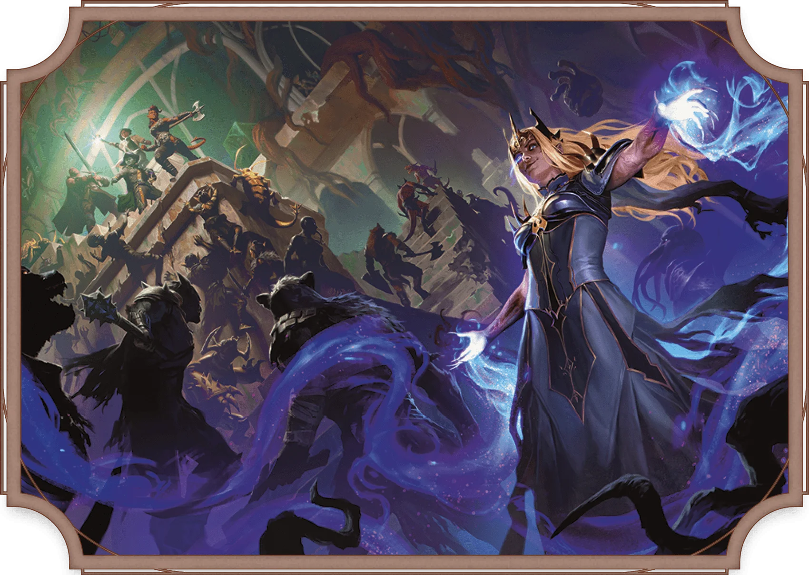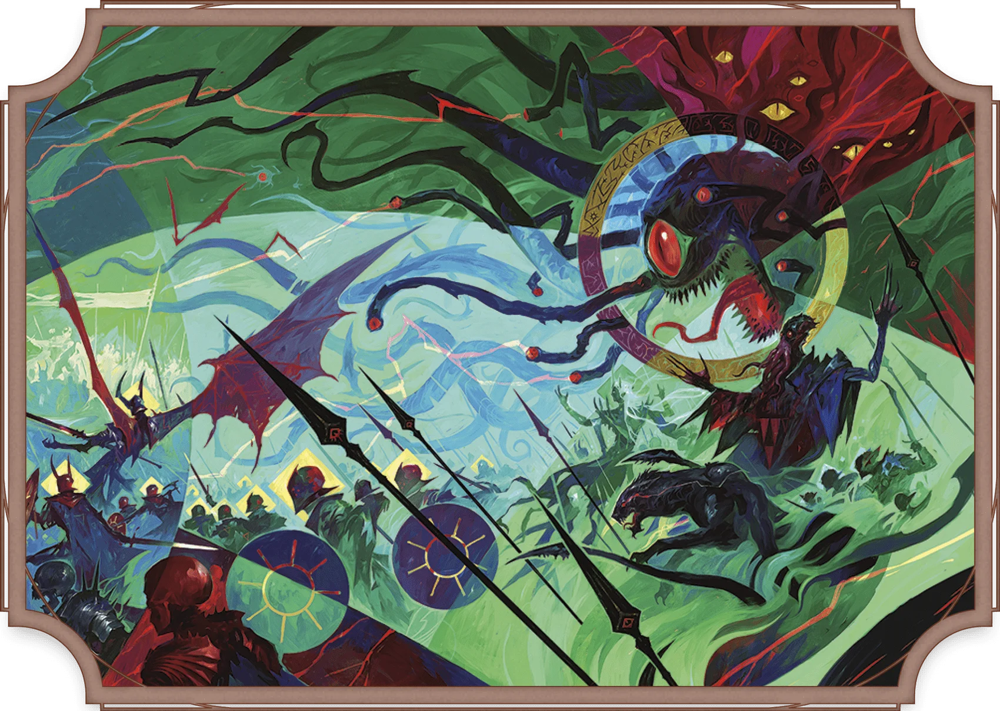