# Introduction

Can you name a tabletop activity that is highly social, builds community, and has infinite possibilities? If you said dining with friends, you're right. If you said Dungeons & Dragons, you're also right! Today, some fifty million people have played the game; D&D-inspired shows and movies top the charts; licensed D&D products fill retail shelves (ahem); and video games based on D&D's concepts rule the screens. In short, D&D is everywhere—including the kitchen!

Initially published in 1974, Dungeons & Dragons was the world's first role-playing game and would go on to revolutionize all aspects of the gaming industry and pop culture alongside it. It introduced an array of now-pervasive gaming concepts, from leveling up to gamified role assumption, but it notably held on to some aspects of its war-gaming past. Born out of a gaming culture that prized realistic simulation, the notion of needing food was inherent in the earliest versions of the game, usually represented in the simple tracking of weekly rations. To have any hope of surviving a protracted excursion in the dungeon underworld, you needed to stay fed. Simply put, in D&D, you must eat to live. But adventurers also needed a place to meet, carouse, and gather information, and what better venues to place in front of them than taverns, public houses, and other places of food and drink?

As the game developed through different communities, food became a key part of the game's narrative experience. In many of the early modules, it was not uncommon for taverns to have long lists of food and drink from which adventurers could choose. For example, in the iconic *Keep on the Borderlands*, adventurers have the option of no less than five drinks and eight dishes, from honey mead and bark tea to pudding and roast joint. By the time the *Forgotten Realms* campaign world was in full force, there were entire books devoted to rating and discussing inns and dining establishments (thanks, Volo!). More cosmopolitan venues in the multiverse boasted restaurants that might seem worthy of a Michelin star or two.

Why so many options for an element of realism that could just as simply check the box? Perhaps it's because early designers realized that food could provide new avenues for the narrative experience. Would a haughty aristocrat be content with iron rations? How well can that halfling hold her drink and what does she do when she doesn't? This is to say, the unexpected, memorable, and hilarious moments of any given D&D session are as likely to come up over an in-game tankard of Neverwinter Nectar as they are while battling a feisty gaggle of kobolds.

In the first book, *Heroes' Feast: The Official D&D Cookbook*, we posed the question, "How can food elevate and enhance the D&D experience?" In *Heroes' Feast: Flavors of the Multiverse*, we ask, "How can cooking and dining play an essential part of the communal gaming experience?" The book that you are holding is both a guide to D&D food and a culinary companion to your game nights. It includes more than seventy-five delicious recipes, which you can enjoy alongside your in-game character. We've even created some food-loving characters of our own (once nameless adventurers taken straight from the cover of the first *Heroes' Feast*) whose madcap, multiversal adventures provide the locational basis for the dishes herein. Our hope is that this book not only adds a visceral and delicious element to your games but also becomes another avenue to connect with fellow gamers. So, in the immortal words of the original *Player's Handbook*, "enjoy, and may the dice be good to you."

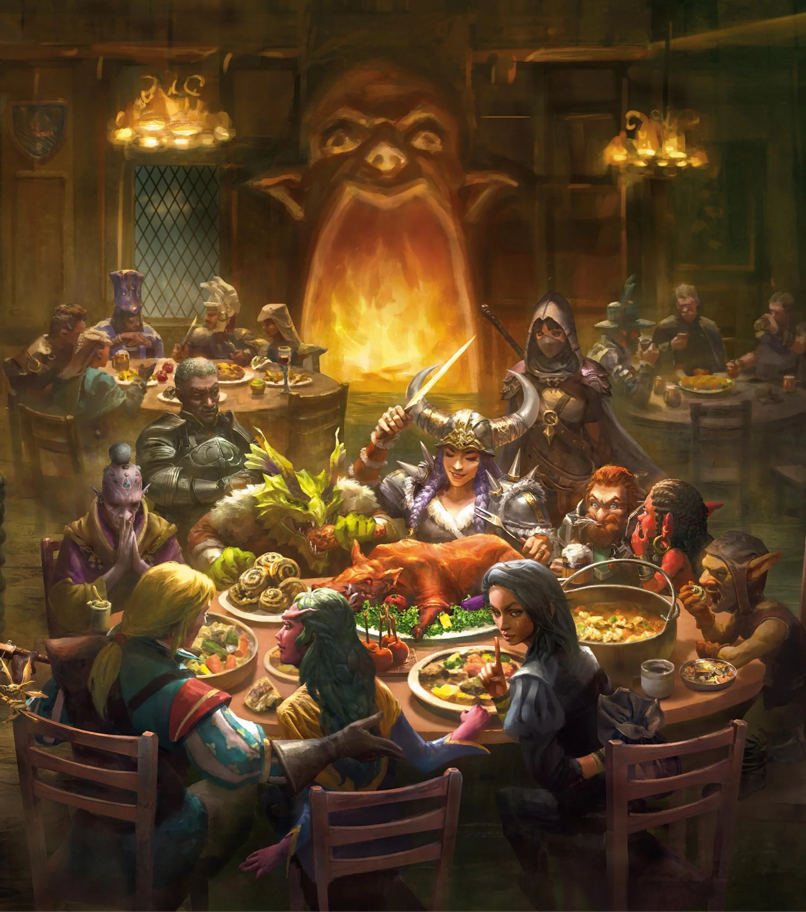

### About This Book: Cooking Fantasies

Dungeons & Dragons is a game based on imagination, and so is this cookbook. But, of course, everything is spawned by something else, and the worlds of D&D are no different. From bustling port-side cities to sprawling pastoral landscapes, the game is full of real-world influences, and this is also true of what adventurers may eat. Whether your character frequents the taverns of the Forgotten Realms, the castles of Greyhawk, or the forests of Krynn, there's a good chance you'll see something familiar on the menu. That's because roast meats, hearty grains, and seasoned vegetables are as ubiquitous in the D&D multiverse as they are in our world. The main differences come in the specific ingredients that are used and the way they are prepared.

One challenge that arises when trying to bring any aspect of D&D to life is feasibility. You may wonder, "Do I need spells, magical items, and mystical ingredients to make this stuff?" Rest assured, the answer is "no." The chef and author team have spent countless hours ensuring that each dish is true to its D&D world but also possible to prepare with ingredients and techniques available in ours. We've even consulted the great archmage Mordenkainen, who has assured us that our substitutions and alternate techniques "usually improve the dish" (he's a curmudgeon and that's high praise from the Lord Mage of Greyhawk). When the original recipe calls for **rothé**, we'll give you a reasonable analog, such as prime beef. **Owlbear** milk can be a bit hard to find in these parts, but not buttermilk, which offers a similar tang and texture. While the herring from the Rock of Bral may boast a unique flavor, North Atlantic smoked kipper is a suitable substitute. Ultimately, our approach to creating this collection of recipes was to collect and curate the most notable dishes in the D&D multiverse; adapt them for feasibility and flavor; and present them in a manner that even a first level chef might be able to prepare successfully. Accordingly, our master chef has not only conjured easy-to-follow recipes but also some helpful Cook's Notes, which will guide you through every aspect of the journey.

#### "Adventuring Gear"

Like a lich's lair, the road of culinary adventure has the potential for disaster and reward. Only with a fair amount of skill, perseverance, caution, and luck do you have a chance of survival. But before you embark on this journey, you'll also need the right gear. While fighters wield their swords and shields, and mages have their staffs and spellbooks, those who practice the culinary arts also require the proper implements to ensure a successful quest. Here are some tools that will help you complete this adventure and perhaps even level up along the way:

- Baking sheets
- Bench scraper
- Blender
- Cheese grater
- Chef's knife
- Cocktail shaker and muddler
- Colander
- Dutch oven or sauté pan
- Food processor
- Garlic press
- Loaf pan
- Measuring cups and spoons
- Mixing bowls
- Muffin tin
- Nonstick and cast-iron skillets
- Parchment paper
- Pastry brush
- Pie plate
- Saucepans
- Spatulas
- Stand mixer or electric handheld mixer
- Standard cooking utensils, such as cooking spoons, tongs, whisk
- Strainer
- Vegetable peeler
- Wire racks

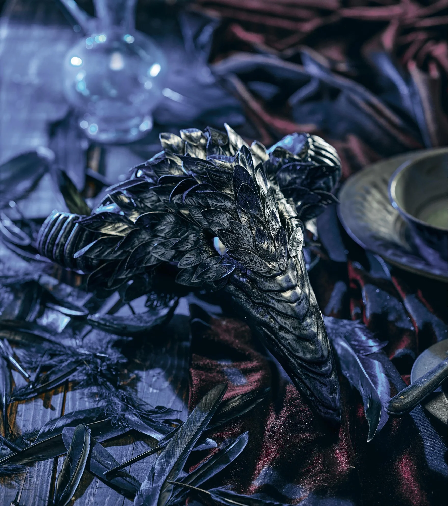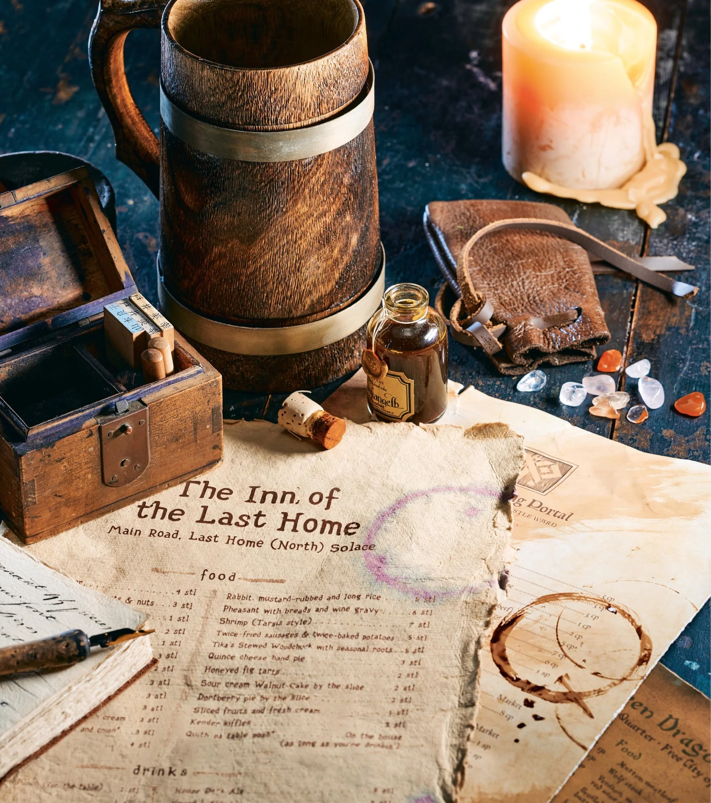
### Worlds of Flavor

Dungeons & Dragons comprises numerous campaign settings, and each is traditionally based on a single planet or realm rich with its own histories, mythologies, cultures, and, of course, culinary identities. Several locales from this vast multiverse are explored within this cookbook, forming the basis on which the recipes are organized. While each location is built for in-game action and intrigue, they also yield their own ingredients, traditions, and techniques that promise culinary adventure. These include:

#### Forgotten Realms

The Forgotten Realms is an epic fantasy setting bursting with memorable characters, distinctive locales, and a deeply layered mythology. Created by Ed Greenwood, the Earthlike planet called Toril is home to this sprawling and diverse campaign world spread across several key continents, the most famous of which is Faerûn (beneath which the Underdark lurks). Each offers vast and eclectic topographies, dense with medieval-style cities and ports. Faerûn boasts some of the game's most storied regions, including the Sword Coast, Amn, Calimshan, Cormyr, the Dalelands, Icewind Dale, and Thay, as well as the legendary cities of Baldur's Gate, Calimport, Neverwinter, Waterdeep, and the infamous Underdark metropolis of Menzoberranzan. The cuisine of Toril is as varied as the settings themselves, from dishes inspired by medieval Europe to tastes derived from Asia as well as the Americas.

#### Dragonlance

Developed by Tracy Hickman and Margaret Weis, Dragonlance depicts a dreamy, high-fantasy world of purple mountains; forested, evergreen trails; crystal lakes; and dragons of every color. Despite its natural beauty, Dragonlance's planet of Krynn is a world ravaged by war. Here, magic is rare and humanoids constantly find themselves at the mercy of dragons and dragonkind. Some seek harmony and cosmic balance, others crave control and domination. Ansalon is the most well-known of the planet's five continents, and it includes many of the famous locations from the campaign's bestselling novels, including Istar, Kalaman, Pax Tharkas, Qualinost, Qué-Shu, Silvanost, Solace, Solamnia, Tarsis, and Xak Tsaroth. The food of this lush world ranges from European tavern fare to vibrant flavors found throughout Asia.

#### Spelljammer

Its design originally helmed by Jeff Grubb, Spelljammer is a wholly unique setting that launched Dungeons & Dragons into the stars and cleverly allowed travel between the traditionally isolated sword-and-sorcery worlds of D&D. On board magical flying ships called spelljammers, players can traverse the Astral Plane, a vast expanse of interplanetary space, to celestial destinations untold. It not only provided canonical means for characters (and their stories) to migrate between planets but it birthed an endless ocean of new adventures, adversaries, and locations to explore—and with it, endless swashbuckling hijinks. Storied locales such as the Rock of Bral, an intergalactic spaceport orbiting the planet Toril, conjure a healthy dose of space fantasy tropes. With a cosmic "open sea" vaster than any planetary ocean, an explosion of cultures and cuisines are invariably on offer to enliven any campaign.

#### Greyhawk

The homebrew campaign setting of D&D co-creator Gary Gygax, Greyhawk is a grounded, sword-and-sorcery-style world rife with forbidden magic and perilous dungeons. This campaign is set on a sprawling, ocean-laden planet called Oerth, with medieval sensibilities and overt shades of Earth. Several continents cluster the surface of Oerth, including Hepmonaland, Hyperboria, and, most notably Oerik, which hosts an area called the Flanaess on its eastern part. The Flanaess is home to Greyhawk's most documented regions and kingdoms, including Perrenland, the Shield Lands, Urnst, Iuz, Veluna, Keoland, Sunndi, and Furyondy. Fabled cities and dungeons mark these areas from the Free City of Greyhawk, the Village of Hommlet, and White Plume Mountain to Saltmarsh, Blackmoor, and beyond. Greyhawk's cuisine culls its inspiration from feudal Europe, especially Britain, often with a fantastical twist.

#### Eberron

Eberron is a steampunk-styled world of swashbuckling adventure, where incredible machines and potent magic improbably coexist. Invented by Keith Baker, the planet consists of several continents, the most famous of which is Khorvaire. There, the eclectic Five Nations of Aundair, Breland, the Mournland (Cyre), Karrnath, and Thrane contend for supremacy over the ruined Kingdom of Galifar. From the shimmering towers of Sharn to the ruin-filled port city of Stormreach, this visionary, war-torn campaign boasts vibrant cuisine uniquely representative of the Five Nations. Eberron's tastes range from unpretentious feudal fare to exquisitely sophisticated epicurean creations made with a delightful blend of magic and many-geared machines.

#### Planescape

Designed by David "Zeb" Cook, the campaign setting known as Planescape fittingly takes place in the Outlands, which in the cosmology of the Outer Planes is the center of the Great Wheel. According to Jeff Grubb's 1987 *Manual of the Planes*, a mysterious shaft known as the Spire rests at the center of the Outlands; seven years later the Planescape campaign set atop it the famed city of Sigil. This City of Doors, as Sigil is affectionately known to multiplanar travelers, serves as a conduit to the myriad worlds that comprise the D&D multiverse. Considered to be "the center of the universe," Sigil is a multicultural nexus, which unifies these seemingly infinite, interdimensional magical portals to dimensions untold. Though numerous planes are connected to Sigil—such as the Astral and Prime Material Planes—Sigil cannot be accessed by conventional travel and can be entered only via one of the many gateways that lead to the different worlds and planes. A city unlike any other, Sigil is crowded with structures stacked and layered upon themselves, while new buildings, courtyards, and streets are constantly being constructed, perpetually altering the city's already eclectic landscape. It should come as no surprise that the cultures and flavors on offer are constantly evolving, ensuring that no two visits or meals in Sigil will ever be the same.

***Plane Food.*** The D&D multiverse is made up not only of myriad worlds but of other dimensions or "planes of existence." The standard "reality" that most experience in these realms is called the Prime Material Plane, but this dimension is just the tip of the iceberg. It is believed that these worlds are surrounded by planes, some of which are "echo" realities that exist in the same cosmological space as the Material Plane, while others are spatially and conceptually much farther afield, such as the planes of the gods. Like the worlds they surround, each of these planar locales, from the Nine Hells of Baator to Seven Heavens of Celestia, has its own character, and even cuisine, including the Feywild and the Shadowfell.

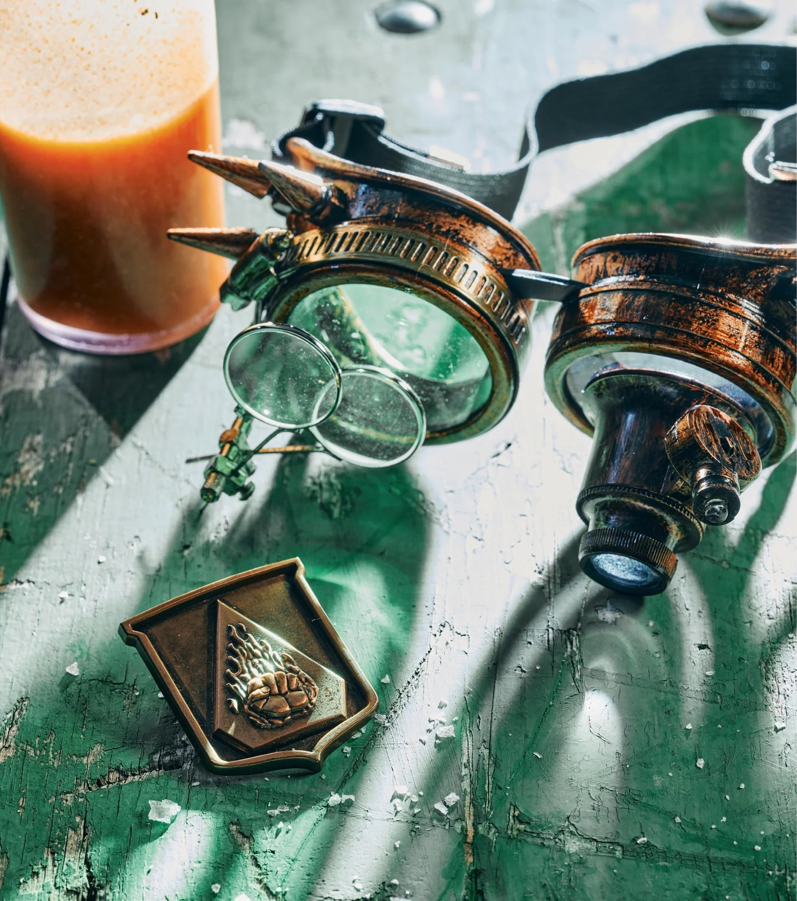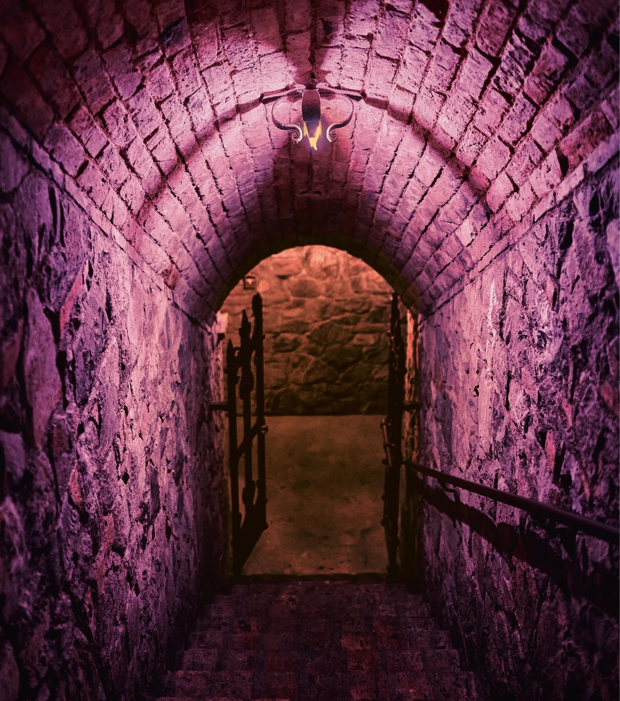
#### The Feywild

Sometimes called the Plane of Faerie, the Feywild is a dreamy, haunting reflection of the Material Plane, known for its indescribable beauty. Bathed in eternal dawn, its verdant and alluring woodland landscapes are the native home to the fey and harengon, creatures of unparalleled wonder. The Feywild, much like its Shadowfell counterpart, is an echo of the Material Plane. But unlike the Shadowfell, it is a tantalizingly positive and vibrant place of joy, where each of its parallel locations is grander and more majestic. It is a rare locus of unrefined magic, unrestrained emotion, and unbridled passion, an ancient land birthed of love, laughter, and mischief. In the Feywild, scents are stronger, colors more vivid, sounds clearer, and flavors more remarkable, making any culinary experience that much more memorable.

#### The Shadowfell

The Shadowfell, commonly referred to as the Plane of Shadow, is a dark reflection of the Prime Material Plane. Unlike its "echo" opposite, the Feywild, the Shadowfell is a bleak, desolate region draped in an eternal twilight, veiled in gloom, and synonymous with death. Since its primary inhabitants are cursed creatures of the night, as well as the dead, the Shadowfell is largely void of life and hope. In its darkest corners, where sinister powers fester, the Domains of Dread lie in wait. These haze-shrouded demiplanes are places of unimaginable horror ruled by sadistic lords who consider these private domains their own perverse paradise. Many of the individual domains that make up the demiplanes were originally dragged from the Prime Material Plane and tethered to the Shadowfell by powerful magical mists. The same impenetrable mists that border these doomed areas prohibit travel to other planes through any conventional means. In the Shadowfell, and its Domains of Dread, one's primary senses are gradually muted, resulting in an insipid culinary experience regardless of what is consumed.

#### Ravenloft

Originally published in 1983 as an *Advanced Dungeons & Dragons* module by designers Tracy and Laura Hickman, Ravenloft is both a campaign setting and the legendary castle of vampire Strahd von Zarovich, located in D&D's most famous Domain of Dread: Barovia. Accessible by way of the Shadowfell (and usually by mistake), this sprawling Gothic Horror landscape, which remains eternally shrouded in mist, has served up generations of nightmares courtesy of Strahd, his throngs of undead minions, and his dark hold on the demiplane.

### The Bureau of Dark Tables

>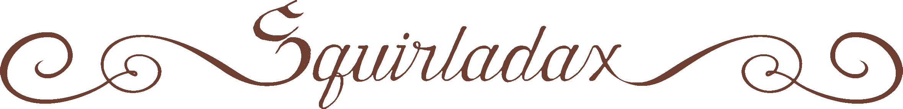
>
>Huzzah and welcome to the journal of the Bureau of Dark Tables, adventurers and gastro-gnomes extraordinaire! I, Squirladax the Goblin Poet, leader of the Bureau, pledge to you that the thrills herein are purely factual and scribed roughly as they occur! For this record is penned with an item of mighty power: the Quill of Scrivening! How works this? One need only speak words into its flaxen feather and watch as a ghostly hand scribes them into one's adventurer's journal! Miraculous!
>
>As such, even I, wise as I am, know not what will fill these pages! As I stand on the precipice of undreamed-of adventure, my heart is full. Yet, in truth, my guts are stewed with the juices of uncertainty and the spices of regret.
>
>What means this? Kind reader, I do not intend to spoil your sweet puddings with my sour tumults, but the Bureau was very recently upended. One cannot feast of the sweet meats and cheeses of life without paying the bill, eventually. Hath you ever heard of the dread utterings referred to only in hushed tones as a TPK? I can feel your trembling hands grasp a term your mind refuses to ingest. Yes, my party hath just suffered a **T**otal **P**lanning **K**atastrophe.
>
>Now, before you leap to conclusions, I wish it known that 'twasn't **my planning** that caused the cleavèd limbs and screaming death of my comrades. As leader, I am but a humble chef of sorts, and I can only make as fine a meal as my ingredients permit. My ingredients were perhaps a bit too fresh, and **their** lack of ripeness was their undoing.
>
>Eight young adventurers stood forth, many lacking in grit, and all too young to appreciate my inspirational bardic magic. Their cowardice flowed like wine. And there was not a single cleric-healer among us, and that much 'twas on me! For it is well understood in all adventuring literature, from guild manuals to the guides of Volo, that a proper party must haveth might for the front lines, magic to rain down destruction from afar, healing hands to restore vigor, and of course a great mastermind to control—nay—**lead** them all.
>
>Any of ways, that chapter is closed. But, let it be said—TWO of their number survived and so too did a portion of our treasure! A fine—if slightly chippèd—RUBY, which I have named, well, Ruby. As they have survived, I have survived, and Ruby has survived, so too does the Bureau of Dark Tables survive!
>
>Failure is the fire by which we cook tomorrow's victories, and I am burning with excitement for what 'tis next. I promise thee, fearless reader, that I shall have my victory. A QUEST will present itself. The Tables will be turned, and one day I shall return to my beloved homeland—the Caves of Calmness—with riches untold.
>
>Onward and Bree-Yark!
>

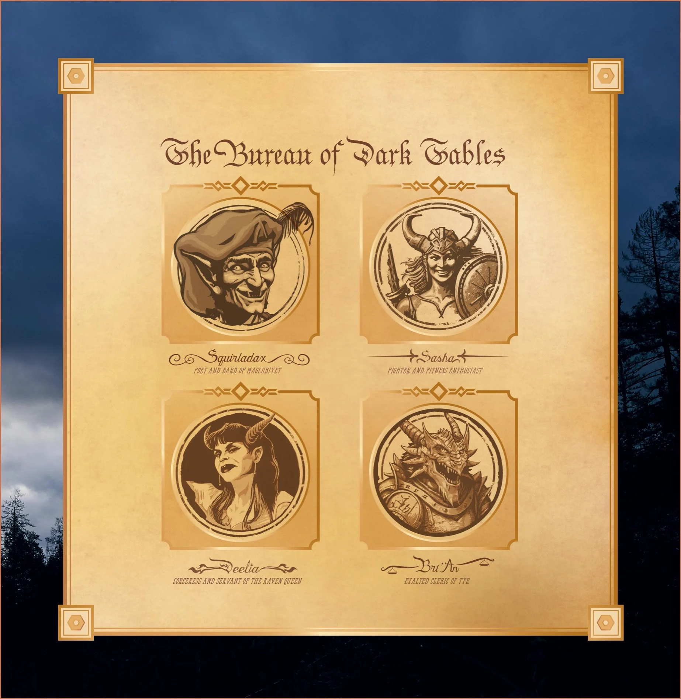

------

# The Yawning Portal

Our brave heroes gather at the legendary Yawning Portal tavern in the Forgotten Realms, eager to take part in delving and dining!

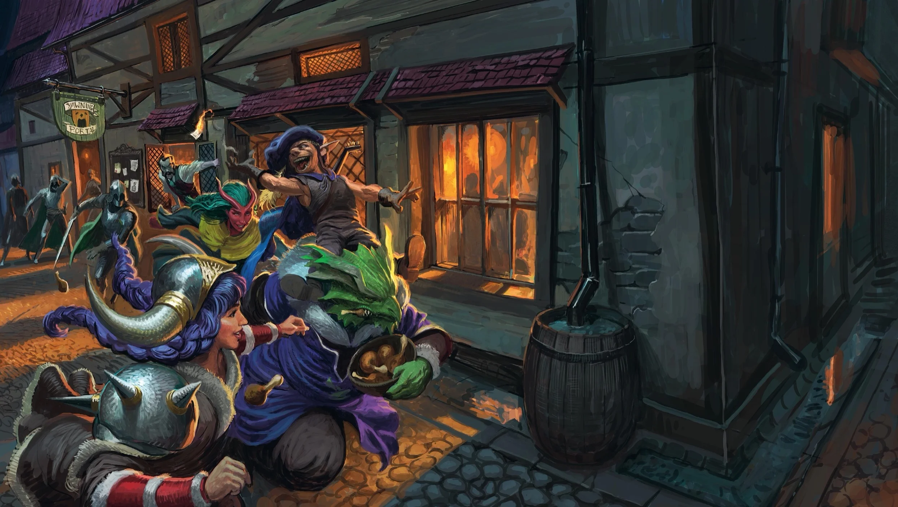

>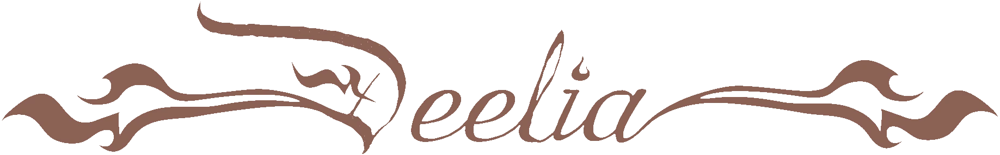
>
>The Yawning Portal. Cursed reader, if you are unfamiliar with this place, let me be the first to admonish and congratulate you. If you have never been, **do not go**. If you have gone, do not come back....
>
>It is a tavern. A place of merriment for all. It is also a cork—a giant stopper on a jug of poisoned wine, for the Yawning Portal is built on top of a giant stone well that plummets fathoms down into the tunnels of the mad mage Halaster. They call it Undermountain, and it is down there that the soulless corpses of failed adventurers feed carrion crawlers and worse.
>
>But up here, all is laughter, and the amber light of candles and sconces glow amid wafting aromas of faraway spices. Up here, the bodies have animated, haughty, mirthful expressions. Up here the bodies still have souls.
>
>That's where I come in.
>
>I am Deelia, collector of souls. Why am I here? Because Squirladax has proclaimed that we "do our part" in this year's "Great Delving." Apparently, the idea is that one drinks and feasts at the tables poised about the gaping well that falls to the dungeons below. When an adventurer's group has its glut of rothé steak or sornstag, that group boards a sturdy "elevator" platform, dangling from ropes above this pit. It is then that the pulleys squeal, and the group makes its slow descent to Undermountain to "battle evil." It's a party.
>
>Group after group go down, and groups minus one or more come back up, often with grievous wounds rebuking the mirth of hours before. It is for this reason that the Yawning Portal's swarthy proprietor **Durnan** hires clerics and those of magical salves to await the broken adventurers to heal their wounds and hopefully save lives.
>
>So, of course, Squirladax—wielding one stone to murder many birds—has invited a pious little dragonborn cleric named By'ron (or something) to join our Bureau. He shall mend holes in our holey purses, for every life he saves here brings to us needed coin.
>
>And if the lives cannot be saved, well, I am here to whisper a word of guidance to their souls to send them...elsewhere.
>
>
>
>So, we're super short on money—I hope no one minds that I ordered the cow butter. I do believe this is a business expense. According to my new/used *Volo's Guide to Bodily Health*, gifted to me by wise Squirladax, "a washing of wounds in rich butters" will totally "oil the joints" and give me the speed and agility that I lacked in the...uh...TPK. Oh crap! I ordered the SALTED butter! Oh well...As *Volo's Guide* says, "There is no gain without pain." Maybe I should order some of those "famous" Yawning Portal biscuits to lather the excess on. I'm freaking starving!
>
>
>
>Ugh. Bri'An (I guess is his name) has laid many benedictions at the lip of the chasmal well to various so-called adventurers. "Tyr be with the brave." "Tyr guide and protect you."
>
>Tyr can suckle the worms from their guts.
>
>So far, three groups have descended to Undermountain. None have returned of yet. My tankard of Neverwinter Nectar is running low. As is my patience.
>
>I spy pathetic Squirladax cradling that sad bit of ruby he treasures.
>
>
>
>BISCUITS?! NECTARS?! These I did not authorize! There shall NOT be foods to cram into our filthy mouth-holes, I commanded, for I do not trust THESE PRICES! We have a plan and must stick't'it! Soon, wounded heroes will appear up from the well, Bri'An will mutter holy jumblings of healing miracles, we will collect coin, then off we will abscond with heavy purses! Any are welcome to persuade me otherwise, but the charisma of my minions sags lowly. I chortle at their famishment!
>
>
>
>The nectar and Butternut Beer have buoyed me to a bouncy slosh. Eleven groups have descended and FINALLY, Undermountain spews these "heroes" back bleeding with screamy mouths and weepy eyes! Oooo! Some limbs have been amusedly cleavèd! NOOO! The blasted clerics have prevented fatalities with their priggish priestly zeal.
>
>Several clerics have retired for the evening already, their holy might spent.
>
>But Bri'An furtively observes, prattling quietly of Tyr's graces. Is't too much to wish for ONE CORPSE?! For without the dead, I cannot send ANY on their journey.... Patience!
>
>Meanwhile, Sasha is chewing off her fingers' nails in hunger.
>
>
>
>A yearning pang in my gutsack! It has been hours now, and my ribs quarrel with my brains. OK! I have made the executive decision to order a plate of Goldenstars and a single Onion Loaf. 'Twas the last of our coppers, but filling enough, and will perhaps staunch the greedy lips of my minions long enough for Bri'An to work his blasted miracle and for us to get paid!
>
>I've come to wonder of Bri'An's powers. Although his faith is unquestioned, he has only laid hands to heal one of us...and it 'twas himself. However—I am reminded—he professed to feel much better after laying hands on he, Tyr be praised.
>
>The wounded burble up from Undermountain bloody and babbling, and two more clerics have collapsed of exhaustion in their attempts to save the anguished heroes.
>
>NOW! I call forth Bri'An to HEAL! But Bri'An bids me hold, for firstly he must limber up.
>
>Not long, my sweet Ruby, 'til you shall be matriarch to a family of jewels and treasures.
>
>ZOUNDS! SASHA HOWLS! Why now do tears spray from her eyes, why does she scrub at her wounds with sticks of salty butters. WHAT?! I DID NOT AUTHORIZE BUTTERS!
>
>
>
>Bri'An's warm-up blessings bless this unholiest of drinking holes, and still, no one has died. At this, I am sullen.... I am also very drunk. Dismay floods my sinking heart as I realize that **these last groups** returning may be my last hope at a bounty of freshly slain souls.
>
>Squirladax screeches fiscally at young Sasha, while Bri'An plays DARTS!? This is torment! Let us heal these maggots and be OUT! Bri'An now cries out to the kitchen, something about a "Heroes' Feast."
>
>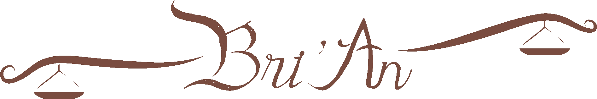
>
>By my honor, what happened was NOT MY FAULT! Here's how it played, on Tyr's honor.
>
>The Heroes' Feast arrived. Clearly a gift from the house for faithful service. We did what Tyr bid when he lay his bounty before you. We feasted upon succulent, sandwich—like Talyth and the freshest of green Chopforest. The main course, that of the most blessed Hot River Crab Bites, followed by a most pious Laumberry Pie, served alongside Mingari-Spiced Owlbear Milk and a pastry that was sour of cream and made from the nuts of wal.
>
>Sasha feasted the feast of warriors.
>
>Deelia found a peace unknown to her cursed people in potent drink!
>
>Our leader Squirladax sang goblin songs through sharp teeth, stippled with the finest meats and pastries!
>
>AND I GAVE THIS! MY service here this night.... By Tyr's grace, of course.
>
>Then the rickety squeals of the winch screeched my senses to sharpness as the elevated platform began its slow ascent! A cry, "Adventurers return...and with wounded!"
>
>I...must guess...that some mechanical failing occurred with the winch and the platform plummeted to Undermountain.
>
>I shall never forget their cries or their brave sacrifice. May Tyr greet them at his holy gates.
>
>
>
>WHAT HELL?! I keep replaying the events in my drink-addled brain. What I saw I could not have. Shortly before the winch broke, a flit of parchment appeared on our table. A bill—a wicked BILL. The cost, presumably, of the Heroes' Feast. Ne'er have I seen such want of coin, such greed, as that of the wretched BILL.
>
>Bri'An and I locked eyes over this grave, unjust report. Then it was Squirladax's eyes that went wide as he shook his head and slipped Ruby back into his pouch. Not TWO, nor FIVE BUREAUS OF DARK TABLES could ever hope to pay off this bill.
>
>I knew in that instant what must be done.
>
>With a scream, I summoned all the powers of the Raven Queen and vaporized this ghastly receipt...with fire!
>
>At the same moment, following what plan I know not, Bri'An drew his smiting hammer and shattered the winch in blind, shrieking panic!
>
>For this I will not forgive him, for as Sasha and Squirladax bid us FLEE the Yawning Portal, I was robbed of my chance to collect what surely was a bounty of souls at the bottom of the well! Queen, forgive me!
>
>
>
>I am so freaked out right now. An ambush! City Watch officers jumped out at us in an alley behind the Blackstar Inn! Squirladax shoved me back toward them screaming that I should "assume the front line." His heave knocked me into their grasping gauntlets! I thought for sure they had me, but their grabbing hands slipped off my heavily buttered limbs. I fled swiftly!
>
>I'm breathing so heavy right now, guys, but you should have seen how fast I was! Anyways, while I have clearly improved speed and dexterity thanks to my butter treatment, it has become clear, as I gasp for breath, that my breath bellows are weak and need strengthening. There's a whole chapter on this in the *Volo's Guide*, and I have to work on this.
>
>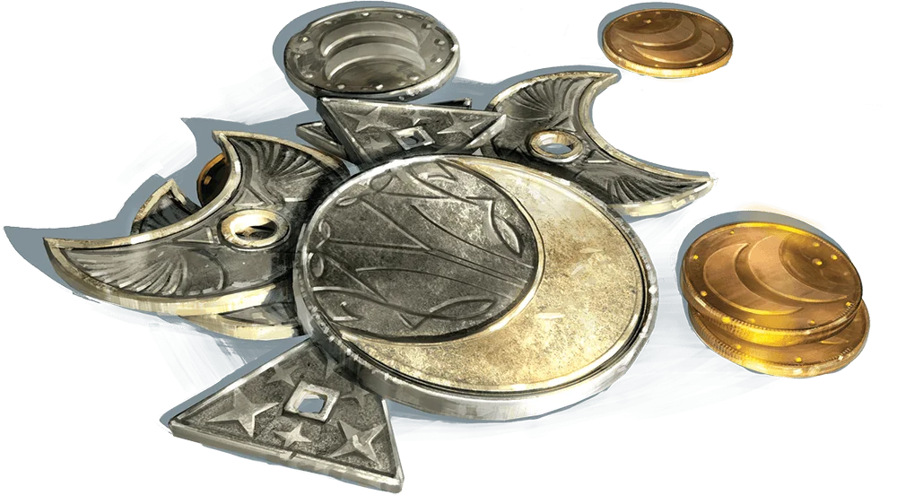
>
>
>
>My shockèd goblin mind is racing, my lungs burn with the ill humors of exhaustion. We have been hiding in a Waterdeep sewer drain for nigh.... I do not know how long! The sun's rays peek over the rooftops as throngs of City Watch seek us! WHAT happened?! Bri'An isn't talking.
>
>Running is hopeless. The Bureau's bellies are bursting of crustaceans and cheeses, and their sweat is as of gravy. I'd stop to ask them for council but their brains are bobbing in a wash of mead! I require time to plot our next move.... Wait! Bobbing in a wash! That's it!
>
>
>
>I lurch about an unevenly planked floor. Squirladax, the foul rodent, beams above me with pride and boasts of our newfound "safety." The room in which I find myself is not safe! It is cursed with a swaying that roils the mead still sloshing in my guts.
>
>Goblin "leader" Squirladax has funneled us to shelter in the hold of some ship, and the room spins. The wafting aroma of dead fish twists at my gorge. There is also the clanging of the City Watch bell that rattles my throbbing skull.
>
>All I wish to know is, why in the Nine Hells was a Heroes' Feast ordered and why did we not sacrifice Ruby to pay for it?!
>
>
>
>Deelia has confronted me about Ruby, and why she was not sacrificed to ransom us against our dangers. Ruby is not coin to be tossed aside. Ruby is the mother of future fortunes. Oh wait. Oh no! Wherefore art my beloved Ruby?! I sweep my pockets with goblin fingers and feel her naught!
>
>
>
>BY TYR'S GRACE, DO YOU HEAR THE CLING CLANGING STEPS ON THE PLANKS ABOVE US? The City Watch have found us! We are certainly doomed! DOOMED!
>

### Goldenstars

As you step onto the docks of Berdusk, the Jewel of the Vale—perhaps fresh off one of the many boats that ply the River Chionthar—there's a good chance the first thing you'll eat will be a goldenstar. These rich little pastries, traditionally stuffed with a local chicken sausage and Goldenfields batatas and leeks, are known for their distinctive triangular shape. Vendors sell them everywhere, and their heartiness will tide you over until you can manage a sit-down meal. Varieties of the goldenstar have spread throughout the Sword Coast, from the river's end at Baldur's Gate to as far north as Neverwinter. But every time you eat one done right, you'll be brought back to the docks of Berdusk.

<table class="rd__b-special rd__b-data  rd__b-data--stats">
		<thead>
			<tr>
				<th class="rd__data-embed-header ve-text-left" colspan="6" data-rd-data-embed-header="true">
					

						

							Goldenstars
							
						

						[–]
					

				</th>
			</tr>
		</thead><tbody class="" data-rd-embedded-data-render-target="true"><tr>
			<td colspan="6" data-rd-tag="recipe" data-rd-uid="Goldenstars|HFFotM" data-rd-page="recipes.html" data-rd-source="HFFotM" data-rd-hash="goldenstars_hffotm" data-rd-name="Goldenstars" data-rd-display-name="Goldenstars" data-rd-style="" data-rd-entry-data="{}">
				<i>Loading <a href="recipes.html#goldenstars_hffotm"  onmouseover="Renderer.hover.pHandleLinkMouseOver(event, this)" onmouseleave="Renderer.hover.handleLinkMouseLeave(event, this)" onmousemove="Renderer.hover.handleLinkMouseMove(event, this)" onclick="Renderer.hover.handleLinkClick(event, this)" onwheel="Renderer.hover.handleLinkWheel(event, this)" ondragstart="Renderer.hover.handleLinkDragStart(event, this)" data-vet-page="recipes.html" data-vet-source="HFFotM" data-vet-hash="goldenstars_hffotm" ontouchstart="Renderer.hover.handleTouchStart(event, this)" >Goldenstars</a>...</i>
				
			</td>
		</tr></tbody></table>

### Talyth

The palm-size sandwich known as talyth is a beloved appetizer on many a menu, from Waterdeep and the rustic watering holes of Luskan to the cloistered refectories of Candlekeep and eateries as far east as the Sea of Fallen Stars where, it is said, the dish originated. Although countless variations exist, talyth commonly comprises meats (typically sliced sausage), cheese, spices, and herbs nestled between two large crackers, all lightly baked to adhere the layers. While the baking process seals in flavor, it also ensures its portability, making talyth a common travel snack along the major Faerûnian trade routes. Although frozen talyth can easily be reheated on an open campfire, freshly made talyth affords a more eclectic and adventurous array of savory ingredients, including diced egg, oysters, snails, and even spiced worms.

<table class="rd__b-special rd__b-data  rd__b-data--stats">
		<thead>
			<tr>
				<th class="rd__data-embed-header ve-text-left" colspan="6" data-rd-data-embed-header="true">
					

						

							Talyth
							
						

						[–]
					

				</th>
			</tr>
		</thead><tbody class="" data-rd-embedded-data-render-target="true"><tr>
			<td colspan="6" data-rd-tag="recipe" data-rd-uid="Talyth|HFFotM" data-rd-page="recipes.html" data-rd-source="HFFotM" data-rd-hash="talyth_hffotm" data-rd-name="Talyth" data-rd-display-name="Talyth" data-rd-style="" data-rd-entry-data="{}">
				<i>Loading <a href="recipes.html#talyth_hffotm"  onmouseover="Renderer.hover.pHandleLinkMouseOver(event, this)" onmouseleave="Renderer.hover.handleLinkMouseLeave(event, this)" onmousemove="Renderer.hover.handleLinkMouseMove(event, this)" onclick="Renderer.hover.handleLinkClick(event, this)" onwheel="Renderer.hover.handleLinkWheel(event, this)" ondragstart="Renderer.hover.handleLinkDragStart(event, this)" data-vet-page="recipes.html" data-vet-source="HFFotM" data-vet-hash="talyth_hffotm" ontouchstart="Renderer.hover.handleTouchStart(event, this)" >Talyth</a>...</i>
				
			</td>
		</tr></tbody></table>
### Chopforest

Many examinations of early Yawning Portal menus have noted that its heavy, often greasy, fare had a celebratory "last meal" sense about it. This is likely because return from the Undermountain was simply not expected, with only the soiled dishware of stout adventurers left behind. However, as more adventurers survived the mad mage Halaster's labyrinth, the menu evolved to accommodate a balance of healthier options. Senior cook Jarandur Tallstand adapted the traditional wood-elven forest salad, or chopforest, as it has been called, to complement the heavier menu options with its mix of peppered leaves, olives, fennel, and tangy vinaigrette dressing. It is said that a chopforest delivered unto your table, compliments of Yawning Portal proprietor and Undermountain gatekeeper **Durnan**, is a happy omen before one's descent to Undermountain.

<table class="rd__b-special rd__b-data  rd__b-data--stats">
		<thead>
			<tr>
				<th class="rd__data-embed-header ve-text-left" colspan="6" data-rd-data-embed-header="true">
					

						

							Chopforest
							
						

						[–]
					

				</th>
			</tr>
		</thead><tbody class="" data-rd-embedded-data-render-target="true"><tr>
			<td colspan="6" data-rd-tag="recipe" data-rd-uid="Chopforest|HFFotM" data-rd-page="recipes.html" data-rd-source="HFFotM" data-rd-hash="chopforest_hffotm" data-rd-name="Chopforest" data-rd-display-name="Chopforest" data-rd-style="" data-rd-entry-data="{}">
				<i>Loading <a href="recipes.html#chopforest_hffotm"  onmouseover="Renderer.hover.pHandleLinkMouseOver(event, this)" onmouseleave="Renderer.hover.handleLinkMouseLeave(event, this)" onmousemove="Renderer.hover.handleLinkMouseMove(event, this)" onclick="Renderer.hover.handleLinkClick(event, this)" onwheel="Renderer.hover.handleLinkWheel(event, this)" ondragstart="Renderer.hover.handleLinkDragStart(event, this)" data-vet-page="recipes.html" data-vet-source="HFFotM" data-vet-hash="chopforest_hffotm" ontouchstart="Renderer.hover.handleTouchStart(event, this)" >Chopforest</a>...</i>
				
			</td>
		</tr></tbody></table>
### Hot River Crab Bites

A center of music and the arts, the town of Berdusk, in Faerûn's western heartlands, is known for many things, but above all for its hot river crabs. A specialty of the Sign of the Silver Sword Inn, these river delicacies are as dependent on freshness as on seasoning. Traditionally, locals would harvest crabs with soft shells and consume them within the day. As for the crab recipe, it's a closely guarded secret, but is believed to include crème fraîche and lemon zest mixed into a spread and served on endive. At only one copper piece per plate, they'll leave enough in your coinpurse for a glass of Saerloonian Glowfire—the perfect complement.

<table class="rd__b-special rd__b-data  rd__b-data--stats">
		<thead>
			<tr>
				<th class="rd__data-embed-header ve-text-left" colspan="6" data-rd-data-embed-header="true">
					

						

							Hot River Crab Bites
							
						

						[–]
					

				</th>
			</tr>
		</thead><tbody class="" data-rd-embedded-data-render-target="true"><tr>
			<td colspan="6" data-rd-tag="recipe" data-rd-uid="Hot River Crab Bites|HFFotM" data-rd-page="recipes.html" data-rd-source="HFFotM" data-rd-hash="hot%20river%20crab%20bites_hffotm" data-rd-name="Hot River Crab Bites" data-rd-display-name="Hot River Crab Bites" data-rd-style="" data-rd-entry-data="{}">
				<i>Loading <a href="recipes.html#hot%20river%20crab%20bites_hffotm"  onmouseover="Renderer.hover.pHandleLinkMouseOver(event, this)" onmouseleave="Renderer.hover.handleLinkMouseLeave(event, this)" onmousemove="Renderer.hover.handleLinkMouseMove(event, this)" onclick="Renderer.hover.handleLinkClick(event, this)" onwheel="Renderer.hover.handleLinkWheel(event, this)" ondragstart="Renderer.hover.handleLinkDragStart(event, this)" data-vet-page="recipes.html" data-vet-source="HFFotM" data-vet-hash="hot%20river%20crab%20bites_hffotm" ontouchstart="Renderer.hover.handleTouchStart(event, this)" >Hot River Crab Bites</a>...</i>
				
			</td>
		</tr></tbody></table>
### Sornstag

Popular at holiday gatherings of humans and elves alike, sornstag is a simmered venison dish that can be seasoned and prepared in a variety of ways. Traditional elven sornstag is slow smoldered with ground coriander, cumin, and hotspice or curry in a thick broth and is a popular plate among wood elves during the Highharvestide Festival. Humans have also adopted their own stewed preparation techniques for this gamey, yet succulent, main course. Throughout the wooded regions of Faerûn, stags are hunted by humans for both sport and meal, resulting in the proliferation of venison-based cuisine. In the bucolic forests and fields of the Dalelands, the most popular regional recipe for sornstag demands a full day's preparation. The traditional recipe calls for powdered almonds simmered with red wine to form the emulsified base of a piquant sauce, in which the meat soaks overnight before it is slow-cooked on an open flame from dawn for an early evening feast. But to get it to the table faster, you can skip the overnight marinade and cook it in an oven for just a few hours. Notably, the Silver Taproom, in Essembra, sees travelers from far and wide eager to sample its famous pied sornstag, which consists of a heaping ladle of this venison stew baked inside a buttery crust. You'll know the sornstag pies are ready when the scent of the aromatic pastry wafts down bustling Rauthauvyr's Road.

<table class="rd__b-special rd__b-data  rd__b-data--stats">
		<thead>
			<tr>
				<th class="rd__data-embed-header ve-text-left" colspan="6" data-rd-data-embed-header="true">
					

						

							Sornstag
							
						

						[–]
					

				</th>
			</tr>
		</thead><tbody class="" data-rd-embedded-data-render-target="true"><tr>
			<td colspan="6" data-rd-tag="recipe" data-rd-uid="Sornstag|HFFotM" data-rd-page="recipes.html" data-rd-source="HFFotM" data-rd-hash="sornstag_hffotm" data-rd-name="Sornstag" data-rd-display-name="Sornstag" data-rd-style="" data-rd-entry-data="{}">
				<i>Loading <a href="recipes.html#sornstag_hffotm"  onmouseover="Renderer.hover.pHandleLinkMouseOver(event, this)" onmouseleave="Renderer.hover.handleLinkMouseLeave(event, this)" onmousemove="Renderer.hover.handleLinkMouseMove(event, this)" onclick="Renderer.hover.handleLinkClick(event, this)" onwheel="Renderer.hover.handleLinkWheel(event, this)" ondragstart="Renderer.hover.handleLinkDragStart(event, this)" data-vet-page="recipes.html" data-vet-source="HFFotM" data-vet-hash="sornstag_hffotm" ontouchstart="Renderer.hover.handleTouchStart(event, this)" >Sornstag</a>...</i>
				
			</td>
		</tr></tbody></table>

### Rothé Steak

One silver piece is an extraordinary bargain for the Rothé Steak at the Yawning Portal—even if it is one of the more expensive things on the menu. Served sizzling-hot right out of the skillet, with just a hint of garlic and garden spices, rothé steak is a carnivore's delight and the perfect protein for a triumphant or aspiring adventurer. Along the Sword Coast, you can easily source fresh **rothé** that is either farm-raised or wild game—there are devotees of both. Why bother with any vegetable sides? You won't get to them with this slab of meat to tackle.

<table class="rd__b-special rd__b-data  rd__b-data--stats">
		<thead>
			<tr>
				<th class="rd__data-embed-header ve-text-left" colspan="6" data-rd-data-embed-header="true">
					

						

							Rothé Steak
							
						

						[–]
					

				</th>
			</tr>
		</thead><tbody class="" data-rd-embedded-data-render-target="true"><tr>
			<td colspan="6" data-rd-tag="recipe" data-rd-uid="Rothé Steak|HFFotM" data-rd-page="recipes.html" data-rd-source="HFFotM" data-rd-hash="roth%c3%a9%20steak_hffotm" data-rd-name="Rothé Steak" data-rd-display-name="Rothé Steak" data-rd-style="" data-rd-entry-data="{}">
				<i>Loading <a href="recipes.html#roth%c3%a9%20steak_hffotm"  onmouseover="Renderer.hover.pHandleLinkMouseOver(event, this)" onmouseleave="Renderer.hover.handleLinkMouseLeave(event, this)" onmousemove="Renderer.hover.handleLinkMouseMove(event, this)" onclick="Renderer.hover.handleLinkClick(event, this)" onwheel="Renderer.hover.handleLinkWheel(event, this)" ondragstart="Renderer.hover.handleLinkDragStart(event, this)" data-vet-page="recipes.html" data-vet-source="HFFotM" data-vet-hash="roth%c3%a9%20steak_hffotm" ontouchstart="Renderer.hover.handleTouchStart(event, this)" >Rothé Steak</a>...</i>
				
			</td>
		</tr></tbody></table>

### Onion Loaf

The onion loaf on the menu at the Yawning Portal is done in the Cormyr style: big, dark loaves, as dense as the King's Forest. While the onion may be the headliner, the real stars of the show are the leeks, scallions, and fresh buttermilk, which help round out the flavors of this rich, crusty loaf—perfect for morningfeast or eveningfeast. When it's time to break bread with adventuring companions, old and new, an onion loaf is an inexpensive and delicious option that's practically a meal in itself.

<table class="rd__b-special rd__b-data  rd__b-data--stats">
		<thead>
			<tr>
				<th class="rd__data-embed-header ve-text-left" colspan="6" data-rd-data-embed-header="true">
					

						

							Onion Loaf
							
						

						[–]
					

				</th>
			</tr>
		</thead><tbody class="" data-rd-embedded-data-render-target="true"><tr>
			<td colspan="6" data-rd-tag="recipe" data-rd-uid="Onion Loaf|HFFotM" data-rd-page="recipes.html" data-rd-source="HFFotM" data-rd-hash="onion%20loaf_hffotm" data-rd-name="Onion Loaf" data-rd-display-name="Onion Loaf" data-rd-style="" data-rd-entry-data="{}">
				<i>Loading <a href="recipes.html#onion%20loaf_hffotm"  onmouseover="Renderer.hover.pHandleLinkMouseOver(event, this)" onmouseleave="Renderer.hover.handleLinkMouseLeave(event, this)" onmousemove="Renderer.hover.handleLinkMouseMove(event, this)" onclick="Renderer.hover.handleLinkClick(event, this)" onwheel="Renderer.hover.handleLinkWheel(event, this)" ondragstart="Renderer.hover.handleLinkDragStart(event, this)" data-vet-page="recipes.html" data-vet-source="HFFotM" data-vet-hash="onion%20loaf_hffotm" ontouchstart="Renderer.hover.handleTouchStart(event, this)" >Onion Loaf</a>...</i>
				
			</td>
		</tr></tbody></table>
### Sour Cream-Walnut Cake

It's rare to see this halfling specialty on the table, usually because it's gone before you ever catch a glimpse of it. Perfect for morningfeast, or teatime, the much-celebrated sour cream-walnut cake includes a delicious crumble of cinnamon, brown sugar, and walnuts, but it's the cake itself that takes the cake. A recipe passed down orally by generations of halflings, it is said to be made with the finest Luiren grain flour, fresh sour cream, and finely ground kaeth or coffee. The only known issue with the pastry is that there never seems to be enough of it.

<table class="rd__b-special rd__b-data  rd__b-data--stats">
		<thead>
			<tr>
				<th class="rd__data-embed-header ve-text-left" colspan="6" data-rd-data-embed-header="true">
					

						

							Sour Cream-Walnut Cake
							
						

						[–]
					

				</th>
			</tr>
		</thead><tbody class="" data-rd-embedded-data-render-target="true"><tr>
			<td colspan="6" data-rd-tag="recipe" data-rd-uid="Sour Cream-Walnut Cake|HFFotM" data-rd-page="recipes.html" data-rd-source="HFFotM" data-rd-hash="sour%20cream-walnut%20cake_hffotm" data-rd-name="Sour Cream-Walnut Cake" data-rd-display-name="Sour Cream-Walnut Cake" data-rd-style="" data-rd-entry-data="{}">
				<i>Loading <a href="recipes.html#sour%20cream-walnut%20cake_hffotm"  onmouseover="Renderer.hover.pHandleLinkMouseOver(event, this)" onmouseleave="Renderer.hover.handleLinkMouseLeave(event, this)" onmousemove="Renderer.hover.handleLinkMouseMove(event, this)" onclick="Renderer.hover.handleLinkClick(event, this)" onwheel="Renderer.hover.handleLinkWheel(event, this)" ondragstart="Renderer.hover.handleLinkDragStart(event, this)" data-vet-page="recipes.html" data-vet-source="HFFotM" data-vet-hash="sour%20cream-walnut%20cake_hffotm" ontouchstart="Renderer.hover.handleTouchStart(event, this)" >Sour Cream-Walnut Cake</a>...</i>
				
			</td>
		</tr></tbody></table>
### Laumberry Pie

The Yawning Portal of Waterdeep serves a new pie every week, based on the seasonal ingredients available. You're really in luck when laumberries from the frosty Frozenfar are in season. Their tartness is softened by the sweetness of the dough, making it the perfect blend of flavors. The famous tavern likely pilfered the idea from the hardy bakers of Bryn Shander. Pies in this style are made off-season with blueberries, blackberries, and raspberries, which together give you something of the flavor of the original. They're best served a bit chilled, and when done right have been known to resurrect the spirits of weary adventurers emerging from the Undermountain.

<table class="rd__b-special rd__b-data  rd__b-data--stats">
		<thead>
			<tr>
				<th class="rd__data-embed-header ve-text-left" colspan="6" data-rd-data-embed-header="true">
					

						

							Laumberry Pie
							
						

						[–]
					

				</th>
			</tr>
		</thead><tbody class="" data-rd-embedded-data-render-target="true"><tr>
			<td colspan="6" data-rd-tag="recipe" data-rd-uid="Laumberry Pie|HFFotM" data-rd-page="recipes.html" data-rd-source="HFFotM" data-rd-hash="laumberry%20pie_hffotm" data-rd-name="Laumberry Pie" data-rd-display-name="Laumberry Pie" data-rd-style="" data-rd-entry-data="{}">
				<i>Loading <a href="recipes.html#laumberry%20pie_hffotm"  onmouseover="Renderer.hover.pHandleLinkMouseOver(event, this)" onmouseleave="Renderer.hover.handleLinkMouseLeave(event, this)" onmousemove="Renderer.hover.handleLinkMouseMove(event, this)" onclick="Renderer.hover.handleLinkClick(event, this)" onwheel="Renderer.hover.handleLinkWheel(event, this)" ondragstart="Renderer.hover.handleLinkDragStart(event, this)" data-vet-page="recipes.html" data-vet-source="HFFotM" data-vet-hash="laumberry%20pie_hffotm" ontouchstart="Renderer.hover.handleTouchStart(event, this)" >Laumberry Pie</a>...</i>
				
			</td>
		</tr></tbody></table>

### Mingari-Spiced Owlbear Milk

While conventionally prepared with a base of **owlbear** milk, other types of milk such as yak milk, buttermilk, rice milk, and even nut milk are all suitable substitutes in this creamy, cozy concoction. But no matter which milk you choose, there is no alternative for Mingari spice, culled from the inner bark of Mingari trees. Likened in both flavor and scent to cinnamon, Mingari spice is a rare but highly sought-after seasoning indigenous to southeast Faerûn. Although rare, this strong, aromatic spice is incredibly versatile, at home in both sweet and savory dishes, and thus it has spread throughout the Realms and beyond. However, satisfying Mingari-Spiced Owlbear Milk requires merely a dash of this scarce but potent accent. Travelers in search of a day starter, an alcohol-infused night capper, or even a medicinal stomach soother, invariably relish a tall mug of this nourishing milk.

<table class="rd__b-special rd__b-data  rd__b-data--stats">
		<thead>
			<tr>
				<th class="rd__data-embed-header ve-text-left" colspan="6" data-rd-data-embed-header="true">
					

						

							Mingari-Spiced Owlbear Milk
							
						

						[–]
					

				</th>
			</tr>
		</thead><tbody class="" data-rd-embedded-data-render-target="true"><tr>
			<td colspan="6" data-rd-tag="recipe" data-rd-uid="Mingari-Spiced Owlbear Milk|HFFotM" data-rd-page="recipes.html" data-rd-source="HFFotM" data-rd-hash="mingari-spiced%20owlbear%20milk_hffotm" data-rd-name="Mingari-Spiced Owlbear Milk" data-rd-display-name="Mingari-Spiced Owlbear Milk" data-rd-style="" data-rd-entry-data="{}">
				<i>Loading <a href="recipes.html#mingari-spiced%20owlbear%20milk_hffotm"  onmouseover="Renderer.hover.pHandleLinkMouseOver(event, this)" onmouseleave="Renderer.hover.handleLinkMouseLeave(event, this)" onmousemove="Renderer.hover.handleLinkMouseMove(event, this)" onclick="Renderer.hover.handleLinkClick(event, this)" onwheel="Renderer.hover.handleLinkWheel(event, this)" ondragstart="Renderer.hover.handleLinkDragStart(event, this)" data-vet-page="recipes.html" data-vet-source="HFFotM" data-vet-hash="mingari-spiced%20owlbear%20milk_hffotm" ontouchstart="Renderer.hover.handleTouchStart(event, this)" >Mingari-Spiced Owlbear Milk</a>...</i>
				
			</td>
		</tr></tbody></table>
### Neverwinter Nectar

Neverwinter nectar is an expensive but tasty spirit-based drink, known for its sweet fruit-infused flavor, buttery base, and citrus-tinged aftertaste. Perennially popular in Neverwinter, this "nectar" has gradually appeared on the drink lists of many of the finer eateries among the well-traveled cities of the Sword Coast. The surprisingly crisp and refreshing cocktail is so rich in flavor, it is often consumed in lieu of dessert or as an accompaniment to lighter fare. Veteran barkeeps unlock the full spectrum of flavors when they combine the unique mixture of juices, brandy, and white wine with a touch of sparkling water and ice. Felzoun's Folly, in Waterdeep, serves one of the more notable iterations of this syrupy and perfectly divine concoction.

<table class="rd__b-special rd__b-data  rd__b-data--stats">
		<thead>
			<tr>
				<th class="rd__data-embed-header ve-text-left" colspan="6" data-rd-data-embed-header="true">
					

						

							Neverwinter Nectar
							
						

						[–]
					

				</th>
			</tr>
		</thead><tbody class="" data-rd-embedded-data-render-target="true"><tr>
			<td colspan="6" data-rd-tag="recipe" data-rd-uid="Neverwinter Nectar|HFFotM" data-rd-page="recipes.html" data-rd-source="HFFotM" data-rd-hash="neverwinter%20nectar_hffotm" data-rd-name="Neverwinter Nectar" data-rd-display-name="Neverwinter Nectar" data-rd-style="" data-rd-entry-data="{}">
				<i>Loading <a href="recipes.html#neverwinter%20nectar_hffotm"  onmouseover="Renderer.hover.pHandleLinkMouseOver(event, this)" onmouseleave="Renderer.hover.handleLinkMouseLeave(event, this)" onmousemove="Renderer.hover.handleLinkMouseMove(event, this)" onclick="Renderer.hover.handleLinkClick(event, this)" onwheel="Renderer.hover.handleLinkWheel(event, this)" ondragstart="Renderer.hover.handleLinkDragStart(event, this)" data-vet-page="recipes.html" data-vet-source="HFFotM" data-vet-hash="neverwinter%20nectar_hffotm" ontouchstart="Renderer.hover.handleTouchStart(event, this)" >Neverwinter Nectar</a>...</i>
				
			</td>
		</tr></tbody></table>
### Butternut Beer

As most adventurers know, there are serious spirits, hard liquors, and courage-enhancing brews that serve to bolster one's resolve before a trip down the well into the Undermountain. The drink known as butternut beer is none of these things. Instead, it is a sweetened and mirthful beverage best served as a dessert for a hearty meal or after a long day's night exploring Halaster's lair. Although it packs enough bourbon and butterscotch schnapps to rattle the senses, it is not intended to impair judgment. Rather, it's meant to encourage a hearty belly laugh and dull the aches of an adventurer's knotted muscles.

<table class="rd__b-special rd__b-data  rd__b-data--stats">
		<thead>
			<tr>
				<th class="rd__data-embed-header ve-text-left" colspan="6" data-rd-data-embed-header="true">
					

						

							Butternut Beer
							
						

						[–]
					

				</th>
			</tr>
		</thead><tbody class="" data-rd-embedded-data-render-target="true"><tr>
			<td colspan="6" data-rd-tag="recipe" data-rd-uid="Butternut Beer|HFFotM" data-rd-page="recipes.html" data-rd-source="HFFotM" data-rd-hash="butternut%20beer_hffotm" data-rd-name="Butternut Beer" data-rd-display-name="Butternut Beer" data-rd-style="" data-rd-entry-data="{}">
				<i>Loading <a href="recipes.html#butternut%20beer_hffotm"  onmouseover="Renderer.hover.pHandleLinkMouseOver(event, this)" onmouseleave="Renderer.hover.handleLinkMouseLeave(event, this)" onmousemove="Renderer.hover.handleLinkMouseMove(event, this)" onclick="Renderer.hover.handleLinkClick(event, this)" onwheel="Renderer.hover.handleLinkWheel(event, this)" ondragstart="Renderer.hover.handleLinkDragStart(event, this)" data-vet-page="recipes.html" data-vet-source="HFFotM" data-vet-hash="butternut%20beer_hffotm" ontouchstart="Renderer.hover.handleTouchStart(event, this)" >Butternut Beer</a>...</i>
				
			</td>
		</tr></tbody></table>

------

# The Rock Of Bral

After escaping an exorbitant bill at the YAWNING PORTAL, our heroes bravely fled the City of Waterdeep aboard a SPELLJAMMER. Hurtled through time and space to the mysterious ROCK OF BRAL, the Bureau is charged with a QUEST!"

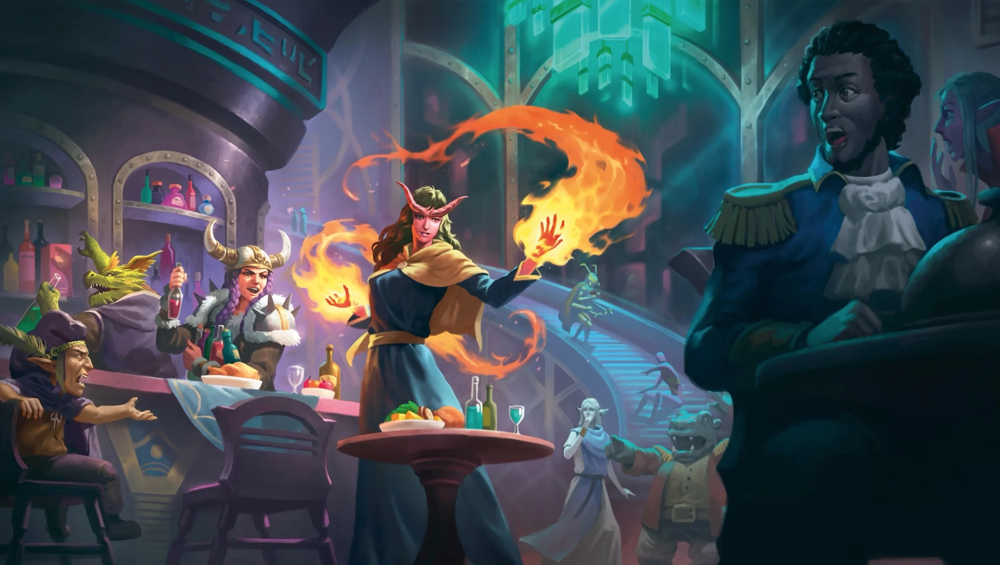

>
>
>So, the oddest event has befallen us.
>
>Some hours after we fled the Yawning Portal—cause of an unpaid bill—we found sanctuary in the underhold of a sea vessel docked at port. As I calmed my stalwart party, a door creaked aside, and framed in dim light came to us a small, curious figure—no taller than my brother, had I one. Encased head to toe in dented bronze plate, squat and pot-bellied, this ancient lad called out in a fluty gasp.
>
>"ARE YOU THE QUATERNATE TETRAD?"
>
>As all wise adventurers know, when someone asks you if you are who you are NOT, you say YES.
>
>So, I did thus. "Yes! Of course we are."
>
>Satisfied, he answered me in rusty reverberance: "I am DINT, Autognome (what 'tis?) and captain of the Dashor (what 'er means that!), and we are running behind! Please produce the Jewel of Javanium."
>
>And to this I answered, "We have that...not."
>
>Bronzèd Dint tilted his head, the armored eye-slits narrowing. Just then, I could hear the shout of City Watch grow closer.
>
>"Are you not the Quaternate Tetrad? As ordered?"
>
>Bri'An called out, "By Tyr, what is to be won if we are?!"
>
>Dint's rusty flute-voice grew in conspiracy, "Why, five Astral Diamonds, of course."
>
>It was then that Bri'An, to my great shock, produced Ruby—my precious Ruby!—from a hidden flap in his holy vestments, and presented it thusly to Dint, who responded by swallowing Ruby whole! NO! Dint's eye-slits glowed red for a moment before he turned and withdrew from view.... And with a mighty groan, our vessel set sail.
>
>I cast an incredulous eye to Bri'An who assuaged me with pious honesty that Ruby was rescued from the ground when she slipped from my leathers as we fled.
>
>Thus, Ruby is safe, though INSIDE the gut of our strange new companion. What purpose does she serve in this bronze-armored gnome's trunk?!
>
>The sweeping sway of the boat lulls me as I surrender to exhaustion.
>
>
>
>OH MY GODS! Guys! So, I went above decks...or to the abovedecks? Whatever, I'm not nautical! Anyways, I snuck up there to do some training. As I peeked out over the stairwell, I spied that squat little bronze guy hoisting the jibs—or jibbing the hoists, whatever! Boat stuff!—until mighty, multicolored sails flexed above me. Beyond them was the craziest sky I'd ever seen; it was like breathtaking moonlight mixed with burning sunsets! WOW!
>
>So, as I totally had questions, I stepped up to the above-deck, and FROZE. Glancing over the side of our boat...I could see...NO SEA! Only an endless sky. A little freaked out now, I paged through *Volo's Guide* to the section on "Accidental Death & Dismemberment."
>
>Oh CRAP! WE DIED! And this...must be the AFTERLIFE!
>
>
>
>Intrepid reader and observer of the Bureau of Dark Tables. As life goes, I have good news and—its shadowy twin—bad news. I shall start with the good news, nay, the BEST news. There is NO afterlife! Therefore I can only conclude that we are alive! The bad news? We are sailing a bewildering sea of stars toward a free-floating mountain in the sky.
>
>
>
>Foolish bard! Squirladax blusters that there is no afterlife—how I grow eager to show him! There is most certainly an afterlife, a "Shadowfell," and THIS NOT BE IT, heathens. I questioned the Ow-Toe-Gnome Dint and have concluded that we are aboard an object known as a SPELLJAMMER. Passingly familiar with such legends, I know it to be a ship that sails the endless space between spaces. I know not where this vessel is headed, but I fear that we have jumped from the frying pan into the fire.
>
>
>
>'Tis the best day of my life! We have anchored at the dizzying Rock of Bral, and Dint has relayed to me our purpose in this Realmspace metropolis sited upon a disc-like asteroid. Repeat. Dint has a PURPOSE for us! A QUEST! And a REWARD for the questing. FIVE ASTRAL DIAMONDS! And, while I do not know what an Astral Diamond is worth, I do suspect that five such diamonds are worth easily FIVE TIMES as much!
>
>We are to proceed with great covertness into the Rock of Bral's High City district, blending into the teeming throngs of bizarre creatures from myriad realms. It is at the upscale Man-o-War restaurant overlooking Lake Bral that we shall broker a deal with a barkeep known as Jack the Knife for a rare bottle of wine: Veneno 1318 DR.
>
>For this purpose, Dint has supplied us with 200 gold pieces to exchange for the Veneno, which he assured me should be more than enough by twice!
>
>I shall now utter words of bardic magic to the Bureau to inspire brilliant execution of our tasks.
>
>Heed not peril, nor flame, nor fiery ends,
>
>For wax that wanes drips through the cracks.
>
>And if that wax shall whack thee back,
>
>A seal of greatness upon your slacks.
>
>You wear the pants of your own destiny, my friends.
>
>
>
>Squirladax has again "inspired us" with his poetry. I've heard more inspirational things coming from the Yawning Portal's outhouse.
>
>
>
>I have advised it is Tyr's wisdom that we split the party, along with the gold, so as to double our chances of success! Squirladax agrees. I have taken young Sasha under my wing. She bid that I keep my sharp dragoneyes open for a supply of live leeches, and thus I seek these. However, Tyr's holiest crap! The Tamarind Balls and Loaf Pudding in the Great Market are prodigious. Seriously. Alas, a miracle of flavors sent straight from Tyr!
>
>
>
>Great news! Bri'An has returned with the leeches! Per the instructions from *Volo's Guide to Bodily Health*, I have applied Bri'An's leeches to my temples as a means of cooling my overhot head, allowing me to "stay cool under the pressures of combat." Bri'An has also purchased Lake Bral Smoked Herring and Steaks of the Deep, which, once eaten, will improve my swimming and breath bellow capacity. I'm going to be in the best shape of my life! We eat! As do the leeches!
>
>
>
>As I wander this floating ball of mud with Squirladax, my brain shrinks as the "Goblin Poet" barrages me with castigations regarding previous failures. He is obsessed!
>
>"I need you to casteth spells of great destruction upon our enemies," he spittles! Of course, he knows nothing from whence my power was forged. Nothing of the furnaced heats of Shadow's Edge Academy, nor its Lords who smelted my very soul.
>
>I've always known my life would be cleavèd short, but now I know by whom.
>
>
>
>After a happy confabulation with Deelia concerning strategerie, we are arrivèd at the Man-o-War, indeed a place of high society...and extraordinary foods! After sampling the Tavern Noodles and a crispy skewerèd fish dish called the Tears of Selûne (to blend in), we finally made contact with Jack the Knife. A mightily tall, barrel-chested orc in a smock of chain mail—charming fellow, he! The Veneno '18 taunts me from its place of honor behind the bar on the highest shelf, and it could already have been mine this instant, were it not for.... WAIT! Greedy meanderings!
>
>Our pious cleric Bri'An has spent down our moneys! To load down his draconic paunch, n'doubt! When I ask for reasonings from him, all I receive in return is a drunken burble that smelt of expensive Undermountain Alurlyath drink!
>
>This is inexcusable! We are on a QUEST!
>
>As we HAD twice the moneys, now reduced to but half the moneys needed, I must devise a solution. Think, Squirladax, think! THAT'S IT! I shall use charismatic diplomacy to charm the price of the Veneno '18 by HALF! Brilliant! Now where is Jack the Knife?!
>
>Strange. There he be, behind the bar...but squatter, rounder, and decidedly less orcish...more draconic than I remember.
>
>
>
>It is nothing short of remarkable how we have managed to turn a simple wine purchase into a...I'm not even sure what this is.
>
>
>
>Bri'An bet me I couldn't choke out that Jack the Knife guy. Ha! I showed him. It wasn't easy as he almost slipped out of my buttered arms, and I only pray that his stiff neck will benefit from the effects of the butter treatment when he awakes. Wait. Why is Bri'An stripping him bare?
>
>
>
>TYR be PRAISED! I have braised the beefs of success this day with the gravy of cleverness. 'Tis Tyr that whispered thusly to me. Said he, "Bri'An. Bri'An, my most devout. Hammer thy kitchen staff to unconsciousness with thy sap. Bring thy chainmail smock of Jack the Knife to thy chin and wear'st thou so that thy identity be transformèd to that of he who is chokèd by holy sister Sasha." And whence he dropped out from under Sasha's buttered embrace, so did I do'st this thing Tyr commanded me.
>
>Disguised thusly as Jack of the Knife, I reached—in plain sight of all—for thy sweet bottle of Veneno '18.
>
>But alas, Tyr granted me strength, but not arm length-th.
>
>So then did I LEAP, and a great CRASHING of bottles and glass did crunch beneath my sandaled feet! But Veneno.... Ah! I seized Veneno to mine bosom.
>
>It was then that a fountain of flame spewed forth from the hands of Deelia causing the patrons to cower beneath tables.
>
>"TYR, GUIDE ME," I called out!
>
>And it was in that moment that much purifying fire washed over the Man-o-War. Was this of right or wrong, who can say? But Tyr granted me speed as I fled the cindered cries!
>
>Tyr be praised. I am parched!
>
>
>
>I was trying to incinerate Bri'An for his blundering incompetence, but alas, he is dragonborn and more than a bit fire resistant.
>
>
>
>My bardic tongue is speechless. It has been an hour since our return to the Dashor and our return to this crazy wild...space. I will now hand this quill over to Dint for I shall be damned to repeat what I just witnessed.
>
>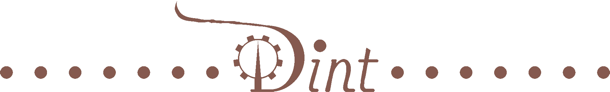
>
>Hello! I am Dint. I am repeating what he just witnessed. Why is this Veneno freshly uncorked? Why are there dribbles of red wetness on the tabard of the dragonborn? Did one of you drink this?
>
>Veneno is poisonous to all but the undead.
>

### Fried Soy with Vegetables

This soy-based protein dish originated from a gnome recipe, but it is equally popular with those who shy away from animal meat, including some communities of elves. It is also ideal in environments where livestock is harder to keep, such as the Underdark and the Rock of Bral. The original gnome version uses chicken broth as a base, but vegetable broths work just as well. While the tofu is the star, the mélange of scallions, bok choy, bell pepper, and carrots imparts a variety of textures and flavors. Rice-based cooking wine and soy sauce make it a lustrous and savory meal.

<table class="rd__b-special rd__b-data  rd__b-data--stats">
		<thead>
			<tr>
				<th class="rd__data-embed-header ve-text-left" colspan="6" data-rd-data-embed-header="true">
					

						

							Fried Soy with Vegetables
							
						

						[–]
					

				</th>
			</tr>
		</thead><tbody class="" data-rd-embedded-data-render-target="true"><tr>
			<td colspan="6" data-rd-tag="recipe" data-rd-uid="Fried Soy with Vegetables|HFFotM" data-rd-page="recipes.html" data-rd-source="HFFotM" data-rd-hash="fried%20soy%20with%20vegetables_hffotm" data-rd-name="Fried Soy with Vegetables" data-rd-display-name="Fried Soy with Vegetables" data-rd-style="" data-rd-entry-data="{}">
				<i>Loading <a href="recipes.html#fried%20soy%20with%20vegetables_hffotm"  onmouseover="Renderer.hover.pHandleLinkMouseOver(event, this)" onmouseleave="Renderer.hover.handleLinkMouseLeave(event, this)" onmousemove="Renderer.hover.handleLinkMouseMove(event, this)" onclick="Renderer.hover.handleLinkClick(event, this)" onwheel="Renderer.hover.handleLinkWheel(event, this)" ondragstart="Renderer.hover.handleLinkDragStart(event, this)" data-vet-page="recipes.html" data-vet-source="HFFotM" data-vet-hash="fried%20soy%20with%20vegetables_hffotm" ontouchstart="Renderer.hover.handleTouchStart(event, this)" >Fried Soy with Vegetables</a>...</i>
				
			</td>
		</tr></tbody></table>

### Tavern Noodles

While the flavorful plate simply known as tavern noodles is a common dish throughout the multiverse, the version on offer in the various watering holes across the Rock of Bral is truly otherworldly. The noodles themselves are rumored to be the mouth tentacles of the catfish found in the deepest depths of Lake Bral. The truth of this is impossible to ascertain. What's less obscure is how delicious this dish is, especially when drenched in a light sauce made with rosemary, garlic, onion, and white wine, as they do at the Man-o-War restaurant in the Rock of Bral's High City. Whether by magic or mischief, these noodles are sure to satisfy even the most space-weary explorers.

<table class="rd__b-special rd__b-data  rd__b-data--stats">
		<thead>
			<tr>
				<th class="rd__data-embed-header ve-text-left" colspan="6" data-rd-data-embed-header="true">
					

						

							Tavern Noodles
							
						

						[–]
					

				</th>
			</tr>
		</thead><tbody class="" data-rd-embedded-data-render-target="true"><tr>
			<td colspan="6" data-rd-tag="recipe" data-rd-uid="Tavern Noodles|HFFotM" data-rd-page="recipes.html" data-rd-source="HFFotM" data-rd-hash="tavern%20noodles_hffotm" data-rd-name="Tavern Noodles" data-rd-display-name="Tavern Noodles" data-rd-style="" data-rd-entry-data="{}">
				<i>Loading <a href="recipes.html#tavern%20noodles_hffotm"  onmouseover="Renderer.hover.pHandleLinkMouseOver(event, this)" onmouseleave="Renderer.hover.handleLinkMouseLeave(event, this)" onmousemove="Renderer.hover.handleLinkMouseMove(event, this)" onclick="Renderer.hover.handleLinkClick(event, this)" onwheel="Renderer.hover.handleLinkWheel(event, this)" ondragstart="Renderer.hover.handleLinkDragStart(event, this)" data-vet-page="recipes.html" data-vet-source="HFFotM" data-vet-hash="tavern%20noodles_hffotm" ontouchstart="Renderer.hover.handleTouchStart(event, this)" >Tavern Noodles</a>...</i>
				
			</td>
		</tr></tbody></table>
### Tamarind Balls

For those seeking sugary baubles to brighten the palate, do not neglect the sour yet sweet tamarind balls that festoon the market stalls of Trademeet and the areas surrounding Firedrake Bay in the lands of Faerûn. From Amn to Calimshan to Tashalar, these tasty morsels made of tamarind pulp and dates are a much beloved dessert and trail-side snack. Some of the finest examples exist a few miles to the south of Trademeet in Mosstone, at the venerable Drover's Last Drink, where they add a bit of vanilla and large-crystal sugar to the mix. These treats travel well, and spelljammer captains docking at Baldur's Gate have brought them to the Rock of Bral and beyond, where they are much sought after by astral elves, giff, and even space clowns.

<table class="rd__b-special rd__b-data  rd__b-data--stats">
		<thead>
			<tr>
				<th class="rd__data-embed-header ve-text-left" colspan="6" data-rd-data-embed-header="true">
					

						

							Tamarind Balls
							
						

						[–]
					

				</th>
			</tr>
		</thead><tbody class="" data-rd-embedded-data-render-target="true"><tr>
			<td colspan="6" data-rd-tag="recipe" data-rd-uid="Tamarind Balls|HFFotM" data-rd-page="recipes.html" data-rd-source="HFFotM" data-rd-hash="tamarind%20balls_hffotm" data-rd-name="Tamarind Balls" data-rd-display-name="Tamarind Balls" data-rd-style="" data-rd-entry-data="{}">
				<i>Loading <a href="recipes.html#tamarind%20balls_hffotm"  onmouseover="Renderer.hover.pHandleLinkMouseOver(event, this)" onmouseleave="Renderer.hover.handleLinkMouseLeave(event, this)" onmousemove="Renderer.hover.handleLinkMouseMove(event, this)" onclick="Renderer.hover.handleLinkClick(event, this)" onwheel="Renderer.hover.handleLinkWheel(event, this)" ondragstart="Renderer.hover.handleLinkDragStart(event, this)" data-vet-page="recipes.html" data-vet-source="HFFotM" data-vet-hash="tamarind%20balls_hffotm" ontouchstart="Renderer.hover.handleTouchStart(event, this)" >Tamarind Balls</a>...</i>
				
			</td>
		</tr></tbody></table>

### Trencher Bread

Predating even the most rustic plates, trencher bread served as a functional, and edible, tool for serving food. Usually allowed to harden and become stale, this flat, round loaf can not only hold the meal but also become the next course once the edible "plate" has absorbed any juices or sauce and softened. Even when civilization along the Sword Coast advanced, the pre-Netherese tradition of serving food on edible plates remained. No longer used for pure utility, trencher bread is traditionally prepared hard, flat, and dry, but it is lightly salted and seasoned to make the "second course" more appealing. It has also taken on other shapes, notably a bowl, which has become a popular vessel for serving soups and stews. The bread is served along the crowded, cobbled lanes of major metropolises as far south as Calimport and as distant as the Rock of Bral asteroid spaceport. Look for street vendors in Middle City's Great Market serving rare mammalian meats and sauces on this bread—a quick and cheap option for on-the-move off-worlders—and embrace the novelty of an ancient taste of Toril.

<table class="rd__b-special rd__b-data  rd__b-data--stats">
		<thead>
			<tr>
				<th class="rd__data-embed-header ve-text-left" colspan="6" data-rd-data-embed-header="true">
					

						

							Trencher Bread
							
						

						[–]
					

				</th>
			</tr>
		</thead><tbody class="" data-rd-embedded-data-render-target="true"><tr>
			<td colspan="6" data-rd-tag="recipe" data-rd-uid="Trencher Bread|HFFotM" data-rd-page="recipes.html" data-rd-source="HFFotM" data-rd-hash="trencher%20bread_hffotm" data-rd-name="Trencher Bread" data-rd-display-name="Trencher Bread" data-rd-style="" data-rd-entry-data="{}">
				<i>Loading <a href="recipes.html#trencher%20bread_hffotm"  onmouseover="Renderer.hover.pHandleLinkMouseOver(event, this)" onmouseleave="Renderer.hover.handleLinkMouseLeave(event, this)" onmousemove="Renderer.hover.handleLinkMouseMove(event, this)" onclick="Renderer.hover.handleLinkClick(event, this)" onwheel="Renderer.hover.handleLinkWheel(event, this)" ondragstart="Renderer.hover.handleLinkDragStart(event, this)" data-vet-page="recipes.html" data-vet-source="HFFotM" data-vet-hash="trencher%20bread_hffotm" ontouchstart="Renderer.hover.handleTouchStart(event, this)" >Trencher Bread</a>...</i>
				
			</td>
		</tr></tbody></table>
### Tears of Selûne

The bustling pedestrian pathways that etch the Rock of Bral are known for their prodigious offerings of finger foods. One such treat that garners all the accolades from the "locals" is a dish called the Tears of Selûne, a spicy, spit-roasted crispy fish, which came into fashion as a quick, crunchy snack that you can eat off a stick. Typically made with a firm white fish, like sea bass, the secret weapon of these delicacies is said to be the seasoning—a tantalizing mix of paprika, soy sauce, and sesame seeds. Today, you can sample these crispy treats throughout the Rock of Bral. Some street chefs fry them in a skillet, though connoisseurs insist the open flame yields the best texture. Whichever way you cook them, these fish skewers are best served with a starchy base, such as warm rice, to help all the delectable textures and savory flavors go down just right.

<table class="rd__b-special rd__b-data  rd__b-data--stats">
		<thead>
			<tr>
				<th class="rd__data-embed-header ve-text-left" colspan="6" data-rd-data-embed-header="true">
					

						

							Tears of Selûne
							
						

						[–]
					

				</th>
			</tr>
		</thead><tbody class="" data-rd-embedded-data-render-target="true"><tr>
			<td colspan="6" data-rd-tag="recipe" data-rd-uid="Tears of Selûne|HFFotM" data-rd-page="recipes.html" data-rd-source="HFFotM" data-rd-hash="tears%20of%20sel%c3%bbne_hffotm" data-rd-name="Tears of Selûne" data-rd-display-name="Tears of Selûne" data-rd-style="" data-rd-entry-data="{}">
				<i>Loading <a href="recipes.html#tears%20of%20sel%c3%bbne_hffotm"  onmouseover="Renderer.hover.pHandleLinkMouseOver(event, this)" onmouseleave="Renderer.hover.handleLinkMouseLeave(event, this)" onmousemove="Renderer.hover.handleLinkMouseMove(event, this)" onclick="Renderer.hover.handleLinkClick(event, this)" onwheel="Renderer.hover.handleLinkWheel(event, this)" ondragstart="Renderer.hover.handleLinkDragStart(event, this)" data-vet-page="recipes.html" data-vet-source="HFFotM" data-vet-hash="tears%20of%20sel%c3%bbne_hffotm" ontouchstart="Renderer.hover.handleTouchStart(event, this)" >Tears of Selûne</a>...</i>
				
			</td>
		</tr></tbody></table>
### Duergar Smoked Herring

To many duergar, dwarves of the Underdark, food is simply the nourishment needed to get back to work. But the duergar are also renowned craftsmen, and what they do, they do well, which includes cooking a small but reliable menu of staples. And perhaps no duergar food is more prized than their smoked herring. While the original boasts herring from the dangerous depths of Darklake, known for imbuing the fish with distinctive brine and mineral flavorings, this version utilizes herring sourced from bountiful Lake Bral, a vital repository of water located in the center of this well-populated asteroid. There is no denying that a proper subterranean brine takes especially well to heat from Underdark fire lichen, but chile peppers will suffice for those chefs cooking on the surface. A specialty of the duergar enclave at the Underdark trading post of Mantol-Derith, this maritime delicacy is much sought after, from far below the surface of Toril all the way to the otherworldly Rock of Bral.

<table class="rd__b-special rd__b-data  rd__b-data--stats">
		<thead>
			<tr>
				<th class="rd__data-embed-header ve-text-left" colspan="6" data-rd-data-embed-header="true">
					

						

							Duergar Smoked Herring
							
						

						[–]
					

				</th>
			</tr>
		</thead><tbody class="" data-rd-embedded-data-render-target="true"><tr>
			<td colspan="6" data-rd-tag="recipe" data-rd-uid="Duergar Smoked Herring|HFFotM" data-rd-page="recipes.html" data-rd-source="HFFotM" data-rd-hash="duergar%20smoked%20herring_hffotm" data-rd-name="Duergar Smoked Herring" data-rd-display-name="Duergar Smoked Herring" data-rd-style="" data-rd-entry-data="{}">
				<i>Loading <a href="recipes.html#duergar%20smoked%20herring_hffotm"  onmouseover="Renderer.hover.pHandleLinkMouseOver(event, this)" onmouseleave="Renderer.hover.handleLinkMouseLeave(event, this)" onmousemove="Renderer.hover.handleLinkMouseMove(event, this)" onclick="Renderer.hover.handleLinkClick(event, this)" onwheel="Renderer.hover.handleLinkWheel(event, this)" ondragstart="Renderer.hover.handleLinkDragStart(event, this)" data-vet-page="recipes.html" data-vet-source="HFFotM" data-vet-hash="duergar%20smoked%20herring_hffotm" ontouchstart="Renderer.hover.handleTouchStart(event, this)" >Duergar Smoked Herring</a>...</i>
				
			</td>
		</tr></tbody></table>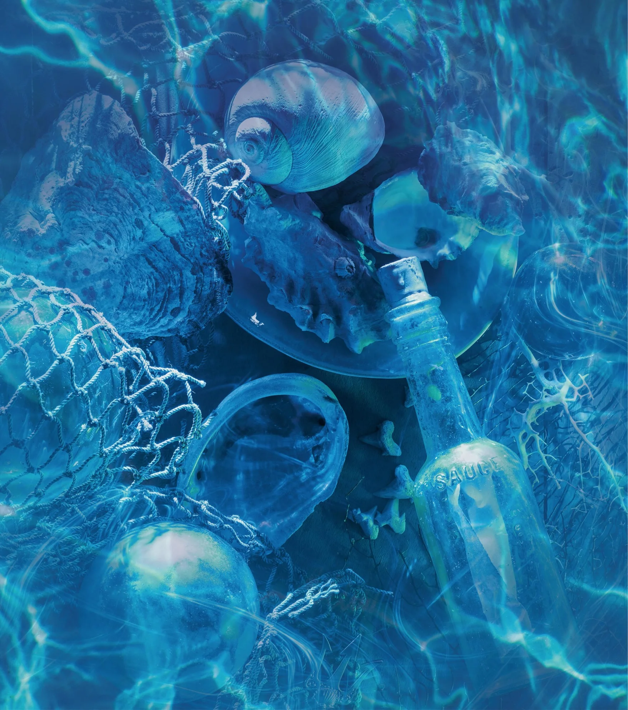

### Spiced Pork and Orange Peppers

It is said, "When in space, do as spacefarers do," and this can prove useful advice when talking about food. One will never know how, or why, pork became such a readily available source of protein on the Rock of Bral, but that mystery is beside the point when a steaming bowl of spiced pork and orange peppers is on offer. In truth, the underside of the one-mile-long ovaloid asteroid, founded by humanoid Captain Bral, serves as a sustainable and farmable ecosystem capable of oxygen production. It even contains a freshwater lake (Lake Bral), frequently refilled by water harvested from ice asteroids, and, yes, livestock in the form of swine. Spiced Pork and Orange Peppers was a favorite of the famed Captain Bral and has remained a signature dish on the menu of the Laughing Beholder, run by gregarious beholder Large Luigi, and other notably unsavory eateries that dot the avenues of this lawless asteroid outpost. When ordered "the Captain's way," the explosion of spices (paprika, coriander, cayenne, garlic, fennel, cumin, and some mystery space seed grown onsite) combined with the zest of the orange peppers is like a peg-legged dohwar kick straight to the taste buds.

<table class="rd__b-special rd__b-data  rd__b-data--stats">
		<thead>
			<tr>
				<th class="rd__data-embed-header ve-text-left" colspan="6" data-rd-data-embed-header="true">
					

						

							Spiced Pork and Orange Peppers
							
						

						[–]
					

				</th>
			</tr>
		</thead><tbody class="" data-rd-embedded-data-render-target="true"><tr>
			<td colspan="6" data-rd-tag="recipe" data-rd-uid="Spiced Pork and Orange Peppers|HFFotM" data-rd-page="recipes.html" data-rd-source="HFFotM" data-rd-hash="spiced%20pork%20and%20orange%20peppers_hffotm" data-rd-name="Spiced Pork and Orange Peppers" data-rd-display-name="Spiced Pork and Orange Peppers" data-rd-style="" data-rd-entry-data="{}">
				<i>Loading <a href="recipes.html#spiced%20pork%20and%20orange%20peppers_hffotm"  onmouseover="Renderer.hover.pHandleLinkMouseOver(event, this)" onmouseleave="Renderer.hover.handleLinkMouseLeave(event, this)" onmousemove="Renderer.hover.handleLinkMouseMove(event, this)" onclick="Renderer.hover.handleLinkClick(event, this)" onwheel="Renderer.hover.handleLinkWheel(event, this)" ondragstart="Renderer.hover.handleLinkDragStart(event, this)" data-vet-page="recipes.html" data-vet-source="HFFotM" data-vet-hash="spiced%20pork%20and%20orange%20peppers_hffotm" ontouchstart="Renderer.hover.handleTouchStart(event, this)" >Spiced Pork and Orange Peppers</a>...</i>
				
			</td>
		</tr></tbody></table>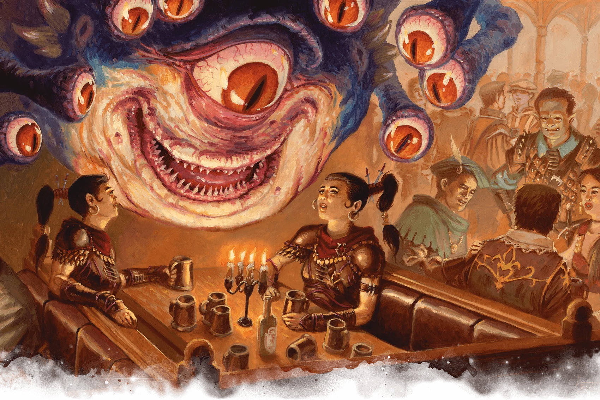

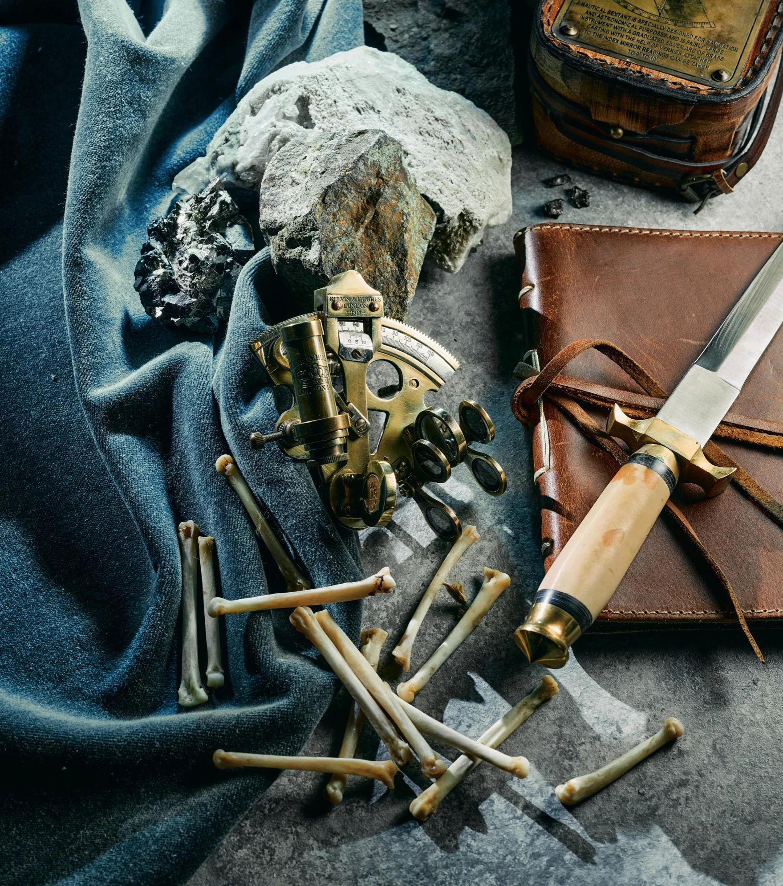

### Steak of the Deep

According to legend, this hearty seafood steak was first prepared by homesick triton folk living among surface dwellers and eager for a nostalgic taste of their undersea home. Guardians of the deep, commonly clustered around ocean trenches and far from the eyes and reach of humankind, triton have increasingly emerged from self-imposed isolation to cohabit with the other peoples of the multiverse. A satisfying synthesis of tastes that borrows more from the surface world than from the seafloor, steak of the deep features a thick slab of braised swordfish, topped with a simmered tomato-based blend of onion, garlic, paprika, and a crisp dry sherry, yielding a fragrant and filling main course. While you won't find this in many triton settlements proper, it is a mainstay meal for well-traveled triton and is increasingly available at larger coastal taverns and, occasionally, the more far-flung spaceports of Realmspace.

<table class="rd__b-special rd__b-data  rd__b-data--stats">
		<thead>
			<tr>
				<th class="rd__data-embed-header ve-text-left" colspan="6" data-rd-data-embed-header="true">
					

						

							Steak of the Deep
							
						

						[–]
					

				</th>
			</tr>
		</thead><tbody class="" data-rd-embedded-data-render-target="true"><tr>
			<td colspan="6" data-rd-tag="recipe" data-rd-uid="Steak of the Deep|HFFotM" data-rd-page="recipes.html" data-rd-source="HFFotM" data-rd-hash="steak%20of%20the%20deep_hffotm" data-rd-name="Steak of the Deep" data-rd-display-name="Steak of the Deep" data-rd-style="" data-rd-entry-data="{}">
				<i>Loading <a href="recipes.html#steak%20of%20the%20deep_hffotm"  onmouseover="Renderer.hover.pHandleLinkMouseOver(event, this)" onmouseleave="Renderer.hover.handleLinkMouseLeave(event, this)" onmousemove="Renderer.hover.handleLinkMouseMove(event, this)" onclick="Renderer.hover.handleLinkClick(event, this)" onwheel="Renderer.hover.handleLinkWheel(event, this)" ondragstart="Renderer.hover.handleLinkDragStart(event, this)" data-vet-page="recipes.html" data-vet-source="HFFotM" data-vet-hash="steak%20of%20the%20deep_hffotm" ontouchstart="Renderer.hover.handleTouchStart(event, this)" >Steak of the Deep</a>...</i>
				
			</td>
		</tr></tbody></table>
### Green Ice Rime

These chilly, wobbly, delicious squares of bright green jelly have become popular anywhere the people of the multiverse might need a refreshing and whimsical dessert, including the Rock of Bral where the natural refrigeration of Realmspace makes preparation a cinch. They are most often served in saucers on a bed of ice to keep them the ideal temperature. They have been nicknamed "the Gelatinous Cube" by some adventurers and there are confectioners who will suspend little candy swords or shields in the mix as a crunchy surprise that hits you right in the sweet tooth. The best part is that Green Ice Rime dissolves in your tummy...not the other way around.

<table class="rd__b-special rd__b-data  rd__b-data--stats">
		<thead>
			<tr>
				<th class="rd__data-embed-header ve-text-left" colspan="6" data-rd-data-embed-header="true">
					

						

							Green Ice Rime
							
						

						[–]
					

				</th>
			</tr>
		</thead><tbody class="" data-rd-embedded-data-render-target="true"><tr>
			<td colspan="6" data-rd-tag="recipe" data-rd-uid="Green Ice Rime|HFFotM" data-rd-page="recipes.html" data-rd-source="HFFotM" data-rd-hash="green%20ice%20rime_hffotm" data-rd-name="Green Ice Rime" data-rd-display-name="Green Ice Rime" data-rd-style="" data-rd-entry-data="{}">
				<i>Loading <a href="recipes.html#green%20ice%20rime_hffotm"  onmouseover="Renderer.hover.pHandleLinkMouseOver(event, this)" onmouseleave="Renderer.hover.handleLinkMouseLeave(event, this)" onmousemove="Renderer.hover.handleLinkMouseMove(event, this)" onclick="Renderer.hover.handleLinkClick(event, this)" onwheel="Renderer.hover.handleLinkWheel(event, this)" ondragstart="Renderer.hover.handleLinkDragStart(event, this)" data-vet-page="recipes.html" data-vet-source="HFFotM" data-vet-hash="green%20ice%20rime_hffotm" ontouchstart="Renderer.hover.handleTouchStart(event, this)" >Green Ice Rime</a>...</i>
				
			</td>
		</tr></tbody></table>
### Loaf Pudding

The Elfsong Tavern of Baldur's Gate is known for many things: the disembodied singing voice of an elven maiden for which the tavern is named; the stuffed baby beholder over the mantle; and the driftglobe-lit taproom. But there is no better reason to visit this famous haven for adventurers than its delectable Loaf Pudding. A specialty of halfling head-chef Chenna Fatrabbit and her human pastry sidekick, Klav Martilmur, this moist, yogurt-infused loaf is soaked in a delicious vanilla-almond syrup and topped with a sprinkle of salted almonds to add just the right amount of crunch. The dessert is so coveted that even Spelljammer pirates have occasionally dropped into port to bring a loaf or two back to Realmspace.

<table class="rd__b-special rd__b-data  rd__b-data--stats">
		<thead>
			<tr>
				<th class="rd__data-embed-header ve-text-left" colspan="6" data-rd-data-embed-header="true">
					

						

							Loaf Pudding
							
						

						[–]
					

				</th>
			</tr>
		</thead><tbody class="" data-rd-embedded-data-render-target="true"><tr>
			<td colspan="6" data-rd-tag="recipe" data-rd-uid="Loaf Pudding|HFFotM" data-rd-page="recipes.html" data-rd-source="HFFotM" data-rd-hash="loaf%20pudding_hffotm" data-rd-name="Loaf Pudding" data-rd-display-name="Loaf Pudding" data-rd-style="" data-rd-entry-data="{}">
				<i>Loading <a href="recipes.html#loaf%20pudding_hffotm"  onmouseover="Renderer.hover.pHandleLinkMouseOver(event, this)" onmouseleave="Renderer.hover.handleLinkMouseLeave(event, this)" onmousemove="Renderer.hover.handleLinkMouseMove(event, this)" onclick="Renderer.hover.handleLinkClick(event, this)" onwheel="Renderer.hover.handleLinkWheel(event, this)" ondragstart="Renderer.hover.handleLinkDragStart(event, this)" data-vet-page="recipes.html" data-vet-source="HFFotM" data-vet-hash="loaf%20pudding_hffotm" ontouchstart="Renderer.hover.handleTouchStart(event, this)" >Loaf Pudding</a>...</i>
				
			</td>
		</tr></tbody></table>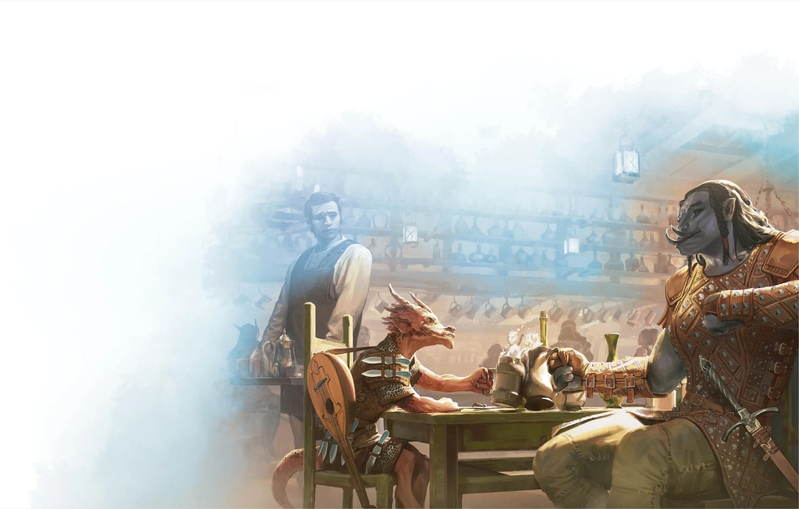

### Undermountain Alurlyath

Imported to the Rock of Bral by the barrel directly from the notorious dungeon called Undermountain, Undermountain Alurlyath is a sweet sherry wine made by desperate gnomish vintners that skulk about the mad vined halls of the dungeon. It is said that the grapes that grow in the labyrinth hold the secrets of the successful romance of flavors, and that a glass of genuine Undermountain Alurlyath, bursting with notes of honey and cucumber, will enchant its imbiber with the gift of supernatural confidence—a phenomenon known as the silver glow. Yet others hold the belief that this is, in fact, a fancy term for the growing false confidence that comes with drink.

<table class="rd__b-special rd__b-data  rd__b-data--stats">
		<thead>
			<tr>
				<th class="rd__data-embed-header ve-text-left" colspan="6" data-rd-data-embed-header="true">
					

						

							Undermountain Alurlyath
							
						

						[–]
					

				</th>
			</tr>
		</thead><tbody class="" data-rd-embedded-data-render-target="true"><tr>
			<td colspan="6" data-rd-tag="recipe" data-rd-uid="Undermountain Alurlyath|HFFotM" data-rd-page="recipes.html" data-rd-source="HFFotM" data-rd-hash="undermountain%20alurlyath_hffotm" data-rd-name="Undermountain Alurlyath" data-rd-display-name="Undermountain Alurlyath" data-rd-style="" data-rd-entry-data="{}">
				<i>Loading <a href="recipes.html#undermountain%20alurlyath_hffotm"  onmouseover="Renderer.hover.pHandleLinkMouseOver(event, this)" onmouseleave="Renderer.hover.handleLinkMouseLeave(event, this)" onmousemove="Renderer.hover.handleLinkMouseMove(event, this)" onclick="Renderer.hover.handleLinkClick(event, this)" onwheel="Renderer.hover.handleLinkWheel(event, this)" ondragstart="Renderer.hover.handleLinkDragStart(event, this)" data-vet-page="recipes.html" data-vet-source="HFFotM" data-vet-hash="undermountain%20alurlyath_hffotm" ontouchstart="Renderer.hover.handleTouchStart(event, this)" >Undermountain Alurlyath</a>...</i>
				
			</td>
		</tr></tbody></table>

------

# Solamnia

Poisoned! Bri'An, Cleric of Tyr, sipped too deeply of the quest item: a venomous wine! Now, our heroes sail through Realmspace to KRYNN, the planet of the fabled dragonlances, to seek a cure for Bri'An's deadly affliction!

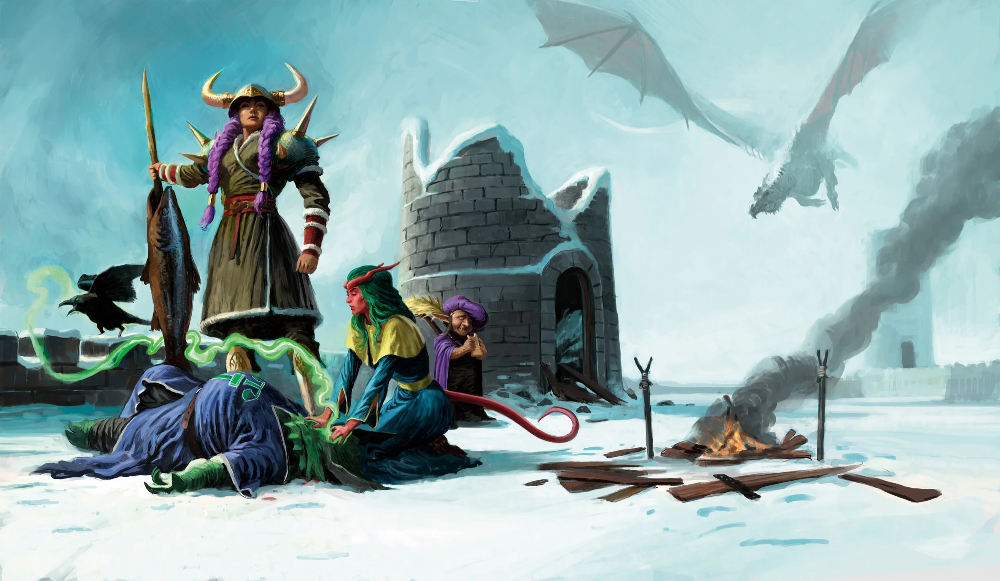

>
>
>Emergency! Set we down on a—plain? Realm? I still do not understand this Wildspace we travel in, but I do understand brisk dispatch.
>
>Bri'An, our most righteous cleric, has confessed to sipping the very QUEST ITEM, a wine called VENENO '18, revealed now to be a DEADLY POISON! Dint explains that, to save our comrade, we must make landfall immediately on a place called Krynn to seek out and seize vallenwood root. It is the only hope of restoration for our doomed Bri'An. Whilst Bri'An professes perfect, jovial health, Dint tells of painful gasping death should we choose to ignore this.
>
>As this is how TPK starts, I will not have another on my conscience. We landed and set about our business immediately! Well—almost immediately. First, we should find something to eat.... Any adventure that begins on an empty stomach is doomed to fail!
>
>
>
>I tire of this quest! This spelljammer rattles me. All I wish is to serve the Raven Queen, and yet I have whispered no souls to find her embrace. All is gloom. This bright, green world of—what calls itself? Krynn? A city called Solanthus? The cheer of this place mocks my grim purpose: To bolster the Raven Queen's numbers in her everlasting battle with Orcus, Lord of the Damned and King of the Undead. Only then can I win her esteem, and perhaps then I might find a lasting peace in her Shadowfell.
>
>
>
>Bri'An is the coolest cleric I have ever met. Not only does he effortlessly guzzle the local Tika's Honey Mead, not only can he tavern-brawl jerks with mighty punches, but he has also been helping me train as we both read from *Volo's Guide* on health and wisdom. It's the king's jewels, man!
>
>But what I don't get: Why won't he cure himself of this nasty poison with his healing magic? He calls on Tyr with almost every step he takes...maybe it isn't working? I wish I was learnèd enough in such matters to help. Even now, Bri'An is rubbing Boar Hock Soup into my scalp to increase my cleverness, so recommends the guide.
>
>
>
>Why are the side-eyes spying me? What harm have Dragonmen done here on this Krynn, in this forsaken tavern called the Dog and Duck in the city of Solanthus? Tyr! Sasha and I beg forgiveness as we punch these jeering faces to weepiness. I shall sweep these sins off my plates and instead gorge myself of the delicious pastry-like Cloaks and seductive Tarsis-Style Shrimp so that I might have strength to serve your will. Praise be to Tyr!
>
>Alas, I must have eaten too much Kendermore Cobbler—I feel not good.
>
>
>
>Huzzah! We have made the acquaintance of a local herbalist who tarries about the Vingaard River, yet he possesses no vallenwood root. Bri'An is now issuing a holy commandment that I share in some of his Salbread. Oh my! Tyr's heavens inside my mouth-hole!
>
>I tell you, saucy reader, savor the small things. Especially when those small things can be crunched, swilled, or suckled. The life of many adventurers is fleeting, and they would do well to be mindful of the many curious places that their trail passes through. Any decrepit tavern could be home to a specialty that would be wondrous to any who had never tasted it before.
>
>
>
>I have gained two stone of regret and dread in this place, however, I cannot deny its Irlymeyer's Dragonfire Punch is supernatural. I am drunk and shall sleep a dead cold sleep.
>
>
>
>Bri'An woke this morning, sweating, and coughing up black gunk. We're at this inn called the Black Tiger and I just talked to the inn keep. We gotta find this vallenwood root, but he warns that the mightiest and most mature vallenwood grows many leagues to the south in the lands of Abanasinia or something. Cool! Got it! Time to stretch my breath bellows to their limit and kick this side quest in the arse! Bri'An rocks and we got this!
>
>
>
>Tyr! My faith and health are tested! My throat fire burns icy, my scales dribble with unholy perspiration. Yet, I know I shall be healed by faith! Yea, even as this prayer leaves my lips, I feel vigor and not a small amount of vim returning. Yes recovery is upon me. What 'tis?! A roadside food stall serving yet more scrumptious morsels in this most delicious of realms?! This I must investigate!
>
>
>
>Bri'An is dead.
>

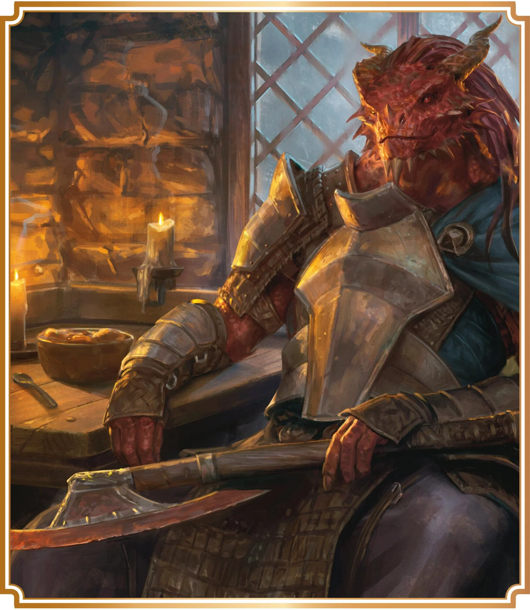

### Boar Hock Soup

Whether you make boar hock soup at the hearth of a cozy inn or on the campfire after the hunt, it is a meal unto itself. Like traditional bone-based soups, this version was originally created to let no part of a boar go wasted—in this case, the hock, or lower leg. But in times of plenty, you can still find soups filled with generous chunks of boar and without any bones to speak of. The genius of this recipe is in its recognition that boar is best complemented by a classic, creamy potato-leek soup. Brimming with whatever other veggies and spices you can get your hands on—even chestnuts are great in the mix—it is a savory, hearty celebration of the bounty of nature. Perfect for a cold, windy night.

<table class="rd__b-special rd__b-data  rd__b-data--stats">
		<thead>
			<tr>
				<th class="rd__data-embed-header ve-text-left" colspan="6" data-rd-data-embed-header="true">
					

						

							Boar Hock Soup
							
						

						[–]
					

				</th>
			</tr>
		</thead><tbody class="" data-rd-embedded-data-render-target="true"><tr>
			<td colspan="6" data-rd-tag="recipe" data-rd-uid="Boar Hock Soup|HFFotM" data-rd-page="recipes.html" data-rd-source="HFFotM" data-rd-hash="boar%20hock%20soup_hffotm" data-rd-name="Boar Hock Soup" data-rd-display-name="Boar Hock Soup" data-rd-style="" data-rd-entry-data="{}">
				<i>Loading <a href="recipes.html#boar%20hock%20soup_hffotm"  onmouseover="Renderer.hover.pHandleLinkMouseOver(event, this)" onmouseleave="Renderer.hover.handleLinkMouseLeave(event, this)" onmousemove="Renderer.hover.handleLinkMouseMove(event, this)" onclick="Renderer.hover.handleLinkClick(event, this)" onwheel="Renderer.hover.handleLinkWheel(event, this)" ondragstart="Renderer.hover.handleLinkDragStart(event, this)" data-vet-page="recipes.html" data-vet-source="HFFotM" data-vet-hash="boar%20hock%20soup_hffotm" ontouchstart="Renderer.hover.handleTouchStart(event, this)" >Boar Hock Soup</a>...</i>
				
			</td>
		</tr></tbody></table>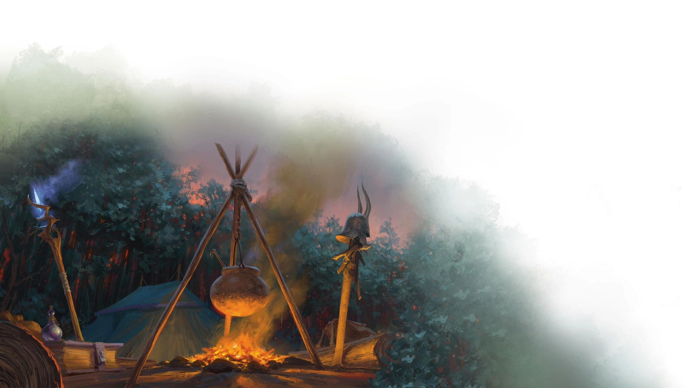

### Cloaks

Ideal as a filling comfort food, cloaks are finger snacks made from whipped potatoes, eggs, butter, and fresh spices. They get their name from their shape; as they bake, puffing into luxurious, golden-brown coverings, which look like warm winter cloaks. While some taverns pan-sear Cloaks in oil to give them a crispy, crunchy exterior, most establishments bake them and the dish is often thought to be best right out of the oven, soft and piping hot inside. On a cold day, a few Cloaks will warm you right up. In Kalaman they squeeze a bit of lemon juice on top to give it a little zing, and in springtime, it's not unusual to find a few edible flowers draped over them. Cloaks make a perfect side for fish or poultry, but eat enough of them, and you may end up skipping the main course entirely.

<table class="rd__b-special rd__b-data  rd__b-data--stats">
		<thead>
			<tr>
				<th class="rd__data-embed-header ve-text-left" colspan="6" data-rd-data-embed-header="true">
					

						

							Cloaks
							
						

						[–]
					

				</th>
			</tr>
		</thead><tbody class="" data-rd-embedded-data-render-target="true"><tr>
			<td colspan="6" data-rd-tag="recipe" data-rd-uid="Cloaks|HFFotM" data-rd-page="recipes.html" data-rd-source="HFFotM" data-rd-hash="cloaks_hffotm" data-rd-name="Cloaks" data-rd-display-name="Cloaks" data-rd-style="" data-rd-entry-data="{}">
				<i>Loading <a href="recipes.html#cloaks_hffotm"  onmouseover="Renderer.hover.pHandleLinkMouseOver(event, this)" onmouseleave="Renderer.hover.handleLinkMouseLeave(event, this)" onmousemove="Renderer.hover.handleLinkMouseMove(event, this)" onclick="Renderer.hover.handleLinkClick(event, this)" onwheel="Renderer.hover.handleLinkWheel(event, this)" ondragstart="Renderer.hover.handleLinkDragStart(event, this)" data-vet-page="recipes.html" data-vet-source="HFFotM" data-vet-hash="cloaks_hffotm" ontouchstart="Renderer.hover.handleTouchStart(event, this)" >Cloaks</a>...</i>
				
			</td>
		</tr></tbody></table>
### Salbread

For those light-footed smallfolk who wander but still want to eat well, the kender of Kendermore look to salbread. This highly flavorful, square bread can last a full tenday in the pack before spoiling—or so it is said, as the actual expiration time frame has never been tested. These baked treats travel so well, they have found their way to many other corners of the multiverse and frequently show up in the packs of the halflings of Luiren, who are thought to be distant cousins of Krynn's kender. Usually made with lemon or orange peels and a touch of vanilla, these baked miracles not only taste delicious but also can prevent scurvy for those on ships or traveling in regions without access to fresh fruit.

<table class="rd__b-special rd__b-data  rd__b-data--stats">
		<thead>
			<tr>
				<th class="rd__data-embed-header ve-text-left" colspan="6" data-rd-data-embed-header="true">
					

						

							Salbread
							
						

						[–]
					

				</th>
			</tr>
		</thead><tbody class="" data-rd-embedded-data-render-target="true"><tr>
			<td colspan="6" data-rd-tag="recipe" data-rd-uid="Salbread|HFFotM" data-rd-page="recipes.html" data-rd-source="HFFotM" data-rd-hash="salbread_hffotm" data-rd-name="Salbread" data-rd-display-name="Salbread" data-rd-style="" data-rd-entry-data="{}">
				<i>Loading <a href="recipes.html#salbread_hffotm"  onmouseover="Renderer.hover.pHandleLinkMouseOver(event, this)" onmouseleave="Renderer.hover.handleLinkMouseLeave(event, this)" onmousemove="Renderer.hover.handleLinkMouseMove(event, this)" onclick="Renderer.hover.handleLinkClick(event, this)" onwheel="Renderer.hover.handleLinkWheel(event, this)" ondragstart="Renderer.hover.handleLinkDragStart(event, this)" data-vet-page="recipes.html" data-vet-source="HFFotM" data-vet-hash="salbread_hffotm" ontouchstart="Renderer.hover.handleTouchStart(event, this)" >Salbread</a>...</i>
				
			</td>
		</tr></tbody></table>
### Kender Stumblenoodles

Kender legends have a way of shifting and swaying merrily with the tides of the Blood Sea of Istar. An early tale held that kender stumblenoodles were born of a collision between two frantic kender cooks—when their pots mixed, it resulted in an unexpected alliance of flavors and ingredients. However, ask a kender adventurer, and you may as likely hear a yarn concerning a well-placed insult aimed toward a draconian corporal and his squad. As the bold kender scoundrel made haste to flee, he frantically threw about any valuables behind him to dissuade his pursuers. In his desperation, he ejected a small sack of mixed spices, hardened cheese, a jar of mustard, and several handfuls of uncooked spiral pasta shells that, as kender luck would have it, served as a meal of caltrops for draconian toes and sent the kender's pursuers stumbling into the mud. In honor of this brave kender's sacrifice (the loss of a perfectly good sack of pasta), kender across Krynn have memorialized the occasion in classic, good-humored kender fashion.

<table class="rd__b-special rd__b-data  rd__b-data--stats">
		<thead>
			<tr>
				<th class="rd__data-embed-header ve-text-left" colspan="6" data-rd-data-embed-header="true">
					

						

							Kender Stumblenoodles
							
						

						[–]
					

				</th>
			</tr>
		</thead><tbody class="" data-rd-embedded-data-render-target="true"><tr>
			<td colspan="6" data-rd-tag="recipe" data-rd-uid="Kender Stumblenoodles|HFFotM" data-rd-page="recipes.html" data-rd-source="HFFotM" data-rd-hash="kender%20stumblenoodles_hffotm" data-rd-name="Kender Stumblenoodles" data-rd-display-name="Kender Stumblenoodles" data-rd-style="" data-rd-entry-data="{}">
				<i>Loading <a href="recipes.html#kender%20stumblenoodles_hffotm"  onmouseover="Renderer.hover.pHandleLinkMouseOver(event, this)" onmouseleave="Renderer.hover.handleLinkMouseLeave(event, this)" onmousemove="Renderer.hover.handleLinkMouseMove(event, this)" onclick="Renderer.hover.handleLinkClick(event, this)" onwheel="Renderer.hover.handleLinkWheel(event, this)" ondragstart="Renderer.hover.handleLinkDragStart(event, this)" data-vet-page="recipes.html" data-vet-source="HFFotM" data-vet-hash="kender%20stumblenoodles_hffotm" ontouchstart="Renderer.hover.handleTouchStart(event, this)" >Kender Stumblenoodles</a>...</i>
				
			</td>
		</tr></tbody></table>

### Tarsis-Style Shrimp

A famous dish from the Inn of the Last Home, perhaps the most storied tavern in all of Krynn, Tarsis-Style Shrimp is a rich and creamy, belly-filling shellfish concoction. In this delectable maritime offering, poached shrimp are combined with a fresh yogurt-dill sauce, which can be delightful when dolloped atop long, homemade noodles. In a popular iteration of this dish, detailed in the culinary notes of Tika Waylan, former barmaid at the inn, "pulled turkey breast is substituted for the shrimp and enlivened with a dash of dry white wine." The sauce itself is so flavorful, it can perk up even the most mundane meats, something resourceful locals were forced to do post-Cataclysm, which left the Tarsis seaport landlocked. Regardless of your protein of choice, this is a not-to-be-missed regional delicacy.

<table class="rd__b-special rd__b-data  rd__b-data--stats">
		<thead>
			<tr>
				<th class="rd__data-embed-header ve-text-left" colspan="6" data-rd-data-embed-header="true">
					

						

							Tarsis-Style Shrimp
							
						

						[–]
					

				</th>
			</tr>
		</thead><tbody class="" data-rd-embedded-data-render-target="true"><tr>
			<td colspan="6" data-rd-tag="recipe" data-rd-uid="Tarsis-Style Shrimp|HFFotM" data-rd-page="recipes.html" data-rd-source="HFFotM" data-rd-hash="tarsis-style%20shrimp_hffotm" data-rd-name="Tarsis-Style Shrimp" data-rd-display-name="Tarsis-Style Shrimp" data-rd-style="" data-rd-entry-data="{}">
				<i>Loading <a href="recipes.html#tarsis-style%20shrimp_hffotm"  onmouseover="Renderer.hover.pHandleLinkMouseOver(event, this)" onmouseleave="Renderer.hover.handleLinkMouseLeave(event, this)" onmousemove="Renderer.hover.handleLinkMouseMove(event, this)" onclick="Renderer.hover.handleLinkClick(event, this)" onwheel="Renderer.hover.handleLinkWheel(event, this)" ondragstart="Renderer.hover.handleLinkDragStart(event, this)" data-vet-page="recipes.html" data-vet-source="HFFotM" data-vet-hash="tarsis-style%20shrimp_hffotm" ontouchstart="Renderer.hover.handleTouchStart(event, this)" >Tarsis-Style Shrimp</a>...</i>
				
			</td>
		</tr></tbody></table>
### Plate of Silver

In the Faerûnian land of Amn, there is a charming, well-appointed inn called Stargath House, which is known for a signature baked-potato-and-anchovy dish called the Plate of Silver. The meal is thusly named as consolation and warning to those who would sate their appetites by seeking the fabled treasures reputed to be hidden in an extensive network of booby-trapped and haunted cellars underneath the inn. The treasured gold is said to rattle inside the chest plates of **helmed horrors** that seek to claim the lives of trespassers. Many a guest has disobeyed the firm guidance of the courteous waitstaff and gone missing. It is tradition that when the unique delicacy is served, the staff and regulars of Stargath House rattle their gold coins inside tumblers as a way of presenting the recipient of Stargath hospitality with a choice: "Would you risk a cold and bitter death for the promise of haunted gold? Or would you kindly settle for a warm, tasty plate of silver, instead?" Both the dish and tradition have somehow found their way to Krynn, even though Stargath House is nowhere to be found on the planet.

<table class="rd__b-special rd__b-data  rd__b-data--stats">
		<thead>
			<tr>
				<th class="rd__data-embed-header ve-text-left" colspan="6" data-rd-data-embed-header="true">
					

						

							Plate of Silver
							
						

						[–]
					

				</th>
			</tr>
		</thead><tbody class="" data-rd-embedded-data-render-target="true"><tr>
			<td colspan="6" data-rd-tag="recipe" data-rd-uid="Plate of Silver|HFFotM" data-rd-page="recipes.html" data-rd-source="HFFotM" data-rd-hash="plate%20of%20silver_hffotm" data-rd-name="Plate of Silver" data-rd-display-name="Plate of Silver" data-rd-style="" data-rd-entry-data="{}">
				<i>Loading <a href="recipes.html#plate%20of%20silver_hffotm"  onmouseover="Renderer.hover.pHandleLinkMouseOver(event, this)" onmouseleave="Renderer.hover.handleLinkMouseLeave(event, this)" onmousemove="Renderer.hover.handleLinkMouseMove(event, this)" onclick="Renderer.hover.handleLinkClick(event, this)" onwheel="Renderer.hover.handleLinkWheel(event, this)" ondragstart="Renderer.hover.handleLinkDragStart(event, this)" data-vet-page="recipes.html" data-vet-source="HFFotM" data-vet-hash="plate%20of%20silver_hffotm" ontouchstart="Renderer.hover.handleTouchStart(event, this)" >Plate of Silver</a>...</i>
				
			</td>
		</tr></tbody></table>
### Stuffed Trout

Those who happen upon the Solamnian city of Palanthas would be fools not to drop by the A Taste of Silvanost restaurant and try its famous Stuffed Trout. Of course, what the trout is stuffed with is anyone's guess. According to the menu (which is written in Silvanesti), you'll find "specially prepared mixtures" inside. But rumor has it the stuffing is composed of breadcrumbs made from the fresh-baked loaves of the elven proprietor Solamna Farseer, and seasoned with a rare spice known as Old Bay, named for the Bay of Branchala, next to which the city rests.

<table class="rd__b-special rd__b-data  rd__b-data--stats">
		<thead>
			<tr>
				<th class="rd__data-embed-header ve-text-left" colspan="6" data-rd-data-embed-header="true">
					

						

							Stuffed Trout
							
						

						[–]
					

				</th>
			</tr>
		</thead><tbody class="" data-rd-embedded-data-render-target="true"><tr>
			<td colspan="6" data-rd-tag="recipe" data-rd-uid="Stuffed Trout|HFFotM" data-rd-page="recipes.html" data-rd-source="HFFotM" data-rd-hash="stuffed%20trout_hffotm" data-rd-name="Stuffed Trout" data-rd-display-name="Stuffed Trout" data-rd-style="" data-rd-entry-data="{}">
				<i>Loading <a href="recipes.html#stuffed%20trout_hffotm"  onmouseover="Renderer.hover.pHandleLinkMouseOver(event, this)" onmouseleave="Renderer.hover.handleLinkMouseLeave(event, this)" onmousemove="Renderer.hover.handleLinkMouseMove(event, this)" onclick="Renderer.hover.handleLinkClick(event, this)" onwheel="Renderer.hover.handleLinkWheel(event, this)" ondragstart="Renderer.hover.handleLinkDragStart(event, this)" data-vet-page="recipes.html" data-vet-source="HFFotM" data-vet-hash="stuffed%20trout_hffotm" ontouchstart="Renderer.hover.handleTouchStart(event, this)" >Stuffed Trout</a>...</i>
				
			</td>
		</tr></tbody></table>
### Kender Loaf

Kender loaf, or raston pastry as it has been called, is a filling, raisin-specked dessert to round out a hearty meal. However, in its earlier incarnations, raston pastry dated back to the first Dragon War, when not even scraps of stale bread could be discarded. Crusts of stale bread were habitually tossed into a basin and later mashed to create livestock feed, but the kender saw an opportunity. Stale bread was separated from other half-finished morsels; soaked in water; sugared, spiced, and dried; then served up as what was known as kender loaf, the pre-owned bread. So popular was kender loaf that the process was refined with eggs, cream, and spices, evolving into the bread puddings we know today.

<table class="rd__b-special rd__b-data  rd__b-data--stats">
		<thead>
			<tr>
				<th class="rd__data-embed-header ve-text-left" colspan="6" data-rd-data-embed-header="true">
					

						

							Kender Loaf
							
						

						[–]
					

				</th>
			</tr>
		</thead><tbody class="" data-rd-embedded-data-render-target="true"><tr>
			<td colspan="6" data-rd-tag="recipe" data-rd-uid="Kender Loaf|HFFotM" data-rd-page="recipes.html" data-rd-source="HFFotM" data-rd-hash="kender%20loaf_hffotm" data-rd-name="Kender Loaf" data-rd-display-name="Kender Loaf" data-rd-style="" data-rd-entry-data="{}">
				<i>Loading <a href="recipes.html#kender%20loaf_hffotm"  onmouseover="Renderer.hover.pHandleLinkMouseOver(event, this)" onmouseleave="Renderer.hover.handleLinkMouseLeave(event, this)" onmousemove="Renderer.hover.handleLinkMouseMove(event, this)" onclick="Renderer.hover.handleLinkClick(event, this)" onwheel="Renderer.hover.handleLinkWheel(event, this)" ondragstart="Renderer.hover.handleLinkDragStart(event, this)" data-vet-page="recipes.html" data-vet-source="HFFotM" data-vet-hash="kender%20loaf_hffotm" ontouchstart="Renderer.hover.handleTouchStart(event, this)" >Kender Loaf</a>...</i>
				
			</td>
		</tr></tbody></table>
### Kendermore Cobbler

Nothing warms the soul quite like the scent of a freshly baked kender cobbler. The flavor of this effervescent blend of peaches, dark berries, vanilla, cloves, and liquor (for the brave, a sizable enough dash to make your toes tingle) is as fascinating as the diminutive folk who invented it. Kender—said to be birthed of magic and chaos—approach food in much the same manner as they traverse the worlds of the multiverse: adventurously. The buttery, flaky topping oozing with soft, chopped peaches should be enough, but when combined with blueberries, the cobbler filling brightens in a curiously kender way. This dessert is especially popular on Mid-year Day in Sixthmonth, which also happens to be Peach Month in Ansalon, but it remains the dessert of choice for the kender of Krynn regardless of holiday or season. Often served as a cobbler, sometimes as a crumble, but never to be skipped, especially when offered warm with a hefty dollop of fresh whipped cream.

<table class="rd__b-special rd__b-data  rd__b-data--stats">
		<thead>
			<tr>
				<th class="rd__data-embed-header ve-text-left" colspan="6" data-rd-data-embed-header="true">
					

						

							Kendermore Cobbler
							
						

						[–]
					

				</th>
			</tr>
		</thead><tbody class="" data-rd-embedded-data-render-target="true"><tr>
			<td colspan="6" data-rd-tag="recipe" data-rd-uid="Kendermore Cobbler|HFFotM" data-rd-page="recipes.html" data-rd-source="HFFotM" data-rd-hash="kendermore%20cobbler_hffotm" data-rd-name="Kendermore Cobbler" data-rd-display-name="Kendermore Cobbler" data-rd-style="" data-rd-entry-data="{}">
				<i>Loading <a href="recipes.html#kendermore%20cobbler_hffotm"  onmouseover="Renderer.hover.pHandleLinkMouseOver(event, this)" onmouseleave="Renderer.hover.handleLinkMouseLeave(event, this)" onmousemove="Renderer.hover.handleLinkMouseMove(event, this)" onclick="Renderer.hover.handleLinkClick(event, this)" onwheel="Renderer.hover.handleLinkWheel(event, this)" ondragstart="Renderer.hover.handleLinkDragStart(event, this)" data-vet-page="recipes.html" data-vet-source="HFFotM" data-vet-hash="kendermore%20cobbler_hffotm" ontouchstart="Renderer.hover.handleTouchStart(event, this)" >Kendermore Cobbler</a>...</i>
				
			</td>
		</tr></tbody></table>

### Irlymeyer's Dragonfire Punch

The golden rule with any good tavern punch is that, when going down, it should feel like you were struck by a physical one and make you more inclined to throw one. Such is the case with the potent potable sometimes called Irlymeyer's Dragonfire Punch. A creation of the mysterious mixologist for whom the drink is named, and perfected by Otik Sandath of the Inn of the Last Home, this refreshing beverage is chock-full of domestic and imported juices from across Krynn, including cranberry, orange, and pineapple. The "punch" comes from the generous amounts of brandy and sparkling wine. Originally named for its use of poisonous dragon's rose blossoms, the recipe has changed significantly over the years, but its effect upon patrons has not.

<table class="rd__b-special rd__b-data  rd__b-data--stats">
		<thead>
			<tr>
				<th class="rd__data-embed-header ve-text-left" colspan="6" data-rd-data-embed-header="true">
					

						

							Irlymeyer's Dragonfire Punch
							
						

						[–]
					

				</th>
			</tr>
		</thead><tbody class="" data-rd-embedded-data-render-target="true"><tr>
			<td colspan="6" data-rd-tag="recipe" data-rd-uid="Irlymeyer&apos;s Dragonfire Punch|HFFotM" data-rd-page="recipes.html" data-rd-source="HFFotM" data-rd-hash="irlymeyer&apos;s%20dragonfire%20punch_hffotm" data-rd-name="Irlymeyer&apos;s Dragonfire Punch" data-rd-display-name="Irlymeyer&apos;s Dragonfire Punch" data-rd-style="" data-rd-entry-data="{}">
				<i>Loading <a href="recipes.html#irlymeyer&apos;s%20dragonfire%20punch_hffotm"  onmouseover="Renderer.hover.pHandleLinkMouseOver(event, this)" onmouseleave="Renderer.hover.handleLinkMouseLeave(event, this)" onmousemove="Renderer.hover.handleLinkMouseMove(event, this)" onclick="Renderer.hover.handleLinkClick(event, this)" onwheel="Renderer.hover.handleLinkWheel(event, this)" ondragstart="Renderer.hover.handleLinkDragStart(event, this)" data-vet-page="recipes.html" data-vet-source="HFFotM" data-vet-hash="irlymeyer&apos;s%20dragonfire%20punch_hffotm" ontouchstart="Renderer.hover.handleTouchStart(event, this)" >Irlymeyer's Dragonfire Punch</a>...</i>
				
			</td>
		</tr></tbody></table>
### Tika's Honey Mead

Purists drink mead straight, savoring the often complex flavor of the honey, which varies with the different bees and flowers they work. The traditional mead made in Morning Dew, near the Plains of Dust, in Krynn, has its advocates. But why not spice it up in the style of adventurer and former mixologist at the famous Inn of the Last Home Tika Waylan? A much tangier, more citrus-forward concoction, Tika's mead balances the sweetness of the honey syrup and the bottled mead with a more pure alcohol. The combination is chilled with ice and served cool. Be careful, though. If you're used to a mild mead, you'll find that Tika's version packs quite a bit more punch.

<table class="rd__b-special rd__b-data  rd__b-data--stats">
		<thead>
			<tr>
				<th class="rd__data-embed-header ve-text-left" colspan="6" data-rd-data-embed-header="true">
					

						

							Tika's Honey Mead
							
						

						[–]
					

				</th>
			</tr>
		</thead><tbody class="" data-rd-embedded-data-render-target="true"><tr>
			<td colspan="6" data-rd-tag="recipe" data-rd-uid="Tika&apos;s Honey Mead|HFFotM" data-rd-page="recipes.html" data-rd-source="HFFotM" data-rd-hash="tika&apos;s%20honey%20mead_hffotm" data-rd-name="Tika&apos;s Honey Mead" data-rd-display-name="Tika&apos;s Honey Mead" data-rd-style="" data-rd-entry-data="{}">
				<i>Loading <a href="recipes.html#tika&apos;s%20honey%20mead_hffotm"  onmouseover="Renderer.hover.pHandleLinkMouseOver(event, this)" onmouseleave="Renderer.hover.handleLinkMouseLeave(event, this)" onmousemove="Renderer.hover.handleLinkMouseMove(event, this)" onclick="Renderer.hover.handleLinkClick(event, this)" onwheel="Renderer.hover.handleLinkWheel(event, this)" ondragstart="Renderer.hover.handleLinkDragStart(event, this)" data-vet-page="recipes.html" data-vet-source="HFFotM" data-vet-hash="tika&apos;s%20honey%20mead_hffotm" ontouchstart="Renderer.hover.handleTouchStart(event, this)" >Tika's Honey Mead</a>...</i>
				
			</td>
		</tr></tbody></table>

------

# Lost in Realmspace

Mourning the tragic loss of their comrade, our hungry heroes drift aimlessly in REALMSPACE!

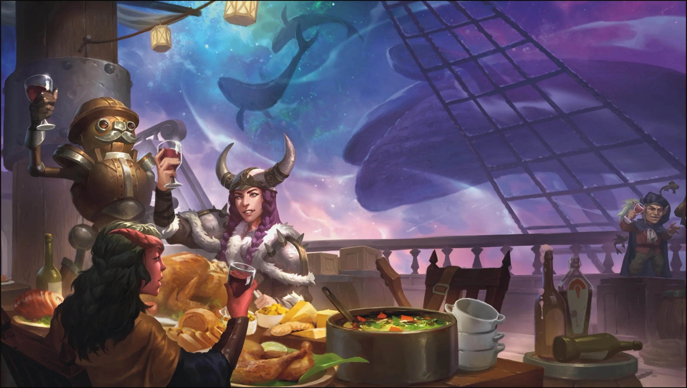

>
>
>Another fallen comrade, another Total Planning Katastrophe, and only myself to blame. The dagger of fate indeed cuts deep. Whilst our time with Bri'An was short, somehow his death stings most profoundly.
>
>He was a dragon among men, a man among dragons. I pray he restèth in the house of Tyr, but my bitter goblin intuition tells me otherwise. I commit a portion of this Ruby Cordial (not to be confusèd with Ruby) to the Astral Sea in your honor, and now I sip its cherried juices.
>
>Meanstwhile, the bronze-armored little man called Dint has set us sail to places unknown. Whatmatter. I again lead the Bureau toward certain death and without a healer no less. I am no leader. A poet, surely, but a leader? My plans know only failure. Only the promised glint of Astral Diamonds keepeth me going. Oh, how I long to return to my homeland, the soothing Caves of Calmness, with sweet Ruby and to hang up my adventuring leathers for good.
>
>
>
>I don't understand it. *Volo's Guide to Bodily Health* says that Bri'An's symptoms were those of sour health and worsening humors. I did what it said and applied last-minute leeches to administer a bloodletting, and even screamed at the leeches to suck faster! But you could see on their tired, defeated little faces that they couldn't drain away the poison fast enough to save him! They were too late. I was too late.... I'm always too late. Not fast enough, not strong enough.
>
>Oh, that I could smite the poison, smash it, but I am no more a healer than I am a fighter. I'm sorry, honest and faithful Bri'An. You deserved better and we failed you.
>
>I now must eat the saltiest of Breaded Bird Cutlets and Beluir Poached Salmon that Dint keeps aboard to replenish the salts that have leaked from my eyes.
>
>I will never be a real fighter.
>
>
>
>I am troubled this day. What if Squirladax is right and there's nothing after death?
>
>No. No, it cannot be. Even now, the Raven Queen awaits me in the Shadowfell, pleased with her newest prize: the fresh soul of a dragonborn cleric delivered upon the raven I sent from Krynn. Or I thought I spied a nearby raven, did I not?! Even as I whispered to Bri'An the words I learned from the Lords of Shadow's Edge...?
>
>Shadow's Edge.
>
>I have a confession to make, cursed reader. For I was cast out and banished from the Shadow's Edge Academy. I know that death **will** come for me; for I know that great spell powers and other adventuring grits are beyond my prowess for only I know that I am a Shadow's Edge drop-out.
>
>It's not all for my fault. BETRAYED I was, and by my good friend, and fellow, if jealous, student!
>
>And so too are you, Bri'An, betrayed...by my incompetence. What betrayals did you hide, Bri'An?
>
>Before we committed his soulless corpse to the fertile grounds of Solamnia, we performed the rite of Journey's End—that is, we cleared it of all effects. Curiously, upon his scaled figure he carried a modest, but not insubstantial cache of wealth: rings of gold, a jeweled medallion, and trinkets of silver. He even carried blades. I've never known a cleric to carry such items. But no matter. Bri'An was jolly. Bri'An was good...if Bri'An was even his real name.
>
>I will never be a real fighter.
>
>
>
>We've now been hours in this sea of astralness, but my spirits have begun to lighten (as has my head due to the copious amounts of Ruby Cordial).
>
>The bronze-plate-hidden gnome called Dint has advised that we, the "Quaternate Tetrad," are to be the guests of honor at a grand feast at a luxurious castle called Ravenloft, where we are to deliver the wine, Veneno '18. Finally, the end of a successful quest! I know not this Ravenloft, but it sounds lofty and prestigious.
>
>Dint has already shown us a most florid invitation, written in practiced calligraphy, which bodes that this may be the most extraordinary meal of our lives, with a dessert of FIVE ASTRAL DIAMONDS! If only...if only there were more of us to enjoy it.
>
>
>
>I must improve the disposition and torso shape of these humanoids with an excessive meal. Their figures mussssst be modmodified ffffor maximum nnnnnutrient density. Once dispatched to RRRRR-Ravenloft, I shall run a diagnostic as I appear appear to be malfunctioning.
>
>
>
>Dint cooks?! The deck of the Dashor was splayed with an endless and delightful repast of morsels that threatened to burst my goblin tum! It was a blood themed meal, I must guess, in honor of the blood shed by dear Bri'An—a memorial supper. Oh, the flavors! The Blood of Vol was a fireball of flavors as was a dish called Thrakel-Seared Beef in Red Sauce. This runny red meal paired perfectly with more Ruby Cordial. We engorged and imbibed, welcoming with open arms the food-and-booze-induced coma that was fated us.
>
>
>
>That dinner was freaking insane. I can barely move. Even my leeches are fat. I am worried about Dint, though. Did he always have a limp? And fall down a lot? And nap in the middle of sentences?
>
>
>
>Approaccccching Barovia. AUTOGNOME syssystems mmmmalfunctioning. M-m-m-must replenish p-p-power source. Jewel of Javanium exhausted.... ppoowwerrrr doooowwwwnn....
>
>
>
>Umm.... Dint has fallen to clackety limpness and we seem to be speeding and spiraling through a thick mist. Does anyone know how to fly this thing?
>

### Beluir Poached Salmon

Known as the unofficial capital of the former halfling nation of Luiren, Beluir was well regarded for its friendly folk, its strategic port location, and, of course, its food. The city's proximity to forests, rich farmland, and the sea made it an obvious destination for chefs and diners from across the Realms. And few dishes stood out more than Beluir's famous poached salmon. Available at virtually any eating house in town, the most traditional preparation came from the Friendly Burrow tavern, which created a mouthwatering spread, comprising both fresh and smoked salmon, herbs, cream cheese, and a touch of cayenne, served atop a baguette with a sprinkle of capers. If you couldn't get into the Friendly Burrow (it was always packed), the Cold Duck Inn made a worthy representation, and they even had rooms for rent that could accommodate "tall folk" guests who needed a rest after all that dining. While Luiren is no more, this famous dish can still be found on board various halfling-crewed spelljammers who commandeered this dish as their own.

<table class="rd__b-special rd__b-data  rd__b-data--stats">
		<thead>
			<tr>
				<th class="rd__data-embed-header ve-text-left" colspan="6" data-rd-data-embed-header="true">
					

						

							Beluir Poached Salmon
							
						

						[–]
					

				</th>
			</tr>
		</thead><tbody class="" data-rd-embedded-data-render-target="true"><tr>
			<td colspan="6" data-rd-tag="recipe" data-rd-uid="Beluir Poached Salmon|HFFotM" data-rd-page="recipes.html" data-rd-source="HFFotM" data-rd-hash="beluir%20poached%20salmon_hffotm" data-rd-name="Beluir Poached Salmon" data-rd-display-name="Beluir Poached Salmon" data-rd-style="" data-rd-entry-data="{}">
				<i>Loading <a href="recipes.html#beluir%20poached%20salmon_hffotm"  onmouseover="Renderer.hover.pHandleLinkMouseOver(event, this)" onmouseleave="Renderer.hover.handleLinkMouseLeave(event, this)" onmousemove="Renderer.hover.handleLinkMouseMove(event, this)" onclick="Renderer.hover.handleLinkClick(event, this)" onwheel="Renderer.hover.handleLinkWheel(event, this)" ondragstart="Renderer.hover.handleLinkDragStart(event, this)" data-vet-page="recipes.html" data-vet-source="HFFotM" data-vet-hash="beluir%20poached%20salmon_hffotm" ontouchstart="Renderer.hover.handleTouchStart(event, this)" >Beluir Poached Salmon</a>...</i>
				
			</td>
		</tr></tbody></table>
### Black Lotus Root

There is one curriculum rarely discussed at Strixhaven University—feasting. But with offerings at the school's refectories as eclectic as its student body, aspiring mages from across the multiverse are exposed to exotic, colorful, and delicious meals to keep their learning minds inspired. At the Bow's End Tavern, a popular campus eatery, one culinary rite of passage is the pickled Black Lotus Root. This earthy yet tangy treat is an addictive nibble, notorious for turning the tongues of those who eat it purple. First years often flash their lilac tongues on campus like a badge of courage. Notably, Black Lotus Root pairs well with nearly any of the colorful (and alchemical) concoctions on tap.

<table class="rd__b-special rd__b-data  rd__b-data--stats">
		<thead>
			<tr>
				<th class="rd__data-embed-header ve-text-left" colspan="6" data-rd-data-embed-header="true">
					

						

							Black Lotus Root
							
						

						[–]
					

				</th>
			</tr>
		</thead><tbody class="" data-rd-embedded-data-render-target="true"><tr>
			<td colspan="6" data-rd-tag="recipe" data-rd-uid="Black Lotus Root|HFFotM" data-rd-page="recipes.html" data-rd-source="HFFotM" data-rd-hash="black%20lotus%20root_hffotm" data-rd-name="Black Lotus Root" data-rd-display-name="Black Lotus Root" data-rd-style="" data-rd-entry-data="{}">
				<i>Loading <a href="recipes.html#black%20lotus%20root_hffotm"  onmouseover="Renderer.hover.pHandleLinkMouseOver(event, this)" onmouseleave="Renderer.hover.handleLinkMouseLeave(event, this)" onmousemove="Renderer.hover.handleLinkMouseMove(event, this)" onclick="Renderer.hover.handleLinkClick(event, this)" onwheel="Renderer.hover.handleLinkWheel(event, this)" ondragstart="Renderer.hover.handleLinkDragStart(event, this)" data-vet-page="recipes.html" data-vet-source="HFFotM" data-vet-hash="black%20lotus%20root_hffotm" ontouchstart="Renderer.hover.handleTouchStart(event, this)" >Black Lotus Root</a>...</i>
				
			</td>
		</tr></tbody></table>
### Green Dragon Blackbread Muffins

Blackbread is a palm-size circular loaf of pumpernickel that demands to be served warm and topped with sweet butter. A base of stone-ground cornmeal, dark rye flour, and a dash of unsweetened cocoa bolster the dark colors and texture. Buttermilk, molasses, and dark brown sugar round out this versatile bread with an almost honeyed nuance, which dips nicely in surplus gravy. You aren't doing it right unless a sizable slab of salted yak butter or the like is slathered on top to melt into its deep, dark nooks. A fancier version, usually served as a meal in itself, has currants or dried fruits rolled in, providing an even chewier and heartier experience. Blackbread is often sold in loaves by the bunch, but they are equally delectable in a portable muffin form, as they are served at the Green Dragon Inn in the Free City of Greyhawk. Blackbread's versatility makes it a great day starter reheated in a skillet, with—you guessed it—additional butter glistening atop. A notable version of this exists in loaf form in Saltmarsh and its nautical outskirts. In truth, whether eaten from a loaf or as a muffin, it's a classic and frugal dark bread that finds its way into many a larder.

<table class="rd__b-special rd__b-data  rd__b-data--stats">
		<thead>
			<tr>
				<th class="rd__data-embed-header ve-text-left" colspan="6" data-rd-data-embed-header="true">
					

						

							Green Dragon Blackbread Muffins
							
						

						[–]
					

				</th>
			</tr>
		</thead><tbody class="" data-rd-embedded-data-render-target="true"><tr>
			<td colspan="6" data-rd-tag="recipe" data-rd-uid="Green Dragon Blackbread Muffins|HFFotM" data-rd-page="recipes.html" data-rd-source="HFFotM" data-rd-hash="green%20dragon%20blackbread%20muffins_hffotm" data-rd-name="Green Dragon Blackbread Muffins" data-rd-display-name="Green Dragon Blackbread Muffins" data-rd-style="" data-rd-entry-data="{}">
				<i>Loading <a href="recipes.html#green%20dragon%20blackbread%20muffins_hffotm"  onmouseover="Renderer.hover.pHandleLinkMouseOver(event, this)" onmouseleave="Renderer.hover.handleLinkMouseLeave(event, this)" onmousemove="Renderer.hover.handleLinkMouseMove(event, this)" onclick="Renderer.hover.handleLinkClick(event, this)" onwheel="Renderer.hover.handleLinkWheel(event, this)" ondragstart="Renderer.hover.handleLinkDragStart(event, this)" data-vet-page="recipes.html" data-vet-source="HFFotM" data-vet-hash="green%20dragon%20blackbread%20muffins_hffotm" ontouchstart="Renderer.hover.handleTouchStart(event, this)" >Green Dragon Blackbread Muffins</a>...</i>
				
			</td>
		</tr></tbody></table>

### Thrakel-Seared Beef in Red Sauce

Despite its reputation as a puritanical theocracy, Eberron's central Khorvaire nation of Thrane has a long and storied culinary tradition. Their culinary mastery is on no greater display than during the Feast of the Silver Flame, where one dish stands above the rest: Thrakel-Seared Beef in Red Sauce. True to Thranish tradition, strips of flank steak are drowned in a tomato-based sauce with hints of ginger, soy, and garlic. Scallions and onions add some kick in this explosion of flavor renowned through Eberron.

<table class="rd__b-special rd__b-data  rd__b-data--stats">
		<thead>
			<tr>
				<th class="rd__data-embed-header ve-text-left" colspan="6" data-rd-data-embed-header="true">
					

						

							Thrakel-Seared Beef in Red Sauce
							
						

						[–]
					

				</th>
			</tr>
		</thead><tbody class="" data-rd-embedded-data-render-target="true"><tr>
			<td colspan="6" data-rd-tag="recipe" data-rd-uid="Thrakel-Seared Beef in Red Sauce|HFFotM" data-rd-page="recipes.html" data-rd-source="HFFotM" data-rd-hash="thrakel-seared%20beef%20in%20red%20sauce_hffotm" data-rd-name="Thrakel-Seared Beef in Red Sauce" data-rd-display-name="Thrakel-Seared Beef in Red Sauce" data-rd-style="" data-rd-entry-data="{}">
				<i>Loading <a href="recipes.html#thrakel-seared%20beef%20in%20red%20sauce_hffotm"  onmouseover="Renderer.hover.pHandleLinkMouseOver(event, this)" onmouseleave="Renderer.hover.handleLinkMouseLeave(event, this)" onmousemove="Renderer.hover.handleLinkMouseMove(event, this)" onclick="Renderer.hover.handleLinkClick(event, this)" onwheel="Renderer.hover.handleLinkWheel(event, this)" ondragstart="Renderer.hover.handleLinkDragStart(event, this)" data-vet-page="recipes.html" data-vet-source="HFFotM" data-vet-hash="thrakel-seared%20beef%20in%20red%20sauce_hffotm" ontouchstart="Renderer.hover.handleTouchStart(event, this)" >Thrakel-Seared Beef in Red Sauce</a>...</i>
				
			</td>
		</tr></tbody></table>
### Ornabra

Ornabra is a hearty meal and something of a badge of honor for those who have eaten it. This dish has been served for many generations by the hard-working denizens of Purskul (the "Granary City"), a bustling and notable caravan stop inland from Athkatla, between Amn's Cloud Peak and the Small Teeth mountains in West Faerûn. Lamb and potato stew is simmered for hours, then drained before being wrapped in thick and chewy flatbread the size of a small shield. As popular with Purskul's human constituents as with its sizable half-orc population, this street food is enough to fill a humanoid belly for two meals and is commonly scooped up by on-the-go, coin-conscious caravanners along the Southern Trade Way.

<table class="rd__b-special rd__b-data  rd__b-data--stats">
		<thead>
			<tr>
				<th class="rd__data-embed-header ve-text-left" colspan="6" data-rd-data-embed-header="true">
					

						

							Ornabra
							
						

						[–]
					

				</th>
			</tr>
		</thead><tbody class="" data-rd-embedded-data-render-target="true"><tr>
			<td colspan="6" data-rd-tag="recipe" data-rd-uid="Ornabra|HFFotM" data-rd-page="recipes.html" data-rd-source="HFFotM" data-rd-hash="ornabra_hffotm" data-rd-name="Ornabra" data-rd-display-name="Ornabra" data-rd-style="" data-rd-entry-data="{}">
				<i>Loading <a href="recipes.html#ornabra_hffotm"  onmouseover="Renderer.hover.pHandleLinkMouseOver(event, this)" onmouseleave="Renderer.hover.handleLinkMouseLeave(event, this)" onmousemove="Renderer.hover.handleLinkMouseMove(event, this)" onclick="Renderer.hover.handleLinkClick(event, this)" onwheel="Renderer.hover.handleLinkWheel(event, this)" ondragstart="Renderer.hover.handleLinkDragStart(event, this)" data-vet-page="recipes.html" data-vet-source="HFFotM" data-vet-hash="ornabra_hffotm" ontouchstart="Renderer.hover.handleTouchStart(event, this)" >Ornabra</a>...</i>
				
			</td>
		</tr></tbody></table>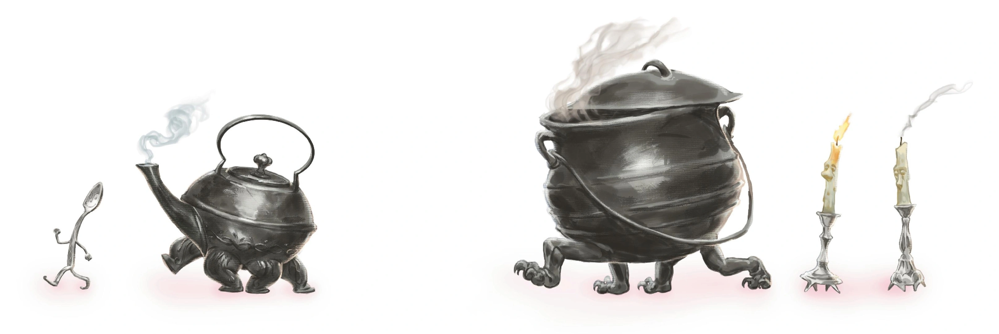

### Blood of Vol

In the military nation of Karnath, the faith known as the Blood of Vol symbolizes the inherent divinity within all people, stressing the power and comfort of the bonds that we form in this life. Exactly how the name of that religion became attached to this Eberron dish is a bit obscure—but the first bite you take will send divine strength coursing through your veins. The egg base is chock-full of sausage, onions, bell peppers, and enough spices to purify the soul—or in some cases, make you feel the flames of damnation, if there is such a thing. Some establishments serve this with an absolutely scorching amount of pepper, and its devotees settle for nothing less.

<table class="rd__b-special rd__b-data  rd__b-data--stats">
		<thead>
			<tr>
				<th class="rd__data-embed-header ve-text-left" colspan="6" data-rd-data-embed-header="true">
					

						

							Blood of Vol
							
						

						[–]
					

				</th>
			</tr>
		</thead><tbody class="" data-rd-embedded-data-render-target="true"><tr>
			<td colspan="6" data-rd-tag="recipe" data-rd-uid="Blood of Vol|HFFotM" data-rd-page="recipes.html" data-rd-source="HFFotM" data-rd-hash="blood%20of%20vol_hffotm" data-rd-name="Blood of Vol" data-rd-display-name="Blood of Vol" data-rd-style="" data-rd-entry-data="{}">
				<i>Loading <a href="recipes.html#blood%20of%20vol_hffotm"  onmouseover="Renderer.hover.pHandleLinkMouseOver(event, this)" onmouseleave="Renderer.hover.handleLinkMouseLeave(event, this)" onmousemove="Renderer.hover.handleLinkMouseMove(event, this)" onclick="Renderer.hover.handleLinkClick(event, this)" onwheel="Renderer.hover.handleLinkWheel(event, this)" ondragstart="Renderer.hover.handleLinkDragStart(event, this)" data-vet-page="recipes.html" data-vet-source="HFFotM" data-vet-hash="blood%20of%20vol_hffotm" ontouchstart="Renderer.hover.handleTouchStart(event, this)" >Blood of Vol</a>...</i>
				
			</td>
		</tr></tbody></table>
### Breaded Bird Cutlets

No one is quite sure how this crispy and succulent breaded chicken dish has proliferated across many planets of the multiverse, but why it appears on the menus of so many eateries is blatantly obvious—it's as classic as it is delicious. Traditional preparation of this multiversal main requires tenderizing and breading the cutlets to ensure that the chicken remains soft and moist. Each thin cutlet, the size of an orc's palm, is then fried in a flash to lock in the juices. Breaded Bird Cutlets are primarily served seasoned, lathered with butter, and spritzed with lemon, although breadings and sauces can vary greatly depending on the world and the occasion. If someone in your party is feeling adventurous, order a "stack"—three sizzling cutlets on a platter—which will surely satiate even the grandest appetite.

<table class="rd__b-special rd__b-data  rd__b-data--stats">
		<thead>
			<tr>
				<th class="rd__data-embed-header ve-text-left" colspan="6" data-rd-data-embed-header="true">
					

						

							Breaded Bird Cutlets
							
						

						[–]
					

				</th>
			</tr>
		</thead><tbody class="" data-rd-embedded-data-render-target="true"><tr>
			<td colspan="6" data-rd-tag="recipe" data-rd-uid="Breaded Bird Cutlets|HFFotM" data-rd-page="recipes.html" data-rd-source="HFFotM" data-rd-hash="breaded%20bird%20cutlets_hffotm" data-rd-name="Breaded Bird Cutlets" data-rd-display-name="Breaded Bird Cutlets" data-rd-style="" data-rd-entry-data="{}">
				<i>Loading <a href="recipes.html#breaded%20bird%20cutlets_hffotm"  onmouseover="Renderer.hover.pHandleLinkMouseOver(event, this)" onmouseleave="Renderer.hover.handleLinkMouseLeave(event, this)" onmousemove="Renderer.hover.handleLinkMouseMove(event, this)" onclick="Renderer.hover.handleLinkClick(event, this)" onwheel="Renderer.hover.handleLinkWheel(event, this)" ondragstart="Renderer.hover.handleLinkDragStart(event, this)" data-vet-page="recipes.html" data-vet-source="HFFotM" data-vet-hash="breaded%20bird%20cutlets_hffotm" ontouchstart="Renderer.hover.handleTouchStart(event, this)" >Breaded Bird Cutlets</a>...</i>
				
			</td>
		</tr></tbody></table>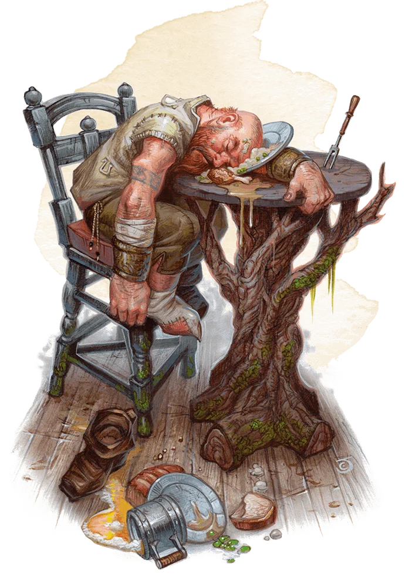

### Halfling Game Birds

Halflings may be small, but their love of fine food is known to be grand. It follows, then, that one of their most prized dishes would be correspondingly small of size but big on flavor, and such is the case with the dish called Halfling Game Birds. Rubbed with a secret mixture of rosemary, thyme, and lemon zest, these tasty Cornish hens are left to marinate overnight, testing the patience of many a halfling chef. When the waiting is over (almost never as long as is recommended), the birds are finally roasted at a scorching high heat to hasten them to the table where they never last long in front of eager diners. Whether Oerth, Toril, Eberron, or Krynn, these little game birds rule the roost on halfling tables across the multiverse.

<table class="rd__b-special rd__b-data  rd__b-data--stats">
		<thead>
			<tr>
				<th class="rd__data-embed-header ve-text-left" colspan="6" data-rd-data-embed-header="true">
					

						

							Halfling Game Birds
							
						

						[–]
					

				</th>
			</tr>
		</thead><tbody class="" data-rd-embedded-data-render-target="true"><tr>
			<td colspan="6" data-rd-tag="recipe" data-rd-uid="Halfling Game Birds|HFFotM" data-rd-page="recipes.html" data-rd-source="HFFotM" data-rd-hash="halfling%20game%20birds_hffotm" data-rd-name="Halfling Game Birds" data-rd-display-name="Halfling Game Birds" data-rd-style="" data-rd-entry-data="{}">
				<i>Loading <a href="recipes.html#halfling%20game%20birds_hffotm"  onmouseover="Renderer.hover.pHandleLinkMouseOver(event, this)" onmouseleave="Renderer.hover.handleLinkMouseLeave(event, this)" onmousemove="Renderer.hover.handleLinkMouseMove(event, this)" onclick="Renderer.hover.handleLinkClick(event, this)" onwheel="Renderer.hover.handleLinkWheel(event, this)" ondragstart="Renderer.hover.handleLinkDragStart(event, this)" data-vet-page="recipes.html" data-vet-source="HFFotM" data-vet-hash="halfling%20game%20birds_hffotm" ontouchstart="Renderer.hover.handleTouchStart(event, this)" >Halfling Game Birds</a>...</i>
				
			</td>
		</tr></tbody></table>
### Vada's Vanilla Buns

For those fortunate enough to visit the Radiant Citadel, a shining and otherworldly beacon of civilization deep in the Ethereal Plane, it is a nearly unrivaled cultural experience. Much more than a crossroads for weary interplanar pilgrims seeking passage to the founding civilizations of the Material Plane, the citadel is a veritable hub of flavors and cuisine all its own. The vanilla buns sold at Vada's Otherworldly Goods, made by the famous baker and Citadel resident Vada, are a scrumptious street-treat hailing from Siabsungkoh's famed Dyn Singh Market, nicknamed the Dancing Night Market due to its ever-shifting forms and truly magical and festive nature. These delicate rolled pastries are baked in a tightly packed bundle, resulting in a freshly cooked tray that resembles a bouquet of golden flowers. Crispy on the outside and cloudlike in the middle, these vanilla-flavored morsels don't last long at Vada's, or anywhere you find them, so be sure to grab one while you can. Although the original bun is crafted from a secret family recipe, this recipe is as close to the real thing as you are going to find.

<table class="rd__b-special rd__b-data  rd__b-data--stats">
		<thead>
			<tr>
				<th class="rd__data-embed-header ve-text-left" colspan="6" data-rd-data-embed-header="true">
					

						

							Vada's Vanilla Buns
							
						

						[–]
					

				</th>
			</tr>
		</thead><tbody class="" data-rd-embedded-data-render-target="true"><tr>
			<td colspan="6" data-rd-tag="recipe" data-rd-uid="Vada&apos;s Vanilla Buns|HFFotM" data-rd-page="recipes.html" data-rd-source="HFFotM" data-rd-hash="vada&apos;s%20vanilla%20buns_hffotm" data-rd-name="Vada&apos;s Vanilla Buns" data-rd-display-name="Vada&apos;s Vanilla Buns" data-rd-style="" data-rd-entry-data="{}">
				<i>Loading <a href="recipes.html#vada&apos;s%20vanilla%20buns_hffotm"  onmouseover="Renderer.hover.pHandleLinkMouseOver(event, this)" onmouseleave="Renderer.hover.handleLinkMouseLeave(event, this)" onmousemove="Renderer.hover.handleLinkMouseMove(event, this)" onclick="Renderer.hover.handleLinkClick(event, this)" onwheel="Renderer.hover.handleLinkWheel(event, this)" ondragstart="Renderer.hover.handleLinkDragStart(event, this)" data-vet-page="recipes.html" data-vet-source="HFFotM" data-vet-hash="vada&apos;s%20vanilla%20buns_hffotm" ontouchstart="Renderer.hover.handleTouchStart(event, this)" >Vada's Vanilla Buns</a>...</i>
				
			</td>
		</tr></tbody></table>

### Ray of Frost

This flavorful and strikingly cerulean concoction is said to chill its imbiber from the inside out. Named after the arcane incantation known for blasting its target with a rush of frigid energy and slowing their steps, ray of frost provides a cool option at upmarket taverns with more extensive and adventurous drink lists. Often served in a small crystal glass, Ray of Frost is an inspired blend of gin, absinthe, vermouth, and enough ice to chill even the coldest parts of Wildspace. The real challenge with this drink isn't surviving the initial icy brain-blast but surviving several glasses of it.

<table class="rd__b-special rd__b-data  rd__b-data--stats">
		<thead>
			<tr>
				<th class="rd__data-embed-header ve-text-left" colspan="6" data-rd-data-embed-header="true">
					

						

							Ray of Frost
							
						

						[–]
					

				</th>
			</tr>
		</thead><tbody class="" data-rd-embedded-data-render-target="true"><tr>
			<td colspan="6" data-rd-tag="recipe" data-rd-uid="Ray of Frost|HFFotM" data-rd-page="recipes.html" data-rd-source="HFFotM" data-rd-hash="ray%20of%20frost_hffotm" data-rd-name="Ray of Frost" data-rd-display-name="Ray of Frost" data-rd-style="" data-rd-entry-data="{}">
				<i>Loading <a href="recipes.html#ray%20of%20frost_hffotm"  onmouseover="Renderer.hover.pHandleLinkMouseOver(event, this)" onmouseleave="Renderer.hover.handleLinkMouseLeave(event, this)" onmousemove="Renderer.hover.handleLinkMouseMove(event, this)" onclick="Renderer.hover.handleLinkClick(event, this)" onwheel="Renderer.hover.handleLinkWheel(event, this)" ondragstart="Renderer.hover.handleLinkDragStart(event, this)" data-vet-page="recipes.html" data-vet-source="HFFotM" data-vet-hash="ray%20of%20frost_hffotm" ontouchstart="Renderer.hover.handleTouchStart(event, this)" >Ray of Frost</a>...</i>
				
			</td>
		</tr></tbody></table>
### Ruby Cordial

Ruby cordial is traditionally a saccharine swill of liquefied dark cherries blended into a fortified wine from the southern Moonshae Islands, where the aperitif first originated. While any cherries will do, the cherries of choice originate from the same rustic archipelago where they ripen in the sandy island soil, which imbues them with a sweet, robust flavor. Distilling cherry stems, skins, and even pits into the liqueur activates an almost nutty layer of flavor that hits right after the initial sugary wave passes. The Blade and Stars, a tried-and-true establishment in the port city of Baldur's Gate, offers a remarkable interpretation of this offshore staple using a traditional ruby port instead of fermented Moonshae cherry juices. Even better, the Blade serves food and drink right in the guest rooms, ensuring that no one will notice just how many of these wondrous cocktails are consumed.

<table class="rd__b-special rd__b-data  rd__b-data--stats">
		<thead>
			<tr>
				<th class="rd__data-embed-header ve-text-left" colspan="6" data-rd-data-embed-header="true">
					

						

							Ruby Cordial
							
						

						[–]
					

				</th>
			</tr>
		</thead><tbody class="" data-rd-embedded-data-render-target="true"><tr>
			<td colspan="6" data-rd-tag="recipe" data-rd-uid="Ruby Cordial|HFFotM" data-rd-page="recipes.html" data-rd-source="HFFotM" data-rd-hash="ruby%20cordial_hffotm" data-rd-name="Ruby Cordial" data-rd-display-name="Ruby Cordial" data-rd-style="" data-rd-entry-data="{}">
				<i>Loading <a href="recipes.html#ruby%20cordial_hffotm"  onmouseover="Renderer.hover.pHandleLinkMouseOver(event, this)" onmouseleave="Renderer.hover.handleLinkMouseLeave(event, this)" onmousemove="Renderer.hover.handleLinkMouseMove(event, this)" onclick="Renderer.hover.handleLinkClick(event, this)" onwheel="Renderer.hover.handleLinkWheel(event, this)" ondragstart="Renderer.hover.handleLinkDragStart(event, this)" data-vet-page="recipes.html" data-vet-source="HFFotM" data-vet-hash="ruby%20cordial_hffotm" ontouchstart="Renderer.hover.handleTouchStart(event, this)" >Ruby Cordial</a>...</i>
				
			</td>
		</tr></tbody></table>

------

# Ravenloft

CRASH LANDING! Without a proper pilot, our heroes crash land the SPELLJAMMER in foreboding BAROVIA! Grieving their lost friends, they seek to finish their mission and deliver the poisoned wine, Veneno '18, to a mysterious patron who lives in ominous CASTLE RAVENLOFT!

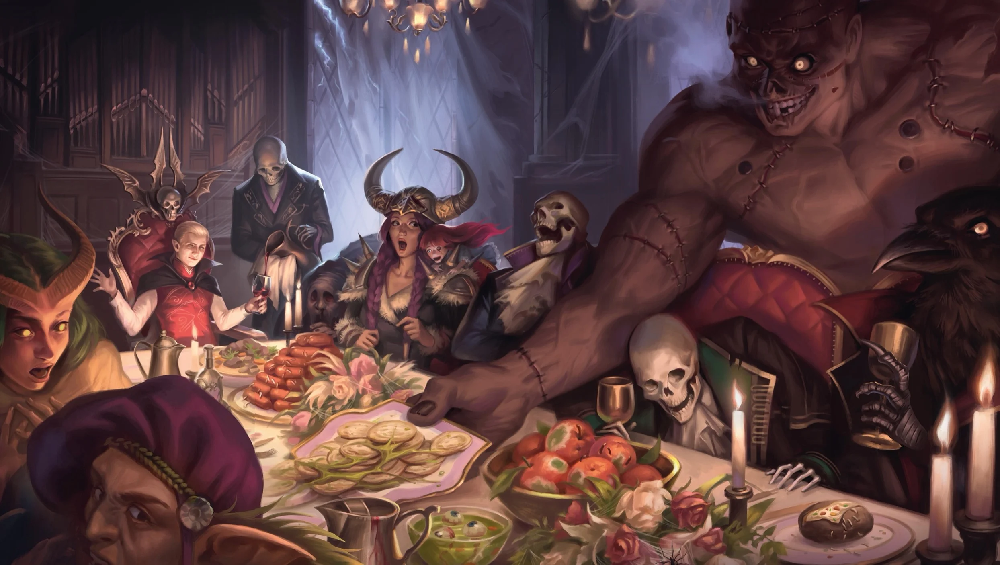

>
>
>Disaster! The spelljammer, CRASHÈD near unknown woods! Dint's last squeaking command was that we abscond with the Veneno '18 and deliver it to the Castle Ravenloft!
>
>We scream into the night and slink through misty shadows, wailing with every guiltmuddèd stride. In my quavering fingers, I hold chippèd RUBY, coughèd up there by dying Dint!
>
>You see, we killed him! Only now do I understand. As the Veneno '18 poisoned sweet Bri'An, we too poisoned doughty Dint by pretending that Ruby, sweet Ruby, was the "Jewel of Javanium." (T'ever that 'tis!) As we devour beefs, so too did Dint consume gems for nourishment! He died, poisoned, believing we were some honest band of adventurers known as the Quaternate Tetrad. Even as he thrashed in pained throes, he urged us forward to present ourselves to the Ravenloft patron and earn FIVE ASTRAL DIAMONDS.
>
>My heart bleats in my ears as I lead my false Tetrad in flight: We scream unto the night!
>
>
>
>After like an hour of screaming through the woods, I gained enough sense to pull myself together and slap Squirladax to non-screaming. I'm now pouring the local "Blood Meal" into his nose, which the manual suggests is the quickest way to restore warm blood directly to his brain.
>
>
>
>Composure regained, I find Dint's murder...somewhat less fascinating now. I find this place, however, more appetizing. We are in a tavern called Blood on the Vine that is buried in the mist-shrouded village of "Barovia."
>
>Barovia—a place of soulless eyes that both haunt and compel me.
>
>
>
>At the tavern, I hunt Barovian Garlic Breads. I slay Fig Cakes with sharpened daggers o' the mouth. Sasha crunches Tavern Crickets. Oh, the leaps she'll make with cricket digestions greasing her leg hinges, so sayeth Volo's book.
>
>Buoyed by Purple Grapemash No. 3, I realize Dint's memory must be honorèd. A false Tetrad playèd by a true triad will win the day! And Five Astral Diamonds they'll pay!
>
>Amazing what a sauced paunch can do for morale. Veneno '18 in hand, I will now ask the taverneer what direction lies this friendly Castle Ravenloft!
>
>
>
>Ugh, cursed reader! We now need to calm our "leader" Squirladax who fled the tavern wailing, after a misconstrued report from the tavern keeper.
>
>Let me explain: The tavern host gnashed his teeth and brought fear to Squirladax's flapping ears with his words: "Castle Ravenloft is home to Strahd. The first Vampyr."
>
>Upon hearing this, a'course, our little goblin man ran through the streets, screaming, "Vampeeeeer! Vampeeeer! We all die this night!"
>
>How embarrassed 'twas he when I imparted to him of my superior knowledge of Shadow's Edge-ducation. (You see, in my studies with the Lords of Shadow's Edge, dark infernal worlds and secrets of the damned were revealed to me.)
>
>I soothed fearful Squirladax that Vampeers is nothing to be a panic of. VamPIRES, to be sure! But Vampeers are simply contemporaries of equivalent stature and station as Vampires. For 'twere a Vampire to, say, be brought before a jury's court, the judgment would'st fall upon the vampire's Vampeers.
>
>This calmed Squirladax; and cursèd goblin, he took the lead again.
>
>His ignorance is astonishing.
>
>
>
>Oh, my breath bellows! We finally arrived at the top of the road, high above the moonlit countryside. Full moon, so that's creepy.... As was that wolf we passed that wore—I swear it was trousers? Chaps? Weird. Scary.... Sad. I've beat up my friends, lied, cheated, let another friend die, and applied my leeches under my eyes to suck my tears away. We now cross a drawbridge to the fog-swirled turrets of Castle Ravenloft.
>
>
>
>The silence of your home is welcome, Strahd—absent as it is from the bothersome chit chat of servants. These chambers of black and purple are quiet as death. Were you expecting me? Will you entice me to betray my companions and send their dead souls to satisfy my Queen? What do you offer?
>
>Oh—this prodigious feasting table that welcomes us! Roast Boar at one end, Two Hares Inn Rabbit Stew at the other. Baskets of Green Onion Pancakes and plates piled high with the sausages and potatoes of Quij's Plate. Carafes of Honeymilk towered above the rest! And in the marbled center, a space, no doubt, for the main course still to come! At the room's edge, there is a magnificent, gilded pipe organ, and behold on the opposite wall is a lavish portrait.... My new friend? Enemy? You are rather dashing, and I want to set your face aflame.
>
>
>
>I watch as pallid, lanky, hairless men with idiot grins appear and perch themselves around us at the table. Eight in number, all of them silent smirking, and I do think, haughtily, at me. Do these **strangers**, conspiring to share a private jest, mean to belittle ME?! How dare?!
>
>Oh wait...
>
>While I have not trained under Lords of some fancy academy like Deelia, my memory jogs, and I now understand! These contemptible imbeciles are the deceased of humans oft referred to as "skeletons!" I do not know why these dead humans insist on smirking at me, though. What know'st they?
>
>They must know that I am a murderer. My knees knock.
>
>The walls groan, and a dust-encrusted, man-sized box is wheeled in by yet more condescending skeletons!
>
>A ghostly voice emanates from lipless teeth. "Behold. He is Chahd." And the lid to what I now know is a coffin creaks open. I believe we are soon to meet our host.
>
>
>
>I report this from the water closet. Art thou yanking my leg? CHAHD?! Clambering clumsily from stupid coffin, high-collared velveteen cape, a plaster of yellow-moldy hair framing his round stupid face. I recognized him in an instant and hid to avoid his eyes.
>
>Reader! Let Deelia blow thy wig bald.
>
>He is NOT Chahd, nor Strahd! He is not vampire! This so-called Chahd is in reality CHAD, my old ally, turned nemesis. 'Twas HE that alerted the Lords of Shadow's Edge to exile me after a meager incident allegedly involving a small amount of purifying flame.
>
>I must play my part, return to the banquet coolly, and challenge Chad's Vampyrity, for I doubt very much any vampire would see Chahd as peer.
>
>
>
>We were feasting mirthfully, when—Chahd bellowed: "I AM VAMPIRE!" This caused a soiling of the pants of my very soul, when Deelia called out hence:
>
>"You are neither Vampire, nor Vampeer, nor Chahd, but Chad! Where is the Lord of this Manor?"
>
>Chahd bit back viciously. "He is gone afar for the weekend. A vacuum is left in this his house, his seat of power! And I am the sitter of this house!"
>
>I retorted, "So your authority here is borrowed, not bought of wealth or influence?"
>
>Chahd grinned evilly. "I have found a means of pyr review. Of buying my master's favor, my sweet Quaternate Tetrad." He gesticulated to the Veneno '18 and bade us drink deeply from it, for that 'twas its purpose all along!
>
>"WELCOME TO MY MASTER'S BANQUET. FOR YOU SEE, YOU...ARE THE INGREDIENTS!"
>
>
>
>I DON'T GET ANYTHING! I WANNA GO HOME! Ok.... Sorry! First, I don't get why Deelia didn't just burn the hell out of Chahd, magic-wise, but Chahd started calling her "Fire Fingers" and Deelia got something called "vexed!" The skeletons start pulling out GIANT CLEAVERS! I look to Squirladax, and he's crying into that stupid Ruby....
>
>Okay, so it's on me. Let's try to flip this table like they do in stage plays! Nope, it's too big. Then I started smashing plates, but no one cared. Wait! I'll bet that big expensive pipe organ would get Chahd in trouble if it were broken! So, I hurl my chair at it, and yeah! BOOM!! And SURPRISE...it shuddered and slid to reveal a FREAKING SECRET DOOR!
>
>So that's when I smashed Chahd in the face with the Veneno and grabbed my friends. We ran like the wind!
>
>
>
>We flee into the eternal Barovian night and make it to the calamitous site beyond the woods where the spelljammer crashed. I can only guess, out of fear and madness, that we had some hope Dint would rise from his grave and whisk us and the spelljammer into the sky and to safety.
>
>But then I remember... BETRAYED! Dastardly Dint bade us deliver ourselves up to be eaten! Nary an Astral Diamond to be found! Now, out of the Svalich Woods, march the hungry skeletal minions of Vampeer housesitter, Chahd.
>
>I sign off...from this life and deem this the final entry of the BUREAU OF DARK TABLES. TPK.
>
>
>
>The skeletons will be here soon. Goodbye cruel universe, and hello to oblivion, as it is clear that I have not curried enough favor with the Queen to join her...in the Shadowfell.
>
>
>
>I am now super sad that I spent all my money on food instead of, like, a new battleaxe.
>
>
>
>Boy, skeletons truly do march a snail's pace, do they not? With every step, however, my throat constricts, as I know this to be the end of all things. I see Chahd. He will drain my goblin blood. My death will be beyond all reasoning excruciation. 'Tis what I deserve. FIN.
>
>
>
>I wish I could make fire now so that I could make flame of myself, a screaming death. but Chahd has vexed me. I die vexed.
>
>
>
>I just really think that as leaderpoet, it falls to me to end this journal proper, so it is with a heavy heart that...wait. What ho? Cresting the mountain to the west! A small, paunchy man with green draconic gait. I do not understand!
>
>
>
>OH, MY QUEEN! I GET IT! RAVENLOFT is IN THE SHADOWFELL! BEHOLD! OUR CLERIC BRI'AN IS SENT BY MY RAVEN QUEEN! HE HAS COME TO VANQUISH THE UNDEAD!
>
>
>
>And so it 'twas that a whisper and a raven had whisked Bri'An away to the land of Shadows, but the Raven had an "oopsy" and brought the soul of Tyr's servant to RavenLOFT in-stead of the house of the Raven QUEEN. Tyr looked on and saw that 'twas fine. 'Twas an honest mistake.
>
>So did'st Bri'An, son of Stev'An find himself the lone vanguard against the skeletal hordes. And Bri'An's friends begged weepily that Bri'An might perform a TURNING OF THE UNDEAD.
>
>So he attempted the thing, with a fire of his dragonly voice, a raising of his holy hammer, and *I have no freaking-clue how that worked. Because, ok. Look. I'm a thief. My thing was that I was gonna' rob the goblin guy of that Ruby and use these fools as cover to rob the crap outta' more guys. I just thought it would be funny to pretend I'm a cleric.*
>
>*But when I raised my hammer, that Vampire guy looked at me, then looked at his skeleton friends, then looked back at me, screamed, and ran away.*
>
>*So...I'm shook.*
>
>*Tyr's REAL?*
>
>*Tears in my eyes.*
>

### Halfling Iron Rations

Braving the dead wastes of the Shadowfell demands great preparation and fortitude. The endless gloom is unforgiving and yields little in the way of natural edible resources. Travelers would be wise to foreplan their meals and carry all required consumables with them. The iron rations prepared by Gloomwrought's surprisingly sizable halfling population are a notable and cost-effective trail treat. This creative medley of crushed nuts, local oats, and crunchy seeds are clumped into tiny balls and cemented with honey. And they are as packed with nutrients as they are yummy. Even when you're not embarking on an arduous, despair-filled journey, this granola makes for a nourishing, delectable snack that balances the sweet and savory.

<table class="rd__b-special rd__b-data  rd__b-data--stats">
		<thead>
			<tr>
				<th class="rd__data-embed-header ve-text-left" colspan="6" data-rd-data-embed-header="true">
					

						

							Halfling Iron Rations
							
						

						[–]
					

				</th>
			</tr>
		</thead><tbody class="" data-rd-embedded-data-render-target="true"><tr>
			<td colspan="6" data-rd-tag="recipe" data-rd-uid="Halfling Iron Rations|HFFotM" data-rd-page="recipes.html" data-rd-source="HFFotM" data-rd-hash="halfling%20iron%20rations_hffotm" data-rd-name="Halfling Iron Rations" data-rd-display-name="Halfling Iron Rations" data-rd-style="" data-rd-entry-data="{}">
				<i>Loading <a href="recipes.html#halfling%20iron%20rations_hffotm"  onmouseover="Renderer.hover.pHandleLinkMouseOver(event, this)" onmouseleave="Renderer.hover.handleLinkMouseLeave(event, this)" onmousemove="Renderer.hover.handleLinkMouseMove(event, this)" onclick="Renderer.hover.handleLinkClick(event, this)" onwheel="Renderer.hover.handleLinkWheel(event, this)" ondragstart="Renderer.hover.handleLinkDragStart(event, this)" data-vet-page="recipes.html" data-vet-source="HFFotM" data-vet-hash="halfling%20iron%20rations_hffotm" ontouchstart="Renderer.hover.handleTouchStart(event, this)" >Halfling Iron Rations</a>...</i>
				
			</td>
		</tr></tbody></table>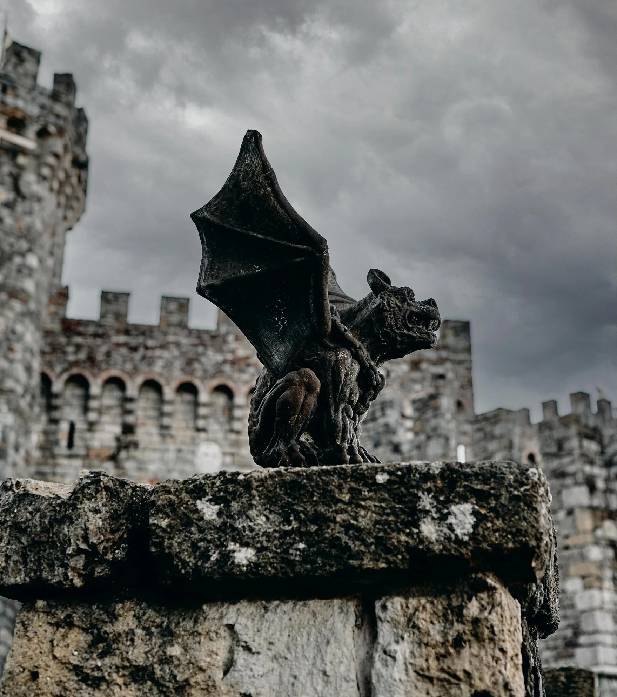

### Tavern Crickets

There is an old phrase popular among the dwellers of the Shadowfell: "Choice is for the spoilt." Perhaps that idiom is the origin of this modest and practical insect-based recipe that dates back centuries and speaks to the ingenuity of the plane's original inhabitants. Adult crickets are flash-fried, air-dried, and then seasoned with an assortment of aromatics, including chile, lime, and cayenne, and are served by the dozen in a large rolled-leaf "cone." As popular in the Material Plane of Faerûn as they are in the Shadowfell, tavern crickets are a crunchy, irresistibly tangy, protein-packed snack that can brighten the otherwise dismal days spent in the region.

<table class="rd__b-special rd__b-data  rd__b-data--stats">
		<thead>
			<tr>
				<th class="rd__data-embed-header ve-text-left" colspan="6" data-rd-data-embed-header="true">
					

						

							Tavern Crickets
							
						

						[–]
					

				</th>
			</tr>
		</thead><tbody class="" data-rd-embedded-data-render-target="true"><tr>
			<td colspan="6" data-rd-tag="recipe" data-rd-uid="Tavern Crickets|HFFotM" data-rd-page="recipes.html" data-rd-source="HFFotM" data-rd-hash="tavern%20crickets_hffotm" data-rd-name="Tavern Crickets" data-rd-display-name="Tavern Crickets" data-rd-style="" data-rd-entry-data="{}">
				<i>Loading <a href="recipes.html#tavern%20crickets_hffotm"  onmouseover="Renderer.hover.pHandleLinkMouseOver(event, this)" onmouseleave="Renderer.hover.handleLinkMouseLeave(event, this)" onmousemove="Renderer.hover.handleLinkMouseMove(event, this)" onclick="Renderer.hover.handleLinkClick(event, this)" onwheel="Renderer.hover.handleLinkWheel(event, this)" ondragstart="Renderer.hover.handleLinkDragStart(event, this)" data-vet-page="recipes.html" data-vet-source="HFFotM" data-vet-hash="tavern%20crickets_hffotm" ontouchstart="Renderer.hover.handleTouchStart(event, this)" >Tavern Crickets</a>...</i>
				
			</td>
		</tr></tbody></table>
### Barovian Garlic Bread

This buttery bread, served in both loaf and knot form, is ever-present in the taverns and inns dotting the misty (and eerie) Barovian countryside. While it's not uncommon for wayward travelers to get the cold shoulder from reclusive and suspicious denizens, inns such as the Blue Water will at least offer a warm basket of this local treat to well-mannered and paying patrons. It is important to note that although garlic is a flavorful and inspired touch, it is not indigenous to the region. You'll find this pungent bread pairs nicely with a main of medium-rare wolf steak and a glass of Wizard of Wines' Champagne du le Stomp or Red Dragon Crush, but avoid the Purple Grapemash No. 3 at all costs.

<table class="rd__b-special rd__b-data  rd__b-data--stats">
		<thead>
			<tr>
				<th class="rd__data-embed-header ve-text-left" colspan="6" data-rd-data-embed-header="true">
					

						

							Barovian Garlic Bread
							
						

						[–]
					

				</th>
			</tr>
		</thead><tbody class="" data-rd-embedded-data-render-target="true"><tr>
			<td colspan="6" data-rd-tag="recipe" data-rd-uid="Barovian Garlic Bread|HFFotM" data-rd-page="recipes.html" data-rd-source="HFFotM" data-rd-hash="barovian%20garlic%20bread_hffotm" data-rd-name="Barovian Garlic Bread" data-rd-display-name="Barovian Garlic Bread" data-rd-style="" data-rd-entry-data="{}">
				<i>Loading <a href="recipes.html#barovian%20garlic%20bread_hffotm"  onmouseover="Renderer.hover.pHandleLinkMouseOver(event, this)" onmouseleave="Renderer.hover.handleLinkMouseLeave(event, this)" onmousemove="Renderer.hover.handleLinkMouseMove(event, this)" onclick="Renderer.hover.handleLinkClick(event, this)" onwheel="Renderer.hover.handleLinkWheel(event, this)" ondragstart="Renderer.hover.handleLinkDragStart(event, this)" data-vet-page="recipes.html" data-vet-source="HFFotM" data-vet-hash="barovian%20garlic%20bread_hffotm" ontouchstart="Renderer.hover.handleTouchStart(event, this)" >Barovian Garlic Bread</a>...</i>
				
			</td>
		</tr></tbody></table>
### Green Onion Pancakes

When the great floating enclaves of the Netheril Empire came crashing down, so, too, did their culinary secrets. But one community survived by escaping to the Shadowfell, and with it one of their most prized recipes was preserved: Green Onion Pancakes. While the Netherese, now known as the shadowstuff-infused Shadovar, have changed much over the centuries, this spectacular dish hasn't. These allium-based pancakes are an inexpensive and unexpectedly filling treat that pairs easily with savory roast meats. They're also delicious served solo, when dolloped with fresh cream and pureed fig spread for a uniquely Netherese experience. In many regions, scallions are an equally acceptable base vegetable that offers a pancake with a milder flavor. Regardless of how one chooses to consume this pan-fried appetizer, the culinary experience is one of the few good reasons to come to the Shadowfell.

<table class="rd__b-special rd__b-data  rd__b-data--stats">
		<thead>
			<tr>
				<th class="rd__data-embed-header ve-text-left" colspan="6" data-rd-data-embed-header="true">
					

						

							Green Onion Pancakes
							
						

						[–]
					

				</th>
			</tr>
		</thead><tbody class="" data-rd-embedded-data-render-target="true"><tr>
			<td colspan="6" data-rd-tag="recipe" data-rd-uid="Green Onion Pancakes|HFFotM" data-rd-page="recipes.html" data-rd-source="HFFotM" data-rd-hash="green%20onion%20pancakes_hffotm" data-rd-name="Green Onion Pancakes" data-rd-display-name="Green Onion Pancakes" data-rd-style="" data-rd-entry-data="{}">
				<i>Loading <a href="recipes.html#green%20onion%20pancakes_hffotm"  onmouseover="Renderer.hover.pHandleLinkMouseOver(event, this)" onmouseleave="Renderer.hover.handleLinkMouseLeave(event, this)" onmousemove="Renderer.hover.handleLinkMouseMove(event, this)" onclick="Renderer.hover.handleLinkClick(event, this)" onwheel="Renderer.hover.handleLinkWheel(event, this)" ondragstart="Renderer.hover.handleLinkDragStart(event, this)" data-vet-page="recipes.html" data-vet-source="HFFotM" data-vet-hash="green%20onion%20pancakes_hffotm" ontouchstart="Renderer.hover.handleTouchStart(event, this)" >Green Onion Pancakes</a>...</i>
				
			</td>
		</tr></tbody></table>
### Two Hares Inn Rabbit Stew

It should come as no surprise that the signature dish of the Two Hares Inn, located on the zombie-infested Barovian island of Souragne, is a rabbit stew prepared with one of the region's many famous wines. What's more surprising is who makes it, for it is said about the proprietor and chef that even death "hasn't interfered with his talent." It's a classic example of not wanting to know how the sausage, or in this case, stew—a delicious medley infused with intricate notes of thyme, oregano, and dry white wine—is made. In regions where rabbit isn't available, chicken has become a popular (and, in many cases, preferred) substitute. Whichever protein you cook, it is sure to reanimate your taste buds.

<table class="rd__b-special rd__b-data  rd__b-data--stats">
		<thead>
			<tr>
				<th class="rd__data-embed-header ve-text-left" colspan="6" data-rd-data-embed-header="true">
					

						

							Two Hares Inn Rabbit Stew
							
						

						[–]
					

				</th>
			</tr>
		</thead><tbody class="" data-rd-embedded-data-render-target="true"><tr>
			<td colspan="6" data-rd-tag="recipe" data-rd-uid="Two Hares Inn Rabbit Stew|HFFotM" data-rd-page="recipes.html" data-rd-source="HFFotM" data-rd-hash="two%20hares%20inn%20rabbit%20stew_hffotm" data-rd-name="Two Hares Inn Rabbit Stew" data-rd-display-name="Two Hares Inn Rabbit Stew" data-rd-style="" data-rd-entry-data="{}">
				<i>Loading <a href="recipes.html#two%20hares%20inn%20rabbit%20stew_hffotm"  onmouseover="Renderer.hover.pHandleLinkMouseOver(event, this)" onmouseleave="Renderer.hover.handleLinkMouseLeave(event, this)" onmousemove="Renderer.hover.handleLinkMouseMove(event, this)" onclick="Renderer.hover.handleLinkClick(event, this)" onwheel="Renderer.hover.handleLinkWheel(event, this)" ondragstart="Renderer.hover.handleLinkDragStart(event, this)" data-vet-page="recipes.html" data-vet-source="HFFotM" data-vet-hash="two%20hares%20inn%20rabbit%20stew_hffotm" ontouchstart="Renderer.hover.handleTouchStart(event, this)" >Two Hares Inn Rabbit Stew</a>...</i>
				
			</td>
		</tr></tbody></table>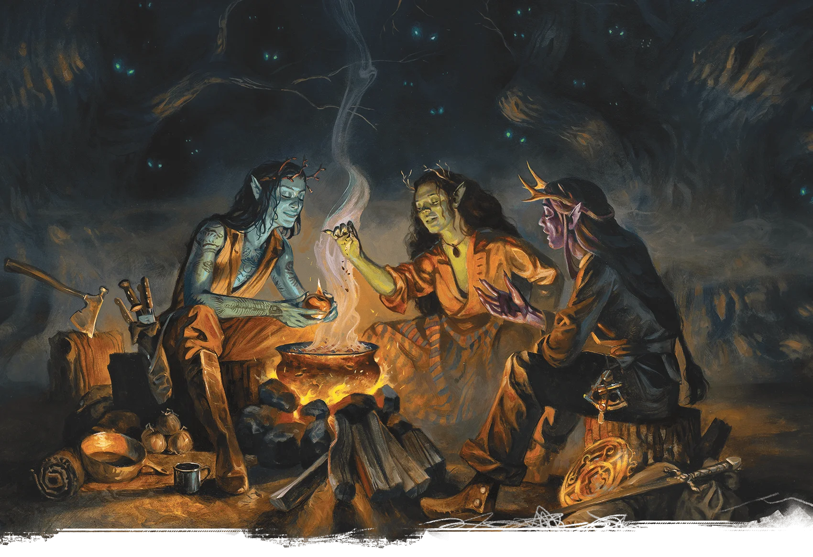

### Whole Roast Boar

Whole roast boar, or some parts thereof, is a favorite at the banquets of vampire hosts throughout the Domains of Dread. It is rumored that hosts wait until their guests are "glassy of eye, greasy of chin, and a drowsy cheer has come upon them" to insert a single fang to the jugular of each guest and exsanguinate to their taste. Proper preparation requires of the cook an unabashed love of jam, port, and brown sugar, applied with a heavy hand to flavor the meat, ensuring that you and your guests will leave nothing on your plates. For those lucky travelers fortunate enough to escape the fog-shrouded confines of Barovia to Toril, a variation of this hearty and succulent feast is a specialty of the Boar with Black Tusks in Noanar's Hold, which sometimes uses pork when a boar cannot be procured and is often served with a dry ruby wine from Cormyr.

<table class="rd__b-special rd__b-data  rd__b-data--stats">
		<thead>
			<tr>
				<th class="rd__data-embed-header ve-text-left" colspan="6" data-rd-data-embed-header="true">
					

						

							Whole Roast Boar
							
						

						[–]
					

				</th>
			</tr>
		</thead><tbody class="" data-rd-embedded-data-render-target="true"><tr>
			<td colspan="6" data-rd-tag="recipe" data-rd-uid="Whole Roast Boar|HFFotM" data-rd-page="recipes.html" data-rd-source="HFFotM" data-rd-hash="whole%20roast%20boar_hffotm" data-rd-name="Whole Roast Boar" data-rd-display-name="Whole Roast Boar" data-rd-style="" data-rd-entry-data="{}">
				<i>Loading <a href="recipes.html#whole%20roast%20boar_hffotm"  onmouseover="Renderer.hover.pHandleLinkMouseOver(event, this)" onmouseleave="Renderer.hover.handleLinkMouseLeave(event, this)" onmousemove="Renderer.hover.handleLinkMouseMove(event, this)" onclick="Renderer.hover.handleLinkClick(event, this)" onwheel="Renderer.hover.handleLinkWheel(event, this)" ondragstart="Renderer.hover.handleLinkDragStart(event, this)" data-vet-page="recipes.html" data-vet-source="HFFotM" data-vet-hash="whole%20roast%20boar_hffotm" ontouchstart="Renderer.hover.handleTouchStart(event, this)" >Whole Roast Boar</a>...</i>
				
			</td>
		</tr></tbody></table>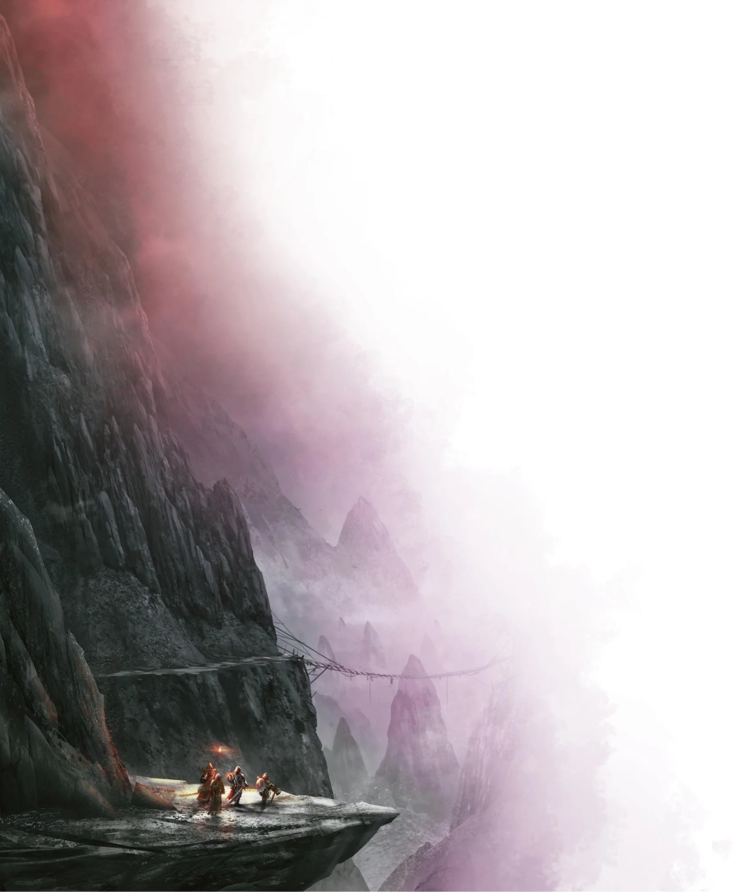

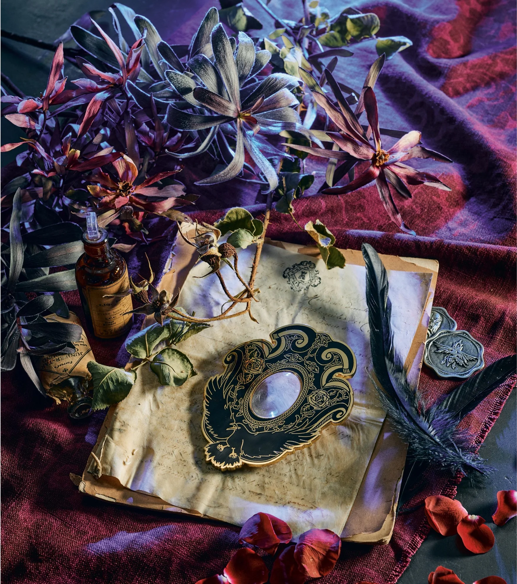

### Quij's Plate

Quij's Plate, consisting of pan-fried sausage, twice-browned potatoes, and eggs, is a filling meal that infallibly populates the menus of countless caravan cooks. Easy to prepare on the road for large parties, it has also become a popular dish in the military for its simplicity and heartiness to help soldiers brave the endless grey days. Named after an orc henchman of Lord Robilar, who inventively cooked this sausage meal for his adventuring party, using his shield for a skillet, Quij's Plate would eventually earn its place on the menu of the famed Green Dragon Inn, nestled in the Free City of Greyhawk's bustling River Quarter. The unusual name has since become the catch-all term for the countless iterations of this sausage-and-potato-based campfire classic, including those that migrated to misty Barovia via lost and hungry adventurers.

<table class="rd__b-special rd__b-data  rd__b-data--stats">
		<thead>
			<tr>
				<th class="rd__data-embed-header ve-text-left" colspan="6" data-rd-data-embed-header="true">
					

						

							Quij's Plate
							
						

						[–]
					

				</th>
			</tr>
		</thead><tbody class="" data-rd-embedded-data-render-target="true"><tr>
			<td colspan="6" data-rd-tag="recipe" data-rd-uid="Quij&apos;s Plate|HFFotM" data-rd-page="recipes.html" data-rd-source="HFFotM" data-rd-hash="quij&apos;s%20plate_hffotm" data-rd-name="Quij&apos;s Plate" data-rd-display-name="Quij&apos;s Plate" data-rd-style="" data-rd-entry-data="{}">
				<i>Loading <a href="recipes.html#quij&apos;s%20plate_hffotm"  onmouseover="Renderer.hover.pHandleLinkMouseOver(event, this)" onmouseleave="Renderer.hover.handleLinkMouseLeave(event, this)" onmousemove="Renderer.hover.handleLinkMouseMove(event, this)" onclick="Renderer.hover.handleLinkClick(event, this)" onwheel="Renderer.hover.handleLinkWheel(event, this)" ondragstart="Renderer.hover.handleLinkDragStart(event, this)" data-vet-page="recipes.html" data-vet-source="HFFotM" data-vet-hash="quij&apos;s%20plate_hffotm" ontouchstart="Renderer.hover.handleTouchStart(event, this)" >Quij's Plate</a>...</i>
				
			</td>
		</tr></tbody></table>
### Fig Cakes

Fig cakes are an easily preserved pouch snack for explorers with a sweet tooth. A perfect fig cake is as much about the fig as it is about the lightly toasted and ground almonds that form this fruity confection's chewy base. While honeyed fig tarts were extremely popular in Calimshan on the planet Toril, it is believed that this unique dessert originally hailed from the desolate wastes of the Shadowfell. Developed by the elves native to the Plane of Shadow called the Shadar-Kai, these treats are sweet enough to be at home even in the dreamy Feywild. In addition to the sesame seeds and anise seeds, a strong brandy is often infused into the mix, to both sweeten and fortify these small pressed cakes. While fig cakes do not come cheap, they are, nonetheless, a proud (and delicious) reminder of the resourcefulness of the Shadar-Kai.

<table class="rd__b-special rd__b-data  rd__b-data--stats">
		<thead>
			<tr>
				<th class="rd__data-embed-header ve-text-left" colspan="6" data-rd-data-embed-header="true">
					

						

							Fig Cakes
							
						

						[–]
					

				</th>
			</tr>
		</thead><tbody class="" data-rd-embedded-data-render-target="true"><tr>
			<td colspan="6" data-rd-tag="recipe" data-rd-uid="Fig Cakes|HFFotM" data-rd-page="recipes.html" data-rd-source="HFFotM" data-rd-hash="fig%20cakes_hffotm" data-rd-name="Fig Cakes" data-rd-display-name="Fig Cakes" data-rd-style="" data-rd-entry-data="{}">
				<i>Loading <a href="recipes.html#fig%20cakes_hffotm"  onmouseover="Renderer.hover.pHandleLinkMouseOver(event, this)" onmouseleave="Renderer.hover.handleLinkMouseLeave(event, this)" onmousemove="Renderer.hover.handleLinkMouseMove(event, this)" onclick="Renderer.hover.handleLinkClick(event, this)" onwheel="Renderer.hover.handleLinkWheel(event, this)" ondragstart="Renderer.hover.handleLinkDragStart(event, this)" data-vet-page="recipes.html" data-vet-source="HFFotM" data-vet-hash="fig%20cakes_hffotm" ontouchstart="Renderer.hover.handleTouchStart(event, this)" >Fig Cakes</a>...</i>
				
			</td>
		</tr></tbody></table>
### Honey Milk

Frequently enjoyed by the Shadovar as a nightcap or a light dessert, honey milk is traditionally a stand-alone beverage that can be served chilled, warm, or even as toddy, spiked with herbal liqueur (as it is frequently done in the Shadowfell's forsaken city of Gloomwrought). While the preparation of honey milk is quite simple, the best versions balance a modest amount of honey with the freshest dairy (often imported from the Prime Material Plane) to produce a hearty yet refreshing drink served to all ages. However, the true key to properly preparing honey milk is patience. Traditionally, shadovar alchemists allow the mixture to marinate and cool for several hours before serving, and often include a garnish of cinnamon or citrus to make an attractive presentation for this lovely libation. Its elixir-like qualities are whispered to be good on the gut.

<table class="rd__b-special rd__b-data  rd__b-data--stats">
		<thead>
			<tr>
				<th class="rd__data-embed-header ve-text-left" colspan="6" data-rd-data-embed-header="true">
					

						

							Honey Milk
							
						

						[–]
					

				</th>
			</tr>
		</thead><tbody class="" data-rd-embedded-data-render-target="true"><tr>
			<td colspan="6" data-rd-tag="recipe" data-rd-uid="Honey Milk|HFFotM" data-rd-page="recipes.html" data-rd-source="HFFotM" data-rd-hash="honey%20milk_hffotm" data-rd-name="Honey Milk" data-rd-display-name="Honey Milk" data-rd-style="" data-rd-entry-data="{}">
				<i>Loading <a href="recipes.html#honey%20milk_hffotm"  onmouseover="Renderer.hover.pHandleLinkMouseOver(event, this)" onmouseleave="Renderer.hover.handleLinkMouseLeave(event, this)" onmousemove="Renderer.hover.handleLinkMouseMove(event, this)" onclick="Renderer.hover.handleLinkClick(event, this)" onwheel="Renderer.hover.handleLinkWheel(event, this)" ondragstart="Renderer.hover.handleLinkDragStart(event, this)" data-vet-page="recipes.html" data-vet-source="HFFotM" data-vet-hash="honey%20milk_hffotm" ontouchstart="Renderer.hover.handleTouchStart(event, this)" >Honey Milk</a>...</i>
				
			</td>
		</tr></tbody></table>

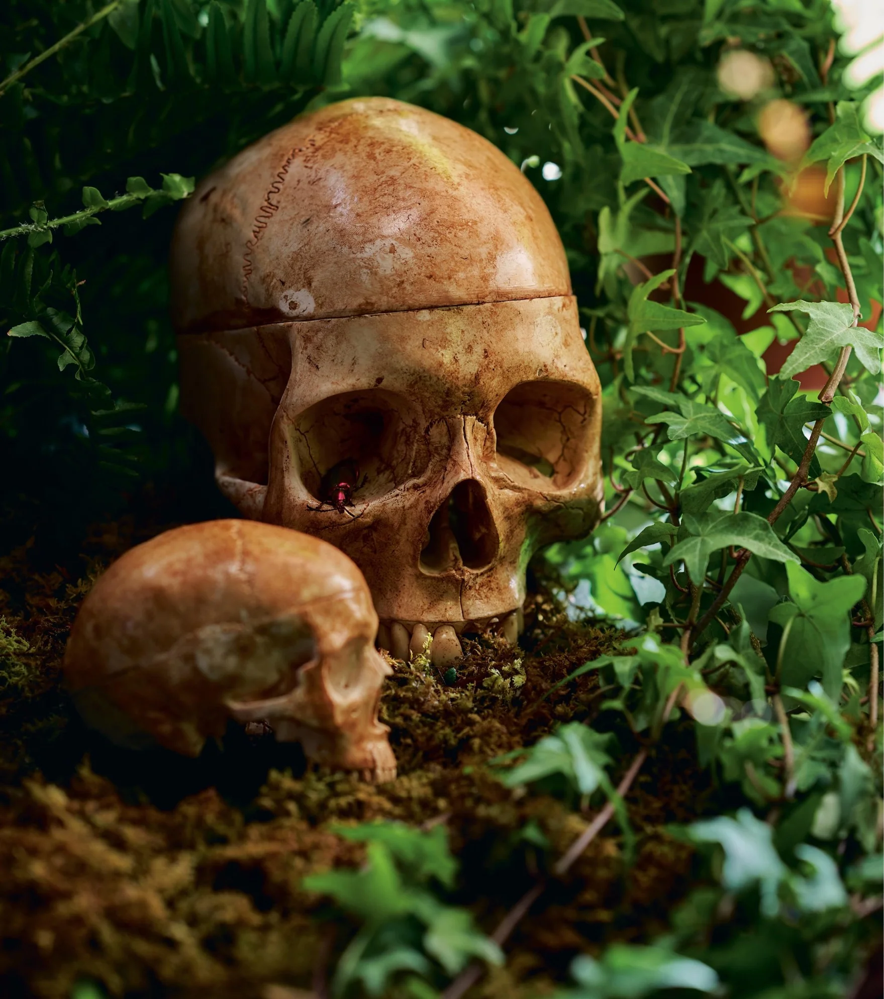

### Purple Grapemash No. 3

Barovia is known for many things, its wine among them. The Wizard of Wines Vineyard is legendary for producing some of the finest wines throughout the planes and multiverse, such as the full-bodied Red Dragon Crush and the crisp Champagne du le Stomp. But not all wines that emerge from the mists of Barovia are of equal quality, as evidenced by the existence of Purple Grapemash No. 3. Priced at only three copper pieces per pint at most local taverns and other Domains of Dread, this table wine is known to be spectacularly unremarkable. However, in some areas of the Shadowfell, clever mixologists have added copious amounts of ice and lime juice to the pungent grape-ish mix, turning this otherwise mediocre concoction into a refreshing, slushy treat worth at least four copper pieces anywhere.

<table class="rd__b-special rd__b-data  rd__b-data--stats">
		<thead>
			<tr>
				<th class="rd__data-embed-header ve-text-left" colspan="6" data-rd-data-embed-header="true">
					

						

							Purple Grapemash No. 3
							
						

						[–]
					

				</th>
			</tr>
		</thead><tbody class="" data-rd-embedded-data-render-target="true"><tr>
			<td colspan="6" data-rd-tag="recipe" data-rd-uid="Purple Grapemash No. 3|HFFotM" data-rd-page="recipes.html" data-rd-source="HFFotM" data-rd-hash="purple%20grapemash%20no.%203_hffotm" data-rd-name="Purple Grapemash No. 3" data-rd-display-name="Purple Grapemash No. 3" data-rd-style="" data-rd-entry-data="{}">
				<i>Loading <a href="recipes.html#purple%20grapemash%20no.%203_hffotm"  onmouseover="Renderer.hover.pHandleLinkMouseOver(event, this)" onmouseleave="Renderer.hover.handleLinkMouseLeave(event, this)" onmousemove="Renderer.hover.handleLinkMouseMove(event, this)" onclick="Renderer.hover.handleLinkClick(event, this)" onwheel="Renderer.hover.handleLinkWheel(event, this)" ondragstart="Renderer.hover.handleLinkDragStart(event, this)" data-vet-page="recipes.html" data-vet-source="HFFotM" data-vet-hash="purple%20grapemash%20no.%203_hffotm" ontouchstart="Renderer.hover.handleTouchStart(event, this)" >Purple Grapemash No. 3</a>...</i>
				
			</td>
		</tr></tbody></table>

------

# Sigil

Having barely escaped Chahd's cruelty in RAVENLOFT, and with the help of Tyr's holy servant, our heroes fling themselves through secret portals and magical gateways of the multiversal planescape into SIGIL, the fabled CITY OF DOORS!

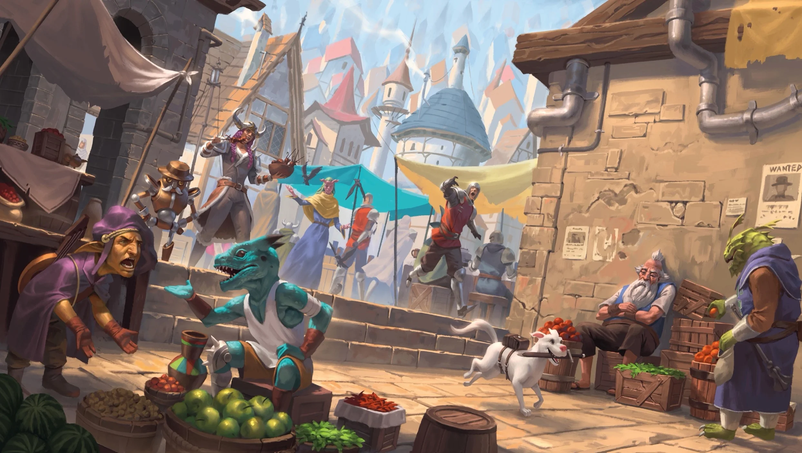

>
>
>Treason. Doors, and more doors. But the final door, fearful reader, has been finally unbolted to the darkest basement in a goblin's heart.
>
>On yesternight, Bri'An, fresh from his miracle, plucked Dint from the ruined spelljammer, and piously unburdened a (surprising) meal of gemstone treasures into Dint's greedy gullet. Sparked to life did Dint angrily, and with shaking fist, coughed indignities meant to soil our honor!
>
>And then HE RAN! "AFTER HIM!" I cried!
>
>And would'st thou be shocked to learn that Dint KNEW PRECISELY how to flee the mist-shrouded lands where Chahd's treason and Dint's betrayal make spouse, wedded in unholy union against us. But now, through many portals of smoke and magic and strange hidden doors, we hath apprehended he! Seized Dint, our tormentor!
>
>It is now under the topsies and turvies of the strangest city, in a dank morgue cellar, that Dint awaits justice, strapped thusly in a chair by iron rings in this cold forgotten vault. Here, the flames of treason burn dimly, and for the last time, in the glassy lenses of Dint's mocking helmet.
>
>
>
>Squirladax has lost it. He's currently...fighting a mop, tugging at its moppy hairs!
>
>
>
>I have powdered with flour Squirladax's mop-wig. He now has the countenance of a distinguished minister of a house of justice. We now defer to the traditions of the legal system!
>
>Followed by execution of Dint. Obviously.
>
>
>
>ON THIS DAY, YEAR OF TYR'S JUDGMENT, TODAY, THE TRIAL OF DINT THE BETRAYER, MASTER OF TREASON, SHALL NOW BEGIN. WE WILL COMMENCE BY REMOVING THE BRONZE PLATEMAIL OF THE BETRAYER SO THAT A PURIFYING FLAMBEAU MAY BE APPLIED TO HIS SOOTED TONGUE TO BURN THE LIES FROM OUT HIS MOUTH! IN TYR'S NAME!
>
>
>
>I delighted at the prospect of whispering Dint's soul to the Nine Hells, but now I am aghast, as the peeling of the bronze helm yields a CLOCKWORK MAN! An autognome with many gyres and gears for guts!
>
>"More lies!" screams forth Judge Squirladax, "as Dint assured us that he was an 'Otter Gnome'!"
>
>Hardly surprising that the Master of Treason has neither otter nor gnome inside his bronze skull! Heretic! BURN HE NOW WITH THE FIRES OF THE RAVEN QUEEN!
>
>.... Which I would summon were I not still vexed.
>
>Many damns upon you, Chahd!
>
>
>
>And so 'twas that Tyr's uneasy servant watched that Judge Squirladax called forth his first witness, "Dint. Architect of Treason, Master of Puppets," as christened by our judge and leader.
>
>"Did not you, so-called 'Otter Gnome,' promise us FIVE ASTRAL DIAMONDS in payment of our questing?!"
>
>And so rasped Dint, "Yes, goblin. But as the QUATERNATE TETRAD was not delivered to the customer, Master Chahd surely bequeathed a ONE. ASTRAL. DIAMOND. REVIEW."
>
>"Ah! And you think you can abate the wrath of my RIGHTEOUS JUDGMENT by HIDING THIS DIAMOND? WHEREFORE 'TIS IT, PUPPET MASTER? I WILL HAVE THE TRUTH!" howled Judge Squirladax.
>
>...All this talk of truth.
>
>
>
>Ah! I have called lunch break, and I mull over my next inquisitings as we feast on Bacon-Wrapped Smoked Mussels and Fried Bread and Spices in pursuit of justice. Chahd the Betrayer of Deelia. Dint, the Puppet Master. Her **betrayer** linked to the strings of mine own **tormentor**. It all makes sense now, and as Dint puppeteers with malice, so too do I pull the strings righteously of my own companions.
>
>Both us, short in stature. Both puppeteers. Dint is shadowy twin to mine self, thus making him my ARCH-NEMESIS. And how special a thing 'tis to have one's arch-nemesis in shackles and at the mercy of justice?
>
>To think I ever felt guilt over having killed him.
>
>I now drink this smoldering cup of Kaeth in exaltation. I think I shall have Sasha press the truth from him when we return.
>
>
>
>Tyr forgive me, for I could not stand by any longer! Deelia whooped many screeches of delight as Squirladax demanded back-breaking toils!
>
>With every question, supine Sasha from a bench did press the poor squeaking Otter Gnome up off her chest in repetitions of eight! With Sasha suffering, now swollen armed and sopping, I knew I must act!
>
>"BY TYR! I POISONED MYSELF!" I cried.
>
>This did'st stop the screams and pressings.
>
>"Poisoned we Dint first, with chippèd Ruby!" I howled.
>
>This did'st earn a measure of widening from the judgmental goblin eyes!
>
>"And FINALLY, did'st Tyr not witness our deception?! We are no Tetrad as we promised Dint!"
>
>A shamed silence fell about every soul in that basement.
>
>"Chahd withheld the Astral Diamonds because of OUR LIES! And if Dint has but one diamond, and this be HIS VERY FOOD....
>
>A look of shame manifested on Deelia's demonic features.
>
>"If we point greasy finger at HE, after our sumptuous lunching, might three equally greasy fingers be pointed back...at thee?!"
>
>And Tyr looked and saw...
>
>'Twas food for thinking.
>
>
>
>Weeks have passèd since Dint's acquittal. 'Twas not finest my moment, but the legal system provèd sound and justice 'twas served. And served us well it did as we now swim in ASTRAL DIAMONDS! Twenty and one by my count!
>
>How-fore thus?
>
>Dint. He is a Fetch/Carry Questor. A deliverer of foods. Quest us with, say, Fire-Wrapped Golden Fish and bid us deliver these morsels to an address and so it shall be done. As reward, we accumulate Astral Diamonds. Now, plainly I have yet to caress one in mine own hand, but Dint's ledgers mark their birth, and we must first earn back a sum of diamonds equivalent to purchase he a new spelljammer to replace the demolished Dashor. Until then, deliver we the finest foods about the extra-planar bustle of Sigil, the mad City of Doors! I slow about the Great Bazaar of Sigil as Chirper's Sugar Biscuits beckon my goblin nose with the aromas of other-worldly spices.
>
>I judgèd Dint a dark puppeteer. He is, instead, a kindly, and I think senseless, "Ahh—Tah—Muh—Tahn," what 'ere that is. But what am I, pulling at my minions' strings with glee?
>
>Is this not my job?!...Why then does regret bitterly season my biscuits?
>
>
>
>Tyr be praised! This band coins Astral Diamonds like a mint! Who knew piety could be so profitable! I ripped a sandwich in twain with my grinning fangs, then hurled the other half at a residential door! A TWENTY SECOND Astral Diamond is born! Huzzah!
>
>
>
>Upon review of *Dungeons & Dining Digest*, that most authoritative periodical of culinary happenings, we have accrued twenty-two **One Astral Diamond Reviews**. Business is Non-Functional.
>
>The squat cleric is egregious in his failed deliveries. I explain that a ONE DIAMOND RATING is FAILURE! He quips back "Tyr's bird is grasped in hand, and I care not how many twobirds lie in the bushels."
>
>I calculate that our gross receipts equal 12 gold pieces. At this rate it will take two thousand and seventy-eight Sigil years to purchase a new spelljammer.
>
>I am ruined.
>
>
>
>The Shadowfell 'tis real. I whispered a soul to the afterlife, and so did'st my Queen smile. Will there be peace for me? Why then is there no fire in my breast? Why can'st I, even now, summon a drooping spark to warm the Emerald Chicken that I journey to deliver?
>
>UGH! Be-cause VEXED!
>
>Sour memories rise to torment me. My unjust expulsion from Shadow's Edge Academy. I only lit the kitchen of Shadow's Edge ablaze...Well, in truth the whole of the academy **IS** a kitchen. Shadow's Edge is a culinary magic academy, of course! The abyssal secrets of the sweetest meats and cheeses, it once held. The physical building no longer remains, however. Nor any trace. 'Tis the truth of fire.
>
>Also true is that Chad betrayed me! Fled he wailing from the inferno, howling for the aid of the Shadow's Edge Lords! Whining, burning child! Tattler of tales!
>
>How dare he! "Fiery Fingers," he taunts even now in my dreams! Curse he, pretender to vampire peer groups! He vexes me from his seat of house-sitting power in the very Shadowfell I wish to return to. Untouched and untouchable, he steals my flame from me even now.
>
>Vexed.
>
>
>
>Demands! Dint has been trying to puppet master me into, get this, not tasting the foods that we deliver! First, he was all "You have to be on time!" And that's hard in the City of Doors! Cuz, if you walk through the wrong door, then you're like surrounded by this huge battle—a ranger and his party fighting a one-horned mage to save a baby unicorn, the cavalier wailing for help! Screw that! You run! Finally FIND the door, but it's NOT the door! It's a big, fake dragon head thing at a bizarro carnival!...So, turn back, right?
>
>"You have to be on time!" but you're famished. So...you take a teeny little nibble, and you're a teeny, little late!
>
>Squirladax says that food tasters were things that ROYALTY LOVED! We should be charging extra!
>
>
>
>ATTACKÈD! Tyr forgive me! Sasha and I were about to celebrate our twenty-third Astral Diamond over some Sensate Palate Cleanser when ghastly skeletons boiled up from sewer plates, clambered clickity out of windows and from miasmal alleyways! By Tyr, I could see the purple and red velveteen cape, standing atop a dark minaret, a pate of pasted blonde hair, smiling brighter than even the skeletal hordes! Chahd!
>
>Sasha looked to me, a glittering hope upon her scabbèd, leech-suckèrd face.
>
>And thusly I drew my holy hammer and spoke the words of Tyr's holy turning!
>
>...Nothin'. At all. And Sasha saw.
>
>We ran.
>
>And we've been found out.... I'm found out. I'm just a worthless chum-robbing thief.
>
>
>
>Unslacken your packs on your backs! Time has come to flee this realm! Chahd the Betrayer has found us, and in blind, shrieking panic born anew, I must lead my band madly spilling through a desperate choosing of doors.
>

### Sensate Palate Cleanser

The appetite of the Society of Sensation knows no bounds: they are the ultimate explorers of experience, which takes them to the extremes of the palate. But the unfamiliar can only really be tasted against the baseline of the common. The Sensates lighted on the free cucumber soup that came with a cheap inn room at the Slumbering Lamb in Sigil as the perfect neutral reference points for embarking on a culinary adventure. Area taverns catering to this clientele turned this dish into a chilled leek-and-cucumber-based puree. Even for those without the restless curiosity of a Sensate, this smooth and mild soup is a refreshing appetizer no matter where it's consumed.

<table class="rd__b-special rd__b-data  rd__b-data--stats">
		<thead>
			<tr>
				<th class="rd__data-embed-header ve-text-left" colspan="6" data-rd-data-embed-header="true">
					

						

							Sensate Palate Cleanser
							
						

						[–]
					

				</th>
			</tr>
		</thead><tbody class="" data-rd-embedded-data-render-target="true"><tr>
			<td colspan="6" data-rd-tag="recipe" data-rd-uid="Sensate Palate Cleanser|HFFotM" data-rd-page="recipes.html" data-rd-source="HFFotM" data-rd-hash="sensate%20palate%20cleanser_hffotm" data-rd-name="Sensate Palate Cleanser" data-rd-display-name="Sensate Palate Cleanser" data-rd-style="" data-rd-entry-data="{}">
				<i>Loading <a href="recipes.html#sensate%20palate%20cleanser_hffotm"  onmouseover="Renderer.hover.pHandleLinkMouseOver(event, this)" onmouseleave="Renderer.hover.handleLinkMouseLeave(event, this)" onmousemove="Renderer.hover.handleLinkMouseMove(event, this)" onclick="Renderer.hover.handleLinkClick(event, this)" onwheel="Renderer.hover.handleLinkWheel(event, this)" ondragstart="Renderer.hover.handleLinkDragStart(event, this)" data-vet-page="recipes.html" data-vet-source="HFFotM" data-vet-hash="sensate%20palate%20cleanser_hffotm" ontouchstart="Renderer.hover.handleTouchStart(event, this)" >Sensate Palate Cleanser</a>...</i>
				
			</td>
		</tr></tbody></table>
### Fried Bread and Spices

Some believe that everything is better fried. Whether or not you agree, you wouldn't want to miss out on Fried Bread and Spices available at most taverns in the Lower Ward of Sigil. A popular breakfast staple on the planets Oerth, Toril, and Krynn, it is often served with poached eggs. The version most common in the City of Doors includes a unique seasoning mixture that borrows from all of them, with hints of cumin, coriander, cayenne, and even fennel. Whatever is in it, it's sure to brighten your meal, your day, and your journey onto the next plane.

<table class="rd__b-special rd__b-data  rd__b-data--stats">
		<thead>
			<tr>
				<th class="rd__data-embed-header ve-text-left" colspan="6" data-rd-data-embed-header="true">
					

						

							Fried Bread and Spices
							
						

						[–]
					

				</th>
			</tr>
		</thead><tbody class="" data-rd-embedded-data-render-target="true"><tr>
			<td colspan="6" data-rd-tag="recipe" data-rd-uid="Fried Bread and Spices|HFFotM" data-rd-page="recipes.html" data-rd-source="HFFotM" data-rd-hash="fried%20bread%20and%20spices_hffotm" data-rd-name="Fried Bread and Spices" data-rd-display-name="Fried Bread and Spices" data-rd-style="" data-rd-entry-data="{}">
				<i>Loading <a href="recipes.html#fried%20bread%20and%20spices_hffotm"  onmouseover="Renderer.hover.pHandleLinkMouseOver(event, this)" onmouseleave="Renderer.hover.handleLinkMouseLeave(event, this)" onmousemove="Renderer.hover.handleLinkMouseMove(event, this)" onclick="Renderer.hover.handleLinkClick(event, this)" onwheel="Renderer.hover.handleLinkWheel(event, this)" ondragstart="Renderer.hover.handleLinkDragStart(event, this)" data-vet-page="recipes.html" data-vet-source="HFFotM" data-vet-hash="fried%20bread%20and%20spices_hffotm" ontouchstart="Renderer.hover.handleTouchStart(event, this)" >Fried Bread and Spices</a>...</i>
				
			</td>
		</tr></tbody></table>

### Beer Bread

Many eateries across the multiverse claim to have the best beer-bread recipe, but Fortune's Wheel, an upscale canteen in Sigil's aristocratic Lady's Ward, really does. Any bread with beer in the dough is considered a beer bread, and the results are usually as middling as the common brew. However, this recipe from Fortune's Wheel yields a moist and chewy loaf that is bound to become a mealtime staple on any dinner table. Different types of beer yield distinctive flavors of bread and, depending on the varietal, it may even add leavening to the baking process, changing the ultimate density of the loaf. But regardless of the beer you choose (the Fortune's Wheel uses a dark, dry stout), it's all about the quality of the batter.

<table class="rd__b-special rd__b-data  rd__b-data--stats">
		<thead>
			<tr>
				<th class="rd__data-embed-header ve-text-left" colspan="6" data-rd-data-embed-header="true">
					

						

							Beer Bread
							
						

						[–]
					

				</th>
			</tr>
		</thead><tbody class="" data-rd-embedded-data-render-target="true"><tr>
			<td colspan="6" data-rd-tag="recipe" data-rd-uid="Beer Bread|HFFotM" data-rd-page="recipes.html" data-rd-source="HFFotM" data-rd-hash="beer%20bread_hffotm" data-rd-name="Beer Bread" data-rd-display-name="Beer Bread" data-rd-style="" data-rd-entry-data="{}">
				<i>Loading <a href="recipes.html#beer%20bread_hffotm"  onmouseover="Renderer.hover.pHandleLinkMouseOver(event, this)" onmouseleave="Renderer.hover.handleLinkMouseLeave(event, this)" onmousemove="Renderer.hover.handleLinkMouseMove(event, this)" onclick="Renderer.hover.handleLinkClick(event, this)" onwheel="Renderer.hover.handleLinkWheel(event, this)" ondragstart="Renderer.hover.handleLinkDragStart(event, this)" data-vet-page="recipes.html" data-vet-source="HFFotM" data-vet-hash="beer%20bread_hffotm" ontouchstart="Renderer.hover.handleTouchStart(event, this)" >Beer Bread</a>...</i>
				
			</td>
		</tr></tbody></table>
### Bacon-Wrapped Smoked Mussels

Sigil's lively marketplaces are brimming with strange, fresh meats and fish imported from across the greater multiverse. These expansive emporiums are an overwhelming explosion of scents, textures, colors, and flavors, not only making them a chef's dream but a breeding ground for new culinary ideas. Bacon-Wrapped Smoked Mussels is one such intrinsically Sigil meal on offer in many of the city's six wards. While the combination of pork and mollusk might seem unusual, this atypical culinary marriage is what makes the meal uniquely Sigil. An inspired combination of surf and turf, this dish has made its way across the multiverse as far as the Cutlass of Luskan on Toril, where fresh mussels are harvested in droves from the Sea of Swords, while the cured bacon is brought in almost daily from Mirabar via the River Mirar.

<table class="rd__b-special rd__b-data  rd__b-data--stats">
		<thead>
			<tr>
				<th class="rd__data-embed-header ve-text-left" colspan="6" data-rd-data-embed-header="true">
					

						

							Bacon-Wrapped Smoked Mussels
							
						

						[–]
					

				</th>
			</tr>
		</thead><tbody class="" data-rd-embedded-data-render-target="true"><tr>
			<td colspan="6" data-rd-tag="recipe" data-rd-uid="Bacon-Wrapped Smoked Mussels|HFFotM" data-rd-page="recipes.html" data-rd-source="HFFotM" data-rd-hash="bacon-wrapped%20smoked%20mussels_hffotm" data-rd-name="Bacon-Wrapped Smoked Mussels" data-rd-display-name="Bacon-Wrapped Smoked Mussels" data-rd-style="" data-rd-entry-data="{}">
				<i>Loading <a href="recipes.html#bacon-wrapped%20smoked%20mussels_hffotm"  onmouseover="Renderer.hover.pHandleLinkMouseOver(event, this)" onmouseleave="Renderer.hover.handleLinkMouseLeave(event, this)" onmousemove="Renderer.hover.handleLinkMouseMove(event, this)" onclick="Renderer.hover.handleLinkClick(event, this)" onwheel="Renderer.hover.handleLinkWheel(event, this)" ondragstart="Renderer.hover.handleLinkDragStart(event, this)" data-vet-page="recipes.html" data-vet-source="HFFotM" data-vet-hash="bacon-wrapped%20smoked%20mussels_hffotm" ontouchstart="Renderer.hover.handleTouchStart(event, this)" >Bacon-Wrapped Smoked Mussels</a>...</i>
				
			</td>
		</tr></tbody></table>
### Chickpea and Spicy Sausage Soup

Serving equally well as a solo course or as a starter paired with a lighter main, Chickpea and Spicy Sausage Soup is a hearty, delicious, protein-filled potage. As served in Sigil, this soup incorporates Sweet Larissa's sausages, imported from Plague-Mort—the less you know about how she makes them the better. But one thing you will know is she makes them hot: with the sort of spices mortals should avoid unless in ethereal form. The chickpeas offer a starchy and earthy sanctuary from the oily, spicy sausage and red pepper flakes, all of it swimming in a garlicky chicken broth, flavored with tomato. Common variations on this dish introduce tarragon for a pungent and inspired twist on the classic. Although widely available, and often considered a meal for the masses, this is nonetheless a delectable soup that has rightfully earned its place in the heart of many citizens of the greater multiverse.

<table class="rd__b-special rd__b-data  rd__b-data--stats">
		<thead>
			<tr>
				<th class="rd__data-embed-header ve-text-left" colspan="6" data-rd-data-embed-header="true">
					

						

							Chickpea and Spicy Sausage Soup
							
						

						[–]
					

				</th>
			</tr>
		</thead><tbody class="" data-rd-embedded-data-render-target="true"><tr>
			<td colspan="6" data-rd-tag="recipe" data-rd-uid="Chickpea and Spicy Sausage Soup|HFFotM" data-rd-page="recipes.html" data-rd-source="HFFotM" data-rd-hash="chickpea%20and%20spicy%20sausage%20soup_hffotm" data-rd-name="Chickpea and Spicy Sausage Soup" data-rd-display-name="Chickpea and Spicy Sausage Soup" data-rd-style="" data-rd-entry-data="{}">
				<i>Loading <a href="recipes.html#chickpea%20and%20spicy%20sausage%20soup_hffotm"  onmouseover="Renderer.hover.pHandleLinkMouseOver(event, this)" onmouseleave="Renderer.hover.handleLinkMouseLeave(event, this)" onmousemove="Renderer.hover.handleLinkMouseMove(event, this)" onclick="Renderer.hover.handleLinkClick(event, this)" onwheel="Renderer.hover.handleLinkWheel(event, this)" ondragstart="Renderer.hover.handleLinkDragStart(event, this)" data-vet-page="recipes.html" data-vet-source="HFFotM" data-vet-hash="chickpea%20and%20spicy%20sausage%20soup_hffotm" ontouchstart="Renderer.hover.handleTouchStart(event, this)" >Chickpea and Spicy Sausage Soup</a>...</i>
				
			</td>
		</tr></tbody></table>
### Fire-Wrapped Golden Fish

While Sigil's Great Bazaar is perhaps the most famous market in the known multiverse—a vibrant conflux of cultures and cuisines—this self-proclaimed "city at the center of the multiverse" also boasts countless storefronts and street bazaars, offering equally rare and exciting gastronomy. Fire-Wrapped Golden Fish is one such inexpensive delicacy, readily acquired in the Lower Ward or the more destitute Hive Ward. As quick to fry as it is to consume, this chili-and-cayenne-tinged, batter-fried white fish is a feast for the taste buds. Best served sizzling-hot, straight from the pan, wrapped in locally cultivated lettuce or a flatbread for easy ingestion en route to the next plane.

<table class="rd__b-special rd__b-data  rd__b-data--stats">
		<thead>
			<tr>
				<th class="rd__data-embed-header ve-text-left" colspan="6" data-rd-data-embed-header="true">
					

						

							Fire-Wrapped Golden Fish
							
						

						[–]
					

				</th>
			</tr>
		</thead><tbody class="" data-rd-embedded-data-render-target="true"><tr>
			<td colspan="6" data-rd-tag="recipe" data-rd-uid="Fire-Wrapped Golden Fish|HFFotM" data-rd-page="recipes.html" data-rd-source="HFFotM" data-rd-hash="fire-wrapped%20golden%20fish_hffotm" data-rd-name="Fire-Wrapped Golden Fish" data-rd-display-name="Fire-Wrapped Golden Fish" data-rd-style="" data-rd-entry-data="{}">
				<i>Loading <a href="recipes.html#fire-wrapped%20golden%20fish_hffotm"  onmouseover="Renderer.hover.pHandleLinkMouseOver(event, this)" onmouseleave="Renderer.hover.handleLinkMouseLeave(event, this)" onmousemove="Renderer.hover.handleLinkMouseMove(event, this)" onclick="Renderer.hover.handleLinkClick(event, this)" onwheel="Renderer.hover.handleLinkWheel(event, this)" ondragstart="Renderer.hover.handleLinkDragStart(event, this)" data-vet-page="recipes.html" data-vet-source="HFFotM" data-vet-hash="fire-wrapped%20golden%20fish_hffotm" ontouchstart="Renderer.hover.handleTouchStart(event, this)" >Fire-Wrapped Golden Fish</a>...</i>
				
			</td>
		</tr></tbody></table>
### Emerald Chicken

It is fact that the only way in or out of Sigil is through one of the city's innumerable portals. It is also fact that while in Sigil, one must try the famous Emerald Chicken. Gifted its name from the splash of chopped greens, intermingled with chunks of fowl, chicken livers, onions, and a strong dash of incendiary spices, Emerald Chicken demands an adventurous palate—it was originally made for tieflings with fiendspices—and a cool glass of ale to quench the burn. A milder version became famous in far-off Purskul, on Toril, in eateries such as the Owlroost Head.

<table class="rd__b-special rd__b-data  rd__b-data--stats">
		<thead>
			<tr>
				<th class="rd__data-embed-header ve-text-left" colspan="6" data-rd-data-embed-header="true">
					

						

							Emerald Chicken
							
						

						[–]
					

				</th>
			</tr>
		</thead><tbody class="" data-rd-embedded-data-render-target="true"><tr>
			<td colspan="6" data-rd-tag="recipe" data-rd-uid="Emerald Chicken|HFFotM" data-rd-page="recipes.html" data-rd-source="HFFotM" data-rd-hash="emerald%20chicken_hffotm" data-rd-name="Emerald Chicken" data-rd-display-name="Emerald Chicken" data-rd-style="" data-rd-entry-data="{}">
				<i>Loading <a href="recipes.html#emerald%20chicken_hffotm"  onmouseover="Renderer.hover.pHandleLinkMouseOver(event, this)" onmouseleave="Renderer.hover.handleLinkMouseLeave(event, this)" onmousemove="Renderer.hover.handleLinkMouseMove(event, this)" onclick="Renderer.hover.handleLinkClick(event, this)" onwheel="Renderer.hover.handleLinkWheel(event, this)" ondragstart="Renderer.hover.handleLinkDragStart(event, this)" data-vet-page="recipes.html" data-vet-source="HFFotM" data-vet-hash="emerald%20chicken_hffotm" ontouchstart="Renderer.hover.handleTouchStart(event, this)" >Emerald Chicken</a>...</i>
				
			</td>
		</tr></tbody></table>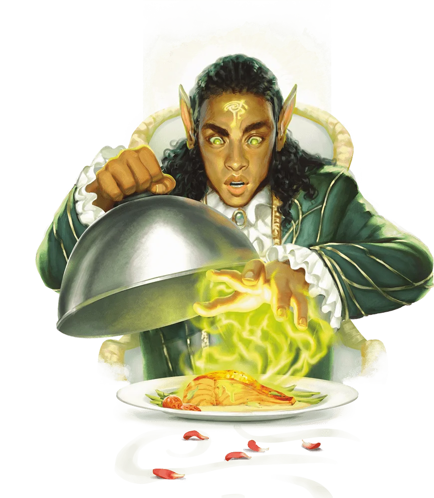

### Harmonious Barracks Meatloaf

If you intend to police the chaotic streets of Sigil, it's best not to do it on an empty stomach. The warriors of the Harmonium are deeply dedicated to keeping order but are perhaps not so adventuresome in their tastes, so this rich, filling meal-in-itself will keep a soldier on the march for hours on end. Heaps of it are hot and plentiful in their barracks in the Lady's Ward. To maximize its proteins, this dish includes not just lamb but a medley of meats, which gives it its distinctive, hearty flavor. Ironically, a certain quantity of this meatloaf somehow finds its way into the hands of street vendors—this is, after all, a town where everyone finds a way to turn a quick profit.

<table class="rd__b-special rd__b-data  rd__b-data--stats">
		<thead>
			<tr>
				<th class="rd__data-embed-header ve-text-left" colspan="6" data-rd-data-embed-header="true">
					

						

							Harmonious Barracks Meatloaf
							
						

						[–]
					

				</th>
			</tr>
		</thead><tbody class="" data-rd-embedded-data-render-target="true"><tr>
			<td colspan="6" data-rd-tag="recipe" data-rd-uid="Harmonious Barracks Meatloaf|HFFotM" data-rd-page="recipes.html" data-rd-source="HFFotM" data-rd-hash="harmonious%20barracks%20meatloaf_hffotm" data-rd-name="Harmonious Barracks Meatloaf" data-rd-display-name="Harmonious Barracks Meatloaf" data-rd-style="" data-rd-entry-data="{}">
				<i>Loading <a href="recipes.html#harmonious%20barracks%20meatloaf_hffotm"  onmouseover="Renderer.hover.pHandleLinkMouseOver(event, this)" onmouseleave="Renderer.hover.handleLinkMouseLeave(event, this)" onmousemove="Renderer.hover.handleLinkMouseMove(event, this)" onclick="Renderer.hover.handleLinkClick(event, this)" onwheel="Renderer.hover.handleLinkWheel(event, this)" ondragstart="Renderer.hover.handleLinkDragStart(event, this)" data-vet-page="recipes.html" data-vet-source="HFFotM" data-vet-hash="harmonious%20barracks%20meatloaf_hffotm" ontouchstart="Renderer.hover.handleTouchStart(event, this)" >Harmonious Barracks Meatloaf</a>...</i>
				
			</td>
		</tr></tbody></table>
### Chirper's Sugar Biscuits

No matter what you order at Chirper's in the Market Ward of Sigil—from the Niflheim stag ribs to the slaad legs—the sugar biscuits are a complimentary finale. Whether you came for the dancing, the Seawind theater, an art exhibition, or just a quick visit to gawk at the Skull Museum, it is always worth grabbing a bite at Chirper's for the dessert alone. Acquiring the Bytopian chestnuts required to make the puffy dough might require planar travel, but primes can approximate the right taste by adding some cinnamon and cardamom to the mix. Best served with honey as a dip for an extra dash of decadence.

<table class="rd__b-special rd__b-data  rd__b-data--stats">
		<thead>
			<tr>
				<th class="rd__data-embed-header ve-text-left" colspan="6" data-rd-data-embed-header="true">
					

						

							Chirper's Sugar Biscuits
							
						

						[–]
					

				</th>
			</tr>
		</thead><tbody class="" data-rd-embedded-data-render-target="true"><tr>
			<td colspan="6" data-rd-tag="recipe" data-rd-uid="Chirper&apos;s Sugar Biscuits|HFFotM" data-rd-page="recipes.html" data-rd-source="HFFotM" data-rd-hash="chirper&apos;s%20sugar%20biscuits_hffotm" data-rd-name="Chirper&apos;s Sugar Biscuits" data-rd-display-name="Chirper&apos;s Sugar Biscuits" data-rd-style="" data-rd-entry-data="{}">
				<i>Loading <a href="recipes.html#chirper&apos;s%20sugar%20biscuits_hffotm"  onmouseover="Renderer.hover.pHandleLinkMouseOver(event, this)" onmouseleave="Renderer.hover.handleLinkMouseLeave(event, this)" onmousemove="Renderer.hover.handleLinkMouseMove(event, this)" onclick="Renderer.hover.handleLinkClick(event, this)" onwheel="Renderer.hover.handleLinkWheel(event, this)" ondragstart="Renderer.hover.handleLinkDragStart(event, this)" data-vet-page="recipes.html" data-vet-source="HFFotM" data-vet-hash="chirper&apos;s%20sugar%20biscuits_hffotm" ontouchstart="Renderer.hover.handleTouchStart(event, this)" >Chirper's Sugar Biscuits</a>...</i>
				
			</td>
		</tr></tbody></table>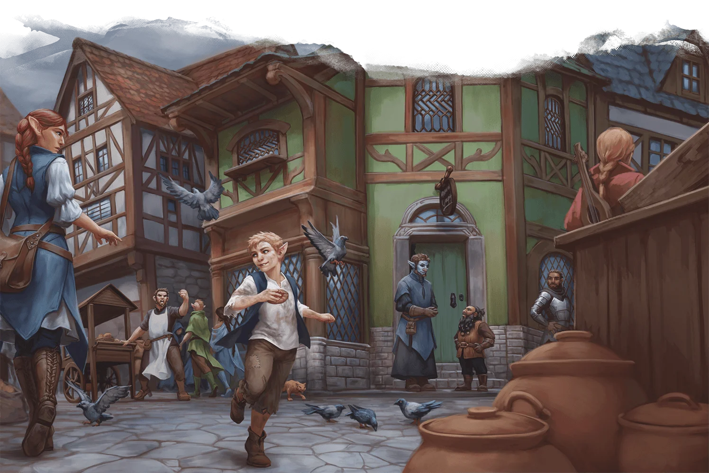

### Silverfruit Pie

Let it be known, silverfruit, also known as lychee or soapberry, makes for a truly heavenly pie. This medium-size, pink-skinned berry is known for being especially crisp and juicy, with hints of citrus and a floral aroma. But as a pie filling it's surprisingly creamy and custard-like, and it pairs wonderfully with a toasted, flaky crust. The Golden Bariaur Inn (in Sigil's Lady's Ward), which caters to highfalutin clientele from the Upper Planes, serves an astoundingly good slice of this silky dessert. Since Sigil has no natural resources, silverfruit is one of the many uniquely curated imports from the vast array of worlds to which the greater metropolis provides access.

<table class="rd__b-special rd__b-data  rd__b-data--stats">
		<thead>
			<tr>
				<th class="rd__data-embed-header ve-text-left" colspan="6" data-rd-data-embed-header="true">
					

						

							Silverfruit Pie
							
						

						[–]
					

				</th>
			</tr>
		</thead><tbody class="" data-rd-embedded-data-render-target="true"><tr>
			<td colspan="6" data-rd-tag="recipe" data-rd-uid="Silverfruit Pie|HFFotM" data-rd-page="recipes.html" data-rd-source="HFFotM" data-rd-hash="silverfruit%20pie_hffotm" data-rd-name="Silverfruit Pie" data-rd-display-name="Silverfruit Pie" data-rd-style="" data-rd-entry-data="{}">
				<i>Loading <a href="recipes.html#silverfruit%20pie_hffotm"  onmouseover="Renderer.hover.pHandleLinkMouseOver(event, this)" onmouseleave="Renderer.hover.handleLinkMouseLeave(event, this)" onmousemove="Renderer.hover.handleLinkMouseMove(event, this)" onclick="Renderer.hover.handleLinkClick(event, this)" onwheel="Renderer.hover.handleLinkWheel(event, this)" ondragstart="Renderer.hover.handleLinkDragStart(event, this)" data-vet-page="recipes.html" data-vet-source="HFFotM" data-vet-hash="silverfruit%20pie_hffotm" ontouchstart="Renderer.hover.handleTouchStart(event, this)" >Silverfruit Pie</a>...</i>
				
			</td>
		</tr></tbody></table>
### Kaeth

Kaeth, or coffee, is an aromatic brew made from ground roasted beans and is famous for its invigorating properties, making it a prevalent day starter throughout the worlds of the multiverse. In Sigil, the City of Doors, planar sightseers can sample from a wide array of coffee beans and beverages from countless planets. Kaeth, as it is commonly called on the planet Toril, has developed into quite the delicacy along the Sword Coast, where it is now imported in droves. In the nation of Sembia, a popular method of preparation features a blend of melted chocolate and liquor. In some areas, kaeth is so popular that it has become more profitable than the tea trade. The peoples of the planet Krynn drink tarbean tea and kefre, both of which are derived from vibrant, dark-roasted beans and frequently served black. In contrast, citizens of the Outer Planes imbibe numerous spiced and creamed variants of kaeth, including the notable Mountain Majesty of Mount Celestia. On the planet Oerth, coffee trends more acidic and is frequently blended into creamy liquors to grant an extra kick. But perhaps the most notable, kav'la, in which creamed coconut milk is swirled into a malted, dark, nutty roast, is served in tall, ornate ceramic vessels and is easily found in the cultured bazaars of Sigil. Regardless of which varietal you choose, kaeth, in its endless forms, serves as a caffeine-infused pick-me-up, whether on the trail or in the safe confines of one's homestead.

<table class="rd__b-special rd__b-data  rd__b-data--stats">
		<thead>
			<tr>
				<th class="rd__data-embed-header ve-text-left" colspan="6" data-rd-data-embed-header="true">
					

						

							Kaeth
							
						

						[–]
					

				</th>
			</tr>
		</thead><tbody class="" data-rd-embedded-data-render-target="true"><tr>
			<td colspan="6" data-rd-tag="recipe" data-rd-uid="Kaeth|HFFotM" data-rd-page="recipes.html" data-rd-source="HFFotM" data-rd-hash="kaeth_hffotm" data-rd-name="Kaeth" data-rd-display-name="Kaeth" data-rd-style="" data-rd-entry-data="{}">
				<i>Loading <a href="recipes.html#kaeth_hffotm"  onmouseover="Renderer.hover.pHandleLinkMouseOver(event, this)" onmouseleave="Renderer.hover.handleLinkMouseLeave(event, this)" onmousemove="Renderer.hover.handleLinkMouseMove(event, this)" onclick="Renderer.hover.handleLinkClick(event, this)" onwheel="Renderer.hover.handleLinkWheel(event, this)" ondragstart="Renderer.hover.handleLinkDragStart(event, this)" data-vet-page="recipes.html" data-vet-source="HFFotM" data-vet-hash="kaeth_hffotm" ontouchstart="Renderer.hover.handleTouchStart(event, this)" >Kaeth</a>...</i>
				
			</td>
		</tr></tbody></table>

------

# The Feywild

TIME TO MAKE A STAND! Utilizing the astral gateways of Sigil, and pursued by CHAHD'S SKELETAL HORDES, our heroes retreat to THE FEYWILD to finally confront the villainous VAMPEER!

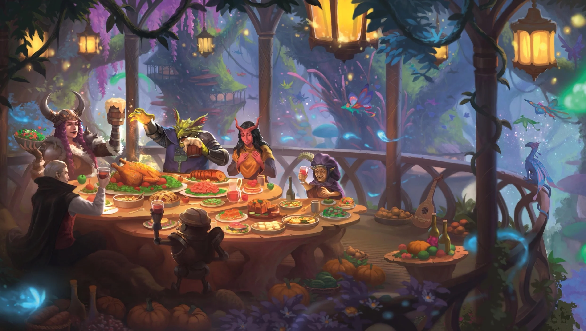

>
>
>If only a proper plan might spring from mine head-guts! Fleeing this City of Doors in terror stricken cowardice, we spring forth through the door once, only to spring backwards twice! A sandy hellscape! Door! A kingdom under the sea! And but always one door behind us, slender, pallid, skinless fiends sneering their death-mask smirks that nearly cry out from lipless teeth, "We know your idiocy!"
>
>Skeletons. With their diabolical sarcastic grins! And always, a velveteen capèd incubus with pasted yellow hair. Chahd, the Betrayer. Vampyr. Zounds! We must find a place to hide!
>
>Alas, my senses are assailed by cheery, cherry mists, flitting faerie feathers, and sweet winds that do breeze from welcoming vanilla skies. I have found the place I seek, and hence proclaimed unto my charge:
>
>"Friends! Behold the Feywild! Brightest twin to darkest Shadowfell. 'Tis here that Chahd and his undead minions will be weakest. 'Tis here, we will make our final stand."
>
>
>
>Tyr protect our flight, for in twinkling twilight, Dint's stubby, creaking legs lose pace with us. And as I fall back to assist, I fall back into shifty old Bri'An. True Bri'An, the one who wonders to himself why he bothers to talk this crappy, pious cleric talk. The one who notices the others are several paces ahead. The one who should break open Dint's bronze paunch, steal back his jewels, and be off before all is dead. And yet I don't do it.
>
>Dint snorts unhappily.
>
>
>
>My clockwork ticks with the tockings of bitterness. As I am not designed to resolve gnomish emotions, I find this tocking distressing.
>
>My business is ruined. My ticks and tocks want only of return...to my ruined spellship Dashor.
>
>
>
>Morning comes, and I sup upon Seelie Court Cheese and Potato Soup from this nameless eladrin inn we have sheltered in. The others are mortuarily quiet. I find my ears longing for the blubbering prattle that regularly sparks my contempt.
>
>Gaze I now through the window at a nearby hill, the ruined stump of an elven guard tower atop its peak. I think mournfully of Shadow's Edge.
>
>I have been to the afterlife, the Queen's Shadowfell, and this I know now to be a defect of that sublimely dreary place. Ne'er did I see a proper roadhouse! A place of feastings and...I don't know...dancing and merriment...for the Shadowfell I visited 'tis kind of a dump.
>
>Roadhouse, yes. You are the peace that could be born of a Shadow's Edge Cheflord.
>
>Of which I am not.
>
>Soon, Chahd's icy fingers will surely choke these warm thoughts from my soul.
>
>
>
>WOULD MY LIFE A BOOK, ALL CHAPTERS 'ERE BE NAMÈD "BETRAYED!" For it turns out that Bri'An 'twere NEVER ANY CLERIC OF TYR! Thief and scoundrel, patriarch of lies! Yet, even now, HE plays the card of SUFFERER, with weeping quiver upon the plates of his lying mouth-hole!
>
>From Sasha's eyes came a waterfall of tears, slipping her leech children off their ancestral cheek. She looked down yet always up to the stocky false Bri'An!
>
>OH, 'TIS GETS WORSE!
>
>For even as I write this, DINT now chimes with a glockenspiel of disloyalty!
>
>TAKE THIS I CANNOT!
>
>
>
>EVERYTHING GOES TO HELLS! Squirladax litigates a case for solidarity, but without his powdered mop-wig, the poor goblin's legal authority is robbed of him! As Bri'An's confessions of faithlessness slip a dagger into our ribs, the Otter Gnome slits our throats with a clanging RESIGNATION OF MEMBERSHIP from our Dark Tables!
>
>In a mighty roar that scattered Baked Goat Cheese upon the inn's polished floors, Squirladax howled thusly, "Returned thee, I see, to your Arch-Nemesis ways, have you?!"
>
>Dint choked dispassionately, "Death is certain for this Bureau. No logic nor assistance can I grant. I will return to Dashor now."
>
>"And what of precious, sparkling Diamonds?" wheezed Squirladax
>
>Dint puffed, "There are no Diamonds."
>
>A shock befell all.
>
>Kettled rage boiled in Squirladax, "KEEP YOUR DIAMONDS, MASTER OF TREASON! I will have no more sight of you!" And Squirladax fled to the outhouse to mourn.
>
>A quiet sadness. Bri'An, his scales soggy, fell to the bench.
>
>Then Sasha, ashen and saddest of all, laid buttery hand to Dint's bronze pauldron.
>
>Whispered she, "You only ever helped us, and as you return to your home, the lands where Otters and Gnomes live in harmony, know that, for you, there will always be treason in my heart."
>
>Dint is gone.
>
>
>
>Chahd is coming. Squirladax has not left the outhouse since yesterday. Deelia's been downing bottles of Saerloonian Glowfire at the inn. As I wander the grounds near the hill, I see Bri'An in the ruined tower gazing afar.
>
>If Squirladax believes Dint is junk and Bri'An is garbage, then what am I? I am a fraud. Just like Bri'An. I've read *Volo's Guide* so hard...sauced my limbs, bled myself dizzy, expanded my breath bellows to near popping, and raised a colony of leeches on my face...but I am no closer to becoming the warrior Squirladax needs.
>
>His gift of that book was wasted on me. I've failed my party. Again.
>
>
>
>This house of out reminds me of the Caves of Calmness.
>
>Pronounced strangely by not-goblins, the Caves were a soothing grotto of the mirthiest, most charitable goblinfolk one could ever randomly encounter.
>
>Raided we were, often, by bullying humanfolk, twisting my heart sour. Took they from us our treasures, not just of coin, but those of pride and stout-heartedness. Now I steal these treasures back, but from mine own minions...nay! My friends.
>
>Dint was right to leave.
>
>What's this I hear?
>
>"OHMUHGAHD!!!!!! UHHHHH MUHHHHHH GAAAAHHHHHHHHH!!!!!!"
>
>
>
>Spotted the skeletal bastards from the ruined tower, I did, and then calmly called out, "Gods! They come!" or something to that effect.
>
>Tyr then did grant my stubby limbs much speed and...nah he didn't.
>
>Suck I.
>
>Wait.... A goblin-man comes to rush me, his arms outstretched....
>
>
>
>WILL WE DIE? For certain! But punch we first?! NINE HELLS YES we will, on Chahd's stupidest of faces! This is the song stirred in me by the words just spoken!
>
>You see, sitting piggy about the back of Bri'An, Squirladax called UNTO US in a voice more powerful than ten irritating goblins!
>
>"Forces of the dreaded Shadowfell, prepare to march on this realm!"
>
>Sad Sasha was the first to answer: "But we have no front line! No adequate fighter!"
>
>OH QUEEN, tell no one that I was actually impressed when hated goblinman turned his beady eyes unto our forlorn hearts and pronounced with shrill grandeur.
>
>"Sasha! The mutilations you've inflicted upon thyself are greater than any wound of death! Thus, you are the mightiest WARRIOR...in easily like three miles!"
>
>Continued he, weaseling his logic upon our wills.
>
>"DEELIA! Your Queen shall smile at your noble stand against Orcus's minions! And you, UNHOLY AVENGER, shall burn Chahd's bones as kindling!"
>
>He then turned to the smallest dragon-man.
>
>"Bri'An. Your faith may be a lie, but my faith in you is not. Take up Tyr's banner one last time, old friend."
>
>TO WAR!
>
>
>
>WARFARE GUYYYSSS! Let me catch you up! So, there's this old watchtower ruin thing on this hill. That's HOMEBASE. Two paths up the hill to the tower, one NORTH, one SOUTH. Chahd is coming from the NORTH, so Deelia has ordered that we pepper the north slope.... WITH TRAPS, GUYS! TRAPS! Tripwires! Crossbows! SPIKED PITS! ISN'T THAT WICKED?
>
>The SOUTH slope is our escape route if things go sideways.
>
>HERE'S THE PLAN!
>
>The Bureau will stand upon the hill and "vex Chahd." Chahd, now "vexed," will surely release his skeletal minions charging up the hill...INTO THE TRAPS! THEN, we reveal our wrath, attacking viciously until we KILL us a FREAKING VAMPEER, which is, I guess, easier than killing a Vampire....
>
>But still, really cool!
>
>
>
>They come close, now, from the north. Some twenty strong...Against four.
>
>Tyr, I've never prayed to you before. Grant me righteous speed as 'twere it likely that mine friends will be flayed screaming and suckled alive at the snapping smiles of Skeletal Vampeergroup.
>
>A light rain now falls...which will only make my plated feet slippy.
>
>Uh...thanks Tyr.
>
>
>
>CHAHD AND HIS COLUMN OF DEATH HAVE ARRIVED!
>
>I must now draw him to mine trappèd field! Let a DUELING OF VEXES COMMENCE!
>
>Velveteen capèd Chahd, speaks with haughty loudness over the rains and spans betwixt us.
>
>"Ah, the Tasty Tetrad! Even now, I sauce and season your cadavers in my mind's kitchen, to be prepared tenderly and servèd...to my master."
>
>It is now, NOW that I unleash the vexing scornings of wit, "Never, betrayer! Bet I not that your master doesn't even dislike you!"
>
>Paused, did Chahd, as my vexing does take hold! Clearèd his throat, he croaks, "Do you sayeth...wait.... You are saying he likes me? Or that he doesn't like me? Because I can assure you—"
>
>"NO ONE LIKES YOU, CHAHD!," bellowed a presumptuous but not incorrect Sasha.
>
>Worn plainly on his stupid face, a perfect vexing achieved, we hold as he will surely now unleash his minions unto the slaughtering of our many traps before us!
>
>
>
>VEXÈD CHAHD does now **leisurely** lead his columns around from the north, circling our hill, and unto the SOUTH! The clear, trap-less passage to up here with us!
>
>Calls Chahd out, "Do you think I STUPID? Only a Shadow's Edge **novice** could reveal her machinations so! Let me to the guessing! Traps? Worry not, I shall be with you soon enough."
>
>All is lost, but for one last card in my Tarokka Deck. I shall weave inspiring bardic magic!
>
>Sasha asks if she is to hold the front line, whilst Deelia lays about damaging spells, and to Bri'An the restoration of vigor!
>
>Instead, I say:
>
>"Remember, my friends.
>
>There is truly only one rule in War!
>
>GO OUT THERE...
>
>...and just be yourself. Cuz that's...ya know...what they're looking for."
>
>And I can feel their hearts swell with braveness.
>
>Yet then, Chahd marches up from the south, and he did smile a wide toothèd grin, and by the GODS...
>
>HE HAD FANGS!
>

### Elven Flatbread

Elven Flatbread is much more of a delight than its unassuming name suggests. A mosaic of colors and flavors, the thinly sliced vegetables, edible flora, and wild herbs are so elegantly placed atop this chewy focaccia that you almost want to admire it more than eat it. A cornucopia of garden-fresh components frequently make starring appearances—from onions, bell peppers, chives, and cherry tomatoes to sunflowers, elderflowers, squash blossoms, and sprigs of basil. Almost nothing is off-limits when it comes to topping; the only (unspoken) rule is to keep it vibrant and arrange them artfully. Despite elven flatbread being a "simple" bread recipe, Feywild eladrin pride themselves on flare and personal presentation. During harvest holidays, each flatbread is presented as a long and ornate loaf that serves as both a centerpiece and a meal starter for dipping in sharp, fragrant olive oils.

<table class="rd__b-special rd__b-data  rd__b-data--stats">
		<thead>
			<tr>
				<th class="rd__data-embed-header ve-text-left" colspan="6" data-rd-data-embed-header="true">
					

						

							Elven Flatbread
							
						

						[–]
					

				</th>
			</tr>
		</thead><tbody class="" data-rd-embedded-data-render-target="true"><tr>
			<td colspan="6" data-rd-tag="recipe" data-rd-uid="Elven Flatbread|HFFotM" data-rd-page="recipes.html" data-rd-source="HFFotM" data-rd-hash="elven%20flatbread_hffotm" data-rd-name="Elven Flatbread" data-rd-display-name="Elven Flatbread" data-rd-style="" data-rd-entry-data="{}">
				<i>Loading <a href="recipes.html#elven%20flatbread_hffotm"  onmouseover="Renderer.hover.pHandleLinkMouseOver(event, this)" onmouseleave="Renderer.hover.handleLinkMouseLeave(event, this)" onmousemove="Renderer.hover.handleLinkMouseMove(event, this)" onclick="Renderer.hover.handleLinkClick(event, this)" onwheel="Renderer.hover.handleLinkWheel(event, this)" ondragstart="Renderer.hover.handleLinkDragStart(event, this)" data-vet-page="recipes.html" data-vet-source="HFFotM" data-vet-hash="elven%20flatbread_hffotm" ontouchstart="Renderer.hover.handleTouchStart(event, this)" >Elven Flatbread</a>...</i>
				
			</td>
		</tr></tbody></table>
### Seelie Court Cheese and Potato Soup

For those adventurers fortunate enough to dine shoulder to shoulder with the nature-loving Archfey of the Seelie Court, cheese and potato soup is a hearty, not-to-be-skipped starter that warms from the inside out. This slow-simmered, savory concoction is a delightful mix of potatoes, onions, celery, chives, and ripe herb-infused cream cheese. It is so delightful in fact that it has escaped the mystical confines of the Feywild, making its way within the bustling walls of the Sword Coast port metropolis of Baldur's Gate, to the iconic Elfsong Tavern, where it has become a regional favorite capitalizing on the cornucopia of fresh ingredients on offer. Regardless of where you sample this surprisingly light and tasty soup, the spirit of the Seelie Court original is in every spoonful.

<table class="rd__b-special rd__b-data  rd__b-data--stats">
		<thead>
			<tr>
				<th class="rd__data-embed-header ve-text-left" colspan="6" data-rd-data-embed-header="true">
					

						

							Seelie Court Cheese and Potato Soup
							
						

						[–]
					

				</th>
			</tr>
		</thead><tbody class="" data-rd-embedded-data-render-target="true"><tr>
			<td colspan="6" data-rd-tag="recipe" data-rd-uid="Seelie Court Cheese and Potato Soup|HFFotM" data-rd-page="recipes.html" data-rd-source="HFFotM" data-rd-hash="seelie%20court%20cheese%20and%20potato%20soup_hffotm" data-rd-name="Seelie Court Cheese and Potato Soup" data-rd-display-name="Seelie Court Cheese and Potato Soup" data-rd-style="" data-rd-entry-data="{}">
				<i>Loading <a href="recipes.html#seelie%20court%20cheese%20and%20potato%20soup_hffotm"  onmouseover="Renderer.hover.pHandleLinkMouseOver(event, this)" onmouseleave="Renderer.hover.handleLinkMouseLeave(event, this)" onmousemove="Renderer.hover.handleLinkMouseMove(event, this)" onclick="Renderer.hover.handleLinkClick(event, this)" onwheel="Renderer.hover.handleLinkWheel(event, this)" ondragstart="Renderer.hover.handleLinkDragStart(event, this)" data-vet-page="recipes.html" data-vet-source="HFFotM" data-vet-hash="seelie%20court%20cheese%20and%20potato%20soup_hffotm" ontouchstart="Renderer.hover.handleTouchStart(event, this)" >Seelie Court Cheese and Potato Soup</a>...</i>
				
			</td>
		</tr></tbody></table>
### Elfharrow Baked Goat Cheese

Centuries of deforestation has caused the elves of Elfharrow to get more creative with their diets than those of their forest-based counterparts. Raising livestock has become a way of life for these elves, making dairy a central staple of their foodways. This traditional Elfharrow dish features medallions of goat cheese crusted in breadcrumbs and baked. The key ingredient, though, is a tangy mustard, said to originate in the Feywild, and the dish goes best with a green salad on the side. A word of caution: Don't try to source your ingredients in Elfharrow—these elves are quite a bit more territorial and protective than their northern cousins and a visit there could be your last.

<table class="rd__b-special rd__b-data  rd__b-data--stats">
		<thead>
			<tr>
				<th class="rd__data-embed-header ve-text-left" colspan="6" data-rd-data-embed-header="true">
					

						

							Elfharrow Baked Goat Cheese
							
						

						[–]
					

				</th>
			</tr>
		</thead><tbody class="" data-rd-embedded-data-render-target="true"><tr>
			<td colspan="6" data-rd-tag="recipe" data-rd-uid="Elfharrow Baked Goat Cheese|HFFotM" data-rd-page="recipes.html" data-rd-source="HFFotM" data-rd-hash="elfharrow%20baked%20goat%20cheese_hffotm" data-rd-name="Elfharrow Baked Goat Cheese" data-rd-display-name="Elfharrow Baked Goat Cheese" data-rd-style="" data-rd-entry-data="{}">
				<i>Loading <a href="recipes.html#elfharrow%20baked%20goat%20cheese_hffotm"  onmouseover="Renderer.hover.pHandleLinkMouseOver(event, this)" onmouseleave="Renderer.hover.handleLinkMouseLeave(event, this)" onmousemove="Renderer.hover.handleLinkMouseMove(event, this)" onclick="Renderer.hover.handleLinkClick(event, this)" onwheel="Renderer.hover.handleLinkWheel(event, this)" ondragstart="Renderer.hover.handleLinkDragStart(event, this)" data-vet-page="recipes.html" data-vet-source="HFFotM" data-vet-hash="elfharrow%20baked%20goat%20cheese_hffotm" ontouchstart="Renderer.hover.handleTouchStart(event, this)" >Elfharrow Baked Goat Cheese</a>...</i>
				
			</td>
		</tr></tbody></table>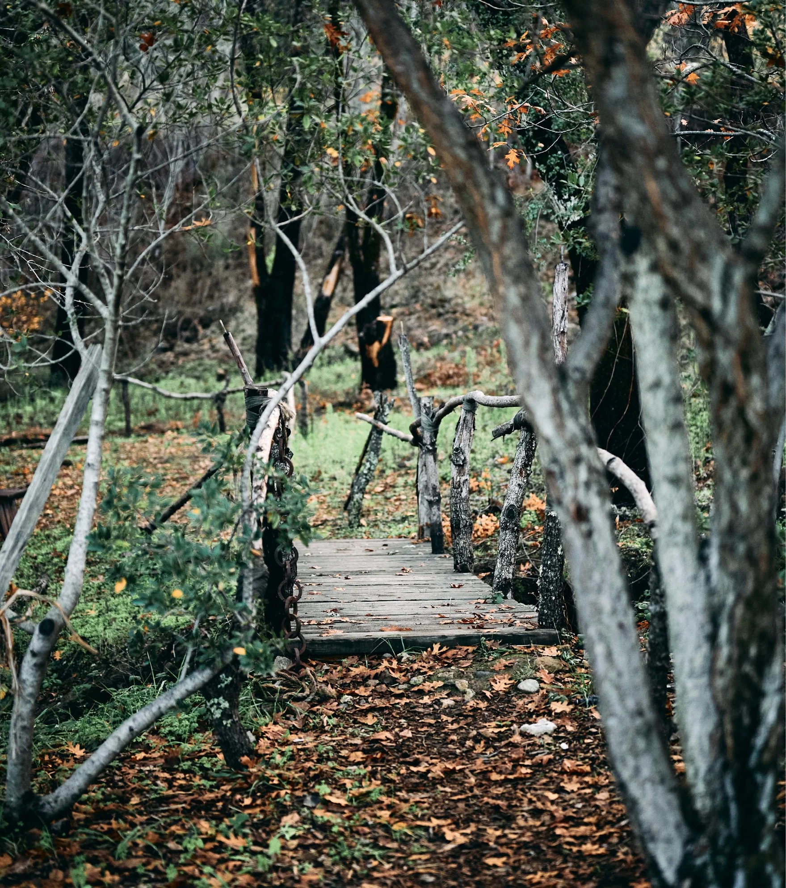

### Harengon Coffee Carrots

Nothing says *harvest* like the colorful dish known as Harengon Coffee Carrots. An unexpected journey of flavors, fresh wild-picked carrots are simmered with mountain-grown kaeth (or coffee) and a generous amount of beet-derived molasses. A touch of thyme and finely aged balsamic vinegar round out this sweet and acidic treat, so perfectly balanced that even the eladrin of the Feywild often include it as a staple of their elaborate forest feasts. The harengon, rabbit-like denizens of the Feywild, famously prepare this dish with a veritable rainbow of orange, red, white, yellow, and purple carrots, emphasizing presentation as much as flavor. The inspired infusion of coffee provides a robust tang that will also add zip to anyone's step, especially the harengon who are known for their exuberance. When it comes to the serving table, this vibrant fall side is bound to bring you back for more.

<table class="rd__b-special rd__b-data  rd__b-data--stats">
		<thead>
			<tr>
				<th class="rd__data-embed-header ve-text-left" colspan="6" data-rd-data-embed-header="true">
					

						

							Harengon Coffee Carrots
							
						

						[–]
					

				</th>
			</tr>
		</thead><tbody class="" data-rd-embedded-data-render-target="true"><tr>
			<td colspan="6" data-rd-tag="recipe" data-rd-uid="Harengon Coffee Carrots|HFFotM" data-rd-page="recipes.html" data-rd-source="HFFotM" data-rd-hash="harengon%20coffee%20carrots_hffotm" data-rd-name="Harengon Coffee Carrots" data-rd-display-name="Harengon Coffee Carrots" data-rd-style="" data-rd-entry-data="{}">
				<i>Loading <a href="recipes.html#harengon%20coffee%20carrots_hffotm"  onmouseover="Renderer.hover.pHandleLinkMouseOver(event, this)" onmouseleave="Renderer.hover.handleLinkMouseLeave(event, this)" onmousemove="Renderer.hover.handleLinkMouseMove(event, this)" onclick="Renderer.hover.handleLinkClick(event, this)" onwheel="Renderer.hover.handleLinkWheel(event, this)" ondragstart="Renderer.hover.handleLinkDragStart(event, this)" data-vet-page="recipes.html" data-vet-source="HFFotM" data-vet-hash="harengon%20coffee%20carrots_hffotm" ontouchstart="Renderer.hover.handleTouchStart(event, this)" >Harengon Coffee Carrots</a>...</i>
				
			</td>
		</tr></tbody></table>

### Brackleberry Jam

Brackleberry Jam is the Cormyrean moniker for a spread made from a medley of freshly foraged wild berries—one that has earned notoriety throughout the multiverse. While the Cormyr version utilizes strawberries, raspberries, blackberries, gooseberries, and even currants, all iterations of this well-traveled recipe call for fresh blueberries and sugar to properly flavor the mixture. A spritz of lemon and a dash of salt help to not only preserve the mash for canning but brighten the overall experience on the palette. Brackleberry Jam is as common as butter in the forest-heavy country of Cormyr, where its topography and climate yield an abundance of seasonal berries so plentiful they colorfully adorn the region's roads and trails. This jam spreads well on almost any warm loaf or muffin. In the Feywild, the berries are not only more bountiful but also more flavorful, resulting in an exquisite local variety of Brackleberry Jam.

<table class="rd__b-special rd__b-data  rd__b-data--stats">
		<thead>
			<tr>
				<th class="rd__data-embed-header ve-text-left" colspan="6" data-rd-data-embed-header="true">
					

						

							Brackleberry Jam
							
						

						[–]
					

				</th>
			</tr>
		</thead><tbody class="" data-rd-embedded-data-render-target="true"><tr>
			<td colspan="6" data-rd-tag="recipe" data-rd-uid="Brackleberry Jam|HFFotM" data-rd-page="recipes.html" data-rd-source="HFFotM" data-rd-hash="brackleberry%20jam_hffotm" data-rd-name="Brackleberry Jam" data-rd-display-name="Brackleberry Jam" data-rd-style="" data-rd-entry-data="{}">
				<i>Loading <a href="recipes.html#brackleberry%20jam_hffotm"  onmouseover="Renderer.hover.pHandleLinkMouseOver(event, this)" onmouseleave="Renderer.hover.handleLinkMouseLeave(event, this)" onmousemove="Renderer.hover.handleLinkMouseMove(event, this)" onclick="Renderer.hover.handleLinkClick(event, this)" onwheel="Renderer.hover.handleLinkWheel(event, this)" ondragstart="Renderer.hover.handleLinkDragStart(event, this)" data-vet-page="recipes.html" data-vet-source="HFFotM" data-vet-hash="brackleberry%20jam_hffotm" ontouchstart="Renderer.hover.handleTouchStart(event, this)" >Brackleberry Jam</a>...</i>
				
			</td>
		</tr></tbody></table>
### Fey Fritters

No elven feast is complete without a basket (or three) of freshly fried sweet-pea Fey Fritters on offer. The nuanced yet indulgent combination of fresh sweet peas, shallots, and feta cheese is a match made in Arvandor, especially once handfuls of the bite-size bounty are dipped in batter and fried to perfection. From Prismeer to Evermeet, elves and those with whom they hold court relish these comforting table treats. Fey Fritters come with a warning: Once you try one, you'll want to spend all day eating these scrumptious snacks...and often, in the Feywild, you just do! It is believed that the recipe originated a millennium ago in the elven enclave of Evermeet, far before it was transported to the Plane of Faerie following the Spellplague. These tasty delicacies have been a mainstay on elven dining tables ever since.

<table class="rd__b-special rd__b-data  rd__b-data--stats">
		<thead>
			<tr>
				<th class="rd__data-embed-header ve-text-left" colspan="6" data-rd-data-embed-header="true">
					

						

							Fey Fritters
							
						

						[–]
					

				</th>
			</tr>
		</thead><tbody class="" data-rd-embedded-data-render-target="true"><tr>
			<td colspan="6" data-rd-tag="recipe" data-rd-uid="Fey Fritters|HFFotM" data-rd-page="recipes.html" data-rd-source="HFFotM" data-rd-hash="fey%20fritters_hffotm" data-rd-name="Fey Fritters" data-rd-display-name="Fey Fritters" data-rd-style="" data-rd-entry-data="{}">
				<i>Loading <a href="recipes.html#fey%20fritters_hffotm"  onmouseover="Renderer.hover.pHandleLinkMouseOver(event, this)" onmouseleave="Renderer.hover.handleLinkMouseLeave(event, this)" onmousemove="Renderer.hover.handleLinkMouseMove(event, this)" onclick="Renderer.hover.handleLinkClick(event, this)" onwheel="Renderer.hover.handleLinkWheel(event, this)" ondragstart="Renderer.hover.handleLinkDragStart(event, this)" data-vet-page="recipes.html" data-vet-source="HFFotM" data-vet-hash="fey%20fritters_hffotm" ontouchstart="Renderer.hover.handleTouchStart(event, this)" >Fey Fritters</a>...</i>
				
			</td>
		</tr></tbody></table>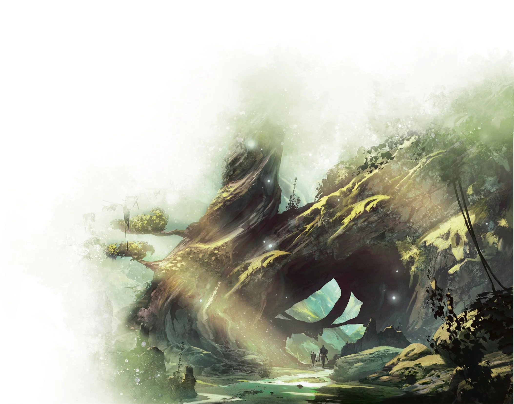

### Sprucebark Quaff

A refreshing nonalcoholic aperitif, the drink known as Sprucebark Quaff is famous throughout the multiverse for not only preparing the palate for flavor but also freshening the breath after meals. A simple concoction of clean, fresh water; mint; and sweet cucumber, it is served at upscale taverns, inns, and temples across the Prime Material Plane but is especially popular in the Feywild and upper planes, where a similar mixture forms naturally in many ponds, lakes, and streams. It's believed to have been invented by Faerûnian elves as a method of purifying water, using plants to remove toxins. Whatever its origin, it is sure to recharge trail-weary adventurers no matter what planet or plane they roam.

<table class="rd__b-special rd__b-data  rd__b-data--stats">
		<thead>
			<tr>
				<th class="rd__data-embed-header ve-text-left" colspan="6" data-rd-data-embed-header="true">
					

						

							Sprucebark Quaff
							
						

						[–]
					

				</th>
			</tr>
		</thead><tbody class="" data-rd-embedded-data-render-target="true"><tr>
			<td colspan="6" data-rd-tag="recipe" data-rd-uid="Sprucebark Quaff|HFFotM" data-rd-page="recipes.html" data-rd-source="HFFotM" data-rd-hash="sprucebark%20quaff_hffotm" data-rd-name="Sprucebark Quaff" data-rd-display-name="Sprucebark Quaff" data-rd-style="" data-rd-entry-data="{}">
				<i>Loading <a href="recipes.html#sprucebark%20quaff_hffotm"  onmouseover="Renderer.hover.pHandleLinkMouseOver(event, this)" onmouseleave="Renderer.hover.handleLinkMouseLeave(event, this)" onmousemove="Renderer.hover.handleLinkMouseMove(event, this)" onclick="Renderer.hover.handleLinkClick(event, this)" onwheel="Renderer.hover.handleLinkWheel(event, this)" ondragstart="Renderer.hover.handleLinkDragStart(event, this)" data-vet-page="recipes.html" data-vet-source="HFFotM" data-vet-hash="sprucebark%20quaff_hffotm" ontouchstart="Renderer.hover.handleTouchStart(event, this)" >Sprucebark Quaff</a>...</i>
				
			</td>
		</tr></tbody></table>

### Eldeen Banquet

Despite its promise of a "banquet," the dish known as Eldeen Banquet is actually a hearty, one-dish meal sure to satisfy omnivores as much as vegetarians. Consisting of lightly breaded and fried eggplant topped with a warm, seasoned tomato sauce, this delight hails from the Eldeen Reaches, in the Khorvaire region of Eberron, which is noted for its robust forests and agriculture, and where the dish has occasionally migrated to the Feywild via a secret Fey Crossing. But while Eldeen Banquet is considered a regional delicacy, interpretations of the crispy, yet spongy, eggplant patty are common in esteemed eateries throughout the city of Sharn. High-end restaurants such as the Azure Gateway and the Celestial Vista, in the Skyway district, offer plates of Eldeen Banquet as delightful as their views. However, perhaps the best preparation is found in the unassuming Olladra's Arms, in the Hope's Peak district. Here, the portions are as generous as they are flavorful, ensuring the dish truly lives up to its moniker.

<table class="rd__b-special rd__b-data  rd__b-data--stats">
		<thead>
			<tr>
				<th class="rd__data-embed-header ve-text-left" colspan="6" data-rd-data-embed-header="true">
					

						

							Eldeen Banquet
							
						

						[–]
					

				</th>
			</tr>
		</thead><tbody class="" data-rd-embedded-data-render-target="true"><tr>
			<td colspan="6" data-rd-tag="recipe" data-rd-uid="Eldeen Banquet|HFFotM" data-rd-page="recipes.html" data-rd-source="HFFotM" data-rd-hash="eldeen%20banquet_hffotm" data-rd-name="Eldeen Banquet" data-rd-display-name="Eldeen Banquet" data-rd-style="" data-rd-entry-data="{}">
				<i>Loading <a href="recipes.html#eldeen%20banquet_hffotm"  onmouseover="Renderer.hover.pHandleLinkMouseOver(event, this)" onmouseleave="Renderer.hover.handleLinkMouseLeave(event, this)" onmousemove="Renderer.hover.handleLinkMouseMove(event, this)" onclick="Renderer.hover.handleLinkClick(event, this)" onwheel="Renderer.hover.handleLinkWheel(event, this)" ondragstart="Renderer.hover.handleLinkDragStart(event, this)" data-vet-page="recipes.html" data-vet-source="HFFotM" data-vet-hash="eldeen%20banquet_hffotm" ontouchstart="Renderer.hover.handleTouchStart(event, this)" >Eldeen Banquet</a>...</i>
				
			</td>
		</tr></tbody></table>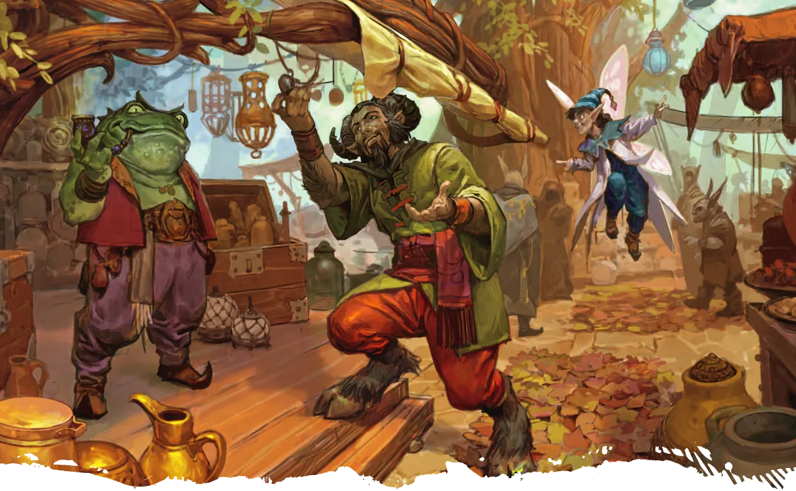

### Saerloonian Glowfire

It is said that *everything* in the Feywild is more beautiful—and more delicious. That is undoubtedly true when it comes to imbibing the already supernaturally delightful Saerloonian Glowfire. First concocted centuries ago in Saerloon, a Sembian metropolis known for its cultured and exotic tastes, Saerloonian Glowfire has become a notable export the Realms over. It has even made its way to Evermeet, an elven paradise transported to the Feywild long ago. While human in origin, this aromatic bracer, renowned equally for its alluring luminescence as for its refreshing hints of summer breezes and ripe pear, feels right at home filling the ornate wine flutes of high elven society.

<table class="rd__b-special rd__b-data  rd__b-data--stats">
		<thead>
			<tr>
				<th class="rd__data-embed-header ve-text-left" colspan="6" data-rd-data-embed-header="true">
					

						

							Saerloonian Glowfire
							
						

						[–]
					

				</th>
			</tr>
		</thead><tbody class="" data-rd-embedded-data-render-target="true"><tr>
			<td colspan="6" data-rd-tag="recipe" data-rd-uid="Saerloonian Glowfire|HFFotM" data-rd-page="recipes.html" data-rd-source="HFFotM" data-rd-hash="saerloonian%20glowfire_hffotm" data-rd-name="Saerloonian Glowfire" data-rd-display-name="Saerloonian Glowfire" data-rd-style="" data-rd-entry-data="{}">
				<i>Loading <a href="recipes.html#saerloonian%20glowfire_hffotm"  onmouseover="Renderer.hover.pHandleLinkMouseOver(event, this)" onmouseleave="Renderer.hover.handleLinkMouseLeave(event, this)" onmousemove="Renderer.hover.handleLinkMouseMove(event, this)" onclick="Renderer.hover.handleLinkClick(event, this)" onwheel="Renderer.hover.handleLinkWheel(event, this)" ondragstart="Renderer.hover.handleLinkDragStart(event, this)" data-vet-page="recipes.html" data-vet-source="HFFotM" data-vet-hash="saerloonian%20glowfire_hffotm" ontouchstart="Renderer.hover.handleTouchStart(event, this)" >Saerloonian Glowfire</a>...</i>
				
			</td>
		</tr></tbody></table>

### Elverquisst

This autumnal aperitif of rare quality and divine taste is customarily served in conjunction with an elven high ceremony. Traditional Elverquisst vintages are distilled from orosks and resmers (rare summer fruits indigenous to Evereska) and sunshine, and it sips as smoothly as a cool mountain stream. Elves store their Elverquisst in crystal decanters capable of absorbing light and showcasing the tantalizing specks of gold dancing about in the rich claret mixture. According to legend, upon whispering a secret Elvish phrase, the sunlight streaming through the bottle will gather into thirteen points, resembling the constellation Correlian. Regardless, Elverquisst is highly prized by the elves and is a uniquely enchanting sip for curious imbibers who can get their hands on a bottle of this rare beverage.

<table class="rd__b-special rd__b-data  rd__b-data--stats">
		<thead>
			<tr>
				<th class="rd__data-embed-header ve-text-left" colspan="6" data-rd-data-embed-header="true">
					

						

							Elverquisst
							
						

						[–]
					

				</th>
			</tr>
		</thead><tbody class="" data-rd-embedded-data-render-target="true"><tr>
			<td colspan="6" data-rd-tag="recipe" data-rd-uid="Elverquisst|HFFotM" data-rd-page="recipes.html" data-rd-source="HFFotM" data-rd-hash="elverquisst_hffotm" data-rd-name="Elverquisst" data-rd-display-name="Elverquisst" data-rd-style="" data-rd-entry-data="{}">
				<i>Loading <a href="recipes.html#elverquisst_hffotm"  onmouseover="Renderer.hover.pHandleLinkMouseOver(event, this)" onmouseleave="Renderer.hover.handleLinkMouseLeave(event, this)" onmousemove="Renderer.hover.handleLinkMouseMove(event, this)" onclick="Renderer.hover.handleLinkClick(event, this)" onwheel="Renderer.hover.handleLinkWheel(event, this)" ondragstart="Renderer.hover.handleLinkDragStart(event, this)" data-vet-page="recipes.html" data-vet-source="HFFotM" data-vet-hash="elverquisst_hffotm" ontouchstart="Renderer.hover.handleTouchStart(event, this)" >Elverquisst</a>...</i>
				
			</td>
		</tr></tbody></table>
>
>
>FANGS! VamPEER or VamPIRE? Yeah, the second one. My mind screams, "Run Squirladax into thine own traps!" With luck, a spike will gash my heart for I do not wish to rise a Vampiric thrall. But I do not run. I will face this failure, this TPK.
>
>
>
>Skeletons charge up the slope and then EXPLOSIONS FROM THE HEAVENS! I look up to see... No way! OUR SPELLJAMMER!?? WASN'T IT BROKEN!? And it's hurling fireballs at our enemies!!!
>
>WAIT! Not fireballs. Those are flaming pieces of the spelljammer itself! OH CRAP! SHE'S COMING APART!
>
>
>
>RINGING OF EAR, all is soot and dark fog. The Dashor has crashèd, sending all to scatter and yet striking **not one skeleton**! Vomited forth from the wreck is the dented, destroyèd, and motionless OTTER GNOME, DINT!
>
>Squirladax breaks away to rush to Dint's side.
>
>"Dint, my Arch-Nemesis. Dint, my oldest and truest friend!"
>
>Didn't we kinda just meet Dint?
>
>Sasha joins with tear-chokèd breaths. I look to my side and swear it be a single tear rolling from tiefling eye.
>
>Squirladax's pleadings continue, "Brave Dint. I lost you once. I cannot bear to lose you again."
>
>Then a slow-clap and wicked chuckles from the darkest rain-soaked smog. Cresting the slope pasty Chahd and his smiling skeletons.
>
>"Your hefty friend meets his end. And you're all food for fangs."
>
>And to this, Dint croaked, "He lies."
>
>Sasha and Dint locked eye to lens. She spoke simply.
>
>"Then we shall press the truth from him."
>
>Dint nodded.
>
>AND SO DID SASHA HEAVE DINT ABOVE HER HEAD, AND BY TYR'S GRACE DID BOWL THE BALLLIKE BRONZE MAN DOWN THE HILL, SHATTERING MANY A'SHRIEKING SKELETONS!
>
>The battle is joined!
>
>
>
>The fog of war clears. All is bone and shatter. Nothing stands. Not even one friend. But wait, hopeful reader! I see a cloistered group below! Huddled there is Deelia, cradling a shivering man. I rush forth and my goblin eyes boggle with amazement. Deelia holds a crushèd and stabbèd Chahd! But to see the fear in his eyes, the blood on velveteen cape and the broken **wooden fangs** hanging out his slackened jaw, he can only simply be "Chad."
>
>Chad chokes out. "You were right, Deelia. Neither I vampire nor vampeer. It's just... I started hanging out with skeletons after Shadow's Edge burned down, and you know, they're super judgy. I just wanted them to like me."
>
>Deelia sobs, "Then 'twas I that did this, Chad. Destroyed our school with flame. I did, and your only crime was to run screaming while ablaze to the Lords!... A tattle move, but still!"
>
>See us all, Deelia's vexing was always of her own making, and thus did she comfort Chad by casting away the rain's chill... **with a gentle flame from her snapping fingers**, her powers restorèd by mercy.
>
>Chad's shivering abated, his eyes glazed as death approached. Would not Deelia be pleasèd, as Chad's soul could now be whispered to her Raven Queen? But even as Chad's body went limp, she whispered through tears—
>
>"Please..."
>
>
>
>SO IT WAS THAT TYR'S SERVANT BRI'AN SNAPPÈD FORTH LIMBS AND SHINS AND CHINNY CHIN CHINS OF THE DAMNED IN HIS BATTLE 'GAINST UNDEATH. NOBLY HE FOUGHT, KILLING THE DEAD UNTO A DOUBLE-DEATH WHENCE NO SKELETON, SHALL 'ERE RETURN TO SNEER UPON THE LIVING.
>
>And as Bri'An could deliver death to the dead, so might he deliver life unto the living? Thusly, the scoundrel dragonborn—himself for the first time in his life—did layeth hands on the frail Chad. And Tyr's grace fell as a rain, melting away eyeshadows and other gothic makeups Off the visage of Chad, who was deliverèd unto Tyr's Grace, ALIVE! So Sayeth We Thusly.
>
>Praise be to being one's self.
>
>
>
>Persistent reader, how we feasted in victory that day. Famished, we returnèd to the inn, where our newly re-pioused Bri'An has shared Tyr's favor with us all! He has summoned a *HEROES' FEAST* of elven flatbreads, harengon coffee carrots, and the freshest of sprucebark quaff for all to sup!
>
>'Twas at that moment that mangled Dint lurched in the doorway, held up by Sasha and Deelia. his gut-gears still churning by the grace of his Otter Gnome gods.
>
>A tear running down my face, I placed a hand upon the pauldroned shoulder of my shadowy double and spoketh thus: "You can keep your Astral Diamonds, dear Master of Treason."
>

------

# Afterword: Playing with Your Food

Every group that sits down around a table to play *Dungeons & Dragons* can find its own style, its own groove. You may play epic sessions that start in the afternoon and run until the wee hours of the night. Or you may do lots of short, intensive episodes. Your adventures may be all about intrigue, or white-knuckle combat, or just light silly fun—or they may explore the deep lore of the multiverse, searching for an ever-deeper understanding of the fantastic worlds that D&D opens up to us all.

The adventures of the Bureau of Dark Tables are mostly wacky hijinks, but they also revolve around food. That doesn't mean anyone else's stories have to do the same, but every group's adventure in D&D should follow their bliss. One of the great joys of traveling in real life is to experience the cuisines of different cultures first-hand—we live in a world where many things from distant lands can be shipped conveniently to our doorstep, but freshly prepared food, done in the style of its place of origin, is something you must travel to experience. The Bureau of Dark Tables are the sort of adventurers who know that, wherever your triumphs and perils take you, you haven't really been there unless you've taken in the local fare. Whatever your ostensible main quest may be, your side quest is always to level up your palate.

In this book, there are recipes that can help you as a player to deepen your bond with both your characters and your gaming group. If you and your friends want to take your connection to the D&D multiverse into the culinary space, these recipes can become part of your game experience as well as your mealtimes. A refreshing Ray of Frost or a slice of Laumberry Pie can be as much of a reward as the experience points you get after an epic adventure.

But as with any undertaking, getting the best results requires planning ahead. Inserting the whole process of making and eating a meal into a game session can be a challenge unto itself. So bear in mind you will need:

#### Rule #1:

*Support.* Every great band of adventurers plays to everyone's strengths. If you are the Dungeon Master (DM), it might be best to leave the cooking to someone else. You are already doing all of the preparatory work for the adventure. Many DMs offer up their homes for play, and if you are hosting, you may feel responsible for keeping everyone else fed. So players, show your thanks to the DM by volunteering to bring the food!

If your group plays at your local friendly game store, or some other public space that likely does not have a full kitchen, you should plan ahead. You might find a fridge and a microwave there that can hold a few Tupperware containers, if you are lucky. Some dishes you can prepare ahead of time that will transport well to a game include the Halfling Iron Rations or Fig Cakes. If you know you have an oven for heating up food when you get there, then you might consider bringing Ornabra or Sensate Palate Cleanser.

Don't forget that cooking, and eating, can make a mess, but not all dishes are equally messy. Some recipes, such as Tamarind Balls, Goldenstars, and Cloaks, don't require players to have their own plates and utensils. But wherever you are bringing the food, have a plan for how to deal with any leftovers, and how not to leave a dish disaster in your wake.

One fun way to use this cookbook is to try to match the food your group eats with the adventure you are playing. Whatever city of the D&D multiverse your party is visiting, or whichever wilderness you camp in, there are dishes that can put you in your character's shoes. You may not have the appetite to sample everything that the Bureau of Dark Tables eats as they make their way around Realmspace, but you can still make meals the centerpiece of your adventure.

#### Rule #2:

*Plan.* Don't have a Total Planning Katastrophe. Schedule serious meals for the beginning or end of a play session. If you are doing a real marathon and you need to have a full meal in the middle, take a break from the game. Some of the dishes in this cookbook, like Tavern Crickets and Black Lotus Root, make for good snacks around the table, but if you're laying out a multi-course cornucopia, you're going to need the table space. As a rule of thumb, if you need to have utensils and plates out to eat, then set the dice and character sheets away until you're done. You don't want to have to fish a d4 out of your Two Hares Inn Rabbit Stew.

There's nothing better than taking an hour after a D&D session to decompress with your friends over a refreshing dinner, chatting about the ups and downs of the day. These post-game sessions can actually make a big difference in your campaigns—it helps everyone to get on the same page about game events, and it may even lead to some inspirations for the next session. And if your session runs all night, there are some great breakfast options in this book, like the Green Onion Pancakes.

There are a few ways to integrate eating into the play of D&D. If you know in advance that the party is going to attend a banquet in Ravenloft, you can always arrange to have the meal ready for the players to enjoy in real-time as they role play their characters. This requires some coordination, but it can really bring the game world to life, with a little mood lighting, music, and maybe even costumes.

But if you're going to build a meal into your D&D session, you probably aren't going to be able to make it from scratch during a quick break. Choose dishes where most of the preparatory work can be done before the session starts, where it will only take a few minutes to heat things up and get them on the table. Duergar Smoked Herring and Boar Hock Soup are examples of good choices where you can do a lot of the work beforehand and then heat them up at the last minute. You definitely want to avoid trying to make something like Fire-Wrapped Golden Fish while you are in the middle of a play session, because if you get distracted and leave it cooking for too long, it could easily burn and the smell of this rare aquatic treat will no doubt linger until next week's session.

#### Rule #3:

*Improvise.* Every DM knows that sometimes you just have to wing it—rules are guidelines, and to keep up the flow of play you may have to do what seems right rather than leafing through rulebooks. Every chef knows the same rule: You have to work with what you've got, and sometimes that means taking a different path than the printed recipe.

Most importantly, these recipes are intended to inspire your creativity. It would be impossible to cram the flavors of the multiverse into this cookbook, or a whole series of them—so take the recipes here as examples. Once you have a sense for the palates of the planes, you can use those as building blocks for developing your own recipes in the spirit of these guidelines.

Once you get the hang of it, you can develop your own recipes. And if you are having trouble deciding between ingredients, remember that you are a D&D player: you can always roll for it! For example, you could assign tofu, chicken, pork, and beef each to a number on a d4. Give it a roll, and whatever number lands becomes the accompanying protein for that tasty Chopforest. But like any good DM, if the result of the die roll doesn't feel right, don't be afraid to exercise a little "divine intervention" and reroll. Sometimes it takes a die roll to tell you what your real preference would be.

Dine on!

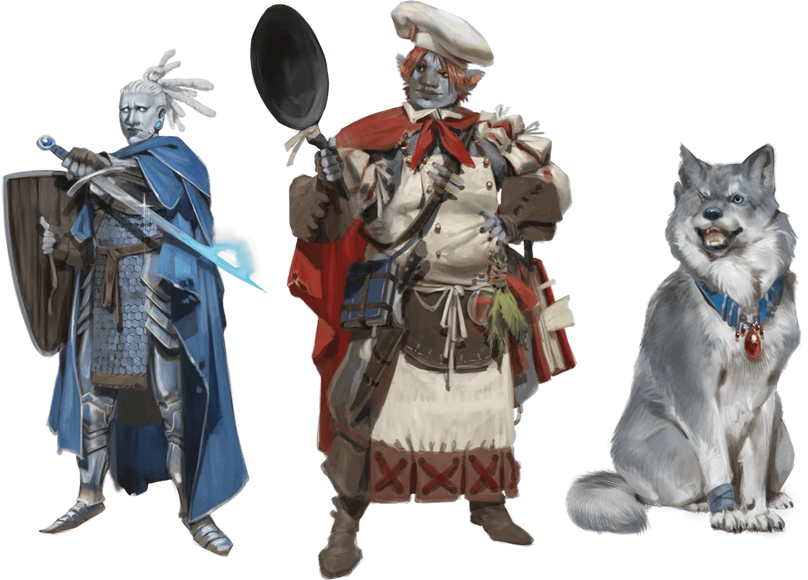

------

# Credits

- **Publisher.** Aaron Wehner
- **Project Editors.** Shaida Boroumand and Claire Yee
- **Production Editors.** Doug Ogan and Natalie Blachere
- **Art Director and Designer.** Kelly Booth
- **Photo Director.** Emma Campion
- **Print Production Designers.** Mari Gill and Faith Hague
- **Print Production Manager.** Dan Myers
- **Print Prepress Color Manager.** Jane Chinn
- **Photo Retoucher.** Tamara White
- **Photo Assistant.** Jeff Johnson
- **Location.** Castello di Amorosa Winery
- **Food Stylist.** Nicole Twohy
- **Food Stylist Assistants.** Genesis Vallejo and Allison Fellion
- **Prop Stylist.** Glenn Jenkins
- **Prop Stylist Assistants.** Zach Wine and Cindy Chesney
- **Copyeditor.** Deborah Kops
- **Proofreader.** Linda Bouchard
- **Indexer.** Ken DellaPenta
- **Publicist.** Lauren Ealy
- **Marketer.** Ashleigh Heaton
- **Wizards of the Coast Team.** Paul Morrissey
- **Illustrators.** Conceptopolis, LLC
- **Character Portrait Illustrator.** Simon Taylor
- **Decorative Art Designers.** Marisa Kwek and Kelly Booth
- **Ebook Production Manager.** Jessica Arnold
