# Introduction: Witness Netheril's Doom

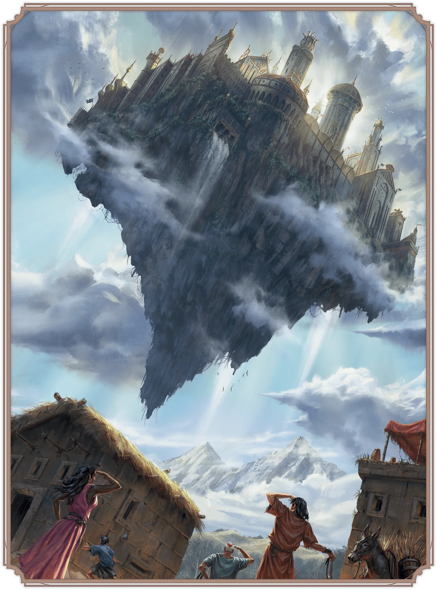

Lost to the annals of time is an empire of magical decadence and societal decay like no other: Netheril. Two thousand years ago, Netheril cowed Faerûn with its flying cities, archmages of unrivaled power, and mighty magical wonders. When Netheril fell, Faerûn's fabric shuddered. A huge swath of land shriveled into the Anauroch desert.

Yet echoes of ancient Netheril persist. Flying cities' ruins dot Anauroch and the surrounding lands, tantalizing adventurers who dare face untold horrors for the promise of wealth and magic. Scholars and mages alike seek Netherese knowledge, whether to illuminate history or gain a fragment of Netheril's spellcasters' power.

Ancient Netherese mages' wild experimentations with temporal magic warped the fabric of the time stream, making adventuring in the fallen empire possible. Hidden in the present day are time gates that lead to ancient Netheril and facilitate these adventures. Additionally, unfettered experimentation with Netherese magic in the past or present occasionally shunts present-day heroes into ancient Netheril.

Adventures set in the past might allow characters to become storied heroes of antiquity. In ancient Netheril, the opportunities for adventure are vast and terrifying, from arcane squalls running amok to violent villains who siphon Netheril's magic. The rewards for adventuring in Netheril are as fantastical as the magical empire itself.

## Using This Supplement

This supplement includes the tools you need to play Dungeons & Dragons adventures set in ancient Netheril, a long-fallen empire in the Forgotten Realms. Monster stat blocks referenced appear in the *Monster Manual* or *appendix B*.

This introduction gives an overview of ancient Netheril and its history. Although this introduction is suitable for all players' eyes, the remainder of this supplement is intended for Dungeon Masters only.

The following is included:

*Chapter 1* provides information about adventuring in ancient Netheril, including details about the flying city of Eileanar and the port city of Conch. Maps and tools for adventures set in these cities are also included.

*Chapter 2* explains environmental effects and hazards common in ancient Netheril due to magic's overuse and exploitation.

*Chapter 3* details present-day time gates where characters can time travel to ancient Netheril, along with maps and adventures set near these gates.

*Chapter 4* provides maps and adventures set in ancient Netheril.

*Appendix A* includes Netherese magic items characters might acquire during their adventures.

*Appendix B* provides a bestiary of creatures found in ancient Netheril.

### Ensuring Fun for All

This supplement deals with themes that some might find sensitive or uncomfortable. Before you incorporate this supplement into your game, read its contents carefully, review the "*Ensuring Fun for All*" section in the *Dungeon Master's Guide*, and be sure to have a conversation with your players as described in the "Hard and Soft Limits" section.

## The Empire's Rise and Fall

Five thousand years ago, the people (mostly humans) who lived in a collection of small fishing villages called the Alliance of Seventon struck an alliance with the elven kingdom of Eaerlann. The Eaerlanni elves taught the humans about magic. Following this advancement, the alliance renamed itself Netheril, after King Nether the Elder, and all citizens learned the basics of rudimentary spellcasting.

Three hundred years later, the Netherese discovered a collection of ancient writings on precious metals that contained vast bodies of magical knowledge. Using these lengthy documents, which came to be known as the *Nether Scrolls*, Netherese arcanists learned how to wield magic exponentially more powerful than anything they'd cast before. After centuries of magical progress and imperial expansion, the Netherese who mastered the power of the *Nether Scrolls* became the ruling class.

Netherese magical might dominated Faerûn for more than 2,500 years. During Netheril's Shadowed Age, though, several factors led to the empire's fall.

### Peak Magical Excess

At the empire's height, Netheril's most powerful mages lived in great flying cities powered by magical orbs known as mythallars, a type of mythal, which are sources of great magical power. Forever hungry for deeper magical understanding, the mages conducted wild magical experimentations from their aerial abodes. By the time the Shadowed Age arrived, these experimentations had dangerously taxed the fabric of the Weave, the tapestry of raw magic that flows through the world. Magical mishaps began to compound, and flying cities eventually began to fall from the sky.

### A Disgruntled Underclass

Meanwhile, a servant underclass had developed among those on the ground who lacked the wealth or ability to devote themselves to magical study. Peasants eked out livings in the meager employment of wealthy mages who owned the land and controlled the economy. These peasants seethed at Netheril's inequity, while the ruling class's hubris and thirst for power kept the mages oblivious to the peasants' anger.

### A Subterranean Threat

During the Shadowed Age, as the Netherese's overuse of magic began to affect the Weave, an outside threat against Netheril emerged. Deep underground, where the Anauroch desert stretches today, lived magic-obsessed creatures called phaerimm. The Netherese's weakening of the Weave also weakened the phaerimm, even limiting their lifespans, and the phaerimm hated the empire as a result.

Using their abilities to siphon magic from the Weave, the phaerimm began to assault the mighty empire above. The phaerimm's magic caused the fall of some flying cities. Additionally, groups of phaerimm began strategically striking aboveground targets. These operations were so devastating that few victims survived. The Netherese became terrified of the phaerimm. The phaerimm's magic led to Anauroch's desertification, further contributing to the underclass's unrest.

The phaerimm, once they'd dispatched Netheril, planned to build their own empire built on suffering and dominance over all who weren't their own. The phaerimm's assaults on Netheril chipped away at the empire's already crumbling facade, and the Netherese mages became desperate.

### Folly Before the Fall

In–339 DR, Netheril's most powerful mage, the dangerously brilliant Karsus, attempted to neutralize the phaerimm threat by casting a spell of unparalleled power to replace Mystryl, the god of magic, with himself. Karsus believed having absolute control over the Weave would allow him to save his people, though in his hubris, he also coveted the powers of a god. While Karsus cast his spell, the Weave surged and fluctuated.

Mystryl, the only one who could mitigate the damage dealt to the Weave, countered Karsus during the spell's casting by sacrificing herself and tearing the Weave asunder. This caused Karsus to die as well. For a time, magic vanished from the world, until the god of magic returned as Mystra.

Without magic to keep them aloft, the remaining flying cities of Netheril crashed to the ground, though the flying city of Thultanthar managed to escape to the Shadowfell. Many mages died with Mystryl's sacrifice, while others suffered shattered minds. Once magic eventually returned, Netherese mages could no longer cast their mightiest spells as they had before. The Netherese empire began to crumble. Eventually, the land that once boasted the world's most powerful empire became a barren desert, the life and magic stripped from it thanks to the phaerimm's siphoning powers.

### Netheril Returned

In 1372 DR, the flying city of Thultanthar, also called the City of Shade, emerged from the Shadowfell, where it had lain hidden for centuries. The city's rulers, calling themselves Shadovar, began rebuilding the long-lost Netherese empire, even returning life and growth to the desert. They dubbed this reborn empire the Empire of Shade. Thultanthar crashed to the ground in 1487 DR, landing in Myth Drannor in the Heartlands, and the Shadovar empire fell with it. But survivors of that catastrophe work to re-create the fallen city, where elements of the ancient empire, now twisted by the Shadowfell's influence, still persist.

## An Empire Divided

For most of its existence, Netheril was an empire split in two parts: High Netheril and Low Netheril.

### High Netheril

High Netheril was the society of mages that dominated Netheril. High Netherese families were headed by powerful mages, though not every family member was proficient with magic. High Netherese ensured their descendants were elevated with wealth, education, and privilege above the laboring class, though High Netherese who couldn't use magic could never achieve true political or economic power.

#### Decadent Wealth

High Netherese hoarded the empire's wealth, jealously guarding their gains and fighting among themselves to claim more. Most High Netherese lived in flying cities, but some built enclaves in similarly dramatic locations protected by magic, such as atop waterfalls, in caverns, on isolated mountain peaks, or in calderas of volcanoes.

#### Magic Dependence

High Netherese regarded those who didn't use magic as undisciplined children in need of guidance, yet the mages were made helpless by their own surfeit of privilege. A typical High Netherese couldn't sew a button, sharpen a sword, or start a fire without magic. Some couldn't write or read altogether, relying on enchanted quills and speaking parchment instead.

#### Society

High Netherese society was full of beautiful people gilded with glamour, all concealing their true faces, forms, and agendas via magic. The life of a High Netherese mage was one of politics, danger, hedonism, and fierce competition.

Most High Netherese aimed to create or curate outrageous magical inventions that flaunted their ingenuity and avant-garde tastes. Even government officials and military officers favored dramatic, decadent magic over direct solutions.

### Low Netheril

Low Netheril was the working class, which served the aristocratic mages who held all of the empire's wealth and power.

#### A Life of Hardship

Low Netherese lived in poverty and extreme taxation. Most Low Netherese farmed, fished, mined, or otherwise worked to serve and supply the mages. Low Netherese almost never owned their homes or lands, instead laboring to pay the ever-increasing costs imposed by their mage overlords. Lest the workers organize rebellion, High Netherese mages occasionally conducted raids, descending from the sky unexpectedly to make an example of dissidents.

#### Family and Magic

Out of sight of the mages, Low Netherese honored complex and rich customs marked by a profound storytelling tradition and unbreakable family bonds. Tattoos kept records of every parent, spouse, and child in a family.

## Netheril at its Height

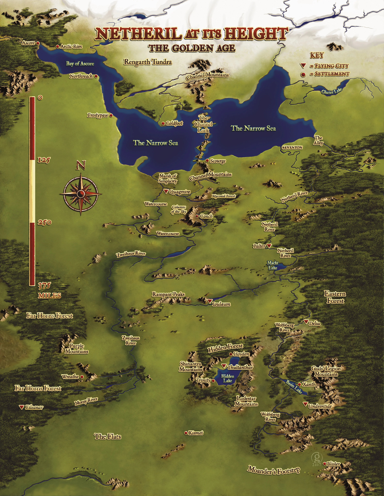

- **Map:** Netheril At Its Height shows Netheril during its Golden Age. Flying cities soared high above the ground and are marked on the map in relation to other features in the region.

> ##### Netheril Timeline
>
>This timeline provides a summary of ancient Netheril's history. Dates are provided in Dalereckoning (DR), though the Netherese themselves used a calendar that counted from the founding of the empire at the start of the First Age.
>
>- **First Age (–3859 DR to–3534 DR).** The Eaerlanni elves teach magical traditions to the Netherese people, who live in a collection of fishing villages.
>- **Nether Age (–3533 DR to–3316 DR).** The Netherese discover the Nether Scrolls, allowing arcanists to use exponentially more powerful magic. These arcanists learn and pass on greater and greater magical knowledge, eventually becoming Netheril's ruling class.
>- **Mythallar Era (–3315 DR to–2759 DR).** The mage Ioulaum creates the first mythallar and flying city. The empire soon splits into High and Low Netheril.
>- **Silver Age (–2758 DR to–2208 DR).** The empire grows and explores the area that will later become the Sword Coast.
>- **Golden Age (–2207 DR to–1206 DR).** Netheril flourishes and establishes undersea enclaves known collectively as Deep Netheril. During this time, many Nether Scrolls are lost or stolen.
>- **Age of Discovery (–1205 DR to–697 DR).** High Netheril begins experimenting with travel to other worlds.
>- **Shadowed Age (–696 DR to–340 DR).** The archwizard Karsus founds the flying city of Eileanar. The last Nether Scrolls are stolen while subterranean phaerimm siphon the empire's magic and life. Low Netherese begin coordinated civil resistance.
>- **Karsus's Folly (–339 DR).** Karsus casts Karsus's Avatar, attempting to become a god and nearly destroying all magic. Karsus dies in this effort, and flying cities plummet to the ground across Faerûn. The Netherese empire collapses.
>- **Netheril Returns (1372 DR).** The flying city of Thultanthar returns to Anauroch from the Shadowfell but falls again in 1487 DR.
>- **The Year of the Shining Mythal (1501 DR).** This is the present day (as of *Forgotten Realms: Heroes of Faerûn* and *Forgotten Realms: Adventures in Faerûn*).

------

# Chapter 1: Adventuring in Netheril

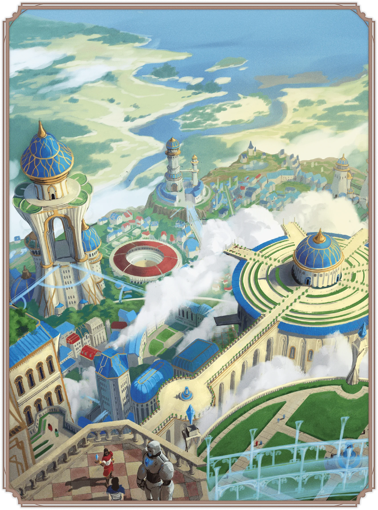

To adventure in ancient Netheril is to walk into an empire of boundless magic and tyrannical cruelty. Netheril is a unique magical society, existing in a different era of the Forgotten Realms. Should your adventures take place just before Netheril's fall, your players will experience the Forgotten Realms' most arrogant civilization moments before its spectacular end.

This chapter provides guidance on setting your game in Netheril and details two ancient Netherese cities: Eileanar, a flying city of magical opulence, and Conch, where the conflicts between High and Low Netheril are on full display.

## Adventuring in the Past

The moment they step into ancient Netheril, characters from the present day should notice the trappings of a different time.

### Abundant Magic

Magic is everywhere in Netheril, with constant spellcasting, abundant magical effects, and magic items a common part of everyday life. Everywhere characters go, they see evidence of this rampant magic use. Mages might fly about the streets; household objects might be animated, busily handling chores; and public art might be suspended in the air, capturing the intersection of beauty and magic.

The expression of magic varies widely depending on where characters roam in ancient Netheril. In a flying city, magic is on opulent, wanton display. On the ground, magic is still everywhere, but it's clear only High Netherese mages wield and benefit from it.

> ##### Accessing Ancient Netheril
>
>Characters from the present-day Forgotten Realms might reach ancient Netheril in the following ways:
>
>- Via a time gate, as described in *chapter 3*.
>- Via a magical mishap that pulls them from the present into the past, as described in *chapter 4*.

#### Netherese Pets

Netherese mages use magic to create fantastical pets, which are in abundance throughout the empire. Strange, chimeric pets are common, such as winged hares, venomous baboons, or feathered mastiffs. Sometimes these pets find their way to Low Netherese households, though whether their High Netherese creators bother to retrieve them is down to the individual mage.

### Fashion and Aesthetics

Both High and Low Netherese individuals favor loose, flowing attire such as togas, robes, cloaks, and sashes. They often adorn their heads with shawls, headbands, veils, or wreaths.

#### High Netherese Fashion

Members of the upper class tend to flaunt their wealth and dress to impress. High Netherese drape themselves in silk, satin, or linen, all in bright, rich colors. They accessorize with extravagant fur, feathers, and expensive leather. Their jewelry often incorporates magic, with circlets, rings, necklaces, and fastenings sporting heatless flames, unmelting ice, or pure light.

#### Low Netherese Fashion

Low Netherese individuals typically wear rough, homespun tunics; heavy woolen cloaks; and thick rope sandals or cloth boots. Their fabrics are rarely dyed, though when they are, earth tones dominate. Adornments such as earrings, pendants, armbands, and belts are typically made of knotted rope or carved from wood or stone.

### Language

The common language in Netheril is Netherese, which appears on the Standard Languages of Faerûn table in *Forgotten Realms: Heroes of Faerûn*

### Presence of Time Travelers

Should the characters be revealed as time travelers, Netherese might be less surprised than the characters assume. Magical travel of all kinds is pervasive among Netheril's mages, so most Netherese would accept time travel as another form of magical experimentation. Reactions are likely to range from polite interest or intellectual curiosity among High Netherese to grudging acceptance or wary suspicion among Low Netherese.

The dangers of the characters being discovered as time travelers depend on the reaction of greedy Netherese mages, who might want to take control of time travel for their own purposes. Alternatively, a desperate Low Netherese servant might want to steal the characters' means of travel to escape from servitude or coming disaster.

## Netherese Sensibilities

The Netherese people, whether they're mages or not, tend to share similar cultural viewpoints. Understanding these views can help you roleplay Netherese NPCs.

Netherese individuals typically express the following common assumptions:

- **Brutal Outlook.** Violence is normal and part of everyday life.
- **Quick Fixes.** Magic is the solution to every problem.
- **Spellcasters' Privilege.** Magic-users will always be privileged in society, while those who don't use magic will always be at a disadvantage.
- **Stratified Society.** Low Netherese have harder lives than High Netherese.
- **Superiority Complex.** Netheril is the apex of civilization, and its fall would be the end of history.

## Eileanar

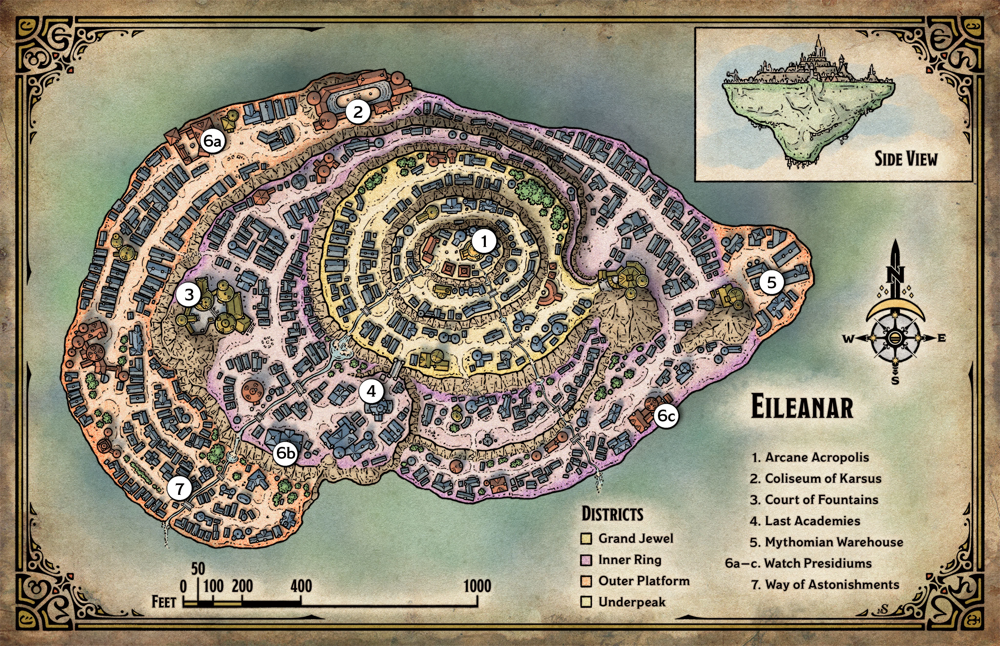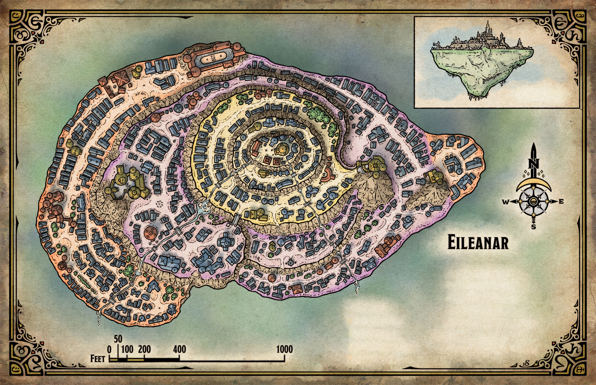Eileanar, also known as Karsus's Enclave or simply Karsus (after its founder and ruler), was a flying city and the crown jewel of High Netherese learning, culture, and magic. The following sections assume the characters visit Eileanar near the end of Netheril's Shadowed Age, though you should adjust descriptions as necessary if the characters visit the city earlier.

> ##### Music in Netheril
>
>Music is a vital part of Netherese culture. Musicians often use spells or enchanted instruments to enhance their playing.
>
>Among High Netherese, magical music is common. Music comes from everywhere and nowhere, and it responds to the environment with shifting tone, tempo, and improvised lyrics about passersby.
>
>Among Low Netherese, folk music can almost always be heard nearby. People sing while they work and make music to rest, celebrate, and mourn. Lone Low Netherese individuals often hum to themselves, unaware they're doing so.
>

### Eileanar Overview

Eileanar is ruled with absolute authority by Karsus, one of the most powerful mages in Netherese history. Karsus established Eileanar near the beginning of the Shadowed Age, and at first the mage was an attentive ruler. However, near the age's end, Karsus became increasingly absent from governance. The mage spent weeks at a time locked in his sanctum while pursuing the creation of a spell to grant himself the power of a deity. Karsus was convinced that, with this spell, he would save Netheril. While Karsus pursued his obsession, law and order deteriorated across the city.

#### Two Mythallars

Two mythallars are placed in Karsus's Arcane Acropolis in the Grand Jewel district. These mythallars, which are crystalline orbs that are 150 feet in diameter, keep the city airborne and fuel its magical luxuries.

#### City Government

Though the word of Karsus is the final law in all matters, Arcanist Andoris Derathar (Medium, Lawful Neutral **Mage**) has implemented her own brand of justice during Karsus's preoccupation. Derathar is a human who commands the city's watch and favors violence and hasty tribunals. Troublemakers who avoid on-the-spot execution are sentenced to combat in the Coliseum of Karsus, labor in the Hidden Quarter district, or hard labor in the mines of Conch. (See later in this chapter for details on these locations.)

#### Transportation

Magical conveyance is the norm in Eileanar. Within the city, *Tenser's Floating Disk* spells and flying steeds are commonplace, as are enchanted chariots and walkways that gleam with magical light.

#### News and Entertainment

Eileanar is famous for the speed at which information travels, passing through society's grand manors, magically projected proclamations in public plazas, and the whispers of Low Netherese servants. Scandal is one of Eileanar's favorite forms of entertainment. Another is watching outrageous clashes at the Coliseum of Karsus, where pure spectacle delights even the most jaded mages.

#### Supply and Demand

Every day, food and goods are magically transported from Low Netheril into Eileanar's Hidden Quarter district, where servants prepare and transport the items to the homes, institutions, and businesses of the upper class. At dusk, any waste is disposed of by magic or, more commonly, dumped off the flying city, to the dismay of those below.

#### Education

Eileanar boasts several of the greatest schools in all the empire, including the Last Academies in the Inner Ring district (detailed in "Eileanar Locations").

#### Religion

Scattered shrines dot Eileanar. The Netherese pay grudging respect to a few members of the Faerûnian pantheon, though they know some gods by different names. The Netherese commonly worship Amaunator, god of the sun; Chauntea (known as Jannath), god of agriculture; Talos (known as Kozah), god of storms; Mystra (called Mystryl in her previous incarnation), god of magic; Selûne, god of the moon; Shar, god of darkness and loss; and the god of fortune the Netherese know as Tyche, who eventually split into the gods known in the present day as Beshaba, god of misfortune, and Tymora, god of good fortune.

Priests and holy folk aren't respected in this enclave, and they're typically called upon only on certain ritual days for propriety's sake.

### Eileanar Districts

Eileanar is built on the inverted underside of a sheared-off mountain peak. It is divided into five districts.

Brief descriptions of Eileanar's districts are as follows:

- **Grand Jewel.** The Grand Jewel is Karsus's seat of power, from which his Arcane Acropolis shines with magical light.
- **Inner Ring.** The Inner Ring is the university district of Eileanar, as well as the location of its grandest parks, palaces, and plazas.
- **Outer Platform.** The Outer Platform is devoted to dwellings, commerce, and the raucous Coliseum of Karsus. It is surrounded by a wall of magical force that protects those who venture too close to Eileanar's edge.
- **Hidden Quarter.** Visually obscured by tunnels and illusions, the Hidden Quarter is the dismal dwelling place and industrial center for Low Netherese servants.
- **Underpeak.** Gravity inversions allow mages to construct upside-down palaces on the surface of the rock below the city. However, the Underpeak's cave systems are home to monsters as well as escaped magical experimentations.

### Eileanar Locations

The locations detailed here are among some of Eileanar's most famous landmarks. Use these locations when setting adventures in the city.

Eileanar is shown on *Map: Eileanar*.

#### Arcane Acropolis

>>The white marble of this acropolis glitters with an outline of magical force. Atop the acropolis, an enormous orb made of crystal shines with a powerful, pale light that rivals the sun.
>>

The Arcane Acropolis is Karsus's home, sanctum, and ruling palace. It is designed to awe and intimidate, to showcase his mastery of magic and serve his every whim as he develops ever more powerful spells.

At any given time, several human **Mages**, **Mage Apprentices**, and even **Archmages** (second in power to Karsus, of course) of all alignments can be found within the Acropolis's white marble walls. Inhabitants also include various magen (*see appendix B*) and summoned monsters, including Elementals and Celestials.

In the acropolis, gravity and time are shaped at Karsus's pleasure. Various areas have altered gravity or no gravity, as well as places where time is slowed or sped up. A gallery of levitating statues portrays the empire's greatest minds, with the floating image of Karsus largest and foremost of all. In the center of the acropolis stands Karsus's Sanctum, a pillared pavilion that looks out over the city.

***Reasons to Visit.*** Adventurers might visit the acropolis for one of the following reasons:

- **Karsus.** Adventurers might ask Karsus to cast impossible spells or bestow supernatural gifts, request that he intervene in some matter of law in the city, or seek to stop him from bringing down the empire through his obsessive hubris. Gaining an audience with the powerful mage is an adventure in its own right.
- **Two Mythallars.** The acropolis has two mythallars: one in a lower housing, which is used to empower the city's magic, and another just outside Karsus's sanctum, which keeps the city aloft. Adventurers might seek to harness the power of—or destroy—either mythallar.

> ##### Karsus's Game Statistics
>
>Karsus, a powerful human mage and the ruler of Eileanar, is meant to be a figurehead whose name looms large in Netherese culture. However, if the characters meet Karsus, use the **Lich** stat block for him, except Karsus is a Chaotic Neutral Humanoid who doesn't have the Spirit Jar ability.
>

#### Coliseum of Karsus

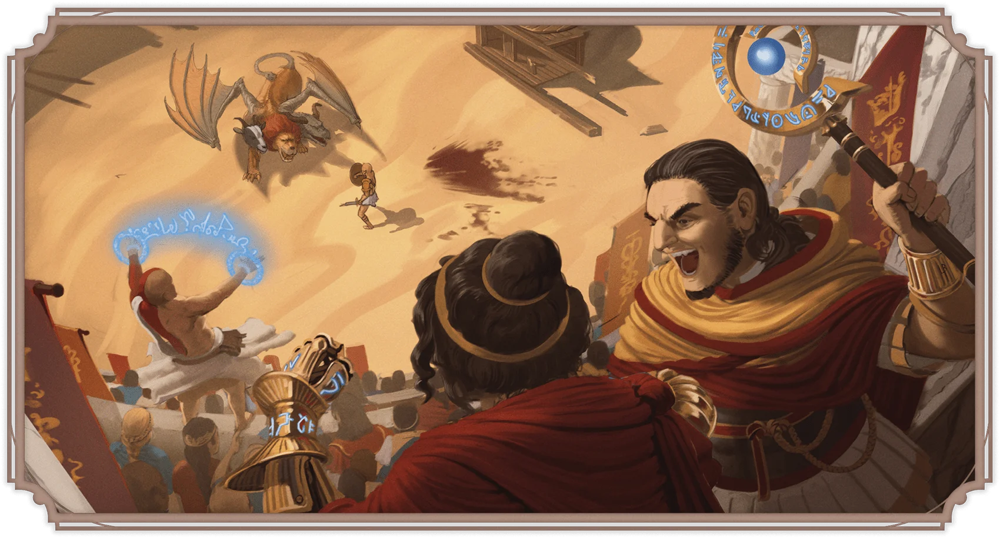

>>This circular structure of black stone is open to the sky. By day, it resounds with throaty cheers, agonized wails, and the sounds of a bloodthirsty throng stamping and roaring in unison while watching spectacular combat.
>>

Surrounded by market tents and drinking halls on the Outer Platform, the Coliseum of Karsus is the hub of entertainment in Eileanar. Here, droves of High Netherese can exchange a half-dozen coins for alcohol, a hot meal, and a seat from which to witness violent battles to the death. High Pitmaster Alaina Ioum (Medium, Lawful Neutral **Mage**), a stern elf, oversees the coliseum's operations and approves all combatants bound for the arena. The pitmaster is constantly seeking new and creative contest rules for the coliseum battles, and she often awards prizes to those whose ideas net the most spectators.

***Reasons to Visit.*** Adventurers might visit the Coliseum of Karsus for one of the following reasons:

- **Combat and Spectacle.** Adventurers might come to witness or partake in the battles staged here, which often reenact elements of Netherese history or mythology and always involve heavy amounts of showy magic. Additionally, the coliseum is where public executions take place, which adventurers might need to witness, prevent, or escape from.
- **Information Source.** Due to its widespread popularity, the coliseum is an easy place for an adventurer to bring a mark, a contact, or an enemy they can't corner anywhere else. It's the perfect place to buy a few secrets to go with your beer and fresh-roasted roc skewers.
- **Tunnel Access.** The size of the coliseum and its extensive underground service tunnels make it a perfect place to slip unnoticed into the Hidden Quarter district or older tunnels that lead to the Underpeak.

#### Court of Fountains

>>Situated in an enchanted grove, this marble-and-quartz palace of elven design rises gracefully toward the sky, encircled by music and glimmering light.
>>

One of the city's rare places meant solely for rest and reflection, the Court of Fountains is also Eileanar's most beautiful locale. The elf Aurivyl (Medium, Neutral Good **Archpriest**), a descendant of the Eaerlanni elves who taught the Netherese magic, is in charge here. Aurivyl ministers to the spiritual needs of all who enter the court. Wise and measured, she is the sole respected practitioner of divine magic in Eileanar and is in high demand for her wisdom, her healing magic, and her insight into the ways of the gods. Aurivyl worships Mystryl, god of magic, though followers of any or no god are welcome here.

Consulting with Aurivyl is free, but the court's other accommodations are expensive. The court is renowned for its graceful accommodations, healing pools of magical water, elegant dining rooms, tasteful salons, and striking gardens. Paths and bridges spiral and swirl everywhere. Some groves have no gravity, and visitors are encouraged to float among the beauty and reflect upon their lives.

***Reasons to Visit.*** Adventurers might visit the Court of Fountains for one of the following reasons:

- **Divine Magic.** Aurivyl's skill with divine magic is famous. Adventurers in need of healing, resurrection, or guidance in the ways of the gods would do well to seek her out.
- **Entertainment.** For adventurers seeking the fine life, the court offers the most elevated performances, the most elegant dances, and stunningly romantic gardens.
- **Place to Stay.** There is no finer lodging in all Netheril than the court, and its astronomical prices reflect its grandeur and sophistication. A single room costs 10 PP per night; a suite that sleeps five people costs 40 PP per night. Aurivyl is willing to barter in exchange for lodging, although the cost is usually steep.

#### Last Academies

>>Colorful peaks, spires, domes, and arches jostle for position and superiority in this district devoted to higher learning.
>>

The Last Academies, a collection of rival institutions, are named as such because once you finish here, there's nowhere else to learn. Each institution claims to be second to none. All the institutions are linked via permanent magical portals, which in turn link to other facilities on other flying cities.

Six famed institutions claim primacy here: the Academy of Mentalist Study, the Alchemical Seminary, the House of Ancient Scrolls, the Library of Netheril, the Shadow Consortium, and the University of Definitive Archwizardry. The head of top-level administration of the Last Academies is Karyne Xalroum (Medium, Lawful Neutral **Archmage**), a no-nonsense human who often delegates her duties to a host of human **Mages** of all alignments.

Despite their intellectual offerings, the Last Academies are dangerous places full of unstable magic and unchecked egos. Here, wild experiments cause frequent chaos and destruction, covered up by administrations that know no higher calling than pure knowledge and academic glory.

***Reasons to Visit.*** Adventurers might visit the Last Academies for one of the following reasons:

- **Magical Training.** Any adventurer seeking magical knowledge or training would do well to start at the Last Academies, although admittance requires a rigorous test of magical prowess that often proves deadly.
- **Research.** The Library of Netheril is one of the greatest repositories of spellbooks, magic scrolls, and tomes of lore in all the empire.
- **Shadow Consortium.** The most infamous institution in the Inner Ring, the Shadow Consortium is cloaked in mystery. Forbidden planar knowledge and even the secrets of lichdom are explored here.

#### Mythomian Warehouse

>>This massive, blocky warehouse dominates the skyline. Frosty mist curls around the doors and windows, and servants bustle back and forth in cold-weather gear.
>>

Kept magically cold, the Mythomian Warehouse in the Hidden Quarter is Eileanar's main clearing house for incoming goods and supplies. Fresh produce and frozen meats are kept here, as well as luxuries and spell materials best preserved in the cold. Low Netherese human **Commoners** and summoned **Ice Mephits** move frozen goods, while trained **Winter Wolves** patrol the grounds against would-be thieves and intruders.

Despite the warehouse's outward organization, rebellion simmers here. A human named Edrion Volaris (Medium, Chaotic Good **Spy**) is the High Netherese warehouse owner. Secretly, under the alias Liberax Volt, he is also the leader of the Free Warriors, an underground network dedicated to overthrowing the corrupt magocracy. Passionate and intelligent, Volaris hates the corruption that pervades the city. Volaris believes High Netherese treat Low Netherese abominably. From the warehouse, Volaris orchestrates strike missions to remove the wickedest mages from power and help the oppressed.

***Reasons to Visit.*** Adventurers might visit the warehouse for one of the following reasons:

- **Free Warriors.** Adventurers who are investigating the Free Warriors, or who wish to join its cause, can seek out Liberax Volt. If they prove their trustworthiness, the rebellion leader reveals himself. He might assign the characters tasks such as sabotaging powerful mages or freeing prisoners and captives.
- **Frozen Goods.** Secret chambers in the center of the warehouse contain precious eggs of icy monsters, forbidden substances, and even magic items best kept on ice. Adventurers might seek to plunder the frozen goods, claiming what they can before they are detected or succumb to frostbite.
- **Ice Plane Portals.** The icy portals conjured by mages are frigid cracks in reality leading to the Plane of Ice, Stygia (the frozen fifth layer of the Nine Hells), Limbo, and other distant planes. Adventurers might be asked to deal with monsters who crawl through these portals, or they might use these openings as entrances into places where mortals rarely tread.

#### Watch Presidium

>>Rising against the skyline is a windowless, domed fortress made of iron. It stands dour among buildings that shine with magical lights.
>>

The Watch Presidium has three identical branches from which the city's watch operates. Each branch includes several human **Guards** and **Mages** of various alignments who use permanent magical portals to move seamlessly between all three locations.

The branches are under the purview of Arcanist Andoris Derathar (see "Eileanar Overview"), who presides over law enforcement. The Presidium has only a few prison cells, primarily for temporarily holding the accused before they are sentenced to labor or sent to fight at the Coliseum.

***Reasons to Visit.*** Adventurers might visit the Watch Presidium for one of the following reasons:

- **Appeal to Authority.** Arcanist Derathar is usually found at one of the watch's branches, allocating resources or governing tribunals. Adventurers looking to sway the city's legal authority might approach Derathar, but they would do well to be cautious of her famously short temper and long memory.
- **Bounties.** The watch posts hefty bounties for those who escape its grasp. Adventurers looking to earn coin or seek out fellow rebels might check the information posted to the watch's bounty boards.
- **Crime and Punishment.** Adventurers who commit crimes or become entangled with resisting the ruling mages might find themselves interacting with the Watch Presidium.

#### Way of Astonishments

>>Magical shops line both sides of this grand avenue, each storefront a glimmering treasure box of sensory delight.
>>

Curving along the Outer Platform, the Way of Astonishments is closed to traffic, allowing patrons to freely wander and peruse the staggering array of magical shops and businesses here competing for attention and coin. High Netherese often bring their **Caldron Magen** (*see appendix B*) bodyguards to this busy area, since pickpocketing is rife.

Businesses include the following:

**Dundaden's Arcane Smithy**, for armor made more of magic than metal

**The Forge of Fargate**, for magical transportation that leads anywhere one wishes

**Ioulaum Industries**, for schematics and rare magical materials

**QM III**, for magic items curated by the famous human Parzal the Outrageous (Medium, Lawful Neutral **Archmage**)

**Rualadeen**, for enchanted weapons

***Reasons to Visit.*** Adventurers might visit the Way of Astonishments for one of the following reasons:

- **Buying and Selling Magic Items.** The shops here sell magic items from Common to Very Rare. Some shops also sell Legendary magic items, at your discretion.
- **Concealment.** The way's noise, crowds, abundant illusions, and chaotic displays make it the perfect place to give pursuers the slip. Adventurers might evade capture amid the hubbub or be led here by those they're chasing.
- **Investigation.** Adventurers might be hired to investigate a crime perpetrated at one of the shops or investigate a shop's sabotage at the hands of a competitor.

## Conch

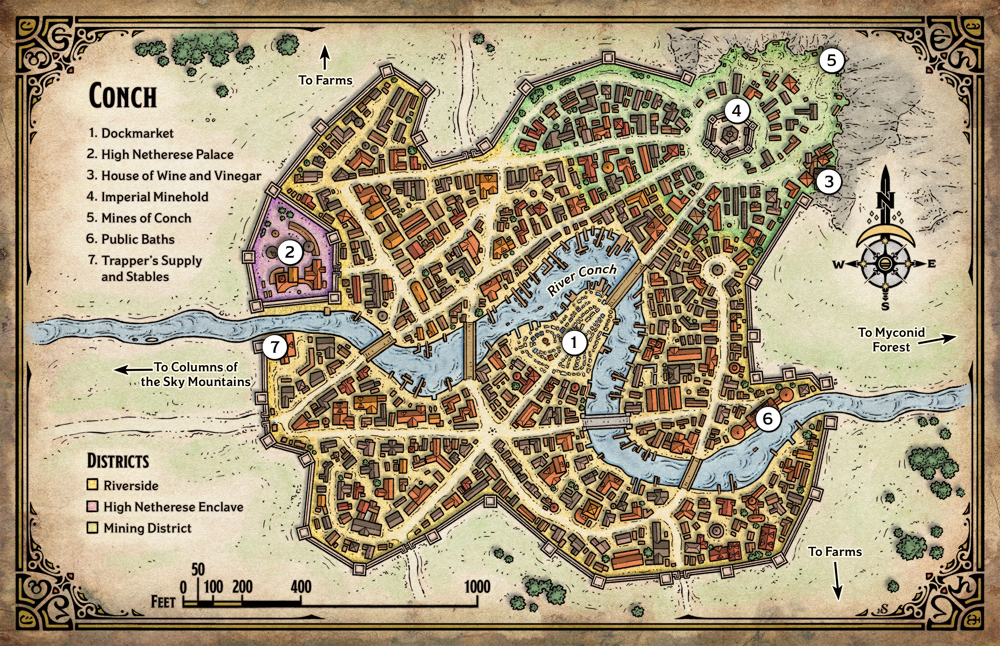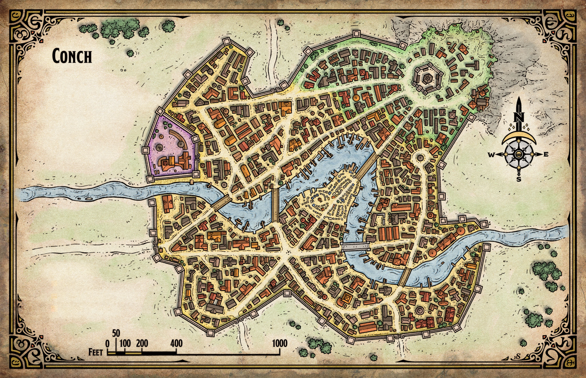Built along the river that shares its name, Conch was originally a quiet backwater in Low Netheril, where miners and trappers supported the empire. But the mines became lucrative, the riverway attracted crime, and the ruling mages grew greedy. Life in Conch can be difficult for the lower class, though it's luxurious for the ruling mages.

The following sections assume the characters visit Conch near the end of Netheril's Shadowed Age; you should adjust descriptions as necessary if the characters visit the city earlier.

### Conch Overview

The dominant industry in Conch is mining. Conch's mines are sprawling, dangerous, and worked by both locals and prisoners from across the empire. Beyond the mines, Conch exists in a constant tug-of-war between the interests of the ruling mages and the underhanded influence of river smugglers, who deal in all manner of illicit goods and are based in the city. Most residents do their best to work their menial jobs, feed their families, and avoid the attention of anyone with power.

#### Government

The city is nominally ruled by the High Council of Conch, a rotating group of powerful mages. The council keeps tenuous order by staying on the good side of river smugglers. Nenek Tril (Chaotic Evil **Lizardfolk Sovereign**), a powerful smuggler boss, has murdered more than one council mage who has asked too many questions about goods that go missing along the river.

#### Low Netherese Labor

While mages and smugglers jockey for control, Low Netherese work the land and water. These laborers serve as workers and supervisors in the upper mines alongside criminals sentenced to hard labor, hunt and trap in the nearby Myconid Forest, and farm the rocky soil and fish the Conch River. Come nightfall, Low Netherese gather to eat, drink, sing, and talk in their tight-knit communities, enjoying a few short hours together before the sun rises again.

#### Stone Walls

Conch huddles behind gray stone walls along the river. The massive walls are fortified with magical armaments.

#### Unrest

The uneasy balance of mages, Low Netherese laborers, and smuggling gangs has fended off threats to Conch's survival for decades. But recently, phaerimm attacks on the city's outskirts have become concerning. Similarly, incidents of Low Netherese resistance against the ruling mages have increased in recent years, with laborers demanding better pay and conditions in the mines. So far, the mages have ignored the laborers.

### City Sections

Conch is built around the river, which flows eastward from the Columns of the Sky mountains. It is surrounded by heavy fortifications and divided into three main sections.

Brief descriptions of Conch's sections are presented below:

- **High Netherese Enclave.** A tiny spike of land at the western edge of town is home to the walled enclave where High Netherese mages dwell. Music and sounds of carousing echo from these grand homes, their nighttime displays of magical light belying the suffering elsewhere in the city.
- **Mines.** The mines' surface overlooks an open quarry latticed with dangerous scaffolding. Inside, laborers have little air and light.
- **Riverside.** Most Low Netherese families live and work on the river to fish and move goods. Haphazard docks jut into the water, and seedy pubs and warehouses line the banks.

### Conch Locations

The locations detailed here are vital to everyday life in Conch. Use these locations when setting adventures in the city.

Conch is shown on *Map: Conch*

#### Dockmarket

>>Stalls and booths made of brown, green, and gray oilcloth stretch over the cold, misty banks of the Conch River. Vendors call out, hawking their wares.
>>

The Dockmarket is Conch's commercial hub. Crowded by waves of migrants fleeing the growing wasteland beyond the city, these booths are full of people seeking work or offering goods and services.

Smugglers' agents weave through the crowd picking pockets, making deals, and roughing up anyone who challenges them. Near the center of the marketplace, a whitewashed wooden wall towers over the heads of the crowd. Citizens of Conch scrawl offers of merchandise, requests for hired aid, and messages with hidden meanings across the wall. The talkative whitewasher Gemby Gray (**Lizardfolk Sovereign**) is an invaluable source of information here, as those who leave messages on the wall often share more context with the disarming woman, though it's unclear where Gemby's true loyalties lie.

***Reasons to Visit.*** Adventurers might visit the Dockmarket for one of the following reasons:

- **Commerce.** There's no better place to buy or sell nonmagical goods, information, or an adventurer's skills than the Dockmarket.
- **Criminal Contacts.** Adventurers looking to delve into Conch's underworld might start here. Smugglers and ruffians walk in broad daylight at the Dockmarket, throwing their weight around and only paying lip service to the mages' authority.
- **River Travel.** The Dockmarket is the departure point for boat travel up and down the river. Passage on a reputable ship can be bought for 1 GP per person. Cheaper travel, for 1 SP per person, is available on most smugglers' ships.

#### High Netherese Palace

>>A spiraled wall gleaming with colorful abjuration magic surrounds this marbled complex. Magical music wafts from the enclave's most magnificent home, while magical lights glitter here at night.
>>

Tucked safely inside the High Netherese Enclave is the High Netherese Palace, a gilded, garish structure. The richest mages live in this palace, while less-wealthy mages live in the enclave's relatively paltry abodes.

High Netherese who dwell in the enclave are rarely seen in the city's streets, leaving their enchanted complex only on winged steeds or via teleportation. The mages consider it gauche to speak of the city's other inhabitants. Particularly cruel toward the lower class is the human aristocrat Velma Vatoum (Medium, Neutral Evil **Archmage**), niece of the Imperial Minehold's governor. Velma's fabulous collection of jewelry is made from gems the governor steals from the mine. Velma is a willing participant in this scheme and finds it all great fun.

***Reasons to Visit.*** Adventurers might visit the High Netherese Enclave for one of the following reasons:

- **Carousing.** The mansion is filled with galleries, ballrooms, dining rooms, music halls, theaters, bars, and drawing rooms, each more decadent and delightful than the last. Adventurers invited by resident mages might wish to carouse here—or use the parties as a cover for committing underhanded deeds in the enclave.
- **Flying Steeds.** The mansion's paddocks house a variety of tamed and magically soothed flying steeds, including **Griffons** and **Pegasi**. The paddocks are closely guarded, but adventurers could gain access with the mages' blessing or through cunning and guile.
- **Spellcasting.** For the right price—or if it amuses them or serves their purposes—High Netherese mages here can cast spells on behalf of travelers.

#### House of Wine and Vinegar

>>This sprawling structure, built haphazardly over centuries from quarry stones, looks like a ruin from the outside. Its interior is bathed in lamplight and resonates with quiet music and hushed conversation.
>>

The House of Wine and Vinegar is a hospital and drinking hall adjacent to Conch's mines. Its proprietor, the human Low Netherese witch Cyrleine-of-the-Pond (Medium, Neutral Good **Archpriest**), has dedicated the facility to the miners and makes it known that mages are unwelcome here. Cyrleine worships Chauntea—known to the Netherese as Jannath, god of agriculture—though Cyrleine welcomes anyone who dislikes the ruling mages' authority.

Kind and dedicated, Cyrleine heals the injured with her *Staff of Healing* and ferments spiced wine that's famous throughout the city. She works closely with the friendly gnome Tacinbok (Small, Chaotic Good **Commoner**), a gifted inventor who wears a prosthetic leg. Tacinbok is famous for making high-quality prosthetics, which she often gives to injured laborers.

The house's barkeeps are married elves named Jorn and Sorfin Arborwend (Medium, Neutral Good **Commoners**), who are fabulous storytellers. The men pass along traditional fables and tales of local history to the children of miners who congregate here, encouraging the children to take pride in their Low Netherese families' resilience and rich culture.

***Reasons to Visit.*** Adventurers might visit the House of Wine and Vinegar for one of the following reasons:

- **Concealment.** The House of Wine and Vinegar offers an ideal place to hide from angry mages, as no High Netherese are allowed inside.
- **Healing.** Cyrleine-of-the-Pond is Conch's most famous healer. She can care for injured adventurers and even raise the dead, although she won't lift a finger to aid High Netherese or their causes.
- **Information Source.** The house is a place where miners and other Low Netherese can speak freely, without fear of reprisal from the mages. It's an excellent place to seek unvarnished information.

#### Imperial Minehold

>>A grim fortress magically carved from a single, massive peak of granite overlooks Conch's mines: the Imperial Minehold, a fortress of enforcers so tall that it nearly blots out the sun.
>>

The Imperial Minehold is the fortress for enforcers who uphold the mines' harsh productivity quotas. The Minehold has a fortified door and needle-thin windows to allow in trace amounts of light. Beyond its practical use, the Minehold is a show of strength, authority, and the empire's unyielding power.

The High Council of Conch meets in the Minehold, which overlooks the river and the city's teeming quarries. The Minehold's governor is also a High Council member: Arcanist Heldreth Mavilen (Medium, Lawful Neutral **Noble Prodigy**), a cruel human who has refused all recent requests from migrants for shelter in the Minehold's cavernous interior. She insists that the space is needed for ore refinement, though the mines' production has dwindled since the recent troubles began. Secretly, the governor steals choice gems from Conch's mines and gifts them to her niece, Velma Vatoum, who then commissions and shows off grand jewelry at high society balls in the High Netherese Enclave.

***Reasons to Visit.*** Adventurers might visit the Imperial Minehold for one of the following reasons:

- **Authority.** Adventurers petitioning (or targeting) the High Council of Conch can find them in session in the Minehold's upper chambers, which feature slitted windows overlooking the mine, river, and Dockmarket.

**Break In or Break Out**. The Minehold is a prison and a storehouse of imperial wealth. Adventurers might seek to break into the Minehold to loot or liberate. If the adventurers are captured, escaping from the Minehold might be their first step to freedom.

- **Permanent Magical Portals.** The Minehold houses permanent magical portals that transport large quantities of ore and gems to the industrial hubs of the flying cities. Adventurers wishing to travel to far-flung enclaves can disguise themselves as Low Netherese to access these circles.

#### Mines

>>A teeming mass of laborers shuffles along a broken cliff on swaying scaffolds, chipping at the rock with poorly maintained tools. Meanwhile, shouts of those toiling in deeper mines echo from deep, dark shafts.
>>

Conch's mines produce stone, gems, and ore. Designed for productivity with no regard for miners, the mines punish wrongdoers and remind laborers that the empire is mighty and unmerciful.

The mines have three levels. Outside, the cliff quarry is veined with rickety scaffolding built from wood and rope. Inside, the upper mines are crowded and hot. Deeper still, tunnels and vents lead into the dangerous heart of the mines.

The mines are worked by prisoners and poor Low Netherese, who might also be supervisors or captains. Some are cruel, while others, like the human Grifud Romerus (Medium, Lawful Good **Tough Boss**), hope to provide relief to those under their command. Grifud is known for small acts of kindness such as carrying food and drinks for the miners, granting occasional breaks, and supporting the workers' demands for better pay and conditions.

***Reasons to Visit.*** Adventurers might visit the mines for one of the following reasons:

- **Imprisonment.** Adventurers who displease the mages might find themselves sentenced to hard labor in the mines. Alternatively, they could voluntarily approach the mines in hopes of freeing someone from the same fate.
- **Mining.** Adventurers might risk entering the mines in search of rare gems or minerals. Some High Netherese pay dearly for skilled adventurers willing to raid the mines' deeper levels and bring back the spoils.
- **Rumors of Monsters.** The farthest tunnels contain horrors for which the miners have no name. Adventurers might be drawn to tales of phaerimm (*see appendix B*), beholders, mind flayers, and other terrors of deep shadow in hopes of banishing such evils.

#### Public Baths

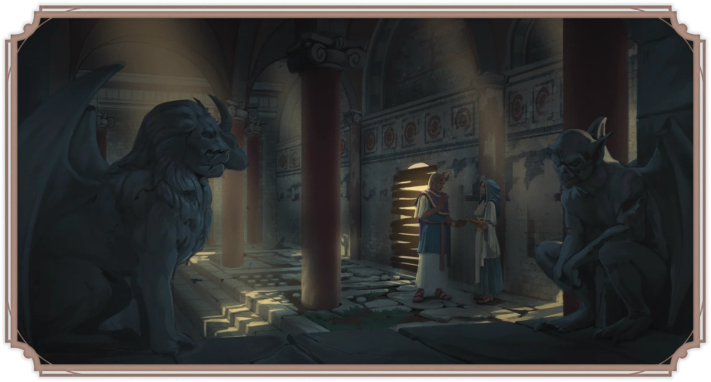

>>The exterior of this once-grand Riverside structure features defaced statuary and shattered fountains. Crude signs, reinforced by posted guards, read "Keep Out."
>>

The public baths were built in a bygone era when High Netheril hoped to deal justly with its subjects in Conch. But when the battle lines between mages, laborers, and smugglers were drawn, this Riverside institution fell into disrepair and disrepute. High Netherese no longer wished to spend money on an amenity for people they came to see as enemies. The baths now serve as headquarters for Conch's smuggling operations and are crawling with criminals.

Rooms of swirling steam fed by natural vents provide the perfect setting for smugglers to speak unobserved. Smuggler bosses frequent the baths, though perhaps no one is as regular a visitor as the smuggler boss Nenek Tril (see "Government" above). Here, Tril hears rumors of High Netherese causing problems for smuggling operations, and she arranges to have these mages eliminated.

***Reasons to Visit.*** Adventurers might visit the public baths for one of the following reasons:

- **Buying or Selling Smuggled Goods.** The baths are adjacent to the river, and anything too valuable to be sold at the Dockmarket winds up here, stored in a closed and drained bathing chamber until a proper buyer can be found.
- **Place to Stay.** Those on the wrong side of the law can stay in dried-out steam rooms or bunks slung over sulfurous pools as long as no one else has claimed the space.
- **Shady Dealings.** Adventurers seeking to do business with criminals away from the eyes of the Watch Presidium will find plenty of unscrupulous individuals lurking in and around the baths.

#### Trapper's Supplies and Stables

>>This two-story, ramshackle outbuilding looks like it might collapse at any moment.
>>

The stables and the nearby supply warehouse for forest-bound trappers are institutions. Here, adventuring gear and steeds can be rented or purchased, provisioning all heading into the wilds outside the city.

The stables are low on horses at present; most have been cleared out to make room for refugees from the encroaching wasteland. The establishment's orc proprietor (Medium, Neutral Good **Commoner**) is known only as Father. Father rarely speaks, but the fact that he opened up his yard and stables to migrants speaks volumes for his good heart and compassion for the needy.

***Reasons to Visit.*** Adventurers might visit Trapper's Supply and Stables for one of the following reasons:

- **Lodging and Supply.** Father allows anyone to camp on his floors and yards, no questions asked and no payment required. The simple goods and provisions available in the store are fairly priced and frequently restocked.
- **Rumors from the Wild.** Adventurers might visit the supply to hear from trappers or migrants about their encounters in the wilderness.

------

# Chapter 2: Netherese Magical Anomalies

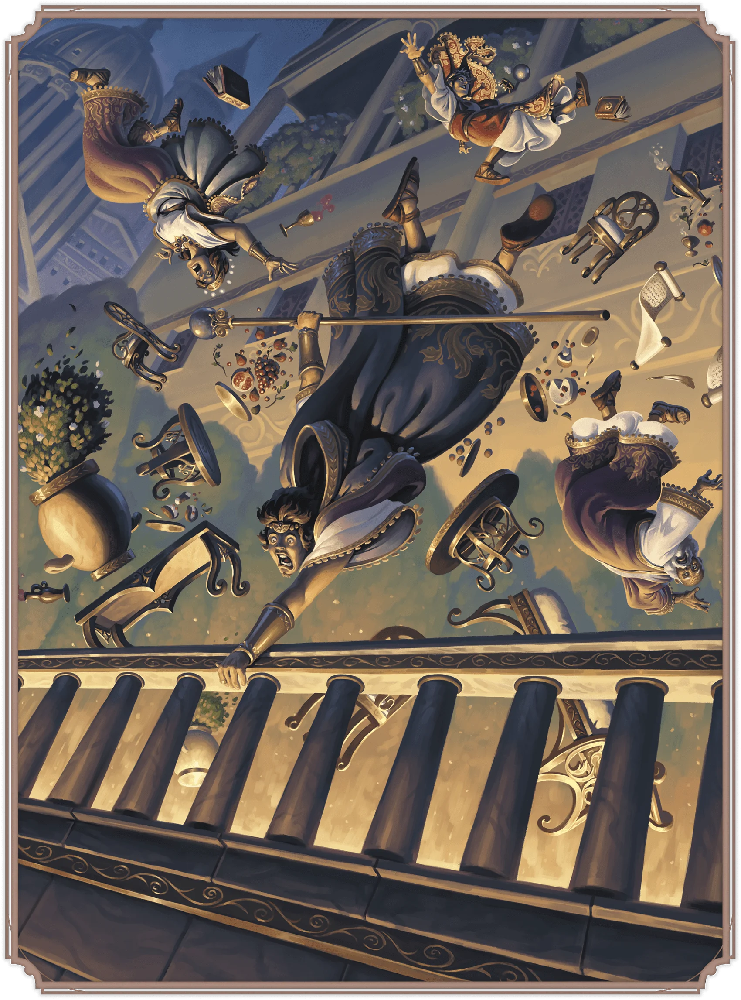

In ancient Netheril, rampant magical experimentation created unique environmental effects and magical hazards. At your discretion, some of these effects might persist in your present-day campaign.

## Environmental Effects

These magical environmental effects supplement the effects found in the *Dungeon Master's Guide*.

### Communal Telepathy Zone

Places in Netheril where mages engage in intense magical study for prolonged periods sometimes result in an intellectual hivemind where conceptual thought transcends language. These areas, known as communal telepathy zones, are typically no more than 300 feet in diameter.

Creatures with an Intelligence score of 8+ in a communal telepathy zone gain telepathy with a range of 30 feet.

### Dampened Magic Zone

Dampened magic zones arise where magic is failing or being absorbed by a powerful Artifact. This effect might ebb and flow based on other natural or supernatural phenomena, such as at twilight or after magical weather.

In a dampened magic zone, which is typically no more than 300 feet in diameter, magical effects sputter feebly or appear ephemeral. When a creature in the area casts a spell with a duration of 1 minute or longer, the spell's duration is halved. Spell attack rolls in the area are made with Disadvantage, and creatures have Advantage on saving throws against spells and other magical effects.

### Eerie Chanting Zone

Regions where magical rituals with harmful effects habitually occur can resonate with disconcerting chanting, even after the rituals are complete.

In an eerie chanting zone, which is typically no more than 300 feet in diameter, discordant chanting insinuates itself into the mind. Creatures have Disadvantage on Wisdom (Perception) checks and on Constitution saving throws to maintain Concentration.

### Empowered Force Zone

Netherese mages often work magical energy into physical shapes such as unique jewelry, ostentatious decor, or even into creatures such as magen (*see appendix B*). Areas where magic has been frequently refined, known as empowered force zones, amplify raw magical energy and are typically no more than 300 feet in diameter.

When a creature in an empowered force zone rolls damage for a spell or attack that deals Force damage, it treats any 1 or 2 on a damage die as a 3.

### Low Gravity Zone

Many structures in Netheril's flying cities defy gravity. The rampant Transmutation magic used to achieve these effects can go haywire, resulting in a low gravity zone, which is typically no more than 300 feet in diameter.

In a low gravity zone, creatures quadruple the distance they can leap with a High Jump or a Long Jump, and the damage creatures take from falling is halved (round down).

### Unstable Gravity Zone

Netherese mages often commanded gravity to bend to their will, but gravity isn't so easily controlled. Overuse of gravity-altering magic can cause it to oscillate unpredictably, creating an area of unstable gravity.

An area of unstable gravity is normally filled with debris from smashed objects that aren't affixed to a surface. A creature near an area of unstable gravity can identify its presence by noticing these smashed items, taking a Study action, and succeeding on a DC 15 Intelligence (Investigation) check.

The effect is the same as the *Reverse Gravity* spell (save DC 16), except that it is permanent and typically covers an area that is 60 feet in diameter and 60 feet high. Every 1d4 rounds, the effect is suppressed for 1d4 rounds and normal gravity returns, causing creatures and objects to fall.

## Magical Hazards

These magical environmental effects supplement the effects found in the *Dungeon Master's Guide*.

### Example Magical Hazards

Hazards are presented in alphabetical order.

- Arcane Effluence
- Glittermoss
- Shadowbark
- Wildstorm
- Witchbriars

------

# Chapter 3: Through the Time Gates

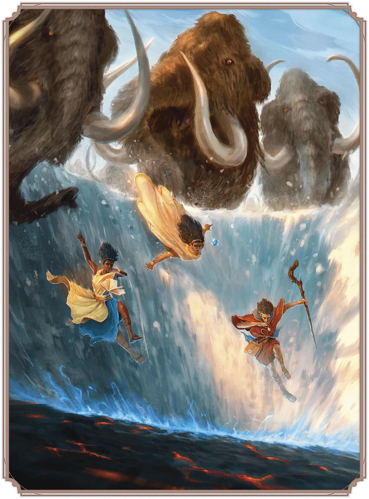

Scattered throughout Faerûn are places of temporal magic so powerful they allow travel through space and time. This chapter details two such time gates leading to cities in ancient Netheril.

You might want your characters to travel to these time gates and into their linked Netherese cities as part of specific adventures. In this case, examples of such adventures are detailed below. If you wish to skip the time gates and start a game in ancient Netheril, *chapter 4* provides adventures that take place in Eileanar and Conch.

Time gates are powerful game mechanisms, and you should allow them in your game only to facilitate the stories you want to tell. Feel free to change any details about the time gates in this chapter as you see fit.

## About Time Gates

Time gates are little-known and ancient magical portals similar to a planar portal (see the *Dungeon Master's Guide*), except they are permanent, stationary connections with a portal that links two specific times and places on the Material Plane. The earliest texts tied to gods of magic mention time gates' existence, though their locations are well-kept secrets.

Time gates are magical objects that have Immunity to all damage. A time gate might have a literal doorway built around its portal, or a time gate's portal might be at the bottom of a pit or open through a shimmering veil in the air. Regardless, time gates' portals are always visible. The "other side" of the portal might look as conspicuous or as subtle as the portal's location in the present day, though both sides of the portal need not look the same.

Such a portal commonly looks like a shimmery blue mirror. Instead of a reflection, however, the portal usually shows a faraway image of the place the time gate leads to.

### Relative Time Gates

The time gates described below are relative—they connect two locations that are separated by a fixed interval of time. The time gate called Fool's Needle, in the Anauroch desert, leads to the flying city of Eileanar exactly 1,839 years in the past. For example, if characters step through the gate on the first day of Tarsakh, 1501 DR, they emerge in Eileanar on that same date in the year–338 DR (which is 3520 in the Netheril Year calendar). The time gate in the High Ice, called the Forgotten Chamber, leads to the port city of Conch, also 1,839 years in the past. The year–338 DR is one year before Karsus's Folly.

Relative time gates allow for travel in both directions. A character in the past who enters the portal is transported forward a fixed interval in time (1,839 years, in the case of the portals in this chapter).

### Other Time Gates

Other time gates in Faerûn connect two points in time in different ways. Some transport travelers to a random time and place. Others respond to the wishes of the traveler, so those who travel through the gate while thinking about a specific time and place in the past are transported to that location. Still others always lead to a specific day or even moment in time. You can use such a time gate in your game to transport characters to any location at any time.

### Time Gates' Environments

The existence of a time gate warps the surrounding area. The following effects persist within 1 mile of a time gate:

- **Strange Weather.** The atmosphere of another era mixes with that of the present day, often creating unusually colored fog, erratic rain, incongruous wind, or rainbows.

**Nature out of Time.** Long-extinct creatures, such as **Mammoths** or **Saber-Toothed Tigers**, wander the area. Other creatures in the area might be heavily evolved and strangely shaggy or oddly patterned.

- **Alien Features.** Potent temporal magic saturates colors and exaggerates the land's physical features. Geography is often warped, with strange rock or ice formations arising at angles that defy gravity.

As a Study action, a character can examine the surroundings and make a DC 10 Intelligence (Arcana or Investigation) check. On a successful check, the character realizes the signs of a nearby time gate. Spellcasters can also seek knowledge about the time gate and where it leads by casting spells such as *Commune with Nature*, *Speak with Animals*, or *Speak with Dead.*

#### Severe Temporal Effects

The closer characters come to a time gate, the stronger its temporal magic swirls, creating even more potent effects. Roll or choose an option on the Weird Time Gate Effects table below to determine the effects within 60 feet of a portal:

##### Weird Time Gate Effects
| 1d4 | Effect                                                                                                                                                                                      |
|:---:|---------------------------------------------------------------------------------------------------------------------------------------------------------------------------------------------|
|  1  | Extreme Weather. The area has one environmental effect: extreme cold, extreme heat, heavy precipitation, or strong wind (see the *Dungeon Master's Guide* for details about each).          |
|  2  | Dulled or Warped Magic. The area is a dead magic zone or wild magic zone (see the Dungeon Master's Guide for details about both). The presence of either zone doesn't affect the time gate. |
|  3  | Fast Movement. All creatures' Speeds are doubled.                                                                                                                                           |
|  4  | Slow Movement. All creatures' Speeds are halved (round down).                                                                                                                               |

## Fool's Needle

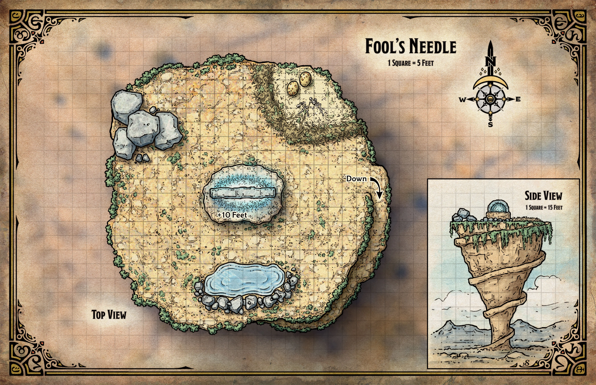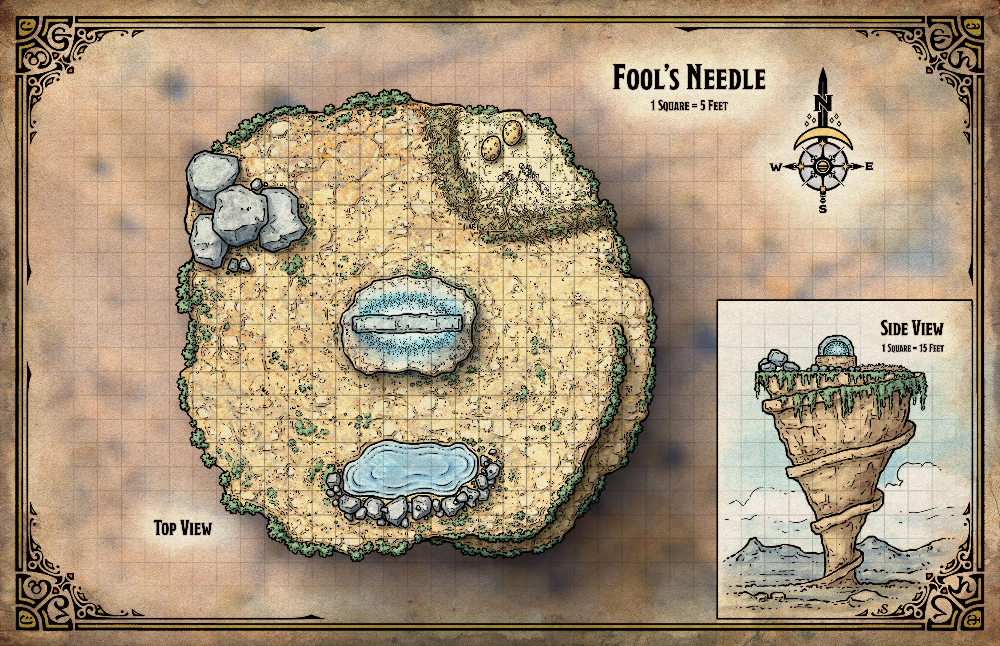In the wilds of Anauroch, nestled among the Plain of Standing Stones, a time gate at a place called Fool's Needle leads to the flying Netherese city of Eileanar, 1,839 years in the past. Also known as Karsus's Enclave, Eileanar is detailed in *chapter 1*.

Fool's Needle is a towering structure made of quartz and granite. It stabs from the sky into the desert floor, narrowing as it descends. The desert's inhabitants, who named it, say it is a cursed place to be feared and shunned. Their tradition tells that only death awaits those who attempt to scale it.

Fool's Needle is shown on *Map: Fool's Needle*. The sections below provide general information appropriate for creating adventures of any level here; simply fill in your encounters with appropriate creatures from the *Monster Manual*. An example adventure follows later in this chapter.

### The Needle's Ascent

A steep, spiraling, rocky path winds from the desert floor up the spike, as shown on the inset. The path's treacherous nature makes it Difficult Terrain. The path is 5 feet wide. Travelers attempting the climb are exposed to rockslides (see the *Dungeon Master's Guide*), as well as the predators roosting atop the structure, described further below.

Near the top of Fool's Needle, strange ferns grow from the rock, and brightly colored songbirds feed on jeweled dragonflies. Flickers of magical light dance harmlessly at the edges of one's vision.

### The Needle's Summit

The top of Fool's Needle is a wide, flat area about 90 feet across. In the northeast corner, flying predators have built a roost. The northwest corner is piled with rocks, while the southern half holds a 10-foot-deep pool of bright-blue water. In the center of the plateau is a 30-foot-wide, 10-foot-tall mesa atop which stands the portal that leads to Eileanar. A distant view of the flying city is visible from either side of the portal.

### Into Eileanar

Those who pass through the portal step onto a marble walkway surrounded by electric-green shrubbery, colorful flowers, and floating marble statues of imposing mages. This is the Court of Fountains in Eileanar, described in *chapter 1*.

## Adventure at Fool's Needle

The following adventure sends characters to Fool's Needle and into Eileanar beyond.

### A Point of Pride

*Adventure for Level 3 Characters*

- **Situation.** A lifetime of research has led a dying sage to discover the time gate to Eileanar in the Anauroch desert.
- **Hook.** The kind, elderly human Krazbrax Nixel (Medium, Lawful Good **Noble**) is on death's door in Dagger Falls in the Dalelands, and the characters have a close relationship with him. Unable to travel, Krazbrax asks the characters to go to Fool's Needle, travel through the time gate's portal, confirm it leads to ancient Netheril, and report back with proof. Krazbrax promises to pay each character 150 GP for their efforts and tells them they can keep any Netherese treasures they find.

#### Encounters

If needed, Krazbrax arranges for the characters' transportation to the base of Fool's Needle. The trip is uneventful. The adventure then consists of the following encounters, which take place on *Map: Fool's Needle*. Throughout this adventure, the characters are subject to the desert's extreme heat (see *chapter 3* of the *Dungeon Master's Guide*).

***Desert Floor.*** Two **Giant Scorpions** lurk near the base of the spiraling path at Fool's Needle. Characters with a Passive Perception score of 12+ notice the creatures buried in the sand. When a character comes with 15 feet of a scorpion, the creatures begin combat.

***Early Ascent.*** Due to the winding nature and Difficult Terrain of the ascending path, it takes 3 hours to navigate the first 85 feet. During this journey, the characters are subject to a rockslide (see the Dungeon Master's Guide) that carries the characters back down the path. After the rockslide is resolved, roll or choose an effect from the *Weird Time Gate Effects* table earlier in this chapter. This effect is present for the rest of the characters' climb.

When the characters are 40 feet from the summit, three **Griffons** roosting there fight them. When the characters are 20 feet from the summit, another rockslide carrying back down the path occurs (see the *Dungeon Master's Guide*).

***Summit.*** Once the characters reach the top of Fool's Needle, they discover one or more strange creatures lurking near the portal. Roll or choose an option on the Fool's Needle Gate Creatures table below. All creatures are Hostile toward the characters and fight until destroyed.

##### Fool's Needle Gate Creatures
| 1d6 | Creature                             | Details                                                                                                                                                          | Difficulty |
|:---:|--------------------------------------|------------------------------------------------------------------------------------------------------------------------------------------------------------------|:----------:|
|  1  | **Flameskull**                       | The remains of an overzealous Netherese mage, this creature is enraged and confused after accidentally floating through the time gate.                           |  Moderate  |
|  2  | Two **Basilisks**                    | The result of irresponsible summoning, these aggressive creatures wreaked havoc in Eileanar until their summoner accidentally shoved them through the time gate. |  Moderate  |
|  3  | **Helmed Horror**                    | A magical bodyguard to a low-ranking mage, this creature wandered through the time gate and thinks the characters threaten its creator.                          |  Moderate  |
|  4  | **Beholder Zombie**                  | This magical experiment gone awry doesn't seem to know or care that it wandered through the time gate; it wants only to destroy everything it can.               |  Moderate  |
|  5  | **Eldritch Eddy** (*see appendix B*) | This dangerous magical storm originated in Eileanar and now rampages on Fool's Needle.                                                                           |    High    |
|  6  | **Virvos Magen** (see appendix B)    | This confused Netherese servant took a wrong turn on the way to a party; it's convinced the characters have killed its master.                                   |    High    |

***Conclusion.*** Once the way to the gate is clear, the characters can travel through time into Eileanar. When they do, each character earns 400 XP.

The flying city is the site of the characters' next adventures, as you see fit. Providing Krazbrax with proof the characters visited Eileanar might be as simple as describing the wonders the characters saw at the Court of Fountains. Or perhaps Aurivyl, the elf in charge of the court (see *chapter 1*), offers the characters a Common or Uncommon magic item from appendix A in exchange for the characters' retrieval of an important tome or spellcasting components found elsewhere in the city.

Once the characters return through the portal to the present, they can easily make their way back to Dagger Falls, where Krazbrax gives the characters their reward.

## The Forgotten Chamber

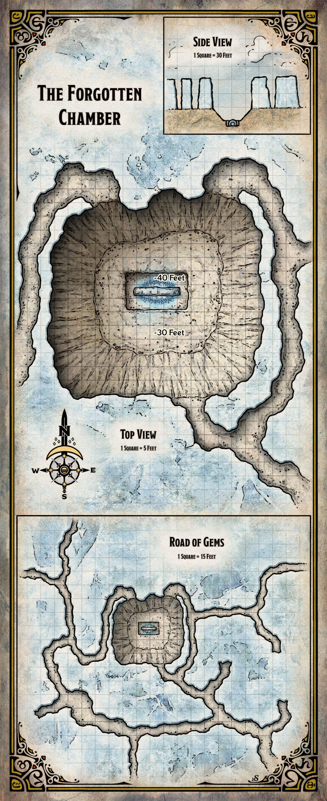In the western High Ice north of the Oume Rift lies a time gate nestled in what sages call the Forgotten Chamber. The time gate leads 1,839 years in the past to the ancient Netherese city of Conch, which was once a central river-port city that thrummed with commerce. In Netheril's waning days, civil unrest against the ruling mages, as well as attacks from phaerimm, made Conch a volatile place. For more about Conch, see *chapter 1*.

The Forgotten Chamber lies inside a dormant volcano's caldera along a path called the Road of Gems, which winds through the High Ice. The Forgotten Chamber is shown on *Map: The Forgotten Chamber*. The sections below provide general information appropriate for creating adventures of any level here; simply fill in your encounters with appropriate creatures from the *Monster Manual*. An example adventure follows later in this chapter.

### The Road of Gems

A natural glacial rift, the Road of Gems spiderwebs through the region, cutting through solid ice that often rises over 30 feet on both sides. Over the centuries, miners have discovered many caves full of precious stones and minerals near the Road of Gems.

The Road of Gems section of *Map: The Forgotten Chamber* shows the road's layout in the area surrounding the Forgotten Chamber. Where the road dead-ends, the path dips underground into mines or caverns. Exploring these is outside the scope of seeking the time gate in the Forgotten Chamber. If you'd like to include these areas in your game, consider using the Mine and Underdark Warren maps in *appendix B* of the *Dungeon Master's Guide* and populate them with creatures from the Underdark Monsters list in *appendix B* of the *Monster Manual*.

### The Caldera

The caldera surrounding the Forgotten Chamber's time gate is accessible from three points via the Road of Gems (or from overhead for flying characters). The caldera slopes downward at a steep angle, making the caldera's lip Difficult Terrain. The bottom of the caldera is flat and surrounds a 10-foot-deep chasm that holds the time gate's portal. A distant view of the port city is visible from either side of the portal.

### Into Conch

Those who pass through the portal from the Forgotten Chamber emerge from a wall just inside the mouth of a mineshaft in Conch. Stepping outside reveals a busy quarry filled with Low Netherese laborers toiling under the close eye of an angry, despotic human spellcaster named Jharsinius (Medium, Neutral Evil **Mage**).

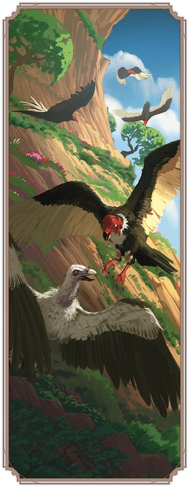

## Adventure at the Forgotten Chamber

The following adventure sends characters to the Forgotten Chamber and into Conch beyond.

### The Missing Gnome

*Adventure for Level 3 Characters*

- **Situation.** A beloved but eccentric gnome scholar in Graevelwood, a settlement two hundred miles west of the Forgotten Chamber, has uncovered the Forgotten Chamber's location as well as details about the time gate there. Named Vigglestern (Small, Neutral Good **Noble**), the scholar is fascinated with ancient Netheril; after several townspeople refused to believe his discovery, Vigglestern set out for the High Ice with the intent to time travel into Conch and bring back proof he's visited Netheril.
- **Hook.** The leader of Graevelwood is Vigglestern's granddaughter, a gnome named Zalneen (Small, Neutral Good **Commoner**). She discovered a note her grandfather left detailing his intentions and is terrified for the older gnome's safety. Zalneen offers to pay the characters 150 GP each to follow Vigglestern's trail and bring him safely home.

#### Encounters

Graevelwood lies in the eastern reaches of Arn Forest. The journey from the forest, across a narrow strip of cold desert, and into the High Ice is uneventful. Vigglestern has several days' head start on the characters, though remains of recent campfires suggest the characters are close on the gnome's trail.

Allow the characters to approach the Forgotten Chamber from whichever direction they wish. The characters run into trouble once they reach the section of the road shown on the bottom of *Map: The Forgotten Chamber*.

***Unwitting Prey.*** Two **Winter Wolves** begin stalking the characters. Any character with a Passive Perception score of 16+ notices the wolves, whose den is in a nearby cavern of your choosing. If no characters notice the wolves, the wolves ambush the characters, staying near each other to take advantage of their Pack Tactics ability.

***Surprise.*** Once a character is within 100 feet of the caldera's lip, a **Young Remorhaz** bursts from the ground. The remorhaz retreats if it is Bloodied.

***A Bloody Scene.*** This encounter takes place in the central portion of *Map: The Forgotten Chamber*. Once the characters reach the bottom of the caldera, they find a few drops of blood leading into the portal. The blood belongs to Vigglestern. Before the characters can climb into the chasm, a strange creature confronts them; Vigglestern tripped and injured himself while running away from this creature before the gnome jumped through the portal.

Roll or choose an option on the Forgotten Chamber Gate Creatures table below. All creatures are Hostile toward the characters and fight until destroyed.

##### Forgotten Chamber Gate Creatures
| 1d8 | Creature           | Details                                                                                                                                                     | Difficulty |
|:---:|--------------------|-------------------------------------------------------------------------------------------------------------------------------------------------------------|:----------:|
|  1  | **Yeti**           | Unaware of the time gate, this yeti lives in the caldera and defends it from intruders.                                                                     |     Low    |
|  2  | **Hook Horror**    | This confused predator wandered through the portal from a nearby mining tunnel in Conch.                                                                    |     Low    |
|  3  | **Ghost**          | The remnants of a High Netherese shift commander who was poisoned by her workers, this furious Undead assumes the characters are responsible for her death. |  Moderate  |
|  4  | **Ettin**          | This obstinate creature was indiscriminately killing miners when it accidentally wandered through the portal.                                               |  Moderate  |
|  5  | **Black Pudding**  | High Netherese mages released this creature into Conch's mines to punish disobedient miners, but it mistakenly trudged through the portal.                  |  Moderate  |
|  6  | **Giant Axe Beak** | This oblivious creature wants to build a nest in the chasm that holds the portal.                                                                           |    High    |
|  7  | **Otyugh**         | This creature gorged itself on trash from Conch's mining tunnels before accidentally lumbering through the portal.                                          |    High    |
|  8  | **Troll**          | A scout for a larger band of trolls, this creature wants to clear the caldera of all threats before its companions move in.                                 |    High    |

***Finding Vigglestern.*** When the characters step through the portal and emerge in Conch, they can easily follow the trail of Vigglestern's blood into a nearby alcove inside the mining shaft. When the characters find the gnome, each character earns 400 XP.

The injured Vigglestern has 5 Hit Points remaining. Although the shouting from the mines' overseers terrify him, the gnome refuses to accompany the characters back to Graevelwood without some proof of his journey to Conch.

Any character can argue that describing Conch's mines is proof enough for Graevelwood's villagers to believe Vigglestern, who should stay hidden due to the place's dangers. The gnome readily agrees and asks the characters to explore the area, take note of details, and return to him when they're ready to go home.

At your discretion, the characters might also confront Jharsinius, the overseer of this section of the mine (see "Into Conch"). Jharsinius is outside the mineshaft shouting at four human Low Netherese **Commoners**, whose productivity the mage finds lacking. Jharsinius carries a *Magen Handbell* (*see appendix A*).

***Conclusion.*** Once the characters return Vigglestern to Graevelwood, Zalneen gives them their promised reward.

------

# Chapter 4: Escape From the Past

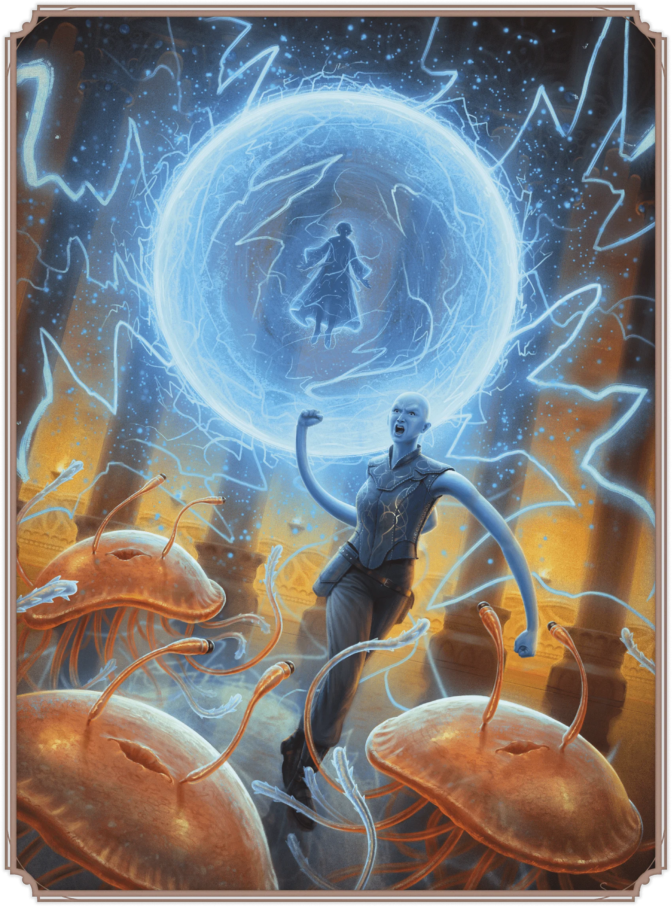

Experimentation with temporal magic was rife before Netheril's fall. At key points in Netherese history, the fabric of time and space frequently thinned and warped.

You can use this warped fabric to pull your characters from any period in the Forgotten Realms or beyond into ancient Netheril, where they can adventure before discovering a way back home.

## Time-Travel Adventures

The adventures in this section deposit characters into harrowing situations in ancient Netheril.

### Attack of the Phaerimm

*Adventure for Level 3 Characters*

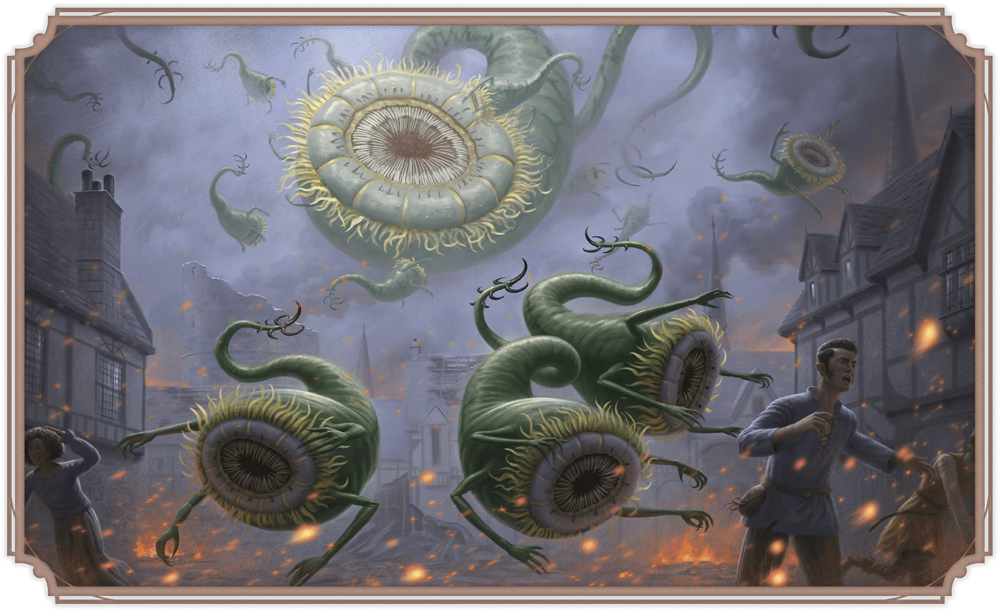

- **Situation.** A Netherese mage named Tyvern was conducting a time-travel experiment in a chamber in his workshop in Conch when phaerimm attacked the city. The interrupted experiment exploded in a blast of temporal energy, pulling the adventurers to the workshop.
- **Hook.** The characters find themselves in a magical workshop in Conch in the midst of a phaerimm assault during Netheril's Shadowed Age. They are in immediate danger and must escape before they can find a way home.

#### Encounters

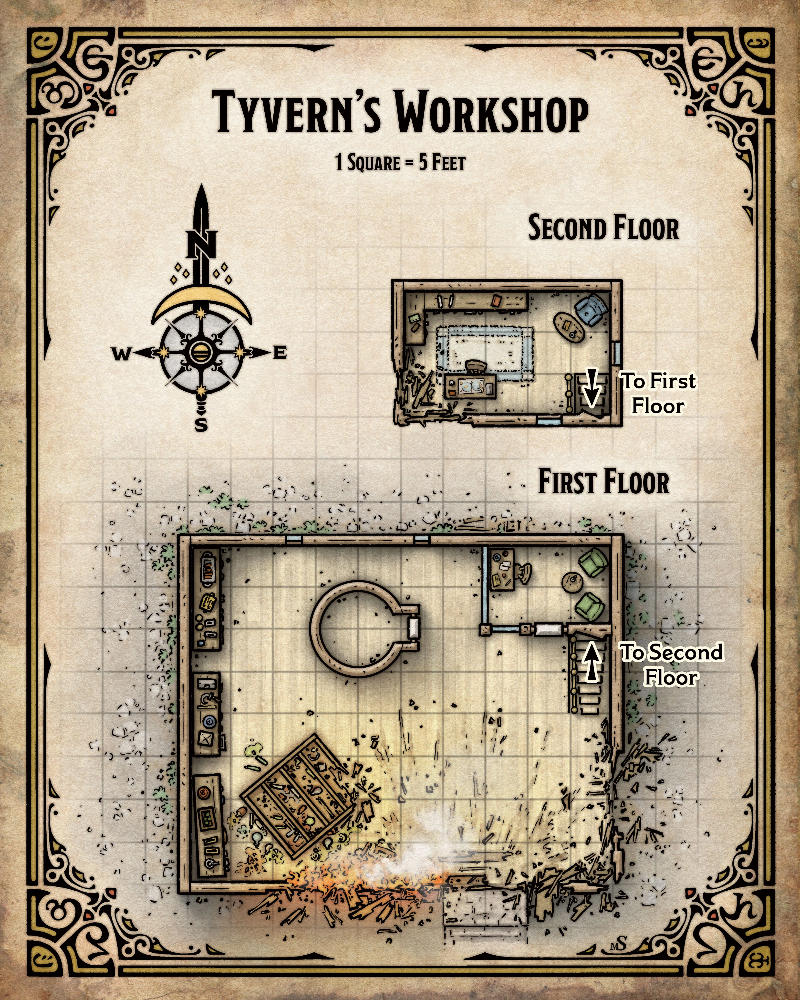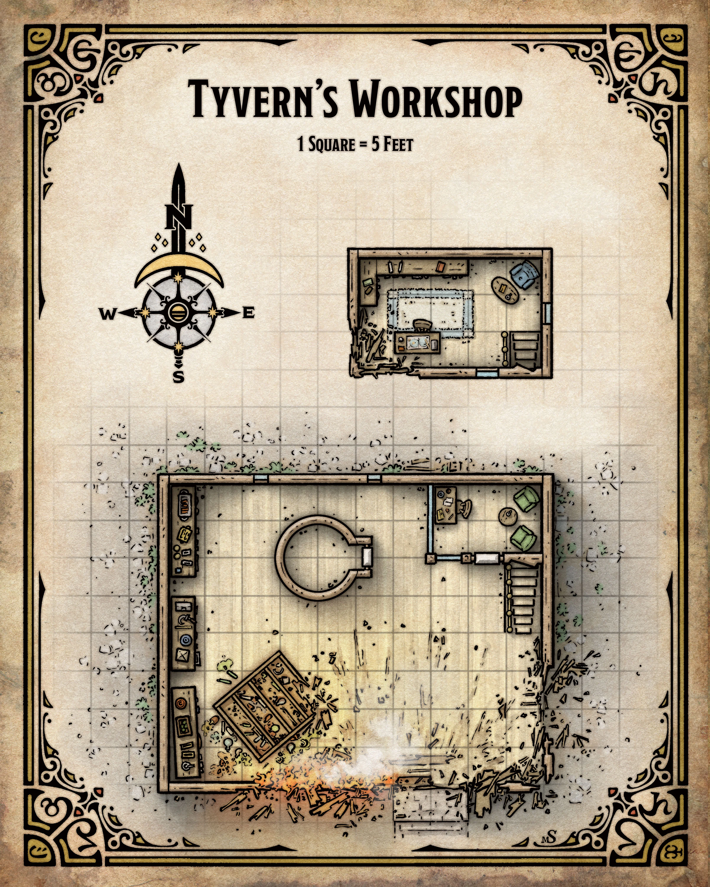This adventure consists of the following encounters and takes place on Map: Tyvern's Workshop. Squares with rubble or flames in them are Difficult Terrain.

***Sudden Disaster.*** An explosion of white energy transports the characters to the center of the first floor. They have the Prone condition.

The southeastern portion of the workshop has just exploded. The echo of an explosion rings, and the dust hasn't settled. The experimentation chamber in the workshop's center is intact; Tyvern's magical mishap exploded southward, sparing the structure.

The characters notice two conical shapes near the fire. These are **Phaerimm Scouts**. When a character stands, one scout telepathically tells each character, "I can taste the magic here! You shall die!" The scouts fight the characters to the death.

Once the scouts are defeated, the characters find three *Potions of Healing* in the remnants of smashed belongings on the floor. They also find an *Arcane Battery*, a *Hat of Vortexes*, a *Mask of Changed Appearance*, and a *Mythallar Bracelet*.

***Plea for Help.*** The characters hear a weak voice calling for help from upstairs. If the characters head to the second floor, they notice the workshop's roof is sheared off and open to the sky. A portion of the southwest wall has collapsed. This is damage from the phaerimm attack on the city.

Trapped under the rubble, Tyvern (Medium **Mage**), a red-haired human, begs to be freed and promises a rich reward. Tyvern fled upstairs when the phaerimm attacked. If the characters are obviously time travelers, Tyvern insists he can send them home if the characters help him.

A character who takes a Utilize action and succeeds on a DC 13 Strength (Athletics) check frees Tyvern from the rubble. If the characters free him, he explains his experimentation and why the characters might have been transported here, if applicable. He says that his botched experiment coincidentally happened at the same time as the phaerimm attack. If the characters rescue Tyvern, each of them earns 400 XP.

After a few minutes, the characters notice an enormous, ominous shadow approaching overhead. This is a **Phaerimm Elder**. If any creature remains upstairs in the workshop after 1 minute has passed, the elder fights them, likely destroying them. If the characters flee downstairs, with or without Tyvern, the elder ignores them.

***Back Downstairs.*** When the characters are downstairs, they find four **Phaerimm Hatchlings** and two Phaerimm Scouts sifting through the workshop's remains. The phaerimm fight the characters to the death.

***Conclusion.*** Once the workshop has been cleared of phaerimm, if Tyvern is with the characters, he awards them 150 GP each and the *Brooch of the Elements* (*see appendix a*) he's wearing. If the characters are time travelers, he suggests that he might be able to return them to their time by reversing his experiment's steps. He asks for a few days to experiment, and encourages the characters to explore the city. Tyvern readily provides the details about Conch found in *chapter 1*.

If Tyvern isn't present, a character proficient in Arcana can reactivate the time-travel experiment by spending 1 hour studying Tyvern's notes, taking a Magic action, and succeeding on a DC 12 Intelligence (Arcana) check. The characters can reactivate the experiment whenever they wish, leaving them free to explore the city.

### Chaos in the Streets

*Adventure for Level 5 Characters*

- **Situation.** Weeks after the fall of Eileanar and several other flying cities, the city of Conch is inundated with those who need help, and the authorities are overwhelmed. A selfish smuggling gang has taken advantage of the distracted watch to rough up those who owe them money. Temporal magic rippling through the cosmos after Karsus's Folly pulls the characters into the alleys.
- **Hook.** The characters find themselves in Conch's alleyways in the Riverside district and witness a murder. They must contend with certain danger, possibly following and confronting the killer before finding a way home.

#### Encounters

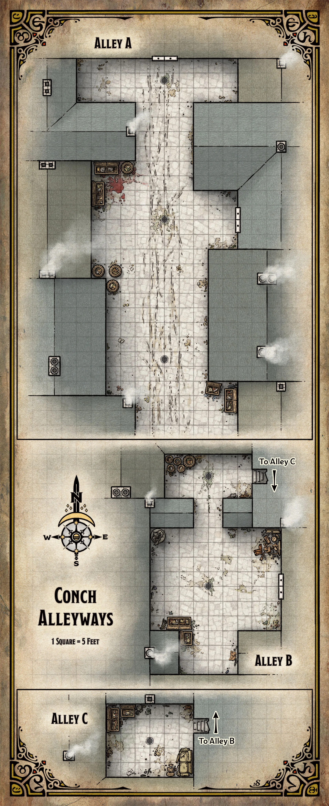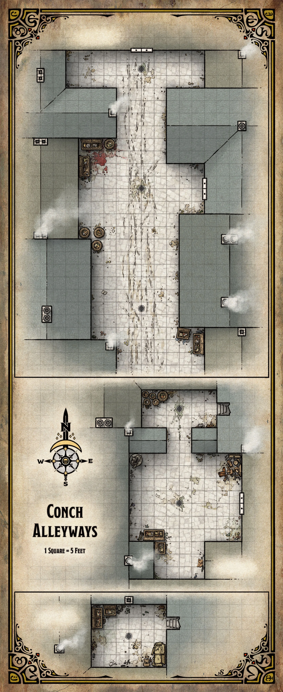The adventure consists of the following encounters and uses **Map: Conch Alleyways**, which shows the alleys where the encounters take place. The buildings surrounding the alleys are locked, and accessing them is outside the scope of this adventure.

***There's Been a Murder.*** An explosion of white energy transports the characters to the southern end of alley A.

To the north is a broken statue of a robed mage, beside which dangles a gnome (Small **Commoner**) held aloft by an unseen force. Before the characters can act, the gnome's throat bleeds heavily and he falls to the ground, dead.

Flanking the gnome are three Chaotic Evil **Lizardfolk Sovereigns**. When they notice the characters, the lizardfolk shout threats and start combat. The lizardfolk are named Retta, Torm, and Vill, and they're members of a river smuggling gang called the Swampclaws. If a Swampclaw is reduced to 20 Hit Points or fewer, all three attempt to surrender, promising to tell the characters anything they wish to know in exchange for their lives.

A Swampclaw can reveal that the gnome was killed by Yorg, an **Invisible Stalker** under the Swampclaw leader's command. Yorg has sped into another nearby alley just a block away (alley B on the map) to chase down the gnome's siblings. The gnomes ran afoul of the gang when they accepted river transport for their embroidered textiles but couldn't pay their fees on time.

If the characters don't accept the lizardfolk's surrender, the Swampclaws attack again, taunting the characters with the above information. They are certain Yorg will defeat the characters if they give chase.

***Save the Gnomes.*** After learning about alley B's location, the characters can reach it easily. When the characters arrive in alley B, they find four human officers of the guard (Medium, Chaotic Evil **Guard Captains**) staking out the stairway that leads down to alley C. The guard officers—named Jolm, Brea, Derk, and Terra—start combat as soon as they see the characters.

These corrupt guard officers are also Swampclaws helping Yorg. Once one officer dies, the others surrender, revealing that Yorg is in alley C downstairs, where the gnome siblings are hiding.

***Finally Got You.*** When the characters arrive in alley C, they see two gnomes dangling in the air, begging for their lives. The **Invisible Stalker** Yorg taunts the gnomes for their foolishness before it moves to kill them. If the characters interrupt, Yorg drops the gnomes and fights the characters to the death.

***Conclusion.*** If the characters save the gnomes, the siblings reveal themselves to be Low Netherese textile merchants named Bernadoo and Hipplepoff Tindertoe. They ran when Yorg grabbed their brother, Thomp. If the characters saved the gnome siblings, each character earns an additional 1,100 XP.

The siblings are distraught at their brother's death but thank the characters profusely. Though they have little to pay as a reward, the gnomes offer to take the characters to their stall in the Dockmarket (*see chapter 1*). There, the gnomes happily trade their textiles to purchase any magic item of Rare or lower rarity from appendix A that the characters want. Returning to their own time might be the characters' next adventure, as you see fit.

### The Doomed Apotheosis

*Adventure for Level 8 Characters*

- **Situation.** Karsus is casting the spell that eventually sends Eileanar plummeting to its doom. The flux of his magic interfering with Mystryl's divine power creates a powerful time vortex that pulls the characters to his acropolis in Eileanar.
- **Hook.** The characters find themselves in Karsus's Arcane Acropolis as Karsus draws magical power toward himself like a black hole. The characters are stuck in the acropolis as magic malfunctions and backfires around them, endangering everyone in the area.

#### Encounters

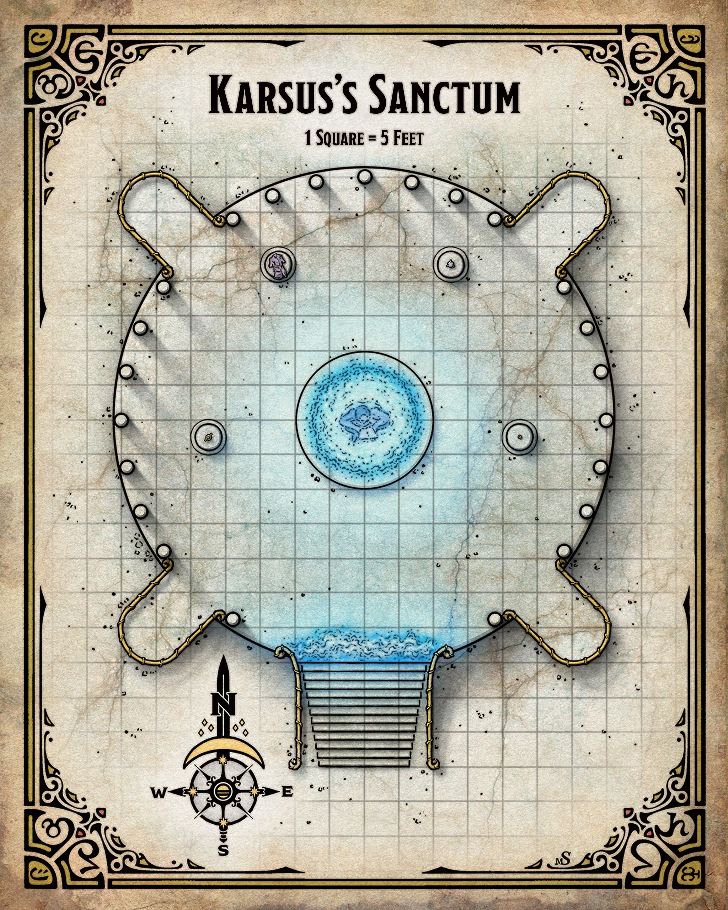

The adventure consists of the following encounters and uses **Map: Karsus's Sanctum**, which shows the section of Karsus's Sanctum where the encounters take place. During these encounters, Karsus is in the center of the sanctum, as shown on the map, surrounded by an impenetrable globe of raw magic. He is slowly growing larger, has Immunity to all damage, and is unaware of his surroundings. The characters can't affect Karsus in any way, and he can't perceive them.

***Flumph Keeper.*** An explosion of white energy transports the characters to the sanctum, just north of the stairway. Another blue barrier of impenetrable magic surrounds the sanctum like a dome, and the characters are trapped.

A frantic human named Youmi (Medium, Chaotic Good **Mage Apprentice**) shouts for help from near the southeastern balcony. She gestures wildly for the characters to help her stop one **Terran Magen** and two **Caldron Magen** (*see appendix b* for both) from destroying four terrified **Flumphs**, which are backed into the balcony's corner. The magen are driven berserk by Karsus's fluctuating magic and have just started combat with the flumphs. If the characters fight them, the magen turn their attention to the characters and fight to the death. Otherwise, the magen kill the flumphs before fighting the characters.

If the flumphs survive, Youmi becomes Friendly. She explains that Karsus is attempting to cast a spell to replace the god of magic and admits she's sickened by the archmage's hubris and recklessness. As an Influence action, a character can try to convince Youmi to join their group to help them navigate the city, doing so with a successful DC 16 Charisma (Persuasion) check.

***Collection of Wonders.*** Each of the pedestals shown on the map holds a magical item. Karsus was trying to stabilize his magical experimentations using these items, but it backfired. If she's alive, Youmi suggests the characters remove the magic items from the pedestals to dampen Karsus's fluctuating magic.

Clockwise from the westernmost pedestal, the pedestals hold *Boots of Speed*, a *Ring of Regeneration*, a *Fork of Eddy Summoning* (*see appendix a*), and a *Mythallar Cloak* (*see appendix a*). If the characters want to keep the items, Youmi doesn't stop them.

***Uncontrolled Magic.*** After the characters take a magic item from a pedestal, or after they've finished talking with Youmi, four **Eldritch Eddies** appear near them in places of your choosing. These eddies appear only once.

***Karsus's Magic Rising.*** After the eddies are destroyed, the dome surrounding the area explodes in a flash of bright blue light. The characters are no longer trapped in the area. Four **Mages**, all humans, rush up the stairs and toward Karsus, screaming that there's no time to talk and casting *Dispel Magic* and other mitigating spells on the energy surrounding their master. After 5 minutes, the magic thrumming through the area stabilizes, although the globe surrounding Karsus is now much larger. Calmed for now, the mages offer to escort the characters to the public portion of Karsus's Arcane Acropolis, described in *chapter 1*. Each character earns 2,100 XP.

***Conclusion.*** The characters have some time to explore Eileanar before Karsus eventually dies and the flying city plummets to the ground. How long is up to you; it might be anywhere from a few hours to a week or longer. Regardless, returning to their own time is the characters' next adventure.

------

# Appendix A: Magic Items

This section details magic items that characters might find during their adventures in Netheril.

- *Arcane Battery*
- *Brooch of the Elements*
- *Fork of Eddy Summoning*
- *Hat of Vortexes*
- *Magen Handbell*
- *Mask of Changed Appearance*
- *Mythallar Bracelet*
- *Mythallar Cloak*

------

# Appendix B: Bestiary

This appendix details monsters found in ancient Netheril.

- **Eldritch Eddy**
- **Caldron Magen**
- **Terran Magen**
- **Virvos Magen**
- **Phaerimm Hatchling**
- **Phaerimm Scout**
- **Phaerimm Agent**
- **Phaerimm Elder**

<table class="rd__b-special rd__b-data rd__b-data--narrow rd__b-data--stats">
		<thead>
			<tr>
				<th class="rd__data-embed-header ve-text-left" colspan="6" data-rd-data-embed-header="true">
					

						

							Eldritch Eddy
							
						

						[–]
					

				</th>
			</tr>
		</thead><tbody class="" data-rd-embedded-data-render-target="true"><tr>
			<td colspan="6" data-rd-tag="creature" data-rd-uid="Eldritch Eddy|NF" data-rd-page="bestiary.html" data-rd-source="NF" data-rd-hash="eldritch%20eddy_nf" data-rd-name="Eldritch Eddy" data-rd-display-name="Eldritch Eddy" data-rd-style="narrow" data-rd-entry-data="{}">
				<i>Loading <a href="bestiary.html#eldritch%20eddy_nf"  onmouseover="Renderer.hover.pHandleLinkMouseOver(event, this)" onmouseleave="Renderer.hover.handleLinkMouseLeave(event, this)" onmousemove="Renderer.hover.handleLinkMouseMove(event, this)" onclick="Renderer.hover.handleLinkClick(event, this)" onwheel="Renderer.hover.handleLinkWheel(event, this)" ondragstart="Renderer.hover.handleLinkDragStart(event, this)" data-vet-page="bestiary.html" data-vet-source="NF" data-vet-hash="eldritch%20eddy_nf" ontouchstart="Renderer.hover.handleTouchStart(event, this)" >Eldritch Eddy</a>...</i>
				
			</td>
		</tr></tbody></table><table class="rd__b-special rd__b-data rd__b-data--narrow rd__b-data--stats">
		<thead>
			<tr>
				<th class="rd__data-embed-header ve-text-left" colspan="6" data-rd-data-embed-header="true">
					

						

							Caldron Magen
							
						

						[–]
					

				</th>
			</tr>
		</thead><tbody class="" data-rd-embedded-data-render-target="true"><tr>
			<td colspan="6" data-rd-tag="creature" data-rd-uid="Caldron Magen|NF" data-rd-page="bestiary.html" data-rd-source="NF" data-rd-hash="caldron%20magen_nf" data-rd-name="Caldron Magen" data-rd-display-name="Caldron Magen" data-rd-style="narrow" data-rd-entry-data="{}">
				<i>Loading <a href="bestiary.html#caldron%20magen_nf"  onmouseover="Renderer.hover.pHandleLinkMouseOver(event, this)" onmouseleave="Renderer.hover.handleLinkMouseLeave(event, this)" onmousemove="Renderer.hover.handleLinkMouseMove(event, this)" onclick="Renderer.hover.handleLinkClick(event, this)" onwheel="Renderer.hover.handleLinkWheel(event, this)" ondragstart="Renderer.hover.handleLinkDragStart(event, this)" data-vet-page="bestiary.html" data-vet-source="NF" data-vet-hash="caldron%20magen_nf" ontouchstart="Renderer.hover.handleTouchStart(event, this)" >Caldron Magen</a>...</i>
				
			</td>
		</tr></tbody></table><table class="rd__b-special rd__b-data rd__b-data--narrow rd__b-data--stats">
		<thead>
			<tr>
				<th class="rd__data-embed-header ve-text-left" colspan="6" data-rd-data-embed-header="true">
					

						

							Terran Magen
							
						

						[–]
					

				</th>
			</tr>
		</thead><tbody class="" data-rd-embedded-data-render-target="true"><tr>
			<td colspan="6" data-rd-tag="creature" data-rd-uid="Terran Magen|NF" data-rd-page="bestiary.html" data-rd-source="NF" data-rd-hash="terran%20magen_nf" data-rd-name="Terran Magen" data-rd-display-name="Terran Magen" data-rd-style="narrow" data-rd-entry-data="{}">
				<i>Loading <a href="bestiary.html#terran%20magen_nf"  onmouseover="Renderer.hover.pHandleLinkMouseOver(event, this)" onmouseleave="Renderer.hover.handleLinkMouseLeave(event, this)" onmousemove="Renderer.hover.handleLinkMouseMove(event, this)" onclick="Renderer.hover.handleLinkClick(event, this)" onwheel="Renderer.hover.handleLinkWheel(event, this)" ondragstart="Renderer.hover.handleLinkDragStart(event, this)" data-vet-page="bestiary.html" data-vet-source="NF" data-vet-hash="terran%20magen_nf" ontouchstart="Renderer.hover.handleTouchStart(event, this)" >Terran Magen</a>...</i>
				
			</td>
		</tr></tbody></table><table class="rd__b-special rd__b-data rd__b-data--narrow rd__b-data--stats">
		<thead>
			<tr>
				<th class="rd__data-embed-header ve-text-left" colspan="6" data-rd-data-embed-header="true">
					

						

							Virvos Magen
							
						

						[–]
					

				</th>
			</tr>
		</thead><tbody class="" data-rd-embedded-data-render-target="true"><tr>
			<td colspan="6" data-rd-tag="creature" data-rd-uid="Virvos Magen|NF" data-rd-page="bestiary.html" data-rd-source="NF" data-rd-hash="virvos%20magen_nf" data-rd-name="Virvos Magen" data-rd-display-name="Virvos Magen" data-rd-style="narrow" data-rd-entry-data="{}">
				<i>Loading <a href="bestiary.html#virvos%20magen_nf"  onmouseover="Renderer.hover.pHandleLinkMouseOver(event, this)" onmouseleave="Renderer.hover.handleLinkMouseLeave(event, this)" onmousemove="Renderer.hover.handleLinkMouseMove(event, this)" onclick="Renderer.hover.handleLinkClick(event, this)" onwheel="Renderer.hover.handleLinkWheel(event, this)" ondragstart="Renderer.hover.handleLinkDragStart(event, this)" data-vet-page="bestiary.html" data-vet-source="NF" data-vet-hash="virvos%20magen_nf" ontouchstart="Renderer.hover.handleTouchStart(event, this)" >Virvos Magen</a>...</i>
				
			</td>
		</tr></tbody></table><table class="rd__b-special rd__b-data rd__b-data--narrow rd__b-data--stats">
		<thead>
			<tr>
				<th class="rd__data-embed-header ve-text-left" colspan="6" data-rd-data-embed-header="true">
					

						

							Phaerimm Hatchling
							
						

						[–]
					

				</th>
			</tr>
		</thead><tbody class="" data-rd-embedded-data-render-target="true"><tr>
			<td colspan="6" data-rd-tag="creature" data-rd-uid="Phaerimm Hatchling|FRAiF" data-rd-page="bestiary.html" data-rd-source="FRAiF" data-rd-hash="phaerimm%20hatchling_fraif" data-rd-name="Phaerimm Hatchling" data-rd-display-name="Phaerimm Hatchling" data-rd-style="narrow" data-rd-entry-data="{}">
				<i>Loading <a href="bestiary.html#phaerimm%20hatchling_fraif"  onmouseover="Renderer.hover.pHandleLinkMouseOver(event, this)" onmouseleave="Renderer.hover.handleLinkMouseLeave(event, this)" onmousemove="Renderer.hover.handleLinkMouseMove(event, this)" onclick="Renderer.hover.handleLinkClick(event, this)" onwheel="Renderer.hover.handleLinkWheel(event, this)" ondragstart="Renderer.hover.handleLinkDragStart(event, this)" data-vet-page="bestiary.html" data-vet-source="FRAiF" data-vet-hash="phaerimm%20hatchling_fraif" ontouchstart="Renderer.hover.handleTouchStart(event, this)" >Phaerimm Hatchling</a>...</i>
				
			</td>
		</tr></tbody></table><table class="rd__b-special rd__b-data rd__b-data--narrow rd__b-data--stats">
		<thead>
			<tr>
				<th class="rd__data-embed-header ve-text-left" colspan="6" data-rd-data-embed-header="true">
					

						

							Phaerimm Scout
							
						

						[–]
					

				</th>
			</tr>
		</thead><tbody class="" data-rd-embedded-data-render-target="true"><tr>
			<td colspan="6" data-rd-tag="creature" data-rd-uid="Phaerimm Scout|NF" data-rd-page="bestiary.html" data-rd-source="NF" data-rd-hash="phaerimm%20scout_nf" data-rd-name="Phaerimm Scout" data-rd-display-name="Phaerimm Scout" data-rd-style="narrow" data-rd-entry-data="{}">
				<i>Loading <a href="bestiary.html#phaerimm%20scout_nf"  onmouseover="Renderer.hover.pHandleLinkMouseOver(event, this)" onmouseleave="Renderer.hover.handleLinkMouseLeave(event, this)" onmousemove="Renderer.hover.handleLinkMouseMove(event, this)" onclick="Renderer.hover.handleLinkClick(event, this)" onwheel="Renderer.hover.handleLinkWheel(event, this)" ondragstart="Renderer.hover.handleLinkDragStart(event, this)" data-vet-page="bestiary.html" data-vet-source="NF" data-vet-hash="phaerimm%20scout_nf" ontouchstart="Renderer.hover.handleTouchStart(event, this)" >Phaerimm Scout</a>...</i>
				
			</td>
		</tr></tbody></table><table class="rd__b-special rd__b-data rd__b-data--narrow rd__b-data--stats">
		<thead>
			<tr>
				<th class="rd__data-embed-header ve-text-left" colspan="6" data-rd-data-embed-header="true">
					

						

							Phaerimm Agent
							
						

						[–]
					

				</th>
			</tr>
		</thead><tbody class="" data-rd-embedded-data-render-target="true"><tr>
			<td colspan="6" data-rd-tag="creature" data-rd-uid="Phaerimm Agent|FRAiF" data-rd-page="bestiary.html" data-rd-source="FRAiF" data-rd-hash="phaerimm%20agent_fraif" data-rd-name="Phaerimm Agent" data-rd-display-name="Phaerimm Agent" data-rd-style="narrow" data-rd-entry-data="{}">
				<i>Loading <a href="bestiary.html#phaerimm%20agent_fraif"  onmouseover="Renderer.hover.pHandleLinkMouseOver(event, this)" onmouseleave="Renderer.hover.handleLinkMouseLeave(event, this)" onmousemove="Renderer.hover.handleLinkMouseMove(event, this)" onclick="Renderer.hover.handleLinkClick(event, this)" onwheel="Renderer.hover.handleLinkWheel(event, this)" ondragstart="Renderer.hover.handleLinkDragStart(event, this)" data-vet-page="bestiary.html" data-vet-source="FRAiF" data-vet-hash="phaerimm%20agent_fraif" ontouchstart="Renderer.hover.handleTouchStart(event, this)" >Phaerimm Agent</a>...</i>
				
			</td>
		</tr></tbody></table><table class="rd__b-special rd__b-data rd__b-data--narrow rd__b-data--stats">
		<thead>
			<tr>
				<th class="rd__data-embed-header ve-text-left" colspan="6" data-rd-data-embed-header="true">
					

						

							Phaerimm Elder
							
						

						[–]
					

				</th>
			</tr>
		</thead><tbody class="" data-rd-embedded-data-render-target="true"><tr>
			<td colspan="6" data-rd-tag="creature" data-rd-uid="Phaerimm Elder|NF" data-rd-page="bestiary.html" data-rd-source="NF" data-rd-hash="phaerimm%20elder_nf" data-rd-name="Phaerimm Elder" data-rd-display-name="Phaerimm Elder" data-rd-style="narrow" data-rd-entry-data="{}">
				<i>Loading <a href="bestiary.html#phaerimm%20elder_nf"  onmouseover="Renderer.hover.pHandleLinkMouseOver(event, this)" onmouseleave="Renderer.hover.handleLinkMouseLeave(event, this)" onmousemove="Renderer.hover.handleLinkMouseMove(event, this)" onclick="Renderer.hover.handleLinkClick(event, this)" onwheel="Renderer.hover.handleLinkWheel(event, this)" ondragstart="Renderer.hover.handleLinkDragStart(event, this)" data-vet-page="bestiary.html" data-vet-source="NF" data-vet-hash="phaerimm%20elder_nf" ontouchstart="Renderer.hover.handleTouchStart(event, this)" >Phaerimm Elder</a>...</i>
				
			</td>
		</tr></tbody></table>

------

# Credits

- **Lead Designer:** Amanda Hamon
- **Designers:** Ron Lundeen, David Somerville
- **Rules Developer:** Makenzie De Armas
- **Editors:** Adrian Ng Di Spaltro (lead), Ayla Bondora, Amanda Frechin, Sadie Lowry, James Wyatt
- **Art Director:** Josh Herman
- **Graphic Designers:** Trystan Falcone (lead), Matt Cole
- **Cover Illustrator:** Olivier Bernard
- **Interior Illustrators:** Luca Bancone, Adam Cook, Álvaro Calvo Escudero, Julian Kok, Alejandro Pacheco, Samuel Perin, John Tedrick, Zuzanna Wuzyk
- **Cartographer:** Mike Schley
- **Consultants:** Sameer Joseph, Alyssa Visscher
- **Producers:** Rob Hawkey (lead), Dan Tovar (lead), Bill Benham, Siera Bruggeman, Vanessa Hoskins

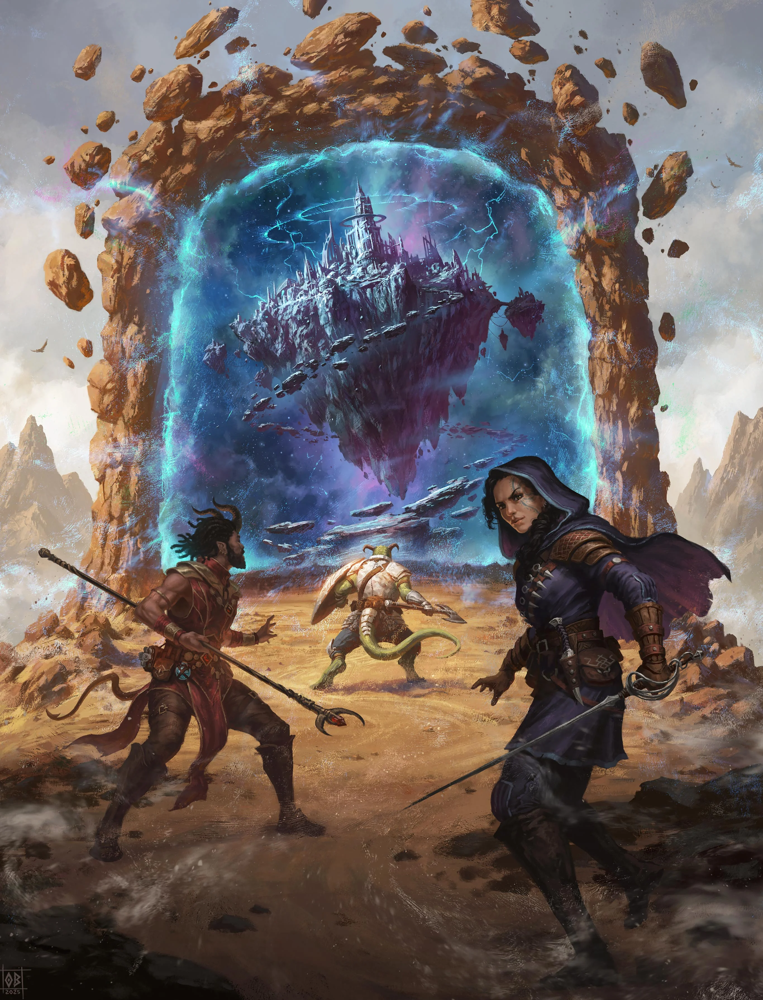
