# Introduction

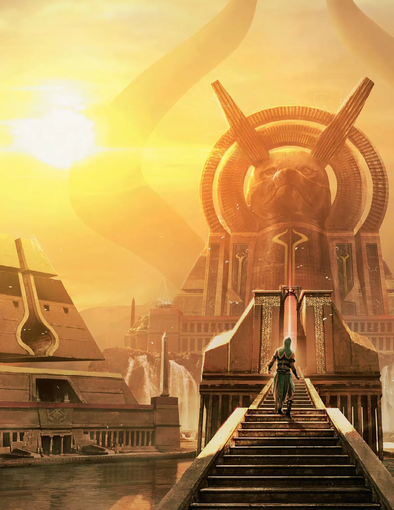

*This whole Plane Shift thing started because of Zendikar. It's hard to imagine a Magic plane better suited for D&D adventuring than the one that was conceived, from start to finish, as "adventure world." Making the transition from *The Art of Magic: The Gathering—Zendikar* to *Plane Shift: Zendikar* was thus perfectly natural.*

*Innistrad came next, bolstered by the happy coincidence of the *Curse of Strahd* adventure coming out close to the same time. Then with *Plane Shift: Kaladesh*, I got to stray a little further from the core D&D experience, presenting a fairly fast and loose take on reskinning D&D magic items into the aether-powered inventions of Kaladesh. And now we come to Amonkhet—a desert plane inspired by ancient Egypt, ruled by an evil dragon Planeswalker, and which features one small safe haven from an undead infestation. It is not a traditional D&D setting.*

*The trials of the five gods provide the most obvious structure for a campaign set on Amonkhet. A group of initiates from the same crop might go through the trials together, and those trials alone could form the entirety of a short campaign. To flesh out the experience, characters could also undertake missions on the behalf of gods or viziers: defending the Hekma, joining the gods on a hunting expedition in the desert, and so on. The campaign could get complicated with the addition of viziers, who normally do not go through the trials (unless they choose to), or if any or all of the characters become dissenters.*

*Perhaps the best way to think of an Amonkhet campaign is that it takes place against the backdrop of the five trials, rather than being all about the trials. The trials provide a structure and a sense of drama, but relationships among characters—and between characters and the rest of the world—are where the meat of the story unfolds. You could set your campaign in the period leading up to when initiate player characters undergo one of the trials, with the trial as a climax to the whole story. You could use the Trial of Solidarity and the Trial of Ambition as a framing device for the campaign, to explore issues of collective unity versus personal achievement. (Initiate characters would undergo the Trials of Knowledge and Strength on their own terms.) Or you could ignore the trials entirely and focus on dissenter characters trying to upset the social order of Naktamun.*

*As always, *The Art of Magic: The Gathering—Amonkhet* is the definitive resource for information about the plane. With this document, you can use that information to build a campaign with a minimum of changes to the fifth edition D&D rules, which you can [https://dnd.wizards.com/what-is-dnd/basic-rules](find here). And even without the book, you can find lore about Amonkhet on [https://magic.wizards.com/](the Magic web site).*

*Good luck in the trials!*— James Wyatt*The game mechanics in this supplement are usable in your D&D campaign but are not fully tempered by playtests and design iterations. For these reasons, material in this supplement is not legal in D&D Organized Play events.*

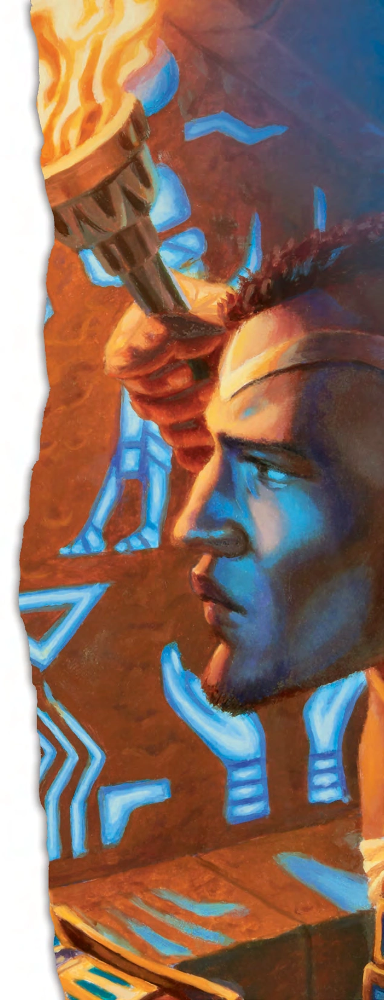

------

# The World of Amonkhet

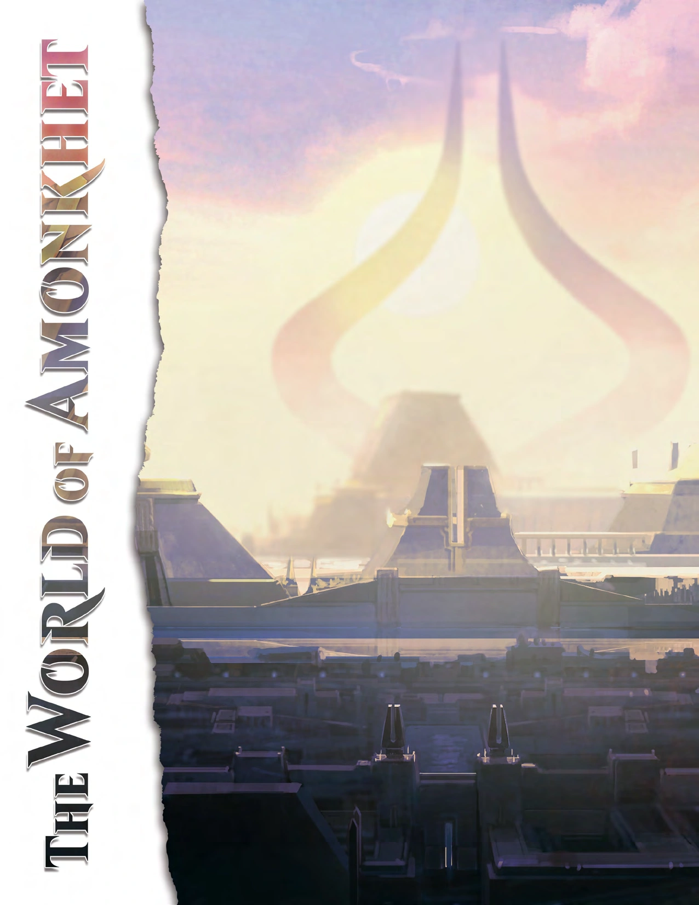

Towering, gold-encrusted monuments break the unending monotony of a horizon formed of sun-blasted sand. Awe-inspiring, animal-headed gods walk among the people, offering them care and protection from the horrors of the desert. A wide, life-giving river offers its abundant bounty, providing for every physical need. Happy, hopeful people offer sacrifices in grand temples dedicated to their benevolent gods, addressing their spiritual needs. For they know that this life, as wonderful as it might be, is just the beginning—a prelude to the perfection that awaits them in the afterlife, promised to them by their God-Pharaoh.

Amonkhet is a plane of dichotomy. Beyond the lush river valley spreads endless scorching desert. Accursed, desiccated mummies roam that desert, while carefully embalmed mummies attend to the needs of the living in the glorious city-state. The people have everything they need. They are protected from the desert heat and wandering mummies by the magical barrier called the Hekma, and they spend their lives in focused training, honing body and mind to perfection. Yet they eagerly anticipate the time when they will be permitted to die in combat and leave this world behind.

On the surface, Amonkhet seems like a marvelous place to live. But something unsettling and nefarious lurks behind the grand facade. The wise and benevolent God-Pharaoh, said to be busy preparing the wondrous afterlife for the worthy, is actually Nicol Bolas—the malevolent dragon Planeswalker whose schemes reach far beyond this plane. And all the preparation and training, all the trials and contests, all the effort to be made worthy—all of this is meant to prepare the people of Amonkhet for transformation into an undead army under Bolas's command.

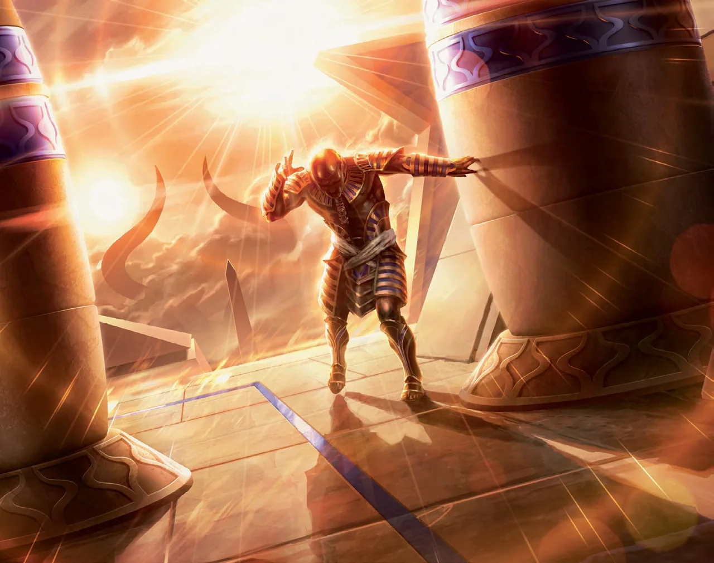

#### Behind the Facade

Unknown to any of the plane's inhabitants, the entire society of Amonkhet has been manipulated by Nicol Bolas, who has seized control of the world, the gods, and the magic of the plane. Bolas chose this plane for his schemes because of the presence of a magical substance called lazotep, which interacts with the magic of necromancy in strange and powerful ways. Conveniently, he also found here a pious, structured civilization that he could easily subvert to his own purposes. Making himself the God-Pharaoh, he brought the gods themselves under his control, and eliminated anyone who tried to stand against him. Then he transformed the world into a factory designed to produce a huge army of perfect undead soldiers—mummies embalmed in lazotep.

Adapting the peculiar magic of the plane, Bolas found a means to preserve the combat skills of the living after death. He has selected five aspects of character that he desires most in his undead soldiers, and has built the society of Amonkhet around a series of trials designed to hone and perfect those aspects of body and mind. Throughout their lives, the people of the plane believe they are drawing nearer to the promised afterlife—and at last they die in the final trial, a mass battle with no survivors. But rather than earning a place in the afterlife, they are instead embalmed in lazotep and stored in Bolas's great necropolis, adding to the ranks of his undead army.

#### The Curse of Wandering

Part of the magic of Amonkhet that Bolas has been able to exploit is a necromantic phenomenon called the Curse of Wandering. This naturally occurring magic causes any being who dies on the plane to rise again after a short time, cursed with insatiable hunger and an irresistible drive to attack the living. Desiccated mummies created by the Curse of Wandering fill the desert wasteland that dominates the plane, constantly threatening what little life remains. But the people of Amonkhet do not fear the threat of attack as much as they dread the knowledge that all who live will one day die and fall under the same curse. Death under the effect of the Curse of Wandering is a terrifying afterlife filled with endless suffering.

What God-Pharaoh Nicol Bolas offers to the people of Amonkhet is an alternative to an eternity of wandering: an afterlife of glorious delights. And all they need to do to attain this eternal bliss is prove that they are worthy. As such, the threat of the Curse of Wandering is a strong motivation for people to undergo the trials of devotion that the God-Pharaoh demands.

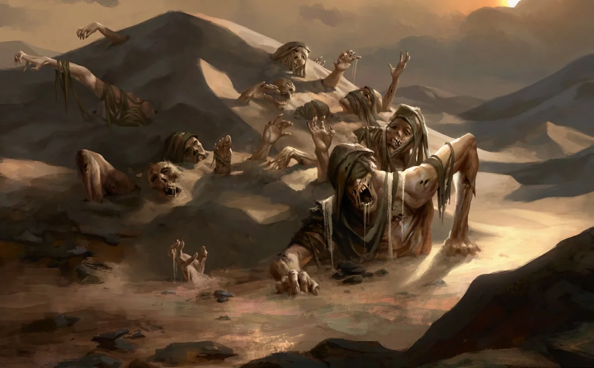

#### Putting Devotion to the Test

The inhabitants of Amonkhet, mortal and divine alike, believe that the God-Pharaoh left the five gods as stewards of the populace when he departed to prepare the afterlife. While he is gone, the God-Pharaoh expects the people to devote their lives to proving they are worthy of this great reward. Since the afterlife will be perfect, the people who enter it must also be perfect.

The gods are custodians of the path to the afterlife, established by the God-Pharaoh to purify and perfect the people who follow that path and undergo its trials. Each god oversees one of five trials, instructing the initiates who prepare to face that trial by helping them cultivate one of the five aspects of mortal perfection.

***Solidarity.*** Oketra the True, the cat-headed god of solidarity, teaches that the worthy shall know and respect all others whom the God-Pharaoh deems as worthy. For in the afterlife, all will be together in purpose and in action.

***Knowledge.*** Kefnet the Mindful, the ibis-headed god of knowledge, teaches that the worthy shall cultivate a nimble mind—one capable of perceiving the wonders beyond imagining that await in the afterlife

Strength. Rhonas the Indomitable, the cobra-headed god of strength, teaches that the worthy shall hone a strong body that can endure throughout an endless life.

***Ambition.*** Bontu the Glorified, the crocodile-headed god of ambition, teaches that the worthy shall strive for greatness, as supremacy will be rewarded in the afterlife.

***Zeal.*** Hazoret the Fervent, the jackal-headed god of zeal, teaches that the worthy shall rush toward the afterlife with unhesitating fervor. Relentlessly, they will rise to overcome any obstacle in the way of earning a place at the God-Pharaoh's side.

Initiates who pass one of the trials are awarded a cartouche—a magical emblem they will take with them to the afterlife. The trials culminate in the Trial of Zeal, which is a combat to the death. Dying in this final battle is proof of worthiness, with a glorified death earning the initiate a place in the afterlife. The bodies of the slain are loaded onto funerary barges and sent through the Gate to the Afterlife. But this is not an end. Rather, it marks the beginning of the most wondrous part of an initiate's existence. Each looks forward to death in the final trial, hoping to find a glorious end at the hand of a close friend, so that together, they can live as Eternals in the afterlife with the God-Pharaoh. Forever.

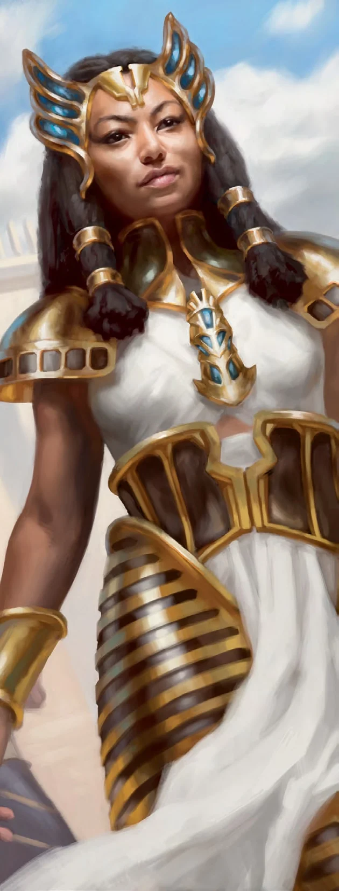

## People of Naktamun

The citizens of Amonkhet begin training for the trials of the five gods at a very young age. Children as young as five years old are invited to become acolytes—the first stage of their spiritual development. An annual ceremony serves as a rite of passage for these youths, marking the beginning of their journey toward the afterlife.

After completing their training and the construction of the obelisk that will be defended during the Trial of Solidarity, a crop of acolytes is finally prepared to stand before the five gods in the Ceremony of Measurement. Those who are judged worthy are asked to continue their journey toward the afterlife as the God-Pharaoh's initiates. Others are selected by individual gods to take an alternative route to the afterlife, becoming viziers in service to the gods. But some stand in the light of the two suns and are deemed unworthy of either course, lacking in the virtues necessary to secure entry into the afterlife. In particular, acolytes who doubt the God-Pharaoh's teachings or the way of life in Naktamun are culled from the crop and exiled from the city-state.

Your character's background can reflect the results of the Ceremony of Measurement.

- Initiate
- Initiate (Dissenter)
- Vizier
- Vizier (Dissenter)

------

# Races of Amonkhet

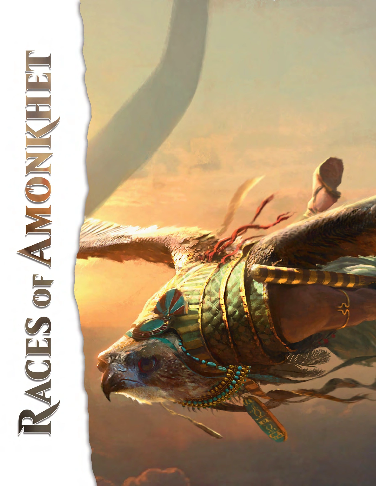

- Human (Amonkhet)
- Aven
- Aven (Hawk-Headed)
- Aven (Ibis-Headed)
- Khenra
- Minotaur (Amonkhet)
- Naga

------

# Trials of the Five Gods

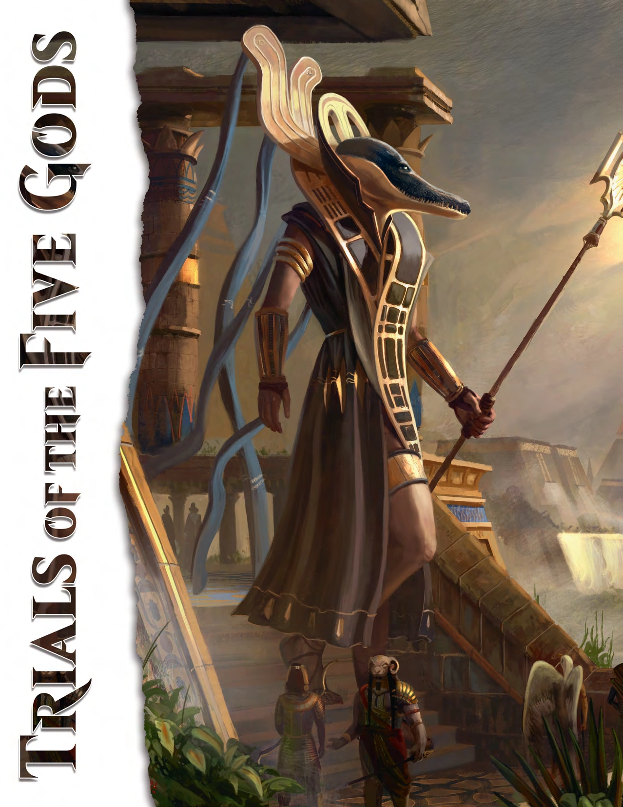

The five gods are the effective rulers of Amonkhet. They are not the creators of the plane, but they are its stewards while the people of Naktamun await the return of the God-Pharaoh. The five gods believe they were created by the God-Pharaoh, who charged them with teaching the people the ways of the God-Pharaoh, and with protecting them until he comes.

The five gods embody the five virtues the God-Pharaoh wishes to cultivate in those who will become his Eternals in the afterlife. Each god is responsible for modeling and teaching one of those virtues to the acolytes and initiates of Naktamun, and then testing those initiates to ensure that they have mastered their teachings. Thus, they are present during the acolytes' first lessons, during the Ceremony of Measuring, during the initiates' intense training, and at each of the trials that are part of an initiate's journey.

In the absence of the God-Pharaoh, only the gods can determine whether initiates have proven themselves worthy of the glory of the afterlife. The gods in turn prove their own worthiness by executing their duties infallibly. They make the trials as challenging as possible to ensure that only the most worthy are selected.

***Cleric Domains.*** Clerics of the five gods, who are typically viziers of the gods, can choose the domains associated with their gods: Solidarity, Knowledge, Strength, Ambition, or Zeal.

- Oketra: Solidarity Domain
- Kefnet: Knowledge Domain
- Rhonas: Strength Domain
- Bontu: Ambition Domain
- Hazoret: Zeal Domain

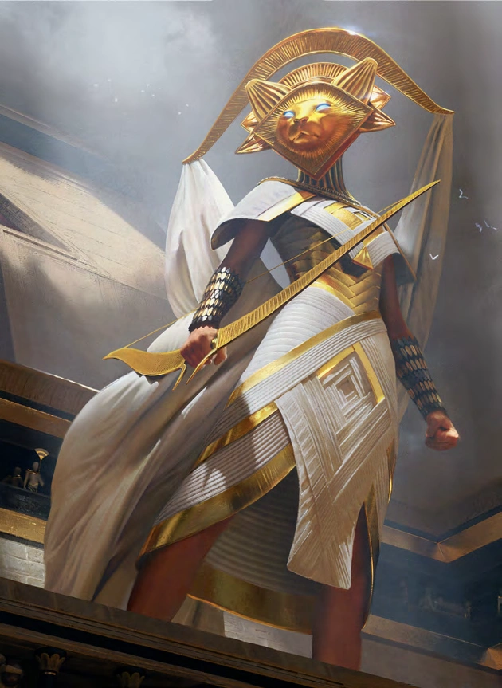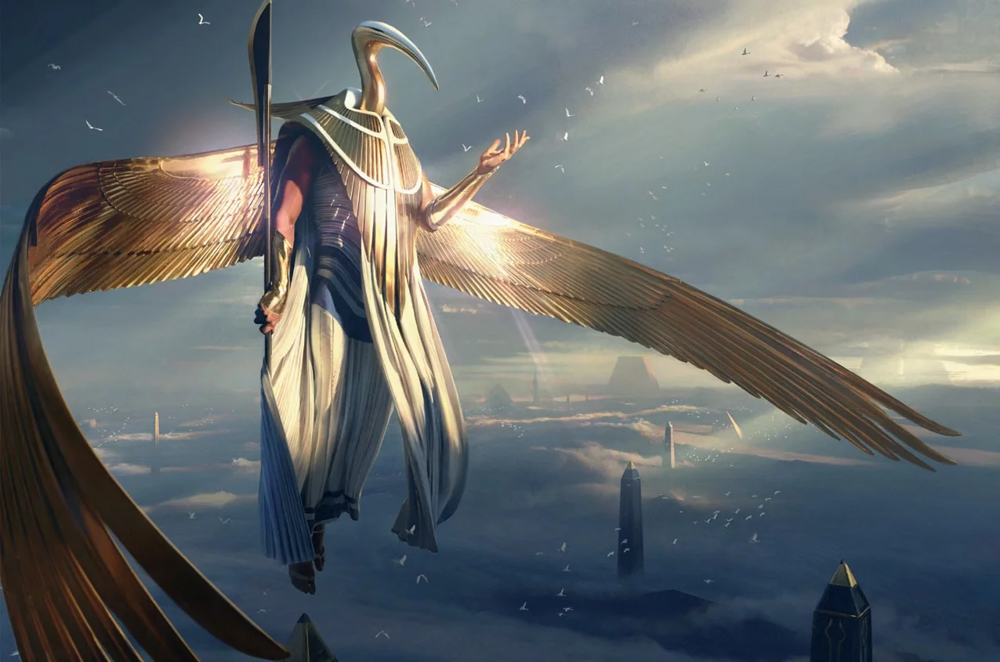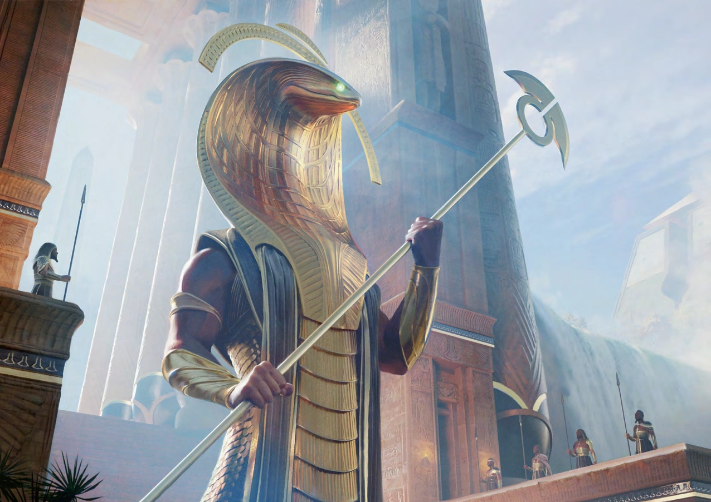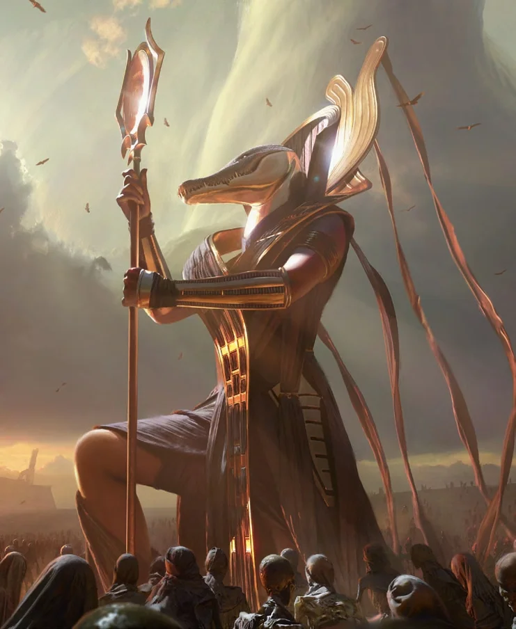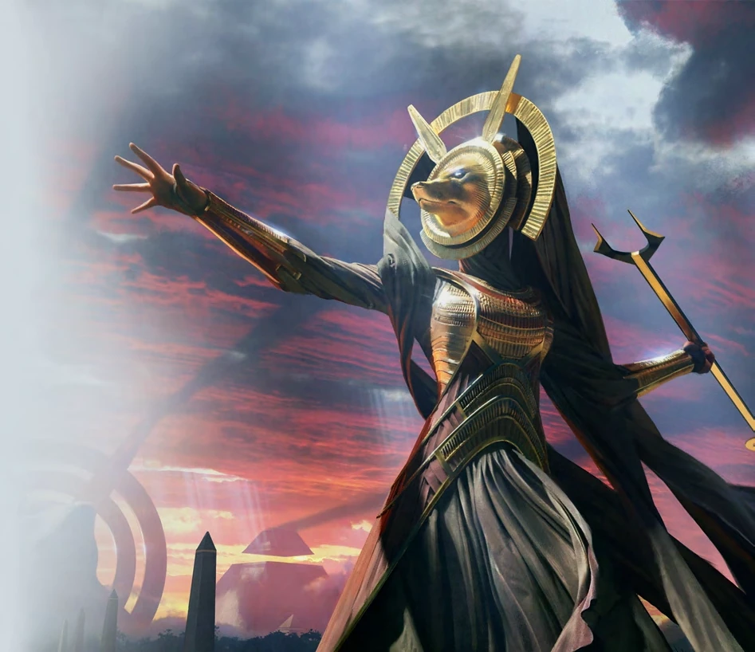

------

# An Amonkhet Bestiary

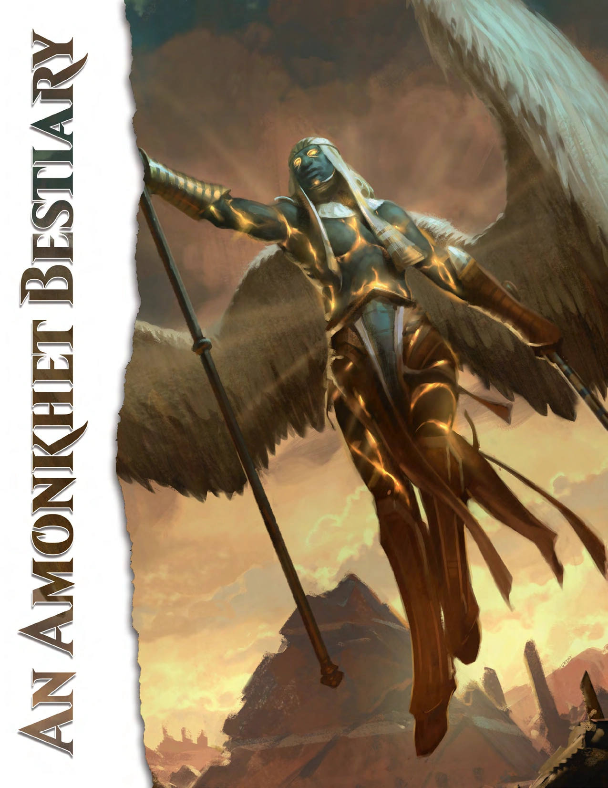

- **Adult Amonkhet Dragon**
- **Ammit**
- **Amonkhet Dragon Wyrmling**
- **Amonkhet Hydra**
- **Amonkhet Mummy**
- **Amonkhet Mummy Lord**
- **Amonkhet Sphinx**
- **Ancient Amonkhet Dragon**
- **Angel of Amonkhet**
- **Anointed**
- **Archfiend of Ifnir**
- **Cerodon**
- **Criosphinx**
- **Eternal**
- **Giant River Serpent**
- **Hippopotamus**
- **Large Drake**
- **Manticore, Heart-Piercer**
- **River Serpent**
- **Sandwurm**
- **Serpopard**
- **Small Drake**
- **Soulstinger Demon**
- **Young Amonkhet Dragon**

Even relatively mundane animals can be a danger in the desert. **Giant scorpions**, **giant centipedes**, **giant lizards**, **giant wasps**, and **swarms of insects** can pose a serious threat to living creatures and zombies alike.

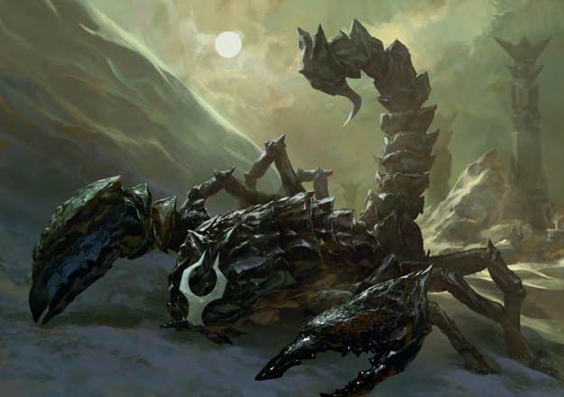

------

# Appendix: Planeswalkers and the Multiverse

The Multiverse is a boundless expanse of worlds. These worlds, called planes, are as different from each other as one living being is from another, varying in size and shape, inhabitants and environments, and even the laws of physics and magic. The existence of magic, though, is a common factor that unites all the known planes.

For most inhabitants of a given plane, that plane is the full extent of existence. Esoteric speculation might posit the existence of other worlds, but such concepts are only theoretical. Only a handful of people on any given world know the reality: that all the planes are suspended together in a void called the Aether—or, more poetically, the Blind Eternities. Only one person in a million is born with the potential to travel from one plane to another, and only a fraction of those with the potential actually manage to ignite their sparks and become Planeswalkers.

Often, this happens as a result of a great crisis or trauma. A near-death experience could ignite the spark, as could a life-changing epiphany or even a revelatory trance. But once their sparks are ignited, all Planeswalkers gain the rare ability to open a pathway through the Blind Eternities and pass from one plane to another.

The life of a Planeswalker is a life of choice and self-determination, unrestricted by the boundaries of world or fate. Most Planeswalkers dedicate themselves to some personal mission as they explore the secrets of the Multiverse. Often, they discover the depths of their own souls in the process.

---

|                            |                                                                                                                                                                                                                                         |
|----------------------------|-----------------------------------------------------------------------------------------------------------------------------------------------------------------------------------------------------------------------------------------|
| 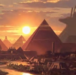 | ***Amonkhet.*** Five deadly trials await the people of this plane as they hope for a glorious death—and eternal glory in the afterlife. But their true fate lies in the hands of the sinister Nicol Bolas.                              |
| 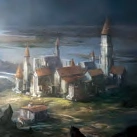 | ***Dominaria.*** Home to the volcanic continent of Shiv, the time-shattered isle of Tolaria, and the cold mountains of Keld, Dominaria is the setting for brutal conflicts and home to powerful mages.                                  |
| 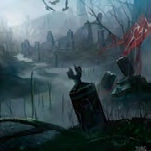 | ***Innistrad.*** For centuries, the archangel Avacyn and her hosts protected the humans of Innistrad from the terrors of the night. But then she turned on the people she was supposed to protect as an alien madness seized the plane. |
| 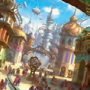 | ***Kaladesh.*** Kaladesh is a vibrant, beautiful land in the midst of an inventors' renaissance, teeming with creativity and optimism.                                                                                                  |
| 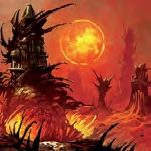 | ***New Phyrexia.*** Once known as Mirrodin, this metallic plane has been transformed by the vile Phyrexian corruption. Its natives fought and lost the war for their world, and now struggle to survive each day.                       |
|  | ***Ravnica.*** This worldwide cityscape holds countless grand halls, decrepit slums, and ancient ruins. Ten guilds maintain an uneasy peace in governing the various aspects of life in the majestic city.                              |
| 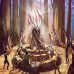 | ***Shandalar.*** Rich with mana, Shandalar is a place where magic flows freely. Planeswalkers seek out this plane for its plentiful, powerful magic.                                                                                    |
| 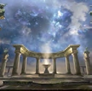 | ***Theros.*** Theros is ruled by an awe-inspiring pantheon of gods. Mortals tremble before them, feel the sting of their petty whims, and live in terror of their wrath.                                                                |
|  | ***Zendikar.*** This land of primal mana is slowly recovering from the unnatural disaster of colossal predators from the Aether rampaging across the plane.                                                                             |

This is the fourth *Plane Shift* article (corresponding to the release of the fourth volume of *The Art of Magic: The Gathering*), which means that at this point, you could put together a four-person party of Planeswalkers and have each one of them come from a different plane.

Fundamentally, no game rules are attached to being a Planeswalker. Traveling from plane to plane in this sort of campaign is a lot like overland travel in a normal campaign: it's about getting to where the adventure is. It's a story function, not a rules one. If planeswalking is part of the campaign, then everyone in the party has to be able to do it, so they can travel together. (In modern Magic, there's no way to bring another living person along with you when you planeswalk.) That means there's not really any question of game balance where planeswalking is concerned—it doesn't make one character more powerful than another, and it doesn't make characters any stronger against the enemies they're fighting. So it's something that can be added on to any other character, without changing the character's class, race, or background.

How does planeswalking work? Well, despite the name of this article series, it actually doesn't bear much resemblance to the *plane shift* spell. When characters planeswalk, it usually takes prolonged focus to bring two worlds together and create the bridge to cross between them. This process takes about a minute and is similar to casting a ritual, so it's not generally something that Planeswalkers can do to escape combat. It also doesn't allow for much precision. As a rule, the point on a plane where a Planeswalker arrives is up to the DM, and it's usually the same location for each visit a character makes to a plane.

Occasionally in Magic fiction, characters do planeswalk in the middle of combat, usually when something dire is about to happen. (That includes the circumstances when a character's Planeswalker spark first ignites.) To model that, at the DM's discretion, a Planeswalker who is about to drop to 0 hit points can make a Charisma saving throw with a DC equal to the damage taken. On a successful save, the character instead takes no damage and planeswalks away. It's up to the DM what plane the character ends up on, because this isn't usually an intentional process.

You could do a lot of adventuring on just the four planes detailed in the art books and *Plane Shift* articles so far. But if you want to take your Planeswalker characters to Theros, Tarkir, Ravnica, Dominaria, Mirrodin, Alara, Fiora, Lorwyn, Kamigawa, or any other plane in the Magic Multiverse, you can follow the example of what I've been doing in these articles. Reskin and tweak existing monsters, and inject a healthy dose of creativity and improvisation as you go. Some of those worlds are full of creatures that could have stepped right out of the *Monster Manual*, while others will present a greater challenge.

The most important thing is that a campaign involving Planeswalkers requires an agreement between the players and the DM. Even more than usual, if the players decide to ignore the plot hooks set before them and go off anywhere in the Multiverse just because they can, they can make the DM's job more taxing than fun. It's one thing to have a Planeswalker pop off to Ravnica for an hour to buy a cup of coffee, but it's quite another for the players to decide that they want to take on the corruption of New Phyrexia today, instead of following clues that lead clearly to an Innistrad campaign.

Speaking of New Phyrexia, a campaign with Planeswalkers is generally more fun with higher-level characters. The Planeswalkers who feature in the stories of Magic are powerful mages of various kinds, and their actions can sometimes decide the fate of whole planes. It doesn't always need to be like that, of course, but it can be hard to motivate characters with the ability to travel literally anywhere to stick around and root out a nest of **giant rats**.

So can Planeswalker characters travel from Amonkhet to whatever plane the Forgotten Realms lies on? That's up to you. The *Plane Shift* series more or less assumes a certain continuity from one Multiverse to the next, even as (for example) it makes no attempt to model Magic's five colors of mana in the D&D magic system. So there's no real reason an elf from Evereska couldn't "spark out" and find herself on Kaladesh, as long as it works for your players and your campaign.

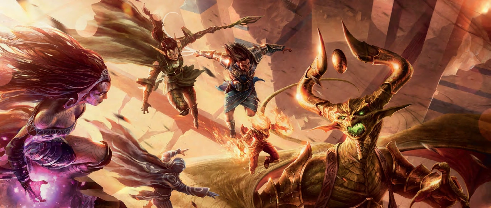

------

### Credits

- Written by James Wyatt with Ashlie Hope
- Cover art by Titus Lunter
- Editing by Scott Fitzgerald Gray
