### Introduction

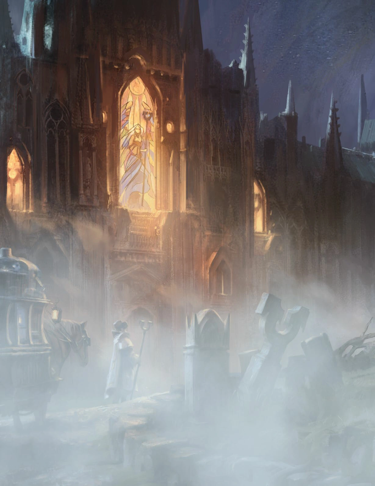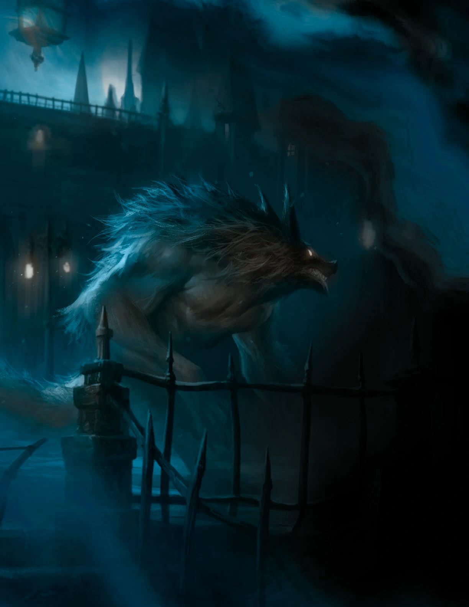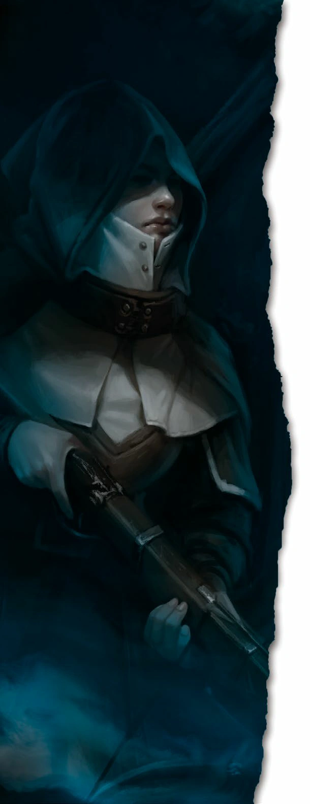Clouds of purple and red shroud the sky above the forbidding mountains of the Geier Reach, never allowing the sun's full light to shine on the ground below. The jagged spires of Maurer Estate jut up from the peaks, keeping silent watch over the isolated valley. Stoic and enduring, the people of Stensia huddle in their stone-crafted villages—Shadowgrange, Krezk, Lammas—built against the mountainsides. Wisps of thick fog twine amid the trunks of black pines in the Somberwald, thick bogs suck dead trees slowly down into their murky depths, and dusky pastureland provides scant sustenance to flocks of scrawny sheep.

The lord of this bleak, remote part of Stensia's outland valleys is Strefan Maurer, who drank angel's blood alongside Edgar Markov and Olivia Voldaren centuries ago. His bloodline is small and mostly irrelevant to the larger world, but in the outland valleys of Stensia, he is the ultimate master. Avacyn and Sigarda offer scant hope to his grim subjects. Abandoned by their angels and hunted by vampires, all the Stensians can do is endure the unending dusk.

---
*By the time *Plane Shift: Zendikar* saw the light of day, the game and story of *Magic: The Gathering* had moved on from Zendikar and started the tale of *Shadows over Innistrad*. I had already finished writing *The Art of Magic: The Gathering—Innistrad*, at the same time that *Curse of Strahd*, a horror-themed adventure for Dungeons & Dragons, was on the shelves. All this meant that I turned my attention pretty quickly to the next installment, *Plane Shift: Innistrad*!*

*The starting point for this document was *The Art of Magic: The Gathering—Innistrad*. Consider that book to be a useful resource in creating your Innistrad campaign, but not strictly necessary. An abundance of lore about Innistrad can be found on the Magic website. This document is designed to help you turn the book's adventure hooks and story seeds into a resource for your campaign with a minimum of changes to the fifth edition D&D rules.*

*This document also contains guidelines for adapting the *Curse of Strahd* adventure to set it in Innistrad. With a bit of creative improvisation, these tips should get you on your way.*— James WyattThe game mechanics in this supplement are usable in your D&D campaign but are not fully tempered by playtests and design iterations. For these reasons, material in this supplement is not legal in D&D Organized Play events.

------

# The World of Innistrad

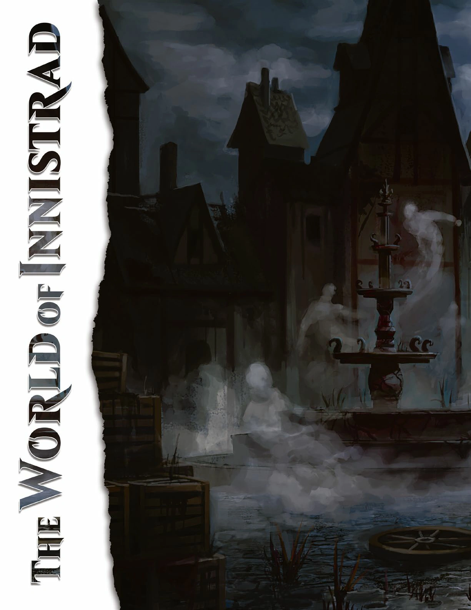

On the plane of Innistrad, horrors stalk the shadows and scratch at doors in the night. Humanity is beset on all sides: vampires thirst for human blood, werewolves live for the thrill of the hunt, the restless spirits of the dead haunt the living, and no corpse is safe from reanimation at the hands of cruel necromancers or cunning scientists. Only their grim determination—and their staunch faith in the protection of their patron archangel, Avacyn—has allowed humans to survive in this nightmarish realm.

### Horrors of the Night

The people of Innistrad are surrounded by monsters. Almost without exception, anything that is not human, whether it's a rat or an angel, is a potential enemy. Even the traditional allies of humanity—from angels and gryffs to herons and hounds—are unreliable at best, as the madness that grips the angels seems to seep into every living thing. And at the same time, humanity's age-old enemies grow ever more dangerous.

The specific horrors that the people of Innistrad fear most are all reflections of humanity's darker nature. Werewolves are a living embodiment of the secret rage and violence that hide in the human heart. Vampires are the bodily manifestation of carnal desire, hedonistic cravings, and bloodlust. Zombies and geists—the restless spirits of the dead—paint the eventual future of all people in the starkest terms, underlining the grim truths of human mortality. Demons are the unholy inversion of humanity's spiritual longings—the shadow side of the angels' brightness.

Still, the most dreadful creatures of Innistrad lurk within human towns and cities, pursuing their twisted schemes and unholy desires in the heart of civilization. These are the humans that have been consumed by Innistrad's darkness. Sinister cultists give themselves over to demons and other dark forces. Depraved necromancers raise the dead to do their bidding. Obsessive scholars pry into secrets best left hidden. Crazed scientists toy with forces of life and death in their effort to create artificial life or harness the energy that remains in the spirits of the dead. And even among the common folk—on Innistrad as on every plane—some simply give in to selfish desires and violent rage, killing with knife and garrote rather than sorcery.

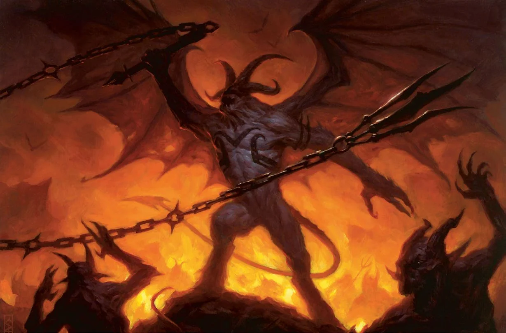

### Defenders of Humanity

Humanity is not without protectors in this nightmare land, and the foremost of those have always been the angels. Led by the glorious archangel Avacyn, the hosts of angels is few in number but has long stood with the people of Innistrad to face the horrors of the night.

Except in rare cases where the angels directly involve themselves in combat with monsters, their power is mediated through the Church of Avacyn, which serves as both spiritual and temporal authority in the four provinces of Innistrad. The priests of the church perform ritual blessings on the faithful and their homes to ward off evil, and the church's soldiers and inquisitors have long hunted vampires and werewolves that prey on the people in their charge.

But that was before Avacyn went mad. Without warning, the searing fury of the archangel—usually reserved for the greatest foes of humanity—was turned on villages full of seemingly innocent people. Angels under Avacyn's leadership impaled the innocent on their spears and scoured the earth with celestial fire. Convinced that the sins of humanity had brought down Avacyn's wrath, the church took up the archangel's cause and sought to purge all sin through inquisition and execution.

With even the angels and the church turned against humanity, few were left to take up arms against Innistrad's evils. Here and there, renegade cathars disobeyed the mandate of the church and continued to hunt vampires and werewolves instead of punishing the innocent. But increasingly, the common folk—farmers with their pitchforks, smiths with their hammers, and retired soldiers taking battle-worn swords down from above the mantle—discovered new reserves of strength and resiliency to stand against the horrors of the darkness, even when those horrors were parish priests and holy knights.

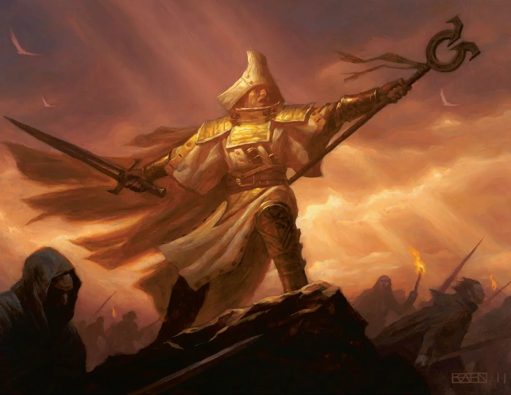

------

# People of Innistrad

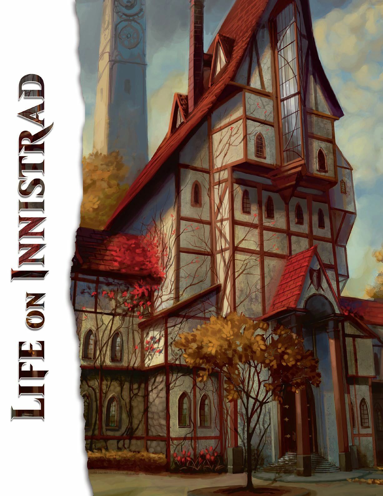

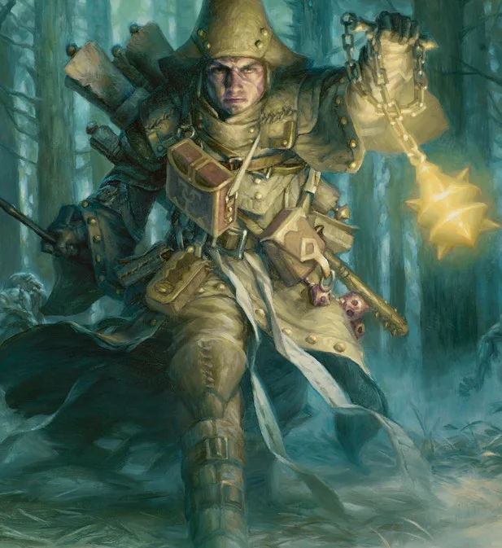

Innistrad's population is mostly human, and player characters in an Innistrad campaign should be human in most circumstances. However, the humans of Kessig are different in many respects from those of Gavony, and Nephalia's urban culture is very distinct from the shadow-draped land of Stensia. Diversity among player characters comes not from race, but from each character's home province.

- Human (Innistrad)
- Human (Innistrad; Gavony)
- Human (Innistrad; Kessig)
- Human (Innistrad; Nephalia)
- Human (Innistrad; Stensia)

### Classes Overview

Characters of any class can be found in Innistrad, though some classes are rarer than others. The organizations and character types noted below are described in more detail on the following pages.

Barbarians are not a common sight in Innistrad. Some cathars draw on the power of divine fury (see the Lightning Mauler card in Avacyn Restored). The remotest regions of the Somberwald, the Ulvenwald, and the Geier Reach might also be home to more traditional barbarians.

Bards are also rare on Innistrad. A springsage—an Avacynian archmage dedicated to healing and renewal—could conceivably be a bard.

Clerics populate the ranks of the church hierarchy and many cathar orders.

Druids can be found as springsages or as the "witches" known as forcemages, who make pacts with nature spirits.

Fighters fill all the usual roles on Innistrad, as soldiers, cathars, militia captains, town guards, and so on.

Monks are rare. A monk is probably a member of the church hierarchy, and in fact is most likely to be a monk in the church's definition—a wandering priest.

Paladins fill many of the cathar orders. As the angels' madness and Emrakul's rise change the face of Innistrad, the Order of Saint Traft becomes the home of many "heretic" cathars who choose to follow their own conscience rather than the increasingly insane dictates of the church.

Rangers are particularly common in Kessig, where they operate as hunters, trappers, or guides in the Ulvenwald, or as cathar members of the Quiver of Kessig.

Rogues are most common in Thraben and the cities of Nephalia, engaging in smuggling, thievery, corpse trading, and other unsavory lines of work.

Sorcerers are rare. A spearsage (one of the archmages of Goldnight) could be a sorcerer, especially if you use the favored soul variant presented in Unearthed Arcana. A sorcerer might also be a necro-alchemist or a cultist of some sort.

Warlocks are found primarily in cults of madness (with a Great Old One as patron), demon cults such as the Skirsdag, or witches' covens. A warlock who belongs to the Skirsdag might be a respected member of the church hierarchy, feigning the blessings of Avacynian clergy.

Wizards are often Avacynian archmages, but can also take up more sinister vocations—ghoulcallers, skaberen, necro-alchemists, mad scientists, and cultists.

### Languages

Innistrad is not a world with a variety of languages, unlike most D&D settings. The people who inhabit the world all speak the same tongue, and the most common monsters—including vampires, werewolves, and geists—speak it as well, since they were once human.

Ordinarily, all humans learn an additional language, and many backgrounds give access to languages as well—so the easiest way to deal with these extra languages is to ignore them. Humans speak only Common. If a background gives access to a language, the character can choose a tool proficiency instead.

Alternatively, you can diversify the languages of Innistrad. Perhaps the Common tongue is the language of the church, used to facilitate communication among people in different provinces, even as each province has its own language or dialect. Characters might also be able to learn Demonic (spoken by demons and devils), Draconic (spoken by dragons), or Primordial (spoken by elementals).

## The Church of Avacyn

The Avacynian faith is a complex system of beliefs and magical practices intended to protect the humans of Innistrad from the predations of the plane's monsters. Over the centuries, layers of belief and ritual have accreted to this basic core, but as long as Avacyn remained present and sane in the world, the wards of the church remained strong, preventing the utter extinction of the human race.

Player characters in an Innistrad campaign are likely to be associated with the Church of Avacyn in some capacity. Clerics, druids, fighters, paladins, rangers, and wizards might serve as cathars, inquisitors, or archmages within the broad organization of the church.

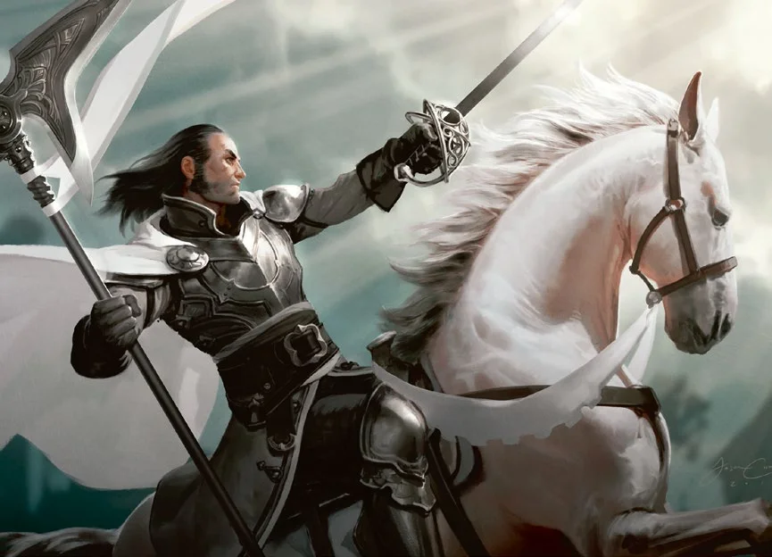

### Church Hierarchy

The church is headed by the Lunarch Council. Consisting of bishops and cathars of the highest ranks, the council continues to struggle to come to terms with the madness of Avacyn and her angels.

Bishops are the leaders of the spiritual and temporal affairs of the church. Elders govern the parishes that make up each province, combining the administrative responsibilities of a mayor with the religious authority of a minor bishop. Priests attend to the needs of the people at parish churches, village chapels, and crossway altars. All priests have the ability to perform magic, though some are more powerful than others. Most of them focus on the protective blessings that make up the rituals of the church.

Monks are wandering priests, not connected to a specific location. Some feel called to minister to those isolated people living beyond the reach of a parish priest, but others take up the life of a monk because they disagree with their superiors in the hierarchy. Some are wild-eyed fanatics or heretical teachers, but many are quiet, peaceful souls with firm convictions that set them apart from the church.

A player character cleric is probably referred to as a monk in the church hierarchy, having the freedom to move around with no responsibility to any congregation. The acolyte background is ideal for such a character. A cleric's choice of domain might reflect a connection to one of the archangels subservient to Avacyn. The Knowledge domain is particularly associated with Bruna and Flight Alabaster, the Life domain is strongly connected to Sigarda and the Host of Herons, and the War domain is tied to Gisela and Flight Goldnight.

### Cathars

Cathars are the soldiers of the Avacynian church, but "soldiers" is a broad term encompassing everything from crime-solving investigators to mounted paladins. Some cathar orders are so independent as to be virtually separate sects of the church, while others are tightly bound to the hierarchy of the faith:

- The elite cavalry of Innistrad, the Gavony Riders, are extensively trained in mounted combat with swords and lances.
- The mausoleum guards are the rank-and-file soldiers of the cathars, wielding little magic but making up for it with their numbers.
- Midnight duelists patrol the streets, particularly at night, on the lookout for thieves, vampires, and corpse traders.
- Moor chaplains are battlefield faithful who wield magic and weapons with equal skill. Their magic focuses on healing and protection, so they don't usually fight on the front lines.
- Cathars of the parish-blades serve as escorts along the crossways and protect the cathedral in Thraben. They are an elite military force that assembles at the bishops' command.
- The Quiver of Kessig is an order recently split off from the parish-blades. Its members specialize in archery and long-range defense, and often guard town walls and church roofs against spirits, vampires, specters, demons, and other flying attackers.

Cathar characters might be clerics (especially moor chaplains), fighters or paladins (especially Gavony Riders, mausoleum guards, midnight duelists, or parish-blades), or rangers (in the Quiver of Kessig). The soldier background works well for cathars.

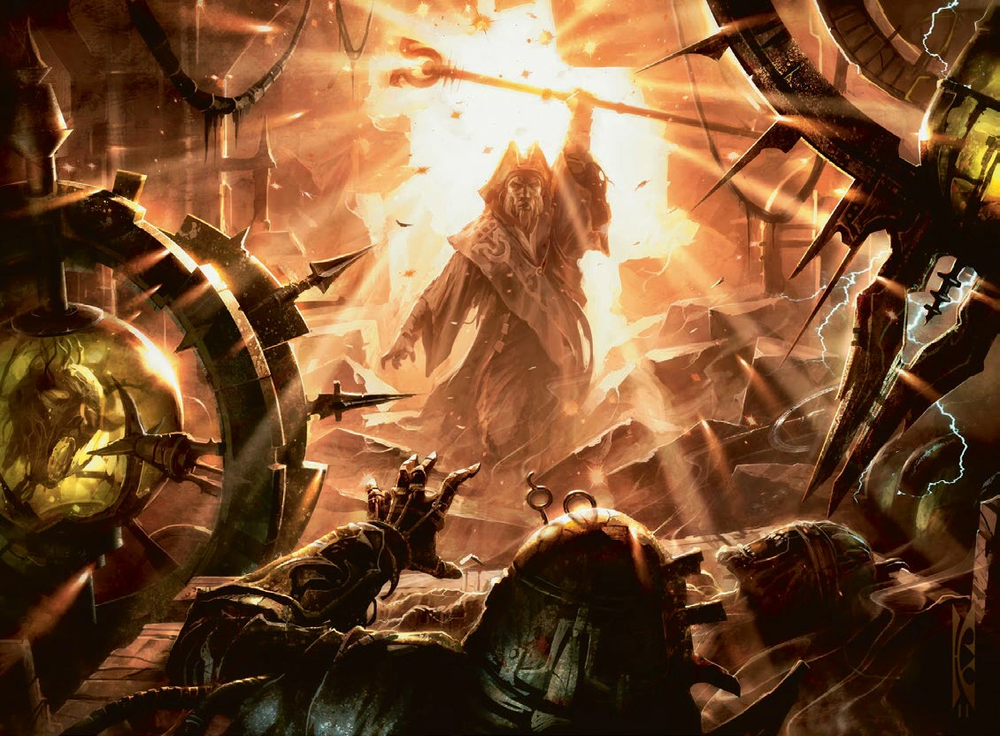

### Avacynian Archmages

The Avacynian archmages are gifted spellcasters with the inborn ability to channel some of the divine power of the archangels. Each lineage of the archmages practices unique techniques passed down from master to student for generations, ultimately tracing back to the archangels and Avacyn herself.

Spearsages, the archmages of Goldnight, use powerful and aggressive spells associated with the sun, channeling blinding rays of holy light and powerful prayers to bolster their allies' speed and courage.

Moonsages, the archmages of Alabaster, are concerned with preserving the Blessed Rest, preventing humans from returning as zombies. They use preventative and warding spells, banishing the undead to the void and making sure graves remain sealed.

Springsages, the archmages of Herons, are healers who use their magic to aid individuals, whole villages, and even the land itself. They act much like wandering priests or monks, traveling the remote reaches to minister to the people and heal the sick.

Avacynian archmages might be clerics, wizards, or (in the case of the springsages) druids. The favored soul sorcerer presented in Unearthed Arcana could also work for an archmage *(see also the divine soul sorcerer released in XGE)*, and the sage background is ideal for such characters.

## Inquisitor Background

Historically, inquisitors were cathar detectives who investigated crimes both mundane and supernatural. They were known for traveling to remote parishes plagued by unexplained murders, and for exposing werewolves living among normal humans. During Avacyn's absence, when the archangel was trapped within the demonic prison known as the Helvault, the inquisitors led a series of brutal forays into Kessig and the Gavony Moorland. They executed suspected lycanthropes with little or no proof, and punished accused heretics in unsanctioned trials. With Avacyn's madness, this savage form of inquisition has become the norm, and inquisitors who still pry into dark mysteries have become a minority.

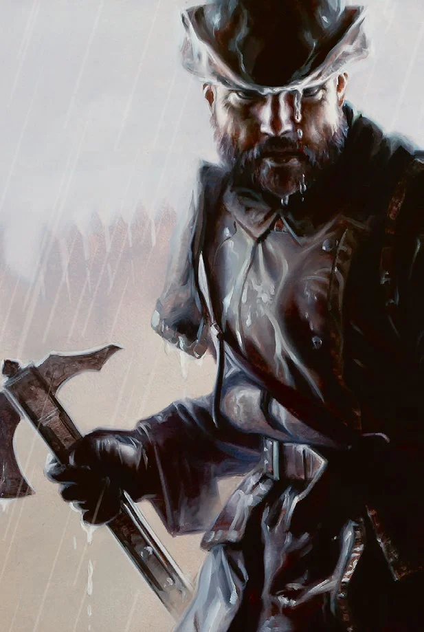

------

### Creatures of the Night

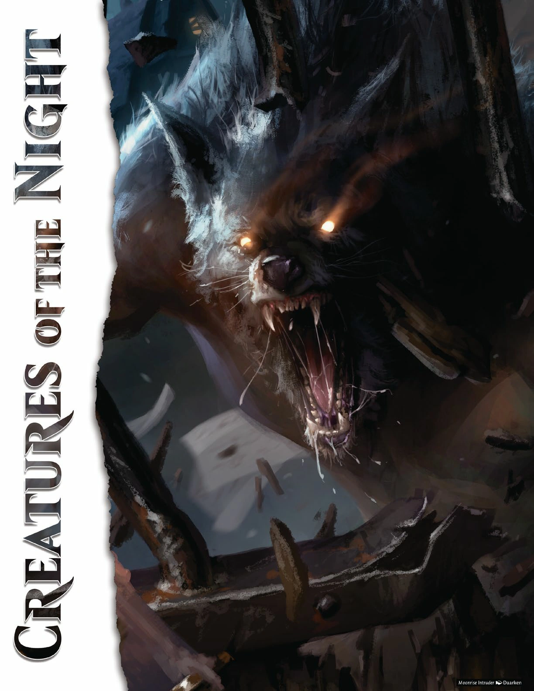

- **Creepy Doll**
- **Demonlord of Ashmouth**
- **Flight Alabaster Angel**
- **Flight Goldnight Angel**
- **Flight of Moonsilver Angel**
- **Geist**
- **Host of Herons Angel**
- **Keeper of the Feather**
- **Necro-Alchemist**
- **Skaab**
- **Vampire Neonate**
- **Werewolf (Krallenhorde)**
- **Zombie Cat**
- **Zombie Rat**
- **Zombie Snake**

---
***Liches.*** Liches are powerful necromancers who fuse the magic of the ghoulcaller with the arcane science of necro-alchemy, preserving themselves in hideous unlife while retaining their sentience and magical power. One lich is known to reside in the Nephalian town of Havengul, but others might exist that are more skilled at hiding their presence. The **lich** in the *Monster Manual* can represent these undead necromancers.

#### Demons

Demons are the dark counterparts of angels—malevolent creatures of raw black mana. Some were once humans who sold their souls for power, and all are utterly corrupt and evil. As creatures of pure mana, demons can never be truly destroyed. When a demon dies, its essence is scattered for a time, but that essence eventually coalesces into a new form. The power of Avacynian magic keeps the essence of slain demons from creating new demonic forms as quickly as was common in Avacyn's early days. To fight against such magic and extend their influence into the mortal world while keeping out of easy reach of the angels, demons make pacts with cultists and witches, bending those humans to their sinister will.

As it did during Avacyn's absence, the most prominent demon cult on Innistrad exists within the highest levels of the hierarchy of Avacyn's church. The influence of the Skirsdag Cult is strong within the Lunarch Council, and that influence has whipped the church into a murderous frenzy in response to the angels' madness. The terrible inquisition that has arisen as a result has proven as great a threat to Innistrad as the angels themselves. Throughout it all, the demons remain hidden, but their reach is greater than it has ever been.

Virtually any demon, devil, or yugoloth in the Monster Manual can stand in for a demon of Innistrad. The greatest demons, such as Griselbrand, Ormendahl, and Withengar, are mighty beings on par with the demon princes described in the *Out of the Abyss adventure*. When any demon is destroyed, it gains a new body after somewhere between ninety-nine days and ninety-nine years.

***Devils.*** Devils are infernal perpetrators of malicious mischief. They make up the personal armies and entourages of the demons—those creatures' selfish desires and urges made flesh. Cruel and gleefully sadistic, devils have no regard for the safety of themselves or others. They delight in destruction, mayhem, and pain.

Devils stand about three or four feet tall and have faces full of needlelike teeth. Most have ruddy or deep red skin, one or two back-sweeping horns, and long, whiplike tails. However, their morphology varies from individual to individual. Devils are agile and make passable fighters, but they do their best destructive work by sabotaging things of value and inciting violence in others.

Devils are best represented by the smaller demons and devils presented in the Monster Manual—**dretches**, **imps**, **lemures**, **manes**, **quasits**, and **spined devils**.

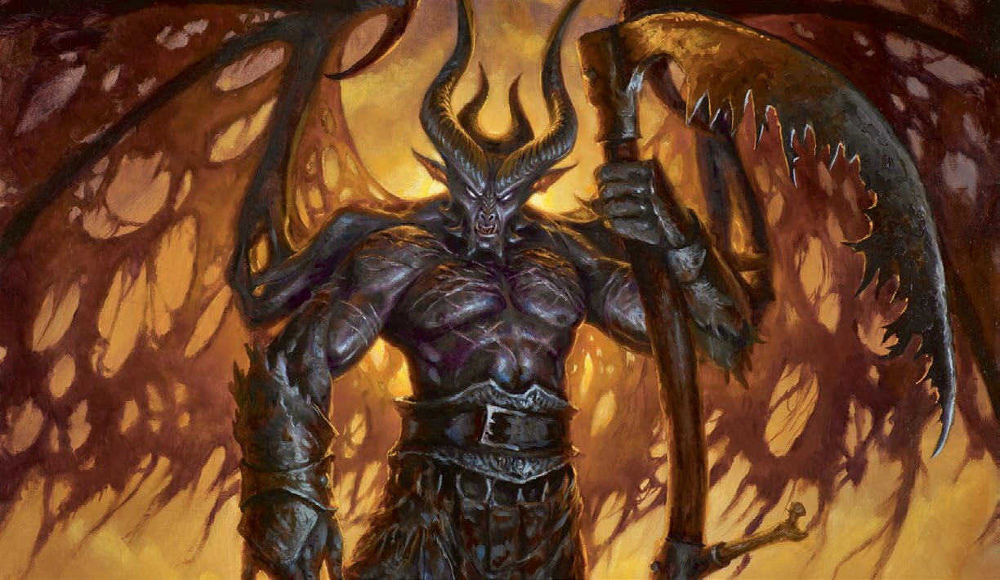

#### Cults and Witches

With the madness of the angels, a variety of new cults sprang up across Innistrad. Some were direct continuations of the demon cults that had proliferated during Avacyn's absence, but others were entirely new—centered on madness and revering monsters that had arisen in response to the angels' madness. Many such cults can be traced to the activity of Nahiri—the stoneforging Planeswalker known as the Lithomancer.

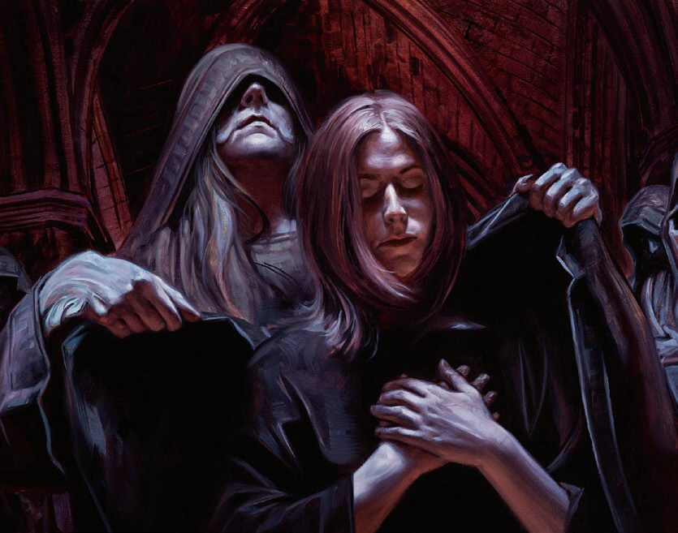

***Cults of Madness.*** Many of the cults that once followed demons saw their patrons destroyed when Avacyn emerged from the Helvault. The people who belonged to those cults were not so quickly restored to church and community, and many of them remain disgruntled, rebellious, or insane. Nahiri has played on their discontent and given them new masters to serve. Some revere her, especially in Stensia, believing that she is an ancient vampire. Others offer sacrifices to the monsters of the world—including those in Nephalia who worship the monstrous kraken-like Kralmar.

Many of these cults gather around spires of twisted stone (called cryptoliths) that Nahiri has raised from the ground across the provinces. The true purpose of these stones—redirecting the ley lines of mana flowing through the plane—is lost on the cultists, but the redirection of mana has caused the madness of the angels, who are formed of raw mana. Whether this was Nahiri's intent or simply a side effect of some greater plan remains a mystery. Many cultists view the angels' madness as a sign of the dawning of a new age, believing that the angels are purging those who are unworthy to be present when some unknown apocalypse occurs.

be present when some unknown apocalypse occurs. Followers of Nahiri's cults are physically as well as mentally warped. Their features twist into bestial or fishlike forms, as if they might be regressing through millions of years of evolution. Some even grow tentacles or tails, transforming into slimy horrors resembling octopuses or amphibians.

***Demon Cults and Witches.*** Not all the demons were killed when Avacyn escaped the Helvault, and some of their cults remain intact. The most important of these is the Skirsdag, which hides within the very hierarchy of the church in Thraben. Once dedicated to the archdemon Griselbrand, the Skirsdag is now led by Ormendahl the Reaper, a demon who survived the angelic purge by hiding in caverns deep beneath the cathedral. With the madness of Avacyn, the Skirsdag gains increasing influence over the Lunarch Council, adding violent zeal to the church's inquisition.

The distinction between a demon cult and a witch's coven is subtle. Cultists worship demons, but witches derive actual magical power from them, forging contracts similar to those that gave the Planeswalker Liliana Vess her magical power.

These cultists can be represented in the game using the statistics for **cultists** or **cult fanatics**. The cults of madness might include **yuan-ti purebloods** or **kuo-toa** (in the most advanced cases of corruption). Demon cultists could be **acolytes** or **priests**, and witches could be **mages** or **druids** (particularly in the case of the forcemages, who derive their power from nature spirits rather than demons).

#### Dragons and Wurms

Dragons are extremely rare on Innistrad, mostly confined to the remotest parts of the Geier Reach in Stensia. Most of these dragons are brutal fire-breathers that prey on any creature that strays into their territories, making them best represented by the red dragons in the Monster Manual.

A few dragons are known to favor more monstrous prey, hunting vampires and flying into Kessig to feast on werewolves. Known as moonveil dragons, these extremely rare creatures have shimmering, transparent wings that gleam in the moonlight as they hunt. The sight of one is considered an inspiring good omen by those who fight the evils of the world. Use the brass dragon statistics for a moonveil dragon.

**Wurms** are enormous serpentine creatures that burrow through the ground, consuming corpses. Fortunately quite rare, they are thought to be physical manifestations of corrupted green mana. The **purple worm** in the Monster Manual can represent these monstrosities.

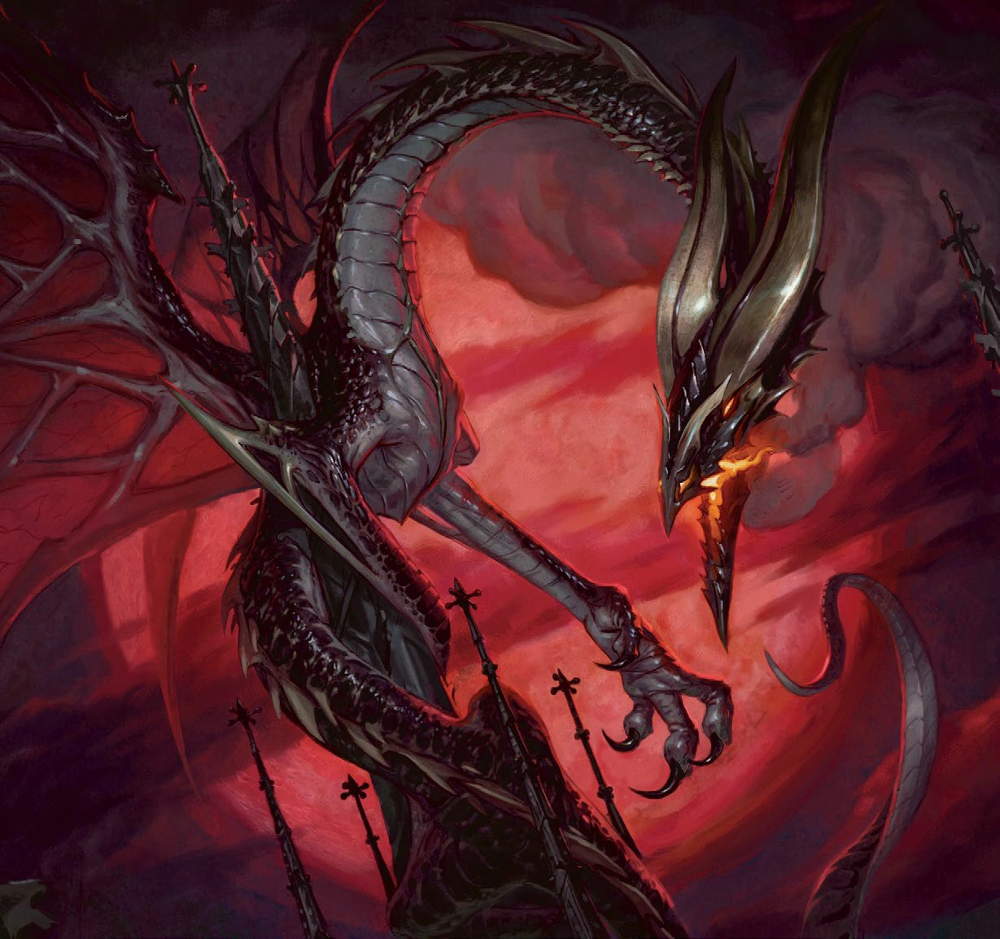

#### Elementals

Elementals are manifestations of the forces of nature, and on Innistrad that generally means sinister forces. They arise from the twisted woods—the Ulvenwald and the Somberwald—that hide some of Innistrad's most fearsome monsters, or spawn from the fiery chasms that seethe like cauldrons of hate in the midst of the land. Like geists, elementals are closely associated with specific colors of mana.

Green-aligned elementals usually take on gnarled humanoid shapes made up of wood stalks and twisting vines, best represented as **treants**, **blights**, **shambling mounds**, or **awakened trees** and **awakened shrubs**. Others are nature spirits and spirit animals. Some of these are relatively benign, including beautiful nature spirits (**dryads**) wrapped in vine and thorn. Cold-burning geistflames made of unnatural fire (**will-o'-wisps**) seem unconcerned with human life, but often lead travelers through the woods and bogs into danger. Malign kindercatches (**green hags**) steal children from the forest villages of Kessig.

Red-aligned elementals are fiery beasts (**hell hounds**) or spirits (**fire elementals**) that haunt places like Ashmouth or Devil's Breach.

------

# Rise of Emrakul

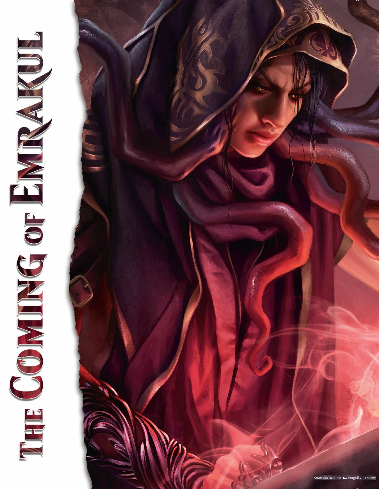

Emrakul is the largest and most fearsome of the three Eldrazi titans imprisoned on Zendikar. She causes silent horror wherever she soars, embodying desolation, emotional and physical distance, the chill of the void, and the terror of being alone. Thus, in many ways, she is perfectly at home on Innistrad.

Emrakul's initial approach to Innistrad pressed on the minds of that plane's inhabitants, straining their sanity. Her full manifestation then amplified that effect. Cultists who bordered on mad obsession descended into gibbering adulation of their Eldrazi idol, and scholars who pried into dark secrets fell catatonic with the full realization of the alien horror they studied.

Emrakul arrived on Innistrad without her brood of drones and other spawn, so she immediately began warping the native creatures of the plane—both natural and unnatural—in her own monstrous image. Beings transformed into Emrakul's spawn manifested fleshy lattice structures, distorted symmetry, and tentacles ending in knobby, vestigial digits. Those who had already begun their descent into corruption before the Eldrazi's arrival were warped almost beyond recognition, but even those who fought against the madness during her approach were susceptible to the life-warping affects of her presence.

Emrakul's arrival set a new series of horrific events in motion, as humans and monsters alike found their very existence threatened by this blasphemous horror.

### Emrakul's Madness

The story of Shadows over Innistrad and Eldritch Moon is shaped by Emrakul's arrival and the madness that spreads across the plane around the Eldrazi titan. A D&D campaign set on Innistrad can ignore this aspect of the story and focus instead on the themes of more traditional Gothic horror. But if you do want to add elements of Emrakul's madness to your campaign, use the Sanity score rules in chapter 9 of the Dungeon Master's Guide. Allow characters to make Sanity checks to interpret the effects of Emrakul's corruption, and Sanity saving throws to resist the effects of the spreading madness.

Mental corruption is not the only effect of Emrakul's presence on Innistrad, however. Particularly after the Eldrazi titan fully emerges into the plane, the madness she brings is accompanied by physical mutation as well. Rather than unleashing hordes of spawn upon the world as the Eldrazi did on Zendikar, Emrakul causes the living creatures of Innistrad to transform into her spawn, becoming warped and horrible fusions of normal and Eldrazi flesh. This physical transformation first takes hold of humans whose minds have already been touched by the Eldrazi's approach, with mental obsession often manifesting in physical expression. But Emrakul's physical presence affects every living thing nearby.

A creature or character whose Sanity score is below 10 can begin to manifest signs of physical corruption, which progresses in stages.

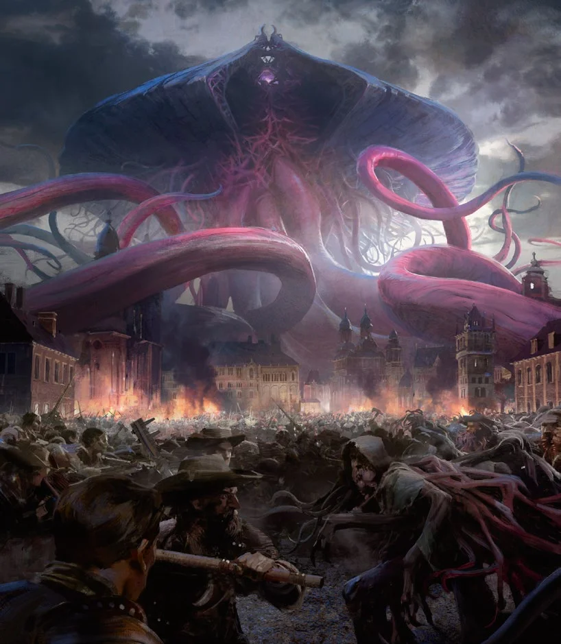

***Distorted (Sanity 8–9).*** Even before Emrakul's arrival, some cultists and those who pried too deep into dark secrets begin to change. In this early stage, physical proportions shift, with one or more of the creature's limbs or some part of the face growing larger, almost always asymmetrically. Noticeable skin blemishes can also appear, most often as boils or clumps of cauliflower-like growths (though these do not yet resemble the lattice of Emrakul's flesh). Creature statistics are unchanged.

***Deformed (Sanity 6–7).*** In the second stage, a creature can develop a dead or bulging eye, huge tumorous growths, curled hands or feet, violent palsy, oozing secretions from the skin or eyes, raw red patches on the skin, and similar deformities. Patches of lattice-like growths often appear on the skin. In some cases, particularly in Nephalia, cultists begin to manifest distinctly fishlike features—goggling eyes, scaled or slimy skin, webbing between the fingers or toes, or gill-like flaps on the face or neck. Creature statistics remain unchanged.

***Disfigured (Sanity 4–5).*** In the third stage, the lips shrink away from the teeth, which can rot and fall out. Fingers and toes sometimes fuse together or start transforming into tentacles. Bleeding sores erupt on the skin, or bulbous growths can appear under the skin. Cultists in Nephalia often grow fin-like protrusions or pincer-like hands. At this stage, creatures might manifest improved natural armor or weapons, or simple benefits such as the Amphibious trait of a **bullywug**, the Blind Senses of a **grimlock**, Chameleon Skin like a **troglodyte**, the Slippery trait of a **kuo-toa**, or the Spider Climb trait of an **ettercap**.

***Misshapen (Sanity 2–3).*** In the fourth stage, a creature's flesh often rots away or grows out of control, either leaving muscle and bone visible beneath or concealing features beneath masses of fleshy lattice or bulbous growths. Bone structure can alter radically, creating additional limbs or turning existing limbs into bizarrely jointed tentacles. Extra eyes can appear in unexpected places, or the head can transform into something resembling a fish or octopus.

At this stage, a corrupted creature might begin to transform into an entirely different creature. A human could effectively become any of the creatures mentioned above, or some other vaguely humanoid monster such as a **kenku**, a **lizardfolk**, a **sahuagin**, or a yuan-ti.

***Monstrous (Sanity 1).*** The most warped creatures are barely even recognizable. Some become little more than a mass of writhing tentacles, or lose their physical coherence entirely. Two or more creatures can fuse together, joined by fleshy lattice. The "lucky" ones retain a basically humanoid shape, but otherwise appear completely monstrous, with twisted faces, extra limbs, horny growths, jointed tentacle extrusions, and so on. Such a creature might effectively become an Eldrazi-like monster such as an **aboleth**, a **chuul**, a **cloaker**, a **gibbering mouther**, or a **mind flayer**.

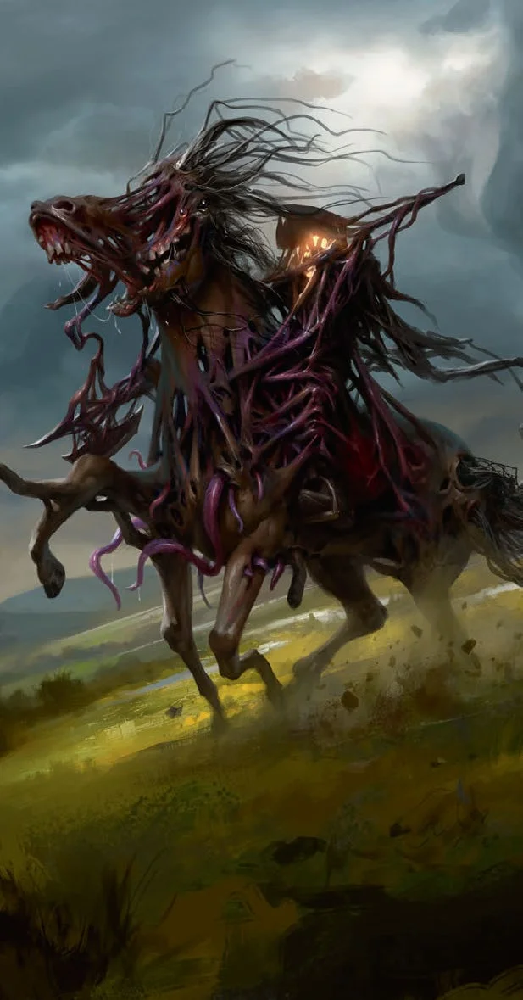

------

# Curse of Innistrad

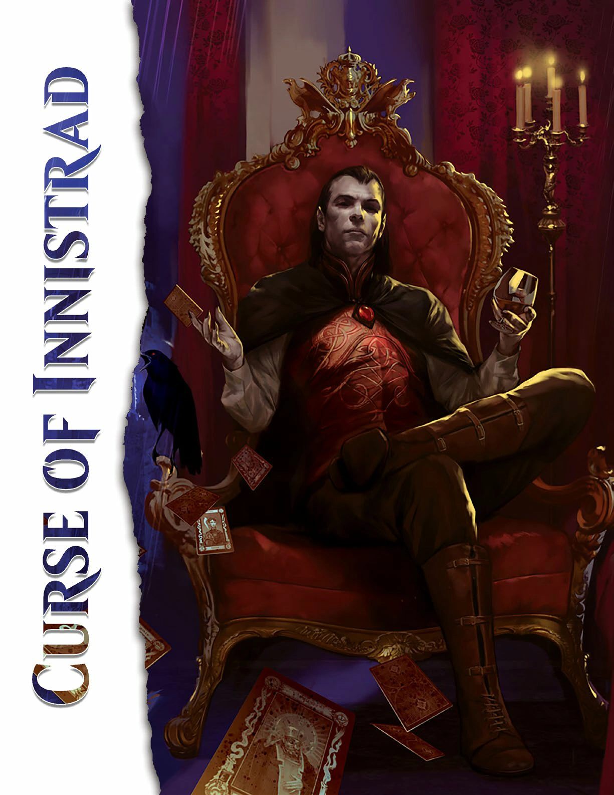

Innistrad's ancient history speaks of a human alchemist and healer named Edgar Markov, who sought to preserve his own life and the lives of his family. As old age began to claim him, he despaired of finding an alchemical solution and turned to black magic. Not long after, the demon Shilgengar appeared to Markov and revealed a means by which he could achieve immortality: a dark ritual that involved drinking an angel's blood.

The vampires of Innistrad are all descended from twelve ancient sires—the congregation that participated in Markov's blasphemous ritual. Of these twelve bloodlines, four constitute the vast majority of Innistrad's vampires: Markov, Voldaren, Falkenrath, and Stromkirk. Three of the others have died out completely, while five are so few in number as to be irrelevant. One of those nearly irrelevant lines is that of Strefan Maurer, who rules a remote region in Stensia's outland valleys.

This chapter offers suggestions for situating the region of Barovia, which is detailed in the Ravenloft adventure *Curse of Strahd*, within the plane of Innistrad. The changes range from the merely cosmetic (changing the Balinok Mountains to the Geier Reach, for example) to more thorough reimaginings of Ravenloft elements foreign to Innistrad, such as dusk elves, wereravens, and the enigmatic Vistani.

Much of the description of Barovia presented in *chapter 2 of Curse of Strahd* applies to Innistrad generally and to the outland valleys of Stensia in particular. Some elements do not apply, including the mists of Ravenloft. No magical barrier imprisons people in the outland valleys, or even on Innistrad as a whole. Planeswalkers, at least, can leave the plane, and high-level spellcasters native to Innistrad might be able to glimpse realms beyond the Blind Eternities through their magic.

The description of the dour people of Barovia applies to Stensians as a rule. However, all Stensians have souls, and those souls are not trapped on Innistrad.

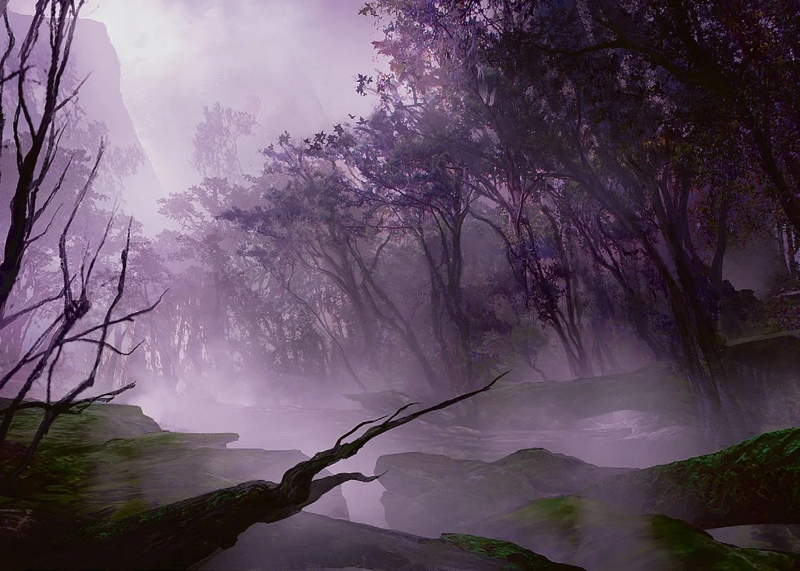

### Strahd von Zarovich—Strefan Maurer

The history of Strefan Maurer runs parallel to that of Strahd von Zarovich. After his father's death, Strefan studied magic and forged a pact with the demon Shilgengar in return for the promise of immortality. After murdering his brother Sergei and drinking his blood, Strefan journeyed to Markov Manor and consulted with Edgar Markov. Together, they worked with Shilgengar to create the twelve bloodlines of vampires on Innistrad. Maurer Estate (Castle Ravenloft) was not spirited away to a demiplane—it was already on Innistrad, itself a place of nightmares. And Strefan is not trapped here, so he is not seeking a successor in hopes of escaping. Newcomers to his domain do attract his attention, though, as the possibility of meeting a new consort is always on Strefan's mind.

Strefan's statistics are unchanged from the statistics of Strahd in the Curse of Strahd adventure, except that he lacks the Vampire Weaknesses feature. Instead, Strefan has the weaknesses shared by Innistrad vampires (see that earlier section).

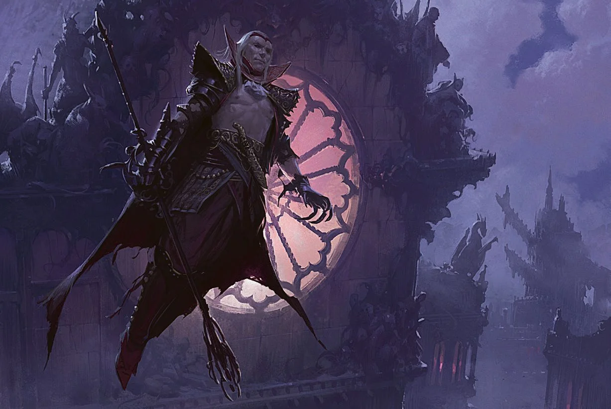

### Lands of Barovia—Outland Valleys

The region shown on the map in the Curse of Strahd adventure covers most of the outland valleys, the dales of the Geier Reach that are farthest from Gavony and Kessig. Only place names within the region need updating; the rest of the region's geography is unchanged. The Balinok Mountains are the Geier Reach, the Svalich Woods are the Somberwald, Lake Zarovich is Maurer Lake, and the Old Svalich Road is Somber Road.

Two passes cross the Geier Reach to connect the outland valleys with the wider world. Hofsaddel is the more often used, a wide and well-trodden pass mostly ignored by the vampires. The Somber Road runs through this pass, but it is a long and circuitous route. By contrast, Needle's Eye is a narrow, treacherous, and deadly path haunted by vengeful geists. It is a more direct path, but it runs perilously close to the demonic gateway known as Ashmouth, so humans use this pass only in the most dire need.

The lore known to the people of Stensia is different in detail but similar in substance to what is presented in the *Curse of Strahd* adventure.

#### Strefan the Fiend

The people of Stensia and the outland valleys know the following about Strefan Maurer and vampires in general:

- Strefan Maurer is a vampire, and he dwells in Maurer Estate. No one is welcome at the estate.
- Strefan the fiend is a curse placed on the land because of some forgotten sin committed by the ancestors of the people of Shadowgrange. (This is untrue, but the people of the outland valleys believe it.)
- Vampires have three supernatural characteristics that are shared across all bloodlines: agelessness, superhuman strength (mostly an exaggeration), and an aura of silence that emanates from them at will to a radius of two feet. Elder vampires can learn powerful magic of many different kinds, such as flight, a hypnotic gaze, or the ability to transform into other forms such as that of a bat or a mist.
- Weapons cut from living wood are particularly effective against vampires, though any weapon can harm or kill them. A vampire can't cross running water that shows the reflection of the moon, and water blessed by Avacyn burns vampire flesh like acid. The holy symbols of Avacyn, blessed in the proper rituals of the church, can fill a vampire with a paralyzing fear and a desire to flee.

#### The Outland Valleys

The people of the outland valleys know the following facts about their homeland:

- Many strangers have been drawn to the outland valleys over the years, but they all die or disappear eventually.
- Wolves, dire wolves, and werewolves prowl the Somberwald, and hungry bats fill the skies at night.
- The village of Shadowgrange sits at the east end of the valley. Its burgomaster is Kolyan Indirovich.
- The town of Lammas lies at the heart of the outland valleys. Its nominal leader is Baroness Lydia Petrovna, but the town is presently controlled by the inquisitor Seeta.
- The fortified village of Krezk lies at the west end of the outland valleys and is built around an old abbey. The village burgomaster is named Dmitri Krezkov.
- Wine is the lifeblood of the outland valleys—for some, it is the only reason to keep living. Taverns here get their wine from the Wizard of Wines winery near Krezk.
- A mad wizard of great power haunts the foothills of Mount Baratok. He is an outsider and no friend of the vampire's.

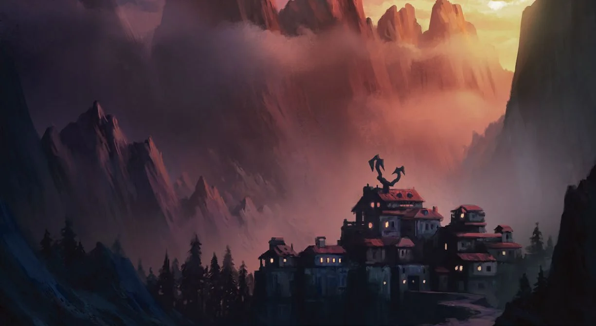

#### Beliefs and Superstitions

The people of the outland valleys have deep-rooted religious beliefs and superstitions that they pass down from one generation to the next:

- Avacyn and her angels watch over the people of Stensia just as they do over the rest of Innistrad. But Sigarda and the Host of Herons have a special love for Stensia.
- Spirits drift along the Old Somber Road toward the Maurer Estate in the dead of night. These phantoms are all that remain of Strefan's enemies, and this damnable fate awaits anyone who opposes him.
- The Bitterhearts (Innistrad's version of Ravenloft's Vistani) serve Strefan the fiend.
- Never harm a raven, lest ill fortune befall you!

### Village of Barovia—Shadowgrange

Little changes about this peaceful village as it is described in the *Curse of Strahd* adventure, except that the religious trappings found in the church use the iconography of the church of Avacyn and the archangel Sigarda. The holy symbol seen in the office is not a sunburst but Avacyn's Y-shaped collar, looking slightly distorted because of the angels' madness. The priest Donavich prays to the angels, not the gods.

The books found in the church office are called *Hymns to the Heron* (chants to Sigarda) and *The Blade of Truth: The Uses of Logic in the War Against Demonic Heresies, as Fought by the Lunarch Andreas*.

### Vistani—Bitterhearts

Madam Eva's people are the Bitterhearts, represented on cards like [https://gatherer.wizards.com/pages/card/Details.aspx?multiverseid=222205](Bitterheart Witch) (from the original Innistrad set) and [https://gatherer.wizards.com/pages/card/details.aspx?multiverseid=262836](Wakedancer) (from Dark Ascension). They are descended from a people whose village was swallowed up in the chasm of Ashmouth. To ensure their survival, they made a pact with a demon and took up a nomadic existence. Of course, not all Bitterhearts are witches. Some have taken up a life of banditry, some serve Strefan directly, and some remember their people's ancient devotion to the Demonlord of Ashmouth.

As with the other people of the outland valleys, the lore known by the Bitterhearts is mostly the same as that known by the Vistani in *Curse of Strahd*.

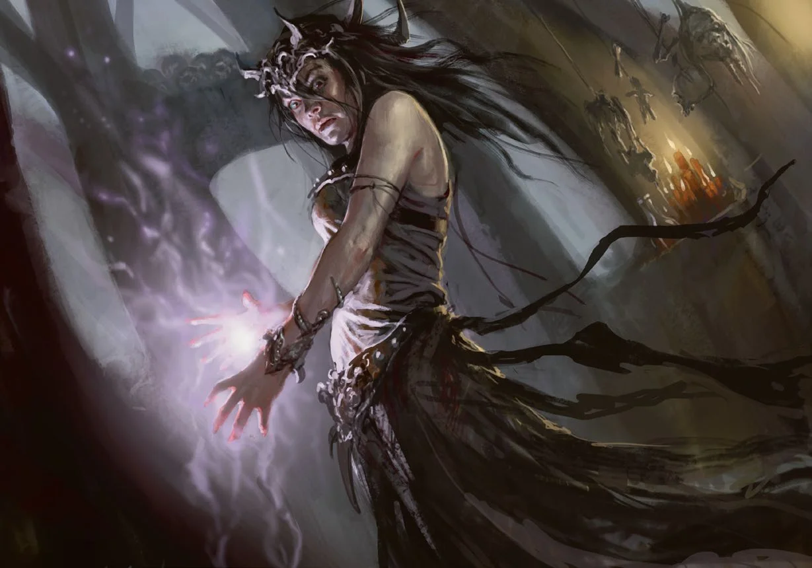

#### Bitterheart Lore—Strefan

The Bitterhearts have their own beliefs about Strefan, their world, and their place in it:

- Strefan comes from a royal bloodline. He died centuries ago yet endures as one of the undead, feasting on the blood of the living. The people of the outland valleys refer to him as "Strefan the fiend."
- Strefan has taken many consorts, but he has known only one true love: a peasant girl named Tatyana. (The Bitterhearts don't know what happened to her.)
- Strangers aren't welcome at Maurer Estate without an invitation.

#### Bitterheart Lore—The Outland Valleys

- Strefan conquered this land centuries ago. He uses wolves, bats, and other creatures to spy on all of his realm.
- The Stensians are a simple, frightened people.
- The Old Somber Road passes through Strefan's domain. Three settlements lie on the road like beads on a string: Krezk to the west, Lammas in the heart of the valley, and Shadowgrange to the east. Strefan has spies in each settlement.
- An old windmill stands along the road between the village of Shadowgrange and the town of Lammas. It should be avoided at all costs. (The Bitterhearts refuse to say more.)
- It is wise to stick to the road. Wild druids, wayward geists, and packs of wolves and werewolves haunt the Somberwald.

#### Bitterheart Lore—Beliefs and Superstitions

- Some Bitterheart women are blessed with prescience. Of all the great Bitterheart fortune-tellers, none compares to Madam Eva. If knowledge of the future is what you seek, Madam Eva will tell you your fate.
- A prescient Bitterheart can't see her own future or the future of another Bitterheart. It is the burden of the Bitterhearts' great gift that their own fates can't be divined.
- Bitterheart curses are potent, but they are invoked with great caution. Bitterhearts know that to curse one who is undeserving of such punishment can have grave consequences for the one who utters such a curse.
- Ravens carry lost souls within them, so killing one is bad luck. (There is no truth to this legend.)

### Vallaki—Lammas

In this town on the shores of Maurer Lake, the Lunarch Inquisition has taken fierce hold. A half-crazed inquisitor named Seeta has come from Thraben to the remote reaches of Stensia to root out evil and cultivate the happiness that should come from faithful devotion to Avacyn. A small demon cult does hide in the shadows of the town, led by Lady Fiona Wachter. No one in the village harbors any notion of escaping Innistrad, but they are desperate to stave off the anger of the angels.

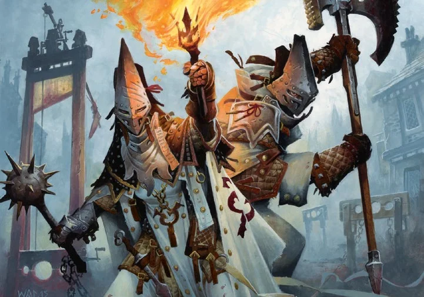

Lammas also harbors the rebellious Blade of the Inquisitors, Rem Karolus, who is staying at the Blue Water Inn and goes by the name Rictavio. (People speaking of him do not describe pointed ears, since he is and appears fully human.) Rather than a saber-toothed tiger, he has a captive nettle swine (a **giant boar**). Rictavio's journal describes "oddities" that can be attributed to the approach of Emrakul:

- A woman in Wollebank whose mouth has grown large and powerful enough that she can chew through iron chains.
- A giant carnivorous plant with a remarkable singing voice.
- A pair of twins in Silbern who had grown so close that they actually fused together, with lattice-like flesh binding them to each other.
- A woman, seen only from afar, who wore strange clothes and had ears like a rabbit's.

Local lore about Heron's Light Hold (Argynvostholt) is that an angel died there long ago.

Saint Andral's Church is dedicated to Avacyn. The inquisitor Seeta has taken up residence in the church, demanding hospitality from Father Lucien, but she spends most of her time in the town square. There, several guillotines are set up for the punishment of heretics. Use the description of baron Vargas Vallakovich in Curse of Strahd to guide your roleplaying of Seeta. Baroness Lydia Petrovna is the nominal ruler of the town, but she has effectively ceded her authority to Seeta and the Lunarch Inquisition.

The wereravens in the Blue Water Inn are members of the Keepers of the Feather—an order of witches tied to a benevolent raven spirit. The dusk elves among the Bitterhearts are vampires of the Dusken family line.

### Argynvostholt—Heron's Light Hold

This ancient hold was constructed by a group of knights called the Order of Heron's Light (replacing the adventure's Order of the Silver Dragon), led by the archangel Sigarda herself. Sigarda was not slain in the ancient confrontation with Strefan, but after her knights were all killed, she abandoned the valleys. Though she does not physically appear, she does try to influence the adventurers to help the knights find peace. Rather than a silver dragon, the hold uses imagery of herons.

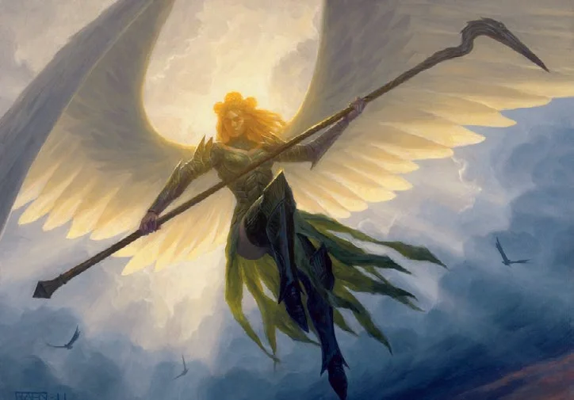

### Krezk

This fortified village is dominated by the Abbey of Saint Traft (replacing Saint Markovia), which is a madhouse. The abbey is named for an ancient saint who fought demons alongside the host of Avacyn. For all his bravery and zeal, Traft was betrayed by a demon and slain, and his spirit never entered the Blessed Sleep.

The approach of Emrakul has filled the abbey to overflowing, and physical corruption commensurate with the growing madness has transformed unfortunate victims into creatures akin to the mongrelfolk of the *Curse of Strahd* adventure. The abbess of the madhouse is an angel who once fought alongside Saint Traft, and who has descended into utter madness since the ancient saint's death.

### Tsolenka Pass—The Needle's Eye

The Needle's Eye traverses the Midland Range to connect Stensia's outland valleys and inland valleys. Its proximity to Ashmouth means it is haunted by demons, including the **vrocks** atop the gatehouse wall. Far worse, replacing the roc of Mount Ghakis, is the **Demonlord of Ashmouth**, a terrible and ancient fiend. It uses the statistics of a horned devil, except that it uses a battleaxe instead of a fork.

### The Ruins of Berez

An ancient crone here is dedicated to destroying the Keepers of the Feather, the witches that inhabit the Wizard of Wines.

### Van Richten's Tower—Rem Karolus's Tower

The legendary monster hunter Rem Karolus, called the Blade of the Inquisitors, has become more interested in hunting angels than werewolves. But his protégé Kastinne (replacing the adventure's Ezmerelda) carries on his work while she searches for her mentor. After a demon killed her children and imprisoned their souls, Kastinne left her home among the Bitterhearts and adopted the lifestyle of a wandering monk. Swearing a vow that most called mad, she descended into the ghastly network of caves below Stensia, bent on killing the demon and liberating her children's souls. Against all odds, she emerged triumphant from the caverns to take up a life of demon hunting. She has trained and worked with Rem Karolus ever since.

The dragon that appears if characters fail to correctly open the door to Karolus's tower is a balefire dragon, but with the statistics of a **young blue dragon**.

### The Wizard of Wines and Wereravens

The Martikov family who run this winery made a pact with a raven spirit of the Somberwald and became forcemages, forming the nucleus of the Keepers of the Feather. These witches stand on the side of humanity against the horrors of Innistrad, and against Strefan Maurer specifically. Their pact gives them magical power, supplemented by their extensive knowledge of herbalism.

The **druids** and blights here come from Yester Hill.

### The Amber Temple—The Moonsilver Temple

This ancient structure predates any of the known peoples and cultures of Innistrad. The good-aligned wizards who built it anticipated the Helvault by entrapping semidivine evil forces in silver-lined prisons. Everywhere in the temple that amber is described, use silver instead. Both the **arcanaloth** and the **death slaad** here are various forms of Innistrad demons.

### Yester Hill

Led by an elder named Rimheit, a group of druids and berserkers dwells atop this hill, revering an ancient yew spirit that inhabits a Gulthias tree. These people dwelled in Stensia long before the current inhabitants came across the mountains and built their villages. The yew spirit is the source of the blights (including the tree blights sometimes called lumberknots) that plague the valleys.

### Werewolf Den

The werewolves are a branch of the Mondronen howlpack, who practice dark forms of blood magic.

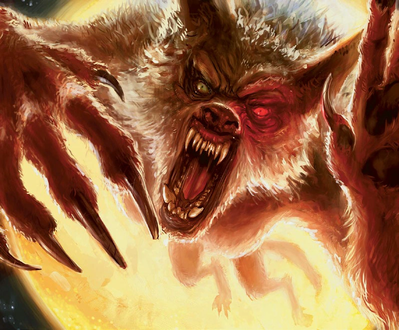

### Rahadin and the Dusk Elves—The Dusken Line

Innistrad has no dusk elves, so their role in the adventure is played by a line of vampires called the Duskens, named after their long-lost progenitor Irska Dusken. Strefan killed Irska centuries ago and scattered the Duskens. Some were subjugated, while others went to live among the Bitterhearts.

Rahadin has been serving the Maurer family for many years, and even helped Strefan subjugate the rest of his line. He appears human rather than elf-like, and dresses in red finery rather than wearing black armor.

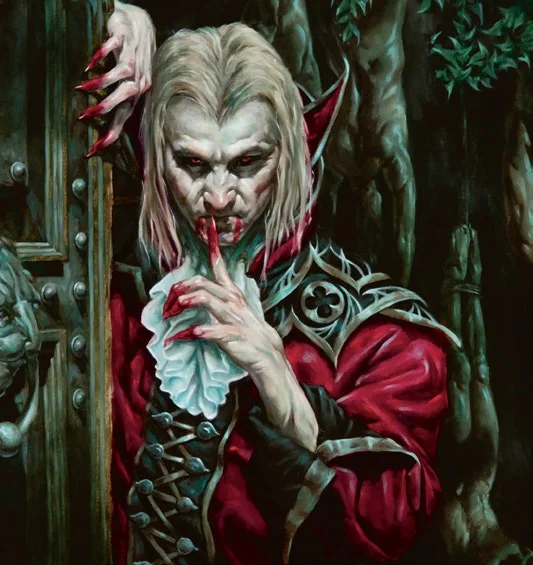

### Adventure Hooks

You can adapt the adventure hooks found in *Curse of Strahd* as follows.

***Plea for Help.*** Arrigal is one of the Bitterhearts, and neither his clothing nor his accent are particularly outlandish. He comes to the adventurers when they are in the inland valleys of Stensia, perhaps in Silbern or Wollebank. The people there know that these Bitterhearts come from the outland valleys. The hook is otherwise unchanged.

***Mysterious Visitors.*** The scene described here takes place in Wollebank in the inland valleys. Instead of Lady Morwen, the characters dine with Deigenhard, the mayor of Wollebank. Deigenhard is familiar with the Bitterhearts and believes they are little more than bandits, so he asks the player characters to get them moving on their way. If the adventurers follow the Bitterhearts to the outland valleys, they travel northwest along the Somber Road, through the pass of Hofsaddel.

***Werewolves in the Mist.*** Werewolves are spilling out of the Somberwald into the inland valleys and threatening the shepherds and farmers there. The adventurers get information based on their affiliations with organizations on Innistrad (as opposed to the player factions of the D&D Adventurers League). If the characters are closely associated with any of these organizations, they can gain the information and benefits associated with the corresponding player factions:

- In place of the Harpers, use the parish-blades—specifically the Stensian branch, casually called the roadwatchers.
- Instead of the Order of the Gauntlet, use the knight-inquisitors of Saint Raban. Taking their name from the legendary investigator and slayer of werewolves, this order of cathars serves as inquisitors in the classic sense—not slaughtering the populace, but investigating mysteries and secrets. They are detectives, investigators, and delvers into enigmas best left untouched.
- Rather than the Emerald Enclave, use a group of springsages, the archmages of Herons, which includes a number of druids.
- Instead of the Lords' Alliance, use the Quiver of Kessig, who are experts at hunting werewolves. Eravien (a human Kessiger, not a half-elf as in *Curse of Strahd*) tells the adventurers that the werewolves are a branch of the Mondronen howlpack, which practices dark forms of blood magic.
- In place of the Zhentarim, use a criminal syndicate connected with Lord Mayor Herzag of Havengul, a corrupt merchant who allows the illicit underground to flourish for his own personal gain.

The characters' travels in pursuit of the werewolves lead them through the Hofsaddel pass. No fog engulfs them, but they emerge in the outland valleys.

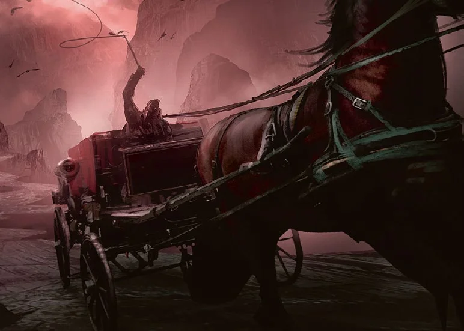

***Creeping Fog.*** Since there are no mists to transport characters to Stensia's outland valleys, this hook doesn't apply if you are running *Curse of Strahd* in Innistrad.

### Creatures and Encounters

Use these guidelines to adapt creatures and encounters throughout the adventure.

***Barovian Scouts.*** The first time the player characters encounter these Somberwald trappers, the group is led by a man named Paulin (whom the players might recognize from flavor text on a handful of cards in the original Innistrad block). He leaves them with some words of wisdom: "Bury your dead deep. The boars are hungriest while the corpse is still warm." (At your discretion, you can also replace **berserkers** with a like number of **giant boars** in a random encounter.)

***Bluto.*** Found on Maurer Lake, Bluto has gone mad under the influence of the approach of Emrakul. He has devoted himself to an aquatic being he believes lives in the depths of the lake—something akin to the Gitrog monster or the squid-like Kralmar worshiped by coastal cults in Nephalia. Bluto has gill-like flaps on his neck. At your discretion, you could introduce an encounter with the creature he worships, which might be something like a **giant crocodile**.

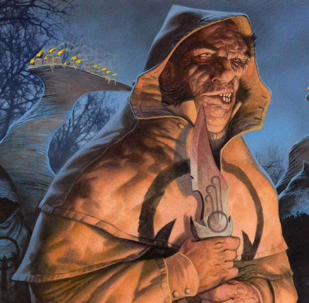

***Mad Mage of Mount Baratok.*** You can use Mordenkainen as written in *Curse of Strahd*. Or, in a twisted nod to the storyline of *Shadows over Innistrad*, this mad planeswalking mage could be Jace Beleren. Create a different list of spells for Jace, focusing on mind-altering and illusion magic.

***Mongrelfolk.*** The statistics of these misshapen creatures are the same, but in appearance, they resemble the corrupted, malformed creatures warped by the influence of Emrakul. Rather than claws, they might attack with tentacles (dealing bludgeoning damage) or extra mouths (dealing piercing damage). No magic can restore a mongrelfolk to its previous form.

***Vampire Spawn.*** Use the **vampire neonate** statistics in this document whenever the adventurers encounter vampire spawn, rather than the **vampire spawn** statistics in the *Monster Manual*. The first time the adventurers encounter exactly two vampire spawn, they meet the infamous twins of Maurer Estate, two young girls named Ruby and Carmine. The two enjoy pretending to be helpless young girls, lost and alone, in order to get close to their prey.

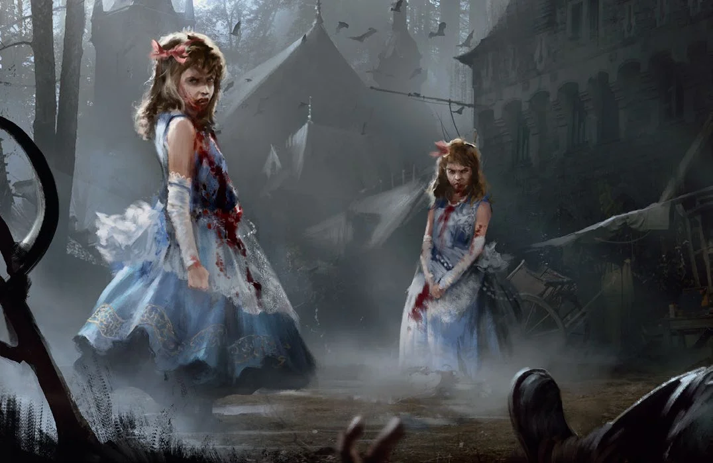

***Wereravens.*** Use the **wereraven** statistics in the adventure, except that the beak attack cannot transmit lycanthropy (since the witches of the Keeper of the Feather are not lycanthropes). Wereravens also have the spellcasting ability of the **druid** presented in the *Monster Manual*.

------

### Credits

- Written by James Wyatt
- Cover art by Adam Paquette
